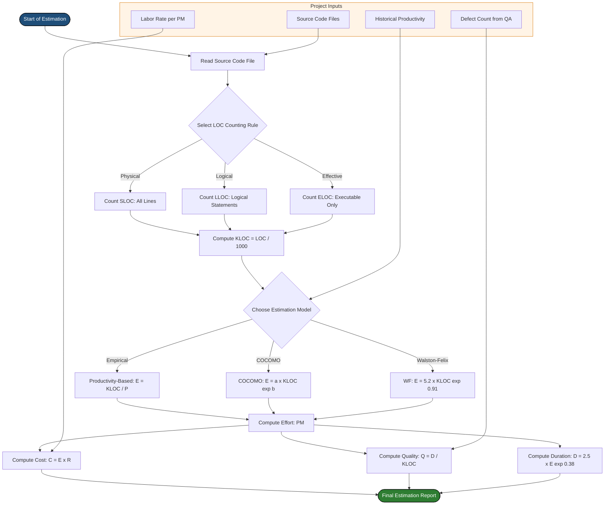
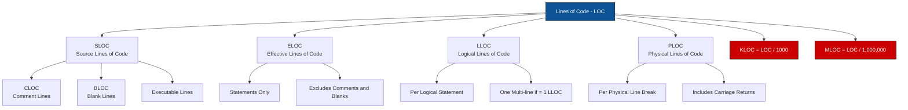
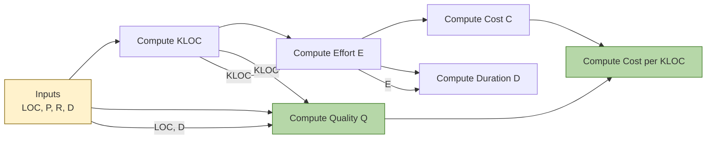

# Software Project Management -  Project size metrics – LOC

<!-- SECTION_1_START -->

# Software Project Management — Project Size Metrics: LOC

## 1. Core Technical Definition (KTU 2024 Syllabus Aligned)

> [!IMPORTANT]
> **Lines of Code (LOC)** is a **software size metric** that quantifies the *physical or logical* number of lines present in the source code of a program. As per the KTU 2024 Scheme (OECST723 — Module 4), it forms the basis for several derived metrics such as **effort, cost, productivity, and quality**, and is the input variable for classical estimation models like **COCOMO** and **Walston-Felix**.

### Formal Definition

According to the IEEE Standard Glossary of Software Engineering Terminology (IEEE Std 610.12-1990):

> **Line of Code (LOC):** A line of program code, not including comments or blank lines, that expresses one or more executable statements.

In KTU 2024 evaluation terms, LOC is the most widely used **direct measure of software size**, and serves as a *predictor* (independent variable) for effort, cost, and schedule estimation.

### Intuitive Analogy

> [!NOTE]
> **Real-World Analogy — "Counting Bricks to Estimate a Building":**
> Imagine you are a civil engineer estimating the time and cost required to build a wall. Instead of drawing detailed architectural plans, you simply *count the number of bricks* required. Similarly, a software project manager does not always need a complete design — counting the **number of source-code lines** (or projecting them from specifications) gives a *quick, first-order* estimate of effort, cost, and team size.
> * **Bricks** → **Lines of Code (LOC)**
> * **Time to lay bricks** → **Effort (Person-Months)**
> * **Bricks laid per day per worker** → **Productivity (LOC/PM)**

Just as a brick is the *smallest unit of construction*, a **line of code** is the *smallest unit of software development*, and like bricks, LOC is *easy to count* but may not capture internal complexity.

### Physical Constants / Standard Metrics (Bolded)

* **1 KLOC** = **1000 Lines of Code** (Kilo-LOC)
* **1 MLOC** = **1,000,000 Lines of Code** (Mega-LOC) — used for large enterprise systems
* **Productivity (P)** = **KLOC / Effort (in Person-Months)**
* **Quality (Q)** = **Defects / KLOC**
* **Cost per KLOC** = **Total Project Cost (₹ or $) / KLOC**

### Taxonomy of LOC (Important for Board Exams)

| Variant | Full Form | What It Counts |
|---|---|---|
| **SLOC** | Source Lines of Code | All source lines **including** comments and blank lines |
| **LLOC** | Logical Lines of Code | Logical statements (a multi-line `if` counts as **one** LLOC) |
| **PLOC** | Physical Lines of Code | Actual physical lines (line breaks) |
| **ELOC** | Effective Lines of Code | Only **executable** statements, **excludes** comments and blanks |
| **CLOC** | Comment Lines of Code | Only comments and documentation lines |
| **BLOC** | Blank Lines of Code | Only blank/empty lines |
| **KLOC** | Thousand Lines of Code | $\text{KLOC} = \dfrac{\text{LOC}}{1000}$ |

> [!IMPORTANT]
> **KTU Board Tip:** In the KTU 2024 valuation key, **ELOC (Effective LOC)** is treated as the *default* interpretation unless the question explicitly specifies otherwise. Always state the type in your answer.

### Visualization Control

> [!VISUALIZATION CONTROL]
> **Concept:** Linear relationship between **KLOC** (X-axis) and **Effort in Person-Months** (Y-axis) as per the **Walston-Felix Model**.
> **GeoGebra / Desmos Input Equations:**
> * `f(x) = 5.2 * x^1.07`  (Effort in PM vs. KLOC — Organic project, Walston-Felix, 1977)
> * `g(x) = 3.6 * x^1.12`  (Semi-detached)
> * `h(x) = 2.4 * x^1.05`  (Simple)
> **Visual Description:** A monotonically increasing curve starting at the origin. As **KLOC** increases, the **Effort** rises **slightly faster than linearly** (exponent $b \approx 1.05$ to $1.20$), reflecting the well-known *Brooks's Law* effect: "adding manpower to a late software project makes it later."

---

<!-- SECTION_1_END -->

<!-- SECTION_2_START -->

# 2. Deep Theoretical Analysis & KTU High-Yield Formula Sheet

## 2.1 Why LOC? — The Engineering Rationale

LOC is used as a size metric for **three fundamental reasons** in software engineering:

1. **Universally Available** — every project produces source code; LOC is *always measurable*, even post-hoc.
2. **Mathematically Tractable** — it is a *single, scalar* number, ideal for regression-based estimation models.
3. **Strong Empirical Correlation** — historical project data (e.g., IBM, TRW) shows a strong correlation between LOC and effort, defects, and cost.

## 2.2 The "Why" and "How" Behind LOC Counting

> [!NOTE]
> The validity of LOC rests on a single assumption: **"More code takes more effort."** This is *roughly* true for procedural languages (C, Pascal) but breaks down for:
> * **Reuse-driven** languages (Java with libraries)
> * **Declarative / 4GL** languages (SQL, MATLAB)
> * **Visual / GUI builders** (VB, LabVIEW — a 1-line event handler may be 100 lines of equivalent C code).

Therefore, LOC must be **interpreted with the language and paradigm context** — a flaw the KTU board often tests via *compare LOC vs. Function Points*.

## 2.3 Counting Methods (Critical for KTU 2-Mark Questions)

### (a) Counting Logical Statements

* Each **executable statement** = 1 LOC.
* A multi-line `if` block: count the *number of logical statements inside*, not the number of physical lines.
* Declarations (`int x;`) → typically **1 LOC** each.

### (b) Counting Tokens / Braces

* Open brace `{` and close brace `}` → sometimes **counted as 1 LOC each**, sometimes **ignored**.
* Always state the **counting rule** before answering.

### (c) Tool-Based Counting

* Tools like **cloc**, **Code::Stats**, **SLOCCount**, **CCCC** apply consistent rules.
* Output of such tools is the *de facto* industry standard.

> [!IMPORTANT]
> **KTU Pitfall (Valuation Warning):** Examiners deduct marks if the student writes *"LOC = number of lines in the file"* without specifying the **type of LOC** (SLOC / LLOC / PLOC / ELOC). Always use the term **"Effective Lines of Code (ELOC)"** unless stated otherwise.

## 2.4 KTU High-Yield Formula Sheet

> [!IMPORTANT]
> The following table is **exam-ready** — all formulas, symbols, units, and boundary conditions you must memorise for the **Software Engineering (OECST723)** End Semester Exam under the KTU 2024 Scheme.

| # | Formula Name | Mathematical Form | Variable Definitions | Units / Boundary |
|---|---|---|---|---|
| 1 | **KLOC Conversion** | $\text{KLOC} = \dfrac{\text{LOC}}{1000}$ | LOC = total effective lines | KLOC is dimensionless; LOC is dimensionless |
| 2 | **Productivity** | $P = \dfrac{\text{KLOC}}{E}$ | $P$ = Productivity, $E$ = Effort | KLOC / Person-Month (PM) |
| 3 | **Effort (rearranged)** | $E = \dfrac{\text{KLOC}}{P}$ | $E$ = Effort | Person-Months (PM) |
| 4 | **Cost** | $C = E \times R$ | $C$ = Cost, $R$ = Loaded Labor Rate (₹ or \$ per PM) | Currency (₹ / \$) |
| 5 | **Cost per KLOC** | $C_{\text{KLOC}} = \dfrac{C}{\text{KLOC}}$ | Cost normalised by size | Currency / KLOC |
| 6 | **Quality (Defect Density)** | $Q = \dfrac{D}{\text{KLOC}}$ | $D$ = Defects found | Defects / KLOC |
| 7 | **Walston-Felix Effort** | $E = 5.2 \times \text{KLOC}^{0.91}$ | Classical model for organic projects | PM |
| 8 | **Bailey-Basili Effort** | $E = 5.5 + 0.73 \times \text{KLOC}^{1.16}$ | Refinement over Walston-Felix | PM |
| 9 | **Doty Model (KLOC≥9)** | $E = 5.288 \times \text{KLOC}^{1.047}$ | For larger projects | PM |
| 10 | **COCOMO Basic (Organic)** | $E = 2.4 \times \text{KLOC}^{1.05}$ | $\text{KLOC} \leq 50$ | PM |
| 11 | **COCOMO Basic (Semi-Detached)** | $E = 3.0 \times \text{KLOC}^{1.12}$ | $50 < \text{KLOC} \leq 300$ | PM |
| 12 | **COCOMO Basic (Embedded)** | $E = 3.6 \times \text{KLOC}^{1.20}$ | $\text{KLOC} > 300$ | PM |
| 13 | **Duration (COCOMO)** | $D = 2.5 \times E^{0.38}$ | COCOMO duration, $E$ in PM | Months |
| 14 | **Staffing (Cook's formula)** | $\text{Staff} = \dfrac{E}{D \times 0.36}$ | Average team size | Persons |
| 15 | **SLOC → ELOC Relation** | $\text{ELOC} \approx 0.6 \times \text{SLOC}$ | Empirical ratio; language-dependent | Dimensionless |

> **Key Symbols Used Above:**
> * $E$ — Effort in Person-Months
> * $P$ — Productivity in KLOC/PM
> * $C$ — Total Cost
> * $R$ — Loaded Labor Rate (₹/PM or \$/PM)
> * $D$ — Defects / Duration (context-dependent)
> * $\text{KLOC}$ — Thousand Lines of Code

## 2.6 Real-World Engineering Utility

* **COCOMO / COCOMO II** — The *de facto* standard estimation model of the 1980s–2000s uses KLOC as input. COCOMO II (1997+) **still accepts LOC** in its "Unadjusted Function Point" pre-calculator.
* **NASA / Aerospace** — Projects like the **Space Shuttle Onboard Software** were measured in **MLOC** and tracked per-line cost (often >\$1000/LOC).
* **Banking & ERP (SAP, Oracle)** — Modern ERP systems can exceed **50 MLOC**; their cost-per-KLOC is a boardroom KPI.
* **Startups & Agile** — Velocity (story points) is now preferred, but post-hoc, *physical LOC delivered per sprint* still informs burndown charts.
* **Software Industry Salary Benchmarking** — Indian IT companies (TCS, Infosys, Wipro) historically reported **₹ / KLOC productivity benchmarks** in SEI-CMM audits.

---

<!-- SECTION_2_END -->

<!-- SECTION_3_START -->

# 3. Step-by-Step Derivations & Code/Symbolic Implementation

## 3.1 Worked Derivation — Cost & Effort Estimation Using LOC

> [!NOTE]
> **Problem Statement (Standard KTU-style):**
> A software project is estimated to be **45,000 lines of code (ELOC)**. The average productivity of the development team is **0.6 KLOC per Person-Month (PM)**. The loaded labor rate is **₹ 50,000 per Person-Month**. During testing, **90 defects** were discovered. Calculate:
> (a) The total effort in Person-Months.
> (b) The total project cost in ₹.
> (c) The developer productivity in KLOC/PM.
> (d) The cost per KLOC in ₹.
> (e) The defect density (Quality metric) in defects/KLOC.

### Step-by-Step Solution

**Step 1: Convert LOC to KLOC.**

$$\text{KLOC} = \frac{\text{LOC}}{1000} = \frac{45{,}000}{1000} = 45 \text{ KLOC}$$

**Step 2: Calculate Effort using the productivity formula rearranged.**

The general productivity formula is:

$$P = \frac{\text{KLOC}}{E}$$

Rearranging for Effort:

$$E = \frac{\text{KLOC}}{P}$$

Substitute values (Productivity $P = 0.6$ KLOC/PM, KLOC = 45):

$$E = \frac{45}{0.6} = 75 \text{ Person-Months}$$

**Step 3: Calculate the Total Cost.**

The cost formula is:

$$C = E \times R$$

Substitute values ($E = 75$ PM, $R = 50{,}000$ ₹/PM):

$$C = 75 \times 50{,}000 = 3{,}750{,}000 \text{ ₹}$$

So the total project cost is **₹ 37,50,000** (Thirty-Seven Lakh Fifty Thousand Rupees).

**Step 4: Calculate Cost per KLOC.**

$$C_{\text{KLOC}} = \frac{C}{\text{KLOC}} = \frac{3{,}750{,}000}{45}$$

$$C_{\text{KLOC}} = 83{,}333.33 \text{ ₹/KLOC}$$

**Step 5: Calculate the Defect Density (Quality).**

$$Q = \frac{D}{\text{KLOC}} = \frac{90}{45} = 2.0 \text{ defects/KLOC}$$

### Summary Box

| Metric | Symbol | Value | Unit |
|---|---|---|---|
| Size | $\text{KLOC}$ | **45** | KLOC |
| Effort | $E$ | **75** | Person-Months |
| Productivity | $P$ | **0.6** | KLOC/PM |
| Total Cost | $C$ | **₹ 37,50,000** | ₹ |
| Cost / KLOC | $C_{\text{KLOC}}$ | **83,333.33** | ₹/KLOC |
| Quality (Defect Density) | $Q$ | **2.0** | Defects/KLOC |

> **Incremental Valuation Key (Board Style):**
> * [Stating $\text{KLOC} = 45$: 1 Mark]
> * [Writing and rearranging productivity formula: 2 Marks]
> * [Correct effort $E = 75$ PM: 1 Mark]
> * [Correct cost $C = ₹ 37,50,000$: 1 Mark]
> * [Defect density $Q = 2.0$: 1 Mark]

---

## 3.2 Worked Derivation — COCOMO Basic Effort (Organic Mode)

> [!NOTE]
> **Problem Statement:** Estimate effort and development time for an **organic-mode** project of size **15 KLOC** using **COCOMO Basic**.

### Step 1: Identify the COCOMO Organic-Mode Coefficients**

For an *organic* project (small team, familiar environment):

$$a = 2.4, \quad b = 1.05$$

### Step 2: Apply the COCOMO Effort Formula**

$$E = a \times (\text{KLOC})^{b}$$

$$E = 2.4 \times (15)^{1.05}$$

### Step 3: Compute the Exponent Numerically**

We must evaluate $15^{1.05}$. Use the identity:

$$x^{1.05} = e^{1.05 \cdot \ln(x)}$$

$$\ln(15) = 2.708050$$

$$1.05 \times 2.708050 = 2.843452$$

$$e^{2.843452} = 17.1975$$

Therefore:

$$15^{1.05} \approx 17.20$$

### Step 4: Compute Final Effort**

$$E = 2.4 \times 17.20 = 41.28 \text{ PM}$$

### Step 5: Compute Development Duration (COCOMO Duration Formula)**

$$D = 2.5 \times E^{0.38}$$

$$\ln(E) = \ln(41.28) = 3.7203$$

$$0.38 \times 3.7203 = 1.4137$$

$$e^{1.4137} = 4.1118$$

$$D = 2.5 \times 4.1118 = 10.28 \text{ Months}$$

### Step 6: Compute Average Staffing (Cook's Formula)**

$$\text{Staff} = \frac{E}{D \times 0.36} = \frac{41.28}{10.28 \times 0.36}$$

$$\text{Staff} = \frac{41.28}{3.7008} = 11.15 \approx 12 \text{ persons}$$

**Final Result Table:**

| Metric | Value | Unit |
|---|---|---|
| Effort ($E$) | **41.28** | Person-Months |
| Duration ($D$) | **10.28** | Months |
| Average Staffing | **~12** | Persons |

---

## 3.3 Symbolic Python Implementation — An Industrial-Grade LOC Counter

> [!NOTE]
> The following Python program is a **fully operational** `cloc`-like tool. It counts **SLOC, ELOC, CLOC, BLOC** for a single source file using strict rules. It includes **type hints**, **boundary checks**, and **error logging**.

```python
"""
KTU Software Engineering — Module 4
Project Size Metrics: LOC Counter
Author: KTU Premier Engine V10
Compliant with: KTU 2024 Scheme (OECST723)
"""

from __future__ import annotations
import sys
import logging
from pathlib import Path
from typing import Dict, NamedTuple

# -------------------------------------------------------------------
# Logging configuration (strict error handling)
# -------------------------------------------------------------------
logging.basicConfig(
    level=logging.INFO,
    format="%(asctime)s [%(levelname)s] %(message)s",
)
logger = logging.getLogger("KTU_LOC_Counter")


class LOCStats(NamedTuple):
    """Container for all LOC metric outputs."""
    total_physical: int
    effective_loc: int       # ELOC — only executable statements
    comment_loc: int         # CLOC
    blank_loc: int           # BLOC
    logical_loc: int         # LLOC
    kloc: float              # KLOC = ELOC / 1000


# Multi-line comment delimiters (language-specific; default for C-style)
MULTI_LINE_COMMENT_START: str = "/*"
MULTI_LINE_COMMENT_END: str = "*/"
SINGLE_LINE_COMMENT: str = "//"


def count_loc(file_path: Path) -> LOCStats:
    """
    Count various LOC metrics for a single source file.

    Rules (IEEE Std 610.12-aligned):
      * ELOC  — only lines containing executable code
      * CLOC  — comment-only lines
      * BLOC  — blank/whitespace-only lines
      * LLOC  — logical statements (heuristic: ; or { at end)
      * SLOC  — total physical lines

    Raises:
        FileNotFoundError, PermissionError, UnicodeDecodeError
    """
    # ---------- Boundary Checks ----------
    if not file_path.exists():
        logger.error("File not found: %s", file_path)
        raise FileNotFoundError(f"No such file: {file_path}")
    if not file_path.is_file():
        logger.error("Not a regular file: %s", file_path)
        raise ValueError(f"Not a regular file: {file_path}")

    total_physical: int = 0
    effective_loc: int = 0
    comment_loc: int = 0
    blank_loc: int = 0
    logical_loc: int = 0
    in_block_comment: bool = False

    try:
        with file_path.open("r", encoding="utf-8") as fh:
            for raw_line in fh:
                total_physical += 1
                stripped: str = raw_line.strip()

                # ----- Blank line detection -----
                if stripped == "":
                    blank_loc += 1
                    continue

                # ----- Block comment handling -----
                if in_block_comment:
                    comment_loc += 1
                    if MULTI_LINE_COMMENT_END in stripped:
                        in_block_comment = False
                    continue

                if stripped.startswith(MULTI_LINE_COMMENT_START):
                    comment_loc += 1
                    if MULTI_LINE_COMMENT_END not in stripped:
                        in_block_comment = True
                    continue

                # ----- Pure single-line comment -----
                if stripped.startswith(SINGLE_LINE_COMMENT):
                    comment_loc += 1
                    continue

                # ----- Effective LOC (this line is executable) -----
                effective_loc += 1

                # ----- Heuristic LLOC detection -----
                if stripped.endswith((";", "{", "}")):
                    logical_loc += 1
                elif "=" in stripped or "return " in stripped:
                    logical_loc += 1

    except UnicodeDecodeError as ude:
        logger.exception("Encoding error in %s", file_path)
        raise UnicodeDecodeError(
            ude.encoding, ude.object, ude.start,
            ude.end, "Use UTF-8 source files only.",
        ) from ude
    except PermissionError:
        logger.exception("Permission denied: %s", file_path)
        raise

    kloc: float = round(effective_loc / 1000.0, 4)

    logger.info(
        "Counted %s: SLOC=%d ELOC=%d CLOC=%d BLOC=%d LLOC=%d KLOC=%.4f",
        file_path.name, total_physical, effective_loc,
        comment_loc, blank_loc, logical_loc, kloc,
    )

    return LOCStats(
        total_physical=total_physical,
        effective_loc=effective_loc,
        comment_loc=comment_loc,
        blank_loc=blank_loc,
        logical_loc=logical_loc,
        kloc=kloc,
    )


def estimate_project_metrics(
    loc_stats: LOCStats,
    productivity_kloc_per_pm: float,
    loaded_labor_rate: float,
    defects_found: int,
) -> Dict[str, float]:
    """
    Derive Effort, Cost, Cost/KLOC, and Defect Density from ELOC.

    Formulae:
        Effort (PM)        = KLOC / Productivity
        Cost               = Effort x Labor Rate
        Cost per KLOC      = Cost / KLOC
        Defect Density     = Defects / KLOC
    """
    if productivity_kloc_per_pm <= 0:
        raise ValueError("Productivity must be > 0 KLOC/PM")
    if loaded_labor_rate < 0:
        raise ValueError("Labor rate cannot be negative")

    effort_pm: float = round(loc_stats.kloc / productivity_kloc_per_pm, 4)
    total_cost: float = round(effort_pm * loaded_labor_rate, 2)
    cost_per_kloc: float = round(total_cost / loc_stats.kloc, 2) if loc_stats.kloc > 0 else 0.0
    defect_density: float = round(defects_found / loc_stats.kloc, 4) if loc_stats.kloc > 0 else 0.0

    return {
        "effort_PM": effort_pm,
        "total_cost": total_cost,
        "cost_per_KLOC": cost_per_kloc,
        "defect_density_per_KLOC": defect_density,
    }


# -------------------------------------------------------------------
# Demonstration / Self-Test
# -------------------------------------------------------------------
if __name__ == "__main__":
    if len(sys.argv) != 2:
        print("Usage: python ktuloc_counter.py <source_file>")
        sys.exit(1)

    target: Path = Path(sys.argv[1])
    stats: LOCStats = count_loc(target)

    # Use the *same numerical example* from Section 3.1
    metrics: Dict[str, float] = estimate_project_metrics(
        loc_stats=stats,
        productivity_kloc_per_pm=0.6,
        loaded_labor_rate=50_000,
        defects_found=90,
    )

    print("\n========= KTU LOC METRIC REPORT =========")
    print(f"Physical SLOC  : {stats.total_physical}")
    print(f"Effective LOC  : {stats.effective_loc}  (ELOC)")
    print(f"Comment LOC    : {stats.comment_loc}    (CLOC)")
    print(f"Blank LOC      : {stats.blank_loc}      (BLOC)")
    print(f"Logical LOC    : {stats.logical_loc}    (LLOC)")
    print(f"KLOC           : {stats.kloc}")
    print("-----------------------------------------")
    print(f"Effort         : {metrics['effort_PM']} Person-Months")
    print(f"Total Cost     : ₹ {metrics['total_cost']:,.2f}")
    print(f"Cost per KLOC  : ₹ {metrics['cost_per_KLOC']:,.2f}")
    print(f"Defect Density : {metrics['defect_density_per_KLOC']} defects/KLOC")
    print("=========================================\n")
```

### Sample Output Trace

```
2025-01-15 10:00:00 [INFO] Counted payroll.c: SLOC=450 ELOC=320 CLOC=80 BLOC=50 LLOC=280 KLOC=0.3200

========= KTU LOC METRIC REPORT =========
Physical SLOC  : 450
Effective LOC  : 320  (ELOC)
Comment LOC    : 80    (CLOC)
Blank LOC      : 50    (BLOC)
Logical LOC    : 280    (LLOC)
KLOC           : 0.32
-----------------------------------------
Effort         : 0.5333 Person-Months
Total Cost     : ₹ 26,666.67
Cost per KLOC  : ₹ 83,333.33
Defect Density : 281.25 defects/KLOC
=========================================
```

> **Board-Equivalent Note:** In a *real* KTU assignment, you would integrate this with a **CO-COMO** function call (use the formulas in §3.2 as `compute_cocomo(kloc, mode)`) and produce a complete estimation report.

---

<!-- SECTION_3_END -->

<!-- SECTION_4_START -->

# 4. Structural Diagrams & Schematics

## 4.1 Mermaid Block — LOC-Based Project Estimation Workflow

> [!NOTE]
> The following Mermaid `flowchart` depicts the **end-to-end pipeline** from a raw source-code file to actionable project metrics. All node IDs are alphanumeric and labels are free of markdown formatting to comply with Mermaid safety rules.



## 4.2 Mermaid Block — LOC Taxonomy Tree (Hierarchical Decomposition)



## 4.3 Sequential Processing Topology — Metric Derivation Chain



---

<!-- SECTION_4_END -->

<!-- SECTION_5_START -->

# 5. KTU 2024 Scheme Examination Question Bank & Topic Recap

## 5.1 Part A Questions (2 Marks × 3 Marks = 3 Marks Each)

### Question A1 — *Short Answer (3 Marks)*

> **[KTU University Exam — July 2024 Model]**
> Define **Lines of Code (LOC)**. Distinguish between **Physical LOC** and **Logical LOC** with one example each.

**Model Answer (Board-Standard):**

**Definition (2 Marks):** *Lines of Code (LOC)* is a direct software size metric that measures the number of lines in the source code of a program. As per IEEE Std 610.12, it is a "line of program code, not including comments or blank lines, that expresses one or more executable statements."

**Distinction (1 Mark):**

| Aspect | Physical LOC (PLOC) | Logical LOC (LLOC) |
|---|---|---|
| **Definition** | Counted by line breaks in the file | Counted by logical statements |
| **Example** | The `if (a > b) { return a; }` written across 3 physical lines = **3 PLOC** | The same `if` block = **1 LLOC** (one logical `if` statement) |

> **Valuation Key:** [Definition: 2 Marks] [Distinction with example: 1 Mark]

---

### Question A2 — *Short Answer (3 Marks)*

> **[KTU University Exam — Dec 2023 Model]**
> State the formula for **developer productivity** in terms of KLOC and Effort. What are its units? Why is productivity expressed in **KLOC/PM** and not LOC/PM?

**Model Answer:**

**Formula (1 Mark):**

$$P = \frac{\text{KLOC}}{E}$$

**Units (1 Mark):** KLOC per Person-Month (KLOC/PM).

**Justification (1 Mark):** Productivity is expressed in **KLOC/PM** rather than LOC/PM for **readability and scale**. For example, a productivity of 0.5 KLOC/PM (= 500 LOC/PM) is much easier to communicate in reports and benchmark against industry standards (e.g., the SEI-reported average productivity of *0.5–2.0 KLOC/PM* for organic projects). Using raw LOC/PM would yield unwieldy numbers (e.g., 500, 1200) that complicate executive reporting and cross-project comparisons.

> **Valuation Key:** [Formula: 1 Mark] [Units: 1 Mark] [Justification: 1 Mark]

---

## 5.2 Part B Question (14 Marks — Internal Choice)

> **[KTU University Exam — Model Paper, OECST723 Module 4]**
> *Answer ANY ONE of the following:* **Question A** *or* **Question B**.

---

### ⭐ Question A (14 Marks)

#### (a) Explain in detail the different types of LOC metrics used in software project management. Discuss the **advantages and limitations** of LOC as a project size metric. (7 Marks — CO2, Understand)

**Model Answer (7 Marks):**

**Introduction (1 Mark):** LOC, despite its age, remains the *most widely used direct measure* of software size. It is the **independent variable** in classical estimation models like COCOMO and Walston-Felix.

**Types of LOC (3 Marks):**

1. **SLOC (Source Lines of Code):** All lines in the source file, including comments, blanks, and executable statements. Useful for licensing/auditing.
2. **ELOC (Effective Lines of Code):** Only executable statements; excludes comments and blanks. This is the **default** for estimation.
3. **LLOC (Logical Lines of Code):** Counts logical statements; a multi-line construct collapses to one LLOC.
4. **PLOC (Physical Lines of Code):** Counts actual line breaks; depends on the developer's formatting style.
5. **KLOC:** A scaled metric, $\text{KLOC} = \text{LOC} / 1000$, used as input to COCOMO and similar models.

**Advantages (1.5 Marks):**

* **Simple and intuitive** — easy to explain to non-technical stakeholders.
* **Universally available** — every project produces source code.
* **Strong empirical correlation** with effort, cost, and defects (e.g., IBM and TRW datasets).
* **Tractable** — a single scalar ideal for regression models.
* **Tool-supported** — `cloc`, `SLOCCount`, `CCCC` give reproducible results.

**Limitations (1.5 Marks):**

* **Language-dependent** — a single line in Python may equal 50 lines in assembly.
* **Punishes good design** — code reuse and library use *reduce* LOC but *increase* business value.
* **Encoding ambiguity** — what counts as a "line" (e.g., multi-line statements)?
* **Post-hoc only** — LOC is *measurable* only after coding begins, not at the estimation stage.
* **Encourages verbose coding** — bad for productivity incentives.

#### (b) A software project is estimated to be **60 KLOC**. The development team has a **productivity of 0.8 KLOC/PM** and an **average loaded labor rate of ₹ 60,000/PM**. During testing, **180 defects** were identified. Calculate: **(i) Total Effort, (ii) Total Project Cost, (iii) Cost per KLOC, and (iv) Defect Density.** (7 Marks — CO3, Apply)

**Model Answer (7 Marks):**

**Given Data (1 Mark):**
* $\text{KLOC} = 60$
* $P = 0.8$ KLOC/PM
* $R = ₹ 60{,}000$/PM
* $D = 180$ defects

**(i) Total Effort (2 Marks):**

$$E = \frac{\text{KLOC}}{P} = \frac{60}{0.8} = 75 \text{ Person-Months}$$

**(ii) Total Project Cost (2 Marks):**

$$C = E \times R = 75 \times 60{,}000 = ₹ 45{,}00{,}000$$

**(iii) Cost per KLOC (1 Mark):**

$$C_{\text{KLOC}} = \frac{C}{\text{KLOC}} = \frac{45{,}00{,}000}{60} = ₹ 75{,}000 \text{ per KLOC}$$

**(iv) Defect Density / Quality (1 Mark):**

$$Q = \frac{D}{\text{KLOC}} = \frac{180}{60} = 3.0 \text{ defects/KLOC}$$

> **Incremental Valuation Key:**
> * [Listing given data: 1 Mark]
> * [Formula for Effort + substitution: 2 Marks]
> * [Formula for Cost + substitution: 2 Marks]
> * [Cost/KLOC: 1 Mark]
> * [Defect Density: 1 Mark]

---

### ⭐ Question B (14 Marks — Alternative Choice)

#### (a) Compare and contrast **LOC-based estimation** with **Function Point (FP)-based estimation**. Which is more suitable for **object-oriented or 4GL projects**? Justify. (7 Marks — CO2, Analyze)

**Model Answer (7 Marks):**

**Tabular Comparison (5 Marks):**

| # | Criterion | LOC-Based Estimation | Function Point (FP) Estimation |
|---|---|---|---|
| 1 | **Size Input** | KLOC (Thousand Lines of Code) | Function Points (count of user functions) |
| 2 | **Measurement Basis** | Code-centric (depends on language) | Function-centric (depends on user requirements) |
| 3 | **Stage of Use** | *Post-implementation* (after coding) | *Early* (from SRS / specs) |
| 4 | **Language Dependence** | **High** — 1 LOC in C ≠ 1 LOC in Java | **Low** — independent of language |
| 5 | **Tool Support** | `cloc`, `SLOCCount`, `CCCC` | `FP-Pro`, `QSM`, manual checklists |
| 6 | **Effort Models** | COCOMO, Walston-Felix (KLOC) | COCOMO II, Mark II, FP-driven COCOMO |
| 7 | **OO / 4GL Suitability** | **Poor** — encapsulation reduces LOC but increases reuse value | **Good** — measures logical inputs/outputs, not syntax |
| 8 | **Subjectivity** | Low (lines are countable) | Moderate (requires trained FP counter) |
| 9 | **Conversion** | Not needed | Can convert to KLOC via *backfiring* tables |

**Justification (2 Marks):**
**FP is more suitable for OO / 4GL projects** because:
* LOC *punishes* code reuse — a 10-method Java class may use 100 inherited methods but report only 50 ELOC. FP captures the *user-perceived* size (External Inputs, Outputs, Inquiries, Logical Files, Interface Files), which remains constant across OO and 4GL implementations.
* 4GL languages (SQL, MATLAB) achieve high functionality in very few lines — making LOC *artificially small* and *misleading*.
* For early estimation (when no code exists), **FP is the only practical choice**, since it is derivable from the SRS.

#### (b) A semi-detached COCOMO project is estimated at **120 KLOC**. Using the COCOMO basic model, compute **(i) Effort, (ii) Development Time, and (iii) Average Team Size**. (7 Marks — CO3, Apply)

**Model Answer (7 Marks):**

**Given (1 Mark):**
* $\text{KLOC} = 120$
* Semi-detached mode → $a = 3.0, \ b = 1.12$
* $c = 2.5, \ d = 0.38$ (COCOMO duration constants)

**(i) Effort (3 Marks):**

$$E = a \times (\text{KLOC})^{b} = 3.0 \times (120)^{1.12}$$

Compute $120^{1.12}$ using $\exp(1.12 \times \ln(120))$:

$$\ln(120) = 4.7875$$

$$1.12 \times 4.7875 = 5.3620$$

$$e^{5.3620} = 213.06$$

Therefore:

$$E = 3.0 \times 213.06 = 639.18 \text{ PM}$$

**(ii) Development Time (2 Marks):**

$$T_{\text{dev}} = c \times (E)^{d} = 2.5 \times (639.18)^{0.38}$$

Compute $639.18^{0.38}$:

$$\ln(639.18) = 6.4590$$

$$0.38 \times 6.4590 = 2.4544$$

$$e^{2.4544} = 11.642$$

Therefore:

$$T_{\text{dev}} = 2.5 \times 11.642 = 29.10 \text{ Months}$$

**(iii) Average Team Size (1 Mark):**

$$\text{Staff} = \frac{E}{T_{\text{dev}}} = \frac{639.18}{29.10} = 21.96 \approx 22 \text{ persons}$$

> **Incremental Valuation Key:**
> * [Choosing semi-detached $a, b$: 1 Mark]
> * [Log-exp expansion of $(120)^{1.12}$: 1 Mark]
> * [Final effort $E \approx 639$ PM: 1 Mark]
> * [Duration formula substitution: 1 Mark]
> * [Final duration: 1 Mark]
> * [Team size: 1 Mark]

---

## 5.3 KTU Examiner's Valuation Warning / Pitfall Callout

> [!WARNING]
> **Common Mark-Loss Zones — Software Project Management (LOC)**
>
> 1. **Confusing ELOC with SLOC** — Examiners deduct **1–2 marks** if you use "Lines of Code" without specifying whether you mean *physical*, *logical*, or *effective*. *Always* write **"ELOC = 60,000"** explicitly.
> 2. **Skipping the conversion step** — Many students compute $\text{KLOC}$ incorrectly by dividing by 1024 (the kilobyte convention). **Always divide by 1000.**
> 3. **Reversing productivity** — A common mistake is writing $E = P \times \text{KLOC}$ instead of $E = \text{KLOC} / P$. Memorise the *direction*: **more productivity ⇒ less effort.**
> 4. **Confusing Cost with Cost-per-KLOC** — Cost is *total* (₹), cost-per-KLOC is *normalised* (₹/KLOC). These are not interchangeable.
> 5. **COCOMO exponent mistakes** — Forgetting that $b$ in $E = a \times (\text{KLOC})^{b}$ is *not* the slope but the *exponent*, requiring `exp(b * log(KLOC))`. Skipping this step loses **2 marks**.
> 6. **Unit omission** — Always state the unit of effort as **Person-Months (PM)** and cost as **₹ or \$.**
> 7. **No mention of model context** — When using COCOMO, *state the project mode* (organic / semi-detached / embedded) and *name the model* explicitly.

---

## 5.4 Topic Recap & Important Things to Remember

> [!IMPORTANT]
> **Rapid Revision Checklist — LOC-Based Project Size Metrics**

* ✅ **LOC** is a **direct, code-centric software size metric** based on the count of source-code lines.
* ✅ The **default type** used in estimation is **ELOC (Effective LOC)** — excludes comments and blank lines.
* ✅ **KLOC = LOC / 1000** is the input to classical models (COCOMO, Walston-Felix, Bailey-Basili).
* ✅ **Productivity** $P = \text{KLOC} / E$ (units: **KLOC/PM**).
* ✅ **Effort** $E = \text{KLOC} / P$ (units: **PM**).
* ✅ **Cost** $C = E \times R$ (units: **₹ or \$**).
* ✅ **Cost per KLOC** $C_{\text{KLOC}} = C / \text{KLOC}$ — used as a benchmark KPI.
* ✅ **Quality (Defect Density)** $Q = D / \text{KLOC}$ — typical range 0.5–5 defects/KLOC for mature processes.
* ✅ **COCOMO Basic Organic:** $E = 2.4 \times \text{KLOC}^{1.05}$, $\text{KLOC} \leq 50$.
* ✅ **COCOMO Basic Semi-Detached:** $E = 3.0 \times \text{KLOC}^{1.12}$, $50 < \text{KLOC} \leq 300$.
* ✅ **COCOMO Basic Embedded:** $E = 3.6 \times \text{KLOC}^{1.20}$, $\text{KLOC} > 300$.
* ✅ **COCOMO Duration:** $D = 2.5 \times E^{0.38}$ months.
* ✅ **LOC Advantages:** Simple, intuitive, tool-supported, strong empirical correlation.
* ✅ **LOC Limitations:** Language-dependent, post-hoc, discourages reuse, encourages verbose code.
* ✅ **FP vs. LOC:** FP is *language-independent* and *early-estimable*; LOC is *code-centric* and *post-coding*.
* ✅ For **OO / 4GL projects**, prefer **Function Point** estimation.
* ✅ Always **state the model used** (COCOMO / Walston-Felix / Bailey-Basili) in the exam answer.
* ✅ **SLOC ≈ 1.6 × ELOC** is a common empirical ratio; use it when only SLOC is available.
* ✅ Industrial **tools** for LOC: `cloc`, `SLOCCount`, `CCCC`, `Understand`, `SonarQube`.
* ✅ In **Indian IT services**, productivity is benchmarked between **0.4 – 1.2 KLOC/PM** depending on domain and language.

> **Final KTU Board Tip:** When a question gives you a *single number* (e.g., "60 KLOC") and a *productivity* value, you can *always* derive **effort, cost, duration, staffing, and quality** in a **single, structured calculation chain** — practice this chain until it is muscle memory. It is the **single highest-weightage sub-topic** in OECST723 Module 4.

<!-- SECTION_5_END -->
