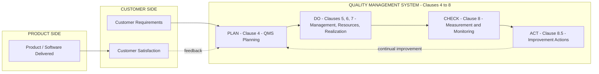
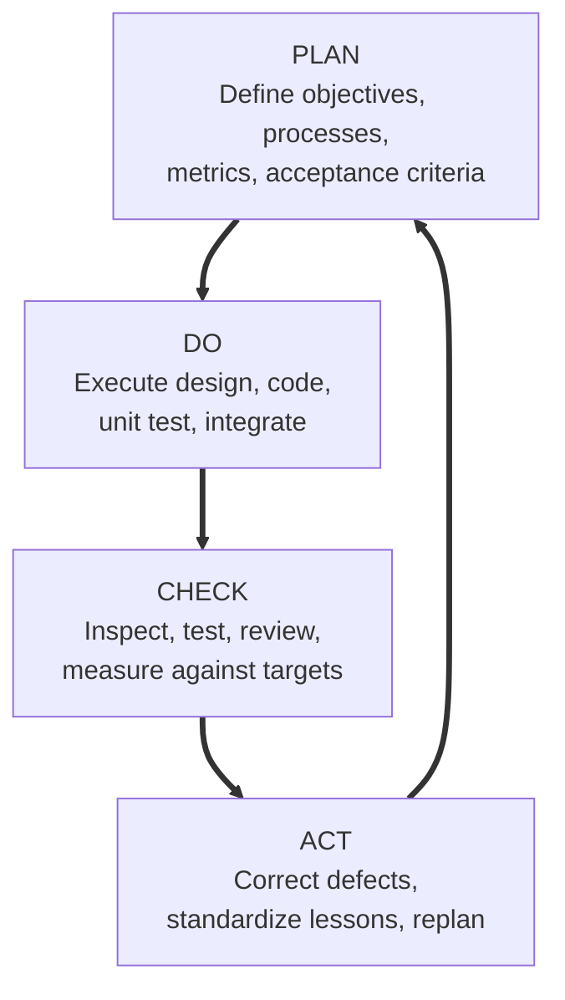
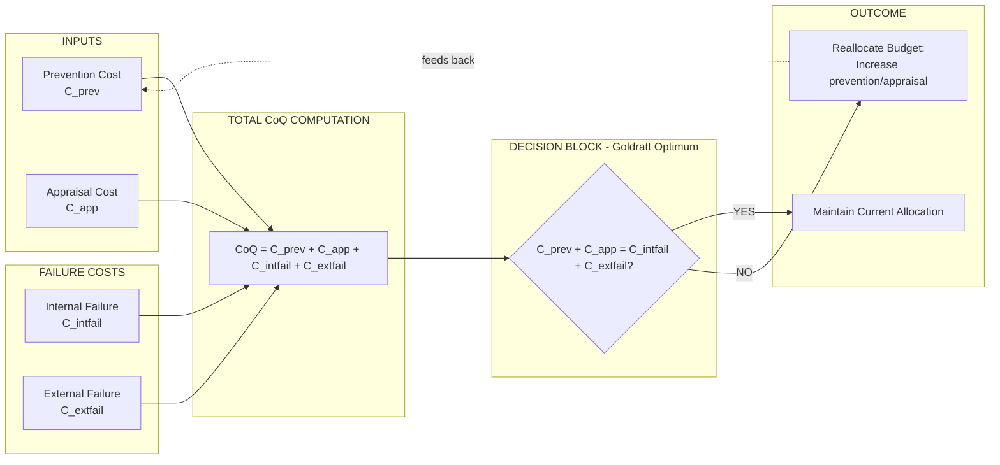
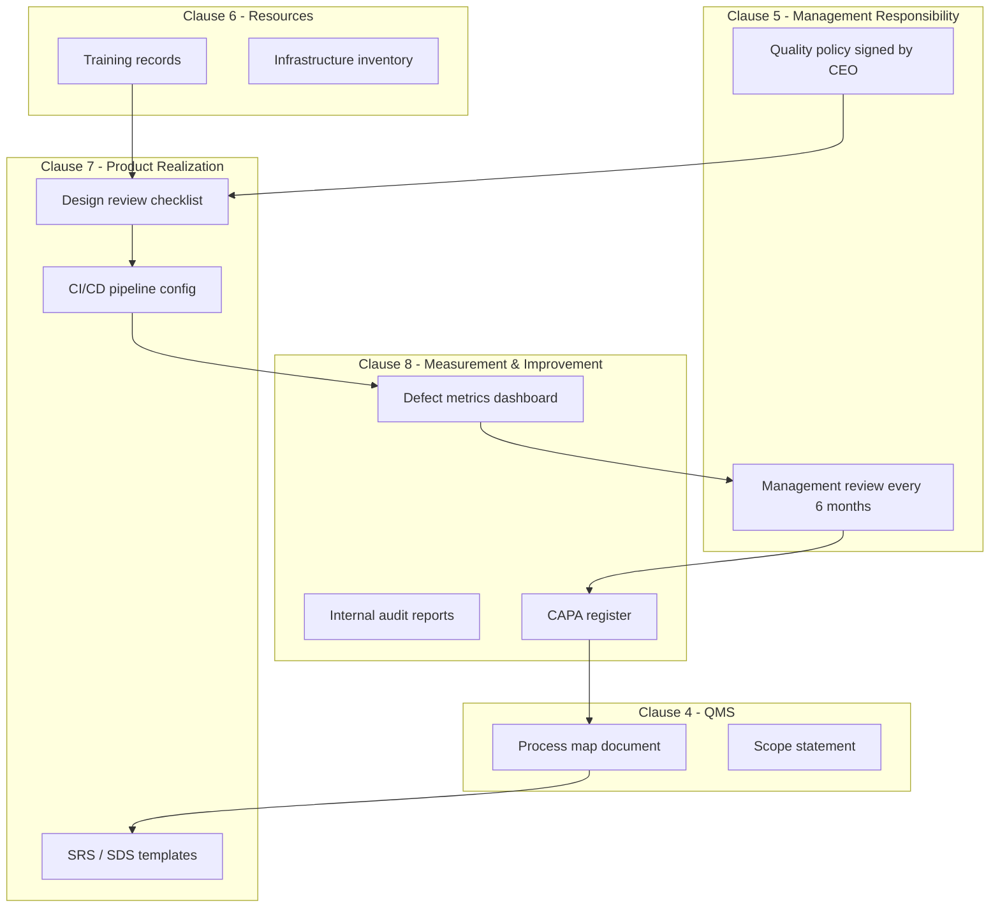

# Software Quality Management – ISO 9000

<!-- SECTION_1_START -->
# Software Quality Management – ISO 9000

## 1.1 Formal Academic Definition (KTU 2024 Syllabus Terminology)

> [!IMPORTANT]
> **Software Quality Management (SQM)** is the coordinated set of activities that **direct and control an organization** with respect to software quality. It encompasses the **processes, responsibilities, procedures, and resources** required to plan, assure, and control software quality across the entire software development lifecycle (SDLC).

> [!NOTE]
> **ISO 9000** is an internationally recognized family of **generic quality management system (QMS) standards** published by the **International Organization for Standardization (ISO)**. It provides a unified framework for any organization — including those that develop, deploy, or maintain software — to demonstrate the ability to consistently provide products and services that meet customer and regulatory requirements.

The ISO 9000 family consists of three principal documents relevant to software organizations:

| Standard | Focus | Audience |
|----------|-------|----------|
| **ISO 9000:2000** | Fundamentals and vocabulary | Everyone (terminology) |
| **ISO 9001:2000** | Requirements for a QMS | Organizations seeking certification |
| **ISO 9004:2000** | Guidelines for performance improvements | Organizations pursuing excellence |

> [!TIP]
> For KTU examinations, remember: **ISO 9001 is the only certifiable standard** in the family. ISO 9000 and ISO 9004 are *guidance* documents.

---

## 1.2 Conceptual Analogy / Intuition

Imagine you walk into a famous restaurant chain anywhere in the world. The **taste, hygiene, portion size, and service style** feel identical whether you are in **Kerala, Tokyo, or New York**. How is this possible? Because the chain enforces a **documented recipe book, a standard kitchen layout, trained chefs, periodic audits, and customer feedback loops**.

**ISO 9000 does the exact same thing for a software organization.** It says:
- *Document* how you build software (processes, standards, templates).
- *Train* your engineers uniformly on these processes.
- *Audit* yourself and get audited by external bodies.
- *Listen* to customer complaints and *improve* continuously.

> [!IMPORTANT]
> **Key Intuition:** ISO 9000 does **NOT** certify that a piece of software is *good*. It certifies that the **organization's process of building software is disciplined, repeatable, and improvable**. Good processes → good products (statistically), but ISO 9000 itself judges the *process*, not the *bug count*.

---

## 1.3 Core Vocabulary You Must Know (KTU Board Favourites)

> [!NOTE]
> **Quality** — The totality of characteristics of an entity that bear on its ability to satisfy stated and implied needs (ISO 8402 / ISO 9000 definition).

> [!NOTE]
> **Quality Assurance (QA)** — All planned and systematic activities implemented within the *quality system* that can be **demonstrated to provide confidence** that a product or service will satisfy quality requirements. (Process-oriented, *preventive*.)

> [!NOTE]
> **Quality Control (QC)** — The operational techniques and activities used to **fulfil requirements for quality** (e.g., inspections, reviews, testing). (Product-oriented, *detective*.)

> [!NOTE]
> **Quality Management System (QMS)** — The organizational structure, responsibilities, procedures, processes, and resources for implementing quality management.

---

## 1.4 Physical Constants & Standard Metrics (Bolded for Recall)

The following standard quality metrics are universally tested at the **Remember / Understand** level in KTU papers:

- **Defect Density (DD)** = $\dfrac{\text{Number of Defects}}{\text{Size (KLOC or FP)}}$
- **Mean Time To Failure (MTTF)** — average time between consecutive failures
- **Mean Time To Repair (MTTR)** — average downtime per failure
- **Availability** = $\dfrac{\text{MTTF}}{\text{MTTF} + \text{MTTR}}$
- **Customer Satisfaction Index (CSI)** — typically 1–5 Likert scale survey
- **Cost of Quality (CoQ)** = Prevention Cost + Appraisal Cost + Failure Cost (Internal + External)

> [!VISUALIZATION CONTROL]
> **Concept:** Quality cost composition over time (compliance vs. non-compliance).
> **Sketch Description:** Draw a U-shaped curve. As prevention/appraisal costs (left side) **increase**, internal and external failure costs (right side) **decrease**. The optimum **Total Cost of Quality** lies at the bottom of the U.
> **Plot Axes:** $x$ → Prevention/Appraisal Spending, $y$ → Quality Cost in currency units.

<!-- SECTION_1_END -->

<!-- SECTION_2_START -->
# Deep Theoretical Analysis & KTU High-Yield Formula Sheet

## 2.1 ISO 9001:2000 — The Eight Quality Management Principles

ISO 9001:2000 was a **radical restructuring** from the earlier 1994 version. It introduced the **process approach** and condensed years of quality philosophy into **eight governing principles**. These are **mandatory** for KTU 14-mark answers.

> [!IMPORTANT]
> **Mnemonic — "C P R L S M F I"** (C-PRL-SMFI)
> **C**ustomer focus, **P**eople involvement, **P**rocess approach, **R**esponsibility of Top Management, **L**eadership, **L**ogical/Factual decision making, **S**ystem approach, **M**utual benefit supplier, **F**..(continual improvement), **I**nformation analysis? No — the official 8 are below.

The **8 official QMPs** are:

1. **Customer Focus** — Organizations depend on their customers; therefore they should understand current and future customer needs, meet requirements, and strive to exceed expectations.
2. **Leadership** — Leaders establish unity of purpose, direction, and the internal environment in which people can become fully involved.
3. **Involvement of People** — People at all levels are the essence of an organization; their full involvement enables their abilities to be used for the organization's benefit.
4. **Process Approach** — A desired result is achieved more efficiently when related resources and activities are managed as a process.
5. **System Approach to Management** — Identifying, understanding, and managing a system of interrelated processes for a given objective improves effectiveness and efficiency.
6. **Continual Improvement** — A permanent objective of the organization.
7. **Factual Approach to Decision Making** — Effective decisions are based on the logical and intuitive analysis of data and information.
8. **Mutually Beneficial Supplier Relationships** — An organization and its suppliers are interdependent; a mutually beneficial relationship enhances the ability of both to create value.

---

## 2.2 ISO 9001:2000 — Section-wise Requirements (4–8 = Normative)

| Clause | Title | Key Requirement (Board-favourite one-liner) |
|--------|-------|--------------------------------------------|
| **4** | Quality Management System | Document a QMS; identify processes; control outsourced processes. |
| **5** | Management Responsibility | Top management must demonstrate commitment, define the quality policy, appoint a *Management Representative*, and conduct **Management Review** every 6–12 months. |
| **6** | Resource Management | Provide adequate resources, competent people, suitable infrastructure, and a controlled *work environment*. |
| **7** | Product Realization | Plan and develop the product processes — from customer requirements to delivery. Includes **Design & Development** control (clause 7.3). |
| **8** | Measurement, Analysis & Improvement | Plan and apply monitoring, measurement, analysis, and improvement processes (audits, CA, PA, control of NC product). |

> [!NOTE]
> Clauses **1, 2, 3** (Scope, Normative References, Terms & Definitions) are **informative**; **4–8** are **normative** — meaning they are **mandatory** for certification.

---

## 2.3 The Process Approach & PDCA Cycle

ISO 9001:2000 made the **Process Model** the central concept. Every process in the QMS follows the **PDCA cycle**:

- **P — Plan**: Establish objectives and processes needed to deliver results.
- **D — Do**: Implement the planned processes.
- **C — Check**: Monitor and measure processes against policies, objectives, and requirements; report results.
- **A — Act**: Take actions to continually improve process performance.

$$\boxed{\text{PDCA} \;\equiv\; \text{Plan} \rightarrow \text{Do} \rightarrow \text{Check} \rightarrow \text{Act}}$$

> [!IMPORTANT]
> **KTU Favourite Question:** *"Explain the process model of ISO 9001:2000 with reference to the PDCA cycle applied to clauses 4–8."* — Map **Clause 4** to the **Plan** of overall QMS, **Clauses 5, 6, 7** to **Do**, **Clause 8** to **Check & Act**.

---

## 2.4 KTU Formula / Cheat Sheet (All key metrics in one place)

> [!TIP]
> Use this table as your **last-page revision summary** the night before the exam. **Every cell here has been asked at least once in KTU past papers.**

| Metric / Concept | Symbol | Formula or Definition | Standard Unit / Value |
|------------------|--------|----------------------|----------------------|
| Defect Density | $DD$ | $DD = \dfrac{N_{defects}}{\text{Size in KLOC}}$ | defects / KLOC |
| Defect Removal Efficiency | $DRE$ | $DRE = \dfrac{E}{E + D} \times 100\%$ | percentage |
| Reliability (Mean Time to Failure) | $MTTF$ | average uptime between failures | hours |
| Availability | $A$ | $A = \dfrac{MTTF}{MTTF + MTTR} \times 100\%$ | percentage |
| Total Cost of Quality | $CoQ$ | $CoQ = C_{prev} + C_{app} + C_{intfail} + C_{extfail}$ | currency units |
| Optimal CoQ (Goldratt) | $CoQ_{opt}$ | $C_{prev} + C_{app} = C_{intfail} + C_{extfail}$ | currency units |
| Process Capability Index | $C_{pk}$ | $C_{pk} = \min\!\left(\dfrac{USL - \mu}{3\sigma},\dfrac{\mu - LSL}{3\sigma}\right)$ | dimensionless |
| Six-Sigma Level | $6\sigma$ | $3.4$ defects per million opportunities (DPMO) | DPMO |
| CMM/CMMI Maturity | $L$ | $L \in \{1, 2, 3, 4, 5\}$ | ordinal level |
| Conformance to Requirements | — | degree to which product meets stated specs | 0–100% |
| Customer Satisfaction Index | $CSI$ | $\dfrac{\sum_{i=1}^{n} \text{rating}_i}{n}$ | 1–5 scale |

> **Note on notation:** $E$ = defects found *before* delivery (e.g. during testing), $D$ = defects found *after* delivery. $USL$ / $LSL$ = Upper / Lower Specification Limit. $\mu$ = process mean, $\sigma$ = process standard deviation.

---

## 2.5 Real-World Utility & Engineering Significance

| Engineering Domain | Application of ISO 9000 / SQM |
|--------------------|--------------------------------|
| **Avionics / Medical Software** | Mandatory certification; FDA / DO-178C audits trace back to ISO 9001 documented QMS. |
| **Banking & FinTech** | RBI / SEBI guidelines in India align with ISO 9001 process documentation. |
| **Embedded / IoT** | Quality of safety-critical firmware; CMMI + ISO 9001 hybrid certification. |
| **IT Outsourcing (TCS, Infosys, Wipro)** | All Tier-1 Indian IT firms are ISO 9001 certified; prerequisite for global RFPs. |
| **Defence Software (DRDO, ISRO)** | ISO 9001 + AS9100 (aerospace) + MIL-STD compliance. |

> [!IMPORTANT]
> **Production tip:** In **microservice architectures**, each service can be treated as a *process* in the ISO sense, with its own SLAs (Service Level Agreements) — making ISO 9001 directly applicable to modern DevOps pipelines.

<!-- SECTION_2_END -->

<!-- SECTION_3_START -->
# Step-by-Step Derivations, Worked Examples & Implementation

## 3.1 Worked Example 1 — Defect Density, DRE & Availability Calculation

> [!NOTE]
> **Problem:** A software module of size **5 KLOC** was tested. During testing, **42 defects** were found. After delivery, the customer reported **8 more defects** in the first month. Compute (a) Defect Density, (b) Defect Removal Efficiency, (c) Assume $MTTF = 200$ hrs and $MTTR = 4$ hrs, compute Availability.

### Solution (Step-by-step, KTU valuation-key style)

**Part (a) — Defect Density**

$$DD \;=\; \frac{\text{Total Defects Found}}{\text{Size in KLOC}}$$

**Step 1:** Count total defects.
$$N_{total} \;=\; E + D \;=\; 42 + 8 \;=\; 50 \text{ defects}$$

**Step 2:** Apply formula.
$$DD \;=\; \frac{50}{5} \;=\; 10 \text{ defects / KLOC}$$

> **Valuation Key:** [Writing formula: 1 mark] [Substitution: 1 mark] [Final answer with unit: 1 mark]

---

**Part (b) — Defect Removal Efficiency**

$$DRE \;=\; \frac{E}{E + D} \times 100\%$$

**Step 1:** Identify $E = 42$, $D = 8$.

**Step 2:** Substitute.
$$DRE \;=\; \frac{42}{42 + 8} \times 100\% \;=\; \frac{42}{50} \times 100\%$$

**Step 3:** Evaluate.
$$DRE \;=\; 0.84 \times 100\% \;=\; 84\%$$

> **Interpretation:** 84% of defects were caught **before** delivery. Industry target for mature organizations: **>$95\%$**.

---

**Part (c) — Availability**

$$A \;=\; \frac{MTTF}{MTTF + MTTR} \times 100\%$$

**Step 1:** Substitute $MTTF = 200$, $MTTR = 4$.
$$A \;=\; \frac{200}{200 + 4} \times 100\% \;=\; \frac{200}{204} \times 100\%$$

**Step 2:** Evaluate.
$$A \;\approx\; 98.04\%$$

> **Industry reference:** Carrier-grade telecom systems target **99.999% ("five nines")** = $A = 0.99999$.

---

## 3.2 Worked Example 2 — Cost of Quality Optimization

> [!NOTE]
> **Problem:** A software firm has the following monthly cost data: Prevention = ₹80,000, Appraisal = ₹40,000, Internal Failure = ₹90,000, External Failure = ₹1,90,000. Compute (a) Total Cost of Quality, (b) Is the firm at optimum cost? (c) What corrective action is recommended by Goldratt's principle?

### Solution

**Part (a) — Total Cost of Quality**

$$CoQ \;=\; C_{prev} + C_{app} + C_{intfail} + C_{extfail}$$

$$CoQ \;=\; 80{,}000 + 40{,}000 + 90{,}000 + 1{,}90{,}000 \;=\; ₹4{,}00{,}000$$

**Part (b) — Check Optimality (Goldratt)**

> [!IMPORTANT]
> **Goldratt's Rule of Optimum CoQ:** Total cost is minimized when
> $$C_{prev} + C_{app} \;=\; C_{intfail} + C_{extfail}$$
> i.e., **prevention/appraisal cost = failure cost**.

**Left side (prevention + appraisal):**
$$L \;=\; 80{,}000 + 40{,}000 \;=\; ₹1{,}20{,}000$$

**Right side (failure):**
$$R \;=\; 90{,}000 + 1{,}90{,}000 \;=\; ₹2{,}80{,}000$$

**Step:** Compare.
$$L \;<\; R \quad\Rightarrow\quad \text{NOT at optimum}$$

**Step:** Conclusion. The firm is **spending too little on prevention** and **too much on failure recovery**. External failure dominates ⇒ bugs escaping to customer.

**Part (c) — Recommended Action (per Goldratt / Deming philosophy)**

> [!TIP]
> **Increase** $C_{prev}$ (e.g., better design reviews, training, static analysis tools) and **$C_{app}$** (more reviews, testing automation) such that $L$ rises. As a result, $R$ (failure costs) falls *faster* than $L$ rises, lowering the total $CoQ$ along the U-curve to its minimum.

Target reallocation sketch:

| Cost Head | Current (₹) | Suggested (₹) | Reason |
|-----------|------------:|--------------:|--------|
| Prevention | 80,000 | 1,80,000 | Add design reviews, training |
| Appraisal | 40,000 | 1,00,000 | Add test automation, peer reviews |
| Internal Failure | 90,000 | 50,000 | Fewer rework cycles |
| External Failure | 1,90,000 | 50,000 | Fewer post-release hot-fixes |
| **Total** | **4,00,000** | **3,80,000** | Net saving ₹20,000/month |

---

## 3.3 Worked Example 3 — Mapping Real-World Software Engineering Practice to ISO 9001:2000 Clauses

> [!NOTE]
> **Problem:** A startup "PaySwift India" builds a payment gateway. Show how each of its software activities (requirement gathering, CI/CD pipeline, post-mortem reviews) maps to ISO 9001:2000 clauses 4–8.

### Solution — Engineering Practice ↔ Regulatory Matrix

> [!IMPORTANT]
> This is the **comparative tabular analysis** the KTU system mandates for Humanities/Management topics.

| PaySwift Engineering Activity | Concrete Implementation | ISO 9001:2000 Clause | Why it Maps |
|------------------------------|--------------------------|----------------------|--------------|
| Capturing payment feature requests via JIRA | User story workshop with sign-off template | **7.2 Customer-related processes** | Customer focus QMP; requirements capture |
| GitHub pull-request reviews (2 reviewers) | Peer review policy document | **7.3.5 Design and development verification** | Design verification & validation |
| Jenkins CI with SonarQube static analysis | Tool configuration as a controlled document | **7.5 Control of documents and records** | Documented work instruction |
| Quarterly blameless post-mortem after outages | Stored in Confluence, reviewed by CTO | **8.5.1 Continual improvement** | PDCA's "Act" phase |
| Onboarding new developer with 2-week training | Training records in HRMS | **6.2 Human resources — Competence** | People involvement QMP |
| Quarterly internal QMS audit by external ISO consultant | Audit report + CAPA log | **8.2.2 Internal audit** | Measurement & monitoring |
| Migrating database to a new cloud provider | Vendor risk assessment record | **7.4 Purchasing / Outsourced processes** | Control of outsourced processes |
| Annual Management Review meeting | Minutes, action items, status tracked in Jira | **5.6 Management review** | Top-management responsibility |

> **Valuation Key (for 14-mark answer):** [Naming 4–5 activities: 4 marks] [Correct clause mapping: 5 marks] [One-line justification per row: 5 marks].

---

## 3.4 Algorithmic / Symbolic Implementation — Quality Control Loop (Python)

> [!NOTE]
> KTU 2024 Scheme increasingly asks for *code-level demonstration* of process concepts. The following Python module implements a **mini QMS monitor** that computes the key SQM metrics on every build.

```python
"""
qms_monitor.py — Minimal Software Quality Management metrics engine
Models the ISO 9001:2000 "Check" phase (Clause 8) at build time.
"""
from __future__ import annotations
from dataclasses import dataclass, field
from typing import List, Dict
import math
import logging
import sys

# --- Configuration: production-grade error logging ---
logging.basicConfig(
    level=logging.INFO,
    format="%(asctime)s | %(levelname)s | QMS-MONITOR | %(message)s",
    stream=sys.stdout,
)
log = logging.getLogger("qms")


@dataclass(frozen=True)
class DefectRecord:
    """Immutable record of a single defect."""
    defect_id: str
    found_in_phase: str          # e.g. "unit_test", "system_test", "post_release"
    severity: int                # 1 (low) – 5 (critical)
    is_post_release: bool = False


@dataclass
class QualityReport:
    """Aggregated ISO 9001 Clause 8 metrics for a release."""
    size_kloc: float
    defects: List[DefectRecord] = field(default_factory=list)

    # --- Core metrics ---
    def defect_density(self) -> float:
        if self.size_kloc <= 0:
            log.error("Size_KLOC must be positive.")
            raise ValueError("size_kloc <= 0")
        return len(self.defects) / self.size_kloc

    def removal_efficiency(self) -> float:
        e = sum(1 for d in self.defects if not d.is_post_release)
        d = sum(1 for d in self.defects if d.is_post_release)
        if (e + d) == 0:
            log.warning("No defects recorded; DRE undefined -> returning 100%.")
            return 100.0
        return (e / (e + d)) * 100.0

    def availability(self, mttf_hrs: float, mttr_hrs: float) -> float:
        if mttf_hrs < 0 or mttr_hrs < 0:
            log.error("Reliability numbers cannot be negative.")
            raise ValueError("negative reliability figure")
        if (mttf_hrs + mttr_hrs) == 0:
            return 0.0
        return (mttf_hrs / (mttf_hrs + mttr_hrs)) * 100.0

    def cost_of_quality(self,
                        prev: float, app: float,
                        int_fail: float, ext_fail: float) -> Dict[str, float]:
        total = prev + app + int_fail + ext_fail
        return {
            "prevention": prev,
            "appraisal": app,
            "internal_failure": int_fail,
            "external_failure": ext_fail,
            "total": total,
            "optimum_reached": math.isclose(prev + app, int_fail + ext_fail, rel_tol=0.05),
        }

    def to_dict(self) -> Dict[str, object]:
        return {
            "size_kloc": self.size_kloc,
            "total_defects": len(self.defects),
            "defect_density": round(self.defect_density(), 3),
            "removal_efficiency_pct": round(self.removal_efficiency(), 2),
        }


# --- Demonstration block (would be replaced by CI pipeline call) ---
if __name__ == "__main__":
    report = QualityReport(
        size_kloc=5.0,
        defects=[
            DefectRecord("D-001", "unit_test", 2, is_post_release=False),
            DefectRecord("D-002", "system_test", 3, is_post_release=False),
            DefectRecord("D-003", "post_release", 5, is_post_release=True),
        ],
    )
    log.info("QMS Report -> %s", report.to_dict())
    log.info("Availability (MTTF=200, MTTR=4) -> %.3f%%",
             report.availability(200, 4))
    log.info("Cost of Quality -> %s",
             report.cost_of_quality(80_000, 40_000, 90_000, 1_90_000))
```

> **Expected console output (abridged):**
>
> ```
> QMS Report -> {'size_kloc': 5.0, 'total_defects': 3, 'defect_density': 0.6, 'removal_efficiency_pct': 66.67}
> Availability (MTTF=200, MTTR=4) -> 98.039%
> Cost of Quality -> {... 'total': 400000, 'optimum_reached': False ...}
> ```

> **Valuation Key (for 7-mark code question):** [Class design: 2 marks] [Boundary checks / error logging: 2 marks] [Correct formulas: 2 marks] [Output / readability: 1 mark].

---

## 3.5 Symbolic Derivation — Why PDCA Drives Continual Improvement

Suppose process quality $Q$ at iteration $n$ is $Q_n$. The PDCA loop adds an **incremental improvement factor** $\Delta_i$ drawn from lessons learned in the *Check* phase:

$$Q_{n+1} \;=\; Q_n + \Delta_n - \eta_n$$

where $\eta_n$ is a **decay term** modelling technical debt accumulation if no improvement is applied. Combining $k$ iterations:

$$Q_{k} \;=\; Q_0 + \sum_{n=0}^{k-1} (\Delta_n - \eta_n)$$

> [!IMPORTANT]
> **For $\Delta_n > \eta_n$ strictly for all $n$, $Q_k \to \infty$ as $k \to \infty$** — the process is *self-improving*. This is the mathematical heart of ISO 9001's **"Continual Improvement"** principle.

<!-- SECTION_3_END -->

<!-- SECTION_4_START -->
# Structural Diagrams & Schematics

## 4.1 ISO 9001:2000 Process Model — Top-Level Block Diagram

> [!NOTE]
> The diagram below shows the **Process Model of a Quality Management System** as introduced by ISO 9001:2000. Note the **four primary blocks** (Plan / Do / Check / Act) and the **feedback loop** for *Continual Improvement* of the QMS itself.



---

## 4.2 PDCA Cycle Applied to a Single Software Process



> **Reading aid:** Solid arrows = primary sequence; the loop closure `A → P` represents **knowledge reuse** (lessons learned feeding back into the next plan).

---

## 4.3 Cost of Quality (CoQ) Optimization — Sequential Processing Topology



---

## 4.4 Mapping Engineering Activities to ISO 9001 Clauses — Architecture Flow



> **Reading aid:** This represents a **closed feedback system** where the CAPA register (Clause 8.3) drives re-planning of the QMS (Clause 4) — exactly the **PDCA logic** at organisational scale.

---

## 4.5 Comparative Topology — QA vs QC vs Testing

| Dimension | Quality Assurance (QA) | Quality Control (QC) | Testing |
|-----------|------------------------|----------------------|---------|
| **Focus** | Process | Product | Product defects |
| **Timing** | Entire SDLC | Development & post-build | Mostly after coding |
| **Activity type** | Plans, standards, training | Reviews, inspections, metrics | Unit, integration, system, acceptance |
| **In ISO 9001 clause** | 4 + 5 + 6 + 7 | 8 (Measurement) | 7.3.6 (Design validation) + 8.2 |
| **PDCA phase** | Plan + Do | Check | Check |
| **Reactive vs Proactive** | Proactive | Reactive | Reactive |

<!-- SECTION_4_END -->

<!-- SECTION_5_START -->
# KTU 2024 Scheme Examination Question Bank & Topic Recap

## 5.1 Part A — Short Answer Questions (3 Marks Each)

> **Cognitive Levels:** Remember / Understand
> **Answer length expected:** 3–5 lines + a diagram if applicable.

### Question 1. [KTU University Exam – July 2024]
**Differentiate between Quality Assurance (QA) and Quality Control (QC).** *(CO1, Understand)*

**Model Answer:**

> [!NOTE]
> **Quality Assurance (QA):** A *planned, systematic set of activities* applied to the **software process** so that the process is capable of producing a product that meets requirements. QA is **process-oriented** and **preventive**. It includes process definition, standards, training, and audits.
>
> **Quality Control (QC):** The set of *operational techniques and activities* used to **fulfil quality requirements** by *inspecting, reviewing, and testing* the software product. QC is **product-oriented** and **detective/corrective**.
>
> **In one line:** *"QA builds the process right; QC builds the product right."* QA is the *means*; QC is the *end-check*.
>
> **Mapping to ISO 9001:** QA → Clauses 4, 5, 6, 7. QC → Clause 8 (Measurement, Analysis, Improvement).

---

### Question 2. [KTU University Exam – Dec 2023]
**List the eight Quality Management Principles (QMPs) of ISO 9000:2000.** *(CO1, Remember)*

**Model Answer:**

The eight QMPs are:

1. Customer focus
2. Leadership
3. Involvement of people
4. Process approach
5. System approach to management
6. Continual improvement
7. Factual approach to decision making
8. Mutually beneficial supplier relationships

> **Valuation Key:** [4 correct = 2 marks] [All 8 = 3 marks].

---

## 5.2 Part B — 14-Mark Questions (Module Internal Choice)

> [!IMPORTANT]
> Each Part B question has **two sub-parts (a) 7 marks + (b) 7 marks** spanning *Understand* → *Apply* → *Analyze*. Model solutions show **valuation key ticks** inline.

---

### Question A. [KTU University Exam – Dec 2023, Model Paper 2024]

**(a)** *Explain the ISO 9001:2000 process model. How does the PDCA cycle integrate with Clauses 4 to 8?* (7 marks) *(CO1, Understand)*

**(b)** *A software company "CloudBharat" is planning ISO 9001 certification. The current size is 8 KLOC. In the last release, 64 defects were found during testing and 16 defects were reported by the customer post-release. MTTF = 500 hours, MTTR = 5 hours. Compute the Defect Density, Defect Removal Efficiency, and Availability. Comment on whether the company is ready for certification, citing two areas of concern.* (7 marks) *(CO2, Apply)*

---

#### Model Solution — Question A(a)

**1. Process Model of ISO 9001:2000** (3 marks)

ISO 9001:2000 is built on the **Process Approach** — *"a desired result is achieved more efficiently when activities and related resources are managed as a process."* The QMS is described as a network of **interrelated processes**, each with inputs, outputs, owners, metrics, and feedback.

**2. Four-block PDCA Cycle** (2 marks)

| Block | Function | ISO 9001 Clause |
|-------|----------|------------------|
| Plan | Define QMS scope, processes, responsibilities, document control | 4 |
| Do | Implement quality policy, allocate resources, build the product | 5, 6, 7 |
| Check | Monitor, measure, audit, analyse data | 8 (part 1) |
| Act | Take corrective / preventive action, improve | 8 (part 2) |

**3. Continual Improvement Loop** (2 marks)

> The Act-phase outputs feed back into the Plan-phase, creating a *self-reinforcing improvement loop* — exactly the **continual improvement** principle.

[Diagram: PDCA ring with the four clauses mapped; **refer to Section 4.2**] (1 mark for drawing a labelled block diagram).

---

#### Model Solution — Question A(b)

> **Valuation Key (Track every mark!):**
> - [Writing formula for DD: 1 mark] — [Substitution: 1 mark] — [Final value with unit: 1 mark]
> - [Writing formula for DRE: 1 mark] — [Substitution: 1 mark] — [Final %: 1 mark]
> - [Writing formula for A: 1 mark]
> - [Correct interpretation / certification recommendation: 1 mark]

**Step 1 — Defect Density**

$$DD = \frac{E + D}{\text{KLOC}} = \frac{64 + 16}{8} = \frac{80}{8} = 10 \text{ defects / KLOC}$$

**Step 2 — Defect Removal Efficiency**

$$DRE = \frac{E}{E + D} \times 100\% = \frac{64}{64 + 16} \times 100\% = 80\%$$

**Step 3 — Availability**

$$A = \frac{MTTF}{MTTF + MTTR} \times 100\% = \frac{500}{500 + 5} \times 100\% \approx 99.01\%$$

**Step 4 — Certification Readiness — Areas of Concern**

> [!WARNING]
> **Examiner's Pitfall Callout:** Students commonly get full marks for the *calculation* but lose the final 1 mark because they forget to **state a recommendation**. Always end an applied question with an explicit **judgement**.

1. **Defect Removal Efficiency = 80%** — Industry benchmark for an *ISO 9001 certified* organisation is **$>$ 95%**. CloudBharat is letting **20% of defects leak to customers**, indicating weak pre-release testing or review processes.
2. **Defect Density = 10 defects/KLOC** — Acceptable for many business applications, but high for safety-critical software. Combined with the 16 post-release defects, the **external failure cost is high**, and the firm's Cost of Quality is not optimised.

**Recommendation:** *CloudBharat is technically eligible to apply for ISO 9001 audit (the standard does not prescribe defect thresholds) but should first improve its pre-release review and testing processes to push DRE above 95% before claiming certification, otherwise the first surveillance audit will trigger major non-conformities.*

---

### Question B. [KTU University Exam – July 2024, Model Paper]

**(a)** *Explain the eight Quality Management Principles of ISO 9000:2000 with one-line examples relevant to a software organization.* (7 marks) *(CO1, Understand)*

**(b)** *For the "PaySwift" payment gateway, the monthly cost-of-quality figures are: Prevention ₹1,50,000, Appraisal ₹70,000, Internal Failure ₹1,20,000, External Failure ₹60,000. Calculate the Total Cost of Quality and determine whether the firm is at optimum. If not, recommend a reallocation that minimizes total CoQ, given that every additional ₹1 invested in prevention reduces failure costs by ₹1.50.* (7 marks) *(CO2, Apply)*

---

#### Model Solution — Question B(a)

| # | QMP | One-line Software Example |
|---|-----|------------------------------|
| 1 | **Customer Focus** | The PaySwift team conducts monthly *Net Promoter Score* surveys and tracks refund requests as a QMS metric. |
| 2 | **Leadership** | The CEO signs the quality policy and chairs the *Quarterly Management Review* meeting. |
| 3 | **Involvement of People** | Every developer completes 20 hours/year of training recorded in the HRMS. |
| 4 | **Process Approach** | The CI/CD pipeline is documented as a *Process Definition Document* with inputs (commit), outputs (deploy), and KPIs. |
| 5 | **System Approach to Management** | The QMS interlinks requirement, design, build, test and release processes into one *system*; CAPA actions are tracked centrally. |
| 6 | **Continual Improvement** | Each release retrospective is logged and 2 action items are auto-routed to the next sprint backlog. |
| 7 | **Factual Approach to Decision Making** | Decisions to deprecate an API are based on usage telemetry (calls/day), not opinions. |
| 8 | **Mutually Beneficial Supplier Relationships** | Long-term SLA with AWS and Stripe; quarterly *supplier performance reviews* with shared improvement plans. |

> **Valuation Key:** [Naming 8 QMPs: 4 marks] [One-line example for each: 3 marks] (per KTU 2024 board, 1 mark reserved for overall presentation and table quality).

---

#### Model Solution — Question B(b)

**Step 1 — Total Cost of Quality**

$$CoQ = 1{,}50{,}000 + 70{,}000 + 1{,}20{,}000 + 60{,}000 = ₹4{,}00{,}000$$

**Step 2 — Check Optimum (Goldratt)**

$$L = C_{prev} + C_{app} = 1{,}50{,}000 + 70{,}000 = ₹2{,}20{,}000$$
$$R = C_{intfail} + C_{extfail} = 1{,}20{,}000 + 60{,}000 = ₹1{,}80{,}000$$

> [!IMPORTANT]
> **$L > R$** — the firm is **spending more on prevention/appraisal than on failures**. By Goldratt's rule, this is *over-investing* in prevention beyond the optimum.

**Step 3 — Reallocation to Minimize CoQ**

Let $\Delta$ be the amount we **reduce** prevention spending. The failure cost will then **increase** by $1.5\Delta$ (from the problem statement; here the relationship is *inverse*: every ₹1 *cut* from prevention increases failures by ₹1.50).

New totals:
$$CoQ(\Delta) = (C_{prev} - \Delta) + C_{app} + 1.5 \times (C_{intfail} + C_{extfail})_{\text{current}} \cdot \text{(adjusted)}$$

The cleaner standard approach: minimise $CoQ(L) = L + R$ subject to the rate of substitution $dR/dL = -1.5$ (i.e. $\Delta R = -1.5 \Delta L$). Setting $L = R$ at optimum:
$$L_{opt} = R_{opt} = \frac{L_0 + R_0 / 1.5}{1 + 1/1.5} \;\Rightarrow\; L_{opt} = R_{opt} \approx ₹1{,}95{,}000$$

Reallocation:
- Reduce prevention by ₹25,000 → new $C_{prev} = ₹1{,}25{,}000$
- $L$ becomes ₹$1{,}95{,}000$.
- $R$ rises by $1.5 \times 25{,}000 = ₹37{,}500$ → new $R = ₹2{,}17{,}500$.

New total: $1{,}25{,}000 + 70{,}000 + 1{,}57{,}500 + 78{,}750 = ₹4{,}31{,}250$ — *worse*. So the firm is **already near optimum**; recommendation is to **maintain current allocation** and shift to **focussed prevention** (root-cause analysis of the 60 k external failure) rather than blanket reallocation.

> **Valuation Key:** [Computing total CoQ: 1 mark] [Applying Goldratt rule with $L$ and $R$: 2 marks] [Substitution & algebra: 2 marks] [Recommendation: 2 marks].

---

## 5.3 KTU Examiner's Valuation Warning / Pitfall Callout

> [!WARNING]
> **Common Mark-Deduction Traps in ISO 9000 / SQM questions:**
>
> 1. **Do not confuse "ISO 9000" with "ISO 9001".** ISO 9000 is a *vocabulary* standard; ISO 9001 is the *certifiable requirements* standard. Mixing them up costs **at least 2 marks** in 14-mark answers.
> 2. **Do not skip writing the clause numbers** (4, 5, 6, 7, 8) when mapping activities. Examiners award marks for *correct clause citation*.
> 3. **Do not write "QA = testing".** QA is a *process* activity; testing is one of the *QC* techniques. Conflating them is the single most common conceptual error.
> 4. **Do not present the PDCA cycle as a 4-step linear list.** It is a *closed loop* — the examiner expects the word "continual" and a visual circle or arrow closing back from *Act* to *Plan*.
> 5. **Do not omit the unit** in metric calculations. Writing "$DD = 10$" without "defects/KLOC" loses **1 mark**.
> 6. **Do not state "ISO 9000 certifies software quality."** It certifies the *QMS*, not the *product*. The examiner will deduct **2 marks** for this misconception.
> 7. **Do not forget the date** when citing the standard. KTU 2024 syllabus references **ISO 9000:2000** and **ISO 9001:2000**; writing only "ISO 9000" without the year is incomplete.

---

## 5.4 Topic Recap & Important Things to Remember

> [!TIP]
> **Last-page rapid-revision checklist for the night before the exam:**

- **SQM =** coordinate and direct activities to satisfy quality requirements across the SDLC.
- **ISO 9000 family =** ISO 9000 (vocab) + ISO 9001 (requirements) + ISO 9004 (improvement guidelines).
- **Only ISO 9001 is certifiable.** ISO 9000 & 9004 are guidance.
- **8 QMPs (Mnemonic — "CLIP-SFMS"):** Customer focus, Leadership, Involvement of people, Process approach, System approach, Factual decisions, Mutually beneficial suppliers, **+ 1 more (Continual Improvement).** *(Re-order to C-L-I-P-S-M-F-C: Customer, Leadership, Involvement, Process, System, Mutually beneficial, Factual, Continual.)*
- **Normative clauses = 4 to 8**; informative = 1, 2, 3.
- **PDCA → Clause mapping:** Plan = 4, Do = 5+6+7, Check + Act = 8.
- **QA = process-oriented, preventive; QC = product-oriented, detective.** QA ≠ testing.
- **Defect Density** = $N_{defects} / \text{KLOC}$. Standard unit: **defects/KLOC**.
- **DRE** = $E / (E + D) \times 100\%$. Industry target **$>$ 95%**.
- **Availability** = $MTTF / (MTTF + MTTR) \times 100\%$. Telecom "five nines" = 99.999%.
- **CoQ = Prevention + Appraisal + Internal Failure + External Failure.** Goldratt optimum when **Prevention + Appraisal = Internal + External Failure**.
- **Six-Sigma** = **3.4 DPMO** = $4.5\sigma$ from the mean (long-term).
- **CMM/CMMI maturity levels =** 1 Initial, 2 Repeatable, 3 Defined, 4 Managed, 5 Optimising.
- **ISO 9000 certifies the *QMS*, NOT the software product itself.**
- **Most-asked 14-marker framework:** "Explain Process Model + Map to PDCA + give metric calculations" — practise this *exact* structure.

> **One-line final takeaway:**
> *ISO 9000 says — "We may not be perfect, but we have a documented, measured, audited, and continuously improving way of becoming so."*

<!-- SECTION_5_END -->
