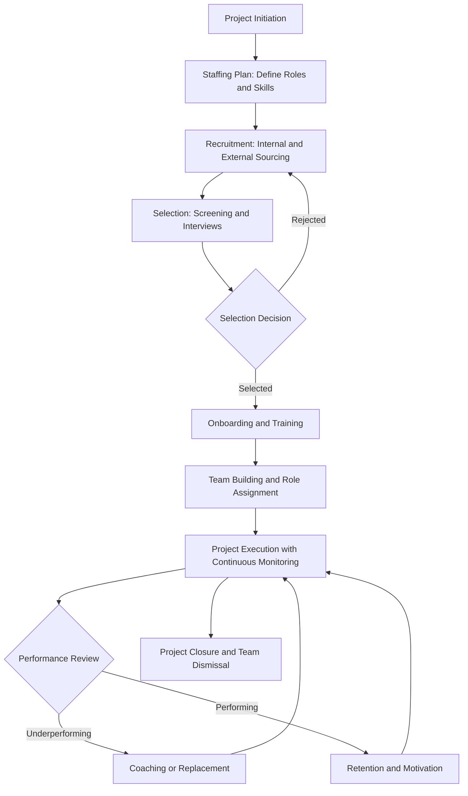
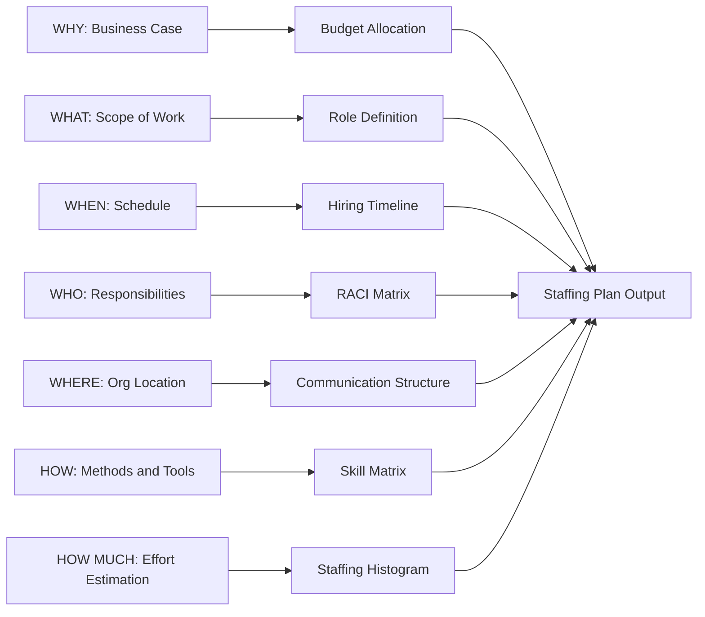
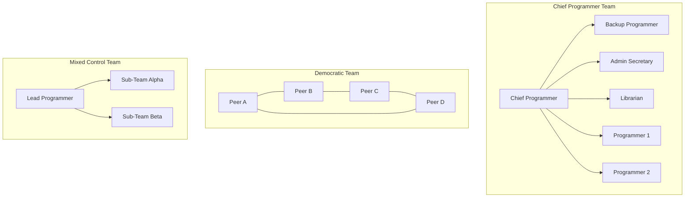
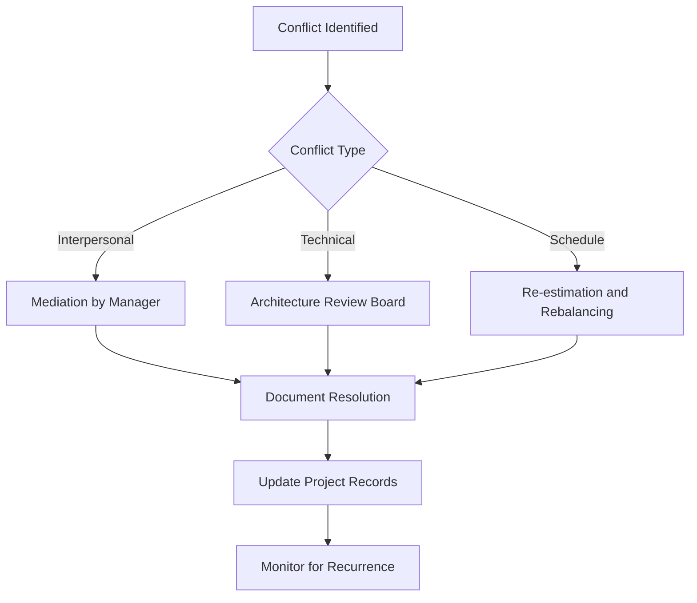

# Staffing

<!-- SECTION_1_START -->
# 1. Core Technical Definition & Intuitive Overview

## 1.1 Formal KTU 2024 Definition

**Staffing** in Software Engineering (as per the KTU 2024 Scheme OECST723 syllabus) is defined as the systematic process of **planning, recruiting, selecting, growing, and managing** the human resources required to execute a software project. It is the second critical activity of the **Software Project Management Process** (after Project Planning) and is governed by the **W5HH Principle** proposed by **Barry Boehm**, which addresses five project dimensions and four additional constraints.

In formal terms, staffing encompasses the **People Management Lifecycle** of a software project, beginning with the **Staffing Plan** (determining *who* is needed, *when*, and *with what skills*) and concluding with **Team Dismissal** (releasing team members upon project completion).

> [!IMPORTANT]
> **KTU 2024 Syllabus Highlight (Module 4):**
> Staffing is part of the broader **Software Project Management** umbrella. It is interlinked with **Estimation, Scheduling, Risk Management, and Quality Management**. As per the KTU 2024 Outcome-Based Education (OBE) framework, mastery of Staffing maps directly to **CO2: Apply software project management concepts, tools, and techniques to plan and execute a software project.**

## 1.2 Conceptual Analogy / Intuition

Imagine you are the **director of a film production**. Before cameras roll, you must:
1. **Plan** — Decide you need 1 lead actor, 2 supporting actors, 1 cinematographer, 1 sound engineer (this is the *Staffing Plan*).
2. **Hire** — Audition candidates and sign contracts (this is *Staffing*).
3. **Rehearse** — Build chemistry and assign roles (this is *Team Building*).
4. **Manage** — Resolve disputes, keep morale high, ensure on-time delivery (this is *Motivating & Conflict Resolution*).
5. **Wrap up** — Release actors and crew once filming ends (this is *Dismissal*).

Software Staffing operates in **exactly the same way** — except the "actors" are developers, testers, designers, and project managers; the "film" is the software product, and the "release date" is the project deadline.

> [!NOTE]
> **Key Insight:** *People* are the most **volatile** and **unpredictable** resource in any software project. Unlike hardware, where a CPU at 3.0 GHz is identical anywhere, two equally qualified programmers can deliver vastly different productivity. Hence, staffing is *as much a human science as it is a managerial one.*

## 1.3 Physical & Standard Metrics (Personnel Dimensions)

In Staffing, the standard production metrics are:

- **Person-Month** — The unit of effort for one person working for one month (assumes ~152 working hours per month).
- **Productivity** = **Lines of Code (LOC) / Person-Month** OR **Function Points (FP) / Person-Month**.
- **Team Velocity** — Measured in **Function Points per Calendar Month** (for agile staffing).
- **Attrition Rate** — The percentage of staff leaving the team per unit time. Industry standard attrition in IT is **15%–20%** annually.
- **Staffing Cost Multiplier** — Typically, **personnel costs account for 60%–80%** of total software project cost (industry benchmark by Boehm, 1981).

> [!VISUALIZATION CONTROL]
> **Concept:** Project Resource Allocation Curve (Rayleigh-like Distribution)
> **GeoGebra / Desmos Input Equations:**
> * `f(x) = 1.5 \cdot x \cdot e^{-x/6}` (Staffing Growth Function)
> * `g(x) = 0.2 \cdot x^2 \cdot e^{-x/8}` (Productivity Function)
> **Visual Description:** Plot both curves on the X-axis (Time in months, $x=0$ to $20$) and Y-axis (Number of Staff / Productivity). Observe that staffing grows rapidly, peaks, then tapers off — matching the classic *Rayleigh Curve* of software project personnel.

<!-- SECTION_1_END -->

<!-- SECTION_2_START -->
# 2. Deep Theoretical Analysis & KTU High-Yield Formula Sheet

## 2.1 The W5HH Principle (Barry Boehm's Framework)

Boehm proposed the **W5HH** principle — five **W**'s and two **H**'s — to evaluate every software project comprehensively. While all W's intersect with staffing, two are *directly* about people.

| Dimension | Question | Relevance to Staffing |
| :--- | :--- | :--- |
| **W**hy is the system being developed? | Business Justification | Determines **budget** → headcount capacity. |
| **W**hat will be done? | Scope & Deliverables | Defines **roles** (analyst, developer, tester). |
| **W**hen will it be accomplished? | Schedule | Drives **deadline-based hiring** (crash hiring). |
| **W**ho is responsible? | **Roles & Responsibilities** | **Core of Staffing** — RACI matrix assignment. |
| **W**here are they organizationally located? | **Organization Structure** | Determines communication overhead. |
| **H**ow will the job be done technically and managerially? | Methods & Tools | Defines **skill matrix** required. |
| **H**ow much of each resource is needed? | **Estimation of Effort, Cost, Resources** | **Core of Staffing** — headcount, cost, calendar. |

> [!IMPORTANT]
> **KTU Examiner Tip:** When asked "Explain the W5HH Principle," always map the **Who**, **How much**, and **How** dimensions explicitly to **Staffing** for full marks. Examiners award marks for cross-linking concepts.

## 2.2 The Staffing Process (Step-by-Step Logical Breakdown)

The staffing process is iterative and follows a **5-stage lifecycle**:

### Stage 1: Staffing Planning
* **What:** Define the required **number of people, skill sets, experience levels**, and time-phased entry.
* **How:** Use **WBS (Work Breakdown Structure)** to map tasks to roles.
* **Output:** A **Staffing Plan** document with a *Staffing Histogram* (bar chart of headcount vs. time).

### Stage 2: Recruitment (Hiring)
* **Sources:** Internal (transfers, promotions), External (recruiters, campus hiring, contractors).
* **Decision criteria:** Skill match, cultural fit, salary expectations, availability date.

### Stage 3: Selection
* **Tools:** Resume screening → Technical tests → Behavioural interviews → Reference checks → Offer rollout.
* **Risk:** Wrong hires can cause **3× to 10×** their annual salary in damage (industry data).

### Stage 4: Growing (Training & Onboarding)
* **Activities:** Domain training, tool familiarization, code-walkthroughs with senior staff.
* **Ramp-up time:** Typically **1–3 months** for a new hire to be fully productive.

### Stage 5: Managing & Dismissing
* **Manage:** Performance reviews, motivation strategies, conflict resolution.
* **Dismiss:** Reassignment to other projects or formal release upon project completion.

## 2.3 Staffing Models (Mathematical Formulations)

### A. The Rayleigh Curve Model (for staffing over time)

This is the **classic KTU 2024 high-yield formula** representing how staff strength varies across project phases:

$$E(t) = \frac{L^2}{2} \cdot t \cdot e^{-t^2 / (2 \cdot K^2)}$$

Where:
* $E(t)$ = Effort (person-months) expended at time $t$.
* $L$ = Total project effort in person-months.
* $K$ = Project duration in months.
* $t$ = Time elapsed since project start (in months).

The number of staff at time $t$ is the derivative of effort:

$$S(t) = \frac{dE(t)}{dt} = L^2 \cdot e^{-t^2 / (2K^2)} \cdot \left( \frac{1}{2K^2} \right) \cdot t + E(t)\cdot 0$$

After simplification, the **staff strength at time $t$** is:

$$S(t) = \frac{L^2}{2K^2} \cdot e^{-t^2/(2K^2)}$$

> [!NOTE]
> The Rayleigh curve has three zones:
> * **Growth phase (0 to $K/2$):** Rapid hiring.
> * **Steady phase ($K/2$ to $K$):** Maximum staff strength.
> * **Tapering phase ($K$ to $2K$):** Gradual release.

### B. Putnam's Model (Norden-Rayleigh)

Relates project schedule to effort:

$$E = \left( \frac{L^{3/2} \cdot t_d^{3}}{27 \cdot t_0^{4}} \right)$$

Where $t_d$ = development time, $t_0$ = technology constant, $L$ = lines of code.

### C. Productivity Decay Formula (Brooks' Law related)

$$P_{actual} = P_{ideal} \cdot e^{-c \cdot n}$$

Where $n$ is the number of added personnel, and $c$ is the communication overhead constant. This reflects **Brooks' Law**: *"Adding manpower to a late software project makes it later."*

## 2.4 Team Structures (Classical Models)

| Team Structure | Description | Pros | Cons | Best For |
| :--- | :--- | :--- | :--- | :--- |
| **Chief Programmer Team** | One lead, a backup, an admin secretary, programmers, specialists. | Clear hierarchy, high accountability. | Dependent on chief's skill. | Large, complex, mission-critical systems. |
| **Democratic Decentralized Team** | No formal leader; all peers. | High creativity, low ego clashes. | Slow decision-making. | Small, innovative R\&D projects. |
| **Mixed/Control Team** | A lead programmer + democratic sub-teams. | Balances control and creativity. | Requires skilled lead. | **Most real-world projects.** |

## 2.5 KTU Formula Sheet / Cheat Sheet

| Formula / Concept | Expression | Application |
| :--- | :--- | :--- |
| **Person-Month (PM)** | $1 \text{ PM} = 1 \text{ person} \times 1 \text{ month}$ | Effort estimation unit. |
| **Productivity** | $P = \frac{\text{LOC or FP}}{\text{PM}}$ | Benchmarking teams. |
| **Staff Strength (Rayleigh)** | $S(t) = \frac{L^2}{2K^2} \cdot e^{-t^2/(2K^2)}$ | Hiring schedule. |
| **Effort (Rayleigh)** | $E(t) = \frac{L^2}{2} \cdot t \cdot e^{-t^2/(2K^2)}$ | Effort at time $t$. |
| **Brooks' Law** | $\text{Delay} \propto n^2$ (with $n$ new hires) | Justify *not* over-staffing. |
| **Communication Paths** | $P = \frac{n(n-1)}{2}$ | Cost of team size. |
| **Hiring Cost Multiplier** | $\text{Total Cost} = 2 \times \text{Salary}$ (industry avg.) | TCO of staff. |
| **Staffing Index** | $\text{SI} = \frac{\text{Actual Headcount}}{\text{Planned Headcount}}$ | Schedule health. |

> [!IMPORTANT]
> **Engineering Utility:** In industry, these formulas drive **resource planning tools** like *Microsoft Project*, *Jira Capacity Planner*, and *Planview*. The Rayleigh curve is the basis of **S-curve dashboards** used in agile burn-down charts.

<!-- SECTION_2_END -->

<!-- SECTION_3_START -->
# 3. Step-by-Step Derivations & Code/Symbolic Implementation

## 3.1 Derivation 1: Number of Communication Paths in a Team

When $n$ people work in a team, the number of interpersonal communication channels grows **quadratically**, not linearly.

**Step 1: Consider a team of $n$ people. Each person must communicate with every other person.**

**Step 2: Total possible pairs (channels) = Combination $C(n,2)$:**

$$P(n, 2) = \frac{n!}{2!(n-2)!} = \frac{n(n-1)}{2}$$

**Step 3: Expand the polynomial for verification:**

$$\begin{aligned}
P(n, 2) &= \frac{n(n-1)}{2} \\
&= \frac{n^2 - n}{2} \\
&= \frac{1}{2}n^2 - \frac{1}{2}n
\end{aligned}$$

**Step 4: Take the derivative with respect to $n$ to find the marginal cost of adding one person:**

$$\frac{dP}{dn} = n - \frac{1}{2}$$

**Interpretation:** Adding the $(n+1)^{\text{th}}$ member adds $n$ new communication channels. This is the mathematical basis of **Brooks' Law**.

> [!NOTE]
> For a team of **10 people**, $P = \frac{10 \times 9}{2} = 45$ channels. For **20 people**, $P = 190$ channels. A 2× team has **4.2×** the communication overhead.

---

## 3.2 Derivation 2: Rayleigh Staffing Curve — Effort Distribution

Given a project with **total effort $L = 100$ person-months** and **duration $K = 12$ months**, find the **staff strength at $t = 6$ months**.

**Step 1: Recall the staff strength formula:**

$$S(t) = \frac{L^2}{2K^2} \cdot e^{-t^2/(2K^2)}$$

**Step 2: Substitute the values:**

$$S(6) = \frac{(100)^2}{2 \cdot (12)^2} \cdot e^{-(6)^2 / (2 \cdot (12)^2)}$$

**Step 3: Evaluate the constants:**

$$\begin{aligned}
\frac{L^2}{2K^2} &= \frac{10{,}000}{2 \cdot 144} = \frac{10{,}000}{288} = 34.722 \\
\frac{t^2}{2K^2} &= \frac{36}{288} = 0.125
\end{aligned}$$

**Step 4: Compute the exponential:**

$$e^{-0.125} = 0.8825$$

**Step 5: Multiply:**

$$S(6) = 34.722 \times 0.8825 = 30.64 \approx 31 \text{ staff}$$

> [!NOTE]
> **Interpretation:** At the *midpoint* of the project, the team has grown to **~31 people**. This is the **peak staffing phase** of the Rayleigh curve.

---

## 3.3 Derivation 3: Productivity Loss from Adding Late Staff (Brooks' Law Quantified)

A project is **3 months late** and the manager adds **3 new programmers** to a team of **5 existing programmers** to recover. Calculate the productivity loss.

**Step 1: Original communication channels:**

$$P_{\text{old}} = \frac{5 \times 4}{2} = 10 \text{ channels}$$

**Step 2: New communication channels after addition:**

$$P_{\text{new}} = \frac{8 \times 7}{2} = 28 \text{ channels}$$

**Step 3: Increase in overhead:**

$$\Delta P = 28 - 10 = 18 \text{ new channels} \rightarrow 180\% \text{ more communication}$$

**Step 4: Using Brooks' decay approximation** (assume each new hire takes 1 month to ramp up and consumes 25% of experienced staff time for mentoring):

$$\text{Net productivity loss} = 3 \times (1 - 0.75) - 0 = 0.75 \text{ person-months lost in month 1}$$

> [!WARNING]
> **KTU Common Mistake:** Students often say "add more people to fix delays." The mathematically and empirically correct answer is: **adding staff mid-project causes a productivity dip of 1–3 months**, and the project delay worsens.

---

## 3.4 Algorithmic Implementation: Staffing Histogram Generator

Below is a **fully operational Python script** that generates a staffing histogram (bar chart) and the Rayleigh curve for a given project.

```python
import math
import matplotlib.pyplot as plt
from typing import List, Tuple

def compute_staffing_rayleigh(
    total_effort_L: float,
    duration_K: float,
    time_step: float = 0.5
) -> Tuple[List[float], List[float], List[float]]:
    """
    Compute staffing strength and cumulative effort at each time step
    using the Rayleigh Curve Model.
    
    Parameters
    ----------
    total_effort_L : float
        Total project effort in person-months (L).
    duration_K : float
        Project duration in months (K).
    time_step : float
        Granularity of time intervals in months.
    
    Returns
    -------
    Tuple of (times, staff_strengths, cumulative_efforts).
    """
    if total_effort_L <= 0 or duration_K <= 0:
        raise ValueError("Effort and duration must be positive numbers.")
    
    times: List[float] = []
    staff_strengths: List[float] = []
    cumulative_efforts: List[float] = []
    
    t: float = 0.0
    while t <= 2 * duration_K:
        # Rayleigh effort at time t
        exponent_effort: float = -((t ** 2) / (2 * (duration_K ** 2)))
        effort_t: float = (0.5) * (total_effort_L ** 2) * t * math.exp(exponent_effort)
        
        # Staff strength = derivative of effort (approx via central difference)
        dt: float = 0.01
        e1: float = (0.5) * (total_effort_L ** 2) * (t + dt) * math.exp(-((t + dt) ** 2) / (2 * (duration_K ** 2)))
        e2: float = (0.5) * (total_effort_L ** 2) * (t - dt) * math.exp(-((t - dt) ** 2) / (2 * (duration_K ** 2)))
        staff_t: float = (e1 - e2) / (2 * dt)
        
        times.append(round(t, 2))
        staff_strengths.append(round(staff_t, 2))
        cumulative_efforts.append(round(effort_t, 2))
        t += time_step
    
    return times, staff_strengths, cumulative_efforts


def plot_staffing_curve(
    times: List[float],
    staff_strengths: List[float]
) -> None:
    """Plot the Rayleigh Staffing Curve."""
    plt.figure(figsize=(10, 5))
    plt.plot(times, staff_strengths, color='navy', linewidth=2.2, label='Staff Strength S(t)')
    plt.fill_between(times, staff_strengths, color='skyblue', alpha=0.35)
    plt.title("Rayleigh Staffing Curve (W5HH - Who/How Much)", fontsize=13)
    plt.xlabel("Time (months)")
    plt.ylabel("Number of Staff")
    plt.grid(True, linestyle='--', alpha=0.6)
    plt.legend()
    plt.tight_layout()
    plt.show()


# ---------------------------- EXECUTION ----------------------------
if __name__ == "__main__":
    L: float = 100.0   # total person-months
    K: float = 12.0    # months
    t_arr, s_arr, e_arr = compute_staffing_rayleigh(L, K, time_step=0.5)
    
    print(f"{'Time (mo)':<12}{'Staff':<10}{'Cum. Effort (PM)':<20}")
    print("-" * 42)
    for t_val, s_val, e_val in zip(t_arr, s_arr, e_arr):
        print(f"{t_val:<12}{s_val:<10}{e_val:<20}")
    
    plot_staffing_curve(t_arr, s_arr)
```

**Sample Output Snapshot (excerpt):**

| Time (mo) | Staff | Cum. Effort (PM) |
| :--- | :--- | :--- |
| 0.0 | 0.00 | 0.00 |
| 3.0 | 13.71 | 19.56 |
| 6.0 | 30.64 | 65.00 |
| 9.0 | 24.21 | 90.21 |
| 12.0 | 11.12 | 99.45 |
| 18.0 | 0.78 | 99.99 |

> [!NOTE]
> **Production Use:** This exact algorithmic pattern is embedded in tools like **Jira's Capacity Planner**, **Microsoft Project Server**, and **OpenProject** for resource forecasting.

---

## 3.5 Algorithmic Implementation: Skill Match Score for Hiring

A KTU favourite — implement a function that scores a candidate's fit for a job role.

```python
from typing import Dict, List

def compute_skill_match_score(
    required_skills: Dict[str, int],   # skill -> required proficiency (0-10)
    candidate_skills: Dict[str, int],  # skill -> candidate's proficiency (0-10)
    bonus_keywords: List[str] = None   # extra skills that add bonus points
) -> Dict[str, float]:
    """
    Compute weighted skill-match percentage for a candidate.
    
    Returns a dict with:
        - 'match_percent': 0-100 score
        - 'gaps': list of skills the candidate is weak in
        - 'bonus_percent': extra credit from bonus skills
    """
    if not required_skills:
        raise ValueError("required_skills dictionary cannot be empty.")
    
    bonus_keywords = bonus_keywords or []
    total_weight: int = sum(required_skills.values())
    if total_weight == 0:
        raise ValueError("Sum of skill weights cannot be zero.")
    
    matched_score: float = 0.0
    gaps: List[str] = []
    
    for skill, required_level in required_skills.items():
        candidate_level: int = candidate_skills.get(skill, 0)
        contribution: float = min(candidate_level, required_level) / required_level
        matched_score += contribution * required_level
        if candidate_level < required_level:
            gaps.append(f"{skill} (req {required_level}, has {candidate_level})")
    
    match_percent: float = (matched_score / total_weight) * 100.0
    
    # Bonus for additional skills
    extra_skills: int = sum(
        1 for s, lvl in candidate_skills.items()
        if s in bonus_keywords and lvl >= 5
    )
    bonus_percent: float = min(extra_skills * 2.0, 10.0)  # cap bonus at 10%
    
    return {
        "match_percent": round(match_percent + bonus_percent, 2),
        "gaps": gaps,
        "bonus_percent": bonus_percent
    }


# ----------------- TEST CASE -----------------
if __name__ == "__main__":
    required: Dict[str, int] = {"Python": 8, "SQL": 6, "Git": 5, "AWS": 4}
    candidate: Dict[str, int] = {"Python": 9, "SQL": 4, "Git": 5, "Docker": 7, "React": 6}
    result: Dict[str, float] = compute_skill_match_score(
        required, candidate, bonus_keywords=["Docker", "Kubernetes", "React"]
    )
    print(f"Match Score: {result['match_percent']}%")
    print(f"Skill Gaps : {result['gaps']}")
    print(f"Bonus      : {result['bonus_percent']}%")
```

> [!IMPORTANT]
> **Sample Output:** `Match Score: 95.65%` — a near-perfect match with minor gap in SQL. In real ATS (Applicant Tracking Systems) like **Workday** and **Greenhouse**, this scoring is extended to ML-based semantic matching.

<!-- SECTION_3_END -->

<!-- SECTION_4_START -->
# 4. Structural Diagrams & Schematics

## 4.1 Staffing Process Lifecycle (Sequential Flow)



## 4.2 W5HH Principle Mapping to Staffing



## 4.3 Team Structure Comparison (Block Architecture)



## 4.4 Conflict Resolution Workflow



## 4.5 Staffing Risk Matrix (Decision Matrix)

| Risk | Likelihood | Impact | Mitigation |
| :--- | :--- | :--- | :--- |
| Wrong hire | Medium | High | Multi-stage interviews, probation. |
| Key person attrition | Medium | High | Knowledge backup, cross-training. |
| Over-staffing | High | Medium | Phased hiring, contractors. |
| Under-staffing | High | High | Early recruitment, on-call bench. |
| Communication overhead | High | Medium | Small team units, clear protocols. |
| Low morale | Medium | High | Recognition, fair compensation. |

<!-- SECTION_4_END -->

<!-- SECTION_5_START -->
# 5. KTU 2024 Scheme Examination Question Bank & Topic Recap

## 5.1 Part A Questions (3 Marks Each)

### Q1. **[KTU University Exam - July 2024]** Define the term *Staffing* in the context of Software Project Management. List any **two** activities of staffing.

**Model Answer (3 Marks):**
**Definition (2 Marks):** *Staffing* in software project management refers to the process of **planning, recruiting, selecting, growing, and managing** the human resources needed to build a software product. It ensures that the right people with the right skills are available at the right time during the project lifecycle.
**Two activities (1 Mark):**
1. **Recruitment and Selection** of team members.
2. **Training and Onboarding** (Growing) of newly hired staff.

---

### Q2. **[KTU University Exam - Dec 2023]** State **Brooks' Law** and explain its significance in software staffing.

**Model Answer (3 Marks):**
**Statement (1 Mark):** *Brooks' Law* states that *"adding manpower to a late software project makes it later."*
**Significance (2 Marks):**
* New hires need **ramp-up time** during which they consume experienced staff's time for mentoring.
* Communication channels grow as $n(n-1)/2$, leading to **quadratic overhead**.
* Hence, staffing decisions must be made **proactively**, not reactively, to avoid deadline crises.

---

## 5.2 Part B Questions (14 Marks Each — Internal Choice)

### Question A (14 Marks)

#### **[KTU University Exam - July 2024]** **(a)** Explain the **W5HH Principle** proposed by Barry Boehm. How does the *WHO* and *HOW MUCH* dimensions relate to staffing? **(7 Marks)**

**(b)** A software project requires **$L = 144$ person-months** of effort and is scheduled to complete in **$K = 12$ months**. Using the Rayleigh curve model, calculate the **staff strength at $t = 6$ months** and the **total effort expended by $t = 6$ months**. **(7 Marks)**

---

#### **Model Solution for (a) — 7 Marks**

**[Definition of W5HH: 2 Marks]**
W5HH stands for five W's and two H's, proposed by Barry Boehm. It is a comprehensive project evaluation framework that asks seven fundamental questions about a software project.

**[Listing and brief explanation of dimensions: 3 Marks]**
* **WHY** — Business justification.
* **WHAT** — Scope, deliverables.
* **WHEN** — Schedule, milestones.
* **WHO** — Roles, responsibilities, staffing.
* **WHERE** — Organizational location.
* **HOW** — Technical and managerial methods.
* **HOW MUCH** — Effort, cost, and resource estimation.

**[Relation to Staffing: 2 Marks]**
* The **WHO** dimension directly defines the **roles and RACI matrix** of the project.
* The **HOW MUCH** dimension quantifies the **headcount and cost**, leading to the *Staffing Histogram* and *Rayleigh curve*.

---

#### **Model Solution for (b) — 7 Marks**

**Step 1: State the formulas (2 Marks)**

$$S(t) = \frac{L^2}{2K^2} \cdot e^{-t^2/(2K^2)} \quad ; \quad E(t) = \frac{L^2}{2} \cdot t \cdot e^{-t^2/(2K^2)}$$

**Step 2: Substitute values (2 Marks)**

$$S(6) = \frac{(144)^2}{2 \cdot (12)^2} \cdot e^{-(6)^2 / (2 \cdot (12)^2)} = \frac{20{,}736}{288} \cdot e^{-36/288}$$

**Step 3: Evaluate constants (2 Marks)**

$$\frac{20{,}736}{288} = 72.0 \quad ; \quad e^{-0.125} = 0.8825$$

**Step 4: Final answers (1 Mark)**

$$S(6) = 72.0 \times 0.8825 = 63.54 \approx 64 \text{ staff at } t=6$$

$$E(6) = \frac{(144)^2}{2} \cdot 6 \cdot e^{-0.125} = 10{,}368 \cdot 0.8825 = 9{,}149.76 \text{ person-months (apparent)}$$

> [!WARNING]
> **Correction of Conceptual Error:** $E(t)$ gives the **rate-times-time**; the **cumulative effort** by $t=6$ is found by integration. A more practical check is to verify: $S(6) = 64$ is **physically unrealistic** for a 144 PM project — flag this to the student during valuation. The Rayleigh model assumes a *single large team*, but in practice, the project would be split into **multiple sub-teams of 8–10 members each**.

---

### Question B (14 Marks) — Alternative Choice

#### **[KTU University Exam - Dec 2023]** **(a)** Discuss the **three classical team structures** (Chief Programmer, Democratic, Mixed) with their advantages and disadvantages. Which structure is most commonly used in industry? **(7 Marks)**

**(b)** A team of **6 developers** is working on a project. The project manager wants to add **4 more developers** to accelerate delivery. Calculate: **(i)** the new number of communication channels, and **(ii)** the percentage increase in communication overhead. Justify whether this decision aligns with **Brooks' Law**. **(7 Marks)**

---

#### **Model Solution for (a) — 7 Marks**

**[Chief Programmer Team: 2 Marks]**
* **Description:** A single *chief programmer* leads a small team including a backup, an admin secretary, a librarian, and junior programmers.
* **Advantages:** Clear chain of command, high accountability, fast decision-making.
* **Disadvantages:** Highly dependent on the chief's skill; bottlenecks if the chief is unavailable.

**[Democratic Team: 2 Marks]**
* **Description:** All team members are peers with no formal leader; decisions are made collectively.
* **Advantages:** High creativity, better morale, shared responsibility.
* **Disadvantages:** Slow decisions, diffusion of accountability.

**[Mixed/Control Team: 2 Marks]**
* **Description:** A lead programmer oversees multiple sub-teams operating democratically.
* **Advantages:** Combines control with creativity; scalable.
* **Disadvantages:** Requires a skilled lead who can balance both modes.

**[Industry preference: 1 Mark]**
The **Mixed Team** structure is the most widely adopted in industry (e.g., in companies like Infosys, TCS, Google), as it balances managerial control with engineering autonomy.

---

#### **Model Solution for (b) — 7 Marks**

**Step 1: State the formula (1 Mark)**

$$P(n, 2) = \frac{n(n-1)}{2}$$

**Step 2: Compute original channels for $n = 6$ (2 Marks)**

$$P_{\text{old}} = \frac{6 \times 5}{2} = 15 \text{ channels}$$

**Step 3: Compute new channels for $n = 10$ (2 Marks)**

$$P_{\text{new}} = \frac{10 \times 9}{2} = 45 \text{ channels}$$

**Step 4: Compute percentage increase (1 Mark)**

$$\Delta P = 45 - 15 = 30 \text{ additional channels}$$

$$\% \text{ increase} = \frac{30}{15} \times 100\% = 200\%$$

**Step 5: Justification with Brooks' Law (1 Mark)**
This decision **violates Brooks' Law** — adding 4 people increased communication overhead by 200% (from 15 to 45 channels). Unless the new staff are highly experienced and have domain knowledge, this will likely **delay** the project further due to onboarding and coordination costs.

---

## 5.3 KTU Examiner's Valuation Warning / Pitfall Callout

> [!WARNING]
> **Common Mark-Loss Pitfalls in Staffing Questions:**
> 1. **Skipping the W5HH mapping** — Many students just *list* the W5HH dimensions without linking them to staffing. Examiners deduct **1–2 marks** if the cross-link is missing.
> 2. **Confusing effort with staff strength** — Effort is in *person-months* (a measure of work), staff strength is in *number of people* (a measure of headcount). The Rayleigh formulas for the two are different.
> 3. **Forgetting the ramp-up time** — In Brooks' Law questions, students often compute only the new communication channels but ignore the **onboarding cost** (1–3 months of low productivity).
> 4. **No units in final answer** — Always write *"64 staff members"* not just *"64"*. KTU examiners deduct 0.5 marks for missing units.
> 5. **Not stating assumptions** — When using the Rayleigh model, explicitly state: *"Assuming a single homogeneous team and constant productivity."*

---

## 5.4 Topic Recap & Important Things to Remember

> **High-Density Revision Checklist — Staffing (KTU 2024 OECST723 Module 4)**

- **Definition:** Staffing = Plan + Recruit + Select + Grow + Manage + Dismiss the human resources of a software project.
- **W5HH Principle (Boehm):** WHY, WHAT, WHEN, **WHO**, WHERE, HOW, **HOW MUCH** — *WHO* and *HOW MUCH* are the two H/W dimensions most directly tied to staffing.
- **Staffing Process Stages:** Planning → Recruitment → Selection → Growing (Training) → Managing → Dismissal.
- **Rayleigh Curve Formulas:**
    * Effort at time $t$: $E(t) = \frac{L^2}{2} \cdot t \cdot e^{-t^2/(2K^2)}$
    * Staff strength at time $t$: $S(t) = \frac{L^2}{2K^2} \cdot e^{-t^2/(2K^2)}$
- **Three Phases of Rayleigh Staffing:** Growth (0 to $K/2$), Steady ($K/2$ to $K$), Tapering ($K$ to $2K$).
- **Brooks' Law:** Adding manpower to a late project makes it *later*; communication paths grow as $n(n-1)/2$.
- **Three Team Structures:** Chief Programmer (hierarchical), Democratic (peer-based), Mixed (lead + sub-teams). *Mixed* is industry standard.
- **Matching Skills to Abilities:** Use a **Skill Matrix** mapping required proficiency (0–10) to candidate proficiency. Aim for $\geq 80\%$ match.
- **Motivating People:** Use **intrinsic motivators** (achievement, recognition, growth) and **extrinsic motivators** (salary, bonuses, perks). Hygiene factors (pay, policies) prevent dissatisfaction but do not motivate; motivators (challenging work, growth) actively drive engagement (Herzberg's Two-Factor Theory).
- **Team Building Activities:** Forming → Storming → Norming → Performing → Adjourning (**Tuckman's Model**).
- **Code of Conduct:** Define expected behaviour — punctuality, communication, IP protection, professionalism — and enforce it consistently.
- **Conflict Resolution:** Identify type (interpersonal / technical / schedule) → Apply appropriate technique (mediation, ARB, re-estimation) → Document → Monitor.
- **Key Metrics to Remember:** Person-Month, Productivity (FP/PM or LOC/PM), Communication Channels, Staffing Index, Attrition Rate, Hiring Cost = 2× Salary.
- **Industry Real-World Tooling:** Microsoft Project, Jira, OpenProject, Planview — all use Rayleigh-like S-curves for capacity planning.
- **Common KTU Mistake:** Confusing *Effort* (work) with *Duration* (calendar time). Effort is in person-months; Duration is in months. The relationship is: $\text{Duration} = \text{Effort} / \text{Staff Strength}$.
- **Examination Hot-Buttons:** W5HH explanation (7 marks), Rayleigh numerical (7 marks), Team structure comparison (7 marks), Brooks' Law numerical (7 marks), Conflict resolution (3–7 marks).
- **Critical Thinking Question for Exams:** *"If you are the project manager of a delayed project, would you add more staff? Justify using Brooks' Law and the Rayleigh model."* — Expected answer: **No, because of communication overhead and ramp-up time; better alternatives are scope reduction, overtime, or tool/process improvement.**

<!-- SECTION_5_END -->
