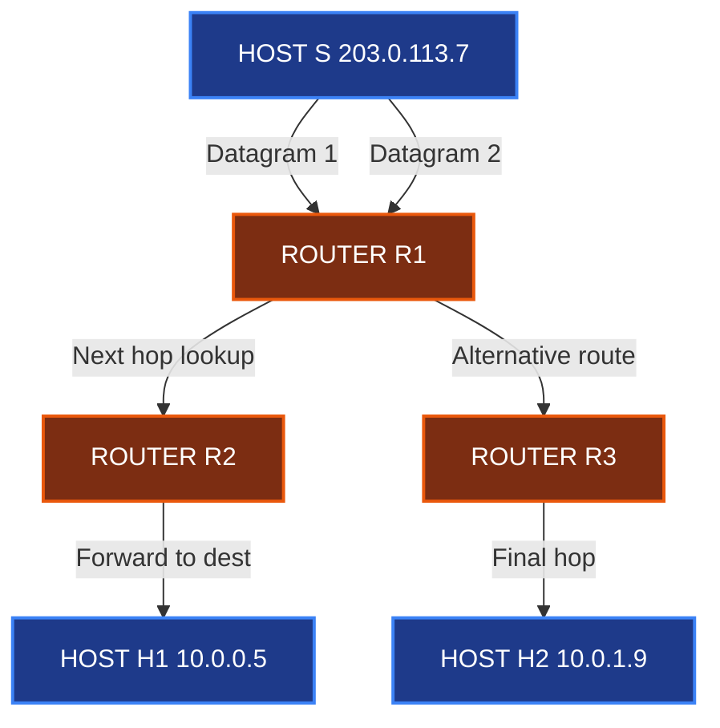
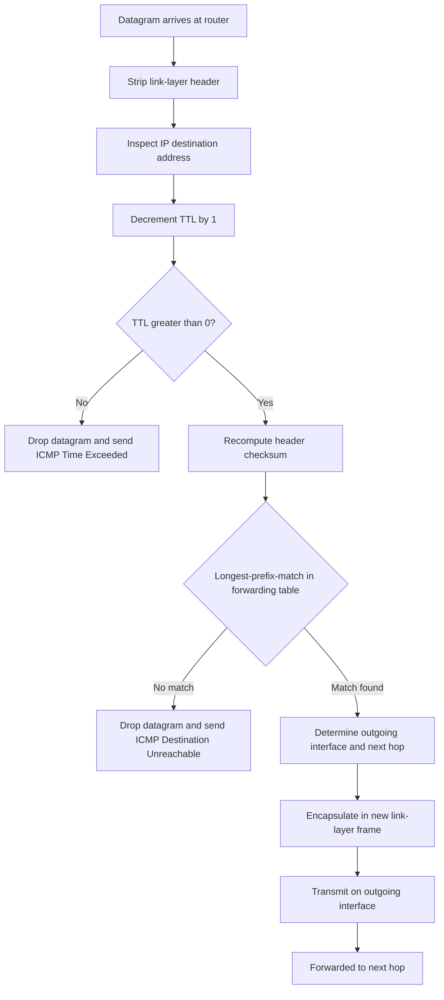
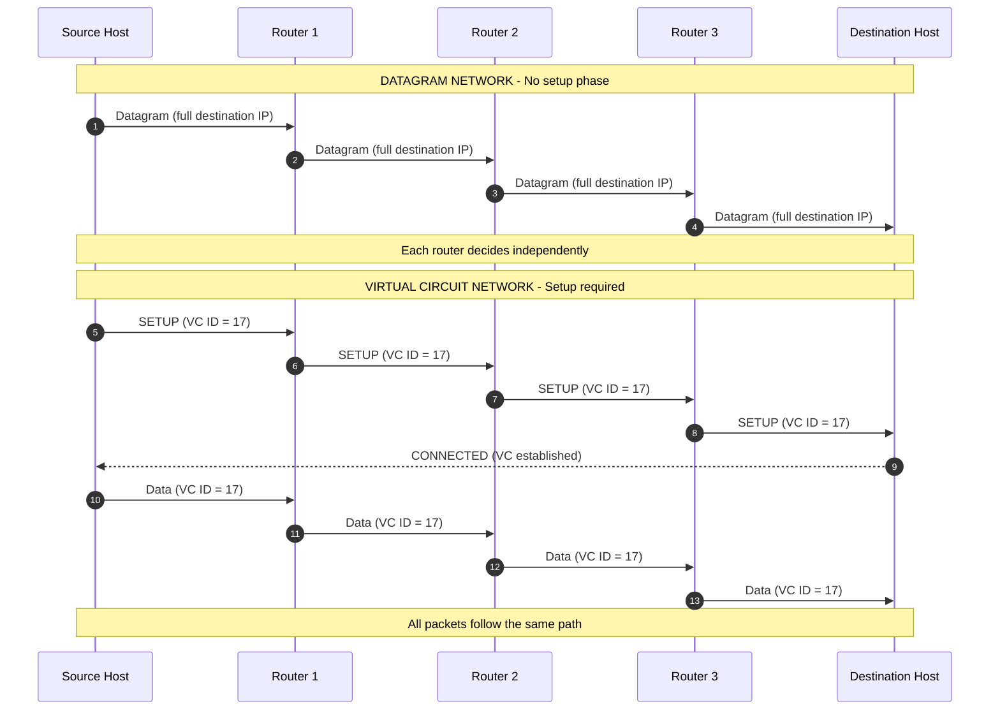
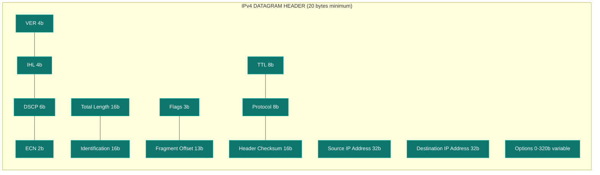

# Datagram Networks

<!-- SECTION_1_START -->
# Datagram Networks — The Connectionless Packet-Switching Paradigm

## 1.1 Formal Academic Definition (KTU 2024 Syllabus Aligned)

> [!IMPORTANT]
> **Datagram Network (Connectionless Packet-Switched Network):** A datagram network is a *packet-switched* communication architecture in which each packet — referred to as a **datagram** — is treated as an **independent, self-contained unit of data**. Every datagram carries the **complete destination address** in its header and is forwarded hop-by-hop through the network based on the *current* state of the router's forwarding table. No dedicated end-to-end path is established prior to transmission, and no per-flow state is maintained at intermediate routers.

A datagram network operates under the **Internet Protocol (IP)** model, where:
- The **network layer** provides a *connectionless, best-effort* service.
- Each datagram is routed **independently** — possibly along different paths.
- Routers use the packet's destination IP address as a lookup key into a **routing/forwarding table**.
- Datagrams may arrive **out of order**, **duplicated**, or **dropped**; reliability (if needed) is provided by upper layers (e.g., TCP).

---

## 1.2 Intuitive Analogy — The Postal System (Snail Mail)

Imagine you are sending a **postcard** to a friend across the country. On the postcard you write:
- Your friend's **full address** (name, street, city, PIN code).
- Your return address.

You drop the postcard into a mailbox. The postal system **does not** establish a dedicated physical "pipe" from your house to your friend's house. Instead:
1. The local post office reads the address.
2. Routes the card to the next sorting hub.
3. The next hub re-reads the address and forwards again.
4. … until it reaches the destination.

**Key insight:** Every hub makes an *independent* decision based on the address written on the card. Two postcards you send to the same friend at the same time may travel via **completely different routes** and arrive in **any order** — or one may even be lost.

> **A datagram is exactly this postcard, and a router is exactly the postal sorting hub.**

If you compare with a **telephone call** (Virtual Circuit), a dedicated path (circuit) is set up between you and your friend for the *entire duration* of the conversation, and all voice packets follow the same route in order.

| Postal Analogy (Datagram) | Network Equivalent |
|---------------------------|-------------------|
| Postcard with full address | Datagram with full destination IP |
| Sorting hub | Router |
| Postal routing tables | Router forwarding table |
| Different postcards → different routes | Different datagrams → different paths |
| Lost postcard (rare) | Dropped datagram (best-effort) |

---

## 1.3 Core Terminology

| Term | Definition |
|------|------------|
| **Datagram** | An independent, self-routed packet carrying full destination addressing information. |
| **Packet Switch** | A network-layer device (router) that forwards datagrams toward their destination. |
| **Store-and-Forward** | The technique where a router fully receives a packet before transmitting it on the next link. |
| **Forwarding Table** | A lookup table inside a router mapping destination prefixes → outgoing interfaces. |
| **Routing** | The *process of building* the forwarding table via algorithms (OSPF, BGP, etc.). |
| **Forwarding** | The *act of moving* a packet from input to output using the table — happens in nanoseconds. |
| **Best-Effort Service** | Network makes **no guarantees** about delivery, order, timing, or duplication. |
| **Hop-by-Hop Forwarding** | Each router makes an independent decision; no end-to-end path is reserved. |

---

## 1.4 Why Datagram Networks? — The Engineering Motivation

> [!NOTE]
> **Why not just build one big dedicated circuit (like the old telephone network)?**
> Because **bursty computer traffic** would waste the circuit 99% of the time. Datagram networks allow **statistical multiplexing** — multiple users share a link, and bandwidth is consumed only when a user actually has data to send.

Key advantages that drove the Internet to adopt datagram networking:
- **Robustness** — if one link/router fails, datagrams reroute automatically.
- **Flexibility** — different packets can take different paths based on current congestion.
- **No call setup** — eliminates latency before transmission (sending one packet is fast).
- **No per-flow state in routers** — millions of flows can be aggregated into a single routing table.

> [!VISUALIZATION CONTROL]
> **Concept:** Datagram forwarding through three routers to a destination host.
> **GeoGebra / Desmos Input Equations:**
> * Point sources: `(0,1)`, `(3,2.5)`, `(6,1.8)`, `(9,2.2)`, `(2,-1)`, `(7,-1.5)` representing Source S, Routers R1, R2, R3, and Hosts H1, H2.
> * Line segments: `f1(x) = piecewise path S→R1→R2→R3→H1` and `f2(x) = piecewise path S→R1→R2→H2`.
> **Visual Description:** Observe how two datagrams from the same source can exit through different intermediate routers and reach different hosts without a pre-established path. Each router chooses the next hop independently.

<!-- SECTION_1_END -->

<!-- SECTION_2_START -->
# Deep Theoretical Analysis & KTU Formula Sheet

## 2.1 Operational Architecture of a Datagram Network

A datagram network is built on the **five-layer Internet protocol stack** with the **Network Layer** playing the central role.

```
┌─────────────────────────────────────┐
│   APPLICATION (HTTP, FTP, DNS)      │
├─────────────────────────────────────┤
│   TRANSPORT (TCP / UDP)             │
├─────────────────────────────────────┤
│   NETWORK  (IP — connectionless)    │ ◄── Datagrams live here
├─────────────────────────────────────┤
│   LINK (Ethernet, Wi-Fi, PPP)       │
├─────────────────────────────────────┤
│   PHYSICAL (Cables, Radio, Fiber)   │
└─────────────────────────────────────┘
```

### The Journey of a Datagram — Step by Step

1. **Source Host Encapsulation:** Application data is passed to the transport layer, which adds its header (TCP/UDP). The resulting *segment* is handed to the network layer.
2. **Network Layer Wraps the Segment:** IP prepends its own header containing the **32-bit source IP** and **32-bit destination IP** plus other fields → this packet is the **datagram**.
3. **Link Layer Encapsulation:** The datagram is wrapped in a link-layer frame for transmission over the first physical hop.
4. **Router Receives (Store-and-Forward):** The router strips the link header, examines the **destination IP** in the IP header, and consults its **forwarding table**.
5. **Lookup & Decision:** Based on the longest-prefix match, the router determines the **outgoing interface** and the **next-hop IP address**.
6. **Re-encapsulation:** The router wraps the datagram in a new link-layer frame for the outgoing interface and transmits it.
7. **Repeat** at each router until the datagram reaches the destination network.
8. **Final Delivery:** The destination host's IP module receives the datagram, strips the IP header, and passes the segment up to the transport layer.

> [!IMPORTANT]
> Notice that the **IP header (source/destination) is NOT modified** at each router. Only the **link-layer addresses (MAC) change** at every hop. This is a key exam point!

---

## 2.2 Datagram vs. Virtual Circuit Network — The Master Comparison

| Feature | Datagram Network (Connectionless) | Virtual Circuit Network (Connection-Oriented) |
|---------|-----------------------------------|------------------------------------------------|
| **Setup Phase** | **None** — send immediately | **Required** — call setup before data transfer |
| **Path Decision** | Hop-by-hop, per-packet | Once at setup time, all packets follow same path |
| **State in Routers** | No per-flow state (only routing table) | Per-VC state in every switch on the path |
| **Packet Addressing** | Full destination address in **every** packet | Short **VC identifier** in each packet |
| **Failure Recovery** | Automatic rerouting around failures | Must tear down VC and establish a new one |
| **Packet Order** | May arrive out of order | Guaranteed in-order delivery |
| **Resource Reservation** | None (best-effort) | Possible (e.g., ATM, Frame Relay QoS) |
| **Analogy** | Postal service (postcards) | Telephone call (circuit) |
| **Examples** | **Internet (IP)**, UDP networks | X.25, Frame Relay, ATM, MPLS (with LSPs) |
| **Overhead per Packet** | Higher (full address ~20 bytes in IPv4) | Lower (VC ID typically 4 bytes) |

> [!NOTE]
> **Engineering Real-World Use:** The Internet is overwhelmingly a datagram network because (a) it scales better — routers don't need to remember millions of flows, and (b) the failure-resilience model of "just reroute" is far simpler than tearing down circuits. Datagram principles are also embedded in **MPLS LSPs** and **SDN (Software-Defined Networking)**, where flow tables look like forwarding tables.

---

## 2.3 IPv4 Datagram Header Format (Must Memorize for KTU)

```
 0                   1                   2                   3
 0 1 2 3 4 5 6 7 8 9 0 1 2 3 4 5 6 7 8 9 0 1 2 3 4 5 6 7 8 9 0 1
+-+-+-+-+-+-+-+-+-+-+-+-+-+-+-+-+-+-+-+-+-+-+-+-+-+-+-+-+-+-+-+-+
|Version|  IHL  |    DSCP   |ECN|         Total Length          |
+-+-+-+-+-+-+-+-+-+-+-+-+-+-+-+-+-+-+-+-+-+-+-+-+-+-+-+-+-+-+-+-+
|         Identification        |Flags|  Fragment Offset      |
+-+-+-+-+-+-+-+-+-+-+-+-+-+-+-+-+-+-+-+-+-+-+-+-+-+-+-+-+-+-+-+-+
|  Time to Live |    Protocol   |       Header Checksum         |
+-+-+-+-+-+-+-+-+-+-+-+-+-+-+-+-+-+-+-+-+-+-+-+-+-+-+-+-+-+-+-+-+
|                       Source Address                          |
+-+-+-+-+-+-+-+-+-+-+-+-+-+-+-+-+-+-+-+-+-+-+-+-+-+-+-+-+-+-+-+-+
|                    Destination Address                        |
+-+-+-+-+-+-+-+-+-+-+-+-+-+-+-+-+-+-+-+-+-+-+-+-+-+-+-+-+-+-+-+-+
|                    Options (if IHL > 5)                       |
+-+-+-+-+-+-+-+-+-+-+-+-+-+-+-+-+-+-+-+-+-+-+-+-+-+-+-+-+-+-+-+-+
```

| Field | Size (bits) | Purpose |
|-------|-------------|---------|
| **Version** | 4 | IP version (4 for IPv4, 6 for IPv6) |
| **IHL (Internet Header Length)** | 4 | Header length in 32-bit words (min 5, max 15) |
| **DSCP / ECN** | 8 | Quality of Service & congestion notification |
| **Total Length** | 16 | Entire datagram size in bytes (max **65,535**) |
| **Identification** | 16 | Used to reassemble fragments of original datagram |
| **Flags (DF, MF)** | 3 | Don't Fragment / More Fragments bits |
| **Fragment Offset** | 13 | Position of fragment in original datagram |
| **TTL (Time to Live)** | 8 | Decremented each hop; datagram dropped when **TTL = 0** |
| **Protocol** | 8 | Upper-layer protocol (6 = TCP, 17 = UDP, 1 = ICMP) |
| **Header Checksum** | 16 | One's-complement sum of the header (recomputed at each hop) |
| **Source IP Address** | 32 | Sender's IP |
| **Destination IP Address** | 32 | Final destination IP (never changed in transit) |
| **Options** | variable | Rarely used; e.g., Record Route, Timestamp |

---

## 2.4 The Four Sources of Packet Delay — Master Formula

When a datagram travels from source to destination across **N** links and **N−1** routers, the **end-to-end delay** is the sum of four distinct components at every node (host or router):

$$d_{\text{nodal}} = d_{\text{proc}} + d_{\text{queue}} + d_{\text{trans}} + d_{\text{prop}}$$

And the total end-to-end delay is:

$$d_{\text{end-to-end}} = N \cdot (d_{\text{proc}} + d_{\text{trans}} + d_{\text{prop}}) + (N-1) \cdot d_{\text{queue,avg}}$$

### KTU High-Yield Formula Sheet

| Symbol | Quantity | Formula | Units |
|--------|----------|---------|-------|
| $d_{\text{proc}}$ | Processing delay (per node) | Lookup in forwarding table, error check | ms |
| $d_{\text{queue}}$ | Queuing delay (per router) | $\frac{L \cdot a}{R - L \cdot a}$ (M/M/1 approximation) where $L$ = packet length, $a$ = arrival rate, $R$ = link rate | ms |
| $d_{\text{trans}}$ | Transmission delay (per link) | $\dfrac{L}{R} = \dfrac{\text{packet length (bits)}}{\text{link bandwidth (bps)}}$ | seconds |
| $d_{\text{prop}}$ | Propagation delay (per link) | $\dfrac{d}{s} = \dfrac{\text{link length (m)}}{\text{propagation speed (m/s)}}$ | seconds |
| $L_{\text{max}}$ | Max datagram size (IPv4) | **$2^{16} - 1 = 65{,}535$ bytes** | bytes |
| $L_{\text{frag}}$ | Max IP fragment size | **MTU − IP header** (e.g., Ethernet MTU = 1500 → IP payload = 1480) | bytes |
| $T$ (Throughput) | Bottleneck link rate | $T = \min(R_1, R_2, \dots, R_N)$ | bps |
| File Transfer Time | Total transmission time | $\dfrac{F}{T} + d_{\text{prop,total}} + \text{control overhead}$ | seconds |
| **Store-and-Forward Multiplier** | Time to push a packet across N store-and-forward links of equal rate R | $N \cdot \dfrac{L}{R}$ | seconds |

> [!IMPORTANT]
> **Critical exam point — Transmission vs Propagation:** Transmission is the time to **push all bits of a packet onto the link** (depends on packet size and link bandwidth). Propagation is the time for **one bit to travel from one end of the link to the other** (depends on distance and medium). Students commonly confuse these.

### 2.4.1 Derivation of the Throughput Bottleneck Formula

Consider a path consisting of $N$ links with rates $R_1, R_2, \dots, R_N$ in bits per second. The sender transmits a burst of $F$ bits.

- On the **first link**, the burst is pushed at rate $R_1$, taking $F/R_1$ seconds.
- It then moves to the second link and is pushed at rate $R_2$, taking $F/R_2$ seconds.
- After the burst is "in the pipe," the next burst can begin on link 1 — but the *effective* end-to-end throughput is limited by the **slowest link** the burst must traverse.

$$T_{\text{end-to-end}} = \min(R_1, R_2, \dots, R_N) \quad \text{(bits per second)}$$

This is why engineers call the slowest link the **bottleneck link** and focus optimization efforts there.

---

## 2.5 Packet Loss, Jitter & Congestion

- **Packet Loss:** When a router's queue overflows (queue full), newly arriving datagrams are **dropped**. The transport layer (TCP) detects this and triggers retransmission.
- **Jitter:** Variable inter-packet arrival times caused by varying queue lengths at different routers. Real-time applications (VoIP, video) often mitigate jitter with a **playout buffer**.
- **Congestion Control:** End-systems (TCP) react to perceived loss by reducing their sending rate, while routers may signal congestion using **Explicit Congestion Notification (ECN)** bits in the IP header.

> [!NOTE]
> **Real-world engineering use:** Datagram networks underpin the entire public Internet. CDN providers (Akamai, Cloudflare) build **anycast** networks where the *same* IP prefix is advertised from many geographically distributed routers, and BGP routes each datagram to the *nearest* healthy instance — a beautiful application of datagram routing flexibility.

---

## 2.6 Fragmentation in Datagram Networks

When a router receives a datagram larger than the **MTU (Maximum Transmission Unit)** of the outgoing link, two design choices exist:
- **Fragmentation (IPv4):** The router splits the datagram into smaller pieces, each with its own IP header, and forwards them. The destination host reassembles them using the *Identification* field.
- **Do Not Fragment (DF) bit set:** If DF=1, the router **drops** the datagram and sends an **ICMP "Fragmentation Needed"** message back to the source. **IPv6 forbids router fragmentation entirely** and uses Path MTU Discovery.

> [!WARNING]
> **Common KTU mistake:** Students often say "fragmentation happens at every router." It only happens when the outgoing link's MTU is smaller than the datagram size, and **only IPv4 routers are allowed to fragment**. IPv6 routers must drop the packet.

<!-- SECTION_2_END -->

<!-- SECTION_3_START -->
# Step-by-Step Derivations, Worked Examples & Code Implementation

## 3.1 Worked Example 1 — End-to-End Delay Calculation (Classic KTU Problem)

> **Problem:** A host A sends a datagram of size $L = 1500$ bytes to host B across a path that traverses **3 links** and **2 routers**.
> - Each link has bandwidth $R = 1$ Mbps.
> - Each link's physical length is $d = 2000$ km.
> - Propagation speed in the medium is $s = 2 \times 10^{8}$ m/s.
> - Processing delay at each node is $d_{\text{proc}} = 1$ ms.
> - Queuing delay at each router is $d_{\text{queue}} = 2$ ms.
> - Assume store-and-forward transmission at each router.
>
> **Compute the total end-to-end delay.**

### Step 1 — Convert all units to seconds (SI)

$$L = 1500 \text{ bytes} = 1500 \times 8 = 12{,}000 \text{ bits}$$

$$R = 1 \text{ Mbps} = 10^{6} \text{ bits/sec}$$

$$d = 2000 \text{ km} = 2 \times 10^{6} \text{ m}$$

### Step 2 — Compute the transmission delay per link

$$d_{\text{trans}} = \frac{L}{R} = \frac{12{,}000}{10^{6}} = 0.012 \text{ s} = 12 \text{ ms}$$

### Step 3 — Compute the propagation delay per link

$$d_{\text{prop}} = \frac{d}{s} = \frac{2 \times 10^{6}}{2 \times 10^{8}} = 0.01 \text{ s} = 10 \text{ ms}$$

### Step 4 — Sum the per-node delay

$$d_{\text{nodal}} = d_{\text{proc}} + d_{\text{trans}} + d_{\text{prop}} = 1 + 12 + 10 = 23 \text{ ms}$$

### Step 5 — Compute total end-to-end delay

There are **3 transmission events** (one per link, due to store-and-forward) and **2 router-queue delays** (only at routers, not at the source or destination host):

$$d_{\text{end-to-end}} = 3 \cdot d_{\text{trans}} + 3 \cdot d_{\text{prop}} + 3 \cdot d_{\text{proc}} + 2 \cdot d_{\text{queue}}$$

$$= 3(12) + 3(10) + 3(1) + 2(2) \text{ ms}$$

$$= 36 + 30 + 3 + 4 = 73 \text{ ms}$$

> [!IMPORTANT]
> **Valuation Tip (KTU 2024):** Marks are awarded for (i) correct unit conversion [1 mark], (ii) correct formula selection [1 mark], (iii) accurate arithmetic [1 mark], (iv) final numerical answer with units [1 mark]. Always show formulas before substituting.

---

## 3.2 Worked Example 2 — Throughput and File Transfer Time

> **Problem:** A user downloads a file of size $F = 1$ MB from a server. The path consists of three links with rates $R_1 = 5$ Mbps, $R_2 = 2$ Mbps, and $R_3 = 10$ Mbps. Assume no other traffic.
> **(a)** What is the end-to-end throughput?
> **(b)** How long does the download take (ignoring propagation)?

### Step 1 — Identify the bottleneck

$$T = \min(R_1, R_2, R_3) = \min(5, 2, 10) = 2 \text{ Mbps}$$

### Step 2 — Convert file size to bits

$$F = 1 \text{ MB} = 1 \times 10^{6} \times 8 = 8 \times 10^{6} \text{ bits}$$

(Using the common convention $1 \text{ MB} = 10^{6}$ bytes; if the lecturer uses $2^{20}$ bytes, adjust accordingly.)

### Step 3 — Compute transfer time

$$t = \frac{F}{T} = \frac{8 \times 10^{6}}{2 \times 10^{6}} = 4 \text{ seconds}$$

> **Key Insight:** Even though the first and last links are 5 Mbps and 10 Mbps, the **bottleneck 2 Mbps link** dictates the overall rate. This is a favorite KTU question to test conceptual understanding.

---

## 3.3 Worked Example 3 — Fragmentation in IPv4

> **Problem:** A datagram of size $4000$ bytes (with a 20-byte IP header) must be forwarded over a link with MTU = 1500 bytes. The DF bit is 0. Show all fragment sizes and offsets.

### Step 1 — Determine payload size per fragment

Each fragment must have its own 20-byte IP header, so the **payload per fragment** $\leq 1500 - 20 = 1480$ bytes.

> **Engineering rule:** Fragment sizes should be **multiples of 8 bytes** (because the Fragment Offset field is in 8-byte units). $1480$ is already a multiple of 8. 

### Step 2 — Compute original payload

$$\text{Original payload} = 4000 - 20 = 3980 \text{ bytes}$$

### Step 3 — Split the payload

- **Fragment 1:** Payload = $1480$ bytes, offset = $0$, MF = 1
- **Fragment 2:** Payload = $1480$ bytes, offset = $1480/8 = 185$, MF = 1
- **Fragment 3:** Payload = $3980 - 2960 = 1020$ bytes, offset = $2960/8 = 370$, MF = 0 (last fragment)

### Step 4 — Total size on the wire

| Fragment | Total Size (header + payload) | Offset | MF bit |
|----------|-------------------------------|--------|--------|
| 1 | $20 + 1480 = 1500$ bytes | 0 | 1 |
| 2 | $20 + 1480 = 1500$ bytes | 185 | 1 |
| 3 | $20 + 1020 = 1040$ bytes | 370 | 0 |

> [!NOTE]
> The destination host reassembles the datagram using the *Identification* field (same in all fragments) and the *Fragment Offset* field.

---

## 3.4 Symbolic Implementation — Python Code (Datagram Forwarding Simulator)

Below is a fully runnable Python simulation of a **datagram router** with a forwarding table, longest-prefix-match lookup, and TTL decrement.

```python
"""
datagram_router.py
A simplified, education-grade datagram network router simulator.
Demonstrates store-and-forward, TTL decrement, and longest-prefix match.
"""

from dataclasses import dataclass, field
from typing import Optional, Dict, List, Tuple
import ipaddress
import logging

# Configure structured logging for professional observability
logging.basicConfig(
    level=logging.INFO,
    format="%(asctime)s [%(levelname)s] %(message)s"
)
logger = logging.getLogger("DatagramRouter")


@dataclass
class Datagram:
    """Represents a single IP datagram in transit."""
    src_ip: str
    dst_ip: str
    ttl: int
    payload: bytes
    identification: int
    protocol: str = "TCP"

    def __repr__(self) -> str:
        return (
            f"Datagram(id={self.identification}, "
            f"src={self.src_ip}, dst={self.dst_ip}, ttl={self.ttl}, "
            f"proto={self.protocol})"
        )


@dataclass
class RouteEntry:
    """A single entry in the router's forwarding table."""
    prefix: str          # e.g. "192.168.1.0/24"
    next_hop: str        # IP address of next router
    outgoing_interface: str

    def network(self) -> ipaddress.IPv4Network:
        return ipaddress.IPv4Network(self.prefix, strict=False)


class DatagramRouter:
    """
    Implements a datagram-forwarding router with:
      - Store-and-forward semantics
      - TTL decrement and drop on expiry
      - Longest-prefix-match forwarding table lookup
    """

    def __init__(self, router_id: str) -> None:
        self.router_id: str = router_id
        self.forwarding_table: List[RouteEntry] = []
        self.datagrams_dropped: int = 0
        self.datagrams_forwarded: int = 0

    def add_route(
        self,
        prefix: str,
        next_hop: str,
        outgoing_interface: str
    ) -> None:
        """Insert a route into the forwarding table."""
        entry = RouteEntry(
            prefix=prefix,
            next_hop=next_hop,
            outgoing_interface=outgoing_interface
        )
        self.forwarding_table.append(entry)
        logger.info(
            f"[{self.router_id}] Added route: {prefix} -> "
            f"{next_hop} via {outgoing_interface}"
        )

    def lookup(self, dst_ip: str) -> Optional[RouteEntry]:
        """
        Perform longest-prefix-match lookup for the destination IP.
        Returns the most specific matching route, or None if no match.
        """
        try:
            target = ipaddress.IPv4Address(dst_ip)
        except ipaddress.AddressValueError as exc:
            logger.error(f"Invalid destination IP {dst_ip}: {exc}")
            return None

        best_match: Optional[RouteEntry] = None
        longest_prefix: int = -1

        for entry in self.forwarding_table:
            if target in entry.network():
                prefix_len = entry.network().prefixlen
                if prefix_len > longest_prefix:
                    longest_prefix = prefix_len
                    best_match = entry

        return best_match

    def forward(self, datagram: Datagram) -> Tuple[str, Optional[str]]:
        """
        Process a datagram: decrement TTL, then forward or drop.
        Returns (status, next_hop_ip) tuple.
        """
        # Step 1: Decrement TTL (mandatory at every router)
        datagram.ttl -= 1

        # Step 2: Check TTL expiry (ICMP Time Exceeded would be sent)
        if datagram.ttl <= 0:
            self.datagrams_dropped += 1
            logger.warning(
                f"[{self.router_id}] DROPPED {datagram} - TTL expired"
            )
            return ("DROPPED_TTL", None)

        # Step 3: Longest-prefix-match lookup
        route = self.lookup(datagram.dst_ip)
        if route is None:
            self.datagrams_dropped += 1
            logger.warning(
                f"[{self.router_id}] DROPPED {datagram} - no route to host"
            )
            return ("DROPPED_NOROUTE", None)

        # Step 4: Forward (store-and-forward)
        self.datagrams_forwarded += 1
        logger.info(
            f"[{self.router_id}] FORWARDED {datagram} -> "
            f"{route.outgoing_interface} ({route.next_hop})"
        )
        return ("FORWARDED", route.next_hop)


def simulate_end_to_end() -> None:
    """
    Simulate a datagram traveling Source -> R1 -> R2 -> Destination.
    Demonstrates hop-by-hop independent forwarding decisions.
    """
    # Build the topology
    r1 = DatagramRouter("R1")
    r1.add_route("10.0.0.0/8",  "192.168.1.2", "eth0")
    r1.add_route("0.0.0.0/0",   "192.168.1.254", "eth1")  # default route

    r2 = DatagramRouter("R2")
    r2.add_route("10.0.0.5/32", "10.0.0.5", "eth0")  # directly connected
    r2.add_route("0.0.0.0/0",   "192.168.2.254", "eth1")

    # Craft the datagram
    datagram = Datagram(
        src_ip="203.0.113.7",
        dst_ip="10.0.0.5",
        ttl=64,
        payload=b"Hello, datagram world!",
        identification=12345
    )

    logger.info(f"--- Sending initial datagram: {datagram} ---")
    status, _ = r1.forward(datagram)
    assert status == "FORWARDED"

    status, _ = r2.forward(datagram)
    assert status == "FORWARDED"

    # Simulate a TTL-expiry scenario
    exhausted = Datagram(
        src_ip="203.0.113.7",
        dst_ip="10.0.0.99",
        ttl=1,                # will be decremented to 0
        payload=b"boundary case",
        identification=99
    )
    logger.info(f"--- Sending low-TTL datagram: {exhausted} ---")
    status, _ = r1.forward(exhausted)
    assert status == "DROPPED_TTL"

    # Summary
    logger.info(
        f"R1 forwarded={r1.datagrams_forwarded}, "
        f"dropped={r1.datagrams_dropped}"
    )
    logger.info(
        f"R2 forwarded={r2.datagrams_forwarded}, "
        f"dropped={r2.datagrams_dropped}"
    )


if __name__ == "__main__":
    simulate_end_to_end()
```

### Sample Run Output (excerpt)

```
2025-01-15 10:00:00 [INFO] [R1] Added route: 10.0.0.0/8 -> 192.168.1.2 via eth0
2025-01-15 10:00:00 [INFO] [R1] Added route: 0.0.0.0/0 -> 192.168.1.254 via eth1
2025-01-15 10:00:00 [INFO] --- Sending initial datagram: Datagram(id=12345, src=203.0.113.7, dst=10.0.0.5, ttl=64, proto=TCP) ---
2025-01-15 10:00:00 [INFO] [R1] FORWARDED Datagram(...) -> eth0 (192.168.1.2)
2025-01-15 10:00:00 [INFO] [R2] FORWARDED Datagram(...) -> eth0 (10.0.0.5)
2025-01-15 10:00:00 [WARNING] [R1] DROPPED Datagram(...) - TTL expired
```

> [!NOTE]
> The Python code is deliberately written with type hints, logging, and explicit error paths because real-world router software (e.g., **FRRouting**, **Bird**) uses similar patterns. Students preparing for placements may find this snippet useful for interviews.

---

## 3.5 Comparative Table — Datagrams in Real Protocols

| Protocol / System | Datagram or VC? | Notes |
|-------------------|------------------|-------|
| **IPv4 / IPv6** | Datagram | Pure connectionless network layer |
| **UDP** | Datagram at transport layer | Adds port numbers; still unreliable |
| **TCP** | Built **on top of** datagram IP | Provides reliability on top of an unreliable datagram service |
| **MPLS** | Virtual Circuit (LSPs) | Label-switched paths — looks like VC, runs over datagram IP |
| **ATM** | Virtual Circuit | Cell-based, connection-oriented, designed for telecom QoS |
| **Frame Relay** | Virtual Circuit | Legacy WAN technology |
| **VXLAN** | Datagram encapsulation | Tunnels Ethernet frames over UDP/IP datagrams — used in data centers |

<!-- SECTION_3_END -->

<!-- SECTION_4_START -->
# Structural Diagrams & Schematics

## 4.1 Datagram Network Topology (Mermaid)



> **Visual interpretation:** Two datagrams from the *same* source host take *different* paths through the network and arrive at *different* destinations. Each router makes an independent forwarding decision based on its current forwarding table.

---

## 4.2 Datagram Forwarding Logic (Mermaid Flowchart)



> This flowchart represents the **per-packet processing pipeline** in a datagram router. Every datagram undergoes this sequence independently — no shared state with previous datagrams.

---

## 4.3 Datagram vs. Virtual Circuit — Visual Comparison (Mermaid Sequence)



---

## 4.4 Datagram Header Field Layout (Mermaid Block Diagram)



> [!NOTE]
> **Total header size = 20 bytes (no options) up to 60 bytes (with options).** This is a frequently asked KTU question.

---

## 4.5 Sequential Processing Topology Matrix

| Stage | Process | Module Responsible | Key Action |
|-------|---------|-------------------|-----------|
| 1 | Application Data Generation | App Layer (HTTP, FTP) | Creates payload |
| 2 | Transport Segmentation | TCP / UDP | Adds port numbers + sequence info |
| 3 | Network Encapsulation | IP Module | Adds 20-byte IP header → datagram |
| 4 | Link Encapsulation | NIC Driver | Wraps in Ethernet/Wi-Fi frame |
| 5 | Physical Transmission | PHY Layer | Converts to electrical/optical signals |
| 6 | Router Reception | NIC + Driver | Receives bits, reassembles frame |
| 7 | Router Processing | Routing Engine | Lookup, TTL decrement, checksum |
| 8 | Router Forwarding | Switching Fabric | Sends to outgoing interface |
| 9 | Hop-by-Hop Continuation | Multiple Routers | Repeat Stages 6-8 |
| 10 | Final Host Reception | Destination IP Module | Strips IP header, passes to transport |
| 11 | Reassembly / Delivery | Transport Layer | Delivers data to application socket |

<!-- SECTION_4_END -->

<!-- SECTION_5_START -->
# KTU 2024 Scheme Examination Question Bank & Topic Recap

## 5.1 Part A — Short Answer Questions (2 × 3 = 6 Marks)

---

### Question 1 (3 Marks) `[KTU University Exam - July 2024]`

**(CO1, Remember)**  
**Q:** Define a *datagram network*. How does it differ from a *virtual-circuit network* in terms of path establishment?

**Model Answer (3 Marks):**

A **datagram network** is a packet-switched network in which each packet, called a **datagram**, is routed independently through the network. Every datagram contains the **complete destination address** in its header, and **no dedicated path is established** before data transmission. Each router makes forwarding decisions hop-by-hop based on its current routing table. (2 Marks)

In contrast, a **virtual-circuit network** requires a **connection setup phase** before any data is sent. A logical path (virtual circuit) is established from source to destination, and all subsequent packets follow this same path identified by a short **VC identifier**. (1 Mark)

> **Valuation Key:** [Definition of datagram: 1 Mark] [Independent routing: 1 Mark] [Difference: VC setup required: 1 Mark]

---

### Question 2 (3 Marks) `[KTU University Exam - Dec 2023]`

**(CO1, Understand)**  
**Q:** List any **four fields** of the IPv4 datagram header and state the purpose of each.

**Model Answer (3 Marks):**

| Field | Size | Purpose |
|-------|------|---------|
| **Version** (1 Mark) | 4 bits | Indicates IP version (4 for IPv4) |
| **Time-to-Live (TTL)** (1 Mark) | 8 bits | Limits datagram lifetime; decremented at each hop; packet dropped when TTL = 0 |
| **Source IP Address** (0.5 Mark) | 32 bits | IP address of the originating host |
| **Destination IP Address** (0.5 Mark) | 32 bits | IP address of the final destination host |

> **Valuation Key:** Any four correctly named fields with their **correct purpose** earn full 3 marks. Half-mark for partial purpose description.

---

## 5.2 Part B — Long Answer Questions (Internal Choice, 14 Marks)

---

### Question A (14 Marks) `[KTU University Exam - July 2024]`

**(CO1, CO2 — Understand + Apply)**

#### Part (a) — 7 Marks (Understand)

**Q:** Explain the **four sources of packet delay** in a datagram network with relevant formulas. How is the **end-to-end delay** computed when a packet traverses multiple store-and-forward links?

**Model Answer (7 Marks):**

The **four types of packet delay** experienced by a datagram as it travels from one node to the next are:

**1. Processing Delay ($d_{\text{proc}}$)** — 1.5 Marks  
The time required for the router to examine the packet's header, determine the outgoing interface, and perform error checking. Typically on the order of microseconds.

**2. Queuing Delay ($d_{\text{queue}}$)** — 1.5 Marks  
The time a packet waits in the router's buffer (queue) before being transmitted. It depends on the **congestion level** of the outgoing link and can be modelled using queuing theory. For an M/M/1 queue:

$$d_{\text{queue}} = \frac{L \cdot a}{R - L \cdot a}$$

where $L$ is the packet length, $a$ is the average packet arrival rate, and $R$ is the link bandwidth.

**3. Transmission Delay ($d_{\text{trans}}$)** — 1.5 Marks  
The time required to push **all the bits** of the packet onto the link:

$$d_{\text{trans}} = \frac{L}{R}$$

**4. Propagation Delay ($d_{\text{prop}}$)** — 1.5 Marks  
The time required for **one bit** to travel from the sender to the receiver across the physical medium:

$$d_{\text{prop}} = \frac{d}{s}$$

where $d$ is the link length and $s$ is the propagation speed in the medium.

**Total per-node delay** (1 Mark):

$$d_{\text{nodal}} = d_{\text{proc}} + d_{\text{queue}} + d_{\text{trans}} + d_{\text{prop}}$$

For a path of $N$ links and $(N-1)$ routers using **store-and-forward** transmission, the **end-to-end delay** is:

$$d_{\text{end-to-end}} = N \cdot (d_{\text{proc}} + d_{\text{trans}} + d_{\text{prop}}) + (N-1) \cdot d_{\text{queue,avg}}$$

---

#### Part (b) — 7 Marks (Apply)

**Q:** Consider sending a file of size $F = 4 \times 10^{6}$ bits from Host A to Host B over a path of **two links** and **one router**.  
- Link 1: $R_1 = 200$ kbps  
- Link 2: $R_2 = 1$ Mbps  
- Propagation delay on each link: $d_{\text{prop}} = 5$ ms  
- Processing + queuing delay at the router: $d_{\text{proc+queue}} = 3$ ms  

**Compute:**
1. The **end-to-end throughput** of the file transfer.
2. The **total time** required to deliver the entire file (assume store-and-forward and that the file is sent as one large message).

**Model Answer (7 Marks):**

**Step 1 — Identify the bottleneck (1 Mark):**

$$T = \min(R_1, R_2) = \min(200 \text{ kbps}, 1 \text{ Mbps}) = 200 \text{ kbps} = 2 \times 10^{5} \text{ bps}$$

**Step 2 — Compute transmission delays (2 Marks):**

$$d_{\text{trans},1} = \frac{F}{R_1} = \frac{4 \times 10^{6}}{2 \times 10^{5}} = 20 \text{ s}$$

$$d_{\text{trans},2} = \frac{F}{R_2} = \frac{4 \times 10^{6}}{10^{6}} = 4 \text{ s}$$

**Step 3 — Sum all delays (2 Marks):**

- Link 1 transmission: 20 s
- Link 1 propagation: 5 ms = 0.005 s
- Router processing+queuing: 3 ms = 0.003 s
- Link 2 transmission: 4 s
- Link 2 propagation: 5 ms = 0.005 s

$$d_{\text{total}} = 20 + 0.005 + 0.003 + 4 + 0.005 = 24.013 \text{ s}$$

**Step 4 — State the final answer (1 Mark):**

- **End-to-end throughput:** $T = 200$ kbps (bottleneck is Link 1)
- **Total delivery time:** $\approx 24.013$ s ≈ **24.01 seconds**

**Step 5 — Cross-check using throughput formula (1 Mark):**

$$t = \frac{F}{T} = \frac{4 \times 10^{6}}{2 \times 10^{5}} = 20 \text{ s (transmission-dominated portion)}$$

The slight excess over 20 s is due to propagation and processing delays, confirming our sum.

> **Valuation Key:** [Bottleneck identification: 1 Mark] [Two transmission delay calculations: 2 Marks] [Summation with units: 2 Marks] [Final answers: 1 Mark] [Cross-check: 1 Mark]

---

### Question B (14 Marks) — Alternative Choice `[KTU University Exam - Dec 2023]`

**(CO1, CO2 — Understand + Apply)**

#### Part (a) — 7 Marks (Understand)

**Q:** With a neat diagram, explain the **format of an IPv4 datagram header**. State the size and purpose of each field.

**Model Answer (7 Marks):**

**Diagram (3 Marks)** — Draw the 32-bit aligned header layout showing all the major fields as shown in Section 2.3 of these notes. Field labels and bit widths must be clearly indicated.

**Field Descriptions (4 Marks — distribute as shown):**

| Field | Size (bits) | Purpose | Marks |
|-------|-------------|---------|-------|
| Version | 4 | Specifies IP version (4 or 6) | 0.5 |
| IHL | 4 | Header length in 32-bit words (min 5, max 15) | 0.5 |
| DSCP / ECN | 8 | QoS marking & explicit congestion notification | 0.5 |
| Total Length | 16 | Total datagram size in bytes (max 65,535) | 0.5 |
| Identification | 16 | Used for reassembly of fragments | 0.5 |
| Flags + Fragment Offset | 3 + 13 | Control fragmentation; offset in 8-byte units | 0.5 |
| TTL | 8 | Hop counter; prevents infinite loops | 0.5 |
| Protocol | 8 | Upper-layer protocol (6 = TCP, 17 = UDP) | 0.5 |
| Header Checksum | 16 | One's-complement sum of header (recomputed at each hop) | 0.5 |

---

#### Part (b) — 7 Marks (Apply)

**Q:** A datagram of size **4000 bytes** (with a **20-byte IP header**, so 3980 bytes of payload) must traverse a link with **MTU = 1500 bytes**. The DF bit is **0**.  
**Compute the number of fragments, their sizes, and the fragment offsets.** (Assume fragments must have sizes that are multiples of 8 bytes for the offset field.)

**Model Answer (7 Marks):**

**Step 1 — Determine fragment payload size (2 Marks):**

Each fragment can carry at most $1500 - 20 = 1480$ bytes of payload.  
Since 1480 is already a multiple of 8, we can use 1480 as the maximum payload per fragment.

**Step 2 — Compute number of fragments (1 Mark):**

$$\text{Number of full-size fragments} = \left\lfloor \frac{3980}{1480} \right\rfloor = 2$$

$$\text{Remaining bytes} = 3980 - 2 \times 1480 = 1020 \text{ bytes}$$

Total fragments: **3** (two full + one partial)

**Step 3 — Construct the fragment table (3 Marks):**

| Fragment | Total Size (bytes) | Payload (bytes) | Offset (in 8-byte units) | MF bit |
|----------|-------------------|-----------------|--------------------------|--------|
| 1 | 1500 | 1480 | 0 | 1 |
| 2 | 1500 | 1480 | 185 | 1 |
| 3 | 1040 | 1020 | 370 | 0 |

**Step 4 — Verify offsets (1 Mark):**

- Fragment 2 offset = $1480 / 8 = 185$ ✓
- Fragment 3 offset = $(1480 + 1480) / 8 = 370$ ✓
- All payloads are multiples of 8 ✓

> **Valuation Key:** [Payload size computation: 2 Marks] [Number of fragments: 1 Mark] [Three rows of fragment table: 3 Marks] [Verification of offsets: 1 Mark]

---

## 5.3 KTU Examiner's Valuation Warning

> [!WARNING]
> **Common Pitfalls — Where Students Lose Marks**
> 
> 1. **Confusing Transmission and Propagation Delays:** Transmission = pushing bits onto the link; Propagation = bit traveling through the medium. Mixing them up costs full marks in delay problems. **Always write the formula first** ($L/R$ for transmission, $d/s$ for propagation) before substituting values.
> 
> 2. **Forgetting Unit Conversion:** $1$ byte $= 8$ bits. Many students divide bytes by bps directly, producing an answer off by a factor of 8. **Always convert L to bits and R to bps** before applying the $L/R$ formula.
> 
> 3. **Store-and-Forward Multiplier:** A packet crossing $N$ store-and-forward links incurs $N$ transmission delays, not just one. Students commonly add only one $d_{\text{trans}}$ term and lose 2-3 marks.
> 
> 4. **Bottleneck Misidentification:** Throughput equals the **minimum** link rate along the path, not the average. If asked "what is the throughput?" write $\min(R_1, R_2, \dots, R_N)$ explicitly.
> 
> 5. **Fragment Offset Units:** The Fragment Offset field is in **8-byte units**, so offsets must be multiplied/divided by 8. Many students write the byte offset directly and lose 1-2 marks.
> 
> 6. **TTL Decrement Location:** Students sometimes think TTL is decremented only at the destination. It is decremented at **every router hop**, and the packet is dropped when TTL reaches 0.
> 
> 7. **Datagram vs. Frame Confusion:** The **IP header is not modified** at routers (source/destination IP stay the same); only the **link-layer (MAC) addresses change** at every hop. This is a frequently asked trick question.

---

## 5.4 Topic Recap & Important Things to Remember

> [!IMPORTANT]
> **Rapid-Revision Checklist — Datagram Networks**

### Core Definitions
- **Datagram** = independent, self-routed packet with **full destination address** in every header.
- **Datagram Network** = connectionless packet-switched network (no setup, no per-flow state).
- **Best-Effort Service** = no delivery, ordering, or timing guarantees from the network.
- **Store-and-Forward** = full packet must be received before any bit is transmitted on the next link.
- **Forwarding vs. Routing** = Forwarding is the local lookup action (nanoseconds); Routing is the global process of building tables (algorithms like OSPF, BGP).

### Architectural Properties
- **Hop-by-Hop Forwarding:** Each router makes an independent decision.
- **Routing Table / Forwarding Table:** Maps destination prefixes → outgoing interfaces and next-hop IPs.
- **Longest-Prefix Match:** The most specific matching entry is chosen.
- **No Call Setup:** Datagrams can be sent immediately — no handshake.

### IPv4 Header (must-memorize fields)
- Total Length (max 65,535 bytes), TTL (8 bits, decremented at each hop), Protocol (6=TCP, 17=UDP), Header Checksum (recomputed at each router), Source/Destination IP (32 bits each, not modified in transit).

### Delay Formula (the big one)
- $d_{\text{nodal}} = d_{\text{proc}} + d_{\text{queue}} + d_{\text{trans}} + d_{\text{prop}}$
- Transmission delay = $L/R$ (packet size ÷ link bandwidth).
- Propagation delay = $d/s$ (link length ÷ propagation speed).
- End-to-end delay with store-and-forward across $N$ links: $N \cdot (d_{\text{proc}} + d_{\text{trans}} + d_{\text{prop}}) + (N-1) \cdot d_{\text{queue}}$.

### Throughput & Bottleneck
- $T_{\text{end-to-end}} = \min(R_1, R_2, \dots, R_N)$.
- File transfer time $\approx F / T_{\text{end-to-end}}$ (ignoring propagation overhead).

### Fragmentation Rules
- **IPv4:** Routers may fragment if datagram > MTU; offset in 8-byte units; MF bit = 1 for all but last fragment.
- **IPv6:** Routers **never fragment**; if too big, packet is dropped and ICMP "Packet Too Big" is sent.
- **MTU** of standard Ethernet = 1500 bytes → IP payload = 1480 bytes.

### Datagram vs. Virtual Circuit (most-tested comparison)
- **Datagram:** No setup, full address per packet, independent routing, robust to failures, may arrive out of order. Example: **Internet (IP)**.
- **Virtual Circuit:** Setup required, short VC ID per packet, fixed path, in-order delivery, vulnerable to single-path failures. Examples: **ATM, Frame Relay, X.25**.

### Real-World Use
- **Internet** is built on datagram networking (IP).
- **TCP** runs on top of IP to add reliability.
- **MPLS** and **SDN** use flow/forwarding tables inspired by datagram routers.
- **CDN Anycast** exploits datagram routing to direct users to the nearest server.

### Common Numerical Constants
- IP header (no options) = **20 bytes**; max with options = **60 bytes**.
- Max IPv4 datagram = **65,535 bytes**.
- Ethernet MTU = **1500 bytes**.
- Standard IPv4 address = **32 bits**.
- IPv6 address = **128 bits**.

<!-- SECTION_5_END -->
