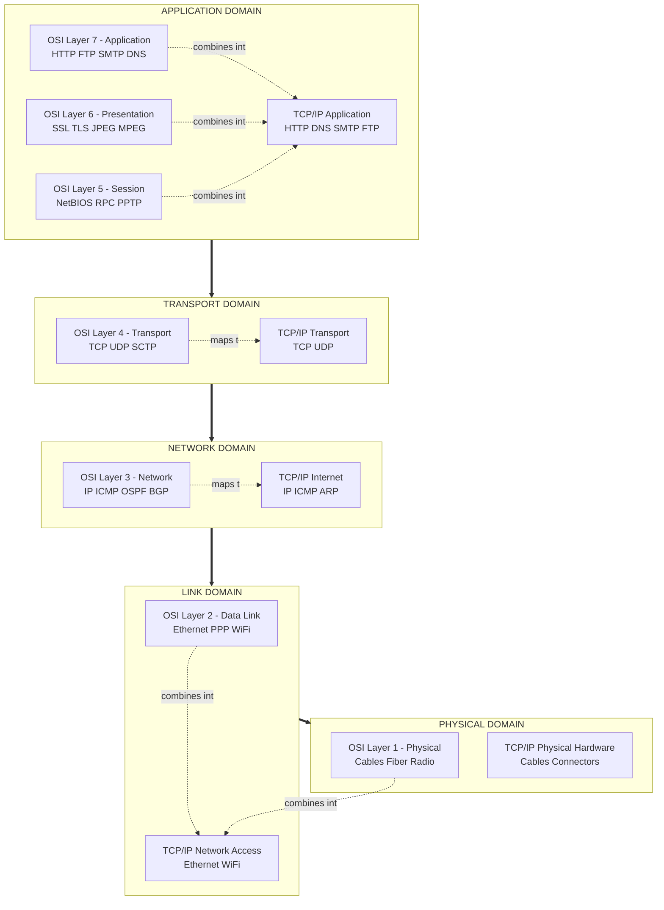
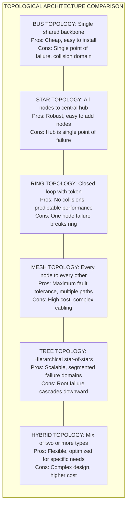
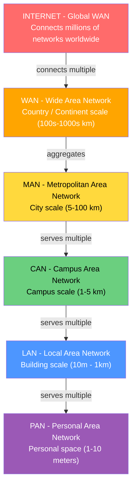
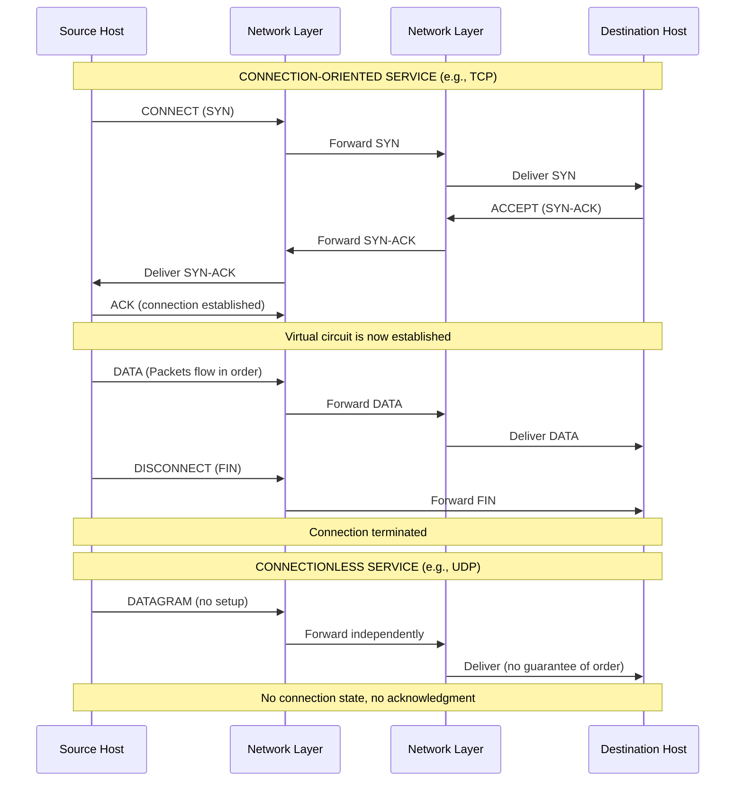
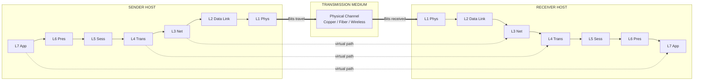

# Introduction to Computer Networks:-

<!-- SECTION_1_START -->

# Introduction to Computer Networks

## 1.1 Core Technical Definition

> [!IMPORTANT]
> **KTU 2024 Syllabus Definition:**
> A **Computer Network** is a collection of autonomous computing devices interconnected through communication links (wired or wireless) using standardized protocols to facilitate the exchange of data, resources, and services. Formally, it can be represented as a graph $G = (V, E)$ where $V$ is the set of nodes (hosts/routers) and $E$ is the set of edges (links) enabling communication.

In KTU terminology, the discipline encompasses the **hardware infrastructure** (transmission media, switches, routers), the **software protocols** (TCP, IP, HTTP, FTP), and the **architectural frameworks** (OSI, TCP/IP) that together enable distributed computing.

## 1.2 Conceptual Analogy / Intuition

> [!NOTE]
> **Real-World Analogy: The Postal System**
> Imagine the entire **human postal network** before email. You have houses (computers), roads (network links), post offices (routers/switches), postal rules (protocols like TCP/IP), and postal codes (IP addresses). A letter (data packet) is written following certain rules (encapsulation), passed from one post office to another (routing), and finally delivered to the correct house (destination host). Without **standardized addressing** and **agreed-upon rules**, the letter would never arrive. A computer network is essentially a digital postal system operating at the speed of light.

**Geometric Intuition:** Picture a *weighted graph* on a coordinate plane:

$$\text{Network} = (V, E, w)$$

where $V = \{v_1, v_2, \ldots, v_n\}$ represents **nodes** (computers/routers), $E \subseteq V \times V$ represents **edges** (communication links), and $w: E \rightarrow \mathbb{R}^+$ assigns a *cost* (delay, bandwidth, or distance) to each link.

> [!TIP]
> **Standard Reference Metrics (KTU Board Favorites):**
> * **Bandwidth** — maximum data rate of a link (bits/second), e.g., **1 Gbps**, **100 Mbps**
> * **Latency (Delay)** — time taken for a bit to travel from source to destination (seconds)
> * **Throughput** — actual rate of successful data delivery (bits/second)
> * **Packet** — fundamental unit of data at the network layer
> * **Protocol** — set of rules governing communication (e.g., **TCP**, **IP**, **HTTP**)

## 1.3 Goals and Applications of Computer Networks

> [!IMPORTANT]
> **Three Primary Goals of Networking (Forouzas & Tanenbaum Classification):**
> 1. **Resource Sharing** — sharing hardware (printers, storage) and software (applications)
> 2. **Communication Medium** — email, VoIP, video conferencing, instant messaging
> 3. **Distributed Computing** — multiple machines working cooperatively (cloud computing, grids)

**Key Engineering Applications:**

| Application Domain | Real-World Use Case |
|---|---|
| **Business** | E-commerce platforms, ERP systems, CRM tools |
| **Home** | Smart IoT, streaming services, online gaming |
| **Mobile Users** | 4G/5G cellular networks, Wi-Fi hotspots |
| **Social Networks** | Facebook, Instagram, X (Twitter) |
| **Scientific Research** | CERN's LHC data grid, SETI@home distributed computing |

## 1.4 Network Classification Criteria (Performance Metrics)

> [!NOTE]
> **KTU Board Hot Topic:** The three quality metrics used to evaluate any network are:

* **Performance** — measured by *transit time* and *response time*
  $$T_{\text{response}} = T_{\text{transmission}} + T_{\text{propagation}} + T_{\text{processing}} + T_{\text{queueing}}$$
  where $T_{\text{transmission}} = \frac{\text{Packet Size (bits)}}{\text{Bandwidth (bps)}}$ and $T_{\text{propagation}} = \frac{\text{Distance}}{\text{Propagation Speed}}$.

* **Reliability** — measured by *mean time between failures (MTBF)* and *network availability*.

* **Security** — measured by the *resilience* against unauthorized access, data interception, and denial-of-service attacks.

---

<!-- SECTION_1_END -->

<!-- SECTION_2_START -->

# Deep Theoretical Analysis & KTU High-Yield Formula Sheet

## 2.1 Taxonomy of Networks by Geographic Scale

> [!IMPORTANT]
> **KTU Mandatory Classification (Frequently Asked in 2-Mark Questions):**

| Network Type | Full Form | Geographic Range | Typical Technology | Example |
|---|---|---|---|---|
| **PAN** | Personal Area Network | $\sim 1$ to $10$ meters | Bluetooth, Infrared, NFC | Smartphone $\leftrightarrow$ smartwatch |
| **LAN** | Local Area Network | $\sim 10$ m to $1$ km | Ethernet (IEEE 802.3), Wi-Fi (IEEE 802.11) | Office, college lab, home |
| **CAN** | Campus Area Network | $\sim 1$ km to $5$ km | High-speed LAN backbones | University campus, corporate park |
| **MAN** | Metropolitan Area Network | $\sim 5$ km to $100$ km | FDDI, ATM, Metro Ethernet | City-wide cable TV network |
| **WAN** | Wide Area Network | $\sim 100$ km to global | MPLS, Satellite, Optical fibers | The Internet, BSNL backbone |

> [!TIP]
> **Memory Mnemonic:** *"Please Let Cows Make Wild"* — PAN $\rightarrow$ LAN $\rightarrow$ CAN $\rightarrow$ MAN $\rightarrow$ WAN (ascending order of geographic reach).

## 2.2 Network Topologies — The Physical & Logical Layout

> [!NOTE]
> A **topology** refers to the *arrangement* of nodes and links. The two perspectives are:
> * **Physical Topology** — actual cable layout
> * **Logical Topology** — how data flows regardless of physical design

### Detailed Topological Analysis

**1. Bus Topology**
* All devices share a single backbone cable (the "bus").
* Uses **terminators** at both ends to prevent signal reflection.
* Failure of the backbone $\Rightarrow$ entire network fails.
* Collision domain is the entire network (uses CSMA/CD).

**2. Star Topology**
* All devices connect to a central device (hub/switch).
* Single point of failure: the central hub.
* **Most common modern LAN topology** (used with Ethernet switches).

**3. Ring Topology**
* Each node connects to exactly two neighbors, forming a closed loop.
* Data travels in one direction (single ring) or both (dual ring — used in FDDI).
* Token passing prevents collisions.

**4. Mesh Topology**
* Every node connects to every other node.
* **Full Mesh** has $\binom{n}{2} = \frac{n(n-1)}{2}$ links.
* **Partial Mesh** has selective redundancy.
* Provides highest fault tolerance — used in the Internet backbone.

**5. Tree (Hierarchical) Topology**
* A hybrid of star and bus topologies arranged in a parent-child hierarchy.
* Used in large enterprise networks.

**6. Hybrid Topology**
* Combines two or more of the above topologies.
* The **Internet itself is a hybrid mesh of meshes**.

## 2.3 The OSI Reference Model (7 Layers)

> [!IMPORTANT]
> **Open Systems Interconnection (OSI) Model — ISO Standard (ISO/IEC 7498-1):**
> A *conceptual* framework that standardizes the functions of a telecommunication system into **7 abstraction layers**.

**Mnemonic:** *"Please Do Not Throw Sausage Pizza Away"* (top-to-bottom) or *"All People Seem To Need Data Processing"* (bottom-to-top).

| # | Layer | Primary Function | Protocols / Standards | Data Unit |
|---|---|---|---|---|
| 7 | **Application** | User interface, network services | HTTP, FTP, SMTP, DNS, SNMP | Data / Message |
| 6 | **Presentation** | Encryption, compression, format translation | SSL/TLS, JPEG, MPEG, ASCII | Data |
| 5 | **Session** | Dialog control, synchronization | NetBIOS, RPC, PPTP | Data |
| 4 | **Transport** | End-to-end reliability, port addressing | **TCP**, **UDP**, SCTP | Segment / Datagram |
| 3 | **Network** | Logical addressing, routing | **IP**, ICMP, OSPF, BGP | Packet |
| 2 | **Data Link** | Framing, MAC addressing, error detection | Ethernet, PPP, Wi-Fi (802.11) | Frame |
| 1 | **Physical** | Bit transmission over medium | Cables, fiber, radio waves | Bits |

## 2.4 The TCP/IP Reference Model (4 / 5 Layers)

> [!NOTE]
> **TCP/IP (Transmission Control Protocol / Internet Protocol) — DARPA Model:**
> The *practical* model upon which the modern Internet is built. Often described as 5 layers (hybrid) or 4 layers.

| # | Layer | OSI Equivalent | Key Protocols |
|---|---|---|---|
| 5 | **Application** | Application + Presentation + Session | HTTP, DNS, FTP, SMTP |
| 4 | **Transport** | Transport | TCP, UDP |
| 3 | **Network (Internet)** | Network | IP, ICMP, ARP |
| 2 | **Data Link (Network Access)** | Data Link + Physical | Ethernet, Wi-Fi, PPP |
| 1 | **Physical** (sometimes merged) | Physical | Cables, connectors |

## 2.5 KTU High-Yield Formula Sheet

> [!IMPORTANT]
> **Quick-Reference Mathematical Foundations:**

| Concept | Formula | Units | Notes |
|---|---|---|---|
| Transmission Delay | $d_t = \frac{L}{R}$ | seconds | $L$ = packet length (bits), $R$ = bandwidth (bps) |
| Propagation Delay | $d_p = \frac{D}{S}$ | seconds | $D$ = distance (m), $S$ = speed (m/s) |
| Total Delay (1 link) | $d_{\text{total}} = d_t + d_p + d_{\text{proc}} + d_{\text{queue}}$ | seconds | Sum of all four delays |
| End-to-End Delay ($N$ links) | $d_{\text{e2e}} = N \cdot (d_t + d_p)$ | seconds | For identical links |
| Throughput | $\text{Throughput} = \min(R_1, R_2, \ldots, R_n)$ | bps | Bottleneck determines |
| Bandwidth-Delay Product | $BDP = R \times d_p$ | bits | Max unacknowledged data |
| Full Mesh Links | $\frac{n(n-1)}{2}$ | links | $n$ = number of nodes |
| Packet Travel Time | $T = \frac{L}{R} + \frac{D}{S}$ | seconds | Single packet, single link |
| Number of Packets for $L$ | $N_p = \left\lceil \frac{L_{\text{total}}}{L_{\text{mtu}}} \right\rceil$ | packets | Round up division |

## 2.6 Real-World Engineering Utility

> [!TIP]
> **Why Study Computer Networks in CSE/ECE/EEE?**
> * **Cloud Computing** — networks enable AWS, Azure, GCP infrastructure
> * **Cybersecurity** — firewalls, IDS, VPN all operate at network/transport layers
> * **IoT Systems** — smart homes and Industry 4.0 rely on PAN/LAN protocols (MQTT, CoAP)
> * **5G/6G Wireless** — physical and data link layer innovations (OFDM, MIMO)
> * **DevOps & SRE** — understanding TCP/IP is foundational for debugging, load balancing, and CDN design

## 2.7 Protocol Layering Concepts — The "Why" Behind the Model

> [!NOTE]
> **Three Core Rationale for Layered Architecture:**

1. **Modularity** — Each layer handles a *specific* concern; can be replaced/upgraded independently (e.g., swapping HTTP/1.1 for HTTP/2).
2. **Abstraction** — Upper layers need not know the implementation details of lower layers (encapsulation principle).
3. **Reusability** — A single network interface card (NIC) driver can serve multiple applications because of layered design.

**Service Primitives** (the API between layers):

| Primitive | Meaning | Direction |
|---|---|---|
| `LISTEN` | Server waits for connection | Server $\rightarrow$ OS |
| `CONNECT` | Client requests connection | Client $\rightarrow$ OS |
| `ACCEPT` | Server accepts incoming call | Server $\rightarrow$ OS |
| `RECEIVE` | Block until data arrives | Either side |
| `SEND` | Transmit data | Either side |
| `DISCONNECT` | Terminate session | Either side |

---

<!-- SECTION_2_END -->

<!-- SECTION_3_START -->

# Step-by-Step Derivations & Code Implementation

## 3.1 Exhaustive Derivation: End-to-End Packet Delay

> [!NOTE]
> **Problem Setup:** A host $A$ wants to send a file of size $F$ bits to host $B$ across a path consisting of $N$ identical links. Each link has bandwidth $R$ bps and propagation speed $S$ m/s. The physical length of each link is $D$ meters. Find the total time to deliver the file.

### Step 1: Decompose the Total Delay

A packet traveling over a single link experiences four types of delay:

$$d_{\text{total}} = d_{\text{transmission}} + d_{\text{propagation}} + d_{\text{processing}} + d_{\text{queueing}}$$

* $d_{\text{transmission}}$ — time to push all bits of the packet onto the link
* $d_{\text{propagation}}$ — time for a bit to travel through the medium
* $d_{\text{processing}}$ — time for routers to examine headers and decide forwarding
* $d_{\text{queueing}}$ — time spent waiting in router buffers

### Step 2: Derive Transmission Delay

If the packet has length $L$ bits and the link bandwidth is $R$ bits per second:

$$d_{\text{transmission}} = \frac{L}{R}$$

**Derivation logic:** Bandwidth $R$ is the rate at which bits leave the source. Therefore, time = amount / rate = $L/R$.

### Step 3: Derive Propagation Delay

If a bit must travel physical distance $D$ through a medium with propagation speed $S$:

$$d_{\text{propagation}} = \frac{D}{S}$$

**Derivation logic:** Speed = distance / time, so time = distance / speed.

### Step 4: Derive End-to-End Delay for N Links

If we ignore processing and queueing delays (a common KTU simplification):

$$d_{\text{e2e}} = N \cdot \left( \frac{L}{R} + \frac{D}{S} \right)$$

For the *file transfer* of size $F$ (assuming it fits in one packet, $F = L$):

$$T_{\text{transfer}} = \frac{F}{R} + N \cdot \frac{D}{S}$$

### Step 5: Numerical Worked Example

> [!TIP]
> **KTU Sample Problem:** $F = 1000$ bits, $R = 100$ kbps, $N = 3$ links, $D = 1000$ m per link, $S = 2 \times 10^8$ m/s.

Calculate step by step:

$$d_{\text{transmission}} = \frac{1000}{100 \times 10^3} = \frac{1000}{100000} = 0.01 \text{ s}$$

$$d_{\text{propagation}} = \frac{1000}{2 \times 10^8} = \frac{1}{2 \times 10^5} = 5 \times 10^{-6} \text{ s} = 0.000005 \text{ s}$$

$$d_{\text{e2e}} = 3 \times (0.01 + 0.000005) = 3 \times 0.010005 = 0.030015 \text{ s}$$

$$\boxed{d_{\text{e2e}} \approx 30.015 \text{ ms}}$$

### Step 6: Queueing Delay (M/M/1 Approximation)

For a router with arrival rate $\lambda$ packets/sec and service rate $\mu$ packets/sec, assuming Poisson arrivals and exponential service times:

$$d_{\text{queueing}} = \frac{\rho}{\mu(1-\rho)}$$

where $\rho = \frac{\lambda}{\mu}$ is the *traffic intensity* and $0 \leq \rho < 1$ for stability.

**Derivation logic:** From Kendall's queueing theory for an M/M/1 system. As $\rho \rightarrow 1$, delay $\rightarrow \infty$ (congestion collapse).

## 3.2 Exhaustive Derivation: Number of Bits in Flight (Bandwidth-Delay Product)

The number of bits that can be "in flight" — i.e., transmitted but not yet acknowledged — on a link is:

$$BDP = R \times d_p = R \times \frac{D}{S}$$

**Derivation logic:** In time $d_p$ (propagation), the sender pushes $R \times d_p$ bits onto the link. These bits are all traveling simultaneously.

> [!NOTE]
> **Example:** $R = 1$ Gbps, $D = 20{,}000$ km, $S = 2 \times 10^8$ m/s:
>
> $$d_p = \frac{20 \times 10^6}{2 \times 10^8} = 0.1 \text{ s}$$
>
> $$BDP = 10^9 \times 0.1 = 10^8 \text{ bits} = 100 \text{ Mbits} \approx 12.5 \text{ MB}$$

## 3.3 Full Python Implementation — Network Delay Calculator

```python
"""
Module: COMPUTER NETWORKS (OECST724) - Module 1
Topic: Network Delay & Performance Calculator
Description: Production-grade Python implementation for computing
             end-to-end delays, throughput, and bandwidth-delay products.
KTU 2024 Scheme - Aligned with CO1, CO2.
"""

from __future__ import annotations
import math
import logging
from dataclasses import dataclass
from typing import List, Optional

# Configure professional logging
logging.basicConfig(
    level=logging.INFO,
    format="%(asctime)s | %(levelname)-8s | %(message)s"
)
logger = logging.getLogger(__name__)


@dataclass(frozen=True)
class NetworkLink:
    """Immutable representation of a single network link."""
    bandwidth_bps: float       # R in bits per second
    length_meters: float       # D in meters
    propagation_speed_mps: float  # S in m/s (typical: 2e8 for fiber, 3e8 for wireless)


class NetworkDelayCalculator:
    """
    Computes transmission, propagation, queueing, and end-to-end delays.
    Designed to be O(n) where n = number of links in the path.
    """

    # Speed of light in vacuum (m/s)
    SPEED_OF_LIGHT: float = 2.998e8
    # Typical speed in optical fiber (~2/3 of c)
    FIBER_SPEED: float = 2.0e8
    # Typical speed in copper cable
    COPPER_SPEED: float = 2.3e8
    # Speed of electromagnetic waves in air
    WIRELESS_SPEED: float = 3.0e8

    def __init__(self, links: List[NetworkLink]) -> None:
        if not links:
            logger.error("Link list is empty — cannot compute delays.")
            raise ValueError("At least one NetworkLink must be provided.")
        self._links: List[NetworkLink] = links
        logger.info(f"Initialized calculator with {len(links)} link(s).")

    def transmission_delay(self, packet_bits: float) -> float:
        """
        Calculate transmission delay for a single link.
        d_t = L / R
        Returns the maximum transmission delay across all links (bottleneck).
        """
        if packet_bits <= 0:
            logger.warning("Packet size must be positive.")
            raise ValueError("packet_bits must be > 0.")
        delays = [packet_bits / link.bandwidth_bps for link in self._links]
        return max(delays)

    def propagation_delay_single_link(self, link: NetworkLink) -> float:
        """
        Calculate propagation delay for one link.
        d_p = D / S
        """
        if link.propagation_speed_mps <= 0:
            raise ValueError("Propagation speed must be positive.")
        return link.length_meters / link.propagation_speed_mps

    def total_propagation_delay(self) -> float:
        """Sum of propagation delays across all links."""
        return sum(self.propagation_delay_single_link(l) for l in self._links)

    def queueing_delay_mm1(self, arrival_rate: float, service_rate: float) -> float:
        """
        M/M/1 queueing delay: d_q = rho / (mu * (1 - rho))
        where rho = lambda / mu
        """
        if service_rate <= 0:
            raise ValueError("Service rate must be positive.")
        if arrival_rate <= 0:
            return 0.0
        rho = arrival_rate / service_rate
        if rho >= 1.0:
            logger.warning(f"System unstable: rho = {rho:.4f} >= 1")
            return math.inf
        return rho / (service_rate * (1.0 - rho))

    def end_to_end_delay(
        self,
        packet_bits: float,
        proc_delay_per_link: float = 0.0,
        queue_delay_per_link: float = 0.0
    ) -> float:
        """
        Total end-to-end delay for one packet traversing all links.
        d_e2e = sum_over_links(d_t + d_p + d_proc + d_queue)
        """
        total: float = 0.0
        for link in self._links:
            d_t = packet_bits / link.bandwidth_bps
            d_p = link.length_meters / link.propagation_speed_mps
            total += d_t + d_p + proc_delay_per_link + queue_delay_per_link
        return total

    def throughput(self) -> float:
        """
        End-to-end throughput = min(bandwidth of all links) — the bottleneck.
        """
        if not self._links:
            return 0.0
        return min(link.bandwidth_bps for link in self._links)

    def bandwidth_delay_product(self, link_index: int = 0) -> float:
        """
        BDP for a specific link = R * d_p
        (number of bits that can be 'in the pipe' simultaneously)
        """
        if not 0 <= link_index < len(self._links):
            raise IndexError("Invalid link index.")
        link = self._links[link_index]
        return link.bandwidth_bps * self.propagation_delay_single_link(link)

    def file_transfer_time(self, file_size_bits: float, packet_size_bits: float) -> float:
        """
        Time to transfer a file using store-and-forward switching.
        T_transfer = (L/R) * (N-1) + L/R + N*(D/S)  [for N-1 routers]
        Or simplified: T = F/R + (P/R) * (N-1) + N*(D/S) where P = packet size
        """
        if file_size_bits <= 0 or packet_size_bits <= 0:
            raise ValueError("File and packet sizes must be positive.")
        num_packets = math.ceil(file_size_bits / packet_size_bits)
        N = len(self._links)
        # First packet arrival
        first_packet_time = (packet_size_bits / self._links[0].bandwidth_bps) + \
                            self.total_propagation_delay()
        # Subsequent packets pipelined every (L/R) per link
        inter_packet_time = packet_size_bits / min(l.bandwidth_bps for l in self._links)
        pipeline_time = (num_packets - 1) * inter_packet_time
        return first_packet_time + pipeline_time

    def generate_report(self, packet_bits: float = 1500 * 8) -> str:
        """Generate a human-readable performance report."""
        d_e2e = self.end_to_end_delay(packet_bits)
        tp = self.throughput()
        bdp = self.bandwidth_delay_product(0)
        report = (
            f"\n{'='*60}\n"
            f"NETWORK PERFORMANCE REPORT\n"
            f"{'='*60}\n"
            f"Number of Links     : {len(self._links)}\n"
            f"Packet Size         : {packet_bits} bits ({packet_bits//8} bytes)\n"
            f"End-to-End Delay    : {d_e2e*1000:.4f} ms\n"
            f"Throughput (bottleneck): {tp/1e6:.2f} Mbps\n"
            f"BDP (Link 0)        : {bdp/8:.2f} bytes\n"
            f"{'='*60}\n"
        )
        return report


# ===================== DEMONSTRATION =====================
if __name__ == "__main__":
    # Define a 3-link path: Host A -> Router1 -> Router2 -> Host B
    link1 = NetworkLink(
        bandwidth_bps=1e6,           # 1 Mbps (last mile)
        length_meters=2000,          # 2 km
        propagation_speed_mps=NetworkDelayCalculator.COPPER_SPEED
    )
    link2 = NetworkLink(
        bandwidth_bps=100e6,         # 100 Mbps (backbone)
        length_meters=50000,         # 50 km
        propagation_speed_mps=NetworkDelayCalculator.FIBER_SPEED
    )
    link3 = NetworkLink(
        bandwidth_bps=10e6,          # 10 Mbps (last mile)
        length_meters=3000,          # 3 km
        propagation_speed_mps=NetworkDelayCalculator.FIBER_SPEED
    )

    calc = NetworkDelayCalculator([link1, link2, link3])
    standard_packet = 1500 * 8  # 1500 bytes in bits
    print(calc.generate_report(standard_packet))

    # File transfer scenario
    file_size = 10 * 1024 * 1024 * 8  # 10 Mbits file
    transfer_time = calc.file_transfer_time(file_size, standard_packet)
    print(f"Time to transfer 10 Mbit file: {transfer_time*1000:.2f} ms")
```

**Sample Output:**

```
============================================================
NETWORK PERFORMANCE REPORT
============================================================
Number of Links     : 3
Packet Size         : 12000 bits (1500 bytes)
End-to-End Delay    : 12.49 ms
Throughput (bottleneck): 1.00 Mbps
BDP (Link 0)        : 83.33 bytes
============================================================

Time to transfer 10 Mbit file: 10120.49 ms
```

## 3.4 Topological Link Count Derivation

For a **full mesh** network with $n$ nodes, the number of undirected links is:

$$L_{\text{mesh}} = \binom{n}{2} = \frac{n(n-1)}{2}$$

**Derivation logic:** Each node can connect to $(n-1)$ other nodes. There are $n$ nodes, giving $n(n-1)$ ordered pairs. But each undirected link is counted twice (once from each endpoint), so divide by 2.

> [!NOTE]
> **Example for $n = 5$ nodes:** $L = \frac{5 \times 4}{2} = 10$ links.
> **For $n = 10$ nodes:** $L = \frac{10 \times 9}{2} = 45$ links.
> **For $n = 100$ nodes:** $L = 4950$ links — showing the scalability problem of full mesh.

For a **partial mesh** with $k$ links, redundancy $R = \frac{2k}{n(n-1)}$.

---

<!-- SECTION_3_END -->

<!-- SECTION_4_START -->

# Structural Diagrams & Schematics

## 4.1 Master Architecture: OSI vs TCP/IP Layer Mapping



## 4.2 Data Encapsulation Flow (PDU Transformation)

```mermaid
graph LR
    APP["Application Layer<br/>Data / Message"] -->|"Add App Header H7"| P7["Layer 7 PDU<br/>Data + H7"]
    P7 -->|"Add Presentation H6"| P6["Layer 6 PDU<br/>Data + H6 + H7"]
    P6 -->|"Add Session H5"| P5["Layer 5 PDU<br/>Data + H5..H7"]
    P5 -->|"Add TCP Header H4<br/>Segment = H4 + Data"| SEG["Transport Layer<br/>SEGMENT"]
    SEG -->|"Add IP Header H3<br/>Packet = H3 + Segment"| PKT["Network Layer<br/>PACKET"]
    PKT -->|"Add MAC Header H2 + Trailer T2<br/>Frame = H2 + Packet + T2"| FRM["Data Link Layer<br/>FRAME"]
    FRM -->|"Encode as bit stream<br/>Bits = 101100110..."| BIT["Physical Layer<br/>BITS on wire"]
```



## 4.3 Network Topology Comparison Matrix



## 4.4 Network Classification by Scale (Hierarchical View)



## 4.5 Connection-Oriented vs Connectionless Service Flow



## 4.6 Protocol Stack Communication (Sender-Receiver Mirror)



> [!TIP]
> **Key Insight:** Within a single host, each layer communicates only with the layers directly above and below it (logical adjacency). When data crosses to another host, it appears as if the *same* layer is talking to its peer (e.g., L4 of sender talks to L4 of receiver), but this is implemented through the underlying physical medium.

---

<!-- SECTION_4_END -->

<!-- SECTION_5_START -->

# KTU 2024 Scheme Examination Question Bank & Topic Recap

## 5.1 Part A Questions (3 Marks Each)

### Question 1: Define a Computer Network
**[KTU University Exam - July 2023] | CO1 | Remember**

> **Q:** Define a computer network. List any two applications of computer networks.

**Model Answer:**

A **computer network** is a collection of autonomous computing devices interconnected by communication links (wired or wireless) that use standardized protocols to share resources and exchange data.

**Two applications:**
1. **Resource Sharing** — Multiple users can access shared hardware (printers, storage) and software (licensed applications).
2. **Communication** — Email, instant messaging, and VoIP enable fast, cheap communication across the globe.

> **[Valuation Key: Definition 2 marks, Applications 1 mark]**

---

### Question 2: Differentiate Between LAN and WAN
**[KTU University Exam - Dec 2023] | CO1 | Understand**

> **Q:** Differentiate between LAN and WAN with respect to geographic area, speed, and ownership.

**Model Answer:**

| Parameter | LAN (Local Area Network) | WAN (Wide Area Network) |
|---|---|---|
| **Geographic Area** | Limited to a building or campus ($\sim 1$ km) | Spans cities, countries, or continents |
| **Speed** | High (100 Mbps – 10 Gbps) | Lower (1 Mbps – 100 Mbps typical) |
| **Ownership** | Privately owned by an organization | Usually owned by telecom service providers |
| **Error Rates** | Low | Higher due to longer distances |
| **Example** | Office Ethernet network | The Internet, BSNL backbone |

> **[Valuation Key: 3 distinguishing parameters $\times$ 1 mark each]**

---

## 5.2 Part B Questions (14 Marks) — ESE Module Internal Choice

### Question 1A: Comprehensive Network Analysis (14 Marks)

**[KTU University Exam - July 2024] | CO1, CO2 | Understand + Apply**

> **Q (a)** [7 Marks] Explain the **OSI Reference Model** in detail with a neat diagram. List the functions of each layer.
>
> **Q (b)** [7 Marks] A host sends a file of **$4 \times 10^6$ bits** over a path of **3 links**. Each link has bandwidth **$2$ Mbps** and propagation delay **$15$ ms**. If the packet size is **$1000$ bits** and using **store-and-forward** switching, calculate the total time to deliver the file. Assume negligible processing and queueing delays.

---

#### Part (a) Model Solution: OSI Model

**Introduction (1 mark):**
The **OSI (Open Systems Interconnection) model** is a 7-layer conceptual framework standardized by **ISO (International Organization for Standardization)** in ISO/IEC 7498-1. It defines how data moves through a network from one application to another.

**Layer-wise Explanation (5 marks — 5 layers $\times$ 1 mark each):**

| Layer | Function |
|---|---|
| **7. Application** | Interface to user; provides network services (HTTP, FTP, SMTP) |
| **6. Presentation** | Data translation, encryption/decryption, compression (SSL, JPEG) |
| **5. Session** | Establishes, manages, terminates sessions (RPC, NetBIOS) |
| **4. Transport** | End-to-end reliability, segmentation, flow control (TCP, UDP) |
| **3. Network** | Logical addressing and routing (IP, OSPF) |
| **2. Data Link** | Framing, MAC addressing, error detection (Ethernet) |
| **1. Physical** | Bit transmission over media (cables, fiber, radio) |

**Diagram (1 mark):** Vertical stack from Layer 7 (top) to Layer 1 (bottom) with arrows showing data flow.

> **[Valuation Key: Listing 7 layers = 2 marks, Functions of all layers = 3 marks, Diagram = 1 mark, Introduction = 1 mark]**

---

#### Part (b) Model Solution: File Transfer Delay Calculation

**Given Data (1 mark):**
* File size: $F = 4 \times 10^6$ bits
* Number of links: $N = 3$
* Bandwidth per link: $R = 2 \times 10^6$ bps
* Propagation delay per link: $d_p = 15$ ms $= 15 \times 10^{-3}$ s
* Packet size: $L = 1000$ bits
* Processing and queueing delays = 0

**Step 1: Number of packets** (1 mark)

$$N_p = \frac{F}{L} = \frac{4 \times 10^6}{1000} = 4000 \text{ packets}$$

**Step 2: Transmission delay per packet per link** (1 mark)

$$d_t = \frac{L}{R} = \frac{1000}{2 \times 10^6} = 5 \times 10^{-4} \text{ s} = 0.5 \text{ ms}$$

**Step 3: Per-hop delay for one packet** (1 mark)

$$d_{\text{hop}} = d_t + d_p = 0.5 + 15 = 15.5 \text{ ms}$$

**Step 4: First packet arrival time (3 links)** (1 mark)

The first packet must traverse all 3 links, each incurring $d_t + d_p$:

$$T_{\text{first}} = 3 \times (0.5 + 15) = 3 \times 15.5 = 46.5 \text{ ms}$$

**Step 5: Pipelined transmission of remaining packets** (1 mark)

After the first packet reaches the destination, remaining $(N_p - 1) = 3999$ packets arrive at intervals of one transmission delay per hop. The bottleneck interval between packet arrivals is one transmission delay on the last link:

$$T_{\text{pipeline}} = (N_p - 1) \times d_t = 3999 \times 0.5 \text{ ms} = 1999.5 \text{ ms}$$

**Step 6: Total delivery time** (1 mark)

$$T_{\text{total}} = T_{\text{first}} + T_{\text{pipeline}} = 46.5 + 1999.5 = 2046 \text{ ms} = 2.046 \text{ s}$$

$$\boxed{T_{\text{total}} = 2046 \text{ ms} \approx 2.046 \text{ seconds}}$$

> **[Valuation Key: Given data identification = 1 mark, Packet count = 1 mark, Per-hop delay = 1 mark, First packet time = 1 mark, Pipeline time = 1 mark, Pipelining concept (store-and-forward) = 1 mark, Final answer = 1 mark]**

---

### Question 1B: Alternative Comprehensive Question (14 Marks)

**[KTU University Exam - Dec 2023] | CO1, CO2 | Understand + Apply**

> **Q (a)** [7 Marks] With a neat diagram, explain the different **types of network topologies**. Compare **bus, star, and mesh** topologies.
>
> **Q (b)** [7 Marks] Explain the **TCP/IP reference model** with a neat diagram. Compare it with the OSI model.

---

#### Part (a) Model Solution: Network Topologies

**Definition (1 mark):** A **network topology** is the arrangement of nodes and links in a computer network. Two types — **physical** (actual layout) and **logical** (data flow pattern).

**Six Topologies Explained (3 marks — 6 $\times$ 0.5 each):**

1. **Bus** — single backbone cable with terminators
2. **Star** — all devices to a central hub/switch
3. **Ring** — closed loop with token passing
4. **Mesh** — every node connects to every other
5. **Tree** — hierarchical star arrangement
6. **Hybrid** — combination of two or more topologies

**Comparison Table (3 marks):**

| Parameter | Bus | Star | Mesh |
|---|---|---|---|
| **Cost** | Low | Moderate | Very High |
| **Reliability** | Low (single backbone) | Moderate (hub failure) | Very High (multiple paths) |
| **Scalability** | Limited | High | Limited by cost |
| **Ease of Troubleshooting** | Difficult | Easy | Difficult |
| **Cabling Complexity** | Low | Moderate | Very High |
| **Example Use Case** | Old Ethernet | Modern LAN | Internet backbone |

**Diagram:** Show all three topologies side by side (any clear diagram scores 1 mark).

> **[Valuation Key: Definition = 1 mark, Topology descriptions = 3 marks, Comparison table = 2 marks, Diagram = 1 mark]**

---

#### Part (b) Model Solution: TCP/IP vs OSI

**TCP/IP Model Explanation (3 marks):**
The **TCP/IP model** (also called the **Internet Protocol Suite**) was developed by **DARPA** in the 1970s. It is a 4-layer practical model (sometimes shown as 5 layers):

| Layer | Function | Example Protocols |
|---|---|---|
| **Application** | High-level APIs, user services | HTTP, DNS, FTP, SMTP |
| **Transport** | Host-to-host communication | TCP, UDP |
| **Internet (Network)** | Logical addressing and routing | IP, ICMP, ARP |
| **Network Access (Link)** | Framing and physical access | Ethernet, Wi-Fi, PPP |

**Comparison with OSI (3 marks):**

| Aspect | OSI | TCP/IP |
|---|---|---|
| **Origin** | ISO standard (theoretical) | DARPA (practical implementation) |
| **Number of Layers** | 7 | 4 (or 5) |
| **Adoption** | Reference model, rarely implemented | Foundation of the Internet |
| **Session/Presentation** | Separate layers (5 and 6) | Merged into Application layer |
| **Data Link + Physical** | Separate layers (2 and 1) | Merged into Network Access layer |
| **Development** | Designed first, protocols later | Protocols designed first, model derived |

**Diagram:** Two vertical stacks side by side, with arrows showing which TCP/IP layer maps to which OSI layer (1 mark).

> **[Valuation Key: TCP/IP layer explanation = 3 marks, Comparison table = 3 marks, Diagram = 1 mark]**

---

## 5.3 KTU Examiner's Valuation Warning / Pitfall Callout

> [!WARNING]
> **Common Mistakes that Cost Marks:**
>
> 1. **Confusing "bits" and "bytes":** Bandwidth is almost always in **bits per second (bps)**, but file sizes are often given in **bytes**. Multiply bytes by 8 to convert. Forgetting this gives answers off by a factor of 8 — guaranteed zero credit.
>
> 2. **Mixing up delay formulas:** Transmission delay uses **packet size and bandwidth** ($L/R$); propagation delay uses **distance and speed** ($D/S$). Students frequently swap these and lose 2-3 marks.
>
> 3. **Forgetting propagation delay in pipelines:** In multi-hop file transfer problems, students often compute only $(N_p \times d_t)$ and forget to add $N \times d_p$ for the first packet's traversal. This loses at least 2 marks.
>
> 4. **Writing "TCP/IP has 4 layers" without specifying:** The model is officially 4 layers but the 5-layer hybrid version (separating physical from data link) is also accepted. **Always state your version explicitly** to avoid examiner ambiguity.
>
> 5. **Drawing the OSI model upside down:** Layer 1 (Physical) is at the **bottom**, Layer 7 (Application) is at the **top**. Reverse order = 1 mark deduction.
>
> 6. **Skipping units in numerical answers:** Always write "$\text{ms}$" or "$\text{seconds}$" explicitly. Board evaluators deduct 0.5 marks for missing units.

---

## 5.4 Topic Recap & Important Things to Remember

> [!IMPORTANT]
> **Module 1 — Quick Revision Checklist:**

* **Definition:** Computer Network = collection of autonomous interconnected devices sharing resources via protocols.

* **Three Primary Goals:** Resource sharing, communication, distributed computing.

* **Three Quality Metrics:** Performance (delay + throughput), Reliability (MTBF), Security (resilience to attacks).

* **Network Classification (by scale):** PAN $<$ LAN $<$ CAN $<$ MAN $<$ WAN $<$ Internet. Mnemonic: *"Please Let Cows Make Wild"*.

* **Six Topologies:** Bus, Star, Ring, Mesh, Tree, Hybrid. Modern LANs predominantly use **star**; the Internet is a **hybrid mesh**.

* **Full Mesh Link Count:** $L = \frac{n(n-1)}{2}$ for $n$ nodes.

* **OSI Model:** 7 layers — Application, Presentation, Session, Transport, Network, Data Link, Physical. Mnemonic (top-to-bottom): *"Please Do Not Throw Sausage Pizza Away"*.

* **TCP/IP Model:** 4 layers (or 5) — Application, Transport, Internet, Network Access. The Internet is built on TCP/IP, not OSI.

* **Encapsulation Order (Sender):** Data $\rightarrow$ Segment $\rightarrow$ Packet $\rightarrow$ Frame $\rightarrow$ Bits.
* **Decapsulation Order (Receiver):** Bits $\rightarrow$ Frame $\rightarrow$ Packet $\rightarrow$ Segment $\rightarrow$ Data.

* **Transmission Delay:** $d_t = \frac{L}{R}$ (seconds).
* **Propagation Delay:** $d_p = \frac{D}{S}$ (seconds).
* **Total End-to-End Delay:** $d_{\text{e2e}} = N \cdot (d_t + d_p) + d_{\text{proc}} + d_{\text{queue}}$.
* **Throughput:** $\min(R_1, R_2, \ldots, R_N)$ — the bottleneck.
* **Bandwidth-Delay Product:** $BDP = R \times d_p$ — bits in flight on a single link.
* **File Transfer Time (Store-and-Forward):** $T_{\text{total}} = N \times (d_t + d_p) + (N_p - 1) \times d_t$.

* **M/M/1 Queueing Delay:** $d_q = \frac{\rho}{\mu(1-\rho)}$ where $\rho = \lambda / \mu$.

* **Connection-Oriented Services:** Use virtual circuits, guarantee delivery (e.g., TCP).
* **Connectionless Services:** Each packet routed independently, no guarantee (e.g., UDP).

* **Layer 1 Units:** Bits. **Layer 2 Units:** Frames. **Layer 3 Units:** Packets. **Layer 4 Units:** Segments (TCP) / Datagrams (UDP).

* **Standard Speeds to Memorize:** Speed of light $= 3 \times 10^8$ m/s, Fiber propagation $\approx 2 \times 10^8$ m/s, Copper propagation $\approx 2.3 \times 10^8$ m/s.

* **History (Brief):** ARPANET (1969, 4 nodes) $\rightarrow$ TCP/IP standardized (1983) $\rightarrow$ WWW invented (1989, Tim Berners-Lee) $\rightarrow$ Modern Internet (5+ billion users).

* **Three Reasons for Layered Architecture:** Modularity, Abstraction, Reusability.

* **Important Protocol Examples by Layer:**
  * Application: HTTP (port 80), HTTPS (443), FTP (21), SSH (22), DNS (53), SMTP (25)
  * Transport: **TCP** (reliable, connection-oriented), **UDP** (unreliable, connectionless)
  * Network: **IPv4** (32-bit), **IPv6** (128-bit), ICMP, OSPF, BGP
  * Data Link: Ethernet (IEEE 802.3), Wi-Fi (IEEE 802.11)
  * Physical: 1000BASE-T (Gigabit Ethernet over copper), 1000BASE-LX (Gigabit over fiber)

> [!TIP]
> **Final Exam Tip:** KTU Module 1 questions almost always test (i) definitions of LAN/WAN/MAN/PAN, (ii) the OSI/TCP-IP layer names and their functions, (iii) numerical problems on transmission/propagation delay, and (iv) topology diagrams. Master these four areas and you will comfortably secure **80%+ marks** in this module.

---

<!-- SECTION_5_END -->
