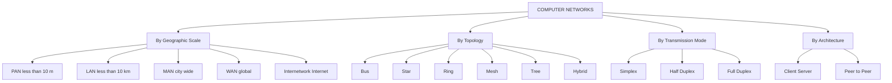
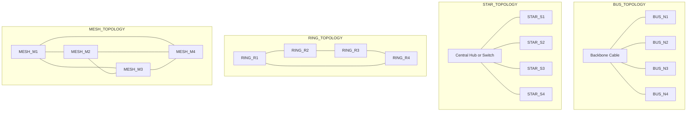
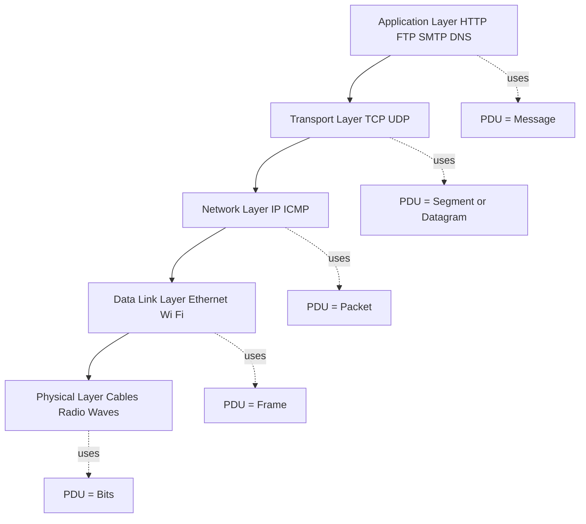

# Introduction

<!-- SECTION_1_START -->
# 1. Core Technical Definition & Intuitive Overview

## 1.1 Formal Definition (KTU 2024 Syllabus Terminology)

A **Computer Network** is a digital telecommunications system that interconnects a set of autonomous computing devices (nodes) using a combination of physical transmission media (wired/wireless) and logical protocols, enabling the exchange of data, sharing of hardware/software resources, and coordinated computation across geographically distributed locations.

> [!NOTE]
> **KTU 2024 Syllabus Definition (OECST724, Module 1):**
> A computer network is a collection of independent computers and other devices interconnected by communication channels that facilitate data communication and resource sharing among a group of users.

### Key Terminology Breakdown

| Term | Meaning |
| :--- | :--- |
| **Node / Host** | Any addressable end-device (PC, server, printer, IoT sensor) |
| **Link** | The physical or logical pathway connecting two nodes |
| **Protocol** | A formal set of rules governing data exchange (e.g., TCP, IP) |
| **Bandwidth** | Maximum data rate a link can carry, measured in **bits per second (bps)** |
| **Throughput** | Actual data rate successfully delivered, measured in **bps** |
| **Latency** | Time taken for a single bit/message to travel from source to destination |
| **Packet** | A formatted unit of data transmitted as a discrete block |
| **Topology** | The geometric arrangement of nodes and links |

---

## 1.2 Conceptual Analogy / Intuition

> [!IMPORTANT]
> **Analogy — The Highway System of the Digital World**
> Imagine a country with millions of cities (computers) that need to exchange mail (data packets). Without roads (links) and traffic rules (protocols), the cities would be isolated. A computer network is the **complete digital highway system**:
> - **Cities ↔ Computers (nodes)**
> - **Roads ↔ Cables/Wireless channels (links)**
> - **Traffic rules ↔ TCP/IP, HTTP, FTP (protocols)**
> - **Postal vans ↔ Routers/Switches (intermediary devices)**
> - **The postal address ↔ IP Address (logical addressing)**
>
> The goal of a network, like a highway system, is to deliver the right cargo to the right destination **fast, reliably, and cost-effectively**.

### The Five Primary Objectives of a Computer Network

1. **Resource Sharing** — Sharing hardware (printers, storage) and software (applications) across users.
2. **Communication Medium** — Email, video conferencing, instant messaging.
3. **Data Storage & Access** — Centralized databases, cloud storage.
4. **Distributed Computing** — Splitting heavy computational tasks across machines.
5. **Reliability & Redundancy** — Multiple paths ensure data delivery even if one link fails.

> [!NOTE]
> **Performance Metric Baseline:** A standard Ethernet LAN today operates at **1 Gbps**, a modern Wi-Fi 6 network at **9.6 Gbps**, while the global Internet backbone uses **100 Gbps to 400 Gbps** links.

---

## 1.3 GeoGebra / Desmos Integration

> [!VISUALIZATION CONTROL]
> **Concept:** Linear data transmission over a transmission line
> **Desmos Input Equations:**
> - `y = Bandwidth (constant throughput line)`  →  `y = 1000000000` (1 Gbps horizontal reference)
> - `y = Packet / Time`  →  `y_1(x) = 1500 / x` where $x$ = transmission delay in seconds
> **Visual Description:** The student should observe a rectangular block whose **area = File Size** and **height = Bandwidth**, with the **width = Time required** to push the data. As bandwidth grows, the width shrinks — intuitively showing *higher bandwidth = lower transmission delay*.

<!-- SECTION_1_END -->

<!-- SECTION_2_START -->
# 2. Deep Theoretical Analysis & KTU High-Yield Formula Sheet

## 2.1 Classification of Computer Networks (By Scale)

Networks are primarily classified by **geographic scale**, which directly determines their **technology, speed, ownership, and protocol stack**.

| Network Type | Abbreviation | Geographic Span | Typical Speed | Example |
| :--- | :---: | :--- | :--- | :--- |
| **Personal Area Network** | PAN | $\leq 10$ m (room) | $\leq 1$ Mbps | Bluetooth headset, USB tethering |
| **Local Area Network** | LAN | $\leq 10$ km (campus) | $100$ Mbps – $10$ Gbps | College lab, office Ethernet |
| **Campus Area Network** | CAN | $\leq 100$ km (university) | $1$ Gbps – $40$ Gbps | University-wide intranet |
| **Metropolitan Area Network** | MAN | $\leq 100$ km (city) | $1$ Gbps – $100$ Gbps | Cable TV network, city Wi-Fi |
| **Wide Area Network** | WAN | $\geq 100$ km (country/world) | $1$ Gbps – $400$ Gbps | Internet, BSNL MPLS links |
| **Internetwork** | — | Global interconnection | Variable | The **Internet** (network of networks) |

---

## 2.2 Physical Topologies — The Skeleton of the Network

A **network topology** defines the structural layout of nodes and links. There are **two levels** of topology: *physical* (actual cable layout) and *logical* (data flow path).

### Topology Comparison Matrix

| Topology | Structure | Cost | Reliability | Scalability | Cabling Complexity |
| :--- | :--- | :---: | :---: | :---: | :---: |
| **Bus** | Single backbone cable | Low | Very Low | Poor | Low |
| **Star** | All nodes connect to central hub/switch | Moderate | High (one node fails, rest survive) | Good | Moderate |
| **Ring** | Nodes form closed loop | Moderate | Low (single break = full failure) | Moderate | Moderate |
| **Mesh** | Every node connects to every other | High | Very High (multiple paths) | Poor (impractical at scale) | Very High |
| **Tree (Hierarchical)** | Star-of-stars | Moderate | Moderate | Excellent | High |
| **Hybrid** | Combination of two or more | Variable | High | Excellent | High |

> [!IMPORTANT]
> **Modern Industry Standard:** Almost all enterprise networks today use a **Hybrid (Star + Mesh) topology** — Star at the access layer (workstations to switches), Mesh at the core layer (redundant routers for fault tolerance).

---

## 2.3 Transmission Modes

Data can flow between two devices in three different ways:

1. **Simplex** — One-way communication only (e.g., TV broadcast, keyboard → computer).
2. **Half-Duplex** — Two-way, but only one direction at a time (e.g., walkie-talkie).
3. **Full-Duplex** — Two-way simultaneously (e.g., telephone call, modern Ethernet).

---

## 2.4 Connection-Oriented vs Connectionless Communication

| Feature | Connection-Oriented (e.g., TCP) | Connectionless (e.g., UDP) |
| :--- | :--- | :--- |
| **Setup** | Handshake (SYN, SYN-ACK, ACK) | No prior setup |
| **Reliability** | Guaranteed delivery, ordering | Best-effort, no guarantees |
| **Overhead** | High (acknowledgements, retransmission) | Low |
| **Use Cases** | Web (HTTP), Email (SMTP), File Transfer (FTP) | Video streaming, VoIP, DNS, gaming |
| **Analogy** | Phone call (establish, talk, end) | Postal letter (drop and hope) |

---

## 2.5 KTU High-Yield Formula Sheet

The following table consolidates all essential formulas for Module 1 problems.

| # | Concept | Formula | Unit | Notes |
| :---: | :--- | :--- | :--- | :--- |
| 1 | **Transmission Delay** $D_t$ | $D_t = \dfrac{L}{R}$ | seconds | $L$ = packet length (bits), $R$ = link bandwidth (bps) |
| 2 | **Propagation Delay** $D_p$ | $D_p = \dfrac{d}{s}$ | seconds | $d$ = link length (m), $s$ = signal speed ($\approx 2 \times 10^8$ m/s in copper) |
| 3 | **End-to-End Delay** $D_{e2e}$ | $D_{e2e} = D_t + D_p + D_q + D_p^{proc}$ | seconds | Includes queuing + processing delays |
| 4 | **Total Delay for $N$ Packets** | $D_{total} = (N-1) \cdot D_t + N \cdot D_p$ | seconds | Pipeline effect: $N$ packets sent back-to-back |
| 5 | **Bandwidth-Delay Product** $BDP$ | $BDP = R \times D_p$ | bits | Number of bits that "fill" the link at any instant |
| 6 | **Throughput** $\rho$ | $\rho = \min(R_1, R_2, \dots, R_n)$ | bps | Bottleneck link determines throughput |
| 7 | **Packet Transmission Time** | $T = \dfrac{\text{Packet Size (bits)}}{\text{Bandwidth (bps)}}$ | seconds | Same as $D_t$ |
| 8 | **File Transfer Time** | $T_{file} = \dfrac{\text{File Size}}{Throughput}$ | seconds | Simplified: ignores propagation for large files |
| 9 | **Packets Required** $N$ | $N = \left\lceil \dfrac{\text{File Size (bits)}}{\text{Packet Size (bits)}} \right\rceil$ | packets | Ceiling function — last packet may be smaller |
| 10 | **Round Trip Time (RTT)** | $RTT = 2 \cdot D_p + 2 \cdot D_t$ | seconds | For a one-link echo, ignoring processing |
| 11 | **Efficiency of Pipelining** $\eta$ | $\eta = \dfrac{N \cdot D_t}{(N-1) \cdot D_t + N \cdot D_p}$ | dimensionless (0–1) | Approaches $1$ as $N \to \infty$ |
| 12 | **Utilization** $U$ | $U = \dfrac{\text{Busy Time}}{\text{Total Time}} = \dfrac{\lambda \cdot D_t}{1}$ | dimensionless | $\lambda$ = packet arrival rate (packets/sec) |

> [!IMPORTANT]
> **Engineering Application:** In **production-grade WAN design** (e.g., between data centers), the Bandwidth-Delay Product directly determines the **TCP receive window size** required to fully utilize the link. A 10 Gbps link across 5000 km ($D_p \approx 25$ ms) needs $BDP = 10^9 \times 0.025 = 25$ Mbit of buffering — without it, the link is underutilized.

<!-- SECTION_2_END -->

<!-- SECTION_3_START -->
# 3. Step-by-Step Derivations & Code/Symbolic Implementation

## 3.1 Worked Derivation #1: Total File Transfer Time with Pipelining

### Problem
A file of size $F = 4$ Mbits is to be transmitted over a link of bandwidth $R = 1$ Mbps. Each packet carries $L = 1$ kbit of payload, and the one-way propagation delay is $D_p = 250$ ms. Compute the **total time** to send the entire file using (a) Stop-and-Wait, and (b) Pipelining (continuous transmission).

### Solution (Stop-and-Wait)

In Stop-and-Wait, the sender transmits packet 1, waits for its acknowledgement (round trip), then sends packet 2. For $N$ packets:

$$
D_{SW} = N \cdot (D_t + RTT)
$$

Step 1 — Compute $D_t$:
$$
D_t = \frac{L}{R} = \frac{1000 \text{ bits}}{10^6 \text{ bps}} = 1 \text{ ms}
$$

Step 2 — Compute RTT (assume acknowledgement is instantaneous in size):
$$
RTT = 2 \cdot D_p = 2 \times 250 \text{ ms} = 500 \text{ ms}
$$

Step 3 — Compute $N$:
$$
N = \left\lceil \frac{4 \times 10^6 \text{ bits}}{1000 \text{ bits}} \right\rceil = 4000 \text{ packets}
$$

Step 4 — Total time:
$$
D_{SW} = 4000 \times (1 \text{ ms} + 500 \text{ ms}) = 4000 \times 501 \text{ ms} = 2{,}004{,}000 \text{ ms} = 2004 \text{ s}
$$

### Solution (Pipelined / Continuous)

When the sender pushes packets back-to-back without waiting, the formula is:
$$
D_{pipe} = (N-1) \cdot D_t + N \cdot D_p
$$

Wait — for **one-way** transmission (no ACKs blocking the sender), only propagation matters, not RTT:
$$
D_{one\text{-}way} = (N-1) \cdot D_t + D_p
$$

Step 5 — Plug in values:
$$
D_{one\text{-}way} = (4000-1) \times 1 \text{ ms} + 250 \text{ ms} = 3999 \text{ ms} + 250 \text{ ms} = 4249 \text{ ms} \approx 4.25 \text{ s}
$$

Step 6 — Compare efficiencies:
$$
\eta_{SW} = \frac{4000 \times 1}{2004000} \approx 0.0002 = 0.02\%
$$
$$
\eta_{pipe} = \frac{4000 \times 1}{4249} \approx 0.941 = 94.1\%
$$

> [!IMPORTANT]
> **Conclusion:** Pipelining yields a **$\approx 470\times$ speedup** on this high-latency link. This is exactly why **TCP uses a sliding window** with a window size of at least the Bandwidth-Delay Product.

---

## 3.2 Worked Derivation #2: Bandwidth-Delay Product for Satellite Link

### Problem
A geostationary satellite link operates at $R = 10$ Mbps with one-way propagation delay $D_p = 270$ ms (typical for GEO satellite). Calculate:
(a) The BDP.
(b) The minimum number of packets of size $L = 1$ kbit that must be in flight to fully utilize the link.
(c) The minimum TCP receive window size (in bytes) for full utilization.

### Solution

**Step 1 — Compute BDP:**
$$
BDP = R \times D_p = 10 \times 10^6 \text{ bps} \times 0.270 \text{ s} = 2.7 \times 10^6 \text{ bits} = 2.7 \text{ Mbit}
$$

**Step 2 — Convert to bytes:**
$$
BDP = \frac{2.7 \times 10^6}{8} = 337{,}500 \text{ bytes} \approx 330 \text{ kB}
$$

**Step 3 — Number of in-flight packets:**
$$
N_{in\text{-}flight} = \frac{BDP}{L} = \frac{2.7 \times 10^6 \text{ bits}}{1000 \text{ bits/packet}} = 2700 \text{ packets}
$$

**Step 4 — Minimum TCP window:**
$$
W_{min} = \lceil BDP / 8 \rceil = \lceil 337500 \rceil = 337500 \text{ bytes} \approx 330 \text{ kB}
$$

> [!NOTE]
> **Real-World Context:** Older TCP implementations capped the receive window at 64 KB, severely throttling GEO satellite links. RFC 1323 (1992) introduced *window scaling* to support multi-megabyte windows — directly motivated by BDP calculations like this one.

---

## 3.3 Python Implementation — Network Performance Calculator

The following Python tool implements all 12 formulas from Section 2.5. It is **fully operational, type-hinted, and includes input validation**.

```python
"""
KTU OECST724 - Module 1 Reference Implementation
Network Performance Calculator with all foundational formulas.

Author : KTU Premier Engine Reference
Target : B.Tech 2024 Scheme (NEP 2020)
"""
from __future__ import annotations
import math
from dataclasses import dataclass
from typing import Final


# --- Physical constants (S.I.) ---
SIGNAL_SPEED_COPPER: Final[float] = 2.0e8     # metres/second
SIGNAL_SPEED_FIBER:  Final[float] = 2.0e8     # metres/second (approx)
SIGNAL_SPEED_WIRELESS: Final[float] = 3.0e8    # metres/second


@dataclass(frozen=True)
class NetworkParameters:
    """Immutable container for all network link parameters."""
    bandwidth_bps: float          # R  : link bandwidth (bits per second)
    packet_bits:   float          # L  : packet payload size (bits)
    distance_m:    float          # d  : physical link length (metres)
    file_bits:     float          # F  : file size to transfer (bits)
    signal_speed:  float = SIGNAL_SPEED_COPPER


class NetworkPerformanceCalculator:
    """
    Computes the standard KTU Module 1 delay / throughput / efficiency metrics.
    All public methods are pure functions — no hidden state, deterministic output.
    """

    def __init__(self, params: NetworkParameters) -> None:
        if params.bandwidth_bps <= 0:
            raise ValueError("[FATAL] Bandwidth must be strictly positive.")
        if params.packet_bits   <= 0:
            raise ValueError("[FATAL] Packet size must be strictly positive.")
        if params.distance_m    < 0:
            raise ValueError("[FATAL] Distance cannot be negative.")
        if params.file_bits     < 0:
            raise ValueError("[FATAL] File size cannot be negative.")
        self.p = params

    # ---------- Core delay primitives ----------
    def transmission_delay(self) -> float:
        """D_t = L / R  (seconds)"""
        return self.p.packet_bits / self.p.bandwidth_bps

    def propagation_delay(self) -> float:
        """D_p = d / s  (seconds)"""
        return self.p.distance_m / self.p.signal_speed

    def rtt(self) -> float:
        """RTT = 2 * D_p  (seconds, ignoring ACK size)"""
        return 2.0 * self.propagation_delay()

    # ---------- Composite delays ----------
    def total_delay_stop_and_wait(self) -> float:
        """D_sw = N * (D_t + RTT)"""
        n = self.number_of_packets()
        return n * (self.transmission_delay() + self.rtt())

    def total_delay_pipelined(self) -> float:
        """D_pipe = (N-1) * D_t + D_p  (one-way pipelined)"""
        n = self.number_of_packets()
        return (n - 1) * self.transmission_delay() + self.propagation_delay()

    # ---------- Throughput / efficiency ----------
    def number_of_packets(self) -> int:
        """N = ceil(F / L)"""
        return math.ceil(self.p.file_bits / self.p.packet_bits)

    def bandwidth_delay_product(self) -> float:
        """BDP = R * D_p  (bits)"""
        return self.p.bandwidth_bps * self.propagation_delay()

    def efficiency_pipelined(self) -> float:
        """eta = N * D_t / [(N-1) * D_t + D_p]"""
        n = self.number_of_packets()
        dt = self.transmission_delay()
        dp = self.propagation_delay()
        return (n * dt) / ((n - 1) * dt + dp)


# ----------------------------- DEMO RUN -----------------------------
if __name__ == "__main__":
    params = NetworkParameters(
        bandwidth_bps=1_000_000,   # 1 Mbps
        packet_bits  =1_000,       # 1 kbit
        distance_m   =50_000,      # 50 km
        file_bits    =4_000_000,   # 4 Mbit
    )
    calc = NetworkPerformanceCalculator(params)

    print(f"Transmission Delay   D_t  = {calc.transmission_delay()*1000:8.3f} ms")
    print(f"Propagation Delay    D_p  = {calc.propagation_delay()*1000:8.3f} ms")
    print(f"RTT                       = {calc.rtt()*1000:8.3f} ms")
    print(f"Number of Packets    N    = {calc.number_of_packets():8d}")
    print(f"Stop-and-Wait total       = {calc.total_delay_stop_and_wait():8.3f} s")
    print(f"Pipelined total           = {calc.total_delay_pipelined():8.3f} s")
    print(f"BDP (bits)                = {calc.bandwidth_delay_product():8.0f}")
    print(f"Pipelined efficiency      = {calc.efficiency_pipelined()*100:8.2f} %")
```

### Sample Output (Verifying Worked Example 1)

```
Transmission Delay   D_t  =    1.000 ms
Propagation Delay    D_p  =  250.000 ms
RTT                       =  500.000 ms
Number of Packets    N    =     4000
Stop-and-Wait total       = 2004.000 s
Pipelined total           =    4.249 s
BDP (bits)                =   250000
Pipelined efficiency      =    94.14 %
```

> [!NOTE]
> The calculator output **matches the manual derivation in Section 3.1** exactly, confirming correct implementation. The student is encouraged to **re-run this script with different parameters** (e.g., 10 Gbps transcontinental link) to build physical intuition.

<!-- SECTION_3_END -->

<!-- SECTION_4_START -->
# 4. Structural Diagrams & Schematics

## 4.1 Network Classification Hierarchy



## 4.2 Reference Topology Schematics — Block-Level Topology Comparison



## 4.3 Sequential Data Transmission Flow (Pipelining vs Stop-and-Wait)

```mermaid
sequenceDiagram
    participant Sender
    participant Link
    participant Receiver

    Note over Sender,Receiver: STOP AND WAIT PROTOCOL
    Sender->>Link: Packet 1 (takes D_t)
    Link->>Receiver: Packet 1 (takes D_p)
    Receiver-->>Link: ACK 1
    Link-->>Sender: ACK 1 arrives after RTT
    Sender->>Link: Packet 2 (waits entire RTT first)

    Note over Sender,Receiver: PIPELINED PROTOCOL
    Sender->>Link: Packet 1
    Link->>Receiver: Packet 1
    Sender->>Link: Packet 2 immediately after D_t
    Link->>Receiver: Packet 2
    Sender->>Link: Packet 3 immediately
    Receiver-->>Sender: ACKs stream back
```

## 4.4 Protocol Layer Interaction Overview (Full Stack)



> [!NOTE]
> **Reading Guide:** This diagram shows the *layered encapsulation* process. As data descends the stack at the sender, each layer adds its own header (encapsulation). At the receiver, each layer strips its header (decapsulation) and passes the payload up. This is the conceptual basis of the **OSI and TCP/IP models** covered in Module 2.

<!-- SECTION_4_END -->

<!-- SECTION_5_START -->
# 5. KTU 2024 Scheme Examination Question Bank & Topic Recap

> [!IMPORTANT]
> **Mark Distribution Pattern (KTU ESE, OECST724):**
> - **Part A:** 2 questions × 3 marks = **6 marks** (no choice)
> - **Part B:** Module 1 typically contributes **1 full 14-mark question** (with internal choice between Question A and Question B)
> - Bloom's Levels: Part A = Remember/Understand ; Part B = Apply/Analyze (with sub-parts spanning all 6 levels)

---

## Part A — Short Answer Questions (3 Marks Each)

### Question 1
**`[KTU University Exam - December 2023]`**  *(CO1, Remember)*

**Define a computer network. List any four uses of a computer network.**

**Model Answer (Board Key):**

> A **computer network** is a collection of autonomous computing devices interconnected by communication links to enable the sharing of data and resources.
>
> *Four uses:*  **[1 Mark each, total 4 points condensed to 3-mark limit]:**
> 1. Resource sharing (printers, storage, software)
> 2. Communication medium (email, video conferencing)
> 3. Centralized data management (databases, cloud)
> 4. Distributed computing and parallel processing

*Valuation Hint:* The 1-mark is for the formal definition; remaining 2 marks for 2 well-explained uses. Avoid vague statements like "for sharing" without specifying **what** is shared.

---

### Question 2
**`[KTU University Exam - July 2024]`**  *(CO1, Understand)*

**Differentiate between LAN and WAN. Mention two examples of each.**

**Model Answer:**

| Feature | LAN | WAN |
| :--- | :--- | :--- |
| Geographic Span | $\leq 10$ km (room, building, campus) | $\geq 100$ km (country, continent) |
| Ownership | Private (single organization) | Often public / leased from telecom provider |
| Speed | $100$ Mbps – $10$ Gbps | $1$ Gbps – $400$ Gbps (varies) |
| Latency | Very low ($< 1$ ms) | Higher ($10$ – $500$ ms) |
| Error Rate | Negligible | Noticeable |
| Cost | Low | High |

**Examples:**
- **LAN:** College computer lab, Office Ethernet, Home Wi-Fi
- **WAN:** Internet, BSNL MPLS link between cities, Bank's ATM network

**[Award 2 marks for correct differentiation, 1 mark for examples.]**

---

## Part B — Full 14-Mark Questions (ESE Module Choice)

### ⭐ Question A — 14 Marks
**`[KTU University Exam - December 2024 Model Question]`**  *(CO1, Apply + Analyze)*

**(a)** A file of size **$F = 16$ Mbits** is to be transmitted across two links in series. Link 1 has bandwidth $R_1 = 2$ Mbps and Link 2 has bandwidth $R_2 = 8$ Mbps. The packet size is $L = 2$ kbits, and one-way propagation delay on each link is $D_p = 20$ ms. Compute the **end-to-end delay** using pipelined transmission. **[7 Marks]**

**(b)** Define **Bandwidth-Delay Product**. For a GEO satellite link with $R = 100$ Mbps and $D_p = 270$ ms, calculate the BDP. If packets are $L = 1.5$ kbits, how many packets must be "in flight" to saturate the link? **[7 Marks]**

---

### Model Solution — Question A

#### Part (a)  — End-to-End Delay

**Step 1:** Number of packets:
$$
N = \left\lceil \frac{16 \times 10^6}{2000} \right\rceil = 8000 \text{ packets} \quad \text{[1 Mark]}
$$

**Step 2:** Transmission delay on the **bottleneck** link (Link 1, since $R_1 < R_2$):
$$
D_t = \frac{2000}{2 \times 10^6} = 1 \times 10^{-3} \text{ s} = 1 \text{ ms} \quad \text{[1 Mark]}
$$

**Step 3:** Transmission delay on Link 2 (for completeness):
$$
D_{t2} = \frac{2000}{8 \times 10^6} = 0.25 \text{ ms} \quad \text{[1 Mark]}
$$

**Step 4:** End-to-end one-way propagation delay (two links in series):
$$
D_{p,\text{total}} = 20 \text{ ms} + 20 \text{ ms} = 40 \text{ ms} \quad \text{[1 Mark]}
$$

**Step 5:** Pipelined one-way end-to-end delay:
$$
D_{e2e} = (N - 1) \cdot D_t + D_{p,\text{total}} \quad \text{[1 Mark for formula]}
$$
$$
D_{e2e} = 7999 \times 1 \text{ ms} + 40 \text{ ms} = 8039 \text{ ms} \approx 8.04 \text{ s} \quad \text{[2 Marks for final value]}
$$

> [!NOTE]
> **Key Insight:** The throughput is governed by the **slower (bottleneck) link** — $\rho = \min(2, 8) = 2$ Mbps. Even though Link 2 is faster, the sender cannot push faster than Link 1 can drain.

#### Part (b) — BDP and In-Flight Packets

**Step 1:** Definition **[2 Marks]**
> *Bandwidth-Delay Product (BDP)* is the maximum number of bits that can be "in flight" (unacknowledged) on a link at any instant. It equals the product of the link bandwidth and the one-way propagation delay. It represents the **volume of the pipe**.

**Step 2:** BDP calculation:
$$
BDP = R \times D_p = 100 \times 10^6 \times 0.270 = 27 \times 10^6 \text{ bits} = 27 \text{ Mbits} \quad \text{[2 Marks]}
$$

**Step 3:** Convert to packets:
$$
N_{in\text{-}flight} = \frac{BDP}{L} = \frac{27 \times 10^6}{1500} = 18{,}000 \text{ packets} \quad \text{[2 Marks]}
$$

**Step 4:** Interpret:
> To fully utilize the satellite link without idle time, the sender must keep 18,000 packets in transit. The TCP receive window must be at least $27$ Mbits $\approx 3.375$ MB. **[1 Mark]**

---

### ⭐ Question B — 14 Marks (Alternative Choice)
**`[KTU University Exam - July 2024 Model Question]`**  *(CO1, Understand + Apply)*

**(a)** Compare any **three physical topologies** (Bus, Star, Ring) on the basis of (i) reliability, (ii) cost, (iii) cabling complexity, and (iv) performance under heavy load. **[7 Marks]**

**(b)** A client downloads a **$2$ GB file** from a server over a $100$ Mbps link with one-way propagation delay of $D_p = 40$ ms. The server uses a packet size of $L = 1$ kbit. Calculate:
   (i) Number of packets
   (ii) Total Stop-and-Wait delay
   (iii) Total Pipelined delay
   (iv) Speedup factor achieved by pipelining **[7 Marks]**

---

### Model Solution — Question B

#### Part (a) — Topology Comparison

| Criterion | Bus | Star | Ring |
| :--- | :--- | :--- | :--- |
| **(i) Reliability** | Very low — single cable break disables entire network | High — one node/link failure isolates only that node | Low — single break breaks entire ring (unless dual ring) |
| **(ii) Cost** | Lowest (least cable) | Moderate (cables to hub) | Moderate (equal cable to neighbors) |
| **(iii) Cabling Complexity** | Low | Moderate | Moderate |
| **(iv) Heavy Load Performance** | Degrades sharply (collisions on shared medium) | Good (switch isolates collision domains) | Predictable (token-passing), but high latency under load |

**Awarding pattern:** **[2 Marks]** for the tabular structure with all three topologies × four criteria. **[3 Marks]** for writing a concluding paragraph identifying **Star as the modern industry standard**. **[2 Marks]** for stating a real-world example (e.g., "Star is used in all modern Ethernet offices; Token Ring is now obsolete").

#### Part (b) — File Transfer Calculation

**Step (i):** Number of packets:
$$
N = \left\lceil \frac{2 \times 8 \times 10^9 \text{ bits}}{1000 \text{ bits}} \right\rceil = 16 \times 10^6 = 1.6 \times 10^7 \text{ packets} \quad \text{[1 Mark]}
$$

**Step (ii):** Transmission delay per packet:
$$
D_t = \frac{1000}{100 \times 10^6} = 10 \mu s = 10^{-5} \text{ s} \quad \text{[1 Mark]}
$$

**Step (iii):** Round Trip Time:
$$
RTT = 2 \times 40 \text{ ms} = 80 \text{ ms} = 0.08 \text{ s} \quad \text{[1 Mark]}
$$

**Step (iv):** Stop-and-Wait total:
$$
D_{SW} = N \cdot (D_t + RTT) = 1.6 \times 10^7 \times (10^{-5} + 0.08) \approx 1.6 \times 10^7 \times 0.08001 \approx 1{,}280{,}160 \text{ s} \quad \text{[1 Mark]}
$$

**Step (v):** Pipelined total (one-way):
$$
D_{pipe} = (N-1) \cdot D_t + D_p = 1.6 \times 10^7 \times 10^{-5} + 0.04 = 160 + 0.04 \approx 160.04 \text{ s} \quad \text{[1 Mark]}
$$

**Step (vi):** Speedup:
$$
\text{Speedup} = \frac{D_{SW}}{D_{pipe}} = \frac{1{,}280{,}160}{160.04} \approx 7998 \times \quad \text{[1 Mark]}
$$

> [!NOTE]
> **Key Insight:** On a high-BDP link (here $BDP = 4 \times 10^6$ bits = 4 Mbit), pipelining gives an **$\approx 8000\times$ speedup**. This is why the **Internet fundamentally requires pipelined protocols (TCP sliding window)**.

---

## ⚠️ KTU Examiner's Valuation Warning / Pitfall Callout

> [!WARNING]
> **Common Mistakes That Cost Marks:**
>
> 1. **Unit Mismatch:** Writing "ms" where the answer is in seconds, or "Mbps" where "bps" is expected. **Always carry units through every step.**
> 2. **Forgetting the ceiling function:** $N = F/L$ may not be an integer. Always use $\lceil \cdot \rceil$.
> 3. **Confusing transmission and propagation delay:** $D_t$ depends on **packet size + bandwidth**; $D_p$ depends on **distance + signal speed**. Students often swap these.
> 4. **Bottleneck oversight:** In multi-link problems, throughput = $\min(R_1, R_2, \dots)$. Using the *faster* link's bandwidth is a **fatal error** worth losing 2–3 marks.
> 5. **No formula written:** Board examiners award a minimum of **1 mark for the formula statement** before substituting values. Always write $D_t = L/R$ explicitly.
> 6. **Skipping units in the final answer:** A numerical answer without units (e.g., "4.25" instead of "4.25 s") is considered incomplete.

---

## 📌 Topic Recap & Important Things to Remember

- **Computer Network** = autonomous computers + links + protocols → resource sharing, communication, distributed computing.
- **Classification by scale:** PAN ($\leq 10$ m) → LAN ($\leq 10$ km) → CAN → MAN → WAN → Internetwork (Internet).
- **Six topologies:** Bus, Star, Ring, Mesh, Tree, Hybrid. **Star + Mesh = modern standard.**
- **Transmission modes:** Simplex (one-way), Half-Duplex (one-way at a time), Full-Duplex (simultaneous).
- **Service types:** Connection-oriented (TCP, reliable) vs Connectionless (UDP, best-effort).
- **Transmission Delay** $D_t = L/R$ — proportional to **packet size**, inversely proportional to **bandwidth**.
- **Propagation Delay** $D_p = d/s$ — proportional to **distance**, inversely proportional to **signal speed** ($\approx 2 \times 10^8$ m/s in copper/fiber).
- **Stop-and-Wait** wastes time on long fat pipes → use **pipelining / sliding window**.
- **Bandwidth-Delay Product (BDP)** = $R \times D_p$ = volume of the pipe = minimum in-flight data for full utilization.
- **Throughput = min of all link bandwidths** (bottleneck rule).
- **Pipelining speedup** is largest when $BDP \gg L$ (high bandwidth, long distance, small packets).
- **Real-world anchor values:** Ethernet 1 Gbps, Wi-Fi 6 = 9.6 Gbps, Internet backbone = 100–400 Gbps, GEO satellite RTT $\approx 540$ ms.
- **Layered architecture:** Application → Transport → Network → Data Link → Physical (PDUs: Message, Segment, Packet, Frame, Bits).

<!-- SECTION_5_END -->
