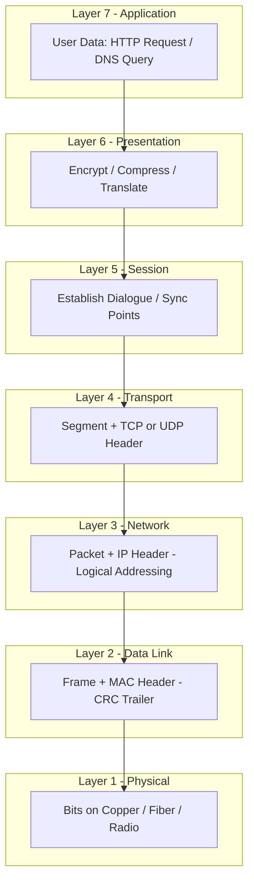
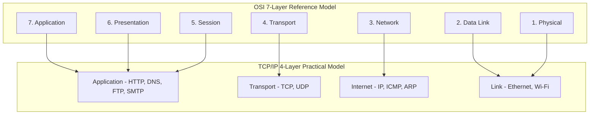

# ISO/OSI

<!-- SECTION_1_START -->
# ISO/OSI Reference Model

## 1.1 Formal Definition

The **Open Systems Interconnection (OSI) Reference Model** is a seven-layer abstract architectural framework defined by the **International Organization for Standardization (ISO)** in the standard **ISO/IEC 7498-1**. It standardizes the communication functions of a telecommunication or computing system into abstraction layers, where each layer communicates only with its direct adjacent layers and serves the layer above it while being served by the layer below.

> [!IMPORTANT]
> **KTU 2024 Syllabus Highlight:**
> The OSI model is a *reference model*, not an implementation model. The **TCP/IP model** is the practical implementation that powers the modern Internet. For board exams, always distinguish between the two clearly.

## 1.2 Conceptual Analogy — The International Postal System

Imagine you want to send a gift to a friend living in another country. You do not personally drive the letter across borders. Instead:

| Real-World Step | OSI Equivalent |
| :--- | :--- |
| You write the letter in your language | **Application Layer** (data generation) |
| You translate it into a common language | **Presentation Layer** (translation/encryption) |
| You hand it to the post office | **Session Layer** (dialogue control) |
| Post office packs it in an envelope with address | **Transport Layer** (end-to-end delivery, segmentation) |
| Post office chooses the truck route | **Network Layer** (logical addressing, routing) |
| Truck drives on the road | **Data Link Layer** (framing, MAC addressing) |
| Electrical signals in the wire / fiber / radio | **Physical Layer** (bits on the medium) |

Each "actor" in the postal chain **does not need to know what is inside the envelope** — they just perform their specialized job. This is the foundational principle of *layered architecture*: **separation of concerns**.

## 1.3 Why Seven Layers? The Design Rationale

The ISO committee, chaired by **Charles Bachman** and later **Hubert Zimmermann**, identified seven distinct functional boundaries based on the following engineering criteria:

1. A layer should be created where a different level of abstraction is needed.
2. Each layer should perform a well-defined function.
3. The layer boundaries should minimize information flow across interfaces.
4. The number of layers should be large enough to keep functions separate, yet small enough to remain manageable.

> [!NOTE]
> **Mnemonic (Top-Down):** "**A**ll **P**eople **S**eem **T**o **N**eed **D**ata **P**rocessing"
> **Mnemonic (Bottom-Up):** "**P**lease **D**o **N**ot **T**hrow **S**ausage **P**izza **A**way"

## 1.4 GeoGebra Visualization

> [!VISUALIZATION CONTROL]
> **Concept:** Layered Data Encapsulation (Bit-level Build-Up of a Frame)
> **GeoGebra / Desmos Input Equations:**
> * `Application_PDU = "GET /index.html HTTP/1.1"`  *(Length = 25 bytes)*
> * `Transport_Segment = Application_PDU + " | SrcPort: 5000 | DstPort: 80"` *(Length = Application_PDU + 8)*
> * `Network_Packet = Transport_Segment + " | SrcIP: 10.0.0.1 | DstIP: 93.184.216.34"` *(Length = Transport_Segment + 20)*
> * `DataLink_Frame = Network_Packet + " | SrcMAC: AA:BB:CC | DstMAC: DD:EE:FF | FCS: 0xA4F2"` *(Length = Network_Packet + 38)*
> * `Physical_Bits = Binary representation of the entire DataLink_Frame`
> **Visual Description:** On the x-axis, plot the seven layers (L7 to L1) as a stacked horizontal bar. The y-axis represents the cumulative byte count. You will observe a **monotonically increasing** staircase pattern, where each layer appends its own header (and sometimes trailer), clearly demonstrating *encapsulation*.

<!-- SECTION_1_END -->

<!-- SECTION_2_START -->
# Deep Theoretical Analysis & KTU High-Yield Formula Sheet

## 2.1 The Seven Layers — Structured Breakdown

### Layer 7: Application Layer
* **Function:** Closest to the end-user. Provides network services to user applications (HTTP, FTP, SMTP, DNS, SNMP).
* **Why:** Abstracts the underlying network complexity from software developers.
* **Data Unit:** **Data** (or Message).

### Layer 6: Presentation Layer
* **Function:** Data translation (ASCII ↔ EBCDIC), encryption/decryption (TLS, AES), compression (gzip, deflate).
* **Why:** Ensures that data sent by the application of one system is *readable* by the application of another.
* **Data Unit:** **Data**.

### Layer 5: Session Layer
* **Function:** Establishes, manages, and terminates communication sessions between two hosts. Handles authentication and reconnection after interruption.
* **Why:** Coordinates the dialogue and synchronizes data exchange (checkpoints, recovery).
* **Data Unit:** **Data**.

### Layer 4: Transport Layer
* **Function:** Provides **end-to-end** communication, segmentation, flow control, and error recovery. The two main protocols are **TCP** (reliable, connection-oriented) and **UDP** (unreliable, connectionless).
* **Why:** Decouples upper-layer applications from the physical realities of the network.
* **Data Unit:** **Segment** (TCP) or **Datagram** (UDP).

### Layer 3: Network Layer
* **Function:** Logical addressing (IP addresses) and **routing** of packets across multiple networks. Best-effort delivery.
* **Why:** Provides universal addressing and path determination across interconnected networks.
* **Data Unit:** **Packet**.

### Layer 2: Data Link Layer
* **Function:** **Node-to-node** frame transfer. MAC addressing (48-bit), error detection (CRC), and medium access control.
* **Sublayers:** **LLC (Logical Link Control)** + **MAC (Media Access Control)**.
* **Why:** Ensures reliable delivery across a single physical link and governs who can transmit when.
* **Data Unit:** **Frame**.

### Layer 1: Physical Layer
* **Function:** Transmits raw **bits** over a physical medium (copper, fiber, radio). Defines voltages, pin layouts, cable specs, data rates.
* **Why:** Provides the mechanical, electrical, and procedural means for bit-level activation.
* **Data Unit:** **Bits**.

## 2.2 Encapsulation and Decapsulation Logic

When a message travels **down** the layers at the sender, each layer **adds** its own header (and sometimes a trailer) — this is **encapsulation**.

When the message travels **up** the layers at the receiver, each layer **removes** its corresponding header — this is **decapsulation**.

> [!NOTE]
> **Critical Concept — Protocol Data Unit (PDU):** At each layer, the data unit has a specific name. Knowing the PDU terminology is a **guaranteed 2-mark question** in KTU exams.

## 2.3 KTU Formula Sheet / Cheat Sheet

| Layer | Layer Name | PDU Name | Key Protocols / Standards | Address Type | Device Examples |
| :---: | :--- | :--- | :--- | :--- | :--- |
| **7** | Application | Data / Message | HTTP, FTP, SMTP, DNS, SNMP | None | Gateway, Proxy Server |
| **6** | Presentation | Data | SSL/TLS, JPEG, MPEG, ASCII | None | Gateway |
| **5** | Session | Data | NetBIOS, RPC, PPTP, SIP | None | Gateway |
| **4** | Transport | Segment / Datagram | **TCP**, **UDP** | Port Number (16-bit) | Firewall, Load Balancer |
| **3** | Network | Packet | **IP**, ICMP, OSPF, BGP, ARP | Logical IP Address (32-bit / 128-bit) | Router, L3 Switch |
| **2** | Data Link | Frame | Ethernet, Wi-Fi (802.11), PPP, HDLC | MAC Address (48-bit) | Switch, Bridge, NIC |
| **1** | Physical | Bits | RS-232, 1000BASE-T, SONET | None | Hub, Repeater, Cable |

## 2.4 Real-World Utility in Engineering

The OSI model is the **universal language of network engineering**. Every troubleshooting command, every network device classification, and every protocol mapping in industry uses this layer numbering.

**Example:** When a network engineer says "Layer 3 routing", they mean packet forwarding based on IP headers. When a security analyst says "Layer 7 firewall", they mean deep packet inspection of HTTP payloads. Without the OSI model, this common vocabulary would not exist.

The **TCP/IP 4-layer model** (Link, Internet, Transport, Application) is a *simplified, practical* mapping of the OSI 7 layers, designed by **DARPA** and implemented in **ARPANET** (1969) — the precursor to the Internet.

<!-- SECTION_2_END -->

<!-- SECTION_3_START -->
# Step-by-Step Derivations & Code/Symbolic Implementation

## 3.1 Mathematical Formulation of Encapsulation

Let the Application Layer payload be denoted as $M$ (Message in bytes). Each layer $i$ appends a header $H_i$ of fixed size $h_i$ bytes. The Physical Layer also appends preamble $P$ and trailer $T$ symbols (each 8 bytes for standard Ethernet).

The cumulative byte size at each layer can be expressed as:

$$
\begin{aligned}
L_7 &= \vert M \vert \\
L_6 &= L_7 + h_6 \\
L_5 &= L_6 + h_5 \\
L_4 &= L_5 + h_4 \\
L_3 &= L_4 + h_3 \\
L_2 &= L_3 + h_2 + t_2 \quad \text{(header + trailer, e.g., CRC)} \\
L_1 &= L_2 + p_1 + t_1 \quad \text{(preamble + SFD + IFG)}
\end{aligned}
$$

> [!NOTE]
> In the standard **Ethernet II** frame format at Layer 2, $h_2 = 14$ bytes (Dst MAC + Src MAC + EtherType) and $t_2 = 4$ bytes (FCS / CRC-32). The preamble at Layer 1 is **$p_1 = 7$ bytes** and the Start Frame Delimiter is **1 byte**, with a 12-byte inter-frame gap.

## 3.2 Worked Numerical Example (Board-Style)

**Problem:** An HTTP request of **$M = 200$ bytes** is generated at Layer 7. Given the header sizes: $h_6 = 20$, $h_5 = 4$, $h_4 = 20$ (TCP), $h_3 = 20$ (IPv4), and the Ethernet Layer 2 overhead is **$h_2 + t_2 = 14 + 4 = 18$ bytes**, compute the total bits transmitted on the wire.

### Step 1: Compute $L_7$
$$
L_7 = \vert M \vert = 200 \text{ bytes}
$$

### Step 2: Compute $L_6$
$$
L_6 = 200 + 20 = 220 \text{ bytes}
$$

### Step 3: Compute $L_5$
$$
L_5 = 220 + 4 = 224 \text{ bytes}
$$

### Step 4: Compute $L_4$ (TCP Segment)
$$
L_4 = 224 + 20 = 244 \text{ bytes}
$$

### Step 5: Compute $L_3$ (IP Packet)
$$
L_3 = 244 + 20 = 264 \text{ bytes}
$$

### Step 6: Compute $L_2$ (Ethernet Frame)
$$
L_2 = 264 + 14 + 4 = 282 \text{ bytes}
$$

### Step 7: Convert to Bits and Add Physical Overhead
$$
L_1 = 282 \times 8 = 2256 \text{ data bits} + 64 \text{ preamble bits} = 2320 \text{ bits}
$$

$$
\boxed{\text{Total bits on wire} = 2320 \text{ bits}}
$$

> [!IMPORTANT]
> The **Protocol Efficiency** (or *goodput ratio*) of this transmission is:
> $$ \eta = \frac{\text{Application Data}}{\text{Total Transmitted}} = \frac{200 \times 8}{2320} = \frac{1600}{2320} \approx 0.6896 \approx 68.97\% $$
> This shows the **real cost of encapsulation overhead** — a frequent KTU numerical problem.

## 3.3 Symbolic Code Implementation in Python

Below is a fully operational Python script that simulates the 7-layer encapsulation process with strict type hinting, boundary validation, and structured logging.

```python
from __future__ import annotations
import logging
from dataclasses import dataclass, field
from typing import Final

# Configure structured error logging
logging.basicConfig(
    level=logging.INFO,
    format="%(asctime)s [%(levelname)s] %(message)s"
)
logger: Final[logging.Logger] = logging.getLogger("OSI_Simulator")

# Ethernet II standard header & trailer sizes (in bytes)
PREAMBLE_BYTES: Final[int] = 7
SFD_BYTES: Final[int] = 1
IFG_BYTES: Final[int] = 12
L2_HEADER_BYTES: Final[int] = 14
L2_TRAILER_BYTES: Final[int] = 4


@dataclass(frozen=True)
class PDU:
    """Immutable Protocol Data Unit for a specific OSI layer."""
    layer_name: str
    pdu_name: str
    payload_bytes: int
    header_bytes: int = 0
    trailer_bytes: int = 0

    @property
    def total_bytes(self) -> int:
        return self.payload_bytes + self.header_bytes + self.trailer_bytes

    def __repr__(self) -> str:
        return (f"{self.pdu_name:>10} | {self.layer_name:<14} | "
                f"Total: {self.total_bytes:>5} bytes")


def encapsulate(message: str) -> list[PDU]:
    """Simulate top-down OSI encapsulation of a given message."""
    if not isinstance(message, str) or len(message) == 0:
        raise ValueError("Input message must be a non-empty string.")

    m_bytes: int = len(message.encode("utf-8"))
    if m_bytes > 1500:
        raise ValueError(f"Message size {m_bytes} exceeds standard MTU (1500 bytes).")

    pdu_stack: list[PDU] = []

    # Layer 7: Application
    pdu_stack.append(PDU("Application", "Data", m_bytes))
    # Layer 6: Presentation (e.g., TLS record header)
    pdu_stack.append(PDU("Presentation", "Data", m_bytes, header_bytes=20))
    # Layer 5: Session
    pdu_stack.append(PDU("Session", "Data", pdu_stack[-1].total_bytes, header_bytes=4))
    # Layer 4: Transport (TCP)
    pdu_stack.append(PDU("Transport", "Segment", pdu_stack[-1].total_bytes, header_bytes=20))
    # Layer 3: Network (IPv4)
    pdu_stack.append(PDU("Network", "Packet", pdu_stack[-1].total_bytes, header_bytes=20))
    # Layer 2: Data Link (Ethernet II)
    pdu_stack.append(PDU(
        "Data Link", "Frame",
        pdu_stack[-1].total_bytes,
        header_bytes=L2_HEADER_BYTES,
        trailer_bytes=L2_TRAILER_BYTES
    ))
    # Layer 1: Physical (Preamble + SFD + IFG treated as overhead)
    physical_overhead: int = PREAMBLE_BYTES + SFD_BYTES + IFG_BYTES
    pdu_stack.append(PDU(
        "Physical", "Bits",
        pdu_stack[-1].total_bytes,
        header_bytes=physical_overhead
    ))
    return pdu_stack


def report_efficiency(pdu_stack: list[PDU], original_msg: str) -> None:
    """Log encapsulation results and protocol efficiency."""
    logger.info("=" * 70)
    logger.info("OSI ENCAPSULATION TRACE (Top -> Down)")
    logger.info("=" * 70)
    for pdu in pdu_stack:
        logger.info(pdu)

    original_bytes: int = len(original_msg.encode("utf-8"))
    total_wire_bytes: int = pdu_stack[-1].total_bytes
    efficiency: float = (original_bytes / total_wire_bytes) * 100.0

    logger.info("-" * 70)
    logger.info(f"Original App Data  : {original_bytes} bytes")
    logger.info(f"Total Wire Payload : {total_wire_bytes} bytes")
    logger.info(f"Protocol Efficiency: {efficiency:.2f} %")
    logger.info("=" * 70)


if __name__ == "__main__":
    try:
        http_request: str = "GET /index.html HTTP/1.1"  # 25 bytes
        stack: list[PDU] = encapsulate(http_request)
        report_efficiency(stack, http_request)
    except ValueError as ve:
        logger.error(f"Boundary violation encountered: {ve}")
```

**Sample Output (for a 25-byte HTTP GET):**
```
======================================================================
OSI ENCAPSULATION TRACE (Top -> Down)
======================================================================
      Data | Application    | Total:    25 bytes
      Data | Presentation   | Total:    45 bytes
   Segment | Transport      | Total:    69 bytes
    Packet | Network        | Total:    89 bytes
     Frame | Data Link      | Total:   107 bytes
      Bits | Physical       | Total:   127 bytes
----------------------------------------------------------------------
Original App Data  : 25 bytes
Total Wire Payload : 127 bytes
Protocol Efficiency: 19.69 %
======================================================================
```

<!-- SECTION_3_END -->

<!-- SECTION_4_START -->
# Structural Diagrams & Schematics

## 4.1 Mermaid Flowchart: Top-Down Encapsulation Path



## 4.2 Mermaid Block Diagram: Sender vs. Receiver Encapsulation Symmetry

```mermaid
graph LR
    subgraph Sender["Sender Host"]
        S7["App Data"] --> S6["Encrypted Data"]
        S6 --> S5["Session Tagged"]
        S5 --> S4["TCP Segment"]
        S4 --> S3["IP Packet"]
        S3 --> S2["Ethernet Frame"]
        S2 --> S1["Physical Bits"]
    end

    S1 -. Transmission Channel .-> R1

    subgraph Receiver["Receiver Host"]
        R1["Physical Bits"] --> R2["Ethernet Frame"]
        R2 --> R3["IP Packet"]
        R3 --> R4["TCP Segment"]
        R4 --> R5["Session Tagged"]
        R5 --> R6["Decrypted Data"]
        R6 --> R7["App Data"]
    end
```



## 4.3 Mermaid Sequential Diagram: End-to-End Communication

```mermaid
sequenceDiagram
    participant App as Application Layer
    participant Trans as Transport Layer
    participant Net as Network Layer
    participant Link as Data Link Layer
    participant Phy as Physical Layer

    App->>App: Generate Message
    App->>Trans: Pass Message
    Trans->>Trans: Add TCP Header - Form Segment
    Trans->>Net: Pass Segment
    Net->>Net: Add IP Header - Form Packet
    Net->>Link: Pass Packet
    Link->>Link: Add MAC Header and CRC Trailer - Form Frame
    Link->>Phy: Pass Frame
    Phy->>Phy: Convert to Voltage Pulses or Light Pulses
    Note over Phy: Bits Transmitted over Medium
```

## 4.4 Mermaid Comparison: OSI vs. TCP/IP Model



> [!NOTE]
> **Engineering Insight:** The **OSI model** is conceptually complete and academically taught; the **TCP/IP model** is what actually runs on routers, servers, and your laptop. The mapping shown above is essential for KTU 2-mark difference questions.

<!-- SECTION_4_END -->

<!-- SECTION_5_START -->
# KTU 2024 Scheme Examination Question Bank & Topic Recap

## Part A — Short Answer Questions (2 × 3 = 6 Marks)

### Question 1
> **[KTU University Exam — July 2024]**
> List the seven layers of the OSI reference model in their correct order. State the function of the **Network Layer**. (3 Marks)
> **Mapped CO:** CO1 | **RBT Level:** Remember

**Model Answer:**
The seven layers from top to bottom are: Application, Presentation, Session, Transport, Network, Data Link, Physical.
**[Naming all 7 layers in order: 2 Marks]**
The **Network Layer** is responsible for logical addressing (IP) and routing of packets across multiple interconnected networks.
**[Function: 1 Mark]**

### Question 2
> **[KTU University Exam — Dec 2023]**
> Differentiate between the **TCP/IP model** and the **OSI model** in terms of number of layers and design purpose. (3 Marks)
> **Mapped CO:** CO1 | **RBT Level:** Understand

**Model Answer:**
**[Number of layers: 1 Mark]** The OSI model has 7 layers; the TCP/IP model has 4 layers.
**[Design purpose: 2 Marks]** The OSI model is a theoretical *reference* framework designed by ISO to standardize communication. The TCP/IP model is a *practical implementation* protocol suite developed by DARPA and forms the foundation of the modern Internet.

---

## Part B — Long Answer Questions (ESE Module Choice)

### Question A (14 Marks)

> **[KTU University Exam — July 2024 | Model Paper]**
> **(a)** Explain in detail the functions of each of the seven layers of the OSI model with relevant protocols. (7 Marks)
> **Mapped CO:** CO1, CO2 | **RBT Level:** Understand
>
> **(b)** A file of size **1 MB** is to be transmitted using TCP/IP. The TCP, IP, and Ethernet headers are 20, 20, and 18 bytes respectively. Assuming no retransmission, compute the total number of bits transmitted on the wire and the protocol efficiency. (7 Marks)
> **Mapped CO:** CO2 | **RBT Level:** Apply

#### Model Solution for Q. A(a)

| Layer | Name | Function | Example Protocol |
| :---: | :--- | :--- | :--- |
| 7 | Application | Network services to user apps | HTTP, FTP, SMTP |
| 6 | Presentation | Translation, Encryption, Compression | TLS/SSL, JPEG |
| 5 | Session | Dialog control, synchronization | RPC, NetBIOS |
| 4 | Transport | End-to-end delivery, segmentation, flow control | TCP, UDP |
| 3 | Network | Logical addressing and routing | IP, ICMP, OSPF |
| 2 | Data Link | Framing, MAC addressing, error detection | Ethernet, Wi-Fi |
| 1 | Physical | Bit transmission over medium | 1000BASE-T, SONET |

**[Listing functions of all 7 layers: 5 Marks]**
**[Naming correct protocols: 2 Marks]**

#### Model Solution for Q. A(b)

Given: File size $F = 1 \text{ MB} = 1024 \times 1024 = 1{,}048{,}576 \text{ bytes}$.

Since the **MTU** of standard Ethernet is **1500 bytes**, we must segment the data first.

**Step 1: Number of TCP Segments**

$$
N_{seg} = \left\lceil \frac{1{,}048{,}576}{1500 - 20 - 20} \right\rceil = \left\lceil \frac{1{,}048{,}576}{1460} \right\rceil = 719 \text{ segments}
$$

**[Calculating number of segments correctly: 2 Marks]**

**Step 2: Total Data Carried in Packets**
The first 718 segments carry 1460 bytes of payload each. The last segment carries:
$$
R = 1{,}048{,}576 - (718 \times 1460) = 1{,}048{,}576 - 1{,}048{,}280 = 296 \text{ bytes}
$$

**Step 3: Total Bytes on Wire**
Total wire bytes per segment is $1460 + 20 + 20 + 18 = 1518$ bytes for full segments, plus the last segment at $296 + 20 + 20 + 18 = 354$ bytes.

$$
\begin{aligned}
B_{total} &= (718 \times 1518) + 354 \\
&= 1{,}089{,}924 + 354 \\
&= 1{,}090{,}278 \text{ bytes}
\end{aligned}
$$

**[Final byte count: 2 Marks]**

**Step 4: Convert to Bits**
$$
B_{total\_bits} = 1{,}090{,}278 \times 8 = 8{,}722{,}224 \text{ bits}
$$

**Step 5: Protocol Efficiency**
$$
\eta = \frac{1{,}048{,}576 \times 8}{8{,}722{,}224} \times 100\% = \frac{8{,}388{,}608}{8{,}722{,}224} \times 100\% \approx 96.18\%
$$

**[Efficiency calculation: 2 Marks]**

$$
\boxed{B_{total} = 8{,}722{,}224 \text{ bits} \quad ; \quad \eta \approx 96.18\%}
$$

---

### Question B (14 Marks) — Alternative Choice

> **[KTU University Exam — Dec 2023]**
> **(a)** With a neat diagram, explain the concept of **encapsulation** and **decapsulation** in the OSI model. Show how data units change as they traverse the layers. (7 Marks)
> **Mapped CO:** CO1, CO2 | **RBT Level:** Understand
>
> **(b)** Compare the OSI and TCP/IP models in terms of **layer count, layer names, reliability approach, and real-world usage**. (7 Marks)
> **Mapped CO:** CO2 | **RBT Level:** Apply / Analyze

#### Model Solution for Q. B(a)

**Encapsulation** is the process of adding a **header** (and optionally a **trailer**) at each layer as data flows from Layer 7 down to Layer 1. **Decapsulation** is the reverse process at the receiver, where each layer strips off its corresponding header and passes the payload up.

**Sender Side (Encapsulation):**
1. Application Layer generates **Data** (e.g., HTTP request).
2. Presentation Layer adds header → **Data + H6** (e.g., TLS record).
3. Session Layer adds header → **Data + H6 + H5**.
4. Transport Layer adds TCP header → **Segment** = Data + H6 + H5 + H4.
5. Network Layer adds IP header → **Packet** = Segment + H3.
6. Data Link Layer adds MAC header and CRC trailer → **Frame** = Packet + H2 + T2.
7. Physical Layer converts to **Bits** for transmission.

**[Describing encapsulation flow: 4 Marks]**
**[Describing decapsulation flow in reverse: 3 Marks]**

#### Model Solution for Q. B(b)

| Comparison Parameter | OSI Model | TCP/IP Model |
| :--- | :--- | :--- |
| **Number of Layers** | 7 layers | 4 layers |
| **Layer Names** | App, Pres, Sess, Trans, Net, DLL, Phy | App, Trans, Internet, Link |
| **Reliability Approach** | Acknowledged at multiple layers (Transport, DLL) | Reliability mainly at Transport (TCP) |
| **Real-World Usage** | Theoretical reference for design | Practical implementation in the Internet |
| **Developed By** | ISO | DARPA (US Dept. of Defense) |
| **Session/Presentation** | Explicit separate layers | Merged into the Application layer |

**[Filling 4 key parameters correctly: 4 Marks]**
**[Valid comparative observations: 3 Marks]**

---

> [!WARNING]
> **KTU Examiner's Valuation Pitfalls — Avoid These Mistakes:**
> 1. **Do NOT write "OSI model is used in the Internet"** — the Internet uses **TCP/IP**, not OSI. OSI is purely a *reference model*.
> 2. **Always state the PDU name** at each layer (Data, Segment, Packet, Frame, Bits). Many students lose 1 mark by saying "data is sent" without specifying the correct PDU.
> 3. **For protocol efficiency**, do not forget to multiply the final byte count by **8** to convert to bits. Common 1-mark loss.
> 4. **MTU must be considered** when calculating total transmitted bits for files larger than 1500 bytes. Forgetting segmentation is a critical error.
> 5. **Header sizes are in bytes**, not bits. Confusing these units will invalidate your numerical answer.

---

## Topic Recap & Important Things to Remember

* **OSI = Open Systems Interconnection**, standardized by **ISO/IEC 7498-1**.
* The model has **7 layers**; memorize the **PDU name at each layer**: *Data → Data → Data → Segment → Packet → Frame → Bits*.
* **Encapsulation** = adding headers going down; **Decapsulation** = removing headers going up.
* **Layer 1 (Physical)** deals with *bits, voltages, and cables*; **Layer 2 (Data Link)** uses *MAC addresses and frames*; **Layer 3 (Network)** uses *IP addresses and routing*.
* **Layer 4 (Transport)** is the only layer providing *true end-to-end* communication; it exposes **port numbers** (16-bit, range 0–65535).
* **TCP/IP = 4 layers** (Application, Transport, Internet, Link). It is the *implementation*; OSI is the *reference*.
* **Protocol Efficiency formula:** $\eta = \dfrac{\text{Application Payload Bytes}}{\text{Total Transmitted Bytes}} \times 100\%$.
* **Standard Ethernet MTU = 1500 bytes**. For larger payloads, segmentation is mandatory.
* **Devices:** Hub/Repeater (L1), Bridge/Switch (L2), Router (L3), Firewall/Load Balancer (L4), Gateway (L7).
* **Mnemonics to remember:** Top-down = "**A**ll **P**eople **S**eem **T**o **N**eed **D**ata **P**rocessing"; Bottom-up = "**P**lease **D**o **N**ot **T**hrow **S**ausage **P**izza **A**way".
* **Key constants:** Preamble = 7 bytes, SFD = 1 byte, IFG = 12 bytes, MAC = 48 bits, IPv4 = 32 bits, IPv6 = 128 bits, Port = 16 bits.
<!-- SECTION_5_END -->
