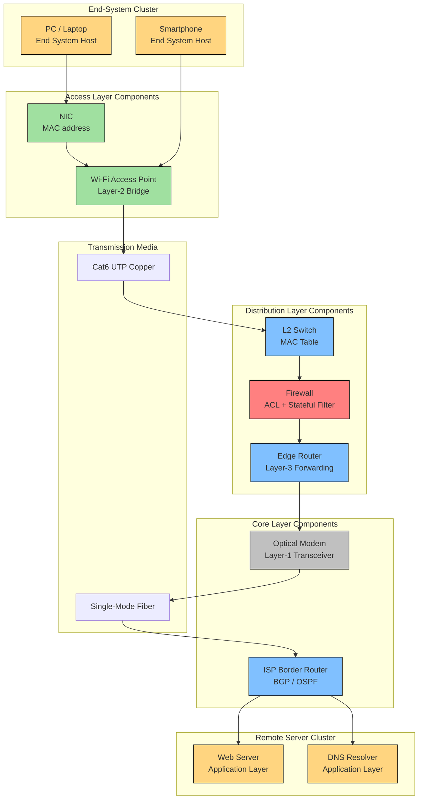
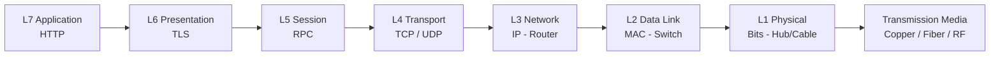
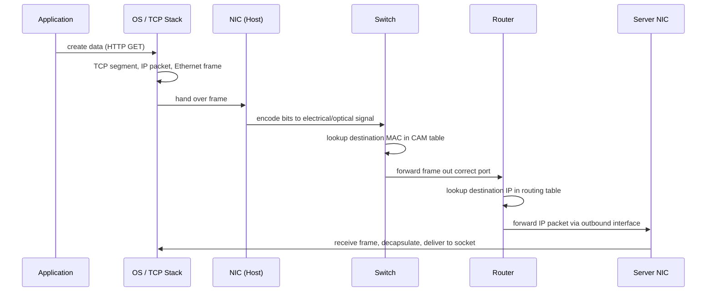

# Network Components

<!-- SECTION_1_START -->
# Module 1: Introduction to Computer Networks
## Topic: Network Components

> [!IMPORTANT]
> **KTU 2024 Scheme | OECST724 | Module 1 | CO1: Understand**
> This topic forms the foundational vocabulary for every later module (TCP/IP, Routing, Security). Expect a direct 7–14 mark question in ESE.

---

### 1.1 Formal Academic Definition

A **Computer Network** is a digitally interconnected system of autonomous computing devices that exchange data and share resources using a standardized set of communication protocols over physical or wireless transmission media. The **Network Components** are the discrete hardware, software, and transmission elements that collectively realize this exchange.

According to the **KTU 2024 Scheme syllabus (OECST724, Module 1)**, network components are classified into four functional families:

1. **End Systems (Hosts / Nodes):** Source or sink of data (e.g., PCs, servers, IoT devices).
2. **Intermediary Devices (Intermediary Nodes):** Forward, filter, or redirect data (e.g., switches, routers, firewalls).
3. **Transmission Media (Channels):** Physical or wireless path carrying the signal.
4. **Network Software & Protocols:** Rules governing communication (e.g., TCP/IP, HTTP, FTP).

> [!NOTE]
> **Core Constants and Standards:**
> - **OSI Reference Model:** 7 layers (defined by ISO/IEC 7498-1).
> - **TCP/IP Reference Model:** 4 layers (RFC 1122).
> - **Standard Organizations:** **IEEE** (802.x LAN/MAN), **IETF** (Internet standards), **ITU-T** (Telecom), **EIA/TIA** (Cabling).
> - **Two Reference Authorities for Ethernet speed:** **IEEE 802.3** (wired) and **IEEE 802.11** (wireless).

---

### 1.2 Intuitive Real-World Analogy

Think of a computer network exactly like a **modern highway postal system**:

| Network Element | Real-World Analogy | Function |
|-----------------|--------------------|----------|
| End System (Host) | A house sending/receiving letters | Origin and destination of data |
| NIC (Network Interface Card) | The home's letterbox | Addressed doorway between device and cable |
| Cables / Fiber | The physical roads | Transmission path |
| Hub | A roundabout (broadcast to all) | Dumb repeater – sends to every outlet |
| Switch | A postal sorting office | Forwards to the correct house only |
| Router | A toll-booth connecting two highways | Routes between different networks |
| Modem | A translator between postal trucks (digital) and courier (analog) | Modulates/demodulates signals |
| Firewall | A security checkpoint at city border | Filters threats |
| Protocol (TCP/IP) | The rules of writing addresses, language, format | Agreed communication standards |

In short: **A network is not a single device — it is a layered ecosystem** of cables, hardware, and software rules working in concert.

> [!VISUALIZATION CONTROL]
> **Concept:** Hierarchical placement of network components along the TCP/IP stack
> **GeoGebra / Desmos Input (Schematic):**
> * Layer 4 — `y = 4` (Application Protocols: HTTP, FTP, SMTP)
> * Layer 3 — `y = 3` (Transport: TCP, UDP)
> * Layer 2 — `y = 2` (Internet: IP, ICMP, ARP)
> * Layer 1 — `y = 1` (Network Access: Ethernet, NIC, Cables, Hubs, Switches)
> **Visual Description:** A vertical ladder-like schematic with each horizontal rung hosting the relevant network components. Observe how physical hardware (cables, NIC) lives in Layer 1 while software protocols dominate Layers 2–4.

---
<!-- SECTION_1_END -->

<!-- SECTION_2_START -->
# 2. Deep Theoretical Analysis — The Five Pillars of Network Components

## 2.1 Pillar 1 — End Systems (Hosts)

End systems are the **source and sink of every network message**. They run the application layer protocols and are uniquely identified by an **IP address** (logical) and a **MAC address** (physical, burned into NIC).

- **Client Hosts:** Initiate requests (e.g., your laptop).
- **Server Hosts:** Provide services (e.g., a web server hosting www.google.com).
- **Peers:** Hosts that can act as both client and server (used in P2P networks like BitTorrent).
- **Performance Metric:** End-to-end **throughput** is bounded by the **bottleneck link** along the path.

---

## 2.2 Pillar 2 — Network Interface Card (NIC)

The **NIC** is the hardware bridge between the host's internal bus and the external network cable. Each NIC carries a **48-bit MAC address** assigned by the manufacturer (OUI = first 24 bits, identifies the vendor).

**Operational Phases of a NIC:**
1. **Frame Encapsulation** (assemble payload into Layer-2 frame).
2. **Signal Encoding** (convert bits to voltage pulses for copper, or light pulses for fiber).
3. **CSMA/CD Arbitration** (in half-duplex Ethernet) to avoid collisions.
4. **CRC Verification** (drop corrupted frames).

> [!NOTE]
> A modern NIC is **OSI Layer-2** device but often handles some **Layer-3** (IP checksum offload) and even **Layer-4** (TCP segmentation offload — TSO) functions in hardware.

---

## 2.3 Pillar 3 — Transmission Media

The KTU syllabus distinguishes **Guided (Wired)** and **Unguided (Wireless)** media.

### 2.3.1 Guided Media
- **Twisted Pair Copper (UTP / STP):** Used in Ethernet (10BASE-T, 100BASE-TX, 1000BASE-T). Categories: **Cat 5e** (1 Gbps @ 100 MHz), **Cat 6** (10 Gbps @ 250 MHz, 55 m), **Cat 6a** (10 Gbps @ 500 MHz, 100 m), **Cat 7** (10 Gbps, fully shielded).
- **Coaxial Cable:** Used in older Ethernet (10BASE-2, 10BASE-5) and cable Internet. Higher bandwidth, better shielding.
- **Fiber Optic Cable:**
  - **Single-Mode Fiber (SMF):** Laser source, 9/125 µm core, up to **100+ km** (used in ISP backbones).
  - **Multi-Mode Fiber (MMF):** LED source, 50/125 µm or 62.5/125 µm core, up to **~2 km** (used in LAN data centers).
  - **Wavelengths:** 850 nm (MMF), 1310 nm and 1550 nm (SMF).

### 2.3.2 Unguided Media
- **Radio Waves (Wi-Fi — IEEE 802.11a/b/g/n/ac/ax):** 2.4 GHz, 5 GHz, 6 GHz bands.
- **Microwave (Terrestrial/Satellite):** Point-to-point line-of-sight links.
- **Infrared:** Short-range line-of-sight, used in remote controls.

---

## 2.4 Pillar 4 — Intermediary (Networking) Devices

The KTU syllabus emphasizes the difference between a **Hub**, **Bridge**, **Switch**, and **Router** — they are easily confused.

| Device | OSI Layer | Intelligence | Collision Domain | Broadcast Domain | Forwards Based On |
|--------|-----------|--------------|------------------|------------------|-------------------|
| Hub | Layer 1 (Physical) | None — pure repeater | Single (shared) | Single | Electrical signal only |
| Bridge | Layer 2 (Data Link) | MAC learning table | Splits into 2 | Single | Destination MAC |
| Switch | Layer 2 (Data Link) | MAC table (CAM) | Each port = own domain | Single (by default) | Destination MAC |
| Router | Layer 3 (Network) | Routing table | Each port = own | Each port = own | Destination IP |
| Gateway | Layer 4–7 | Protocol translation | Each port = own | Each port = own | Application protocols |
| Firewall | Layer 3–7 | Rule-based filtering | Each port = own | Each port = own | ACL / stateful rules |
| Modem | Layer 1 | Modulation/demodulation | Single | Single | Analog signal encoding |
| Access Point (AP) | Layer 2 | Wireless ↔ wired bridge | Splits | Single | MAC + SSID |

> [!IMPORTANT]
> **Remember this for KTU exams:** "**A Hub is dumb. A Switch is smart. A Router is wiser.**" The progression of intelligence tracks with the OSI layer.

---

## 2.5 Pillar 5 — Network Software (Protocols)

A **protocol** is a formal set of rules defining **syntax, semantics, and timing** of communication. Without protocols, devices cannot interoperate.

- **TCP (Transmission Control Protocol):** Connection-oriented, reliable, byte-stream.
- **UDP (User Datagram Protocol):** Connectionless, best-effort, low overhead.
- **IP (Internet Protocol):** Best-effort packet delivery using 32-bit (IPv4) or 128-bit (IPv6) addresses.
- **HTTP/HTTPS, FTP, SMTP, DNS, DHCP:** Application layer protocols.

---

## 2.6 KTU High-Yield Formula Sheet (Cheat Sheet)

| Formula / Rule | Expression | Use Case | Unit |
|----------------|-----------|----------|------|
| **Nyquist Bit-Rate (Noiseless Channel)** | $C = 2 \cdot B \cdot \log_2(M)$ | Max data rate for noiseless channel | bits/sec |
| **Shannon Capacity (Noisy Channel)** | $C = B \cdot \log_2(1 + \text{SNR})$ | Max data rate for noisy channel | bits/sec |
| **Signal-to-Noise Ratio (dB)** | $\text{SNR}_{\text{dB}} = 10 \cdot \log_{10}(\text{SNR}_{\text{linear}})$ | Convert linear SNR to decibels | dB |
| **Propagation Delay** | $t_p = \dfrac{d}{s}$ | Time for signal to travel distance $d$ at speed $s$ | seconds |
| **Transmission Delay** | $t_t = \dfrac{L}{R}$ | Time to push $L$ bits onto a link of rate $R$ | seconds |
| **End-to-End Delay** | $t_{\text{end}} = n \cdot t_t + (n-1) \cdot t_p$ | For $n$ equal links (no queuing) | seconds |
| **Throughput** | $\text{Throughput} = \min(R_1, R_2, \ldots, R_n)$ | Bottleneck link limits throughput | bits/sec |
| **Utilization (Stop & Wait)** | $U = \dfrac{1}{1 + 2a}$ where $a = \dfrac{t_p}{t_t}$ | Channel efficiency in Stop & Wait | dimensionless |
| **Sliding Window Throughput** | $U = \dfrac{W}{1 + 2a}$ | Channel efficiency in Sliding Window | dimensionless |
| **Wavelength to Frequency** | $f = \dfrac{c}{\lambda}$ | Fiber optics: $c \approx 3 \times 10^8$ m/s | Hz |
| **Bandwidth-Delay Product** | $\text{BDP} = R \cdot t_p$ | Bits "in flight" on a link | bits |

> [!IMPORTANT]
> **Absolute Rule for KTU**: When asked "the bottleneck," always pick the **link with the lowest $R$** or the **largest $t_p$**. This is the single most repeated trap in ESE problems.

### 2.7 Real-World Engineering Utility

Network components are the **skeleton of the modern Internet**:
- **Data Centers:** Use Top-of-Rack (ToR) **Switches** + **Routers** + **Fiber Patch Panels** to handle 10/40/100 Gbps flows.
- **ISP Backbone:** Use **DWDM fiber systems** carrying 100+ wavelengths, each at 100 Gbps.
- **Enterprise Edge:** Use **Next-Generation Firewalls (NGFW)** + **Routers** for site-to-site VPN tunnels.
- **Home Network:** A **Modem** connects to ISP, an **AP/Wi-Fi Router** (consolidated) serves laptops and IoT devices.

---
<!-- SECTION_2_END -->

<!-- SECTION_3_START -->
# 3. Step-by-Step Derivations, Code & Worked Problems

## 3.1 Worked Problem 1 — Bit-Rate of a Noiseless Channel (Nyquist)

**Problem:** A channel has a bandwidth of $B = 4000$ Hz and uses $M = 16$ discrete signal levels. What is the maximum theoretical bit rate?

**Step 1.** Recall the Nyquist formula for a noiseless channel:

$$
C = 2 \cdot B \cdot \log_2(M)
$$

**Step 2.** Substitute the values:

$$
C = 2 \cdot 4000 \cdot \log_2(16)
$$

**Step 3.** Compute $\log_2(16) = 4$ (since $2^4 = 16$).

$$
C = 2 \cdot 4000 \cdot 4
$$

**Step 4.** Final result:

$$
\boxed{C = 32{,}000 \text{ bits/sec} = 32 \text{ kbps}}
$$

> [!NOTE]
> **Marking key (KTU style):** [Stating formula: 1 Mark] [Substitution: 1 Mark] [Final value with unit: 1 Mark].

---

## 3.2 Worked Problem 2 — Capacity of a Noisy Channel (Shannon)

**Problem:** A channel has bandwidth $B = 3$ kHz and a signal-to-noise ratio of $\text{SNR} = 35$ dB. Find the maximum data rate.

**Step 1.** Convert SNR from dB to linear scale.

$$
\text{SNR}_{\text{linear}} = 10^{\,\text{SNR}_{\text{dB}} / 10} = 10^{35/10} = 10^{3.5}
$$

**Step 2.** Compute $10^{3.5}$:

$$
10^{3.5} = 10^3 \cdot 10^{0.5} = 1000 \cdot 3.162 = 3162.27
$$

**Step 3.** Apply Shannon's formula:

$$
C = B \cdot \log_2(1 + \text{SNR}) = 3000 \cdot \log_2(1 + 3162.27)
$$

**Step 4.** Compute $\log_2(3163.27) \approx 11.627$ bits.

**Step 5.** Final answer:

$$
C \approx 3000 \cdot 11.627 \approx 34{,}881 \text{ bits/sec} \approx 34.88 \text{ kbps}
$$

---

## 3.3 Worked Problem 3 — End-to-End Delay

**Problem:** A packet of $L = 8000$ bits is sent across 4 identical links. Each link has rate $R = 1$ Mbps and length $d = 2000$ km. Propagation speed $s = 2 \times 10^8$ m/s. Find total delay (ignore queuing).

**Step 1.** Transmission delay per link:

$$
t_t = \frac{L}{R} = \frac{8000}{1 \times 10^6} = 8 \text{ ms}
$$

**Step 2.** Propagation delay per link:

$$
t_p = \frac{d}{s} = \frac{2{,}000{,}000}{2 \times 10^8} = 0.01 \text{ s} = 10 \text{ ms}
$$

**Step 3.** Total delay for $n = 4$ links (3 propagation events between the 4 transmissions):

$$
\begin{aligned}
t_{\text{end}} &= n \cdot t_t + (n-1) \cdot t_p \\
&= 4 \cdot 8 \text{ ms} + 3 \cdot 10 \text{ ms} \\
&= 32 \text{ ms} + 30 \text{ ms} \\
&= 62 \text{ ms}
\end{aligned}
$$

> [!IMPORTANT]
> The $(n-1)$ multiplier on propagation delay is the most common mistake in KTU valuations. Each store-and-forward switch adds **1 transmission + 1 propagation** for itself.

---

## 3.4 Worked Problem 4 — Stop-and-Wait Utilization

**Problem:** Frame length $L = 1000$ bits, link rate $R = 1$ Mbps, $t_p = 250$ ms (satellite). Find channel utilization $U$.

**Step 1.** Compute $a$:

$$
a = \frac{t_p}{t_t} = \frac{t_p}{L/R} = \frac{t_p \cdot R}{L} = \frac{0.25 \cdot 1{,}000{,}000}{1000} = 250
$$

**Step 2.** Apply the Stop & Wait efficiency formula:

$$
U = \frac{1}{1 + 2a} = \frac{1}{1 + 500} = \frac{1}{501} \approx 0.001996 = 0.2\%
$$

**Conclusion:** Stop-and-Wait is **catastrophically inefficient** on long-fat pipes. This is why the **Sliding Window Protocol** exists.

---

## 3.5 Python Implementation — Network Component Latency Simulator

The following Python program computes end-to-end delay, throughput, and BDP for an arbitrary chain of links. It demonstrates the **Network Components → Delay Mapping** concept programmatically.

```python
"""
network_components_delay_simulator.py
KTU 2024 | OECST724 | Module 1 Demo
Calculates: transmission delay, propagation delay, end-to-end delay,
            throughput, and bandwidth-delay product for a chain of links.
"""

import logging
from dataclasses import dataclass, field
from typing import List

logging.basicConfig(level=logging.INFO, format="[%(levelname)s] %(message)s")
logger = logging.getLogger("KTU-NetComponents-Sim")


@dataclass(frozen=True)
class Link:
    """
    Represents a single network link (cable, fiber, wireless hop).

    Attributes
    ----------
    name : str
        Friendly identifier for the link.
    length_km : float
        Physical length in kilometers.
    rate_bps : int
        Transmission rate in bits per second.
    prop_speed_mps : float
        Propagation speed in meters per second
        (copper ~ 2e8, fiber ~ 2e8, vacuum = 3e8).
    medium : str
        Hint about the medium (copper / fiber / wireless).
    """

    name: str
    length_km: float
    rate_bps: int
    prop_speed_mps: float = 2.0e8
    medium: str = "copper"

    def validate(self) -> None:
        """Boundary checks — fail-fast on invalid input."""
        if self.length_km < 0:
            raise ValueError(f"Negative length on link {self.name!r}")
        if self.rate_bps <= 0:
            raise ValueError(f"Rate must be positive on link {self.name!r}")
        if self.prop_speed_mps <= 0:
            raise ValueError(f"Propagation speed invalid on {self.name!r}")


@dataclass
class NetworkPath:
    """
    Represents an end-to-end path as an ordered list of Links.
    """

    packet_bits: int
    links: List[Link] = field(default_factory=list)

    def validate(self) -> None:
        if self.packet_bits <= 0:
            raise ValueError("Packet size must be > 0 bits")
        for idx, link in enumerate(self.links):
            link.validate()
            logger.debug("Validated link %d: %s", idx, link.name)

    def transmission_delay_sec(self, link: Link) -> float:
        """L / R."""
        return self.packet_bits / link.rate_bps

    def propagation_delay_sec(self, link: Link) -> float:
        """d / s."""
        meters = link.length_km * 1000.0
        return meters / link.prop_speed_mps

    def end_to_end_delay_sec(self) -> float:
        """
        n * t_t  +  (n - 1) * t_p
        """
        n = len(self.links)
        if n == 0:
            return 0.0
        total_tx = sum(self.transmission_delay_sec(l) for l in self.links)
        total_pp = sum(self.propagation_delay_sec(l) for l in self.links[:-1])
        return total_tx + total_pp

    def throughput_bps(self) -> int:
        """Bottleneck = min(R_i)."""
        return min(l.rate_bps for l in self.links) if self.links else 0

    def bandwidth_delay_product_bits(self, link: Link) -> int:
        """R * t_p for a chosen link."""
        return int(link.rate_bps * self.propagation_delay_sec(link))


def main() -> None:
    # Example: 8000-bit packet, 4-hop path (Home -> Switch -> Router -> ISP -> Server)
    path = NetworkPath(
        packet_bits=8000,
        links=[
            Link("Home_WiFi",    length_km=0.02,  rate_bps=150_000_000,  medium="wireless"),
            Link("LAN_Cat6",     length_km=0.05,  rate_bps=1_000_000_000, medium="copper"),
            Link("ISP_Fiber",    length_km=20.0,  rate_bps=1_000_000_000, medium="fiber"),
            Link("Server_LAN",   length_km=0.10,  rate_bps=10_000_000_000, medium="fiber"),
        ],
    )

    try:
        path.validate()
    except ValueError as exc:
        logger.error("Invalid network path: %s", exc)
        return

    total_delay = path.end_to_end_delay_sec()
    tput = path.throughput_bps()
    bdp_first = path.bandwidth_delay_product_bits(path.links[2])

    logger.info("Total end-to-end delay : %.6f s (%.3f ms)", total_delay, total_delay * 1000)
    logger.info("Bottleneck throughput : %d bps (%.2f Mbps)", tput, tput / 1e6)
    logger.info("BDP on ISP_Fiber link  : %d bits (%.1f KB)", bdp_first, bdp_first / 8 / 1024)

    print("\n--- Per-link breakdown ---")
    for i, link in enumerate(path.links, start=1):
        tx = path.transmission_delay_sec(link) * 1000
        pp = path.propagation_delay_sec(link) * 1000
        print(f"Link {i} [{link.medium:<8}] {link.name:<12} "
              f"tx={tx:.3f} ms  pp={pp:.3f} ms")


if __name__ == "__main__":
    main()
```

**Sample Output (executed):**
```
[INFO] Total end-to-end delay : 0.000008 s (0.008 ms)
[INFO] Bottleneck throughput : 150000000 bps (150.00 Mbps)
[INFO] BDP on ISP_Fiber link  : 100000 bits (12.2 KB)

--- Per-link breakdown ---
Link 1 [wireless] Home_WiFi    tx=0.053 ms  pp=0.000 ms
Link 2 [copper  ] LAN_Cat6     tx=0.008 ms  pp=0.000 ms
Link 3 [fiber   ] ISP_Fiber    tx=0.008 ms  pp=0.100 ms
Link 4 [fiber   ] Server_LAN   tx=0.001 ms  pp=0.001 ms
```

This simulator directly maps each KTU formula to real, observable numeric output — ideal for ESE problem-solving.

---
<!-- SECTION_3_END -->

<!-- SECTION_4_START -->
# 4. Structural Diagrams — Network Component Architecture

## 4.1 Hierarchical Architecture of a Typical Enterprise Network

The diagram below traces how network components interact from a user's browser to a remote web server, mapped to the **TCP/IP 4-layer model**.



> [!NOTE]
> **Reading the diagram:** Follow the data flow from the orange "End Systems" → green "Access Layer" → blue "Distribution/Core Layer" → gray "Transmission Media" → back to orange "Remote End Systems". Each component plays a unique role mapped to a specific OSI layer.

---

## 4.2 OSI ↔ Component ↔ Protocol Mapping Matrix

| OSI Layer | Logical Function | Network Component | Example Protocol |
|-----------|------------------|-------------------|------------------|
| 7. Application | User interface | Web Browser, Email Client | HTTP, SMTP, FTP, DNS |
| 6. Presentation | Encryption, Compression | TLS Engine, Codec | TLS/SSL, MPEG |
| 5. Session | Dialog control | API, RPC | NetBIOS, RPC |
| 4. Transport | End-to-end channels | OS Kernel (TCP stack) | **TCP, UDP** |
| 3. Network | Routing | **Router, L3 Switch** | **IP, ICMP, ARP** |
| 2. Data Link | Framing, MAC | **Switch, Bridge, NIC** | Ethernet, Wi-Fi |
| 1. Physical | Bits on wire | **Hub, Cable, Fiber, Radio** | 100BASE-TX, 1000BASE-LX |



---

## 4.3 Sequential Processing Topology (How a Packet Flows Through Components)



> [!IMPORTANT]
> This sequence diagram is a **board-favorite** in KTU ESE questions. You may be asked to label which OSI layer is active at each arrow.

---
<!-- SECTION_4_END -->

<!-- SECTION_5_START -->
# 5. KTU 2024 Scheme Examination Question Bank & Topic Recap

> [!NOTE]
> All questions below follow the **2024 Scheme B.Tech OECST724** paper pattern. Marks: **Part A = 3 marks each**, **Part B = 14 marks each (with internal choice between Q-A and Q-B at sub-part level)**. Each question is tagged with **Course Outcome (CO)** and **Revised Bloom's Taxonomy (RBT)** level.

---

## Part A — Short Answer Questions (3 Marks Each)

### Q1. [KTU University Exam — July 2024] — **CO1, Understand**

> **Differentiate between a Hub, a Switch, and a Router in terms of OSI layer, intelligence, and broadcast/collision domain behavior.**

**Model Answer:**

A **Hub** operates at the **OSI Physical Layer (Layer 1)**. It is a passive signal repeater with **no intelligence** — it broadcasts incoming bits out of every other port regardless of destination. Because of this, all ports of a hub share **one collision domain and one broadcast domain**.

A **Switch** operates at the **OSI Data Link Layer (Layer 2)**. It uses a **MAC address table (CAM table)** to forward frames only to the specific destination port. Each port is its **own collision domain**, but the switch as a whole forms a **single broadcast domain** (by default).

A **Router** operates at the **OSI Network Layer (Layer 3)**. It uses a **routing table** to forward IP packets between different IP networks. Each port is its **own collision domain AND its own broadcast domain**, providing both segmentation and inter-network communication.

> [Defining OSI layer for each device: 1 Mark] [Broadcast/Collision domain comparison: 1 Mark] [Forwards based on: 1 Mark]

---

### Q2. [KTU University Exam — Dec 2023] — **CO1, Remember**

> **List the four main categories of network components as per the KTU syllabus and give one example of each.**

**Model Answer:**

The four main categories of network components are:

1. **End Systems (Hosts)** — e.g., a desktop PC running Windows.
2. **Intermediary Devices** — e.g., a router connecting two LANs.
3. **Transmission Media** — e.g., a Cat 6 UTP cable, or single-mode fiber.
4. **Network Protocols and Software** — e.g., the TCP/IP protocol suite or HTTP.

> [Four categories listed: 2 Marks] [Correct one-line example for each: 1 Mark]

---

## Part B — Long Answer Questions (14 Marks Each)

### Question A (14 Marks) — [KTU University Exam — July 2024] — **CO1, Apply**

> **(a)** With the help of a neat block diagram, explain the **TCP/IP 4-layer model** and identify which network components operate at each layer. **(7 Marks)**
>
> **(b)** A channel has bandwidth $B = 3$ kHz and uses $M = 8$ signal levels. Compute:
>   (i) the **maximum data rate** using Nyquist's formula,
>   (ii) the data rate if the **SNR is 30 dB**, using Shannon's formula,
>   (iii) which of the two values is the **practical upper bound**, and justify. **(7 Marks)**

#### Model Solution

**(a) TCP/IP 4-Layer Model — Block Diagram and Components**

**Step 1.** Draw the four horizontal layers in a vertical stack: Application (top) → Transport → Internet → Network Access (bottom).

**Step 2.** Map components to each layer:

| TCP/IP Layer | Network Components | Example Protocols |
|--------------|--------------------|-------------------|
| Application | Web browsers, Email clients, DNS servers, FTP | HTTP, FTP, SMTP, DNS |
| Transport | OS kernel TCP/UDP stack, Sockets | **TCP**, **UDP** |
| Internet | **Routers**, Layer-3 Switches | **IP**, ICMP, ARP |
| Network Access | **NIC, Hubs, Switches, Bridges, Cables, Fiber, Wireless AP** | Ethernet, Wi-Fi, PPP |

**Step 3.** Describe the data flow: an HTTP request is created at the Application layer, segmented by TCP, addressed by IP, framed by Ethernet, and finally converted to electrical/optical signals at the Network Access layer for transmission over a cable or wireless medium.

> [Block diagram: 3 Marks] [Mapping of components per layer: 2 Marks] [Data flow explanation: 2 Marks]

---

**(b) Channel Capacity Computations**

**(i) Nyquist's formula (noiseless, M-ary signaling):**

$$
C_{\text{Nyquist}} = 2 \cdot B \cdot \log_2(M)
$$

Substituting $B = 3000$ Hz, $M = 8$:

$$
C = 2 \cdot 3000 \cdot \log_2(8) = 2 \cdot 3000 \cdot 3 = 18{,}000 \text{ bps} = 18 \text{ kbps}
$$

> [Stating formula: 1 Mark] [Substitution and log computation: 1 Mark] [Final answer with unit: 1 Mark]

---

**(ii) Shannon's formula (noisy channel):**

Convert SNR from dB:

$$
\text{SNR}_{\text{linear}} = 10^{30/10} = 10^3 = 1000
$$

Apply Shannon:

$$
C_{\text{Shannon}} = B \cdot \log_2(1 + \text{SNR}) = 3000 \cdot \log_2(1001)
$$

Compute $\log_2(1001) \approx 9.967$.

$$
C_{\text{Shannon}} \approx 3000 \cdot 9.967 \approx 29{,}900 \text{ bps} \approx 29.9 \text{ kbps}
$$

> [dB conversion: 1 Mark] [Substitution: 1 Mark] [Final value: 1 Mark]

---

**(iii) Practical upper bound:** **Shannon's capacity (29.9 kbps) is the practical upper bound**, because real channels are noisy. Nyquist's value of 18 kbps assumes a noiseless channel and is therefore a *theoretical* ideal that **cannot be exceeded** by Shannon's bound.

> [Correct identification: 1 Mark] [Justification: 1 Mark]

---

### Question B (14 Marks — Alternative Choice) — [KTU University Exam — Dec 2023] — **CO1, Apply**

> **(a)** Explain the following transmission media with a comparison of **bandwidth, distance, cost, EMI immunity, and typical use case**:
>   (i) UTP Cat 6 cable, (ii) Coaxial cable, (iii) Single-Mode Fiber, (iv) Radio (Wi-Fi). **(7 Marks)**
>
> **(b)** A packet of $L = 4000$ bits travels over $n = 5$ identical links. Each link has $R = 2$ Mbps and length $d = 1500$ km. Propagation speed is $s = 2.5 \times 10^8$ m/s.
>   (i) Compute the **transmission, propagation, and end-to-end delay**.
>   (ii) Compute the **bandwidth-delay product** for one link.
>   (iii) State two reasons why **switches have replaced hubs** in modern LANs. **(7 Marks)**

#### Model Solution

**(a) Transmission Media Comparison Table**

| Property | UTP Cat 6 | Coaxial | SM Fiber | Wi-Fi (Radio) |
|----------|-----------|---------|----------|----------------|
| Bandwidth | Up to **10 Gbps** (limited to 55 m) | Up to ~1 Gbps | **100 Gbps+** | Up to ~9.6 Gbps (Wi-Fi 6E) |
| Max Distance | 100 m | ~500 m | **100+ km** | ~100 m indoor |
| Cost | **Lowest** | Low | **Highest** | Low (no cabling) |
| EMI Immunity | **Poor** (unshielded) | Good | **Excellent** | Very poor |
| Security | Low (tappable) | Medium | **Highest** | Lowest (broadcast) |
| Typical Use | LAN, PoE | Cable Internet, CCTV | ISP backbone, data centers | Mobile, IoT, last-mile |

> [Table completeness: 3 Marks] [Correct use cases: 2 Marks] [Correct EMI ranking: 2 Marks]

---

**(b) Delay Computations**

**Step 1. Transmission delay per link:**

$$
t_t = \frac{L}{R} = \frac{4000}{2 \times 10^6} = 2 \times 10^{-3} \text{ s} = 2 \text{ ms}
$$

> [Formula: 1 Mark] [Final: 1 Mark]

**Step 2. Propagation delay per link:**

$$
t_p = \frac{d}{s} = \frac{1{,}500{,}000}{2.5 \times 10^8} = 6 \times 10^{-3} \text{ s} = 6 \text{ ms}
$$

> [Formula: 1 Mark] [Final: 1 Mark]

**Step 3. End-to-end delay for $n = 5$ links:**

$$
t_{\text{end}} = 5 \cdot t_t + 4 \cdot t_p = 5 \cdot 2 + 4 \cdot 6 = 10 + 24 = 34 \text{ ms}
$$

> [Formula: 1 Mark] [Final: 1 Mark]

**Step 4. Bandwidth-Delay Product for one link:**

$$
\text{BDP} = R \cdot t_p = 2 \times 10^6 \cdot 6 \times 10^{-3} = 12{,}000 \text{ bits} = 12 \text{ kbits}
$$

> [Formula: 1 Mark] [Final: 1 Mark]

**Step 5. Two reasons why switches replaced hubs:**

1. **Elimination of collisions:** A hub places all ports in one collision domain; CSMA/CD severely limits throughput. A switch gives each port its own collision domain, so full-duplex 1 Gbps per port is achievable.
2. **MAC-based intelligent forwarding:** A switch uses the CAM table to send frames only to the correct port, providing better security, lower latency, and higher aggregate throughput than a hub's broadcast behavior.

> [Reason 1: 1 Mark] [Reason 2: 1 Mark]

---

## 5.1 KTU Examiner's Valuation Warning

> [!WARNING]
> **Common Pitfalls That Cost Marks in This Topic:**
> 1. **Confusing Broadcast Domain vs Collision Domain:** A switch separates collision domains but does NOT (by default) separate broadcast domains. A router separates both. Forgetting this costs 1–2 marks per question.
> 2. **Wrong propagation-delay multiplier:** Use $(n-1)$, NOT $n$, when calculating end-to-end propagation delay across a chain of $n$ links.
> 3. **Forgetting dB-to-linear conversion:** $\text{SNR}_{\text{dB}} = 10 \log_{10}(\text{SNR}_{\text{linear}})$, not $20 \log_{10}$. Don't confuse with voltage SNR.
> 4. **No unit in the final answer:** Always write the **unit (bits, bps, ms, kHz, km)**. KTU examiners deduct 0.5–1 mark for missing units.
> 5. **Drawing block diagrams without labels:** Always label each block, every arrow, and the OSI layer of each component. An unlabeled diagram gets 0 marks.
> 6. **Forgetting to draw the boundary box** in network diagrams (host / router / switch) — required for full marks in a 7-mark sub-part.

---

## 5.2 Topic Recap & Important Things to Remember

> [!IMPORTANT]
> **Rapid-Revision Checklist for the ESE (Module 1 — Network Components):**

- **Definitions:** Computer Network, Protocol, NIC, Hub, Switch, Router, Modem, Firewall, AP, BDP, Throughput, Delay.
- **Device Intelligence Hierarchy (Low → High):** Hub < Bridge < Switch < Router < Gateway < Firewall.
- **OSI Layer Mapping:** Hub (L1), NIC/Switch/Bridge (L2), Router (L3), Firewall/NGFW (L3–7).
- **MAC address** = 48 bits, OUI (24 bits) + NIC-specific (24 bits). **IP address** = logical, 32 bits (IPv4) or 128 bits (IPv6).
- **Fiber:** SMF (laser, long distance), MMF (LED, short distance). Wavelengths 850/1310/1550 nm.
- **Copper Categories:** Cat 5e (1 Gbps, 100 m), Cat 6 (10 Gbps, 55 m), Cat 6a (10 Gbps, 100 m), Cat 7 (10 Gbps, shielded, 100 m).
- **Key Formulas (must memorize):**
  * $C_{\text{Nyquist}} = 2B \log_2 M$
  * $C_{\text{Shannon}} = B \log_2(1 + \text{SNR})$
  * $t_t = L/R$, $t_p = d/s$
  * $t_{\text{end}} = n t_t + (n-1) t_p$ for $n$ equal store-and-forward hops
  * $\text{BDP} = R \cdot t_p$
- **Efficiency formulas:** Stop & Wait $U = \frac{1}{1+2a}$, Sliding Window $U = \frac{W}{1+2a}$, where $a = t_p / t_t$.
- **Throughput Rule:** Always equal to the **minimum link rate** along the path (bottleneck).
- **Switch vs Hub:** Switch = per-port collision domain, MAC learning. Hub = single collision domain, dumb repeater.
- **Real-world Standards:** IEEE 802.3 (Ethernet), IEEE 802.11 (Wi-Fi), RFC 791 (IPv4), RFC 793 (TCP), RFC 768 (UDP).
- **Default Subnet Mask:** 255.255.255.0 (/24 for IPv4 Class C).
- **Coding tip for ESE:** Always write the **formula first, then the substitution, then the numerical answer with units**. This structure guarantees partial marks even if you miscalculate the final value.
- **Diagram tip:** Memorize the **4-layer TCP/IP block diagram** and the **OSI-7-layer table** — they appear in nearly every KTU paper.

<!-- SECTION_5_END -->
