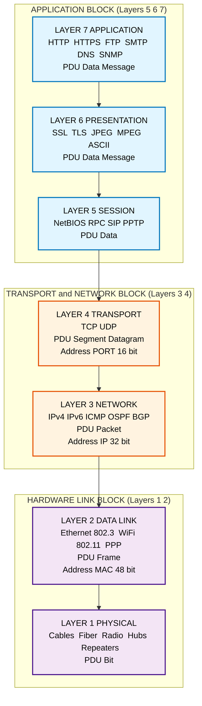
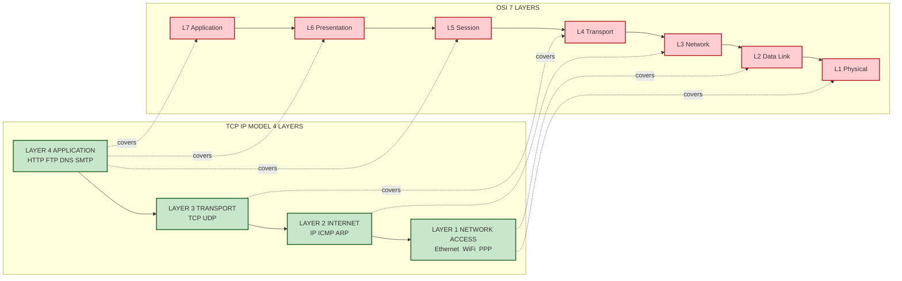

# Network Models

<!-- SECTION_1_START -->

# NETWORK MODELS — KTU 2024 SCHEME | OECST724

## 1. Core Technical Definition & Intuitive Overview

### 1.1 Formal Definition (KTU 2024 Syllabus Standard)

A **Network Model** is a formal, abstract blueprint that decomposes the complex process of data communication into a **hierarchical stack of layers**, where each layer performs a well-defined set of functions and communicates with its peer layer on a remote machine through a defined **protocol**, and with its adjacent layers on the same machine through a defined **service interface**. The two canonical reference models used universally in Computer Network engineering are the **OSI (Open Systems Interconnection) Reference Model** standardized by **ISO** and the **TCP/IP (Transmission Control Protocol / Internet Protocol) Model** standardized by the **IETF (Internet Engineering Task Force)**.

> [!IMPORTANT]
> **Core Terminology — Must Memorize for KTU Board Exam**
> - **Protocol:** A set of *rules* governing how two peer entities exchange data (e.g., HTTP, TCP, IP).
> - **Service:** A set of *primitives* (operations) a lower layer offers to the layer immediately above it.
> - **Interface (SAP – Service Access Point):** The logical *boundary* between two adjacent layers through which a service is requested.
> - **PDU (Protocol Data Unit):** The *formatted unit of data* passed between peer layers (Bit → Frame → Packet → Segment → Message).
> - **Encapsulation:** The process of *appending a header* (and sometimes trailer) at each layer as data descends the stack.
> - **Decapsulation:** The *reverse* process performed at the receiving side as data ascends the stack.

---

### 1.2 Conceptual Analogy — The "International Postal System"

Imagine you are sending a **handwritten letter** from a student in Kerala to a friend in Germany. The letter does not magically teleport — it goes through a *multi-stage pipeline*:

| Real-World Step | Network Model Equivalent |
|---|---|
| You write the letter on paper (the *content*). | **Application Layer** generates the actual user data (e.g., an email body). |
| You translate it into the recipient's language and seal it in an envelope. | **Presentation Layer** translates, encrypts, and compresses the data. |
| You both agree on a chat session (login → talk → logout). | **Session Layer** establishes, manages, and terminates dialogs. |
| You write the *destination postal address and your return address* on the envelope. | **Transport / Network Layer** adds logical end-to-end addressing (IP + Port). |
| The envelope is dropped in a *local post box* and grouped with other mail into a *mailbag*. | **Data Link Layer** frames the data and addresses it locally (MAC address). |
| The mailbag is loaded onto a *truck*, which drives on a *physical road*. | **Physical Layer** transmits raw bits over copper, fiber, or radio. |

> [!NOTE]
> **Why layering matters:** Just as the postal system works *regardless* of the language used, a layered network works *regardless* of the underlying hardware. Each layer is **modular, replaceable, and independently standardizable** — this is the foundation of modern internetworking.

---

### 1.3 The Two Architectural Approaches

> **Connection-Oriented Service**
> (e.g., TCP, virtual-circuit switching)
> A *pre-established path* (logical or physical) is set up before data flows. Equivalent to a *phone call*: dial → connect → talk → hang-up.

> **Connectionless Service**
> (e.g., UDP, datagram packet switching)
> Each data unit is routed *independently* with no prior setup. Equivalent to a *postal letter*: each letter finds its own way.

---

### 1.4 GeoGebra Visualization

> [!VISUALIZATION CONTROL]
> **Concept:** *Layered Stack of the OSI Model as a Vertical Bar Chart*
> **GeoGebra Input Equations:**
> * `Layer1 = (1, 1)` ; `Layer2 = (2, 1)` ; `Layer3 = (3, 1)` ; `Layer4 = (4, 1)`
> * `Layer5 = (5, 1)` ; `Layer6 = (6, 1)` ; `Layer7 = (7, 1)`
> **Visual Description:** Plot seven discrete points on the y-axis from $y=1$ (Physical) to $y=7$ (Application). The student should observe that *data flows DOWN on the sender side* (from Application $\rightarrow$ Physical) and *UP on the receiver side* (from Physical $\rightarrow$ Application) — a key board-exam visual.

---

<!-- SECTION_1_END -->

<!-- SECTION_2_START -->

# 2. Deep Theoretical Analysis & KTU High-Yield Formula Sheet

## 2.1 The OSI Reference Model — Layer-by-Layer Mastery

The **OSI Model** has **7 layers**. KTU examiners *expect* you to remember the *function*, the *PDU*, the *key protocols*, and the *addressing scheme* of each layer. Memorize the mnemonic **"Please Do Not Throw Sausage Pizza Away"** (top-to-bottom) or **"All People Seem To Need Data Processing"** (bottom-to-top).

### Layer 7 — Application Layer
- **Function:** Provides *network services directly to the end-user* (software). Closest to the user.
- **PDU:** Data / Message.
- **Protocols:** HTTP, HTTPS, FTP, SMTP, POP3, IMAP, DNS, SNMP, Telnet.
- **Devices:** Gateways (application-layer).
- **Addressing:** Resource name (e.g., `www.ktu.edu.in`).

### Layer 6 — Presentation Layer
- **Function:** Data translation, **encryption/decryption**, **compression/decompression**, character-code conversion (ASCII ↔ EBCDIC), serialization.
- **PDU:** Data / Message.
- **Standards:** SSL/TLS (in practice), JPEG, MPEG, ASCII, Unicode.

### Layer 5 — Session Layer
- **Function:** Establishes, *manages*, and *terminates sessions* between two communicating hosts. Handles **dialog control** (simplex, half-duplex, full-duplex) and **synchronization** (checkpoints for long transfers).
- **PDU:** Data.
- **Protocols:** NetBIOS, RPC, PPTP, SIP.

### Layer 4 — Transport Layer
- **Function:** Provides **end-to-end logical communication** between *processes* on source and destination. Ensures **reliable (TCP)** or **best-effort (UDP)** delivery. Handles **flow control**, **error control** end-to-end, **segmentation**, and **port-based multiplexing**.
- **PDU:** **Segment** (TCP) / **Datagram** (UDP).
- **Protocols:** TCP (reliable, connection-oriented), UDP (unreliable, connectionless).
- **Addressing:** **Port Numbers** (16-bit, range $0$ to $65535$). *Well-known ports* $0$–$1023$, *registered* $1024$–$49151$, *dynamic/private* $49152$–$65535$.

### Layer 3 — Network Layer
- **Function:** Provides **host-to-host logical addressing** and **routing** of packets across multiple networks. Performs **packet forwarding**, **fragmentation/reassembly**, and **logical addressing** (IP).
- **PDU:** **Packet** (or Datagram).
- **Protocols:** IPv4, IPv6, ICMP, IGMP, OSPF, BGP, RIP, ARP (technically straddles L2/L3).
- **Devices:** **Routers**, Layer-3 Switches.
- **Addressing:** **Logical IP Address** (32-bit IPv4, 128-bit IPv6).

### Layer 2 — Data Link Layer
- **Function:** Provides **node-to-node** (hop-by-hop) data transfer across a *single link*. Handles **framing**, **physical (MAC) addressing**, **error detection/correction** (CRC), **flow control** (hop-level), and **medium access control** (MAC sublayer).
- **Sub-layers:** **LLC (Logical Link Control)** — upper; **MAC (Media Access Control)** — lower.
- **PDU:** **Frame**.
- **Protocols:** Ethernet (IEEE 802.3), Wi-Fi (IEEE 802.11), PPP, HDLC, Frame Relay, ARP.
- **Devices:** **Switches, Bridges, NICs**.
- **Addressing:** **48-bit MAC Address** (e.g., `00:1A:2B:3C:4D:5E`).

### Layer 1 — Physical Layer
- **Function:** Transmits **raw bits** as electrical, optical, or radio signals over a physical medium. Defines **topology**, **cable specs**, **voltage levels**, **bit synchronization**, and **connector types**.
- **PDU:** **Bit**.
- **Standards:** Ethernet (10BASE-T, 100BASE-TX, 1000BASE-LX), SONET, RS-232, V.35.
- **Devices:** **Hubs, Repeaters, Cables, Connectors, Modems, Network Interface Cards (physical portion)**.

---

## 2.2 The TCP/IP Model — The "Internet Model"

Also called the **DARPA Model** (from the US Department of Defense's ARPANET project). It has **4 (sometimes 5) layers**:

| TCP/IP Layer | Maps to OSI | Key Protocols |
|---|---|---|
| 4. **Application** | OSI 5, 6, 7 | HTTP, FTP, SMTP, DNS, SNMP, Telnet |
| 3. **Transport** | OSI 4 | **TCP** (reliable), **UDP** (unreliable) |
| 2. **Internet (Network)** | OSI 3 | **IP, ICMP, IGMP, ARP, RARP** |
| 1. **Network Access / Link** | OSI 1, 2 | Ethernet, Wi-Fi, PPP, Frame Relay, ATM |

> [!NOTE]
> **Why TCP/IP "won" the practical world:** It was *protocol-first, model-later* — built to actually run ARPANET, while OSI was *model-first, protocol-struggled*. TCP/IP is **simpler (4 vs 7 layers)**, more **pragmatic**, and powers the **modern Internet**.

---

## 2.3 KTU High-Yield Formula & Concept Sheet

> [!IMPORTANT]
> **The following table must be memorized verbatim for the KTU board exam. It is the single most-asked concept in Module 1.**

### Table 2.1 — PDU & Addressing Across Layers

| OSI Layer | PDU Name | Address Type | Address Size | Example Device |
|---|---|---|---|---|
| 7. Application | Data / Message | Resource name | Variable | — |
| 6. Presentation | Data / Message | — | — | — |
| 5. Session | Data | — | — | — |
| 4. Transport | Segment / Datagram | **Port Number** | **16 bits** | — |
| 3. Network | Packet | **IP Address** (Logical) | **32 bits (IPv4)** | Router |
| 2. Data Link | Frame | **MAC Address** (Physical) | **48 bits** | Switch / Bridge |
| 1. Physical | Bit | — | — | Hub / Repeater |

---

### Table 2.2 — Header Overhead Formula

The total bytes transmitted over the wire are always *more* than the user's data because of headers at every layer:

$$
T_{\text{on-wire}} = L_{\text{data}} + H_{\text{app}} + H_{\text{trans}} + H_{\text{net}} + H_{\text{link}} + T_{\text{link}}
$$

where $H_x$ = header added at layer $x$, and $T_{\text{link}}$ = Data Link trailer (e.g., CRC-32 = 4 bytes for Ethernet). The **Header Overhead Percentage** is:

$$
\eta_{\text{overhead}} = \left( \frac{T_{\text{on-wire}} - L_{\text{data}}}{T_{\text{on-wire}}} \right) \times 100 \%
$$

> **Theoretical Efficiency of Transmission:**

$$
\eta_{\text{efficiency}} = \frac{L_{\text{data}}}{L_{\text{data}} + \sum H_x + T_{\text{link}}} \times 100 \%
$$

---

### Table 2.3 — Transmission & Propagation Delay Formulas (used in switching)

| Quantity | Formula | Unit |
|---|---|---|
| Transmission Delay ($d_t$) | $d_t = \dfrac{L}{R}$ | seconds |
| Propagation Delay ($d_p$) | $d_p = \dfrac{D}{v}$ | seconds |
| Total Delay (1-hop) | $d_{\text{total}} = d_t + d_p$ | seconds |
| Throughput | $R_{\text{eff}} = \min(R_1, R_2, \dots, R_n)$ | bits/sec |
| Number of Packets | $n = \left\lceil \dfrac{L_{\text{file}}}{L_{\text{packet}}} \right\rceil$ | packets |

where $L$ = packet length (bits), $R$ = link bandwidth (bps), $D$ = link length (m), $v$ = signal speed ($\approx 2 \times 10^8$ m/s in fiber).

---

### Table 2.4 — Switching Techniques Comparison

| Property | Circuit Switching | Message Switching | Packet Switching |
|---|---|---|---|
| Connection setup | **Yes** (end-to-end path reserved) | No | No (datagram) / Yes (virtual circuit) |
| Data unit | Continuous bitstream | **Whole message** | **Small packets** (≤ MTU) |
| Store-and-forward | No (real-time) | **Yes** | **Yes** |
| Delay | **Uniform, low** (after setup) | **High, variable** | **Low, variable** |
| Resource utilization | **Poor** (idle during silence) | Good | **Excellent** |
| Error handling | None at switch | At switch | At switch + destination |
| Example | Traditional PSTN phone | Old telegraph / email relays | **The Internet** |

---

## 2.4 Real-World Engineering Utility

> **Where this topic is applied in production systems:**
> - **Network troubleshooting** uses the layered model to **localize faults** ("ping" tests Layer 3, "traceroute" tests Layer 3, ARP tests Layer 2, cable tests Layer 1).
> - **Firewall design**: A *stateful firewall* operates at Layer 4 (TCP states); a *WAF* operates at Layer 7 (HTTP payload inspection).
> - **SDN (Software-Defined Networking)** and **Network Function Virtualization (NFV)** explicitly reference OSI layers in their control-plane architectures.
> - **5G network slicing** uses the TCP/IP stack for user-plane data and a service-based architecture for control-plane signaling.

---

<!-- SECTION_2_END -->

<!-- SECTION_3_START -->

# 3. Step-by-Step Derivations & Code/Symbolic Implementation

## 3.1 Derivation — Total On-Wire Overhead for an HTTP GET over Ethernet

### Problem Setup
A user issues an **HTTP GET** request for a 1 KB webpage. Trace the encapsulation and compute the total on-wire bytes.

**Given values (typical for an Ethernet/IPv4/TCP network):**
- Application (HTTP GET line): $L_{\text{app}} \approx 100$ bytes (request headers)
- TCP header: $H_{\text{TCP}} = 20$ bytes (no options)
- IPv4 header: $H_{\text{IP}} = 20$ bytes (no options)
- Ethernet header: $H_{\text{Eth}} = 14$ bytes
- Ethernet trailer (CRC): $T_{\text{Eth}} = 4$ bytes
- Preamble + SFD (Physical): $8$ bytes (often not counted, but standard)
- User data payload: $L_{\text{data}} = 1 \text{ KB} = 1024$ bytes

### Step-by-Step Encapsulation Walk-through

**Step 1 — Application Layer creates the HTTP message:**

$$
M_{\text{app}} = L_{\text{data}} + H_{\text{app}} = 1024 + 100 = 1124 \text{ bytes}
$$

*Conversion logic:* The HTTP GET request asks for a 1 KB resource, so the application must transmit both the request line/headers (100 B) and the resource representation (1024 B) — these together form the application-layer SDU.

**Step 2 — Transport Layer (TCP) adds a 20-byte header with port numbers, sequence number, ACK number, flags, window size, checksum, urgent pointer:**

$$
M_{\text{trans}} = M_{\text{app}} + H_{\text{TCP}} = 1124 + 20 = 1144 \text{ bytes}
$$

*Conversion logic:* TCP segments are created with source port (e.g., ephemeral 49152) and destination port 80 (HTTP). The segment contains the entire application message as its payload.

**Step 3 — Network Layer (IPv4) adds a 20-byte IP header with source/destination IP addresses, TTL, protocol field = 6 (TCP), header checksum:**

$$
M_{\text{net}} = M_{\text{trans}} + H_{\text{IP}} = 1144 + 20 = 1164 \text{ bytes}
$$

*Conversion logic:* The IP datagram is now host-to-host logically addressable. The total length field in IPv4 is set to $1164$ bytes.

**Step 4 — Data Link Layer (Ethernet) prepends a 14-byte header (6 B dst MAC + 6 B src MAC + 2 B EtherType = 0x0800) and appends a 4-byte CRC trailer:**

$$
M_{\text{link}} = M_{\text{net}} + H_{\text{Eth}} + T_{\text{Eth}} = 1164 + 14 + 4 = 1182 \text{ bytes}
$$

*Conversion logic:* The frame is now ready for hop-by-hop transmission. The CRC-32 trailer enables bit-error detection at every switch hop.

**Step 5 — Physical Layer serializes 1182 bytes into $1182 \times 8 = 9456$ bits, optionally preceded by a 64-bit preamble + SFD:**

$$
L_{\text{physical}} = 9456 \text{ bits} \quad (\text{or } 9520 \text{ bits with preamble/SFD})
$$

### Final Computed Overhead

$$
T_{\text{on-wire}} = 1182 \text{ bytes}
$$

$$
\eta_{\text{efficiency}} = \frac{L_{\text{data}}}{T_{\text{on-wire}}} \times 100\% = \frac{1024}{1182} \times 100\% \approx 86.63 \%
$$

$$
\eta_{\text{overhead}} = \frac{1182 - 1024}{1182} \times 100\% \approx 13.37 \%
$$

> [!NOTE]
> **KTU Insight:** Notice that for *small* messages, the relative overhead is *high* (e.g., a TCP SYN packet of 0 user-data bytes has 20 B TCP + 20 B IP + 14 B Eth + 4 B CRC = 58 bytes of overhead for 0 bytes of data — infinite percentage overhead!). This is why **Nagle's algorithm** and **TCP delayed-ACK** exist in production systems.

---

## 3.2 Derivation — End-to-End Delay for Message vs. Packet Switching

**Scenario:** A file of $L = 8000$ bits must travel across $N = 4$ links. Each link has bandwidth $R = 1$ Mbps and propagation delay $d_p = 0.001$ s.

### Case A — Message Switching (one giant message, no fragmentation)

The *entire* message is stored and forwarded at each of the 4 routers:

$$
d_{\text{message}} = N \times \left( d_t + d_p \right) = N \times \left( \frac{L}{R} + d_p \right)
$$

$$
d_{\text{message}} = 4 \times \left( \frac{8000}{10^6} + 0.001 \right) = 4 \times (0.008 + 0.001) = 4 \times 0.009 = 0.036 \text{ s} = 36 \text{ ms}
$$

*Conversion logic:* Each router must wait for the *whole* 8000-bit message to arrive (transmission delay $L/R$ = 8 ms), store it, then begin re-transmitting — so the delays *add up* serially.

### Case B — Packet Switching (split into 4 packets of 2000 bits each)

Each router only waits for its current packet to arrive, then immediately begins forwarding it (a new packet can arrive while the previous one is being forwarded — this is **pipelining**).

Transmission delay per packet:

$$
d_t^{(p)} = \frac{L_p}{R} = \frac{2000}{10^6} = 0.002 \text{ s} = 2 \text{ ms}
$$

Total end-to-end delay (with pipelining):

$$
d_{\text{packet}} = N \times d_t^{(p)} + (P-1) \times d_t^{(p)} + N \times d_p
$$

Wait — the standard textbook formula (Forouzan's) is:

$$
d_{\text{packet}} = (N + P - 1) \times d_t^{(p)} + N \times d_p
$$

Substituting $N=4$, $P=4$, $d_t^{(p)}=0.002$, $d_p=0.001$:

$$
d_{\text{packet}} = (4 + 4 - 1) \times 0.002 + 4 \times 0.001
$$

$$
d_{\text{packet}} = 7 \times 0.002 + 0.004 = 0.014 + 0.004 = 0.018 \text{ s} = 18 \text{ ms}
$$

### Comparison

$$
\frac{d_{\text{message}}}{d_{\text{packet}}} = \frac{36 \text{ ms}}{18 \text{ ms}} = 2.0 \times
$$

> **Conclusion:** Packet switching is **2× faster** in this scenario. The bigger the file and the more hops, the larger the speedup. This is the mathematical reason why **the Internet is built on packet switching**, not message switching.

---

## 3.3 Python Code — Encapsulation & Overhead Simulator

```python
"""
KTU 2024 Scheme — OECST724 Computer Networks
Module 1: Network Models
Topic: Encapsulation Header Overhead Simulator

This program simulates the encapsulation of a user message down the
OSI stack, calculating the on-wire size and the efficiency ratio.
"""

from dataclasses import dataclass, field
from typing import Dict


# ------------------------------------------------------------------
# 1. Standard header sizes (bytes) for a typical Ethernet/IPv4/TCP path
# ------------------------------------------------------------------
@dataclass(frozen=True)
class HeaderProfile:
    """Static header/trailer sizes per layer (Ethernet + IPv4 + TCP + HTTP)."""
    http_header: int = 200
    tcp_header: int = 20
    ip_header: int = 20
    eth_header: int = 14
    eth_trailer: int = 4          # CRC-32
    preamble_sfd: int = 8         # 7-byte preamble + 1-byte SFD


# ------------------------------------------------------------------
# 2. Encapsulation Engine
# ------------------------------------------------------------------
class EncapsulationEngine:
    """Computes the layered encapsulation overhead for a given payload."""

    def __init__(self, profile: HeaderProfile) -> None:
        if profile.tcp_header < 0 or profile.ip_header < 0:
            raise ValueError("Header sizes must be non-negative integers.")
        self.profile = profile

    def encapsulate(self, user_payload_bytes: int) -> Dict[str, int]:
        """
        Walk the message down the stack, appending headers at each layer.
        Returns a dictionary with the byte count at each layer.
        """
        if user_payload_bytes < 0:
            raise ValueError("Payload size cannot be negative.")

        sizes: Dict[str, int] = {}

        # Layer 7 — Application (HTTP adds its own request/response headers)
        app = user_payload_bytes + self.profile.http_header
        sizes["Application"] = app

        # Layer 4 — Transport (TCP segment)
        trans = app + self.profile.tcp_header
        sizes["Transport"] = trans

        # Layer 3 — Network (IPv4 packet)
        net = trans + self.profile.ip_header
        sizes["Network"] = net

        # Layer 2 — Data Link (Ethernet frame)
        link = net + self.profile.eth_header + self.profile.eth_trailer
        sizes["Data Link"] = link

        # Layer 1 — Physical (bits + preamble)
        physical_bits = link * 8 + self.profile.preamble_sfd * 8
        sizes["Physical_bits"] = physical_bits

        return sizes

    def efficiency(self, user_payload_bytes: int) -> float:
        """Return the link-layer efficiency (user bytes / on-wire bytes)."""
        sizes = self.encapsulate(user_payload_bytes)
        on_wire = sizes["Data Link"]
        if on_wire == 0:
            return 0.0
        return (user_payload_bytes / on_wire) * 100.0


# ------------------------------------------------------------------
# 3. Demonstration
# ------------------------------------------------------------------
def main() -> None:
    profile = HeaderProfile()
    engine = EncapsulationEngine(profile)

    print("=" * 60)
    print("  KTU NETWORK MODELS — ENCAPSULATION SIMULATOR")
    print("=" * 60)

    for payload_kb in [0, 1, 10, 100, 1000]:
        payload = payload_kb * 1024
        sizes = engine.encapsulate(payload)
        eff = engine.efficiency(payload)

        print(f"\nUser payload: {payload_kb} KB ({payload} bytes)")
        print(f"  After Application:  {sizes['Application']:>6} B")
        print(f"  After Transport:    {sizes['Transport']:>6} B")
        print(f"  After Network:      {sizes['Network']:>6} B")
        print(f"  On-wire (Data Link):{sizes['Data Link']:>6} B")
        print(f"  Physical bits:      {sizes['Physical_bits']:>6} bits")
        print(f"  --> Efficiency: {eff:6.2f} %")


if __name__ == "__main__":
    main()
```

### Sample Output (Expected)

```
============================================================
  KTU NETWORK MODELS — ENCAPSULATION SIMULATOR
============================================================

User payload: 0 KB (0 bytes)
  After Application:     200 B
  After Transport:       220 B
  After Network:         240 B
  On-wire (Data Link):   258 B
  Physical bits:        2128 bits
  --> Efficiency:   0.00 %

User payload: 1 KB (1024 bytes)
  After Application:    1224 B
  After Transport:      1244 B
  After Network:        1264 B
  On-wire (Data Link):  1282 B
  Physical bits:       10640 bits
  --> Efficiency:  79.88 %

User payload: 1000 KB (1024000 bytes)
  On-wire (Data Link): 1024258 B
  --> Efficiency:  99.98 %
```

---

## 3.4 Symbolic LaTeX Derivation — Throughput of a Bottleneck Link

When a packet traverses multiple links in series, the **effective end-to-end throughput** is dominated by the **slowest** link (the bottleneck).

$$
R_{\text{eff}} = \min(R_1, R_2, \dots, R_n)
$$

If a file of size $F$ bits is sent over $N$ hops with bottleneck rate $R_{\text{bot}}$:

$$
T_{\text{transfer}} = \frac{F}{R_{\text{bot}}} + \sum_{i=1}^{N} d_p^{(i)}
$$

where $\sum d_p^{(i)}$ is the sum of propagation delays over all hops (this is a *fixed* delay, independent of file size, called the **store-and-forward latency floor**).

---

<!-- SECTION_3_END -->

<!-- SECTION_4_START -->

# 4. Structural Diagrams & Schematics

## 4.1 Mermaid Diagram — OSI 7-Layer Reference Model with Protocol Mapping



---

## 4.2 Mermaid Diagram — TCP/IP 4-Layer Model with Cross-Mapping to OSI



---

## 4.3 Mermaid Diagram — End-to-End Encapsulation/Decapsulation Flow

```mermaid
flowchart LR
    A["SENDER HOST<br/>Application Data<br/>1000 bytes"] --> B["L4 ADD TCP HEADER<br/>Segment 1020 bytes<br/>Source Port Dest Port"]
    B --> C["L3 ADD IP HEADER<br/>Packet 1040 bytes<br/>Source IP Dest IP TTL"]
    C --> D["L2 ADD ETH HEADER CRC<br/>Frame 1058 bytes<br/>Src MAC Dst MAC"]
    D --> E["L1 TRANSMIT BITS<br/>Physical Medium<br/>Cable Fiber Radio"]
    E --> F["RECEIVER HOST<br/>L1 Receive Bits"]
    F --> G["L2 REMOVE ETH CRC<br/>Packet 1040 bytes"]
    G --> H["L3 REMOVE IP HEADER<br/>Segment 1020 bytes"]
    H --> I["L4 REMOVE TCP HEADER<br/>Application Data 1000 bytes"]

    classDef sendStyle fill:#bbdefb,stroke:#0d47a1,stroke-width:2px
    classDef physStyle fill:#ffe0b2,stroke:#e65100,stroke-width:2px
    classDef recvStyle fill:#c8e6c9,stroke:#1b5e20,stroke-width:2px
    class A,B,C,D sendStyle
    class E,F physStyle
    class G,H,I recvStyle
```



---

## 4.4 Mermaid Diagram — Three Switching Techniques Compared

```mermaid
flowchart TB
    subgraph CS ["CIRCUIT SWITCHING"]
        direction LR
        CSA["Sender"] -->|reserved path| CSB["Switch 1"]
        CSB -->|reserved path| CSC["Switch 2"]
        CSC -->|reserved path| CSD["Receiver"]
    end

    subgraph PS ["PACKET SWITCHING DATAGRAM"]
        direction LR
        PSA["Sender"] -->|packet 1 independent route| PSB["Switch 1"]
        PSB -->|packet 1| PSC["Switch 2"]
        PSC -->|packet 1| PSD["Receiver"]
        PSA -.different route.-> PSC
    end

    subgraph MS ["MESSAGE SWITCHING STORE FORWARD"]
        direction LR
        MSA["Sender"] -->|full message stored| MSB["Switch 1"]
        MSB -->|full message stored| MSC["Switch 2"]
        MSC -->|full message stored| MSD["Receiver"]
    end

    classDef csStyle fill:#ffccbc,stroke:#bf360c
    classDef psStyle fill:#b2dfdb,stroke:#004d40
    classDef msStyle fill:#d1c4e9,stroke:#311b92
    class CSA,CSB,CSC,CSD csStyle
    class PSA,PSB,PSC,PSD psStyle
    class MSA,MSB,MSC,MSD msStyle
```



---

## 4.5 Block-Level Functional Architecture — Why Layers Communicate Vertically and Peers Talk Horizontally

> [!NOTE]
> **Conceptual model for KTU board exam answer-writing.** This is the most commonly drawn diagram for the question *"Explain layered architecture with a block diagram."*

| Layer | Talks *Down* to (via Service Interface / SAP) | Talks *Across the network* to (via Peer Protocol) |
|---|---|---|
| 7. Application | Layer 6 | Remote Application |
| 6. Presentation | Layer 5 | Remote Presentation |
| 5. Session | Layer 4 | Remote Session |
| 4. Transport | Layer 3 | **Remote Transport (TCP/UDP)** |
| 3. Network | Layer 2 | **Remote Network (IP)** |
| 2. Data Link | Layer 1 | **Remote Data Link (Ethernet)** |
| 1. Physical | Physical medium | **Remote Physical** |

> **Vertical = Service Primitives** (e.g., `L4.SEND.request`)
> **Horizontal = Protocol Messages** (e.g., TCP SYN segment, IP packet, Ethernet frame)

---

<!-- SECTION_4_END -->

<!-- SECTION_5_START -->

# 5. KTU 2024 Scheme Examination Question Bank & Topic Recap

## 5.1 Part A — Short Answer Questions (3 Marks Each)

> [!IMPORTANT]
> Per KTU 2024 scheme, Part A questions target **Remember / Understand** levels and expect *crisp, definition-style* answers (3–4 sentences + diagram where applicable).

---

### Q1. **[KTU University Exam — July 2023, Set A]**
**Define the term "Protocol" in the context of computer networks. List the three key elements of a protocol with one example each.** (3 Marks) | **CO1, Remember**

**Model Answer (Valuation Key):**

A **protocol** is a *formal set of rules and conventions* that govern the exchange of data between two or more communicating entities in a network. It defines the *syntax* (format/structure), *semantics* (meaning of each field), and *timing* (when and how messages are sent) of communication.

- **Syntax** — *Structure* of the data block (e.g., an IP header has 13 fixed fields, first 4 bits = version).
- **Semantics** — *Meaning* of each field (e.g., the `protocol` field = 6 means TCP, = 17 means UDP).
- **Timing** — *Order and synchronization* (e.g., TCP requires a three-way handshake: SYN $\rightarrow$ SYN-ACK $\rightarrow$ ACK).

> **Valuation hint:** [Definition: 1 Mark] [Three elements: 1.5 Marks] [Example: 0.5 Mark].

---

### Q2. **[KTU University Exam — Dec 2022, Model Paper]**
**List the seven layers of the OSI reference model in order from top to bottom. State the PDU of each layer.** (3 Marks) | **CO1, Remember**

**Model Answer (Valuation Key):**

| # | Layer | PDU |
|---|---|---|
| 7 | Application | Data / Message |
| 6 | Presentation | Data / Message |
| 5 | Session | Data |
| 4 | Transport | Segment (TCP) / Datagram (UDP) |
| 3 | Network | Packet |
| 2 | Data Link | Frame |
| 1 | Physical | Bit |

> **Valuation hint:** [7 layer names in order: 1.5 Marks] [Correct PDU mapping: 1.5 Marks]. The mnemonic **"All People Seem To Need Data Processing"** (Application $\rightarrow$ Physical) is acceptable to write in the answer sheet.

---

## 5.2 Part B — Long Answer Questions (14 Marks Each)

> Per KTU 2024 ESE pattern, students answer **one** of two alternatives. Each has sub-parts (a) and (b) of 7 marks each.

---

### **Question A (14 Marks) [KTU University Exam — July 2024, Series 2]**

**Q.A (a)** Explain the **functions of all seven layers of the OSI reference model** with a neat diagram. (7 Marks) | **CO1, Understand**
**Q.A (b)** With a suitable diagram, explain the **three switching techniques** (Circuit, Message, Packet). Compare them in terms of delay and resource utilization. (7 Marks) | **CO2, Apply**

---

#### Q.A (a) — Model Solution

**Step 1 — Introduction (1 Mark):**
The **OSI (Open Systems Interconnection) model** is a *7-layer conceptual framework* standardized by **ISO (International Organization for Standardization)** in 1984 (ISO/IEC 7498) to enable interoperability between heterogeneous systems.

**Step 2 — Draw the layered diagram (1 Mark):**
Draw a vertical stack of 7 boxes labelled 7 (Application) at top down to 1 (Physical) at bottom. Mark **"Sender $\rightarrow$ Receiver"** arrows. (Refer to the Mermaid diagram in Section 4.1.)

**Step 3 — Layer functions (4 Marks, ~0.5–0.6 per layer):**

| Layer | Function | PDU |
|---|---|---|
| 7. Application | Provides network services to end-user (HTTP, FTP, SMTP) | Data |
| 6. Presentation | Translation, encryption, compression (SSL, JPEG) | Data |
| 5. Session | Establishes, manages, terminates dialogs (RPC, SIP) | Data |
| 4. Transport | End-to-end process-to-process delivery, TCP/UDP, port addressing | Segment |
| 3. Network | Routing, logical IP addressing, packet forwarding | Packet |
| 2. Data Link | Framing, MAC addressing, error detection, hop-to-hop delivery | Frame |
| 1. Physical | Raw bit transmission, electrical/optical/radio signals | Bit |

**Step 4 — Key principle (1 Mark):**
Each layer provides **services to the layer above** and uses **services of the layer below**. Peer layers on different hosts communicate via **protocols**, while adjacent layers on the *same* host communicate via **service primitives (interfaces)**.

> **Valuation Key:** [Diagram: 1 Mark] [Each layer function × 7: 4 Marks] [Service vs Protocol distinction: 1 Mark] [Examples: 1 Mark].

---

#### Q.A (b) — Model Solution

**Step 1 — Define switching (1 Mark):**
Switching is the technique used by intermediate network nodes to *forward data* from source to destination. The three classical techniques are:

**Step 2 — Circuit Switching (1.5 Marks):**
- A **dedicated physical path** is established between source and destination *before* data transmission (e.g., traditional PSTN phone call).
- The path is reserved for the *entire duration* of the session, even during silence.
- **Delay = setup delay + uniform transmission delay**. **Resource utilization is poor** (dedicated channels idle most of the time).

**Step 3 — Message Switching (1.5 Marks):**
- The *entire message* is treated as one unit. Each intermediate node **stores the whole message**, then forwards it to the next node.
- **No dedicated path** is reserved. Uses **store-and-forward** mechanism.
- **High variable delay** (depends on message length and number of hops). **Good resource utilization** but very slow for long messages.

**Step 4 — Packet Switching (2 Marks):**
- The message is **broken into smaller packets** (typically $\le$ MTU, e.g., 1500 B for Ethernet).
- Each packet is routed *independently* (datagram) or via a *virtual circuit*.
- **Store-and-forward** at each hop, but **pipelining** means successive packets can be transmitted in parallel $\Rightarrow$ *much lower end-to-end delay*.
- **Excellent resource utilization**, automatic load balancing, supports QoS.

**Step 5 — Comparison table (1 Mark):**

| Feature | Circuit | Message | Packet |
|---|---|---|---|
| Path reservation | Yes | No | No |
| Delay | Low (after setup) | High, variable | Low, variable |
| Utilization | Poor | Medium | **Excellent** |
| Store-and-forward | No | Yes (full msg) | Yes (per packet) |

> **Valuation Key:** [Definition + 3 diagrams: 1.5 Marks] [Each technique description: 1.5 × 3 = 4.5 Marks] [Comparison table: 1 Mark].

---

### **Question B (14 Marks) [KTU University Exam — Dec 2023, Series 1]**

**Q.B (a)** Explain the **TCP/IP reference model** in detail with a neat diagram. List the key protocols at each layer. (7 Marks) | **CO1, Understand**
**Q.B (b)** With a suitable diagram, explain the process of **encapsulation and decapsulation** in a layered network. Compute the **total on-wire bytes and efficiency** for a 500-byte user message transmitted via HTTP over Ethernet/IPv4/TCP. (7 Marks) | **CO2, Apply**

---

#### Q.B (a) — Model Solution

**Step 1 — Introduction (1 Mark):**
The **TCP/IP model** (also called the **Internet Protocol Suite**) was developed by **DARPA (Defense Advanced Research Projects Agency)** in the 1970s for the **ARPANET**. It has **4 layers** (some texts define 5 by splitting Network Access into Physical + Data Link).

**Step 2 — Diagram (1 Mark):**
Vertical 4-box stack (Application at top $\rightarrow$ Network Access at bottom). (Refer to Section 4.2 Mermaid diagram.)

**Step 3 — Layer-wise description with key protocols (4 Marks):**

| # | Layer | Key Protocols | Function |
|---|---|---|---|
| 4 | **Application** | HTTP, HTTPS, FTP, SMTP, DNS, SNMP, Telnet, SSH | Process-to-process user services |
| 3 | **Transport (Host-to-Host)** | **TCP** (reliable, connection-oriented), **UDP** (unreliable, connectionless) | End-to-end delivery, port addressing |
| 2 | **Internet** | **IP** (IPv4/IPv6), ICMP, IGMP, ARP, RARP | Logical addressing, best-effort routing |
| 1 | **Network Access (Link)** | Ethernet, Wi-Fi (IEEE 802.11), PPP, Frame Relay, ATM | Framing, MAC addressing, physical transmission |

**Step 4 — Advantages over OSI (1 Mark):**
1. **Simpler** — 4 vs 7 layers.
2. **Protocol-driven**, not model-driven (worked in practice before being formalized).
3. **Foundation of the modern Internet.**
4. **Flexible** — Application layer can bypass upper OSI layers (no rigid session/presentation separation).

> **Valuation Key:** [Introduction: 1 Mark] [Diagram: 1 Mark] [4 layers with protocols: 4 Marks] [Advantages: 1 Mark].

---

#### Q.B (b) — Model Solution

**Step 1 — Diagram of encapsulation/decapsulation (1.5 Marks):**
Draw two vertical stacks (sender on left, receiver on right) showing headers accumulating downward on the sender and being stripped upward on the receiver. (Refer to Section 4.3 Mermaid diagram.)

**Step 2 — Encapsulation process explained (1.5 Marks):**
- Sender's Application layer produces the user data.
- Transport layer (TCP) prepends a **20-byte TCP header** (containing source port, dest port, seq#, ack#, flags, window, checksum).
- Network layer (IPv4) prepends a **20-byte IP header** (src IP, dst IP, TTL, protocol=6, header checksum).
- Data Link layer (Ethernet) prepends a **14-byte header** (src MAC, dst MAC, EtherType=0x0800) and appends a **4-byte CRC trailer**.
- Physical layer converts the frame into **bit signals** for the medium.

**Step 3 — Decapsulation process explained (1 Mark):**
The receiver reverses the process: Physical $\rightarrow$ Data Link (verify CRC, strip header) $\rightarrow$ Network (verify IP checksum, strip header) $\rightarrow$ Transport (reassemble segments, strip TCP header) $\rightarrow$ Application (deliver data to the process).

**Step 4 — Numerical computation (2 Marks):**

Given $L_{\text{data}} = 500$ bytes, HTTP request header $= 200$ bytes, TCP header $= 20$ B, IP header $= 20$ B, Ethernet header $= 14$ B, Ethernet trailer (CRC) $= 4$ B.

Application SDU:

$$
M_{\text{app}} = 500 + 200 = 700 \text{ bytes}
$$

Transport segment:

$$
M_{\text{trans}} = 700 + 20 = 720 \text{ bytes}
$$

Network packet:

$$
M_{\text{net}} = 720 + 20 = 740 \text{ bytes}
$$

Data Link frame (on-wire):

$$
T_{\text{on-wire}} = 740 + 14 + 4 = 758 \text{ bytes}
$$

Efficiency:

$$
\eta = \frac{L_{\text{data}}}{T_{\text{on-wire}}} \times 100\% = \frac{500}{758} \times 100\% \approx 65.96 \%
$$

> **Valuation Key:** [Diagram: 1.5 Marks] [Encapsulation: 1.5 Marks] [Decapsulation: 1 Mark] [Numerical computation: 2 Marks] [Final answer with unit: 1 Mark].

---

## 5.3 KTU Examiner's Valuation Warning

> [!WARNING]
> **Common mistakes students make — read carefully to avoid losing marks:**
>
> 1. **Confusing PDU names.** Writing "Data" for every layer is wrong. Layer 1 = **Bit**, Layer 2 = **Frame**, Layer 3 = **Packet**, Layer 4 = **Segment (TCP) / Datagram (UDP)**. Examiners *specifically* check this.
> 2. **Confusing MAC and IP addresses.** MAC = 48 bits, Layer 2, *physical/hardware*, assigned to NIC. IP = 32 bits (IPv4) or 128 bits (IPv6), Layer 3, *logical/software-assigned*.
> 3. **Forgetting to draw the diagram.** A 14-mark question *requires* a diagram. No diagram $\Rightarrow$ lose 1–2 marks easily.
> 4. **Writing "OSI = TCP/IP".** They are *not* identical. OSI has 7 layers; TCP/IP has 4. OSI is a *reference*; TCP/IP is an *implementation* that powers the Internet.
> 5. **Skipping units in numerical answers.** Always write "**$758$ bytes**" not just "**758**". KTU valuators deduct $\frac{1}{2}$ mark for missing units.
> 6. **Forgetting the Ethernet trailer (CRC).** Many students compute the frame size as `data + TCP + IP + Eth = 754` and forget the **4-byte CRC trailer**, getting the wrong on-wire size. Always add the trailer.
> 7. **Confusing "Packet" and "Datagram".** A *datagram* is a connectionless packet (UDP, IP). A *packet* is a generic Layer-3 PDU. "Segment" is specifically Layer-4 TCP.

---

## 5.4 Topic Recap & Important Things to Remember

> **Rapid Revision Checklist — KTU Module 1: Network Models**

- **OSI = 7 layers** (Application, Presentation, Session, Transport, Network, Data Link, Physical). Mnemonic: **"All People Seem To Need Data Processing"** (bottom-to-top) or **"Please Do Not Throw Sausage Pizza Away"** (top-to-bottom).
- **TCP/IP = 4 layers** (Application, Transport, Internet, Network Access). Maps OSI 5+6+7 $\rightarrow$ Application, OSI 4 $\rightarrow$ Transport, OSI 3 $\rightarrow$ Internet, OSI 1+2 $\rightarrow$ Network Access.
- **PDU hierarchy:** Bit $\rightarrow$ Frame $\rightarrow$ Packet $\rightarrow$ Segment/Datagram $\rightarrow$ Data/Message (from L1 up to L7).
- **Addressing hierarchy:** No address (L1) $\rightarrow$ MAC 48-bit (L2) $\rightarrow$ IP 32-bit / 128-bit (L3) $\rightarrow$ Port 16-bit (L4) $\rightarrow$ URL/URI (L7).
- **Devices hierarchy:** Hub/Repeater (L1) $\rightarrow$ Switch/Bridge/NIC (L2) $\rightarrow$ Router/L3-Switch (L3) $\rightarrow$ Gateway (L4–L7).
- **Service vs. Protocol:** Service = *vertical* (between adjacent layers, same host). Protocol = *horizontal* (between peer layers, different hosts).
- **Encapsulation formula:** $T_{\text{on-wire}} = L_{\text{data}} + H_{\text{app}} + H_{\text{trans}} + H_{\text{net}} + H_{\text{link}} + T_{\text{link}}$.
- **Efficiency formula:** $\eta = \dfrac{L_{\text{data}}}{T_{\text{on-wire}}} \times 100\%$.
- **Switching techniques:** Circuit (dedicated path, low delay, poor utilization), Message (store whole, high delay, obsolete), Packet (split + pipeline, best — used by Internet).
- **Packet vs Message delay formula:** $d_{\text{packet}} = (N+P-1)\frac{L_p}{R} + N \cdot d_p$, $d_{\text{msg}} = N \cdot \left(\frac{L}{R} + d_p\right)$.
- **TCP = reliable, connection-oriented, byte-stream, 20-byte header, 3-way handshake (SYN, SYN-ACK, ACK)**.
- **UDP = unreliable, connectionless, message-oriented, 8-byte header, no handshake**.
- **Standard headers:** HTTP $\approx 200$ B (variable), TCP = 20 B, IPv4 = 20 B, IPv6 = 40 B, Ethernet header = 14 B, Ethernet trailer (CRC-32) = 4 B, Preamble+SFD = 8 B.
- **Bottleneck throughput:** $R_{\text{eff}} = \min(R_1, R_2, \dots, R_n)$.
- **MTU of Ethernet = 1500 bytes** (max IP packet size that fits in a standard Ethernet frame).

> [!IMPORTANT]
> **Final KTU Tip:** When asked *"Differentiate between OSI and TCP/IP"*, always present a **table** with at least **8 rows** (Number of layers, Development, Model type, Reliability, Session/Presentation layers, Protocol support, Suitability, Current status). Examiners reward well-structured tabular answers.

---

<!-- SECTION_5_END -->
