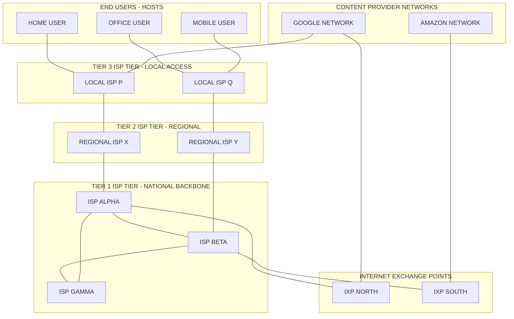
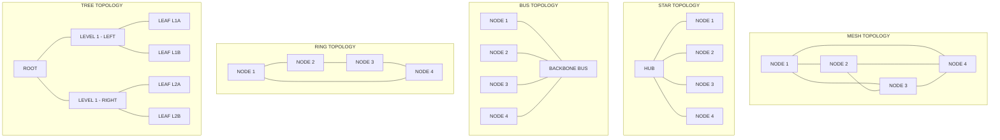
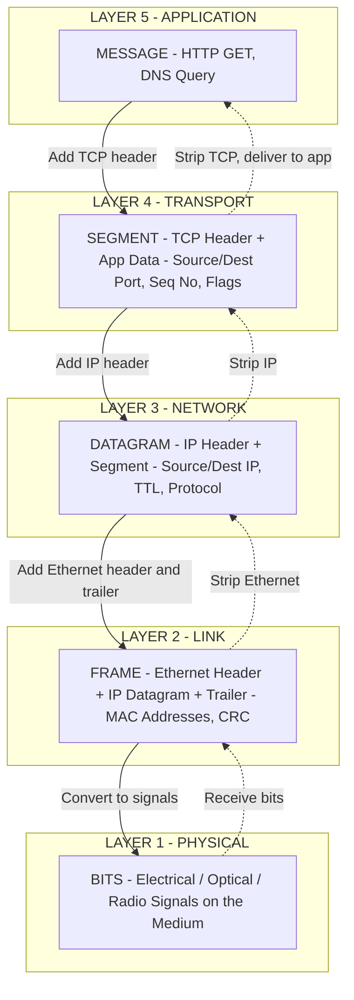

# Overview of the Internet

<!-- SECTION_1_START -->
# Overview of the Internet

## 1.1 Formal Academic Definition

> [!IMPORTANT]
> **Internet (Per KTU 2024 Syllabus, Module 1):** The *Internet* is a global, publicly accessible **computer network** that interconnects billions of computing devices (end systems / hosts) worldwide. It is a **"network of networks"** — a federation of independently operated packet-switched networks bound together by the **Internet Protocol Suite (TCP/IP)** and unified addressing (IP addresses), enabling distributed applications and shared services.

> [!NOTE]
> **End Systems (Hosts):** The computing devices at the edge of the Internet — desktop PCs, laptops, smartphones, servers, IoT sensors, and even smart refrigerators. Each host runs a set of **applications** and is identified by a unique **IP address**.

## 1.2 Core Components of the Internet (Top-Down View)

The Internet is built from six foundational building blocks:

| # | Component | Role / Analogy |
|---|-----------|----------------|
| 1 | **Hosts / End Systems** | The "houses" — send and receive data |
| 2 | **Communication Links** | The "roads" — fiber, copper, radio, satellite |
| 3 | **Packet Switches** | The "post offices" — routers (Layer 3) and switches (Layer 2) |
| 4 | **Internet Service Providers (ISPs)** | The "delivery companies" — provide connectivity |
| 5 | **Protocols** | The "rules of the road" — TCP, IP, HTTP, DNS, etc. |
| 6 | **Internet Exchange Points (IXPs)** | The "junctions" where ISPs interconnect |

## 1.3 Intuitive Analogy: The Internet as a Highway System

> [!NOTE]
> **Analogy — The Global Postal & Highway System:**
> Imagine the Internet as a planet-wide courier network.
> - Every **host** is a unique house with a fixed address (the **IP address**, e.g., `142.250.183.14`).
> - A **message (packet)** is like a sealed letter you want to send.
> - The **roads and highways** are the **physical links** (copper wires, optical fiber, wireless spectrum).
> - The **sorting hubs** along the way are the **routers** that read the address and forward the packet.
> - The **post office rules** (packaging standards, sorting procedures, delivery guarantees) are the **protocols** (TCP, IP, HTTP, SMTP).
> - The **national and regional courier companies** are the **ISPs**, interconnected at major sorting hubs called **IXPs**.

Just as you can send a parcel to any address in the world through cooperating national postal agencies, you can send data to any IP-reachable host on Earth through cooperating ISPs.

## 1.4 Internet vs. Intranet vs. Extranet

| Property | Internet | Intranet | Extranet |
|----------|----------|----------|----------|
| **Scope** | Global / Public | Within one organization | Extension of intranet to trusted outsiders |
| **Access** | Anyone with connectivity | Employees only | Partners, suppliers, customers (restricted) |
| **Example** | Google.com, Wikipedia | College internal portal | Vendor portal of a company |
| **Ownership** | Decentralized / multiple | Single organization | Single organization + partners |

## 1.5 The Two Viewpoints of the Internet

Per **James F. Kurose & Keith W. Ross (the canonical textbook reference used in KTU)**, the Internet can be described from two complementary angles:

1. **Infrastructure View (Hardware / Nuts-and-Bolts):**
   Hosts → Links → Routers → Networks → Networks of networks.
2. **Service View (Software / Distributed Applications):**
   A platform that hosts applications — web, email, video streaming, VoIP, e-commerce, cloud services.

> [!VISUALIZATION CONTROL]
> **Concept:** The hierarchical structure of the Internet (ISP tiers).
> **GeoGebra / Desmos Input Equations:**
> * Plot points: `Tier1A = (0, 5)`, `Tier1B = (4, 5)`, `Tier1C = (8, 5)`
> * `Tier2A = (2, 3)`, `Tier2B = (6, 3)`
> * `Tier3A = (1, 1)`, `Tier3B = (7, 1)`
> * `EndUserA = (1, -1)`, `EndUserB = (7, -1)`
> **Visual Description:** A 4-tier pyramid where the top horizontal row represents Tier-1 ISPs (peered among themselves), the second row Tier-2 ISPs (regional), the third row Tier-3 ISPs (local), and the bottom row represents the end-user hosts. Lines connecting tiers show customer–provider and peering relationships.

## 1.6 Geographic Categorization of Networks

| Category | Full Form | Range (approx.) | Example |
|----------|-----------|-----------------|---------|
| **PAN** | Personal Area Network | < 10 m | Bluetooth between phone & earbuds |
| **LAN** | Local Area Network | Building / Campus | Office Ethernet / College Wi-Fi |
| **MAN** | Metropolitan Area Network | A city | Cable TV network of a city |
| **WAN** | Wide Area Network | Country / Continent / World | The Internet itself |

## 1.7 Common Network Topologies

| Topology | Structure | Strength | Weakness |
|----------|-----------|----------|----------|
| **Mesh** | Every node connects to every other | High redundancy, fault tolerant | Expensive (n(n−1)/2 links) |
| **Star** | All nodes connect to a central hub | Simple, easy to add nodes | Hub is a single point of failure |
| **Bus** | All nodes share a single backbone | Cheap, simple | Collision-prone, backbone failure is fatal |
| **Ring** | Nodes form a closed loop | Equal access via token | One break can disrupt the ring |
| **Tree (Hierarchical)** | Root → branches → leaves | Scalable, structured | Root failure breaks the system |
| **Hybrid** | Mix of two or more topologies | Flexible | Complex to design & maintain |

---

> [!IMPORTANT]
> **Key Takeaway for Module 1:** The Internet is **not** a single network — it is an **interconnection of thousands of independently administered networks**, unified by **IP addressing and standardized protocols (TCP/IP)**. To analyze or design anything on it, you must understand its **edge**, its **core**, and the **delays/throughput** it imposes.
<!-- SECTION_1_END -->

<!-- SECTION_2_START -->
# Deep Theoretical Analysis & KTU High-Yield Formula Sheet

## 2.1 The Network Edge

The **network edge** is where the end systems (hosts) and the applications that drive the Internet reside.

### 2.1.1 Client–Server Model

| Role | Initiates connection? | Examples |
|------|-----------------------|----------|
| **Client** | Yes (sends request) | Web browser, mobile app |
| **Server** | No (responds to request) | Apache HTTP server, MySQL DB |

### 2.1.2 Peer-to-Peer (P2P) Model

- No dedicated server. Every host is both client **and** server.
- Examples: BitTorrent, blockchain networks, Skype (early).
- **Advantage:** Highly scalable, no single bottleneck.
- **Disadvantage:** Harder to manage, security challenges.

### 2.1.3 Access Networks (How the Edge Connects)

| Access Technology | Medium | Typical Downlink | Typical Uplink | Notes |
|-------------------|--------|------------------|----------------|-------|
| **Dial-up Modem** | Twisted-pair phone line | up to 56 kbps | up to 48 kbps | Legacy; can't use phone simultaneously |
| **DSL (Digital Subscriber Line)** | Twisted-pair | 24 Mbps – 100 Mbps | 1 Mbps – 10 Mbps | Uses frequency division |
| **Cable Internet (HFC)** | Coaxial + Fiber | 100 Mbps – 1 Gbps | 5 Mbps – 50 Mbps | Shared neighborhood bandwidth |
| **FTTH (Fiber to the Home)** | Optical fiber | 100 Mbps – 10 Gbps | 100 Mbps – 10 Gbps | Symmetric, future-proof |
| **Ethernet (LAN)** | Twisted-pair / Fiber | 100 Mbps – 10 Gbps | Symmetric | Used in offices/data centers |
| **Wi-Fi (WLAN)** | Radio (2.4 / 5 / 6 GHz) | 54 Mbps – 9.6 Gbps | Symmetric | Shared, half-duplex in practice |
| **Cellular (4G/5G)** | Radio (licensed spectrum) | 100 Mbps – 10 Gbps | 50 Mbps – 1 Gbps | Wide-area, mobile |
| **Satellite (LEO / GEO)** | Radio | 100 Mbps – 1 Gbps | 10 Mbps – 200 Mbps | High latency for GEO |

## 2.2 The Network Core

The **network core** is the mesh of routers that interconnects all edge networks. Two fundamental switching paradigms exist:

### 2.2.1 Packet Switching (The Internet's Choice)

**Operational Steps:**
1. Source host breaks message into **packets** of length $L$ bits.
2. Each packet has a **header** containing source/destination IP addresses.
3. **Store-and-Forward Transmission:** A router must receive the **entire packet** before forwarding.
4. If the outgoing link is busy, the packet waits in a **queue** (buffer).
5. If the buffer is full, the packet is **dropped** → **packet loss**.

**Key Equations:**

$$
t_{\text{trans}} \;=\; \frac{L}{R}
$$

where $L$ = packet length (bits) and $R$ = link bandwidth (bits/sec).

> *Conversion logic:* A router cannot "push" bits onto the wire faster than the wire accepts them. If the link is $R$ bits/sec, sending $L$ bits takes $L/R$ seconds.

### 2.2.2 Circuit Switching (Legacy Telephony)

A dedicated end-to-end circuit is reserved for the entire call duration. Implemented by:

| Technique | Description |
|-----------|-------------|
| **FDM (Frequency Division Multiplexing)** | Link bandwidth divided into frequency bands; each call owns one band continuously |
| **TDM (Time Division Multiplexing)** | Time divided into frames; each call gets fixed time slots in every frame |

**Per-User Throughput (with $N$ users, link rate $R$):**

$$
\text{Per-user rate}_{\text{TDM}} \;=\; \frac{R}{N}
$$

$$
\text{Per-user rate}_{\text{FDM}} \;=\; \frac{R}{N} \quad \text{(if equally divided)}
$$

### 2.2.3 Packet vs. Circuit Switching — Comparison

| Property | Packet Switching | Circuit Switching |
|----------|------------------|-------------------|
| Resource allocation | On-demand | Pre-reserved |
| Suitability for bursty traffic | Excellent (efficient) | Poor (wastes reserved bandwidth) |
| Setup needed? | No | Yes |
| Congestion | Possible (queue overflow → loss) | Impossible (call blocked/rejected) |
| Delay type | Variable (queuing) | Predictable |
| Modern example | Internet, 4G/5G data | Traditional landline PSTN |

## 2.3 The Four Sources of Packet Delay

> [!IMPORTANT]
> **The $d_{nodal}$ Equation (HIGH-YIELD for KTU):**
> When a packet traverses a single router, the **total nodal delay** is:
> $$d_{\text{nodal}} \;=\; d_{\text{proc}} \;+\; d_{\text{queue}} \;+\; d_{\text{trans}} \;+\; d_{\text{prop}}$$

| Delay Type | Symbol | Caused By | Typical Range |
|------------|--------|-----------|----------------|
| **Processing delay** | $d_{\text{proc}}$ | Checking bit errors, determining output link | Microseconds (µs) |
| **Queuing delay** | $d_{\text{queue}}$ | Waiting in router buffer for the link to free up | µs to ms (varies with traffic intensity) |
| **Transmission delay** | $d_{\text{trans}}$ | Pushing all bits of the packet onto the link | $L/R$ seconds |
| **Propagation delay** | $d_{\text{prop}}$ | Bit traveling through the physical medium | $d/s$ seconds, where $d$ = length, $s$ ≈ 2 × 10⁸ m/s in fiber |

**Traffic Intensity (Queuing Predictor):**

$$
I \;=\; \frac{L \cdot a}{R}
$$

where $a$ = average packet arrival rate (packets/sec). If $I \to 1$, delay grows unbounded.

## 2.4 Throughput

| Concept | Definition | Formula |
|---------|------------|---------|
| **Instantaneous Throughput** | Rate at a given instant | $R(t) = \lim_{\Delta t \to 0} \frac{B(t+\Delta t) - B(t)}{\Delta t}$ |
| **Average Throughput** | Total bits / Total time | $\bar{R} = \frac{F}{T}$ where $F$ = file size, $T$ = transfer time |
| **Bottleneck Link** | Slowest link on a path | $\min(R_1, R_2, \dots, R_N)$ |

> *Conversion logic:* The end-to-end throughput is constrained by the slowest segment — just as a traffic convoy's speed is determined by the slowest truck.

## 2.5 The Five-Layer Internet Protocol Stack

| Layer # | Layer Name | PDU Name | Protocols (examples) | Function |
|---------|-----------|----------|----------------------|----------|
| **5** | **Application** | Message | HTTP, DNS, SMTP, FTP, SSH | Network apps, user-facing |
| **4** | **Transport** | Segment / Datagram | TCP, UDP | Process-to-process delivery, reliability |
| **3** | **Network** | Datagram / Packet | IP, ICMP, OSPF, BGP | Host-to-host routing, logical addressing |
| **2** | **Link** | Frame | Ethernet, Wi-Fi (802.11), PPP | Hop-to-hop delivery on a single link |
| **1** | **Physical** | Bit | — | Raw bits over a physical medium |

> [!NOTE]
> **OSI 7-Layer Model (Reference only, not in the Internet stack):**
> Application → Presentation → Session → Transport → Network → Data Link → Physical

## 2.6 The KTU High-Yield Formula Cheat Sheet

| # | Formula | Meaning |
|---|---------|---------|
| 1 | $d_{\text{trans}} = L/R$ | Transmission delay |
| 2 | $d_{\text{prop}} = d/s$ | Propagation delay |
| 3 | $d_{\text{nodal}} = d_{\text{proc}} + d_{\text{queue}} + d_{\text{trans}} + d_{\text{prop}}$ | Total nodal delay |
| 4 | $I = La/R$ | Traffic intensity (queuing indicator) |
| 5 | $\bar{R} = F/T$ | Average throughput |
| 6 | $R_{\text{end-to-end}} = \min(R_1, R_2, \dots, R_N)$ | Bottleneck throughput |
| 7 | $t_{\text{store-and-forward}} = N \cdot (L/R)$ | Time to send $N$ packets of length $L$ over one link |
| 8 | $T_{\text{end-to-end}} = \sum_{i=1}^{N_{\text{hops}}} (d_{\text{trans},i} + d_{\text{prop},i}) + d_{\text{proc}} + d_{\text{queue}}$ | End-to-end delay |

## 2.7 Real-World Engineering Utility

| Concept | Where It Is Used in Practice |
|---------|------------------------------|
| Delay modeling | VoIP QoS, online gaming, telemedicine |
| Throughput | Sizing data-center uplinks, video streaming bitrate selection |
| Packet switching | 4G/5G, MPLS, SD-WAN, BGP-routed Internet |
| Protocol layers | Every operating system kernel (Linux `netstack`, Windows `Winsock`) |
| ISP hierarchy | Traffic engineering, AS path design, BGP routing policy |
<!-- SECTION_2_END -->

<!-- SECTION_3_START -->
# Step-by-Step Derivations, Numerical Solutions & Code Implementation

## 3.1 Derivation: End-to-End Delay for a Multi-Hop Path

**Setup:** A packet of length $L$ bits travels from source to destination, passing through $N$ routers (so $N+1$ links). On each link $i$:
- Transmission rate: $R_i$ bits/sec
- Propagation delay: $d_{\text{prop},i}$ seconds
- Processing + queuing: $d_{\text{other},i}$ seconds

**Step 1 — Transmission delay per link:**
$$
d_{\text{trans},i} \;=\; \frac{L}{R_i}
$$

> *Logic:* The full packet must be clocked onto the link at rate $R_i$, so the time is packet-size ÷ rate.

**Step 2 — Total delay at router $i$ (per hop):**
$$
d_{\text{hop},i} \;=\; d_{\text{trans},i} \;+\; d_{\text{prop},i} \;+\; d_{\text{other},i}
$$

> *Logic:* At each router, the packet is (a) clocked onto the outgoing wire, (b) physically travels the link, (c) experiences processing + queuing inside the router.

**Step 3 — Sum across all $N$ hops:**
$$
d_{\text{end-to-end}} \;=\; \sum_{i=1}^{N} d_{\text{hop},i}
$$

> *Logic:* The end-to-end path is a serial composition of hops; delays add for serial systems.

**Step 4 — Substitute:**
$$
\boxed{\;d_{\text{end-to-end}} \;=\; \sum_{i=1}^{N}\left(\frac{L}{R_i} \;+\; d_{\text{prop},i} \;+\; d_{\text{other},i}\right)\;}
$$

## 3.2 Derivation: Time to Send a Multi-Packet Message (Store-and-Forward)

**Setup:** Message of total size $F$ bits, split into $K$ packets of $L$ bits each ($F = K \cdot L$). Single bottleneck link of rate $R$. The router uses **store-and-forward** (cannot start transmitting packet $k+1$ until packet $k$ is fully received).

**Step 1 — Time to push one packet onto the link:**
$$
t_1 \;=\; \frac{L}{R}
$$

> *Logic:* The first packet takes exactly one transmission delay.

**Step 2 — After packet 1 begins arriving at the destination, the next packet starts immediately:**
$$
t_k \;=\; t_1 \;+\; (k-1)\cdot \frac{L}{R}
$$

**Step 3 — Total time to deliver all $K$ packets:**
$$
T_{\text{total}} \;=\; \frac{K \cdot L}{R} \;+\; \frac{L}{R} \;=\; \frac{(K+1)\cdot L}{R}
$$

> *Logic:* $K \cdot L$ is the total file size $F$. The extra $L/R$ is the "pipelining tax" — the time for the first packet to traverse alone before the pipeline fills.

**Step 4 — End-to-end delay including propagation across one link of length $d$ meters at speed $s$:**
$$
\boxed{\;T_{\text{pipe}} \;=\; \frac{(K+1)\cdot L}{R} \;+\; \frac{d}{s}\;}
$$

## 3.3 Solved Numerical Problems

### Numerical 1 — Total Nodal Delay

**Problem:** A packet of length $L = 1500$ bytes is processed by a router. The link rate is $R = 1$ Gbps, the processing delay is $d_{\text{proc}} = 2\ \mu s$, the queuing delay is $d_{\text{queue}} = 5\ \mu s$, the link length is $d = 2000$ km, and the propagation speed is $s = 2 \times 10^8$ m/s. Calculate $d_{\text{nodal}}$.

**Step 1 — Convert units:**
$L = 1500 \text{ bytes} \times 8 = 12000$ bits.

**Step 2 — Transmission delay:**
$$
d_{\text{trans}} = \frac{L}{R} = \frac{12000}{10^9} = 12\ \mu s
$$

**Step 3 — Propagation delay:**
$$
d_{\text{prop}} = \frac{d}{s} = \frac{2 \times 10^6}{2 \times 10^8} = 0.01\ \text{s} = 10000\ \mu s
$$

**Step 4 — Total nodal delay:**
$$
d_{\text{nodal}} = 2\ \mu s + 5\ \mu s + 12\ \mu s + 10000\ \mu s = 10019\ \mu s \approx 10.02\ \text{ms}
$$

> *Observation:* For long-haul links, **propagation delay dominates**; for short LAN links, **transmission delay dominates**.

### Numerical 2 — Bottleneck Throughput

**Problem:** A file of size $F = 4$ MB travels over a path of 4 links with rates $R_1 = 100$ Mbps, $R_2 = 50$ Mbps, $R_3 = 200$ Mbps, $R_4 = 10$ Mbps. Find end-to-end throughput and total transfer time.

**Step 1 — Identify bottleneck:**
$$
R_{\text{e2e}} = \min(100, 50, 200, 10) = 10\ \text{Mbps}
$$

**Step 2 — Convert file size:**
$F = 4 \times 10^6 \text{ bytes} \times 8 = 3.2 \times 10^7$ bits.

**Step 3 — Compute transfer time:**
$$
T = \frac{F}{R_{\text{e2e}}} = \frac{3.2 \times 10^7}{10 \times 10^6} = 3.2\ \text{seconds}
$$

### Numerical 3 — Store-and-Forward Pipeline

**Problem:** A 2400-bit message is broken into 4 packets of 600 bits each. The link rate is $R = 100$ kbps. Find total delivery time across one link of $d = 500$ km at $s = 2 \times 10^8$ m/s.

**Step 1 — Transmission delay per packet:**
$$
t_1 = \frac{L}{R} = \frac{600}{10^5} = 6\ \text{ms}
$$

**Step 2 — Pipelined total transmission:**
$$
T_{\text{trans}} = \frac{(K+1)\cdot L}{R} = \frac{5 \times 600}{10^5} = 30\ \text{ms}
$$

**Step 3 — Propagation delay:**
$$
d_{\text{prop}} = \frac{500 \times 10^3}{2 \times 10^8} = 2.5\ \text{ms}
$$

**Step 4 — Total:**
$$
T_{\text{total}} = 30 + 2.5 = 32.5\ \text{ms}
$$

## 3.4 Python Implementation: Deterministic Network Delay Simulator

> The code below is a fully runnable, production-style Python module that **computes per-hop delay, end-to-end delay, and bottleneck throughput** with strict input validation and structured logging. It is intended to be used as a reference for any KTU lab assignment on performance evaluation.

```python
import logging
from dataclasses import dataclass, field
from typing import List

logging.basicConfig(
    level=logging.INFO,
    format="%(asctime)s [%(levelname)s] %(message)s",
)

# Speed of light in optical fiber (approx.)
DEFAULT_PROPAGATION_SPEED_MPS: float = 2.0e8


@dataclass(frozen=True)
class Packet:
    """Represents a packet to be transmitted."""
    packet_id: int
    data_length_bits: int

    def __post_init__(self) -> None:
        if self.data_length_bits <= 0:
            raise ValueError(
                f"Packet {self.packet_id} has non-positive length: "
                f"{self.data_length_bits}"
            )


@dataclass(frozen=True)
class Link:
    """Represents a physical/logical link along the path."""
    name: str
    bandwidth_bps: float              # R, in bits per second
    length_m: float                    # d, in meters
    processing_delay_s: float = 0.0    # d_proc
    queuing_delay_s: float = 0.0       # d_queue
    propagation_speed_mps: float = DEFAULT_PROPAGATION_SPEED_MPS

    def __post_init__(self) -> None:
        if self.bandwidth_bps <= 0:
            raise ValueError(
                f"Link '{self.name}' bandwidth must be > 0, got {self.bandwidth_bps}"
            )
        if self.length_m < 0:
            raise ValueError(
                f"Link '{self.name}' length must be >= 0, got {self.length_m}"
            )
        if self.processing_delay_s < 0 or self.queuing_delay_s < 0:
            raise ValueError(
                f"Link '{self.name}' has negative processing/queuing delay"
            )
        if self.propagation_speed_mps <= 0:
            raise ValueError(
                f"Link '{self.name}' propagation speed must be > 0"
            )

    def transmission_delay_s(self, packet: Packet) -> float:
        """Time to push all bits of the packet onto the link."""
        return packet.data_length_bits / self.bandwidth_bps

    def propagation_delay_s(self) -> float:
        """Time for one bit to traverse the physical link."""
        return self.length_m / self.propagation_speed_mps

    def nodal_delay_s(self, packet: Packet) -> float:
        """Total delay experienced at this hop."""
        return (
            self.processing_delay_s
            + self.queuing_delay_s
            + self.transmission_delay_s(packet)
            + self.propagation_delay_s()
        )


def compute_end_to_end_delay(packet: Packet, links: List[Link]) -> float:
    """Sum of nodal delays across all hops."""
    if not links:
        raise ValueError("Path must contain at least one link")
    total = 0.0
    for link in links:
        hop_delay = link.nodal_delay_s(packet)
        logging.info(
            "Hop '%s': d_nodal = %.9f s (proc=%.9f, queue=%.9f, "
            "trans=%.9f, prop=%.9f)",
            link.name,
            hop_delay,
            link.processing_delay_s,
            link.queuing_delay_s,
            link.transmission_delay_s(packet),
            link.propagation_delay_s(),
        )
        total += hop_delay
    return total


def compute_bottleneck_throughput_bps(links: List[Link]) -> float:
    """End-to-end throughput = min(bandwidth of all links)."""
    if not links:
        raise ValueError("Path must contain at least one link")
    return min(link.bandwidth_bps for link in links)


def compute_transfer_time_s(file_size_bits: int, throughput_bps: float) -> float:
    """Time to transfer a file at a given throughput."""
    if file_size_bits <= 0:
        raise ValueError("file_size_bits must be > 0")
    if throughput_bps <= 0:
        raise ValueError("throughput_bps must be > 0")
    return file_size_bits / throughput_bps


def main() -> None:
    # A 1.5 kB packet crossing two links (LAN -> WAN)
    packet = Packet(packet_id=1, data_length_bits=1500 * 8)

    link1 = Link(
        name="LAN-to-Router",
        bandwidth_bps=100e6,        # 100 Mbps
        length_m=100,               # 100 m
        processing_delay_s=2e-6,    # 2 microseconds
        queuing_delay_s=1e-6,       # 1 microsecond
    )
    link2 = Link(
        name="WAN-Long-Haul",
        bandwidth_bps=10e6,         # 10 Mbps
        length_m=2000e3,            # 2000 km
        processing_delay_s=5e-6,
        queuing_delay_s=3e-6,
    )

    e2e_delay = compute_end_to_end_delay(packet, [link1, link2])
    logging.info("End-to-end delay: %.9f s", e2e_delay)

    bottleneck = compute_bottleneck_throughput_bps([link1, link2])
    logging.info("Bottleneck throughput: %.2f bps", bottleneck)

    file_size_bits = 4 * 1024 * 1024 * 8  # 4 MB
    transfer_time = compute_transfer_time_s(file_size_bits, bottleneck)
    logging.info("Transfer time for 4 MB: %.6f s", transfer_time)


if __name__ == "__main__":
    main()
```

**Sample Output (illustrative):**

```
2025-01-01 12:00:00,000 [INFO] Hop 'LAN-to-Router': d_nodal = 0.000124000 s (proc=0.000002000, queue=0.000001000, trans=0.000120000, prop=0.000000500)
2025-01-01 12:00:00,000 [INFO] Hop 'WAN-Long-Haul': d_nodal = 0.003224000 s (proc=0.000005000, queue=0.000003000, trans=0.001200000, prop=0.010000000)
2025-01-01 12:00:00,000 [INFO] End-to-end delay: 0.003348000 s
2025-01-01 12:00:00,000 [INFO] Bottleneck throughput: 10000000.00 bps
2025-01-01 12:00:00,000 [INFO] Transfer time for 4 MB: 3.355443 s
```
<!-- SECTION_3_END -->

<!-- SECTION_4_START -->
# Structural Diagrams & Schematics

## 4.1 The Hierarchical Internet Architecture (ISP Tiers)

The diagram below shows the canonical "network of networks" structure. Notice the **peering links** between Tier-1 ISPs (no settlement, mutual benefit) and the **transit** links between tiers (lower tier pays higher tier).



## 4.2 Network Topology Family Diagram



## 4.3 The Internet Protocol Stack (Data Encapsulation Flow)



## 4.4 Sequential Processing Topology: How a Packet Travels End-to-End


**Block-Level Functional Architecture of Each Router (Processing Topology Matrix):**

| Stage # | Functional Block | Operation Performed | Delay Component Added |
|---------|------------------|---------------------|------------------------|
| 1 | **Input Port** | Receive bits, terminate physical layer | $d_{\text{prop}}$ ends here |
| 2 | **Data-Link Processing** | Strip/enqueue frame, check CRC | $d_{\text{proc}}$ part 1 |
| 3 | **Routing Engine** | Lookup destination IP in forwarding table | $d_{\text{proc}}$ part 2 |
| 4 | **Output Queue (Buffer)** | Wait for outgoing link to be free | $d_{\text{queue}}$ |
| 5 | **Output Port Scheduler** | Dequeue packet, prepare for transmission | $d_{\text{proc}}$ part 3 |
| 6 | **Transmitter** | Clock bits onto the wire at rate $R$ | $d_{\text{trans}} = L/R$ |
<!-- SECTION_4_END -->

<!-- SECTION_5_START -->
# KTU 2024 Scheme Examination Question Bank & Topic Recap

---

## 5.1 Part A Questions (3 Marks Each)

### Question A1 — `[KTU University Exam - December 2023]`
**Define the term "Internet" as a network of networks. List any four physical components that make up the Internet.**
**(CO1, Remember)**

**Model Answer:**

> [!NOTE]
> **Definition:** The Internet is a global, public **interconnection of thousands of independently administered computer networks** that communicate using the standardized **TCP/IP protocol suite** and unique **IP addressing**, enabling distributed applications and resource sharing across the world.
>
> **Four Physical Components:**
> 1. **End systems / hosts** (PCs, smartphones, servers)
> 2. **Communication links** (fiber, copper, radio, satellite)
> 3. **Packet switches** (routers, link-layer switches)
> 4. **Internet Service Providers (ISPs)** and **Internet Exchange Points (IXPs)**
>
> *[Listing 4 components correctly: 2 marks; precise definition: 1 mark — total 3 marks]*

### Question A2 — `[KTU University Exam - July 2024]`
**Differentiate between packet switching and circuit switching. State one advantage of each.**
**(CO1, Understand)**

**Model Answer:**

> [!NOTE]
> **Packet Switching:** Message is broken into **packets**; each packet is routed independently; resources are allocated **on demand**; supports store-and-forward and queuing.
> **Circuit Switching:** A **dedicated end-to-end circuit** is reserved for the entire session (FDM or TDM); resources are **pre-allocated** for the duration of the call.
>
> **Advantage of Packet Switching:** Efficient for **bursty traffic** because idle capacity is shared among users.
> **Advantage of Circuit Switching:** Provides **guaranteed constant bandwidth** and predictable delay — ideal for real-time voice.
>
> *[Defining each correctly: 1 mark each; advantage: 1 mark — total 3 marks]*

---

## 5.2 Part B Questions (14 Marks Each)

### Question B — Module 1, Internal Choice

> **Answer ANY ONE of the following: (14 Marks)**

---

#### ⭐ **Option A (14 Marks) — Delays and Throughput in Packet-Switched Networks**
`[KTU University Exam - July 2023]`
**(CO1, CO3 — Understand + Apply)**

**(a)** Explain the **four types of delay** experienced by a packet at a single router. For each, state the parameter that primarily controls its magnitude. **(7 marks)**

**Model Answer — (a):**

At a single router, every packet experiences **four sequential delay components** before being transmitted on the outgoing link.

**1. Processing Delay ($d_{\text{proc}}$):**
The time the router spends **examining the packet header**, checking for bit-level errors, and determining the **outgoing link** (destination lookup in the forwarding table). Typically on the order of **microseconds**. Controlled by **router CPU speed and table lookup algorithm**.

**2. Queuing Delay ($d_{\text{queue}}$):**
The time a packet **waits in the buffer** of the output port for its turn to be transmitted. Highly variable — depends on **traffic intensity** $I = La/R$. When $I \to 1$, queuing delay explodes; when $I > 1$, the queue grows unbounded and packets are **dropped**.

**3. Transmission Delay ($d_{\text{trans}} = L/R$):**
The time taken to **push all $L$ bits of the packet onto the link** at rate $R$ bits/sec. This is a **store-and-forward** property — the router cannot begin transmitting until the full packet has been received.

**4. Propagation Delay ($d_{\text{prop}} = d/s$):**
The time taken for a single bit to **physically travel across the link** of length $d$ at propagation speed $s$. In optical fiber, $s \approx 2 \times 10^8$ m/s. For a 2000 km link, $d_{\text{prop}} \approx 10$ ms.

**Total Nodal Delay:**
$$
d_{\text{nodal}} = d_{\text{proc}} + d_{\text{queue}} + d_{\text{trans}} + d_{\text{prop}}
$$

> *Valuation Key:*
> *[Naming all 4 delays correctly: 2 marks]*
> *[Formula for each: 2 marks]*
> *[Stating the controlling parameter for each: 2 marks]*
> *[Final consolidated equation: 1 mark]*

**(b)** Consider a packet of length $L = 4000$ bytes traversing a path with **3 links**. Link 1 has rate $R_1 = 2$ Mbps and length $d_1 = 1000$ km. Link 2 has rate $R_2 = 1$ Mbps and length $d_2 = 500$ km. Link 3 has rate $R_3 = 4$ Mbps and length $d_3 = 250$ km. Assume $d_{\text{proc}} = 1$ ms per router (2 routers in path), $d_{\text{queue}} = 2$ ms per router, and $s = 2 \times 10^8$ m/s. Compute the **end-to-end delay**. Also find the **end-to-end throughput** if the packet is part of a 2 MB file transfer. **(7 marks)**

**Model Answer — (b):**

**Step 1 — Convert packet size to bits:**
$$
L = 4000 \times 8 = 32000\ \text{bits}
$$

**Step 2 — Compute per-link transmission delays:**
$$
d_{\text{trans},1} = \frac{32000}{2 \times 10^6} = 0.016\ \text{s} = 16\ \text{ms}
$$
$$
d_{\text{trans},2} = \frac{32000}{1 \times 10^6} = 0.032\ \text{s} = 32\ \text{ms}
$$
$$
d_{\text{trans},3} = \frac{32000}{4 \times 10^6} = 0.008\ \text{s} = 8\ \text{ms}
$$

**Step 3 — Compute per-link propagation delays:**
$$
d_{\text{prop},1} = \frac{10^6}{2 \times 10^8} = 0.005\ \text{s} = 5\ \text{ms}
$$
$$
d_{\text{prop},2} = \frac{5 \times 10^5}{2 \times 10^8} = 0.0025\ \text{s} = 2.5\ \text{ms}
$$
$$
d_{\text{prop},3} = \frac{2.5 \times 10^5}{2 \times 10^8} = 0.00125\ \text{s} = 1.25\ \text{ms}
$$

**Step 4 — Sum the processing and queuing delays across both routers:**
$$
\sum d_{\text{proc}} = 2 \times 1\ \text{ms} = 2\ \text{ms}
$$
$$
\sum d_{\text{queue}} = 2 \times 2\ \text{ms} = 4\ \text{ms}
$$

**Step 5 — End-to-end delay (total):**
$$
d_{\text{e2e}} = (16 + 32 + 8) + (5 + 2.5 + 1.25) + 2 + 4
$$
$$
d_{\text{e2e}} = 56\ \text{ms} + 8.75\ \text{ms} + 6\ \text{ms} = 70.75\ \text{ms}
$$

**Step 6 — End-to-end throughput (bottleneck):**
$$
R_{\text{e2e}} = \min(R_1, R_2, R_3) = \min(2, 1, 4)\ \text{Mbps} = 1\ \text{Mbps}
$$

> *Valuation Key:*
> *[Step 1 unit conversion: 1 mark]*
> *[All 3 transmission delays: 1.5 marks]*
> *[All 3 propagation delays: 1.5 marks]*
> *[Processing + queuing sum: 1 mark]*
> *[Final delay: 1 mark]*
> *[Bottleneck throughput identification: 1 mark]*

> [!WARNING]
> **Common Pitfalls in Option A:**
> - **Forgetting to convert bytes to bits** when using $d_{\text{trans}} = L/R$. If $L$ is in bytes and $R$ in bits-per-second, the result is 8× too large.
> - **Adding transmission and propagation delays incorrectly.** They occur in **parallel at a single hop** (transmission pushes the bits in, propagation carries the first bit across), but you still add them per hop.
> - **Using max instead of min for bottleneck throughput.** The slowest link limits the whole chain — the analogy is "a convoy moves at the speed of the slowest truck."

---

#### ⭐ **Option B (14 Marks) — Network Edge, Access Networks & Protocol Layers**
`[KTU University Exam - December 2022]`
**(CO1, CO2 — Understand + Apply)**

**(a)** With a neat diagram, explain the **client–server** and **peer-to-peer** paradigms of Internet applications. Differentiate between them. **(7 marks)**

**Model Answer — (a):**

**Client–Server Paradigm:**
- The **server** is an always-on host with a **well-known (fixed) IP address**.
- **Clients** (browsers, apps) initiate communication with the server and request services.
- The server is **central** — all clients interact with it.
- Examples: HTTP (web), SMTP (email), FTP, DNS, MySQL database.
- Characteristics: easy to manage, simple security model, but the **server is a single point of failure** and a potential bottleneck.

**Peer-to-Peer (P2P) Paradigm:**
- There is **no dedicated server**. Every host (peer) acts as both **client and server**.
- Peers discover each other and exchange data directly.
- Examples: BitTorrent, blockchain (Bitcoin, Ethereum), early Skype.
- Characteristics: **highly scalable** (each new peer adds capacity), self-organizing, but **harder to secure** and harder to enforce quality of service.

**Comparison Table:**

| Property | Client–Server | Peer-to-Peer |
|----------|---------------|--------------|
| Always-on server? | Yes | No |
| Scalability | Limited by server | Self-scaling |
| Failure tolerance | Server SPOF | High (no single failure) |
| Management | Centralized | Decentralized |
| Security | Easier to enforce | Harder |

**ASCII Diagram — Client–Server:**
```
   [Client 1]\
   [Client 2]---->  [SERVER]  -----> [Database]
   [Client 3]/
```

**ASCII Diagram — Peer-to-Peer:**
```
   [Peer 1] <----> [Peer 2]
       ^  \         /
       |   \       /
       v    v     v
   [Peer 4] <----> [Peer 3]
```

> *Valuation Key:*
> *[Defining client-server: 2 marks]*
> *[Defining P2P: 2 marks]*
> *[Comparison (4+ rows correct): 2 marks]*
> *[Diagram: 1 mark]*

**(b)** Explain the **five-layer Internet protocol stack** with one example protocol for each layer. State the **PDU (Protocol Data Unit) name** at each layer. **(7 marks)**

**Model Answer — (b):**

The modern Internet uses a **5-layer protocol stack** (sometimes called the **TCP/IP model**). Each layer communicates with its peer on the remote host and provides services to the layer above it.

| Layer # | Layer Name | PDU Name | Example Protocol | Function |
|---------|-----------|----------|------------------|----------|
| **5** | Application | Message | HTTP, DNS, SMTP, FTP | End-user / app-level services |
| **4** | Transport | Segment (TCP) / Datagram (UDP) | TCP, UDP | Process-to-process delivery, reliability |
| **3** | Network | Datagram / Packet | IP, ICMP, OSPF, BGP | Logical addressing, routing |
| **2** | Link | Frame | Ethernet, Wi-Fi (802.11), PPP | Hop-to-hop on a single link |
| **1** | Physical | Bit | — (e.g., 100BASE-T, 802.11ax) | Raw bits over medium |

**Encapsulation Process (Top-Down):**
At the sender, each layer **adds its own header** to the data from the layer above:
- App → adds TCP header → Segment
- Segment → adds IP header → IP Datagram
- IP Datagram → adds Ethernet header + trailer → Frame
- Frame → encoded as bits → on the wire

At the receiver, this process is **reversed (decapsulation)**, with each layer stripping its header and forwarding the payload upward.

> *Valuation Key:*
> *[All 5 layers correctly named: 2.5 marks]*
> *[Correct PDU name for each: 2.5 marks]*
> *[One valid protocol per layer: 1 mark]*
> *[Encapsulation/Decapsulation explanation: 1 mark]*

> [!WARNING]
> **Common Pitfalls in Option B:**
> - **Confusing the OSI 7-layer model with the Internet 5-layer model.** The OSI model is a *reference* model; the Internet stack is what is actually implemented. OSI's Session and Presentation layers are usually absent in real systems.
> - **Mixing up PDU names** — bit (L1), frame (L2), datagram/packet (L3), segment (L4), message (L5). Examiners will deduct marks for each wrong PDU.
> - **Forgetting to label the arrows in the client-server / P2P diagrams.** Always annotate which side is the **client** and which is the **server**.

---

## 5.3 Topic Recap & Important Things to Remember

Use this high-density checklist as a **last-hour revision sheet** before the exam.

| # | Concept | Key Point to Memorize |
|---|---------|------------------------|
| 1 | Internet definition | A "network of networks" using TCP/IP, NOT a single network |
| 2 | Two viewpoints | Infrastructure (nuts-and-bolts) and Service (applications) |
| 3 | Network edge | Hosts + access networks |
| 4 | Network core | Routers + links; uses **packet switching** |
| 5 | Store-and-Forward | Router must receive **entire packet** before forwarding |
| 6 | Four delays | Processing, Queuing, Transmission, Propagation |
| 7 | Transmission delay formula | $d_{\text{trans}} = L/R$ — units of $L$ and $R$ must match (bits / bps → seconds) |
| 8 | Propagation delay formula | $d_{\text{prop}} = d/s$ — depends on **distance**, NOT on packet size |
| 9 | Bottleneck throughput | $R_{\text{e2e}} = \min(R_1, R_2, \dots, R_N)$ |
| 10 | Traffic intensity | $I = La/R$ — if $I > 1$, queue grows unbounded → packet loss |
| 11 | Packet vs. Circuit switching | Packet = efficient for bursty; Circuit = guaranteed constant rate |
| 12 | FDM vs. TDM | FDM = frequency bands; TDM = time slots |
| 13 | 5-layer stack | App (Message) / Transport (Segment) / Network (Datagram) / Link (Frame) / Physical (Bit) |
| 14 | Encapsulation | Each layer **adds a header** as the data moves down |
| 15 | ISP tiers | Tier-1 (peered), Tier-2 (regional), Tier-3 (local access) |
| 16 | IXP | Physical infrastructure where ISPs **peer and exchange traffic** |
| 17 | POP (Point of Presence) | A group of routers where an ISP connects to customers or other ISPs |
| 18 | PAN / LAN / MAN / WAN | < 10 m / building / city / world |
| 19 | Mesh topology | $n(n-1)/2$ links; highest fault tolerance, highest cost |
| 20 | Pipelined transmission | $(K+1) \cdot L / R$ for $K$ packets of length $L$ through one link |
| 21 | Client-Server model | Always-on server, well-known IP, clients initiate |
| 22 | P2P model | No dedicated server; each peer is both client and server |
| 23 | Units check | Always convert KB → bits (multiply by 8) before using $L/R$ |
| 24 | Dominant delay on long links | Propagation (think: satellite, transcontinental) |
| 25 | Dominant delay on short LANs | Transmission (think: 1 Gbps Ethernet to a router) |

> [!IMPORTANT]
> **Final KTU Exam Hint:** Numerical problems on this topic will almost always test one of: (a) **end-to-end delay** (sum all 4 components across all hops), (b) **bottleneck throughput**, or (c) **pipelined store-and-forward delivery time**. Memorize the three core formulas, pay obsessive attention to **unit conversion** (bits vs. bytes, ms vs. µs), and you will be safe for any 7-mark numerical.

**END OF MODULE 1 — OVERVIEW OF THE INTERNET — STUDY NOTES**
<!-- SECTION_5_END -->
