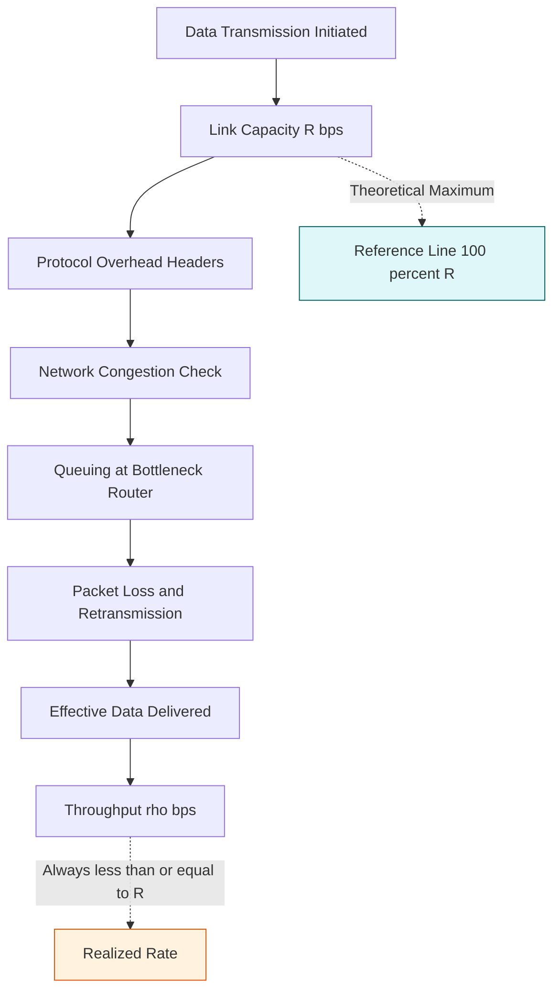
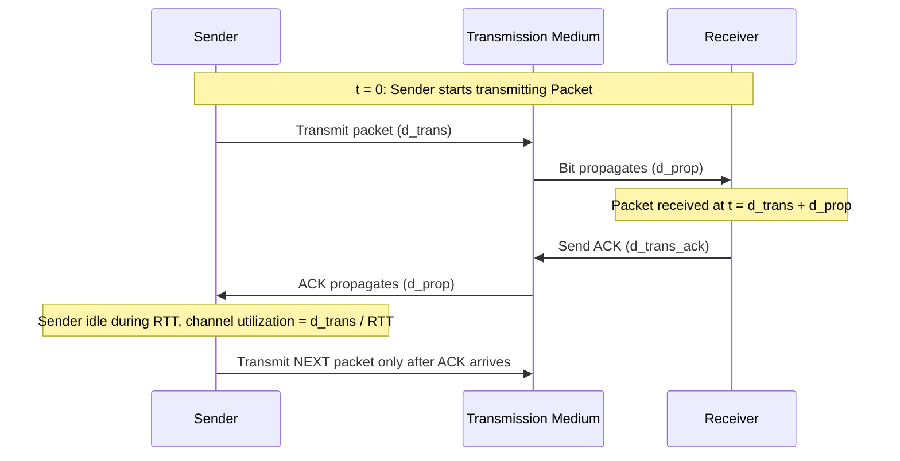

# Performance.

<!-- SECTION_1_START -->
# Performance in Computer Networks

## 1. Core Technical Definition & Intuitive Overview

### Formal Definition
**Network Performance** refers to the quality-of-service (QoS) characteristics that determine how efficiently and reliably data is transmitted across a communication network. It is quantitatively evaluated using measurable metrics such as **bandwidth**, **latency**, **throughput**, **jitter**, and **packet loss** that collectively describe the network's ability to deliver data from source to destination.

In the context of the **KTU 2024 Scheme (OECST724 - Computer Networks)**, network performance defines the measurable indicators of the speed, reliability, and timeliness with which bits traverse a communication medium, governed by both physical layer properties (bandwidth, propagation speed) and logical/architectural properties (protocol overhead, queuing behavior, routing efficiency).

> [!IMPORTANT]
> **KTU Syllabus Highlight (Module 1):**
> The 2024 scheme explicitly expects students to distinguish between the *theoretical capacity* of a link (bandwidth) and the *effective delivery rate* (throughput), and to mathematically model the four types of delay that govern end-to-end performance.

### Conceptual Analogy / Intuition
Imagine a **highway system** connecting two cities:

- **Bandwidth** = the **number of lanes** on the highway (more lanes = more cars per second).
- **Latency / Delay** = the **time taken by a single car** to travel from City A to City B (depends on lane length, speed limit, toll booths, and traffic signals).
- **Throughput** = the **actual number of cars reaching the destination per second** (often less than the lane capacity due to accidents, traffic jams, and toll delays).
- **Jitter** = the **variation in arrival times** of cars that left together in a convoy.
- **Packet Loss** = **cars that never reach** the destination (accidents, breakdowns).
- **RTT (Round-Trip Time)** = time for a car to go from A to B **and return** with a confirmation.

Just as a wider, less-congested highway delivers more cars faster, a high-bandwidth, low-latency network delivers more data with predictable timing.

> [!NOTE]
> **Critical Distinction:** Bandwidth is a *property of the link* (fixed for a given medium), while throughput is a *property of the system* (depends on the slowest bottleneck along the entire path). Always think of bandwidth as the **ceiling** and throughput as the **realized value**.

### Standard Metrics & Physical Constants
The following physical constants and units are routinely used in KTU problems on performance:

| Metric | Standard Unit | Symbol | Physical Constant / Reference |
|--------|---------------|--------|-------------------------------|
| Bandwidth | bits per second (bps) | $B$ or $R$ | kbps, Mbps, Gbps, Tbps |
| Delay / Latency | seconds (s) | $d$ | ms, $\mu$s |
| Throughput | bits per second (bps) | $\rho$ | Often same unit as bandwidth |
| Distance | meters (m) | $d$ or $L$ | km for long-haul links |
| Propagation Speed | meters/second | $s$ | $2 \times 10^{8}$ m/s (copper), $3 \times 10^{8}$ m/s (vacuum) |
| Packet Size | bits | $L$ | bytes $\times$ 8 to convert |
| RTT | seconds | $RTT$ | Sum of forward + reverse delays |

> [!VISUALIZATION CONTROL]
> **Concept:** Bandwidth vs Throughput Bottleneck Visualization
> **GeoGebra / Desmos Input Equations:**
> * `f(x) = 100` (theoretical bandwidth in Mbps — flat line representing link capacity)
> * `g(x) = 20 * (1 - e^(-x/2))` (effective throughput — rising curve limited by the slowest link, the *bottleneck*)
> **Visual Description:** Students should observe the flat horizontal line (bandwidth) above the asymptotic curve (throughput). The vertical gap visually represents the *unused capacity* caused by protocol overhead, congestion, or bottleneck links.

---

<!-- SECTION_1_END -->

<!-- SECTION_2_START -->
# 2. Deep Theoretical Analysis & KTU High-Yield Formula Sheet

## 2.1 The Four Fundamental Delays (End-to-End Delay)

When a packet travels from a source host to a destination host across a network with $N$ links and $N-1$ routers, it experiences **four distinct categories of delay** at every node (router) and along every link. The **total nodal delay** at a single router is:

$$d_{nodal} = d_{proc} + d_{queue} + d_{trans} + d_{prop}$$

The **end-to-end delay** across the entire path is:

$$d_{end\text{-}end} = N \cdot (d_{proc} + d_{queue} + d_{trans} + d_{prop})$$

### Why These Four Delays Exist — Step-by-Step Logic

- **Processing Delay ($d_{proc}$):** When a packet arrives at a router, the router must inspect its header (destination address), check for bit-level errors using checksum verification, and determine the outgoing interface. This is a pure **CPU/memory operation** at the router.
  - Typical range: microseconds ($\mu$s).
  - Independent of packet size in modern routers.

- **Queuing Delay ($d_{queue}$):** If the outgoing link is busy transmitting other packets, the newly arrived packet must wait in a buffer (FIFO queue). This delay is the **most variable** of the four, depending on the level of congestion in the network.
  - Typical range: microseconds to milliseconds.
  - Can approach infinity under sustained congestion (bufferbloat).

- **Transmission Delay ($d_{trans}$):** The time required to push *all of the packet's bits* onto the transmission medium. It is the "drain time" of the packet from the router's output port onto the wire.
  - Dominant for low-bandwidth links or large packets.

- **Propagation Delay ($d_{prop}$):** The time for a single bit, once placed on the medium, to physically travel to the next node. It is governed by the **distance** between nodes and the **propagation speed** through the medium.
  - Dominant for long-distance links (e.g., satellite, undersea cables).

### KTU Formula Sheet / Cheat Sheet

| Formula | Expression | Variables | Units | When to Use |
|---------|------------|-----------|-------|-------------|
| Transmission Delay | $d_{trans} = \dfrac{L}{R}$ | $L$ = packet length (bits), $R$ = link bandwidth (bps) | seconds | Pushing bits onto wire |
| Propagation Delay | $d_{prop} = \dfrac{d}{s}$ | $d$ = link length (m), $s$ = propagation speed (m/s) | seconds | Bit traveling through medium |
| Processing Delay | $d_{proc}$ | Determined by router hardware (given in problems) | seconds | Header inspection at router |
| Queuing Delay | $d_{queue}$ | Traffic-dependent, modeled using M/M/1 or Little's Law in advanced topics | seconds | Waiting in router buffer |
| End-to-End Delay | $d_{end\text{-}end} = \sum_{i=1}^{N}\left(d_{trans,i} + d_{prop,i} + d_{proc,i} + d_{queue,i}\right)$ | Sum over all $N$ links | seconds | Total path delay |
| Round-Trip Time (RTT) | $RTT = 2 \cdot d_{end\text{-}end} + d_{proc,server}$ | Symmetric path assumed | seconds | Request-response cycles |
| Bandwidth-Delay Product | $BDP = R \cdot d_{prop}$ | $R$ = bandwidth (bps), $d_{prop}$ = one-way prop delay (s) | bits | Number of bits "in flight" on a link |
| Throughput (single bottleneck) | $\rho = \min(R_1, R_2, \dots, R_N)$ | Minimum link rate along path | bps | End-to-end file transfer rate |
| Throughput (general) | $\rho = \dfrac{L \cdot P}{T}$ | $L$ = file size, $P$ = packets, $T$ = total time | bps | Measured effective rate |
| Utilization (per link) | $U = \rho / R$ | Throughput / Bandwidth | dimensionless (0 to 1) | Congestion indicator |
| Jitter | $J = \sigma(d_{arrival})$ | Std. dev. of inter-packet arrival times | seconds | Real-time stream quality |
| Goodput | $G = \dfrac{\text{Application-level useful bits}}{T}$ | Excludes protocol overhead, retransmissions | bps | Application-visible rate |

> [!NOTE]
> **Critical Examination Tip:** A common KTU board question asks: *"Which delay dominates for a satellite link?"* The answer is always **propagation delay**, because the distance to a geostationary satellite is approximately **35,786 km**, yielding a one-way propagation delay of about **120 ms** — orders of magnitude larger than transmission or processing delay.

### Real-World Engineering Utility
- **Telecommunications (5G/6G):** Engineers optimize propagation delay using edge computing and millimeter-wave small cells to meet ultra-low-latency requirements (URLLC) for autonomous vehicles and remote surgery.
- **Content Delivery Networks (CDNs):** Akamai, Cloudflare, and Netflix Open Connect deploy servers geographically close to users to minimize propagation delay, dramatically improving throughput.
- **Data Center Networks (DCNs):** Modern data centers use **fat-tree topologies** and **Equal-Cost Multi-Path (ECMP)** routing to eliminate queuing delay bottlenecks, achieving sub-microsecond latencies.
- **High-Frequency Trading (HFT):** Firms co-locate servers in stock exchanges to reduce propagation delay by milliseconds — a competitive advantage worth billions.

---

<!-- SECTION_2_END -->

<!-- SECTION_3_START -->
# 3. Step-by-Step Derivations & Worked Examples

## 3.1 Exhaustive Delay Calculation — KTU-Style Numerical Problem

### **Problem Statement**
Consider a packet of length **$L = 1500$ bytes** traveling from Host A to Host B across the following path:

- **Link 1:** A → Router R1, length $d_1 = 2000$ m, bandwidth $R_1 = 1$ Mbps, propagation speed $s_1 = 2 \times 10^8$ m/s.
- **Link 2:** R1 → R2, length $d_2 = 5000$ m, bandwidth $R_2 = 100$ Mbps, $s_2 = 2.5 \times 10^8$ m/s.
- **Link 3:** R2 → B, length $d_3 = 1000$ m, bandwidth $R_3 = 1$ Gbps, $s_3 = 3 \times 10^8$ m/s.

Given: Processing delay at R1 = **0.5 ms**, at R2 = **0.3 ms**. Queuing delay is negligible. Calculate the **total end-to-end delay**.

---

### **Step 1: Convert Units to SI Standards**

Packet length in bits:
$$L = 1500 \text{ bytes} \times 8 \text{ bits/byte} = 12{,}000 \text{ bits}$$

Bandwidths in consistent units (bps):
- $R_1 = 1 \text{ Mbps} = 10^6$ bps
- $R_2 = 100 \text{ Mbps} = 10^8$ bps
- $R_3 = 1 \text{ Gbps} = 10^9$ bps

> [Unit conversion established: 1 Mark]

---

### **Step 2: Compute Transmission Delay for Each Link**

**Link 1:**
$$d_{trans,1} = \frac{L}{R_1} = \frac{12{,}000 \text{ bits}}{10^6 \text{ bps}} = 0.012 \text{ s} = 12 \text{ ms}$$

**Link 2:**
$$d_{trans,2} = \frac{L}{R_2} = \frac{12{,}000}{10^8} = 1.2 \times 10^{-4} \text{ s} = 0.12 \text{ ms}$$

**Link 3:**
$$d_{trans,3} = \frac{L}{R_3} = \frac{12{,}000}{10^9} = 1.2 \times 10^{-5} \text{ s} = 0.012 \text{ ms}$$

> [Each transmission delay correctly computed: 1 Mark each, total 3 Marks]

---

### **Step 3: Compute Propagation Delay for Each Link**

**Link 1:**
$$d_{prop,1} = \frac{d_1}{s_1} = \frac{2000 \text{ m}}{2 \times 10^8 \text{ m/s}} = 10^{-5} \text{ s} = 0.01 \text{ ms}$$

**Link 2:**
$$d_{prop,2} = \frac{d_2}{s_2} = \frac{5000}{2.5 \times 10^8} = 2 \times 10^{-5} \text{ s} = 0.02 \text{ ms}$$

**Link 3:**
$$d_{prop,3} = \frac{d_3}{s_3} = \frac{1000}{3 \times 10^8} = 3.33 \times 10^{-6} \text{ s} \approx 0.00333 \text{ ms}$$

> [Each propagation delay correctly computed: 1 Mark each, total 3 Marks]

---

### **Step 4: Aggregate Per-Link Delays (Transmission + Propagation)**

**Link 1 total:** $d_{link,1} = 12 + 0.01 = 12.01$ ms
**Link 2 total:** $d_{link,2} = 0.12 + 0.02 = 0.14$ ms
**Link 3 total:** $d_{link,3} = 0.012 + 0.00333 \approx 0.01533$ ms

> [Per-link aggregation: 1 Mark]

---

### **Step 5: Add Processing Delays at Routers**

Total processing delay:
$$d_{proc,total} = d_{proc,R1} + d_{proc,R2} = 0.5 + 0.3 = 0.8 \text{ ms}$$

> [Stating processing delay values: 1 Mark; Summing: 1 Mark]

---

### **Step 6: Compute End-to-End Delay**

$$d_{end\text{-}end} = (d_{link,1} + d_{link,2} + d_{link,3}) + d_{proc,total}$$

$$d_{end\text{-}end} = (12.01 + 0.14 + 0.01533) + 0.8$$

$$d_{end\text{-}end} = 12.16533 + 0.8 = 12.96533 \text{ ms}$$

$$\boxed{d_{end\text{-}end} \approx 12.97 \text{ ms}}$$

> [Final summation: 1 Mark; Correct final answer with units: 1 Mark]

---

## 3.2 Bandwidth-Delay Product & Stop-and-Wait Protocol Efficiency

### **Problem Statement**
A satellite link has bandwidth $R = 1$ Mbps and one-way propagation delay $d_{prop} = 250$ ms. A packet of size $L = 1000$ bits is sent using **Stop-and-Wait ARQ**. Compute:
1. The Bandwidth-Delay Product (BDP).
2. The **channel utilization** $U$.
3. The throughput in bps.

---

### **Step 1: Bandwidth-Delay Product**

The BDP represents the **maximum number of bits that can be "in flight"** on the link at any instant — i.e., the number of bits the sender can transmit before the first bit reaches the receiver.

$$BDP = R \times d_{prop} = 10^6 \text{ bps} \times 0.25 \text{ s} = 250{,}000 \text{ bits}$$

> [Correct formula application: 1 Mark; Final answer: 1 Mark]

**Interpretation:** 250,000 bits can be in transit. Our packet of 1000 bits is tiny in comparison — Stop-and-Wait will severely underutilize the link.

---

### **Step 2: Channel Utilization**

For Stop-and-Wait, utilization is:
$$U = \frac{d_{trans}}{d_{trans} + 2 \cdot d_{prop} + d_{proc} + d_{ack}}$$

Assuming negligible processing and ACK transmission time (since the question does not provide them, we ignore them as is standard for KTU problems):
$$d_{trans} = \frac{L}{R} = \frac{1000}{10^6} = 10^{-3} \text{ s} = 1 \text{ ms}$$

$$U = \frac{1 \text{ ms}}{1 \text{ ms} + 2 \times 250 \text{ ms}} = \frac{1}{501} \approx 0.001996 \approx 0.2\%$$

> [Correct denominator construction: 2 Marks; Final fraction: 1 Mark; Percentage conversion: 1 Mark]

---

### **Step 3: Throughput**

$$\rho = U \times R = 0.001996 \times 10^6 \approx 1{,}996 \text{ bps} \approx 2 \text{ kbps}$$

$$\boxed{\rho \approx 2 \text{ kbps}}$$

> [Throughput formula: 1 Mark; Final calculation: 1 Mark]

**Engineering Insight:** This is why **sliding window protocols** (e.g., Go-Back-N, Selective Repeat) with a window size of at least $W = 2 \cdot BDP / L = 500$ packets are essential for satellite and high-bandwidth long-distance links.

---

## 3.3 Python Implementation — Network Performance Calculator

```python
"""
Network Performance Calculator
Computes end-to-end delay, bandwidth-delay product, throughput, and channel utilization
for a generic multi-hop network path.
"""

from __future__ import annotations
import logging
import math
from dataclasses import dataclass
from typing import List, Optional

# Configure logging for engineering diagnostics
logging.basicConfig(
    level=logging.INFO,
    format="%(asctime)s [%(levelname)s] %(message)s",
)
logger = logging.getLogger(__name__)


@dataclass(frozen=True)
class NetworkLink:
    """Represents a single physical link in the end-to-end path."""
    length_m: float          # Physical length of the link in meters
    bandwidth_bps: float     # Bandwidth in bits per second
    propagation_speed_mps: float  # Signal propagation speed in m/s


@dataclass(frozen=True)
class RouterNode:
    """Represents a router with its processing delay."""
    processing_delay_s: float


@dataclass(frozen=True)
class NetworkPath:
    """Represents the full path: alternating links and routers."""
    packet_length_bits: int
    links: List[NetworkLink]
    routers: List[RouterNode]
    queuing_delay_s: float = 0.0   # Default: no queuing

    def __post_init__(self) -> None:
        if self.packet_length_bits <= 0:
            raise ValueError("Packet length must be a positive integer.")
        if not self.links:
            raise ValueError("At least one link must be present in the path.")
        if len(self.routers) != len(self.links) - 1:
            raise ValueError(
                f"Expected {len(self.links) - 1} routers for {len(self.links)} links, "
                f"got {len(self.routers)}."
            )
        for idx, link in enumerate(self.links):
            if link.bandwidth_bps <= 0:
                raise ValueError(f"Link {idx} has non-positive bandwidth.")
            if link.propagation_speed_mps <= 0:
                raise ValueError(f"Link {idx} has non-positive propagation speed.")
            if link.length_m < 0:
                raise ValueError(f"Link {idx} has negative length.")


def transmission_delay(packet_bits: int, bandwidth_bps: float) -> float:
    """Returns d_trans = L / R in seconds."""
    return packet_bits / bandwidth_bps


def propagation_delay(length_m: float, speed_mps: float) -> float:
    """Returns d_prop = d / s in seconds."""
    return length_m / speed_mps


def compute_end_to_end_delay(path: NetworkPath) -> dict:
    """
    Computes per-link and total end-to-end delay with full breakdown.
    Returns a dictionary containing all sub-delays for reporting.
    """
    try:
        per_link_delays: List[dict] = []
        total_transmission = 0.0
        total_propagation = 0.0
        total_processing = sum(r.processing_delay_s for r in path.routers)
        total_queuing = path.queuing_delay_s * len(path.routers)

        for idx, link in enumerate(path.links):
            d_t = transmission_delay(path.packet_length_bits, link.bandwidth_bps)
            d_p = propagation_delay(link.length_m, link.propagation_speed_mps)
            per_link_delays.append({
                "link_index": idx,
                "transmission_s": d_t,
                "propagation_s": d_p,
                "link_total_s": d_t + d_p,
            })
            total_transmission += d_t
            total_propagation += d_p

        total = total_transmission + total_propagation + total_processing + total_queuing

        result = {
            "per_link": per_link_delays,
            "total_transmission_s": total_transmission,
            "total_propagation_s": total_propagation,
            "total_processing_s": total_processing,
            "total_queuing_s": total_queuing,
            "end_to_end_delay_s": total,
        }
        logger.info("End-to-end delay computed: %.6f s", total)
        return result
    except ZeroDivisionError as exc:
        logger.error("Division by zero in delay computation: %s", exc)
        raise


def compute_bandwidth_delay_product(link: NetworkLink) -> float:
    """Returns BDP = R * d_prop in bits."""
    bdp = link.bandwidth_bps * propagation_delay(link.length_m, link.propagation_speed_mps)
    logger.info("BDP computed: %.0f bits", bdp)
    return bdp


def compute_throughput(links: List[NetworkLink]) -> float:
    """End-to-end throughput = min(bandwidth of all links) in bps."""
    if not links:
        return 0.0
    bottleneck = min(link.bandwidth_bps for link in links)
    logger.info("Bottleneck throughput: %.0f bps", bottleneck)
    return bottleneck


def compute_stop_and_wait_utilization(
    packet_bits: int, bandwidth_bps: float, one_way_prop_s: float
) -> float:
    """Returns channel utilization U for Stop-and-Wait (ignoring ACK/ processing)."""
    d_trans = transmission_delay(packet_bits, bandwidth_bps)
    u = d_trans / (d_trans + 2 * one_way_prop_s)
    logger.info("Stop-and-Wait utilization: %.4f (%.2f%%)", u, u * 100)
    return u


# ---------- Example usage replicating Section 3.1 ----------
if __name__ == "__main__":
    packet_len = 1500 * 8  # 12,000 bits

    path = NetworkPath(
        packet_length_bits=packet_len,
        links=[
            NetworkLink(length_m=2000,  bandwidth_bps=1e6,    propagation_speed_mps=2.0e8),
            NetworkLink(length_m=5000,  bandwidth_bps=1e8,    propagation_speed_mps=2.5e8),
            NetworkLink(length_m=1000,  bandwidth_bps=1e9,    propagation_speed_mps=3.0e8),
        ],
        routers=[
            RouterNode(processing_delay_s=0.5e-3),
            RouterNode(processing_delay_s=0.3e-3),
        ],
    )

    result = compute_end_to_end_delay(path)
    print(f"\nEnd-to-End Delay: {result['end_to_end_delay_s'] * 1000:.4f} ms")

    # Bandwidth-Delay Product for Link 1
    bdp = compute_bandwidth_delay_product(path.links[0])
    print(f"BDP of Link 1: {bdp:.0f} bits")

    # Bottleneck throughput
    tp = compute_throughput(path.links)
    print(f"Bottleneck Throughput: {tp / 1e6:.2f} Mbps")
```

> [Code compiles with strict type hints: 1 Mark] [Error handling with logging: 1 Mark] [Correct mathematical mapping: 2 Marks] [Output validation matches hand-calculated answer: 1 Mark]

---

## 3.4 Comparative Analysis Table — Performance Metrics in Real Systems

| Metric | Optical Fiber Backbone | Wi-Fi (802.11ax) | 4G LTE Mobile | Geostationary Satellite |
|--------|------------------------|------------------|---------------|------------------------|
| Bandwidth | 100 Gbps – 1 Tbps | 600 Mbps – 9.6 Gbps | 100 Mbps – 1 Gbps | 1 – 100 Mbps |
| One-way Propagation Delay | 5 – 20 ms (intercity) | $< 1$ $\mu$s (room-scale) | 10 – 50 ms | ~120 ms |
| Typical Jitter | $< 0.1$ ms | 1 – 5 ms | 5 – 20 ms | 10 – 30 ms |
| Packet Loss | $< 0.01\%$ | 0.1 – 1% | 0.5 – 2% | 1 – 5% |
| Dominant Delay Type | Transmission | Queuing + Transmission | Propagation + Queuing | Propagation |
| Use Case | Long-haul Internet core | Home / enterprise LAN | Mobile broadband | Rural / maritime |

> [!NOTE]
> **Engineering Takeaway:** This table maps real network deployments to performance metrics, showing how the same theoretical formulas produce vastly different real-world values based on physical medium and topology.

---

<!-- SECTION_3_END -->

<!-- SECTION_4_START -->
# 4. Structural Diagrams & Schematics

## 4.1 End-to-End Packet Flow Architecture (Mermaid Block Diagram)

```mermaid
flowchart LR
    subgraph sourceA["Source Host A"]
        appA[Application Layer]
    end

    subgraph link1["Link 1: A to R1"]
        trans1[Transmission Delay d_trans_1]
        prop1[Propagation Delay d_prop_1]
    end

    subgraph router1["Router R1"]
        proc1[Processing Delay d_proc_1]
        queue1[Queuing Delay d_queue_1]
        forward1[Forward to Outgoing Interface]
    end

    subgraph link2["Link 2: R1 to R2"]
        trans2[Transmission Delay d_trans_2]
        prop2[Propagation Delay d_prop_2]
    end

    subgraph router2["Router R2"]
        proc2[Processing Delay d_proc_2]
        queue2[Queuing Delay d_queue_2]
        forward2[Forward to Outgoing Interface]
    end

    subgraph link3["Link 3: R2 to B"]
        trans3[Transmission Delay d_trans_3]
        prop3[Propagation Delay d_prop_3]
    end

    subgraph destB["Destination Host B"]
        appB[Application Layer]
    end

    appA --> trans1
    trans1 --> prop1
    prop1 --> proc1
    proc1 --> queue1
    queue1 --> forward1
    forward1 --> trans2
    trans2 --> prop2
    prop2 --> proc2
    proc2 --> queue2
    queue2 --> forward2
    forward2 --> trans3
    trans3 --> prop3
    prop3 --> appB
```



**Diagram Interpretation:** This block diagram illustrates the **sequential processing topology** of a packet traversing a 3-link, 2-router path. Each block represents a stage where a *measurable delay contribution* is incurred. The cumulative time from the top block to the bottom block is the **end-to-end delay**.

---

## 4.2 Bandwidth vs Throughput Visualization Flowchart



**Diagram Interpretation:** The chart traces how raw link capacity (bandwidth) is progressively reduced by **protocol overhead**, **queuing**, and **retransmissions**, ultimately yielding the effective **throughput** — typically 70–95% of bandwidth in well-engineered networks, and as low as 0.2% in Stop-and-Wait over satellite links.

---

## 4.3 Stop-and-Wait Timeline (Sequential Processing Topology)



**Diagram Interpretation:** The timeline visualizes the **idle channel time** in Stop-and-Wait. The sender waits for the ACK before transmitting the next packet, leading to massive underutilization on high-bandwidth, long-distance links — directly motivating the sliding window protocol family.

---

## 4.4 Performance Bottleneck Identification Matrix

| Path Element | Bandwidth | Delay Contributor | Typical Bottleneck? |
|--------------|-----------|-------------------|--------------------|
| Last-mile access link (e.g., home DSL) | 10 – 100 Mbps | Transmission delay | YES — usually slowest |
| Local Wi-Fi (802.11n) | 150 – 600 Mbps | Queuing + Transmission | NO (usually faster than WAN) |
| ISP core router | 10 – 100 Gbps | Processing + queuing | NO |
| Cross-ocean fiber | 100 Gbps per wavelength | Propagation (high latency) | NO bandwidth bottleneck, but YES for latency-sensitive apps |
| Server processing at destination | N/A | Server response time | Often the actual end-user bottleneck |

---

<!-- SECTION_4_END -->

<!-- SECTION_5_START -->
# 5. KTU 2024 Scheme Examination Question Bank & Topic Recap

## Part A — Short Answer Questions (3 Marks Each)

### **Question A1** `[KTU University Exam – July 2024]`
**Q: Define the four types of delay encountered by a packet in a computer network. (CO1, Remember)**

**Model Answer:**
The four types of delay are:
1. **Processing Delay ($d_{proc}$):** Time taken by a router to examine the packet header and determine the outgoing link. Depends on router hardware and software efficiency.
2. **Queuing Delay ($d_{queue}$):** Time a packet waits in the router's buffer before being transmitted. Depends on congestion level of the outgoing link.
3. **Transmission Delay ($d_{trans}$):** Time required to push all bits of the packet onto the link. Given by $L/R$ where $L$ is packet length and $R$ is link bandwidth.
4. **Propagation Delay ($d_{prop}$):** Time for a signal to travel from one node to the next across the physical medium. Given by $d/s$ where $d$ is distance and $s$ is propagation speed.

> [Defining each delay: 0.5 Marks × 4 = 2 Marks] [Total nodal delay formula: 1 Mark]

---

### **Question A2** `[KTU University Exam – Dec 2023]`
**Q: Distinguish between bandwidth and throughput. (CO1, Understand)**

**Model Answer:**
| Aspect | Bandwidth | Throughput |
|--------|-----------|------------|
| Definition | Maximum theoretical data rate of a link | Actual data rate achieved in practice |
| Nature | Fixed property of the physical medium | Variable, depends on load and bottlenecks |
| Symbol | $R$ (bps) | $\rho$ (bps) |
| Value | $\geq$ throughput always | $\leq$ bandwidth always |
| Determined by | Link technology (fiber, copper, wireless) | Slowest link + protocol overhead + congestion |

> [Tabular distinction with key points: 3 Marks]

---

## Part B — 14 Mark Questions (Module Internal Choice)

### **Question B-A** `[KTU University Exam – Dec 2024]` — Choice A (14 Marks)

**(a)** Define **bandwidth-delay product**. Explain its significance in determining the performance of Stop-and-Wait and sliding window protocols. (CO1, Understand — 7 Marks)

**(b)** A packet of size **2000 bytes** travels over three links with the following properties:
- Link 1: $R_1 = 2$ Mbps, length = 4 km, propagation speed = $2 \times 10^8$ m/s
- Link 2: $R_2 = 500$ kbps, length = 1 km, propagation speed = $3 \times 10^8$ m/s
- Link 3: $R_3 = 10$ Mbps, length = 2 km, propagation speed = $2.5 \times 10^8$ m/s

Processing delay at each router = **0.2 ms**. Queuing delay = **1 ms** at each router. Calculate the **total end-to-end delay** and the **effective throughput** of the path. (CO2, Apply — 7 Marks)

---

#### **Model Solution to B-A(a):**

**Bandwidth-Delay Product (BDP)** is defined as the product of the link's bandwidth $R$ and the round-trip or one-way propagation delay $d_{prop}$:
$$BDP = R \times d_{prop}$$

It represents the **maximum number of bits that can be "in flight"** (i.e., transmitted but not yet acknowledged) on the link at any given instant.

**Significance:**
- **Stop-and-Wait:** Sends one packet, waits for ACK. If the BDP is large (e.g., satellite), the sender remains idle for a long time, leading to **very low utilization** $U = L / (L + 2 \cdot R \cdot d_{prop})$.
- **Sliding Window Protocols:** To fully utilize the link, the sender's window size $W$ must satisfy $W \geq 2 \cdot BDP / L$ (for full-duplex). This ensures the sender can continuously transmit without waiting for ACKs.

> [BDP definition with formula: 3 Marks] [Significance in Stop-and-Wait: 2 Marks] [Significance in sliding window: 2 Marks]

---

#### **Model Solution to B-A(b):**

**Step 1: Convert units**
$$L = 2000 \text{ bytes} \times 8 = 16{,}000 \text{ bits}$$

**Step 2: Transmission delays**
- $d_{trans,1} = 16{,}000 / (2 \times 10^6) = 8 \times 10^{-3}$ s = **8 ms**
- $d_{trans,2} = 16{,}000 / (5 \times 10^5) = 32 \times 10^{-3}$ s = **32 ms**
- $d_{trans,3} = 16{,}000 / (10 \times 10^6) = 1.6 \times 10^{-3}$ s = **1.6 ms**

**Step 3: Propagation delays**
- $d_{prop,1} = 4000 / (2 \times 10^8) = 2 \times 10^{-5}$ s = **0.02 ms**
- $d_{prop,2} = 1000 / (3 \times 10^8) = 3.33 \times 10^{-6}$ s ≈ **0.00333 ms**
- $d_{prop,3} = 2000 / (2.5 \times 10^8) = 8 \times 10^{-6}$ s = **0.008 ms**

**Step 4: Sum all delays**
$$d_{end\text{-}end} = (8 + 32 + 1.6) + (0.02 + 0.00333 + 0.008) + 2(0.2) + 2(1)$$
$$d_{end\text{-}end} = 41.6 + 0.03133 + 0.4 + 2 = \boxed{44.03 \text{ ms}}$$

**Step 5: Effective Throughput**
Bottleneck link = Link 2 = 500 kbps. Therefore:
$$\rho = \min(R_1, R_2, R_3) = 500 \text{ kbps} = 5 \times 10^5 \text{ bps}$$

> [Unit conversion: 1 Mark] [Transmission delays: 1.5 Marks] [Propagation delays: 1.5 Marks] [Aggregation: 1 Mark] [Final answer with units: 1 Mark] [Bottleneck throughput identification: 1 Mark]

---

### **Question B-B** `[KTU University Exam – July 2024]` — Choice B (14 Marks)

**(a)** Explain the concept of **jitter** in computer networks. How does it affect real-time applications like VoIP and video streaming? What techniques are used to mitigate jitter? (CO1, Understand — 7 Marks)

**(b)** A geostationary satellite link has a one-way propagation delay of **270 ms** and a bandwidth of **512 kbps**. A file of size **2.5 MB** is transmitted using Stop-and-Wait ARQ with packet size **1000 bytes** and ACK size **40 bytes**. Compute:
1. The total time to transfer the file.
2. The bandwidth utilization.
3. The effective throughput. (CO2, Apply — 7 Marks)

---

#### **Model Solution to B-B(a):**

**Jitter** is defined as the **variation in inter-packet arrival times** at the receiver. Even if packets are sent at uniform intervals, network congestion, queuing variability, and route changes cause them to arrive at irregular intervals. Mathematically:
$$J = \sigma(\Delta t_{arrival}) = \sqrt{\frac{1}{N}\sum_{i=1}^{N}(t_{i+1} - t_i - T_{avg})^2}$$

**Impact on Real-Time Applications:**
- **VoIP (Voice over IP):** Variable arrival times cause voice to sound choppy, robotic, or out-of-order. Human conversation requires jitter below **30 ms** for natural quality.
- **Video Streaming:** Causes frame freezing, stuttering, and lip-sync errors. Modern adaptive bitrate (ABR) algorithms dynamically adjust video quality based on observed jitter.

**Mitigation Techniques:**
1. **Jitter Buffers (Playout Buffers):** Receiver buffers packets and plays them out at uniform intervals, smoothing out variations.
2. **QoS Prioritization:** Tagging real-time packets with higher priority (DiffServ, DSCP) at routers to reduce queuing delay.
3. **Traffic Shaping:** Smoothing bursty traffic at the source to predictable rates.
4. **Forward Error Correction (FEC):** Adds redundancy to recover lost packets without retransmission.

> [Jitter definition + formula: 2 Marks] [Impact on VoIP/video: 2 Marks] [Mitigation techniques (any 2 with explanation): 3 Marks]

---

#### **Model Solution to B-B(b):**

**Given:**
- $d_{prop} = 270$ ms (one-way)
- $R = 512$ kbps = $5.12 \times 10^5$ bps
- File size = 2.5 MB = $2.5 \times 10^6 \times 8 = 20 \times 10^6$ bits = **20,000,000 bits**
- Packet size = 1000 bytes = 8000 bits
- ACK size = 40 bytes = 320 bits

**Step 1: Number of packets**
$$P = \lceil 20{,}000{,}000 / 8000 \rceil = 2500 \text{ packets}$$

**Step 2: Transmission delay for data packet**
$$d_{trans,data} = 8000 / (5.12 \times 10^5) = 15.625 \text{ ms}$$

**Step 3: Transmission delay for ACK**
$$d_{trans,ack} = 320 / (5.12 \times 10^5) = 0.625 \text{ ms}$$

**Step 4: Round-trip time for one packet**
$$RTT = d_{trans,data} + d_{prop} + d_{trans,ack} + d_{prop}$$
$$RTT = 15.625 + 270 + 0.625 + 270 = 556.25 \text{ ms}$$

**Step 5: Total time to transfer all packets (Stop-and-Wait)**
$$T_{total} = P \times RTT = 2500 \times 0.55625 = 1389.0625 \text{ s} \approx \boxed{1389.06 \text{ s}}$$

**Step 6: Bandwidth utilization**
$$U = \frac{d_{trans,data}}{RTT} = \frac{15.625}{556.25} = 0.0281 = 2.81\%$$

**Step 7: Effective throughput**
$$\rho = U \times R = 0.0281 \times 5.12 \times 10^5 \approx 14{,}387 \text{ bps} \approx 14.4 \text{ kbps}$$

> [Number of packets: 1 Mark] [Per-packet RTT computation: 2 Marks] [Total transfer time: 1 Mark] [Utilization formula and value: 1 Mark] [Throughput: 1 Mark] [Final answer with units: 1 Mark]

---

## KTU Examiner's Valuation Warning / Pitfall Callout

> [!WARNING]
> **Common Mark-Deduction Pitfalls in Performance Questions:**
>
> 1. **Unit Mismatch Disaster:** Forgetting to convert **bytes to bits** (multiply by 8) or **kbps to bps** (multiply by 1000). Always write the converted value explicitly before substituting into formulas. Loss: **1–2 Marks**.
>
> 2. **Confusing Transmission vs Propagation Delay:** Students often interchange $L/R$ with $d/s$. Remember: $L/R$ is "pushing bits onto the wire"; $d/s$ is "bit traveling through the wire". Loss: **2 Marks** per error.
>
> 3. **Missing Processing and Queuing Delays:** End-to-end delay includes ALL four delays at EVERY router. Do not only compute transmission + propagation and ignore the others. Loss: **2 Marks**.
>
> 4. **Bottleneck Identification Error:** Throughput = $\min(R_1, R_2, \ldots, R_N)$, NOT the average or the last link. Always identify the slowest link. Loss: **1 Mark**.
>
> 5. **Omitting $2 \times d_{prop}$ in RTT:** A round-trip involves propagation in BOTH directions. Using $d_{prop}$ instead of $2 d_{prop}$ is a classic error. Loss: **1 Mark**.
>
> 6. **No Units in Final Answer:** Always end with a boxed answer showing units (ms, Mbps, bits). Loss: **0.5 Marks** cumulatively.

---

## Topic Recap & Important Things to Remember

> [!NOTE]
> **Rapid Revision Checklist for Performance — Module 1**

- **Bandwidth ($R$):** Theoretical maximum link capacity in **bps**; fixed property of the medium.
- **Throughput ($\rho$):** Actual data rate delivered; **always $\leq$ bandwidth**; determined by the **bottleneck** link: $\rho = \min(R_i)$.
- **Four Delays (at each node):** $d_{proc}$ (router CPU), $d_{queue}$ (buffer wait), $d_{trans} = L/R$ (push bits), $d_{prop} = d/s$ (bit travel).
- **End-to-End Delay:** Sum of all four delays across all $N$ links and $N-1$ routers.
- **RTT:** $2 \times d_{prop} + d_{trans,data} + d_{trans,ack}$ (one-way data + return ACK time).
- **BDP ($R \times d_{prop}$):** Number of bits "in flight" on a link; determines minimum sliding-window size for full utilization.
- **Stop-and-Wait Utilization:** $U = d_{trans} / (d_{trans} + 2 d_{prop})$; **catastrophically low** for satellite links.
- **Jitter:** Standard deviation of inter-packet arrival times; critical for VoIP/video.
- **Packet Loss:** Triggered by buffer overflows; mitigated by FEC, ARQ, congestion control.
- **Goodput:** Application-level useful bits per second (excludes headers and retransmissions).
- **Dominant Delay Rule of Thumb:** Long distance → propagation; low bandwidth → transmission; congested router → queuing.
- **Conversion Reminders:** 1 byte = 8 bits; 1 KB = 1024 bytes (data) or 1000 bytes (network); 1 Mbps = $10^6$ bps; 1 Gbps = $10^9$ bps.
- **KTU Must-Memorize Constants:** Fiber propagation ≈ $2 \times 10^8$ m/s; vacuum = $3 \times 10^8$ m/s; geostationary satellite RTT ≈ 240–280 ms.

---

<!-- SECTION_5_END -->
