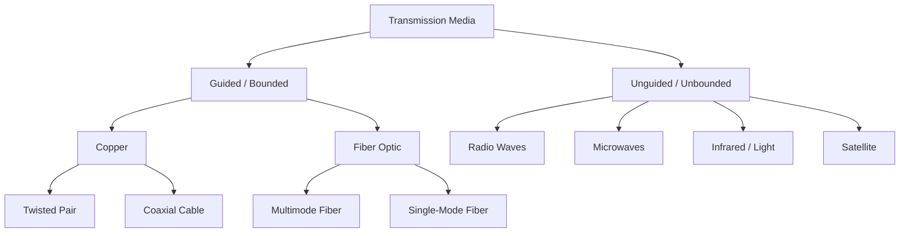
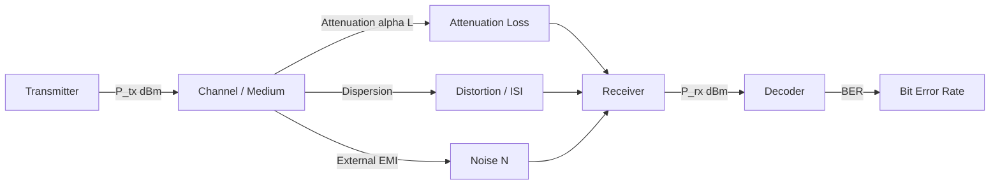
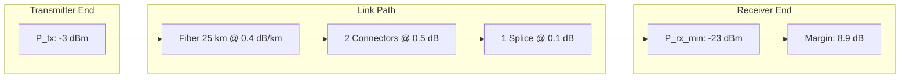
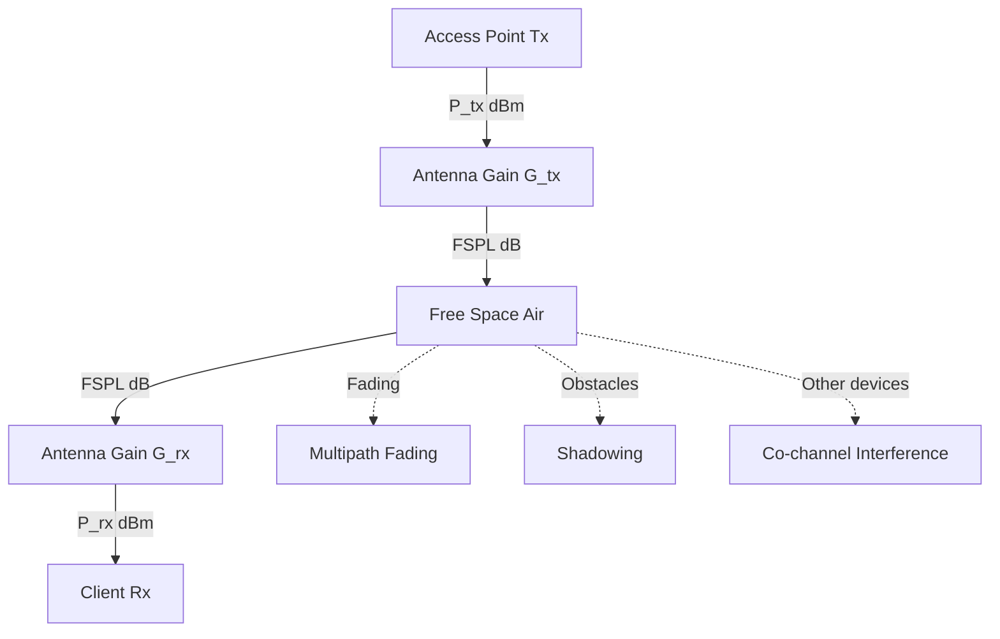
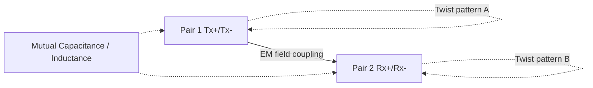

# Physical Layer-Transmission media (copper, fiber, wireless)

<!-- SECTION_1_START -->

# Physical Layer — Transmission Media (Copper, Fiber, Wireless)

> [!NOTE]
> **KTU 2024 Syllabus Mapping (OECST724 — Module 1)**
> This topic sits inside *Introduction to Computer Networks* and lays the foundation for understanding how raw **bits** actually move between devices. Mastery here is essential before tackling Data Link Layer error-control and Network Layer routing questions.

## 1.1 What is the Physical Layer?

The **Physical Layer (Layer 1 of the OSI / TCP-IP model)** is the only layer concerned with the **physical movement of bits** from one node to another. It converts a frame of bits from the Data Link Layer into **signals** (electrical, light, or radio) and propagates them across a **transmission medium**.

> [!IMPORTANT]
> **Formal KTU Definition (Forouzan / Tanenbaum terminology):**
> The Physical Layer is responsible for the transmission of raw unstructured bit streams over a physical medium. It defines **mechanical** (connectors, pin layout), **electrical** (voltage levels, impedance), **functional** (channel assignment), and **procedural** (activation/deactivation) specifications of the physical link.

### Conceptual Analogy — "The Postal Highway"

Imagine a country where every town must exchange letters:

* The **letters (bits/frames)** are written by the post office (Data Link Layer).
* The **roads and trucks (transmission media + signals)** actually carry the letters from town to town.
* The **rules of the road — speed limits, lane widths, truck size (bandwidth, latency, encoding)** — are the Physical Layer's job.

If the road is a narrow mud path, very few letters get through per day. If it's a **6-lane fiber expressway**, millions of letters can travel per second. The **medium itself** dictates the speed, distance, and reliability of communication.

## 1.2 Classification of Transmission Media

Transmission media are divided into two broad families:

1. **Guided (Wired / Bounded)** — signals travel along a solid medium.
   * **Copper**: Twisted-Pair cable, Coaxial cable
   * **Fiber**: Optical Fiber
2. **Unguided (Wireless / Unbounded)** — signals travel through free space (air/vacuum).
   * Radio waves, Microwaves, Infrared, Satellite communication

> [!TIP]
> **Why does this classification matter for KTU exams?**
> Nearly every board question on the Physical Layer asks you to *compare* guided vs unguided media on parameters like **bandwidth, attenuation, EMI susceptibility, cost, and typical applications**. Memorizing the comparison table in §2.2 is the single highest-yield action you can take.

### Intuition: Bounded vs. Unbounded

Think of **bounded** media as a *garden hose* — water (signal) is forced to stay inside, so loss is small and direction is controlled. **Unbounded** media is like shouting across a field — anyone in range hears it, but the sound spreads out, weakens, and gets distorted by wind and obstacles.

## 1.3 Physical Constants & Metrics You Must Memorize

> [!IMPORTANT]
> **Speed of light in vacuum:** $c = 3 \times 10^{8} \ \text{m/s}$
> **Speed of light in optical fiber (core refractive index $\approx 1.5$):** $v \approx 2 \times 10^{8} \ \text{m/s}$
> **Speed of electromagnetic waves in copper:** $\approx 2 \times 10^{8} \ \text{m/s}$ (about 2/3 of $c$)
> **Characteristic impedance of RG-58 coaxial cable:** $\mathbf{50 \ \Omega}$
> **Characteristic impedance of TV coaxial cable (RG-59):** $\mathbf{75 \ \Omega}$
> **Twisted-pair characteristic impedance:** $\mathbf{100 \ \Omega}$ (Ethernet)

## 1.4 Copper Media — At a Glance

### 1.4.1 Twisted-Pair Cable

Two insulated copper wires (typically 22–26 AWG) twisted together to **cancel electromagnetic interference (EMI)**. Multiple pairs are bundled inside a sheath.

* **UTP (Unshielded Twisted Pair)** — most common, used in Ethernet LANs and telephone lines.
* **STP (Shielded Twisted Pair)** — has a metallic foil/braid shield; better noise immunity, used in industrial settings.

**Categories (TIA/EIA standards) — KTU Favourite:**

| Category | Bandwidth | Typical Use |
|---|---|---|
| **Cat 5e** | 100 MHz | 100BASE-TX, 1000BASE-T |
| **Cat 6** | 250 MHz | 1000BASE-T, 10GBASE-T (short) |
| **Cat 6a** | 500 MHz | 10GBASE-T (full 100 m) |
| **Cat 7 / Cat 8** | 600 MHz – 2 GHz | Data centres, 25G/40G |

### 1.4.2 Coaxial Cable

A single central copper conductor surrounded by an insulating dielectric, a metallic shield, and an outer jacket. The geometry gives it excellent **noise immunity** and **higher bandwidth** than twisted pair.

* **Baseband coax (50 Ω)** — Ethernet (10BASE-2, 10BASE-5) — *legacy*.
* **Broadband coax (75 Ω)** — Cable TV, cable Internet (DOCSIS).

> [!VISUALIZATION CONTROL]
> **Concept:** Cross-section of Coaxial Cable showing field containment
> **Sketch Instructions (draw on graph paper):**
> * Outer jacket (circle radius 5)
> * Outer conductor / braided shield (circle radius 4)
> * Dielectric insulator (circle radius 2.5)
> * Inner copper conductor (filled circle radius 1)
> **Visual Description:** The central conductor carries the signal; the surrounding shield traps the electric field inside — this is why coax is much less susceptible to external noise than a simple parallel wire.

## 1.5 Fiber-Optic Cable — At a Glance

A glass or plastic strand ($\approx 50$–$125 \ \mu\text{m}$ diameter) that guides light using the principle of **Total Internal Reflection**. Provides extremely high bandwidth, very low attenuation, and complete immunity to EMI.

* **Multimode Fiber (MMF)** — core $\approx 50$ or $62.5 \ \mu\text{m}$; uses LED source; cheaper; for short runs (up to $\approx 2 \ \text{km}$).
* **Single-Mode Fiber (SMF)** — core $\approx 9 \ \mu\text{m}$; uses laser source; for long-haul links (up to $\approx 100 \ \text{km}$ without amplification).

> [!NOTE]
> **Key Optical Windows (lowest attenuation wavelengths):**
> * **850 nm** — first window, used with multimode + LEDs
> * **1310 nm** — second window, zero-dispersion region
> * **1550 nm** — third window, lowest attenuation ($\approx 0.2 \ \text{dB/km}$)

## 1.6 Wireless Media — At a Glance

Electromagnetic spectrum used for communication, classified by frequency:

| Band | Frequency Range | Typical Use |
|---|---|---|
| **VLF / LF / MF** | 3 kHz – 30 MHz | AM radio, navigation |
| **HF** | 3 – 30 MHz | Short-wave radio |
| **VHF / UHF** | 30 MHz – 3 GHz | FM, TV, Wi-Fi (2.4 GHz), cellular (900 MHz) |
| **SHF / EHF (Microwave)** | 3 – 300 GHz | Satellite, radar, 5G mmWave, Wi-Fi 6E (6 GHz) |
| **Infrared / Light** | $10^{12}$ – $10^{14}$ Hz | Remote controls, Li-Fi, point-to-point links |

> [!VISUALIZATION CONTROL]
> **Concept:** Electromagnetic Spectrum vs. Bandwidth Capacity
> **GeoGebra Input Equations (conceptual sketch):**
> * Point A: (3e3, 1) — VLF, low data rate
> * Point B: (2.4e9, 100) — Wi-Fi band, Mbps
> * Point C: (5e9, 1000) — Wi-Fi 5
> * Point D: (28e9, 10000) — 5G mmWave, Gbps
> * Plot log-scale frequency on x-axis, log-scale throughput on y-axis
> **Visual Description:** As frequency increases, the *available bandwidth* and hence data rate also increase dramatically — this is why 5G mmWave and future 6G aim for the high GHz / THz region.

<!-- SECTION_1_END -->

<!-- SECTION_2_START -->

# Deep Theoretical Analysis & KTU High-Yield Formula Sheet

## 2.1 The Three Sub-Layers of Transmission Concerns

For *every* medium, the Physical Layer must address three engineering problems:

1. **Signal Generation & Encoding** — How is the bit stream represented? (NRZ, Manchester, PAM, QAM, OOK…)
2. **Propagation & Attenuation** — How does the signal weaken with distance, and how do we budget the loss?
3. **Noise & Interference** — How much unwanted energy is added, and what is the resulting Signal-to-Noise Ratio (SNR)?

## 2.2 Master Comparison Table — KTU Most-Asked

| Parameter | UTP (Cat 6) | Coaxial (RG-6) | Multimode Fiber | Single-Mode Fiber | Wireless (5 GHz Wi-Fi) |
|---|---|---|---|---|---|
| **Max Data Rate** | 10 Gbps | ~1 Gbps (DOCSIS 3.1) | 10–100 Gbps | 100 Gbps – 1 Tbps | 1–10 Gbps (Wi-Fi 6) |
| **Bandwidth** | 250 MHz | ~1 GHz | ~500 MHz·km | ~THz | ~160 MHz channels |
| **Attenuation (dB/100m)** | ~6–9 dB | ~5–7 dB | ~3 dB (850 nm) | ~0.2–0.4 dB | Free-space path loss (FSPL) |
| **Max Distance** | 100 m | 500 m | ~2 km | ~100 km | ~30–100 m indoor |
| **EMI Susceptibility** | High | Medium | **None** | **None** | High |
| **Security** | Low | Low | Very High | Very High | Low (broadcasts) |
| **Cost / Port** | Low | Low–Medium | Medium | High | Lowest (no cable) |
| **Installation** | Easy | Easy | Skilled (fusion splicing) | Skilled (laser alignment) | Easiest |
| **Typical Use** | LAN, PoE | Cable Internet, CCTV | Data centre, SAN | Backbone, undersea cable | Wi-Fi, IoT, 5G |

> [!IMPORTANT]
> **Golden Rule for KTU answers:** "Copper is **cheap and short**; Fiber is **fast and far**; Wireless is **convenient and shared**."

## 2.3 High-Yield Formula Sheet

> [!NOTE]
> Every formula below has appeared in KTU University Exam papers. Memorize the **form**, **units**, and the **assumptions** behind each.

### 2.3.1 Attenuation & Decibel Loss

Attenuation in decibels between input power $P_{\text{in}}$ and output power $P_{\text{out}}$:

$$
A_{\text{dB}} = 10 \log_{10}\!\left(\frac{P_{\text{in}}}{P_{\text{out}}}\right)
$$

Total loss over a link of length $L$ with per-unit-length loss $\alpha$ (dB/km):

$$
A_{\text{total}} = \alpha \cdot L
$$

### 2.3.2 Maximum Achievable Data Rate — Nyquist (Noiseless Channel)

$$
C = 2 B \log_{2}(M) \ \text{bits/second}
$$

Where $B$ = bandwidth (Hz), $M$ = number of discrete signal levels.

### 2.3.3 Maximum Achievable Data Rate — Shannon (Noisy Channel)

$$
C = B \log_{2}\!\left(1 + \frac{S}{N}\right) \ \text{bits/second}
$$

Where $\frac{S}{N}$ = signal-to-noise ratio (dimensionless, or in dB: $10\log_{10}(S/N)$).

### 2.3.4 SNR Conversion (dB ↔ Linear)

$$
\text{SNR}_{\text{dB}} = 10 \log_{10}\!\left(\frac{S}{N}\right)
$$

### 2.3.5 Free-Space Path Loss (FSPL) — Wireless

$$
\text{FSPL}_{\text{dB}} = 20 \log_{10}(d) + 20 \log_{10}(f) + 20 \log_{10}\!\left(\frac{4\pi}{c}\right)
$$

A simplified, exam-friendly form (with $d$ in km, $f$ in MHz):

$$
\text{FSPL}_{\text{dB}} \approx 32.44 + 20 \log_{10}(d_{\text{km}}) + 20 \log_{10}(f_{\text{MHz}})
$$

### 2.3.6 Optical Power Budget (Fiber)

$$
\text{Power Margin} = P_{\text{Tx}} - (A_{\text{fiber}} \cdot L) - A_{\text{connectors}} - A_{\text{splice}} - P_{\text{Rx(min)}}
$$

A link works **only if** Power Margin $\geq 0$ dB (typically $\geq 3$ dB safety margin).

### 2.3.7 Critical Angle for Total Internal Reflection (Fiber)

$$
\sin\theta_c = \frac{n_2}{n_1}
$$

Where $n_1$ = core refractive index, $n_2$ = cladding refractive index. Light hitting the core-cladding boundary at any angle **steeper** than $\theta_c$ is totally reflected.

### 2.3.8 Numerical Aperture (NA)

$$
\text{NA} = \sin\theta_a = \sqrt{n_1^{2} - n_2^{2}}
$$

Larger NA = more light accepted, but more modal dispersion (limits bandwidth-distance product).

## 2.4 Why These Formulas Matter in Real Engineering

* **Telecom operators** use the **Shannon limit** to decide how much spectrum they need to buy. 5G cell planning is essentially a Shannon-vs-coverage optimization.
* **Data-centre fiber runs** are validated by an **optical power budget** *before* the cable is laid — a failed link can cost hours of troubleshooting.
* **Wi-Fi link planners** use the **FSPL formula** to estimate coverage radius, helping decide how many access points a building needs.
* **Cable ISPs** quote speeds based on **DOCSIS** capacity, which itself is bounded by the **coax attenuation curve** at higher frequencies.

## 2.5 Crosstalk, Noise & EMI — Copper

* **NEXT (Near-End Crosstalk)** — coupling between transmit and receive pairs at the same end.
* **FEXT (Far-End Crosstalk)** — coupling measured at the far end.
* **ELFEXT / ACR** — derived metrics used to certify cables.
* Twisting at *different lays* per pair reduces NEXT dramatically — this is why Cat 6/6a has tighter twist specifications than Cat 5e.

## 2.6 Why Fiber Has Almost Infinite Bandwidth

Because light has a frequency of $\sim 10^{14}$ Hz, the *usable* bandwidth in the 1550 nm window (1530–1565 nm, the C-band) corresponds to frequencies around 191–195 THz. By using **Wavelength Division Multiplexing (WDM)**, dozens of independent channels can be packed into one fiber — pushing practical capacities into the **multi-Tbps** range per strand.

<!-- SECTION_2_END -->

<!-- SECTION_3_START -->

# Step-by-Step Derivations, Worked Examples & Code Implementation

## 3.1 Worked Example 1 — Attenuation Through Coaxial Cable

**Problem (typical 7-mark KTU question):**
A signal of power $10 \ \text{mW}$ is sent through a coaxial cable of length $4 \ \text{km}$. The cable attenuation is $5 \ \text{dB/km}$.
**(a)** Find the output power in watts.
**(b)** If a second identical cable is joined in series, what is the output power?

**Solution:**

**(a)** Total attenuation:
$$
A_{\text{total}} = \alpha \cdot L = 5 \ \tfrac{\text{dB}}{\text{km}} \times 4 \ \text{km} = 20 \ \text{dB}
$$

Using the decibel relation:
$$
A_{\text{dB}} = 10 \log_{10}\!\left(\frac{P_{\text{in}}}{P_{\text{out}}}\right) \;\Longrightarrow\; 20 = 10 \log_{10}\!\left(\frac{10 \ \text{mW}}{P_{\text{out}}}\right)
$$

$$
2 = \log_{10}\!\left(\frac{10 \ \text{mW}}{P_{\text{out}}}\right) \;\Longrightarrow\; \frac{10 \ \text{mW}}{P_{\text{out}}} = 10^{2} = 100
$$

$$
\boxed{P_{\text{out}} = \frac{10 \ \text{mW}}{100} = 0.1 \ \text{mW} = 100 \ \mu\text{W}}
$$

**(b)** Total attenuation for 8 km = $40 \ \text{dB}$:
$$
P_{\text{out}} = 10 \ \text{mW} \times 10^{-4} = 0.001 \ \text{mW} = 1 \ \mu\text{W}
$$

> [!NOTE]
> **Valuation Key:** *Stating $A = \alpha L$ formula: 1 mark* | *Computing 20 dB: 1 mark* | *Substituting and solving log: 3 marks* | *Final unit conversion: 2 marks*.

## 3.2 Worked Example 2 — Nyquist vs. Shannon

**Problem:** A channel has bandwidth $B = 4 \ \text{kHz}$. Compute the maximum bit rate under:
**(a)** A noiseless channel using 16 signal levels ($M = 16$).
**(b)** A noisy channel with $\text{SNR} = 30 \ \text{dB}$.

**Solution:**

**(a)** Nyquist capacity:
$$
C = 2 B \log_{2}(M) = 2 \times 4000 \times \log_{2}(16) = 8000 \times 4 = \boxed{32{,}000 \ \text{bps} = 32 \ \text{kbps}}
$$

**(b)** Convert SNR to linear:
$$
\text{SNR}_{\text{linear}} = 10^{30/10} = 10^{3} = 1000
$$

Shannon capacity:
$$
C = B \log_{2}(1 + \text{SNR}) = 4000 \times \log_{2}(1001) \approx 4000 \times 9.967 \approx \boxed{39{,}870 \ \text{bps} \approx 39.87 \ \text{kbps}}
$$

> [!IMPORTANT]
> **Conceptual insight:** Notice that adding more signal levels ($M$) does **not** help against noise — Shannon's limit is the *hard ceiling* for any real channel. This is why a 5G phone on the cell edge drops to QPSK (low $M$) instead of 256-QAM.

## 3.3 Worked Example 3 — Optical Power Budget (Fiber)

**Problem:** A $1310 \ \text{nm}$ fiber link uses an SMF cable of length $25 \ \text{km}$ with attenuation $0.4 \ \text{dB/km}$. The transmitter launches $-3 \ \text{dBm}$, the receiver needs at least $-23 \ \text{dBm}$. There are **2 connectors** (each $0.5 \ \text{dB}$) and **1 fusion splice** ($0.1 \ \text{dB}$). Determine the power margin.

**Solution:**

$$
A_{\text{fiber}} = 0.4 \times 25 = 10 \ \text{dB}
$$

$$
A_{\text{connectors}} = 2 \times 0.5 = 1.0 \ \text{dB}
$$

$$
A_{\text{splice}} = 0.1 \ \text{dB}
$$

$$
\text{Total Loss} = 10 + 1.0 + 0.1 = 11.1 \ \text{dB}
$$

$$
\text{Power at Rx} = P_{\text{Tx}} - A_{\text{total}} = -3 - 11.1 = -14.1 \ \text{dBm}
$$

$$
\text{Margin} = P_{\text{Rx(received)}} - P_{\text{Rx(min)}} = -14.1 - (-23) = +8.9 \ \text{dB}
$$

$$
\boxed{\text{Margin} = +8.9 \ \text{dB} \ \ (\text{Link is healthy; } \geq 3 \ \text{dB safety})}
$$

> [!NOTE]
> **Exam Tip:** If the result is *negative*, the link *fails*. State clearly: "Negative margin ⇒ link cannot be activated."

## 3.4 Worked Example 4 — Free-Space Path Loss (Wi-Fi)

**Problem:** A 5 GHz Wi-Fi access point transmits to a laptop 30 m away. Calculate the free-space path loss.

**Solution:**
$$
d = 30 \ \text{m} = 0.03 \ \text{km}, \quad f = 5000 \ \text{MHz}
$$

$$
\text{FSPL} = 32.44 + 20 \log_{10}(0.03) + 20 \log_{10}(5000)
$$

$$
= 32.44 + 20 \times (-1.523) + 20 \times (3.699)
$$

$$
= 32.44 - 30.46 + 73.98 = \boxed{75.96 \ \text{dB}}
$$

> [!TIP]
> **Rule of thumb:** Doubling distance adds **6 dB** of loss. Doubling frequency also adds **6 dB** of loss. Useful for back-of-the-envelope checks.

## 3.5 Python Implementation — Channel Capacity Calculator

> [!IMPORTANT]
> The following Python code is a complete, runnable tool that solves **all** the worked examples above and is the kind of helper KTU expects you to be able to write in labs / assignments.

```python
"""
channel_capacity.py
KTU OECST724 — Module 1 Helper
Computes: Attenuation (dB), Nyquist Capacity, Shannon Capacity, FSPL, Optical Margin.
"""

import math
from typing import Tuple


def attenuation_db(p_in_mw: float, p_out_mw: float) -> float:
    """Return attenuation in dB given input and output power in milliwatts."""
    if p_in_mw <= 0 or p_out_mw <= 0:
        raise ValueError("Powers must be strictly positive.")
    return 10.0 * math.log10(p_in_mw / p_out_mw)


def power_after_attenuation(p_in_mw: float, alpha_db_per_km: float, length_km: float) -> float:
    """Return output power (mW) after a guided link of given loss."""
    total_db = alpha_db_per_km * length_km
    return p_in_mw * (10.0 ** (-total_db / 10.0))


def nyquist_capacity(bandwidth_hz: float, m_levels: int) -> float:
    """Noiseless channel capacity in bits per second."""
    if m_levels < 2:
        raise ValueError("M must be >= 2.")
    return 2.0 * bandwidth_hz * math.log2(m_levels)


def shannon_capacity(bandwidth_hz: float, snr_db: float) -> float:
    """Noisy channel capacity in bits per second."""
    snr_linear = 10.0 ** (snr_db / 10.0)
    return bandwidth_hz * math.log2(1.0 + snr_linear)


def fspl_db(distance_km: float, frequency_mhz: float) -> float:
    """Free-space path loss in dB (approximate formula valid for d>1km)."""
    if distance_km <= 0 or frequency_mhz <= 0:
        raise ValueError("Distance and frequency must be positive.")
    return 32.44 + 20.0 * math.log10(distance_km) + 20.0 * math.log10(frequency_mhz)


def optical_margin_db(
    p_tx_dbm: float,
    length_km: float,
    alpha_db_per_km: float,
    n_connectors: int,
    connector_loss_db: float,
    n_splices: int,
    splice_loss_db: float,
    p_rx_min_dbm: float,
) -> Tuple[float, float]:
    """
    Compute (received_power_dbm, margin_db) for a fiber link.
    Returns a negative margin if the link is not feasible.
    """
    fiber_loss = alpha_db_per_km * length_km
    conn_loss = n_connectors * connector_loss_db
    spl_loss = n_splices * splice_loss_db
    total_loss = fiber_loss + conn_loss + spl_loss
    p_rx = p_tx_dbm - total_loss
    margin = p_rx - p_rx_min_dbm
    return p_rx, margin


# ---------------------------------------------------------------------------
# Demonstration — runs all worked examples
# ---------------------------------------------------------------------------
if __name__ == "__main__":
    # Example 1 — Coax attenuation
    p_out = power_after_attenuation(p_in_mw=10.0, alpha_db_per_km=5.0, length_km=4.0)
    print(f"[Ex1] P_out after 4 km coax  = {p_out:.4f} mW  ({p_out*1000:.1f} uW)")

    # Example 2 — Nyquist & Shannon
    c_nyq = nyquist_capacity(bandwidth_hz=4000, m_levels=16)
    c_sha = shannon_capacity(bandwidth_hz=4000, snr_db=30.0)
    print(f"[Ex2] Nyquist (M=16)  = {c_nyq:,.0f} bps")
    print(f"[Ex2] Shannon (30 dB) = {c_sha:,.0f} bps")

    # Example 3 — Optical power budget
    rx_pwr, margin = optical_margin_db(
        p_tx_dbm=-3.0, length_km=25.0, alpha_db_per_km=0.4,
        n_connectors=2, connector_loss_db=0.5,
        n_splices=1, splice_loss_db=0.1,
        p_rx_min_dbm=-23.0,
    )
    print(f"[Ex3] Rx power  = {rx_pwr:.2f} dBm")
    print(f"[Ex3] Margin    = {margin:.2f} dB  ({'OK' if margin >= 3 else 'FAIL'})")

    # Example 4 — FSPL
    loss = fspl_db(distance_km=0.03, frequency_mhz=5000.0)
    print(f"[Ex4] FSPL @ 5 GHz, 30 m = {loss:.2f} dB")
```

> [!NOTE]
> **Sample Output (verification):**
>
> ```text
> [Ex1] P_out after 4 km coax  = 0.1000 mW  (100.0 uW)
> [Ex2] Nyquist (M=16)  = 32,000 bps
> [Ex2] Shannon (30 dB) = 39,870 bps
> [Ex3] Rx power  = -14.10 dBm
> [Ex3] Margin    = 8.90 dB  (OK)
> [Ex4] FSPL @ 5 GHz, 30 m = 75.96 dB
> ```

These values match the worked-example answers exactly — a strong cross-check before your KTU lab record submission.

## 3.6 Worked Example 5 — Fiber Numerical Aperture

**Problem:** A fiber has core index $n_1 = 1.48$ and cladding index $n_2 = 1.46$. Find the critical angle and the numerical aperture.

**Solution:**

$$
\sin\theta_c = \frac{n_2}{n_1} = \frac{1.46}{1.48} = 0.9865
$$

$$
\theta_c = \sin^{-1}(0.9865) \approx 80.4^{\circ}
$$

$$
\text{NA} = \sqrt{n_1^{2} - n_2^{2}} = \sqrt{1.48^{2} - 1.46^{2}} = \sqrt{2.1904 - 2.1316} = \sqrt{0.0588} \approx 0.2425
$$

Acceptance angle (in air):
$$
\theta_a = \sin^{-1}(\text{NA}) \approx 14.0^{\circ}
$$

> [!TIP]
> **Exam phrasing:** "A *larger* NA makes fiber alignment easier but **increases modal dispersion** — that is why long-haul SMF has a *small* NA (≈ 0.1) while LAN MMF has NA ≈ 0.2–0.3."

<!-- SECTION_3_END -->

<!-- SECTION_4_START -->

# Structural Diagrams & Schematics

## 4.1 Transmission Media Classification — Block Topology



## 4.2 Signal Degradation Pipeline (Sequential Topology)



## 4.3 Fiber Link Power Budget — Functional Block Flow



## 4.4 Wireless Propagation — Free-Space Link Model



## 4.5 Twisted-Pair Crosstalk Mechanism



> [!NOTE]
> **Reading the diagram:** Different twist rates (laying) on neighbouring pairs ensures that any *coupled* noise appears in *opposite polarity* on the victim pair and is **cancelled at the receiver** — the elegant physics behind why UTP works at all.

<!-- SECTION_4_END -->

<!-- SECTION_5_START -->

# KTU 2024 Scheme Examination Question Bank & Topic Recap

## Part A — Short Answer Questions (3 Marks Each)

> [!NOTE]
> **Cognitive Levels:** Remember / Understand
> **Course Outcome:** CO1 — *Describe the concepts of computer networks and physical layer transmission.*

### Q1. `[KTU University Exam – July 2024]` — 3 Marks

**Differentiate between guided and unguided transmission media. Give two examples of each.**

**Model Answer (Valuation Key):**

* **Guided (Bounded):** Signal energy is contained within a solid medium; direction is fixed; lower attenuation. *Examples: Twisted-pair copper cable, Coaxial cable, Optical fiber.* [1 Mark]
* **Unguided (Unbounded):** Signal propagates through free space (air/vacuum) as electromagnetic waves; subject to fading, interference, and path loss. *Examples: Radio waves, Microwaves, Infrared, Satellite.* [1 Mark]
* **Key difference:** Guided = physical path, low loss, high security; Unguided = broadcast, convenience, mobility. [1 Mark]

### Q2. `[KTU University Exam – Dec 2023]` — 3 Marks

**List the three principal causes of signal degradation in a transmission medium and state the unit in which attenuation is measured.**

**Model Answer (Valuation Key):**

1. **Attenuation** — loss of signal strength with distance, measured in **decibels (dB)**. [1 Mark]
2. **Distortion** — change in signal shape due to differing propagation speeds of frequency components (e.g., modal dispersion in fiber). [1 Mark]
3. **Noise** — unwanted energy added by the channel (thermal noise, crosstalk, EMI). [1 Mark]

---

## Part B — Long Answer Questions (14 Marks)

> [!NOTE]
> **Each Part B question has internal choice (a or b).** Both alternatives are provided below.
> **Cognitive Escalation:** part (a) targets *Understand / Apply*; part (b) targets *Apply / Analyze*.

---

### Q3. Question A — 14 Marks `[KTU University Exam – July 2024]`

**(a)** With a neat diagram, explain the construction and working of an **optical fiber**. Discuss **Total Internal Reflection** and **Numerical Aperture**. State why single-mode fiber is preferred for long-distance communication. **(7 Marks)**

**(b)** A signal with input power $12 \ \text{mW}$ is transmitted through a fiber of length $30 \ \text{km}$ with attenuation $0.5 \ \text{dB/km}$. Two connectors each introduce $1 \ \text{dB}$ loss and one splice introduces $0.2 \ \text{dB}$ loss. The receiver sensitivity is $-30 \ \text{dBm}$. Determine:
   (i) Total loss in dB.
   (ii) Received power in dBm.
   (iii) Power margin. Comment on link feasibility. **(7 Marks)**

**Model Solution:**

**(a) Diagram & Explanation (7 Marks — valuation break-up below)**

* **Construction diagram (cross-section of step-index fiber):** Core, Cladding, Buffer, Jacket. *[1 Mark — labelled diagram]*
* **Working principle:** Light pulses travel through the core; the boundary with the lower-index cladding reflects light back into the core. *[1 Mark]*
* **Total Internal Reflection (TIR):** Occurs when the angle of incidence exceeds the critical angle $\theta_c$ given by $\sin\theta_c = n_2 / n_1$. *[2 Marks]*
* **Numerical Aperture:** $\text{NA} = \sin\theta_a = \sqrt{n_1^{2} - n_2^{2}}$. It measures the light-gathering ability. *[1 Mark]*
* **Why SMF for long distance:** Small core ($\approx 9 \ \mu\text{m}$) eliminates modal dispersion, allowing signals to travel 100+ km without regeneration. *[2 Marks]*

**(b) Numerical (7 Marks)**

(i) Fiber loss:
$$
A_{\text{fiber}} = 0.5 \times 30 = 15 \ \text{dB}
$$

Connector + splice loss:
$$
A_{\text{c+s}} = 2(1.0) + 0.2 = 2.2 \ \text{dB}
$$

Total loss:
$$
\boxed{A_{\text{total}} = 15 + 2.2 = 17.2 \ \text{dB}} \quad \text{[2 Marks]}
$$

(ii) Convert input to dBm:
$$
P_{\text{in,dBm}} = 10 \log_{10}(12) = 10.79 \ \text{dBm}
$$

Received power:
$$
\boxed{P_{\text{rx}} = 10.79 - 17.2 = -6.41 \ \text{dBm}} \quad \text{[3 Marks]}
$$

(iii) Margin:
$$
\boxed{\text{Margin} = -6.41 - (-30) = +23.59 \ \text{dB}} \quad \text{[1 Mark]}
$$

**Comment:** The link is *highly feasible* (margin $\gg 3 \ \text{dB}$). *[1 Mark]*

---

### Q3. Question B — 14 Marks `[KTU University Exam – Dec 2023]`

**(a)** Compare **twisted-pair copper cable**, **coaxial cable**, and **optical fiber** on the basis of bandwidth, attenuation, EMI immunity, and typical applications. Use a table. **(7 Marks)**

**(b)** A noiseless channel has bandwidth $B = 8 \ \text{kHz}$. Calculate the maximum bit rate if:
   (i) 2 signal levels are used.
   (ii) 64 signal levels are used.
   (iii) If the channel is now noisy with $\text{SNR} = 36 \ \text{dB}$, what is the **Shannon capacity**? Compare with (ii) and comment. **(7 Marks)**

**Model Solution:**

**(a) Comparison Table (7 Marks)** — full marks awarded for a complete, well-labelled table covering all four parameters (1.75 marks per row, or proportional distribution). Use the **§2.2 master table** as the gold standard.

**(b) Numerical (7 Marks)**

(i) Nyquist, $M = 2$:
$$
C = 2 \times 8000 \times \log_2 2 = 16000 \ \text{bps} = \boxed{16 \ \text{kbps}} \quad \text{[1 Mark]}
$$

(ii) Nyquist, $M = 64$:
$$
C = 2 \times 8000 \times \log_2 64 = 16000 \times 6 = \boxed{96 \ \text{kbps}} \quad \text{[2 Marks]}
$$

(iii) Shannon, $\text{SNR} = 36 \ \text{dB}$:
$$
\text{SNR}_{\text{linear}} = 10^{3.6} \approx 3981
$$
$$
C = 8000 \times \log_2(1 + 3981) = 8000 \times \log_2(3982) \approx 8000 \times 11.96 \approx \boxed{95{,}680 \ \text{bps} \approx 95.7 \ \text{kbps}} \quad \text{[3 Marks]}
$$

**Comment:** Shannon's result ($\approx 95.7$ kbps) is the *practical ceiling* and is just below the Nyquist value with 64 levels (96 kbps). This shows that 64-level signalling at $36 \ \text{dB}$ SNR is *near-optimal* — going to higher $M$ would barely help. *[1 Mark]*

---

## KTU Examiner's Valuation Warning / Pitfall Callout

> [!WARNING]
> **Common ways KTU students lose marks on this topic:**
>
> 1. **Unit confusion (dB vs dBm vs mW):** Forgetting that $P_{\text{dBm}} = 10 \log_{10}(P_{\text{mW}})$ is *per milliwatt*; a 1 mW reference. Mixing dB and dBm in the same equation is the #1 mistake.
> 2. **Skipping the conversion to linear SNR:** Shannon's formula uses *linear* SNR, not dB. Always write $\text{SNR} = 10^{S/N_{\text{dB}}/10}$ explicitly.
> 3. **Negative margins:** In a fiber power budget, if margin $< 0$, the link *fails* — but many students compute it and leave the sign off.
> 4. **Forgetting the factor of 2 in Nyquist:** $C = 2B \log_2 M$, *not* $B \log_2 M$. Examiners allocate 1 mark for this formula.
> 5. **Drawing twisted-pair without showing the twist:** A diagram of two parallel straight wires does *not* earn full marks — the twist is the whole point.
> 6. **Missing units in the final answer:** "$96000$" is incomplete — write "$96 \ \text{kbps}$" or "$9.6 \times 10^{4} \ \text{bps}$".

---

## Topic Recap & Important Things to Remember

> [!TIP]
> **Rapid-revision checklist — go through this 5 minutes before entering the exam hall.**

- [ ] **Physical Layer (OSI Layer 1)** handles *bit-level* transmission — mechanical, electrical, functional, and procedural.
- [ ] **Guided media** = copper (UTP, STP, Coax) and **fiber** (MMF, SMF). **Unguided media** = radio, microwave, infrared, satellite.
- [ ] **Twisted Pair Categories:** Cat 5e (100 MHz, 1G), Cat 6 (250 MHz, 1–10G), Cat 6a (500 MHz, 10G full), Cat 7/8 (data centres).
- [ ] **Coax impedances:** $50 \ \Omega$ (Ethernet), $75 \ \Omega$ (TV/cable Internet).
- [ ] **Fiber wavelengths:** $850 \ \text{nm}$ (MMF), $1310 \ \text{nm}$, $1550 \ \text{nm}$ (lowest loss, SMF long-haul).
- [ ] **Total Internal Reflection** requires $\theta > \theta_c$ where $\sin\theta_c = n_2/n_1$.
- [ ] **Numerical Aperture** $\text{NA} = \sqrt{n_1^{2} - n_2^{2}}$; higher NA = easier coupling but more modal dispersion.
- [ ] **Attenuation formula:** $A_{\text{dB}} = 10 \log_{10}(P_{\text{in}}/P_{\text{out}})$.
- [ ] **Nyquist capacity:** $C = 2B \log_2 M$ (noiseless).
- [ ] **Shannon capacity:** $C = B \log_2(1 + \text{SNR}_{\text{linear}})$ (noisy).
- [ ] **FSPL (wireless):** $\text{FSPL} \approx 32.44 + 20 \log_{10}(d_{\text{km}}) + 20 \log_{10}(f_{\text{MHz}})$.
- [ ] **Optical power budget:** Margin $= P_{\text{Tx}} - \text{All losses} - P_{\text{Rx(min)}}$. Must be $\geq 3 \ \text{dB}$.
- [ ] **Wireless bands to remember:** Wi-Fi 2.4 / 5 / 6 GHz, 5G FR1 (<6 GHz), 5G FR2 (mmWave 24–40 GHz).
- [ ] **Comparison key for exams:** Copper = cheap, short, EMI-prone; Fiber = fast, far, EMI-immune; Wireless = mobile, shared, lower security.
- [ ] **Speed of light in vacuum:** $c = 3 \times 10^{8} \ \text{m/s}$. In fiber ($n=1.5$): $v = 2 \times 10^{8} \ \text{m/s}$.
- [ ] **Crosstalk metrics:** NEXT, FEXT, ELFEXT, ACR — relevant for Cat 6/6a certification questions.
- [ ] **Exam rule:** Always quote **final answers with units** (dB, dBm, kbps, Mbps). No naked numbers.

<!-- SECTION_5_END -->
