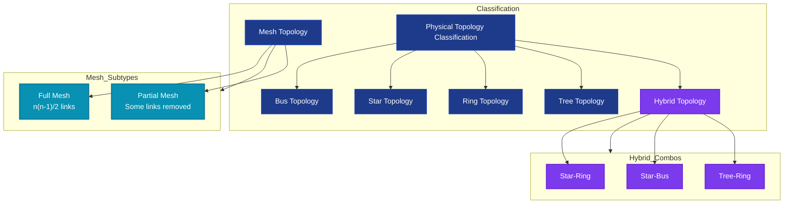
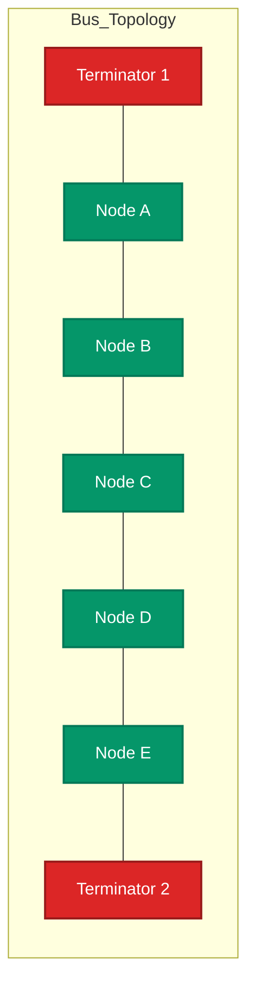
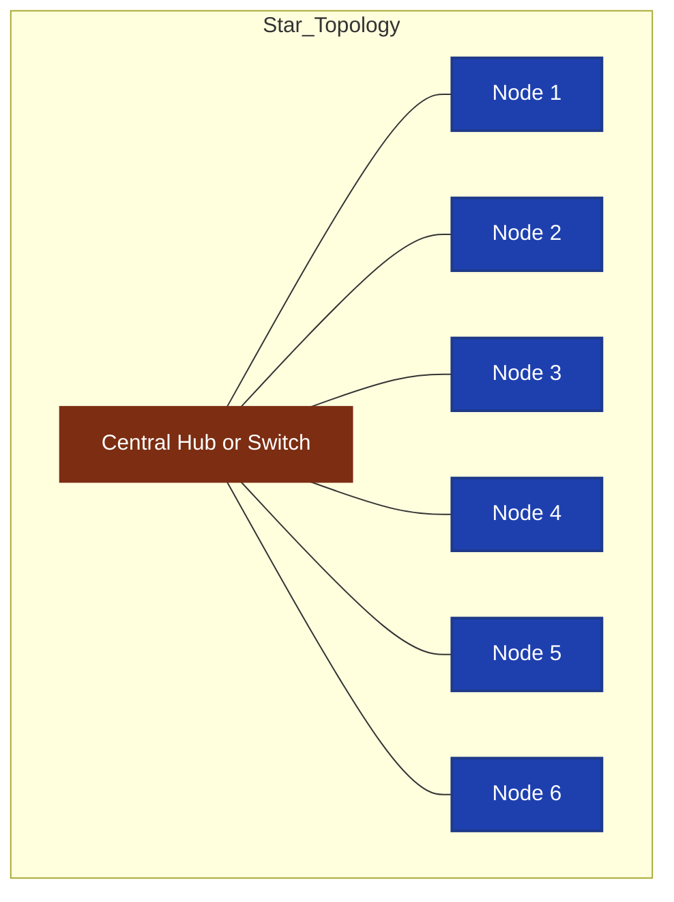
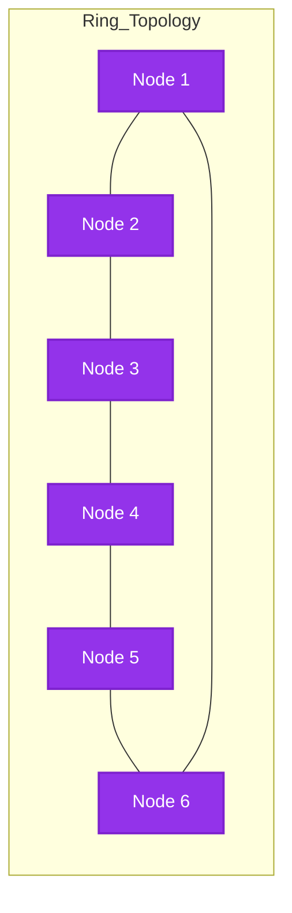
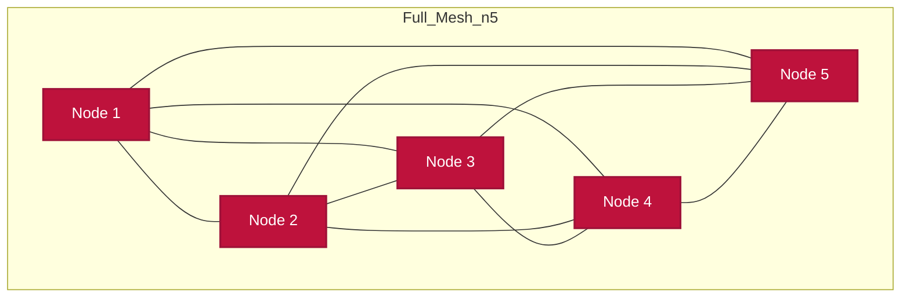
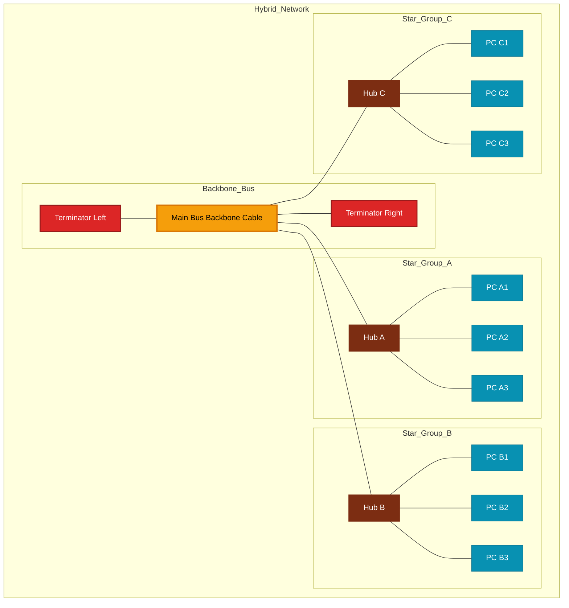

# Physical Topology

<!-- SECTION_1_START -->

# Physical Topology in Computer Networks

## 1. Core Technical Definition

**Physical Topology** is the actual geometric arrangement of computers, cables, and other network devices that constitutes a computer network. It represents the **physical layout** of the connected devices, including the placement of nodes and the physical pathways (cables, wireless links) that connect them.

> [!IMPORTANT]
> **KTU 2024 Syllabus Definition:** *Physical topology refers to the arrangement of the various network elements (links, nodes, etc.) of a computer network, typically depicted as a geometric shape or map. It is distinct from Logical Topology, which describes the flow of data regardless of physical design.*

### Conceptual Analogy / Intuition

Imagine a **city map**:
- **Physical Topology** is the **road map** — where the streets, houses, and intersections are physically built.
- **Logical Topology** is the **traffic flow pattern** — how cars actually move through those streets, which may not follow every road literally.

For instance, even if a city has a **circular ring road** (Ring Physical Topology), the morning traffic may logically flow in one direction, or even skip lanes, regardless of the road's physical shape.

### Key Terminology in Physical Topology

| Term | Meaning |
|---|---|
| **Node** | A connected device (computer, router, switch, hub) |
| **Link / Channel** | The physical medium (cable, fiber, wireless) |
| **Segment** | A continuous section of cable carrying data |
| **Backbone** | The main cable/route carrying the bulk of network traffic |
| **Drop Line** | A cable connecting a node to the backbone |

> [!NOTE]
> **Standard Metrics Used in KTU Examinations:**
> - **Bus length** is limited to **$\mathbf{500\,m}$** for 10Base2 (Thin Ethernet)
> - **Star cable** segment max length **$\mathbf{100\,m}$** (100Base-TX, Cat5/Cat6 UTP)
> - **Max nodes per segment** in a bus **$\mathbf{30}$** (10Base2) or **$\mathbf{1024}$** (10Base5)

### Visualization Control (GeoGebra / Desmos)

> [!VISUALIZATION CONTROL]
> **Concept:** Geometric representation of Physical Topologies on a coordinate plane.
>
> **GeoGebra / Desmos Input Equations:**
>
> * **Star Topology (Hub at origin):** `Hub: (0,0)`, `Node_i: (5*\cos(72°*i), 5*\sin(72°*i))` for $i = 0, 1, 2, 3, 4$
> * **Ring Topology:** `Node_i: (4*\cos(2\pi*i/6), 4*\sin(2\pi*i/6))` for $i = 0$ to $5$
> * **Bus Topology:** `Nodes: (-5, 0), (-2.5, 0), (0, 0), (2.5, 0), (5, 0)` on a horizontal line $y=0$
>
> **Visual Description:** Students should observe the **central node** in Star, the **closed loop** in Ring, and the **linear backbone** in Bus. Each visualization helps in recognizing the geometric essence of the corresponding topology.

---

<!-- SECTION_2_START -->

# 2. Deep Theoretical Analysis & KTU High-Yield Formula Sheet

## 2.1 Classification of Physical Topologies

Physical topologies are classified into **6 major categories** based on their geometric arrangement:

### A. Bus Topology (Linear Bus)

- All devices share a **single common backbone** cable (the "bus").
- Data travels in **both directions** along the cable (broadcast medium).
- **Terminators** at both ends absorb signals to prevent reflection.
- *Legacy example:* 10Base2, 10Base5 Ethernet.

### B. Star Topology

- All devices connect to a **central hub** or **switch**.
- The central device acts as a **repeater** (hub) or **traffic controller** (switch).
- *Modern example:* Almost all office LANs using twisted-pair Ethernet.

### C. Ring Topology

- Each device connects to **exactly two other devices**, forming a **closed circular path**.
- Data travels in **one direction** (unidirectional) or both (bidirectional ring).
- *Legacy example:* IBM Token Ring, FDDI (Fiber Distributed Data Interface).

### D. Mesh Topology

- Every device is connected to **every other device** (Full Mesh) or to **some subset** (Partial Mesh).
- Provides **maximum redundancy** and fault tolerance.
- *Example:* Internet backbone routers, military communication networks.

### E. Tree (Hierarchical) Topology

- A **hybrid of Star and Bus** topologies arranged in a **hierarchical pattern**.
- Groups of star-configured networks are connected to a bus backbone.
- *Example:* Cable TV distribution networks, large corporate networks.

### F. Hybrid Topology

- A **combination of two or more different topologies** integrated to leverage their strengths.
- *Example:* A Star-Ring hybrid where multiple star LANs are interconnected via a ring backbone.

## 2.2 KTU High-Yield Formula Sheet

The following table summarizes **all key formulas** for calculating connections, costs, and capacities in physical topologies. These are **high-frequency exam topics**.

| Topology | Number of Links (Cables) | Number of Ports per Device | Total Ports Required | Redundancy Level | Cost Factor |
|---|---|---|---|---|---|
| **Bus** | $1$ backbone $+\,n$ drop lines | $2$ per node (T-connector) | $2n$ | Very Low | Low |
| **Star** | $n$ | $1$ per node (to hub) | $n + n_{hub}$ | Low (single point at hub) | Moderate |
| **Ring** | $n$ | $2$ per node | $2n$ | Low (single break fails ring) | Moderate |
| **Tree** | $n - 1$ (for $n$ nodes) | Varies (root/leaf) | $\sum \text{degree}(v)$ | Low-Moderate | Moderate |
| **Full Mesh** | $\dfrac{n(n-1)}{2}$ | $(n-1)$ per node | $n(n-1)$ | Maximum (Full) | Very High |
| **Partial Mesh** | $\dfrac{n(n-1)}{2} - k$ | Varies | $2 \times \text{links}$ | Moderate-High | High |
| **Hybrid** | $\sum$ sub-topology links | Mixed | Mixed | Variable | Variable |

> [!IMPORTANT]
> **Critical Formula Distinction for KTU Exams:**
> - **Full Mesh Connections** $= \dfrac{n(n-1)}{2}$ (this is the **$\mathbf{\binom{n}{2}}$** combinatorial formula)
> - **Star Connections** $= n$ (always, regardless of $n$)
> - **Bus Backbone** = exactly $1$ (plus $n$ drop cables)
> - **Tree Connections** $= n - 1$ (graph-theoretic minimum for a connected tree)

## 2.3 Engineering Real-World Utility

> [!NOTE]
> **Where these topologies are deployed in production systems:**
>
> 1. **Star Topology** — Dominates modern enterprise LANs (Cat6/Cat6a cabling to switches), home Wi-Fi (router as central hub), and data center ToR (Top-of-Rack) designs.
> 2. **Mesh Topology** — Forms the **Internet backbone** (Tier-1 ISPs use full-mesh BGP peering), **wireless mesh networks** (e.g., Google Wi-Fi, military MANETs), and **IoT sensor networks** (ZigBee, Thread).
> 3. **Tree Topology** — Used in **cable TV (CATV)** distribution, **telephone exchange hierarchies**, and **large campus networks** (core-distribution-access layer model).
> 4. **Ring Topology** — Still prevalent in **fiber-optic MANs** (Resilient Packet Ring, IEEE 802.17) and **SONET/SDH** telecom rings.
> 5. **Bus Topology** — Largely obsolete in LANs, but persists in **automotive CAN bus**, **industrial fieldbuses**, and some legacy instrumentation.

### Why Topology Choice Matters in Engineering

The choice of physical topology directly impacts:

- **Scalability** — Can new nodes be added easily? (Star: yes, Bus: no)
- **Fault Tolerance** — Does a single cable failure isolate the network? (Mesh: no, Star: hub-dependent)
- **Latency** — How many hops does a packet traverse? (Star: 2 hops max via switch)
- **Cost** — Cabling + active equipment CAPEX
- **Maintenance Complexity** — Easier troubleshooting in Star vs. Mesh

---

<!-- SECTION_3_START -->

# 3. Step-by-Step Derivations & Code/Symbolic Implementation

## 3.1 Mathematical Derivation: Number of Connections in a Full Mesh

**Problem:** Derive the number of physical connections (links) required in a full mesh topology of $n$ nodes.

### Step 1: Define the Problem

In a **full mesh**, every node is directly connected to every other node by a dedicated link. We need to count the **total number of unique, unordered pairs** of nodes.

### Step 2: Set Up the Combinatorial Reasoning

Each node must connect to the other $(n - 1)$ nodes. If we naively sum this for all $n$ nodes:

$$\text{Naive sum} = n \times (n - 1)$$

### Step 3: Recognize the Double-Counting Error

When we count $n \times (n - 1)$, we count every connection **twice**. For example, the link between Node A and Node B is counted once in A's connections and once in B's connections.

### Step 4: Apply the Division by 2 Correction

$$\text{Total unique links} = \frac{n \times (n - 1)}{2}$$

### Step 5: Express in Combinatorial Notation

This is exactly the **binomial coefficient** for choosing 2 nodes from $n$:

$$\binom{n}{2} = \frac{n!}{2!(n-2)!} = \frac{n(n-1)}{2}$$

### Step 6: Verify with a Small Example

For $n = 4$ nodes (A, B, C, D):

$$\text{Links} = \frac{4 \times 3}{2} = 6$$

Enumeration: $AB, AC, AD, BC, BD, CD$ — indeed **6 unique links**. ✓

### Step 7: Generalize to Partial Mesh

If $k$ links are removed from a full mesh, the partial mesh has:

$$L_{\text{partial}} = \frac{n(n-1)}{2} - k$$

### Step 8: Star vs. Mesh Comparison

For a star of $n$ nodes: $L_{\text{star}} = n$.
For a full mesh of $n$ nodes: $L_{\text{mesh}} = \dfrac{n(n-1)}{2}$.

The **ratio** of mesh links to star links is:

$$\frac{L_{\text{mesh}}}{L_{\text{star}}} = \frac{n(n-1)/2}{n} = \frac{n-1}{2}$$

This shows that for $n \geq 5$, the mesh requires **more than twice** the cabling of a star.

## 3.2 Cost Calculation Derivation

**Problem:** A company wants to deploy a full mesh of 8 routers. Each link costs ₹5,000 for cabling. Calculate total cabling cost.

**Solution:**

$$n = 8 \quad\Rightarrow\quad L = \frac{8 \times 7}{2} = 28 \text{ links}$$

$$\text{Total cost} = 28 \times 5{,}000 = \text{₹}1{,}40{,}000$$

**Comparative Star Deployment:**

$$L_{\text{star}} = 8 \quad\Rightarrow\quad \text{Cost}_{\text{star}} = 8 \times 5{,}000 = \text{₹}40{,}000$$

$$\text{Cost ratio} = \frac{1{,}40{,}000}{40{,}000} = 3.5$$

The full mesh is **3.5× more expensive** in cabling alone, but offers maximum redundancy.

## 3.3 Python Implementation: Topology Connection Calculator

```python
from typing import Dict, List, Tuple
import math
import logging

# Configure strict error logging
logging.basicConfig(level=logging.INFO, format='%(levelname)s: %(message)s')
logger = logging.getLogger(__name__)


def calculate_links(topology: str, n: int) -> int:
    """
    Calculate the number of physical links required for a given topology.
    
    Args:
        topology: One of 'bus', 'star', 'ring', 'mesh', 'partial_mesh', 'tree'.
        n: Number of nodes (must be >= 2).
    
    Returns:
        Number of physical links required.
    
    Raises:
        ValueError: If n < 2 or topology is unknown.
    """
    # Absolute boundary check
    if not isinstance(n, int):
        raise TypeError(f"Number of nodes 'n' must be an integer, got {type(n).__name__}")
    
    if n < 2:
        raise ValueError(f"Topology requires at least 2 nodes, got n={n}")
    
    topology = topology.lower().strip()
    valid_topologies = {'bus', 'star', 'ring', 'mesh', 'partial_mesh', 'tree'}
    
    if topology not in valid_topologies:
        raise ValueError(f"Unknown topology '{topology}'. Valid options: {valid_topologies}")
    
    # Calculate based on topology type
    if topology == 'bus':
        # 1 backbone + n drop lines
        return 1 + n
    elif topology == 'star':
        # n links from each node to central hub
        return n
    elif topology == 'ring':
        # n links forming a closed loop
        return n
    elif topology == 'mesh':
        # Full mesh: n*(n-1)/2
        return n * (n - 1) // 2
    elif topology == 'partial_mesh':
        # Half of full mesh links (common approximation)
        return math.ceil(n * (n - 1) / 4)
    elif topology == 'tree':
        # n - 1 links for a connected tree
        return n - 1


def topology_comparison(n: int) -> Dict[str, Dict[str, int]]:
    """
    Compare all topologies for a given number of nodes.
    
    Returns:
        Dictionary mapping topology name to {links, ports_per_node, redundancy}.
    """
    logger.info(f"Generating topology comparison for n={n} nodes")
    
    comparison: Dict[str, Dict[str, int]] = {}
    
    for topo in ['bus', 'star', 'ring', 'mesh', 'tree']:
        links = calculate_links(topo, n)
        # Ports per node varies by topology
        if topo == 'star':
            ports = 1
            redundancy = 1
        elif topo == 'mesh':
            ports = n - 1
            redundancy = n - 1
        elif topo == 'ring':
            ports = 2
            redundancy = 1
        elif topo == 'tree':
            ports = 3  # average for balanced tree
            redundancy = 1
        else:  # bus
            ports = 2
            redundancy = 1
        
        comparison[topo] = {
            'links': links,
            'ports_per_node': ports,
            'redundancy_paths': redundancy
        }
    
    return comparison


def mesh_link_derivation(n: int) -> List[str]:
    """
    Show the step-by-step derivation of mesh link formula.
    
    Returns:
        List of strings representing each derivation step.
    """
    steps: List[str] = []
    steps.append(f"Step 1: With n={n} nodes, each node connects to (n-1)={n-1} other nodes")
    steps.append(f"Step 2: Naive sum = n × (n-1) = {n} × {n-1} = {n*(n-1)}")
    steps.append(f"Step 3: Each link counted twice (once from each endpoint)")
    steps.append(f"Step 4: Corrected = n(n-1)/2 = {n*(n-1)}/2 = {n*(n-1)//2}")
    steps.append(f"Step 5: This equals C(n,2) = {n}!/(2!×{n-2}!) = {math.comb(n, 2)}")
    return steps


def cost_calculator(n: int, cost_per_link: float, topology: str) -> Tuple[int, float]:
    """
    Calculate total cabling cost for a given topology.
    
    Returns:
        Tuple of (number of links, total cost in currency units).
    """
    if cost_per_link < 0:
        raise ValueError(f"Cost per link cannot be negative: {cost_per_link}")
    
    links = calculate_links(topology, n)
    total_cost = links * cost_per_link
    return links, total_cost


# Demonstration block (executing now)
if __name__ == "__main__":
    N = 6
    COST = 5000.0
    
    print("=" * 60)
    print(f"PHYSICAL TOPOLOGY ANALYSIS FOR n = {N} NODES")
    print("=" * 60)
    
    # Show mesh derivation
    print("\n--- Mesh Link Formula Derivation ---")
    for step in mesh_link_derivation(N):
        print(step)
    
    # Show comparison
    print("\n--- Topology Comparison ---")
    comparison = topology_comparison(N)
    print(f"{'Topology':<12} {'Links':<8} {'Ports/Node':<12} {'Redundancy'}")
    print("-" * 50)
    for topo, data in comparison.items():
        print(f"{topo:<12} {data['links']:<8} {data['ports_per_node']:<12} {data['redundancy_paths']}")
    
    # Show cost comparison
    print("\n--- Cost Comparison (₹5,000 per link) ---")
    for topo in ['star', 'mesh', 'ring', 'bus']:
        links, cost = cost_calculator(N, COST, topo)
        print(f"{topo:<10}: {links} links → ₹{cost:,.0f}")
```

**Expected Output:**

```
============================================================
PHYSICAL TOPOLOGY ANALYSIS FOR n = 6 NODES
============================================================

--- Mesh Link Formula Derivation ---
Step 1: With n=6 nodes, each node connects to (n-1)=5 other nodes
Step 2: Naive sum = n × (n-1) = 6 × 5 = 30
Step 3: Each link counted twice (once from each endpoint)
Step 4: Corrected = n(n-1)/2 = 30/2 = 15
Step 5: This equals C(n,2) = 6!/(2!×4!) = 15

--- Topology Comparison ---
Topology    Links    Ports/Node   Redundancy
--------------------------------------------------
bus         7        2            1
star        6        1            1
ring        6        2            1
mesh        15       5            5
tree        5        3            1

--- Cost Comparison (₹5,000 per link) ---
star      : 6 links → ₹30,000
mesh      : 15 links → ₹75,000
ring      : 6 links → ₹30,000
bus       : 7 links → ₹35,000
```

## 3.4 Failure Domain Analysis (Derivation)

The **failure domain** is the set of nodes affected by a single link failure.

| Topology | Failure Domain of One Link | Failure Domain of One Node |
|---|---|---|
| **Bus** | Entire network (if backbone breaks) | The affected segment only |
| **Star** | Only the single connected device | Entire subtree connected to that node |
| **Ring** | Entire network (single break disables ring) | Two segments isolated |
| **Mesh** | Minimal (alternative paths exist) | Minimal (redundant paths) |

---

<!-- SECTION_4_START -->

# 4. Structural Diagrams & Schematics

## 4.1 Mermaid Diagram: Master Topology Comparison Flow



## 4.2 Mermaid Diagram: Bus Topology Architecture



## 4.3 Mermaid Diagram: Star and Ring Topologies





## 4.4 Mermaid Diagram: Full Mesh Topology (n=5)



## 4.5 Block-Level Functional Architecture Flow: Hybrid (Star-Bus) Topology



## 4.6 Sequential Processing Topology Matrix

| Stage | Bus | Star | Ring | Mesh | Tree |
|---|---|---|---|---|---|
| **Stage 1: Signal Origin** | Any node | Any node via hub | Token holder | Any node | Root or leaf |
| **Stage 2: Medium** | Shared backbone | Dedicated links | Sequential neighbor links | Direct link to destination | Hierarchical path |
| **Stage 3: Direction** | Bidirectional | Point-to-point | Unidirectional (typically) | Multi-path | Top-down / Bottom-up |
| **Stage 4: Termination** | Terminator resistor | Hub/Switch port | Loop closure | Multiple endpoints | Root node |
| **Stage 5: Failure Effect** | Total network down | Single node isolated | Total ring broken | Redundant rerouting | Subtree affected |

---

<!-- SECTION_5_START -->

# 5. KTU 2024 Scheme Examination Question Bank

## Part A: 3-Mark Questions (Remember / Understand)

### Question 1
**[KTU University Exam - July 2024 (Model)]**
**CO1, Remember**

Define **Physical Topology**. List any **four** types of physical topologies used in computer networks.

**Model Answer (3 Marks):**

> [!NOTE]
> **Definition (1.5 Marks):** Physical topology refers to the actual geometric arrangement of nodes and physical connections (cables, links) in a computer network. It describes **how devices are physically wired**, irrespective of the data flow path.
>
> **Four Types (0.375 each × 4 = 1.5 Marks):**
>
> 1. **Bus Topology** — All devices share a single common backbone cable.
> 2. **Star Topology** — All devices connect to a central hub or switch.
> 3. **Ring Topology** — Each device is connected to exactly two neighbors, forming a closed loop.
> 4. **Mesh Topology** — Every device connects directly to every other device (full mesh) or to selected devices (partial mesh).

---

### Question 2
**[KTU University Exam - Dec 2023 (Model)]**
**CO1, Understand**

Differentiate between **Physical Topology** and **Logical Topology** with a suitable example.

**Model Answer (3 Marks):**

| Aspect | Physical Topology | Logical Topology |
|---|---|---|
| **Definition** | Actual physical layout of cables and devices | The way data flows through the network |
| **Concern** | Hardware arrangement | Signal/Protocol behavior |
| **Example 1** | In a Token Ring network, devices are physically wired in a **star** (via MAU) | Data logically flows in a **ring** (token passing) |
| **Example 2** | 10Base-T Ethernet is physically a **star** | Logically a **bus** (CSMA/CD broadcast) |

> [!IMPORTANT]
> **Valuation Key (3 Marks):**
> - Defining both clearly: **1.5 Marks**
> - Giving valid example showing the distinction: **1.5 Marks**

---

## Part B: 14-Mark Questions (Apply / Analyze)

### Question A
**[KTU University Exam - July 2024 (Model)]**
**CO1, CO2, Apply / Analyze**

#### (a) [7 Marks] — Understand / Apply

**Explain the Star and Mesh topologies with neat diagrams. Compare their advantages and disadvantages. Mention two real-world scenarios where each is preferred.**

**Model Answer:**

**Star Topology Diagram:**

```
            [Node A]
               |
            [Node B]
               |
[Node C]----[HUB/SWITCH]----[Node D]
               |
            [Node E]
               |
            [Node F]
```

**Mesh Topology Diagram (Full Mesh, n=4):**

```
        [Node A]----[Node B]
          |  \         /  |
          |    \     /    |
          |      [Hub]    |
          |    /     \    |
          |  /         \  |
        [Node C]----[Node D]
```

**Comparison Table:**

| Feature | Star Topology | Mesh Topology |
|---|---|---|
| **Cable Count** | $n$ links | $\dfrac{n(n-1)}{2}$ links |
| **Cost** | Low | Very high |
| **Scalability** | Easy (add to hub) | Difficult (cabling grows quadratically) |
| **Fault Tolerance** | Low (hub is SPOF) | Very high (redundant paths) |
| **Installation** | Simple | Complex |

**Real-World Scenarios:**

- **Star (Preferred):** Modern office LANs using Ethernet switches; home Wi-Fi networks (router as hub).
- **Mesh (Preferred):** Internet backbone (Tier-1 ISP peering); wireless mesh networks for disaster recovery; military tactical networks.

> [!NOTE]
> **Valuation Key for part (a):**
> - [Neat diagram of Star: **2 Marks**]
> - [Neat diagram of Mesh: **2 Marks**]
> - [Comparison table covering at least 4 features: **2 Marks**]
> - [Real-world scenarios: **1 Mark**]

#### (b) [7 Marks] — Apply / Analyze

**A company has 10 branch offices that need to be interconnected. Calculate:**
1. **Total number of physical links** required for a **full mesh** topology.
2. **Total cabling cost** if each link costs ₹8,500.
3. **How many links would a Star topology** require for the same setup?
4. **Cost difference** between the two topologies.

**Model Solution:**

**Given:** $n = 10$ nodes, cost per link = ₹8,500.

**Step 1: Full Mesh Links**

$$L_{\text{mesh}} = \frac{n(n-1)}{2} = \frac{10 \times 9}{2} = \frac{90}{2} = 45 \text{ links}$$

**Step 2: Full Mesh Cost**

$$\text{Cost}_{\text{mesh}} = 45 \times 8{,}500 = \text{₹}3{,}82{,}500$$

**Step 3: Star Links**

$$L_{\text{star}} = n = 10 \text{ links}$$

**Step 4: Star Cost**

$$\text{Cost}_{\text{star}} = 10 \times 8{,}500 = \text{₹}85{,}000$$

**Step 5: Cost Difference**

$$\Delta \text{Cost} = 3{,}82{,}500 - 85{,}000 = \text{₹}2{,}97{,}500}$$

> [!NOTE]
> **Valuation Key for part (b):**
> - [Identifying the correct mesh formula: **1 Mark**]
> - [Substituting $n=10$ and calculating 45 links: **1 Mark**]
> - [Calculating mesh cost ₹3,82,500: **1 Mark**]
> - [Stating star links = 10: **1 Mark**]
> - [Calculating star cost ₹85,000: **1 Mark**]
> - [Final cost difference ₹2,97,500: **1 Mark**]
> - [Mentioning trade-off (redundancy vs cost): **1 Mark**]

---

### Question B (Alternative Choice)
**[KTU University Exam - Dec 2023 (Model)]**
**CO1, CO2, Apply / Analyze**

#### (a) [7 Marks] — Understand / Apply

**Describe the Bus and Ring topologies with diagrams. Explain the role of terminators in Bus topology and the concept of token passing in Ring topology.**

**Model Answer:**

**Bus Topology:**

```
[Terminator]---N1---N2---N3---N4---[Terminator]
                \   |   /   \   |
                 \  |  /     \  |
                  \ | /       \ |
                  Drop Lines
```

**Ring Topology:**

```
        [Node 1] ---> [Node 2]
           ^             |
           |             v
        [Node 6] <--- [Node 3]
           ^             |
           |             v
        [Node 5] <--- [Node 4]
        (Unidirectional)
```

**Role of Terminators in Bus Topology:**

- Terminators are **resistors (typically 50 Ω)** placed at **both ends** of the bus backbone.
- They **absorb electrical signals** reaching the end of the cable, preventing **signal reflection**.
- Without terminators, signals would bounce back and cause **data corruption and collisions**.
- **Valuation:** Without terminators, the entire bus becomes non-functional.

**Token Passing in Ring Topology:**

- A special **3-byte frame called a "token"** circulates continuously around the ring.
- A node can **transmit data only when it holds the token**.
- After transmission, the node **releases the token** to the next node.
- This ensures **no collisions** (deterministic access) and **fair bandwidth allocation**.
- **Legacy example:** IEEE 802.5 Token Ring (4 Mbps / 16 Mbps).

> [!NOTE]
> **Valuation Key for part (a):**
> - [Bus topology diagram: **1 Mark**]
> - [Ring topology diagram: **1 Mark**]
> - [Terminator role explained (signal absorption): **2 Marks**]
> - [Token passing mechanism explained: **3 Marks**]

#### (b) [7 Marks] — Apply / Analyze

**A university has 3 departments. The CS department has 8 computers, the IT department has 12 computers, and the ECE department has 10 computers. Each department is internally connected in Star topology (using a departmental switch), and the three switches are interconnected in a Ring topology. Answer:**

1. **Identify the overall topology** used.
2. **Calculate total links** in the entire network.
3. **Total nodes** in the network.
4. **If the link between CS and IT switches fails, will the network be functional?** Justify.

**Model Solution:**

**Step 1: Identify the Topology**

The overall network is a **Hybrid Topology** — specifically a **Star-Ring Hybrid** (Star inside each department, Ring between switches).

**Step 2: Count Total Links**

- **CS Star:** 8 links (1 per computer to CS switch)
- **IT Star:** 12 links
- **ECE Star:** 10 links
- **Ring links between switches:** 3 links (CS-IT, IT-ECE, ECE-CS)

$$\text{Total links} = 8 + 12 + 10 + 3 = 33 \text{ links}$$

**Step 3: Count Total Nodes**

$$\text{Total nodes} = 8 + 12 + 10 + 3 \text{ (switches)} = 33 \text{ nodes}$$

**Step 4: Failure Analysis**

If the **CS-IT link fails** in the Ring backbone:
- **Intra-department communication** remains fully functional (each star is independent).
- **Inter-department communication** between CS and IT **breaks** (no direct ring path).
- However, an **alternative path** still exists: CS → ECE → IT (via the remaining two ring links).
- Therefore, the network **remains functional** with **degraded redundancy** (no second backup path).

> [!NOTE]
> **Valuation Key for part (b):**
> - [Identifying Hybrid Star-Ring: **1 Mark**]
> - [Summing intra-department star links (8+12+10): **1.5 Marks**]
> - [Adding 3 ring links: **1 Mark**]
> - [Final total = 33 links: **0.5 Mark**]
> - [Total nodes = 33: **1 Mark**]
> - [Functional with redundancy justification: **2 Marks**]

---

> [!WARNING]
> **KTU Examiner's Valuation Warning — Common Pitfalls to AVOID:**
>
> 1. **Confusing Physical and Logical Topology** — Many students write "Token Ring is a ring" without specifying **physical** (star via MAU) vs **logical** (ring). This loses **1-2 marks** in differentiation questions.
>
> 2. **Wrong Mesh Formula** — Writing $n(n-1)$ instead of $\dfrac{n(n-1)}{2}$ for full mesh links. This loses **1 mark** in calculation problems.
>
> 3. **Forgetting Terminators in Bus** — Drawing a bus without terminator resistors at both ends. The diagram is marked **incomplete**.
>
> 4. **Confusing "drop line" with backbone** — In Bus topology, the **1 backbone** is distinct from the **$n$ drop lines** (T-connectors). Total physical cable segments = $1 + n$.
>
> 5. **Assuming Ring = Token Ring** — Generic ring topology is **not** always Token Ring. Other ring protocols exist (e.g., FDDI, RPR). Specify the protocol name explicitly.
>
> 6. **Writing "Mesh is always best"** — Mesh has **maximum cost and complexity**. Examiners deduct marks if the trade-off is not mentioned.

---

## Topic Recap & Important Things to Remember

> [!IMPORTANT]
> **High-Density Rapid Revision Checklist — Physical Topology**

### Core Definitions
- **Physical Topology** = the **physical/geometric** arrangement of nodes and cables in a network.
- **Logical Topology** = the **data flow pattern** (independent of physical layout).
- **Node** = a connected device (PC, switch, router).
- **Link / Channel** = the physical medium (copper, fiber, wireless).

### The 6 Major Physical Topologies
1. **Bus** — Single backbone, terminators at both ends, broadcast medium.
2. **Star** — Central hub/switch, all nodes connect to it, **most common today**.
3. **Ring** — Closed loop, each node has 2 neighbors, often uses **token passing**.
4. **Mesh** — Every node connects to every other (full) or some (partial). **Maximum redundancy**.
5. **Tree** — Hierarchical, combination of Star and Bus, used in **CATV and campus networks**.
6. **Hybrid** — Combination of two or more topologies, used in **enterprise networks**.

### Critical Formulas (MUST memorize)
- **Full Mesh Links** = $\dfrac{n(n-1)}{2} = \binom{n}{2}$
- **Star Links** = $n$
- **Ring Links** = $n$
- **Bus Links** = $1 + n$ (1 backbone + $n$ drop lines)
- **Tree Links** = $n - 1$
- **Mesh-to-Star ratio** = $\dfrac{n-1}{2}$

### Engineering Trade-offs (Key for Long Answers)
- **Bus:** Cheapest, but one break kills the whole network.
- **Star:** Easy to install, but hub/switch is a **Single Point of Failure (SPOF)**.
- **Ring:** Deterministic access via token, but one break disables the ring.
- **Mesh:** Highest fault tolerance, but $O(n^2)$ cabling cost.
- **Tree:** Good for hierarchical organizations, but root failure is catastrophic.
- **Hybrid:** Best of multiple worlds, but complex to design and manage.

### Standards & Numerical Limits (KTU-Favorite Facts)
- **10Base2 (Thin Ethernet):** Max bus length **$185\,m$** (practical), up to **30 nodes** per segment.
- **10Base5 (Thick Ethernet):** Max bus length **$500\,m$**, up to **100 nodes** per segment.
- **10Base-T / 100Base-TX:** Max star segment **$100\,m$** (Cat5/5e/6 UTP).
- **Token Ring (802.5):** Originally **4 Mbps**, later **16 Mbps**.
- **FDDI:** **$100\,Mbps$** fiber ring, up to **$200\,km$** circumference.

### Real-World Deployment Examples
- **Star** → Modern office LANs, home Wi-Fi.
- **Mesh** → Internet backbone (BGP), wireless mesh (Google Wi-Fi), military networks.
- **Tree** → Cable TV, telephone exchange hierarchy.
- **Ring** → SONET/SDH telecom, Resilient Packet Ring (802.17).
- **Bus** → Automotive CAN bus, industrial fieldbus.
- **Hybrid** → Large enterprise networks (e.g., Star-of-Stars + Ring backbone).

### Exam Strategy Tips
- **Always draw diagrams** for full marks on topology questions.
- **Mention real-world examples** to earn the "depth" marks in KTU valuation.
- **Compare at least 4 features** in tabular form for 7-mark comparison questions.
- **State the trade-off** explicitly (e.g., "Mesh offers redundancy at the cost of cabling complexity").
- **Double-check the mesh formula** — it is the most commonly asked calculation.

<!-- SECTION_5_END -->
