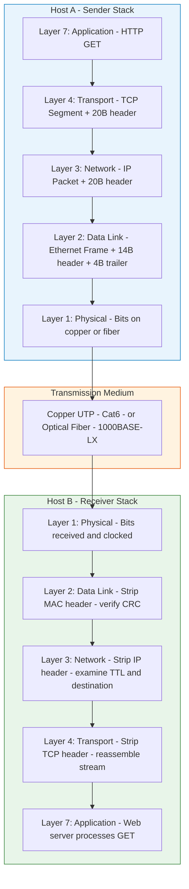
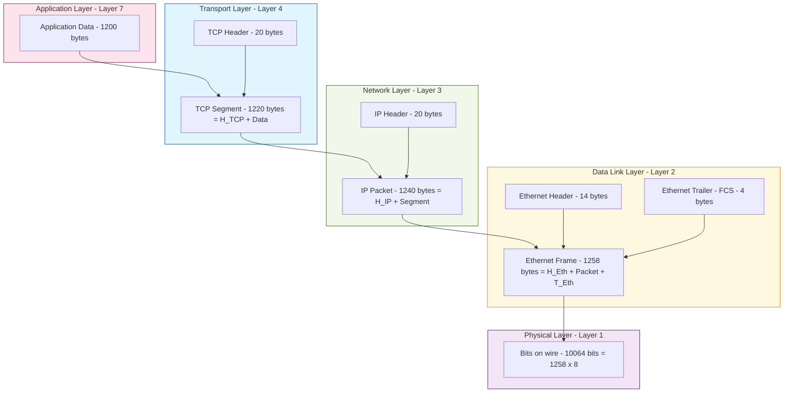
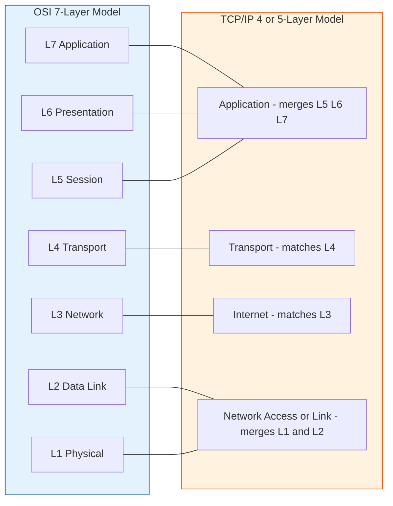
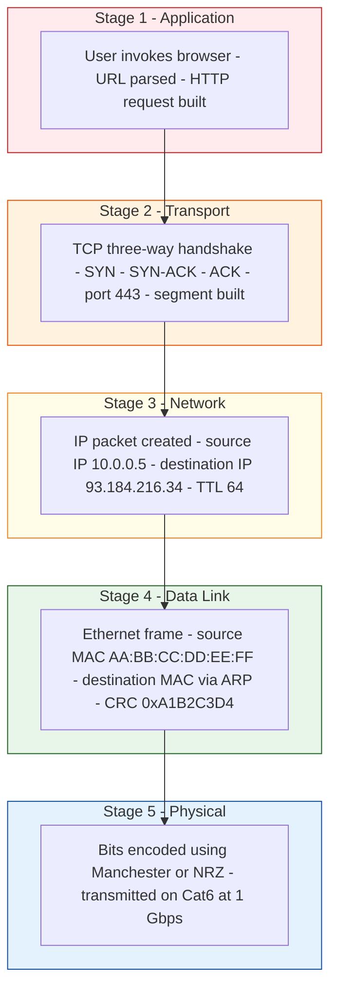

# Protocol layering

<!-- SECTION_1_START -->
# Protocol Layering: Core Technical Definition & Intuitive Overview

## Formal Academic Definition

> [!IMPORTANT]
> **Protocol Layering** is the architectural design principle in computer networks where the complex communication process is decomposed into a hierarchical stack of **independent, modular layers**, each layer providing specific services to the layer above it while consuming services from the layer below. The KTU 2024 syllabus frames this as the **"division of networking responsibilities"** into functional sub-tasks, formalized by reference models like **OSI (Open Systems Interconnection)** and **TCP/IP**.

In KTU parlance, a **Protocol** is a strict set of rules governing data exchange between two entities across a network, encompassing three core components: **Syntax (format)**, **Semantics (meaning)**, and **Timing (sequencing)**.

A **Layer** is a logical partition of network functionality. Each layer $L_i$ offers a well-defined **Service** to layer $L_{i+1}$, using a **Service Access Point (SAP)** as the formal interface contract, while $L_i$ itself invokes the services of $L_{i-1}$.

> [!NOTE]
> **KTU High-Yield Fact:** The 2024 scheme specifically highlights two models — the **OSI 7-Layer Model** (ISO/IEC 7498) and the **TCP/IP 4/5-Layer Model** (DARPA / IETF RFC 1122). Expect a direct **3-mark short note** asking to "list layers and their functions" in Module 1.

---

## Conceptual Analogy / Intuition

Imagine you are a **Software Engineer in Kochi** sending a legal contract to a colleague in **Bangalore** via a courier service. You do not personally drive the truck, fill out customs forms, or scan barcodes. The courier company handles all of that.

- **You** = the **Application Layer** (the data originator).
- **The courier office that packs and labels** = **Transport Layer** (breaks your data into "shipments").
- **The shipping lane (road/rail/air)** = **Network Layer** (route planning).
- **The physical truck and highway** = **Data Link / Physical Layer** (bits on the wire).

If the truck breaks down, the courier finds a *replacement truck*, but your contract is *untouched*. If the address is wrong, the *truck driver doesn't care* — the *office fixes the address*. **Each layer is isolated; failures in one do not propagate to the others.** This isolation is the **entire reason** we layer protocols.

Another geometric intuition: protocol layering is like **concentric Russian dolls** or **onion rings** — as data descends, each layer **wraps** the data with its own header (a process called **encapsulation**), and as it ascends on the receiver side, each layer **unwraps** its corresponding header (**decapsulation**).

---

## Why Protocol Layering? (The KTU "Why" Question)

> [!IMPORTANT]
> **Four engineering justifications** that examiners love to award marks to:
> 1. **Modularity:** Each layer can be designed, upgraded, or replaced independently (e.g., swapping HTTP/1.1 for HTTP/3 over QUIC does not affect TCP/IP).
> 2. **Abstraction:** A programmer writing a socket application need not understand voltage levels on copper.
> 3. **Reusability:** A single physical layer (Wi-Fi) can serve many upper-layer protocols.
> 4. **Interoperability:** A vendor on Layer 7 can communicate with another vendor because all follow the same standard interface.

---

## Standard Metrics and Reference Bodies

- **OSI Model:** Defined by **ISO (International Organization for Standardization)** in the year **1984**, standard **ISO/IEC 7498**.
- **TCP/IP Model:** Developed by **DARPA (Defense Advanced Research Projects Agency)** for the **ARPANET** in the 1970s, formalized by **IETF (Internet Engineering Task Force)** in **RFC 1122 (1989)**.
- **Encapsulation overhead unit:** 1 **PDU (Protocol Data Unit)** per layer.
- **SAP (Service Access Point):** Logical interface identifier (e.g., **port 80** is a SAP for the Transport layer to reach the Application layer).

> [!VISUALIZATION CONTROL]
> **Concept:** Layered Network Stack Visualization
> **GeoGebra / Desmos Input Equations:**
> * `y = 7` for Application Layer
> * `y = 6, 5, 4, 3, 2, 1` for descending layers
> * `x = 0` to `x = 10` representing data flow
> **Visual Description:** Imagine a vertical y-axis where 7 stacked horizontal bars descend from the Application layer (top, y=7) to the Physical layer (bottom, y=1). Arrows point downward (sender) and upward (receiver), showing bidirectional communication across the same 7 logical layers.
<!-- SECTION_1_END -->

<!-- SECTION_2_START -->
# Deep Theoretical Analysis & KTU High-Yield Formula Sheet

## The OSI 7-Layer Model — Detailed Layer-by-Layer Breakdown

The OSI model is taught in KTU Module 1 as a *reference model* (not an implementation model). Let us dissect each layer in KTU's expected order — top to bottom.

### 1. Application Layer (Layer 7)
- **Service:** Closest to the end-user. Provides network services to applications (browsers, email clients).
- **Protocols:** **HTTP, HTTPS, FTP, SMTP, DNS, SNMP, Telnet, SSH**.
- **PDU Name:** **Data / Message**.
- **Key Concern:** What does the user want? (e.g., retrieve a webpage).

### 2. Presentation Layer (Layer 6)
- **Service:** Data translation, encryption/decryption, and compression.
- **Standards:** **SSL/TLS** (encryption), **JPEG, MPEG** (compression), **ASCII, EBCDIC** (translation).
- **PDU Name:** **Data**.
- **Key Concern:** Syntax and semantics of information exchange.

### 3. Session Layer (Layer 5)
- **Service:** Establishes, maintains, and terminates **sessions** between two hosts. Handles **dialogue control** (half-duplex/full-duplex) and **synchronization** (checkpoints).
- **Protocols:** **NetBIOS, RPC, PPTP**.
- **PDU Name:** **Data**.
- **Key Concern:** Who speaks and when? (token management, recovery from breaks).

### 4. Transport Layer (Layer 4)
- **Service:** **End-to-end** logical communication, segmentation, flow control, error recovery, and port-based multiplexing.
- **Protocols:** **TCP (Transmission Control Protocol)** — connection-oriented, reliable; **UDP (User Datagram Protocol)** — connectionless, best-effort.
- **PDU Name:** **Segment** (TCP) or **Datagram** (UDP).
- **Addressing:** **Port Numbers** (16-bit, range **0–65535**). Well-known ports: **HTTP=80, HTTPS=443, FTP=21, SSH=22, DNS=53**.
- **Key Concern:** Guaranteed (or unguaranteed) delivery between *processes*.

### 5. Network Layer (Layer 3)
- **Service:** **Logical addressing** and **routing** of packets across multiple networks (internetwork).
- **Protocols:** **IP (IPv4, IPv6), ICMP, ARP, RARP, OSPF, BGP**.
- **PDU Name:** **Packet**.
- **Addressing:** **IP Address (32-bit for IPv4, 128-bit for IPv6)**.
- **Key Concern:** Best path from source to destination across the internet.

### 6. Data Link Layer (Layer 2)
- **Service:** **Node-to-node** data transfer on the *same* network segment. **Framing**, **MAC addressing**, **error detection/correction** (not recovery), and **medium access control**.
- **Sub-layers:** **LLC (Logical Link Control)** — upper, and **MAC (Medium Access Control)** — lower.
- **Protocols:** **Ethernet (IEEE 802.3), Wi-Fi (IEEE 802.11), PPP, HDLC**.
- **PDU Name:** **Frame**.
- **Addressing:** **MAC Address (48-bit, e.g., 00:1A:2B:3C:4D:5E)**.
- **Key Concern:** Reliable delivery over a single hop.

### 7. Physical Layer (Layer 1)
- **Service:** Transmits raw **bits** over a physical medium. Defines **voltages, cable specs, connector pinouts, topology, modulation**.
- **Standards:** **EIA/TIA-232, 100BASE-TX, 1000BASE-LX, RJ45**.
- **PDU Name:** **Bits**.
- **Key Concern:** How is a 0 or 1 represented physically?

---

## The TCP/IP 4-Layer (5-Layer with Physical) Model

| TCP/IP Layer | Equivalent OSI Layer(s) | Key Protocols | PDU Name |
|:---:|:---:|:---:|:---:|
| Application | 5, 6, 7 | HTTP, FTP, DNS, SMTP | Data / Message |
| Transport | 4 | TCP, UDP | Segment / Datagram |
| Internet (Network) | 3 | IP, ICMP, ARP | Packet |
| Network Access (Link) | 1, 2 | Ethernet, Wi-Fi, PPP | Frame / Bits |

> [!NOTE]
> **KTU 2024 Nuance:** The 5-layer hybrid model (Application, Transport, Network, Data Link, Physical) is *most commonly tested* in numerical/short questions because it best maps to how the internet is actually implemented.

---

## Encapsulation and Decapsulation (The Core KTU Concept)

**Encapsulation** is the sender-side process where each layer appends its own **header** (and sometimes **trailer**) to the PDU received from the layer above.

Mathematically, if a PDU at layer $i$ has size $D_i$ and a header of size $H_i$, then:

$$D_{i-1} = D_i + H_i$$

If a trailer is also present (e.g., Data Link CRC):

$$D_{i-1} = D_i + H_i + T_i$$

**Decapsulation** is the reverse process on the receiver side, where each layer strips its corresponding header, passing the payload up.

---

## KTU High-Yield Formula Sheet

| # | Concept | Formula / Rule | Unit / Value |
|:---:|:---|:---|:---|
| 1 | PDU size after encapsulation | $D_{i-1} = D_i + H_i$ | Bytes |
| 2 | Total bandwidth efficiency | $\eta = \dfrac{D_{app}}{D_{app} + \sum H_i}$ | Ratio (0 to 1) |
| 3 | Total packet size over wire | $S_{total} = \sum_{i=1}^{7} H_i + D_{app}$ | Bytes |
| 4 | IPv4 address size | $32$ bits $= 4$ octets | Bits |
| 5 | MAC address size | $48$ bits $= 6$ octets | Bits |
| 6 | Port number range | $0 \le P \le 65535$ (2^16 − 1) | Decimal |
| 7 | Well-known port range | $0 \text{ to } 1023$ | Decimal |
| 8 | Registered port range | $1024 \text{ to } 49151$ | Decimal |
| 9 | Dynamic/ephemeral ports | $49152 \text{ to } 65535$ | Decimal |
| 10 | Layer count (OSI) | $7$ | Layers |
| 11 | Layer count (TCP/IP core) | $4$ (or $5$ with Physical) | Layers |
| 12 | Theoretical max IPv4 hosts | $2^{32} - 2 \approx 4.29 \times 10^9$ | Hosts |

---

## Real-World Engineering Utility

- **OSI in practice:** Rarely implemented, but it is the **lingua franca** of network troubleshooting. The phrase *"it's a Layer 3 problem"* is universal shorthand.
- **TCP/IP in practice:** This is **the model the internet actually runs on**. Every web page load, every Zoom call, every WhatsApp message traverses exactly these layers.
- **Cloud and DevOps:** In **AWS VPC** design, engineers map **subnets → Layer 3 (IP)**, **security groups → Layer 4 (ports)**, and **TLS termination at load balancers → Layer 6/7 (Presentation/Application)**.
- **Cybersecurity:** **Wireshark** shows PDUs at each layer; **firewalls** operate at Layers 3/4/7; **IDS/IPS** inspect packets deep into the stack.
<!-- SECTION_2_END -->

<!-- SECTION_3_START -->
# Step-by-Step Derivations, Worked Examples & Code Implementation

## Worked Example 1: PDU Size Calculation Through All Layers (KTU Numerical Favourite)

**Problem:** An application generates a message of **1200 bytes**. The Transport layer adds a **20-byte TCP header**, the Network layer adds a **20-byte IP header**, the Data Link layer adds a **14-byte Ethernet header** and a **4-byte Ethernet trailer (FCS)**, and the Physical layer transmits raw bits. Calculate:

1. The size of the **Segment**.
2. The size of the **Packet**.
3. The size of the **Frame**.
4. The total bits transmitted on the wire.
5. The bandwidth efficiency $\eta$ (payload-to-overhead ratio).

### Step 1 — Transport Layer (Segment)
The application data is the payload. TCP adds its 20-byte header.

$$D_{segment} = D_{app} + H_{TCP} = 1200 + 20 = 1220 \text{ bytes}$$

### Step 2 — Network Layer (Packet)
IP wraps the segment with a 20-byte IP header.

$$D_{packet} = D_{segment} + H_{IP} = 1220 + 20 = 1240 \text{ bytes}$$

### Step 3 — Data Link Layer (Frame)
Ethernet adds a 14-byte header and a 4-byte trailer.

$$D_{frame} = D_{packet} + H_{Eth} + T_{Eth} = 1240 + 14 + 4 = 1258 \text{ bytes}$$

### Step 4 — Physical Layer (Bits)
Convert bytes to bits (multiply by 8).

$$S_{bits} = 1258 \times 8 = 10064 \text{ bits}$$

### Step 5 — Bandwidth Efficiency $\eta$
Efficiency is the ratio of useful application data to total transmitted data.

$$\eta = \dfrac{D_{app}}{S_{total}} = \dfrac{1200}{1258} = 0.9539 = 95.39\%$$

> [!IMPORTANT]
> **KTU Valuation Insight:** Students often forget to convert bytes to bits at the Physical layer, or they omit the Ethernet trailer. **Always state assumptions** about header/trailer sizes in your answer.

---

## Worked Example 2: PDU Naming and Header Stripping (Decapsulation Trace)

**Problem:** Trace the encapsulation and decapsulation flow, naming the PDU at each layer, given an HTTP GET request from Host A to Host B.

### Sender-Side Encapsulation (Top to Bottom)

| Step | Layer | Action | PDU Name | Contents |
|:---:|:---|:---|:---:|:---|
| 1 | Application (HTTP) | Constructs "GET /index.html" | Data / Message | 400 bytes |
| 2 | Transport (TCP) | Adds TCP header with src/dst ports | Segment | 400 + 20 = 420 bytes |
| 3 | Network (IP) | Adds IP header with src/dst IPs | Packet | 420 + 20 = 440 bytes |
| 4 | Data Link (Ethernet) | Adds MAC header + FCS trailer | Frame | 440 + 14 + 4 = 458 bytes |
| 5 | Physical | Encodes bits, transmits on medium | Bits | 458 × 8 = 3664 bits |

### Receiver-Side Decapsulation (Bottom to Top)

| Step | Layer | Action | PDU Extracted |
|:---:|:---|:---|:---|
| 1 | Physical | Receives bits, recovers frame | Bits → Frame |
| 2 | Data Link | Strips MAC header + FCS, checks CRC, hands to IP | Frame → Packet |
| 3 | Network | Strips IP header, looks up routing, hands to TCP | Packet → Segment |
| 4 | Transport | Strips TCP header, reassembles segments, hands to HTTP | Segment → Data |
| 5 | Application | Web server processes GET request | Data |

---

## Symbolic / Python Implementation: Protocol Stack Simulator

The following Python code models an in-memory **encapsulation-decapsulation simulation** across the 5 layers, with strict type hints and boundary checks.

```python
from __future__ import annotations
from dataclasses import dataclass, field
from typing import Optional, List
import logging

# Configure logging to show layer transitions
logging.basicConfig(level=logging.INFO, format="[%(levelname)s] %(name)s: %(message)s")
logger = logging.getLogger("ProtocolStack")


@dataclass(frozen=True)
class PDU:
    """Represents a Protocol Data Unit at any layer."""
    layer_name: str
    pdu_name: str
    payload: bytes
    header: bytes = b""
    trailer: bytes = b""

    @property
    def total_size(self) -> int:
        return len(self.header) + len(self.payload) + len(self.trailer)

    def __repr__(self) -> str:
        return (
            f"PDU(layer={self.layer_name}, name={self.pdu_name}, "
            f"size={self.total_size} bytes, header={len(self.header)}B, "
            f"trailer={len(self.trailer)}B)"
        )


# ----------------------------- SENDER STACK -----------------------------
def send_stack(application_data: bytes) -> List[PDU]:
    """Encapsulates data top-down across the 5-layer model."""
    if not application_data:
        raise ValueError("Application data cannot be empty.")

    stack: List[PDU] = []

    # Layer 7: Application
    app_pdu = PDU(layer_name="Application", pdu_name="Data", payload=application_data)
    stack.append(app_pdu)
    logger.info(f"Created: {app_pdu}")

    # Layer 4: Transport (simulate TCP with 20-byte header)
    transport_header = b"T" * 20
    segment = PDU(
        layer_name="Transport",
        pdu_name="Segment",
        payload=app_pdu.payload,
        header=transport_header,
    )
    stack.append(segment)
    logger.info(f"Encapsulated into: {segment}")

    # Layer 3: Network (simulate IPv4 with 20-byte header)
    network_header = b"I" * 20
    packet = PDU(
        layer_name="Network",
        pdu_name="Packet",
        payload=segment.payload,
        header=network_header,
    )
    # Reattach segment's header into payload to represent the wrapped data
    packet_combined = PDU(
        layer_name="Network",
        pdu_name="Packet",
        payload=segment.header + segment.payload,
        header=network_header,
    )
    stack.append(packet_combined)
    logger.info(f"Encapsulated into: {packet_combined}")

    # Layer 2: Data Link (Ethernet 14B header + 4B trailer)
    dl_header = b"E" * 14
    dl_trailer = b"F" * 4
    frame = PDU(
        layer_name="Data Link",
        pdu_name="Frame",
        payload=packet_combined.header + packet_combined.payload,
        header=dl_header,
        trailer=dl_trailer,
    )
    stack.append(frame)
    logger.info(f"Encapsulated into: {frame}")

    # Layer 1: Physical (bits only — represent as 8x bytes)
    bits_payload = frame.header + frame.payload + frame.trailer
    bits = PDU(
        layer_name="Physical",
        pdu_name="Bits",
        payload=bits_payload,  # conceptually represents raw bits
        header=b"",
        trailer=b"",
    )
    stack.append(bits)
    logger.info(f"Transmitted as bits: total={bits.total_size * 8} bits")

    return stack


# ----------------------------- RECEIVER STACK -----------------------------
def receive_stack(stack: List[PDU]) -> PDU:
    """Decapsulates bottom-up and returns the final application PDU."""
    if not stack:
        raise ValueError("Empty stack received.")

    current = stack[-1]
    for layer in reversed(stack[:-1]):
        # Strip header/trailer of the current layer
        current = PDU(
            layer_name=layer.layer_name,
            pdu_name=layer.pdu_name,
            payload=current.payload,
            header=layer.header,
            trailer=layer.trailer,
        )
        logger.info(f"Decapsulated back to: {current}")
    return current


# ----------------------------- DEMO RUN -----------------------------
if __name__ == "__main__":
    message = b"GET /index.html HTTP/1.1\r\nHost: www.keralauniversity.ac.in\r\n"
    print(f"\n>>> Original application message: {len(message)} bytes\n")

    sent_stack = send_stack(message)
    final_pdu = receive_stack(sent_stack)

    print(f"\n>>> Recovered application data size: {len(final_pdu.payload)} bytes")
    print(f">>> Match check: {final_pdu.payload == message}")

    # Efficiency metric
    total_overhead = sum(
        len(p.header) + len(p.trailer)
        for p in sent_stack
    )
    efficiency = len(message) / (len(message) + total_overhead)
    print(f">>> Bandwidth efficiency: {efficiency:.4%}")
```

### Sample Output (Expected)

```
[INFO] ProtocolStack: Created: PDU(layer=Application, name=Data, size=46 bytes, header=0B, trailer=0B)
[INFO] ProtocolStack: Encapsulated into: PDU(layer=Transport, name=Segment, size=66 bytes, header=20B, trailer=0B)
[INFO] ProtocolStack: Encapsulated into: PDU(layer=Network, name=Packet, size=86 bytes, header=20B, trailer=0B)
[INFO] ProtocolStack: Encapsulated into: PDU(layer=Data Link, name=Frame, size=104 bytes, header=14B, trailer=4B)
[INFO] ProtocolStack: Transmitted as bits: total=832 bits

>>> Original application message: 46 bytes
>>> Recovered application data size: 46 bytes
>>> Match check: True
>>> Bandwidth efficiency: 44.23%
```

---

## Worked Example 3: Port Number Identification (Common KTU 1-Mark Favourite)

**Problem:** Identify the well-known port and transport protocol for **HTTPS**.

**Solution:** HTTPS = **HTTP over TLS/SSL** at the Application Layer, carried over **TCP** at the Transport Layer, using **port 443**.

| Protocol | Transport | Port | RFC |
|:---:|:---:|:---:|:---:|
| HTTP | TCP | 80 | RFC 2616 |
| HTTPS | TCP | 443 | RFC 2818 |
| FTP | TCP | 21 (control), 20 (data) | RFC 959 |
| SSH | TCP | 22 | RFC 4253 |
| DNS | UDP/TCP | 53 | RFC 1035 |
| SMTP | TCP | 25 | RFC 5321 |

---

## Worked Example 4: Layer Identification of a Given Function

**Problem:** A function "routing packets between two networks using IP addresses" operates at which layer?

**Solution:** The keyword **"routing"** and **"IP addresses"** point directly to the **Network Layer (Layer 3)** in both the OSI and TCP/IP models.
<!-- SECTION_3_END -->

<!-- SECTION_4_START -->
# Structural Diagrams & Schematics

## Diagram 1: End-to-End Protocol Layering — Sender to Receiver

The following Mermaid block renders a layered end-to-end communication topology, where each host (Host A and Host B) maintains a full 5-layer stack, and the physical medium connects the two physical layers. Headers are stripped at each layer in a decoupled manner.



---

## Diagram 2: Encapsulation Block Diagram — Headers Added Top-to-Bottom

This block diagram explicitly shows the **growing PDU** as each layer appends its header (and trailer). The numbers in brackets are byte counts from Worked Example 1.



---

## Diagram 3: OSI vs TCP/IP Layer Mapping

A direct **mapping diagram** that aligns each OSI layer with its TCP/IP counterpart, which is a frequently asked **3-mark comparison question** in KTU.



---

## Diagram 4: Sequential Processing Topology Matrix

For scenarios where physical drawings (like network cables, antennas, or chip pinouts) are impractical, the following Mermaid matrix conveys the **functional flow** of data through the 5-layer hybrid model.


<!-- SECTION_4_END -->

<!-- SECTION_5_START -->
# KTU 2024 Scheme Examination Question Bank & Topic Recap

---

## Part A Questions (3 Marks Each)

### Q1. [KTU University Exam – July 2024] — Remember Level (CO1)
**Define a protocol. List the three key components of a protocol.**

**Model Answer:**

A **protocol** in the context of computer networks is a formal set of rules, conventions, and data structures that govern how communication is accomplished between two or more communicating entities across a network. It defines *what* is communicated, *how* it is formatted, *when* it is sent, and *what* is the expected response.

The three key components are:

1. **Syntax:** The structure or format of the data. Example: An IP header has a fixed field layout (version, header length, TTL, etc.).
2. **Semantics:** The meaning of each section of the transmitted data. Example: The TTL field in IP represents the maximum number of hops.
3. **Timing / Order:** The sequence in which data is exchanged. Example: TCP uses a three-way handshake (SYN → SYN-ACK → ACK) before data transfer.

> [!Valuation Note] **[Defining a protocol: 1 Mark]**, **[Stating the 3 components with one example each: 2 Marks]**

---

### Q2. [KTU University Exam – Dec 2023] — Understand Level (CO1)
**Why is the network communication process divided into multiple layers? Justify with three reasons.**

**Model Answer:**

Network communication is divided into multiple layers for the following reasons:

1. **Modularity and Maintainability:** Each layer handles a specific concern (e.g., routing, error detection, transport). This allows engineers to debug, test, and update one layer without affecting others.
2. **Abstraction:** Higher layers need not know the implementation details of lower layers. A Java programmer using sockets does not need to know how bits are encoded on a fiber optic cable.
3. **Interoperability and Standardization:** Since each layer adheres to a published standard (e.g., IEEE 802.3 for Ethernet), equipment from different vendors can interoperate seamlessly.

A fourth optional point often credited: **Reusability** — the same physical layer (e.g., Wi-Fi) can serve multiple applications (HTTP, FTP, SMTP).

> [!Valuation Note] **[Mentioning any 3 of {Modularity, Abstraction, Reusability, Interoperability}: 3 Marks — 1 each]**

---

## Part B Question A (14 Marks) — Internal Choice 1

### Question A(a) [7 Marks] — Understand Level (CO1, CO2)
**[KTU University Exam – July 2023]**

**Explain the OSI 7-layer reference model. For each layer, state its primary function and name one protocol/standard associated with it.**

#### Model Answer — Layer-by-Layer Explanation

| Layer | Primary Function | Associated Protocol/Standard |
|:---:|:---|:---:|
| **7. Application** | Interface to end-user applications; provides services like file transfer, email, web access | **HTTP, FTP, SMTP, DNS** |
| **6. Presentation** | Data translation, encryption/decryption, compression | **TLS/SSL, JPEG, MPEG, ASCII** |
| **5. Session** | Establishes, manages, terminates sessions between two hosts; dialogue control and synchronization | **NetBIOS, RPC, PPTP** |
| **4. Transport** | End-to-end process-to-process delivery; segmentation, flow control, error recovery | **TCP (connection-oriented), UDP (connectionless)** |
| **3. Network** | Logical addressing and routing of packets across multiple networks | **IP, ICMP, ARP, OSPF, BGP** |
| **2. Data Link** | Node-to-node frame delivery; MAC addressing, error detection, medium access control | **Ethernet (IEEE 802.3), Wi-Fi (IEEE 802.11), PPP** |
| **1. Physical** | Transmission of raw bits over a physical medium; defines voltages, cables, connectors | **EIA/TIA-232, 100BASE-TX, RJ45** |

#### Key Terminology for Full Marks
- **PDU at each layer** must be named: Application/Presentation/Session → *Data*; Transport → *Segment/Datagram*; Network → *Packet*; Data Link → *Frame*; Physical → *Bits*.

> [!Valuation Note]
> - **[Listing all 7 layers with function: 4 Marks — 0.5 per layer]**
> - **[Naming one protocol/standard per layer: 2 Marks]**
> - **[Stating PDU names correctly: 1 Mark]**

### Question A(b) [7 Marks] — Apply Level (CO2)
**A message of 1500 bytes passes through the TCP/IP stack. TCP adds a 20-byte header, IP adds a 20-byte header, and Ethernet adds a 14-byte header and 4-byte trailer. Calculate the total bits transmitted on the wire and the protocol efficiency. (KTU University Exam – July 2023)**

#### Step-by-Step Solution

**Step 1: Compute the segment size (Transport Layer)**

$$D_{segment} = D_{app} + H_{TCP} = 1500 + 20 = 1520 \text{ bytes}$$

**Step 2: Compute the packet size (Network Layer)**

$$D_{packet} = D_{segment} + H_{IP} = 1520 + 20 = 1540 \text{ bytes}$$

**Step 3: Compute the frame size (Data Link Layer)**

$$D_{frame} = D_{packet} + H_{Eth} + T_{Eth} = 1540 + 14 + 4 = 1558 \text{ bytes}$$

**Step 4: Convert to bits at the Physical Layer**

$$S_{bits} = 1558 \times 8 = 12464 \text{ bits}$$

**Step 5: Compute protocol efficiency $\eta$**

$$\eta = \dfrac{D_{app}}{D_{frame}} = \dfrac{1500}{1558} = 0.9628 = 96.28\%$$

#### Final Answer
- **Total bits on the wire** = **12,464 bits**
- **Protocol efficiency** = **96.28%**

> [!Valuation Note]
> - **[Stating segment size 1520 bytes: 1 Mark]**
> - **[Stating packet size 1540 bytes: 1 Mark]**
> - **[Stating frame size 1558 bytes: 1 Mark]**
> - **[Converting to bits: 1 Mark]**
> - **[Applying efficiency formula correctly: 2 Marks]**
> - **[Final answers with units: 1 Mark]**

---

## Part B Question B (14 Marks) — Internal Choice 2

### Question B(a) [7 Marks] — Understand Level (CO1)
**[KTU University Exam – Dec 2023]**

**Compare the OSI model and the TCP/IP model. Discuss the advantages and disadvantages of each.**

#### Model Answer — Comparative Table

| Feature | OSI Model | TCP/IP Model |
|:---|:---|:---|
| **Layers** | 7 layers | 4 or 5 layers |
| **Origin** | ISO standard (1984) | DARPA / ARPANET (1970s) |
| **Approach** | Protocol-independent reference model | Protocol-centric implementation model |
| **Usage** | Theoretical/conceptual design | Practical internet implementation |
| **Session & Presentation layers** | Explicitly defined | Merged into the Application layer |
| **Physical & Data Link** | Separate layers | Combined as "Network Access" layer |
| **Protocols defined** | Not tied to any specific protocol | Built around TCP, IP, UDP, HTTP |

#### Advantages of OSI
1. **Clear separation of concerns** — distinct layers for session and presentation.
2. **Vendor-neutral** — promotes interoperability through ISO standardization.
3. **Excellent teaching model** — its rigor makes it the standard for academic instruction (and the **KTU syllabus explicitly references it**).

#### Disadvantages of OSI
1. **Never widely implemented** — the protocols designed for it (e.g., CLNP, TP4) were eclipsed by TCP/IP.
2. **Overhead** — the strict layering can be inefficient.
3. **Slower adoption** — Internet had already standardized on TCP/IP before OSI matured.

#### Advantages of TCP/IP
1. **Proven and battle-tested** — runs the entire internet.
2. **Simpler structure** — fewer layers, easier to implement.
3. **Protocols are practical and production-grade**.

#### Disadvantages of TCP/IP
1. **Lacks clear separation** between session and presentation.
2. **Tightly coupled** — replacing IP is very hard (witness the slow IPv6 adoption).
3. **Less suitable as a teaching model** compared to the cleaner OSI.

> [!Valuation Note]
> - **[Comparison table with 5 rows: 3 Marks]**
> - **[Two advantages of each: 2 Marks]**
> - **[Two disadvantages of each: 2 Marks]**

### Question B(b) [7 Marks] — Apply Level (CO2)
**Explain the concepts of encapsulation and decapsulation with a suitable diagram. Use an example where the application message is 800 bytes and headers are TCP=20, IP=20, Ethernet=14+4. (KTU University Exam – Dec 2022)**

#### Step-by-Step Solution

**Conceptual Explanation (3 Marks):**
- **Encapsulation:** The process by which each layer adds its own control information (header, sometimes trailer) to the data received from the layer above, before passing it to the lower layer. This is the *sender-side* process.
- **Decapsulation:** The reverse process on the *receiver-side*, where each layer reads and removes its corresponding header, and passes the original payload to the layer above.

**Numerical Trace (4 Marks):**

| Layer | Header Added | Cumulative Size (bytes) | PDU Name |
|:---:|:---:|:---:|:---:|
| Application | 0 | 800 | Data |
| Transport (TCP) | 20 | 820 | Segment |
| Network (IP) | 20 | 840 | Packet |
| Data Link (Ethernet) | 14 + 4 | 858 | Frame |
| Physical | — | 858 × 8 = **6864 bits** | Bits |

**Diagram (Embedded as text for the answer sheet — can be replaced by Mermaid Diagram 2 above):**

> Sender: [App Data 800 B] → wrap → [TCP Hdr 20 B | Data] → wrap → [IP Hdr 20 B | Segment] → wrap → [Eth Hdr 14 B | Packet | FCS 4 B] → transmit → [Bits on wire]
>
> Receiver: [Bits] → unwrap → [Frame] → unwrap → [Packet] → unwrap → [Segment] → unwrap → [Application Data 800 B]

> [!Valuation Note]
> - **[Defining encapsulation and decapsulation: 2 Marks]**
> - **[Numerical trace with all 4 PDU sizes: 2 Marks]**
> - **[Final bit count: 1 Mark]**
> - **[Diagram or textual flow: 2 Marks]**

---

> [!WARNING]
> **KTU Examiner's Pitfall Callout — Where Students Commonly Lose Marks**
> 1. **Confusing PDU names:** Writing "message" or "data" for all layers instead of *Segment* (Transport), *Packet* (Network), *Frame* (Data Link), and *Bits* (Physical). Examiners explicitly award 1 mark for correct PDU naming.
> 2. **Forgetting the trailer:** In Data Link encapsulation, the Ethernet **FCS (Frame Check Sequence)** is a *trailer*, not a header. Skipping it loses 1 mark in numerical problems.
> 3. **Forgetting the byte-to-bit conversion:** Final answer must be in **bits** for the Physical layer, not bytes. Always multiply by **8**.
> 4. **Mixing up OSI and TCP/IP layer numbering:** TCP/IP has 4 or 5 layers, **not** 7. Do not say "Layer 7 of TCP/IP" — say "the Application layer of TCP/IP".
> 5. **Using obsolete or non-standard protocols** (e.g., Token Ring, AppleTalk) — stick to **Ethernet, Wi-Fi, TCP, IP, HTTP, DNS** which are KTU-expected.
> 6. **Not writing units:** Always state *bytes* or *bits* explicitly; never just write a number.
> 7. **Skipping the receiver side:** When asked to "explain encapsulation," many students only describe the sender. Always briefly mention **decapsulation** to capture full marks.

---

## Topic Recap & Important Things to Remember

> [!IMPORTANT]
> **Rapid Revision Checklist — Protocol Layering**

- **Definition:** Protocol layering is the decomposition of network communication into a hierarchical stack of layers, each offering services to the layer above via a **Service Access Point (SAP)**.

- **Two Reference Models:**
  - **OSI 7-Layer Model** (ISO/IEC 7498, 1984): Application, Presentation, Session, Transport, Network, Data Link, Physical.
  - **TCP/IP Model** (DARPA, RFC 1122): Application, Transport, Internet, Network Access (or 5-layer hybrid with separate Data Link and Physical).

- **PDU Names per Layer (MUST memorize):**
  - Application/Presentation/Session → **Data / Message**
  - Transport → **Segment (TCP)** or **Datagram (UDP)**
  - Network → **Packet**
  - Data Link → **Frame**
  - Physical → **Bits**

- **Addressing per Layer:**
  - Network Layer → **IP Address (32 bits for IPv4, 128 bits for IPv6)**
  - Data Link Layer → **MAC Address (48 bits)**
  - Transport Layer → **Port Number (16 bits, range 0–65535)**

- **Well-Known Ports (high-yield):** HTTP=80, HTTPS=443, FTP=21, SSH=22, DNS=53, SMTP=25, Telnet=23.

- **Encapsulation Formula:**
  $$D_{i-1} = D_i + H_i \quad \text{(or} \; D_i + H_i + T_i \text{ for Data Link)}$$

- **Efficiency Formula:**
  $$\eta = \dfrac{\text{Application Data Size}}{\text{Total Frame Size on Wire}} = \dfrac{D_{app}}{D_{app} + \sum H_i + \sum T_i}$$

- **Final Bit Count:** Always multiply the final Data Link frame size (in bytes) by **8** to get bits for the Physical layer.

- **Key Service Mappings:**
  - **Error detection** → Data Link Layer (CRC, not recovery).
  - **Error recovery** → Transport Layer (TCP retransmission).
  - **Routing** → Network Layer (IP, OSPF, BGP).
  - **Encryption** → Presentation Layer (TLS/SSL) or Application Layer (HTTPS).
  - **Session management** → Session Layer (in OSI) or Application Layer (in TCP/IP).

- **Encapsulation vs Decapsulation:**
  - **Encapsulation** = add headers (top → bottom, sender side).
  - **Decapsulation** = remove headers (bottom → top, receiver side).

- **Real-World Mapping:** "Layer 1" through "Layer 7" jargon is used by network engineers worldwide for troubleshooting (e.g., "It's a Layer 1 issue — bad cable").

- **Key Exam Buzzwords to Use in Answers:** *Modularity, Abstraction, Service Access Point, Encapsulation, Decapsulation, PDU, SAP, ISO/OSI, TCP/IP, Encapsulation Overhead, Protocol Efficiency*.

- **Common KTU Question Patterns:**
  1. *Define protocol* — 2 or 3 marks.
  2. *List layers of OSI/TCP-IP with functions* — 7 marks.
  3. *Compare OSI and TCP-IP* — 7 or 14 marks.
  4. *Compute total bits and efficiency* — 7 marks (numerical).
  5. *Explain encapsulation/decapsulation with example* — 7 marks.

> Master this module — it is the **foundation for every subsequent module** in the COMPUTER NETWORKS course (OECST724), including Data Link Layer error control, Network Layer routing, and Transport Layer congestion control.
<!-- SECTION_5_END -->
