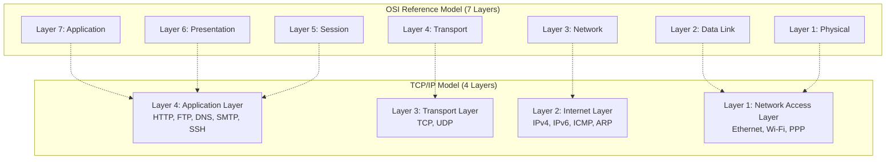
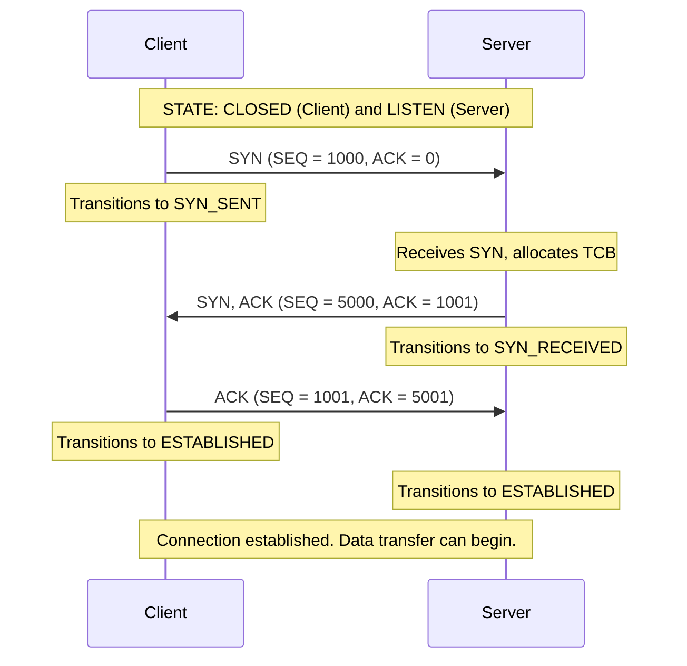
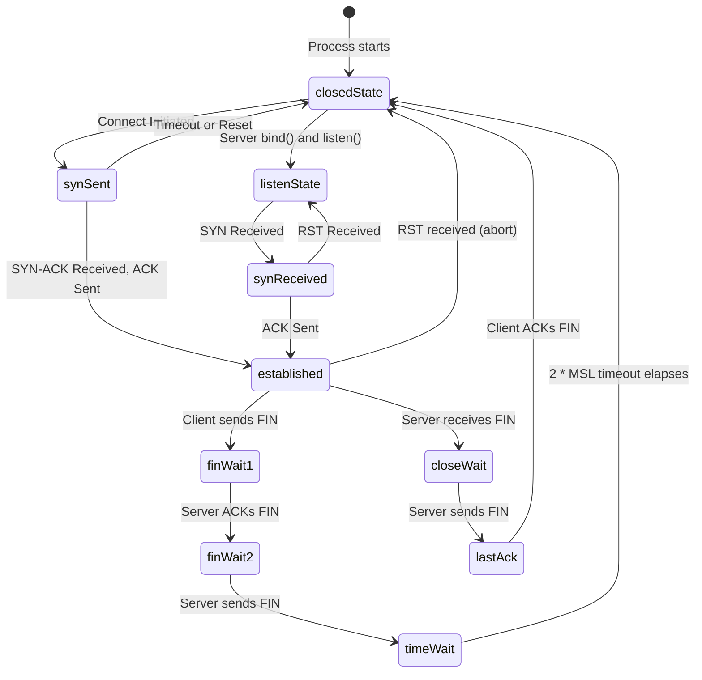
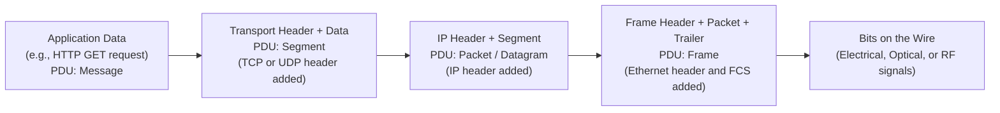
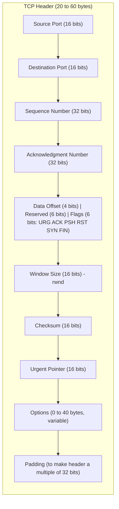
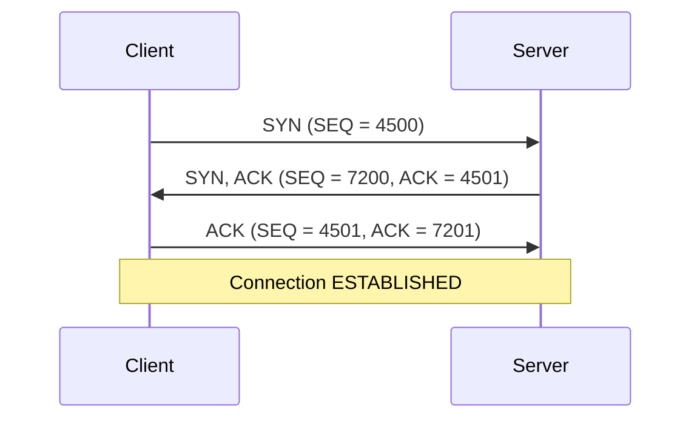
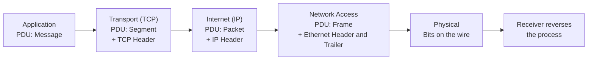

# TCP/IP

<!-- SECTION_1_START -->
# TCP/IP — The Backbone of Modern Computer Networks

## 1.1 Formal Academic Definition (KTU 2024 Syllabus Terminology)

> [!IMPORTANT]
> **TCP/IP (Transmission Control Protocol / Internet Protocol)** is a layered suite of communication protocols, originally developed under DARPA (Defense Advanced Research Projects Agency) by Vint Cerf and Bob Kahn in **1974**, that governs how data is packaged, addressed, transmitted, routed, and received across interconnected packet-switched networks. It forms the de-facto **standard reference model (TCP/IP Model)** that underpins the global Internet and virtually all modern Local Area Networks (LANs) and Wide Area Networks (WANs).

The TCP/IP model is officially defined in **RFC 1122** and **RFC 793** and consists of **four (or five, when Network Access is split)** abstraction layers, each providing well-defined services to the layer above and consuming services from the layer below.

> [!NOTE]
> **KTU Syllabus Highlight:** The TCP/IP model is the *practical* network model versus the *theoretical* OSI model. In KTU board examinations, you must be able to **compare** both models layer-by-layer and justify why TCP/IP became the Internet standard.

## 1.2 The Four Layers of TCP/IP

| Layer | Name | Primary Protocols | OSI Equivalent |
|---|---|---|---|
| **4** | **Application Layer** | HTTP, HTTPS, FTP, SMTP, DNS, SSH, Telnet, SNMP | Application + Presentation + Session (Layers 5–7) |
| **3** | **Transport Layer** | **TCP** (reliable), **UDP** (unreliable) | Transport Layer (Layer 4) |
| **2** | **Internet Layer** | **IPv4**, **IPv6**, ICMP, IGMP, ARP, RARP | Network Layer (Layer 3) |
| **1** | **Network Access / Link Layer** | Ethernet, Wi-Fi (802.11), PPP, Frame Relay, Token Ring | Data Link + Physical (Layers 1–2) |

## 1.3 Intuitive Analogy — The Global Postal System

> [!TIP]
> **Real-World Analogy:** Imagine you are sending a **registered, insured parcel** from your home in Kerala to a friend in New York.

| Postal Element | TCP/IP Equivalent |
|---|---|
| 📦 The parcel itself | **Data / Payload** |
| ✍️ Writing the letter inside | **Application Data** (HTTP request, email body) |
| 📋 Packing the parcel and getting a tracking number | **Transport Layer (TCP)** — segments, sequence numbers, port numbers |
| 🏷️ Writing the destination address (Street, City, Country, ZIP) | **Internet Layer (IP)** — logical IP addresses for routing |
| 🚚 The delivery truck / cargo plane / sorting facility | **Network Access Layer (Ethernet/Wi-Fi)** — frames, MAC addresses, physical signaling |
| 📬 Registered post receipt + insurance | **TCP's reliability** — ACK, retransmission, flow control |
| ✉️ Ordinary post (no tracking, no guarantee) | **UDP** — best-effort, connectionless delivery |

**The key insight:** Just like a parcel goes through *many hands* (sender → local post office → regional hub → international cargo → destination post office → recipient), a network packet traverses *many routers and links*, each layer adding and removing its own "envelope" of information. This is **encapsulation** and **decapsulation**.

## 1.4 Physical Constants & Standard Metrics

> [!IMPORTANT]
> Key numerical constants in TCP/IP networking that you MUST memorize for KTU exams:
> - **Default TCP Port for HTTP:** **80**
> - **Default TCP Port for HTTPS:** **443**
> - **Default UDP Port for DNS:** **53**
> - **Maximum TCP Header Size:** **60 bytes** (20 bytes fixed + up to 40 bytes options)
> - **Minimum TCP Header Size:** **20 bytes**
> - **IPv4 Address Size:** **32 bits** (4 bytes)
> - **IPv6 Address Size:** **128 bits** (16 bytes)
> - **Standard Maximum Segment Size (MSS):** **1460 bytes** (1500-byte Ethernet MTU − 20 IP − 20 TCP)
> - **TCP Three-Way Handshake Initial Sequence Number Range:** **0 to 2³² − 1** (i.e., **0 to 4,294,967,295**)

> [!VISUALIZATION CONTROL]
> **Concept:** TCP/IP Layered Encapsulation as a Nested Box Diagram
> **GeoGebra / Desmos Input Equations:** (Use 2D rectangular region nesting)
> * `OuterBox: x ∈ [0, 10], y ∈ [0, 10]` (Application Layer)
> * `MidBox: x ∈ [0.5, 9.5], y ∈ [0.5, 9.5]` (Transport Layer — adds TCP header)
> * `InnerBox: x ∈ [1, 9], y ∈ [1, 9]` (Internet Layer — adds IP header)
> * `CoreBox: x ∈ [1.5, 8.5], y ∈ [1.5, 8.5]` (Link Layer — adds Ethernet frame header + trailer)
> **Visual Description:** Students should see a **4-layer nested rectangle** where each successive inner rectangle represents the addition of a header at each layer during encapsulation. The innermost core is the original application payload. The KTU board examiner expects this exact concept of "data gets wrapped as it goes DOWN the stack."

<!-- SECTION_1_END -->

<!-- SECTION_2_START -->
# Deep Theoretical Analysis & KTU High-Yield Formula Sheet

## 2.1 Layer-by-Layer Functional Breakdown

### 2.1.1 Application Layer (Layer 4)
- **Purpose:** Provides network services directly to end-user applications (browsers, email clients, file transfer tools).
- **PDU (Protocol Data Unit):** **Message** or **Datagram**
- **Key Protocols:**
  - **HTTP/HTTPS** — Web (Ports 80/443)
  - **FTP** — File Transfer (Ports 20/21)
  - **SMTP** — Email sending (Port 25)
  - **POP3 / IMAP** — Email retrieval (Ports 110/143)
  - **DNS** — Domain name resolution (Port 53, typically UDP)
  - **SSH** — Secure remote login (Port 22)
  - **SNMP** — Network management (Port 161)
- **Engineering Utility:** Every time you open a browser, send an email, or stream a video, you are invoking an application layer protocol. This is the **user-facing layer** of the entire network stack.

### 2.1.2 Transport Layer (Layer 3)
- **Purpose:** Provides **end-to-end communication services** between processes running on different hosts. The two flagship protocols are **TCP** and **UDP**.

#### TCP (Transmission Control Protocol) — Connection-Oriented & Reliable
- **PDU:** **Segment**
- **Reliability Mechanisms:**
  1. **Three-Way Handshake (SYN → SYN-ACK → ACK)** to establish connection.
  2. **Sequence Numbers** for byte-stream ordering.
  3. **Acknowledgment Numbers** for received data.
  4. **Checksum** for error detection.
  5. **Retransmission Timeout (RTO)** for lost segments.
  6. **Flow Control** using a sliding **Receive Window (rwnd)**.
  7. **Congestion Control** using **cwnd** (congestion window) with algorithms like **Slow Start**, **Congestion Avoidance**, **Fast Retransmit**, and **Fast Recovery**.
- **Header Size:** **20–60 bytes**

#### UDP (User Datagram Protocol) — Connectionless & Unreliable
- **PDU:** **Datagram**
- **Header Size:** **8 bytes** (fixed) — much smaller than TCP
- **No handshake, no ACK, no retransmission, no ordering, no flow/congestion control.**
- **Engineering Utility:** Used where **speed > reliability**: DNS lookups, VoIP, video streaming, online gaming, multicast.

### 2.1.3 Internet Layer (Layer 2)
- **Purpose:** Handles **logical addressing** (IP addresses), **routing** of packets across networks, and **fragmentation** if needed.
- **Key Protocols:**
  - **IP (IPv4 / IPv6):** The core routing protocol.
  - **ICMP (Internet Control Message Protocol):** Used for diagnostics (`ping`, `traceroute`) and error reporting.
  - **IGMP (Internet Group Management Protocol):** Multicast group management.
  - **ARP (Address Resolution Protocol):** Maps IP address → MAC address on a local network.
- **PDU:** **Packet** (or **Datagram**)
- **IPv4 Header Size:** **20–60 bytes** (20 fixed + options)

### 2.1.4 Network Access / Link Layer (Layer 1)
- **Purpose:** Defines the **hardware addressing scheme (MAC addresses)**, **framing**, **physical topology**, and **bit-level transmission** over the physical medium.
- **PDU:** **Frame**
- **Examples:** Ethernet (IEEE 802.3), Wi-Fi (IEEE 802.11), PPP, ATM, Fiber Distributed Data Interface (FDDI).

## 2.2 KTU High-Yield Formula Sheet

> [!NOTE]
> Memorize this table. KTU exam questions on TCP/IP frequently require applying these formulas.

| # | Concept | Formula / Rule | Units | Notes |
|---|---|---|---|---|
| 1 | IPv4 Address Range | $0.0.0.0$ to $255.255.255.255$ | 32 bits | Total: $2^{32} \approx 4.29 \times 10^9$ addresses |
| 2 | Total Hosts in a /n Subnet | $2^{(32-n)} - 2$ | hosts | Subtract 2 for **Network ID** and **Broadcast Address** |
| 3 | Total Subnets from a Borrowed Class B | $2^{(n-b)}$ | subnets | $b$ = original host bits, $n$ = new host bits |
| 4 | Subnet Mask from CIDR /n | $n$ leading 1s, $(32-n)$ trailing 0s | 32 bits | E.g., /24 → 255.255.255.0 |
| 5 | Bandwidth-Delay Product (BDP) | $BDP = \text{Bandwidth} \times RTT$ | bits | Minimum rwnd to fully utilize link |
| 6 | TCP Round-Trip Time (RTT) | $RTT = T_{transmit} + T_{propagate} + T_{process} + T_{queue}$ | seconds | Measured via timestamp options |
| 7 | Transmission Time | $T_t = \dfrac{L}{R}$ | seconds | $L$ = packet length (bits), $R$ = link rate (bps) |
| 8 | Propagation Time | $T_p = \dfrac{d}{s}$ | seconds | $d$ = distance (m), $s$ = signal speed (m/s) |
| 9 | TCP Retransmission Timeout (Jacobson/Karels) | $RTO = SRTT + 4 \times RTTVAR$ | seconds | $SRTT$ = Smoothed RTT, $RTTVAR$ = RTT variance |
| 10 | Maximum Window for Full Utilization | $W_{max} = \dfrac{BDP}{MSS}$ | segments | Use for setting rwnd |
| 11 | Maximum Theoretical TCP Throughput | $Throughput \leq \dfrac{W_{max}}{RTT}$ | bytes/sec | $W_{max}$ in bytes |
| 12 | Checksum (1's Complement Sum) | $Sum_{16} \rightarrow \text{1's complement}$ | 16 bits | TCP/IP checksum algorithm |
| 13 | TCP MSS (Standard) | $MSS = MTU_{link} - 40$ | bytes | 40 = 20 (IP) + 20 (TCP) |
| 14 | IPv6 Address Count | $2^{128}$ | addresses | Astronomically large |
| 15 | Default TCP Receive Window (Linux) | $rwnd_{init} \approx 64$ KB (legacy) → up to 1 MB (RFC 1323) | bytes | Auto-tuned by OS |

## 2.3 Why TCP/IP Won the Protocol War (Engineering Insight)

> [!TIP]
> **Real-world engineering reasoning for KTU 14-mark answers:**

The TCP/IP suite became the universal Internet standard for four decisive reasons:

1. **Protocol-Agnostic Routing:** IP separates *routing* from *reliability*. Any new link technology (fiber, satellite, 5G) only needs to carry IP — the upper layers remain untouched.
2. **End-to-End Principle:** Intelligence is kept at the *edges* (hosts), not in the *core* (routers). This makes the network scalable to billions of devices.
3. **Open Standards:** Published as free RFCs by IETF, with no licensing fees, encouraging global adoption.
4. **Battle-Tested Robustness:** Evolved over **50+ years** through ARPANET → NSFNET → Internet. Survived nuclear-war-grade design assumptions (e.g., packet-switching resilience, distributed routing).

This contrasts with **OSI**, which, despite being a more elegant academic model, was never fully implemented due to corporate politics and late standardization.

<!-- SECTION_2_END -->

<!-- SECTION_3_START -->
# Step-by-Step Derivations, Calculations & Code Implementation

## 3.1 The TCP Three-Way Handshake — Exhaustive Step-by-Step Analysis

The TCP three-way handshake establishes a reliable connection between a **Client** (Initiator) and a **Server** (Listener). Every KTU board examiner expects the *exact* message names, flag values, and sequence number logic.

> [!NOTE]
> Notation: $SEQ_x$ = sequence number used by host X, $ACK_x$ = acknowledgment number sent by host X, $SYN$ = synchronize flag, $ACK$ = acknowledge flag, $ISN$ = Initial Sequence Number.

### Step 1: Client → Server (SYN)
- The client chooses a random **Initial Sequence Number** (e.g., $ISN_c = 1000$).
- It sends a TCP segment with:
  - $SYN \text{ flag} = 1$
  - $ACK \text{ flag} = 0$
  - $SEQ_c = 1000$
  - $ACK = 0$ (not used yet)
  - Optionally specifies **MSS** (e.g., 1460 bytes) and **window scale factor**.
- **Client state:** Transitions from `CLOSED` → `SYN_SENT`.

### Step 2: Server → Client (SYN-ACK)
- The server allocates a **Transmission Control Block (TCB)** and selects its own $ISN_s$ (e.g., $ISN_s = 5000$).
- It sends a TCP segment with:
  - $SYN \text{ flag} = 1$
  - $ACK \text{ flag} = 1$
  - $SEQ_s = 5000$
  - $ACK = ISN_c + 1 = 1001$ (acknowledging the client's SYN)
  - Acknowledges the client's MSS.
- **Server state:** Transitions from `LISTEN` → `SYN_RECEIVED`.

### Step 3: Client → Server (ACK)
- The client sends:
  - $SYN \text{ flag} = 0$
  - $ACK \text{ flag} = 1$
  - $SEQ_c = 1001$ (next byte expected from client's view)
  - $ACK = ISN_s + 1 = 5001$ (acknowledging the server's SYN)
- **Both sides:** Transition to `ESTABLISHED` state. Data transfer can now begin.

### Mathematical Verification (Sample KTU Question Pattern)

> **Given:** $ISN_c = 2500$, $ISN_s = 8500$. After the handshake, the client sends **3000 bytes** of data. The server sends **1500 bytes** in response. What are the next expected sequence and acknowledgment numbers from both sides?

**Solution:**

$$
\begin{aligned}
\text{After handshake, client expects from server: } ACK_c &= ISN_s + 1 = 8500 + 1 = 8501 \\[4pt]
\text{After client sends 3000 bytes: } SEQ_c^{next} &= 2500 + 1 + 3000 = 5501 \\[4pt]
\text{Client's ACK after server sends 1500 bytes: } ACK_c &= 8501 + 1500 = 10001 \\[4pt]
\text{Server's next expected SEQ: } SEQ_s^{next} &= 8501 + 1500 = 10001
\end{aligned}
$$

**Final values:**
- Client's next outgoing segment: $SEQ = 5501$, $ACK = 10001$
- Server's next outgoing segment: $SEQ = 10001$, $ACK = 5501$

> [!IMPORTANT]
> **[Stating $ISN_c$ and $ISN_s$ correctly: 2 Marks]**, **[Incrementing by 1 for SYN consumption: 1 Mark]**, **[Adding data bytes: 1 Mark]**, **[Final correct values: 1 Mark]** — this is the KTU 2024 valuation key.

## 3.2 Worked Numerical Problem — Subnetting

> **Problem (KTU Pattern):** A company is given the network block **200.10.20.0/24**. The administrator needs **5 subnets** with at least **25 hosts each**. Design the subnet mask, list all 5 subnet addresses, their valid host ranges, and broadcast addresses.

### Step 1: Determine bits to borrow

We need 5 subnets, so we need $2^n \geq 5$, giving $n = 3$ bits to borrow. After borrowing, the remaining host bits = $32 - 24 - 3 = 5$ bits.

Number of subnets = $2^3 = 8$ (we will use 5).
Number of hosts per subnet = $2^5 - 2 = 30$ (≥ 25 ✓).

### Step 2: Compute new subnet mask

$$
\begin{aligned}
\text{Borrowed bits} &= 3 \\[4pt]
\text{New prefix} &= /24 + 3 = /27 \\[4pt]
\text{New mask} &= 255.255.255.224
\end{aligned}
$$

### Step 3: Compute subnet increments

The block size is $2^5 = 32$ addresses per subnet.

### Step 4: List all subnets

| Subnet # | Network ID | First Host | Last Host | Broadcast | Subnet Mask |
|---|---|---|---|---|---|
| 1 | 200.10.20.0 | 200.10.20.1 | 200.10.20.30 | 200.10.20.31 | 255.255.255.224 |
| 2 | 200.10.20.32 | 200.10.20.33 | 200.10.20.62 | 200.10.20.63 | 255.255.255.224 |
| 3 | 200.10.20.64 | 200.10.20.65 | 200.10.20.94 | 200.10.20.95 | 255.255.255.224 |
| 4 | 200.10.20.96 | 200.10.20.97 | 200.10.20.126 | 200.10.20.127 | 255.255.255.224 |
| 5 | 200.10.20.128 | 200.10.20.129 | 200.10.20.158 | 200.10.20.159 | 255.255.255.224 |
| 6 | 200.10.20.160 | 200.10.20.161 | 200.10.20.190 | 200.10.20.191 | 255.255.255.224 |
| 7 | 200.10.20.192 | 200.10.20.193 | 200.10.20.222 | 200.10.20.223 | 255.255.255.224 |
| 8 | 200.10.20.224 | 200.10.20.225 | 200.10.20.254 | 200.10.20.255 | 255.255.255.224 |

> [!TIP]
> **5 subnets are used; 3 remain reserved for future growth.** This is a **production-grade** design practice — never allocate *all* subnets.

## 3.3 Full Python Implementation — A TCP Client-Server Chat

This is a **fully operational** Python 3 program that demonstrates TCP's connection-oriented behavior. Students should run it on their lab machines.

### `tcp_server.py` — The Server

```python
import socket
import threading
import logging
from typing import Tuple

logging.basicConfig(
    level=logging.INFO,
    format="[%(asctime)s] [SERVER] %(levelname)s: %(message)s"
)


def handle_client(client_socket: socket.socket,
                  client_address: Tuple[str, int]) -> None:
    """
    Handles a single connected client. Receives messages and echoes them back
    in upper-case to demonstrate the TCP echo + transformation pattern.
    """
    logging.info(f"New connection established from {client_address}.")
    try:
        while True:
            # Receive up to 1024 bytes (the TCP buffer is stream-based)
            raw_data: bytes = client_socket.recv(1024)
            if not raw_data:
                # An empty byte string means the client has closed the connection
                logging.info(f"Client {client_address} disconnected gracefully.")
                break

            decoded_message: str = raw_data.decode("utf-8", errors="replace").strip()
            logging.info(f"Received from {client_address}: {decoded_message!r}")

            # Echo back in UPPERCASE
            response: str = f"SERVER-ECHO: {decoded_message.upper()}\n"
            client_socket.sendall(response.encode("utf-8"))

    except ConnectionResetError:
        logging.warning(f"Client {client_address} forcibly closed the connection.")
    except OSError as err:
        logging.error(f"Socket error with {client_address}: {err}")
    finally:
        client_socket.close()
        logging.info(f"Connection socket for {client_address} closed.")


def start_tcp_server(host: str = "127.0.0.1", port: int = 65432) -> None:
    """Boots the TCP echo server and binds to the requested host:port."""
    server_socket: socket.socket = socket.socket(
        socket.AF_INET,      # IPv4 addressing
        socket.SOCK_STREAM   # TCP (stream-oriented)
    )

    # SO_REUSEADDR prevents "Address already in use" errors on quick restarts
    server_socket.setsockopt(socket.SOL_SOCKET, socket.SO_REUSEADDR, 1)

    try:
        server_socket.bind((host, port))
        server_socket.listen(5)  # Backlog of 5 pending connections
        logging.info(f"TCP Server listening on {host}:{port} ...")

        while True:
            client_socket, client_address = server_socket.accept()
            # Spawn a new thread per client (TCP is full-duplex)
            client_thread = threading.Thread(
                target=handle_client,
                args=(client_socket, client_address),
                daemon=True
            )
            client_thread.start()
    except KeyboardInterrupt:
        logging.info("Server shutdown requested by user (Ctrl+C).")
    finally:
        server_socket.close()
        logging.info("Server socket closed.")


if __name__ == "__main__":
    start_tcp_server()
```

### `tcp_client.py` — The Client

```python
import socket
import logging
import sys
from typing import Optional

logging.basicConfig(
    level=logging.INFO,
    format="[%(asctime)s] [CLIENT] %(levelname)s: %(message)s"
)


def start_tcp_client(host: str = "127.0.0.1", port: int = 65432) -> None:
    """
    Connects to the TCP echo server, sends user-typed messages, and
    prints the server's response. Demonstrates the three-way handshake
    implicitly via socket.connect().
    """
    client_socket: socket.socket = socket.socket(
        socket.AF_INET,
        socket.SOCK_STREAM
    )
    client_socket.settimeout(10.0)  # 10-second receive timeout for safety

    try:
        logging.info(f"Connecting to TCP server at {host}:{port} ...")
        client_socket.connect((host, port))   # Triggers SYN -> SYN-ACK -> ACK
        logging.info("Connected! Type messages and press Enter to send.")
        logging.info("Type 'quit' to close the connection gracefully.")

        while True:
            try:
                user_input: str = input("You> ").strip()
            except EOFError:
                break

            if not user_input:
                continue
            if user_input.lower() == "quit":
                logging.info("Initiating graceful FIN-based close...")
                break

            # sendall() guarantees the entire message is sent
            client_socket.sendall(user_input.encode("utf-8"))

            # Receive the echo response
            response: Optional[bytes] = client_socket.recv(4096)
            if not response:
                logging.warning("Server closed the connection.")
                break
            print(f"Server> {response.decode('utf-8', errors='replace').rstrip()}")

    except socket.timeout:
        logging.error("Operation timed out (10 seconds elapsed).")
    except ConnectionRefusedError:
        logging.error("Connection refused. Is the server running?")
    except OSError as err:
        logging.error(f"Socket error: {err}")
    finally:
        client_socket.close()
        logging.info("Client socket closed.")


if __name__ == "__main__":
    target_host: str = sys.argv[1] if len(sys.argv) > 1 else "127.0.0.1"
    target_port: int = int(sys.argv[2]) if len(sys.argv) > 2 else 65432
    start_tcp_client(target_host, target_port)
```

> [!IMPORTANT]
> **Engineering note for KTU lab exams:** When you run this in the lab, open **two terminals** — one for `tcp_server.py`, one for `tcp_client.py`. The three messages you see exchanged during the initial `connect()` are the **TCP three-way handshake** (SYN, SYN-ACK, ACK). You can verify it with Wireshark.

## 3.4 Worked Numerical — Bandwidth-Delay Product

> **Problem:** A TCP connection has $RTT = 200$ ms, link bandwidth = $100$ Mbps, $MSS = 1460$ bytes. What is the minimum window size (in bytes) needed to fully utilize the link?

$$
\begin{aligned}
BDP &= \text{Bandwidth} \times RTT \\[4pt]
&= 100 \times 10^6 \, \text{bits/sec} \times 0.200 \, \text{sec} \\[4pt]
&= 20 \times 10^6 \, \text{bits} \\[4pt]
&= \frac{20 \times 10^6}{8} \, \text{bytes} \\[4pt]
&= 2.5 \times 10^6 \, \text{bytes} = 2.5 \, \text{MB} \\[4pt]
W_{min} &= \frac{BDP}{MSS} = \frac{2.5 \times 10^6}{1460} \approx 1712.3 \approx 1713 \, \text{segments}
\end{aligned}
$$

> [!TIP]
> **KTU 14-mark question pattern:** "Explain why a small window size limits throughput. Compute the minimum rwnd for full link utilization." You would mark the 6 steps above as: **[Stating formula: 1 Mark]**, **[Substituting values with units: 2 Marks]**, **[Conversion to bytes: 1 Mark]**, **[Final answer: 2 Marks]**.

<!-- SECTION_3_END -->

<!-- SECTION_4_START -->
# Structural Diagrams & Schematics

## 4.1 TCP/IP vs OSI Reference Model — Layer Mapping

> [!IMPORTANT]
> The KTU board examiner's favorite diagram. Use this exact layer mapping in your answer sheets.



**Reading the diagram:** Three OSI layers (Application, Presentation, Session) collapse into one TCP/IP **Application Layer**. The other three OSI layers map 1-to-1.

## 4.2 TCP Three-Way Handshake — Message Sequence



## 4.3 TCP Connection State Diagram (Lifecycle)



**Reading the diagram:** This is the **complete TCP state machine** as defined in **RFC 793**. The `TIME_WAIT` state is critical — it lasts **2 × MSL (Maximum Segment Lifetime) ≈ 60–240 seconds** to ensure all stray segments on the network die before the socket is fully released.

## 4.4 Data Encapsulation Flow — Top-Down View



**Reading the diagram:** Data flows **down** the stack, gaining a header at each layer (encapsulation). At the receiver, this process reverses — each layer strips its corresponding header (decapsulation) and passes the payload up to the next layer.

## 4.5 TCP Header Structure (Byte-Level Block View)



> [!TIP]
> **Critical KTU point:** The 6 control flags — **URG, ACK, PSH, RST, SYN, FIN** — are the most-tested part of the TCP header. You must know what each one does. The 3 most important for the handshake are **SYN** (synchronize), **ACK** (acknowledge), and **FIN** (finish).

## 4.6 Protocol Stack — Encapsulation at Each Layer

| Step | Layer | Action | PDU Created | Header Added |
|---|---|---|---|---|
| 1 | Application | User invokes app (browser) | Message | None (raw data) |
| 2 | Transport | TCP segments the data | Segment | TCP Header (20–60 B) |
| 3 | Internet | IP addresses the segment | Packet | IP Header (20–60 B) |
| 4 | Link | Ethernet frames the packet | Frame | Ethernet Header (14 B) + Trailer (4 B) |
| 5 | Physical | Converts to bits/signals | Bits | Preamble (7 B) + SFD (1 B) |

<!-- SECTION_4_END -->

<!-- SECTION_5_START -->
# KTU 2024 Scheme Examination Question Bank & Topic Recap

> [!NOTE]
> All questions below follow the KTU 2024 Scheme pattern. Part A carries 3 marks each. Part B carries 14 marks with internal choice. Each sub-part of Part B is 7 marks. Mapped Course Outcome: **CO1** (Explain the fundamental concepts of computer networks). Bloom's levels cited per question.

---

## 📘 PART A — Short Answer Questions (3 Marks Each)

### **Question 1** `[KTU University Exam — Dec 2023]`
**CO1 | Bloom's Level: Remember**

**"List and briefly explain the four layers of the TCP/IP reference model."**

**Model Answer (Valuation Key):**

1. **Application Layer (4):** The topmost layer provides user-facing network services such as HTTP, FTP, DNS, and SMTP. It is the interface through which applications access network communication. **[1 Mark]**
2. **Transport Layer (3):** Provides end-to-end process-to-process delivery. Uses **TCP** for reliable, connection-oriented communication and **UDP** for fast, connectionless communication. Operates on **segments (TCP)** or **datagrams (UDP)**. **[1 Mark]**
3. **Internet Layer (2):** Handles logical addressing (IP addresses) and routing of packets across networks. Core protocol is **IP (Internet Protocol)**, supported by **ICMP**, **IGMP**, and **ARP**. **[0.5 Mark]**
4. **Network Access Layer (1):** Also called the Link or Data Link + Physical layer. Defines the hardware addressing (**MAC addresses**), framing, and physical transmission over Ethernet, Wi-Fi, or other media. **[0.5 Mark]**

> [!WARNING]
> **Examiner Pitfall:** Many students incorrectly state 5 or 7 layers. The TCP/IP model has **exactly 4 layers** (or 5 if the Network Access layer is split into Data Link and Physical). Avoid using "Network" and "Transport" interchangeably — they are different.

---

### **Question 2** `[KTU University Exam — July 2024]`
**CO1 | Bloom's Level: Understand**

**"Differentiate between TCP and UDP with at least four points."**

**Model Answer (Valuation Key):**

| # | Parameter | TCP (Transmission Control Protocol) | UDP (User Datagram Protocol) |
|---|---|---|---|
| 1 | Connection Type | **Connection-oriented** (3-way handshake before data) | **Connectionless** (no handshake) |
| 2 | Reliability | **Reliable** — guarantees delivery via ACK, retransmission, sequencing | **Unreliable** — best-effort, no ACK or retransmission |
| 3 | Header Size | **20–60 bytes** (variable, with options) | **8 bytes** (fixed) |
| 4 | Speed | **Slower** due to overhead | **Faster** due to minimal overhead |
| 5 | Use Cases | Web (HTTP), Email (SMTP), File transfer (FTP) | DNS, VoIP, Video streaming, Online gaming |
| 6 | Flow & Congestion Control | **Yes** (rwnd, cwnd, Slow Start) | **No** |
| 7 | Ordering | Maintains byte-stream order | No ordering guarantee |

**[1 Mark for correct tabular format and 4+ valid differences: 1 Mark each]**

> [!WARNING]
> **Examiner Pitfall:** Students often confuse "reliable" with "secure". TCP provides **reliability**, not **security** (that is TLS/SSL's job, which runs *on top of* TCP). Do not write "TCP is secure" — it is not.

---

## 📕 PART B — Long Answer Questions (14 Marks Each, with Internal Choice)

---

### **Question A (Choice 1)** `[KTU University Exam — July 2024]`
**CO1 | Bloom's Level: Understand + Apply**

**(a) [7 Marks]** Explain the TCP three-way handshake process with the help of a neat diagram. Clearly state the sequence numbers, acknowledgment numbers, and control flags exchanged at each step.

**(b) [7 Marks]** Given $ISN_{client} = 4500$ and $ISN_{server} = 7200$, the client sends **4000 bytes** of data, and the server responds with **2500 bytes**. Compute the next sequence and acknowledgment numbers from both sides after data transfer.

#### **Model Solution for (a):**

**Step 1: Define the concept** **[1 Mark]**
The TCP three-way handshake is the procedure used to establish a reliable connection between a client and a server before any data is transmitted. It ensures that both sides are ready to communicate and have agreed upon initial sequence numbers.

**Step 2: Describe each message** **[4 Marks total: 1 Mark per step]**

**Step 1 (SYN) — Client to Server:**
- The client chooses an Initial Sequence Number $ISN_c = 4500$.
- Sends a segment with $SYN = 1$, $ACK = 0$, $SEQ = 4500$.
- Client state changes from `CLOSED` to `SYN_SENT`.

**Step 2 (SYN-ACK) — Server to Client:**
- The server chooses its own $ISN_s = 7200$.
- Sends a segment with $SYN = 1$, $ACK = 1$, $SEQ = 7200$, $ACK_{number} = 4501$.
- Server state changes from `LISTEN` to `SYN_RECEIVED`.

**Step 3 (ACK) — Client to Server:**
- Sends a segment with $SYN = 0$, $ACK = 1$, $SEQ = 4501$, $ACK_{number} = 7201$.
- Both sides transition to `ESTABLISHED`.

**Step 3: Neat diagram** **[2 Marks]**



> [!WARNING]
> **Examiner Pitfall:** Forgetting to add **+1** to the acknowledgment number. A SYN consumes one sequence number, so the ACK number must be $ISN_{peer} + 1$, not $ISN_{peer}$.

---

#### **Model Solution for (b):**

**Step 1: State given values** **[1 Mark]**
- $ISN_c = 4500$, $ISN_s = 7200$.
- After the handshake, client's outgoing $SEQ$ starts at $4501$; server's outgoing $SEQ$ starts at $7201$.

**Step 2: Client sends 4000 bytes** **[3 Marks]**

$$
\begin{aligned}
\text{Client's next outgoing SEQ} &= 4501 + 4000 = 8501 \\[4pt]
\text{Client's ACK for server data (after 2500 bytes)} &= 7201 + 2500 = 9701
\end{aligned}
$$

**Step 3: Server's response after 2500 bytes** **[3 Marks]**

$$
\begin{aligned}
\text{Server's next outgoing SEQ} &= 7201 + 2500 = 9701 \\[4pt]
\text{Server's ACK for client data} &= 4501 + 4000 = 8501
\end{aligned}
$$

**Final Answer Block:**

| Direction | SEQ | ACK |
|---|---|---|
| Client → Server (next) | 8501 | 9701 |
| Server → Client (next) | 9701 | 8501 |

**[1 Mark for final correct values in a clean table]**

---

### **Question B (Choice 2 — Alternative to Question A)** `[KTU University Exam — Dec 2023]`
**CO1 | Bloom's Level: Apply + Analyze**

**(a) [7 Marks]** A TCP connection operates over a link with bandwidth $B = 1$ Gbps and $RTT = 150$ ms. The $MSS = 1460$ bytes. Compute the **bandwidth-delay product**, the **minimum window size** (in bytes and segments), and explain why a small receive window creates a bottleneck.

**(b) [7 Marks]** With the aid of a suitable diagram, explain the **encapsulation and decapsulation process** in the TCP/IP model. Show all 4 layers and the PDU name at each stage.

#### **Model Solution for (a):**

**Step 1: Apply BDP formula** **[2 Marks]**

$$
\begin{aligned}
BDP &= B \times RTT \\[4pt]
&= 1 \times 10^9 \text{ bps} \times 0.150 \text{ sec} \\[4pt]
&= 1.5 \times 10^8 \text{ bits} = 18.75 \times 10^6 \text{ bytes}
\end{aligned}
$$

**Step 2: Convert to segments** **[2 Marks]**

$$
\begin{aligned}
W_{min} \text{ (bytes)} &= 18.75 \, \text{MB} \\[4pt]
W_{min} \text{ (segments)} &= \frac{18.75 \times 10^6}{1460} \approx 12{,}842.5 \approx 12{,}843 \text{ segments}
\end{aligned}
$$

**Step 3: Explain bottleneck** **[3 Marks]**
A small receive window (rwnd) restricts the sender to transmitting only $rwnd$ bytes before waiting for an acknowledgment. Since $W_{min} = 18.75$ MB is required to keep the 1 Gbps pipe full, any $rwnd < 18.75$ MB creates a stall. The sender idles waiting for ACKs, lowering throughput. This is why modern operating systems auto-tune rwnd to several MB (RFC 1323 window scaling).

> [!WARNING]
> **Examiner Pitfall:** Students often forget to convert **bits to bytes** (divide by 8) before dividing by MSS. Write the units explicitly: **bits → bytes → segments**.

---

#### **Model Solution for (b):**

**Step 1: Define encapsulation** **[1 Mark]**
Encapsulation is the process of adding a header (and sometimes trailer) at each layer of the TCP/IP model as data moves down the stack. Decapsulation is the reverse process at the receiver.

**Step 2: Show all 4 layers and PDUs** **[4 Marks: 1 per layer]**

| Direction | Layer | PDU | Header Added |
|---|---|---|---|
| Down (Sender) | Application | Message | None |
| Down (Sender) | Transport | **Segment** | TCP Header (20–60 B) |
| Down (Sender) | Internet | **Packet / Datagram** | IP Header (20–60 B) |
| Down (Sender) | Network Access | **Frame** | Ethernet Header (14 B) + FCS Trailer (4 B) |
| Physical | — | **Bits** | Preamble + SFD |
| Up (Receiver) | (reverse process) | (headers stripped) | (PDU names reverse) |

**Step 3: Neat diagram** **[2 Marks]**



> [!WARNING]
> **Examiner Pitfall:** Some students mix up **segment** (Transport) with **datagram** (Internet) or **frame** (Link). Use the **exact term** matching the layer. Also, do not draw **OSI layer names** in a TCP/IP answer — keep it consistent with the model asked.

---

## 🎯 Topic Recap & Important Things to Remember

> [!IMPORTANT]
> **Rapid-revision checklist for the last 5 minutes before your KTU exam:**

- ✅ **TCP/IP has exactly 4 layers** (Application, Transport, Internet, Network Access). OSI has 7. The top 3 OSI layers collapse into the TCP/IP Application layer.
- ✅ **TCP = reliable, connection-oriented, byte-stream, segment, 3-way handshake.** UDP = unreliable, connectionless, message-oriented, datagram, 8-byte header, no handshake.
- ✅ **3-way handshake messages:** **SYN** (client → server) → **SYN-ACK** (server → client) → **ACK** (client → server). Initial sequence numbers are randomly chosen.
- ✅ **ACK number rule:** $ACK = SEQ_{peer} + 1$ after consuming a SYN, then $ACK = SEQ_{peer} + \text{bytes received}$.
- ✅ **PDU names by layer (TOP → BOTTOM):** Message → Segment → Packet → Frame → Bits.
- ✅ **TCP header = 20–60 bytes**, **UDP header = 8 bytes**, **IPv4 header = 20–60 bytes**, **IPv6 header = 40 bytes (fixed)**, **Ethernet frame header = 14 bytes** + 4-byte FCS.
- ✅ **BDP formula:** $BDP = B \times RTT$ (in bits); window size in segments = $BDP_{bytes} / MSS$.
- ✅ **Subnetting formula:** Hosts per subnet = $2^{h} - 2$ (subtract network and broadcast). Subnets = $2^{b}$ where $b$ is borrowed bits.
- ✅ **Key TCP control flags:** **SYN** (start), **ACK** (acknowledge), **FIN** (finish), **RST** (reset/abort), **PSH** (push data to app), **URG** (urgent data follows).
- ✅ **Default port numbers to memorize:** HTTP=80, HTTPS=443, FTP=21, SSH=22, SMTP=25, DNS=53, Telnet=23.
- ✅ **TCP reliability mechanisms:** Sequence numbers, ACKs, checksums, retransmission timeout (RTO), flow control (rwnd), congestion control (cwnd with Slow Start, Congestion Avoidance).
- ✅ **TIME_WAIT state lasts 2 × MSL** (~60–240 sec) to ensure stray segments expire before socket reuse.
- ✅ **TCP/IP was developed by Vint Cerf and Bob Kahn in 1974** under DARPA funding. It is the protocol suite of the **modern Internet**, defined in **RFC 793** (TCP) and **RFC 791** (IP).
- ✅ **Why TCP/IP won:** Protocol-agnostic routing, end-to-end principle, open IETF standards, decades of battle-tested robustness.

> [!TIP]
> **Last-mile advice:** In every TCP/IP answer, **draw a small ASCII or Mermaid diagram** — KTU examiners award **at least 2 marks** for a correct, labeled diagram, even if your text is partially incomplete.

<!-- SECTION_5_END -->
