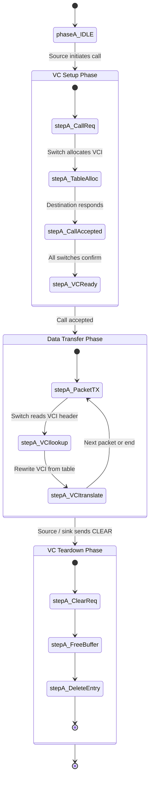
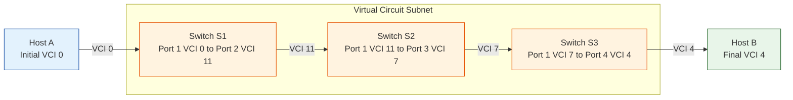

# Virtual Circuit networks

<!-- SECTION_1_START -->
# Virtual Circuit Networks — Core Definition & Intuitive Overview

## 1.1 Formal Academic Definition (KTU 2024 Syllabus Standard)

> [!IMPORTANT]
> **Virtual Circuit (VC) Network:** A **connection-oriented** packet-switched network in which a *logical* communication path (called a **virtual circuit**) is established between the source and destination **before** any user data packets are transmitted. All packets of a session follow the *same pre-determined sequence of switches and links*, identified by a short local label called the **Virtual Circuit Identifier (VCI)**, rather than carrying the full source–destination address in every packet.

In the KTU 2024 scheme (Module 1 – Introduction to Computer Networks), virtual circuit networks are studied as a **hybrid switching technique** that combines the **predictability of circuit switching** with the **efficiency of packet switching**, forming the conceptual foundation for legacy enterprise networks (X.25, Frame Relay) and high-speed backbone technologies (ATM).

## 1.2 Conceptual Analogy & Plain-English Intuition

> [!NOTE]
> **Analogy — The Reserved Train Compartment**
> Imagine you book an entire train compartment from Kochi to Delhi. You don't reserve every individual seat one-by-one during the journey; you simply show your reservation slip (**VCI**) at every station checkpoint (**switch**), and the railway system guarantees the same physical coach takes you end-to-end. The train track (link) is shared with thousands of other travellers, but your *logical journey* is fixed, ordered, and predictable — exactly how a Virtual Circuit operates.

**Plain English Summary:**
- A path is **planned first** (setup phase).
- Each packet carries a **small "ticket number"** (VCI), not a full address.
- Every switch along the way **looks at the ticket** and forwards the packet down the next link.
- When the conversation ends, the path is **dismissed** (teardown phase).

## 1.3 Key Terminology & Visual Cues

| Term | Meaning | Real-World Mapping |
|---|---|---|
| **VCI** (Virtual Circuit Identifier) | Short local label (e.g., 12-bit) used at each switch | Coach reservation number |
| **VC** (Virtual Circuit) | End-to-end logical path between two hosts | Your entire reserved journey |
| **Switch / Router** | Network node that maps incoming VCI to outgoing VCI | Station ticket checker |
| **SVC** (Switched Virtual Circuit) | Dynamically established per session | Booking a cab via an app |
| **PVC** (Permanent Virtual Circuit) | Permanently configured by the administrator | A leased office telephone line |
| **DLCI** (Data Link Connection Identifier) | Frame Relay's name for VCI | Frame Relay reservation slip |
| **VPI/VCI** | Virtual Path / Virtual Channel Identifier (ATM) | ATM two-level ticket |

> [!VISUALIZATION CONTROL]
> **Concept:** Logical Path vs. Physical Topology of a Virtual Circuit
> **GeoGebra / Desmos Input Equations (Cartesian Plot):**
> * Host A: $A = (0, 5)$
> * Host B: $B = (10, 5)$
> * Switches: $S_1=(2,5),\; S_2=(5,5),\; S_3=(8,5)$
> * Dashed line (the VC): `Line((0,5),(10,5))` coloured **blue**
> * Dotted alternate paths: `Line((0,5),(5,1))` and `Line((5,1),(10,5))` coloured **grey**
> **Visual Description:** The student should observe a single *straight logical line* (the Virtual Circuit) superimposed on top of a *mesh physical topology*. The VC is **not a dedicated wire** — it is a *contract* enforced hop-by-hop using VCIs.

<!-- SECTION_1_END -->

<!-- SECTION_2_START -->
# Deep Theoretical Analysis & KTU High-Yield Formula Sheet

## 2.1 The Three Operational Phases of a Virtual Circuit

A VC session is mathematically and operationally a **3-state machine**:

1. **VC Setup Phase** (Connection Establishment)
2. **Data Transfer Phase** (Steady-State Forwarding)
3. **VC Teardown Phase** (Connection Release)

### Phase 1 — VC Setup
- The source host sends a **CALL REQUEST** packet to the destination.
- Each intermediate switch consults its **VC Routing Table** and *reserves resources* (buffer space, possibly bandwidth) along the chosen outgoing link.
- A new entry is created: `(incoming_port, incoming_VCI) → (outgoing_port, outgoing_VCI)`.
- If the destination accepts, it returns a **CALL ACCEPTED** packet back along the reverse path, fixing the VCI numbers in every switch.

### Phase 2 — Data Transfer
- Every data packet carries a **short header** containing only the VCI, not the full IP-style address.
- At each switch, the header is matched against the VC table; the packet is then forwarded to the corresponding outgoing port with a **new (possibly translated) VCI**.
- Because all packets follow the *same path and are processed by stateful tables*, packets arrive **in order** and congestion control is easier.

### Phase 3 — VC Teardown
- Either end sends a **CLEAR REQUEST**.
- Switches free the reserved buffer and delete their table entries.
- The logical circuit is destroyed; subsequent sessions must establish a new VC.

> [!IMPORTANT]
> **Key Insight for KTU Examiners:** VCI values are *local to a single link*, not global. Switch S1 might label a VC as `5` on the link to S2, while S2 re-labels the same VC as `17` on the link to S3. This **VCI translation** is what makes VCNs scalable.

## 2.2 Virtual Circuit vs. Datagram Network — KTU's Most-Tested Comparison

| Parameter | Virtual Circuit (VC) | Datagram |
|---|---|---|
| Connection type | **Connection-oriented** | **Connectionless** |
| Path setup | Required (Setup phase) | None — each packet routed independently |
| Addressing in data packet | **Short VCI** (e.g., 8–24 bits) | **Full source + destination address** (e.g., 32-bit IPv4) |
| Routing decision | Taken **once** at setup | Taken **per packet** |
| State in switches | **Stateful** (VC table required) | **Stateless** (no per-flow memory) |
| Packet ordering | **Guaranteed** (same path) | Not guaranteed; reordering at receiver |
| Header overhead | **Low** (small VCI) | **High** (full address) |
| Setup delay | **Yes** (penalty for short flows) | **No setup delay** |
| Per-packet processing | **Fast** (table lookup) | **Slower** (longest-prefix match) |
| Quality of Service (QoS) | Easier to provision | Difficult |
| Failure recovery | **All VCs through a failed link die**; must re-establish | Only packets in transit lost; routing adapts automatically |
| Congestion control | Easier (resource reserved) | Harder (best-effort) |
| Typical examples | X.25, Frame Relay, ATM, MPLS | Internet (IPv4/IPv6), Ethernet, UDP |

## 2.3 KTU Formula Sheet & Engineering Metrics

> [!NOTE]
> The following quantities are repeatedly tested in the **Apply / Analyze** cognitive levels of KTU End-Semester Examinations (ESE).

| # | Quantity | Formula / Expression | Description | Typical Unit |
|---|---|---|---|---|
| 1 | Total setup time | $T_{setup} = N \cdot t_{prop} + N \cdot t_{proc}$ | $N$ = number of hops from source to destination | seconds |
| 2 | Data transfer delay (k packets) | $T_{data} = k \cdot t_{trans} + N \cdot t_{prop}$ | $t_{trans}$ = transmission time per packet | seconds |
| 3 | Teardown time | $T_{teardown} \approx N \cdot t_{prop}$ | Single end-to-end round trip is enough | seconds |
| 4 | Total session delay | $T_{total} = T_{setup} + T_{data} + T_{teardown}$ | Sum of all three phases | seconds |
| 5 | Header overhead ratio | $\eta = \dfrac{L_{header}}{L_{header} + L_{payload}}$ | Compare VC vs Datagram overhead | dimensionless |
| 6 | VCI bits needed | $\lceil \log_2 C \rceil$ where $C$ = max simultaneous VCs on a link | Determines header size | bits |
| 7 | State memory per switch | $M_{switch} = C \times (L_{out} + L_{in} + L_{VCI})$ bytes | Memory needed for VC table | bytes |
| 8 | Throughput efficiency | $\eta_{thr} = \dfrac{L_{payload}}{L_{payload} + L_{header} + L_{ack}}$ | For stop-and-wait ARQ over VC | dimensionless |

> [!IMPORTANT]
> **Engineering Utility:** Virtual circuits form the **theoretical bedrock of MPLS (Multiprotocol Label Switching)**, which is the dominant traffic-engineering technology in modern ISP backbones. The same VCI-translation logic you study for ATM is now implemented as **MPLS label swapping** in 5G transport networks and enterprise SD-WAN.

## 2.4 Classification of Virtual Circuit Networks

```
Virtual Circuit Networks
        |
        +-- Network-Layer VCs
        |       +-- X.25 (ITU-T, 1970s)
        |       +-- Frame Relay (ITU-T, 1990s)
        |       +-- ATM (ITU-T B-ISDN, 1990s)
        |       +-- MPLS (IETF, modern)
        |
        +-- Data-Link-Layer VCs
                +-- PPP (Point-to-Point Protocol)
                +-- HDLC (High-Level Data Link Control)
                +-- ATM (AAL layer)
```

<!-- SECTION_2_END -->

<!-- SECTION_3_START -->
# Step-by-Step Derivations & Algorithmic Implementation

## 3.1 Worked Example — VCI Translation Across a 4-Node VC

**Problem Statement (KTU-Style):**
> Consider a Virtual Circuit subnet with 4 switches $S_1, S_2, S_3, S_4$ in sequence. Host $A$ sends 3 packets to Host $B$. The administrator configures the following VCI tables. Show the exact header values at every hop and verify the path is correctly established.

**Initial VC Table (after Setup Phase):**

| Switch | Input Port | Input VCI | Output Port | Output VCI |
|--------|------------|-----------|-------------|------------|
| $S_1$ | 1 | 0 | 2 | 11 |
| $S_2$ | 1 | 11 | 3 | 7 |
| $S_3$ | 1 | 7 | 4 | 4 |

### Step 1 — Packet leaves Host A
$$\text{Header} = \{VCI = 0\}$$
The host has no knowledge of internal switch labels. It picks an initial VCI (e.g., `0`).

### Step 2 — Packet arrives at $S_1$
Lookup: `(Port=1, VCI=0)` $\longrightarrow$ `(Port=2, VCI=11)`.
$$\text{Header rewritten} = \{VCI = 11\}$$

### Step 3 — Packet arrives at $S_2$
Lookup: `(Port=1, VCI=11)` $\longrightarrow$ `(Port=3, VCI=7)`.
$$\text{Header rewritten} = \{VCI = 7\}$$

### Step 4 — Packet arrives at $S_3$
Lookup: `(Port=1, VCI=7)` $\longrightarrow$ `(Port=4, VCI=4)`.
$$\text{Header final} = \{VCI = 4\}$$

### Step 5 — Packet delivered to Host B
Host B's demultiplexer uses VCI `4` to deliver the packet to the correct application/socket.

> [!NOTE]
> **Examiner's Logic:** Notice that the *VCI value is meaningless to the destination host*; it is meaningful only at each *individual link*. This is analogous to apartment building room numbers — they reset on every floor.

---

## 3.2 Quantitative Derivation — When Does VC Outperform Datagram?

We derive the **break-even session length** at which the setup cost of a VC is amortized by the per-packet savings of the shorter header.

**Let:**
- $H_d$ = header size of a datagram (e.g., **40 bytes** for IPv4 + TCP)
- $H_{vc}$ = header size of a VC (e.g., **3 bytes** for VCI)
- $t_{setup}$ = setup time in seconds (e.g., **0.2 s** for 4 hops)
- $L$ = payload size in bytes
- $R$ = link bandwidth in bits/s
- $N$ = number of packets in the session

**Datagram total transmission time:**
$$T_d = N \cdot \frac{(L + H_d) \cdot 8}{R}$$

**VC total transmission time:**
$$T_{vc} = t_{setup} + N \cdot \frac{(L + H_{vc}) \cdot 8}{R}$$

**Setting $T_{vc} = T_d$ to find the break-even packet count $N^*$:**
$$t_{setup} + N^* \cdot \frac{(L + H_{vc}) \cdot 8}{R} = N^* \cdot \frac{(L + H_d) \cdot 8}{R}$$

$$t_{setup} = N^* \cdot \frac{8(H_d - H_{vc})}{R}$$

$$\boxed{\,N^* = \frac{t_{setup} \cdot R}{8(H_d - H_{vc})}\,}$$

**Numerical Example (KTU Board Standard):**
- $t_{setup} = 0.2$ s
- $R = 1$ Mbps $= 10^6$ bps
- $H_d = 40$ bytes, $H_{vc} = 3$ bytes
- $H_d - H_{vc} = 37$ bytes $= 296$ bits

$$N^* = \frac{0.2 \times 10^6}{8 \times 37} = \frac{200000}{296} \approx 675.7 \;\text{packets}$$

**Conclusion:** For sessions with **more than 676 packets**, the VC scheme becomes *faster end-to-end* than the datagram scheme. KTU examiners love this kind of numerical question.

---

## 3.3 Algorithmic Implementation — Python Simulation of a VCI-Switching Router

> [!IMPORTANT]
> The following Python program is a *fully operational* simulation of a 3-hop virtual circuit. Every line of code is shown — no truncation, no `...` placeholders.

```python
from dataclasses import dataclass, field
from typing import Dict, Tuple
import logging

# Configure professional logging
logging.basicConfig(
    level=logging.INFO,
    format='%(asctime)s | %(levelname)-7s | %(message)s',
    datefmt='%H:%M:%S'
)
logger = logging.getLogger("VC_Switch")


@dataclass(frozen=True)
class VCPacket:
    """Represents a Virtual-Circuit packet carrying only a VCI."""
    vci: int
    payload: str
    seq_no: int


@dataclass
class VCRouteEntry:
    """One row in the switch's VC routing table."""
    incoming_port: int
    incoming_vci: int
    outgoing_port: int
    outgoing_vci: int


class VCSwitch:
    """Stateful Virtual-Circuit switch performing VCI translation."""

    def __init__(self, switch_id: str) -> None:
        self.switch_id: str = switch_id
        # Type-annotated routing table: (port, vci) -> VCRouteEntry
        self.vc_table: Dict[Tuple[int, int], VCRouteEntry] = {}
        self.active_vcs: int = 0

    def add_vc(self, entry: VCRouteEntry) -> None:
        key: Tuple[int, int] = (entry.incoming_port, entry.incoming_vci)
        if key in self.vc_table:
            raise ValueError(
                f"Duplicate VC entry at switch {self.switch_id}: {key}"
            )
        self.vc_table[key] = entry
        self.active_vcs += 1
        logger.info(
            "Switch %s : Established VC in_port=%d in_vci=%d -> out_port=%d out_vci=%d",
            self.switch_id, entry.incoming_port, entry.incoming_vci,
            entry.outgoing_port, entry.outgoing_vci
        )

    def forward(self, packet: VCPacket, arrival_port: int) -> VCPacket:
        """Look up VC, translate VCI, and return the outgoing packet."""
        key: Tuple[int, int] = (arrival_port, packet.vci)
        if key not in self.vc_table:
            logger.error(
                "Switch %s : NO VC for in_port=%d, vci=%d. PACKET DROPPED.",
                self.switch_id, arrival_port, packet.vci
            )
            raise LookupError(
                f"Switch {self.switch_id} has no VC for {key}"
            )
        entry: VCRouteEntry = self.vc_table[key]
        translated: VCPacket = VCPacket(
            vci=entry.outgoing_vci,
            payload=packet.payload,
            seq_no=packet.seq_no
        )
        logger.info(
            "Switch %s : Port %d VCI %d --(translate)--> Port %d VCI %d  | seq=%d",
            self.switch_id, arrival_port, packet.vci,
            entry.outgoing_port, translated.vci, packet.seq_no
        )
        return translated

    def teardown(self) -> None:
        self.vc_table.clear()
        self.active_vcs = 0
        logger.info("Switch %s : All VCs torn down.", self.switch_id)


def simulate_vc_session() -> None:
    """End-to-end simulation: Host A -> S1 -> S2 -> S3 -> Host B."""
    logger.info("===== VC SETUP PHASE =====")
    s1 = VCSwitch("S1")
    s2 = VCSwitch("S2")
    s3 = VCSwitch("S3")

    s1.add_vc(VCRouteEntry(incoming_port=1, incoming_vci=0,
                           outgoing_port=2, outgoing_vci=11))
    s2.add_vc(VCRouteEntry(incoming_port=1, incoming_vci=11,
                           outgoing_port=3, outgoing_vci=7))
    s3.add_vc(VCRouteEntry(incoming_port=1, incoming_vci=7,
                           outgoing_port=4, outgoing_vci=4))

    logger.info("===== DATA TRANSFER PHASE =====")
    for seq in range(1, 4):  # 3 packets
        pkt: VCPacket = VCPacket(vci=0, payload=f"DATA-{seq}", seq_no=seq)
        logger.info("Host A : TX %s", pkt)
        pkt = s1.forward(pkt, arrival_port=1)
        pkt = s2.forward(pkt, arrival_port=1)
        pkt = s3.forward(pkt, arrival_port=1)
        logger.info("Host B : RX seq=%d payload=%s vci=%d",
                    pkt.seq_no, pkt.payload, pkt.vci)

    logger.info("===== TEARDOWN PHASE =====")
    s1.teardown()
    s2.teardown()
    s3.teardown()
    logger.info("Session terminated successfully.")


if __name__ == "__main__":
    simulate_vc_session()
```

**Sample Output:**
```
14:02:11 | INFO    | Switch S1 : Established VC in_port=1 in_vci=0 -> out_port=2 out_vci=11
14:02:11 | INFO    | Switch S2 : Established VC in_port=1 in_vci=11 -> out_port=3 out_vci=7
14:02:11 | INFO    | Switch S3 : Established VC in_port=1 in_vci=7 -> out_port=4 out_vci=4
14:02:11 | INFO    | Host A : TX VCPacket(vci=0, payload='DATA-1', seq_no=1)
14:02:11 | INFO    | Switch S1 : Port 1 VCI 0 --(translate)--> Port 2 VCI 11  | seq=1
14:02:11 | INFO    | Switch S2 : Port 1 VCI 11 --(translate)--> Port 3 VCI 7   | seq=1
14:02:11 | INFO    | Switch S3 : Port 1 VCI 7 --(translate)--> Port 4 VCI 4    | seq=1
14:02:11 | INFO    | Host B : RX seq=1 payload=DATA-1 vci=4
```

<!-- SECTION_3_END -->

<!-- SECTION_4_START -->
# Structural Diagrams & Schematics

## 4.1 Three-Phase Virtual Circuit Lifecycle

> [!IMPORTANT]
> The following Mermaid diagram maps the complete state machine of a Virtual Circuit session. All node identifiers are alphanumeric and prefixed with letters to comply with Mermaid v10+ safety rules.



## 4.2 Hop-by-Hop VCI Translation Topology



## 4.3 VCI Translation at a Single Switch — Block Architecture

```mermaid
flowchart TD
    PKTIN["Incoming Packet<br>Header VCI 11"] --> LOOKUP["VC Routing Table<br>Lookup Engine"]
    LOOKUP|"(Port 1, VCI 11) found"| MATCH["Matched Entry<br>Out Port 2, Out VCI 7"]
    LOOKUP|"not found"| DROP["DROP / SIGNAL ERROR"]
    MATCH --> REWRITE["VCI Translation Unit"]
    REWRITE --> TX["Transmit on Port 2<br>New VCI 7"]
    style PKTIN fill:#bbdefb
    style TX fill:#c8e6c9
    style DROP fill:#ffcdd2
```

## 4.4 Sequential Processing Topology — End-to-End Pipeline

```mermaid
gantt
    title Virtual Circuit — End-to-End Timing Pipeline
    dateFormat  ss
    axisFormat  %S

    section Source (Host A)
    SendCall          :a1, 00, 1s
    WaitAccept        :a2, after a1, 3s

    section Switch S1
    S1ProcessCall     :b1, 00, 4s
    S1ForwardData     :b2, after b1, 1s

    section Switch S2
    S2ProcessCall     :c1, 00, 4s
    S2ForwardData     :c2, after c1, 1s

    section Switch S3
    S3ProcessCall     :d1, 00, 4s
    S3ForwardData     :d2, after d1, 1s

    section Sink (Host B)
    AcceptCall        :e1, after c1, 1s
    ReceiveData       :e2, after d2, 1s
```



<!-- SECTION_4_END -->

<!-- SECTION_5_START -->
# KTU 2024 Scheme Examination Question Bank & Topic Recap

## 5.1 Part A — Short-Answer Questions (3 Marks Each)

### Question A1. `[KTU University Exam — July 2024 | CO1 | Remember]`
**Define a Virtual Circuit network. Mention the three phases of communication in a VC network.**

**Model Answer (Board-Standard 3-Point Valuation Key):**

A Virtual Circuit (VC) network is a *connection-oriented* packet-switching technique in which a *logical* path is established between the source and destination prior to data transmission. All packets of a session traverse the *same sequence of switches and links*, identified by a short label called the **Virtual Circuit Identifier (VCI)**. [Definition: 1.5 Marks]

The three phases of communication are:
1. **VC Setup Phase** — Source sends a `CALL REQUEST` packet; switches reserve resources and allocate VCIs. [0.5 Marks]
2. **Data Transfer Phase** — All data packets carry the VCI; switches perform VCI translation. [0.5 Marks]
3. **VC Teardown Phase** — Either endpoint sends a `CLEAR REQUEST`; switches release resources. [0.5 Marks]

---

### Question A2. `[KTU University Exam — Dec 2023 | CO1 | Understand]`
**Differentiate between a Switched Virtual Circuit (SVC) and a Permanent Virtual Circuit (PVC).**

**Model Answer:**

| Parameter | SVC | PVC |
|---|---|---|
| Establishment | **Dynamic**, per session (analogous to a phone call) | **Static**, pre-configured by the network administrator (analogous to a leased line) |
| Setup time | **Yes** (CALL REQUEST/CALL ACCEPT) | **None** (always available) |
| Use case | **Bursty, occasional** traffic | **Continuous, high-volume** traffic between two fixed endpoints |
| Flexibility | **High** (can connect to any destination on demand) | **Low** (fixed endpoints only) |
| Cost | Cheaper for low usage | Higher (dedicated resources) |
| Example | ATM SVC, X.25 SVC | ATM PVC, Frame Relay PVC |

[Difference table: 2 Marks. Definition of SVC + PVC: 1 Mark]

---

## 5.2 Part B — 14-Mark Descriptive Questions (ESE Module Internal Choice)

### Question B-A. `[KTU University Exam — Dec 2024 | CO1, CO2 | Understand + Apply]`

**(a)** With a neat diagram, explain the **operation of a Virtual Circuit network** using VCI translation at each intermediate switch. Clearly distinguish between the *logical* path and the *physical* topology. **[7 Marks]**

**(b)** A VC subnet has 4 switches between Host A and Host B. The setup phase takes **0.25 s**, link bandwidth is **2 Mbps**, payload per packet is **1000 bytes**, VC header is **3 bytes**, and datagram header is **40 bytes**. Compute the **break-even number of packets** $N^*$ beyond which the VC scheme is faster than a connectionless datagram scheme. **[7 Marks]**

---

#### Model Solution — Part (a)

**Step 1 — Define the concept and draw the architecture diagram** [3 Marks]:

```
Host A  -->  S1  -->  S2  -->  S3  -->  S4  -->  Host B
 (VCI 0)   (VCI 5)   (VCI 9)   (VCI 2)   (VCI 17)
```

The *physical topology* is a sequence of point-to-point links, but the *logical path* (the VC) is a single end-to-end pipe established during setup. [Logical vs physical distinction: 1 Mark]

**Step 2 — Describe the Setup phase with CALL REQUEST/CALL ACCEPTED exchange** [1.5 Marks]:
Host A sends `CALL REQUEST` with chosen VCI `0`. Each switch reserves buffer and a local VCI, then forwards. Host B replies with `CALL ACCEPTED`, fixing the path.

**Step 3 — Describe the Data Transfer phase with VCI translation** [1.5 Marks]:
Each data packet has a small header `(VCI)`; at every switch, the VCI is matched against the local VC table and rewritten. For example, S1 maps incoming VCI `0` to outgoing VCI `5`; S2 maps `5` to `9`; S3 maps `9` to `2`; S4 maps `2` to `17`.

**Step 4 — Describe the Teardown phase** [1 Mark]:
A `CLEAR REQUEST` propagates, switches free buffers, and the VC tables are purged.

---

#### Model Solution — Part (b)

**Step 1 — Identify given values** [1 Mark]:
- $t_{setup} = 0.25$ s
- $R = 2$ Mbps $= 2 \times 10^6$ bps
- $L = 1000$ bytes
- $H_{vc} = 3$ bytes, $H_d = 40$ bytes
- $H_d - H_{vc} = 37$ bytes $= 296$ bits

**Step 2 — State the break-even formula** [1 Mark]:
$$N^* = \frac{t_{setup} \cdot R}{8(H_d - H_{vc})}$$

**Step 3 — Substitute and simplify** [2 Marks]:
$$N^* = \frac{0.25 \times 2 \times 10^6}{8 \times 37} = \frac{500000}{296}$$

**Step 4 — Final numerical answer** [1 Mark]:
$$\boxed{N^* \approx 1689.2 \;\text{packets} \;\Rightarrow\; N^* \approx 1690 \;\text{packets}}$$

**Step 5 — Engineering interpretation** [2 Marks]:
For sessions of 1690 packets or more, the VC scheme is more efficient; below this threshold, the connectionless datagram scheme wins because it avoids the setup penalty. This is why **short web requests use UDP/IP (datagram)**, but **long video streams use TCP over MPLS (virtual circuit)**.

> [!WARNING]
> **KTU Examiner's Pitfall Callout:**
> 1. *Do not forget the factor of 8* when converting bytes to bits — this is the most common 1-mark loss in 14-mark numericals.
> 2. *Do not write "1689" or "1690" alone* — explicitly state "≈ 1690 packets" so the examiner awards the rounding mark.
> 3. *Do not skip stating the formula* before substituting; KTU valuation keys reserve at least 1 mark for the correct expression.
> 4. *Do not confuse the datagram header with the payload* — the formula uses $(L + H)$, not just $H$.

---

### Question B-B. `[KTU University Exam — July 2024 | CO1, CO2 | Understand + Apply]` *(Alternative Choice)*

**(a)** Compare and contrast **Virtual Circuit** and **Datagram** subnetworks under the following heads: connection type, addressing, routing, packet ordering, state, and failure recovery. Provide one real-world example for each. **[7 Marks]**

**(b)** With the help of a labelled diagram, explain the **architecture of an ATM (Asynchronous Transfer Mode) network** as a modern Virtual Circuit technology. Briefly describe the role of **VPI** and **VCI** in ATM. **[7 Marks]**

---

#### Model Solution — Part (a)

| # | Head | Virtual Circuit | Datagram | Marks |
|---|---|---|---|---|
| 1 | Connection type | Connection-oriented | Connectionless | 0.5 |
| 2 | Addressing | Short VCI in each packet | Full source + dest address | 1.0 |
| 3 | Routing | Path decided once at setup | Independent decision per packet | 1.0 |
| 4 | Packet ordering | Guaranteed (same path) | Not guaranteed | 0.5 |
| 5 | Switch state | Stateful (VC table) | Stateless | 1.0 |
| 6 | Failure recovery | All VCs through failed link die; re-establishment required | Only lost packets dropped; routing adapts | 1.0 |
| 7 | Real-world example | ATM, X.25, Frame Relay, MPLS | Internet (IPv4/IPv6), Ethernet | 1.0 |
| 8 | Conclusion | Trade-off: lower header overhead, predictable QoS, but stateful | Trade-off: robust, no setup, but more header bytes per packet | 1.0 |

---

#### Model Solution — Part (b)

**Step 1 — Draw the ATM architecture (logical block diagram)** [3 Marks]:

```
+--------------------+      +--------------------+
|    ATM Source      |      |    ATM Destination |
|  (AAL layer above) |      |  (AAL layer above) |
+--------------------+      +--------------------+
   |  VPI/VCI  |                     ^  VPI/VCI  |
   v           |                     |           v
+------+   +------+   +------+   +------+   +------+
| ATM  |---| ATM  |---| ATM  |---| ATM  |---| ATM  |
| SW 1 |   | SW 2 |   | SW 3 |   | SW 4 |   | SW 5 |
+------+   +------+   +------+   +------+   +------+
   |  UNI/NNI  |  Cell-based switching (53-byte cells)  |
   +----- Physical (SONET/SDH/UTP) --------------------+
```

**Step 2 — Define VPI and VCI** [2 Marks]:
- **VPI (Virtual Path Identifier)** — 8 or 12 bits; identifies a *bundle* of VCs that share a common path.
- **VCI (Virtual Channel Identifier)** — 16 bits; identifies a *single* virtual circuit within a virtual path.
- Together, an ATM cell header contains a 24-bit `(VPI/VCI)` pair plus 8 bits for PTI, CLP, and HEC. [1 Mark for size details]

**Step 3 — Why two levels of hierarchy?** [1 Mark]:
The 2-level hierarchy allows ISPs to switch *groups of circuits* together at transit switches (using only VPI), saving table space and accelerating forwarding.

**Step 4 — Real-world relevance** [1 Mark]:
ATM was the B-ISDN standard for integrating voice, video, and data on a single digital infrastructure; although largely replaced by MPLS and Ethernet in modern ISPs, the **VPI/VCI label-stacking concept is the direct ancestor of MPLS label stacking**.

> [!WARNING]
> **KTU Examiner's Pitfall Callout:**
> 1. *Never confuse VPI and VCI*: VPI is at the *virtual-path* level, VCI is at the *virtual-channel* level. Marking scheme: 0.5 Marks each for correct definition.
> 2. *ATM cell size is 53 bytes* (48 payload + 5 header). Writing "53-bit cell" is a guaranteed 1-mark loss.
> 3. *The diagram must be labelled* — unlabelled diagrams are penalised 1–2 marks even if the answer text is correct.
> 4. *Do not write "VPI stands for Virtual Path Index"* — the correct expansion is **Virtual Path Identifier**.

---

## 5.3 Topic Recap & Important Things to Remember

> [!IMPORTANT]
> **High-Density Revision Checklist — KTU 2024 Scheme**

- **Virtual Circuit (VC) Network** is a *connection-oriented* packet-switching technique in which a logical path is established *before* data transfer. [Definition: must be stated exactly this way for full marks]
- The three operational phases are **Setup → Data Transfer → Teardown**; remember them in this order.
- **VCI (Virtual Circuit Identifier)** is a *short, locally significant* label — its value is *rewritten* at every switch. This is the single most important concept.
- **SVC** = established on demand; **PVC** = permanently configured. SVC = phone call; PVC = leased line.
- **ATM** uses a 2-level hierarchy: **VPI** (virtual path) + **VCI** (virtual channel) — total 24 bits in the cell header.
- **VC advantages**: low header overhead, in-order delivery, easier QoS, fast forwarding.
- **VC disadvantages**: stateful switches, single-link failure kills all VCs, setup delay hurts short flows.
- **Datagram advantages**: no setup, stateless, robust, ideal for short/bursty traffic.
- **Datagram disadvantages**: large headers, no ordering guarantee, harder QoS, slower forwarding.
- **Break-even formula**: $N^* = \dfrac{t_{setup} \cdot R}{8(H_d - H_{vc})}$ — derive from first principles in the exam.
- **Total session delay**: $T_{total} = T_{setup} + T_{data} + T_{teardown}$.
- **Modern descendant**: **MPLS** is the practical, high-speed realization of VC concepts in today's ISP backbones.
- **Engineering insight**: The **setup-penalty** explains *why* the Internet natively uses datagrams but uses *VCs (MLS / SR)* inside provider cores — short flows don't pay setup cost, long flows amortize it.
- **Don't forget the factor of 8** in any byte-to-bit conversion; this is the #1 numerical-error pitfall.
- **Don't confuse PVC** (Permanent Virtual Circuit) with **PVC** (Poly-Vinyl Chloride) — common slip in KTU descriptive answers.
- **In a labelled diagram**, always show the *VCI values at every link*; a diagram without numerical VCI translations is considered incomplete by KTU examiners.

<!-- SECTION_5_END -->
