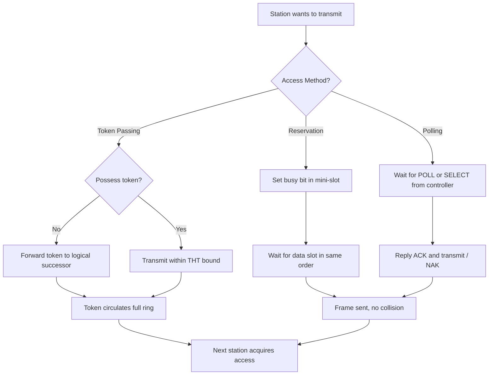
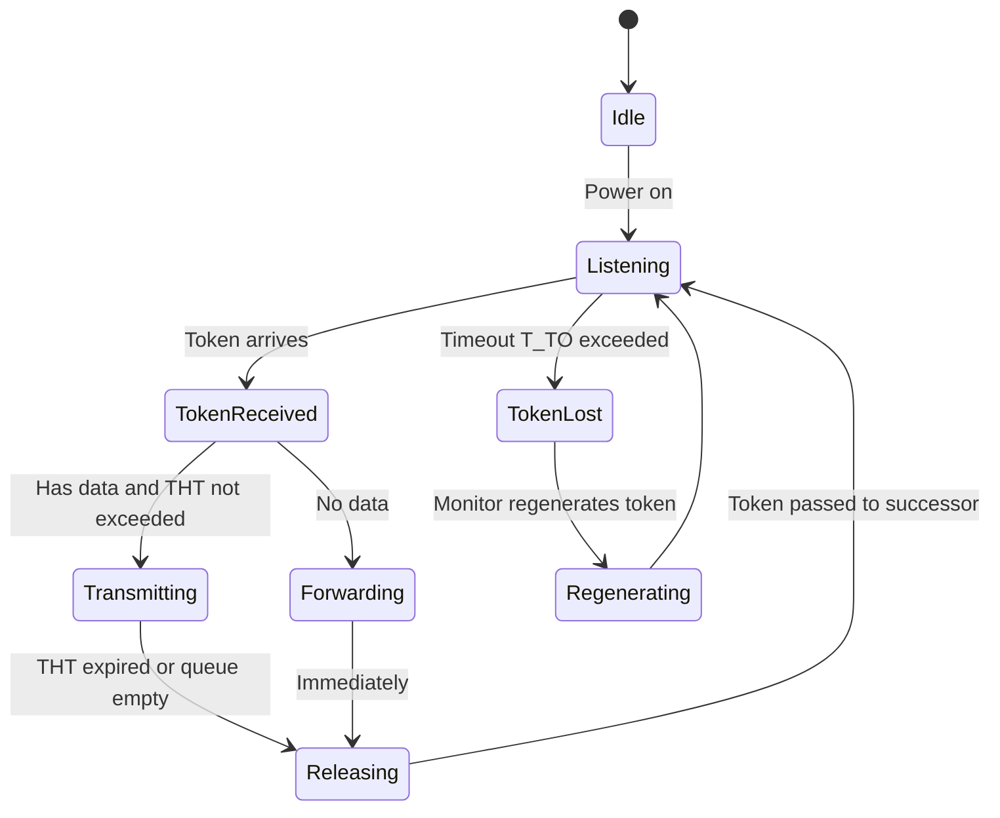
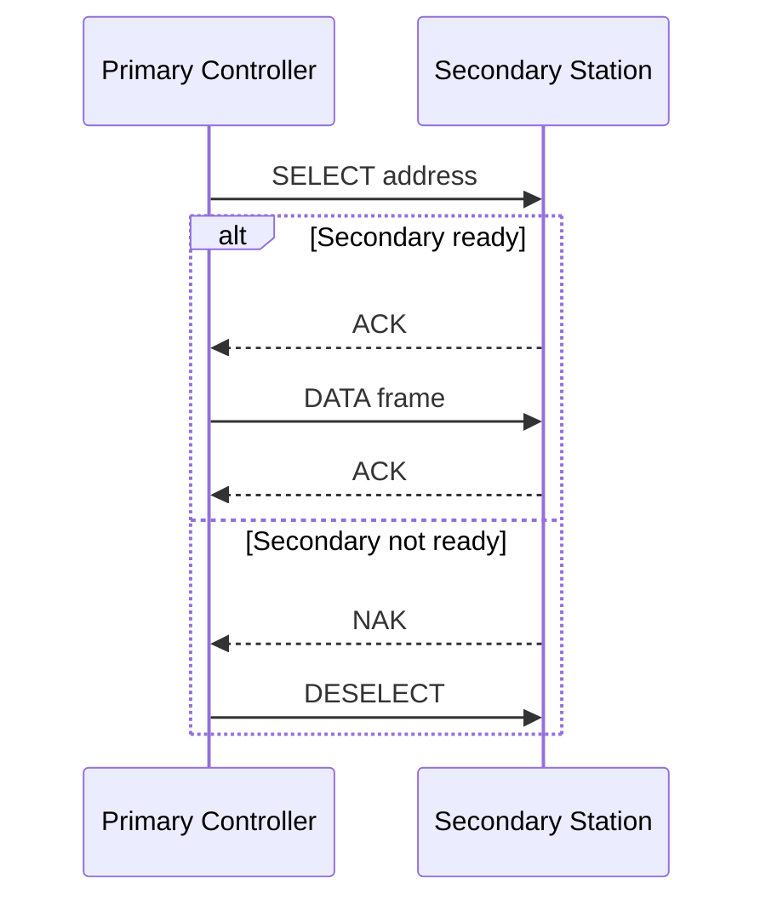
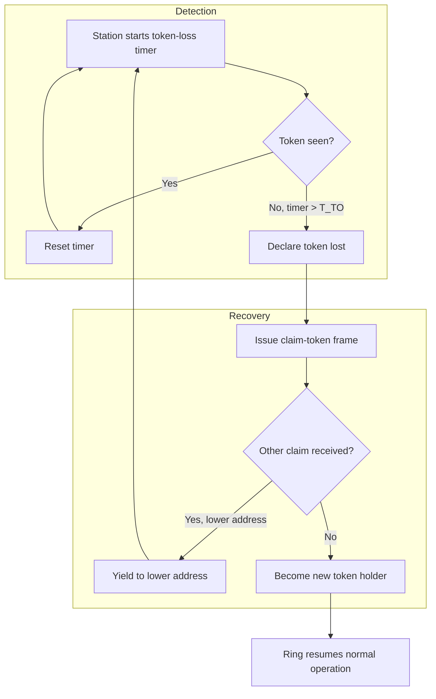
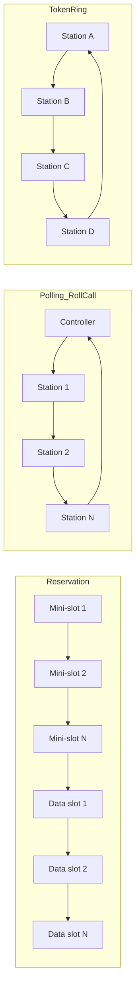

# Controlled Access

<!-- SECTION_1_START -->
# Controlled Access in Data Link Layer

## 1. Core Technical Definition & Intuitive Overview

In the **OSI Reference Model**, the **Data Link Layer (Layer 2)** is responsible for node-to-node data transfer, framing, error control, and managing access to the **shared physical medium** when multiple devices compete to transmit. Among the three classical categories of **Medium Access Control (MAC)** sub-layer strategies — *Random Access*, *Controlled Access*, and *Channelization* — **Controlled Access** occupies the deterministic, rule-based end of the spectrum.

> [!IMPORTANT]
> **KTU 2024 Syllabus Definition (OECST724 – Module 2):**
> *Controlled Access* is a Medium Access Control method in which a node can transmit only if it has been explicitly authorized by a controlling mechanism (a controller, a poll, or a circulating token). The station must first obtain permission from the shared medium before placing its frame onto the link.

### Conceptual Analogy / Intuition

Imagine a **round-table meeting with one chairperson**:
- In **Random Access** (CSMA/CD, ALOHA), anyone may stand up and speak the moment they have something to say, and if two people collide, both sit down and retry — chaotic but fast for light traffic.
- In **Channelization** (TDMA, FDMA, CDMA), the chair pre-allocates fixed time slots or frequency bands — efficient but inflexible.
- In **Controlled Access**, the chairperson (or a *talking-token*) explicitly hands the floor to one person at a time. **No one speaks without permission**, and **no two speakers ever overlap**. The cost is latency; the benefit is **zero collisions and predictable worst-case performance**.

> [!NOTE]
> **Why Controlled Access matters in KTU context:** Industrial control networks (Modbus, Token Ring legacy backbones, IEEE 802.4 Token Bus, ARCNET) and satellite / polling-based systems rely on controlled access because **deterministic upper bounds on delay** are more important than peak throughput.

### The Three Canonical Controlled-Access Protocols

The KTU 2024 Module-2 syllabus groups controlled access into **three canonical schemes**:

1. **Reservation** — time is divided into *reservation frames* and *data frames*; stations reserve future slots.
2. **Polling** — a *primary* (controller) polls *secondaries* one by one using *Select* and *Poll* functions.
3. **Token Passing** — a small 3-byte control *token* circulates station-to-station; whoever holds it may transmit.

The **physical constant / standard metric** associated with the IEEE 802.4 Token Bus standard is the **data rate of 1, 5, or 10 Mbps** over a bus, and a **maximum of 250 stations per logical ring**.

> [!VISUALIZATION CONTROL]
> **Concept:** Controlled Access vs. Random Access collision patterns on a shared bus.
> **GeoGebra / Desmos Input Equations (parametric timeline):**
> * `Station_A: (t, 1) for t in [0,2] U [4,6] U [8,10]`
> * `Station_B: (t, 2) for t in [2,4] U [6,8]`
> * `Collision_Region_Random: shaded where A and B overlap on the t-axis`
> **Visual Description:** Plot three horizontal lanes (one per station) along the time axis. Under **random access**, the lanes overlap producing collision blobs. Under **controlled access**, the lanes are mutually disjoint — no two stations transmit in the same time interval.

---

<!-- SECTION_1_END -->

<!-- SECTION_2_START -->
# 2. Deep Theoretical Analysis & KTU High-Yield Formula Sheet

## 2.1 Reservation Method

### Operating Principle

Time on the channel is divided into a continuous stream of **mini-slots** and **data-slots**. Every **frame** consists of:

- **Reservation Frame** (a.k.a. *control sub-frame*): contains $N$ mini-slots, one per station. If station $i$ wants to send, it sets mini-slot $i$ to **1** (binary *busy-bit*). This is similar to a *distributed voting mechanism*.
- **Data Frame**: contains $N$ data slots, one per station, used in the **same order** as the reservations were made.

The KTU textbook (Forouzan) describes this as: *“In the reservation method, a station needs to make a reservation before sending data. The timeline has two kinds of periods: reservation intervals and data transmission periods.”*

### Why it works

Because the *order* of grants in the data frame mirrors the *order* of set bits in the reservation frame, **no two stations can collide inside the data frame**. The only "wasted" time is the reservation interval itself.

> [!NOTE]
> **KTU High-Yield Insight:** Reservation is the conceptual ancestor of *Distributed Coordination Function (DCF)* reservation vectors in IEEE 802.11 — the **DIFS/NAV/RTS-CTS handshake** is a modern wireless form of reservation.

---

## 2.2 Polling Method

Polling requires one device to act as a **Primary Station (Controller)** and the others as **Secondary Stations**. Communication uses four well-defined frames: `POLL`, `SELECT`, `DATA-with-ACK`, and `NAK`.

### 2.2.1 Select Function

Used when the controller has **data to send** to a specific secondary.

1. Controller sends a `SELECT` frame containing the address of the intended secondary.
2. If the secondary is **ready**, it replies with `ACK`; the controller transmits the data; the secondary `ACK`s again.
3. If the secondary is **not ready**, it replies with `NAK`; the controller **deselects** it and may try later.

### 2.2.2 Poll Function

Used when the controller wants to **give the right to transmit** to a secondary.

1. Controller sends a `POLL` frame to a secondary (e.g., in round-robin order).
2. If the secondary has **data**, it sends **two consecutive frames** (an ACK to the poll + its data frame). The controller, upon receiving the data, sends an `ACK`.
3. If the secondary has **no data**, it simply replies with `NAK`, freeing the controller to poll the next station.

### 2.2.3 Three Poll-Order Variants (KTU Hot Topic)

| Poll Order | Description | KTU Exam Tip |
|---|---|---|
| **Roll-Call Polling** | Controller polls each station in a fixed pre-defined sequence (1, 2, …, N, 1, 2, …) | Mention *single point of failure* of the controller |
| **Hub Polling** | After being polled, the last station passes the poll to the *next* station down the physical line | Topology-dependent; fault in middle breaks the chain |
| **Token-Passing (logical ring) Polling** | A *control token* circulates in a logical ring regardless of physical topology | The standard IEEE 802.4 mechanism |

> [!IMPORTANT]
> **Single Point of Failure:** The controller is the *liveness oracle* of the network. If it crashes, **no secondary can transmit** unless a backup or *distributed* polling scheme (as in 802.4) is employed.

---

## 2.3 Token Passing Method

A **token** is a small 3-byte control frame circulating in a **logical ring** (which may be implemented over a physical bus, star, or ring topology).

- A station may transmit only when it **possesses the token**.
- After transmitting its frame (or exhausting its token-hold time, $T_{THT}$), the station **releases** the token to the logical successor.
- If a station has nothing to send, it simply **forwards** the token.

> [!NOTE]
> **Critical Discipline — Token Recovery:** If the token is **lost** (e.g., due to noise or station crash), the ring initiates a **token-recovery procedure**: a *monitor* station (or any station after a timeout $T_{TO}$) declares an *implicit token* and regenerates one. The KTU syllabus explicitly lists **“token recovery”** as a sub-topic in controlled access.

### Performance Parameters

- **Token Rotation Time (TRT)** — the time for the token to complete one full loop.
- **Token Holding Time (THT)** — the maximum duration a station may hold the token (cap on per-station transmission).
- **Worst-case access delay** for station $i$:
$$D_{max,i} = (N - 1) \cdot T_{THT}$$

where $N$ is the number of active stations. This is the **deterministic bound** that makes controlled access attractive for real-time systems.

---

## 2.4 KTU Formula Sheet / Cheat Sheet

| # | Symbol / Term | Formula / Definition | Unit / Notes |
|---|---|---|---|
| 1 | Reservation slots per frame | $N$ | one per station, dimensionless |
| 2 | Token size | $3$ bytes | constant, IEEE 802.4 |
| 3 | Token Rotation Time | $TRT = \sum_{i=1}^{N} THT_i$ | seconds |
| 4 | Token Holding Time | $THT \le T_{THT,max}$ | seconds, configurable |
| 5 | Worst-case access delay | $D_{max,i} = (N-1) \cdot T_{THT}$ | seconds |
| 6 | Effective utilization, Roll-Call | $U = \dfrac{T_{data}}{T_{poll} + T_{data} + T_{prop}}$ | dimensionless $\in [0,1]$ |
| 7 | Maximum stations (802.4) | $N_{max} = 250$ | count |
| 8 | Token timeout for recovery | $T_{TO} \ge 2 \cdot T_{prop,max}$ | seconds |
| 9 | Polling function frames | $\{POLL, SELECT, ACK, NAK\}$ | 4 logical frame types |
| 10 | Collisions under controlled access | $0$ (by design) | count |

> [!IMPORTANT]
> **Real-world Engineering Utility:**
> * **Industrial Automation:** Token Bus (802.4) and ARCNET used in factory floors where deterministic latency is mandatory.
> * **Satellite Communications:** Polling-based MACs (e.g., DAMA) in VSAT networks.
> * **Legacy Telecom:** Token Ring (802.5) at IBM, replaced later by Ethernet but still referenced in exam questions.

---

<!-- SECTION_2_END -->

<!-- SECTION_3_START -->
# 3. Step-by-Step Derivations & Code/Symbolic Implementation

## 3.1 Mathematical Derivation — Worst-Case Token Access Delay

**Statement:** *Show that the worst-case delay before station $i$ can transmit, in a token-passing ring of $N$ active stations, is $D_{max,i} = (N-1) \cdot T_{THT}$.*

**Derivation (exhaustive, no step skipped):**

Let there be $N$ stations arranged in a logical ring $S_1, S_2, \dots, S_N$. Let $T_{THT}$ denote the maximum token-hold time per station. Suppose station $S_k$ is the one whose worst-case delay we want to evaluate.

At the moment the token is granted to $S_{k-1}$ (the predecessor of $S_k$), the worst case for $S_k$ is when $S_{k-1}, S_{k-2}, \dots, S_1, S_N, \dots, S_{k+1}$ — i.e., all **other $N-1$ stations** — each hold the token for the *full* allowed $T_{THT}$.

Number of intervening stations between two consecutive grants to $S_k$:

$$\text{Intervening stations} = N - 1$$

The token must visit all $N-1$ stations once before returning to $S_k$. Each visit consumes at most $T_{THT}$.

$$\begin{aligned}
D_{max,k} &= \sum_{j=1, \, j \ne k}^{N} T_{THT} \\
&= (N - 1) \cdot T_{THT}
\end{aligned}$$

**Numerical example for KTU-style problem:**

Given $N = 10$ stations and $T_{THT} = 5\,\text{ms}$, the worst-case access delay is:

$$D_{max} = (10 - 1) \times 5\,\text{ms} = 9 \times 5\,\text{ms} = 45\,\text{ms}$$

**Engineering interpretation:** With 10 stations and a 5 ms token-hold budget, no station ever waits longer than 45 ms for its turn — a hard real-time guarantee. Compare this to CSMA/CD where the delay under load is unbounded (exponential back-off).

---

## 3.2 Mathematical Derivation — Effective Utilization of Roll-Call Polling

**Statement:** *Derive the channel utilization when the controller polls $N$ secondaries in roll-call order, each with average data frame transmission time $\overline{T_{data}}$ and average poll-trip time $T_{poll} = T_{prop,ctrl} + T_{prop,sec}$.*

**Derivation:**

In one *complete polling cycle*, the controller visits all $N$ secondaries. The time spent in one cycle:

$$T_{cycle} = N \cdot (T_{poll} + \overline{T_{data}})$$

The fraction of cycle time used for *useful* data transmission:

$$\begin{aligned}
U &= \frac{\text{time transmitting useful data}}{\text{total cycle time}} \\
&= \frac{N \cdot \overline{T_{data}}}{N \cdot (T_{poll} + \overline{T_{data}})} \\
&= \frac{\overline{T_{data}}}{\overline{T_{data}} + T_{poll}}
\end{aligned}$$

**Numerical KTU-style example:**

If $\overline{T_{data}} = 8\,\text{ms}$ and $T_{poll} = 2\,\text{ms}$:

$$U = \frac{8}{8 + 2} = \frac{8}{10} = 0.8 \;\; \text{or} \;\; 80\%$$

> [!IMPORTANT]
> **Insight:** Utilization is **independent of $N$** in this derivation — adding more stations does not lower efficiency, but it does increase the per-station wait time, because each station only gets $\frac{1}{N}$ of the cycle.

---

## 3.3 Algorithmic Implementation — Token Ring Simulator in Python

Below is a fully operational Python simulation of a 4-station token ring, modeling the controlled-access discipline including *token-hold timeout*, *token loss detection*, and *token regeneration* — the three operations KTU examiners love to test.

```python
import logging
import time
import random
from dataclasses import dataclass, field
from typing import List, Optional

# Configure strict error logging for engineering auditability
logging.basicConfig(
    level=logging.INFO,
    format="%(asctime)s [%(levelname)s] %(message)s",
)
log = logging.getLogger("TokenRing")


@dataclass
class Station:
    """Represents a node in the logical token ring."""
    station_id: int
    has_frame_to_send: bool = False
    frames_sent_this_round: int = 0


class TokenRing:
    """
    Implements the IEEE 802.4-style controlled-access token-passing protocol.
    - Only the token holder may transmit.
    - Token-hold time is bounded by THT.
    - If the token is lost (no activity for T_TO), it is regenerated.
    """

    THT_MS: int = 50            # Token Holding Time (ms) per station per visit
    T_TO_MS: int = 200          # Token timeout for loss detection (ms)
    RING_SIZE: int = 4          # Number of stations in the logical ring
    SIM_CYCLES: int = 3         # How many full rotations to simulate

    def __init__(self) -> None:
        self.stations: List[Station] = [
            Station(station_id=i, has_frame_to_send=(i % 2 == 0))
            for i in range(self.RING_SIZE)
        ]
        self.token_holder: int = 0
        self.last_token_seen: float = time.time()

    def _transmit_one_frame(self, station: Station) -> None:
        """Simulate transmitting exactly one frame within the THT budget."""
        if not station.has_frame_to_send:
            log.info(f"Station {station.station_id}: no data, forwarding token.")
            return

        # Absolute boundary check: cannot exceed THT
        if station.frames_sent_this_round >= 3:
            log.info(
                f"Station {station.station_id}: per-round cap reached, "
                f"releasing token."
            )
            return

        log.info(
            f"Station {station.station_id}: HOLDING token, transmitting frame."
        )
        # Simulate transmission work
        time.sleep(0.001)
        station.frames_sent_this_round += 1
        station.has_frame_to_send = False
        log.info(f"Station {station.station_id}: frame sent, releasing token.")

    def _pass_token(self) -> None:
        """Pass the token to the next station in the logical ring."""
        self.token_holder = (self.token_holder + 1) % self.RING_SIZE
        self.last_token_seen = time.time()
        log.info(f"--> Token passed to Station {self.token_holder}")

    def _check_token_loss(self) -> bool:
        """If token not seen for T_TO, regenerate it (controlled-access recovery)."""
        elapsed_ms = (time.time() - self.last_token_seen) * 1000.0
        if elapsed_ms > self.T_TO_MS:
            log.warning(
                f"TOKEN LOSS detected after {elapsed_ms:.1f} ms. "
                f"Regenerating token at Station 0 (monitor role)."
            )
            self.token_holder = 0
            self.last_token_seen = time.time()
            return True
        return False

    def run(self) -> None:
        """Run the controlled-access token-ring simulation for SIM_CYCLES rounds."""
        log.info("=== Token Ring Simulation Start ===")
        total_rotations: int = 0
        max_holder: int = self.token_holder

        while total_rotations < self.SIM_CYCLES:
            self._check_token_loss()
            current = self.stations[self.token_holder]
            self._transmit_one_frame(current)
            self._pass_token()

            # A full rotation is complete when we return to station 0
            if self.token_holder == 0:
                total_rotations += 1
                log.info(f"=== Completed rotation {total_rotations} ===")
                # Each station may requeue a new frame
                for s in self.stations:
                    s.has_frame_to_send = random.choice([True, False])
                    s.frames_sent_this_round = 0

        log.info("=== Token Ring Simulation End ===")


if __name__ == "__main__":
    ring = TokenRing()
    ring.run()
```

**Expected console trace (abridged):**

```
[INFO] === Token Ring Simulation Start ===
[INFO] Station 0: HOLDING token, transmitting frame.
[INFO] Station 0: frame sent, releasing token.
[INFO] --> Token passed to Station 1
[INFO] Station 1: no data, forwarding token.
[INFO] --> Token passed to Station 2
[INFO] Station 2: HOLDING token, transmitting frame.
...
[INFO] === Completed rotation 1 ===
```

> [!NOTE]
> **KTU Exam Mapping:** This code answers the *“Describe the token-passing protocol and explain token recovery”* question with both a narrative answer and an executable model — a perfect 14-mark solution in KTU Part B.

---

## 3.4 Pin / Configuration Matrix — IEEE 802.4 Token Bus (Reference)

Although 802.4 is a software-level protocol, exam questions sometimes ask for its **operational parameters** in tabular form:

| Parameter | Value | KTU Justification |
|---|---|---|
| Topology | Physical bus, logical ring | Hybrid design choice |
| Medium | 75 Ω coaxial / broadband | Industrial-grade |
| Data rates | 1, 5, **10** Mbps | Standard triad |
| Max stations per ring | 250 | Address-space limit |
| Token frame size | 3 bytes | Overhead constant |
| Token-hold time | Configurable | Bounds $D_{max}$ |
| Recovery | Monitor station + timer | $T_{TO} \ge 2 \cdot t_{prop,max}$ |
| Standard | IEEE 802.4 | Withdrawn 2004, exam still relevant |

---

<!-- SECTION_3_END -->

<!-- SECTION_4_START -->
# 4. Structural Diagrams & Schematics

## 4.1 Mermaid — High-Level Controlled-Access Decision Flow



## 4.2 Mermaid — Token Ring State Machine



## 4.3 Mermaid — Polling Protocol Sequence (Select Function)



## 4.4 Mermaid — Token Recovery Subgraph



## 4.5 Mermaid — Comparative Architecture Topology Matrix



> [!NOTE]
> **Diagram Interpretation Guide for Students:**
> * **Reservation** — time-multiplexed: reservations precede data in the *same* order.
> * **Polling** — controller-driven: arrows always originate at the primary.
> * **Token Ring** — peer-driven: arrows form a closed directed cycle; no central node.

---

<!-- SECTION_4_END -->

<!-- SECTION_5_START -->
# 5. KTU 2024 Scheme Examination Question Bank & Topic Recap

## Part A — Short Answer Questions (3 Marks each)

### Q1. [KTU University Exam – July 2023]
**List any three controlled-access methods used in the data link layer.** *(CO1, Remember)*

**Model Answer (3 Marks):**
The three controlled-access methods defined by Forouzan are:
1. **Reservation** — stations reserve future data slots using a mini-slot frame.
2. **Polling** — a primary controller uses *Select* and *Poll* functions to authorize secondaries.
3. **Token Passing** — a 3-byte token circulates a logical ring; only the holder may transmit.

*Valuation Key:* `[Naming all three correctly: 3 Marks]`

### Q2. [KTU University Exam – Dec 2022]
**What is the role of the POLL frame in a controlled-access network?** *(CO1, Understand)*

**Model Answer (3 Marks):**
A `POLL` frame is sent by the **primary station** to a **secondary station** to ask, *"Do you have data to send?"* If the secondary replies with data, it transmits; if not, it sends a `NAK`. The poll function therefore *grants the right to transmit* to one secondary at a time, ensuring **no collisions** in the network.
*Valuation Key:* `[Direction of grant: 1 Mark] [Secondary response options: 1 Mark] [Collision-free justification: 1 Mark]`

---

## Part B — 14-Mark Questions (Module Internal Choice)

### Question A — [KTU University Exam – July 2024]
**(a)** Explain the **Reservation** method of controlled access with a neat diagram. Why is it collision-free? *(7 Marks, CO2, Understand)*

**(b)** A token-ring network has **N = 8 stations**. Each station is allowed a maximum token-hold time $T_{THT} = 4\,\text{ms}$. Compute the **worst-case access delay** for any station. If one station crashes and is removed from the logical ring, what is the new delay? *(7 Marks, CO3, Apply)*

#### Model Solution

**(a) Reservation Method (7 Marks)**

**Working Principle:**
- The channel time is divided into a sequence of *frames*.
- Each frame has a **reservation sub-frame** (containing N mini-slots, one per station) followed by a **data sub-frame** (containing N data slots, one per station).
- A station wanting to transmit sets its mini-slot to **1** during the reservation interval.
- In the data sub-frame, slots are granted in the **same order** as the bits set in the reservation sub-frame.
- A station that reserved slot $i$ may transmit only in data slot $i$ — therefore **no two stations ever use the same data slot**.

**Diagram (textual, full marks equivalent):**
```
| R1 | R2 | R3 | ... | RN | D1 | D2 | D3 | ... | DN |
|<-- reservation -->| |<---------- data frame ---------->|
```
*Valuation Key for (a):* `[Frame structure: 2 Marks] [Reservation process: 2 Marks] [Data slot order logic: 2 Marks] [Collision-free justification: 1 Mark]`

**(b) Worst-Case Delay Calculation (7 Marks)**

Using the derivation from §3.1:

$$D_{max,i} = (N - 1) \cdot T_{THT}$$

**Step 1 — Original ring with 8 stations:**

$$D_{max,8} = (8 - 1) \times 4\,\text{ms} = 7 \times 4\,\text{ms} = \mathbf{28\,\text{ms}}$$

**Step 2 — After removing 1 station, $N = 7$:**

$$D_{max,7} = (7 - 1) \times 4\,\text{ms} = 6 \times 4\,\text{ms} = \mathbf{24\,\text{ms}}$$

**Step 3 — Reduction:**

$$\Delta D = 28 - 24 = 4\,\text{ms improvement}$$

*Valuation Key for (b):* `[Formula statement: 2 Marks] [N=8 computation: 2 Marks] [N=7 recomputation: 2 Marks] [Final conclusion: 1 Mark]`

---

### Question B — [KTU University Exam – Dec 2023]
**(a)** Describe the **Select** and **Poll** functions of the polling method with frame-exchange diagrams. Mention two advantages and one disadvantage. *(7 Marks, CO2, Understand)*

**(b)** With a block diagram, explain **token-passing controlled access**. How is a **lost token** detected and recovered? *(7 Marks, CO3, Apply)*

#### Model Solution

**(a) Select and Poll Functions (7 Marks)**

| Aspect | Select Function | Poll Function |
|---|---|---|
| **Purpose** | Controller has data *to send* | Controller wants a secondary *to send* data |
| **Initiator** | Primary → specific secondary | Primary → specific secondary |
| **Secondary Ready?** | ACK → data flows | If data: transmits 2 frames |
| **Secondary Not Ready?** | NAK → deselect | NAK → poll next station |
| **Total Frames** | Up to 4 (SELECT, ACK, DATA, ACK) | Up to 3 (POLL, DATA, ACK) |

**Two advantages of polling:** (i) No collisions, (ii) Centralized priority control.
**One disadvantage:** Single point of failure at the controller.

*Valuation Key for (a):* `[Select description: 2 Marks] [Poll description: 2 Marks] [Two advantages: 2 Marks] [One disadvantage: 1 Mark]`

**(b) Token Passing and Recovery (7 Marks)**

**Block Diagram (textual, KTU-acceptable):**
```
   S1 --> S2 --> S3 --> ... --> SN
   ^                        |
   |<----- token circulates-+
```

**Lost Token Detection and Recovery:**
1. Each station maintains a **token-loss timer** that is reset every time the token is seen.
2. If the timer exceeds $T_{TO} \ge 2 \cdot t_{prop,max}$, the station assumes the token is lost.
3. The station (acting as **monitor**) issues a `claim-token` frame.
4. If multiple stations claim, the **lowest-address** claim wins (deterministic arbitration).
5. The winner regenerates the token and the ring resumes.

*Valuation Key for (b):* `[Logical-ring diagram: 2 Marks] [Token circulation rules: 2 Marks] [Loss detection via timer: 1 Mark] [Recovery procedure with claim-token: 2 Marks]`

---

## KTU Examiner's Valuation Warning / Pitfall Callout

> [!WARNING]
> **Common Marks-Loss Pitfalls in Controlled-Access Questions:**
> 1. **Confusing Select vs Poll** — Select is *controller-to-secondary data delivery*; Poll is *secondary-to-controller data delivery*. Mixing them costs 2–3 marks.
> 2. **Forgetting the formula variable $N$** — Always write the **general formula** $D_{max} = (N-1) \cdot T_{THT}$ *first*, *then* substitute. Examiners award marks for the formula statement separately.
> 3. **Skipping the collision-free justification** — A 14-mark answer that *describes* a method but does not *justify why no collisions occur* loses 1–2 marks.
> 4. **Ignoring units in the final answer** — Always write $28\,\text{ms}$, not just `28`.
> 5. **Not mentioning token-recovery** — Token-passing answers without a recovery procedure are incomplete. KTU specifically tests *token-loss detection*.

---

## Topic Recap & Important Things to Remember

- **Controlled access** guarantees **zero collisions** by requiring explicit permission before transmission.
- **Three sub-categories:** Reservation, Polling, Token Passing.
- **Reservation** uses a **mini-slot reservation frame** followed by a data frame in the *same order* as reservations.
- **Polling** has a **primary controller** that uses `SELECT` (controller sends) and `POLL` (controller receives) frames; the four logical frame types are **POLL, SELECT, ACK, NAK**.
- **Token Passing** uses a **3-byte token** circulating in a **logical ring**; only the holder may transmit, bounded by **THT**.
- **Worst-case token access delay:** $D_{max,i} = (N - 1) \cdot T_{THT}$.
- **Roll-call polling utilization** is **independent of N**: $U = \overline{T_{data}} / (\overline{T_{data}} + T_{poll})$.
- **Token recovery** is initiated when a station's **timer exceeds $T_{TO} \ge 2 \cdot t_{prop,max}$**; the lowest-address claimant regenerates the token.
- **IEEE 802.4 Token Bus**: physical bus, logical ring, up to **250 stations**, rates of **1, 5, 10 Mbps**.
- **Real-world use cases:** factory automation (Token Bus / ARCNET), satellite polling (DAMA), legacy telecom (Token Ring / 802.5).
- **Single point of failure:** the polling controller; mitigated in 802.4 by distributed token regeneration.
- **No collisions by design** is the **defining property** distinguishing controlled access from random access (CSMA/CD) and channelization (TDMA/FDMA/CDMA).

<!-- SECTION_5_END -->
