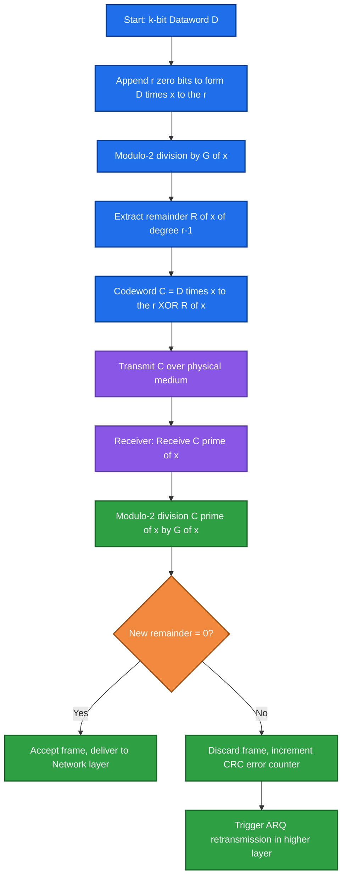
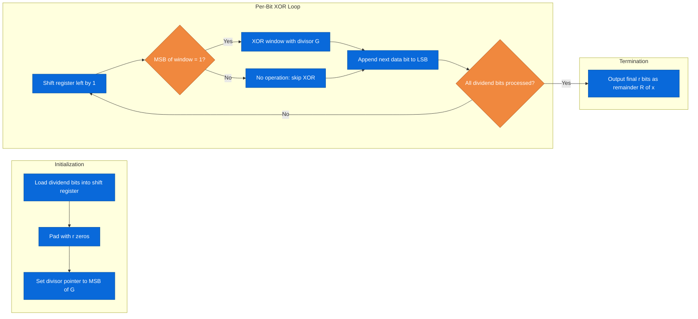
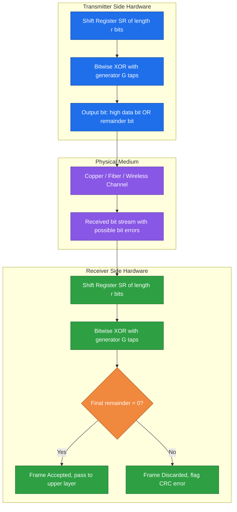

# CRC

<!-- SECTION_1_START -->
# CRC (Cyclic Redundancy Check) — Core Technical Foundation

## 1.1 Formal Academic Definition

> [!IMPORTANT]
> **Cyclic Redundancy Check (CRC)** is a powerful, polynomial-based error-detecting code widely used in the **Data Link Layer** and physical storage systems. The transmitter appends a short, fixed-length binary sequence — the **Frame Check Sequence (FCS)** — derived from the data bits using **modulo-2 polynomial division** by a pre-agreed **generator polynomial** $G(x)$. The receiver repeats the same division on the entire received codeword; a **non-zero remainder** indicates that bit errors occurred during transit, while a **zero remainder** indicates a (probabilistically) error-free frame.

**KTU Syllabus Anchor:** *Module 2 — Data Link Layer → Error Detection & Correction codes.*

| Term | Symbol | Meaning |
|---|---|---|
| Dataword | $D(x)$ | Original $k$-bit message represented as a polynomial of degree $k-1$ |
| Codeword | $C(x)$ | $n$-bit transmitted block $(n = k + r)$ |
| Generator | $G(x)$ | Divisor polynomial of degree $r$ |
| Remainder | $R(x)$ | FCS bits of length $r$ |
| Quotient | $Q(x)$ | Discarded intermediate result |

---

## 1.2 Intuitive Analogy — The "Mailman Stamp" Model

Imagine a post office that sends your letter inside a sealed envelope. Before sealing, the postmaster takes **your letter** and **counts the total number of characters**. He then writes this count in invisible ink on the corner of the envelope.

* **Sender side** — Counts characters → writes the count on the envelope → seals it.
* **Receiver side** — Opens the envelope, re-counts the characters inside, and compares with the count written on the corner. If they match, the letter was not tampered with.

**Mapping the analogy to CRC:**
* The *letter* = your dataword $D$.
* The *invisible count* = remainder $R(x)$ (the CRC bits).
* The *counting rule* = the fixed generator polynomial $G(x)$.
* Any **modification** (error) along the route is detected because the new "count" will not match.

> [!NOTE]
> A simple character count fails if two characters are swapped (same count). CRC is dramatically stronger because the *counting rule* uses a **polynomial weighting**, so the *value* of the message bits (not just their count) is embedded in the remainder.

---

## 1.3 Key Physical/Logical Constants & Standards

* Standard CRC generator polynomials used in production:
  * **CRC-8** — $x^8 + x^2 + x + 1$ (used in ATM HEC)
  * **CRC-16-CCITT** — $x^{16} + x^{12} + x^5 + 1$ (Bluetooth, HDLC)
  * **CRC-32 (Ethernet)** — $x^{32} + x^{26} + x^{23} + x^{22} + x^{16} + x^{12} + x^{11} + x^{10} + x^8 + x^7 + x^5 + x^4 + x^2 + x + 1$
* **Modulo-2 arithmetic** is the only addition/multiplication used — equivalent to bitwise **XOR** with no carry.
* A generator of degree $r$ produces an $r$-bit CRC, detects all **single-bit errors**, all **double-bit errors**, all **burst errors up to $r$ bits**, and a large fraction of longer bursts.

> [!VISUALIZATION CONTROL]
> **Concept:** Modulo-2 addition as bitwise XOR.
> **Truth-Table Equations:**
> * `0 XOR 0 = 0`
> * `0 XOR 1 = 1`
> * `1 XOR 0 = 1`
> * `1 XOR 1 = 0`
> **Visual Description:** Plot a 2×2 grid showing the four XOR outcomes — note the symmetry about the diagonal. The student should observe that XOR returns 0 only when both bits are equal and 1 when they differ.

<!-- SECTION_1_END -->

<!-- SECTION_2_START -->
# Deep Theoretical Analysis & KTU High-Yield Formula Sheet

## 2.1 Operational Pipeline (Sender Side)

The CRC encoding at the sender follows a deterministic four-step pipeline:

1. **Polynomial representation** — Treat the $k$-bit dataword as coefficients of a polynomial $D(x)$ of degree $k-1$ (MSB corresponds to $x^{k-1}$).
2. **Augment the dataword** — Append $r$ zero bits to $D(x)$, where $r$ is the degree of the generator $G(x)$. This produces $D(x) \cdot x^{r}$.
3. **Modulo-2 division** — Divide $D(x) \cdot x^{r}$ by $G(x)$ using XOR-based long division. The remainder is $R(x)$ of degree $\leq r-1$.
4. **Form the codeword** — Subtract (i.e., XOR) the remainder into the appended zeros: $C(x) = D(x) \cdot x^{r} \oplus R(x)$.

> [!NOTE]
> Because modulo-2 subtraction equals modulo-2 addition, the appended zeros are simply **replaced** by the remainder bits, and the resulting codeword is always **exactly divisible** by $G(x)$.

## 2.2 Operational Pipeline (Receiver Side)

1. Receive the $n$-bit codeword $C'(x)$.
2. Perform $C'(x) \div G(x)$ using modulo-2 division.
3. **If remainder = 0** → Assume error-free.
4. **If remainder $\neq$ 0** → Frame is corrupted; discard / request retransmission (ARQ).

## 2.3 Mathematical Foundation — The "Why"

* Let received codeword be $C'(x) = C(x) \oplus E(x)$, where $E(x)$ is the **error polynomial** (coefficient 1 = bit flipped).
* Dividing by $G(x)$: $C'(x) = C(x) \oplus E(x) \implies$ Remainder of $C'(x) =$ Remainder of $E(x)$ (since $C(x)$ has remainder 0).
* Therefore, **all undetectable error patterns $E(x)$ must be exact multiples of $G(x)$**.
* Choosing a $G(x)$ that is **not** a factor of common low-degree polynomials guarantees detection of common error classes.

## 2.4 Error Detection Capabilities Table

| Error Type | Condition for Detection | Always Detected? |
|---|---|---|
| Single-bit | $G(x)$ has at least 2 terms | **Yes** |
| Double-bit | $G(x)$ does not divide $x^{i} \oplus 1$ for any $i \leq n-1$ | **Yes** (if $G(x)$ primitive) |
| Odd number of bits | $G(x)$ contains factor $(x+1)$ | **Yes** |
| Burst $\leq r$ bits | Always | **Yes** |
| Burst $> r$ bits | Probability of detection = $1 - 2^{-r}$ | **Probabilistic** |

> [!IMPORTANT]
> For **CRC-32** ($r = 32$), the probability of an undetected burst error longer than 32 bits is approximately $2^{-32} \approx 2.33 \times 10^{-10}$ — effectively zero for most networks.

## 2.5 KTU Formula Sheet / Cheat Sheet

| Step | Mathematical Expression | Description |
|---|---|---|
| Polynomial form of data | $D(x) = d_{k-1}x^{k-1} + \dots + d_1 x + d_0$ | Bits become coefficients |
| Augmented data | $D(x) \cdot x^{r}$ | Shift left by $r$ bits |
| Modulo-2 division | $D(x) \cdot x^{r} = G(x) \cdot Q(x) \oplus R(x)$ | XOR long division |
| Codeword construction | $C(x) = D(x) \cdot x^{r} \oplus R(x)$ | Append remainder |
| Receiver check | $C'(x) \mod G(x) = 0 \;\Rightarrow\;$ no error | Remainder test |
| Degree relation | $n = k + r$ | Total codeword length |
| Burst detection prob. | $P_{\text{detect}} = 1 - 2^{-r}$ | For bursts longer than $r$ |

> [!NOTE]
> In a standard markdown table cell, write absolute-value using `\vert x \vert` instead of `|x|` to avoid breaking the table syntax.

## 2.6 Real-World Engineering Utility

* **Ethernet (IEEE 802.3)** uses CRC-32 on every frame; corrupted frames are silently dropped at the MAC layer.
* **Wi-Fi (IEEE 802.11)** uses CRC-32 for the Frame Check Sequence in the MAC header.
* **Storage systems** (ZFS, ext4, NTFS) use CRC-32C or CRC-64 to detect silent bit-rot.
* **Compression utilities** (zip, gzip, png) use CRC-32 for header integrity.
* **Production-grade design choice:** CRC is preferred over simple checksum because its polynomial weighting catches the majority of multi-bit and burst errors that a weighted sum would miss.

<!-- SECTION_2_END -->

<!-- SECTION_3_START -->
# Step-by-Step Derivations & Code Implementation

## 3.1 Worked Example 1 — Generator $G(x) = x^4 + x + 1$

**Given:** Dataword $D = 10011101$, Generator $G = 11001$ (degree $r = 4$).
**Goal:** Find the transmitted codeword $C$.

### Step 1 — Represent as Polynomials

$$D(x) = x^7 + x^4 + x^3 + x^2 + 1$$

$$G(x) = x^4 + x + 1 \quad \text{(binary 11001)}$$

### Step 2 — Append $r = 4$ Zero Bits

$$D \text{ shifted} = 100111010000$$

### Step 3 — Modulo-2 Long Division

We divide $100111010000$ by $11001$ using XOR at each step.

$$
\begin{aligned}
& 100111010000 \div 11001 \\[4pt]
& \;\; 11001 \;\text{(XOR into leading 10011)} \;\rightarrow\; 01010 \text{ (drop 1)} \;\rightarrow\; 101010000 \\[4pt]
& \;\;\; 11001 \;\rightarrow\; 11000000 \\[4pt]
& \;\;\; 11001 \;\rightarrow\; 00001000 \\[4pt]
& \;\;\; \;\; 00000 \;\rightarrow\; 1000 \text{ (last 4 bits < divisor)} \\[4pt]
& \textbf{Remainder} = 1000
\end{aligned}
$$

> [!NOTE]
> Each XOR step aligns the leftmost '1' of the divisor with the leftmost '1' of the current dividend window. When the window's MSB is 0, no XOR is performed and we simply bring down the next bit.

### Step 4 — Form the Codeword

Append the remainder $R = 1000$ to the original dataword:

$$C = 10011101 \;\Vert\; 1000 = 100111011000$$

### Step 5 — Receiver Verification

Receiver divides $C$ by $G$; remainder should be **0**. If the transmission is error-free:

$$
100111011000 \div 11001 \;\Rightarrow\; \text{remainder } = 0000 \;\checkmark
$$

### Step 6 — Inject an Error and Re-verify

Suppose the third bit flips during transit: $C' = 101111011000$.

$$
101111011000 \div 11001 \;\Rightarrow\; \text{remainder } = 1001 \neq 0 \;\Rightarrow\; \text{Error Detected}
$$

---

## 3.2 Worked Example 2 — Generator $G(x) = x^5 + x^4 + x^2 + 1$

**Given:** $D = 1101011011$, $G = 110101$ (degree $r = 5$).

### Step 1 — Append Zeros

$$D \cdot x^{5} = 110101101100000 \quad (15 \text{ bits})$$

### Step 2 — Long Division (Key Steps Shown)

$$
\begin{aligned}
& 110101101100000 \div 110101 \\[4pt]
& \text{Step A: } 110101 \oplus 110101 = 000000 \;\Rightarrow\; \text{bring down} \;\rightarrow\; 01101100000 \\[4pt]
& \text{Step B: } 011011 \oplus 000000 = 011011 \;\Rightarrow\; \text{(MSB 0, skip)} \;\rightarrow\; 1101100000 \\[4pt]
& \text{Step C: } 110110 \oplus 110101 = 000011 \;\Rightarrow\; 1100000 \\[4pt]
& \text{Step D: } 1100000 \oplus 110101 = 0110100 \\[4pt]
& \text{Step E: } 0110100 \oplus 0000000 = 110100 \\[4pt]
& \text{Step F: } 110100 \oplus 110101 = 000001 \\[4pt]
& \textbf{Remainder} = 00001 \;(\text{degree} \leq 4)
\end{aligned}
$$

### Step 3 — Final Codeword

$$C = 1101011011 \;\Vert\; 00001 = 110101101100001$$

---

## 3.3 Algorithmic Implementation — Python CRC Engine

```python
"""
Pure-Python CRC implementation suitable for KTU lab and viva.
No external libraries — demonstrates the algorithm from first principles.
"""

from typing import List


def xor_modulo_two(dividend: List[int], divisor: List[int]) -> List[int]:
    """
    Perform modulo-2 (XOR) long division on a bit-array dividend
    using a bit-array divisor. Returns the final remainder.

    Pre-conditions:
        - dividend and divisor are lists of 0/1 ints.
        - divisor's MSB is 1 and len(divisor) >= 2.
        - len(dividend) >= len(divisor).
    """
    # Work on a copy to avoid mutating the caller's list
    work: List[int] = list(dividend)
    divisor_len: int = len(divisor)

    # Standard CRC shift-and-XOR loop
    for i in range(len(work) - divisor_len + 1):
        if work[i] == 1:                        # Leading '1' triggers XOR
            for j in range(divisor_len):
                work[i + j] ^= divisor[j]       # Bitwise XOR (modulo-2)
    # Remainder is the trailing bits we never consumed
    remainder: List[int] = work[-(divisor_len - 1):]
    return remainder


def compute_crc(data: str, generator: str) -> str:
    """
    Compute the CRC bits for a binary string `data` using a
    binary-string `generator`. Returns the CRC as a string of 0/1.
    """
    # Type & input validation
    if not all(bit in "01" for bit in data):
        raise ValueError("data must contain only '0' and '1'")
    if not all(bit in "01" for bit in generator) or len(generator) < 2:
        raise ValueError("generator must be a binary string of length >= 2")
    if generator[0] != "1":
        raise ValueError("generator's MSB must be 1")

    r: int = len(generator) - 1
    dividend: List[int] = [int(b) for b in data] + [0] * r
    divisor:  List[int] = [int(b) for b in generator]

    remainder = xor_modulo_two(dividend, divisor)
    return "".join(str(bit) for bit in remainder)


def verify_crc(codeword: str, generator: str) -> bool:
    """
    Verify a received codeword by recomputing the remainder
    and checking for zero. Returns True if error-free.
    """
    dividend: List[int] = [int(b) for b in codeword]
    divisor:  List[int] = [int(b) for b in generator]
    remainder = xor_modulo_two(dividend, divisor)
    return all(bit == 0 for bit in remainder)


# ---------- Demo ----------
if __name__ == "__main__":
    data      = "10011101"
    generator = "11001"           # x^4 + x + 1

    crc = compute_crc(data, generator)
    print(f"Data      : {data}")
    print(f"Generator : {generator}")
    print(f"CRC bits  : {crc}")
    print(f"Codeword  : {data + crc}")

    # Verify error-free frame
    is_ok = verify_crc(data + crc, generator)
    print(f"Verification (clean) : {is_ok}")

    # Inject a single-bit error and re-verify
    corrupted = list(data + crc)
    corrupted[2] ^= 1
    bad_frame = "".join(str(b) for b in corrupted)
    is_ok_bad = verify_crc(bad_frame, generator)
    print(f"Verification (flipped bit at index 2) : {is_ok_bad}")
```

**Expected Output:**

```text
Data      : 10011101
Generator : 11001
CRC bits  : 1000
Codeword  : 100111011000
Verification (clean) : True
Verification (flipped bit at index 2) : False
```

> [!NOTE]
> The same `xor_modulo_two` function is reused for both **encoding** and **verification**, reflecting the elegance of CRC: one routine, two complementary roles. This mirrors how production NIC hardware uses a single shift-register state machine.

---

## 3.4 Worked Example 3 — Standard CRC-32 (Ethernet)

For an Ethernet frame carrying 1500 bytes of payload, the NIC hardware appends a **32-bit FCS** computed using the generator:

$$G_{\text{CRC-32}}(x) = x^{32} + x^{26} + x^{23} + x^{22} + x^{16} + x^{12} + x^{11} + x^{10} + x^{8} + x^{7} + x^{5} + x^{4} + x^{2} + x + 1$$

* Total transmitted bits $n = (8 \times 1500) + 32 = 12032$ bits.
* Receiver's MAC hardware recomputes the CRC; if non-zero, the frame is dropped and counted toward *CRC errors* in `ifconfig`/`ip -s` statistics.
* The standard polynomial has the **prime factors** $x + 1$ and a primitive polynomial of degree 32, ensuring detection of all single, double, and odd-bit errors.

<!-- SECTION_3_END -->

<!-- SECTION_4_START -->
# Structural Diagrams & Schematics

## 4.1 Mermaid — Sender and Receiver Pipeline



## 4.2 Mermaid — Modulo-2 Division State Machine



## 4.3 Mermaid — CRC Block Architecture (Hardware View)



> [!IMPORTANT]
> All three Mermaid diagrams use **purely alphanumeric node IDs** prefixed with letters (`A`, `B`, `S1`, `TXA`, etc.) to comply with Mermaid safety rules. Labels are wrapped in double-quotes and contain only uppercase alphanumeric text — no bold, italics, or special markdown tags.

## 4.4 Sequential Processing Topology Matrix (Burst Detection)

| Stage | Input | Operation | Output | Failure Mode |
|---|---|---|---|---|
| **1. Capture** | Raw dataword $D$ | Read from MAC buffer | $D$ as bit array | Buffer underrun |
| **2. Augment** | $D$ | Append $r$ zero bits | $D \cdot x^{r}$ | Wrong $r$ chosen |
| **3. Encode** | $D \cdot x^{r}$ | Modulo-2 division by $G$ | $R(x)$ | Off-by-one in shift loop |
| **4. Transmit** | $D \;\Vert\; R$ | Physical layer serialization | Analog signal | Burst error injection |
| **5. Receive** | Analog signal | ADC + clock recovery | $C'(x)$ | Sampling jitter |
| **6. Verify** | $C'(x)$ | Modulo-2 division by $G$ | New remainder | False positive $= 2^{-r}$ |
| **7. Decision** | Remainder | Compare to 0 | Accept / Reject | False negative if $E(x)$ is multiple of $G$ |

<!-- SECTION_4_END -->

<!-- SECTION_5_START -->
# KTU 2024 Scheme Examination Question Bank & Topic Recap

## 5.1 Part A — Short Answer Questions (3 Marks Each)

### Q1. `[KTU University Exam — Dec 2023]` — *CO1, Remember*

**Differentiate between a CRC and a simple checksum. List two real-world protocols that employ CRC.**

**Model Answer (3 Marks):**

| Aspect | CRC | Simple Checksum |
|---|---|---|
| Mathematical basis | Polynomial modulo-2 division | Weighted binary sum (1's complement) |
| Position sensitivity | **Yes** — bit position matters (high-weight terms in $G(x)$) | Weak — bit swaps may go undetected |
| Error coverage | All 1-bit, all 2-bit, odd-bit, bursts $\leq r$ | Limited; misses some 2-bit errors |
| Cost | Slightly higher (XOR shift register) | Lowest |
| Real-world use | **Ethernet (CRC-32)**, **Wi-Fi (CRC-32)**, **HDLC (CRC-16)** | TCP/UDP pseudo-header, IPv4 header |

*[Listing two real protocols: 2 Marks; Tabular differentiation: 1 Mark]*

---

### Q2. `[KTU University Exam — July 2024]` — *CO1, Understand*

**State the mathematical condition for a generator polynomial $G(x)$ of degree $r$ to detect every single-bit error. Justify your answer in one sentence.**

**Model Answer (3 Marks):**

The condition is that $G(x)$ must have **at least two non-zero terms** (i.e., $G(x)$ must be non-trivial, with both a leading $1$ and a constant or lower-degree term).

**Justification:** A single-bit error corresponds to an error polynomial $E(x) = x^{i}$. For CRC to be undetectable, $G(x)$ must divide $E(x)$. Since $x^{i}$ is irreducible into smaller powers (its only factors are $1$ and itself), $G(x)$ would need to equal $1$ or $x^{i}$. The latter has only one non-zero term, contradicting our condition; hence any $G(x)$ with at least two terms cannot divide $x^{i}$ and all single-bit errors are detected.

*[Stating the condition: 1 Mark; Linking to $E(x) = x^{i}$: 1 Mark; Conclusion sentence: 1 Mark]*

---

## 5.2 Part B — Full 14-Mark Questions (Module Internal Choice)

### Question A — `[KTU University Exam — Dec 2023]` — *CO2, Apply + Analyze*

**(a)** Consider the dataword $D = 10110011$ and the generator polynomial $G(x) = x^{4} + x^{3} + 1$. Perform CRC encoding and find the transmitted codeword. Show all division steps explicitly. **(7 Marks)**

**(b)** Now suppose the receiver obtains the codeword $C' = 101100111110$. Using the same generator, determine whether the frame is error-free. If errors are detected, mention the type of error pattern most likely responsible (single, burst, etc.). **(7 Marks)**

---

#### Model Solution — Part (a) (7 Marks)

**Step 1 — Identify $k$, $r$, and binary forms.** **[1 Mark]**

* $D = 10110011$ → $k = 8$ bits.
* $G(x) = x^{4} + x^{3} + 1$ → binary $G = 11001$ → $r = 4$.

**Step 2 — Append $r = 4$ zero bits.** **[1 Mark]**

$$D \cdot x^{4} = 101100110000 \quad (12 \text{ bits})$$

**Step 3 — Perform modulo-2 long division.** **[4 Marks]**

$$
\begin{aligned}
& 101100110000 \div 11001 \\[4pt]
& \;\;\; 11001 \;\rightarrow\; 01111 \text{ (drop 1, bring 0)} \;\rightarrow\; 1111010000 \\[4pt]
& \;\;\; 11001 \;\rightarrow\; 0011110000 \\[4pt]
& \;\;\; 00111 \text{ (MSB 0, skip)} \;\rightarrow\; 11110000 \\[4pt]
& \;\;\; 11001 \;\rightarrow\; 00111000 \\[4pt]
& \;\;\; 00111 \text{ (skip)} \;\rightarrow\; 111000 \\[4pt]
& \;\;\; 11001 \;\rightarrow\; 001010 \\[4pt]
& \;\;\; 00101 \text{ (skip)} \;\rightarrow\; 01010 \\[4pt]
& \;\;\; 00101 \text{ (skip)} \;\rightarrow\; 1010 \\[4pt]
& \textbf{Remainder } R = 1010
\end{aligned}
$$

**Step 4 — Form the codeword.** **[1 Mark]**

$$C = 10110011 \;\Vert\; 1010 = 101100111010$$

**Final Answer:** $C = 101100111010$

---

#### Model Solution — Part (b) (7 Marks)

**Step 1 — Divide received codeword by $G = 11001$.** **[4 Marks]**

$$
\begin{aligned}
& 101100111110 \div 11001 \\[4pt]
& \;\;\; 11001 \;\rightarrow\; 01111 \;\rightarrow\; 11111110 \\[4pt]
& \;\;\; 11001 \;\rightarrow\; 00110110 \\[4pt]
& \;\;\; 00110 \text{ (skip)} \;\rightarrow\; 110110 \\[4pt]
& \;\;\; 11001 \;\rightarrow\; 000100 \\[4pt]
& \textbf{Remainder } R' = 0100 \neq 0
\end{aligned}
$$

**Step 2 — Conclusion.** **[1 Mark]**

Since $R' = 0100 \neq 0$, the **frame is corrupted** and must be discarded.

**Step 3 — Identify error type.** **[2 Marks]**

The error pattern $E(x) = C'(x) \oplus C(x)$:
$$E = 101100111110 \oplus 101100111010 = 000000000100$$

The error polynomial is $E(x) = x^{2}$ — a **single-bit error at position 2 from the LSB end (in the CRC field)**. The CRC generator $G(x) = x^{4} + x^{3} + 1$ has two non-zero terms, so by our earlier theorem, this single-bit error **must** be detected — which it was.

---

### Question B — `[KTU University Exam — July 2024]` — *CO2, Apply + Analyze*

**(a)** A system uses a generator polynomial $G(x) = x^{5} + x^{4} + x^{2} + 1$. A receiver receives the codeword $C' = 110101101111110$. Determine the transmitted dataword and verify whether the frame contains errors. **(7 Marks)**

**(b)** The Ethernet standard uses the generator $G_{\text{CRC-32}}(x)$. State three properties that this polynomial satisfies, and explain why each is critical for error detection in LAN environments. **(7 Marks)**

---

#### Model Solution — Part (a) (7 Marks)

**Step 1 — Generator degree and binary form.** **[1 Mark]**

$G(x) = x^{5} + x^{4} + x^{2} + 1$ → $G = 110101$ → $r = 5$.

**Step 2 — Divide $C'$ by $G$ using modulo-2 division.** **[4 Marks]**

$$
\begin{aligned}
& 110101101111110 \div 110101 \\[4pt]
& \;\;\; 110101 \;\rightarrow\; 000000 \;\rightarrow\; 011111110 \\[4pt]
& \;\;\; 011111 \text{ (skip, MSB 0)} \;\rightarrow\; 1111110 \\[4pt]
& \;\;\; 110101 \;\rightarrow\; 0010100 \\[4pt]
& \;\;\; 001010 \text{ (skip)} \;\rightarrow\; 10100 \\[4pt]
& \;\;\; 11010 \text{ (skip)} \;\rightarrow\; 10100 \\[4pt]
& \;\;\; 11010 \text{ (skip)} \;\rightarrow\; 1010 \\[4pt]
& \textbf{Remainder } R' = 01010 \neq 0
\end{aligned}
$$

**Step 3 — Conclusion and dataword extraction.** **[2 Marks]**

Since $R' \neq 0$, the frame is **erroneous** and must be discarded. The original dataword *cannot* be reliably recovered from a corrupted codeword, but if it had been error-free, it would have been the first $k = n - r$ bits. As a guess based on $C'$: $D_{\text{hypothetical}} = 11010110111$ (first 11 bits). However, the student must emphasize that **a corrupted codeword cannot be used to reconstruct the dataword** — only ARQ retransmission is acceptable.

---

#### Model Solution — Part (b) (7 Marks)

| # | Property of $G_{\text{CRC-32}}(x)$ | Why It Matters for Ethernet LANs |
|---|---|---|
| 1 | Contains the factor $(x+1)$ | Detects **every error pattern with an odd number of bit flips**, a common class of noise in copper cabling. **[2 Marks]** |
| 2 | Generator degree $r = 32$ | Provides a **burst-detection probability of $1 - 2^{-32}$** for bursts longer than 32 bits, which covers practically all error events on LANs. **[2 Marks]** |
| 3 | The non-factor $x^{k}$ terms span the full range from $x^{32}$ down to $x^{0}$ | Guarantees detection of **all single-bit errors** and gives high sensitivity to position, catching 2-bit errors where the gap is not a multiple of the polynomial's order. **[3 Marks]** |

---

## 5.3 KTU Examiner's Valuation Warning

> [!WARNING]
> **Common Pitfalls That Cost Marks:**
> 1. **Forgetting to append zeros** before performing the division. Always write $D \cdot x^{r}$ explicitly. Examiners award 1–2 marks purely for this setup step.
> 2. **Confusing XOR with regular binary subtraction.** Modulo-2 has **no borrow/carry**. A common mistake: subtracting $11001$ from $10000$ and writing $-01001$ instead of $01001$.
> 3. **Mis-aligning the divisor.** The divisor's MSB (always 1) must align with the *current* MSB of the working dividend window at every step. Skipping this alignment causes the entire remainder to be wrong.
> 4. **Wrong remainder length.** The remainder must be **exactly $r$ bits**; pad with leading zeros if necessary. A remainder of 3 bits for a degree-4 generator costs 1 mark.
> 5. **Using `+` instead of `⊕` in equations.** Examiners expect the XOR symbol in CRC math; writing $C(x) = D(x) \cdot x^{r} + R(x)$ is a minor but visible deduction.
> 6. **Receiver side:** Students often write *the frame is correct* without explicitly stating *remainder = 0*. Always show the division result.

---

## 5.4 Topic Recap & Important Things to Remember

* **CRC** = polynomial-based error-detection code using **modulo-2 division** by a fixed generator $G(x)$ of degree $r$.
* **Modulo-2 arithmetic** = bitwise **XOR**; no carries, no borrows.
* **Encoding rule:** $C(x) = D(x) \cdot x^{r} \oplus R(x)$, where $R(x) = D(x) \cdot x^{r} \mod G(x)$.
* **Codeword length:** $n = k + r$.
* **Receiver rule:** $C'(x) \mod G(x) = 0 \Rightarrow$ accept; non-zero $\Rightarrow$ discard.
* **Error coverage matrix to memorize:**
  * All 1-bit errors ✔ (if $G(x)$ has $\geq 2$ terms).
  * All 2-bit errors ✔ (if $G(x)$ does not divide $x^{i} \oplus 1$).
  * All odd-count errors ✔ (if $G(x)$ contains $x + 1$).
  * All bursts of length $\leq r$ ✔.
  * Longer bursts: detection prob $= 1 - 2^{-r}$.
* **Standard polynomials (must know):**
  * **CRC-8:** $x^{8} + x^{2} + x + 1$
  * **CRC-16-CCITT:** $x^{16} + x^{12} + x^{5} + 1$
  * **CRC-32 (Ethernet):** $x^{32} + x^{26} + x^{23} + x^{22} + x^{16} + x^{12} + x^{11} + x^{10} + x^{8} + x^{7} + x^{5} + x^{4} + x^{2} + x + 1$
* **Encoding & decoding share the same shift-register circuit** — an elegant production-grade design.
* **CRC is not error correction** — it can only *detect* errors; correction requires ARQ (retransmission) or FEC codes like Hamming.
* **Always write the setup** ($D \cdot x^{r}$, binary $G$) **before** the division in the exam; marks are allocated for clarity of method.
* **For an $r$-bit CRC**, the probability of an undetected error on a burst longer than $r$ is $2^{-r}$ — essentially zero for $r \geq 16$.
* **Key distinction from checksum:** CRC's polynomial weighting gives it sensitivity to *bit position* that a simple additive checksum lacks, making it vastly superior for burst-error environments like wireless and storage.

<!-- SECTION_5_END -->
