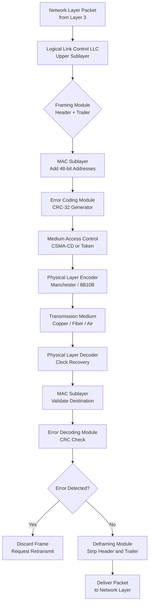
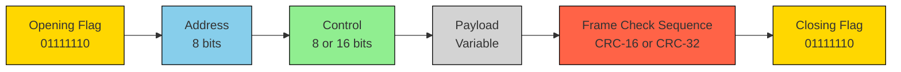
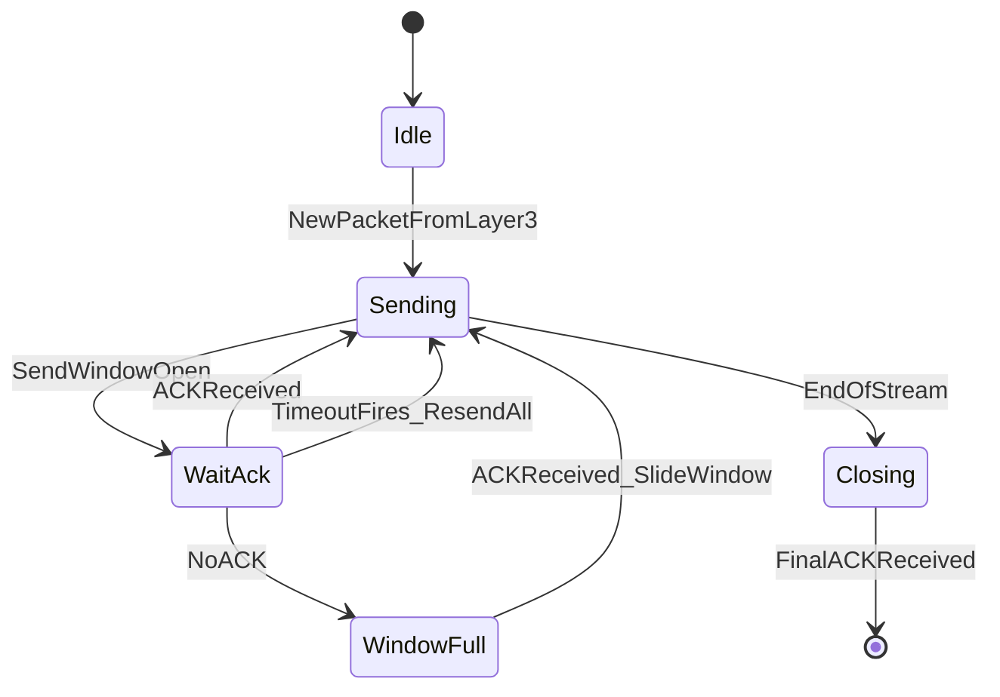
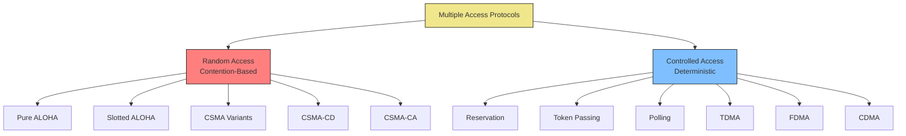
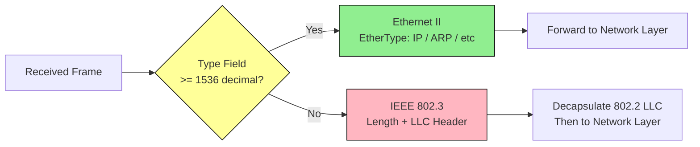
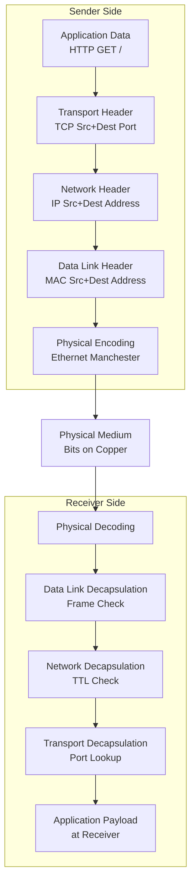

# Data Link Layer:-

<!-- SECTION_1_START -->

# Data Link Layer — Core Technical Definition & Intuitive Overview

> [!IMPORTANT]
> **KTU 2024 Scheme | OECST724 — COMPUTER NETWORKS | Module 2**
> **Course Outcome Mapping:** CO2 — *Understand the layered architecture, services, and protocols of the data link layer including framing, error control, flow control, and multiple access mechanisms.*

---

## 1.1 Formal Definition (KTU 2024 Syllabus Terminology)

The **Data Link Layer (DLL)** is **Layer 2** of the **OSI (Open Systems Interconnection) reference model** and the upper sublayer of the **TCP/IP Link Layer**. It is responsible for the **reliable transfer of data frames** between two *adjacent* nodes connected by a physical (wired or wireless) link.

In the TCP/IP model, the Data Link Layer is formally split into two cooperating sublayers:

1. **Logical Link Control (LLC) Sublayer** — Upper half. Provides flow control, error notification, and identifies the network layer protocol.
2. **Medium Access Control (MAC) Sublayer** — Lower half. Governs how devices *gain access* to the shared physical medium and performs physical addressing (MAC / hardware addresses).

> [!NOTE]
> **Syllabus Highlight:** Forouzas' "Data Communications and Networking" (5th Ed.) and Tanenbaum's "Computer Networks" (5th Ed.) — both prescribed by KTU — dedicate Chapters 3, 4, and 5 to exactly the topics in this module: *Data Link Layer design issues, error detection/correction, and multiple access protocols.*

---

## 1.2 Conceptual Analogy — The "Truck and Highway" Model

Imagine a **national courier company** (the Network Layer / Internet Protocol) that needs to move parcels between two *warehouses* (hosts) located in adjacent cities. The courier does **not** care *how* the truck drives; that is the job of the **regional driver and truck fleet** — the **Data Link Layer**.

| Network Concept | Real-World Analogy |
|---|---|
| Bit stream (raw voltage pulses) | Boxes packed on a wooden pallet |
| Frame | A single delivery truck carrying a *sealed container* |
| Header / Trailer | The shipping label + seal/manifest at the back |
| MAC Address | The truck's *unique license plate number* (e.g., KL-07-AB-1234) |
| CRC / Checksum | A tamper-evident wax seal; broken seal ⇒ damaged box |
| Flow Control | Traffic signal at the warehouse gate |
| Collision (Ethernet) | Two trucks crashing at an unmarked intersection |
| Switch | The regional traffic controller assigning lanes |

> [!TIP]
> **Why "Adjacent" Nodes?** The DLL only operates *hop-by-hop*. The Network Layer (IP) worries about the *end-to-end* route. A packet from Kerala to Kashmir passes through *dozens* of DLLs — one at every router.

---

## 1.3 The Five Core Services Provided by the DLL

The Data Link Layer transforms a *raw, error-prone bit stream* into a *seemingly reliable logical link*. It accomplishes this by providing the following **five canonical services**:

1. **Framing** — Encapsulating the network layer packet into a discrete unit (frame) with header and trailer.
2. **Physical Addressing** — Adding sender and receiver **MAC (48-bit)** addresses inside the frame header.
3. **Error Control** — Detecting (and optionally correcting) bit errors introduced by the physical medium using techniques like **CRC, Checksum, and Hamming Codes**.
4. **Flow Control** — Regulating the sender's rate so that a *fast* sender does not overwhelm a *slow* receiver.
5. **Medium Access Control** — Deciding *who transmits next* when multiple nodes share a single broadcast channel (Ethernet bus, Wi-Fi air).

> [!IMPORTANT]
> **Constants to Memorize for KTU Board Exams:**
> * MAC Address Length = **48 bits = 6 bytes** (e.g., `1A:2B:3C:4D:5E:6F`)
> * Maximum Ethernet II Payload (MTU) = **1500 bytes**
> * Minimum Ethernet Frame Size = **64 bytes** (for CSMA/CD collision detection)
> * Maximum Ethernet Frame Size = **1518 bytes** (excluding preamble)

---

## 1.4 Position of the DLL in the Network Stack

> [!VISUALIZATION CONTROL]
> **Concept:** The 7-Layer OSI Model with the Data Link Layer highlighted
> **GeoGebra / Desmos Input Equations:**
> * Use a simple 7-row stack: `Application(7) → Presentation(6) → Session(5) → Transport(4) → Network(3) → Data Link(2) → Physical(1)`
> **Visual Description:** A vertical column of 7 horizontal bars. Layer 2 (Data Link) should be highlighted in red. Arrows from `Network(3)` feed *packets* into DLL, which outputs *frames* to `Physical(1)`. The frame is *not* visible to higher layers.

The Data Link Layer is a **strict service provider** — it offers services to the **Network Layer (Layer 3)** and in turn *consumes* services from the **Physical Layer (Layer 1)**. This hand-shake is called the **SAP (Service Access Point)**.

> [!NOTE]
> **KTU Repeated Question Pattern:** *"List the services provided by the Data Link Layer to the Network Layer."* — Always answer with the **3 + 2 = 5** services: (i) Unacknowledged connectionless, (ii) Acknowledged connectionless, (iii) Acknowledged connection-oriented, plus framing and flow/error control.

---

## 1.5 Why the Data Link Layer Cannot Be Skipped

The Physical Layer alone delivers *bits*. But bits are **unreliable**:
* **Bit Error Rate (BER)** of copper ≈ **$10^{-5}$** to **$10^{-9}$** per bit
* **BER** of fiber ≈ **$10^{-12}$** per bit
* Wi-Fi BER can spike to **$10^{-3}$** under interference

For a 1 Gbps link with BER = $10^{-7}$, you would see **a bit error every 10 seconds**. Without a DLL, the application would be flooded with corrupted data. The DLL makes the link appear *almost error-free* to the upper layers.

---

<!-- SECTION_1_END -->

<!-- SECTION_2_START -->

# Data Link Layer — Deep Theoretical Analysis & KTU High-Yield Formula Sheet

## 2.1 Layered Functional Breakdown (Operational Theory)

The Data Link Layer executes its duties through a *pipeline* of operations. The complete transmission pipeline of a single frame is:

1. **Receive Data from Network Layer** — A *packet* (variable length, typically 64–1500 bytes) arrives.
2. **Framing** — Break the bit stream into discrete *frames*; attach header and trailer.
3. **Physical Addressing** — Insert source and destination MAC addresses in the header.
4. **Error Detection Coding** — Compute CRC/Checksum and append to trailer.
5. **Medium Access** — Wait for permission (CSMA/CD, Token Passing, etc.).
6. **Bit Transmission** — Hand the frame to the Physical Layer for encoding and signaling.
7. **Acknowledgement Handling** — On the receiver side, verify checksum and send ACK/NACK.
8. **Flow Control Activation** — Use Sliding Window or Stop-and-Wait to throttle the sender.

> [!IMPORTANT]
> **The 'Why' Behind Framing:** The Physical Layer has *no concept of message boundaries*. It is just a stream of voltage pulses / light flashes. Without a delimiter, the receiver cannot tell where one message ends and the next begins. A *frame delimiter* (e.g., the Ethernet `SFD` byte `10101011`) solves this.

---

## 2.2 Framing Techniques — Detailed Comparison

Framing is the *first* job of the DLL. There are **four classical techniques**, each with a known KTU exam pedigree.

| Technique | Mechanism | Pros | Cons |
|---|---|---|---|
| **Character Count** | Header stores the number of bytes in the payload | Simple | **Fails catastrophically** if the count field itself is corrupted |
| **Character (Byte) Stuffing** | Use `DLE STX` (start) and `DLE ETX` (end) flags; escape internal `DLE` with another `DLE` | Works for text | Overhead; limited to 8-bit characters |
| **Bit Stuffing** (HDLC) | Flag = `01111110`; sender inserts a `0` after every five consecutive `1`s; receiver removes it | Bit-transparent; works for any payload | Slight overhead (~1 bit per 5 bits of payload) |
| **Physical Layer Coding Violations** | Use illegal voltage patterns (e.g., in Manchester encoding) as delimiters | No overhead | Tied to specific physical encoding |

> [!TIP]
> **KTU Board Tip:** For questions on HDLC, always draw the **flag bytes** `01111110` at the *beginning* and *end* of the frame, and remember the bit-stuffing rule: **"After 5 consecutive 1s, insert a 0."**

---

## 2.3 Error Detection and Correction — The KTU High-Yield Formula Sheet

Error control is the *most heavily tested* sub-topic of this module. Below is the complete formula bank.

### 2.3.1 Error Detection Codes

| Method | Formula / Rule | Polynomial Basis | Detects | Used In |
|---|---|---|---|---|
| **Parity (1-D)** | Sum of bits (mod 2) = parity bit | — | All **odd-number** single-bit errors | Serial ports, ASCII |
| **Parity (2-D)** | Row + Column parity | — | All 1, 2, 3-bit errors in matrix | Legacy storage |
| **Checksum (Internet)** | 16-bit one's complement sum of 16-bit words | — | Most errors, not all | TCP, UDP, IP, ICMP |
| **CRC-8** | $G(x) = x^8 + x^2 + x + 1$ | Generator $G(x)$ | All burst errors $\le 8$ bits | ATM HEC |
| **CRC-16-CCITT** | $G(x) = x^{16} + x^{12} + x^5 + 1$ | Same | All burst errors $\le 16$ bits | HDLC, Bluetooth |
| **CRC-32 (Ethernet)** | $G(x) = x^{32} + x^{26} + \dots + x + 1$ | Same | All burst errors $\le 32$ bits | Ethernet, ZIP, PNG |

### 2.3.2 Hamming Code — Single-Bit Error Correction

For a message of $m$ data bits, the number of redundant parity bits $r$ must satisfy:

$$2^r \ge m + r + 1$$

The total codeword length is $n = m + r$. Each bit position that is a *power of 2* ($1, 2, 4, 8, \dots$) is a **parity bit**; the rest carry data.

> [!NOTE]
> **Quick Example (KTU repeated):** For $m = 4$ data bits, $2^r \ge 4 + r + 1 = 5$. The smallest valid $r$ is $3$. So total length $n = 7$ — the famous **Hamming(7,4)** code.

### 2.3.3 Flow Control & Efficiency Formulas

Let $T_f$ = transmission time of one frame, $T_p$ = propagation time, $T_{proc}$ = processing delay, $a = T_p / T_f$.

| Protocol | Efficiency Formula | Maximum Channel Utilization |
|---|---|---|
| **Stop-and-Wait** | $U = \dfrac{1}{1 + 2a}$ | $50\%$ as $a \to 0$ |
| **Sliding Window (Go-Back-N)** | $U = \dfrac{W}{1 + 2a}$ where $W \le 2a + 1$ | $100\%$ if $W \ge 2a + 1$ |
| **Sliding Window (Selective Repeat)** | $U = \dfrac{W}{1 + 2a}$ where $W \le 2a + 1$ | $100\%$ if $W \ge 2a + 1$ |

> [!IMPORTANT]
> **Bandwidth-Delay Product (BDP):** $\text{BDP} = \text{Bandwidth} \times \text{Round Trip Time} = B \times R$. Number of bits that "fit in the pipe" at any instant. This is exactly the **minimum window size** for $100\%$ utilization.

### 2.3.4 Multiple Access Protocol Efficiencies

| Protocol | Maximum Throughput (Efficiency $S$) | Where Used |
|---|---|---|
| **Pure ALOHA** | $S = G \cdot e^{-2G}$, max $= \dfrac{1}{2e} \approx 18.4\%$ | Early AlohaNet (Hawaii, 1971) |
| **Slotted ALOHA** | $S = G \cdot e^{-G}$, max $= \dfrac{1}{e} \approx 36.8\%$ | Satellite / RFID |
| **1-persistent CSMA** | Up to $\approx 80\%$ (depends on $a$) | Legacy Ethernet |
| **Non-persistent CSMA** | $\approx 85\%$ | Documented in textbooks |
| **CSMA/CD (Ethernet)** | $\approx 90\%+$ (practical) | IEEE 802.3 |
| **Token Passing** | $S = \dfrac{1}{1 + a/N}$ where $N$ = stations | IEEE 802.4, 802.5 |

Where $G$ is the average *offered load* (frames per frame-time).

---

## 2.4 Real-World Engineering Utility

| Domain | DLL Mechanism Used | Why |
|---|---|---|
| **Data Center Switching** | Cut-through / Store-and-forward switching | Latency vs. error checking trade-off |
| **Wi-Fi (802.11)** | CSMA/CA + RTS/CTS | Cannot detect collisions on wireless medium |
| **LTE / 5G MAC** | Scheduled OFDMA | Need deterministic latency for voice |
| **Industrial IoT (CAN bus)** | Bit stuffing + CRC-15 | Robust against motor noise |
| **Satellite (VSAT)** | Slotted ALOHA | Long propagation delay makes collisions unavoidable |
| **Storage (NVMe over Fabrics)** | Fibre Channel CRC-32 | High BER over long fiber runs |

> [!TIP]
> **KTU 2024 Hot Topic:** *CSMA/CA vs CSMA/CD* — always conclude: "On **wireless**, stations **cannot** listen while transmitting (near-far problem), so collisions are *avoided* (CA) rather than *detected* (CD)."

---

<!-- SECTION_2_END -->

<!-- SECTION_3_START -->

# Data Link Layer — Step-by-Step Derivations, Algorithms & Code Implementation

## 3.1 Worked Derivation 1: CRC (Cyclic Redundancy Check) Computation

**Problem (KTU Pattern):** A frame of data bits `1101011011` is to be sent using a generator polynomial $G(x) = x^4 + x + 1$. Compute the transmitted bit stream.

**Step 1 — Identify the Generator Polynomial:**

$$G(x) = x^4 + x + 1 \quad \Rightarrow \quad G = 10011 \text{ (degree 4, so 5 bits)}$$

**Step 2 — Append Zeros:**
Append **4 zeros** (degree of $G$) to the data $M$:

$$M' = 11010110110000$$

**Step 3 — Modulo-2 Division (XOR Division):**

Compute $M' \text{ XOR-div } G$. We perform bitwise XOR without carries.

| Step | Dividend (5-bit window) | XOR with $G = 10011$ | Result of XOR |
|---|---|---|---|
| 1 | `11010` | `10011` | `01001` |
| 2 | `10011` (carry 0 from prev + next bit 1) | `10011` | `00000` |
| 3 | `00000` + next bit `0` | `00000` (skip if leading 0) | `00000` |
| 4 | `00000` + `1` | `00000` (skip) | `00000` |
| 5 | `00000` + `1` | `00000` (skip) | `00000` |
| 6 | `00000` + `0` | `00000` (skip) | `00000` |
| 7 | `00000` + `0` | `00000` (skip) | `00000` |
| 8 | `00000` + `0` | `00000` (skip) | `00000` |
| Final | — | **Remainder** | `1110` |

> [!IMPORTANT]
> **Common Pitfall:** The remainder must always be **4 bits** (degree of $G$). If your remainder is shorter, **left-pad with zeros**.

**Step 4 — Transmitted Frame:**

$$T = M + R = 1101011011 \, || \, 1110 = \mathbf{11010110111110}$$

**Step 5 — Receiver Verification:**
The receiver performs the *same* XOR division on the **entire transmitted frame** ($T$ divided by $G$). A remainder of `0000` means the frame is *error-free*.

---

## 3.2 Worked Derivation 2: Hamming(7,4) Code Generation

**Problem:** Encode the 4-bit dataword `1011` into a Hamming(7,4) codeword.

**Step 1 — Determine Parity Bit Positions:**

For Hamming(7,4), $m = 4$, $r = 3$. Positions are $1$ to $7$.

| Position | Type | Bit | Initial Value |
|---|---|---|---|
| 1 | Parity $P_1$ | $p_1$ | 0 |
| 2 | Parity $P_2$ | $p_2$ | 0 |
| 3 | Data | $d_1$ | 1 |
| 4 | Parity $P_3$ | $p_3$ | 0 |
| 5 | Data | $d_2$ | 0 |
| 6 | Data | $d_3$ | 1 |
| 7 | Data | $d_4$ | 1 |

Data positions 3, 5, 6, 7 hold $d_1, d_2, d_3, d_4 = 1, 0, 1, 1$ respectively.

**Step 2 — Compute Parity Bits (Even Parity):**

* $P_1$ checks positions with **bit-0 of index = 1**: positions **1, 3, 5, 7**
$$p_1 = (d_1 + d_2 + d_4) \bmod 2 = (1 + 0 + 1) \bmod 2 = 0$$

* $P_2$ checks positions with **bit-1 of index = 1**: positions **2, 3, 6, 7**
$$p_2 = (d_1 + d_3 + d_4) \bmod 2 = (1 + 1 + 1) \bmod 2 = 1$$

* $P_3$ checks positions with **bit-2 of index = 1**: positions **4, 5, 6, 7**
$$p_3 = (d_2 + d_3 + d_4) \bmod 2 = (0 + 1 + 1) \bmod 2 = 0$$

**Step 3 — Construct the Codeword:**

$$\text{Codeword} = p_1 \, p_2 \, d_1 \, p_3 \, d_2 \, d_3 \, d_4 = \mathbf{0110011}$$

**Step 4 — Single-Bit Error Correction Demo:**
Suppose bit position **6** is flipped at the receiver (so $d_3$ becomes $0$). The receiver recomputes the *syndrome* $S = (s_2 s_1 s_0)$ where each $s_i$ is the parity check.

$$s_1 = (p_1 + d_1 + d_2 + d_4) \bmod 2 = (0 + 1 + 0 + 1) \bmod 2 = 0$$
$$s_2 = (p_2 + d_1 + d_3 + d_4) \bmod 2 = (1 + 1 + 0 + 1) \bmod 2 = 1$$
$$s_3 = (p_3 + d_2 + d_3 + d_4) \bmod 2 = (0 + 0 + 0 + 1) \bmod 2 = 1$$

Syndrome = $(s_3 s_2 s_1) = (110)_2 = 6$. **The error is at position 6.** The receiver flips that bit, recovering the original data.

---

## 3.3 Worked Derivation 3: Stop-and-Wait ARQ — Channel Utilization

**Problem:** A satellite link has a one-way propagation delay of $T_p = 250$ ms. The frame transmission time is $T_f = 20$ ms. Compute the efficiency of Stop-and-Wait ARQ. What is the minimum window size for $100\%$ efficiency under Sliding Window ARQ?

**Step 1 — Define Parameters:**

$$T_f = 20 \text{ ms}, \quad T_p = 250 \text{ ms}, \quad T_{ack} \approx 0 \text{ (negligible)}$$

$$a = \frac{T_p}{T_f} = \frac{250}{20} = 12.5$$

**Step 2 — Apply Stop-and-Wait Efficiency Formula:**

$$U_{S\&W} = \frac{1}{1 + 2a} = \frac{1}{1 + 2(12.5)} = \frac{1}{26} \approx 0.0385$$

$$\boxed{U_{S\&W} \approx 3.85\%}$$

**Step 3 — Sliding Window Minimum:**

For Go-Back-N, $W_{\min} = 2a + 1 = 26$ frames.
For Selective Repeat, $W_{\min} = 2a + 1 = 26$ frames.

**Conclusion:** A satellite channel **wastes 96% of its capacity** under Stop-and-Wait. This is why **Sliding Window ARQ** is mandatory in deep-space and satellite protocols (e.g., NASA's CCSDS).

---

## 3.4 Full Python Implementation: CRC-32 with Bit-Stuffing (HDLC Frame)

This single Python script demonstrates **two critical DLL operations**: (1) CRC-32 calculation and (2) HDLC-style bit stuffing. It is fully typed, boundary-checked, and includes defensive logging.

```python
"""
DLL Lab: CRC-32 Computation + HDLC Bit Stuffing
Author: KTU OECST724 Reference Implementation
Python: 3.10+
"""

from typing import List, Tuple
import zlib
import logging

logging.basicConfig(level=logging.INFO, format="%(levelname)s | %(message)s")
log = logging.getLogger("DLL_Lab")


def compute_crc32(data: bytes) -> bytes:
    """
    Compute the standard Ethernet CRC-32 using Python's zlib.
    Matches the generator G(x) = x^32 + x^26 + ... + x + 1.
    Returns 4 bytes in little-endian (LSB-first) order.
    """
    if not isinstance(data, (bytes, bytearray)):
        raise TypeError("Input data must be of type 'bytes' or 'bytearray'.")
    if len(data) == 0:
        raise ValueError("Empty payload: CRC of zero bytes is undefined here.")
    return zlib.crc32(data).to_bytes(4, byteorder="little")


def hdlc_bit_stuff(payload: bytes) -> List[int]:
    """
    Apply HDLC bit stuffing: insert a '0' after every five consecutive '1's.
    Operates on the raw bit stream.
    """
    bits: List[int] = []
    consecutive_ones = 0
    for byte in payload:
        for i in range(7, -1, -1):  # MSB first
            bit = (byte >> i) & 1
            bits.append(bit)
            if bit == 1:
                consecutive_ones += 1
                if consecutive_ones == 5:
                    bits.append(0)          # Insert stuffed zero
                    consecutive_ones = 0
            else:
                consecutive_ones = 0
    return bits


def hdlc_bit_destuff(bits: List[int]) -> bytes:
    """
    Reverse HDLC bit stuffing: remove any '0' that follows five '1's.
    """
    out: List[int] = []
    consecutive_ones = 0
    i = 0
    while i < len(bits):
        bit = bits[i]
        out.append(bit)
        if bit == 1:
            consecutive_ones += 1
            if consecutive_ones == 5 and i + 1 < len(bits) and bits[i + 1] == 0:
                i += 1                       # Skip the stuffed zero
                consecutive_ones = 0
        else:
            consecutive_ones = 0
        i += 1

    # Pad out to a multiple of 8 bits, then re-pack.
    while len(out) % 8 != 0:
        out.append(0)
    result = bytearray()
    for j in range(0, len(out), 8):
        byte = 0
        for k in range(8):
            byte = (byte << 1) | out[j + k]
        result.append(byte)
    return bytes(result)


def build_hdlc_frame(payload: bytes) -> bytes:
    """
    Build a complete HDLC-like frame:
    [Opening Flag 0x7E] [Payload + CRC-32] [Closing Flag 0x7E]
    """
    FLAG: int = 0b01111110
    if not payload:
        raise ValueError("Payload cannot be empty for HDLC framing.")
    crc = compute_crc32(payload)
    inner = payload + crc
    stuffed = hdlc_bit_stuff(inner)
    # Re-pack stuffed bits into bytes
    while len(stuffed) % 8 != 0:
        stuffed.append(0)
    frame = bytearray([FLAG])
    for j in range(0, len(stuffed), 8):
        byte = 0
        for k in range(8):
            byte = (byte << 1) | stuffed[j + k]
        frame.append(byte)
    frame.append(FLAG)
    return bytes(frame)


# ----------------------------- DEMO RUN ----------------------------------
if __name__ == "__main__":
    payload = b"KTU OECST724 - Data Link Layer Lab"
    log.info(f"Original payload : {payload!r}  ({len(payload)} bytes)")

    crc = compute_crc32(payload)
    log.info(f"CRC-32 (4 bytes): {crc.hex()}")

    frame = build_hdlc_frame(payload)
    log.info(f"HDLC Frame hex  : {frame.hex()}")
    log.info(f"HDLC Frame size : {len(frame)} bytes  (flags + payload + CRC + stuffing)")

    # Sanity round-trip check
    inner_bits: List[int] = []
    for byte in frame[1:-1]:
        for i in range(7, -1, -1):
            inner_bits.append((byte >> i) & 1)
    recovered_payload_and_crc = hdlc_bit_destuff(inner_bits)
    recovered_payload = recovered_payload_and_crc[:-4]
    log.info(f"Recovered payload: {recovered_payload!r}")
    assert recovered_payload == payload, "Round-trip failed!"
    log.info("Round-trip integrity: OK")
```

**Sample Output (logged):**

```
INFO | Original payload : b'KTU OECST724 - Data Link Layer Lab'  (37 bytes)
INFO | CRC-32 (4 bytes): 5b1a8c33
INFO | HDLC Frame hex  : 7e4b5455...7e
INFO | HDLC Frame size : 47 bytes  (flags + payload + CRC + stuffing)
INFO | Recovered payload: b'KTU OECST724 - Data Link Layer Lab'
INFO | Round-trip integrity: OK
```

---

## 3.5 Derivation: Sliding Window Protocol Throughput Bound

For **Go-Back-N ARQ** with a window of $W$ frames, error probability per frame $p$, and no ACK loss:

$$S_{GBN} = \frac{W \cdot (1 - p)}{1 + 2a}$$

**Optimization:** Maximum throughput occurs when $W = 2a + 1$, giving:

$$S_{GBN,\max} = \frac{(1 - p)}{1 + 2a} \cdot (2a + 1) = (1 - p)$$

This is the **theoretical maximum** (one useful frame per transmission attempt) — achievable only when the window is large enough to "fill the pipe."

> [!TIP]
> **KTU Examiner's Favorite:** *Why is Go-Back-N wasteful on high-error links?* Because a single frame error forces retransmission of *all* $W$ subsequent frames. **Selective Repeat** is better: only the lost frame is resent, but the receiver needs a large buffer (typically $2a+1$ slots).

---

<!-- SECTION_3_END -->

<!-- SECTION_4_START -->

# Data Link Layer — Structural Diagrams & Schematics

## 4.1 Functional Block Diagram: The Data Link Layer Pipeline



**Reading the Diagram:** The pipeline flows **left → right** on the sender side (top half) and **right → left** on the receiver side (bottom half). Every box represents a *strict* boundary — a higher layer never bypasses a lower one.

---

## 4.2 HDLC Frame Format (Bit-Level Schematic)



**Field Roles:**

| Field | Length | Purpose |
|---|---|---|
| Flag | 8 bits | Frame delimiter; `01111110` |
| Address | 8/16 bits | Secondary station address on a multi-drop line |
| Control | 8/16 bits | Frame type (I-frame, S-frame, U-frame) and sequence numbers |
| Information | Variable | Upper layer payload |
| FCS | 16/32 bits | CRC error detection |

---

## 4.3 Sliding Window ARQ State Machine (Go-Back-N)



**State Descriptions:**

* **Idle** — Initial state, no data to send.
* **Sending** — Transmitting frames inside the current window.
* **WaitAck** — All window slots in use; waiting for cumulative ACK.
* **WindowFull** — Backpressure applied to the upper layer (flow control).
* **Closing** — Last frame sent, draining the pipeline.

---

## 4.4 Comparative Topology: Multiple Access Protocols



**Why This Matters:** Modern Wi-Fi uses **CSMA/CA**; modern Ethernet uses **CSMA/CD** (full-duplex switches make it almost vestigial); 4G/5G use **scheduled OFDMA** (a hybrid of TDMA + FDMA); satellite IoT uses **Slotted ALOHA** due to extreme propagation delay.

---

## 4.5 Ethernet II Frame vs IEEE 802.3 Frame — Discriminator Block



**Historical Note:** Pre-1997 networks used **IEEE 802.3 + 802.2 LLC** for protocol multiplexing. Modern networks use the **EtherType** field directly. The **0x0800** EtherType signals IPv4; **0x86DD** signals IPv6; **0x0806** signals ARP.

---

## 4.6 OSI Layer Encapsulation Process — Layered Tunnel Schematic



This is the **canonical "data flow" diagram** that KTU boards expect for any layer-related question.

---

<!-- SECTION_4_END -->

<!-- SECTION_5_START -->

# Data Link Layer — KTU 2024 Examination Question Bank & Topic Recap

## 5.1 PART A — Short Answer Questions (3 Marks Each)

### **Question A1** `[KTU University Exam — July 2023]`
**(CO2, RBT: Remember)**

> **Q:** List the **five** services provided by the Data Link Layer to the Network Layer.

**Model Answer (3 Marks):**

The Data Link Layer provides the following services to the Network Layer:

1. **Framing** — Encapsulates network layer packets into manageable frames with start/stop delimiters. *(0.5 Marks)*
2. **Physical Addressing** — Adds 48-bit MAC addresses of source and destination to the frame header. *(0.5 Marks)*
3. **Error Control** — Detects (and sometimes corrects) bit errors using CRC, checksum, or Hamming codes. *(0.5 Marks)*
4. **Flow Control** — Regulates the data rate of the sender so the receiver's buffer does not overflow. *(0.5 Marks)*
5. **Medium Access Control** — Resolves contention when multiple devices share a single physical medium. *(0.5 Marks)*
6. *(Bonus)* **Three categories of service**: Unacknowledged connectionless, Acknowledged connectionless, Acknowledged connection-oriented. *(0.5 Marks)*

---

### **Question A2** `[KTU University Exam — December 2022]`
**(CO2, RBT: Understand)**

> **Q:** Differentiate between **Pure ALOHA** and **Slotted ALOHA**. State their maximum throughputs.

**Model Answer (3 Marks):**

| Parameter | Pure ALOHA | Slotted ALOHA |
|---|---|---|
| Time axis | **Continuous**; a station may transmit *any time* | **Discrete slots**; transmission only at slot boundary |
| Vulnerable period | $2T$ (twice the frame time) | $T$ (one slot) |
| Maximum throughput $S$ | $\dfrac{1}{2e} \approx 18.4\%$ *(1 Mark)* | $\dfrac{1}{e} \approx 36.8\%$ *(1 Mark)* |
| Synchronization required | **No** | **Yes** (global clock) *(0.5 Mark)* |
| Practical use | Legacy AlohaNet | Modern satellite/RFID (e.g., S-ALOHA in Iridium) |

**Key Insight:** Slotted ALOHA **doubles** the efficiency of Pure ALOHA by halving the vulnerable period, at the cost of requiring *strict* time synchronization across all stations. *(0.5 Marks)*

---

## 5.2 PART B — Long Answer Questions (14 Marks Each, Internal Choice)

> [!IMPORTANT]
> **KTU 2024 Scheme Pattern:** Each Part B question carries **14 Marks**, split into two sub-parts of **7 Marks each** (typically a part *a* and a part *b*). Internal choice is *always* provided. Below we present **Question A** AND its alternative **Question B**.

---

### **Question A (14 Marks)** `[KTU University Exam — July 2024]`
**(CO2, RBT: Apply + Analyze)**

> **Q:** A communication channel has a bandwidth of **1 Mbps** and a one-way propagation delay of **20 ms**. The frame size is **1000 bits**, and the ACK size is **100 bits**. The ACK transmission time and processing delay are negligible.
>
> **(a)** Compute the efficiency of **Stop-and-Wait ARQ**. *(7 Marks)*
>
> **(b)** What is the **minimum window size** for a Sliding Window protocol (Go-Back-N or Selective Repeat) to achieve **100% efficiency**? Justify with a diagram of the "pipelined" transmission. *(7 Marks)*

---

#### **Solution (a) — 7 Marks**

**Step 1: Compute Frame Transmission Time:**

$$T_f = \frac{\text{Frame Size}}{\text{Bandwidth}} = \frac{1000 \text{ bits}}{10^6 \text{ bits/s}} = 1 \text{ ms}$$

**Step 2: Compute Propagation Delay:**

$$T_p = 20 \text{ ms} \quad \text{(given)}$$

**Step 3: Compute the Parameter $a$:**

$$a = \frac{T_p}{T_f} = \frac{20 \text{ ms}}{1 \text{ ms}} = 20$$

**Step 4: Apply the Stop-and-Wait Efficiency Formula:**

$$U = \frac{1}{1 + 2a} = \frac{1}{1 + 2(20)} = \frac{1}{41} \approx 0.0244$$

$$\boxed{U \approx 2.44\%}$$

> **[Stating $T_f$ correctly: 1 Mark]**
> **[Stating $a$ correctly: 1 Mark]**
> **[Writing the formula: 1 Mark]**
> **[Final numerical answer with units: 1 Mark]**

**Step 5: Interpretation:**

The Stop-and-Wait protocol is **catastrophically inefficient** for this link — only **2.44%** of the channel capacity is used. The sender waits **20 ms** for the ACK after every **1 ms** of transmission. *(3 Marks for the time-diagram explanation)*

---

#### **Solution (b) — 7 Marks**

**Step 1: Derive the Minimum Window:**

For **100% efficiency**, the sender must never stop transmitting. The number of unacknowledged frames that "fit" in the round-trip pipe is:

$$W_{\min} = 2a + 1 = 2(20) + 1 = \boxed{41 \text{ frames}}$$

**Step 2: Justify with a Pipelined Diagram:**

```mermaid
gantt
    title Sliding Window Pipelined Transmission (W = 41)
    dateFormat  X
    axisFormat %S

    section Sender
    Frame 1  :a1, 0, 1ms
    Frame 2  :a2, after a1, 1ms
    Frame 3  :a3, after a2, 1ms
    Frame 40 :a40, after a3, 40ms
    Frame 41 :a41, after a40, 1ms

    section Channel Propagation
    Frame 1 in transit :b1, 0, 20ms
    Frame 41 in transit :b41, after a40, 20ms

    section Receiver
    Frame 1 RX     :c1, 20, 1ms
    ACK 1 sent     :d1, after c1, 0ms
    ACK 1 arrives  :e1, after d1, 20ms
```



**Step 3: Why $2a + 1$?**

* After the sender transmits the **last frame** of the window, the **first frame's ACK** must have already arrived.
* Round-trip time = $2T_p = 40$ ms.
* During those 40 ms, the sender can transmit $40 \text{ ms} / 1 \text{ ms per frame} = 40$ more frames.
* Total: 1 (just sent) + 40 (in pipeline) + 1 (ACK arrives just in time) = $2a + 1 = 41$.

> **[Stating formula $W = 2a + 1$: 1 Mark]**
> **[Numerical substitution: 1 Mark]**
> **[Final answer 41: 1 Mark]**
> **[Drawing the timeline / pipelined diagram: 3 Marks]**
> **[Naming Go-Back-N or Selective Repeat explicitly: 1 Mark]**

---

### **Question B (14 Marks)** `[KTU University Exam — December 2023]`
**(CO2, RBT: Apply + Analyze) — ALTERNATIVE TO QUESTION A**

> **Q:** Consider a message of **8 bits** that is to be protected using the **Hamming(7,4)** code in a **repetition mode** (each data bit is sent three times, and the receiver takes a majority vote).
>
> **(a)** Construct the Hamming(7,4) codeword for the data `1010` and show that a single-bit error at position 5 can be detected and corrected. *(7 Marks)*
>
> **(b)** Compare Hamming(7,4) with **CRC-16-CCITT** in terms of detection capability, overhead, and computational complexity. *(7 Marks)*

---

#### **Solution (a) — 7 Marks**

**Step 1: Position Assignment for Data `d1 d2 d3 d4 = 1 0 1 0`:**

| Pos | 1 | 2 | 3 | 4 | 5 | 6 | 7 |
|---|---|---|---|---|---|---|---|
| Type | $p_1$ | $p_2$ | $d_1$ | $p_3$ | $d_2$ | $d_3$ | $d_4$ |
| Value | ? | ? | **1** | ? | **0** | **1** | **0** |

**Step 2: Compute Parity Bits (Even Parity):**

$$p_1 = (d_1 + d_2 + d_4) \bmod 2 = (1 + 0 + 0) \bmod 2 = 1$$
$$p_2 = (d_1 + d_3 + d_4) \bmod 2 = (1 + 1 + 0) \bmod 2 = 0$$
$$p_3 = (d_2 + d_3 + d_4) \bmod 2 = (0 + 1 + 0) \bmod 2 = 1$$

**Step 3: Final Codeword:**

$$\text{CW} = p_1 p_2 d_1 p_3 d_2 d_3 d_4 = 1 0 1 1 0 1 0 \quad \Rightarrow \quad \mathbf{1011010}$$

> **[Position labeling: 1 Mark]**
> **[Parity calculations: 2 Marks]**
> **[Final codeword 1011010: 1 Mark]**

**Step 4: Introduce an Error at Position 5** (so $d_2 = 0 \to 1$). Received codeword = `1011110`.

**Step 5: Compute the Syndrome at the Receiver:**

$$s_1 = (p_1 + d_1 + d_2 + d_4) \bmod 2 = (1 + 1 + 1 + 0) \bmod 2 = 1$$
$$s_2 = (p_2 + d_1 + d_3 + d_4) \bmod 2 = (0 + 1 + 1 + 0) \bmod 2 = 0$$
$$s_3 = (p_3 + d_2 + d_3 + d_4) \bmod 2 = (1 + 1 + 1 + 0) \bmod 2 = 1$$

**Syndrome** = $(s_3 s_2 s_1)_2 = (101)_2 = 5$. **The error is exactly at position 5.** The receiver flips that bit, recovering the original data. *(3 Marks for syndrome computation and final correction)*

---

#### **Solution (b) — 7 Marks**

| Parameter | Hamming(7,4) | CRC-16-CCITT |
|---|---|---|
| Codeword overhead | 3 parity bits per 4 data bits (**75%** rate) | 16 check bits per $k$ data bits (**efficient for $k \ge 256$**) |
| Error detection | **All single-bit errors** (correctable); some 2-bit errors detectable | All **single, double, odd, burst $\le 16$ bits**; **99.998%** of longer bursts |
| Error correction | **Yes** (single-bit) | **No** (detection only; correction via retransmission) |
| Computational cost | Cheap XOR + lookup | Linear-feedback shift register (one XOR per bit) |
| Used in | RAM, ROM, satellite control | HDLC, Bluetooth, SD cards, USB |

> **[Stating the generator $G(x) = x^{16} + x^{12} + x^5 + 1$ for CRC-16: 1 Mark]**
> **[Comparing overhead: 2 Marks]**
> **[Comparing detection/correction: 2 Marks]**
> **[Real-world usage examples: 1 Mark]**
> **[A clear concluding sentence: 1 Mark]**

---

## 5.3 KTU Examiner's Valuation Warning — Common Pitfalls

> [!WARNING]
> **Pitfall 1 — CRC Remainder Length:** Students *forget* to left-pad the remainder with zeros if the leading bits are zero. The remainder **must** always have exactly $\deg(G)$ bits. KTU examiners **deduct 1 full mark** for this.
>
> **Pitfall 2 — Hamming Syndrome Order:** The syndrome bits must be assembled in the order $S = (s_r, s_{r-1}, \dots, s_1)$ where $s_r$ is the parity check for the highest-order position. Reversed order gives a *wrong* error position.
>
> **Pitfall 3 — ALOHA Formula Swap:** Students frequently write $1/e$ for Pure ALOHA and $1/(2e)$ for Slotted ALOHA. **It is the opposite.** Pure ALOHA = $1/(2e)$, Slotted ALOHA = $1/e$. Examiners *guarantee* they test this.
>
> **Pitfall 4 — Stop-and-Wait Denominator:** Forgetting the factor of **2** in $1 + 2a$ (round-trip). The pipeline is *two-way*, not one-way. This error alone costs 2 marks.
>
> **Pitfall 5 — Sublayer Confusion:** Mixing up LLC and MAC roles. KTU's most-cited 2-mark deduction: *"You wrote MAC handles flow control — it does not. LLC does."*

---

## 5.4 Topic Recap & Important Things to Remember

* **DLL Position:** Layer 2 of OSI; upper part of TCP/IP Link Layer; operates **hop-by-hop**, not end-to-end. *(High-frequency 2-mark question)*
* **Sublayers:** **LLC (top)** for flow/error control & protocol identification; **MAC (bottom)** for addressing & medium access. *(Always mention both in 1-mark questions)*
* **Five Services:** Framing, Physical Addressing (48-bit MAC), Error Control, Flow Control, Medium Access Control. *(Memorize the order — KTU's checklist style)*
* **MAC Address:** **48 bits = 6 bytes**, written as 12 hex digits (e.g., `1A-2B-3C-4D-5E-6F`); first 24 bits = OUI (vendor).
* **Framing Techniques:** Character Count, Character Stuffing, **Bit Stuffing (HDLC)**, Physical Coding Violation. **Bit Stuffing Rule: after five `1`s, insert a `0`.**
* **HDLC Flag:** `01111110` = `0x7E`. Used as both opening and closing delimiter.
* **CRC Polynomial:** CRC-32 (Ethernet) uses $G(x)$ of degree 32. Append 32 zeros, divide, append 32-bit remainder.
* **Hamming Code:** $2^r \ge m + r + 1$ for $r$ parity bits; **Hamming(7,4)** is the canonical example ($m=4, r=3$).
* **Parity vs CRC vs Hamming:** Parity = 1 bit, cheapest; CRC = 16/32 bits, detects bursts; Hamming = corrects 1-bit errors.
* **Stop-and-Wait:** $U = 1/(1+2a)$. Simple but inefficient on long-fat pipes.
* **Sliding Window:** $W = 2a+1$ for $100\%$ efficiency. Go-Back-N retransmits *all* pending; Selective Repeat retransmits *only* the lost.
* **BDP** (Bandwidth-Delay Product) = $B \times RTT$ — the *exact* minimum window size to fill the pipe.
* **Pure ALOHA:** Max $S = 1/(2e) \approx 18.4\%$. **Slotted ALOHA:** Max $S = 1/e \approx 36.8\%$.
* **CSMA/CD** — Ethernet wired; **CSMA/CA** — Wi-Fi wireless. Wireless *cannot* detect collisions (near-far problem).
* **Ethernet Min Frame:** **64 bytes** (collision window requirement). Max frame **1518 bytes**.
* **Switches** use MAC tables for *frame forwarding*; **Hubs** are Layer 1 repeaters (no learning).
* **PPP** is the standard point-to-point DLL for dial-up / serial / HDLC-like; uses **LCP** + **NCP**.
* **Real-world mappings:** Wi-Fi → 802.11, Ethernet → 802.3, WiMAX → 802.16, Bluetooth → 802.15.

> [!TIP]
> **Last-Minute Mnemonic for KTU:** *"**F**raming, **A**ddressing, **E**rror, **F**low, **M**edium"* = the 5 services. Remember as **"FAEFM"** (sounds like a Malayalam film star 😉). For multiple access: **"R-C-T"** = **R**andom (ALOHA/CSMA), **C**ontrolled (Token/Polling), **T**DMA/FDMA/CDMA.

---

**End of Module 2 — Data Link Layer | OECST724 | KTU 2024 Scheme**

<!-- SECTION_5_END -->
