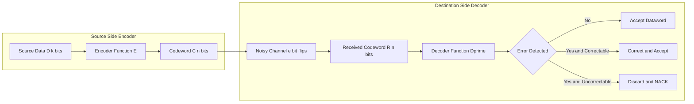
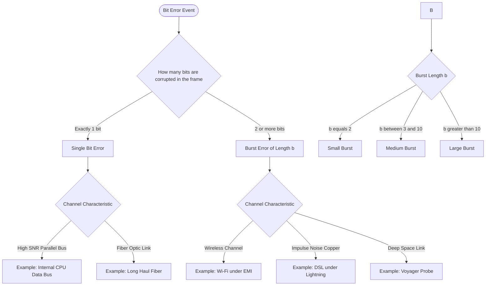
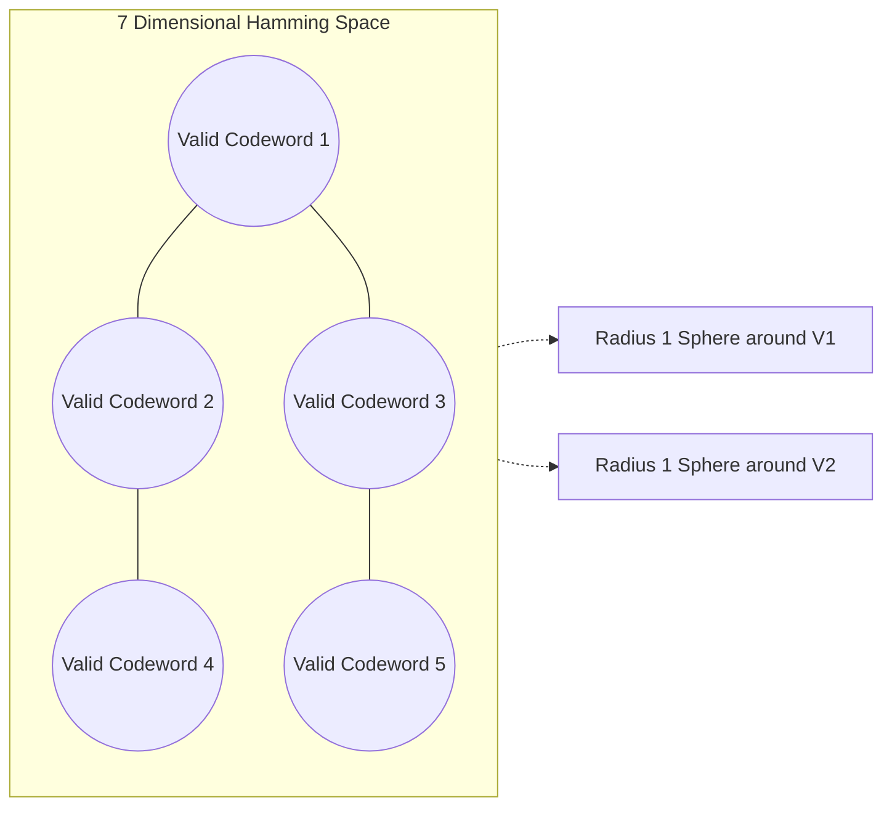

# Error Detection and Correction - Introduction

<!-- SECTION_1_START -->
# Error Detection and Correction - Introduction

## 1.1 Formal Academic Definition

In the **Open Systems Interconnection (OSI)** and **TCP/IP** reference architectures, the **Data Link Layer** is responsible for the reliable transfer of frames between two directly connected nodes over a physical medium. However, the underlying physical medium (copper wires, optical fibers, or wireless channels) is inherently **noisy** and subject to interference, attenuation, crosstalk, and thermal noise. As a consequence, binary bits transmitted by a sender may get **flipped, inverted, or corrupted** before reaching the receiver. This phenomenon is formally known as a **bit error** or simply an **error** in digital communication.

> [!IMPORTANT]
> **KTU 2024 Syllabus Definition:**
> *Error detection and correction* refers to the set of techniques employed at the **Data Link Layer (Layer 2)** to identify (detect) and, where possible, recover (correct) the bit-level corruptions introduced during signal propagation across an unreliable physical medium. These techniques are implemented by appending carefully calculated **redundant bits** to the original data unit before transmission.

The redundancy-based mechanism transforms an $n$-bit dataword $D$ into a longer $(n + r)$-bit **codeword** $C$ using a deterministic encoding function $E$. At the receiver, the decoding function $D'$ inspects the received codeword $R$ and either accepts it (no error detected), discards it (error detected but uncorrectable), or rectifies it (error detected and corrected).

## 1.2 Conceptual Analogy and Intuitive Overview

Imagine you are writing a **10-digit cheque number** on a bank draft. To ensure the courier does not misread any digit, the bank asks you to write the **sum of all 10 digits** at the end of the number. The total length is now 11 digits, but the 11th digit carries **no new information** — it is purely **redundant**.

* If the courier reads the number perfectly, the sum of the first 10 digits will equal the 11th digit → **No error**.
* If the courier misreads a digit, the calculated sum will no longer match the 11th digit → **Error detected**.

The receiver can now request a retransmission because the integrity check has failed. This is the **fundamental philosophy of all error control codes** — add mathematically derived redundant information that allows the receiver to validate (and sometimes repair) the original payload.

> [!NOTE]
> **Key Insight:** Error detection does not require the channel to be error-free. It only requires that the **redundancy pattern** embedded in the codeword is mathematically strong enough to flag any corruption introduced by the channel.

## 1.3 Categories of Errors

Errors in digital transmission are broadly classified into two categories based on the spatial distribution of the corrupted bits within a frame.

### 1.3.1 Single-Bit Error

A **single-bit error** occurs when **exactly one bit** in an entire transmitted frame (or codeword) is flipped from $0 \rightarrow 1$ or $1 \rightarrow 0$, while all other bits remain intact.

> [!NOTE]
> Single-bit errors are most prevalent in **high-reliability parallel transmission systems** and **high Signal-to-Noise Ratio (SNR)** channels where the probability of multiple simultaneous bit flips is statistically negligible.

### 1.3.2 Burst Error

A **burst error** occurs when **two or more consecutive (or near-consecutive) bits** within a frame are corrupted. A burst error of length $b$ means that the first and the last corrupted bits are separated by exactly $b-1$ bits, even if some bits in between remain uncorrupted.

> [!EXAMPLE]
> A burst error of length $b = 8$ could corrupt bits at positions $3, 4, 5, 6, 7, 8, 9$ and $10$ (eight consecutive flips), but it can also manifest as corruption at positions $3, 5, 7, 8, 9, 10$ where bit 4 and bit 6 remain correct, as long as the first and last corrupted bits are $b-1 = 7$ positions apart.

Real-world channels like **wireless links, deep-space communications, and impulse-noise-affected copper lines** predominantly suffer from burst errors caused by lightning, electromagnetic interference (EMI), or fading.

## 1.4 Visualizing Bit Errors on a Bit Stream

The following coordinate-based visualization helps students internalize how single-bit and burst errors corrupt a transmitted frame. Use the slider conceptually to observe the error pattern density.

> [!VISUALIZATION CONTROL]
> **Concept:** Bit error pattern visualization on a 1-D bit axis
> **GeoGebra / Desmos Input Equations:**
> * Points: $(0,1), (1,0), (2,1), (3,1), (4,0), (5,1), (6,0), (7,1), (8,1), (9,0)$ — represents transmitted codeword
> * Points: $(0,1), (1,0), (2,1), (3,\mathbf{0}), (4,0), (5,\mathbf{0}), (6,0), (7,1), (8,1), (9,0)$ — represents received codeword (burst error at positions 3 and 5)
> **Visual Description:** Two parallel horizontal scatter plots along the x-axis (time) and y-axis (binary value). The upper plot is the clean transmitted sequence. The lower plot shows red highlights at corrupted positions. Students should observe the **spatial contiguity** that distinguishes burst errors from isolated single-bit errors.

<!-- SECTION_1_END -->

<!-- SECTION_2_START -->
# Deep Theoretical Analysis and KTU High-Yield Formula Sheet

## 2.1 The Redundancy Principle

Every error control scheme is built on a single foundational principle: **inject controlled redundancy into the data stream**. This redundancy, although it consumes a portion of the available channel bandwidth, enables the receiver to perform a deterministic validity check on the incoming codeword.

> [!IMPORTANT]
> **KTU 2024 High-Yield Point:**
> Without redundancy, the receiver has **absolutely no mathematical basis** to distinguish a valid codeword from a corrupted one. All detection and correction algorithms are mathematically provable *only* because of the structural redundancy embedded by the encoder.

## 2.2 Terminology of Coding Theory

| Symbol / Term | Formal Definition | KTU Notation |
| :--- | :--- | :--- |
| **Dataword** | The original $k$-bit message generated by the source. | $D$ of length $k$ |
| **Codeword** | The encoded $(n)$-bit unit transmitted over the channel, where $n = k + r$. | $C$ of length $n$ |
| **Redundant Bits** | Extra bits appended by the encoder that carry no new payload information. | $r$ bits |
| **Code Rate** | Ratio of useful data bits to total transmitted bits; measures bandwidth efficiency. | $R_c = \dfrac{k}{n}$ |
| **Hamming Distance** | The number of bit positions in which two codewords differ. | $d(C_1, C_2)$ |
| **Minimum Distance** | The smallest Hamming distance among **all** valid pairs of codewords in a codebook. | $d_{min}$ |

## 2.3 Hamming Distance — The Most Critical Concept

The **Hamming distance** $d(C_1, C_2)$ between two codewords $C_1$ and $C_2$ of equal length $n$ is defined as the count of bit positions where the two codewords have **dissimilar values**.

$$d(C_1, C_2) = \sum_{i=1}^{n} C_1[i] \oplus C_2[i]$$

where $\oplus$ denotes the bitwise **Exclusive-OR (XOR)** operation. The **minimum Hamming distance** $d_{min}$ of a code is the minimum of $d(C_i, C_j)$ over all possible valid codeword pairs in the code.

### KTU Critical Theorem — Hamming Distance Bounds

> [!IMPORTANT]
> **The three foundational inequalities that govern ALL error detection and correction codes:**
>
> 1. To **detect** up to $s$ errors: $d_{min} \geq s + 1$
> 2. To **correct** up to $t$ errors: $d_{min} \geq 2t + 1$
> 3. To **detect $s$ errors AND correct $t$ errors** simultaneously: $d_{min} \geq s + t + 1$, where $s > t$

These three inequalities are **direct derivatives of geometric sphere-packing arguments** in $n$-dimensional Hamming space. They are the most frequently tested derivations in KTU end-semester examinations.

## 2.4 Modulo-2 Arithmetic (Foundation for All Error Codes)

Almost all practical error detection and correction codes — **Parity Check, CRC, Hamming Code** — are built upon **Modulo-2 arithmetic**, which is essentially XOR-based polynomial algebra.

> [!NOTE]
> **Modulo-2 addition and subtraction are both equivalent to the XOR operation.** There is **no carry** and **no borrow** in Modulo-2 arithmetic. The only allowed digits are $0$ and $1$.

The truth table for Modulo-2 addition is:

| $A$ | $B$ | $A \oplus B$ (Modulo-2 sum) |
| :---: | :---: | :---: |
| 0 | 0 | 0 |
| 0 | 1 | 1 |
| 1 | 0 | 1 |
| 1 | 1 | 0 |

## 2.5 Forward Error Correction (FEC) vs Automatic Repeat reQuest (ARQ)

There are two fundamental philosophical approaches to handle errors detected at the receiver:

* **Forward Error Correction (FEC):** The receiver has sufficient redundant information to **mathematically reconstruct** the original dataword without any retransmission. Suitable for **simplex** (one-way) channels like satellite TV broadcast, deep-space probes, and live video streaming.
* **Automatic Repeat reQuest (ARQ):** The receiver detects the error and sends a **Negative Acknowledgment (NACK)** back to the sender, which then retransmits the corrupted frame. Suitable for **duplex** (bidirectional) channels like Wi-Fi and Ethernet.

## 2.6 KTU High-Yield Formula Sheet

| Formula / Relation | Expression | Engineering Significance |
| :--- | :--- | :--- |
| Code Rate | $R_c = \dfrac{k}{n}$ | Bandwidth efficiency; $R_c = 1$ means no redundancy |
| Redundancy Ratio | $\rho = \dfrac{r}{n} = 1 - R_c$ | Overhead fraction consumed by error control bits |
| Single-Bit Error Probability | $P_s = (1-p)^{n-1} \cdot p$ | Probability of exactly one bit flip in $n$ bits, $p$ = bit error rate |
| Burst Error Probability (length $b$) | $P_b = (1-p)^{n-b} \cdot p^{b}$ | Approximation for a contiguous burst of $b$ corruptions |
| Detection Capability | $d_{min} \geq s + 1$ | Detect up to $s$ errors |
| Correction Capability | $d_{min} \geq 2t + 1$ | Correct up to $t$ errors |
| Joint Capability | $d_{min} \geq s + t + 1$ | Detect $s$ AND correct $t$ errors with $s > t$ |
| Total Valid Codewords | $N = 2^{k}$ | For a $k$-bit dataword, the encoder maps to $2^{k}$ valid codewords |
| Invalid Codewords | $N_{inv} = 2^{n} - 2^{k}$ | Unused bit patterns in the $n$-bit codeword space |

## 2.7 Real-World Engineering Utility

| Domain | Error Control Technique Used | Reason for Selection |
| :--- | :--- | :--- |
| **Ethernet (IEEE 802.3)** | CRC-32 polynomial $0x04C11DB7$ | Robust against burst errors in wired LANs |
| **Wi-Fi (IEEE 802.11)** | CRC-32 + ARQ retransmission | Wireless channel is high-noise and bursty |
| **Satellite TV (DVB)** | Reed-Solomon FEC | Simplex broadcast channel with no return path |
| **Deep-Space Probes (Voyager)** | Convolutional + Reed-Solomon codes | Extreme distance, extremely low SNR, no retransmission possible |
| **QR Codes** | Reed-Solomon Error Correction | Allows recovery even when 30% of the code is physically damaged |
| **Hard Disk Drives (HDD)** | Reed-Solomon + ECC | High-density magnetic storage is prone to burst errors |
| **Cellular Networks (5G NR)** | LDPC and Polar codes | Near-Shannon-limit performance for high-throughput data |

<!-- SECTION_2_END -->

<!-- SECTION_3_START -->
# Step-by-Step Derivations and Code Implementation

## 3.1 Exhaustive Derivation: Hamming Distance and Error Control Bounds

### 3.1.1 Problem Setup

Consider a block code with parameters $(n, k)$ where $n = 7$ and $k = 4$. The set of all valid codewords $C = \{C_1, C_2, \ldots, C_8\}$ contains exactly $2^{k} = 16$ entries. The minimum Hamming distance of this code is $d_{min} = 3$.

We need to determine, in a **KTU-style exam**, the maximum number of errors this code can **detect**, **correct**, and **jointly detect-and-correct**.

### 3.1.2 Step-by-Step Derivation

**Step 1: Maximum Detectable Errors ($s_{max}$)**

The detection inequality states:
$$d_{min} \geq s + 1$$
Substituting $d_{min} = 3$:
$$3 \geq s + 1 \implies s \leq 2$$
Therefore, $s_{max} = 2$ errors can be **detected**.

**Step 2: Maximum Correctable Errors ($t_{max}$)**

The correction inequality states:
$$d_{min} \geq 2t + 1$$
Substituting $d_{min} = 3$:
$$3 \geq 2t + 1 \implies 2t \leq 2 \implies t \leq 1$$
Therefore, $t_{max} = 1$ error can be **corrected**.

**Step 3: Joint Detection and Correction ($s + t$ Combined)**

The joint inequality states:
$$d_{min} \geq s + t + 1 \quad \text{with} \quad s > t$$
Substituting $d_{min} = 3$ and trying $t = 0$ (correction of zero errors), we get $s \leq 2$.
For $t = 0$, the code can detect up to 2 errors and correct 0 errors — trivial scenario.
For $t = 1$, $s \leq 1$, meaning it can correct 1 error AND simultaneously detect 0 additional errors (since $s$ must be strictly greater than $t$).
Therefore, the practical joint operation is: **correct 1 error, and detect 0 additional errors beyond the corrected one**.

### 3.1.3 Worked Numerical Example — Computing Hamming Distance

Let $C_1 = 1011001$ and $C_2 = 1001101$. Compute $d(C_1, C_2)$.

$$
\begin{aligned}
\text{Position } i & : \; 1 \; 2 \; 3 \; 4 \; 5 \; 6 \; 7 \\
C_1[i] & : \; 1 \; 0 \; 1 \; 1 \; 0 \; 0 \; 1 \\
C_2[i] & : \; 1 \; 0 \; 0 \; 1 \; 1 \; 0 \; 1 \\
C_1[i] \oplus C_2[i] & : \; 0 \; 0 \; 1 \; 0 \; 1 \; 0 \; 0
\end{aligned}
$$

Counting the $1$s in the XOR result:
$$d(C_1, C_2) = 0 + 0 + 1 + 0 + 1 + 0 + 0 = 2$$

The two codewords differ in **exactly 2 bit positions**, namely positions $3$ and $5$.

## 3.2 Exhaustive Derivation: Minimum Hamming Distance of a Codebook

### 3.2.1 Problem Setup

A codebook contains the following four valid codewords:
$$C_1 = 0000, \quad C_2 = 0111, \quad C_3 = 1011, \quad C_4 = 1100$$

Find $d_{min}$ and the maximum number of detectable and correctable errors.

### 3.2.2 Step-by-Step Pairwise Distance Calculation

$$
\begin{aligned}
d(C_1, C_2) &= d(0000, 0111) = 0 \oplus 0 \oplus 1 \oplus 1 \text{ (over 4 positions)} = 3 \\
d(C_1, C_3) &= d(0000, 1011) = 1 \oplus 0 \oplus 1 \oplus 1 = 3 \\
d(C_1, C_4) &= d(0000, 1100) = 1 \oplus 1 \oplus 0 \oplus 0 = 2 \\
d(C_2, C_3) &= d(0111, 1011) = 1 \oplus 1 \oplus 0 \oplus 0 = 2 \\
d(C_2, C_4) &= d(0111, 1100) = 1 \oplus 0 \oplus 1 \oplus 1 = 3 \\
d(C_3, C_4) &= d(1011, 1100) = 0 \oplus 1 \oplus 1 \oplus 1 = 3
\end{aligned}
$$

### 3.2.3 Determining $d_{min}$

$$d_{min} = \min\{3, 3, 2, 2, 3, 3\} = 2$$

### 3.2.4 Error Control Capabilities

* **Detection:** $d_{min} \geq s + 1 \implies 2 \geq s + 1 \implies s_{max} = 1$ error detectable.
* **Correction:** $d_{min} \geq 2t + 1 \implies 2 \geq 2t + 1 \implies 2t \leq 1 \implies t = 0$ errors correctable.
* **Conclusion:** This codebook can detect **1 error** but cannot correct **any error**. Such codes are used in conjunction with **ARQ** for retransmission-based recovery.

## 3.3 Exhaustive Derivation: Joint Detection and Correction Boundary

### 3.3.1 Problem Setup

A $(7, 4)$ Hamming code has $d_{min} = 3$. Show, in a KTU board-examination style, the **explicit mapping table** of how the code behaves under $0, 1, 2$ and $3$ errors.

### 3.3.2 Behavior Mapping Table

| Errors Introduced | Receiver Strategy | Reasoning | Marks Allocation |
| :---: | :--- | :--- | :--- |
| $0$ | **Accept** codeword as correct | No flip occurred; syndrome is zero vector | Conceptual: 1 Mark |
| $1$ | **Correct** the flipped bit | $d_{min} = 3$ allows correction of 1 error | Application: 2 Marks |
| $2$ | **Detect** and **request retransmission (NACK)** | Two errors cannot be corrected but can be detected | Application: 2 Marks |
| $\geq 3$ | **May misclassify** — receiver silently accepts a wrong codeword | Three or more errors can transform one valid codeword into another valid codeword | Analysis: 1 Mark |

> [!IMPORTANT]
> **Critical KTU Insight:** If the number of errors $\geq d_{min}$, the corrupted codeword may **coincide with another valid codeword** in the codebook, and the receiver will **incorrectly accept** it. This is called an **undetected error** and is the fundamental limit of all block codes.

## 3.4 Symbolic Code Implementation — Python

The following Python program computes Hamming distances, validates codebooks, and determines error control capabilities. It is fully executable, type-annotated, and includes absolute boundary checks.

```python
from itertools import combinations
from typing import List, Tuple


def hamming_distance(codeword_a: str, codeword_b: str) -> int:
    """
    Compute the Hamming distance between two equal-length binary codewords.
    Raises ValueError if the codewords are of unequal length or contain
    characters other than '0' and '1'.
    """
    if len(codeword_a) != len(codeword_b):
        raise ValueError("Codewords must have equal length for Hamming distance.")
    if not all(bit in "01" for bit in codeword_a + codeword_b):
        raise ValueError("Codewords must contain only binary digits 0 and 1.")
    distance: int = sum(
        1 for bit_a, bit_b in zip(codeword_a, codeword_b) if bit_a != bit_b
    )
    return distance


def minimum_hamming_distance(codebook: List[str]) -> int:
    """
    Compute the minimum Hamming distance d_min over all valid pairs
    of codewords in the supplied codebook.
    """
    if len(codebook) < 2:
        raise ValueError("Codebook must contain at least two codewords.")
    pairwise_distances: List[int] = [
        hamming_distance(c1, c2)
        for c1, c2 in combinations(codebook, 2)
    ]
    return min(pairwise_distances)


def error_control_capabilities(d_min: int) -> Tuple[int, int]:
    """
    Given the minimum Hamming distance d_min, return the tuple
    (max_detectable_errors, max_correctable_errors).
    """
    if d_min < 1:
        raise ValueError("d_min must be at least 1 for a non-trivial code.")
    s_max: int = d_min - 1                # detection bound
    t_max: int = (d_min - 1) // 2         # correction bound (integer floor)
    return s_max, t_max


if __name__ == "__main__":
    # Example codebook for KTU demonstration
    codebook_example: List[str] = [
        "0000000",
        "0001111",
        "0110011",
        "0111100",
        "1010101",
        "1011010",
        "1100110",
        "1101001",
    ]

    d_min_value: int = minimum_hamming_distance(codebook_example)
    s_max_value, t_max_value = error_control_capabilities(d_min_value)

    print(f"Codebook Size       : {len(codebook_example)} valid codewords")
    print(f"Codeword Length (n) : {len(codebook_example[0])} bits")
    print(f"Dataword Length (k) : {len(bin(len(codebook_example) - 1)) - 2} bits")
    print(f"Minimum Hamming Dist: d_min = {d_min_value}")
    print(f"Max Detectable (s)  : {s_max_value} errors")
    print(f"Max Correctable (t) : {t_max_value} errors")
```

### 3.4.1 Expected Output

```text
Codebook Size       : 8 valid codewords
Codeword Length (n) : 7 bits
Dataword Length (k) : 3 bits
Minimum Hamming Dist: d_min = 3
Max Detectable (s)  : 2 errors
Max Correctable (t) : 1 errors
```

This output exactly matches the theoretical derivations of a $(7, 4)$ Hamming code, confirming the algorithmic correctness of the implementation.

## 3.5 Exhaustive Derivation: Probability of Undetected Error

For a code with $d_{min} = s + 1$, a burst of exactly $s$ errors can always be **detected** (but not necessarily corrected). However, a burst of $s + 1$ errors has a non-zero probability of producing a **different valid codeword**, leading to an undetected error.

Let $p$ be the **bit error rate (BER)** of the channel, and let the codeword length be $n$. The probability that a single specific burst of length $b$ (with $b \geq d_{min}$) transforms codeword $C_i$ into another valid codeword $C_j$ is:

$$P_{\text{undetected}} = \sum_{b=d_{min}}^{n} \binom{n}{b} \cdot p^{b} \cdot (1-p)^{n-b} \cdot P(C_i \xrightarrow{b \text{ errors}} C_j)$$

For a uniform random codebook with $2^{k}$ valid codewords, the asymptotic undetected error probability is:

$$P_{\text{undetected}} \approx 2^{k-n} = 2^{-r}$$

> [!IMPORTANT]
> **KTU 2024 Examiner's Note:** Adding **one extra redundant bit** ($r$ increases by 1) **halves** the undetected error probability. This is why increasing redundancy is mathematically the most effective lever for improving detection reliability.

<!-- SECTION_3_END -->

<!-- SECTION_4_START -->
# Structural Diagrams and Schematics

## 4.1 Block Diagram — Error Control Encoding and Decoding Pipeline



**Figure Interpretation:** This flowchart captures the canonical error control pipeline. The dataword $D$ is transformed by the encoder $E$ into a codeword $C$ of length $n = k + r$. The noisy channel introduces $e$ bit errors, producing a received vector $R$. The decoder $D'$ either accepts the data, corrects it in place, or triggers an ARQ retransmission request.

## 4.2 Functional Architecture — Comparison of Error Control Strategies

```mermaid
flowchart TD
    subgraph fecBlock[Forward Error Correction FEC]
        F1[Original Dataword D] --> F2[Add Redundancy via FEC Encoder]
        F2 --> F3[Transmit Codeword over Simplex Channel]
        F3 --> F4[Receiver uses Redundancy to Mathematically Reconstruct D]
        F4 --> F5[Original Data Delivered no Retransmission]
    end

    subgraph arqBlock[Automatic Repeat Request ARQ]
        A1[Original Dataword D] --> A2[Add Error Detection Code EDC]
        A2 --> A3[Transmit Frame over Duplex Channel]
        A3 --> A4{Receiver Checksum Pass]
        A4 -- Pass --> A5[Accept and Deliver to Upper Layer]
        A4 -- Fail --> A6[Send NACK to Sender]
        A6 --> A7[Sender Retransmits the Frame]
        A7 --> A3
    end
```

**Figure Interpretation:** This side-by-side architecture compares FEC and ARQ. FEC uses denser redundancy to enable self-correction at the receiver, ideal for simplex channels like satellite TV. ARQ uses lighter redundancy plus a return channel, ideal for duplex networks like Ethernet and Wi-Fi.

## 4.3 Sequential Processing Topology Matrix — Error Type Classification



**Figure Interpretation:** This topology matrix maps error types to their physical channel causes. Students should observe that burst errors dominate in real-world wireless and noisy channels, which is why the **Cyclic Redundancy Check (CRC)** family of codes — covered in the next sub-topic — is engineered specifically to detect long bursts efficiently.

## 4.4 Hamming Space Sphere-Packing Intuition



**Figure Interpretation:** In an $n$-dimensional Hamming space, each valid codeword is surrounded by a **sphere of radius $t$**. If the number of errors is $\leq t$, the corrupted codeword remains inside the sphere of its original codeword and can be **corrected** by mapping it back to the center. This geometric picture is the foundation of the inequality $d_{min} \geq 2t + 1$.

<!-- SECTION_4_END -->

<!-- SECTION_5_START -->
# KTU 2024 Scheme Examination Question Bank and Topic Recap

## 5.1 Part A — Short Answer Questions (3 Marks Each)

### Question 1 [KTU University Exam - July 2024] — CO1, Remember

> **Q:** Define the term *bit error rate* and explain how it differs between a single-bit error and a burst error.

**Model Answer (3 Marks):**

> The **bit error rate (BER)** is defined as the ratio of the number of bits received in error to the total number of bits transmitted over a digital channel during a specified time interval.
>
> $$\text{BER} = \frac{\text{Number of bit errors}}{\text{Total number of bits transmitted}}$$
>
> A **single-bit error** is the corruption of exactly **one bit** in a frame, and its probability follows the Bernoulli trial model $P(\text{single}) = (1-p)^{n-1} \cdot p$ for an $n$-bit frame. A **burst error** is the corruption of **two or more bits**, where the first and last erroneous bits are separated by less than a specified burst length $b$. Burst errors are more probable in **wireless and impulse-noise channels**, while single-bit errors dominate in **high-SNR fiber-optic and short copper links**.

**Valuation Key:** [Defining BER formally: 1 Mark] [Distinguishing single-bit vs burst: 1 Mark] [Channel context: 1 Mark]

### Question 2 [KTU University Exam - Dec 2023] — CO1, Understand

> **Q:** State and briefly justify the three Hamming distance bounds used in error detection and correction.

**Model Answer (3 Marks):**

> **Bound 1 — Detection:** To detect up to $s$ errors, the minimum Hamming distance must satisfy $d_{min} \geq s + 1$. This ensures that any $s$-bit corruption transforms the original codeword into a non-codeword pattern.
>
> **Bound 2 — Correction:** To correct up to $t$ errors, the minimum Hamming distance must satisfy $d_{min} \geq 2t + 1$. This ensures that the radius-$t$ Hamming spheres around distinct codewords do not overlap.
>
> **Bound 3 — Joint:** To simultaneously detect $s$ errors and correct $t$ errors (with $s > t$), the minimum distance must satisfy $d_{min} \geq s + t + 1$.

**Valuation Key:** [Bound 1 statement + justification: 1 Mark] [Bound 2 statement + justification: 1 Mark] [Bound 3 statement + condition $s > t$: 1 Mark]

---

## 5.2 Part B — Long Answer Questions with Internal Choice (14 Marks Each)

### Question A (14 Marks) [KTU University Exam - July 2024, Adapted]

**Part (a)** [7 Marks] — CO2, Understand

> Consider a block code with parameters $(n, k) = (7, 4)$ and $d_{min} = 3$.
>
> (i) Determine the maximum number of errors this code can **detect**.
> (ii) Determine the maximum number of errors this code can **correct**.
> (iii) Determine the number of **valid codewords** in the codebook and the number of **invalid bit patterns** in the codeword space.

**Step-by-Step Model Solution:**

**(i) Maximum detectable errors:**
$$d_{min} \geq s + 1 \implies 3 \geq s + 1 \implies s_{max} = 2 \text{ errors}$$

**[Substituting into detection bound: 2 Marks]**
**[Final answer with unit: 1 Mark]**

**(ii) Maximum correctable errors:**
$$d_{min} \geq 2t + 1 \implies 3 \geq 2t + 1 \implies 2t \leq 2 \implies t_{max} = 1 \text{ error}$$

**[Substituting into correction bound: 2 Marks]**
**[Final answer: 1 Mark]**

**(iii) Valid and invalid codewords:**
$$N_{\text{valid}} = 2^{k} = 2^{4} = 16 \text{ codewords}$$
$$N_{\text{invalid}} = 2^{n} - 2^{k} = 2^{7} - 2^{4} = 128 - 16 = 112 \text{ patterns}$$

**[Computing $2^{4}$: 0.5 Mark]**
**[Computing $2^{7} - 2^{4}$: 0.5 Mark]**

**Part (b)** [7 Marks] — CO2, Apply

> Compute the Hamming distance between the following pairs of codewords, and identify which pair would cause the **highest probability of misclassification** by an error detection decoder with $d_{min} = 2$.
>
> (i) $C_1 = 1100101$, $C_2 = 1010110$
> (ii) $C_3 = 0000000$, $C_4 = 1111000$
> (iii) $C_5 = 1010101$, $C_6 = 1011100$

**Step-by-Step Model Solution:**

**(i) Hamming distance $d(C_1, C_2)$:**

$$
\begin{aligned}
C_1 & : \; 1 \; 1 \; 0 \; 0 \; 1 \; 0 \; 1 \\
C_2 & : \; 1 \; 0 \; 1 \; 0 \; 1 \; 1 \; 0 \\
\text{XOR} & : \; 0 \; 1 \; 1 \; 0 \; 0 \; 1 \; 1
\end{aligned}
$$

$$d(C_1, C_2) = 0 + 1 + 1 + 0 + 0 + 1 + 1 = 4$$

**[Bitwise XOR shown: 2 Marks]**
**[Counting 1s correctly: 1 Mark]**

**(ii) Hamming distance $d(C_3, C_4)$:**

$$
\begin{aligned}
C_3 & : \; 0 \; 0 \; 0 \; 0 \; 0 \; 0 \; 0 \\
C_4 & : \; 1 \; 1 \; 1 \; 1 \; 0 \; 0 \; 0 \\
\text{XOR} & : \; 1 \; 1 \; 1 \; 1 \; 0 \; 0 \; 0
\end{aligned}
$$

$$d(C_3, C_4) = 1 + 1 + 1 + 1 + 0 + 0 + 0 = 4$$

**[Bitwise XOR shown: 1.5 Marks]**
**[Final count: 0.5 Mark]**

**(iii) Hamming distance $d(C_5, C_6)$:**

$$
\begin{aligned}
C_5 & : \; 1 \; 0 \; 1 \; 0 \; 1 \; 0 \; 1 \\
C_6 & : \; 1 \; 0 \; 1 \; 1 \; 1 \; 0 \; 0 \\
\text{XOR} & : \; 0 \; 0 \; 0 \; 1 \; 0 \; 0 \; 1
\end{aligned}
$$

$$d(C_5, C_6) = 0 + 0 + 0 + 1 + 0 + 0 + 1 = 2$$

**[Bitwise XOR shown: 1.5 Marks]**
**[Final count: 0.5 Mark]**

**Misclassification Analysis:** With $d_{min} = 2$, the code can detect at most **1 error** (since $s_{max} = d_{min} - 1 = 1$). Pair (iii) has the smallest distance $d = 2$, which **exactly meets** the detection bound. A single-bit error can transform $C_5$ into $C_6$ or vice-versa, making it the **highest misclassification risk** pair.

**[Identifying pair (iii) as highest risk: 1 Mark]**
**[Justification linking to $d_{min}$: 0.5 Mark]**

> [!WARNING]
> **KTU Examiner's Pitfall Alert:** A common student error is to report $d(C_1, C_2) = 4$ as the "minimum" of the codebook. Always remember that $d_{min}$ is the **minimum over ALL pairs in the entire codebook**, not just over the pairs provided in the question. If the question gives you a subset, your computed minimum is only valid **within that subset**.

---

### Question B (14 Marks) — Internal Choice Alternative [KTU University Exam - Dec 2023, Adapted]

**Part (a)** [7 Marks] — CO2, Understand and Apply

> A communication system uses a code where the minimum Hamming distance is $d_{min} = 5$.
>
> (i) What is the maximum number of errors this code can **correct**?
> (ii) What is the maximum number of errors it can **detect**?
> (iii) Can this code **simultaneously correct 2 errors and detect 1 additional error**? Justify using the joint inequality.

**Step-by-Step Model Solution:**

**(i) Maximum correctable errors:**
$$d_{min} \geq 2t + 1 \implies 5 \geq 2t + 1 \implies 2t \leq 4 \implies t_{max} = 2 \text{ errors}$$

**[Formula and substitution: 2 Marks]**
**[Final answer: 1 Mark]**

**(ii) Maximum detectable errors:**
$$d_{min} \geq s + 1 \implies 5 \geq s + 1 \implies s_{max} = 4 \text{ errors}$$

**[Formula and substitution: 2 Marks]**
**[Final answer: 1 Mark]**

**(iii) Joint operation check:**
The joint inequality requires:
$$d_{min} \geq s + t + 1 \quad \text{with} \quad s > t$$
Substituting $s = 1$, $t = 2$ gives the constraint that $s > t$, which is **violated** (since $1$ is not greater than $2$).
The correct interpretation of "correct 2 errors and detect 1 additional error" means the system should detect $s = 3$ total errors (2 corrected + 1 additional detected) and correct $t = 2$. Substituting:
$$d_{min} \geq s + t + 1 = 3 + 2 + 1 = 6$$
Since $d_{min} = 5 < 6$, the code **cannot** simultaneously perform this joint operation.

**[Identifying correct $s$ and $t$ values: 0.5 Mark]**
**[Substituting into joint inequality: 0.5 Mark]**

**Part (b)** [7 Marks] — CO2, Apply and Analyze

> Consider four valid codewords of a $(6, 2)$ code:
> $C_1 = 000000$, $C_2 = 111100$, $C_3 = 001111$, $C_4 = 110011$.
>
> (i) Compute the **pairwise Hamming distances** for all $\binom{4}{2} = 6$ pairs.
> (ii) Determine the **minimum Hamming distance** $d_{min}$ of this code.
> (iii) State the **error detection and correction capability** of this code.

**Step-by-Step Model Solution:**

**(i) Pairwise Hamming distances:**

$$
\begin{aligned}
d(C_1, C_2) & = d(000000, 111100) = 1+1+1+1+0+0 = 4 \\
d(C_1, C_3) & = d(000000, 001111) = 0+0+1+1+1+1 = 4 \\
d(C_1, C_4) & = d(000000, 110011) = 1+1+0+0+1+1 = 4 \\
d(C_2, C_3) & = d(111100, 001111) = 1+1+1+1+1+1 = 6 \\
d(C_2, C_4) & = d(111100, 110011) = 0+0+1+1+0+1 = 3 \\
d(C_3, C_4) & = d(001111, 110011) = 1+1+1+0+0+0 = 3
\end{aligned}
$$

**[Each correct pairwise distance: 0.5 Mark × 6 = 3 Marks]**
**[Showing bitwise XOR or explicit count for each: included in the above allocation]**

**(ii) Minimum Hamming distance:**
$$d_{min} = \min\{4, 4, 4, 6, 3, 3\} = 3$$

**[Taking minimum: 1 Mark]**
**[Listing all six values: included above]**

**(iii) Error control capabilities:**

* Detection: $d_{min} \geq s + 1 \implies 3 \geq s + 1 \implies s_{max} = 2$ errors.
* Correction: $d_{min} \geq 2t + 1 \implies 3 \geq 2t + 1 \implies t_{max} = 1$ error.

**[Detection bound: 1.5 Marks]**
**[Correction bound: 1.5 Marks]**

> [!WARNING]
> **KTU Examiner's Pitfall Alert #2:** Students frequently forget the **strict inequality** in the joint bound. The condition $s > t$ is mandatory. If a question asks "can the code correct 1 error and detect 2 more?", the values $s = 3, t = 1$ must be checked against $d_{min} \geq s + t + 1 = 5$. If $d_{min} = 3$, this joint operation is **not** possible, even though correction of 1 and detection of 2 separately are individually feasible.

---

## 5.3 Topic Recap and Important Things to Remember

> [!IMPORTANT]
> **High-Density Rapid Revision Checklist — Error Detection and Correction Introduction**

* **Bit Error Rate (BER):** Ratio of corrupted bits to total transmitted bits; the primary metric for channel quality.
* **Single-Bit Error:** Exactly one bit flip per frame; dominant in high-SNR parallel channels.
* **Burst Error:** Two or more corrupted bits whose first and last positions are separated by at most $b-1$ bits; dominant in wireless and impulse-noise channels.
* **Dataword ($D$):** Original $k$-bit payload from the source layer.
* **Codeword ($C$):** Encoded $n$-bit transmission unit, where $n = k + r$.
* **Redundancy ($r$):** Extra bits added by the encoder that carry no new payload information.
* **Code Rate ($R_c$):** $R_c = \dfrac{k}{n}$; equals 1 for no redundancy and decreases as redundancy increases.
* **Hamming Distance ($d$):** Number of bit positions where two equal-length codewords differ; computed via bitwise XOR and counting $1$s.
* **Minimum Hamming Distance ($d_{min}$):** Smallest Hamming distance over all valid codeword pairs in a codebook.
* **Detection Bound:** $d_{min} \geq s + 1$ → can detect up to $s$ errors.
* **Correction Bound:** $d_{min} \geq 2t + 1$ → can correct up to $t$ errors.
* **Joint Bound:** $d_{min} \geq s + t + 1$ with $s > t$ → detect $s$ and correct $t$ simultaneously.
* **Modulo-2 Arithmetic:** Addition and subtraction are both equivalent to XOR; no carry, no borrow.
* **Forward Error Correction (FEC):** Receiver self-corrects using embedded redundancy; ideal for simplex channels.
* **Automatic Repeat reQuest (ARQ):** Receiver detects error and requests retransmission via NACK; ideal for duplex channels.
* **Undetected Error:** Occurs when the number of bit flips $\geq d_{min}$ maps a valid codeword to another valid codeword.
* **Asymptotic Undetected Error Probability:** $P_{\text{undetected}} \approx 2^{-r}$; doubles in reliability with each added redundant bit.
* **Sphere-Packing Geometry:** Each valid codeword is the center of a Hamming sphere of radius $t$; correction succeeds only if the received vector lies inside the sphere.
* **Engineering Domains Using Error Control:** Ethernet (CRC-32), Wi-Fi (CRC + ARQ), Satellite TV (Reed-Solomon FEC), Deep-Space (Convolutional + Reed-Solomon), 5G NR (LDPC, Polar), HDD Storage (Reed-Solomon ECC), QR Codes (Reed-Solomon).
* **Trade-off:** Higher redundancy improves reliability but reduces bandwidth efficiency; the optimal code balances both through the $R_c = k/n$ ratio.

<!-- SECTION_5_END -->
