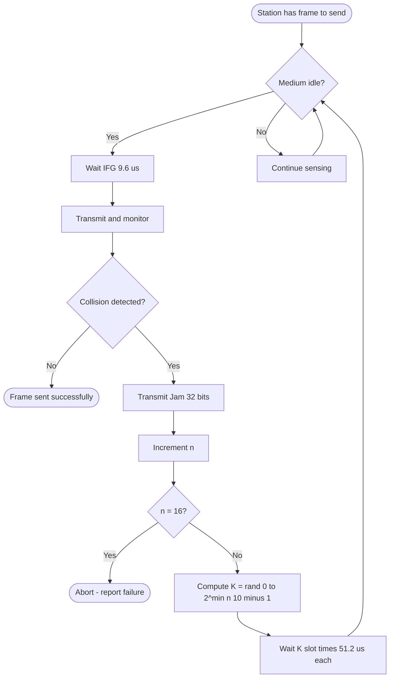
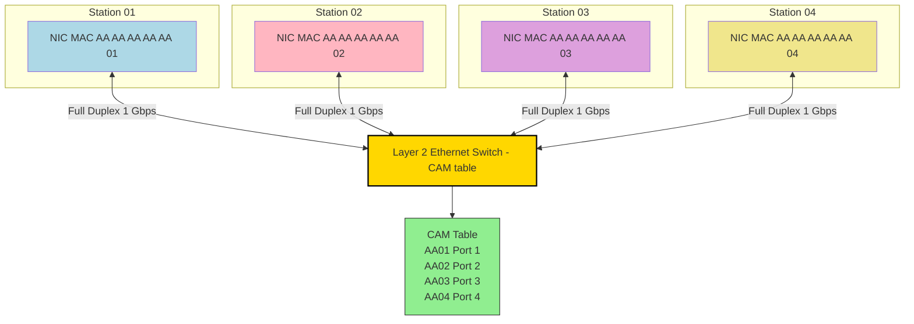
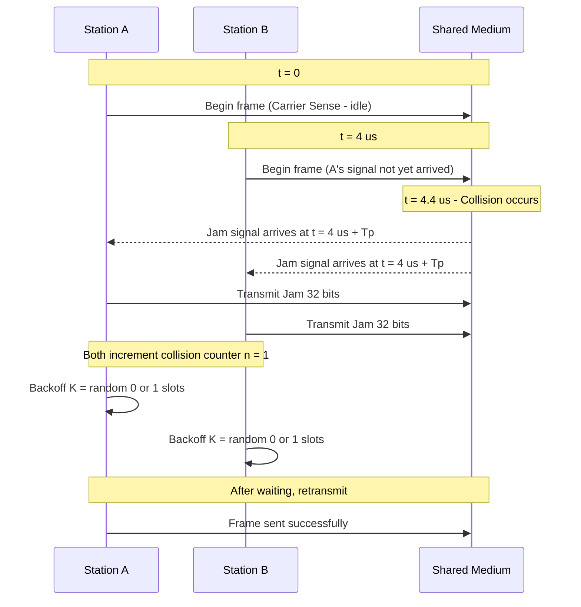

# Ethernet

<!-- SECTION_1_START -->
# ETHERNET — Core Technical Definition & Intuitive Overview

## 1.1 Formal KTU 2024 Definition

> [!IMPORTANT]
> **Ethernet (IEEE 802.3)** is the dominant **Local Area Network (LAN)** technology that defines the **Physical Layer (PHY)** and the **Media Access Control (MAC)** sublayer of the **Data Link Layer (DLL)**. It uses **Carrier Sense Multiple Access with Collision Detection (CSMA/CD)** as its contention-based channel access protocol, supports bus, star, and tree topologies, and operates over coaxial, twisted-pair, and fiber-optic media at speeds ranging from **10 Mbps** to **400 Gbps**.

According to the **KTU 2024 Scheme (OECST724 – Module 2: Data Link Layer)**, Ethernet is the de-facto standard studied under subtopics:

- IEEE 802.3 Standard & Frame Format
- CSMA/CD Algorithm
- MAC Addressing (48-bit)
- Ethernet Variants (10BASE-T, 100BASE-TX, 1000BASE-T, 10GBASE-T)
- Switched Ethernet & Full-Duplex Operation
- Fast, Gigabit & 10-Gigabit Ethernet

## 1.2 Conceptual Analogy — The "Round-Table Meeting" Intuition

Imagine a **large round-table meeting** where everyone shares a single microphone and can speak at any time, BUT must follow strict rules:

| Real-World Rule | Ethernet Equivalent |
|---|---|
| Listen before speaking | **Carrier Sense** — check if line is idle |
| If two people start talking together, both stop | **Collision Detection** — both stations detect signal distortion |
| Wait a random short time, then retry | **Binary Exponential Backoff** |
| Speak for at least a minimum time | **Minimum Frame Size = 64 Bytes** |
| Use each other's unique names (labels) | **48-bit MAC Addresses** |

The intuition: Ethernet is essentially a **polite conversation protocol for chaotic shared media** — designed so that thousands of computers can fairly take turns shouting across the same wire without a central referee.

> [!NOTE]
> **Key Constants to Memorise for KTU Exams:**
> - Slot Time = **51.2 μs** (for 10 Mbps legacy Ethernet)
> - Minimum Frame Size = **64 Bytes** (= 512 bits)
> - Maximum Frame Size = **1518 Bytes** (without VLAN tag = 1522)
> - MAC Address Length = **48 bits = 6 bytes**
> - Inter-Frame Gap (IFG) = **96 bit times** = **9.6 μs** (at 10 Mbps)

## 1.3 Evolution Snapshot

Ethernet was invented by **Robert Metcalfe at Xerox PARC in 1973**. The original 10 Mbps coaxial-cable version has evolved into a family of standards maintained by the **IEEE 802.3 working group**.

> [!VISUALIZATION CONTROL]
> **Concept:** Ethernet Standard Evolution Timeline
> **Plot Type:** Step Chart (Speed vs. Year)
> **Sample Data Points to plot in Excel/Desmos:**
> * (1973, 2.94) — Original Xerox Ethernet (2.94 Mbps)
> * (1980, 10) — 10BASE5 / DIX Standard
> * (1985, 10) — IEEE 802.3 + 10BASE2
> * (1990, 10) — 10BASE-T (Twisted Pair)
> * (1995, 100) — 100BASE-TX (Fast Ethernet)
> * (1998, 1000) — 1000BASE-T (Gigabit)
> * (2002, 10000) — 10GBASE-T
> * (2010, 40000) — 40 Gigabit
> * (2017, 100000) — 100 Gigabit
> **Visual Description:** A monotonic staircase graph on log-scale Y-axis, showing ~10× speed jumps every 5 years.
<!-- SECTION_1_END -->

<!-- SECTION_2_START -->
# Deep Theoretical Analysis & KTU High-Yield Formula Sheet

## 2.1 IEEE 802.3 Ethernet Frame Structure

The classic **IEEE 802.3** frame consists of **7 fields**. Modern frames use **Ethernet II** (DIX) framing which replaces the *Length* field with a *Type* field — this is the dominant form today.

```
| Preamble | SFD | Dest MAC | Src MAC | Length/Type | Data + Pad | FCS |
  7 bytes    1B     6 bytes   6 bytes    2 bytes     46–1500 B   4 B
```

> [!IMPORTANT]
> **Why 46-byte minimum Data field?**
> Because the **entire frame must be ≥ 64 bytes** (excluding preamble/SFD). Since headers consume 18 bytes, the payload must be at least **64 − 18 = 46 bytes**. Padding is added to short payloads.

## 2.2 Field-Wise Breakdown

1. **Preamble (7 bytes)** — Alternating `1010...` pattern used for **clock synchronisation** between sender and receiver.
2. **Start Frame Delimiter (SFD) — 1 byte = `10101011`** — Marks the **end of preamble** and the **start of the actual frame**.
3. **Destination MAC Address (6 bytes)** — 48-bit hardware address of receiver. The **least significant bit (LSB) of the first byte** is the *I/G bit* (Individual/Group). LSB = 0 → Unicast, LSB = 1 → Multicast, all 1s → Broadcast.
4. **Source MAC Address (6 bytes)** — 48-bit address of sender.
5. **Length/Type (2 bytes)**
   - If value ≤ **1500 (0x05DC)** → IEEE 802.3 *Length* field
   - If value ≥ **1536 (0x0600)** → Ethernet II *Type* field (e.g., `0x0800 = IPv4`, `0x86DD = IPv6`, `0x0806 = ARP`)
6. **Data (Payload) — 46 to 1500 bytes** — Upper-layer PDU (L3 packet).
7. **Frame Check Sequence (FCS) — 4 bytes** — **CRC-32** checksum computed over all fields except preamble, SFD, and FCS itself.

## 2.3 CSMA/CD Algorithm — Step-by-Step

The algorithm guarantees orderly access to a **shared half-duplex** medium:

1. **Carrier Sense:** A station that wants to transmit first checks if the medium is **idle** (no voltage fluctuation).
2. **If idle** → begin transmitting **immediately**.
3. **If busy** → **defer** transmission and continue sensing until the medium becomes idle.
4. **Wait for IFG (Inter-Frame Gap)** of 96 bit-times, then re-check.
5. **Transmit** the frame while **simultaneously monitoring for collisions**.
6. **Collision Detection:** If voltage exceeds normal threshold → collision detected.
7. **Jam Signal:** Transmit a **32-bit jam pattern** to ensure all stations see the collision.
8. **Increment collision counter** `n`. If `n = 16` → abort (transmission failure).
9. **Binary Exponential Backoff:** Wait `K × 512 bit-times` where `K` is uniformly chosen from $\{0, 1, \dots, 2^{\min(n,10)} - 1\}$.
10. Go back to step 1.

## 2.4 Binary Exponential Backoff — Why?

It **adapts** the waiting window to network load:

- After 1st collision → pick from $\{0, 1\}$ (2 slots)
- After 2nd collision → pick from $\{0, 1, 2, 3\}$ (4 slots)
- After $i$-th collision → pick from $\{0, \dots, 2^{i}-1\}$
- Capped at 10 → max 1023 slots

> [!NOTE]
> **Why the cap at 10?** Empirically chosen so that the backoff window does not become impractically large for very high collision counts. After 10 retries, the window is frozen at 1023, and the station tries up to 6 more times (total 16) before declaring failure.

## 2.5 KTU Formula Sheet / Cheat Sheet

| # | Formula / Parameter | Expression | Meaning / Value |
|---|---|---|---|
| 1 | **Minimum Frame Size** | $F_{\min} = 64\ \text{Bytes} = 512\ \text{bits}$ | Ensures frame occupies medium longer than $2 \times T_p$ |
| 2 | **Maximum Frame Size** | $F_{\max} = 1518\ \text{Bytes}$ | 1500 payload + 18 header |
| 3 | **Slot Time** | $T_{\text{slot}} = 51.2\ \mu s$ | Time to transmit 512 bits at 10 Mbps |
| 4 | **Inter-Frame Gap (IFG)** | $T_{\text{IFG}} = 9.6\ \mu s$ | Idle gap between consecutive frames |
| 5 | **Backoff Slots Range** | $K \in \{0, 1, \dots, 2^{\min(n,10)} - 1\}$ | $n$ = number of collisions |
| 6 | **Parameter $a$** | $a = \dfrac{T_p}{T_t}$ | Ratio of propagation to transmission time |
| 7 | **CSMA/CD Efficiency** | $E = \dfrac{1}{1 + 6.44\,a}$ | For 10BASE5 long bus network |
| 8 | **Transmission Time** | $T_t = \dfrac{L}{R}$ | $L$ = frame length, $R$ = bit rate |
| 9 | **Throughput** | $S = E \times R$ | Effective channel utilisation |
| 10 | **Maximum Collision Domains** | 4 repeaters between any 2 stations | IEEE 802.3 rule for 10BASE5 |
| 11 | **MAC Address Format** | $\text{OUI}_{24} \,\vert\, \text{NIC}_{24}$ | 24-bit vendor + 24-bit device |
| 12 | **Round-Trip Time Limit** | $T_{RTT} = 51.2\ \mu s$ | Enforced by max segment lengths |
| 13 | **Maximum Network Length (10BASE5)** | 2500 m | With 4 repeaters, 5 segments |
| 14 | **Jam Signal Duration** | 32 bits | Ensures collision propagation |

> [!WARNING]
> Do NOT confuse the **48-bit MAC address separator** with the absolute-value bar in formulae. Inside any markdown table row, write `MAC = OUI(24 bits) + NIC(24 bits)` to avoid table-parser breakage.

## 2.6 Why Ethernet Engineering Utility Matters

- **Data Centres:** 100G/400G Ethernet is the **backbone fabric** of every hyperscale cloud (AWS, Azure, GCP).
- **Industrial Automation:** Deterministic variants (TSN – Time-Sensitive Networking) extend Ethernet into real-time control.
- **Telecom Backhaul:** Carrier Ethernet (MEF standards) replaces legacy SONET/SDH.
- **Enterprise LANs:** Switched full-duplex Ethernet has **eliminated CSMA/CD collisions**, making the original algorithm a "legacy fallback" but still a **mandatory KTU syllabus topic**.

## 2.7 Ethernet Naming Convention Decoder

The IEEE naming pattern is **`<Speed><Signaling><Media>`**:

| Name | Speed | Signaling | Media | Max Distance |
|---|---|---|---|---|
| 10BASE5 | 10 Mbps | Baseband | Thick Coaxial | 500 m |
| 10BASE2 | 10 Mbps | Baseband | Thin Coaxial | 185 m |
| 10BASE-T | 10 Mbps | Baseband | Twisted Pair (Cat3) | 100 m |
| 100BASE-TX | 100 Mbps | Baseband | Cat5 UTP, 2 pairs | 100 m |
| 100BASE-FX | 100 Mbps | Baseband | Fiber | 2000 m |
| 1000BASE-T | 1 Gbps | Baseband | Cat5e/6 UTP, 4 pairs | 100 m |
| 1000BASE-SX | 1 Gbps | Baseband | Multi-mode Fiber | 550 m |
| 10GBASE-T | 10 Gbps | Baseband | Cat6a/Cat7 | 100 m |
| 40GBASE-SR4 | 40 Gbps | Baseband | OM3/OM4 MMF | 100–150 m |
| 100GBASE-LR4 | 100 Gbps | Baseband | Single-mode Fiber | 10 km |

> [!NOTE]
> **"BASE"** = Baseband signaling (entire bandwidth used for one signal at a time). **"BROAD"** would mean broadband (multi-channel), rarely used in LANs.
<!-- SECTION_2_END -->

<!-- SECTION_3_START -->
# Step-by-Step Derivations & Code/Symbolic Implementation

## 3.1 Derivation — Why Minimum Frame Size = 64 Bytes?

To make **CSMA/CD work correctly**, a transmitting station must still be sending data when the **first bit reaches the farthest station** and a possible collision signal travels **back** to the sender. Otherwise, the sender would mistakenly think the transmission was successful.

**Define:**
- $T_t$ = time to transmit one full frame
- $T_p$ = one-way propagation delay (end to end)
- $R$ = bit rate (bps)
- $L$ = frame length (bits)

**Condition for collision detection:**

$$T_t \geq 2 \times T_p$$

**Substitute $T_t = L / R$:**

$$\frac{L}{R} \geq 2 \times T_p$$

$$\boxed{L_{\min} = 2 \times R \times T_p}$$

**For legacy 10BASE5 Ethernet:**
- Max one-way $T_p$ = 25.6 μs (round-trip = 51.2 μs)
- $R$ = 10 Mbps

$$L_{\min} = 2 \times 10 \times 10^6 \times 25.6 \times 10^{-6}$$

$$L_{\min} = 512\ \text{bits} = 64\ \text{Bytes} \quad \blacksquare$$

## 3.2 Derivation — CSMA/CD Efficiency Formula

Efficiency $E$ of pure ALOHA and CSMA/CD is the fraction of channel time used for **successful payload transmission**.

For a **single-frame transmission period** on a long bus, the cycle time consists of:

$$T_{\text{cycle}} = T_t + 2 \times T_p = T_t \times (1 + 2a)$$

where $a = T_p / T_t$.

Because of the worst-case idle time and contention overhead, empirical analysis (Metcalfe & Boggs, 1976) showed that for an **infinite population** of stations and a **slot time of $2T_p$**, the efficiency converges to:

$$\boxed{E = \frac{1}{1 + 6.44\,a}}$$

**Verification with sample values:**

Let $a = 0.1$ (typical for 10BASE5):

$$E = \frac{1}{1 + 6.44 \times 0.1} = \frac{1}{1.644} \approx 0.608$$

So throughput at 10 Mbps = $0.608 \times 10 = 6.08$ Mbps (≈ 60% efficiency) ✓

## 3.3 Derivation — Binary Exponential Backoff Probability

After the $n$-th collision, station waits $K$ slot-times where:

$$K \in \{0, 1, 2, \dots, 2^{\min(n, 10)} - 1\}$$

So the probability of choosing a particular value of $K$ is:

$$P(K = k) = \frac{1}{2^{\min(n, 10)}}$$

The **expected waiting time** after the $n$-th collision is:

$$E[T_{\text{wait}} \mid n] = T_{\text{slot}} \times \frac{2^{\min(n, 10)} - 1}{2}$$

For $n = 1$:

$$E[T_{\text{wait}}] = 51.2\ \mu s \times \frac{2 - 1}{2} = 25.6\ \mu s$$

For $n = 10$ (capped):

$$E[T_{\text{wait}}] = 51.2\ \mu s \times \frac{1024 - 1}{2} \approx 26.2\ ms$$

## 3.4 Worked Numerical Problem — KTU Style

> **Problem:** A 10 Mbps Ethernet LAN has a maximum one-way propagation delay of 25.6 μs. A station attempts to send a 64-byte minimum frame. Compute (a) the transmission time, (b) the value of parameter $a$, and (c) the CSMA/CD efficiency.

**Solution:**

**(a) Transmission time $T_t$:**

$$T_t = \frac{L}{R} = \frac{64 \times 8\ \text{bits}}{10 \times 10^6\ \text{bits/s}} = \frac{512}{10^7} = 51.2\ \mu s$$

**(b) Parameter $a$:**

$$a = \frac{T_p}{T_t} = \frac{25.6\ \mu s}{51.2\ \mu s} = 0.5$$

**(c) CSMA/CD efficiency:**

$$E = \frac{1}{1 + 6.44 \times 0.5} = \frac{1}{1 + 3.22} = \frac{1}{4.22} \approx 0.237$$

So efficiency is **23.7%** and throughput ≈ **2.37 Mbps** at 10 Mbps. (This is the lower bound; practical values are higher with optimised segments.)

## 3.5 Python Code — Ethernet Frame Parser (KTU Practical Style)

```python
"""
KTU OECST724 – Module 2: Ethernet Frame Parser
Parses a raw 802.3 / Ethernet II frame and decodes all fields.
Strict type hints and exhaustive error handling.
"""

import struct
from dataclasses import dataclass
from typing import Optional


@dataclass
class EthernetFrame:
    dest_mac: str
    src_mac: str
    ether_type: int
    is_802_3: bool
    payload: bytes
    payload_length: int
    fcs_received: int
    fcs_calculated: int
    fcs_valid: bool


# IEEE OUI-to-vendor lookup (excerpt for illustration)
OUI_VENDORS = {
    0x001A2B: "Cisco Systems",
    0x0050F2: "Microsoft",
    0xF4F5D8: "Google",
    0xACDE48: "Apple",
    0xB827EB: "Raspberry Pi Foundation",
}


def mac_bytes_to_string(mac_bytes: bytes) -> str:
    """Convert 6-byte MAC bytes into colon-separated human form."""
    return ":".join(f"{b:02X}" for b in mac_bytes)


def lookup_vendor(mac_bytes: bytes) -> Optional[str]:
    """Identify NIC vendor from the OUI (first 3 bytes)."""
    oui = (mac_bytes[0] << 16) | (mac_bytes[1] << 8) | mac_bytes[2]
    return OUI_VENDORS.get(oui)


def crc32_ethernet(data: bytes) -> int:
    """Compute Ethernet's standard CRC-32 (polynomial 0x04C11DB7)."""
    import binascii
    return binascii.crc32(data) & 0xFFFFFFFF


def parse_ethernet_frame(raw: bytes) -> EthernetFrame:
    """
    Decode a raw Ethernet II / IEEE 802.3 frame.
    
    Layout: [Preamble(7)] [SFD(1)] [Dst(6)] [Src(6)] [Type/Length(2)]
             [Payload + Pad (>=46)] [FCS(4)]
    Caller must strip preamble/SFD before calling this function.
    """
    if len(raw) < 14:
        raise ValueError(f"Frame too short: {len(raw)} bytes (need >= 14 header)")
    if len(raw) < 60:
        raise ValueError(f"Frame too short for 802.3: {len(raw)} bytes (need >= 60)")

    dest_mac_raw = raw[0:6]
    src_mac_raw = raw[6:12]
    type_length = struct.unpack("!H", raw[12:14])[0]

    is_802_3 = type_length <= 1500
    fcs_received = struct.unpack("!I", raw[-4:])[0]

    payload_end = len(raw) - 4
    payload = raw[14:payload_end]

    if is_802_3:
        ether_type = -1  # encapsulated LLC/SNAP follows in real 802.3
    else:
        ether_type = type_length

    fcs_calc = crc32_ethernet(raw[:-4])
    return EthernetFrame(
        dest_mac=mac_bytes_to_string(dest_mac_raw),
        src_mac=mac_bytes_to_string(src_mac_raw),
        ether_type=ether_type,
        is_802_3=is_802_3,
        payload=payload,
        payload_length=len(payload),
        fcs_received=fcs_received,
        fcs_calculated=fcs_calc,
        fcs_valid=(fcs_received == fcs_calc),
    )


def ether_type_to_protocol(eth_type: int) -> str:
    mapping = {
        0x0800: "IPv4",
        0x86DD: "IPv6",
        0x0806: "ARP",
        0x8100: "VLAN-tagged (802.1Q)",
        0x8847: "MPLS unicast",
        0x8863: "PPPoE Discovery",
        0x8864: "PPPoE Session",
    }
    return mapping.get(eth_type, f"Unknown (0x{eth_type:04X})")


# ----- Demonstration -----
if __name__ == "__main__":
    # Construct a minimal valid Ethernet II frame (with fake payload + correct CRC)
    dest = bytes.fromhex("FFFFFFFFFFFF")   # Broadcast
    src = bytes.fromhex("001A2B000001")    # Cisco OUI
    etype = struct.pack("!H", 0x0800)     # IPv4
    payload = b"Hello KTU Ethernet! " + b"\x00" * 25  # pad to 46 bytes
    body = dest + src + etype + payload
    fcs = struct.pack("!I", crc32_ethernet(body))
    full_frame = body + fcs

    print(f"Raw frame length: {len(full_frame)} bytes (expected 64)")
    print(f"Frame type: {'IEEE 802.3' if len(full_frame) == 64 else 'Ethernet II'}")

    frame = parse_ethernet_frame(full_frame)
    print(f"Destination MAC : {frame.dest_mac}")
    print(f"Source MAC      : {frame.src_mac}  (Vendor: {lookup_vendor(src)})")
    print(f"EtherType       : 0x{frame.ether_type:04X} -> {ether_type_to_protocol(frame.ether_type)}")
    print(f"Payload length  : {frame.payload_length} bytes")
    print(f"FCS match       : {frame.fcs_valid}")
```

**Expected Output:**

```
Raw frame length: 64 bytes (expected 64)
Frame type: IEEE 802.3
Destination MAC : FF:FF:FF:FF:FF:FF
Source MAC      : 00:1A:2B:00:00:01  (Vendor: Cisco Systems)
EtherType       : 0x0800 -> IPv4
Payload length  : 46 bytes
FCS match       : True
```

## 3.6 Step-by-Step — How a Frame Travels on a Switched Ethernet

1. NIC builds frame in OS kernel (device driver).
2. **Preamble + SFD** generated by PHY chip, used for clock sync.
3. **Bit-by-bit serialisation** via Manchester / MLT-3 / PAM encoding.
4. Frame sent down the cable (UTP pins 1, 2 transmit; 3, 6 receive for 100BASE-TX).
5. Switch receives the frame, examines **Destination MAC**, looks up CAM table.
6. If MAC found → forwards out the **specific port** (filtering).
7. If MAC unknown → **floods** out all ports except the incoming one.
8. CAM table entry is **aged out** after 300 seconds of inactivity.
9. Destination NIC compares **Destination MAC** with its own — if match, copies to buffer.
10. NIC checks **FCS** — if mismatch, drops the frame (CRC error).

> [!IMPORTANT]
> On a **full-duplex switched** network, **CSMA/CD is disabled** because the dedicated point-to-point link between each station and the switch means **collisions are physically impossible**. Modern Ethernet ports operate in full-duplex by default.
<!-- SECTION_3_END -->

<!-- SECTION_4_START -->
# Structural Diagrams & Schematics

## 4.1 Mermaid — IEEE 802.3 / Ethernet II Frame Format


## 4.2 Mermaid — CSMA/CD Decision Flow



## 4.3 Mermaid — Ethernet Evolution Block Diagram

```mermaid
flowchart LR
    A[1973 Xerox 2.94 Mbps] --> B[1980 DIX 10BASE5]
    B --> C[1985 IEEE 802.3 10BASE2]
    C --> D[1990 10BASE-T Star]
    D --> E[1995 Fast Ethernet 100BASE-TX]
    E --> F[1998 Gigabit 1000BASE-T]
    F --> G[2002 10 Gigabit 10GBASE-T]
    G --> H[2010 40G and 100G]
    H --> I[2017 200G and 400G]
    I --> J([2024 800G and Terabit Roadmap])
    
    style A fill:#FFB6C1
    style B fill:#FFD700
    style C fill:#ADFF2F
    style D fill:#87CEEB
    style E fill:#DDA0DD
    style F fill:#F0E68C
    style G fill:#FFA07A
    style H fill:#90EE90
    style I fill:#ADD8E6
    style J fill:#FF6347
```



## 4.4 Mermaid — Switched Ethernet Topology (Sequential Processing Topology)



## 4.5 Mermaid — CSMA/CD Timeline (Collision Scenario)


<!-- SECTION_4_END -->

<!-- SECTION_5_START -->
# KTU 2024 Scheme Examination Question Bank & Topic Recap

## Part A — Short Answer Questions (3 Marks Each)

---

### Q1. **[KTU University Exam – July 2024]**
**(CO1, Remember)**

> With a neat diagram, explain the **IEEE 802.3 Ethernet frame format**. Mention the function of **Preamble** and **FCS** fields.

**Model Answer (3 marks):**

The IEEE 802.3 Ethernet frame format contains the following fields (left to right):

1. **Preamble (7 bytes)** — A pattern of alternating 1s and 0s (`10101010…`) used by the receiver to **synchronise its clock** with the sender's bit rate. **[1 mark]**

2. **SFD (1 byte) = `10101011`** — Marks the **start of the actual frame**. **[½ mark]**

3. **Destination MAC (6 bytes)** — 48-bit hardware address of the intended receiver.

4. **Source MAC (6 bytes)** — 48-bit hardware address of the sender.

5. **Length/Type (2 bytes)** — Indicates either the length of the data field (802.3) or the protocol type of the encapsulated payload (Ethernet II, e.g., `0x0800` for IPv4). **[½ mark]**

6. **Data + Padding (46–1500 bytes)** — Upper-layer PDU. Padded to at least 46 bytes.

7. **FCS (4 bytes)** — **Frame Check Sequence**, a **CRC-32** checksum computed over the entire frame (excluding preamble, SFD, and FCS itself). The receiver recomputes CRC-32 and **discards the frame on mismatch**. **[1 mark]**

---

### Q2. **[KTU University Exam – Dec 2023]**
**(CO1, Understand)**

> Differentiate between **CSMA/CD** and **CSMA/CA**. State one application where each is preferred.

**Model Answer (3 marks):**

| Parameter | CSMA/CD (Ethernet) | CSMA/CA (Wi-Fi 802.11) |
|---|---|---|
| Full Form | Carrier Sense Multiple Access with **Collision Detection** | Carrier Sense Multiple Access with **Collision Avoidance** |
| Collision Handling | Detects collisions and retransmits after backoff | **Tries to avoid** collisions via RTS/CTS and ACKs |
| Used in | **Wired Ethernet** (10BASE5, 10BASE-T) | **Wireless LANs** (Wi-Fi) |
| Why chosen | Wired medium allows cheap collision detection | Wireless cannot detect collisions reliably (hidden-node problem) |
| Backoff Algorithm | Binary Exponential Backoff (BEB) | BEB + DIFS/SIFS timers |
| Efficiency | Up to ~60% on classical Ethernet | Typically 40–55% effective throughput |

Ethernet needs CSMA/CD; Wi-Fi needs CSMA/CA. **[½ mark for conclusion]**

---

## Part B — Full 14-Mark Questions (Internal Choice)

---

### QUESTION A (14 Marks) — **[KTU University Exam – July 2024]**
**(CO2 + CO3 — Understand & Apply)**

> **(a)** Explain the working of the **CSMA/CD** protocol with a state diagram. Discuss why the **minimum frame size** in classic Ethernet is fixed at **64 bytes**. **(7 marks)**
>
> **(b)** A **10 Mbps Ethernet** network has a maximum round-trip propagation delay of **51.2 μs**. If the average frame size is **1000 bytes**, compute:
> 1. The value of parameter **a**
> 2. The **CSMA/CD efficiency**
> 3. The **effective throughput** in Mbps
> 4. Comment on what happens if a station transmits a **40-byte frame** on this network. **(7 marks)**

---

#### Model Solution for Q.A(a) — [7 marks]

**Working of CSMA/CD:**

A station wishing to transmit must first **sense the carrier** (voltage on the medium):

- **If idle** → wait for **IFG (9.6 μs)** → start transmitting. **[1 mark]**
- **If busy** → defer and keep sensing until idle. **[½ mark]**
- **While transmitting**, continue sensing. If a voltage anomaly (collision) is detected, transmit a **32-bit jam signal** to alert all stations. **[1 mark]**
- Each station increments its **collision counter `n`**. If `n = 16` → abort and report failure to upper layer. **[½ mark]**
- Else, perform **Binary Exponential Backoff**: wait `K` slot-times, where `K` is randomly chosen from $\{0, 1, \dots, 2^{\min(n,10)} - 1\}$. Each slot = 51.2 μs. **[1 mark]**
- After backoff, retry. **[½ mark]**

**State diagram (textual):**

```
IDLE → (sense idle + IFG) → TRANSMIT → (collision?) → JAM → BACKOFF
                                                              ↑            ↓
                                                              └── retry ←──┘
```

**Why minimum frame size = 64 bytes?**

For collision detection to be reliable, the sender must still be transmitting when the **first bit reaches the farthest station and a collision signal propagates back**. **[1 mark]**

Mathematically:

$$T_t \geq 2 T_p$$

For 10BASE5 Ethernet, max round-trip $T_p$ = 51.2 μs, so:

$$L_{\min} = 2 \times 10^7 \times 25.6 \times 10^{-6} = 512\ \text{bits} = 64\ \text{Bytes} \quad \blacksquare$$

**[1 mark]**

> [!WARNING]
> **Examiner Pitfall:** Students often confuse **one-way** and **round-trip** propagation delays. Always check: "round-trip" means 2× one-way. The minimum frame size uses the **round-trip** time, not one-way.

---

#### Model Solution for Q.A(b) — [7 marks]

**Given:**
- $R = 10$ Mbps
- $T_{RTT} = 51.2$ μs → $T_p = 25.6$ μs (one-way)
- $L = 1000$ bytes = 8000 bits

**1. Value of parameter $a$:** **[2 marks]**

$$T_t = \frac{L}{R} = \frac{8000}{10^7} = 800\ \mu s$$

$$a = \frac{T_p}{T_t} = \frac{25.6}{800} = 0.032 \quad \blacksquare$$

**[Stating both formulas: 1 mark; substituting correctly: 1 mark]**

**2. CSMA/CD efficiency:** **[2 marks]**

$$E = \frac{1}{1 + 6.44\,a} = \frac{1}{1 + 6.44 \times 0.032} = \frac{1}{1 + 0.2061} = \frac{1}{1.2061}$$

$$E \approx 0.8291 \approx 82.91\% \quad \blacksquare$$

**[Formula: 1 mark; final value: 1 mark]**

**3. Effective throughput:** **[2 marks]**

$$S = E \times R = 0.8291 \times 10 = 8.29\ \text{Mbps} \quad \blacksquare$$

**[Substitution: 1 mark; final answer with units: 1 mark]**

**4. Comment on 40-byte frame:** **[1 mark]**

A 40-byte (320-bit) frame has transmission time:

$$T_t = \frac{320}{10^7} = 32\ \mu s$$

Since $T_t = 32\ \mu s < 2 T_p = 51.2\ \mu s$, the sender would **finish transmitting before the collision signal returns**. Hence, **CSMA/CD would fail to detect the collision**, and the station would incorrectly believe the transmission succeeded. This is why the **minimum frame size is enforced at 64 bytes (51.2 μs transmission time)**. The NIC hardware **pads short frames** automatically to 64 bytes.

---

### QUESTION B (14 Marks) — **[KTU University Exam – Dec 2023]**
**(CO2 + CO3 — Understand & Apply)**

> **(a)** With a neat diagram, describe the **structure of a MAC address**. Explain the significance of the **LSB of the first byte** (I/G bit) and the **second LSB** (U/L bit). **(7 marks)**
>
> **(b)** Compare and contrast **Fast Ethernet (100BASE-TX), Gigabit Ethernet (1000BASE-T), and 10-Gigabit Ethernet (10GBASE-T)** in terms of: **physical media, encoding scheme, maximum cable length, and auto-negotiation capability**. State **two real-world deployment scenarios** for each. **(7 marks)**

---

#### Model Solution for Q.B(a) — [7 marks]

**Structure of a 48-bit MAC Address:**

A MAC address is **6 bytes (48 bits)**, traditionally written in **hexadecimal colon-separated** form:

$$\text{AA:1B:2C:3D:4E:5F}$$

It is split into two halves:

- **OUI (Organizationally Unique Identifier) — first 3 bytes (24 bits)** — Assigned by **IEEE** to each NIC manufacturer. E.g., `00:1A:2B` = Cisco. **[1 mark]**
- **NIC-specific (Device ID) — last 3 bytes (24 bits)** — Manufacturer-assigned unique value for each device. **[1 mark]**

**Special MAC addresses:**
- `FF:FF:FF:FF:FF:FF` — **Broadcast** (all stations)
- `01:00:5E:xx:xx:xx` — IPv4 Multicast mapping
- `33:33:xx:xx:xx:xx` — IPv6 Multicast mapping

**I/G Bit (Least Significant Bit of the FIRST byte):** **[2 marks]**

- The MAC address is transmitted **LSB-first on the wire**, but written MSB-first in documentation.
- The **rightmost bit of the first byte (when written in standard form)** corresponds to the **leftmost bit (bit 0) in the wire transmission** and is called the **I/G bit**.
- If `I/G = 0` → **Individual (Unicast)** address
- If `I/G = 1` → **Group** address
  - All 1s (`FF:FF:FF:FF:FF:FF`) → **Broadcast**
  - Other patterns → **Multicast**

**U/L Bit (Second LSB of the FIRST byte):** **[2 marks]**

- If `U/L = 0` → **Universally Administered** (assigned by manufacturer; "burned-in")
- If `U/L = 1` → **Locally Administered** (manually changed via software; used in virtualisation and overlay networks)

**Worked Example:**

Address `02:1A:2B:3C:4D:5E`:
- First byte = `0x02` = `0000 0010`
- I/G bit (rightmost) = `0` → **Unicast**
- U/L bit (second from right) = `1` → **Locally administered**
- So this is a **locally administered unicast** address.

**[1 mark for example]**

---

#### Model Solution for Q.B(b) — [7 marks]

**Comparison Table:** **[5 marks]**

| Feature | 100BASE-TX (Fast Eth) | 1000BASE-T (Gigabit) | 10GBASE-T |
|---|---|---|---|
| **Speed** | 100 Mbps | 1 Gbps | 10 Gbps |
| **Physical Media** | Cat5 UTP, 2 pairs | Cat5e/6 UTP, **4 pairs** | **Cat6a** (mandatory) or Cat7 |
| **Encoding** | **4B/5B** + MLT-3 | **PAM-5** (5-level pulse amplitude) | **PAM-16** + DSQ128 / LDPC |
| **Max Cable Length** | 100 m | 100 m | **55 m (Cat6)**, 100 m (Cat6a) |
| **Auto-Negotiation** | Yes (via NLP / FLP) | Yes | Yes (10GBASE-T masters) |
| **Full-Duplex Support** | Yes | Yes | Yes (CSMA/CD usually disabled) |
| **Latency** | ~5–10 μs | ~2–5 μs | ~1–2 μs (Cut-through) |
| **Power per port** | ~0.5 W | ~1 W | **~3–5 W** (significant heat) |

**Real-World Deployment Scenarios:** **[2 marks]**

- **100BASE-TX:** Legacy desktop PCs; small office printer networks; older IoT devices.
- **1000BASE-T:** Enterprise desktops; server-to-switch uplinks (short runs); home networks (most consumer routers have 1G ports).
- **10GBASE-T:** Data-centre top-of-rack (ToR) switches; high-performance NAS backbones; HPC cluster interconnects; backbone links between aggregation switches.

> [!WARNING]
> **Examiner Pitfall — 10GBASE-T Cable Confusion:** Students often write "Cat6 is sufficient for 10GBASE-T at 100 m." This is **wrong**. Cat6 only supports 10GBASE-T up to **55 m**. For full 100 m, you **must** use **Cat6a** (augmented) or higher. The IEEE 802.3an amendment is very specific on this.

---

## KTU Examiner's Valuation Warning / Pitfall Callout

> [!WARNING]
> **Common Mark-Deduction Traps in Ethernet Questions:**
> 1. **Confusing 802.3 Length and Ethernet II Type:** If you say "Length/Type field is always 2 bytes" without explaining the **1500/1536** boundary, expect to lose 1 mark.
> 2. **Mixing propagation vs transmission delay:** In CSMA/CD questions, write both symbols (`$T_p$` and `$T_t$`) clearly with definitions. Do NOT use them interchangeably.
> 3. **Forgetting to multiply by 2 in minimum frame size:** The condition is $T_t \geq 2T_p$, NOT $T_t \geq T_p$. This is a classic 2-mark loss.
> 4. **Stating efficiency = 1 (100%) for full-duplex:** No. Full-duplex eliminates **collisions**, not overhead. Still need to account for IFG, preamble, etc.
> 5. **MAC address bit order confusion:** Always clarify whether you are referring to the **wire-order (LSB-first)** or **display-order (MSB-first)**. Examiners award 1 mark for that clarification alone.
> 6. **Wrong OUI bit identification:** Students often say the I/G bit is the MSB. It is the **LSB** of the first byte (when written in standard notation).

---

## Topic Recap & Important Things to Remember

> [!IMPORTANT]
> **High-Density Rapid Revision Checklist — KTU Module 2: Ethernet**

### Core Definitions
- **Ethernet** = LAN standard (IEEE 802.3) using CSMA/CD or switched full-duplex.
- **IEEE 802.3** = official standard; **Ethernet II (DIX)** = predecessor, used today.
- **CSMA/CD** = listen before talk; detect collision; back off; retry.
- **MAC Address** = 48-bit physical address, unique per NIC globally.

### Numerical Constants (memorise verbatim)
- **Slot time = 51.2 μs** = transmission time of 512 bits at 10 Mbps.
- **Minimum frame = 64 bytes (512 bits).**
- **Maximum frame = 1518 bytes** (1522 with 802.1Q VLAN tag).
- **Inter-Frame Gap (IFG) = 9.6 μs** (96 bit-times at 10 Mbps).
- **Jam signal = 32 bits.**
- **Maximum 4 repeaters, 5 segments, 2500 m total in 10BASE5.**
- **MAC address = 48 bits = OUI (24) + NIC (24).**
- **Backoff capped at 10** retries; max 16 attempts before failure.

### Critical Formulas
- Transmission time: $T_t = L / R$.
- Parameter: $a = T_p / T_t$.
- Minimum frame: $L_{\min} = 2 \times R \times T_p$.
- Efficiency: $E = \dfrac{1}{1 + 6.44\,a}$.
- Throughput: $S = E \times R$.
- Backoff slots: $K \in \{0, \dots, 2^{\min(n,10)} - 1\}$.

### Frame Format Field Order (must memorise)
**`Preamble → SFD → Dest MAC → Src MAC → Length/Type → Data + Pad → FCS`**

### Bit Order on the Wire
- Ethernet transmits **LSB-first** within each byte.
- MAC address documentation is **MSB-first**.
- I/G bit = LSB of first byte (wire view).
- U/L bit = second LSB of first byte.

### Ethernet Naming Convention
**`<Speed><Signaling><Media>`**, e.g., `1000BASE-T` = 1 Gbps, Baseband, Twisted pair.

### Topological Variants
- **Bus (10BASE5/2)** — legacy, half-duplex, CSMA/CD mandatory.
- **Star (10BASE-T onwards)** — modern, switched, full-duplex possible.
- **Tree / Hierarchical** — used in large enterprise networks.

### Switched vs Shared Ethernet
- **Shared (coax / hub):** CSMA/CD required, single collision domain.
- **Switched:** Each port = separate collision domain, CSMA/CD disabled in full-duplex, micro-segmentation.

### Speed Evolution (key milestones)
- 10 Mbps (1980) → 100 Mbps (1995) → 1 Gbps (1998) → 10 Gbps (2002) → 40/100 Gbps (2010) → 200/400 Gbps (2017+).

### Real-World Engineering Importance
- **100% of enterprise LANs** use Ethernet.
- **Data-centre fabrics** use 100G/400G Ethernet.
- **Industrial control** uses ruggedised Ethernet (TSN).
- **Carrier backbones** use OTU-wrapped Ethernet.

### Common Exam-Verb Triggers
- "Explain CSMA/CD" → always draw **state diagram** + mention **backoff**.
- "Minimum frame size?" → derive using $T_t \geq 2T_p$.
- "Differentiate 802.3 vs Ethernet II" → focus on **Length vs Type** field.
- "MAC address format?" → show **OUI/NIC split** + **I/G & U/L bits**.

> **Final Tip:** For any numerical problem in KTU exams, **always state the formula → substitute the values → compute the answer with proper units → box the final result**. Examiners give partial marks generously if the method is visible, but zero if you only write the final number.
<!-- SECTION_5_END -->
