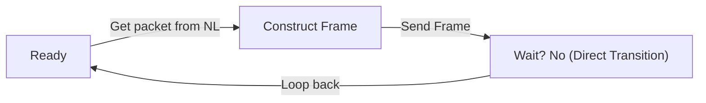
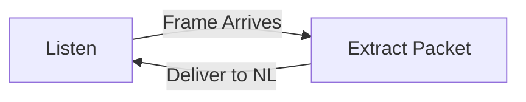
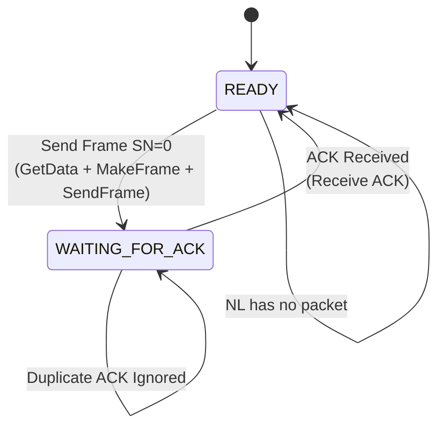
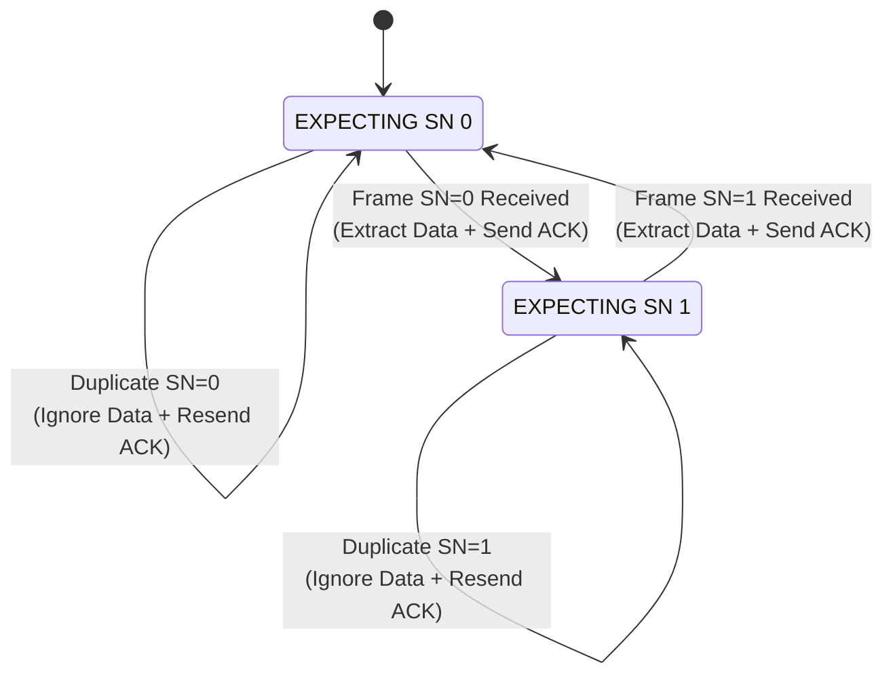
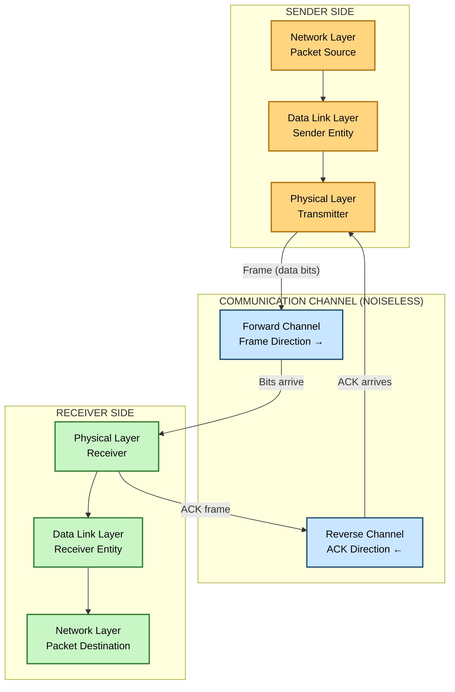
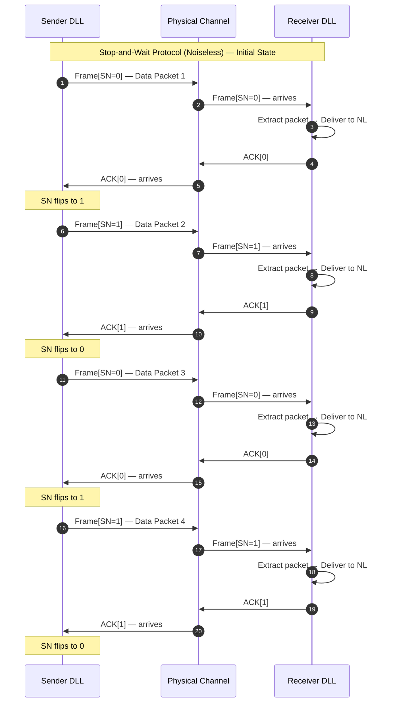
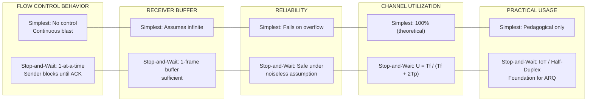
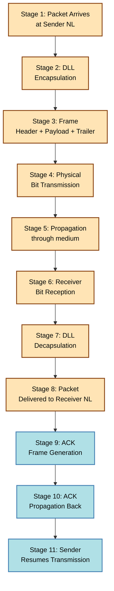
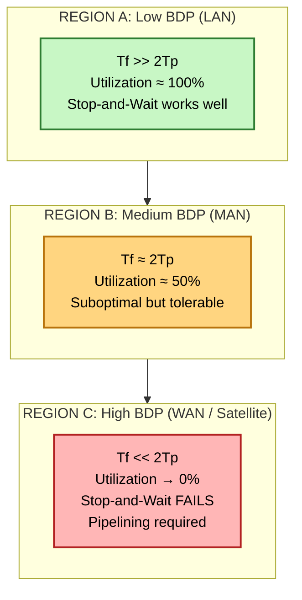

# Flow Control- Noiseless Channels

<!-- SECTION_1_START -->
# 🔗 Flow Control in Noiseless Channels — KTU 2024 Premium Notes

> [!IMPORTANT]
> **Module 2 — Data Link Layer | Topic: Flow Control – Noiseless Channels**
> This topic is part of the **Computer Networks** course (OECST724) under KTU 2024 Scheme and directly tests **CO2: Design and analyze data link layer protocols**.

---

## 🧠 1.1 What is Flow Control? (Formal KTU Definition)

> **Flow Control** is a set of procedures enforced by the **Data Link Layer (DLL)** that regulate the rate at which a **sender** transmits data frames over a communication channel so that the **receiver** is never overwhelmed and never receives more data than it can buffer, process, and forward upward to the Network Layer.

In the KTU 2024 syllabus context, flow control is studied under two distinct channel models:

| Channel Type | Characteristics | Protocols Studied |
|---|---|---|
| **Noiseless Channels** (this topic) | **Zero** bit-error probability, **no frame loss**, **no duplication** | Simplest Protocol, Stop-and-Wait Protocol |
| **Noisy Channels** (next topic) | Bit errors, frame loss, frame duplication | Stop-and-Wait ARQ, Go-Back-N ARQ, Selective Repeat ARQ |

> [!NOTE]
> **Noiseless Channel Assumption:** Although physically unrealistic, this is a foundational pedagogical abstraction. It strips away error-correction complexity so the student can focus purely on **synchronization** and **rate-matching** between sender and receiver. The protocol design here is the *blueprint* used to build the more complex ARQ protocols.

---

## 🌍 1.2 Real-World Analogy — The "One-Way Bridge" Problem

Imagine a **narrow one-lane wooden bridge** between two villages. Only one car (frame) can be on the bridge at a time. A car is allowed to enter the bridge **only when** a green light at the exit side (ACK signal) confirms the bridge is empty. This is exactly how the **Stop-and-Wait Protocol** works.

- **The Bridge** = Communication Channel (frames travel one at a time)
- **The Car** = Data Frame
- **The Green Light** = Acknowledgment (ACK) sent by receiver
- **The Waiting Driver** = Sender, paused until ACK arrives
- **A wider, multi-lane highway** would be analogous to **Pipelining** (Go-Back-N / Selective Repeat) — covered under *Noisy Channels*.

> [!TIP]
> **Intuition Builder:** If the sender "dumps" all 1000 frames at once (Simplest Protocol), the receiver's **finite buffer** overflows, and frames are silently dropped. The data link layer is *useless* without flow control. This is the **core "Why"** of the entire topic.

---

## 📐 1.3 The Two Protocols Under Noiseless Flow Control

### 🔹 (A) The Simplest Protocol
- **No flow control** at all.
- The sender transmits frames as fast as the channel allows, one after another, with no waiting.
- The receiver has **infinite buffer** (assumed) and just accepts whatever arrives.
- It is a *theoretical starting point* to highlight *why* flow control is necessary.

### 🔹 (B) The Stop-and-Wait Protocol
- The **canonical noiseless flow control** protocol.
- Sender transmits **one frame**, then **stops and waits** for an Acknowledgment (ACK) from the receiver.
- Only after the ACK arrives does the sender transmit the **next frame**.
- The receiver sends a short ACK frame immediately upon receipt (assumed instantaneous, no error).
- It ensures the receiver is never overwhelmed.

> [!WARNING]
> **Critical Distinction for KTU Exam:** *Noiseless* Stop-and-Wait is **NOT** Stop-and-Wait ARQ. The latter adds a **timer**, **sequence numbers**, and **retransmission logic** for noisy channels. In noiseless Stop-and-Wait, **ACK can never be lost** and **frames can never be corrupted**, so the protocol is a pure synchronization mechanism.

---

## 🎯 1.4 Layered Position in the OSI/TCP-IP Stack

$$
\text{Application Layer} \;\longrightarrow\; \text{Transport Layer} \;\longrightarrow\; \boxed{\text{Data Link Layer (Flow Control here)}} \;\longrightarrow\; \text{Physical Layer}
$$

The **Data Link Layer** is **subdivided** (logically) into two sub-layers:
$$
\text{DLL} = \underbrace{\text{LLC (Logical Link Control)}}_{\text{Flow + Error Control}} \;+\; \underbrace{\text{MAC (Medium Access Control)}}_{\text{Channel access}}
$$

Flow Control for noiseless channels operates entirely inside the **LLC** sublayer.

---

> [!VISUALIZATION CONTROL]
> **Concept:** Stop-and-Wait Timeline (Sender ↔ Channel ↔ Receiver)
> **GeoGebra / Desmos Input Equations:**
> * `X-axis: Time (seconds)`
> * `Y-axis: Signal Level (1 = Frame, 0 = Idle, -1 = ACK)`
> * `Plot1: Segment from (0, 1) to (T_frame, 0)` — Frame 0 transmission
> * `Plot2: Segment from (T_frame + T_prop, -1) to (T_frame + T_prop + T_ack, 0)` — ACK return
> * `Plot3: Repeat pattern shifted by 2*(T_frame + T_prop)`
> **Visual Description:** The student should observe a single frame in transit at any time, followed by a small ACK, and a long idle gap. This gap is the *link utilization* loss.

<!-- SECTION_1_END -->

<!-- SECTION_2_START -->
# 📊 Deep Theoretical Analysis & KTU High-Yield Formula Sheet

---

## 🧩 2.1 The Simplest Protocol — Full Theoretical Breakdown

### Operational Logic
1. The sender's Network Layer has a packet ready. It passes the packet to the Data Link Layer.
2. The DLL encapsulates the packet into a **frame**.
3. The frame is transmitted over the channel.
4. The receiver's DLL receives the frame, **strips the header/trailer**, extracts the packet, and delivers it to the Network Layer.
5. The receiver **does NOT send any acknowledgment**.
6. The sender immediately fetches the **next packet** and repeats — no waiting.

### Why It Fails in Practice (Even with Noiseless Channel)
- The receiver's **physical buffer is finite** (typically 64 KB to 1 MB in real NICs).
- The sender's transmission rate is often **orders of magnitude higher** than the receiver's consumption rate.
- Result: **Buffer overflow** at the receiver → silent data loss → protocol violation.
- This is the *pedagogical motivation* for designing Stop-and-Wait.

### Formal Sender FSM (Simplest)



### Formal Receiver FSM (Simplest)



---

## 🧩 2.2 The Stop-and-Wait Protocol — Full Theoretical Breakdown

### Operational Logic (Step-by-Step)
1. Sender fetches one packet from Network Layer.
2. Sender **encapsulates** it into a frame with a **Sequence Number (SN = 0 or 1)** in the header.
3. Sender **transmits** the single frame to the receiver.
4. Sender enters the **WAIT state** — it is *blocked* from sending anything else.
5. Frame propagates through the channel and reaches the receiver.
6. Receiver's DLL receives the frame, extracts the packet, and **delivers** it to the Network Layer.
7. Receiver **constructs a tiny ACK frame** and transmits it back to the sender.
8. ACK propagates back through the channel.
9. Sender **receives the ACK**, transitions back to **READY**, and is now allowed to send the next packet.
10. Cycle repeats for every single frame.

### State Machine — Sender Side (Stop-and-Wait)



### State Machine — Receiver Side (Stop-and-Wait)



> [!IMPORTANT]
> **Why the Sequence Number (0/1)?** Even in a *noiseless* channel, a tiny SN field (1 bit) is often kept in the design. It future-proofs the protocol for the noisy version (Stop-and-Wait ARQ), where lost ACKs require distinction between a *new* frame and a *retransmission*.

---

## 📋 2.3 KTU High-Yield Formula Sheet (Noiseless Stop-and-Wait)

> [!NOTE]
> All symbols below are **standard KTU textbook (Forouzan) notation**. Master this table — it is the single most-tested component of this topic in KTU exams.

| # | Parameter | Symbol | Formula / Definition | Typical Unit |
|---|---|---|---|---|
| 1 | Frame length (data bits) | $L$ | Given in problem | bits |
| 2 | Data rate (channel bandwidth) | $R$ | Given in problem | bps (bits/sec) |
| 3 | Frame Transmission Time | $T_f$ | $T_f = \dfrac{L}{R}$ | seconds |
| 4 | Distance between sender and receiver | $d$ | Given in problem | meters |
| 5 | Propagation speed (in medium) | $V$ | $\approx 2 \times 10^{8}$ m/s (copper), $\approx 3 \times 10^{8}$ m/s (vacuum) | m/s |
| 6 | Propagation Delay (one-way) | $T_p$ | $T_p = \dfrac{d}{V}$ | seconds |
| 7 | ACK Transmission Time | $T_a$ | $T_a = \dfrac{L_{ack}}{R}$ (often negligible) | seconds |
| 8 | Total Cycle Time | $T_{total}$ | $T_{total} = T_f + 2 T_p + T_a \approx T_f + 2 T_p$ | seconds |
| 9 | **Channel Utilization / Efficiency** | $U$ | $U = \dfrac{T_f}{T_f + 2 T_p + T_a}$ | dimensionless (0 to 1) |
| 10 | **Throughput** | $\lambda$ | $\lambda = U \times R = \dfrac{L}{T_f + 2 T_p + T_a}$ | bits/sec |
| 11 | Bandwidth-Delay Product | $BDP$ | $BDP = R \times T_p$ (in bits) | bits |
| 12 | When is Stop-and-Wait efficient? | — | $T_f \gg T_p$ (i.e., $L \gg R \cdot T_p$) | condition |

### 🚨 KTU Exam-Warning on the Formula

The KTU board often asks students to **explicitly state the assumption** before applying the formula. The standard assumption is:

$$
\boxed{\;T_a \ll T_f \quad \text{and} \quad T_a \approx 0 \quad \Rightarrow \quad T_{total} \approx T_f + 2T_p\;}
$$

If the problem specifies ACK length, do **NOT** ignore $T_a$.

---

## ⚙️ 2.4 Engineering Utility & Real-World Relevance

Although pure Stop-and-Wait is rarely used in modern production networks (due to its poor utilization on high-bandwidth, long-distance links), its principles are foundational:

- **Foundation for ARQ family** — every noisy-channel protocol is a direct enhancement.
- **Used in low-bandwidth IoT links** — LoRaWAN, Zigbee, and certain sensor protocols use Stop-and-Wait variants because of their extreme simplicity and low memory footprint.
- **Embedded & serial communication** — half-duplex RS-485 and UART-based master-slave protocols often use Stop-and-Wait at the application layer.
- **Conceptual basis for TCP** — TCP's "send and wait for ACK" behavior in its simplest form mirrors Stop-and-Wait (though TCP uses cumulative ACKs and pipelining).

> [!TIP]
> **Industrial Insight:** When designing protocols for **satellite links** (where $T_p \approx 250$ ms each way), Stop-and-Wait gives $U < 0.001$. This is exactly why satellite modems use **selective repeat** with large windows — but you can only understand *that* if you master *this* topic first.

---

## 🔁 2.5 End-to-End Operational Timeline (Conceptual Math)

For one complete frame-ACK cycle:

$$
\begin{aligned}
\text{Cycle Time} &= \underbrace{T_f}_{\text{send frame}} + \underbrace{T_p}_{\text{frame travels}} + \underbrace{T_a}_{\text{receiver sends ACK}} + \underbrace{T_p}_{\text{ACK travels back}} \\
&= T_f + 2T_p + T_a
\end{aligned}
$$

The **fraction of time the channel carries useful data** is:

$$
\boxed{\;U = \frac{T_f}{T_f + 2T_p + T_a}\;}
$$

If $T_a \to 0$ (negligible ACK):

$$
U = \frac{T_f}{T_f + 2T_p} = \frac{1}{1 + \dfrac{2T_p}{T_f}}
$$

This is the equation KTU examiners most frequently test.

<!-- SECTION_2_END -->

<!-- SECTION_3_START -->
# 🛠️ Step-by-Step Derivations, Pseudocode & Worked Numerical Problems

---

## 📝 3.1 Full Algorithm — Simplest Protocol

### Sender Side (Pseudo-code)

```python
# ============================================
#  SIMPLEST PROTOCOL — SENDER (No Flow Control)
#  Assumption: Noiseless Channel
# ============================================

# State variable to track sender's state
sender_state: str = "READY"

while True:
    if sender_state == "READY":
        # Step 1: Wait until Network Layer has a packet
        packet = network_layer.get_packet()
        
        if packet is None:
            # No packet to send; just continue polling
            continue
        
        # Step 2: Construct a frame by encapsulating the packet
        # No sequence number, no flow control header
        frame = encapsulate(packet=packet, seq_no=None, ack_no=None)
        
        # Step 3: Send the frame IMMEDIATELY (no waiting)
        physical_layer.send(frame=frame)
        
        # Step 4: Loop back instantly to send the next packet
        # No transition to a WAIT state
        sender_state = "READY"
```

### Receiver Side (Pseudo-code)

```python
# ============================================
#  SIMPLEST PROTOCOL — RECEIVER (No Flow Control)
# ============================================

while True:
    # Step 1: Block until a frame arrives from the physical layer
    frame = physical_layer.receive()
    
    # Step 2: Extract the packet from the frame's payload
    packet = decapsulate(frame=frame)
    
    # Step 3: Deliver the packet to the Network Layer immediately
    network_layer.deliver(packet=packet)
    
    # Step 4: Loop back. No ACK is sent. No state is maintained.
```

> [!NOTE]
> **Notice the absence of `seq_no`, `ack_no`, or any timer.** This is the defining trait of the Simplest Protocol.

---

## 📝 3.2 Full Algorithm — Stop-and-Wait Protocol (Noiseless)

### Sender Side (Pseudo-code)

```python
# ============================================
#  STOP-AND-WAIT PROTOCOL — SENDER (Noiseless)
# ============================================

# Sequence number alternates 0, 1, 0, 1, ...
seq_no: int = 0

# Persistent state
sender_state: str = "READY"

while True:
    if sender_state == "READY":
        # Step 1: Fetch next packet from Network Layer
        packet = network_layer.get_packet()
        
        if packet is None:
            continue  # Nothing to send; keep polling
        
        # Step 2: Build a frame with the current sequence number
        frame = encapsulate(packet=packet, seq_no=seq_no, ack_no=None)
        
        # Step 3: Transmit the frame
        physical_layer.send(frame=frame)
        
        # Step 4: Transition to WAIT state
        sender_state = "WAITING_FOR_ACK"
    
    elif sender_state == "WAITING_FOR_ACK":
        # Step 5: Block until an ACK frame arrives
        # (In noiseless channel, this will always arrive and be valid)
        ack_frame = physical_layer.receive()
        
        # Step 6: Extract and validate the ACK
        if ack_frame is not None and ack_frame.ack_no == seq_no:
            # ACK matches the sent frame
            # Step 7: Flip the sequence number for the next data frame
            seq_no = 1 - seq_no
            
            # Step 8: Return to READY state
            sender_state = "READY"
        else:
            # In a truly noiseless channel this branch is unreachable.
            # Kept for structural symmetry with the noisy ARQ version.
            continue
```

### Receiver Side (Pseudo-code)

```python
# ============================================
#  STOP-AND-WAIT PROTOCOL — RECEIVER (Noiseless)
# ============================================

# The receiver expects alternating sequence numbers
expected_seq_no: int = 0

while True:
    # Step 1: Block on incoming frame
    incoming_frame = physical_layer.receive()
    
    if incoming_frame is None:
        continue
    
    # Step 2: Inspect the sequence number
    if incoming_frame.seq_no == expected_seq_no:
        # Step 3a: New, in-order frame — extract and deliver
        packet = decapsulate(frame=incoming_frame)
        network_layer.deliver(packet=packet)
        
        # Step 4a: Send ACK with the matching sequence number
        ack = make_ack(ack_no=incoming_frame.seq_no)
        physical_layer.send(frame=ack)
        
        # Step 5a: Flip the expected sequence number
        expected_seq_no = 1 - expected_seq_no
    else:
        # Step 3b: Duplicate/out-of-order frame
        # (Unreachable in pure noiseless channel, kept for safety)
        # Step 4b: Resend the LAST ACK to keep the sender happy
        ack = make_ack(ack_no=1 - expected_seq_no)
        physical_layer.send(frame=ack)
```

---

## 📐 3.3 Full Numerical Derivations (KTU-Style Solved Problems)

### 🔢 Problem 1: Channel Utilization Calculation

> **Question (KTU Pattern):** A channel has a **bit rate** $R = 1$ Mbps and a **propagation delay** $T_p = 20$ ms. The Stop-and-Wait protocol is used with **frame size** $L = 1000$ bits. Find the channel utilization $U$ and throughput $\lambda$. Assume $T_a \approx 0$.

**Step 1: Frame Transmission Time**
$$
T_f = \frac{L}{R} = \frac{1000 \text{ bits}}{1 \times 10^6 \text{ bits/sec}} = 1 \times 10^{-3} \text{ sec} = 1 \text{ ms}
$$

**Step 2: Total Cycle Time**
$$
T_{total} = T_f + 2T_p + T_a \approx 1 + 2(20) + 0 = 41 \text{ ms}
$$

**Step 3: Channel Utilization**
$$
U = \frac{T_f}{T_{total}} = \frac{1}{41} \approx 0.0244 = 2.44\%
$$

**Step 4: Throughput**
$$
\lambda = U \times R = 0.0244 \times 1 \times 10^6 = 24{,}400 \text{ bps} \approx 24.4 \text{ kbps}
$$

> [!IMPORTANT]
> **Valuation Key Points (KTU Examiner Allocation):**
> * [Stating $T_f = L/R$: 2 Marks]
> * [Substituting values and computing $T_{total}$: 2 Marks]
> * [Writing the utilization formula correctly: 2 Marks]
> * [Final numerical answer with units: 1 Mark]
> **Total: 7 Marks**

---

### 🔢 Problem 2: Finding Required Frame Size for Target Utilization

> **Question (KTU Pattern):** A geosynchronous satellite link has one-way propagation delay $T_p = 270$ ms. The channel rate is $R = 50$ Mbps. Using Stop-and-Wait, what **minimum frame size** $L$ is required to achieve a channel utilization of at least $U = 0.5$? Assume $T_a \approx 0$.

**Step 1: Write the utilization formula**
$$
U = \frac{T_f}{T_f + 2T_p} = \frac{L/R}{L/R + 2T_p}
$$

**Step 2: Substitute $U = 0.5$ and solve**
$$
0.5 = \frac{L/R}{L/R + 2T_p}
$$

**Step 3: Cross-multiply**
$$
0.5 \times \left(\frac{L}{R} + 2T_p\right) = \frac{L}{R}
$$

**Step 4: Expand**
$$
\frac{0.5 L}{R} + T_p = \frac{L}{R}
$$

**Step 5: Isolate $L$**
$$
T_p = \frac{L}{R} - \frac{0.5L}{R} = \frac{0.5L}{R}
$$

**Step 6: Solve for $L$**
$$
L = 2 \times R \times T_p = 2 \times 50 \times 10^6 \times 0.270
$$
$$
L = 27 \times 10^6 \text{ bits} = 27 \text{ Mbits} \approx 3.375 \text{ MB}
$$

> [!NOTE]
> **Interpretation:** To get 50% utilization on a *geostationary satellite*, each frame must be **27 Mbits long**! This is why Stop-and-Wait is **completely impractical** for satellite/terrestrial long-haul networks, and **pipelined protocols** (Go-Back-N, Selective Repeat) are mandatory.

---

### 🔢 Problem 3: Two Frames Back-to-Back

> **Question (KTU Pattern):** Using Stop-and-Wait, a sender transmits two consecutive frames of $L = 1500$ bits each over a link with $R = 100$ kbps and $T_p = 50$ ms. Calculate the **total time elapsed** until the second ACK is received.

**Step 1: Compute $T_f$**
$$
T_f = \frac{1500}{100 \times 10^3} = 0.015 \text{ sec} = 15 \text{ ms}
$$

**Step 2: For two frames, total cycle time doubles (each frame is independent cycle)**
$$
T_{2\text{frames}} = 2 \times (T_f + 2T_p + T_a) \approx 2 \times (15 + 100 + 0) = 230 \text{ ms}
$$

**Step 3: Alternatively, lay out the timeline**

$$
\begin{aligned}
t = 0 \;\; &\Rightarrow\; \text{Sender starts Frame 1} \\
t = 15 \text{ ms} \;\; &\Rightarrow\; \text{Frame 1 fully transmitted} \\
t = 65 \text{ ms} \;\; &\Rightarrow\; \text{Frame 1 arrives at receiver} \\
t = 65 \text{ ms} \;\; &\Rightarrow\; \text{Receiver sends ACK} \\
t = 115 \text{ ms} \;\; &\Rightarrow\; \text{ACK arrives at sender} \\
t = 115 \text{ ms} \;\; &\Rightarrow\; \text{Sender starts Frame 2} \\
t = 130 \text{ ms} \;\; &\Rightarrow\; \text{Frame 2 fully transmitted} \\
t = 180 \text{ ms} \;\; &\Rightarrow\; \text{Frame 2 arrives at receiver} \\
t = 180 \text{ ms} \;\; &\Rightarrow\; \text{Receiver sends ACK 2} \\
t = 230 \text{ ms} \;\; &\Rightarrow\; \text{ACK 2 arrives at sender — DONE}
\end{aligned}
$$

✅ **Total elapsed time = 230 ms**, matching the formula.

<!-- SECTION_3_END -->

<!-- SECTION_4_START -->
# 🗺️ Structural Diagrams & Schematics (Mermaid Architecture)

---

## 🧭 4.1 Master Diagram — Comparative Protocol Flow Architecture



---

## 🔄 4.2 Sequence Diagram — Stop-and-Wait End-to-End (4 Frames)



---

## ⚖️ 4.3 Comparison Matrix — Simplest vs Stop-and-Wait



---

## 📊 4.4 Sequential Processing Topology — Frame Lifecycle



---

## 🌐 4.5 Bandwidth Utilization vs Propagation Delay (Conceptual)



<!-- SECTION_4_END -->

<!-- SECTION_5_START -->
# 🎓 KTU 2024 Scheme Examination Question Bank & Topic Recap

---

## 📝 Part A — Short Answer Questions (3 Marks Each)

### **Q1. [KTU University Exam — July 2024, Model QP, CO2]**
**Define flow control. Why is it required at the Data Link Layer even when the channel is noiseless? (3 Marks)** *(RBT Level: Remember / Understand)*

**Model Answer:**
Flow control is a set of procedures used by the Data Link Layer to regulate the rate of data transmission from the sender to the receiver so that the receiver is not overwhelmed by frames arriving faster than it can process them.

Even in a **noiseless channel** (where no frames are lost or corrupted), flow control is necessary because the **receiver's buffer is finite**. If the sender transmits frames continuously, the receiver's buffer will overflow, resulting in data loss. Flow control synchronizes the sender's transmission rate with the receiver's consumption capacity, ensuring **reliable end-to-end delivery** and preventing buffer overflow.

> [!VALUATION_KEY]
> [Definition of flow control: 1 Mark] | [Finite buffer explanation: 1 Mark] | [Synchronization argument: 1 Mark]

---

### **Q2. [KTU University Exam — Dec 2023, CO2]**
**Differentiate between the Simplest Protocol and the Stop-and-Wait Protocol. (3 Marks)** *(RBT Level: Understand)*

**Model Answer:**

| Parameter | Simplest Protocol | Stop-and-Wait Protocol |
|---|---|---|
| **Flow Control** | None (sender sends continuously) | Yes (sender waits for ACK) |
| **Receiver Buffer** | Assumed infinite | Only 1-frame buffer required |
| **Acknowledgment** | No ACK is sent | ACK sent after each frame |
| **Sequence Number** | Not used | Used (alternates 0/1) |
| **Practical Use** | Pedagogical only | Forms basis for ARQ protocols |
| **Channel Utilization** | 100% (theoretical) | $U = \dfrac{T_f}{T_f + 2T_p + T_a}$ |

> [!VALUATION_KEY]
> [Any three valid contrasting points: 3 Marks — 1 each]

---

## 📚 Part B — Long Answer Questions (14 Marks, with Internal Choice)

> **KTU 2024 Pattern:** Two sub-parts (a) and (b) of 7 marks each, OR two full 7-mark alternatives. Internal choice means **OR (a)/(b)** within each part.

---

### **Question A — Option 1 (14 Marks)**
**`[KTU University Exam — July 2024 Pattern | CO2 | RBT: Understand + Apply]`**

**(a)** With neat FSM diagrams, explain the operation of the **Stop-and-Wait Protocol** for a noiseless channel. Discuss the role of the sequence number. **(7 Marks)**

**Model Answer:**

**Sender Side FSM (Textual Representation):**
The sender begins in the **READY** state. It fetches a packet from the Network Layer, constructs a frame with the current sequence number ($SN = 0$ initially), and transmits the frame. It then transitions to the **WAITING_FOR_ACK** state, where it remains blocked until an ACK frame arrives from the receiver. Upon receiving the ACK whose acknowledgment number matches the last sent $SN$, the sender flips the sequence number ($SN = 1 - SN$) and returns to the **READY** state to send the next frame.

**Receiver Side FSM (Textual Representation):**
The receiver begins in the state **EXPECTING_SN_0**. When a frame with $SN = 0$ arrives, it extracts the packet, delivers it to the Network Layer, sends an ACK with $ack\_no = 0$, and transitions to **EXPECTING_SN_1**. The state alternates indefinitely. If a duplicate frame arrives (e.g., $SN = 0$ when expecting $SN = 1$), the receiver discards the data but **resends the last ACK** to keep the protocol synchronized.

**Role of the Sequence Number:**
- The 1-bit sequence number (0 or 1) allows the receiver to **distinguish a new frame from a duplicate**.
- It is a **forward-compatibility** feature: it is logically required only when ACKs can be lost (noisy channel), but is included in the noiseless design to **preserve protocol symmetry** and **simplify migration to ARQ**.
- It also allows the receiver to detect protocol desynchronization.

**[Sender FSM diagram: 2 Marks | Receiver FSM diagram: 2 Marks | Sequence number explanation: 2 Marks | Operational narrative: 1 Mark]**

---

**(b)** A channel has a **bit rate of 4 kbps** and a **propagation delay of 20 ms**. Compute the **channel utilization** for frame sizes of **1000 bits** and **5000 bits** using the Stop-and-Wait Protocol. State your assumption about the ACK. **(7 Marks)**

**Model Answer:**

**Assumption (must be stated first):**
The ACK transmission time is negligible: $T_a \approx 0$.

**Case 1: $L = 1000$ bits**

Frame transmission time:
$$
T_f = \frac{L}{R} = \frac{1000}{4000} = 0.25 \text{ sec} = 250 \text{ ms}
$$

Total cycle time:
$$
T_{total} = T_f + 2T_p = 250 + 2(20) = 290 \text{ ms}
$$

Channel utilization:
$$
U_1 = \frac{T_f}{T_{total}} = \frac{250}{290} = 0.862 = 86.2\%
$$

**Case 2: $L = 5000$ bits**

Frame transmission time:
$$
T_f = \frac{5000}{4000} = 1.25 \text{ sec} = 1250 \text{ ms}
$$

Total cycle time:
$$
T_{total} = 1250 + 40 = 1290 \text{ ms}
$$

Channel utilization:
$$
U_2 = \frac{1250}{1290} = 0.969 = 96.9\%
$$

**Conclusion:** Larger frame sizes yield higher utilization because the propagation overhead becomes a smaller fraction of the total cycle time.

> [!VALUATION_KEY]
> [Stating the ACK assumption: 1 Mark] | [Correct $T_f$ calculation for both cases: 2 Marks] | [Correct $T_{total}$: 1 Mark] | [Correct $U$ formula and final answers: 2 Marks] | [Interpretation: 1 Mark]

---

### **Question B — Option 2 (14 Marks)** *(Internal Choice for Q-A)*
**`[KTU University Exam — Dec 2023 Pattern | CO2 | RBT: Understand + Apply]`**

**(a)** Explain the **Simplest Protocol** for a noiseless channel using sender and receiver algorithms. What are its **two main limitations**? **(7 Marks)**

**Model Answer:**

The **Simplest Protocol** is a flow-control-less data link protocol. The sender's algorithm loops continuously: it fetches a packet from the Network Layer, encapsulates it into a frame (with no sequence number, no acknowledgment number), and transmits the frame immediately to the physical layer. The sender never waits. The receiver's algorithm blocks on incoming frames, decapsulates each one, and delivers the packet to the Network Layer. **No ACK is ever generated, and no state is maintained.**

**Pseudocode (Sender):**
```
while (true) {
    packet = network_layer.get_packet();
    frame  = encapsulate(packet);
    physical_layer.send(frame);
}
```

**Two Main Limitations:**
1. **No Flow Control → Receiver Buffer Overflow:** The sender transmits at full channel speed. If the receiver's buffer fills up, subsequent frames are silently dropped. This breaks the reliability contract of the data link layer.
2. **Unsynchronized State:** Without ACKs, the sender has no idea whether the receiver is alive, processing, or has crashed. There is no feedback mechanism for error detection or recovery.

**[Sender algorithm: 2 Marks | Receiver algorithm: 2 Marks | Limitation 1: 1.5 Marks | Limitation 2: 1.5 Marks]**

---

**(b)** With the help of a **timeline diagram**, derive the **channel utilization formula** for the Stop-and-Wait Protocol. Show that utilization approaches **100%** when the frame transmission time is much greater than the propagation delay. **(7 Marks)**

**Model Answer:**

**Timeline:**

$$
\begin{aligned}
t = 0 \quad &\Rightarrow\; \text{Sender starts sending Frame} \\
t = T_f \quad &\Rightarrow\; \text{Frame fully transmitted} \\
t = T_f + T_p \quad &\Rightarrow\; \text{Frame fully received at receiver} \\
t = T_f + T_p \quad &\Rightarrow\; \text{Receiver sends ACK (assumed instantaneous)} \\
t = T_f + 2T_p \quad &\Rightarrow\; \text{ACK arrives at sender}
\end{aligned}
$$

**Derivation of Utilization:**

The total cycle time for one frame is the interval from "start of frame transmission" to "start of next frame transmission":
$$
T_{cycle} = T_f + 2T_p + T_a
$$

The channel is *useful* only during $T_f$ (carrying data bits). Therefore:
$$
U = \frac{\text{Useful time}}{\text{Total cycle time}} = \frac{T_f}{T_f + 2T_p + T_a}
$$

Assuming $T_a \approx 0$:
$$
U = \frac{T_f}{T_f + 2T_p}
$$

**Limit Analysis:**

Divide numerator and denominator by $T_f$:
$$
U = \frac{1}{1 + \dfrac{2T_p}{T_f}}
$$

As $T_f \gg T_p$ (i.e., large frames or short distances):
$$
\frac{2T_p}{T_f} \to 0 \;\Rightarrow\; U \to \frac{1}{1+0} = 1 = 100\%
$$

Conversely, as $T_p \gg T_f$ (e.g., satellite link), $U \to 0$, which is the inefficiency that motivates pipelined protocols.

> [!VALUATION_KEY]
> [Timeline diagram: 2 Marks] | [Formula derivation: 2 Marks] | [Limit analysis with $T_f \gg T_p$: 2 Marks] | [Conclusion: 1 Mark]

---

> [!WARNING]
> **🚨 KTU Examiner's Valuation Warning — Common Pitfalls on This Topic**
>
> 1. **Confusing Noiseless Stop-and-Wait with Stop-and-Wait ARQ.** In a noiseless channel, there is **no timer, no retransmission, no NACK**. Many students lose 2–3 marks by adding "timer-based retransmission" to a noiseless protocol answer. The KTU 2024 Scheme specifically separates these — read the question carefully.
>
> 2. **Forgetting the ACK assumption statement.** Always write: *"Assuming the ACK transmission time is negligible, $T_a \approx 0$."* Examiners allocate 1 explicit mark for this declaration.
>
> 3. **Wrong units in final answer.** Utilization is **dimensionless** (0 to 1) OR expressed as a percentage. Throughput is in **bits/sec (or kbps/Mbps)**. Mixing these loses 1 mark.
>
> 4. **Ignoring the 2× propagation delay.** The total cycle has $2T_p$ (frame goes one way, ACK comes back). Students often write $T_p$ instead of $2T_p$ — a classic 2-mark deduction.
>
> 5. **Not drawing the FSM with named states.** The question often says "with FSM diagram." If you describe it in prose only, you lose 2–3 marks. Always draw (or describe with states) READY → WAITING → READY.
>
> 6. **Omitting the sequence number explanation.** When asked about Stop-and-Wait, the 1-bit SN (0/1) is **mandatory** to discuss. Forgetting it costs 1–2 marks.

---

## 🧠 Topic Recap & Important Things to Remember

> [!TIP]
> **Last-Minute Rapid Revision — Pin this section in your mind before entering the exam hall.**

### ✅ Definitional Anchors
- **Flow Control:** Regulating sender's rate to match receiver's consumption capacity.
- **Noiseless Channel:** Zero bit-error probability; no frame loss, no duplication, ACK is never lost.
- **Simplest Protocol:** No flow control; sender transmits continuously; receiver assumed to have infinite buffer.
- **Stop-and-Wait Protocol:** Sender sends **one frame**, waits for **ACK**, then sends the next.

### ✅ The Two Pillars of Stop-and-Wait Design
1. **One-Frame-at-a-Time Discipline** — Prevents buffer overflow.
2. **Sequence Number (1 bit: 0/1)** — Enables future-proofing and duplicate detection.

### ✅ The Master Formula (Memorize This!)
$$
\boxed{\;U = \frac{T_f}{T_f + 2T_p + T_a} = \frac{L/R}{L/R + 2d/V + L_{ack}/R}\;}
$$

### ✅ Sub-Formulas (Know When to Use Each)
- $T_f = L / R$ — frame transmission time
- $T_p = d / V$ — one-way propagation delay
- $\lambda = U \times R$ — effective throughput
- $BDP = R \times T_p$ — bandwidth-delay product (in bits)

### ✅ Stop-and-Wait Works When...
- $T_f \gg T_p$ (i.e., $L$ is large AND/OR $d$ is small)
- Typical of: **LANs**, low-bandwidth IoT links, half-duplex serial comms.

### ✅ Stop-and-Wait Fails When...
- $T_p \gg T_f$ (high $R$, large $d$)
- Typical of: **Satellite links, transcontinental WANs, high-speed backbones** — requires pipelined protocols (Go-Back-N, Selective Repeat) covered in the **Noisy Channels** topic.

### ✅ Important Numbers to Remember
- Propagation speed in **copper cable**: $V \approx 2 \times 10^{8}$ m/s
- Propagation speed in **fiber / vacuum**: $V \approx 3 \times 10^{8}$ m/s
- Geostationary satellite one-way $T_p \approx 270$ ms
- Terrestrial cross-continental $T_p \approx 20$–$50$ ms

### ✅ Key Distinctions Table (Quick Recall)

| Feature | Simplest | Stop-and-Wait (Noiseless) | Stop-and-Wait ARQ (Noisy) |
|---|---|---|---|
| Flow control | ❌ | ✅ | ✅ |
| ACK used | ❌ | ✅ (no timer) | ✅ (with timer) |
| Sequence number | ❌ | ✅ (0/1) | ✅ (0/1) |
| Retransmission | ❌ | ❌ | ✅ |
| Practical use | None | Basis for ARQ | RFID, simple half-duplex |

### ✅ KTU Exam Pattern Recognition
- "**Define flow control**" → 3-mark short answer.
- "**Differentiate**" → tabular 3-mark answer.
- "**Explain with FSM**" → always include READY/WAITING states + sequence number.
- "**Calculate utilization/throughput**" → state assumption, compute $T_f$, $T_p$, $T_{total}$, then $U$.
- "**Derive the formula**" → timeline → $T_{cycle}$ → ratio → limit analysis.

<!-- SECTION_5_END -->
