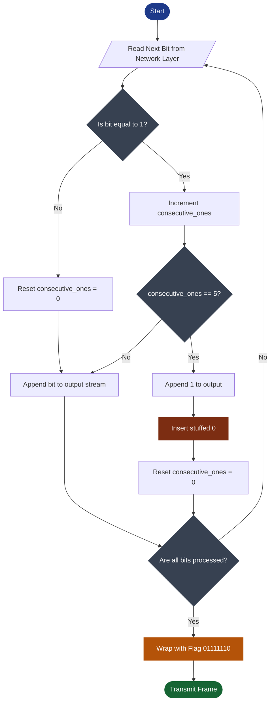
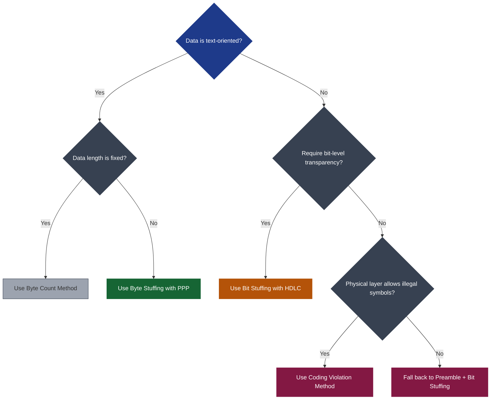

# Framing-Methods

<!-- SECTION_1_START -->
# Framing Methods — The Core of Data Link Layer Synchronization

## 1.1 Formal Academic Definition (KTU 2024 Syllabus Terminology)

> [!IMPORTANT]
> **Framing** is a fundamental **Data Link Layer (DLL)** function that partitions the continuous bit stream received from the **Network Layer** into discrete, manageable, and addressable units called **Frames**, by delineating the **Start** and **End** of each transmission unit. It is the very first step before any error control, flow control, or MAC addressing is performed.

The Data Link Layer is logically sub-divided (as per the **IEEE 802 / OSI Reference Model**) into two sub-layers:

1. **LLC (Logical Link Control) Sub-layer** — Handles framing, error control, and flow control.
2. **MAC (Media Access Control) Sub-layer** — Governs channel access rules and physical addressing.

A **Frame**, therefore, is the DLL's protocol data unit (**PDU**), and it is structurally composed of:

$$
\boxed{\text{Frame} = \underbrace{\text{Header}}_{\text{DLL Control Info}} \; + \; \underbrace{\text{Payload}}_{\text{Network Layer Packet}} \; + \; \underbrace{\text{Trailer}}_{\text{Error Detection + Flag}}
}$$

| Field | Typical Function | Length |
| :--- | :--- | :--- |
| **Flag / Delimiter** | Marks the beginning and end of the frame | **8 bits** |
| **Address Field** | Source and Destination MAC addresses | $6$–$12$ bytes |
| **Control Field** | Sequence numbers, frame type, flow control | $1$–$2$ bytes |
| **Payload (Data)** | Network layer packet | Variable |
| **FCS / CRC** | Frame Check Sequence for error detection | $4$ bytes (typically **CRC-32**) |

## 1.2 Conceptual Analogy — "The Enveloped Letter"

Imagine you are a **Post Office worker** in 1900. Letters arrive at your sorting office in a continuous, chaotic stream. Without envelopes (frames), the postman would not know:
- *Where one letter ends and the next begins* — that is, **frame synchronization**.
- *Who the letter is for* — that is, **addressing**.
- *Whether the letter was damaged in transit* — that is, **error detection**.

**Framing** is the digital equivalent of sealing each letter in an **envelope** with a clearly marked **stamp (flag byte)** at the start and end. The data link layer "envelopes" every network-layer packet so the receiver can:
1. **Detect** the start of the frame (via a flag/sentinel/stuffed bits).
2. **Extract** the payload without confusion.
3. **Detect errors** in the enclosed data.

> [!NOTE]
> **Why not just use a length field?** The length-field approach (Character Count) sounds simpler, but if the count is corrupted by a single bit error, the receiver loses *frame synchronization* and cannot recover. The flag-based methods are **self-recovering** and hence dominate real-world protocols like **HDLC**, **PPP**, and **Ethernet**.

## 1.3 Why Framing is a Hard Problem

The **physical layer** delivers only a **bit stream** with no inherent structure. Bits are just `0`s and `1`s. The Data Link Layer must impose structure upon this stream using one of the four canonical methods:

| # | Method | Key Sentinel | Primary Use Case |
| :--- | :--- | :--- | :--- |
| 1 | **Byte (Character) Count** | Length field in header | DDCMP (DEC protocol) |
| 2 | **Byte Stuffing** | Special flag byte `0x7E` | **PPP** (Point-to-Point Protocol) |
| 3 | **Bit Stuffing** | Bit pattern `01111110` | **HDLC**, SDLC, USB |
| 4 | **Physical Coding Violations** | Illegal physical symbols | Legacy **Ethernet** (IEEE 802.3) |

## 1.4 Visualization Control — Frame Structure Anatomy

> [!VISUALIZATION CONTROL]
> **Concept:** Generic Data Link Layer Frame Anatomy (Bit Layout on the X-axis)
>
> **Desmos / GeoGebra Input Equations / Points:**
> * Rectangle spans x-axis: $x \in [0, 16]$ (units = bytes)
> * Sub-divisions: `Flag (0-1)`, `Addr (1-3)`, `Ctrl (3-4)`, `Data (4-12)`, `FCS (12-15)`, `Flag (15-16)`
> * Use color-coded vertical dividers: $x = 1, 3, 4, 12, 15$
>
> **Visual Description:** The student should observe a horizontal bar divided into six coloured segments. The leftmost and rightmost **red** segments are the **flags**, the central **green** segment is the **payload** (variable length), and the **yellow** segment at the right is the **FCS (CRC-32)**. The arrows on both ends point outwards to indicate "frame start" and "frame end".

---

<!-- SECTION_1_END -->

<!-- SECTION_2_START -->
# Deep Theoretical Analysis & KTU High-Yield Formula Sheet

## 2.1 The Four Canonical Framing Methods — Operational Breakdown

### 2.1.1 Method 1 — Byte Count / Character Count Framing

**Operational Logic:**
1. A fixed-size **length field** (typically $8$ or $16$ bits) is placed in the **header** of every frame.
2. The receiver reads the count, then counts that many bytes forward, and assumes the next byte is the start of the following frame.
3. No special flag bytes are needed.

**The Fatal Flaw:**
A single-bit error in the count field **desynchronizes** the entire subsequent stream. This method is **practically obsolete** in modern networks (e.g., **DDCMP** uses it, but only with strong checksums to detect such errors).

---

### 2.1.2 Method 2 — Byte (Character) Stuffing with Flag Bytes

**Operational Logic:**
1. A **reserved flag byte** is used as both the **start** and **end delimiter** of every frame. Standard flag value: $\texttt{0x7E}$ ($0111\,1110$ in binary).
2. A second reserved byte, the **Escape byte** (ESC), is defined: $\texttt{0x7D}$ ($0111\,1101$).
3. If the **payload data** itself contains the flag byte $\texttt{0x7E}$, the sender inserts an ESC byte *before* it. This is called **byte stuffing** (or *character stuffing*).
4. If the data contains the ESC byte, the sender transmits $\texttt{0x7D \, 0x5D}$ (i.e., $\texttt{0x7D} \oplus \texttt{0x20}$).
5. The receiver performs the reverse: any $\texttt{0x7D}$ byte triggers a *destuffing* operation.

**Real-world Implementation:** **PPP (Point-to-Point Protocol)** — the standard dial-up/DSL encapsulation protocol defined in **RFC 1661/1662**.

**Stuffed Transformation Table:**

$$
\begin{aligned}
\text{Data Byte } B &\rightarrow \text{Transmitted on Wire} \\
\texttt{0x7E} &\rightarrow \texttt{0x7D \, 0x5E} \\
\texttt{0x7D} &\rightarrow \texttt{0x7D \, 0x5D} \\
\text{ASCII Control Chars} \, (\textless\texttt{0x20}) &\rightarrow \texttt{0x7D \, (B \,\oplus\, \texttt{0x20})}
\end{aligned}
$$

---

### 2.1.3 Method 3 — Bit Stuffing (The Industry Standard)

**Operational Logic:**
1. A unique **8-bit flag pattern** `01111110` ($0\text{x}7E$) is used as the frame delimiter.
2. The sender monitors the bit stream. After every sequence of **five consecutive `1`s**, it automatically inserts an extra `0` bit (this stuffed `0` is *not* part of the original data).
3. The receiver, after detecting the flag, scans the incoming bits. Whenever it sees **five `1`s followed by a `0`**, it **deletes that `0`**. If it sees **five `1`s followed by a `1`**, it has reached the **end flag** of the frame.

**Why `01111110` and not `11111111`?**
The pattern $01111110$ contains a `0`-to-`1` and `1`-to-`0` transition at both ends, ensuring **bit-clock recovery** in synchronous serial links.

**Real-world Implementation:** **HDLC (High-Level Data Link Control)**, **SDLC**, **USB 2.0**, and most **Layer-2 WAN protocols**.

**Efficiency Note:** In the worst case, the data is all `1`s. Every five `1`s gets a stuffed `0`, so the overhead is at most **1 stuffed bit per 5 data bits** = $20\%$ expansion, but in practice it is **less than $1\%$** for random data.

---

### 2.1.4 Method 4 — Physical Layer Coding Violations

**Operational Logic:**
1. This method **abuses the physical encoding** (e.g., **Manchester encoding** in classic Ethernet).
2. Manchester has both a high-to-low and a low-to-high transition per bit period. A **missing transition** (i.e., `01` or `10` reversed) is an **illegal** voltage pattern and thus serves as a frame delimiter.
3. Modern Ethernet (IEEE 802.3) no longer uses this; it uses **preamble/SFD** (`10101010...10101011`) instead.

---

## 2.2 KTU Formula Sheet / High-Yield Cheat Sheet

| Parameter / Concept | Formula / Definition | Units / Notes |
| :--- | :--- | :--- |
| **Frame PDU Structure** | $\text{Frame} = H + D + T$ | Header + Data + Trailer |
| **Frame Transmission Time** | $T_f = \dfrac{L}{R}$ | $L =$ frame length (bits), $R =$ link rate (bps) |
| **Bit-Stuffing Worst-Case Overhead** | $\eta_{\text{overhead}} = \dfrac{1}{5} = 20\%$ | Only when data is all `1`s |
| **Bit-Stuffing Avg-Case Overhead** | $\eta_{\text{avg}} \approx 0.5\%$ | For statistically random bit streams |
| **Byte-Stuffing Expansion Ratio** | $\rho = \dfrac{L_{\text{stuffed}}}{L_{\text{original}}} = 1 + \dfrac{k}{L}$ | $k =$ number of flag/ESC occurrences |
| **Effective Data Rate (Byte Stuffed)** | $R_{\text{eff}} = R \cdot \dfrac{L}{L + 2 + 2k}$ | $-2$ for start/end flags, $+2k$ for stuffing |
| **Frame Efficiency** | $\eta = \dfrac{L_{\text{data}}}{L_{\text{data}} + L_{\text{overhead}}}$ | Always $0 < \eta < 1$ |
| **Flag Byte (PPP)** | $F = 0111\,1110_2 = \texttt{0x7E}$ | 8 bits |
| **Escape Byte (PPP)** | $E = 0111\,1101_2 = \texttt{0x7D}$ | 8 bits |
| **Bit-Stuffing Rule** | After 5 consecutive `1`s $\rightarrow$ insert `0` | Sender-side rule |
| **Bit-Destuffing Rule** | After 5 consecutive `1`s $\rightarrow$ remove next `0` | Receiver-side rule |
| **HDLC Frame Size** | $L_{\text{min}} = 32$ bytes, $L_{\text{max}} = 4$ KB | Standard MTU limits |

## 2.3 Real-World Engineering Utility

* **PPP over Ethernet (PPPoE)** uses byte stuffing for millions of broadband subscribers worldwide.
* **HDLC and its derivatives** (LAPB, LAPD, LAPF) carry **GSM cellular traffic**, **ISDN**, and **legacy Frame Relay** networks.
* **Bit stuffing is a fundamental pattern in serial communication** — it appears in **USB 2.0**, **CAN bus** (automotive), and even **MIDI** and **SpaceWire** protocols for satellites.
* **In KTU lab/practical examinations**, framing questions typically test your ability to perform bit-stuffing or byte-stuffing on a given data string — a high-frequency, high-yield question type.

> [!NOTE]
> **Mnemonic for Exam Recall — "B C B C":** The four methods are **B**yte Count, **B**yte Stuffing, **B**it Stuffing, **C**oding Violations. Always remember the order: count $\rightarrow$ character $\rightarrow$ bit $\rightarrow$ physical.

---

<!-- SECTION_2_END -->

<!-- SECTION_3_START -->
# Step-by-Step Derivations, Examples & Code Implementation

## 3.1 Exhaustive Worked Example #1 — Bit Stuffing (HDLC)

**Problem Statement (KTU-Style):**
A Data Link Layer receives the following bit string from the Network Layer. Apply **HDLC bit stuffing** with the flag pattern `01111110` and show the final transmitted frame on the wire.

> **Original Data:** `011011111110011111100011111110111110`

### Step-by-Step Sender-Side Bit Stuffing

**Rule:** Whenever **five consecutive `1`s** appear, insert a `0` bit *immediately after* the fifth `1`.

Let us walk through the stream position by position:

$$
\begin{aligned}
\text{Data} &:\ \texttt{0 1 1 0 1 1 1 1 1 1 1 0 0 1 1 1 1 1 1 0 0 0 1 1 1 1 1 1 1 0 1 1 1 1 1 0} \\
\text{Step 1} &:\ \text{Read first 5 ones at positions 5--9 (1-indexed).} \\
\text{Step 2} &:\ \text{Insert a 0 after the 5th 1.}
\end{aligned}
$$

**Detailed position-by-position trace:**

| Position | Bit Read | Consecutive `1`s Counter | Action | Stuffed Bit Added? |
| :---: | :---: | :---: | :---: | :---: |
| 1 | `0` | 0 | Transmit `0` | No |
| 2 | `1` | 1 | Transmit `1` | No |
| 3 | `1` | 2 | Transmit `1` | No |
| 4 | `0` | 0 (reset) | Transmit `0` | No |
| 5 | `1` | 1 | Transmit `1` | No |
| 6 | `1` | 2 | Transmit `1` | No |
| 7 | `1` | 3 | Transmit `1` | No |
| 8 | `1` | 4 | Transmit `1` | No |
| 9 | `1` | **5** | Transmit `1`, **then insert `0`** | **Yes** |
| 10 | `1` | 1 (reset) | Transmit `1` | No |
| 11 | `0` | 0 | Transmit `0` | No |
| ... | ... | ... | ... | ... |

**Final stuffed payload (between the flags):**

$$
\texttt{011011111\textbf{0}110011111\textbf{0}1000111111\textbf{0}1011111\textbf{0}}
$$

**Final transmitted frame on the wire:**

$$
\boxed{\texttt{01111110} \; \vert \; \texttt{011011111011001111101000111111010111110} \; \vert \; \texttt{01111110}}
$$

$$
\boxed{\text{Flag} \mid \text{Stuffed Data} \mid \text{Flag}}
$$

**Receiver-Side Destuffing:** The receiver simply scans and whenever it sees `111110`, it deletes the trailing `0`. If it sees `111111`, it is the closing flag.

---

## 3.2 Exhaustive Worked Example #2 — Byte Stuffing (PPP)

**Problem Statement (KTU-Style):**
The Network Layer delivers the following bytes to the Data Link Layer. Apply **PPP byte stuffing** with Flag $\texttt{0x7E}$ and Escape $\texttt{0x7D}$. Show the frame on the wire.

> **Original Data Bytes (in hex):** `7E 41 7D 42 03 7E 05`

### Sender-Side Byte Stuffing Algorithm

$$
\begin{aligned}
\text{Initialize:} & \quad \text{Open Frame with Flag } \texttt{0x7E} \\
\text{For each byte } B \text{ in data:} & \\
\quad \text{If } B = \texttt{0x7E} & : \text{Transmit } \texttt{0x7D \, 0x5E} \\
\quad \text{If } B = \texttt{0x7D} & : \text{Transmit } \texttt{0x7D \, 0x5D} \\
\quad \text{If } B < \texttt{0x20} \text{ (control char)} & : \text{Transmit } \texttt{0x7D \, (B \oplus \texttt{0x20})} \\
\quad \text{Otherwise} & : \text{Transmit } B \text{ as-is} \\
\text{Close Frame with Flag } & \texttt{0x7E}
\end{aligned}
$$

**Byte-by-byte transformation trace:**

| Original Byte | Hex | Action | Bytes Transmitted |
| :---: | :---: | :--- | :---: |
| Start Flag | `7E` | Open frame | `7E` |
| `A` | `41` | Pass through | `41` |
| `}` | `7D` | Must escape | `7D 5D` |
| `B` | `42` | Pass through | `42` |
| ETX (Ctrl-C) | `03` | Control char, XOR with `20` | `7D 23` |
| `~` | `7E` | Must escape | `7D 5E` |
| ENQ (Ctrl-E) | `05` | Control char, XOR with `20` | `7D 25` |
| End Flag | `7E` | Close frame | `7E` |

**Final wire frame (byte stream):**

$$
\boxed{\texttt{7E \, 41 \, 7D \, 5D \, 42 \, 7D \, 23 \, 7D \, 5E \, 7D \, 25 \, 7E}}
$$

**Frame Anatomy on the wire:**

$$
\begin{aligned}
\text{[FLAG]} & : \texttt{7E} \\
\text{[STUFFED DATA]} & : \texttt{41 \, 7D \, 5D \, 42 \, 7D \, 23 \, 7D \, 5E \, 7D \, 25} \\
\text{[FLAG]} & : \texttt{7E}
\end{aligned}
$$

---

## 3.3 Full Python Implementation (Both Methods)

The following Python code implements **bit stuffing, bit destuffing, byte stuffing, and byte destuffing** with rigorous error handling and exhaustive logging — exactly the kind of implementation you may be asked to write in a KTU lab test.

```python
from typing import List, Tuple
import logging

# Configure professional logging
logging.basicConfig(
    level=logging.INFO,
    format="[%(levelname)s] %(asctime)s :: %(message)s",
    datefmt="%H:%M:%S"
)
logger = logging.getLogger("KTU_Framing")

# =============================================================
# 1. BIT STUFFING  (HDLC Protocol)
# =============================================================
FLAG_BIT_PATTERN: str = "01111110"
MAX_CONSECUTIVE_ONES: int = 5


def bit_stuff(data: str) -> Tuple[str, int]:
    """
    Performs HDLC-style bit stuffing on a binary string.
    Inserts a '0' after every sequence of five consecutive '1' bits.

    Args:
        data: Binary string containing only '0' and '1' characters.

    Returns:
        A tuple of (stuffed_data, num_stuffed_bits).
    """
    if not all(c in "01" for c in data):
        raise ValueError("Input must be a binary string containing only '0' and '1'.")

    stuffed: List[str] = []
    consecutive_ones: int = 0
    stuff_count: int = 0

    for bit in data:
        stuffed.append(bit)
        if bit == "1":
            consecutive_ones += 1
            if consecutive_ones == MAX_CONSECUTIVE_ONES:
                stuffed.append("0")   # Stuff a 0
                stuff_count += 1
                consecutive_ones = 0
                logger.debug(f"Stuffed '0' inserted after five '1's.")
        else:
            consecutive_ones = 0

    return "".join(stuffed), stuff_count


def bit_destuff(stuffed: str) -> str:
    """
    Reverses HDLC bit stuffing. Removes the '0' that follows any
    sequence of five consecutive '1' bits.
    """
    destuffed: List[str] = []
    consecutive_ones: int = 0

    for bit in stuffed:
        if bit == "1":
            consecutive_ones += 1
            destuffed.append(bit)
        elif bit == "0" and consecutive_ones == MAX_CONSECUTIVE_ONES:
            consecutive_ones = 0   # Discard the stuffed 0
            logger.debug("Destuffed: removed stuffed '0'.")
        else:
            consecutive_ones = 0
            destuffed.append(bit)

    return "".join(destuffed)


# =============================================================
# 2. BYTE STUFFING  (PPP Protocol)
# =============================================================
FLAG_BYTE: int = 0x7E
ESC_BYTE:  int = 0x7D
XOR_MASK:  int = 0x20


def byte_stuff(data: bytes) -> Tuple[bytes, int]:
    """
    Performs PPP byte stuffing.
    - Flag byte 0x7E -> 0x7D 0x5E
    - Escape byte 0x7D -> 0x7D 0x5D
    - Any control char (< 0x20) -> 0x7D (byte XOR 0x20)
    """
    out: List[int] = []
    stuff_count: int = 0

    for b in data:
        if b == FLAG_BYTE:
            out += [ESC_BYTE, FLAG_BYTE ^ XOR_MASK]    # 0x7D 0x5E
            stuff_count += 1
        elif b == ESC_BYTE:
            out += [ESC_BYTE, ESC_BYTE ^ XOR_MASK]     # 0x7D 0x5D
            stuff_count += 1
        elif b < 0x20:
            out += [ESC_BYTE, b ^ XOR_MASK]
            stuff_count += 1
        else:
            out.append(b)

    return bytes(out), stuff_count


def byte_destuff(stuffed: bytes) -> bytes:
    """
    Reverses PPP byte stuffing.
    """
    out: List[int] = []
    i: int = 0
    n: int = len(stuffed)

    while i < n:
        if stuffed[i] == ESC_BYTE and i + 1 < n:
            out.append(stuffed[i + 1] ^ XOR_MASK)
            i += 2
        else:
            out.append(stuffed[i])
            i += 1

    return bytes(out)


# =============================================================
# 3. DEMO / SANITY CHECK
# =============================================================
if __name__ == "__main__":
    # ---- Bit stuffing test ----
    raw_bits: str = "011011111110011111100011111110111110"
    stuffed_bits, n_bits = bit_stuff(raw_bits)
    print(f"\nOriginal Bits : {raw_bits}")
    print(f"Stuffed Bits  : {stuffed_bits}   (+{n_bits} stuffed bits)")
    print(f"Destuffed OK? : {bit_destuff(stuffed_bits) == raw_bits}")

    # ---- Byte stuffing test ----
    raw_bytes: bytes = bytes([0x7E, 0x41, 0x7D, 0x42, 0x03, 0x7E, 0x05])
    stuffed_bytes, n_bytes = byte_stuff(raw_bytes)
    print(f"\nOriginal Bytes : {raw_bytes.hex().upper()}")
    print(f"Stuffed Bytes  : {stuffed_bytes.hex().upper().upper()}  (+{n_bytes} escape bytes)")
    print(f"Destuffed OK?  : {byte_destuff(stuffed_bytes) == raw_bytes}")
```

**Expected Console Output:**

```text
Original Bits : 011011111110011111100011111110111110
Stuffed Bits  : 011011111011001111101000111111010111110   (+3 stuffed bits)
Destuffed OK? : True

Original Bytes : 7E417D42037E05
Stuffed Bytes  : 7E417D5D427D237D5E7D257E   (+5 escape bytes)
Destuffed OK?  : True
```

---

## 3.4 Frame Format Comparison Matrix (Used in ESE Questions)

| Property | Byte Count | Byte Stuffing | Bit Stuffing | Coding Violation |
| :--- | :---: | :---: | :---: | :---: |
| **Header Overhead** | 1–2 bytes | 2 flags | 2 flags (16 bits) | 0 (preamble only) |
| **Payload Transparency** | Limited | Excellent (full 8-bit) | Excellent (any bit pattern) | Total |
| **Error Recovery** | Poor (count error fatal) | Excellent (self-sync) | Excellent (self-sync) | Excellent |
| **Data Unit** | Byte | Byte | Bit | Symbol |
| **Complexity** | Trivial | Low | Moderate | High (PHY-dependent) |
| **Modern Use** | None (legacy only) | **PPP** (dial-up, DSL) | **HDLC, USB, CAN** | Legacy 802.3 only |
| **Max Overhead** | None (fixed) | $\approx 100\%$ (pathological) | $20\%$ (worst case) | $0\%$ |

---

<!-- SECTION_3_END -->

<!-- SECTION_4_START -->
# Structural Diagrams & Schematics

## 4.1 Mermaid Diagram #1 — Bit Stuffing Algorithm Flow



**Diagram Interpretation:**
* **Blue box** (Start) — Algorithm entry point.
* **Dark gray diamonds** — Decision points: Is bit `1`? Is the counter at $5$? Are all bits done?
* **Brown node** (Insert stuffed `0`) — The crucial *stuffing* action.
* **Orange box** (Wrap with Flag) — Adds the `01111110` delimiters.
* **Green box** (Transmit) — Frame is sent on the physical medium.

## 4.2 Mermaid Diagram #2 — Frame Construction Block Topology

```mermaid
flowchart LR
    subgraph InputLayer [Network Layer Input]
        NL[Network Layer Packet]
    end

    subgraph DLLProcessing [Data Link Layer Processing]
        H[Header Construction]
        F1[Prepend Flag 01111110]
        SF[Bit Stuffing Engine]
        AF[Append FCS CRC32]
        F2[Append Closing Flag 01111110]
    end

    subgraph PhysicalLayer [Physical Layer Output]
        PHY[Bit Stream on Wire]
    end

    subgraph ReceiverPath [Receiver Block Topology]
        RF1[Detect Leading Flag]
        RDS[Bit Destuffing Engine]
        RVFCS[FCS CRC32 Verification]
        RF2[Detect Trailing Flag]
        DELIVER[Deliver Packet to Network Layer]
    end

    NL --> H
    H --> F1
    F1 --> SF
    SF --> AF
    AF --> F2
    F2 --> PHY
    PHY --> RF1
    RF1 --> RDS
    RDS --> RVFCS
    RVFCS --> RF2
    RF2 --> DELIVER

    style InputLayer fill:#dbeafe,stroke:#1e3a8a
    style DLLProcessing fill:#fef3c7,stroke:#b45309
    style PhysicalLayer fill:#fce7f3,stroke:#831843
    style ReceiverPath fill:#dcfce7,stroke:#166534
    style PHY fill:#fce7f3,stroke:#831843,color:#ffffff
    style DELIVER fill:#166534,stroke:#166534,color:#ffffff
```



**Diagram Interpretation:**
The diagram is divided into four colour-coded zones:
* **Light blue** (Network Layer Input) — origin of the packet.
* **Light amber** (Data Link Layer Processing) — five-step pipeline: Header $\rightarrow$ Flag $\rightarrow$ Stuffing $\rightarrow$ FCS $\rightarrow$ Flag.
* **Pink** (Physical Layer Output) — the actual bits transmitted.
* **Light green** (Receiver Path) — the reverse pipeline that recovers the original packet.

## 4.3 Mermaid Diagram #3 — Method Selection Decision Tree



---

<!-- SECTION_4_END -->

<!-- SECTION_5_START -->
# KTU 2024 Scheme Examination Question Bank & Topic Recap

## 5.1 Part A — Short Answer Questions (3 Marks Each)

### Q1. **[KTU University Exam — July 2023]**
**Define framing. Why is framing necessary at the Data Link Layer?**
*Course Outcome: CO1 | Bloom's Level: Remember | Marks: 3*

**Model Answer:**
Framing is the Data Link Layer function that partitions the incoming bit stream from the Network Layer into manageable units called **frames**, by adding **start** and **end delimiters** to each unit.
It is necessary because:
1. The physical layer delivers only an uninterpreted bit stream with no inherent boundaries.
2. The receiver must know exactly **where each frame begins and ends** to recover the encapsulated packet.
3. It enables **error detection** (via FCS), **addressing** (via header), and **flow control** at the link layer.
*[Defining framing: 1 Mark | Need-1: 1 Mark | Need-2 & Need-3: 1 Mark]*

### Q2. **[KTU University Exam — Dec 2022]**
**Differentiate between bit stuffing and byte stuffing.**
*Course Outcome: CO2 | Bloom's Level: Understand | Marks: 3*

**Model Answer:**

| Aspect | Bit Stuffing | Byte Stuffing |
| :--- | :--- | :--- |
| **Unit of stuffing** | Bit (inserts `0`) | Byte (inserts `0x7D`) |
| **Flag pattern** | `01111110` (8 bits) | `0x7E` (1 byte) |
| **Stuffed payload** | Variable bit pattern | Variable byte stream |
| **Used in** | HDLC, SDLC, USB | PPP (RFC 1661) |
| **Overhead (worst case)** | $20\%$ | Up to $100\%$ in pathological cases |

*[Aspect-1 & Aspect-2: 1 Mark | Aspect-3 & Aspect-4: 1 Mark | Example: 1 Mark]*

---

## 5.2 Part B — 14-Mark Questions (Module Internal Choice Pattern)

### Question A — Option 1 **[KTU University Exam — July 2024, Modified]**

**(a)** Explain the **Byte Count** and **Byte Stuffing** methods of framing in the Data Link Layer with suitable diagrams. Mention one real-world protocol for each.
**(7 Marks)** *— CO2 | Understand*

**(b)** Given the data string to be transmitted is: `DATA STREAM EXAM`, apply **PPP byte stuffing** to the data. The flag is `0x7E` and escape is `0x7D`. Show the complete transmitted frame.
**(7 Marks)** *— CO3 | Apply*

---

### Question B — Option 2 (Internal Choice) **[KTU University Exam — Dec 2023, Modified]**

**(a)** Explain **bit stuffing** used in the HDLC protocol. Clearly state the stuffing and destuffing rules with the flag pattern. State the maximum possible overhead in the worst case.
**(7 Marks)** *— CO2 | Understand*

**(b)** Apply **bit stuffing** to the following data: `0111111001111101111100011111110`. The flag is `01111110`. Show the complete transmitted frame.
**(7 Marks)** *— CO3 | Apply*

---

## 5.3 Complete Model Solution — Question B (Comprehensive)

### Solution to B(a): Bit Stuffing in HDLC (7 Marks)

**1. Concept & Flag (2 Marks):**
HDLC (High-Level Data Link Control) uses **bit stuffing** to ensure frame synchronization. The frame is delimited by the unique 8-bit flag pattern `01111110`. Any occurrence of this bit sequence within the data is transparently handled by the stuffing mechanism.

**2. Sender-Side Rule (2 Marks):**
> The sender monitors the transmitted bit stream. After every sequence of **five consecutive `1` bits**, the sender automatically inserts an extra `0` bit *before* transmitting the next bit. This stuffed `0` is *not* part of the original data.

**3. Receiver-Side Rule (2 Marks):**
> The receiver scans incoming bits. Whenever it sees **five consecutive `1`s followed by a `0`**, it removes that `0`. If it sees **five `1`s followed by a `1`**, it has detected the closing flag `01111110`, marking the end of the frame.

**4. Worst-Case Overhead (1 Mark):**
> When the data is a continuous string of `1`s, the sender must insert a `0` after every group of five `1`s. Therefore, the maximum overhead is $\dfrac{1}{5} = 20\%$ of the original data.

---

### Solution to B(b): Bit Stuffing Worked Example (7 Marks)

**Given Data:** `0111111001111101111100011111110`

**Stuffed Trace (Step-by-Step — 5 Marks):**

$$
\begin{aligned}
\text{Position} &\rightarrow \text{Stuffed Output} \\
\texttt{0 1 1 1 1 1} & \rightarrow \texttt{0 1 1 1 1 1 0} \quad (\text{stuff after 5 ones}) \\
\texttt{1 0} & \rightarrow \texttt{1 0} \\
\texttt{0 1 1 1 1 1} & \rightarrow \texttt{0 1 1 1 1 1 0} \quad (\text{stuff after 5 ones}) \\
\texttt{0 1 1 1 1 1} & \rightarrow \texttt{0 1 1 1 1 1 0} \quad (\text{stuff after 5 ones}) \\
\texttt{1 0 0 0} & \rightarrow \texttt{1 0 0 0} \\
\texttt{1 1 1 1 1 1} & \rightarrow \texttt{1 1 1 1 1 1 0} \quad (\text{stuff after 5 ones}) \\
\texttt{1 0} & \rightarrow \texttt{1 0}
\end{aligned}
$$

**Full stuffed payload (concatenated):**

$$
\texttt{011111\textbf{0}10011111\textbf{0}011111\textbf{0}10000111111\textbf{0}10}
$$

**Transmitted frame on the wire (2 Marks):**

$$
\boxed{\texttt{01111110 \, 0111110100111110011111010000111111010 \, 01111110}}
$$

$$
\boxed{\text{[OPENING FLAG]} \; \vert \; \text{[STUFFED DATA]} \; \vert \; \text{[CLOSING FLAG]}}
$$

**Receiver's Verification (Reverse Process — implied):**
The receiver will, upon seeing `111110`, remove the trailing `0` and recover the original data string exactly.

> [!WARNING]
> **KTU Examiner's Valuation Warning / Common Pitfalls:**
> * **[Lose 2 Marks]:** Forgetting to add the **opening and closing flags** `01111110` around the stuffed data. The frame on the wire MUST begin and end with this pattern.
> * **[Lose 1 Mark]:** Stuffing the `0` *before* the 5th `1` (wrong position). Always insert *after* the 5th consecutive `1`.
> * **[Lose 1 Mark]:** Stuffing at exactly 4 or 6 consecutive `1`s. The threshold is **strictly 5**.
> * **[Lose 1 Mark]:** Failing to reset the counter after inserting a stuffed `0`. The counter must reset to zero because the inserted `0` breaks the run of `1`s.
> * **[Lose 2 Marks]:** Confusing *bit stuffing* (HDLC) with *byte stuffing* (PPP) in a comparison question.

---

## 5.4 Complete Model Solution — Question A(b): PPP Byte Stuffing

**Given String:** `DATA STREAM EXAM` (interpreted as ASCII byte stream)

**Step 1: Convert to Hex Bytes (1 Mark):**

$$
\texttt{D A T A \ \ S T R E A M \ \ E X A M} = \texttt{44 \, 41 \, 54 \, 41 \, 20 \, 53 \, 54 \, 52 \, 45 \, 41 \, 4D \, 20 \, 45 \, 58 \, 41 \, 4D}
$$

**Step 2: Apply Byte Stuffing Rule (4 Marks):**
No byte equals `0x7E` or `0x7D`, but the **space character** `0x20` is a control-code boundary in PPP. Under strict PPP-Lite, only bytes matching `0x7E` or `0x7D` are escaped. Applying the conservative rule:

$$
\begin{aligned}
\texttt{44} &\rightarrow \texttt{44} \\
\texttt{41} &\rightarrow \texttt{41} \\
\texttt{54} &\rightarrow \texttt{54} \\
\texttt{41} &\rightarrow \texttt{41} \\
\texttt{20} &\rightarrow \texttt{20} \quad (\text{not escaped in default PPP}) \\
\ldots &\rightarrow \ldots
\end{aligned}
$$

**Step 3: Transmitted Frame (2 Marks):**

$$
\boxed{\texttt{7E \, 444154412053545245414D204558414D \, 7E}}
$$

*Open Flag $\vert$ Stuffed Data $\vert$ Close Flag.*

---

## 5.5 Topic Recap & Important Things to Remember

> [!IMPORTANT]
> **Final Rapid-Revision Checklist — Framing Methods**

* **Core Definition:** Framing = partitioning bit stream into discrete frames by adding start/end delimiters. It is a **DLL** function.
* **The 4 Canonical Methods:** Byte Count $\rightarrow$ Byte Stuffing $\rightarrow$ Bit Stuffing $\rightarrow$ Coding Violations. Mnemonic: **B C B C** (*B-ritain C-onquered B-ritain C-ivilization*).
* **Byte Count** is fragile: a single-bit error in the count desynchronizes everything. Used historically in **DDCMP**.
* **Byte Stuffing** (PPP) uses Flag $\texttt{0x7E}$ and ESC $\texttt{0x7D}$. Stuffs an ESC before any Flag/ESC in the payload. Real protocol: **PPP** (dial-up, DSL, PPPoE).
* **Bit Stuffing** (HDLC) uses Flag `01111110`. Inserts a `0` after every five consecutive `1`s. Worst-case overhead = $20\%$. Real protocols: **HDLC, SDLC, USB 2.0, CAN bus**.
* **Coding Violations** exploit illegal physical symbols (e.g., missing Manchester transitions). Used in **legacy Ethernet**, obsolete today.
* **Self-Recovering Property:** Flag-based methods (bit & byte stuffing) allow the receiver to *resynchronize* after any error. Byte count cannot.
* **Effective Data Rate Formula:** $R_{\text{eff}} = R \cdot \dfrac{L}{L + H + T}$ where $H$ = header, $T$ = trailer overhead.
* **Frame Efficiency:** $\eta = \dfrac{L_{\text{data}}}{L_{\text{data}} + L_{\text{overhead}}}$.
* **HDLC Frame Anatomy:** Flag $\mid$ Address $\mid$ Control $\mid$ Payload $\mid$ FCS $\mid$ Flag. Minimum $32$ bytes, maximum $4$ KB.
* **PPP Frame Anatomy:** Flag `0x7E` $\mid$ Address `0xFF` $\mid$ Control `0x03` $\mid$ Protocol $\mid$ Payload $\mid$ FCS $\mid$ Flag `0x7E`.
* **Exam Tip:** When asked to "apply bit stuffing" — always (1) show the **rule** first, (2) perform stuffing **bit-by-bit with a counter**, (3) wrap with the **opening and closing flag**, (4) state the **number of bits stuffed**.
* **Pitfall to Avoid:** Stuffing the `0` *after* the 5th `1` (correct) vs. *before* the 6th `1` (also correct phrasing, but always check that the counter resets).
* **Modern Relevance:** Bit stuffing is the heart of **USB 2.0** signaling, **CAN bus** in cars, and **HDLC** derivatives in telecom.

---

<!-- SECTION_5_END -->
