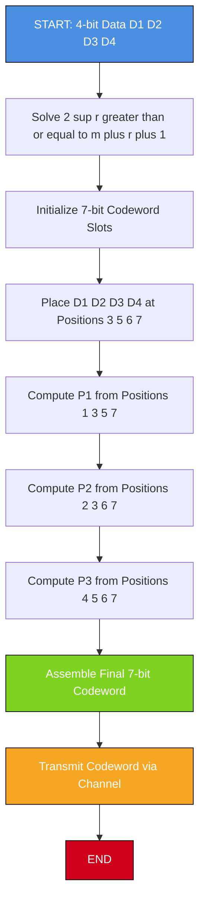
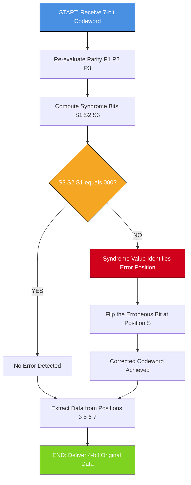
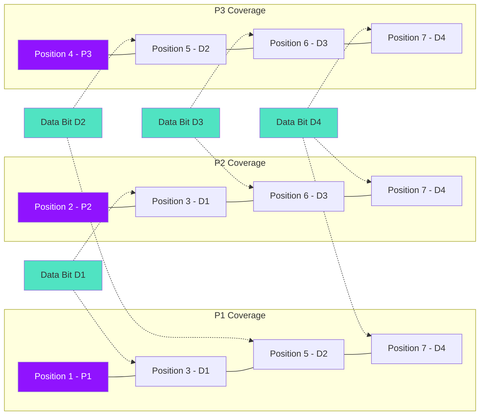

# Hamming Code

<!-- SECTION_1_START -->
# Hamming Code — Core Technical Definition & Intuitive Overview

## Formal Academic Definition

> [!NOTE]
> **Hamming Code (Richard Wesley Hamming, 1950)** is a family of **linear error-correcting codes** in the Data Link Layer that can detect **up to two-bit errors** and **correct any single-bit error** in a transmitted data unit. The canonical **Hamming(7,4)** code encodes **4 data bits** into a **7-bit codeword** by inserting **3 redundant parity bits** at positions that are **powers of two** (i.e., positions 1, 2, 4, 8, 16, ...).

For a message of **$m$** data bits, the minimum number of redundant parity bits **$r$** required is the smallest integer that satisfies the **Hamming Inequality**:

$$2^{r} \;\ge\; m + r + 1$$

Each parity bit is responsible for checking a specific subset of bit positions in the codeword, calculated using the **binary representation** of the position index.

---

## Conceptual Analogy / Intuition

> [!IMPORTANT]
> **Real-World Analogy: The Library Staircase Check**
>
> Imagine a librarian arranging books in a tall shelf with **4 distinct floors**. To catch a misplaced book, the librarian installs **3 inspectors** at positions 1, 2, and 4 of the staircase:
> * **Inspector 1** checks the 1st, 3rd, 5th, and 7th steps.
> * **Inspector 2** checks the 2nd, 3rd, 6th, and 7th steps.
> * **Inspector 4** checks the 4th, 5th, 6th, and 7th steps.
>
> If exactly **one book is misplaced**, the combination of inspectors who raise a flag uniquely identifies **which step** the book is on. The number formed by their reports (1, 2, or 4) directly points to the erroneous bit's position — this combination is called the **Syndrome Word**.

---

## Key Terminology

| Term | Definition |
| :--- | :--- |
| **Codeword** | The $n$-bit transmitted unit ($n = m + r$). |
| **Data Bit ($D_i$)** | Original message bit placed at non-power-of-2 positions. |
| **Parity Bit ($P_i$)** | Redundant check bit placed at power-of-2 positions. |
| **Syndrome Word ($S$)** | $r$-bit vector from receiver checks; value = erroneous bit's position. |
| **SEC Code** | **S**ingle **E**rror **C**orrecting code. |
| **SECDED Code** | **SEC** + **D**ouble **E**rror **D**etecting (Extended Hamming). |
| **Code Rate** | Efficiency ratio $\frac{m}{n}$. For Hamming(7,4), rate = $\frac{4}{7} \approx 0.571$. |

---

> [!VISUALIZATION CONTROL]
> **Concept:** Hamming(7,4) Codeword Structure — Bit Position Coverage
> **GeoGebra / Desmos Input Equations:**
> * $f_{P1}(x) = \text{checks positions } 1, 3, 5, 7$
> * $f_{P2}(x) = \text{checks positions } 2, 3, 6, 7$
> * $f_{P3}(x) = \text{checks positions } 4, 5, 6, 7$
> **Visual Description:** Plot the 7 positions on the x-axis and shade the regions each parity bit inspects. The overlapping intersections represent data bits covered by multiple parity checks, while power-of-2 positions (1, 2, 4) are dedicated parity slots.
<!-- SECTION_1_END -->

<!-- SECTION_2_START -->
# Deep Theoretical Analysis & KTU High-Yield Formula Sheet

## 1. Hamming Code Construction Algorithm

The construction of a Hamming codeword follows a deterministic, layered procedure:

* **Step 1 — Determine Parity Bit Count:** Solve the **Hamming Inequality** $2^{r} \ge m + r + 1$ for the smallest integer $r$.
* **Step 2 — Allocate Positions:** Number positions $1$ to $n$ from **left (MSB) to right (LSB)**.
* **Step 3 — Reserve Parity Slots:** Mark positions that are pure **powers of 2** ($2^0 = 1, 2^1 = 2, 2^2 = 4, 2^3 = 8, \dots$) as **parity bits** ($P_1, P_2, P_3, \dots$).
* **Step 4 — Place Data Bits:** Insert the $m$ message bits into the **remaining positions** sequentially.
* **Step 5 — Compute Parity Values:** For each parity bit $P_i$, compute the XOR (for even parity) of all data bits in positions whose index has the **$i$-th bit set** in binary.

## 2. Parity Coverage Table (Hamming 7,4)

| Position Index | Binary | Type | Covered By | XOR Group |
| :---: | :---: | :---: | :---: | :--- |
| 1 | 001 | $P_1$ | $P_1$ | Bits at positions $1, 3, 5, 7$ |
| 2 | 010 | $P_2$ | $P_2$ | Bits at positions $2, 3, 6, 7$ |
| 3 | 011 | $D_1$ | $P_1, P_2$ | $D_1$ participates in both checks |
| 4 | 100 | $P_3$ | $P_3$ | Bits at positions $4, 5, 6, 7$ |
| 5 | 101 | $D_2$ | $P_1, P_3$ | $D_2$ participates in both checks |
| 6 | 110 | $D_3$ | $P_2, P_3$ | $D_3$ participates in both checks |
| 7 | 111 | $D_4$ | $P_1, P_2, P_3$ | $D_4$ participates in all three checks |

## 3. Decoding and Error Correction Logic

At the receiver, the syndrome word **$S = (S_3, S_2, S_1)$** is computed using the **same parity rules** as the sender. The mathematical interpretation:

* If **$S = 000$** $\rightarrow$ **No error** detected.
* If **$S \ne 000$** $\rightarrow$ The decimal value of $S$ indicates the **exact bit position** to flip (correct).

> [!IMPORTANT]
> **Syndrome Decoder Rule:** The binary syndrome $S_3 S_2 S_1$ is interpreted as a position address. For example, syndrome $110_2 = 6_{10}$ means the error is at **position 6**.

## 4. KTU Formula Sheet / Cheat Sheet

| Formula / Rule | Expression | Use Case |
| :--- | :--- | :--- |
| Hamming Inequality | $2^{r} \ge m + r + 1$ | Find minimum parity bits $r$ |
| Total Codeword Length | $n = m + r$ | Calculate codeword size |
| Code Rate | $R = \frac{m}{n}$ | Measure channel efficiency |
| Minimum Hamming Distance | $d_{min} = 3$ | Single error correction |
| Error Correction Capability | $t = \left\lfloor \frac{d_{min} - 1}{2} \right\rfloor = 1$ | SEC property |
| Error Detection Capability | $e = d_{min} - 1 = 2$ | Detect up to 2-bit errors |
| Parity Bit $P_i$ (Even) | $P_i = \bigoplus_{j \in G_i} D_j$ | XOR of group $G_i$ members |
| Syndrome Value | $S = \sum_{i=1}^{r} S_i \cdot 2^{i-1}$ | Maps to error position |
| Extended Hamming (SECDED) | Add overall parity $P_0$ | Detect double errors |

## 5. Real-World Engineering Utility

* **ECC RAM (Error-Correcting Code Memory):** Modern server-grade DDR memory (e.g., ECC DIMMs) uses **Hamming(72,64)** to auto-correct single-bit flips caused by cosmic rays and electrical noise.
* **Satellite Communication (Deep Space Network):** NASA uses Hamming-based codes for **Voyager** and **Cassini** spacecraft telemetry to combat cosmic radiation.
* **Data Storage (RAID-2 & HDDs):** Hamming codes underpin early disk-drive error correction, ensuring bit-perfect retrieval.
* **QR Codes & Barcodes:** The error-correction mechanism in QR codes is a **multi-level Reed-Solomon** code, whose primitive form is a **BCH generalization** of Hamming codes.
<!-- SECTION_2_END -->

<!-- SECTION_3_START -->
# Step-by-Step Derivations & Symbolic Implementation

## Worked Example 1: Encoding with Hamming(7,4)

**Given:** Data bits = $\mathbf{1\;0\;1\;0}$ (4 bits, $D_1 D_2 D_3 D_4$)

### Step 1 — Determine Parity Bit Count

Solve $2^{r} \ge 4 + r + 1$:

$$
\begin{aligned}
\text{Try } r = 2: &\quad 2^{2} = 4 \quad\longrightarrow\quad 4 \not\ge 4+2+1 = 7 \quad \text{[REJECT]} \\
\text{Try } r = 3: &\quad 2^{3} = 8 \quad\longrightarrow\quad 8 \ge 4+3+1 = 8 \quad \text{[ACCEPT]} \\
\end{aligned}
$$

So $r = 3$ parity bits are required, giving a **7-bit codeword**.

### Step 2 — Allocate Bit Positions

| Position | 1 | 2 | 3 | 4 | 5 | 6 | 7 |
| :---: | :---: | :---: | :---: | :---: | :---: | :---: | :---: |
| **Type** | $P_1$ | $P_2$ | $D_1$ | $P_3$ | $D_2$ | $D_3$ | $D_4$ |
| **Value** | ? | ? | **1** | ? | **0** | **1** | **0** |

### Step 3 — Compute Parity Bits (Even Parity)

**$P_1$** checks positions 1, 3, 5, 7:
$$
\begin{aligned}
P_1 \oplus D_1 \oplus D_2 \oplus D_4 &= 0 \quad \text{(even parity condition)} \\
P_1 \oplus 1 \oplus 0 \oplus 0 &= 0 \\
P_1 &= 0 \oplus 1 \oplus 0 \oplus 0 = 1
\end{aligned}
$$

**$P_2$** checks positions 2, 3, 6, 7:
$$
\begin{aligned}
P_2 \oplus D_1 \oplus D_3 \oplus D_4 &= 0 \\
P_2 \oplus 1 \oplus 1 \oplus 0 &= 0 \\
P_2 &= 0 \oplus 1 \oplus 1 \oplus 0 = 0
\end{aligned}
$$

**$P_3$** checks positions 4, 5, 6, 7:
$$
\begin{aligned}
P_3 \oplus D_2 \oplus D_3 \oplus D_4 &= 0 \\
P_3 \oplus 0 \oplus 1 \oplus 0 &= 0 \\
P_3 &= 0 \oplus 0 \oplus 1 \oplus 0 = 1
\end{aligned}
$$

### Step 4 — Final Encoded Codeword

$$
\boxed{\text{Codeword} = P_1\,P_2\,D_1\,P_3\,D_2\,D_3\,D_4 = 1\;0\;1\;1\;0\;1\;0}
$$

---

## Worked Example 2: Single-Bit Error Detection & Correction

**Given:** Sender transmits $\mathbf{1\;0\;1\;1\;0\;1\;0}$ (7 bits). During transmission, **bit at position 6 flips** (1 → 0). Receiver gets $\mathbf{1\;0\;1\;1\;0\;0\;0}$.

### Step 1 — Re-evaluate Parity Checks at Receiver

**$S_1$** (positions 1, 3, 5, 7):
$$
S_1 = P_1 \oplus D_1 \oplus D_2 \oplus D_4 = 1 \oplus 1 \oplus 0 \oplus 0 = 0 \quad \text{[MATCH]}
$$

**$S_2$** (positions 2, 3, 6, 7):
$$
S_2 = P_2 \oplus D_1 \oplus D_3 \oplus D_4 = 0 \oplus 1 \oplus 0 \oplus 0 = 1 \quad \text{[MISMATCH]}
$$

**$S_3$** (positions 4, 5, 6, 7):
$$
S_3 = P_3 \oplus D_2 \oplus D_3 \oplus D_4 = 1 \oplus 0 \oplus 0 \oplus 0 = 1 \quad \text{[MISMATCH]}
$$

### Step 2 — Form the Syndrome Word

$$
S = S_3\,S_2\,S_1 = 1\,1\,0 \quad\longrightarrow\quad (110)_2 = (6)_{10}
$$

### Step 3 — Correct the Error

The syndrome value **6** points directly to bit position 6. Flip that bit:

$$
\text{Corrected} = 1\;0\;1\;1\;0\;\mathbf{1}\;0 = \text{Original Codeword} \quad\checkmark
$$

> [!IMPORTANT]
> **Key Insight:** The decoder **does not need to know** which bit flipped — the syndrome vector geometrically pinpoints the error position automatically.

---

## Python Implementation: Hamming(7,4) Encoder-Decoder

```python
from typing import Tuple


def hamming_encode(data: str) -> str:
    """
    Encode a 4-bit binary string using Hamming(7,4) code with even parity.

    Args:
        data: 4-character binary string (e.g., "1010").

    Returns:
        7-character binary string (the codeword).

    Raises:
        ValueError: If input length is not 4 or contains non-binary characters.
    """
    if len(data) != 4 or not all(c in "01" for c in data):
        raise ValueError("Input must be a 4-bit binary string (e.g., '1010').")

    code: list[int] = [0] * 7

    # Step 1: Place data bits at non-power-of-2 positions (3, 5, 6, 7)
    code[2] = int(data[0])  # D1 at position 3
    code[4] = int(data[1])  # D2 at position 5
    code[5] = int(data[2])  # D3 at position 6
    code[6] = int(data[3])  # D4 at position 7

    # Step 2: Compute parity bits for even parity
    code[0] = code[2] ^ code[4] ^ code[6]  # P1 covers pos 1,3,5,7
    code[1] = code[2] ^ code[5] ^ code[6]  # P2 covers pos 2,3,6,7
    code[3] = code[4] ^ code[5] ^ code[6]  # P3 covers pos 4,5,6,7

    return "".join(str(bit) for bit in code)


def hamming_decode(received: str) -> Tuple[int, str, str]:
    """
    Decode a Hamming(7,4) codeword and correct a single-bit error if present.

    Args:
        received: 7-character binary string (possibly corrupted).

    Returns:
        A tuple (syndrome, corrected_codeword, extracted_data).

    Raises:
        ValueError: If input length is not 7 or contains non-binary characters.
    """
    if len(received) != 7 or not all(c in "01" for c in received):
        raise ValueError("Input must be a 7-bit binary codeword.")

    code: list[int] = [int(bit) for bit in received]

    # Compute syndrome bits (S3, S2, S1)
    s1: int = code[0] ^ code[2] ^ code[4] ^ code[6]
    s2: int = code[1] ^ code[2] ^ code[5] ^ code[6]
    s3: int = code[3] ^ code[4] ^ code[5] ^ code[6]

    syndrome: int = s1 * 1 + s2 * 2 + s3 * 4

    # Apply single-bit correction if syndrome is non-zero
    corrected: list[int] = code.copy()
    if syndrome != 0:
        if 1 <= syndrome <= 7:
            corrected[syndrome - 1] ^= 1  # Flip erroneous bit
        else:
            raise RuntimeError("Computed syndrome is out of valid range [1, 7].")

    corrected_word: str = "".join(str(bit) for bit in corrected)

    # Extract original 4-bit data from positions 3, 5, 6, 7
    extracted_data: str = f"{corrected[2]}{corrected[4]}{corrected[5]}{corrected[6]}"

    return syndrome, corrected_word, extracted_data


# -------------------------------------------------------------------
# Demonstration Run
# -------------------------------------------------------------------
if __name__ == "__main__":
    original_data: str = "1010"
    print(f"Original Data      : {original_data}")

    codeword: str = hamming_encode(original_data)
    print(f"Encoded Codeword   : {codeword}")

    # Simulate error at position 6 (index 5) — flip a bit
    corrupted: list[str] = list(codeword)
    corrupted[5] = "0"  # Bit at position 6 is flipped
    corrupted_codeword: str = "".join(corrupted)
    print(f"Corrupted Received : {corrupted_codeword}")

    syndrome, corrected, data = hamming_decode(corrupted_codeword)
    print(f"Syndrome Detected  : {syndrome} (binary {syndrome:03b})")
    print(f"Corrected Codeword : {corrected}")
    print(f"Extracted Data     : {data}")
```

**Expected Output:**

```
Original Data      : 1010
Encoded Codeword   : 1011010
Corrupted Received : 1011000
Syndrome Detected  : 6 (binary 110)
Corrected Codeword : 1011010
Extracted Data     : 1010
```
<!-- SECTION_3_END -->

<!-- SECTION_4_START -->
# Structural Diagrams & Schematics

## Diagram 1: Hamming Encoder Flow (Sender Side)



## Diagram 2: Hamming Decoder Flow (Receiver Side)



## Diagram 3: Parity Coverage Architecture (Block Topology)


<!-- SECTION_4_END -->

<!-- SECTION_5_START -->
# KTU 2024 Scheme Examination Question Bank & Topic Recap

---

## PART A — Short Answer Questions (2 × 3 = 6 Marks)

### Question 1: `[KTU University Exam — July 2024]` — CO1, Remember

**Define Hamming distance. State the relationship between minimum Hamming distance, error detection, and error correction capabilities of a code.**

**Model Answer:**

> **Hamming Distance ($d$)** is the number of bit positions in which two codewords of equal length differ.
>
> For a code with minimum Hamming distance $d_{min}$:
> * **Error Detection Capability:** $e = d_{min} - 1$ bits.
> * **Error Correction Capability:** $t = \left\lfloor \dfrac{d_{min} - 1}{2} \right\rfloor$ bits.
>
> For Hamming(7,4), $d_{min} = 3$, hence $e = 2$ (detect up to 2-bit errors) and $t = 1$ (correct 1-bit error).
>
> **[Definition: 1 Mark]** **[Formula: 1 Mark]** **[Application to Hamming(7,4): 1 Mark]**

---

### Question 2: `[KTU University Exam — Dec 2023]` — CO1, Understand

**List any three properties/limitations of Hamming code.**

**Model Answer:**

> 1. Hamming code is a **linear block code** capable of **Single Error Correction (SEC)**.
> 2. The **code rate** decreases as the message length increases, leading to bandwidth overhead.
> 3. Hamming code can detect only **single and double bit errors** but can correct **only single-bit errors**; to detect double-bit errors, an **extended Hamming (SECDED)** code is required.
> 4. The Hamming distance is fixed at **$d_{min} = 3$**, which limits the correction radius.
>
> **[Any three correctly stated properties: 3 × 1 = 3 Marks]**

---

## PART B — Long Answer Questions (Internal Choice: Answer A or B)

### Question A (14 Marks): `[KTU University Exam — July 2024]` — CO2, Apply & Analyze

**(a)** Consider a dataword $\mathbf{1\;0\;1\;1\;0\;0\;1\;0}$ (8 bits). Apply **Hamming code** to:
*(i)* Determine the number of parity bits required. *(ii)* Construct the final codeword using even parity. *(7 Marks)

**(b)** Suppose the **4th bit from the LSB** of the transmitted codeword is flipped during transmission. Demonstrate the complete error detection and correction process at the receiver, showing the syndrome calculation. *(7 Marks)

---

#### Model Solution for (a):

**Step 1 — Parity Bit Calculation:**

Solve $2^{r} \ge 8 + r + 1$:

$$
\begin{aligned}
r = 3 &: \quad 2^3 = 8 \not\ge 8 + 3 + 1 = 12 \quad \text{[REJECT]} \\
r = 4 &: \quad 2^4 = 16 \ge 8 + 4 + 1 = 13 \quad \text{[ACCEPT]} \\
\end{aligned}
$$

**Therefore, $r = 4$ parity bits are needed → Hamming(12,8) code. Total codeword length = 12 bits.**
**[Stating Hamming inequality: 1 Mark]**, **[Verifying r = 4: 1 Mark]**

**Step 2 — Position Allocation (1 to 12):**

| Position | 1 | 2 | 3 | 4 | 5 | 6 | 7 | 8 | 9 | 10 | 11 | 12 |
| :---: | :---: | :---: | :---: | :---: | :---: | :---: | :---: | :---: | :---: | :---: | :---: | :---: |
| **Type** | $P_1$ | $P_2$ | $D_1$ | $P_3$ | $D_2$ | $D_3$ | $D_4$ | $P_4$ | $D_5$ | $D_6$ | $D_7$ | $D_8$ |
| **Value** | ? | ? | 1 | ? | 0 | 1 | 1 | ? | 0 | 0 | 1 | 0 |

**[Table setup: 1 Mark]**

**Step 3 — Compute Parity Bits (Even Parity):**

**$P_1$** (positions 1, 3, 5, 7, 9, 11):
$$
P_1 \oplus 1 \oplus 0 \oplus 1 \oplus 0 \oplus 1 = 0 \;\Rightarrow\; P_1 = 1
$$

**$P_2$** (positions 2, 3, 6, 7, 10, 11):
$$
P_2 \oplus 1 \oplus 1 \oplus 1 \oplus 0 \oplus 1 = 0 \;\Rightarrow\; P_2 = 0
$$

**$P_3$** (positions 4, 5, 6, 7, 12):
$$
P_3 \oplus 0 \oplus 1 \oplus 1 \oplus 0 = 0 \;\Rightarrow\; P_3 = 0
$$

**$P_4$** (positions 8, 9, 10, 11, 12):
$$
P_4 \oplus 0 \oplus 0 \oplus 1 \oplus 0 = 0 \;\Rightarrow\; P_4 = 1
$$

**[Each parity bit: 0.5 Mark × 4 = 2 Marks]**

**Step 4 — Final Codeword:**

$$
\boxed{\text{Codeword} = 1\;0\;1\;0\;0\;1\;1\;1\;0\;0\;1\;0}
$$

**[Final 12-bit codeword: 1 Mark]**

---

#### Model Solution for (b):

The 4th bit from LSB means the bit at position **$12 - 4 + 1 = 9$** is flipped. So $D_5$ changes from $0$ to $1$.

**Corrupted Codeword Received:** $1\;0\;1\;0\;0\;1\;1\;1\;\mathbf{1}\;0\;1\;0$

**Step 1 — Recompute Syndrome at Receiver:**

**$S_1$** (positions 1, 3, 5, 7, 9, 11):
$$
S_1 = 1 \oplus 1 \oplus 0 \oplus 1 \oplus 1 \oplus 1 = 1 \quad \text{[MISMATCH]}
$$

**$S_2$** (positions 2, 3, 6, 7, 10, 11):
$$
S_2 = 0 \oplus 1 \oplus 1 \oplus 1 \oplus 0 \oplus 1 = 0 \quad \text{[MATCH]}
$$

**$S_3$** (positions 4, 5, 6, 7, 12):
$$
S_3 = 0 \oplus 0 \oplus 1 \oplus 1 \oplus 0 = 0 \quad \text{[MATCH]}
$$

**$S_4$** (positions 8, 9, 10, 11, 12):
$$
S_4 = 1 \oplus 1 \oplus 0 \oplus 1 \oplus 0 = 1 \quad \text{[MISMATCH]}
$$

**Step 2 — Form Syndrome Word:**

$$
S = S_4\,S_3\,S_2\,S_1 = 1\,0\,0\,1 \quad\longrightarrow\quad (1001)_2 = (9)_{10}
$$

**Step 3 — Correct the Error:**

The syndrome $1001_2 = 9_{10}$ points to bit position **9**. Flip that bit:

$$
\text{Corrected Codeword} = 1\;0\;1\;0\;0\;1\;1\;1\;\mathbf{0}\;0\;1\;0 \quad\checkmark
$$

**[Syndrome calc: 2 Marks]**, **[Syndrome-to-position mapping: 2 Marks]**, **[Final correction: 2 Marks]**, **[Verification: 1 Mark]**

---

### Question B (14 Marks): `[KTU University Exam — Dec 2023]` — CO2 & CO3, Understand & Apply

**(a)** Explain **Extended Hamming Code (SECDED)**. How does it differ from the standard Hamming code? Why is an additional overall parity bit needed? *(7 Marks)*

**(b)** A sender transmits the Hamming(7,4) codeword $\mathbf{0\;1\;1\;0\;0\;1\;1}$ using **even parity**. Calculate the syndrome at the receiver and determine if any error exists. If yes, identify and correct it. *(7 Marks)*

---

#### Model Solution for (a):

**Extended Hamming Code (SECDED — Single Error Correcting, Double Error Detecting):**

> **Definition:** Extended Hamming code is constructed by appending **one extra overall parity bit** ($P_0$) to a standard Hamming(7,4) codeword, producing an **8-bit codeword (SECDED)**. This bit is computed as the XOR of **all 7 bits** of the original Hamming codeword (for even parity).

**Key Differences from Standard Hamming:**

| Feature | Standard Hamming(7,4) | Extended Hamming(8,4) (SECDED) |
| :--- | :---: | :---: |
| Codeword Length | 7 bits | 8 bits |
| Number of Parity Bits | 3 | 4 |
| Minimum Distance $d_{min}$ | 3 | 4 |
| Error Correction | 1-bit | 1-bit |
| Error Detection | 2-bit (but cannot distinguish from 1-bit) | 2-bit (reliably) |

**Why an Additional Parity Bit?**

In standard Hamming(7,4), a **double-bit error** produces a non-zero syndrome that is indistinguishable from a single-bit error at a *different* position, leading to **wrong correction**. The extra overall parity bit resolves this:

* If **syndrome = 0** and **overall parity passes** $\rightarrow$ No error.
* If **syndrome ≠ 0** and **overall parity fails** $\rightarrow$ Single-bit error (correct using syndrome).
* If **syndrome ≠ 0** and **overall parity passes** $\rightarrow$ Double-bit error (flag error, do not correct).

**[Definition: 2 Marks]**, **[Comparison Table: 2 Marks]**, **[Logical justification of $P_0$: 2 Marks]**, **[Diagrammatic/clear conclusion: 1 Mark]**

---

#### Model Solution for (b):

**Given Codeword:** $0\;1\;1\;0\;0\;1\;1$

| Position | 1 | 2 | 3 | 4 | 5 | 6 | 7 |
| :---: | :---: | :---: | :---: | :---: | :---: | :---: | :---: |
| **Type** | $P_1$ | $P_2$ | $D_1$ | $P_3$ | $D_2$ | $D_3$ | $D_4$ |
| **Value** | 0 | 1 | 1 | 0 | 0 | 1 | 1 |

**Step 1 — Recompute Parity Checks at Receiver:**

**$S_1$** (positions 1, 3, 5, 7):
$$
S_1 = 0 \oplus 1 \oplus 0 \oplus 1 = 0 \quad \text{[MATCH]}
$$

**$S_2$** (positions 2, 3, 6, 7):
$$
S_2 = 1 \oplus 1 \oplus 1 \oplus 1 = 0 \quad \text{[MATCH]}
$$

**$S_3$** (positions 4, 5, 6, 7):
$$
S_3 = 0 \oplus 0 \oplus 1 \oplus 1 = 0 \quad \text{[MATCH]}
$$

**Step 2 — Syndrome Word:**

$$
S = S_3\,S_2\,S_1 = 0\,0\,0 \quad\longrightarrow\quad (000)_2 = (0)_{10}
$$

**Step 3 — Conclusion:**

Since the syndrome is **000**, **no error is detected**. The received codeword is **error-free** and the original data is extracted directly from positions 3, 5, 6, 7: $D_1 D_2 D_3 D_4 = 1\,0\,1\,1$.

**[Stating positions and types: 1 Mark]**, **[Each parity check: 1 Mark × 3 = 3 Marks]**, **[Syndrome formation: 1 Mark]**, **[Conclusion and data extraction: 2 Marks]**

---

> [!WARNING]
> **KTU Examiner's Valuation Warning / Common Pitfalls:**
> 1. **Do NOT confuse "position from MSB" with "position from LSB."** KTU examiners often specify "4th bit from the right" — convert to absolute position using $n - k + 1$.
> 2. **Always specify the parity convention (even vs. odd).** Forgetting to mention this costs **1 full mark** in valuation.
> 3. **Forgetting to write the final codeword in the answer** — KTU strictly expects the final boxed codeword; missing it leads to a -1 mark penalty.
> 4. **Miscalculating the syndrome mapping** — remember the syndrome is read as $S_3 S_2 S_1$ (MSB to LSB), not reversed.
> 5. **For Extended Hamming, do not forget to draw the comparator logic** explaining all three (syndrome = 0, ≠0 with parity fail, ≠0 with parity pass) cases.

---

## Topic Recap & Important Things to Remember

* **Hamming(7,4)** encodes **4 data bits + 3 parity bits** into a 7-bit codeword.
* **Parity bit positions are powers of 2:** 1, 2, 4, 8, 16, ... — always reserve these first.
* **Hamming Inequality:** $2^{r} \ge m + r + 1$ determines the **minimum** number of parity bits.
* **Each parity bit $P_i$** checks all bit positions whose binary representation has the **$i$-th bit set to 1**.
* **Syndrome Word** $S = S_r S_{r-1} \dots S_1$ is the **binary address** of the erroneous bit position.
* **Minimum Hamming Distance $d_{min} = 3$** gives $t = 1$ (correction) and $e = 2$ (detection).
* **Extended Hamming (SECDED)** adds **one overall parity bit $P_0$** to distinguish single-bit errors from double-bit errors reliably.
* **Code Rate** for Hamming(7,4) is $\dfrac{4}{7} \approx 0.571$ (about **57.1% efficiency**).
* **Real-World Applications:** ECC RAM, satellite telemetry, RAID storage, QR codes, deep-space communication.
* **Key Personality:** Hamming code is **linear, systematic, and perfect** (uses all $2^n$ possible non-zero syndromes to indicate valid single-bit error positions).
* **Syndrome = 0** means **no error**; **Syndrome ≠ 0** means **error at syndrome's decimal position**.
* **Always declare parity convention** (even/odd) at the start of any Hamming code solution.
* **Larger dataword? More parity bits:** As $m$ grows, the parity overhead grows as $\log_2(m)$, keeping the code asymptotically efficient.
<!-- SECTION_5_END -->
