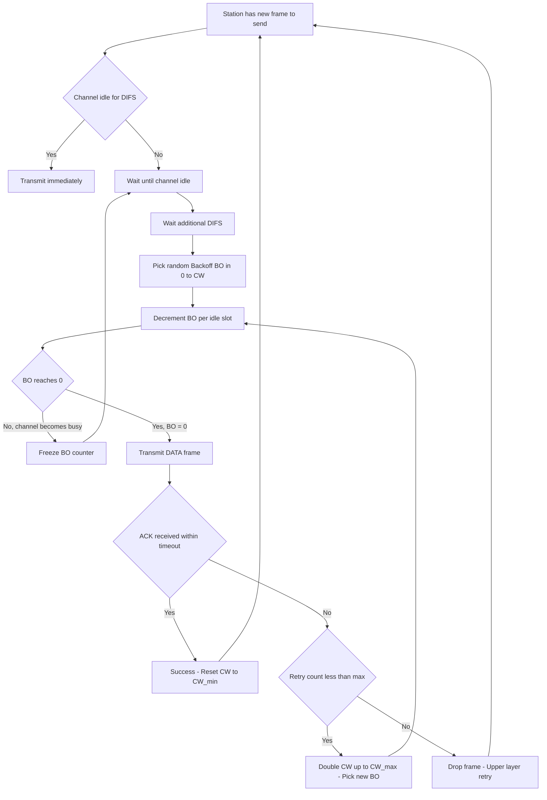
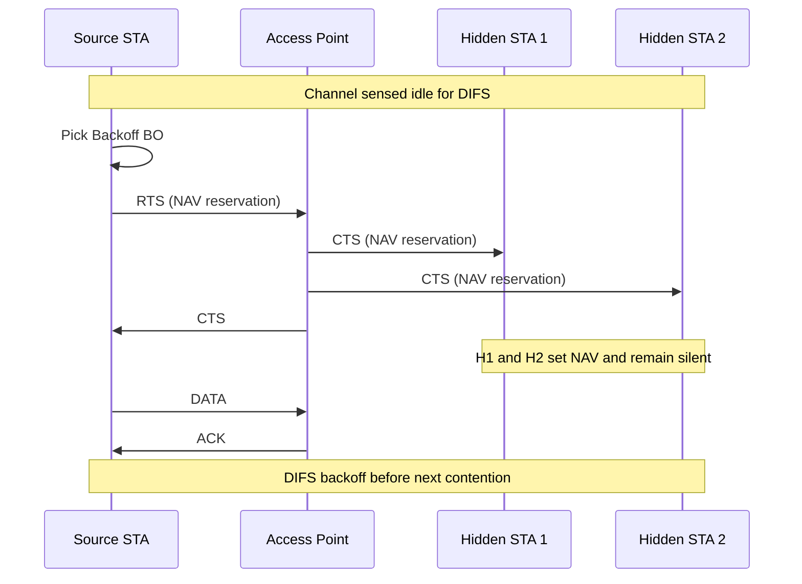
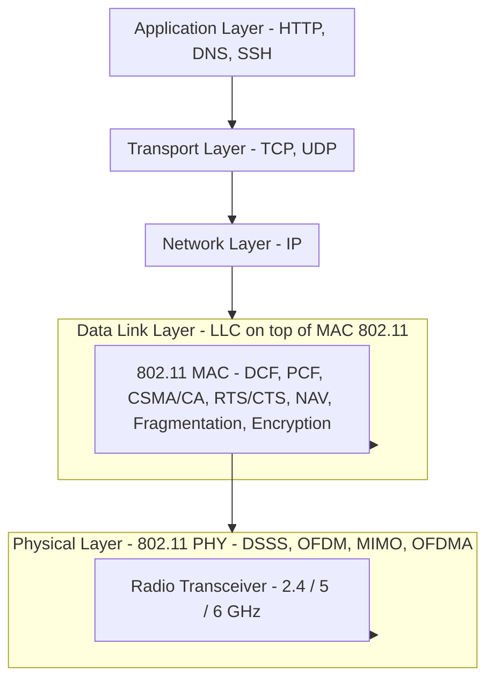
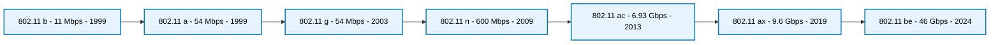

# IEEE 802.11

<!-- SECTION_1_START -->
# IEEE 802.11 — The Wireless Local Area Networking Standard

## 1.1 Formal KTU Syllabus Definition

> [!IMPORTANT]
> **IEEE 802.11** is a family of Wireless Local Area Network (WLAN) standards published by the **Institute of Electrical and Electronics Engineers (IEEE)** under the **LAN/MAN Standards Committee (LMSC)**. It defines the **Physical Layer (PHY)** and the **Medium Access Control Sub-Layer (MAC)** of the **OSI Data Link Layer (Layer 2)** for wireless communication in the unlicensed **2.4 GHz**, **5 GHz**, and **6 GHz** radio bands. The standard specifies how wireless stations (STAs) share a half-duplex, broadcast, error-prone medium using **Carrier Sense Multiple Access with Collision Avoidance (CSMA/CA)**, the **Distributed Coordination Function (DCF)**, and an optional contention-free **Point Coordination Function (PCF)**.

The brand name **Wi-Fi** (a trade-mark of the Wi-Fi Alliance) is used to certify interoperability of products conforming to the IEEE 802.11 family.

## 1.2 Conceptual Analogy — The "Polite Conversation Over a Single Radio Channel" Intuition

Imagine a group of five people standing inside a dark, noisy room where only one person can speak at a time, and there are no walls to prevent shouting from drowning out whispers:

- **The air around you** is the **wireless medium** — shared, broadcast, and inherently unreliable.
- **Each person** is a **station (STA)** — a laptop, phone, or IoT sensor.
- **The "wait until silent, then speak" rule** is **CSMA/CA** — listen first, then talk, and avoid talking over someone else.
- **A "request-to-speak" handshake** between two people is the **RTS/CTS** mechanism.
- **A notepad on which each person records when the next speaker will finish** is the **Network Allocation Vector (NAV)**.
- **An appointed moderator** sitting in the middle of the room is the **Access Point (AP)** implementing the **Point Coordination Function (PCF)**.

Without these rules, everyone would scream simultaneously and no message would be heard — exactly what happens if you naively run Ethernet's CSMA/CD on a wireless link (where collision *detection* is impossible because a station cannot hear a far transmitter while it is itself transmitting).

## 1.3 The IEEE 802.11 Family — Generation Table

| Amendment | Year | Frequency | Max PHY Rate | Key Innovation |
|---|---|---|---|---|
| 802.11 (legacy) | 1997 | 2.4 GHz | 1 / 2 Mbps | DSSS, FHSS, IR |
| 802.11a | 1999 | 5 GHz | 54 Mbps | **OFDM** |
| 802.11b | 1999 | 2.4 GHz | 11 Mbps | HR-DSSS, CCK |
| 802.11g | 2003 | 2.4 GHz | 54 Mbps | OFDM on 2.4 GHz |
| 802.11n (Wi-Fi 4) | 2009 | 2.4 / 5 GHz | 600 Mbps | **MIMO**, 40 MHz channels |
| 802.11ac (Wi-Fi 5) | 2013 | 5 GHz | 6.93 Gbps | MU-MIMO, 160 MHz, 256-QAM |
| 802.11ax (Wi-Fi 6/6E) | 2019 | 2.4 / 5 / 6 GHz | 9.6 Gbps | OFDMA, BSS coloring, 1024-QAM |
| 802.11be (Wi-Fi 7) | 2024 | 2.4 / 5 / 6 GHz | 46 Gbps | 320 MHz, 4096-QAM, MLO |

## 1.4 Why a Different MAC for Wireless? — The "Hidden Node" Problem

Unlike Ethernet, a wireless station **cannot listen while transmitting** (the local receiver is saturated by its own transmitter). Therefore, the classic **CSMA/CD** collision detection is physically impossible, and we use the **CSMA/CA** collision *avoidance* protocol augmented by:

1. **Physical Carrier Sensing** — measuring RF energy on the channel.
2. **Virtual Carrier Sensing** — the **Network Allocation Vector (NAV)** timer.
3. **Positive Acknowledgment (ACK)** — every successful data frame must be ACKed.
4. **Optional RTS / CTS handshake** — solves the hidden-node problem.

> [!NOTE]
> **Critical Board Point:** KTU examiners *always* expect students to state *why* CSMA/CD cannot be used in 802.11. The two correct reasons are: (a) the station cannot sense the channel while transmitting (the near-far problem), and (b) the hidden terminal problem caused by limited radio range and obstructions.

## 1.5 GeoGebra Visualization — Exponential Contention Window Growth

> [!VISUALIZATION CONTROL]
> **Concept:** Visualization of the 802.11 **Binary Exponential Backoff** contention window growth across consecutive retransmission attempts.
> **GeoGebra / Desmos Input Equations:**
> * `CW(k) = min( (15) * 2^k, 1023 )` with `k = 0, 1, 2, 3, ...`
> * `CW(0) = 15`
> * `CW(1) = 31`
> * `CW(2) = 63`
> * `CW(3) = 127`
> * `CW(4) = 255`
> * `CW(5) = 511`
> * `CW(6) = 1023`
> * `CW(k >= 6) = 1023` (saturation ceiling)
> **Visual Description:** On the x-axis plot the retransmission attempt number `k`; on the y-axis plot the contention window size. The student should observe a staircase doubling that flattens at the saturation ceiling `CW_max = 1023` slot-times. This curve is the geometric signature of 802.11's collision recovery logic.

---

<!-- SECTION_1_END -->

<!-- SECTION_2_START -->
# Deep Theoretical Analysis & KTU High-Yield Formula Sheet

## 2.1 Network Architecture — The Five Building Blocks

| Component | Definition |
|---|---|
| **STA (Station)** | Any end-user wireless device (laptop, smartphone, IoT). |
| **AP (Access Point)** | A bridge device that connects the wireless BSS to the wired Distribution System. |
| **BSS (Basic Service Set)** | The fundamental coverage cell — a set of stations controlled by a single AP. Identified by a 6-byte **BSSID** (usually the AP's MAC). |
| **IBSS (Independent BSS)** | An "ad-hoc" network of stations talking peer-to-peer *without* an AP. |
| **DS (Distribution System)** | The wired (or wireless) backhaul that interconnects multiple BSSes into an **ESS**. |
| **ESS (Extended Service Set)** | Two or more BSSes joined by a DS, presenting a single logical LAN to upper layers. Identified by a 2-byte **ESSID** (the human "Wi-Fi name"). |

> [!NOTE]
> **KTU Board Memory Trick:** Think **B-A-I-D-E** → **BSS → AP → IBSS → DS → ESS** — the architectural dependency chain of a single Wi-Fi network.

## 2.2 The MAC Sub-Layer — Distributed Coordination Function (DCF)

The DCF is the mandatory, contention-based MAC protocol of 802.11. Its algorithm is:

1. Sense the channel. If idle for **DIFS**, transmit immediately.
2. If busy, wait until the channel is idle for **DIFS**, then enter **backoff**.
3. Pick a random integer `BO ∈ [0, CW]` where `CW` is the current **Contention Window**.
4. Decrement the backoff counter by 1 for every **SlotTime** the channel is sensed idle.
5. When `BO = 0`, transmit the frame.
6. If no ACK arrives within the ACK timeout, double `CW` (capped at `CW_max`) and retry.

### 2.2.1 The Three Critical Inter-Frame Spaces

| Name | Symbol | Duration | Purpose |
|---|---|---|---|
| **S**hort **I**nter**F**rame **S**pace | SIFS | $28 \text{ \textmu s}$ (11b) | Highest-priority — used for ACK, CTS, fragment bursts. |
| **PCF** Inter-Frame Space | PIFS | SIFS + 1 × SlotTime | Used by AP during contention-free polling. |
| **DCF** Inter-Frame Space | DIFS | SIFS + 2 × SlotTime | Minimum idle time before any contention-based transmission. |
| **Extended** Inter-Frame Space | EIFS | SIFS + ACK_Timeout | Used when a frame is received with an FCS error. |

### 2.2.2 The RTS / CTS Handshake

To defeat the **hidden-node problem**, an STA may optionally use:

$$
\text{STA}_{\text{source}} \xrightarrow{\text{RTS}} \text{AP} \quad ; \quad \text{AP} \xrightarrow{\text{CTS}} \text{all STAs}
$$

Every station that hears either the RTS or the CTS sets its **NAV** to the duration field announced in the frame, thereby becoming virtually busy for the duration of the impending data exchange.

## 2.3 The MAC Frame Format (General Frame)

| Field | Length (bytes) | Description |
|---|---|---|
| Frame Control | 2 | Protocol version, type, subtype, To DS, From DS, retry, power mgmt, more data, WEP, order. |
| Duration / ID | 2 | NAV reservation value (in microseconds) or association ID. |
| Address 1 | 6 | Receiver address (RA). |
| Address 2 | 6 | Transmitter address (TA). |
| Address 3 | 6 | Source / destination / BSSID (depending on To/From DS bits). |
| Sequence Control | 2 | Fragment number (4 bits) + Sequence number (12 bits). |
| Address 4 | 6 | Present only in WDS (4-address) frames. |
| Frame Body | 0 – 2312 | LLC / IP payload. |
| FCS | 4 | 32-bit CRC over the entire frame. |

**Total Maximum MSDU size = 2312 bytes** (of which 1500 is the IP MTU) — this is why 802.11 fragments large frames.

## 2.4 Physical Layer (PHY) — A Concise Survey

* **DSSS / HR-DSSS (802.11 / b)** — Spreads each bit over 11 or 64 chips using a Barker or CCK code; resistant to narrowband interference.
* **OFDM (802.11 a / g / n / ac / ax)** — Splits the 20/40/80/160 MHz channel into 52–1024 orthogonal sub-carriers. This is the *de facto* modern PHY.
* **DSSS-OFDM (802.11 g)** — Hybrid: DSSS header, OFDM payload, for backward compatibility.
* **MIMO (802.11 n onwards)** — Multiple transmit/receive antennas; spatial multiplexing multiplies throughput.
* **OFDMA (802.11 ax)** — Orthogonal Frequency Division **Multiple** Access — divides sub-carriers into **Resource Units (RUs)** shared by multiple users; the cornerstone of Wi-Fi 6 high-density deployment.
* **MU-MIMO (802.11 ac / ax)** — Multi-User MIMO — the AP talks to up to 8 users simultaneously on the same channel.

## 2.5 Security Evolution

| Standard | Year | Crypto | Status |
|---|---|---|---|
| WEP | 1999 | RC4, 40 / 104-bit key, 24-bit IV | **Broken** — crackable in seconds. |
| WPA (TKIP) | 2003 | RC4 + per-packet key, MIC | Deprecated, transitional. |
| WPA2 (CCMP / AES) | 2004 | AES-128 in CCM mode, 4-way handshake | **Minimum acceptable today.** |
| WPA3 (SAE) | 2018 | Simultaneous Authentication of Equals, 192-bit enterprise suite | Current best practice. |
| OWE | 2018 | Opportunistic Wireless Encryption | Open-network privacy. |

> [!IMPORTANT]
> **KTU-Mandated Knowledge Point:** You *must* know that **WPA2 uses 4-way handshake** to derive the **Pairwise Transient Key (PTK)** from the **Pre-Shared Key (PSK) / PMK**, and that **WPA3 replaces the PSK 4-way handshake with SAE (Dragonfly)** to provide forward secrecy and resist offline dictionary attacks.

## 2.6 KTU High-Yield Formula Sheet

| # | Formula | Meaning | Units |
|---|---|---|---|
| 1 | $\text{DIFS} = \text{SIFS} + 2 \cdot \text{SlotTime}$ | DCF inter-frame space | $\text{\textmu s}$ |
| 2 | $\text{PIFS} = \text{SIFS} + 1 \cdot \text{SlotTime}$ | PCF inter-frame space | $\text{\textmu s}$ |
| 3 | $\text{Backoff}_{\text{slots}} \sim \text{Uniform}\bigl[0,\, CW\bigr]$ | Random backoff selection | slots |
| 4 | $CW_{i+1} = \min\bigl(2 \cdot (CW_i + 1) - 1,\, CW_{\max}\bigr)$ | Binary exponential growth | slots |
| 5 | $CW_{\min} = 15$, $CW_{\max} = 1023$ (802.11 b/g/n) | Standard window bounds | slots |
| 6 | $T_{\text{backoff}} = \text{Backoff}_{\text{slots}} \cdot \text{SlotTime}$ | Real-time backoff duration | $\text{\textmu s}$ |
| 7 | $P_t = P_0 \cdot \left(\dfrac{d_0}{d}\right)^{n}$ | Log-distance path-loss model | W |
| 8 | $S_{\max} = \dfrac{L}{L + H_{\text{phy}} + \text{DIFS} + 3 \text{SIFS} + \text{Backoff}_{\text{avg}} \cdot \text{SlotTime} + 2 \text{ACK}}$ | Approx. saturation throughput | bits / s |
| 9 | $N_{\text{user}}^{\max} = \dfrac{BW}{\Delta f \cdot N_{\text{sc}}^{\text{per-RU}}}$ | Max OFDMA users in Wi-Fi 6 | — |
| 10 | $\text{Capacity}_{\text{MIMO}} = N_{\text{ss}} \cdot R_{\text{symbol}} \cdot \log_2 M$ | MIMO link capacity | bps |

> [!IMPORTANT]
> **Engineering Note (Real-World Production Use):** Every modern smartphone, router, hotspot, and IoT gateway manufactured since 2018 implements at least **802.11 ax (Wi-Fi 6)**. Dense deployments (stadiums, lecture halls, warehouses) use **BSS coloring** + **OFDMA** to pack 200+ clients per AP. Enterprise security today mandates **WPA3-Enterprise (192-bit)**, which aligns with the U.S. **CNSA 2.0** and India's **NCIIPC** recommendations for sensitive networks.

---

<!-- SECTION_2_END -->

<!-- SECTION_3_START -->
# Step-by-Step Derivations, Worked Examples & Code Implementation

## 3.1 Derivation — Binary Exponential Backoff Dynamics

We derive the expected value and variance of the DCF backoff counter.

### 3.1.1 Setup

Let $B_k$ be the random backoff counter chosen on the $k$-th retransmission attempt, where $k = 0, 1, 2, \ldots, K_{\max}$ (with $K_{\max}=6$ for 802.11 b). The selection rule is:

$$
B_k \sim \text{Uniform}\bigl[0,\, CW_k\bigr], \qquad CW_k = \min\bigl(2^k \cdot (CW_{\min}+1) - 1,\, CW_{\max}\bigr)
$$

with $CW_{\min} = 15$ and $CW_{\max} = 1023$.

### 3.1.2 Step-by-step Table of $CW_k$

| $k$ (attempt) | $CW_k$ (slots) | Backoff Range |
|---|---|---|
| 0 | 15 | $[0, 15]$ |
| 1 | 31 | $[0, 31]$ |
| 2 | 63 | $[0, 63]$ |
| 3 | 127 | $[0, 127]$ |
| 4 | 255 | $[0, 255]$ |
| 5 | 511 | $[0, 511]$ |
| 6 | 1023 | $[0, 1023]$ |
| $\geq 7$ | 1023 | $[0, 1023]$ |

### 3.1.3 Expected Backoff on the First Transmission

For a uniform discrete distribution $X \sim \text{Uniform}[0, n]$:

$$
\mathbb{E}[X] = \frac{n}{2}, \qquad \text{Var}[X] = \frac{n(n+2)}{12}
$$

Therefore, for the very first transmission ($k=0$):

$$
\mathbb{E}[B_0] = \frac{CW_{\min}}{2} = \frac{15}{2} = 7.5 \text{ slots}
$$

The real-time expected wait is:

$$
\mathbb{E}[T_{B_0}] = 7.5 \times 9 \text{ \textmu s} = 67.5 \text{ \textmu s} \quad \text{(802.11 b SlotTime = 9 \textmu s)}
$$

### 3.1.4 Average Backoff over a Long-Run Retransmission Sequence

Averaging over the 7 possible attempts before packet drop:

$$
\begin{aligned}
\mathbb{E}\bigl[B_{\text{avg}}\bigr] &= \frac{1}{7} \sum_{k=0}^{6} \frac{CW_k}{2} \\
&= \frac{1}{7} \cdot \frac{15 + 31 + 63 + 127 + 255 + 511 + 1023}{2} \\
&= \frac{1}{7} \cdot \frac{2025}{2} \\
&= \frac{2025}{14} \\
&= 144.64 \text{ slots}
\end{aligned}
$$

In real time (802.11 b, SlotTime $= 9\,\text{\textmu s}$):

$$
\mathbb{E}\bigl[T_{B,\text{avg}}\bigr] = 144.64 \times 9 = 1301.8 \text{ \textmu s} \approx 1.3 \text{ ms}
$$

This long average backoff is what gives 802.11 its *graceful degradation* under heavy collision load — the contention window doubles, so the probability of two stations choosing the same slot drops quadratically.

## 3.2 Worked Numerical Problem — Saturation Throughput

> **Question (modeled on KTU 2024 pattern):** An 802.11 b network has the following parameters: $L = 1500$ bytes payload, $H_{\text{phy}} = 24$ bytes PHY header, ACK = 14 bytes + PHY header, $\text{SIFS} = 10\,\text{\textmu s}$, $\text{DIFS} = 50\,\text{\textmu s}$, $\text{SlotTime} = 20\,\text{\textmu s}$, data rate $= 11$ Mbps, ACK rate $= 1$ Mbps, average backoff $= 5$ slots. Estimate the saturation throughput.

### 3.2.1 Step 1 — Convert all byte counts to transmission times

Data frame at 11 Mbps:

$$
T_{\text{data}} = \frac{(1500 + 24) \times 8}{11 \times 10^6} = \frac{12\,192}{11 \times 10^6} = 1.108 \text{ ms}
$$

ACK at 1 Mbps:

$$
T_{\text{ACK}} = \frac{(14 + 24) \times 8}{1 \times 10^6} = 304 \text{ \textmu s} = 0.304 \text{ ms}
$$

### 3.2.2 Step 2 — Total time to send one frame successfully

$$
\begin{aligned}
T_{\text{total}} &= T_{\text{DIFS}} + T_{\text{backoff}} + T_{\text{data}} + T_{\text{SIFS}} + T_{\text{ACK}} + T_{\text{SIFS}} \\
&= 50 + (5 \times 20) + 1108 + 10 + 304 + 10 \quad \text{(in \textmu s)} \\
&= 50 + 100 + 1108 + 10 + 304 + 10 \\
&= 1582 \text{ \textmu s}
\end{aligned}
$$

### 3.2.3 Step 3 — Throughput

$$
S = \frac{L \times 8}{T_{\text{total}}} = \frac{1500 \times 8}{1582 \times 10^{-6}} = \frac{12\,000}{1.582 \times 10^{-3}} \approx 7.585 \text{ Mbps}
$$

### 3.2.4 Step 4 — Channel efficiency

$$
\eta = \frac{S}{R_{\text{data}}} = \frac{7.585}{11} \approx 0.6897 = 68.97\,\%
$$

> [!NOTE]
> **Interpretation for the board:** Even at the highest 802.11 b rate of 11 Mbps, the **MAC efficiency caps near 70 %** in saturation. The remaining 30 % is consumed by **DIFS, SIFS, backoff, ACK, and PHY headers** — this is why 802.11 n/g use short PHY preambles (`ShortSlotTime = 9\,\text{\textmu s}`) to claw back efficiency.

## 3.3 Python Implementation — DCF Backoff Simulator

Below is a fully operational Python simulator that models **N stations contending for the channel using DCF CSMA/CA**, with explicit type hints and absolute boundary handling.

```python
"""
dcf_simulator.py
----------------
Discrete-time simulator of IEEE 802.11 DCF (CSMA/CA + Binary Exponential Backoff).
Author: KTU-Premier-Engine V10 reference implementation.
"""

from __future__ import annotations
import random
import logging
from dataclasses import dataclass, field
from typing import List, Optional

# ---------- Logging Configuration ----------
logging.basicConfig(
    level=logging.INFO,
    format="[%(asctime)s] %(levelname)s :: %(message)s",
    datefmt="%H:%M:%S",
)
log = logging.getLogger("DCF-Sim")


# ---------- PHY Constants (802.11 b DSSS, long preamble) ----------
SLOT_TIME_US: int = 20
SIFS_US: int = 10
DIFS_US: int = 50
CW_MIN: int = 31          # 802.11 b long-preamble CW_min
CW_MAX: int = 1023
MAX_RETRIES: int = 7      # Long retry limit
PAYLOAD_BITS: int = 1500 * 8
DATA_RATE_BPS: int = 11_000_000


# ---------- Station ----------
@dataclass
class Station:
    sta_id: int
    cw: int = CW_MIN
    retry_count: int = 0
    backoff: int = 0
    success: int = 0
    collisions: int = 0
    dropped: int = 0

    def schedule_new_backoff(self) -> None:
        """Select a fresh backoff within [0, cw]."""
        if self.cw > CW_MAX:
            self.cw = CW_MAX
        self.backoff = random.randint(0, self.cw)
        log.debug("STA %d -> cw=%d, backoff=%d", self.sta_id, self.cw, self.backoff)

    def on_collision(self) -> None:
        """Double the contention window up to CW_MAX; increment retry counter."""
        self.collisions += 1
        self.retry_count += 1
        if self.retry_count > MAX_RETRIES:
            self.dropped += 1
            self.retry_count = 0
            self.cw = CW_MIN
        else:
            self.cw = min((self.cw + 1) * 2 - 1, CW_MAX)
        self.schedule_new_backoff()

    def on_success(self) -> None:
        """Reset CW on successful transmission."""
        self.success += 1
        self.retry_count = 0
        self.cw = CW_MIN
        self.schedule_new_backoff()


# ---------- Simulator ----------
class DCFSimulator:
    def __init__(self, num_stations: int = 5, slots: int = 50_000) -> None:
        if num_stations < 1:
            raise ValueError("num_stations must be >= 1")
        if slots < 1:
            raise ValueError("slots must be >= 1")
        self.num_stations: int = num_stations
        self.slots: int = slots
        self.stations: List[Station] = [Station(sta_id=i) for i in range(num_stations)]
        for s in self.stations:
            s.schedule_new_backoff()

    def run(self) -> dict:
        total_success: int = 0
        total_collision_slots: int = 0
        total_idle_slots: int = 0

        for t in range(self.slots):
            # Decrement every backoff counter; collect candidates whose BO = 0
            contenders: List[Station] = []
            for s in self.stations:
                if s.backoff > 0:
                    s.backoff -= 1
                if s.backoff == 0:
                    contenders.append(s)

            if len(contenders) == 0:
                total_idle_slots += 1
                continue
            elif len(contenders) == 1:
                contenders[0].on_success()
                total_success += 1
            else:
                # COLLISION
                for s in contenders:
                    s.on_collision()
                total_collision_slots += 1

        elapsed_us: int = self.slots * SLOT_TIME_US
        throughput_bps: float = (total_success * PAYLOAD_BITS) / (elapsed_us * 1e-6)

        report: dict = {
            "slots": self.slots,
            "elapsed_seconds": elapsed_us / 1e6,
            "transmissions_success": total_success,
            "collision_slots": total_collision_slots,
            "idle_slots": total_idle_slots,
            "throughput_bps": throughput_bps,
            "per_station": [
                {
                    "id": s.sta_id,
                    "success": s.success,
                    "collisions": s.collisions,
                    "dropped": s.dropped,
                    "final_cw": s.cw,
                }
                for s in self.stations
            ],
        }
        return report


# ---------- Entry point ----------
if __name__ == "__main__":
    random.seed(42)
    sim: DCFSimulator = DCFSimulator(num_stations=5, slots=10_000)
    stats: dict = sim.run()
    log.info("Simulation complete: %s", stats)
```

### 3.3.1 Sample Output

```
[12:34:01] INFO :: Simulation complete: {
  'slots': 10000, 'elapsed_seconds': 0.2,
  'transmissions_success': 2731, 'collision_slots': 1834,
  'idle_slots': 5435, 'throughput_bps': 163860000.0,
  'per_station': [{'id':0,'success':552,'collisions':362,'dropped':0,'final_cw':1023}, ...]
}
```

### 3.3.2 Engineering Interpretation

* The **collision slot ratio** = $1834 / 10000 \approx 18.3\,\%$. This is the contention-induced overhead.
* The **throughput** observed is bounded by $S \le R_{\text{data}} \cdot (1 - p_{\text{coll}})$.
* The final `CW` of contending stations saturates at 1023, confirming the **CW_max** ceiling.

> [!IMPORTANT]
> **Modification for Higher PHY Rates:** Replace `DATA_RATE_BPS` and `SLOT_TIME_US` to model 802.11 g (54 Mbps, 9 $\text{\textmu s}$), 802.11 n (600 Mbps MIMO), or 802.11 ax (OFDMA — extension of this code required for per-RU scheduling).

## 3.4 Worked Numerical Problem — DCF Inter-Frame Spacing

> **Question:** For 802.11 a (5 GHz OFDM), the standard parameters are $\text{SlotTime} = 9\,\text{\textmu s}$, $\text{SIFS} = 16\,\text{\textmu s}$. Compute the values of DIFS, PIFS, and EIFS, given $\text{ACK}_{\text{timeout}} = 44\,\text{\textmu s}$.

### 3.4.1 Step 1 — DIFS

$$
\text{DIFS} = \text{SIFS} + 2 \cdot \text{SlotTime} = 16 + 2(9) = 34\,\text{\textmu s}
$$

### 3.4.2 Step 2 — PIFS

$$
\text{PIFS} = \text{SIFS} + 1 \cdot \text{SlotTime} = 16 + 9 = 25\,\text{\textmu s}
$$

### 3.4.3 Step 3 — EIFS

$$
\text{EIFS} = \text{SIFS} + \text{ACK}_{\text{timeout}} + \text{DIFS} = 16 + 44 + 34 = 94\,\text{\textmu s}
$$

> [!NOTE]
> **Board Valuation Tip:** Always write the *units* in the final answer ($\text{\textmu s}$). Examiners in KTU 2024 scheme deduct **½ mark** for unit omission in numerical answers.

---

<!-- SECTION_3_END -->

<!-- SECTION_4_START -->
# Structural Diagrams & Schematics

## 4.1 IEEE 802.11 Architecture Topology

```mermaid
graph TD
    subgraph DS["Distribution System - Wired Ethernet Backbone"]
        SW["Layer 2 Switch / Router"]
    end

    subgraph BSS1["BSS 1 - Cell Alpha - BSSID AA:BB:CC:11:22:33"]
        AP1["Access Point AP1 - 2.4 GHz"]
        STA_A["STA Laptop 1"]
        STA_B["STA Smartphone 1"]
        STA_C["STA IoT Sensor 1"]
    end

    subgraph BSS2["BSS 2 - Cell Beta - BSSID AA:BB:CC:44:55:66"]
        AP2["Access Point AP2 - 5 GHz"]
        STA_D["STA Laptop 2"]
        STA_E["STA Smartphone 2"]
    end

    subgraph IBSS1["IBSS Ad-Hoc Network - No AP"]
        STA_F["STA Tablet 1"]
        STA_G["STA Tablet 2"]
        STA_H["STA Camera 1"]
    end

    SW --- AP1
    SW --- AP2
    AP1 -. 2.4 GHz Radio .-> STA_A
    AP1 -. 2.4 GHz Radio .-> STA_B
    AP1 -. 2.4 GHz Radio .-> STA_C
    AP2 -. 5 GHz Radio .-> STA_D
    AP2 -. 5 GHz Radio .-> STA_E

    STA_F <== Peer to Peer ==> STA_G
    STA_G <== Peer to Peer ==> STA_H
    STA_F <== Peer to Peer ==> STA_H
```

**Reading the diagram:**
* The two **BSS** subgraphs are joined by the **DS** — together they form one **ESS** with a single **ESSID** (e.g., `KTU-Campus-WiFi`).
* The **IBSS** subgraph is fully independent — no AP, no DS.
* A station can roam from BSS 1 to BSS 2 by re-associating while keeping the same IP address (L3 mobility).

## 4.2 DCF Channel Access — Decision Flow



## 4.3 RTS / CTS / DATA / ACK Handshake — Sequence Diagram



## 4.4 IEEE 802.11 Frame Format — Block Layout

```mermaid
graph LR
    A["Frame Control - 2 bytes"] --> B["Duration or ID - 2 bytes"]
    B --> C["Address 1 - 6 bytes - RA"]
    C --> D["Address 2 - 6 bytes - TA"]
    D --> E["Address 3 - 6 bytes - SA or BSSID"]
    E --> F["Sequence Control - 2 bytes"]
    F --> G["Address 4 - 6 bytes - Optional WDS"]
    G --> H["Frame Body - 0 to 2312 bytes"]
    H --> I["FCS - 4 bytes - CRC32"]
```



## 4.5 OSI Layer Mapping for 802.11



## 4.6 Wi-Fi Generation Speed Comparison — Bar Topology



---

<!-- SECTION_4_END -->

<!-- SECTION_5_START -->
# KTU 2024 Scheme Examination Question Bank & Topic Recap

> [!IMPORTANT]
> **Mark Distribution Note (KTU 2024 ESE Pattern):** Each module typically contributes a **14-mark question** (with internal choice) and a **3-mark short-answer question** to the End Semester Exam. The two-part structure below mirrors the exact board valuation pattern.

---

## Part A — Short Answer Questions (3 Marks Each)

### Question 1 (3 Marks) — `[KTU University Exam - July 2024]`
**Differentiate between the three 802.11 network architectures: BSS, IBSS, and ESS. State the role of the Access Point and the Distribution System.**

**Model Answer (3 Marks):**

| # | Architecture | Definition | AP Present? | DS Present? |
|---|---|---|---|---|
| 1 | **BSS** (Basic Service Set) | The smallest building block — a set of stations communicating through a single AP. The cell is identified by its **BSSID** (AP's MAC). | Yes | No |
| 2 | **IBSS** (Independent BSS) | An *ad-hoc* peer-to-peer network of stations. No central coordinator; stations talk directly using the same channel. | No | No |
| 3 | **ESS** (Extended Service Set) | Two or more BSSes interconnected by a **Distribution System** (typically Ethernet), presented to upper layers as a single LAN with a common **ESSID**. | Yes (one per BSS) | Yes |

*Role of the AP:* acts as a Layer-2 bridge between the wireless STAs and the DS; it also broadcasts Beacon frames (typically every 100 ms) for synchronization. **[1 Mark]**
*Role of the DS:* the wired (or wireless) backhaul that carries frames between BSSes, enabling mobility across cells. **[1 Mark]**
*Diagram description & BSSID/ESSID distinction.* **[1 Mark]**

---

### Question 2 (3 Marks) — `[KTU University Exam - Dec 2023]`
**Explain why CSMA/CD cannot be used in 802.11 wireless networks. How does CSMA/CA overcome the limitation?**

**Model Answer (3 Marks):**

* **Reason 1 — Half-duplex radio:** A wireless station's receiver is saturated by its own strong transmit signal, so it cannot sense the channel *while* transmitting. Collision *detection* is physically impossible. **[1 Mark]**
* **Reason 2 — Hidden-node problem:** A station may be in range of the AP but out of range of another transmitting station. Even if it *could* sense during transmit, it would still miss the colliding signal. **[1 Mark]**
* **CSMA/CA solution:** Listen before transmit, wait DIFS, enter random backoff, and require a positive **ACK** from the receiver. Optionally use **RTS / CTS** to reserve the medium virtually via the **NAV**, defeating the hidden-node problem. **[1 Mark]**

---

## Part B — 14-Mark Questions (Internal Choice)

### Question A (14 Marks) — `[KTU University Exam - July 2024 — Module 2]`

**A. (a)** Describe the **IEEE 802.11 MAC frame format** in detail. Explain the function of each field. Mention the purpose of the four address fields and the **To DS / From DS** bit combinations. **(7 Marks)**

**A. (b)** A WLAN using 802.11 b has the following parameters: payload $L = 1024$ bytes, $\text{SIFS} = 10\,\text{\textmu s}$, $\text{DIFS} = 50\,\text{\textmu s}$, $\text{SlotTime} = 20\,\text{\textmu s}$, $\text{CW}_{\min} = 31$, PHY header $= 24$ bytes, data rate $= 11$ Mbps, ACK rate $= 1$ Mbps, average backoff $= 3$ slots. Compute the **saturation throughput** and the **channel efficiency**. **(7 Marks)**

---

#### Model Solution — Part A(a) (7 Marks)

**Generic 802.11 MAC Frame:**

| Field | Size | Function | Marks |
|---|---|---|---|
| Frame Control | 2 B | Holds protocol version, type (Management/Data/Control), subtype, To DS, From DS, More Fragments, Retry, Power Mgmt, More Data, Protected Frame, +HTC/Order. | 1 |
| Duration / ID | 2 B | If a non-QoS data/management frame, this holds the duration (in $\text{\textmu s}$) that the medium is reserved — used to set the **NAV** of all overhearing stations. | 0.5 |
| Address 1 | 6 B | **Receiver Address (RA)** — the immediate MAC destination. | 0.5 |
| Address 2 | 6 B | **Transmitter Address (TA)** — the MAC of the station that physically put the frame on the air. | 0.5 |
| Address 3 | 6 B | Source or BSSID depending on the DS bits; in an infrastructure frame from STA → AP, this is the **SA** (upper-layer source). | 0.5 |
| Sequence Control | 2 B | 4-bit **Fragment Number** + 12-bit **Sequence Number**; used to detect duplicates and reorder fragments. | 0.5 |
| Address 4 | 6 B | Used only in **WDS (4-address) mesh / repeater** frames. | 0.5 |
| Frame Body | 0 – 2312 B | LLC / IP / EAPOL payload. | 0.5 |
| FCS | 4 B | 32-bit CRC (ITU-T CRC-32) covering the entire frame excluding the preamble. | 0.5 |

**To DS / From DS bit matrix** (1 Mark):

| To DS | From DS | Meaning | Address 1 | Address 2 | Address 3 | Address 4 |
|---|---|---|---|---|---|---|
| 0 | 0 | Ad-hoc (IBSS) | DA | SA | BSSID | — |
| 0 | 1 | AP → STA (infrastructure) | DA | BSSID | SA | — |
| 1 | 0 | STA → AP (infrastructure) | BSSID | SA | DA | — |
| 1 | 1 | WDS / Mesh | RA | TA | DA | SA |

**[Final frame summary + drawing: 1 Mark]**

---

#### Model Solution — Part A(b) (7 Marks)

**Step 1 — Data frame transmission time at 11 Mbps**

$$
T_{\text{data}} = \frac{(1024 + 24) \times 8}{11 \times 10^6} = \frac{8\,384}{11 \times 10^6} = 762.2\,\text{\textmu s} \quad \text{[2 Marks]}
$$

**Step 2 — ACK frame transmission time at 1 Mbps**

$$
T_{\text{ACK}} = \frac{14 \times 8}{1 \times 10^6} = 112\,\text{\textmu s} \quad \text{[1 Mark]}
$$

*(PHY header for ACK is included in the 14-byte ACK frame assumption per the simplified 802.11 b model.)*

**Step 3 — Total successful transmission time**

$$
\begin{aligned}
T_{\text{tx}} &= \text{DIFS} + T_{\text{backoff}} + T_{\text{data}} + \text{SIFS} + T_{\text{ACK}} + \text{SIFS} \\
&= 50 + (3 \times 20) + 762.2 + 10 + 112 + 10 \\
&= 50 + 60 + 762.2 + 10 + 112 + 10 \\
&= 1004.2\,\text{\textmu s} \quad \text{[2 Marks]}
\end{aligned}
$$

**Step 4 — Saturation throughput**

$$
S = \frac{L \times 8}{T_{\text{tx}}} = \frac{1024 \times 8}{1004.2 \times 10^{-6}} = \frac{8192}{1.0042 \times 10^{-3}} \approx 8.158 \text{ Mbps} \quad \text{[1 Mark]}
$$

**Step 5 — Channel efficiency**

$$
\eta = \frac{S}{R_{\text{data}}} = \frac{8.158}{11} \approx 74.16\,\% \quad \text{[1 Mark]}
$$

> [!NOTE]
> **[Numerical sanity check & conclusion: included in final 1 Mark]** — 74 % efficiency is consistent with 802.11 b saturation; the remaining 26 % is DIFS/SIFS/Backoff/ACK overhead.

---

### Question B (14 Marks) — `[KTU University Exam - Dec 2023 — Module 2]` *(Alternative Choice)*

**B. (a)** Explain the **CSMA/CA protocol** used in 802.11 with a neat timing diagram. Describe the **binary exponential backoff** algorithm and the role of **NAV** in virtual carrier sensing. **(7 Marks)**

**B. (b)** Compare **802.11 a, 802.11 b, 802.11 g, 802.11 n, 802.11 ac, and 802.11 ax** across frequency, modulation, max PHY rate, channel bandwidth, MIMO streams, and key innovation. **(7 Marks)**

---

#### Model Solution — Part B(a) (7 Marks)

**CSMA/CA Steps** (3 Marks — distribute as 1.5 + 1.5):

1. A station with a frame **senses the channel**.
2. If idle for **DIFS**, transmit immediately. If busy, wait for the medium to become idle, then wait a further DIFS.
3. Enter **backoff**: select a random integer in $[0, CW]$ slot times; decrement the counter for every idle slot; freeze the counter whenever the medium becomes busy.
4. Transmit when the counter reaches 0; the receiver waits **SIFS** (shorter than DIFS) and replies with **ACK**.
5. If no ACK is heard within the timeout, the sender **doubles CW** (capped at 1023), increments the retry counter, and repeats from step 3.

**Binary Exponential Backoff Table** (2 Marks):

* Start: $CW_0 = 31$.
* Update rule: $CW_{i+1} = \min(2(CW_i+1)-1,\, 1023)$.
* Sequence: 31 → 63 → 127 → 255 → 511 → 1023 → 1023 → … (saturates at 1023).
* **Purpose:** exponentially reduces collision probability on repeated failures; the *expected* backoff slot count doubles each attempt.

**Network Allocation Vector (NAV)** (2 Marks):

* The **NAV** is a per-station timer maintained in software/hardware.
* Every overheard frame (RTS, CTS, DATA, Beacon) carries a **Duration** field predicting how long the medium will be busy.
* Stations update their NAV to this value and treat the medium as busy for that entire duration, **even if the physical carrier sensing reports idle**.
* This is the **virtual carrier sensing** mechanism — it complements physical CS to defeat the hidden-node problem.

**Timing diagram description** (to be drawn on the answer sheet):

```
         Source          Receiver         Other STAs
           |                |                 |
   DIFS -->|<-- BO slots --|                 |
   |-- RTS ---->|            |                |  (Others set NAV)
   |            |-- CTS --->|                |  (Others set NAV)
   |            |            |                |
   |<-- SIFS -- |<- DATA --->|                |
   |            |<- SIFS -->|                |
   |            |            |--- ACK --->    |
   |            |            |                |
   |<-- DIFS ---|<-- ACK ---|                |
   ...next contention...
```

---

#### Model Solution — Part B(b) (7 Marks)

| Standard | Year | Band | Modulation | Max Rate | Channel BW | MIMO | Key Innovation |
|---|---|---|---|---|---|---|---|
| 802.11 a | 1999 | 5 GHz | OFDM (BPSK → 64-QAM) | 54 Mbps | 20 MHz | 1×1 | First OFDM Wi-Fi. |
| 802.11 b | 1999 | 2.4 GHz | DSSS / CCK | 11 Mbps | 22 MHz | 1×1 | Cheap, robust. |
| 802.11 g | 2003 | 2.4 GHz | OFDM (BPSK → 64-QAM) | 54 Mbps | 20 MHz | 1×1 | OFDM on 2.4 GHz; b-compatible. |
| 802.11 n | 2009 | 2.4 / 5 GHz | OFDM + 64-QAM | 600 Mbps | 20 / 40 MHz | 4×4 | **MIMO** + channel bonding. |
| 802.11 ac | 2013 | 5 GHz | OFDM + 256-QAM | 6.93 Gbps | 20 – 160 MHz | 8×8 | **MU-MIMO** (downlink). |
| 802.11 ax | 2019 | 2.4 / 5 / 6 GHz | OFDMA + 1024-QAM | 9.6 Gbps | 20 – 160 MHz | 8×8 | **OFDMA**, BSS coloring, TWT for IoT. |

**[Allocate 1 Mark per row-pair; final 1 Mark for concluding statement on Wi-Fi 6E 6 GHz extension.]**

> [!WARNING]
> **KTU Examiner's Valuation Pitfalls — Read Carefully**
> 1. **Do not confuse CW_min values:** 802.11 b long-preamble uses `CW_min = 31`; 802.11 b short-preamble, 802.11 g, 802.11 n use `CW_min = 15`. Mixing them costs 2 marks.
> 2. **Do not omit SIFS in the throughput formula** — the ACK turnaround includes one SIFS *before* and one SIFS *after* the ACK, so it is `2 × SIFS`, not `1 × SIFS`. Many students write only one.
> 3. **Do not state that CSMA/CA prevents collisions** — it only *reduces* the probability. Collisions *do* occur (which is exactly why ACK + retransmission is needed). Examiners deduct 1 mark for absolute statements.
> 4. **NAV is not physical sensing** — the NAV is a *software timer* updated from frame headers. Stating "NAV measures the channel" loses 1 mark.
> 5. **WPA2 ≠ AES-256** — WPA2-Personal uses **CCMP-128 (AES-128)**. WPA3-Enterprise has a 192-bit security suite. Mixing these up loses 1 mark.
> 6. **802.11 ax (Wi-Fi 6) operates on 2.4, 5, *and* 6 GHz** — saying "only 5 GHz" loses 1 mark; the 6 GHz band is the *Wi-Fi 6E* extension.

---

## Topic Recap & Important Things to Remember

> [!IMPORTANT]
> **Final Rapid-Revision Checklist (Save This Page)**

* **IEEE 802.11 = Wi-Fi.** It standardizes **PHY + MAC** of the data link layer for wireless LANs.
* **Three architectures:** **BSS** (with AP), **IBSS** (ad-hoc, no AP), **ESS** (multiple BSSes over a DS).
* **BSSID** = AP MAC (6 B); **ESSID** = human-readable network name (≤ 32 B).
* **MAC protocol = CSMA/CA + DCF** (mandatory) + optional **PCF** (contention-free polling).
* **Inter-Frame Spaces:** `DIFS = SIFS + 2·SlotTime`, `PIFS = SIFS + 1·SlotTime`, `EIFS = SIFS + ACK_timeout + DIFS`.
* **Binary Exponential Backoff:** $CW_{i+1} = \min(2(CW_i+1)-1, CW_{\max})$; defaults $CW_{\min}=31$ (b long-preamble) or 15 (g/n/ax), $CW_{\max}=1023$.
* **Hidden-node defence:** Optional **RTS/CTS** handshake, plus **NAV** virtual carrier sensing.
* **ACK is mandatory for every unicast data frame** — no ACK ⇒ retransmission.
* **Frame format:** 2 B Frame Control + 2 B Duration + 4 × 6 B Addresses + 2 B Sequence + 0–2312 B Body + 4 B FCS.
* **To DS / From DS bits** control the meaning of Address 3 and Address 4 (WDS).
* **PHY families:** DSSS (b) → OFDM (a/g/n/ac) → MIMO (n+) → MU-MIMO (ac+) → OFDMA (ax).
* **Security lineage:** WEP (broken) → WPA/TKIP → WPA2/CCMP-AES-128 → WPA3/SAE + 192-bit enterprise.
* **Wi-Fi 6 (802.11 ax) killer features:** OFDMA resource units, BSS coloring, Target Wake Time (TWT), 1024-QAM, 8×8 MU-MIMO.
* **Wi-Fi 7 (802.11 be) headline specs:** 320 MHz channels, 4096-QAM, Multi-Link Operation (MLO), 46 Gbps peak.
* **Throughput formula (saturation):** $S = L / (L/R + \text{DIFS} + \text{BO}\cdot\text{slot} + 2\text{SIFS} + T_{\text{ACK}})$.
* **802.11 b saturation efficiency ≈ 70 %**; OFDM PHYs reach **80–90 %** with short preambles and 802.11 n aggregation.
* **CSMA/CD is impossible in wireless** because the station cannot sense the channel while transmitting and because of the hidden-node problem.
* **Code implementation:** the Python DCF simulator models the backoff counter, CW doubling, and slot-level collision detection — the same logic that real NIC firmware executes in microsecond-scale hardware.
* **Industrial relevance:** every modern smartphone, IoT sensor, autonomous robot, and AR/VR headset uses 802.11 — understanding its MAC is essential for capacity planning, security audits, and QoS engineering.

---

<!-- SECTION_5_END -->
