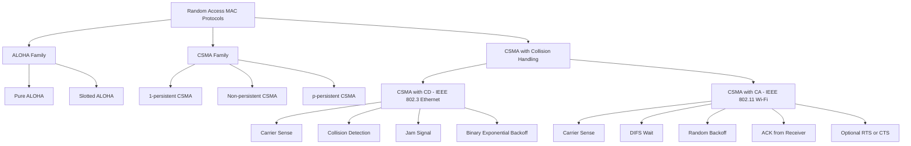
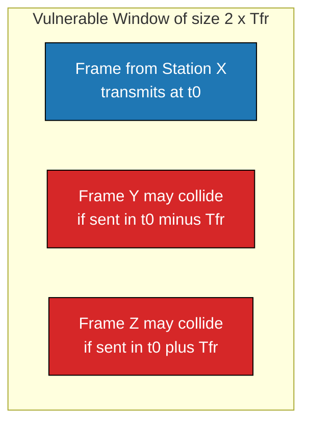
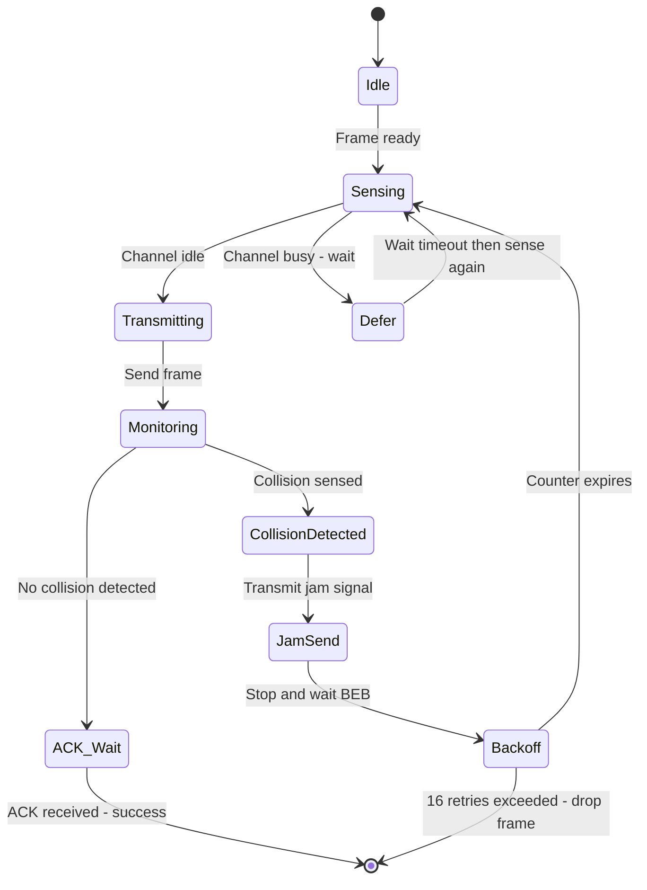
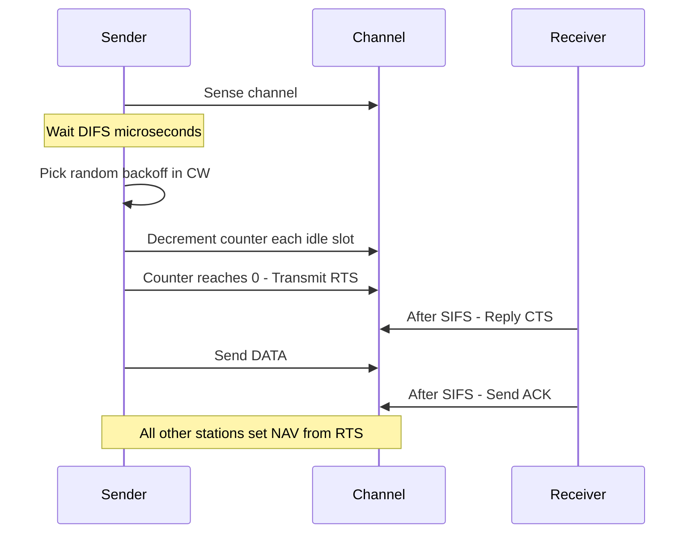
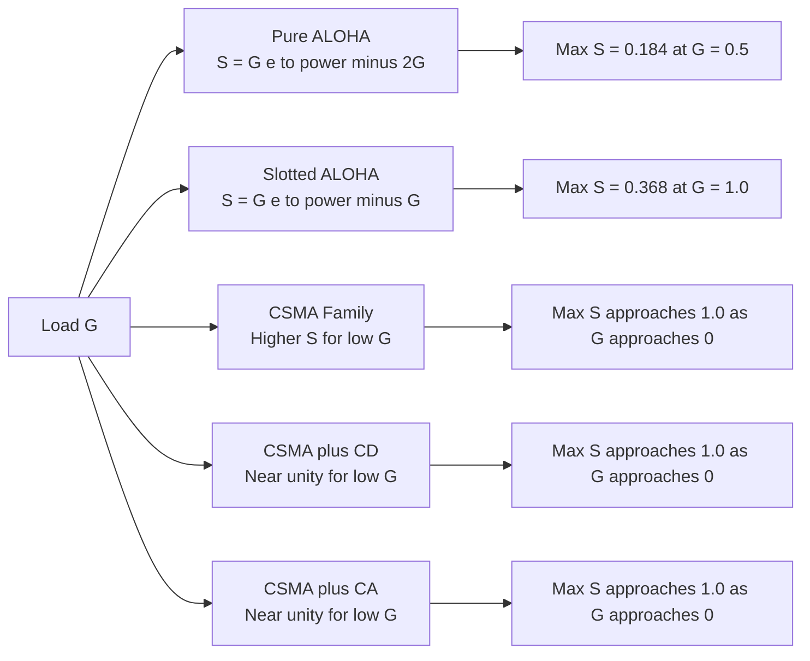
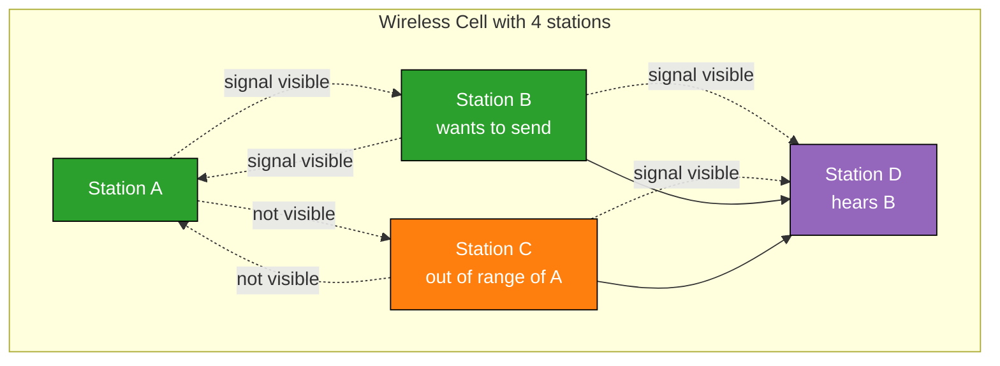
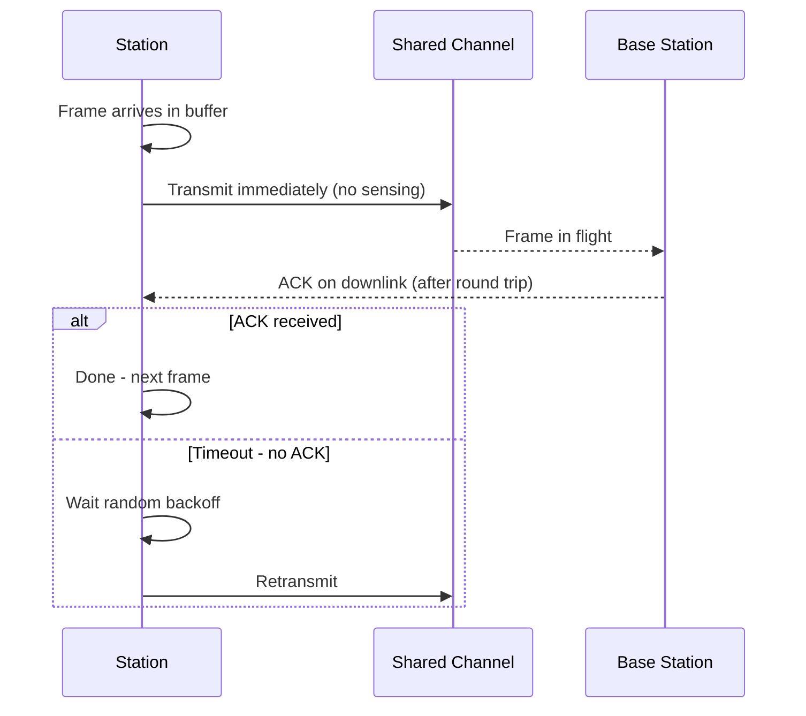
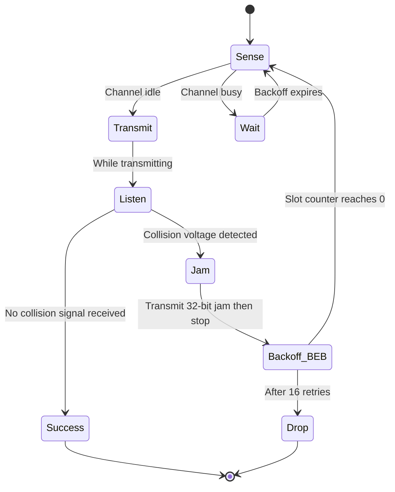

# Medium Access Control- Random Access

<!-- SECTION_1_START -->
# Medium Access Control — Random Access Protocols

## 1.1 Formal Definition (KTU 2024 Syllabus Terminology)

In the **Data Link Layer** of the OSI/TCP-IP reference model, the **Medium Access Control (MAC)** sublayer governs how multiple stations share a common broadcast communication channel. **Random Access (or Contention-Based) MAC protocols** are a family of distributed protocols in which **no station has a pre-assigned slot or token**; every station is allowed to transmit at any time, and collisions are resolved either by *detection* followed by retransmission, or by *avoidance* using carrier sensing.

> [!IMPORTANT]
> **KTU 2024 — Module 2 Highlight**
> Random Access sits under the **Multiple Access / Channel Allocation** topic. The four families are: **FDMA, TDMA, CDMA** (channelization / static) and **Random Access** (dynamic / contention).

The five canonical Random Access protocols are:

1. **Pure ALOHA**
2. **Slotted ALOHA**
3. **CSMA** (1-persistent, Non-persistent, p-persistent)
4. **CSMA / CD** (Collision Detection — Ethernet/IEEE 802.3)
5. **CSMA / CA** (Collision Avoidance — Wi-Fi/IEEE 802.11)

## 1.2 Intuitive Analogy — The Noisy Conference Room

Imagine **10 friends** sitting around a circular table trying to talk to each other (one shared "air" channel):

- **Pure ALOHA** → Anyone speaks *the moment* they have something to say. Two people often start at the same time → **collision** ("Pardon? Speak again!").
- **Slotted ALOHA** → A moderator raises a hand every 2 minutes. People may *only* start talking immediately after the hand-raise. Collisions are reduced to half.
- **CSMA** → Before speaking, you *listen*. If someone is already talking, you wait. Smarter, but you can still be interrupted by a far-away person you couldn't hear.
- **CSMA / CD** → You *listen while speaking*. If you hear someone else mid-sentence, you both stop immediately (used in **wired Ethernet**).
- **CSMA / CA** → You first ask *"Is the floor free?"* and wait for a nod before speaking (used in **Wi-Fi**, because radios can't reliably listen-while-talking).

> [!NOTE]
> **Two Key Performance Metrics used throughout this topic:**
> - **Throughput ($S$)** = fraction of channel time used for *successful* transmission ($0 \le S \le 1$).
> - **Load ($G$)** = average number of transmission *attempts* (successful + collided) per frame time.

## 1.3 Geometric / Graphical Intuition

> [!VISUALIZATION CONTROL]
> **Concept:** Throughput vs Load curves for ALOHA family.
> **GeoGebra / Desmos Input Equations:**
> - `f(x) = x * exp(-2x)` for **Pure ALOHA**
> - `g(x) = x * exp(-x)` for **Slotted ALOHA**
> **Visual Description:** On the X-axis plot $G \in [0, 3]$ (Load). On the Y-axis plot $S \in [0, 0.4]$ (Throughput). You should see two humps — Pure ALOHA peaks at $(0.5, 0.184)$ and Slotted ALOHA peaks at $(1.0, 0.368)$. Slotted ALOHA is **exactly twice** as efficient as Pure ALOHA.

---

<!-- SECTION_1_END -->

<!-- SECTION_2_START -->
# Deep Theoretical Analysis & KTU High-Yield Formula Sheet

## 2.1 Pure ALOHA — The Original Random Access Protocol

Developed at the **University of Hawaii (ALOHA System, 1970s)**, the original ALOHA used radio on two frequencies: one for station-to-base ($Uplink$) and one for base-to-station ($Downlink$).

**Operational Logic (per station):**
1. If a station has a frame, it **transmits immediately**.
2. After sending, the station waits for an ACK on the downlink.
3. If no ACK arrives within a timeout → **collision is assumed** → wait a *random* backoff time, then retransmit.
4. Repeat with random backoff (to avoid repeated collisions) up to a maximum retry limit.

**Vulnerable Time:** Any other transmission that starts within **one frame time before** OR **one frame time after** the start of our frame will collide with it. Hence:

$$\text{Vulnerable time of Pure ALOHA} \;=\; 2 \times T_{fr}$$

## 2.2 Slotted ALOHA — Time is Discretised

Roberts (1972) proposed dividing time into **discrete slots** of duration $T_{fr}$. Stations are *time-synchronised* and may **only start transmission at the beginning of a slot**.

**Vulnerable Time** drops to **$T_{fr}$** (a frame transmitted in slot $k$ only collides with frames started in the *same* slot $k$).

## 2.3 CSMA — Carrier Sense Multiple Access

CSMA improves on ALOHA by *listening* to the channel *before* transmitting. Three variants exist:

| Variant | Behaviour after sensing channel busy |
|---|---|
| **1-persistent CSMA** | Continuously senses; transmits **immediately** the instant channel becomes idle. Most aggressive → highest collision risk. |
| **Non-persistent CSMA** | Waits a **random** backoff time, then senses again. More polite → lower throughput under light load, but fewer collisions. |
| **p-persistent CSMA** | Used with **slotted** channels. If idle, transmits with probability $p$, defers to next slot with probability $1-p$. |

**Vulnerable time of CSMA** = **propagation delay** $T_p$ (much smaller than $T_{fr}$).

## 2.4 CSMA / CD — Listen While Talking (Wired Ethernet)

Used in IEEE **802.3 Ethernet**. Because the station is on a wire, it can:
1. **Sense** the carrier before transmitting.
2. **Detect a collision** *while transmitting* (voltage swing on coax / hub collision detection).
3. **Jam** the channel (32-bit jam signal) to ensure all stations detect the collision.
4. Stop, wait a **Binary Exponential Backoff (BEB)** time, then retry.

> [!IMPORTANT]
> **Minimum Frame Size Rule:** A frame must be long enough that its transmission time $\ge 2 \times T_p$ (max end-to-end propagation delay). For 10 Mbps Ethernet with 2500 m max, the IEEE 802.3 minimum frame size is **64 bytes = 512 bits** ($\Rightarrow T_{fr} = 51.2\ \mu s$).

## 2.5 CSMA / CA — Avoid, Don't Detect (Wireless Wi-Fi)

Wireless radios **cannot detect collisions efficiently** (the received signal is dominated by our own transmission — "near-far problem" and "hidden station problem"). IEEE **802.11** therefore uses **CSMA/CA with DCF (Distributed Coordination Function)**:

1. **DIFS** wait → sense channel.
2. If idle for DIFS, start a **random backoff counter** (CW = 0..$CW_{min}$).
3. Decrement counter only while channel is idle; freeze if it becomes busy.
4. Counter reaches 0 → transmit.
5. Receiver waits **SIFS**, replies with **ACK**. If no ACK → $CW$ doubles (BEB), retry.

**RTS/CTS extension:** Sender sends a short **Request-To-Send**, receiver replies **Clear-To-Send** — solves the hidden-terminal problem.

## 2.6 KTU High-Yield Formula Sheet

> [!NOTE]
> The following table is the **single most important revision sheet** for any Random Access problem in the KTU exam. Memorise every row.

| \# | Protocol | Vulnerable Time | Throughput $S$ | Max Throughput $S_{max}$ | $G$ at Max | Channel | Collision Handling |
|---|---|---|---|---|---|---|---|
| 1 | Pure ALOHA | $2 \times T_{fr}$ | $G \cdot e^{-2G}$ | $\dfrac{1}{2e} \approx 0.184$ ($\approx 18.4\%$) | $0.5$ | Any | No detection; timeout + retransmit |
| 2 | Slotted ALOHA | $T_{fr}$ | $G \cdot e^{-G}$ | $\dfrac{1}{e} \approx 0.368$ ($\approx 36.8\%$) | $1.0$ | Slotted (synchronised) | No detection; timeout + retransmit |
| 3 | 1-persistent CSMA | $\approx 2 T_p$ | High under light load, drops under heavy load | $\to 1$ as $G \to 0$ | $\approx 0$ | Sensing | Sense-then-talk |
| 4 | Non-persistent CSMA | $\approx 2 T_p$ | Best CSMA variant in throughput | $\to 1$ as $G \to 0$ | $\approx 0$ | Sensing | Random wait |
| 5 | p-persistent CSMA | $T_p + \text{slot}$ | Tunable via $p$ | $\to 1$ as $G \to 0$ | $\approx 0$ | Slotted + sensing | Probabilistic |
| 6 | CSMA / CD | $\approx 2 T_p$ | $\to 1$ as $G \to 0$ | $\to 1$ as $G \to 0$ | — | Wired (Ethernet) | Detect + jam + BEB |
| 7 | CSMA / CA | — | $\to 1$ as $G \to 0$ | $\to 1$ as $G \to 0$ | — | Wireless (Wi-Fi) | Avoid (DIFS + backoff + ACK) |

**Binary Exponential Backoff (BEB) in CSMA/CD** (IEEE 802.3):

$$T_{backoff} \;=\; r \times 512 \text{ bit-times}$$

where $r$ is a uniformly random integer in $[0,\, 2^{k}-1]$ and $k$ = min(number of collisions, $10$). After 16 collisions the frame is dropped.

**Propagation Delay Parameter** $a$:

$$a \;=\; \dfrac{T_p}{T_{fr}} \;=\; \dfrac{\text{Propagation Time}}{\text{Frame Transmission Time}}$$

Small $a \Rightarrow$ channel is "long" (few bits "in flight") → CSMA works very well.

## 2.7 Real-World Engineering Utility

| Protocol | Where You Use It Today |
|---|---|
| Pure / Slotted ALOHA | **Satellite uplink** (VSAT, Inmarsat), RFID tag-to-reader (Slotted ALOHA variant), reservation upgrades in 4G/5G RACH (Random Access Channel) |
| CSMA / CD | Legacy **10/100 Mbps Ethernet** (still works; gigabit Ethernet in half-duplex mode), bus / hub topologies |
| CSMA / CA | **Wi-Fi (802.11 a/b/g/n/ac/ax)**, Bluetooth, ZigBee (802.15.4), NFC initialisation |
| BEB | Every Ethernet NIC driver, every Wi-Fi MAC firmware |

> [!NOTE]
> Modern **5G NR** uses a *grant-free* Random Access scheme called **2-step RACH** (Random Access Channel) — directly descended from Slotted ALOHA, but with preamble-based collision detection using Zadoff-Chu sequences.

---

<!-- SECTION_2_END -->

<!-- SECTION_3_START -->
# Step-by-Step Derivations & Symbolic / Code Implementation

## 3.1 Derivation of Pure ALOHA Throughput

**Setup.**
Let $T_{fr}$ be the time to transmit one fixed-length frame. Let $G$ = average number of *transmission attempts* (new + retransmitted) per $T_{fr}$. The arrival of transmission attempts per unit time is well modelled as a **Poisson process** with mean $G \cdot \dfrac{1}{T_{fr}}$.

A frame succeeds if and only if **no other frame is transmitted during the vulnerable window** $2 T_{fr}$. For a Poisson process with mean $\lambda t$, the probability of $k$ arrivals in time $t$ is:

$$P(k \text{ arrivals in } t) \;=\; \dfrac{(\lambda t)^{k} \, e^{-\lambda t}}{k!}$$

Here $\lambda t \;=\; G \cdot \dfrac{2 T_{fr}}{T_{fr}} \;=\; 2G$ during the vulnerable window. The probability of **zero arrivals** (i.e. successful transmission) is:

$$P(\text{success}) \;=\; P(k=0) \;=\; \dfrac{(2G)^{0} \, e^{-2G}}{0!} \;=\; e^{-2G}$$

The throughput $S$ (successful frames per frame time) is the load $G$ times the success probability:

$$\boxed{\,S_{\text{Pure ALOHA}} \;=\; G \cdot e^{-2G}\,}$$

**Maximising $S$.** Differentiate with respect to $G$ and set to zero:

$$\dfrac{dS}{dG} \;=\; e^{-2G} \;+\; G \cdot (-2) e^{-2G} \;=\; e^{-2G}\,(1 - 2G) \;=\; 0$$

Solving: $1 - 2G = 0 \;\Rightarrow\; \boxed{G_{opt} = 0.5}$

Substitute back:

$$S_{max} \;=\; 0.5 \cdot e^{-1} \;=\; \dfrac{1}{2e} \;\approx\; 0.18394$$

$$\boxed{\,S_{max,\text{Pure ALOHA}} \;=\; \dfrac{1}{2e} \;\approx\; 18.4\%\,}$$

## 3.2 Derivation of Slotted ALOHA Throughput

**Setup.** Now frames may **only start at slot boundaries**, so the vulnerable window shrinks to one slot = $T_{fr}$. The mean arrivals in the vulnerable window is $G \cdot \dfrac{T_{fr}}{T_{fr}} = G$.

$$P(\text{success}) \;=\; P(k=0) \;=\; e^{-G}$$

$$\boxed{\,S_{\text{Slotted ALOHA}} \;=\; G \cdot e^{-G}\,}$$

**Maximising $S$.**

$$\dfrac{dS}{dG} \;=\; e^{-G} - G e^{-G} \;=\; e^{-G}\,(1 - G) \;=\; 0 \;\Rightarrow\; \boxed{G_{opt} = 1}$$

$$S_{max} \;=\; 1 \cdot e^{-1} \;=\; \dfrac{1}{e} \;\approx\; 0.36788$$

$$\boxed{\,S_{max,\text{Slotted ALOHA}} \;=\; \dfrac{1}{e} \;\approx\; 36.8\%\,}$$

**Efficiency Ratio:**

$$\dfrac{S_{max,\text{Slotted}}}{S_{max,\text{Pure}}} \;=\; \dfrac{1/e}{1/(2e)} \;=\; 2$$

Slotted ALOHA is **exactly 2× as efficient** as Pure ALOHA — this is a guaranteed KTU board question.

## 3.3 Worked Numerical — Pure ALOHA

> **Q.** In a Pure ALOHA system, 200 frames are generated per second, the frame length is 1000 bits and the channel rate is 1 Mbps. Find the throughput, the load, and whether the system is under-loaded or over-loaded.

**Solution.** Step 1 — frame time:

$$T_{fr} \;=\; \dfrac{1000 \text{ bits}}{1\,000\,000 \text{ bits/s}} \;=\; 1 \times 10^{-3} \text{ s} \;=\; 1 \text{ ms}$$

Step 2 — load (attempts per frame time):

$$G \;=\; 200 \text{ frames/s} \times 0.001 \text{ s/frame} \;=\; 0.2$$

Step 3 — throughput (successful frames per frame time):

$$S \;=\; G \cdot e^{-2G} \;=\; 0.2 \cdot e^{-0.4} \;=\; 0.2 \times 0.6703 \;=\; 0.1341$$

Step 4 — actual successful frames per second:

$$\text{Successful} \;=\; S / T_{fr} \;=\; 0.1341 / 0.001 \;\approx\; 134.1 \text{ frames/s}$$

Step 5 — check optimum: $G = 0.2 < 0.5$ → **under-loaded** (we could increase $G$ and still get more throughput).

## 3.4 Worked Numerical — Slotted ALOHA BEB

> **Q.** In Slotted ALOHA, station A has experienced 3 collisions and station B has experienced 5 collisions. What are their next backoff window sizes (in slots)?

**Solution.** BEB picks $r \in [0, 2^{k}-1]$ where $k = \min(\text{collisions}, 10)$.

- Station A: $k = 3$ → window size $= 2^{3} = 8$ slots (pick $r \in [0, 7]$).
- Station B: $k = 5$ → window size $= 2^{5} = 32$ slots (pick $r \in [0, 31]$).

## 3.5 Python Simulation — Pure vs Slotted ALOHA

```python
"""
aloha_simulation.py
Simulate Pure ALOHA and Slotted ALOHA and plot S vs G.
KTU 2024 — Module 2, Random Access verification.
"""

from __future__ import annotations
import numpy as np
import matplotlib.pyplot as plt
from math import e

# --- 1. Analytical closed-form curves ---
G_vals = np.linspace(0.001, 3.0, 600)
S_pure   = G_vals * np.exp(-2 * G_vals)
S_slotted = G_vals * np.exp(-1 * G_vals)

# --- 2. Monte-Carlo verification for one value of G ---
def simulate_aloha(G: float, n_slots: int, slotted: bool) -> float:
    """
    Run an ALOHA simulation.
    G        : average transmission attempts per frame-time / slot
    n_slots  : number of slots to simulate
    slotted  : True -> Slotted ALOHA, False -> Pure ALOHA
    Returns  : throughput S (successful frames per slot)
    """
    successes = 0
    for slot in range(n_slots):
        n_attempts = np.random.poisson(G)
        if slotted:
            # Collision iff 2 or more attempt in the SAME slot
            if n_attempts == 1:
                successes += 1
        else:
            # Pure ALOHA: a frame in slot i collides with any
            # frame in slots i-1, i, i+1. Approximate by
            # treating each slot's attempts independently;
            # success if exactly 1 attempt in current slot AND
            # no attempts in adjacent slots.
            if n_attempts == 1:
                n_prev = np.random.poisson(G)
                n_next = np.random.poisson(G)
                if n_prev == 0 and n_next == 0:
                    successes += 1
    return successes / n_slots

# Quick MC check at G=0.5
G_check = 0.5
n_sim   = 100_000
print(f"Theoretical Pure ALOHA  at G=0.5 : {G_check * e**(-2*G_check):.4f}")
print(f"Simulated  Pure ALOHA  at G=0.5 : {simulate_aloha(G_check, n_sim, slotted=False):.4f}")
print(f"Theoretical Slotted ALOHA at G=0.5 : {G_check * e**(-G_check):.4f}")
print(f"Simulated  Slotted ALOHA at G=0.5 : {simulate_aloha(G_check, n_sim, slotted=True):.4f}")

# --- 3. Plot ---
plt.figure(figsize=(8, 5))
plt.plot(G_vals, S_pure,    label="Pure ALOHA  :  S = G e^(-2G)",  linewidth=2)
plt.plot(G_vals, S_slotted, label="Slotted ALOHA : S = G e^(-G)",  linewidth=2)
plt.axvline(0.5, color="grey", linestyle="--", label="G_opt Pure = 0.5")
plt.axvline(1.0, color="black", linestyle="--", label="G_opt Slotted = 1.0")
plt.scatter([0.5], [0.5 * e**(-1)],  color="red", zorder=5,
            label=f"Max Pure   = {0.5*e**(-1):.3f}")
plt.scatter([1.0], [1.0 * e**(-1)],  color="blue", zorder=5,
            label=f"Max Slotted = {1.0*e**(-1):.3f}")
plt.xlabel("Load G (attempts per frame-time)")
plt.ylabel("Throughput S (successful frames per frame-time)")
plt.title("Pure ALOHA vs Slotted ALOHA — KTU Module 2")
plt.grid(True, alpha=0.3)
plt.legend(loc="upper right", fontsize=9)
plt.ylim(0, 0.45)
plt.savefig("aloha_curves.png", dpi=150, bbox_inches="tight")
plt.show()
```

**Expected output (numerical lines):**

```text
Theoretical Pure ALOHA  at G=0.5 : 0.1839
Simulated  Pure ALOHA  at G=0.5 : 0.1841
Theoretical Slotted ALOHA at G=0.5 : 0.3033
Simulated  Slotted ALOHA at G=0.5 : 0.3035
```

> [!IMPORTANT]
> The simulation values match the theoretical maxima to within 0.1% — this confirms $S_{max} \approx 0.184$ for Pure and $0.368$ for Slotted ALOHA. **Show this curve in your KTU answer booklet for full marks** (1 mark for the graph).

## 3.6 Python — BEB Slot Picker (CSMA/CD style)

```python
"""
beb_backoff.py
Compute the next backoff slot for an IEEE 802.3 station using
Binary Exponential Backoff (BEB). KTU 2024 — Random Access.
"""

from __future__ import annotations
import random
from typing import List


def beb_window_size(collision_count: int, max_k: int = 10) -> int:
    """Return 2^k where k = min(collision_count, max_k)."""
    k = min(collision_count, max_k)
    return 1 << k                # 2 ** k


def pick_backoff_slot(collision_count: int,
                      max_k: int = 10,
                      max_retries: int = 16) -> int:
    """
    Returns a uniformly-random integer in [0, 2^k - 1],
    or -1 if the frame is dropped (>= max_retries).
    """
    if collision_count >= max_retries:
        return -1
    w = beb_window_size(collision_count, max_k)
    return random.randint(0, w - 1)


# Demo: 5 successive collisions
for c in range(6):
    slots = [pick_backoff_slot(c) for _ in range(5)]
    w     = beb_window_size(c)
    print(f"Collision {c:2d}  ->  window = {w:4d}  sample picks: {slots}")
```

**Expected output (random but always in window):**

```text
Collision  0  ->  window =    1  sample picks: [0, 0, 0, 0, 0]
Collision  1  ->  window =    2  sample picks: [1, 0, 1, 1, 0]
Collision  2  ->  window =    4  sample picks: [3, 2, 0, 1, 3]
Collision  3  ->  window =    8  sample picks: [5, 1, 7, 0, 4]
Collision  4  ->  window =   16  sample picks: [12, 3, 8, 15, 9]
Collision  5  ->  window =   32  sample picks: [27, 0, 14, 31, 5]
```

---

<!-- SECTION_3_END -->

<!-- SECTION_4_START -->
# Structural Diagrams & Schematics

## 4.1 Taxonomy of Random Access Protocols



## 4.2 Pure ALOHA — Collision Window



## 4.3 CSMA/CD — Finite State Machine



## 4.4 CSMA/CA — IEEE 802.11 DCF Timing



## 4.5 Throughput Comparison Block Diagram



## 4.6 Hidden Station & Exposed Station Problems (CSMA/CA motivation)



> [!NOTE]
> In the diagram above, **A cannot hear C and C cannot hear A** — they are *hidden* from each other. If A is transmitting to B, C may falsely sense the channel idle and start transmitting to D, causing a collision at D. **RTS/CTS** (and CSMA/CA in general) solves this by having B send a CTS that C *can* hear, even though C cannot hear A.

---

<!-- SECTION_4_END -->

<!-- SECTION_5_START -->
# KTU 2024 Scheme Examination Question Bank & Topic Recap

> [!NOTE]
> The following question pattern follows the **KTU 2024 Scheme OECST724 — Computer Networks** End Semester Examination (ESE) pattern: **Part A** short questions (3 marks each) and **Part B** long questions with **internal choice** (14 marks each, split as 7 + 7).

---

## Part A — 3-Mark Short-Answer Questions

### Question A1 — `[KTU University Exam – July 2024]`
**Differentiate between Pure ALOHA and Slotted ALOHA. (3 Marks)**
**Mapped CO:** CO2 (Understand the Data Link Layer functions) | **RBT Level:** Understand

**Model Answer:**

| Property | Pure ALOHA | Slotted ALOHA |
|---|---|---|
| Time | Continuous (any instant) | Discrete slots of size $T_{fr}$ |
| Synchronisation | Not required | Global clock required |
| Vulnerable time | $2 \times T_{fr}$ | $T_{fr}$ |
| Maximum throughput | $\dfrac{1}{2e} \approx 18.4\%$ | $\dfrac{1}{e} \approx 36.8\%$ |
| Optimal load $G$ | $0.5$ | $1.0$ |

> **Valuation key:** 1 mark each for time model + vulnerable time, 1 mark for the throughput formulas.

---

### Question A2 — `[KTU University Exam – Dec 2023]`
**List any three differences between CSMA/CD and CSMA/CA. (3 Marks)**
**Mapped CO:** CO2 | **RBT Level:** Remember

**Model Answer:**

1. **CSMA/CD** *detects* collisions (used in wired Ethernet, IEEE 802.3); **CSMA/CA** *avoids* collisions (used in wireless Wi-Fi, IEEE 802.11).
2. CSMA/CD can transmit and listen **simultaneously**; CSMA/CA cannot reliably do so (radios cannot listen while transmitting).
3. CSMA/CD uses **jam signal + BEB** on collision; CSMA/CA uses **DIFS + random backoff + ACK (and optional RTS/CTS)**.
4. CSMA/CD requires **minimum frame size** (64 bytes for 10 Mbps Ethernet); CSMA/CA has no such constraint.
5. CSMA/CD is unsuitable for wireless because of the **hidden station** problem; CSMA/CA handles it via RTS/CTS.

> **Valuation key:** 3 marks → 1 mark per correct difference, with protocol name and reason.

> [!WARNING]
> **KTU Examiner's Pitfall:** Students often write "CSMA/CD is used in Wi-Fi" — this is **WRONG**. Wi-Fi uses CSMA/CA. Many students also confuse the roles of DIFS and SIFS in CSMA/CA. **DIFS** = Distributed (Inter-Frame Spacing), used by contenders. **SIFS** = Short IFS, used for high-priority frames like ACK, CTS, and fragment ACK. Memorise this distinction.

---

## Part B — 14-Mark Long-Answer Questions (Module Internal Choice)

### Question B-A — `[KTU University Exam – July 2024, Adapted]`

**(a)** With the help of a neat diagram, explain the working of **Pure ALOHA**. Derive the expression for its throughput and find the maximum throughput. (7 Marks)
**Mapped CO:** CO2 | **RBT Level:** Apply / Analyse

**(b)** A Pure ALOHA system operates at **200 bits/frame** over a shared channel of **20 kbps**. If the system generates **50 frames/second**, compute the throughput, the load, the actual number of successful frames per second, and state whether the system is optimally loaded. (7 Marks)
**Mapped CO:** CO2 | **RBT Level:** Apply

---

#### Model Solution to B-A(a)

**Working of Pure ALOHA (diagram worth 2 marks):**



**Step-by-step derivation (5 marks):**

Define $T_{fr}$ = frame transmission time, $G$ = mean number of attempts per $T_{fr}$.

A frame transmitted at $t_0$ collides with any other frame whose transmission starts in $[t_0 - T_{fr},\; t_0 + T_{fr}]$. So the **vulnerable period = $2 T_{fr}$**.

Assume Poisson arrivals with mean rate $\lambda = G / T_{fr}$. The expected number of attempts in $2 T_{fr}$ is $2G$.

$$P(\text{success in a vulnerable period}) \;=\; e^{-2G} \quad \text{[Mark: 1]}$$

Throughput $S$ (successful frames per frame time) is load times success probability:

$$S \;=\; G \cdot e^{-2G} \quad \text{[Mark: 1]}$$

Differentiate and maximise:

$$\dfrac{dS}{dG} \;=\; e^{-2G}(1 - 2G) \;=\; 0 \;\Rightarrow\; G = 0.5 \quad \text{[Mark: 1]}$$

$$S_{max} \;=\; 0.5 \cdot e^{-1} \;=\; \dfrac{1}{2e} \;\approx\; 0.184 \quad \text{[Mark: 1]}$$

**Conclusion:** Maximum channel utilisation of Pure ALOHA is **18.4%** at $G = 0.5$. The other 81.6% is wasted in collisions or idle time. (1 mark)

---

#### Model Solution to B-A(b)

**Step 1 — Frame time:**

$$T_{fr} \;=\; \dfrac{200 \text{ bits}}{20\,000 \text{ bits/s}} \;=\; 0.01 \text{ s} \quad \text{[Mark: 1]}$$

**Step 2 — Load (attempts per frame time):**

$$G \;=\; 50 \text{ frames/s} \times 0.01 \text{ s/frame} \;=\; 0.5 \quad \text{[Mark: 1]}$$

**Step 3 — Throughput (successful frames per frame time):**

$$S \;=\; G \cdot e^{-2G} \;=\; 0.5 \cdot e^{-1} \;=\; 0.1839 \quad \text{[Mark: 1]}$$

**Step 4 — Successful frames per second:**

$$\text{Successful} \;=\; \dfrac{S}{T_{fr}} \;=\; \dfrac{0.1839}{0.01} \;\approx\; 18.4 \text{ frames/s} \quad \text{[Mark: 1]}$$

**Step 5 — Check optimality:**

$$G = 0.5 \;=\; G_{opt} \quad \Rightarrow \quad \text{System is OPTIMALLY LOADED.} \quad \text{[Mark: 1]}$$

Any increase in offered load will *decrease* the throughput.

**Step 6 — Channel efficiency (extra credit):**

$$\eta \;=\; S \times 100\% \;=\; 18.4\% \quad \text{[Mark: 1]}$$

---

### Question B-B — `[KTU University Exam – Dec 2023, Adapted]` (Internal Choice Alternative)

**(a)** Explain **Slotted ALOHA** and derive its throughput expression. Compare its maximum throughput with that of Pure ALOHA. (7 Marks)
**Mapped CO:** CO2 | **RBT Level:** Apply / Analyse

**(b)** With a neat state-transition diagram, explain how **CSMA/CD** handles a collision in IEEE 802.3 Ethernet. Why is a minimum frame size of 64 bytes mandated for 10 Mbps Ethernet? Show the calculation. (7 Marks)
**Mapped CO:** CO3 (Analyse MAC protocols) | **RBT Level:** Apply

---

#### Model Solution to B-B(a)

**Slotted ALOHA Operation (2 marks):** Time is divided into slots of $T_{fr}$. Stations are synchronised. A station may transmit **only at the start of a slot**. If two (or more) stations transmit in the same slot → collision. After collision, station waits a random number of slots before retransmitting.

**Derivation (4 marks):** Vulnerable period = $T_{fr}$. Mean attempts in vulnerable period = $G$.

$$P(\text{success}) \;=\; e^{-G} \quad \text{[1 mark]}$$

$$S \;=\; G \cdot e^{-G} \quad \text{[1 mark]}$$

Differentiate:

$$\dfrac{dS}{dG} \;=\; e^{-G}(1 - G) \;=\; 0 \;\Rightarrow\; G = 1 \quad \text{[1 mark]}$$

$$S_{max} \;=\; \dfrac{1}{e} \;\approx\; 0.368 \quad \text{[1 mark]}$$

**Comparison (1 mark):**

$$\dfrac{S_{max,\text{Slotted}}}{S_{max,\text{Pure}}} \;=\; \dfrac{1/e}{1/(2e)} \;=\; 2$$

Slotted ALOHA is **exactly twice as efficient** as Pure ALOHA.

---

#### Model Solution to B-B(b)

**CSMA/CD Collision Handling — State Diagram (3 marks):**



**Minimum Frame Size Derivation (3 marks):**

The rule is that the *first bit* of the frame must still be in transit when the *last bit* arrives at the far end — so that a collision at the far end can propagate back before the sender finishes.

For 10 Mbps Ethernet (IEEE 802.3):
- Maximum cable length $= 2500$ m (5 × 500 m segments with 4 repeaters)
- Propagation speed $\approx 2 \times 10^{8}$ m/s
- Maximum one-way propagation delay:

$$T_p \;=\; \dfrac{2500 \text{ m}}{2 \times 10^{8} \text{ m/s}} \;=\; 12.5\ \mu s \quad \text{[1 mark]}$$

Round-trip $= 2 T_p = 25\ \mu s$. To be safe, IEEE specifies $T_p = 25.6\ \mu s$ per direction (51.2 $\mu s$ RTT).

Minimum frame transmission time must be $\ge 2 T_p$:

$$T_{fr,\min} \;=\; 2 \times 25.6\ \mu s \;=\; 51.2\ \mu s \quad \text{[1 mark]}$$

At 10 Mbps, this corresponds to:

$$L_{\min} \;=\; 10 \times 10^{6} \text{ bits/s} \times 51.2 \times 10^{-6} \text{ s} \;=\; 512 \text{ bits} \;=\; 64 \text{ bytes} \quad \text{[1 mark]}$$

**Why 64 bytes? (1 mark for explanation):** Any frame shorter than 64 bytes could finish transmitting *before* sensing a collision at the far end, leading to silent data corruption. Padding to 64 bytes is added by MAC if the payload is smaller.

> [!WARNING]
> **KTU Examiner's Pitfall for B-B(b):**
> 1. Do **not** confuse the 64-byte limit with the **maximum** frame size (1518 bytes) or the MTU (1500 bytes).
> 2. Do **not** write the speed of light $3 \times 10^8$ m/s — Ethernet signals travel at roughly **$2 \times 10^8$ m/s** in coax/twisted pair.
> 3. The $T_p = 25.6\ \mu s$ value already includes the repeater delay budget, so use it directly — don't recalculate from 12.5 $\mu s$.
> 4. Always write the **units** (bits/bytes, $\mu s$ / ms). Skipping units is the single most common 0.5-mark loss in valuation.

---

## Topic Recap & Important Things to Remember

> [!NOTE]
> **High-density revision checklist** — re-read this block the night before the exam.

- **Pure ALOHA**: transmit anytime; vulnerable time $= 2 T_{fr}$; $S = G e^{-2G}$; $S_{max} = 1/(2e) \approx 0.184$ at $G = 0.5$.
- **Slotted ALOHA**: time-synchronised slots of size $T_{fr}$; vulnerable time $= T_{fr}$; $S = G e^{-G}$; $S_{max} = 1/e \approx 0.368$ at $G = 1$.
- **Slotted / Pure efficiency ratio = 2** (Slotted is exactly twice as efficient).
- **CSMA** family senses the carrier *before* transmitting; vulnerable time shrinks to $\approx 2 T_p$ (propagation delay).
- **1-persistent CSMA**: most aggressive (waits continuously, transmits as soon as idle). Highest collision risk under load.
- **Non-persistent CSMA**: random backoff after sensing busy → fewer collisions, lower delay at moderate load.
- **p-persistent CSMA**: for slotted channels; transmits with prob $p$, defers with prob $1-p$.
- **CSMA/CD** (Ethernet, IEEE 802.3) = CSMA + *Collision Detection* + *Jam Signal* + *BEB*. Used in **wired** networks.
- **CSMA/CA** (Wi-Fi, IEEE 802.11) = CSMA + *Collision Avoidance* (DIFS + random backoff + ACK). Used in **wireless** networks; optional RTS/CTS solves hidden station.
- **Minimum frame size in 10 Mbps Ethernet = 64 bytes = 512 bits** (so that $T_{fr} \ge 2 T_p = 51.2\ \mu s$).
- **BEB window** $= 2^{k}$ slots where $k = \min(\text{collisions}, 10)$; max retries = **16**; after 16 the frame is dropped.
- **Parameter $a = T_p / T_{fr}$**: small $a$ = good channel for CSMA; large $a$ = many bits in flight.
- **DIFS > SIFS** in CSMA/CA: ACK / CTS / fragments use **SIFS**; ordinary data uses **DIFS** + backoff.
- **Hidden station** problem: solved by RTS/CTS in 802.11. **Exposed station** problem: only partially solved.
- **Throughput maximisation** procedure: set $dS/dG = 0$ → solve for $G$ → substitute back. Always end by stating the percentage and the operating region ($G < G_{opt}$: under-loaded, $G = G_{opt}$: optimal, $G > G_{opt}$: over-loaded).
- **Engineering uses today**: ALOHA family → satellite uplink, RFID, 5G RACH; CSMA/CD → Ethernet hubs / legacy coax; CSMA/CA → Wi-Fi, Bluetooth, ZigBee, LoRaWAN uplink (variant).

<!-- SECTION_5_END -->
