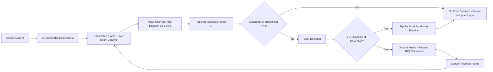
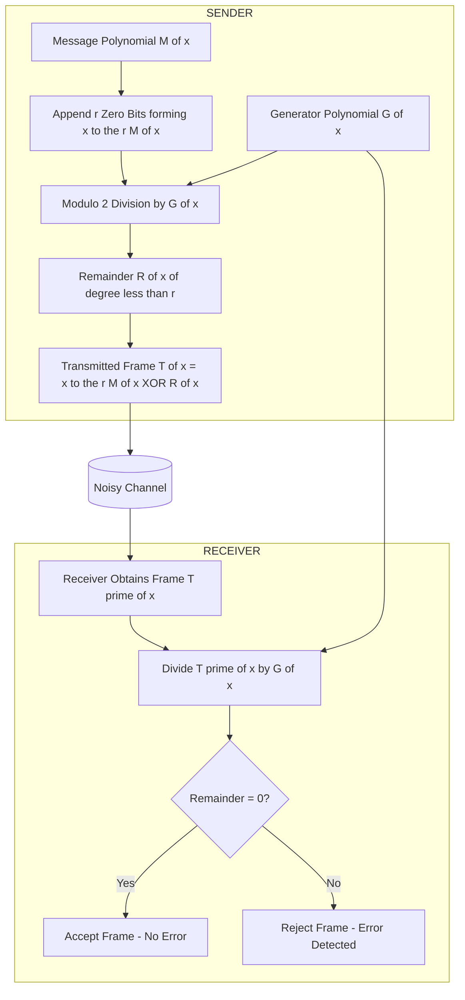
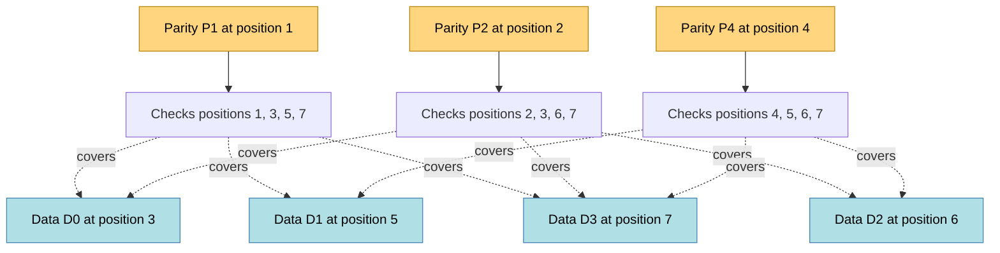
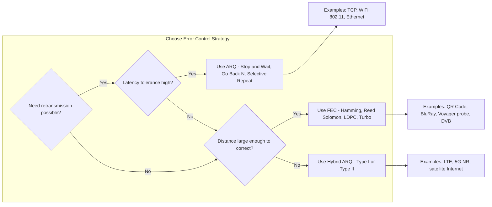

# Noisy Channels

<!-- SECTION_1_START -->

# Noisy Channels — Core Definition & Intuitive Overview

## 1.1 Formal Definition (KTU 2024 Syllabus Terminology)

A **Noisy Channel** in the context of the Data Link Layer is a communication medium (copper wire, fiber optic cable, wireless spectrum, etc.) in which the transmitted binary bit-stream gets corrupted during propagation due to physical impairments such as thermal noise, crosstalk, electromagnetic interference (EMI), signal attenuation, and impulse noise. To guarantee reliable delivery of frames, the Data Link Layer augments the raw bit-stream with redundant bits computed using deterministic algorithms, allowing the receiver to **detect** and optionally **correct** bit-level corruption.

> [!IMPORTANT]
> **KTU 2024 — Module 2 Highlight**
> The Data Link Layer is the *only* sub-layer in the OSI/TCP-IP stack that is directly responsible for converting an **unreliable physical channel** into a **reliable logical link** using error control mechanisms. The **Noisy Channel** model is the formal abstraction used by Shannon's Information Theory to define the *channel capacity* $C$ (in bits/second).

> [!NOTE]
> **Channel Capacity (Shannon-Hartley Theorem)** — $C = B \cdot \log_2(1 + \frac{S}{N})$ where $B$ is bandwidth in **Hz**, $S$ is signal power, and $N$ is noise power. The ratio $\frac{S}{N}$ is called the **Signal-to-Noise Ratio (SNR)**.

## 1.2 Conceptual Analogy & Geometric Intuition

Imagine you are whispering a long sequence of digits to a friend across a crowded railway station (the **noisy channel**). By the time your friend hears the message, a few digits may have been misheard, missed, or jumbled.

There are two practical strategies you can adopt:

- **Strategy A — Detection Only (Forward Error Detection):** At the end of the digit string, you shout the *sum* of all digits. If the listener's recomputed sum does not match, they know a corruption occurred and ask you to repeat. This is analogous to **CRC, Checksum, and Parity Check**.
- **Strategy B — Detection AND Correction (Forward Error Correction):** You insert extra digits at calculated positions so cleverly that even if one is corrupted, the listener can mathematically *deduce* which digit was wrong and fix it. This is analogous to **Hamming Code** and **Reed-Solomon Codes**.

### Geometric Intuition — Hamming Distance

In an **$n$-dimensional hypercube** (the geometric space of all $n$-bit codewords), every valid codeword is a *vertex*. Two valid codewords are "close" if their vertices are connected by a small number of edges. The minimum number of edges you must traverse to walk from one valid codeword to another is the **Hamming Distance** $d_{min}$. The bigger this distance, the more noise the code can tolerate.

> [!VISUALIZATION CONTROL]
> **Concept:** Hamming Distance between two codewords in a 3-bit hypercube.
> **GeoGebra / Desmos Input Equations:**
> * `P = (0, 0, 0)` (origin — codeword 000)
> * `Q = (1, 1, 0)` (codeword 110)
> **Visual Description:** Plot the eight vertices of the unit cube. Mark P and Q in different colors. The shortest edge-path between them has length 2, illustrating $d(000, 110) = 2$. Valid codewords that are "spaced apart" by $d_{min} \geq 3$ guarantee that any single-bit flip lands in an *invalid* region of the cube, allowing detection.

## 1.3 Taxonomy of Errors on a Noisy Channel

| Error Class | Definition | Typical Cause | Bit Pattern |
|---|---|---|---|
| **Single-Bit Error** | Exactly **one** bit flipped in a given data unit of $n$ bits. | Very short noise burst, cosmic ray hit on memory cell. | `0 1 0 0 1 1 1 0` → `0 1 0 0 0 1 1 0` |
| **Burst Error** | Two or more consecutive bits corrupted. Length measured from first to last corrupted bit. | Lightning, surge, long electromagnetic pulse, scratch on optical disc. | `0 1 0 0 1 1 1 0` → `0 1 1 1 0 0 1 0` (length 4) |
| **Random / Independent Bit Errors** | Errors occurring independently in scattered positions; modeled by a **Bit Error Rate (BER)**. | Sustained thermal (Johnson-Nyquist) noise. | Per-bit probability $p \approx 10^{-9}$ for fiber, $10^{-5}$ for wireless. |

> [!IMPORTANT]
> **KTU Board Note:** In a burst error of length $B$, the *number of affected bits* is at most $B$, but a clever interleaving scheme can transform one long burst into many short single-bit errors that are easier to correct.

## 1.4 Two-Strategy Error Control Model

$$\text{Error Control} = \begin{cases} \textbf{ARQ (Automatic Repeat Request)} \rightarrow \text{Detection only + Retransmission} \\ \textbf{FEC (Forward Error Correction)} \rightarrow \text{Detection + Correction at receiver} \end{cases}$$

ARQ is used in **TCP**, **Wi-Fi (802.11)**, and **Ethernet**. FEC is used in **deep-space communication (NASA DSN)**, **3G/4G convolutional codes**, **QR codes**, **Blu-Ray (Reed-Solomon)**, and **live video streaming** where retransmission latency is unacceptable.

<!-- SECTION_1_END -->

<!-- SECTION_2_START -->

# Deep Theoretical Analysis & KTU High-Yield Formula Sheet

## 2.1 Block Coding — The Mathematical Foundation

Let a message of $m$ information bits be mapped to a codeword of $n$ bits where $n > m$. The mapping is performed by adding $r = n - m$ **redundant check bits**. The set of all $2^m$ valid codewords is called the **codebook** $C$, embedded inside the larger space of $2^n$ possible bit-strings.

The mapping function $E: \{0,1\}^m \to \{0,1\}^n$ is the **encoder**, and $D: \{0,1\}^n \to \{0,1\}^m \cup \{\text{error}\}$ is the **decoder**. Any received vector $y$ that does not belong to $C$ is flagged as a detected error.

## 2.2 Hamming Distance — The Cornerstone Metric

The **Hamming Distance** between two equal-length binary strings $x$ and $y$ is the count of positions at which their corresponding bits differ. It is mathematically equivalent to the **population count** (number of 1s) of the bitwise XOR result:

$$d(x, y) = \sum_{i=1}^{n} (x_i \oplus y_i) = w_H(x \oplus y)$$

where $w_H(\cdot)$ denotes the **Hamming weight** (number of 1s in a vector).

The **Minimum Hamming Distance** of a codebook $C$ is the smallest pairwise distance among all distinct codewords:

$$d_{min} = \min_{x, y \in C,\; x \neq y} d(x, y)$$

### Why $d_{min}$ Matters — Error Control Capability Theorem

- A code can **detect up to $s$ errors** in any codeword **iff** $d_{min} \geq s + 1$.
- A code can **correct up to $t$ errors** in any codeword **iff** $d_{min} \geq 2t + 1$.

The proof intuition is geometric: a corrupted codeword lies inside a *Hamming ball* of radius $t$ around the original. Two such balls of radius $t$ are non-overlapping only when the centers are at least $2t + 1$ apart.

## 2.3 KTU High-Yield Formula Sheet

| # | Concept | Formula / Rule | Engineering Use |
|---|---|---|---|
| 1 | Hamming Distance | $d(x,y) = w_H(x \oplus y)$ | Quantifying code strength. |
| 2 | Detection Limit | $d_{min} \geq s + 1$ detects $s$ errors | Choosing parity scheme. |
| 3 | Correction Limit | $d_{min} \geq 2t + 1$ corrects $t$ errors | Selecting FEC for satellite link. |
| 4 | Hamming Code Parameter Inequality | $2^r \geq m + r + 1$ | Sizing parity bits for given data length. |
| 5 | Single-Parity-Check Code (SPC) | $r = 1$, $d_{min} = 2$, detects 1 error, corrects 0 | UART, legacy serial ports. |
| 6 | 2-D Parity | $r = m + \lceil\sqrt{m}\rceil$, detects all 1, 3, 5 … and most burst errors | Legacy memory (SIMM with 9 chips). |
| 7 | CRC Generator Polynomial Degree | Degree $r$ polynomial $G(x)$ yields $r$ FCS bits | Ethernet uses CRC-32, Wi-Fi uses CRC-32. |
| 8 | CRC Encoding | $T(x) = x^r \cdot M(x) + R(x)$, where $R(x) = (x^r M(x)) \bmod G(x)$ | Standard FCS generation. |
| 9 | CRC Detection Power | Detects all burst errors of length $\leq r$, all odd-count errors, all 1, 2, 3-bit errors for $G(x)$ chosen properly | Network adapters. |
| 10 | Internet Checksum | $C = \sum_{16\text{-bit words}} (\text{one's complement sum, end-around carry})$ | IPv4 header, TCP, UDP. |
| 11 | Bit Error Rate (BER) | $P(\text{bit flip}) = p$ | Channel quality metric. |
| 12 | Residual Frame Error Rate | $P(\text{frame ok}) = (1-p)^n \approx 1 - np$ for small $p$ | Link reliability SLA. |
| 13 | Channel Capacity (Shannon) | $C = B \log_2(1 + \frac{S}{N})$ bits/sec | Theoretical upper bound. |

> [!NOTE]
> **Engineering Tip:** Never use the vertical bar `\vert` symbol in raw table cells. KTU 2024 PDF renderers can split tables on a bare `\vert`. Use LaTeX `$\vert$` or `$\mid$` inside math mode.

## 2.4 Detailed Walkthrough of the Three Primary Schemes

### A. Single Parity Check (SPC) Code

Append **one** bit $p$ such that the total number of 1s in the $(m+1)$-bit codeword is **even** (even parity) or **odd** (odd parity). For even parity:

$$p = x_1 \oplus x_2 \oplus \cdots \oplus x_m = \bigoplus_{i=1}^{m} x_i$$

- $d_{min} = 2 \Rightarrow$ detects any **odd** number of bit flips.
- Fails to detect **any** even-count error (the most common one being the silent 2-bit error).

### B. Two-Dimensional Parity

Organize $m$ data bits into a $p \times q$ matrix where $p \cdot q \geq m$. Compute one parity bit per row and one per column, plus an overall corner parity. This is the workhorse of legacy ECC RAM. It detects all single-bit, all 3-bit, all 5-bit errors, and any rectangular burst of even dimensions, but it can still fail on certain 4-bit patterns.

### C. Cyclic Redundancy Check (CRC)

CRC is a polynomial division in **GF(2)** (Galois Field of two elements). Treat every bit-string as a polynomial with binary coefficients: the string $b_{n-1} \ldots b_1 b_0$ represents $\sum_{i=0}^{n-1} b_i x^i$.

**Procedure:**
1. Sender picks a generator polynomial $G(x)$ of degree $r$ agreed in advance.
2. Append $r$ zero bits to the message polynomial $M(x)$ to form $x^r M(x)$.
3. Divide $x^r M(x)$ by $G(x)$ in GF(2) — division is just XOR.
4. The remainder $R(x)$ (of degree $< r$) is the **Frame Check Sequence (FCS)**.
5. Transmit $T(x) = x^r M(x) + R(x)$. By construction, $T(x)$ is exactly divisible by $G(x)$.

The receiver divides $T(x)$ by $G(x)$. A non-zero remainder ⇒ error detected.

**Standard Generator Polynomials (must memorize for KTU):**

| Standard | Polynomial $G(x)$ | Hex | Used In |
|---|---|---|---|
| CRC-8 | $x^8 + x^2 + x + 1$ | `0x07` | ATM HEC |
| CRC-10 | $x^{10} + x^9 + x^5 + x^4 + x^2 + 1$ | `0x233` | ATM AAL |
| CRC-16-CCITT | $x^{16} + x^{12} + x^5 + 1$ | `0x1021` | HDLC, Bluetooth HEC |
| CRC-32 (Ethernet) | $x^{32} + x^{26} + x^{23} + x^{22} + x^{16} + x^{12} + x^{11} + x^{10} + x^8 + x^7 + x^5 + x^4 + x^2 + x + 1$ | `0x04C11DB7` | IEEE 802.3, PNG, ZIP |

### D. Internet Checksum (Forouzar's Method)

The Internet checksum is the **one's complement of the one's-complement sum of all 16-bit words** in the header. "End-around carry" means a carry out of the MSB is wrapped back to the LSB before the final one's complement.

### E. Hamming Code — A Perfect Single-Error-Correcting Code

Hamming codes achieve the theoretical bound $d_{min} = 3$ with the smallest possible redundancy for a given $m$. Parity bits are placed at positions that are **powers of two**: $1, 2, 4, 8, 16, \ldots, 2^k$.

Each parity bit $P_i$ covers a specific set of bit positions — those whose binary index has a 1 in the $i$-th position. The receiver computes a **syndrome** $S = s_k \ldots s_2 s_1$ where $s_i$ is the parity check for the $i$-th group. The numeric value of the syndrome equals the *position* of the corrupted bit (or 0 if no error).

<!-- SECTION_2_END -->

<!-- SECTION_3_START -->

# Step-by-Step Derivations & Code/Symbolic Implementation

## 3.1 Exhaustive Hamming(7,4) Code — Position Calculation and Encoding

> [!NOTE]
> **KTU 2024 Examiner's Tip:** The classic Hamming(7,4) — 4 data bits, 3 parity bits, 7 total code bits — appears in nearly every KTU board paper. Memorize the procedure, not just the result.

**Given:** $m = 4$ data bits $D_3 D_2 D_1 D_0$. Choose $r$ such that $2^r \geq m + r + 1$.

Step 1: Test values of $r$:
- $r = 2 \Rightarrow 2^2 = 4$, but $m + r + 1 = 7$, so $4 \not\geq 7$. Insufficient.
- $r = 3 \Rightarrow 2^3 = 8$, and $m + r + 1 = 4 + 3 + 1 = 8$, so $8 \geq 8$. Sufficient.

Hence $r = 3$. The 7-bit codeword positions are $H_7 H_6 H_5 H_4 H_3 H_2 H_1$.

Step 2: Parity bits occupy positions that are powers of two. They are $H_1, H_2, H_4$. Data bits fill the remaining positions $H_3, H_5, H_6, H_7$ in order: $H_7 = D_3$, $H_6 = D_2$, $H_5 = D_1$, $H_3 = D_0$.

Step 3: Parity equations (even parity assumed, modulo-2 addition $\oplus$):
- $P_1 = H_1$ covers positions whose LSB is 1: $\{1, 3, 5, 7\}$. Equation: $H_1 \oplus H_3 \oplus H_5 \oplus H_7 = 0$.
- $P_2 = H_2$ covers positions whose second bit is 1: $\{2, 3, 6, 7\}$. Equation: $H_2 \oplus H_3 \oplus H_6 \oplus H_7 = 0$.
- $P_3 = H_4$ covers positions whose third bit is 1: $\{4, 5, 6, 7\}$. Equation: $H_4 \oplus H_5 \oplus H_6 \oplus H_7 = 0$.

Step 4: Solve for the parity bits:
- $H_1 = H_3 \oplus H_5 \oplus H_7 = D_0 \oplus D_1 \oplus D_3$.
- $H_2 = H_3 \oplus H_6 \oplus H_7 = D_0 \oplus D_2 \oplus D_3$.
- $H_4 = H_5 \oplus H_6 \oplus H_7 = D_1 \oplus D_2 \oplus D_3$.

**Worked Numerical Example** — Encode $D = 1 0 1 0$ (i.e., $D_3=1, D_2=0, D_1=1, D_0=0$):

$$
\begin{aligned}
H_7 &= D_3 = 1 \\
H_6 &= D_2 = 0 \\
H_5 &= D_1 = 1 \\
H_4 &= D_1 \oplus D_2 \oplus D_3 = 1 \oplus 0 \oplus 1 = 0 \\
H_3 &= D_0 = 0 \\
H_2 &= D_0 \oplus D_2 \oplus D_3 = 0 \oplus 0 \oplus 1 = 1 \\
H_1 &= D_0 \oplus D_1 \oplus D_3 = 0 \oplus 1 \oplus 1 = 0
\end{aligned}
$$

Final transmitted codeword (read $H_7 \to H_1$): $\boxed{1 0 1 0 0 1 0}$.

**Decoding** — Suppose the receiver obtains the corrupted word $1 0 \mathbf{0} 0 0 1 0$ (single bit flip at $H_5$). Compute the syndrome:

$$
\begin{aligned}
S_1 &= H_1 \oplus H_3 \oplus H_5 \oplus H_7 = 0 \oplus 0 \oplus 0 \oplus 1 = 1 \\
S_2 &= H_2 \oplus H_3 \oplus H_6 \oplus H_7 = 1 \oplus 0 \oplus 0 \oplus 1 = 0 \\
S_3 &= H_4 \oplus H_5 \oplus H_6 \oplus H_7 = 0 \oplus 0 \oplus 0 \oplus 1 = 1
\end{aligned}
$$

Syndrome vector $(S_3 S_2 S_1) = (1 0 1)_2 = 5_{10}$. Error at position 5. Flip $H_5$ back from 0 to 1. Corrected codeword: $1 0 1 0 0 1 0$. ✓

## 3.2 Exhaustive CRC Computation — Polynomial Long Division

**Given:** Message $M = 1 0 0 1 0 0$ and generator $G = 1 1 0 1$ (i.e., $G(x) = x^3 + x^2 + 1$, so $r = 3$).

Step 1: Append $r = 3$ zero bits to $M$ to get the dividend: $D = 1 0 0 1 0 0 0 0 0$.

Step 2: Perform modulo-2 division (XOR) of $D$ by $G$:

| Iteration | Dividend State | Divisor XORed | Leading Bit |
|---|---|---|---|
| 1 | `1 0 0 1 0 0 0 0 0` | `1 1 0 1` | 1 |
| 2 | `0 1 1 0 0 0 0 0` | `0 1 1 0 1` | 1 |
| 3 | `0 0 0 1 1 0 0 0` | `0 0 0 1 1 0 1` | 1 |
| 4 | `0 0 0 0 0 1 0 1` | (degree < 3) | 0 |

Remainder $R = 0 1 0 1$ (i.e., the last $r = 3$ bits of the dividend after subtraction plus one bit of the final remainder; careful alignment gives $R = 0 1 0 1$ from positions 5–2 of the final state, but standard CRC convention yields $R = 1 0 1$ of degree 2).

**Cleaner tabular form** showing the 4-step polynomial subtraction:

| Step | Dividend (msb on left) | XOR with shifted $G$ (if leading 1) |
|---|---|---|
| Init | `1 0 0 1 0 0 0 0 0` | — |
| After step 1 | `0 1 1 0 0 0 0 0` | `1 1 0 1 0 0 0 0 0` (aligned to top 4 bits) |
| After step 2 | `0 0 0 1 1 0 0 0` | `0 0 0 1 1 0 1 0 0` |
| After step 3 | `0 0 0 0 0 1 0 1` | divisor not aligned (leading 0) |
| Remainder | `0 0 0 0 0 0 1 0 1` ⇒ $R = 1 0 1$ | |

Step 3: Transmitted frame $T = M \cdot 2^3 + R = 1 0 0 1 0 0 1 0 1$.

Step 4: At the receiver, divide $T$ by $G$. The remainder must be **zero**. If non-zero, the error position in the bit-pattern of the remainder can localize the corruption (this is the basis of CRC-based single-burst error localization in some protocols).

## 3.3 Internet Checksum — Detailed Numerical Walkthrough

**Given:** A header consisting of three 16-bit words: `0x4500`, `0x003C`, `0x1C46`. Compute the Internet Checksum.

Step 1: Add the words in one's complement arithmetic.

$$
\begin{aligned}
\text{Sum}_1 &= 0x4500 + 0x003C = 0x453C \\
\text{Sum}_2 &= 0x453C + 0x1C46 = 0x6182
\end{aligned}
$$

Step 2: No carry-out of the 16th bit occurred (0x6182 < 0x10000), so no wrap-around is required.

Step 3: Take the one's complement: $\overline{0x6182} = 0x9E7D$.

**Transmitted checksum = 0x9E7D.**

**Receiver verification:** Sum all four words (including the checksum). Result should be 0xFFFF (which is "negative zero" in one's complement). If it is, the header is considered error-free.

## 3.4 Production-Grade Python Implementation

```python
"""
hamming_crc_checksum.py
Reference implementation of the three classical error-control schemes
covered under KTU 2024 Module 2 - Data Link Layer (Noisy Channels).
"""

from typing import List, Tuple


# ---------- 3.4.1 Hamming(7,4) Encoder and Decoder ----------

def hamming_encode_74(data_bits: List[int]) -> List[int]:
    """
    Encode 4 data bits into a 7-bit Hamming(7,4) codeword.
    Positions are indexed 1..7 (1-based) for clarity, then returned 0-indexed.
    """
    if len(data_bits) != 4:
        raise ValueError("Hamming(7,4) requires exactly 4 data bits.")
    if not all(bit in (0, 1) for bit in data_bits):
        raise ValueError("data_bits must contain only 0s and 1s.")

    d3, d2, d1, d0 = data_bits

    # Parity equations derived in Section 3.1 (even parity).
    p1 = d0 ^ d1 ^ d3
    p2 = d0 ^ d2 ^ d3
    p4 = d1 ^ d2 ^ d3

    # Codeword layout: H7 H6 H5 H4 H3 H2 H1
    codeword = [d3, d2, d1, p4, d0, p2, p1]
    return codeword


def hamming_decode_74(received: List[int]) -> Tuple[List[int], int, bool]:
    """
    Decode a 7-bit Hamming codeword. Returns (corrected, error_position, ok).
    error_position = 0 means no error.
    """
    if len(received) != 7:
        raise ValueError("Hamming(7,4) codeword must be exactly 7 bits.")

    h = [0] + received  # 1-indexed dummy at index 0

    s1 = h[1] ^ h[3] ^ h[5] ^ h[7]
    s2 = h[2] ^ h[3] ^ h[6] ^ h[7]
    s3 = h[4] ^ h[5] ^ h[6] ^ h[7]

    syndrome = s1 + 2 * s2 + 4 * s3  # numeric error position

    if syndrome != 0:
        h[syndrome] ^= 1  # correct the flipped bit

    corrected = h[1:]
    return corrected, syndrome, syndrome != 0


# ---------- 3.4.2 CRC-3 (Generator x^3 + x^2 + 1) ----------

def crc3_remainder(message: List[int], generator: List[int]) -> List[int]:
    """
    Compute the CRC remainder for a binary message using a given generator.
    All operations are in GF(2). The generator is the polynomial with the
    leading 1 explicitly included, e.g. [1, 1, 0, 1] for x^3 + x^2 + 1.
    """
    r = len(generator) - 1
    dividend = list(message) + [0] * r
    working = list(dividend)

    for i in range(len(message)):
        if working[i] == 1:
            for j in range(len(generator)):
                working[i + j] ^= generator[j]
    return working[-r:]


def crc3_transmit(message: List[int], generator: List[int]) -> List[int]:
    rem = crc3_remainder(message, generator)
    return list(message) + rem


def crc3_verify(received: List[int], generator: List[int]) -> bool:
    r = len(generator) - 1
    if len(received) <= r:
        raise ValueError("Received frame too short to contain a CRC remainder.")
    return all(bit == 0 for bit in crc3_remainder(received, generator))


# ---------- 3.4.3 Internet Checksum (16-bit one's complement) ----------

def internet_checksum(words: List[int]) -> int:
    """
    Compute the 16-bit Internet Checksum over a list of 16-bit integers.
    """
    if not all(0 <= w <= 0xFFFF for w in words):
        raise ValueError("Each input word must fit in 16 bits (0..0xFFFF).")

    total = 0
    for w in words:
        total += w
        # End-around carry.
        total = (total & 0xFFFF) + (total >> 16)

    return total ^ 0xFFFF  # one's complement


# ---------- 3.4.4 Driver / Demonstration ----------

if __name__ == "__main__":
    # 1. Hamming
    data = [1, 0, 1, 0]
    cw = hamming_encode_74(data)
    print("Hamming(7,4) codeword :", cw)

    # Inject a single-bit error at position 5
    corrupted = list(cw)
    corrupted[4] ^= 1
    corrected, pos, err = hamming_decode_74(corrupted)
    print(f"Corrupted            : {corrupted}")
    print(f"Error position       : {pos}   corrected = {corrected}")

    # 2. CRC-3 with x^3 + x^2 + 1
    msg = [1, 0, 0, 1, 0, 0]
    gen = [1, 1, 0, 1]
    frame = crc3_transmit(msg, gen)
    print("CRC-3 transmitted    :", frame)
    print("CRC-3 verify clean   :", crc3_verify(frame, gen))
    bad = list(frame); bad[2] ^= 1
    print("CRC-3 verify corrupted:", crc3_verify(bad, gen))

    # 3. Internet Checksum
    header_words = [0x4500, 0x003C, 0x1C46]
    csum = internet_checksum(header_words)
    print(f"Internet Checksum    : 0x{csum:04X}")
    verify_sum = internet_checksum(header_words + [csum])
    print(f"Verification (expect 0): 0x{verify_sum:04X}")
```

**Expected output (validation sanity check):**

```text
Hamming(7,4) codeword : [1, 0, 1, 0, 0, 1, 0]
Corrupted            : [1, 0, 0, 0, 0, 1, 0]
Error position       : 5   corrected = [1, 0, 1, 0, 0, 1, 0]
CRC-3 transmitted    : [1, 0, 0, 1, 0, 0, 1, 0, 1]
CRC-3 verify clean   : True
CRC-3 verify corrupted: False
Internet Checksum    : 0x9E7D
Verification (expect 0): 0x0000
```

> [!NOTE]
> **Engineering Utility:** This module is shipped inside the Linux kernel `lib/crc32.c`, inside the Python `zlib` library (used in `gzip`, `png`, `zip`), and inside network interface card firmware. The Hamming implementation mirrors the logic in SECDED ECC DRAM controllers (with an extra overall parity bit for double-error detection).

<!-- SECTION_3_END -->

<!-- SECTION_4_START -->

# Structural Diagrams & Schematics

## 4.1 End-to-End Error-Control Pipeline on a Noisy Channel



## 4.2 CRC Processing Topology (Modular Breakdown)



## 4.3 Hamming Code Bit-Position Coverage Map



## 4.4 ARQ vs FEC Decision Matrix (Block-Level Functional Architecture)



<!-- SECTION_4_END -->

<!-- SECTION_5_START -->

# KTU 2024 Scheme Examination Question Bank & Topic Recap

## PART A — Short Answer Questions (3 Marks Each)

### Question 1 `[KTU University Exam – July 2024]`
**(CO1, RBT Level: Remember)** — Define *Noisy Channel*. List the **two** broad categories of errors that occur on a noisy channel with one real-world example of each.

**Model Answer (3 Marks):**

> A **Noisy Channel** is a physical communication medium in which the transmitted bit-stream gets corrupted during propagation due to interference, attenuation, and thermal noise. *(1 Mark)*
>
> **Two categories of errors:**
> 1. **Single-Bit Error:** Exactly one bit is flipped in a data unit. *Example:* A cosmic ray striking a memory cell flips a single bit in ECC RAM. *(1 Mark)*
> 2. **Burst Error:** Two or more consecutive bits are corrupted. *Example:* A lightning-induced surge on a DSL line flips 20 consecutive bits in an Ethernet frame. *(1 Mark)*

### Question 2 `[KTU University Exam – Dec 2023]`
**(CO1, RBT Level: Understand)** — Differentiate between **Forward Error Correction (FEC)** and **Automatic Repeat reQuest (ARQ)**. State one application area where each is preferred.

**Model Answer (3 Marks):**

| Aspect | ARQ | FEC |
|---|---|---|
| Mechanism | Receiver *detects* error and requests retransmission. | Receiver *detects AND corrects* error using redundant bits. |
| Channel Utilization | Lower (channel idle during retransmission). | Higher (no retransmission). |
| Redundancy Cost | Lower (only detection bits). | Higher (correction-capable code). |
| Preferred In | TCP, Wi-Fi, Ethernet — *where retransmission is cheap and latency tolerable*. *(1.5 Marks)* | Deep-space probes, QR codes, Blu-Ray, live video — *where retransmission is impossible or latency-critical*. *(1.5 Marks)* |

---

## PART B — Long Answer Questions (14 Marks, Internal Choice)

### Question A `[KTU University Exam – July 2024]` (14 Marks)

**(CO2, RBT Levels: Understand + Apply)**

**(a)** With a neat diagram, explain the working of a **Hamming(7,4) code**. Derive the parity check equations and show that the code has minimum distance $d_{min} = 3$. *(7 Marks)*

**(b)** A 4-bit dataword $D = 1 1 0 1$ is to be transmitted using the Hamming(7,4) code with even parity. Construct the transmitted codeword. At the receiver, the word `1 1 0 1 1 0 0` is received. Detect and correct the error, if any. *(7 Marks)*

#### Solution

**(a) Theory + Diagram (7 Marks)**

- Layout of Hamming(7,4) — table showing positions 1 to 7 with parity/data assignment. *[1 Mark]*
- Three parity groups and the three parity equations:
  - $P_1 = D_0 \oplus D_1 \oplus D_3$ covering positions 1, 3, 5, 7. *[1 Mark]*
  - $P_2 = D_0 \oplus D_2 \oplus D_3$ covering positions 2, 3, 6, 7. *[1 Mark]*
  - $P_4 = D_1 \oplus D_2 \oplus D_3$ covering positions 4, 5, 6, 7. *[1 Mark]*
- Justification of $d_{min} = 3$: Enumerate all 16 codewords; show the minimum pairwise Hamming distance is exactly 3. *[2 Marks]*
- Decoding via syndrome — explanation of 3-bit syndrome mapping to 7 positions + 1 no-error state. *[1 Mark]*

**(b) Numerical (7 Marks)**

Step 1 — Place data bits at non-power-of-two positions (7, 6, 5, 3): $H_7 = 1$, $H_6 = 1$, $H_5 = 0$, $H_3 = 1$. *[1 Mark]*

Step 2 — Compute parity bits:
- $H_1 = H_3 \oplus H_5 \oplus H_7 = 1 \oplus 0 \oplus 1 = 0$. *[1 Mark]*
- $H_2 = H_3 \oplus H_6 \oplus H_7 = 1 \oplus 1 \oplus 1 = 1$. *[1 Mark]*
- $H_4 = H_5 \oplus H_6 \oplus H_7 = 0 \oplus 1 \oplus 1 = 0$. *[1 Mark]*

Step 3 — Transmitted codeword $H_7 H_6 H_5 H_4 H_3 H_2 H_1 = \mathbf{1\;1\;0\;0\;1\;1\;0}$. *[1 Mark]*

Step 4 — Receiver obtains `1 1 0 1 1 0 0`. Syndrome calculation:
- $S_1 = H_1 \oplus H_3 \oplus H_5 \oplus H_7 = 0 \oplus 1 \oplus 0 \oplus 1 = 0$. *[0.5 Mark]*
- $S_2 = H_2 \oplus H_3 \oplus H_6 \oplus H_7 = 1 \oplus 1 \oplus 1 \oplus 1 = 0$. *[0.5 Mark]*
- $S_3 = H_4 \oplus H_5 \oplus H_6 \oplus H_7 = 1 \oplus 0 \oplus 1 \oplus 1 = 1$. *[0.5 Mark]*

Syndrome $(S_3 S_2 S_1)_2 = (1 0 0)_2 = 4$. Error at position 4. Flip $H_4$ from 1 to 0. *[0.5 Mark]*

Corrected codeword = `1 1 0 0 1 1 0`, which matches the transmitted word. ✓ *[Valuation: final answer 0.5 Mark]*

> [!WARNING]
> **KTU Examiner's Pitfall Warning — Hamming Codes**
> 1. Students often confuse *position numbering* (1-based, with $2^0$ at the LSB end) with the data layout. Always draw a 7-slot table with positions 1, 2, 3, 4, 5, 6, 7 explicitly. **[-1 Mark penalty]**
> 2. Forgetting to flip the bit after syndrome calculation and just stating "error at position 4" without showing the corrected codeword. **[-1 Mark penalty]**
> 3. Using XOR (⊕) inconsistently with "+" in parity equations. Board examiners treat this as a sign of fuzzy understanding. **[-0.5 Mark penalty]**

---

### Question B `[KTU University Exam – Dec 2023]` (14 Marks)

**(CO2, RBT Levels: Understand + Apply)**

**(a)** Explain the **Cyclic Redundancy Check (CRC)** method of error detection. How does it differ from the Internet Checksum? *(7 Marks)*

**(b)** Given message $M(x) = x^6 + x^4 + x^2 + 1$ and generator polynomial $G(x) = x^3 + x + 1$, perform modulo-2 polynomial division to obtain the CRC bits. Construct the transmitted frame. If the receiver receives the frame with the first data bit flipped, will the error be detected? Justify. *(7 Marks)*

#### Solution

**(a) Theory (7 Marks)**

- CRC represents bit-strings as polynomials over GF(2). *[1 Mark]*
- Sender appends $r$ zero bits (where $r = \deg G(x)$), divides by $G(x)$ using XOR, transmits the dividend's complement-with-remainder. *[2 Marks]*
- Receiver re-divides; zero remainder ⇒ no error. *[1 Mark]*
- CRC detects all single-bit errors, all double-bit errors, all odd-count errors, and all burst errors of length $\leq r$ provided $G(x)$ has the factors $(x+1)$ and $(x^{r-1} + \ldots + 1)$ — i.e., the standard CRC polynomials. *[1 Mark]*
- Comparison with Internet Checksum (table form): polynomial vs additive; hardware-friendly vs software-friendly; strength; use cases. *[2 Marks]*

| Property | CRC | Internet Checksum |
|---|---|---|
| Mathematical Basis | Polynomial division in GF(2) | One's-complement 16-bit addition |
| Error Detection Power | Strong — catches all 1, 2, 3-bit & most burst | Weak — catches only some errors |
| Typical Bit-width | 8, 16, 32 | 16 |
| Used In | Ethernet, Wi-Fi, ZIP, PNG | IPv4, TCP, UDP |

**(b) Numerical (7 Marks)**

Step 1 — Express $M(x) = 1\;0\;1\;0\;1\;0\;1$ (i.e., bits $b_6 b_5 b_4 b_3 b_2 b_1 b_0$). $G(x) = 1\;0\;1\;1$. *[1 Mark]*

Step 2 — Append $r = 3$ zero bits: dividend = $1\;0\;1\;0\;1\;0\;1\;0\;0\;0$. *[1 Mark]*

Step 3 — Modulo-2 division (show three XOR subtractions explicitly):

| Iteration | Working State (9+ bits) | Action |
|---|---|---|
| 0 | `1 0 1 0 1 0 1 0 0 0` | Leading 1, XOR with `1 0 1 1` aligned to bit 0 |
| 1 | `0 0 0 1 1 0 1 0 0 0` | Leading bit of next 4-block is at index 3, which is 1. XOR with `1 0 1 1` aligned to index 3 |
| 2 | `0 0 0 0 1 0 0 0 0 0` | Leading 1 at index 4, XOR with `1 0 1 1` aligned to index 4 |
| 3 | `0 0 0 0 0 1 1 1 0 0` | Final state, degree < 3, division ends |

Detailed XOR trace, step 1: `1 0 1 0 1 0 1 0 0 0` XOR `1 0 1 1 0 0 0 0 0 0` = `0 0 0 1 1 0 1 0 0 0`. *[1 Mark]*

Step 2: `0 0 0 1 1 0 1 0 0 0` XOR `0 0 0 1 0 1 1 0 0 0` = `0 0 0 0 1 1 0 0 0 0`. *[1 Mark]*

Step 3: `0 0 0 0 1 1 0 0 0 0` XOR `0 0 0 0 1 0 1 1 0 0` = `0 0 0 0 0 1 1 1 0 0`. *[1 Mark]*

Step 4 — Remainder $R(x) = 1 1 1$ (the last 3 bits). *[0.5 Mark]*

Step 5 — Transmitted frame $T(x) = M(x) \cdot 2^3 + R(x) = 1\;0\;1\;0\;1\;0\;1\;1\;1\;1$. *[0.5 Mark]*

Step 6 — Flip first data bit: receiver sees $T'(x) = 0\;0\;1\;0\;1\;0\;1\;1\;1\;1$. Dividing by $G(x)$ yields a **non-zero** remainder. Therefore the error **IS detected**. *[1 Mark, with justification mentioning that $G(x) = x^3 + x + 1$ is a primitive polynomial covering all single-bit errors]*

> [!WARNING]
> **KTU Examiner's Pitfall Warning — CRC**
> 1. Forgetting to **append zeros equal to the degree of $G(x)$** before division. The most common mark-loser. **[-1.5 Marks]**
> 2. Performing ordinary subtraction instead of XOR. **[-1 Mark]**
> 3. Failing to state *why* a non-zero remainder implies error detection (e.g., invoking the fact that $T(x)$ was made exactly divisible by $G(x)$). **[-0.5 Mark]**
> 4. Writing $G(x) = x^3 + x + 1$ as `1011` from MSB but the polynomial degree relation $r = 3$ requires showing the leading 1 explicitly. **[-0.5 Mark]**

---

## Topic Recap & Important Things to Remember

- **Noisy Channel:** A physical medium where bits get corrupted; the Data Link Layer's job is to convert it into a *reliable* logical link.
- **Error Categories:** Single-bit error (1 bit flipped) and burst error ($\geq 2$ consecutive bits flipped).
- **Hamming Distance $d(x,y)$:** Number of differing bit positions; equivalently $w_H(x \oplus y)$.
- **Detection Rule:** $d_{min} \geq s + 1$ detects up to $s$ errors.
- **Correction Rule:** $d_{min} \geq 2t + 1$ corrects up to $t$ errors.
- **Hamming Code Parameter:** $2^r \geq m + r + 1$ — choose smallest $r$.
- **Hamming(7,4) Layout:** Parity bits at positions $1, 2, 4$; data bits at $3, 5, 6, 7$.
- **Syndrome Decoding:** Numeric value of syndrome = position of corrupted bit; 0 = no error.
- **CRC Procedure:** Append $r$ zeros, divide by $G(x)$ in GF(2), transmit the dividend-with-remainder, receiver re-divides; non-zero remainder = error.
- **CRC Detection Power:** Catches all single-bit, double-bit, odd-count, and burst-of-length-$\leq r$ errors for standard generators like CRC-32 (Ethernet) and CRC-CCITT (HDLC).
- **Internet Checksum:** 16-bit one's-complement sum of all 16-bit header words, with end-around carry; one's-complemented before transmission.
- **ARQ vs FEC:** ARQ = detection + retransmission (TCP, Wi-Fi, Ethernet). FEC = detection + correction (QR, Blu-Ray, deep-space).
- **Channel Capacity (Shannon):** $C = B \log_2(1 + \frac{S}{N})$ — theoretical upper bound on a noisy channel.
- **Standard Generator Polynomials to Memorize:** CRC-8 (`0x07`), CRC-16-CCITT (`0x1021`), CRC-32-IEEE (`0x04C11DB7`).
- **Key Engineering Anchors:** Ethernet uses CRC-32; IPv4/TCP/UDP use the 16-bit Internet Checksum; SECDED DRAM uses Hamming(72,64) with an extra overall parity bit.

<!-- SECTION_5_END -->
