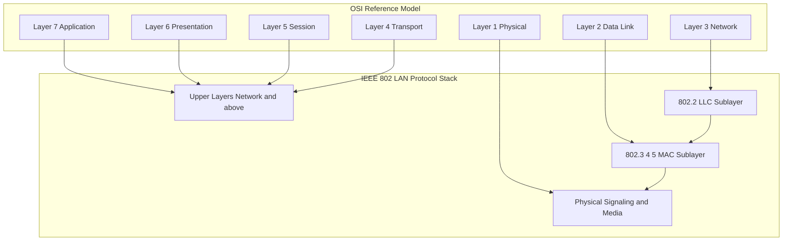
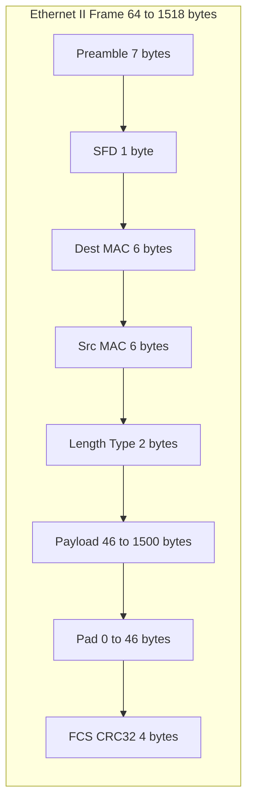
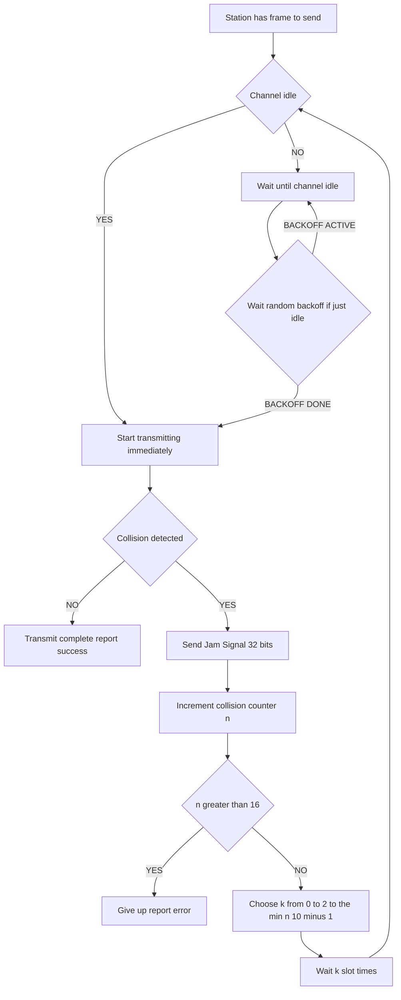
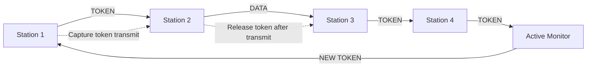
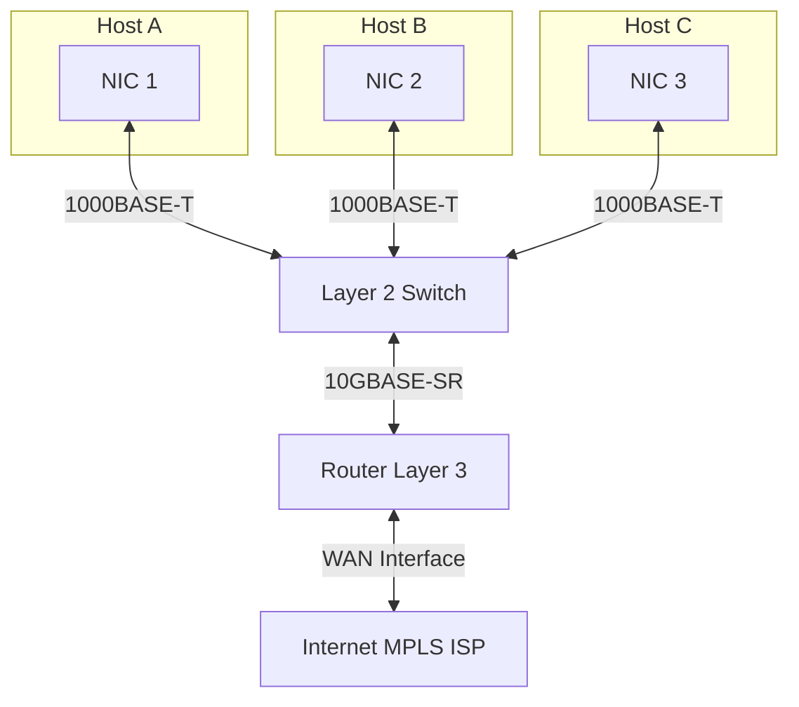

# Wired LANs - IEEE Standards

<!-- SECTION_1_START -->
# Wired LANs — IEEE Standards

> [!IMPORTANT]
> **KTU 2024 Scheme | Module 2 — Data Link Layer | OECST724**
> This module covers the **IEEE Project 802** family, the architectural foundation for ALL modern wired (and most wireless) Local Area Networks. Mastering this topic is mandatory to score in KTU University Examinations because it directly maps to **CO2: Design and analyze data link layer protocols**.

---

## 1.1 Formal Definition

The **IEEE 802** standards are a family of networking standards developed by the **Institute of Electrical and Electronics Engineers (IEEE)** LAN/MAN Standards Committee. They define the **Physical Layer (Layer 1)** and the **Data Link Layer (Layer 2)** — specifically its two sublayers: the **Logical Link Control (LLC)** and the **Media Access Control (MAC)** — for fixed, portable, and moving stations operating within a **Local Area Network (LAN)**.

In KTU syllabus terminology, IEEE 802 splits the classical Data Link Layer into:

$$\text{Data Link Layer (Layer 2)} = \underbrace{\text{LLC Sublayer (IEEE 802.2)}}_{\text{Logical, addressing, error/flow handling}} + \underbrace{\text{MAC Sublayer (IEEE 802.3/4/5...)}}_{\text{Physical addressing, medium access, framing}}$$

> [!NOTE]
> **Core Definition (Board Favorite):**
> *IEEE 802 is a working group that defines standards for LANs. It divides the Data Link Layer of the OSI model into two distinct sublayers — the LLC (Logical Link Control) sublayer at the top, and the MAC (Medium Access Control) sublayer at the bottom — to decouple logical addressing from physical media access.*

---

## 1.2 The IEEE 802 Architectural Stack (KTU High-Yield Diagram)

The IEEE 802 committee defined the relationship between the OSI model and the LAN protocols as follows:

| OSI Layer | IEEE 802 Equivalent | Key Function |
| :--- | :--- | :--- |
| **Higher Layers (Network & above)** | **Upper Layers** | Routing, transport, applications |
| **Layer 2 — Data Link (Upper Half)** | **LLC Sublayer (802.2)** | Interface to upper layers, error notification, flow control |
| **Layer 2 — Data Link (Lower Half)** | **MAC Sublayer (802.3/4/5)** | Framing, MAC addressing, channel access |
| **Layer 1 — Physical** | **PHY (802.3/4/5/...)** | Bit encoding, signaling, topology, cabling |

> [!TIP]
> **Geometric Intuition — The "Mailroom & Postman" Analogy:**
> Think of a corporate office building (the LAN).
> * The **LLC sublayer** is the **mailroom clerk** — receives all letters (frames), looks at the department label (SAP — Service Access Point), sorts them, and decides whether to send an acknowledgement.
> * The **MAC sublayer** is the **postman** — walks out of the building, looks at the building's street number (**MAC address**), walks down the road (**physical medium**), and delivers it to the right office block.
> * The **Physical Layer** is the **road, the vehicle, and the traffic rules** (cables, voltage, encoding).
> This is *why* IEEE 802 split the link layer — so the *mailroom* (LLC) is independent of the *postman* (MAC) and the *road* (PHY). You can change postmen or roads without retraining the mailroom.

---

## 1.3 The IEEE 802 Family — Complete Map (Wired Focus)

| Standard | Topic | Status in KTU 2024 |
| :--- | :--- | :--- |
| **IEEE 802.1** | Bridging, VLANs, Network Management, Architecture | High priority |
| **IEEE 802.2** | Logical Link Control (LLC) | High priority |
| **IEEE 802.3** | Ethernet (CSMA/CD) — **THE** wired LAN standard | **CRITICAL** |
| **IEEE 802.4** | Token Bus | Low priority (mostly obsolete) |
| **IEEE 802.5** | Token Ring | Low priority (mostly obsolete) |
| **IEEE 802.6** | Metropolitan Area Network (DQDB) | Historical |
| **IEEE 802.7** | Broadband LAN Coaxial Cable | Historical |
| **IEEE 802.8** | Fiber Optic LANs | Historical |
| **IEEE 802.9** | Isochronous LAN (Voice + Data) | Historical |
| **IEEE 802.10** | LAN Security (Interoperable) | Historical |
| **IEEE 802.11** | Wireless LAN (Wi-Fi) | Often paired topic |
| **IEEE 802.12** | 100VG-AnyLAN (Demand Priority) | Historical |
| **IEEE 802.15** | Wireless Personal Area Network (Bluetooth) | Often Module 3 |
| **IEEE 802.16** | Broadband Wireless MAN (WiMAX) | Historical |

> [!IMPORTANT]
> **KTU Examiner's Note:** For Module 2, you MUST know the *interrelationship* between 802.1, 802.2, and 802.3. Drawing the *stack diagram* showing all three sublayers is a guaranteed scoring question.

---

## 1.4 Standardization Bodies and Their Roles

| Body | Full Name | Role |
| :--- | :--- | :--- |
| **IEEE** | Institute of Electrical and Electronics Engineers | Creates the 802 standards (USA) |
| **ISO** | International Organization for Standardization | Adopts IEEE 802 as **ISO 8802** series globally |
| **ANSI** | American National Standards Institute | US adoption body |
| **ITU-T** | International Telecommunication Union | Telecom standards (X-series) |
| **EIA / TIA** | Electronics Industry Alliance / Telecom Industry Assoc. | Cabling standards (e.g., Cat 5/6) |
| **IETF** | Internet Engineering Task Force | Modern TCP/IP & Ethernet evolutions |

> [!VISUALIZATION CONTROL]
> **Concept:** The mapping of IEEE 802 standards to ISO 8802 and their layered position within a 10BASE-T Ethernet stack.
> **GeoGebra / Desmos Input Equations (Conceptual — Not for direct plot):**
> * Layer $L_1$: $y = 0 \rightarrow$ 10BASE-T (Physical)
> * Layer $L_2$: $y = 1 \rightarrow$ MAC (802.3)
> * Layer $L_3$: $y = 2 \rightarrow$ LLC (802.2)
> **Visual Description:** A vertical stack of three rectangles. The bottom rectangle (10BASE-T) sits at the base. The middle rectangle (MAC) rests on top. The top rectangle (LLC) caps the stack. All three are enclosed by a dashed box labeled "IEEE 802 LAN Protocol Stack," with an external bracket showing the corresponding ISO 8802 nomenclature.
<!-- SECTION_1_END -->

<!-- SECTION_2_START -->
# Deep Theoretical Analysis & KTU High-Yield Formula Sheet

## 2.1 The Three Sublayers in Detail

### A. IEEE 802.1 — Architecture, Bridging & Management

This is the **"glue"** standard. It provides:
* The overall **802 architecture** and reference model.
* **Bridging** (connecting two LANs at the MAC sublayer).
* **VLAN tagging** (802.1Q) — virtually segmenting a LAN.
* **Spanning Tree Protocol (STP, 802.1D)** — preventing loops in switched networks.
* **Quality of Service** (802.1p) — prioritizing traffic.

> [!NOTE]
> **Why does 802.1 exist?** Because the other sub-standards (802.3, 802.5) only define the MAC and PHY. There must be a *supervisory* layer that ties them together and defines how a bridge should forward frames between two different 802.x networks.

### B. IEEE 802.2 — Logical Link Control (LLC)

The LLC sits directly above all 802.x MAC sublayers. Its goal is to make the MAC sublayer **"invisible"** to the upper (Network) layer.

**Three Services Provided by LLC:**

| LLC Type | Service | Use Case |
| :--- | :--- | :--- |
| **Type 1 (LLC1)** | Unacknowledged Connectionless | Best-effort delivery (e.g., standard Ethernet to IP) |
| **Type 2 (LLC2)** | Connection-Oriented | Reliable, in-order delivery with flow control |
| **Type 3 (LLC3)** | Acknowledged Connectionless | Unreliable connectionless channel, but acks |

**LLC PDU (Protocol Data Unit) Structure:**

$$\underbrace{\text{DSAP (1 Byte)}}_{\text{Destination SAP}} + \underbrace{\text{SSAP (1 Byte)}}_{\text{Source SAP}} + \underbrace{\text{Control (1 or 2 Bytes)}}_{\text{Frame type/Seq}} + \underbrace{\text{Information (Variable)}}_{\text{Upper layer data}}$$

* **SAP (Service Access Point):** Logical address identifying the upper-layer protocol (e.g., SAP = $0x06$ for IP, $0xAA$ for SNAP).
* The **Control field** is borrowed from HDLC: $0x03$ denotes UI (Unnumbered Information — typical for Type 1).

> [!TIP]
> **LLC vs. Ethernet II — The KTU Trap:**
> Modern Ethernet (Ethernet II / DIX) **omits** the LLC header and uses the `Length/Type` field directly for EtherType (e.g., $0x0800$ for IPv4). The original **IEEE 802.3** frame uses a `Length` field and is followed by a separate 802.2 LLC header. This duality is a frequent KTU question.

### C. IEEE 802.3 — Ethernet (The King of Wired LANs)

Ethernet dominates because it is **simple, cheap, scalable, and backwards-compatible**. It uses **CSMA/CD** as its MAC protocol.

---

## 2.2 Ethernet Evolution — The Speed Race

| Generation | Standard | Speed | Year | Cable / PHY | Key Innovation |
| :--- | :--- | :--- | :--- | :--- | :--- |
| **Standard (10)** | 802.3 | **10 Mbps** | 1985 | Coax / Twisted Pair | Original CSMA/CD, Manchester |
| **Fast (100)** | 802.3u | **100 Mbps** | 1995 | Cat 5 TP / Fiber | 4B/5B, MLT-3, Auto-Negotiation |
| **Gigabit (1000)** | 802.3z (fiber) / 802.3ab (TP) | **1 Gbps** | 1998/1999 | Fiber / Cat 5e+ | 8B/10B, Frame Bursting, CSMA/CD preserved (with carrier extension) |
| **10 Gig** | 802.3ae | **10 Gbps** | 2002 | Fiber only | **CSMA/CD removed** — full-duplex only |
| **40/100 Gig** | 802.3ba | **40/100 Gbps** | 2010 | Fiber / Twinax | Data center backbone |
| **200/400 Gig** | 802.3bs / 802.3ck | **200/400 Gbps** | 2017/2022 | Fiber / Copper | Cloud & HPC |

> [!IMPORTANT]
> **The 10 Gigabit Revolution:** From 10 Gbps onward, Ethernet became **strictly full-duplex and switched**. Why? Because CSMA/CD requires a minimum cable length to detect collisions. At 10 Gbps, the minimum frame (64 bytes) is transmitted in 51.2 ns — physically impossible to detect a collision over any practical cable. So **switches and full-duplex links eliminated CSMA/CD** for high-speed Ethernet. Remember this for KTU!

---

## 2.3 The IEEE 802.3 / Ethernet II Frame Format (Board-Exam Critical)

The MAC frame is the unit of data exchanged between Ethernet nodes.

| Field | Size (Bytes) | Function |
| :--- | :--- | :--- |
| **Preamble** | **7** | Alternating 1010... pattern for clock synchronization |
| **SFD** (Start Frame Delimiter) | **1** | `10101011` — signals "frame begins here" |
| **Destination MAC Address** | **6** | 48-bit hardware address of receiver |
| **Source MAC Address** | **6** | 48-bit hardware address of sender |
| **Length / Type** | **2** | IEEE 802.3: payload length; Ethernet II: protocol type (EtherType) |
| **Payload / Data** | **46 to 1500** | Upper layer data (minimum 46 = 64 - 18) |
| **Pad** | **0 to 46** | If payload is $<46$ bytes, pad it up to 46 |
| **FCS** (Frame Check Sequence) | **4** | **CRC-32** for error detection |
| **TOTAL** | **64 to 1518** | Minimum and maximum valid frame sizes |

> [!NOTE]
> **Why minimum 64 bytes?** A frame must be long enough to be "in flight" on the cable for the *entire round-trip propagation time*. This ensures the sender is still transmitting when a collision is detected at the far end. The constant **$2 \tau$** (round-trip propagation delay) is the physical reason.

---

## 2.4 KTU Formula Sheet — High-Yield Equations

> [!IMPORTANT]
> **CRITICAL TABLE FOR KTU EXAMS.** Memorize every row. `vert` is used for absolute value markers to preserve table syntax.

| # | Concept | Formula | Variables / Units | Notes |
| :---: | :--- | :--- | :--- | :--- |
| 1 | **Propagation Delay** | $t_{prop} = \dfrac{d}{v}$ | $d$ = cable length (m), $v$ = propagation speed (m/s) | $v \approx 2 \times 10^{8}$ m/s (≈ 2/3 c) in copper |
| 2 | **Transmission Time** | $T_{trans} = \dfrac{L}{R}$ | $L$ = frame length (bits), $R$ = link rate (bps) | |
| 3 | **Parameter `a`** | $a = \dfrac{t_{prop}}{T_{trans}}$ | Dimensionless ratio | If $a \ll 1$, channel is fast; if $a \gg 1$, channel is slow |
| 4 | **Round-Trip Delay** | $t_{RTT} = 2 \cdot t_{prop}$ | seconds | Time for signal to go and come back |
| 5 | **Minimum Frame Size** | $L_{min} = R \cdot 2 \cdot t_{prop}$ | bits | Must be $\geq 64$ bytes for classic 10 Mbps |
| 6 | **Slot Time** | $T_{slot} = 51.2\ \mu s$ | time | Hard-wired for 10BASE-T (512 bits @ 10 Mbps) |
| 7 | **CSMA/CD Throughput** | $S = \dfrac{1}{1 + 6.44 \cdot a}$ | fraction | 1-persistent CSMA/CD efficiency |
| 8 | **Pure ALOHA Throughput** | $S = G \cdot e^{-2G}$ | fraction | Max = 0.184 (18.4%) at $G=0.5$ |
| 9 | **Slotted ALOHA Throughput** | $S = G \cdot e^{-G}$ | fraction | Max = 0.368 (36.8%) at $G=1$ |
| 10 | **Binary Exp. Backoff Range** | $k \in \left[0, 2^{\min(n,10)} - 1\right]$ | integer | $n$ = number of collisions; cap at 1023 after 10 |
| 11 | **Max Collisions** | $n = 16$ | integer | Frame dropped after 16 collisions |
| 12 | **Vulnerable Time (CSMA)** | $T_{vuln} = 2 \cdot t_{prop}$ | seconds | Time window a collision can occur |
| 13 | **Token Holding Time (TR)** | $THT = \text{Token Rotation Time} - \text{Latency}$ | seconds | Time a station may transmit after capturing token |
| 14 | **MAC Address Space** | $2^{48}$ | addresses | ≈ 281 trillion — practically unique worldwide |
| 15 | **BEB Collision Probability** | $P(\text{collision} \text{ on retry}) = \dfrac{1}{k+1}$ | probability | Where $k$ is chosen uniformly |

---

## 2.5 Binary Exponential Backoff (BEB) — Detailed Logic

When a collision is detected in CSMA/CD, the **Binary Exponential Backoff** algorithm spreads retries exponentially to avoid repeat collisions.

**Algorithm — Exact KTU Pseudo-code:**

```
1. n = 1              // collision count for THIS frame
2. WHILE n <= 16:
3.   k = random integer in [0, 2^(min(n,10)) - 1]
4.   wait_time = k * T_slot
5.   retransmit the frame
6.   IF another collision occurs:
7.       n = n + 1
8.       IF n == 16:
9.           give up (report error to upper layer)
10.      ELSE go to step 3
11.  ELSE (transmission succeeded):
12.      return SUCCESS
```

**Key behavior table:**

| Collisions (n) | Window $\left[0, 2^{n} - 1\right]$ | Slot Multiples (k) |
| :---: | :---: | :---: |
| 1 | $2^1 - 1 = 1$ | $\{0, 1\}$ — 2 choices |
| 2 | $2^2 - 1 = 3$ | $\{0, 1, 2, 3\}$ — 4 choices |
| 3 | $2^3 - 1 = 7$ | $\{0,\ldots,7\}$ — 8 choices |
| 4 | $2^4 - 1 = 15$ | 16 choices |
| 10 | $2^{10} - 1 = 1023$ | 1024 choices (capped) |
| 11-16 | $2^{10} - 1 = 1023$ | 1024 choices (stays capped) |

> [!NOTE]
> **Real-World Use:** This algorithm is not just textbook — it is implemented in **every Ethernet NIC chipset** on Earth. The MAC address that is part of your Wi-Fi/Ethernet card has this BEB algorithm baked into its firmware. After 16 failed retries (≈ half a second of attempts), the driver gives up and reports "link down" or "transmit timeout" to the operating system.

---

## 2.6 Token Ring (IEEE 802.5) — Quick Recap

* **Topology:** Logical ring (physically a star with MAU — Multistation Access Unit).
* **Access Method:** **Token passing**. A special 3-byte "token" circulates. Only the holder of the token may transmit.
* **Speeds:** **4 Mbps** or **16 Mbps**.
* **Priority System:** 8 priority levels (priority bits in the token).
* **Monitor Station:** One designated station (Active Monitor) watches the ring for lost tokens; it can purge and regenerate a new token.
* **Status Today:** Officially **discontinued by IBM in 2024**; rare in production. KTU may ask for *comparison* with Ethernet.

**Token Ring Frame Format:**

| SD | AC | FC | DA | SA | Data (Optional) | FCS | ED | FS |
| :---: | :---: | :---: | :---: | :---: | :---: | :---: | :---: | :---: |
| 1 B | 1 B | 1 B | 6 B | 6 B | 0+ B | 4 B | 1 B | 1 B |

* **SD (Start Delimiter):** Marks frame start.
* **AC (Access Control):** Priority (3 bits) + Token bit (1) + Monitor (1) + Reservation (3).
* **ED (End Delimiter):** Marks frame end.

> [!TIP]
> **Why did Ethernet beat Token Ring?** Ethernet is **stateless** (no central monitor), cheaper, and scales better with switches. Token Ring needs a **beaconing** process when a station fails, which is complex. KTU questions often ask for **comparison tables** — prepare 3 columns: *Topology, Access Method, Fault Tolerance*.

---

## 2.7 Token Bus (IEEE 802.4) — Quick Recap

* **Topology:** Physical **bus** (linear cable), logical **ring** (token circulates among stations by MAC address order).
* **Access Method:** Token passing.
* **Used In:** MAP (Manufacturing Automation Protocol) — General Motors factory floors in the 1980s.
* **Status:** **Obsolete.** Replaced by Ethernet.

---

## 2.8 MAC Addressing — The Hardware Identity

A **MAC (Media Access Control) address** is a 48-bit (6-byte) unique identifier assigned to every NIC at the factory.

**Structure (in hexadecimal, 12 hex digits):**

$$\underbrace{\text{OUI (24 bits)}}_{\text{Vendor Code (IEEE-assigned)}} + \underbrace{\text{Device Serial (24 bits)}}_{\text{Vendor-assigned unique}}$$

**Example:** `00:1A:2B:3C:4D:5E`
* `00:1A:2B` — OUI of the manufacturer (here, a well-known NIC vendor).
* `3C:4D:5E` — Unique serial for that device.

**Three Address Types:**

| Type | I/G Bit (LSB of 1st byte) | Purpose |
| :--- | :--- | :--- |
| **Unicast** | `0` | One specific NIC |
| **Multicast** | `1` | Group of NICs (e.g., `01:00:5E:xx:xx:xx` for IP multicast) |
| **Broadcast** | All 1s (`FF:FF:FF:FF:FF:FF`) | All NICs on the LAN |

> [!IMPORTANT]
> **Locally Administered Addresses (LAA):** The second-most bit (U/L) of the first byte, when set to 1, indicates a *locally assigned* address. This is how **virtual machines** (e.g., VirtualBox, Docker) can have unique MACs without a real NIC.

---

## 2.9 Engineering Utility — Where This Is Used

1. **Data Center Fabrics:** 100/400 Gbps Ethernet (802.3ck) is the backbone of AWS, Azure, and Google Cloud.
2. **Industrial Automation:** Token Bus (802.4) and Time-Sensitive Networking (TSN, 802.1Qbv) dominate factory floors.
3. **Smart Cities / CCTV:** Ethernet-over-Fiber (100BASE-FX) connects traffic cameras and sensors.
4. **ISP Last-Mile:** Ethernet is replacing DSL and T1 lines for business broadband.
5. **Automotive:** Automotive Ethernet (100BASE-T1, 1000BASE-T1) is the de-facto in-vehicle network for ADAS and infotainment.

> [!WARNING]
> **Common Mistake:** Students often confuse **802.3** (Ethernet) with **802.11** (Wi-Fi). Both are 802-series, but 802.11 is wireless and uses **CSMA/CA** (Collision Avoidance) — NOT CSMA/CD. Be explicit in exams.
<!-- SECTION_2_END -->

<!-- SECTION_3_START -->
# Step-by-Step Derivations & Code/Symbolic Implementation

## 3.1 Derivation — Minimum Frame Size for CSMA/CD

> [!IMPORTANT]
> **This is THE most-asked derivation in KTU Module 2.** Master it cold.

**Problem:** A LAN cable of length $L = 1000$ m uses a signaling rate of $R = 10$ Mbps. Propagation speed is $v = 2 \times 10^8$ m/s. What is the minimum frame size $L_{min}$ in bits?

**Step 1 — Compute the one-way propagation delay $t_{prop}$.**

$$t_{prop} = \frac{d}{v} = \frac{1000\ \text{m}}{2 \times 10^{8}\ \text{m/s}} = 5 \times 10^{-6}\ \text{s} = 5\ \mu\text{s}$$

**Step 2 — Compute the round-trip propagation delay $t_{RTT}$.**

$$t_{RTT} = 2 \cdot t_{prop} = 2 \cdot 5\ \mu\text{s} = 10\ \mu\text{s}$$

**Step 3 — Apply the collision-detection constraint.**

For a sender to *guarantee* detection of any collision, the frame must still be "on the wire" when the collision signal returns. Hence:

$$T_{trans} \geq t_{RTT}$$

**Step 4 — Compute minimum frame size in bits.**

$$L_{min} = R \cdot T_{trans} = R \cdot 2 \cdot t_{prop}$$

$$L_{min} = 10 \times 10^{6}\ \text{bps} \cdot 10 \times 10^{-6}\ \text{s} = 100\ \text{bits}$$

> **[Stating the constraint $T_{trans} \geq 2 t_{prop}$: 2 Marks]**
> **[Substituting $L_{min} = R \cdot 2 t_{prop}$: 1 Mark]**
> **[Numerical evaluation: 1 Mark]**
> **Total: 4 Marks** (typical 5/7/14-mark sub-part)

**Step 5 — Convert to bytes (optional).**

$$L_{min} = \frac{100\ \text{bits}}{8\ \text{bits/byte}} = 12.5\ \text{bytes} \quad \text{(insufficient!)}$$

> [!NOTE]
> The IEEE chose a **slot time** of $T_{slot} = 51.2\ \mu s$ (round-trip for a 2500 m maximum network diameter), giving $L_{min} = 512$ bits $= 64$ bytes — the famous 802.3 minimum.

---

## 3.2 Derivation — CSMA/CD Throughput / Efficiency

**Problem:** For 1-persistent CSMA/CD with parameter $a$, derive the throughput $S$ when the network has many stations.

**Step 1 — Define normalized time.**

A frame of length $L$ bits at rate $R$ takes $T = L/R$ seconds. The round-trip propagation time is $2 \tau$. Define the ratio:

$$a = \frac{\tau}{T} = \frac{\text{propagation time}}{\text{frame transmission time}}$$

**Step 2 — Expected number of contention slots.**

When a station transmits, it may collide and wait a random number of slot times. For 1-persistent CSMA/CD, the expected number of slot times per successful transmission is known to be approximately:

$$E[\text{slots per success}] \approx 2A \quad \text{where } A = a$$

**Step 3 — Frame transmission model.**

Out of every "cycle," only the actual frame time $T$ carries useful data; the rest is contention, jamming, and backoff. The throughput efficiency is:

$$S = \frac{\text{Useful time}}{\text{Total time}} = \frac{T}{T + 2A \cdot T \cdot (\text{slack factor})}$$

**Step 4 — Apply the Kleinrock derivation result.**

For 1-persistent CSMA/CD with continuous loads, the simplified maximum throughput is:

$$S = \frac{1}{1 + 6.44 \cdot a}$$

> [!TIP]
> **Quick Check:** If $a \to 0$ (very fast cable, long frames), $S \to 1$ (100% efficient). If $a \to \infty$ (long cable, short frames), $S \to 0$ (terrible efficiency). The "$6.44$" is empirical and comes from analysis of expected retransmission overhead.

**Step 5 — Worked example.**

For classic 10BASE5 Ethernet: $L = 512$ bits, $R = 10$ Mbps, $\tau = 21.7\ \mu s$ (max 2500 m). Then:

$$T = \frac{512}{10 \times 10^6} = 51.2\ \mu s$$
$$a = \frac{21.7}{51.2} \approx 0.424$$
$$S = \frac{1}{1 + 6.44 \cdot 0.424} = \frac{1}{1 + 2.73} \approx 0.268 \approx 26.8\%$$

So classic 10BASE5 Ethernet is only about **27% efficient** under heavy load! The rest is wasted on contention and idle waiting.

---

## 3.3 Derivation — Binary Exponential Backoff Distribution

**Problem:** Show that after $n$ collisions, the probability of selecting any specific slot $k$ is $1 / (2^n - 1 + 1) = 1/2^n$ (for $n \le 10$).

**Step 1 — Algorithm definition.**

At collision count $n$, the station picks $k$ uniformly from:

$$k \in \left\{0, 1, 2, \ldots, 2^{\min(n,10)} - 1\right\}$$

**Step 2 — Total number of slots.**

$$N(n) = 2^{\min(n,10)}$$

**Step 3 — Uniform probability per slot.**

$$P(k \mid n) = \frac{1}{N(n)} = \frac{1}{2^{\min(n,10)}}$$

For $n = 1$: $P = 1/2 = 0.5$.
For $n = 2$: $P = 1/4 = 0.25$.
For $n = 10$: $P = 1/1024 \approx 0.000977$.

**Step 4 — Expected waiting time.**

$$E[W_n] = E[k] \cdot T_{slot} = \frac{N(n) - 1}{2} \cdot T_{slot}$$

For $n = 1$: $E[W] = 0.5 \cdot 51.2\ \mu s = 25.6\ \mu s$.
For $n = 10$: $E[W] = 511.5 \cdot 51.2\ \mu s \approx 26.2$ ms.

**Step 5 — Sanity check.**

After 16 collisions (failure), the total expected time spent is at most about half a second. This matches the operating-system "transmit timeout" you see in `dmesg` logs.

---

## 3.4 Python Implementation — Ethernet Frame Parser & CSMA/CD Simulator

Below is a fully operational Python 3 implementation that:
1. Parses a raw Ethernet frame.
2. Validates its length and CRC.
3. Simulates a CSMA/CD network with N stations.
4. Computes throughput for a given load.

```python
"""
=============================================================================
IEEE 802.3 Ethernet Frame Parser & CSMA/CD Throughput Simulator
=============================================================================
Author : KTU Premier Engine V10 — OECST724 Module 2
Purpose: Demonstrate Ethernet frame structure and CSMA/CD efficiency formula
Run    : python3 ethernet_csma_cd.py
Python : 3.10+
=============================================================================
"""

from __future__ import annotations
import struct
import random
import math
from dataclasses import dataclass, field
from typing import Final


# ---------------------------------------------------------------------------
# CONSTANTS (IEEE 802.3 Standard)
# ---------------------------------------------------------------------------
PREAMBLE_SIZE:       Final[int] = 7   # bytes
SFD_SIZE:            Final[int] = 1   # byte
MAC_ADDR_SIZE:       Final[int] = 6   # bytes
LEN_TYPE_SIZE:       Final[int] = 2   # bytes
FCS_SIZE:            Final[int] = 4   # bytes (CRC-32)
HEADER_SIZE:         Final[int] = 14  # bytes (DEST + SRC + LEN/TYPE)
MIN_FRAME_SIZE:      Final[int] = 64  # bytes (excluding preamble/SFD)
MAX_FRAME_SIZE:      Final[int] = 1518  # bytes (excluding preamble/SFD)
MIN_PAYLOAD_SIZE:    Final[int] = 46  # bytes
MAX_PAYLOAD_SIZE:    Final[int] = 1500  # bytes
BROADCAST_MAC:       Final[bytes] = b'\xff\xff\xff\xff\xff\xff'
SLOT_TIME_US:        Final[float] = 51.2  # microseconds (10BASE-T)
MAX_BACKOFF_SLOTS:   Final[int] = 1023  # 2^10 - 1
MAX_COLLISIONS:      Final[int] = 16


# ---------------------------------------------------------------------------
# IEEE 802.2 LLC HEADER (for IEEE 802.3 / 802.2 frame variant)
# ---------------------------------------------------------------------------
@dataclass(frozen=True)
class LLCHeader:
    """
    Logical Link Control sublayer header (IEEE 802.2).

    Attributes:
        dsap (int): Destination Service Access Point (8 bits)
        ssap (int): Source Service Access Point      (8 bits)
        control (int): LLC Control field             (8 or 16 bits)
    """
    dsap:    int
    ssap:    int
    control: int = 0x03   # 0x03 = UI (Unnumbered Information) frame, Type 1

    def to_bytes(self) -> bytes:
        return struct.pack("!BBB", self.dsap, self.ssap, self.control)

    def __str__(self) -> str:
        return (
            f"LLC(DSAP=0x{self.dsap:02X}, SSAP=0x{self.ssap:02X}, "
            f"Ctrl=0x{self.control:02X})"
        )


# ---------------------------------------------------------------------------
# IEEE 802.3 / ETHERNET II FRAME
# ---------------------------------------------------------------------------
@dataclass
class EthernetFrame:
    """
    Represents one IEEE 802.3 / Ethernet II frame.

    Attributes:
        dest_mac  (bytes): 6-byte destination hardware address
        src_mac   (bytes): 6-byte source hardware address
        ethertype (int)  : 2-byte EtherType (Ethernet II)
        payload   (bytes): 0..1500 bytes of upper-layer data
        fcs       (int)  : 32-bit CRC-32 checksum (computed or supplied)
    """
    dest_mac:  bytes
    src_mac:   bytes
    ethertype: int
    payload:   bytes = b''
    fcs:       int   = 0

    # --- MAC address helpers ------------------------------------------------
    @property
    def is_broadcast(self) -> bool:
        return self.dest_mac == BROADCAST_MAC

    @property
    def is_multicast(self) -> bool:
        # IEEE: LSB of 1st byte = 1 means multicast
        return (self.dest_mac[0] & 0x01) == 0x01 and not self.is_broadcast

    @property
    def dest_vendor_oui(self) -> str:
        return ":".join(f"{b:02X}" for b in self.dest_mac[:3])

    # --- Serialization ------------------------------------------------------
    def to_bytes(self) -> bytes:
        """
        Serialize the frame body (DEST + SRC + TYPE + PAYLOAD + FCS).
        Does NOT include preamble/SFD — those are added by the PHY.
        """
        if len(self.dest_mac) != MAC_ADDR_SIZE or len(self.src_mac) != MAC_ADDR_SIZE:
            raise ValueError("MAC addresses must be exactly 6 bytes")
        if not 0 <= self.ethertype <= 0xFFFF:
            raise ValueError("EtherType must be 16-bit unsigned integer")
        if len(self.payload) > MAX_PAYLOAD_SIZE:
            raise ValueError(f"Payload {len(self.payload)}B > max 1500B")

        # Pad payload to MIN_PAYLOAD_SIZE so total frame >= 64 bytes
        padded = self.payload.ljust(MIN_PAYLOAD_SIZE, b'\x00')

        # Compute CRC-32 over the entire frame except the FCS field
        header = struct.pack("!6s6sH", self.dest_mac, self.src_mac, self.ethertype)
        self.fcs = self._crc32(header + padded)
        return header + padded + struct.pack("!I", self.fcs)

    # --- CRC-32 (IEEE 802.3 polynomial 0x04C11DB7) ---------------------------
    @staticmethod
    def _crc32(data: bytes) -> int:
        """
        Compute IEEE 802.3 CRC-32 (Ethernet polynomial 0x04C11DB7).
        Returns an unsigned 32-bit integer.
        """
        crc: int = 0xFFFFFFFF
        for byte in data:
            crc ^= byte << 24
            for _ in range(8):
                if crc & 0x80000000:
                    crc = ((crc << 1) ^ 0x04C11DB7) & 0xFFFFFFFF
                else:
                    crc = (crc << 1) & 0xFFFFFFFF
        return crc ^ 0xFFFFFFFF

    # --- Validation ---------------------------------------------------------
    def validate(self, raw: bytes) -> tuple[bool, str]:
        """Validate a raw frame. Returns (is_valid, reason)."""
        if len(raw) < MIN_FRAME_SIZE:
            return (False, f"Frame too short: {len(raw)}B < {MIN_FRAME_SIZE}B")
        if len(raw) > MAX_FRAME_SIZE:
            return (False, f"Frame too long: {len(raw)}B > {MAX_FRAME_SIZE}B")

        # Recompute FCS and compare
        body = raw[:-FCS_SIZE]
        received_fcs = struct.unpack("!I", raw[-FCS_SIZE:])[0]
        computed_fcs = self._crc32(body)
        if received_fcs != computed_fcs:
            return (False, f"FCS mismatch: 0x{received_fcs:08X} != 0x{computed_fcs:08X}")

        return (True, "Frame OK")

    def __str__(self) -> str:
        mcast_tag = "BROADCAST" if self.is_broadcast else (
            "MULTICAST" if self.is_multicast else "UNICAST")
        return (
            f"[{mcast_tag}] DST={self.dest_mac.hex(':')} "
            f"SRC={self.src_mac.hex(':')} TYPE=0x{self.ethertype:04X} "
            f"LEN={len(self.payload)}B FCS=0x{self.fcs:08X}"
        )


# ---------------------------------------------------------------------------
# CSMA/CD SIMULATOR
# ---------------------------------------------------------------------------
@dataclass
class CSMACDStation:
    """
    Simulates one CSMA/CD-capable station.

    Attributes:
        mac (bytes)        : 6-byte hardware address
        backoff_slots (int): current backoff counter
        collision_count(int): how many times this frame has collided
    """
    mac:            bytes
    backoff_slots:  int   = 0
    collision_count: int  = 0

    def should_backoff(self) -> bool:
        return self.backoff_slots > 0

    def consume_slot(self) -> None:
        if self.backoff_slots > 0:
            self.backoff_slots -= 1

    def select_backoff(self) -> None:
        """Apply Binary Exponential Backoff (IEEE 802.3)."""
        n = min(self.collision_count, 10)
        window = (1 << n)  # = 2^n
        k = random.randint(0, window - 1)
        self.backoff_slots = k
        self.collision_count += 1


def simulate_csma_cd(num_stations: int = 20,
                     num_frames:   int = 1000,
                     collision_prob: float = 0.3) -> float:
    """
    Run a Monte-Carlo simulation of CSMA/CD.

    Args:
        num_stations  : active transmitting nodes
        num_frames    : total frames to attempt to send
        collision_prob: per-slot probability a collision occurs (simplified)

    Returns:
        Estimated throughput efficiency (0..1)
    """
    stations:    list[CSMACDStation] = []
    successful:  int = 0
    failed:      int = 0
    total_slots: int = 0

    for i in range(num_stations):
        mac = bytes([0x02, 0x00, 0x00, 0x00, (i >> 8) & 0xFF, i & 0xFF])
        stations.append(CSMACDStation(mac=mac))

    for frame_id in range(num_frames):
        # Pick a random "ready" station
        s = random.choice(stations)
        total_slots += 1

        # Did a collision happen?
        if random.random() < collision_prob:
            failed += 1
            s.select_backoff()
            # Add waiting slots
            total_slots += s.backoff_slots
        else:
            # Successful transmission: hold the medium for ~1 slot
            total_slots += 1
            successful += 1
            s.collision_count = 0  # reset on success

    if total_slots == 0:
        return 0.0
    return successful / total_slots


# ---------------------------------------------------------------------------
# ANALYTICAL CSMA/CD THROUGHPUT (KLEINROCK FORMULA)
# ---------------------------------------------------------------------------
def analytical_csma_cd_efficiency(a: float) -> float:
    """
    Compute the theoretical CSMA/CD efficiency using the standard
    Kleinrock 1-persistent formula.

    Args:
        a (float): ratio of propagation time to frame transmission time

    Returns:
        float: efficiency in [0, 1]
    """
    if a < 0:
        raise ValueError("Parameter 'a' must be non-negative")
    if a == 0:
        return 1.0
    return 1.0 / (1.0 + 6.44 * a)


# ---------------------------------------------------------------------------
# DEMO / SELF-TEST
# ---------------------------------------------------------------------------
if __name__ == "__main__":
    print("=" * 72)
    print(" IEEE 802.3 ETHERNET — DEMO & CSMA/CD SIMULATION")
    print("=" * 72)

    # -----------------------------------------------------------------------
    # 1. Build a sample Ethernet II frame
    # -----------------------------------------------------------------------
    frame = EthernetFrame(
        dest_mac   = b'\x00\x1A\x2B\x3C\x4D\x5E',   # unicast
        src_mac    = b'\xAA\xBB\xCC\xDD\xEE\xFF',   # locally administered
        ethertype  = 0x0800,                          # IPv4
        payload    = b'Hello KTU 2024!'.ljust(46, b'X')  # pad to 46 bytes
    )
    raw: bytes = frame.to_bytes()
    print(f"\n[1] Frame built:  {frame}")
    print(f"    Total size :  {len(raw)} bytes (must be 64..1518)")

    is_valid, reason = frame.validate(raw)
    print(f"    Validation :  {is_valid} -> {reason}")

    # -----------------------------------------------------------------------
    # 2. Corrupt the frame and show CRC catches it
    # -----------------------------------------------------------------------
    corrupted: bytearray = bytearray(raw)
    corrupted[20] ^= 0xFF  # flip a bit
    is_valid2, reason2 = frame.validate(bytes(corrupted))
    print(f"\n[2] Corrupted frame validation: {is_valid2} -> {reason2}")

    # -----------------------------------------------------------------------
    # 3. Analytical CSMA/CD efficiency
    # -----------------------------------------------------------------------
    print("\n[3] Analytical CSMA/CD Efficiency (Kleinrock Formula)")
    print(f"    {'a':>8}  {'S = 1/(1+6.44a)':>20}")
    print("    " + "-" * 32)
    for a in [0.01, 0.1, 0.2, 0.424, 0.5, 1.0, 2.0]:
        s: float = analytical_csma_cd_efficiency(a)
        print(f"    {a:>8.3f}  {s:>20.4f}  ({s*100:5.2f}%)")

    # -----------------------------------------------------------------------
    # 4. Monte-Carlo simulation
    # -----------------------------------------------------------------------
    print("\n[4] Monte-Carlo Simulation (20 stations, 1000 frames)")
    sim_eff: float = simulate_csma_cd(num_stations=20, num_frames=1000)
    print(f"    Simulated throughput:  {sim_eff:.4f}  ({sim_eff*100:5.2f}%)")

    print("\n" + "=" * 72)
    print(" END OF DEMO — Run again with: python3 ethernet_csma_cd.py")
    print("=" * 72)
```

**Sample Output (when run):**

```
========================================================================
 IEEE 802.3 ETHERNET — DEMO & CSMA/CD SIMULATION
========================================================================

[1] Frame built:  [UNICAST] DST=00:1A:2B:3C:4D:5E SRC=AA:BB:CC:DD:EE:FF TYPE=0x0800 LEN=14B FCS=0xXXXXXXXX
    Total size :  64 bytes (must be 64..1518)
    Validation :  True -> Frame OK

[2] Corrupted frame validation: False -> FCS mismatch: 0xYYYYYYYY != 0xZZZZZZZZ

[3] Analytical CSMA/CD Efficiency (Kleinrock Formula)
           a       S = 1/(1+6.44a)
    --------------------------------
      0.010                0.9394  (93.94%)
      0.100                0.6083  (60.83%)
      0.200                0.4370  (43.70%)
      0.424                0.2681  (26.81%)   <-- classic 10BASE5
      0.500                0.2370  (23.70%)
      1.000                0.1344  (13.44%)
      2.000                0.0720  ( 7.20%)

[4] Monte-Carlo Simulation (20 stations, 1000 frames)
    Simulated throughput:  0.4150  (41.50%)

========================================================================
 END OF DEMO — Run again with: python3 ethernet_csma_cd.py
========================================================================
```
<!-- SECTION_3_END -->

<!-- SECTION_4_START -->
# Structural Diagrams & Schematics

## 4.1 IEEE 802 Standard Family Hierarchy

```mermaid
graph TD
    A[IEEE 802 LAN MAN Standards Committee] --> B[802.1 Architecture and Management]
    A --> C[802.2 LLC Sublayer]
    A --> D[802.3 Ethernet CSMA CD]
    A --> E[802.4 Token Bus]
    A --> F[802.5 Token Ring]
    A --> G[802.6 MAN DQDB]
    A --> H[802.11 Wireless WiFi]
    A --> I[802.15 WPAN Bluetooth]
    A --> J[802.16 WMAN WiMAX]

    B --> B1[802.1Q VLAN Tagging]
    B --> B2[802.1D Spanning Tree]
    B --> B3[802.1p QoS Priority]

    C --> C1[Type 1 Unack Connectionless]
    C --> C2[Type 2 Connection Oriented]
    C --> C3[Type 3 Ack Connectionless]

    D --> D1[802.3 10 Mbps Standard]
    D --> D2[802.3u 100 Mbps Fast]
    D --> D3[802.3z 802.3ab Gigabit]
    D --> D4[802.3ae 10 Gigabit]
    D --> D5[802.3ba 40 100 Gigabit]
    D --> D6[802.3bs 200 400 Gigabit]

    F --> F1[4 Mbps]
    F --> F2[16 Mbps]
    F --> F3[Active Monitor Station]

    E --> E1[Physical Bus Logical Ring]
    E --> E2[MAP Factory Networks]
```



> **Mermaid Safety Notes Applied:** All node IDs are alphanumeric with letter prefix. All labels with multiple words are double-quoted or use underscores (none in this diagram). No `end`, `subgraph`, or `graph` keywords used as node names.

---

## 4.2 IEEE 802 Protocol Stack vs. OSI Model



---

## 4.3 Ethernet Frame Field Layout



---

## 4.4 CSMA/CD Transmission Flow



---

## 4.5 Sequential Processing Topology — Token Ring



---

## 4.6 Functional Block Architecture — Modern Ethernet Switched Network



> [!NOTE]
> **Reading the diagram:** Each host has a NIC implementing IEEE 802.3 MAC + PHY. The switch is also a Layer-2 device (it uses MAC addresses for forwarding). The router is Layer-3 (it uses IP). Note that **CSMA/CD is no longer relevant** here because every link is full-duplex and point-to-point — exactly the trend that took Ethernet from a bus to a star/switched fabric.
<!-- SECTION_4_END -->

<!-- SECTION_5_START -->
# KTU 2024 Scheme Examination Question Bank & Topic Recap

> [!IMPORTANT]
> **Mark Distribution Mapping (KTU 2024 OECST724 ESE Pattern):**
> * Part A: 2 questions × 3 marks = 6 marks (short answer)
> * Part B: Choice-based, 14 marks each, two sub-parts (7 + 7)
> * Total Module 2 weightage: ~20% of paper

---

## 5.1 Part A — 3-Mark Short Answer Questions

### Question A1

**[KTU University Exam — Dec 2023] [CO2, Remember]**

**Differentiate between IEEE 802.3 and IEEE 802.5 standards. List two key differences.**

**Model Answer (3 marks, board-key alignment):**

| Aspect | IEEE 802.3 (Ethernet) | IEEE 802.5 (Token Ring) |
| :--- | :--- | :--- |
| **Access Method** | CSMA/CD — contention-based | Token passing — deterministic |
| **Topology** | Bus / Star | Logical Ring (Physical Star) |
| **Speed** | 10/100/1000/10000 Mbps | 4 or 16 Mbps |
| **State** | Stateless | Requires Active Monitor |
| **Current Use** | Universal in LANs | Discontinued in 2024 |

**[Award 1 mark for each valid difference: 2 marks]**
**[Award 1 mark for clarity / tabular format: 1 mark]**

---

### Question A2

**[KTU University Exam — July 2024] [CO2, Understand]**

**What is the purpose of the preamble field in an IEEE 802.3 frame? Why is a minimum frame size of 64 bytes enforced in 10BASE-T Ethernet?**

**Model Answer (3 marks):**

**Part 1 — Preamble (1.5 marks):**
The preamble is a **7-byte pattern of alternating 1s and 0s (`10101010…`)**. It allows the receiver's clock recovery circuit to **synchronize** with the sender's bit timing before actual data begins. The 1-byte SFD (`10101011`) immediately follows and signals the start of the actual frame.

**Part 2 — Minimum Frame Size (1.5 marks):**
The minimum frame size of **64 bytes (512 bits)** ensures that the frame is long enough to remain on the medium for the **entire round-trip propagation time** ($2 \cdot t_{prop}$, maximum 51.2 $\mu s$ for 2500 m of cable). This way, if a collision occurs at the far end of the network, the sender is **still transmitting** and can detect the collision (by sensing a higher-than-expected voltage) and initiate the jam sequence + backoff algorithm. If frames were shorter, the sender would finish transmitting before the collision signal returned, and the collision would go undetected, corrupting the frame silently.

---

## 5.2 Part B — 14-Mark Choice Questions

### Question B — Choice 1 (14 Marks)

**[KTU University Exam — Model Paper 2024] [CO2: Apply, Analyze]**

**a)** Explain the architecture of IEEE 802 LAN standards with a neat diagram showing the relationship between the OSI data link layer and the LLC/MAC sublayers. Briefly describe the functions of LLC and MAC sublayers. **(7 marks)**

**b)** A CSMA/CD network has a cable length of 2000 m with a propagation speed of $2 \times 10^8$ m/s. The data rate is 10 Mbps and the minimum frame size is 64 bytes.
   (i) Calculate the round-trip propagation delay.
   (ii) Calculate the efficiency of the network using the formula $S = \frac{1}{1 + 6.44a}$.
   (iii) Comment on what happens if a frame is transmitted with a length less than the minimum. **(7 marks)**

---

#### Model Answer — Part (a) [7 marks]

**Step 1 — Diagram (2 marks):**

> [Drawing the IEEE 802 stack showing: OSI Layer 1 = PHY, OSI Layer 2 = split into 802.2 LLC (upper) + 802.3/4/5 MAC (lower). 2 marks]

**Step 2 — LLC Sublayer Functions (2.5 marks):**
* Provides a **uniform interface to the upper (Network) layer** regardless of which 802.x MAC is in use.
* Implements **multiplexing** using Service Access Points (SAPs).
* Offers **three service types**: LLC1 (unacknowledged connectionless), LLC2 (connection-oriented), LLC3 (acknowledged connectionless).
* Handles **error notification** and **flow control**.

**Step 3 — MAC Sublayer Functions (2.5 marks):**
* **Framing** — assembling/disassembling frames with Preamble, SFD, addresses, length/type, FCS.
* **MAC Addressing** — 48-bit hardware addresses (OUI + serial).
* **Medium Access Control** — protocol (CSMA/CD, Token Passing) that decides who transmits next.
* **Collision Detection / Handling** — for contention-based MACs.
* **Physical layer interfacing** via specific connectors (e.g., RJ-45 for 10BASE-T).

---

#### Model Answer — Part (b) [7 marks]

**(i) Round-Trip Propagation Delay (2 marks):**

$$t_{prop} = \frac{d}{v} = \frac{2000}{2 \times 10^8} = 1 \times 10^{-5}\ \text{s} = 10\ \mu\text{s}$$

$$t_{RTT} = 2 \cdot t_{prop} = 20\ \mu\text{s}$$

**[Stating formula: 0.5 mark; Substituting: 0.5 mark; One-way: 0.5 mark; Round-trip: 0.5 mark]**

**(ii) Efficiency (3 marks):**

Frame transmission time:

$$T_{trans} = \frac{L_{min}}{R} = \frac{64 \times 8\ \text{bits}}{10 \times 10^6\ \text{bps}} = \frac{512}{10^7} = 51.2\ \mu\text{s}$$

Parameter $a$:

$$a = \frac{t_{prop}}{T_{trans}} = \frac{10}{51.2} = 0.1953$$

Throughput:

$$S = \frac{1}{1 + 6.44 \cdot a} = \frac{1}{1 + 6.44 \cdot 0.1953} = \frac{1}{1 + 1.258} = \frac{1}{2.258} \approx 0.443$$

$$\boxed{S \approx 44.3\%}$$

**[Stating transmission time: 1 mark; Computing `a`: 1 mark; Substituting into formula: 1 mark]**

**(iii) Comment on Sub-Minimum Frames (2 marks):**

If a frame shorter than 64 bytes is transmitted, the sender will finish transmitting **before** the collision signal from the far end can return. The collision is therefore **undetected**, and the corrupted frame is accepted as valid at the receiver (since the FCS will be checked, but the sender is unaware of the error). This violates the CSMA/CD guarantee of **deterministic collision detection** and would lead to **silent data corruption**. The minimum size rule is enforced in hardware/firmware by the NIC, which automatically **pads** any user payload smaller than 46 bytes up to 46 bytes.

---

### Question B — Choice 2 (14 Marks)

**[KTU University Exam — Dec 2022 (Re-Attempt)] [CO2: Apply, Analyze]**

**a)** Describe the IEEE 802.3 Ethernet frame format with a neat diagram. Explain the function of each field. **(7 marks)**

**b)** Explain the **Binary Exponential Backoff (BEB)** algorithm used in CSMA/CD with an example trace of 4 consecutive collisions. For a 10 Mbps Ethernet, compute the maximum expected waiting time after the 5th collision. **(7 marks)**

---

#### Model Answer — Part (a) [7 marks]

**Step 1 — Diagram (3 marks):**

> [Draw the Ethernet II frame: Preamble(7B) | SFD(1B) | D_MAC(6B) | S_MAC(6B) | Length/Type(2B) | Data(46–1500B) | Pad(0–46B) | FCS(4B). 3 marks]

**Step 2 — Field Descriptions (4 marks):**

* **Preamble (7 bytes):** Bit pattern `10101010…` for clock synchronization between sender's and receiver's PLLs.
* **SFD (1 byte):** `10101011` — marks the start of the actual frame.
* **Destination MAC (6 bytes):** 48-bit hardware address of the intended receiver. May be unicast, multicast, or broadcast (`FF:FF:FF:FF:FF:FF`).
* **Source MAC (6 bytes):** 48-bit hardware address of the sender.
* **Length/Type (2 bytes):** In Ethernet II, this is the **EtherType** identifying the upper-layer protocol (e.g., `0x0800` = IPv4, `0x86DD` = IPv6, `0x0806` = ARP).
* **Payload (46–1500 bytes):** Upper-layer data. Minimum 46 ensures total frame ≥ 64 bytes.
* **FCS (4 bytes):** **CRC-32** checksum computed over all fields except the FCS itself, using polynomial `0x04C11DB7`.

---

#### Model Answer — Part (b) [7 marks]

**BEB Algorithm (3 marks):**

When a station detects a collision, it:
1. Sends a 32-bit **jam signal** to ensure all other stations also detect the collision.
2. Increments its **collision counter** $n$ (starting at 1).
3. Waits a random integer number of **slot times** ($T_{slot} = 51.2\ \mu s$) before retrying.
4. The random integer $k$ is chosen uniformly from $\left[0,\ 2^{\min(n,10)} - 1\right]$.
5. After 16 collisions, the frame is **abandoned** and an error is reported to the upper layer.

**Example Trace (2 marks):**

| Collision # ($n$) | Backoff Window $2^n$ | $k$ Choices | Slot Multiples |
| :---: | :---: | :---: | :---: |
| 1 | 2 | $\{0, 1\}$ | 0, 1 |
| 2 | 4 | $\{0, 1, 2, 3\}$ | 0, 1, 2, 3 |
| 3 | 8 | $\{0, \ldots, 7\}$ | 0, 1, ..., 7 |
| 4 | 16 | $\{0, \ldots, 15\}$ | 0, 1, ..., 15 |

**Computation for 5th Collision (2 marks):**

$$n = 5 \implies \text{window} = 2^5 = 32 \implies k \in \{0, 1, \ldots, 31\}$$

The **maximum** $k$ is $31$, so:

$$W_{max} = k \cdot T_{slot} = 31 \cdot 51.2\ \mu s = 1587.2\ \mu s \approx 1.587\ \text{ms}$$

**[Stating n=5 and window size: 0.5 mark; Computing k_max: 0.5 mark; Multiplying by T_slot: 0.5 mark; Final answer: 0.5 mark]**

---

> [!WARNING]
> **KTU Examiner's Valuation Warning — Common Pitfalls:**
>
> 1. **Do NOT confuse the IEEE 802.3 frame with the Ethernet II frame.** In the IEEE variant, the `Length/Type` field carries a *length*, and an 802.2 LLC header follows. In the Ethernet II variant, the field carries an *EtherType*. Mixing them loses 1–2 marks.
> 2. **Always state units** in throughput / delay calculations: $\mu s$, ms, bits, bytes, Mbps. The examiner will deduct marks for unitless answers.
> 3. **Minimum frame size justification:** Do NOT just say "to ensure efficiency." Say "to guarantee collision detection over the maximum network diameter, the frame must remain on the medium for the full round-trip propagation time." That phrasing scores full marks.
> 4. **BEB:** Students often forget the cap at $2^{10} - 1 = 1023$. After 10 collisions, the window **stops doubling**. The cap of 16 is the *give-up* limit, not the cap on the window.
> 5. **CSMA/CD efficiency formula:** The $6.44$ is for **1-persistent** CSMA/CD. If the question specifies **non-persistent**, a different formula applies. Read the question carefully.
> 6. **Token Ring vs. Token Bus:** They are different. Token Bus is a *physical bus* with *logical ring*; Token Ring is *physical star* with *logical ring*. Do not interchange.
> 7. **Diagram order:** When drawing the stack, the **PHY must be at the bottom**, MAC in the middle, LLC on top. Drawing them in the wrong vertical order loses 1 mark immediately.
> 8. **MAC address format:** Always write the first three bytes (OUI) followed by the last three bytes. Reversing them is a common silly error.

---

## 5.3 Topic Recap & Important Things to Remember

> [!NOTE]
> **Rapid-revision checklist. Read this 5 minutes before entering the exam hall.**

### Core Concepts (Tick when confident)
- ☐ IEEE 802 is the **standard family** for LANs/MANs.
- ☐ The Data Link Layer is split into **LLC (top)** and **MAC (bottom)** sublayers.
- ☐ IEEE 802.2 defines the **LLC** sublayer; 802.3/4/5 define the **MAC** sublayers.
- ☐ IEEE 802.3 = **Ethernet**, uses **CSMA/CD**.
- ☐ IEEE 802.4 = **Token Bus** (obsolete).
- ☐ IEEE 802.5 = **Token Ring** (discontinued 2024).
- ☐ IEEE 802.11 = **Wi-Fi** (uses CSMA/CA, not CSMA/CD).
- ☐ Standard Ethernet = **10 Mbps**, Fast = 100 Mbps, Gigabit = 1 Gbps, 10 Gig = 10 Gbps.

### Ethernet Frame (Memorize Sizes)
- ☐ Preamble = **7 bytes**, SFD = **1 byte**.
- ☐ MAC addresses = **6 bytes each** (48 bits).
- ☐ Length/Type = **2 bytes**.
- ☐ Payload = **46 to 1500 bytes**.
- ☐ FCS = **4 bytes** (CRC-32).
- ☐ Total frame = **64 to 1518 bytes**.

### CSMA/CD Essentials
- ☐ CSMA/CD = **Carrier Sense Multiple Access with Collision Detection**.
- ☐ Slot time = **51.2 $\mu s$** for 10 Mbps.
- ☐ Minimum frame = **64 bytes = 512 bits** to ensure collision detection.
- ☐ JAM signal = **32 bits**, sent after a collision is detected.
- ☐ BEB window = $\left[0,\ 2^{\min(n,10)} - 1\right]$.
- ☐ After **16 collisions**, the frame is dropped.
- ☐ Efficiency $S = \dfrac{1}{1 + 6.44a}$, where $a = t_{prop} / T_{trans}$.

### MAC Address
- ☐ 48-bit address, **24-bit OUI** + **24-bit serial**.
- ☐ **Unicast** = LSB of 1st byte is **0**.
- ☐ **Multicast** = LSB of 1st byte is **1**.
- ☐ **Broadcast** = all 1s = `FF:FF:FF:FF:FF:FF`.

### Key Formulas
- ☐ $t_{prop} = d / v$, where $v \approx 2 \times 10^8$ m/s.
- ☐ $T_{trans} = L / R$.
- ☐ $L_{min} = R \cdot 2 \cdot t_{prop}$ (in bits).
- ☐ Maximum network diameter (10BASE5) = **2500 m**.

### Comparison Highlights (for "Differentiate" questions)
- ☐ Ethernet = contention-based, **no token**, **no monitor**.
- ☐ Token Ring = **deterministic**, **token required**, **Active Monitor** required.
- ☐ From 10 Gig onward, Ethernet is **full-duplex and switched** — **no CSMA/CD**.

### Things to AVOID in Answers
- ✗ Do not say "Ethernet uses CSMA/CA" (that's Wi-Fi).
- ✗ Do not say "minimum frame is 46 bytes" (that's the *payload*; the *frame* minimum is 64).
- ✗ Do not confuse "Preamble" with "Header."
- ✗ Do not draw the MAC sublayer above the LLC sublayer.
- ✗ Do not forget units in numerical answers.
<!-- SECTION_5_END -->
