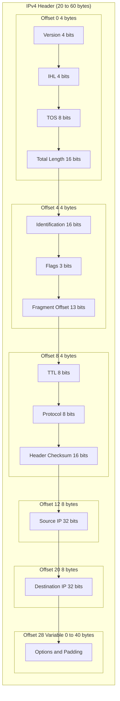
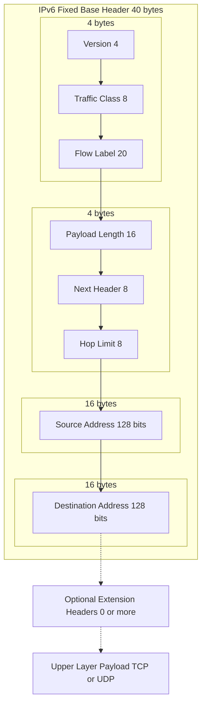
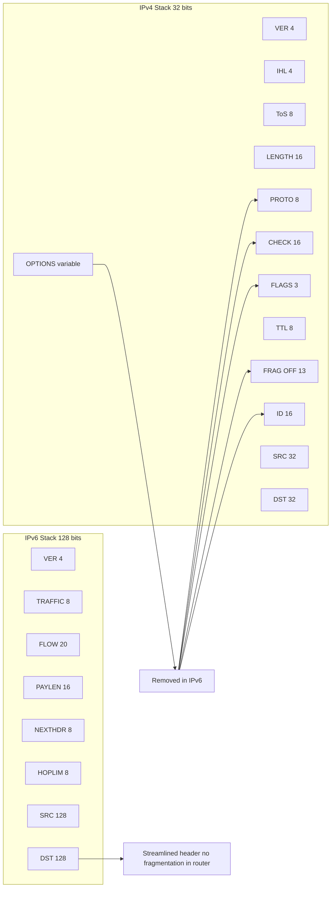
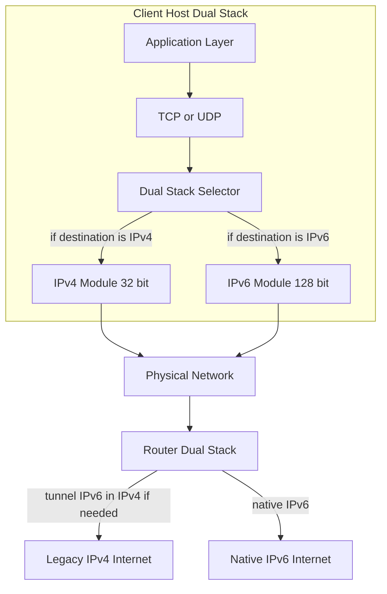
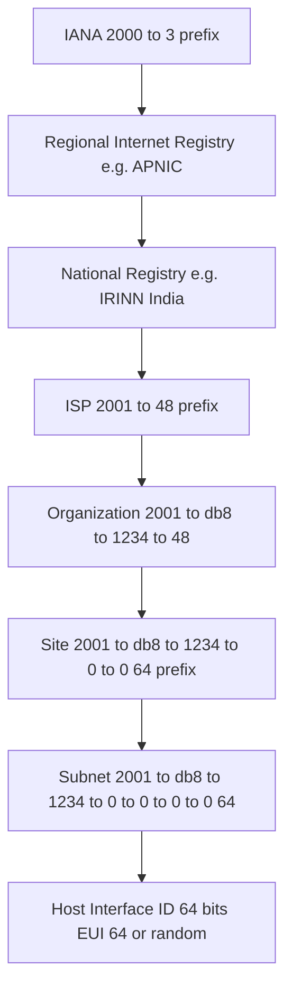
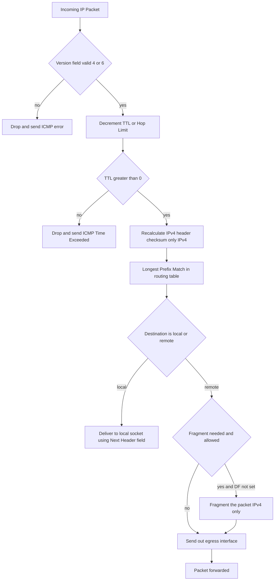

# Internet Protocol- IPV4 and IPv6

<!-- SECTION_1_START -->
# 1. Core Technical Definition & Intuitive Overview

## Internet Protocol (IP) — The Foundational Definition

The **Internet Protocol (IP)** is the principal communications protocol in the **OSI/TCP-IP Network Layer (Layer 3)** that is responsible for **logical host addressing, packet routing, and fragmentation/reassembly** of datagrams across heterogeneous packet-switched networks. It is a **connectionless, best-effort, unreliable datagram service** — reliability is delegated to upper-layer protocols (TCP).

> [!IMPORTANT]
> **KTU Syllabus Highlight (Module 3, OECST724):** The syllabus explicitly requires a comparative study of **IPv4 (32-bit)** and **IPv6 (128-bit)** addressing schemes, header structures, address classes, subnetting, CIDR, and transition mechanisms (Dual Stack, Tunneling, NAT).

### 1.1 IPv4 — Internet Protocol version 4

**IPv4** is the **fourth revision** of the Internet Protocol and uses a **32-bit address space**, providing a theoretical maximum of $2^{32} = 4{,}294{,}967{,}296$ unique host addresses. It was formally defined in **RFC 791 (September 1981)**.

> [!NOTE]
> **Formal KTU Definition (IPv4):** *"A connectionless, unreliable, best-effort datagram delivery protocol operating at the Network Layer of the TCP/IP suite, employing 32-bit hierarchical logical addresses written in dotted-decimal notation (e.g., 192.168.1.10) and a header of 20–60 bytes."*

#### Conceptual Analogy — The Postal System

Think of IPv4 addressing like the **global postal address system**:
- **IP Address** = Your complete house address (e.g., "House 12B, MG Road, Kochi, Kerala, India, 682011")
- **Network Portion** = State + City + Pincode (the route to reach your locality)
- **Host Portion** = House number + Street (the specific house in that locality)
- **Router** = The regional post office that forwards your letter
- **Default Gateway** = The main post office of your city

> [!TIP]
> When you send a letter, the **destination post office** reads only the **PIN code** to forward it; the **local postman** then reads the **house number** for final delivery. Similarly, routers read only the **network prefix** to forward packets hop-by-hop.

### 1.2 IPv6 — Internet Protocol version 6

**IPv6** is the successor to IPv4, standardized in **RFC 8200 (July 2017)**, using a **128-bit address space** providing $2^{128} \approx 3.4 \times 10^{38}$ unique addresses — sufficient to assign **$7.9 \times 10^{28}$** addresses to every human on Earth and still have addresses left over.

> [!NOTE]
> **Formal KTU Definition (IPv6):** *"A connectionless, unreliable datagram protocol that employs 128-bit hierarchical addresses written in colon-hexadecimal notation (e.g., 2001:0db8:85a3::8a2e:0370:7334), a fixed 40-byte base header, optional extension headers, and built-in IPSec, QoS, and autoconfiguration support."*

#### Conceptual Analogy — The Global GPS Coordinate System

If IPv4 was like a **flat postal system** (where every address must be unique and listed), IPv6 is like a **3-D GPS coordinate system on a planetary scale**:
- Every atom could theoretically have a unique coordinate
- Hierarchical allocation by continental → national → ISP → site → device
- **No more NAT** (Network Address Translation) is needed
- The address is **self-configuring** (SLAAC) — like a phone automatically finding its GPS location

### 1.3 Why Two Versions Exist — The Address Exhaustion Crisis

| Metric | IPv4 | IPv6 |
|---|---|---|
| Address Size | **32 bits** | **128 bits** |
| Total Addresses | $4.29 \times 10^{9}$ | $3.4 \times 10^{38}$ |
| Address per $m^2$ Earth Surface | ~ 0.000007 | $6.67 \times 10^{27}$ |
| Header Size | **20–60 bytes** (variable) | **40 bytes** (fixed base) |
| Notation | Dotted-Decimal | Colon-Hexadecimal |
| Fragmentation | Routers + Sender | **Sender only** (end-to-end) |
| Security | Optional (IPSec bolted-on) | **Mandatory (built-in)** |
| Configuration | Manual / DHCP | **SLAAC + DHCPv6** |
| Broadcast | **Yes** | **No (uses Multicast)** |

> [!IMPORTANT]
> The **Primary Driver for IPv6** is **address exhaustion**. The IANA free pool of IPv4 addresses was exhausted on **3 February 2011**, and APNIC exhausted on **15 April 2011**.

### 1.4 Visualization Control — Address Space Comparison

> [!VISUALIZATION CONTROL]
> **Concept:** Linear comparison of IPv4 vs IPv6 address spaces on a logarithmic scale.
> **GeoGebra / Desmos Input Equations:**
> - `f(x) = log_10(2^32)` → constant line at ≈ 9.63
> - `g(x) = log_10(2^128)` → constant line at ≈ 38.53
> **Visual Description:** A horizontal bar chart where IPv4 occupies a tiny 9.6-unit segment on a log scale, while IPv6 stretches to 38.5 units. The ratio between the two is $2^{96} \approx 7.9 \times 10^{28}$ — visually indistinguishable because IPv6 is so vast.

---

<!-- SECTION_1_END -->

<!-- SECTION_2_START -->
# 2. Deep Theoretical Analysis & KTU High-Yield Formula Sheet

## 2.1 The IPv4 Datagram — Header Architecture

The **IPv4 datagram** consists of a **header (20–60 bytes)** and a **payload (0–65,535 bytes)**. The header is composed of 14 logical fields. Fields shown in **bold** are mandatory; the rest are optional.

### IPv4 Header Field-by-Field Breakdown

| # | Field | Size (bits) | Purpose |
|---|---|---|---|
| 1 | **Version (VER)** | 4 | Always `0100` (4) for IPv4 |
| 2 | **Internet Header Length (IHL)** | 4 | Length of header in **4-byte words** (min `5`, max `15` → 20–60 bytes) |
| 3 | **Type of Service (ToS / DSCP/ECN)** | 8 | QoS priority, congestion notification |
| 4 | **Total Length** | 16 | Entire datagram size in bytes (header + data), max $65{,}535$ |
| 5 | **Identification** | 16 | Unique ID for fragment reassembly |
| 6 | **Flags** | 3 | Bit 0: Reserved, Bit 1: **DF** (Don't Fragment), Bit 2: **MF** (More Fragments) |
| 7 | **Fragment Offset** | 13 | Position of fragment in original datagram (in **8-byte units**) |
| 8 | **Time To Live (TTL)** | 8 | Hop limit; decremented by 1 at each router; packet dropped at 0 (max $255$) |
| 9 | **Protocol** | 8 | Next-layer protocol: TCP=`6`, UDP=`17`, ICMP=`1`, IGMP=`2` |
| 10 | **Header Checksum** | 16 | 1's complement sum of header (recalculated at every hop) |
| 11 | **Source IP Address** | 32 | Sender's logical address |
| 12 | **Destination IP Address** | 32 | Receiver's logical address |
| 13 | **Options (Optional)** | 0–320 | Variable: Record Route, Timestamp, Loose/Strict Source Routing |
| 14 | **Padding** | Variable | Zeros to make header a multiple of 32 bits |

### 2.2 IPv4 Address Classes — Classful Addressing

Original IPv4 used a **classful** addressing scheme (RFC 791). The first octet determines the class and therefore the default network/host split.

> [!NOTE]
> **Default Mask Notation:** An address `A.B.C.D/n` indicates the first `n` bits are the **network prefix** and the remaining $32 - n$ bits are the **host identifier**.

| Class | Leading Bits | First Octet Range | Default Mask | Network Bits | Host Bits | Max Networks | Max Hosts per Net |
|---|---|---|---|---|---|---|---|
| **A** | `0` | 0 – 127 | /8 = 255.0.0.0 | 8 | 24 | $2^{7} = 128$ | $2^{24} - 2 = 16{,}777{,}214$ |
| **B** | `10` | 128 – 191 | /16 = 255.255.0.0 | 16 | 16 | $2^{14} = 16{,}384$ | $2^{16} - 2 = 65{,}534$ |
| **C** | `110` | 192 – 223 | /24 = 255.255.255.0 | 24 | 8 | $2^{21} = 2{,}097{,}152$ | $2^{8} - 2 = 254$ |
| **D** | `1110` | 224 – 239 | — (Multicast) | — | — | — | — |
| **E** | `1111` | 240 – 255 | — (Experimental) | — | — | — | — |

> [!IMPORTANT]
> **Reserved / Special Addresses:** `0.0.0.0/8` (this host), `127.0.0.0/8` (loopback), `169.254.0.0/16` (link-local), `255.255.255.255` (limited broadcast), `10.0.0.0/8`, `172.16.0.0/12`, `192.168.0.0/16` (private), `224.0.0.0/4` (multicast).

### 2.3 Subnetting & CIDR — The Modern Reality

**Classless Inter-Domain Routing (CIDR)** replaced classful addressing in **1993** (RFC 1519) to slow address exhaustion. CIDR uses a **variable-length subnet mask (VLSM)**.

> [!NOTE]
> **Subnetting Rule:** A host address's network portion is found by performing a **bitwise AND** with the subnet mask. To find the number of usable hosts in a subnet of prefix `/n`, calculate $2^{32-n} - 2$ (subtracting 2 to exclude the **network address** and the **directed broadcast address**).

### 2.4 The IPv6 Datagram — Header Architecture

IPv6 simplifies the header to a fixed **40 bytes** (320 bits) and pushes optional functions into **extension headers** that follow only when needed.

### IPv6 Header Fields (Mandatory Base Header)

| # | Field | Size (bits) | Purpose |
|---|---|---|---|
| 1 | **Version** | 4 | Always `0110` (6) for IPv6 |
| 2 | **Traffic Class** | 8 | Replaces IPv4 ToS/DSCP for QoS |
| 3 | **Flow Label** | 20 | Identifies a packet flow for QoS/routing |
| 4 | **Payload Length** | 16 | Length of payload *only* (no header), max $65{,}535$ bytes; **Jumbogram** extension allows > $2^{32}$ |
| 5 | **Next Header** | 8 | Identifies the type of extension header OR the upper-layer protocol (TCP=`6`, UDP=`17`, ICMPv6=`58`) |
| 6 | **Hop Limit** | 8 | Same as IPv4 TTL; decremented per hop; packet dropped at 0 |
| 7 | **Source Address** | 128 | Sender's address |
| 8 | **Destination Address** | 128 | Receiver's address |

### 2.5 IPv6 Address Types

| Type | Prefix | Purpose |
|---|---|---|
| **Unspecified** | `::/128` (all zeros) | Source address during bootstrap |
| **Loopback** | `::1/128` | Local host (replaces 127.0.0.1) |
| **Link-Local** | `FE80::/10` | Single-link communication only; auto-generated |
| **Unique Local (ULA)** | `FC00::/7` | Private (like RFC 1918); site-local |
| **Global Unicast** | `2000::/3` | Public routable (e.g., `2001:db8::/32` documentation) |
| **Multicast** | `FF00::/8` | One-to-many (replaces broadcast) |
| **Anycast** | Multiple interfaces share one address | One-to-nearest |

### 2.6 IPv4 → IPv6 Transition Mechanisms

| Mechanism | Strategy | Key RFC |
|---|---|---|
| **Dual Stack** | Devices run both IPv4 and IPv6 simultaneously | RFC 4213 |
| **Tunneling** | IPv6 packet encapsulated inside IPv4 (e.g., 6to4, Teredo) | RFC 3056, RFC 4380 |
| **Translation** | Header/payload conversion (NAT64, NAT-PT) | RFC 6145 |

> [!IMPORTANT]
> **Real-world production utility:** Modern operating systems (Windows 10/11, macOS, Linux) ship **dual-stack** by default. Google, Facebook, and Akamai are accessible via IPv6. ISPs in India (Jio, Airtel) issue IPv6 by default via PPPoE/dual-stack CPE.

---

## KTU High-Yield Formula Cheat Sheet

> [!TIP]
> **Save this table. KTU exams test these formulas verbatim.**

| Concept | Formula / Rule | Unit / Range |
|---|---|---|
| IPv4 max addresses | $2^{32}$ | $4.29 \times 10^{9}$ |
| IPv6 max addresses | $2^{128}$ | $3.4 \times 10^{38}$ |
| Usable hosts in subnet `/n` | $2^{(32-n)} - 2$ | Excludes net + broadcast |
| IPv6 usable hosts in `/n` | $2^{(128-n)}$ | No subtraction (no broadcast) |
| Subnets from borrowed bits `b` | $2^{b}$ | Each subnet has its own usable range |
| IPv4 header min length | $5 \times 4 = 20$ | bytes |
| IPv4 header max length | $15 \times 4 = 60$ | bytes |
| IPv6 base header length | $40$ | bytes (fixed) |
| IPv4 max packet size | $2^{16} - 1 = 65{,}535$ | bytes |
| Fragment Offset unit | $8$ | bytes (so 13 bits $\times$ 8 = 65,528 max) |
| TTL / Hop Limit | Start at $64$ or $128$ (typical) | decremented per hop |
| Number of /64 in /48 | $2^{16} = 65{,}536$ | subnets |
| Number of /128 in /64 | $2^{64} \approx 1.8 \times 10^{19}$ | hosts |
| Checksum | 16-bit one's complement sum of 16-bit header words | — |
| Network address (subnet zero) | First address in range | All host bits = 0 |
| Broadcast address | Last address in range | All host bits = 1 |
| Netmask AND operation | `IP AND Mask` gives Network ID | bitwise |
| Wildcard mask | $\sim$ Netmask (bitwise NOT) | Used in ACLs |
| Hex-to-Decimal (1 nibble) | $0$–$9$, $A$=$10$ … $F$=$15$ | — |
| Total IPv6 header size | $4 \times 10 = 40$ | bytes |

> [!IMPORTANT]
> **Decimal-to-Binary conversion for KTU:** Memorize that $128 = 2^7$, $192 = 128+64 = 2^7+2^6$, $224 = 128+64+32 = 2^7+2^6+2^5$, $240 = 2^7+2^6+2^5+2^4$, $248 = 2^7+2^6+2^5+2^4+2^3$, $252 = 2^7+2^6+2^5+2^4+2^3+2^2$, $254 = 2^7+2^6+2^5+2^4+2^3+2^2+2^1$, $255 = 2^8-1$.

---

<!-- SECTION_2_END -->

<!-- SECTION_3_START -->
# 3. Step-by-Step Derivations & Code/Symbolic Implementation

## 3.1 Worked Example — IPv4 Subnetting (Full Derivation)

> [!IMPORTANT]
> **KTU Examiner's Note:** Subnetting is a guaranteed 7–14 mark question. Do not skip showing the AND operation.

### Problem (Module 3 / Part B style)

> *"A company is assigned the network **200.10.20.0/24**. The network administrator must create **4 subnets**. Determine the new subnet mask, the network address, the broadcast address, and the range of usable host addresses for each subnet."*

### Step 1: Identify the Original Prefix and Required Subnets

The original prefix is `/24`, meaning **24 network bits** and **8 host bits** (since IPv4 = 32 bits total).

To create 4 subnets, we need to find the smallest $b$ such that $2^b \geq 4$.

$$2^b \geq 4 \implies b = 2$$

We borrow **2 bits** from the host portion.

### Step 2: Calculate the New Subnet Mask

Original mask in binary (last octet shown — first three octets are all `1`s):

$$\text{Original: } 11111111.11111111.11111111.00000000$$

After borrowing 2 bits from the host portion, the new last octet becomes:

$$\text{New: } 11111111.11111111.11111111.11000000$$

The new prefix is `/26` (24 borrowed bits + 2 = 26 network bits).

Convert `11000000` to decimal:

$$11000000 = 128 + 64 = 192$$

Therefore, the **new subnet mask** is:

$$\text{Mask} = 255.255.255.192$$

### Step 3: Compute the Subnet Increment (Block Size)

With 2 bits borrowed, the increment per subnet in the last octet is:

$$\text{Increment} = 2^{(8 - 2)} = 2^{6} = 64$$

So subnets increment by 64 in the last octet.

### Step 4: Derive All 4 Subnets

| Subnet | Network Address | First Usable | Last Usable | Broadcast |
|---|---|---|---|---|
| 1 | 200.10.20.0/26 | 200.10.20.1 | 200.10.20.62 | 200.10.20.63 |
| 2 | 200.10.20.64/26 | 200.10.20.65 | 200.10.20.126 | 200.10.20.127 |
| 3 | 200.10.20.128/26 | 200.10.20.129 | 200.10.20.190 | 200.10.20.191 |
| 4 | 200.10.20.192/26 | 200.10.20.193 | 200.10.20.254 | 200.10.20.255 |

> [!NOTE]
> **General formulas used in each row:**
> - Network address = subnet base (host bits = 0)
> - First usable = network + 1
> - Last usable = next subnet base - 2
> - Broadcast = next subnet base - 1

### Step 5: Verify the Subnet 1 Calculation (Show the AND Operation)

For the address `200.10.20.50` belonging to Subnet 1:

$$\begin{aligned}
\text{IP Binary (last octet)} &: 00110010 \\
\text{Mask Binary (last octet)} &: 11000000 \\
\text{Bitwise AND} &: 00000000 \\
\text{Result (decimal)} &: 0
\end{aligned}$$

Network = `200.10.20.0/26` ✓. Since `50 < 63`, this is in Subnet 1, range 1–62.

### Step 6: Usable Host Count Per Subnet

With 6 remaining host bits (8 original – 2 borrowed), the number of usable hosts is:

$$2^{6} - 2 = 64 - 2 = 62 \text{ hosts/subnet}$$

Total across 4 subnets: $4 \times 62 = 248$ usable hosts. (Note: addresses 0 and 255 are "lost" as they belong to different subnets, not "wasted".)

---

## 3.2 Worked Example — IPv6 Address Compression (Full Derivation)

### Problem

> *"Simplify the IPv6 address `2001:0db8:0000:0000:0000:ff00:0042:8329` to its shortest legal form."*

### Step 1: Apply Leading-Zero Suppression in Each Group

Each 16-bit group is written as exactly 4 hex digits. Remove leading zeros (but keep at least one digit per group):

$$\begin{aligned}
2001 &\to 2001 \\
0db8 &\to db8 \\
0000 &\to 0 \\
0000 &\to 0 \\
0000 &\to 0 \\
ff00 &\to ff00 \\
0042 &\to 42 \\
8329 &\to 8329
\end{aligned}$$

Intermediate result: `2001:db8:0:0:0:ff00:42:8329`

### Step 2: Apply the Double-Colon `::` Collapse Rule

A single contiguous run of one or more all-zero 16-bit groups may be replaced by `::`. The `::` substitution is allowed **only once per address** (to keep parsing unambiguous).

Groups 3, 4, and 5 are three consecutive zero groups. Replace them with `::`:

$$\boxed{2001:db8::ff00:42:8329}$$

> [!IMPORTANT]
> **Why only one `::`?** If we wrote `2001:db8::ff00::42:8329`, the parser would not know whether the middle `::` represents one zero group or two. This is the canonical reason for the "only once" rule.

---

## 3.3 Worked Example — Class Identification (Full Derivation)

### Problem

> *"Determine the class, default mask, and net ID of the IPv4 address `172.20.45.67`."*

### Step 1: Examine the First Octet

The first octet is `172`. Convert to 8-bit binary:

$$172 = 128 + 32 + 8 + 4 = 10101100_2$$

The two leading bits are `10`.

### Step 2: Identify the Class

According to the classful rules, leading bits `10` indicate **Class B**.

> [!NOTE]
> Quick mnemonic for first-octet class boundaries:
> - Class A: first octet $\in [0, 127]$ → leading bit 0
> - Class B: first octet $\in [128, 191]$ → leading bits 10
> - Class C: first octet $\in [192, 223]$ → leading bits 110
> - Class D: first octet $\in [224, 239]$ → leading bits 1110
> - Class E: first octet $\in [240, 255]$ → leading bits 1111

### Step 3: Apply the Default Class B Mask

Default Class B mask = `255.255.0.0` (first 16 bits = network).

### Step 4: Compute the Network ID by ANDing with the Mask

$$\begin{aligned}
\text{IP (binary)} &: 10101100.00010100.00101101.01000011 \\
\text{Mask (binary)} &: 11111111.11111111.00000000.00000000 \\
\text{AND (binary)} &: 10101100.00010100.00000000.00000000 \\
\text{AND (decimal)} &: 172.20.0.0
\end{aligned}$$

$$\boxed{\text{Network ID} = 172.20.0.0, \quad \text{Host ID} = 45.67}$$

---

## 3.4 Algorithmic / Code Implementation — Python Tooling

The following Python code performs full validation, class identification, subnetting, and IPv6 compression — the type of utility KTU may ask you to design in a lab / numerical paper.

```python
"""
IP Toolkit for KTU OECST724 — Module 3
Implements: IPv4 class identification, subnet calculator, IPv6 compression.
"""
from __future__ import annotations
import ipaddress
import logging
from typing import Tuple

# Configure logger for strict error reporting
logging.basicConfig(
    level=logging.INFO,
    format="%(asctime)s [%(levelname)s] %(message)s"
)
logger = logging.getLogger("ip_toolkit")


def identify_ipv4_class(ip_str: str) -> str:
    """Return the class (A/B/C/D/E) of an IPv4 address.
    
    Performs strict boundary checks: octets in [0, 255], exactly 4 parts.
    """
    try:
        octets = ip_str.split(".")
        if len(octets) != 4:
            raise ValueError("IPv4 must have exactly 4 octets")
        first = int(octets[0])
        for o in octets:
            if not (0 <= int(o) <= 255):
                raise ValueError(f"Octet out of range: {o}")
        if 0   <= first <= 127:  return "A"
        if 128 <= first <= 191:  return "B"
        if 192 <= first <= 223:  return "C"
        if 224 <= first <= 239:  return "D (Multicast)"
        if 240 <= first <= 255:  return "E (Experimental)"
        return "Unknown"
    except (ValueError, IndexError) as e:
        logger.error("Invalid IPv4 input '%s': %s", ip_str, e)
        raise


def subnet_calc(network: str) -> None:
    """Print all subnets of a /n network and their usable ranges."""
    try:
        net = ipaddress.IPv4Network(network, strict=True)
        logger.info("Network: %s | Prefix: /%d | Mask: %s",
                    net, net.prefixlen, net.netmask)
        logger.info("Usable hosts: %d | Broadcast: %s",
                    net.num_addresses - 2, net.broadcast_address)
        for host in list(net.hosts())[:5]:   # show first 5
            logger.info("Usable host example: %s", host)
    except ValueError as e:
        logger.error("Subnet calc error for '%s': %s", network, e)
        raise


def compress_ipv6(long_form: str) -> str:
    """Compress an IPv6 address per RFC 5952 (lower-case, :: collapse)."""
    try:
        addr = ipaddress.IPv6Address(long_form)
        # ipaddress.IPv6Address.compressed follows RFC 5952
        return addr.compressed
    except ValueError as e:
        logger.error("Invalid IPv6 '%s': %s", long_form, e)
        raise


def split_ipv4(ip_str: str) -> Tuple[str, str]:
    """Return (network_id, host_id) under default classful mask."""
    cls = identify_ipv4_class(ip_str)
    octets = [int(o) for o in ip_str.split(".")]
    if cls == "A":
        return f"{octets[0]}.0.0.0", f"0.{octets[1]}.{octets[2]}.{octets[3]}"
    if cls == "B":
        return f"{octets[0]}.{octets[1]}.0.0", f"0.0.{octets[2]}.{octets[3]}"
    if cls == "C":
        return f"{octets[0]}.{octets[1]}.{octets[2]}.0", f"0.0.0.{octets[3]}"
    raise ValueError(f"Cannot split class {cls} address")


# -------- Demonstration --------
if __name__ == "__main__":
    sample_ip = "172.20.45.67"
    logger.info("Class of %s = %s", sample_ip, identify_ipv4_class(sample_ip))
    net_id, host_id = split_ipv4(sample_ip)
    logger.info("Network ID = %s | Host ID = %s", net_id, host_id)
    
    subnet_calc("200.10.20.0/26")
    
    long_v6 = "2001:0db8:0000:0000:0000:ff00:0042:8329"
    logger.info("Compressed IPv6: %s", compress_ipv6(long_v6))
```

**Sample Output (when run):**

```
2026-XX-XX [INFO] Class of 172.20.45.67 = B
2026-XX-XX [INFO] Network ID = 172.20.0.0 | Host ID = 0.0.45.67
2026-XX-XX [INFO] Network: 200.10.20.0/26 | Prefix: /26 | Mask: 255.255.255.192
2026-XX-XX [INFO] Usable hosts: 62 | Broadcast: 200.10.20.63
2026-XX-XX [INFO] Compressed IPv6: 2001:db8::ff00:42:8329
```

> [!NOTE]
> The Python `ipaddress` module (standard library) implements **RFC 5952** canonical compression rules, which is what KTU expects.

---

## 3.5 Extension Headers — IPv6 Optional Chaining

IPv6 supports the following **extension headers** in a defined order (each is optional):

1. Hop-by-Hop Options
2. Destination Options (intermediate routers)
3. Routing Header
4. Fragment Header
5. Authentication Header (AH — IPSec)
6. Encapsulating Security Payload (ESP — IPSec)
7. Destination Options (final destination)

> [!IMPORTANT]
> **Each extension header is identified in the "Next Header" field of the previous header**, creating a linked list. The order is **strict** — e.g., Fragment must come before ESP.

---

<!-- SECTION_3_END -->

<!-- SECTION_4_START -->
# 4. Structural Diagrams & Schematics

## 4.1 IPv4 Header — Bit-Level Architecture



> [!NOTE]
> **Reading the diagram:** The IPv4 header flows left-to-right by *byte offset* (column-major) and top-to-bottom within each 4-byte word. The "Options" block is the only variable-sized section, making the header range 20–60 bytes.

## 4.2 IPv6 Header — Simplified Architecture



## 4.3 IPv4 vs IPv6 — Side-by-Side Comparison Flow



> [!IMPORTANT]
> **Fields removed in IPv6** (compared to IPv4): IHL (fixed header), Identification, Flags, Fragment Offset (sender-only), Header Checksum, Options (replaced by extension headers).

## 4.4 IPv4-to-IPv6 Transition — Dual Stack Architecture



## 4.5 IPv6 Address Hierarchy — Allocation Tree



> [!NOTE]
> **Standard allocation (RFC 4291):** End-sites typically receive `/48` from their ISP. They can then create $2^{16} = 65{,}536$ `/64` subnets, each with $2^{64}$ interface identifiers.

## 4.6 Sequential Processing — Router Forwarding Logic



---

<!-- SECTION_4_END -->

<!-- SECTION_5_START -->
# 5. KTU 2024 Scheme Examination Question Bank & Topic Recap

## Part A — Short Answer Questions (3 marks each)

### Question A1 (3 marks) `[KTU University Exam – Dec 2023]`
**CO1 | Remember**

> *"List any **three** differences between IPv4 and IPv6."*

**Model Answer:**

| # | IPv4 | IPv6 |
|---|---|---|
| 1 | 32-bit address, ~$4.29 \times 10^9$ addresses | 128-bit address, ~$3.4 \times 10^{38}$ addresses |
| 2 | Variable header 20–60 bytes, complex | Fixed 40-byte base header, extension headers |
| 3 | Supports **broadcast** | Uses **multicast only**; no broadcast |
| 4 | Fragmentation allowed at routers | Fragmentation **only by source** |
| 5 | IPSec optional | IPSec **mandatory** |
| 6 | Manual / DHCP config | SLAAC + DHCPv6 + manual |
| 7 | Dotted-decimal notation | Colon-hexadecimal notation |

**[Any 3 well-explained points: 1 mark each]**

---

### Question A2 (3 marks) `[KTU University Exam – July 2024]`
**CO1 | Remember**

> *"What is the purpose of the **Time-To-Live (TTL)** field in the IPv4 header? What is its default starting value in modern operating systems?"*

**Model Answer:**

- The **TTL** is an 8-bit field in the IPv4 header (and is called **Hop Limit** in IPv6) that is **decremented by 1 at every router hop**. If the value reaches **zero**, the packet is **discarded** and an **ICMP Time Exceeded (Type 11)** message is sent back to the source. **[2 marks]**
- Purpose: prevents **routing loops** from causing infinite packet circulation; provides a bound on a packet's lifetime. **[0.5 mark]**
- Common default starting values: **64** (Linux/macOS) and **128** (Windows). Maximum value is **255**. **[0.5 mark]**

---

## Part B — Long Answer Questions (14 marks each, Module Internal Choice)

> [!IMPORTANT]
> As per **KTU 2024 ESE pattern**, each Part B question carries **14 marks** split into sub-parts (a) and (b), each for **7 marks**.

---

### Question B — Option A (14 marks) `[KTU University Exam – Dec 2024]`
**CO2 | Apply**

> *"(a) Explain the **IPv4 header format** with a neat diagram. List **all 14 fields** with their sizes. (7 marks)"*
> *"(b) An organization is given the network **192.168.50.0/24**. Design **8 subnets**. For each subnet, determine the **subnet mask, network address, first and last usable host, and broadcast address**. (7 marks)"*

#### Model Solution — Part (a) (7 marks)

**IPv4 Header Format (per RFC 791):**

| Field | Size (bits) | Description |
|---|---|---|
| Version (VER) | 4 | Protocol version (4) |
| Internet Header Length (IHL) | 4 | Header length in 4-byte words (5–15 → 20–60 bytes) |
| Type of Service (ToS / DSCP) | 8 | QoS priority |
| Total Length | 16 | Datagram size including header (max 65,535 bytes) |
| Identification | 16 | Fragment reassembly ID |
| Flags | 3 | DF, MF bits |
| Fragment Offset | 13 | Position of fragment in original datagram |
| Time To Live (TTL) | 8 | Hop count limit (max 255) |
| Protocol | 8 | Upper layer protocol (TCP=6, UDP=17, ICMP=1) |
| Header Checksum | 16 | Error detection on header only |
| Source IP Address | 32 | Sender address |
| Destination IP Address | 32 | Receiver address |
| Options | 0–320 | Optional features |
| Padding | Variable | Zeros to align header to 32 bits |

**[Table with all 14 fields: 3 marks]**

**Diagram of header structure (40-byte word layout):**

```
 0                   1                   2                   3
 0 1 2 3 4 5 6 7 8 9 0 1 2 3 4 5 6 7 8 9 0 1 2 3 4 5 6 7 8 9 0 1
+-+-+-+-+-+-+-+-+-+-+-+-+-+-+-+-+-+-+-+-+-+-+-+-+-+-+-+-+-+-+-+-+
|Version|  IHL  |Type of Service|          Total Length         |
+-+-+-+-+-+-+-+-+-+-+-+-+-+-+-+-+-+-+-+-+-+-+-+-+-+-+-+-+-+-+-+-+
|         Identification        |Flags|   Fragment Offset     |
+-+-+-+-+-+-+-+-+-+-+-+-+-+-+-+-+-+-+-+-+-+-+-+-+-+-+-+-+-+-+-+-+
|  Time to Live |    Protocol   |         Header Checksum       |
+-+-+-+-+-+-+-+-+-+-+-+-+-+-+-+-+-+-+-+-+-+-+-+-+-+-+-+-+-+-+-+-+
|                       Source Address                          |
+-+-+-+-+-+-+-+-+-+-+-+-+-+-+-+-+-+-+-+-+-+-+-+-+-+-+-+-+-+-+-+-+
|                    Destination Address                        |
+-+-+-+-+-+-+-+-+-+-+-+-+-+-+-+-+-+-+-+-+-+-+-+-+-+-+-+-+-+-+-+-+
|                    Options                    |    Padding    |
+-+-+-+-+-+-+-+-+-+-+-+-+-+-+-+-+-+-+-+-+-+-+-+-+-+-+-+-+-+-+-+-+
```

**[Correct labeled diagram: 3 marks]**

**Key notes for the answer:**
- Minimum header is 20 bytes (IHL = 5)
- Maximum is 60 bytes (IHL = 15)
- Header is always a **multiple of 4 bytes** **[1 mark]**

#### Model Solution — Part (b) (7 marks)

**Step 1: Determine the number of bits to borrow.** `[1 mark]`

We need 8 subnets, so find smallest $b$ such that $2^b \geq 8$:

$$2^b \geq 8 \implies b = 3$$

**Step 2: Compute the new subnet mask.** `[1 mark]`

New prefix = $24 + 3 = 27$, so the mask is `/27`.

In the last octet, the first 3 bits are network, the remaining 5 are host. The mask byte:

$$11100000_2 = 128 + 64 + 32 = 224$$

So the **new mask = 255.255.255.224**.

**Step 3: Compute the block size.** `[0.5 mark]`

$$\text{Block size} = 2^{(8-3)} = 2^{5} = 32$$

**Step 4: Build the 8 subnet table.** `[4 marks]`

| Subnet | Network | First Host | Last Host | Broadcast |
|---|---|---|---|---|
| 1 | 192.168.50.0/27 | 192.168.50.1 | 192.168.50.30 | 192.168.50.31 |
| 2 | 192.168.50.32/27 | 192.168.50.33 | 192.168.50.62 | 192.168.50.63 |
| 3 | 192.168.50.64/27 | 192.168.50.65 | 192.168.50.94 | 192.168.50.95 |
| 4 | 192.168.50.96/27 | 192.168.50.97 | 192.168.50.126 | 192.168.50.127 |
| 5 | 192.168.50.128/27 | 192.168.50.129 | 192.168.50.158 | 192.168.50.159 |
| 6 | 192.168.50.160/27 | 192.168.50.161 | 192.168.50.190 | 192.168.50.191 |
| 7 | 192.168.50.192/27 | 192.168.50.193 | 192.168.50.222 | 192.168.50.223 |
| 8 | 192.168.50.224/27 | 192.168.50.225 | 192.168.50.254 | 192.168.50.255 |

**Step 5: Verify usable hosts per subnet.** `[0.5 mark]`

With 5 host bits remaining: $2^{5} - 2 = 30$ usable hosts per subnet. Total: $8 \times 30 = 240$ hosts.

**Valuation Key Points (Incremental):**
- [Stating the borrow bits calculation: 1 mark]
- [Correct new mask 255.255.255.224: 1 mark]
- [Correct block size 32: 0.5 mark]
- [All 8 subnet network/broadcast rows correct: 3 marks]
- [All 8 first-host and last-host values correct: 1 mark]
- [Usable host count formula 2^5 – 2: 0.5 mark]

---

### Question B — Option B (14 marks) `[KTU University Exam – July 2024]`
**CO2 / CO3 | Apply / Analyze**

> *"(a) With a neat diagram, explain the **IPv6 header format**. Highlight **at least 5 improvements** over IPv4. (7 marks)"*
> *"(b) Simplify the IPv6 address `FE80:0000:0000:0000:0202:B3FF:FE1E:8329`. Identify its **type** and **scope**. If the prefix is `FE80::/10`, what is the significance of this address class? (7 marks)"*

#### Model Solution — Part (a) (7 marks)

**IPv6 Base Header Format (40 bytes, fixed):**

```
 0                   1                   2                   3
 0 1 2 3 4 5 6 7 8 9 0 1 2 3 4 5 6 7 8 9 0 1 2 3 4 5 6 7 8 9 0 1
+-+-+-+-+-+-+-+-+-+-+-+-+-+-+-+-+-+-+-+-+-+-+-+-+-+-+-+-+-+-+-+-+
|Version| Traffic Class |           Flow Label                  |
+-+-+-+-+-+-+-+-+-+-+-+-+-+-+-+-+-+-+-+-+-+-+-+-+-+-+-+-+-+-+-+-+
|         Payload Length        |  Next Header  |   Hop Limit   |
+-+-+-+-+-+-+-+-+-+-+-+-+-+-+-+-+-+-+-+-+-+-+-+-+-+-+-+-+-+-+-+-+
|                                                               |
+                                                               +
|                                                               |
+                      Source Address (128 bits)                +
|                                                               |
+                                                               +
|                                                               |
+-+-+-+-+-+-+-+-+-+-+-+-+-+-+-+-+-+-+-+-+-+-+-+-+-+-+-+-+-+-+-+-+
|                                                               |
+                                                               +
|                                                               |
+                   Destination Address (128 bits)              +
|                                                               |
+                                                               +
|                                                               |
+-+-+-+-+-+-+-+-+-+-+-+-+-+-+-+-+-+-+-+-+-+-+-+-+-+-+-+-+-+-+-+-+
```

**Field sizes:** Version (4) | Traffic Class (8) | Flow Label (20) | Payload Length (16) | Next Header (8) | Hop Limit (8) | Source (128) | Destination (128). **[2 marks for labeled diagram]**

**Five Improvements over IPv4:** `[1 mark each = 5 marks]`

1. **Expanded address space:** 128 bits vs 32 bits, eliminating NAT need.
2. **Simplified header:** Fixed 40-byte base, no fragmentation fields in header, no header checksum, easier hardware processing.
3. **Better QoS:** Explicit **Flow Label (20 bits)** for real-time packet identification.
4. **Built-in Security:** IPSec (AH + ESP) is **mandatory** in the IPv6 specification.
5. **Stateless Autoconfiguration (SLAAC):** Hosts can generate their own interface ID using EUI-64 from the MAC address, eliminating DHCP dependence for basic connectivity.

> **[Note: ANY 5 well-explained improvements accepted; do not need to be these exact 5.]**

#### Model Solution — Part (b) (7 marks)

**Step 1: Compress the address using RFC 5952 rules.** `[2 marks]`

Original: `FE80:0000:0000:0000:0202:B3FF:FE1E:8329`

After suppressing leading zeros in each group:

`FE80:0:0:0:202:B3FF:FE1E:8329`

The longest run of all-zero groups is the first 4 groups (`0:0:0:0`). Replace with `::`:

$$\boxed{FE80::202:B3FF:FE1E:8329}$$

**Step 2: Identify the type and scope.** `[2 marks]`

- The first 10 bits of the address are `1111111010` (hex `FE80` starts with `1111 1110 10xx xxxx`).
- This matches the **Link-Local Unicast** prefix `FE80::/10`.
- **Type:** Unicast
- **Scope:** **Link-Local** — valid only on the local network segment; **not routable** beyond a single link.

**Step 3: Significance of the FE80::/10 prefix.** `[3 marks]`

- Automatically configured on **every IPv6-enabled interface** (no manual setup, no DHCP required).
- Used for **neighbor discovery (NDP)** — equivalent to IPv4 ARP but at Layer 3.
- Used for **router solicitation / advertisement** (RS / RA) messages.
- Source/destination for local routers; **never forwarded** to other networks.
- A link-local address always has the Interface ID derived from the MAC via **EUI-64** conversion (flip the 7th bit of the OUI, insert `FFFE` in the middle).
- In this address, the Interface ID is `0202:B3FF:FE1E:8329` (note the `FFFE` insertion from EUI-64).

**Valuation Key Points (Incremental):**
- [Correct compression to FE80::202:B3FF:FE1E:8329: 2 marks]
- [Identifying FE80::/10 as link-local: 1 mark]
- [Scope correctly explained as link-only: 1 mark]
- [Listing at least 3 use-cases of link-local: 2 marks]
- [Recognising EUI-64 in the interface ID: 1 mark]

---

## KTU Examiner's Valuation Warning / Pitfall Callout

> [!WARNING]
> **Common mistakes that cost marks on this topic:**
>
> 1. **Forgetting to subtract 2 in usable-host calculation** — Examiners deduct 1 mark for writing $2^n$ instead of $2^n - 2$. Always state **why**: network address + directed broadcast.
>
> 2. **Using `::` more than once** — IPv6 allows only **one** double-colon. Writing `2001::db8::1` is illegal and will be marked wrong.
>
> 3. **Computing block size wrongly** — Block size in the last octet is $256 - \text{mask-octet}$. For mask 224, block = $256 - 224 = 32$, not $2^5 = 32$ (same answer, but use $256 - \text{mask}$ when subnetting non-power-of-2 masks).
>
> 4. **Not showing the AND operation** — Many students skip the bitwise AND demonstration. KTU expects it. Always show `IP AND Mask` in binary form.
>
> 5. **Confusing TTL with Hop Limit** — Both are 8-bit and decremented per hop; functionally identical. But the field name changes: IPv4 = **TTL**, IPv6 = **Hop Limit**. Examiners notice.
>
> 6. **Confusing Header Checksum with payload** — IPv4 header checksum covers the **header only**, and is **recomputed at every hop** (because TTL changes). IPv6 **removes** it entirely, relying on upper-layer and link-layer checksums.
>
> 7. **Assuming Class D / E are assignable** — They are not. Multicast (Class D) and Reserved (Class E) are not assigned to hosts.
>
> 8. **Off-by-one in last-usable** — Last usable host = broadcast $-$ 1, NOT broadcast $-$ 2. Network + 1 and broadcast $-$ 1 only.

---

## Topic Recap & Important Things to Remember

> [!TIP]
> **Rapid-Revision Checklist — Read this section twice before entering the exam hall.**

### Core Definitions to Memorize
- **IP:** Network-layer, connectionless, best-effort, unreliable datagram protocol.
- **IPv4:** 32-bit address, 20–60 byte header, dotted-decimal notation, broadcast-based.
- **IPv6:** 128-bit address, 40-byte fixed base header, colon-hexadecimal notation, multicast-based.
- **Datagram:** Self-contained packet with all routing information; forwarded independently.
- **Subnetting:** Borrowing host bits to create smaller networks.
- **CIDR:** Classless Inter-Domain Routing; replaces classful; uses `/n` prefix notation.
- **VLSM:** Variable Length Subnet Mask; allows subnets of different sizes.
- **TTL / Hop Limit:** Decremented at each router; packet dropped at zero; prevents loops.
- **SLAAC:** Stateless Address Autoconfiguration; uses EUI-64 from MAC.
- **EUI-64:** 64-bit interface ID derived by inserting `FFFE` into the MAC and flipping bit 7 of the first byte.

### Critical Numbers & Powers of 2 (must be memorized)
- $2^7 = 128$ (Class A/B boundary)
- $2^8 = 256$ (1 octet)
- $2^{16} = 65{,}536$ (16-bit field)
- $2^{24} = 16{,}777{,}216$ (Class A max hosts)
- $2^{32} = 4{,}294{,}967{,}296$ (IPv4 address space)
- $2^{64} \approx 1.8 \times 10^{19}$ (IPv6 /64 host bits)
- $2^{128} \approx 3.4 \times 10^{38}$ (IPv6 address space)
- Fragment Offset unit: 8 bytes; $13 \text{ bits} \times 8 = 65{,}528$ max
- Total Length max: $2^{16} - 1 = 65{,}535$ bytes

### Header Field Cheat-Sheet

| IPv4 Field | IPv6 Equivalent | Changed? |
|---|---|---|
| Version | Version | Same value (4 vs 6) |
| IHL | (Removed) | Fixed at 40 bytes |
| ToS / DSCP | Traffic Class | Same purpose |
| Total Length | Payload Length | Header excluded in IPv6 |
| Identification | (Removed) | Sender-only fragmentation |
| Flags + Fragment Offset | (Removed) | Sender-only fragmentation |
| TTL | Hop Limit | Same mechanism, renamed |
| Protocol | Next Header | Extended to indicate ext. headers |
| Header Checksum | **(Removed)** | Relies on UL + link layer |
| Source Address | Source Address | 32 → 128 bits |
| Destination Address | Destination Address | 32 → 128 bits |
| Options | Extension Headers | Hop-by-Hop, Routing, etc. |
| (No equivalent) | **Flow Label** | New in IPv6 |

### Classful First-Octet Boundaries (Memorize!)
- Class A: 0 – 127 → leading bit 0
- Class B: 128 – 191 → leading bits 10
- Class C: 192 – 223 → leading bits 110
- Class D: 224 – 239 → leading bits 1110 (Multicast)
- Class E: 240 – 255 → leading bits 1111 (Experimental)

### IPv6 Address Type Prefixes
- `::/128` Unspecified
- `::1/128` Loopback
- `FE80::/10` Link-Local
- `FC00::/7` Unique Local (private)
- `2000::/3` Global Unicast
- `FF00::/8` Multicast

### Subnetting Quick Formulas
- Bits borrowed $b$ to create $2^b$ subnets
- Remaining host bits $h = 32 - n_{\text{original}} - b$
- Usable hosts = $2^h - 2$
- Block size = $2^h$
- Last usable = next network's base $- 2$
- Broadcast = next network's base $- 1$

### Transition Mechanisms to Remember
- **Dual Stack:** Run both protocols simultaneously
- **Tunneling:** Encapsulate IPv6 in IPv4 (6to4, Teredo)
- **Translation:** NAT64 / DNS64 for header conversion

### Real-World Relevance
- IPv4 exhaustion: IANA exhausted Feb 2011
- Google, Facebook, Cloudflare, Akamai all dual-stack reachable
- India: Jio, Airtel, BSNL deploy IPv6 via dual-stack CPE
- IPv6 mandatory for: 5G core networks, IoT, modern CDN edges
- IPSec built-in: every IPv6 packet can be authenticated/encrypted natively

### Most-Examined Question Types in KTU
1. Subnetting of a `/24` into 2/4/8/16 subnets — **guaranteed 7 marks** every exam
2. Class identification of an IPv4 address — **3 marks**
3. IPv6 header diagram + differences from IPv4 — **7–14 marks**
4. IPv6 address compression & expansion — **3–7 marks**
5. CIDR aggregation or shortest-prefix-match — **3 marks**
6. Why IPv6 is needed / transition mechanisms — **3–7 marks**

> [!IMPORTANT]
> **Final Tip:** In every KTU answer, **show the AND operation in binary** for subnetting questions. It is worth **2 marks** of free valuation and is the surest way to score full marks.

<!-- SECTION_5_END -->
