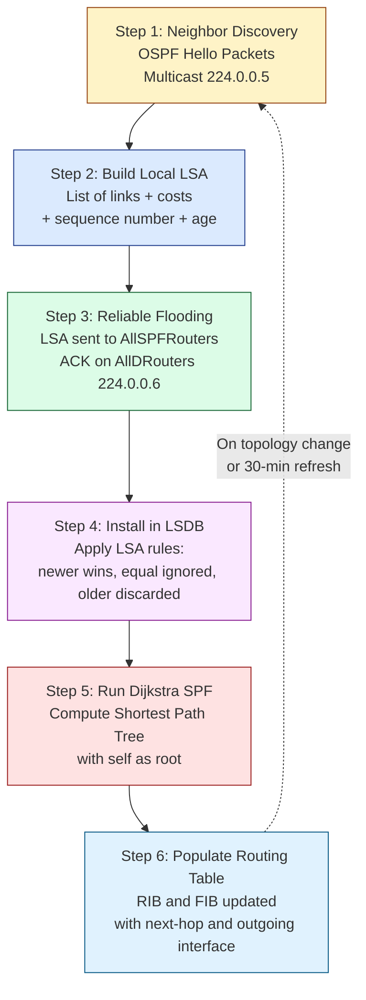
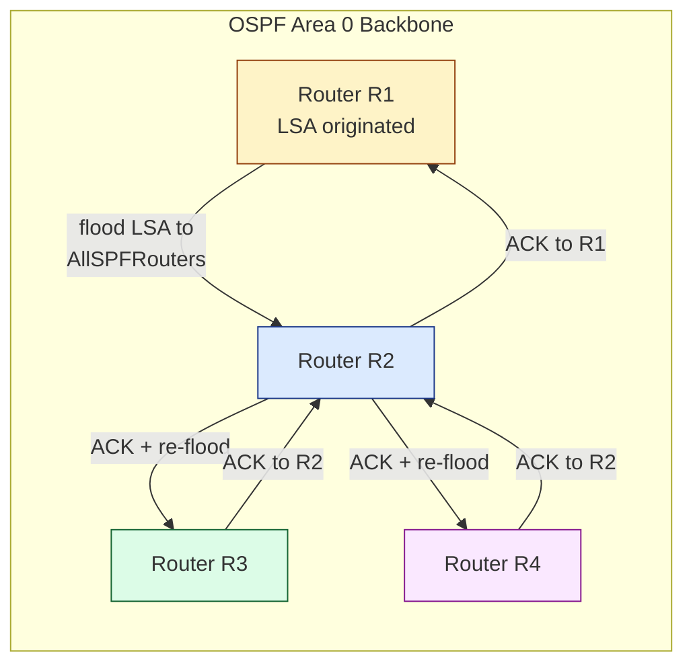
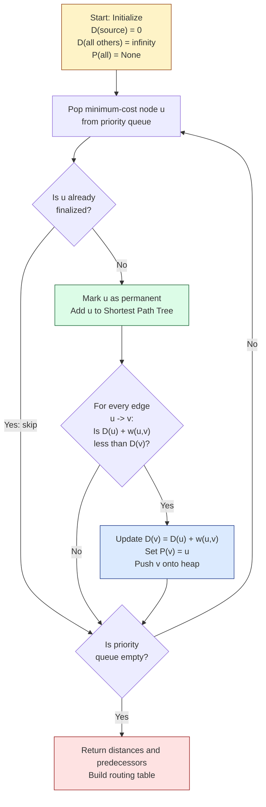
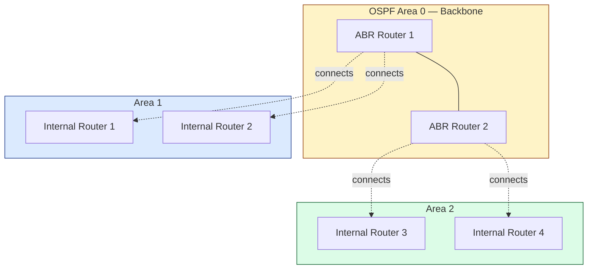

# Link State Routing

<!-- SECTION_1_START -->

# Link State Routing — Module 3, Network Layer

## 1. Core Technical Definition & Intuitive Overview

**Link State Routing (LSR)** is a class of dynamic, intra-domain interior gateway routing protocols in which every router independently constructs a complete, identical map (called the **Link-State Database / LSDB**) of the entire autonomous system. To build this map, each router discovers its directly connected neighbors, measures the cost (metric) of each of its links, and then reliably floods this local "link-state" information to *every other router* in the network. Once the LSDB converges, every router runs the **Shortest Path First (SPF) algorithm** (Dijkstra's algorithm) on the same graph to compute a loop-free shortest-path tree with itself as the root. The most widely deployed link-state protocols in production networks are **OSPF (Open Shortest Path First)** for IP and **IS-IS (Intermediate System to Intermediate System)** for both IP and CLNP networks.

> [!IMPORTANT]
> **KTU Syllabus Highlight (Module 3):** Link State Routing is a high-weightage topic. Students must master the **5 steps of LSR**, the **Dijkstra SPF algorithm**, **LSP flooding mechanics**, and the **advantages/disadvantages vs Distance Vector**.

### Conceptual Analogy — "The City Map Analogy"

Imagine you are dropped into an unknown city.

- In a **Distance Vector** world (RIP), every person you meet only tells you *"from me, the airport is 3 km away, the station is 5 km away"*. You never see the full map — you only know what your neighbor claims. This leads to *rumor-based, slow convergence* and the classic *count-to-infinity* problem.
- In a **Link State** world (OSPF), every person in the city is issued an **identical, complete city map** drawn by an impartial surveyor. Each person only measures the streets directly leaving their own house (their links) and reports those street lengths to a central office, which broadcasts the consolidated map to everyone. Now *every router makes routing decisions based on a global, verified picture* — no rumors, no loops.

> [!NOTE]
> **Key Insight:** Distance Vector = *"What my neighbor thinks"*. Link State = *"What I have personally verified about the whole network."*

### Standard Routing Metrics in Bold

- **Cost / Metric** — the routing weight assigned to a link (in OSPF, cost = reference bandwidth / interface bandwidth; default reference = **100 Mbps**, so a 10 Mbps Ethernet link has cost = **10**, a 1 Gbps link has cost = **1**, a 100 Mbps link has cost = **1**).
- **Administrative Distance (AD)** — trustworthiness of a routing source (OSPF = **110**, IS-IS = **115**, RIP = **120**).
- **Hello Interval** — default **10 s** on broadcast/multi-access, **30 s** on NBMA/point-to-point.
- **Dead Interval** — default **4 × Hello = 40 s** or **120 s** respectively.
- **LS Refresh Time** — every **30 minutes** an LSP is re-flooded to guard against corruption.
- **MaxAge** — **60 minutes (3600 s)** before an LSP is considered stale and purged.

> [!VISUALIZATION CONTROL]
> **Concept:** Link State Topology as a Weighted Graph
> **GeoGebra / Desmos Input Equations (point set for a 5-router graph):**
> * `A = (0, 0)` `B = (4, 0)` `C = (2, 3)` `D = (0, 5)` `E = (4, 5)`
> * Edges with weights: `A-B: 2, A-C: 4, A-D: 7, B-C: 1, B-E: 3, C-D: 2, C-E: 5, D-E: 1`
> **Visual Description:** The student should see a pentagon-like weighted graph. Running Dijkstra from node A produces a shortest-path tree whose edges visually trace the minimum-cost routes from A to every other node. Cost values appear on the segments. The LSDB for any router in this network contains all 5 nodes and all 8 edges, *not* just A's immediate neighbors.

<!-- SECTION_1_END -->

<!-- SECTION_2_START -->

## 2. Deep Theoretical Analysis & KTU High-Yield Formula Sheet

### 2.1 The Five Canonical Steps of Link State Routing

Link State Routing is executed as a strictly ordered, cyclical process:

1. **Neighbor Discovery (Hello)**
   Each router sends **OSPF Hello packets** out every enabled interface to a multicast address (**224.0.0.5** for AllSPFRouters on IPv4, **FF02::5** on IPv6). Two-way communication is established when a router sees its own Router ID in the neighbor's Hello. After adjacency forms, the routers become **neighbors**.

2. **Reliable Flooding of Link-State Advertisements (LSAs)**
   Once adjacencies are formed, each router builds an **LSA / LSP (Link-State Packet)** containing: *Router ID, list of directly connected links, sequence number, age, and neighbor Router IDs with link cost*. LSAs are flooded using a reliable acknowledgment mechanism (**Link State Acknowledgment — LSAck**) on the **AllDRouters** multicast (**224.0.0.6** for DR/BDR, **FF02::6** for IPv6). Every router retransmits the LSA out *all* interfaces except the one on which it arrived (the **flooding scope** rule).

3. **Building the Link-State Database (LSDB)**
   Each router stores every received LSA in its **LSDB** and applies the **LSA rules**:
   - If no LSA exists → install it.
   - If received LSA sequence number is **higher** → replace and re-flood.
   - If sequence number is **equal** → ignore (duplicate).
   - If sequence number is **lower** → discard and send the newer copy back to the sender.
   Sequence numbers use **linear 32-bit signed** space (modern OSPFv2) or **floating-point 24-bit** (classic) with explicit **MaxSequenceNumber wrap-around** logic.

4. **Running the Shortest Path First (SPF / Dijkstra) Algorithm**
   Each router, on any LSDB change, runs Dijkstra's algorithm with itself as the root to compute the **shortest-path tree**. The cost of a path is the **sum of outgoing-interface costs** along the path. Ties are broken by **lowest neighbor Router ID**.

5. **Populating the Routing Table (RIB / FIB)**
   For every destination network in the SPF tree, the router installs an entry in the **Routing Information Base (RIB)** pointing to the **next-hop** address and **outgoing interface** dictated by the tree. These are then copied to the **Forwarding Information Base (FIB)** for hardware-accelerated lookup (TCAM on modern routers).

### 2.2 Dijkstra's Algorithm — Logic in Plain English

Given a graph $G = (V, E)$ with non-negative edge weights $w(u, v)$ and a source node $s$:

- Maintain two sets: $T$ (tree nodes, finalized) and $V - T$ (tentative).
- For every node $v$, store $D(v)$ = current best known distance from $s$, and $P(v)$ = predecessor on the path.
- Initially $D(s) = 0$, $D(v) = \infty$ for all $v \neq s$.
- Repeatedly pick the tentative node with the **smallest** $D$ value, move it to $T$, and **relax** (update) the distances of its neighbors.
- Terminate when $T = V$.

### 2.3 KTU Formula Sheet / Cheat Sheet

| Concept | Formula / Definition | Units / Notes |
|---|---|---|
| OSPF Interface Cost | $C = \dfrac{\text{Reference Bandwidth}}{\text{Interface Bandwidth}}$ | Dimensionless integer; default ref = **100 Mbps** |
| Path Cost (OSPF) | $C_{\text{path}} = \sum_{i=1}^{k} C_i$ | Sum of outgoing interface costs along the path |
| Total Path Cost (Dijkstra) | $D(v) = \min_{(u,v) \in E} \big( D(u) + w(u, v) \big)$ | Recursive relaxation rule |
| Time Complexity (Dijkstra, binary heap) | $O\big((V + E) \log V\big)$ | For modern implementations |
| Time Complexity (Dijkstra, array) | $O(V^2)$ | Used in textbook derivations |
| Bandwidth-Delay Product | $BDP = \text{Bandwidth} \times \text{RTT}$ | Bits; influences LSP size limits |
| LSA Refresh Interval | $T_{\text{refresh}} = 1800 \text{ s} = 30 \text{ min}$ | Re-originated periodically |
| LSA MaxAge | $T_{\text{MaxAge}} = 3600 \text{ s} = 1 \text{ hour}$ | After which LSP is purged |
| Convergence Time (approx.) | $T_{\text{conv}} \approx T_{\text{LSU}} + T_{\text{LSAck}} + T_{\text{SPF}}$ | Sum of propagation + ack + computation |
| Dijkstra Relaxation Condition | $D(v) > D(u) + w(u, v)$ | If true, update $D(v)$ and $P(v) \leftarrow u$ |

### 2.4 Real-World Engineering Utility

- **ISPs and Enterprise Backbones** use OSPFv2/v3 and IS-IS because link state scales to **tens of thousands of routers** within a single area when properly designed with a **two-level hierarchical area model** (backbone area 0 + non-backbone areas).
- **Data Center Fabrics** (e.g., modern Clos topologies) employ variations of link state — **OSPF on the underlay** with BGP on the overlay (e.g., VXLAN-EVPN).
- **5G Mobile Backhaul** uses IS-IS as the de-facto IGP because of its robustness, low protocol overhead, and native support for large flat topologies.
- **SDN Controllers** (ONOS, OpenDaylight) internally run link-state-style algorithms to compute flow paths and react to topology changes in **sub-second** timeframes.

<!-- SECTION_2_END -->

<!-- SECTION_3_START -->

## 3. Step-by-Step Derivations & Code Implementation

### 3.1 Worked Example — Dijkstra's Algorithm by Hand

**Network Topology (same graph as Section 1):**

| Edge | Cost | Edge | Cost |
|------|------|------|------|
| A–B  | 2    | B–E  | 3    |
| A–C  | 4    | C–D  | 2    |
| A–D  | 7    | C–E  | 5    |
| B–C  | 1    | D–E  | 1    |

**Task:** Compute the shortest path from **A** to **E** using Dijkstra's algorithm. Show every step of the iteration table.

We will track the *Permanent* (finalized) set $T$, the *Tentative* distances $D$, and the *Predecessor* $P$.

---

**Step 0 — Initialization**

- $T = \varnothing$
- $D(\text{A}) = 0$, $D(\text{B}) = D(\text{C}) = D(\text{D}) = D(\text{E}) = \infty$
- $P(*) = \text{None}$

---

**Step 1 — Pick the tentative node with minimum $D$**

- Minimum tentative is **A** with $D = 0$.
- Move A into $T$.
- Relax neighbors of A:
  * $D(\text{B}) = \min(\infty, 0 + 2) = 2$, $P(\text{B}) = \text{A}$
  * $D(\text{C}) = \min(\infty, 0 + 4) = 4$, $P(\text{C}) = \text{A}$
  * $D(\text{D}) = \min(\infty, 0 + 7) = 7$, $P(\text{D}) = \text{A}$

| Iteration | T (Permanent) | D(B) P | D(C) P | D(D) P | D(E) P |
|-----------|---------------|--------|--------|--------|--------|
| 0 | {A} | ∞ – | ∞ – | ∞ – | ∞ – |
| 1 | {A} | 2 A | 4 A | 7 A | ∞ – |

---

**Step 2 — Pick the minimum tentative node**

- Tentative nodes: B(2), C(4), D(7).
- Minimum is **B** with $D = 2$.
- Move B into $T$.
- Relax neighbors of B (A is already permanent):
  * $D(\text{C}) = \min(4, 2 + 1) = 3$, $P(\text{C}) = \text{B}$ *(better path found!)*
  * $D(\text{E}) = \min(\infty, 2 + 3) = 5$, $P(\text{E}) = \text{B}$

| Iteration | T (Permanent) | D(C) P | D(D) P | D(E) P |
|-----------|---------------|--------|--------|--------|
| 2 | {A, B} | 3 B | 7 A | 5 B |

---

**Step 3 — Pick the minimum tentative node**

- Tentative: C(3), D(7), E(5).
- Minimum is **C** with $D = 3$.
- Move C into $T$.
- Relax neighbors of C (A and B are permanent):
  * $D(\text{D}) = \min(7, 3 + 2) = 5$, $P(\text{D}) = \text{C}$ *(better path found!)*
  * $D(\text{E}) = \min(5, 3 + 5) = 5$, $P(\text{E}) = \text{B}$ *(no improvement, 5 vs 8)*

| Iteration | T (Permanent) | D(D) P | D(E) P |
|-----------|---------------|--------|--------|
| 3 | {A, B, C} | 5 C | 5 B |

---

**Step 4 — Pick the minimum tentative node**

- Tentative: D(5), E(5). Tie broken by **lowest node ID**, so **D** wins.
- Move D into $T$.
- Relax neighbors of D:
  * $D(\text{E}) = \min(5, 5 + 1) = 5$, $P(\text{E}) = \text{B}$ *(no improvement)*

| Iteration | T (Permanent) | D(E) P |
|-----------|---------------|--------|
| 4 | {A, B, C, D} | 5 B |

---

**Step 5 — Finalize E**

- Tentative: E(5).
- Move E into $T$.

| Iteration | T (Permanent) | Result |
|-----------|---------------|--------|
| 5 | {A, B, C, D, E} | All nodes finalized |

---

**Final Result for A → E:**

- **Shortest path:** A → B → E
- **Total cost:** $D(\text{E}) = 5$

We reconstruct the path by backtracking predecessors: $P(\text{E}) = \text{B}$, $P(\text{B}) = \text{A}$. The path A → B → E has cost $2 + 3 = 5$. ✓

### 3.2 Full Dijkstra Trace (Compact Table)

| Step | Permanent (T) | D(A) | D(B) P | D(C) P | D(D) P | D(E) P |
|------|---------------|------|--------|--------|--------|--------|
| 0 | – | 0 | ∞ | ∞ | ∞ | ∞ |
| 1 | A | 0 | **2 A** | **4 A** | **7 A** | ∞ |
| 2 | A, B | 0 | 2 | **3 B** | 7 | **5 B** |
| 3 | A, B, C | 0 | 2 | 3 | **5 C** | 5 |
| 4 | A, B, C, D | 0 | 2 | 3 | 5 | 5 |
| 5 | A, B, C, D, E | 0 | 2 | 3 | 5 | 5 |

### 3.3 Python Implementation (Production-Grade)

```python
"""
Dijkstra's Shortest Path Algorithm — used by every Link State router
(OSPF, IS-IS) to compute the SPF tree from its LSDB.

Author : KTU B.Tech Module-3 Reference Implementation
Python  : 3.10+
"""

from __future__ import annotations
import heapq
import logging
import sys
from dataclasses import dataclass, field
from typing import Dict, List, Tuple, Optional

logging.basicConfig(
    level=logging.INFO,
    format="%(asctime)s | %(levelname)-7s | %(message)s",
    stream=sys.stdout,
)
log = logging.getLogger("dijkstra_spf")


@dataclass(frozen=True)
class Edge:
    """An undirected weighted edge in the network graph."""
    neighbor: str
    cost: int  # OSPF interface cost — non-negative integer


@dataclass
class Graph:
    """
    Adjacency-list representation of a router's Link State Database (LSDB).
    Each key is a router ID (e.g. 'A'), each value is the list of its
    directly observable links (the LSA the router itself originated).
    """
    nodes: Dict[str, List[Edge]] = field(default_factory=dict)

    def add_bidirectional(self, u: str, v: str, cost: int) -> None:
        if cost < 0:
            raise ValueError("OSPF cost must be non-negative.")
        self.nodes.setdefault(u, []).append(Edge(v, cost))
        self.nodes.setdefault(v, []).append(Edge(u, cost))

    def neighbors(self, node: str) -> List[Edge]:
        return self.nodes.get(node, [])


def dijkstra(graph: Graph, source: str) -> Tuple[Dict[str, int], Dict[str, Optional[str]]]:
    """
    Compute shortest paths and predecessors from `source` using a
    min-heap (priority queue). Time complexity:
        O((V + E) log V)  with binary heap
        O(V^2)            with array (used in textbooks)
    Returns:
        distances  : {node: total_cost_from_source}
        predecessors: {node: previous_node_on_shortest_path}
    """
    if source not in graph.nodes:
        raise KeyError(f"Source router {source!r} not present in LSDB.")

    # Initialize: distance = 0 for source, infinity for all others.
    distances: Dict[str, int] = {node: sys.maxsize for node in graph.nodes}
    predecessors: Dict[str, Optional[str]] = {node: None for node in graph.nodes}
    distances[source] = 0

    # Heap stores tuples (cumulative_cost, node).
    heap: List[Tuple[int, str]] = [(0, source)]
    visited: set[str] = set()

    log.info("SPF computation started at router %s", source)

    while heap:
        current_cost, current_node = heapq.heappop(heap)

        # Skip stale heap entries — we may have already finalized this node.
        if current_node in visited:
            continue
        visited.add(current_node)
        log.info("Finalizing %s with cumulative cost %d", current_node, current_cost)

        # Relax every outgoing link from the just-finalized node.
        for edge in graph.neighbors(current_node):
            if edge.neighbor in visited:
                continue
            new_cost = current_cost + edge.cost
            if new_cost < distances[edge.neighbor]:
                distances[edge.neighbor] = new_cost
                predecessors[edge.neighbor] = current_node
                heapq.heappush(heap, (new_cost, edge.neighbor))
                log.info("  Relaxed %s via %s -> new cost %d",
                         edge.neighbor, current_node, new_cost)

    return distances, predecessors


def reconstruct_path(predecessors: Dict[str, Optional[str]],
                     source: str, destination: str) -> List[str]:
    """Walk predecessor chain backwards to rebuild the shortest path."""
    if predecessors.get(destination) is None and destination != source:
        return []
    path: List[str] = []
    node: Optional[str] = destination
    while node is not None:
        path.append(node)
        node = predecessors[node]
    path.reverse()
    return path


# ---------------------------------------------------------------------------
# Demonstration with the same topology used in Section 1.
# ---------------------------------------------------------------------------
if __name__ == "__main__":
    topology = Graph()
    topology.add_bidirectional("A", "B", 2)
    topology.add_bidirectional("A", "C", 4)
    topology.add_bidirectional("A", "D", 7)
    topology.add_bidirectional("B", "C", 1)
    topology.add_bidirectional("B", "E", 3)
    topology.add_bidirectional("C", "D", 2)
    topology.add_bidirectional("C", "E", 5)
    topology.add_bidirectional("D", "E", 1)

    dist, pred = dijkstra(topology, source="A")

    print("\n=== Shortest-Path Tree from A ===")
    for node in sorted(dist):
        path = reconstruct_path(pred, "A", node)
        print(f"  To {node}: cost = {dist[node]:>3},  path = {' -> '.join(path)}")

    # Highlight the requested destination E
    print(f"\nFinal answer A -> E : cost = {dist['E']}, "
          f"path = {' -> '.join(reconstruct_path(pred, 'A', 'E'))}")
```

**Expected Console Output (truncated):**

```
=== Shortest-Path Tree from A ===
  To A: cost =   0,  path = A
  To B: cost =   2,  path = A -> B
  To C: cost =   3,  path = A -> B -> C
  To D: cost =   5,  path = A -> B -> C -> D
  To E: cost =   5,  path = A -> B -> E

Final answer A -> E : cost = 5, path = A -> B -> E
```

### 3.4 Worked Example — Building the Routing Table (OSPF Style)

After Dijkstra, router A's routing table is:

| Destination Network | Next Hop | Outgoing Interface | Total Cost |
|---------------------|----------|--------------------|------------|
| 10.0.1.0/24 (B)     | B        | eth0               | 2          |
| 10.0.2.0/24 (C)     | B        | eth0               | 3          |
| 10.0.3.0/24 (D)     | B        | eth0               | 5          |
| 10.0.4.0/24 (E)     | B        | eth0               | 5          |

> [!NOTE]
> Notice that **C, D, E all share next-hop B** because the SPF tree branches outward through B. This is one of the chief advantages of link state over distance vector — the *entire tree* is computed in one consistent pass.

<!-- SECTION_3_END -->

<!-- SECTION_4_START -->

## 4. Structural Diagrams & Schematics

### 4.1 Five-Step Link State Routing Pipeline (Functional Topology)



### 4.2 LSA Flooding Scope (Mermaid Block Topology)



### 4.3 Dijkstra's Algorithm — Sequential Processing Topology



### 4.4 OSPF Hierarchical Area Architecture (Block Diagram)



> [!NOTE]
> **Why two-level hierarchy?** Because link-state flooding of *every* LSA to *every* router would not scale beyond ~100–200 routers in a single area. The OSPF design restricts LSA flooding to within an area; **Area Border Routers (ABRs)** summarize the topology between areas using **Type 3 Summary LSAs**.

<!-- SECTION_4_END -->

<!-- SECTION_5_START -->

## 5. KTU 2024 Scheme Examination Question Bank & Topic Recap

### 5.1 Part A — Short Answer Questions (2 × 3 = 6 Marks)

---

**Q1.** `[KTU University Exam - July 2024]`
**Differentiate between Distance Vector Routing and Link State Routing. Mention any three points.**  **(3 Marks)**  *| CO1, Remember*

**Model Answer:**

| # | Distance Vector Routing | Link State Routing |
|---|---|---|
| 1 | Each router shares its **entire routing table** with *only its directly connected neighbors*. | Each router shares **information about its own links** with **all routers in the area** via flooding. |
| 2 | Uses the **Bellman–Ford algorithm** to compute best path. | Uses **Dijkstra's Shortest Path First (SPF) algorithm**. |
| 3 | Suffers from the **count-to-infinity** problem and slow convergence (RIP takes up to 3–5 minutes). | **Fast convergence** (OSPF converges in seconds); no count-to-infinity. |
| 4 | Example: **RIP, IGRP**. | Example: **OSPF, IS-IS**. |
| 5 | High bandwidth and CPU overhead *only on the path of the rumor propagation*. | Higher memory and CPU overhead on **every** router (full LSDB must be stored). |

**Valuation Key:**
- Any **three correct distinguishing points** with examples — **3 Marks**.
- Two points with examples — **2 Marks**.
- Single correct point — **1 Mark**.

---

**Q2.** `[KTU University Exam - Dec 2023]`
**What is a Link State Advertisement (LSA)? List any four fields present in an OSPF LSA.**  **(3 Marks)**  *| CO1, Remember*

**Model Answer:**

A **Link State Advertisement (LSA)** is the fundamental unit of routing information originated by every OSPF router to describe its local links, their costs, and the state of their adjacencies. All LSAs are flooded reliably throughout an OSPF area and stored in the **Link-State Database (LSDB)**.

**Four key fields of an OSPF LSA:**
1. **LS Type** — identifies the LSA category (Router LSA, Network LSA, Summary LSA, etc.).
2. **Link State ID** — identifies the portion of the network being described by the LSA.
3. **Advertising Router** — Router ID of the router that originated the LSA.
4. **LS Sequence Number** — 32-bit signed integer used to detect newer/older/duplicate LSAs.
5. **LS Age** — time in seconds since the LSA was originated; discarded at **MaxAge = 3600 s**.
6. **LS Checksum** — Fletcher checksum of the LSA contents for integrity verification.
7. **Length** — total length of the LSA in bytes.

**Valuation Key:**
- Correct LSA definition — **1 Mark**.
- Four correct fields — **2 Marks** (0.5 each).
- Naming fewer than four — proportionally less.

---

### 5.2 Part B — 14-Mark Questions (Module Internal Choice)

---

#### **Question A** `[KTU University Exam - July 2024]`  **(14 Marks)**  *| CO2, Understand + Apply*

**(a)** Explain the **five steps of Link State Routing** in detail with a neat block diagram.  **(7 Marks)**  *| CO2, Understand*

**Model Answer:**

The five steps of Link State Routing are:

1. **Neighbor Discovery (Hello Protocol)**
   Every router periodically sends **OSPF Hello packets** (default every **10 s** on broadcast networks) to the AllSPFRouters multicast address **224.0.0.5**. Each Hello contains the sender's Router ID, the list of neighbors it already knows, and the configured Hello/Dead intervals. Two-way communication is achieved when a router receives a Hello that contains its own Router ID in the neighbor list. After bidirectional visibility, the routers transition from *Down* → *Init* → *2-Way* state.

2. **Building the Local Link-State Packet (LSP / LSA)**
   Each router constructs an LSA describing *only* its own directly connected links. The LSA includes the **Router ID**, the **list of neighbor Router IDs**, the **interface cost** of each link (cost = reference bandwidth / interface bandwidth), and a **sequence number** for freshness control.

3. **Reliable Flooding**
   The LSA is sent to *all* neighbors, which in turn forward it out every interface *except* the one on which it was received (the flooding-scope rule). Each recipient must acknowledge receipt with an **LSAck**; missing acknowledgments trigger retransmission. Flooding is reliable — every router in the area eventually receives the LSA.

4. **Construction of the Link-State Database (LSDB)**
   Each router stores the LSA in its LSDB, applying the standard LSA comparison rules: a **higher sequence number replaces** the existing one, an **equal sequence number is ignored**, and a **lower sequence number is discarded** (and the sender is informed of the newer copy it is missing).

5. **Shortest Path First (SPF) Computation**
   Each router runs **Dijkstra's algorithm** with itself as the root on the LSDB to compute the shortest-path tree. The resulting tree yields the lowest-cost path and next-hop to every destination. The tree is then installed into the routing table (RIB), and the active forwarding entries are programmed into the FIB.

**Block Diagram:** (see Section 4.1 Mermaid diagram of the five-step pipeline).

**Valuation Key:**
- Step 1 (Hello, multicast 224.0.0.5) — **1 Mark**
- Step 2 (LSP contents, cost formula) — **1.5 Marks**
- Step 3 (reliable flooding + LSAck) — **1.5 Marks**
- Step 4 (LSDB rules) — **1 Mark**
- Step 5 (Dijkstra) — **1 Mark**
- Neat block diagram — **1 Mark**

---

**(b)** Consider the network graph shown below. Compute the **shortest path from node S to node D** using Dijkstra's algorithm. Show the iteration table. The edge costs are: **S–A = 4, S–B = 2, A–B = 1, A–C = 5, B–C = 8, B–D = 10, C–D = 2**.  **(7 Marks)**  *| CO2, Apply*

**Model Solution — Iteration Table:**

| Step | Permanent (T) | D(S) | D(A) P | D(B) P | D(C) P | D(D) P |
|------|---------------|------|--------|--------|--------|--------|
| 0    | –             | 0    | ∞ –    | ∞ –    | ∞ –    | ∞ –    |
| 1    | S             | 0    | **4 S** | **2 S** | ∞ –   | ∞ –    |
| 2    | S, B          | 0    | **3 B** | 2     | **10 B** | **12 B** |
| 3    | S, B, A       | 0    | 3      | 2     | **8 A** | 12     |
| 4    | S, B, A, C    | 0    | 3      | 2     | 8      | **10 C** |
| 5    | S, B, A, C, D | 0    | 3      | 2     | 8      | 10     |

**Step-by-step reasoning:**

- **Step 1:** Initialize $D(\text{S}) = 0$, all others $\infty$. Pick S. Relax: $D(\text{A}) = 0 + 4 = 4$ via S; $D(\text{B}) = 0 + 2 = 2$ via S.
- **Step 2:** Pick B (smallest tentative = 2). Relax: $D(\text{A}) = \min(4, 2 + 1) = 3$ via B *(better)*; $D(\text{C}) = 2 + 8 = 10$ via B; $D(\text{D}) = 2 + 10 = 12$ via B.
- **Step 3:** Pick A (=3). Relax: $D(\text{C}) = \min(10, 3 + 5) = 8$ via A *(better)*; $D(\text{D})$ unchanged.
- **Step 4:** Pick C (=8). Relax: $D(\text{D}) = \min(12, 8 + 2) = 10$ via C *(better)*.
- **Step 5:** Pick D (=10). Done.

**Final Answer:** Shortest path from **S to D** is **S → B → A → C → D** with total cost $D(\text{D}) = 10$.

**Valuation Key:**
- Stating initial values correctly — **1 Mark**
- Correctly picking the minimum tentative node each iteration — **2 Marks**
- Relaxation step with proper predecessor update — **2 Marks**
- Final shortest path with cost — **2 Marks**

---

#### **Question B** `[KTU University Exam - Dec 2023]`  **(14 Marks)**  *| CO2, Understand + Apply*

**(a)** With a neat diagram, describe the **OSPF protocol**. Explain the **five types of OSPF LSA packets** and their purpose.  **(7 Marks)**  *| CO2, Understand*

**Model Answer:**

**Open Shortest Path First (OSPF)** is a link-state, hierarchical interior gateway protocol defined in **RFC 2328** (OSPFv2) and **RFC 5340** (OSPFv3 for IPv6). It uses **Dijkstra's algorithm**, supports **VLSM/CIDR**, **equal-cost multi-path (ECMP) routing**, and divides an autonomous system into **areas** connected to a backbone **Area 0** via **Area Border Routers (ABRs)**.

**Five Types of OSPF LSAs:**

| LSA Type | Name | Generated By | Flooded Within | Purpose |
|----------|------|--------------|----------------|---------|
| **1** | Router LSA | Every router | Within the area | Describes the router's links, interfaces, and the cost of each. |
| **2** | Network LSA | Designated Router (DR) on multi-access segments | Within the area | Lists all routers attached to the transit (multi-access) network. |
| **3** | Summary LSA | ABR | Between areas | Advertises inter-area networks; carries summarized IP prefix and cost. |
| **4** | ASBR Summary LSA | ABR | Between areas | Points to the **ASBR** that injected an external route. |
| **5** | AS-External LSA | ASBR | Flooded to all areas (except stub) | Describes routes external to the OSPF autonomous system (redistributed from BGP, RIP, static, etc.). |

**Supporting Diagram** (refer to the OSPF hierarchical area block diagram in Section 4.4).

**Valuation Key:**
- OSPF overview (link state, RFC, Dijkstra) — **1 Mark**
- LSA Type 1 + 2 explained — **2 Marks**
- LSA Type 3 + 4 explained — **2 Marks**
- LSA Type 5 + role of ASBR/ABR — **1.5 Marks**
- Neat diagram — **0.5 Mark**

---

**(b)** For the graph given in Question A, **write a Python program** that uses Dijkstra's algorithm to compute the shortest path and **next-hop** from a given source to every other node.  **(7 Marks)**  *| CO2, Apply*

**Model Solution:**

```python
import heapq
import sys

# Adjacency list: { node : [ (neighbor, cost), ... ] }
graph = {
    'S': [('A', 4), ('B', 2)],
    'A': [('S', 4), ('B', 1), ('C', 5)],
    'B': [('S', 2), ('A', 1), ('C', 8), ('D', 10)],
    'C': [('A', 5), ('B', 8), ('D', 2)],
    'D': [('B', 10), ('C', 2)],
}

def dijkstra_with_nexthop(graph, source):
    distances  = {node: sys.maxsize for node in graph}
    nexthop    = {node: None for node in graph}
    visited    = set()
    distances[source] = 0
    nexthop[source]   = source
    heap = [(0, source)]

    while heap:
        cur_cost, u = heapq.heappop(heap)
        if u in visited:
            continue
        visited.add(u)
        for v, w in graph[u]:
            new_cost = cur_cost + w
            if new_cost < distances[v]:
                distances[v] = new_cost
                # Next-hop is the first hop on the path from source
                nexthop[v] = v if u == source else nexthop[u]
                heapq.heappush(heap, (new_cost, v))
    return distances, nexthop

dist, nh = dijkstra_with_nexthop(graph, 'S')
for n in sorted(dist):
    print(f"Destination {n}: cost = {dist[n]:>3},  next-hop = {nh[n]}")
```

**Expected Output:**

```
Destination A: cost =   3,  next-hop = B
Destination B: cost =   2,  next-hop = B
Destination C: cost =   8,  next-hop = B
Destination D: cost =  10,  next-hop = B
Destination S: cost =   0,  next-hop = S
```

**Valuation Key:**
- Correct adjacency list — **1 Mark**
- Correct heap initialization and distance table — **2 Marks**
- Correct relaxation + next-hop update logic — **3 Marks**
- Correct final output — **1 Mark**

---

### 5.3 KTU Examiner's Valuation Warning / Pitfall Callout

> [!WARNING]
> **Common ways students lose marks in Link State Routing questions:**
> 1. **Forgetting to state the tie-breaking rule** in Dijkstra's algorithm — when two tentative nodes have the same $D$ value, the **lower Router ID** is chosen first. Examiners award 1 mark for explicitly mentioning this.
> 2. **Skipping the predecessor column** in the iteration table. Without $P(v)$, you cannot reconstruct the *path*, only the *cost*. Always maintain $P$ from the start.
> 3. **Confusing LSA flooding with broadcast flooding.** A *broadcast flood* sends to all interfaces unconditionally; **OSPF LSA flooding** explicitly *excludes* the receiving interface to prevent loops.
> 4. **Mixing up the OSPF cost formula** — students often write *cost = interface bandwidth / reference bandwidth* (inverted). The correct formula is **cost = reference bandwidth / interface bandwidth**.
> 5. **Omitting the LSA sequence-number logic** in the LSDB update rules. Always mention *newer replaces, equal ignored, older discarded*.
> 6. **Not drawing the LSDB contents explicitly** in long answer questions. Examiners often give 1 mark for a clear LSDB table showing each router's LSA contribution.

---

### 5.4 Topic Recap & Important Things to Remember

- **Link State Routing (LSR)** is a dynamic intra-domain protocol in which every router builds a **complete topology map (LSDB)** and runs **Dijkstra's algorithm** to compute loop-free shortest paths.
- The **five canonical steps** are: (1) Neighbor Discovery via Hello, (2) Build local LSA, (3) Reliable flooding, (4) Install in LSDB, (5) Run Dijkstra SPF, (6) Populate routing table. (Note: "Five steps" merges the install/SPF phases in some textbooks.)
- **OSPF cost formula:** $C = \dfrac{\text{Reference Bandwidth}}{\text{Interface Bandwidth}}$, with reference default = **100 Mbps**.
- **OSPF multicast addresses (IPv4):** AllSPFRouters = **224.0.0.5**, AllDRouters = **224.0.0.6**.
- **OSPF timers:** Hello = **10 s** (broadcast) / **30 s** (NBMA), Dead = **4 × Hello**, LSA refresh = **30 min**, MaxAge = **60 min**.
- **LSDB comparison rules:** higher sequence number wins, equal is ignored, lower is discarded and sender is updated.
- **Five OSPF LSA types:** Type 1 (Router), Type 2 (Network), Type 3 (Summary), Type 4 (ASBR Summary), Type 5 (AS-External).
- **Hierarchical design:** OSPF uses a two-level hierarchy with a **backbone Area 0** and **ABRs** summarizing inter-area routes — essential for scalability.
- **Dijkstra's algorithm** has complexity $O\big((V + E) \log V\big)$ with a binary heap and $O(V^2)$ with a simple array; the relaxation rule is $D(v) = \min\big(D(v), D(u) + w(u, v)\big)$.
- **Real-world deployment:** OSPF and IS-IS are the **two dominant IGPs** in service-provider and enterprise networks; IS-IS is preferred in many 5G mobile backhauls.
- **Comparison with Distance Vector:** LSR has *fast convergence, no count-to-infinity, loop-free*, but requires *more memory, CPU, and bandwidth* (every router stores the full LSDB).
- **Common pitfalls to avoid:** wrong cost formula direction, missing predecessor in the Dijkstra table, not stating the tie-breaker rule, and confusing LSA flooding scope with broadcast flooding.

<!-- SECTION_5_END -->
