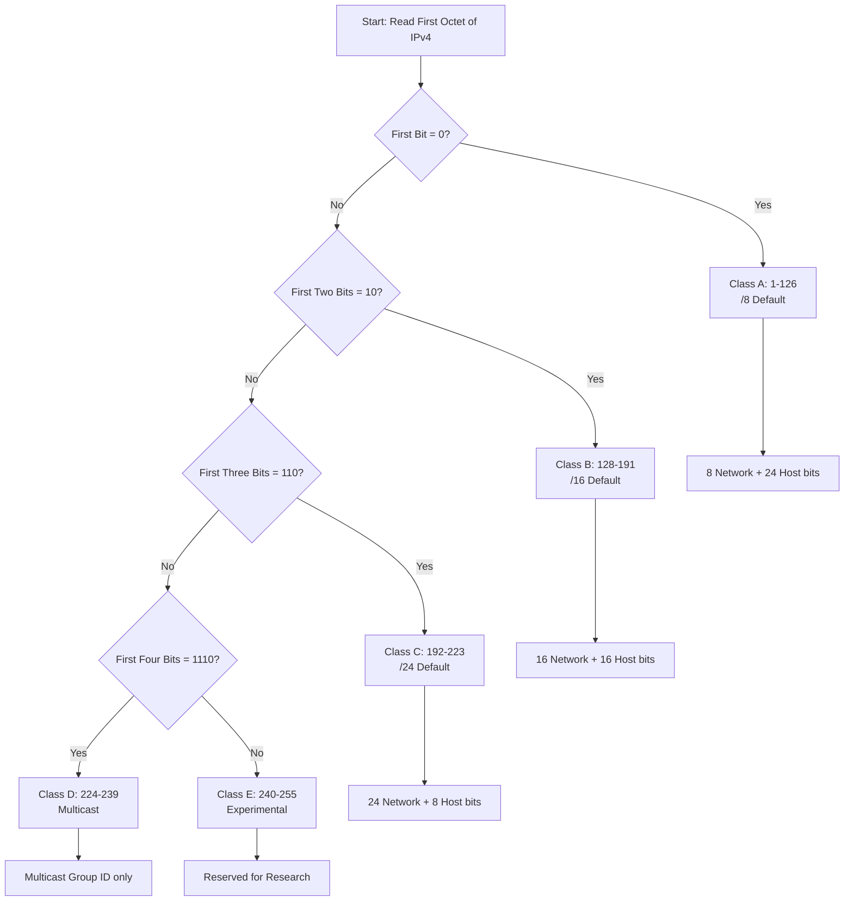
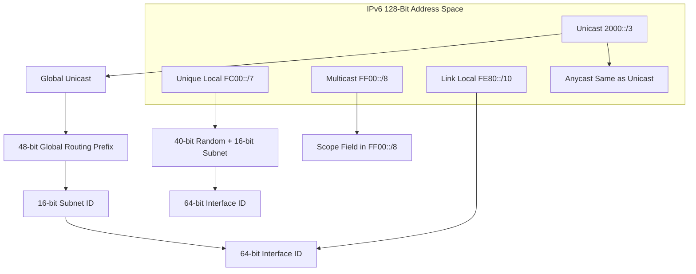
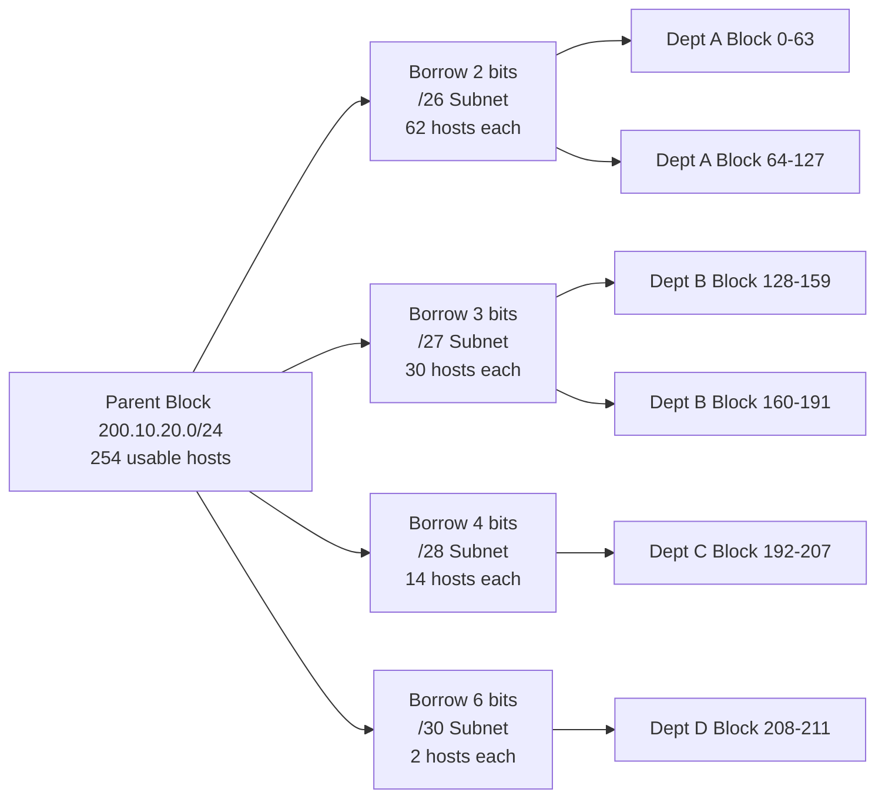

# Logical Addressing- IPv4 and IPv6 Addresses

<!-- SECTION_1_START -->
# 1. Core Technical Definition & Intuitive Overview

## 1.1 What is Logical Addressing?

In the **OSI Reference Model**, the **Network Layer (Layer 3)** is responsible for host-to-host delivery of packets across multiple interconnected networks. To accomplish this universal delivery, every device connected to an IP-based internetwork (such as the Internet) must possess a **unique logical identifier** known as an **IP Address**.

> [!NOTE]
> **Formal KTU 2024 Definition:**
> *Logical Addressing* is the mechanism of assigning a **32-bit (IPv4)** or **128-bit (IPv6)** unique, hierarchical, software-configurable address to a network interface, enabling end-to-end packet routing across heterogeneous physical networks without depending on the underlying hardware (MAC) addresses.

Unlike a **Physical (MAC) Address** — which is flat, hard-burned into the Network Interface Card (NIC) by the manufacturer, and limited to a single Local Area Network (LAN) — a *logical address* is:
- **Hierarchical** (organized into Network-Prefix + Host-Suffix)
- **Routable** across autonomous systems
- **Configurable** by the operating system (DHCP / Static)
- **Topologically significant** (changes with location)

## 1.2 The Postal Address Analogy ✉️

Imagine sending a parcel across the world:

| Postal Analogy | Network Layer Equivalent |
|---|---|
| Country + State + City + Pincode | **Network Prefix** (routing prefix) |
| Street + House Number + Flat | **Host Identifier** (interface ID) |
| Local Postman (knows your street) | **Layer 2 Switch / Router within LAN** |
| International Hub (knows countries) | **Inter-AS Border Router** |

> [!IMPORTANT]
> Just as a pincode lets a sorting hub forward the parcel to the *correct local post office* (network), the **Network Prefix** of an IP address lets a router forward the packet to the *correct subnet*, where local ARP/MAC mechanisms take over for the last-mile delivery.

## 1.3 IPv4 — The 32-Bit Workhorse

**Internet Protocol version 4 (IPv4)** uses a **32-bit address**, providing $2^{32} = \mathbf{4,294,967,296}$ unique addresses. It is written in **dotted-decimal notation**: four decimal octets (0–255) separated by dots.

$$\text{Example: } 192.168.10.45$$

$$\text{Binary form: } 11000000.10101000.00001010.00101101$$

## 1.4 IPv6 — The 128-Bit Successor

**Internet Protocol version 6 (IPv6)** uses a **128-bit address**, providing $2^{128} \approx \mathbf{3.4 \times 10^{38}}$ unique addresses — sufficient to assign trillions of addresses to every grain of sand on Earth. It is written in **colon-hexadecimal notation**: eight groups of 16-bit hexadecimal quartets separated by colons.

$$\text{Example: } 2001:0db8:85a3:0000:0000:8a2e:0370:7334$$

> [!WARNING]
> IPv4 address exhaustion was officially declared by IANA on **3 February 2011** (the last /8 blocks were allocated to RIRs). IPv6 was designed as the long-term remedy, offering a vastly larger address pool and built-in features (IPsec, no broadcast, simplified header).

> [!VISUALIZATION CONTROL]
> **Concept:** Visualizing the bit-length difference between IPv4 and IPv6 address space
> **GeoGebra / Desmos Input Equations:**
> * $f(x) = 2^{x}$ with points at $x = 32$ and $x = 128$
> * Plot on a logarithmic Y-axis to observe the scale
> **Visual Description:** The student should see a near-vertical jump from the IPv4 dot to the IPv6 dot on the Y-axis, illustrating that the IPv6 space is $\mathbf{7.9 \times 10^{28}}$ times larger than IPv4.
<!-- SECTION_1_END -->

<!-- SECTION_2_START -->
# 2. Deep Theoretical Analysis & KTU High-Yield Formula Sheet

## 2.1 IPv4 Address Architecture

### 2.1.1 Classful Addressing (Pre-CIDR Era)

The first IPv4 scheme divided the 32-bit space into **five fixed classes** based on the value of the leading bits (the *class identifier*). Each class has a fixed boundary between the *Network ID* and the *Host ID*.

- **Class A** — Leading bit: `0`
  - Range: $1.0.0.0 \longrightarrow 126.255.255.255$
  - Default Mask: $\mathbf{/8}$ (255.0.0.0)
  - Network bits: **8**, Host bits: **24**
- **Class B** — Leading bits: `10`
  - Range: $128.0.0.0 \longrightarrow 191.255.255.255$
  - Default Mask: $\mathbf{/16}$ (255.255.0.0)
  - Network bits: **16**, Host bits: **16**
- **Class C** — Leading bits: `110`
  - Range: $192.0.0.0 \longrightarrow 223.255.255.255$
  - Default Mask: $\mathbf{/24}$ (255.255.255.0)
  - Network bits: **24**, Host bits: **8**
- **Class D** — Leading bits: `1110` — Reserved for **Multicast** (224.0.0.0 – 239.255.255.255)
- **Class E** — Leading bits: `1111` — Reserved for **Research/Experimental** (240.0.0.0 – 255.255.255.255)

> [!NOTE]
> **Special Reserved IPv4 Blocks** (must be memorised for KTU exams):
> * $0.0.0.0/8$ — "This host" (Source address during DHCP request)
> * $127.0.0.0/8$ — **Loopback** (localhost, never routed)
> * $169.254.0.0/16$ — **Link-Local** (APIPA — Automatic Private IP Addressing)
> * $10.0.0.0/8$, $172.16.0.0/12$, $192.168.0.0/16$ — **Private (RFC 1918)** addresses
> * $255.255.255.255$ — **Limited Broadcast**

### 2.1.2 Classless Addressing — CIDR & VLSM

Modern networks no longer use rigid classes. Two techniques dominate:

1. **CIDR (Classless Inter-Domain Routing)** — Replaces classful masks with a *variable-length prefix*. The notation is **`<IP>/<prefix-length>`**, e.g., `200.50.10.5/28` means the first 28 bits identify the network.
2. **VLSM (Variable Length Subnet Masking)** — Allows a network administrator to recursively subnet an address block into unequal-sized subnets, maximising address utilisation.

### 2.1.3 The Subnet Mask

The **Subnet Mask** is a 32-bit pattern of `1`s followed by `0`s that tells the router *which bits belong to the network and which bits belong to the host*. The bitwise **AND** of the IP address and the mask yields the **Network Address**.

$$\text{Network Address} = \text{IP Address} \;\mathbf{AND}\; \text{Subnet Mask}$$

## 2.2 The KTU High-Yield Formula Sheet

> [!IMPORTANT]
> Memorise this table. Every KTU subnetting problem expects you to compute these values. When writing masks inside prose, use `\vert` (e.g., `/24`) to avoid breaking markdown.

| # | Quantity | Formula | Constraint |
|---|---|---|---|
| 1 | Total addresses in a block | $2^{(32-n)}$ | where $n$ = prefix length |
| 2 | Usable host addresses per subnet | $2^{h} - 2$ | where $h$ = host bits; minus 1 for **Network ID**, 1 for **Directed Broadcast** |
| 3 | Number of equal subnets from a parent block | $2^{b}$ | where $b$ = *borrowed* bits |
| 4 | New prefix length after borrowing $b$ bits | $n + b$ | $n$ = original prefix |
| 5 | Subnet increment (block size) | $2^{h}$ | First network starts at multiple of this in the 3rd/4th octet |
| 6 | Total IPv4 space | $2^{32} = 4{,}294{,}967{,}296$ | — |
| 7 | Total IPv6 space | $2^{128}$ | $3.4 \times 10^{38}$ addresses |
| 8 | Subnets per Class B (default) | $2^{b}$ (borrowing from host) | — |
| 9 | Hosts per Class C (default /24) | $2^{8} - 2 = 254$ | — |
| 10 | IPv6 shorthand omitted zeros | Replace one *contiguous* run of all-zero groups with `::` | Only **once** per address |

## 2.3 IPv6 Address Architecture

### 2.3.1 Structure

A 128-bit IPv6 address is divided into two logical halves:
- **First 64 bits — Subnet Prefix (Routing Prefix)** — Used by routers for forwarding.
- **Last 64 bits — Interface Identifier (IID)** — Identifies the host interface (derived from MAC via **EUI-64**, or randomly generated in modern OSes for privacy).

$$\underbrace{\text{Global Routing Prefix (48 bits)}}_{\text{Assigned by ISP / RIR}}\;\vert\;\underbrace{\text{Subnet ID (16 bits)}}_{\text{Assigned by admin}}\;\vert\;\underbrace{\text{Interface ID (64 bits)}}_{\text{Per-host unique}}$$

### 2.3.2 Representation Rules

1. Eight groups of **four hexadecimal digits**, separated by colons.
2. **Leading zeros** in any group may be omitted: `0db8` → `db8`.
3. One single *contiguous run* of all-zero 16-bit groups may be replaced by `::` (zero-compression). It may appear **only once** to avoid ambiguity.
4. The `::` may represent one or multiple zero groups.

> [!NOTE]
> **Worked representation of `2001:0db8:0000:0000:0000:ff00:0042:8329`:**
> * Remove leading zeros → `2001:db8:0:0:0:ff00:42:8329`
> * Compress zeros → `2001:db8::ff00:42:8329`

### 2.3.3 IPv6 Address Types (Must Know for KTU)

| Type | Prefix | Scope | Use Case |
|---|---|---|---|
| **Unicast (Global)** | `2000::/3` | Global | Public routable addresses (Internet) |
| **Link-Local** | `fe80::/10` | Single Link | Auto-configured, never routed |
| **Unique Local (ULA)** | `fc00::/7` | Site | Private, equivalent to RFC 1918 |
| **Multicast** | `ff00::/8` | Varies | One-to-many delivery (replaces IPv4 broadcast) |
| **Anycast** | Same as unicast syntax | Nearest | One-to-nearest (DNS root servers, CDNs) |

> [!IMPORTANT]
> In IPv6, **there is no broadcast**. The functionality is replaced by **multicast** to the all-nodes group `ff02::1`.

## 2.4 Real-World Engineering Utility

- **Routing Efficiency:** Hierarchical prefix aggregation (CIDR) shrinks the global routing table from a potential **4 billion** flat entries to under **1 million** in 2024.
- **ISP Address Planning:** ISPs receive `/20` blocks from RIRs (e.g., APNIC) and subdivide them via VLSM for customers.
- **IoT / Mobile (5G):** IPv6's vast address space enables per-device global addressing for billions of sensors.
- **Cloud VPCs:** AWS, Azure, and GCP assign dual-stack IPv4/IPv6 subnets to Virtual Private Clouds.
- **Transition Mechanisms:** Dual-stack, **6to4 tunnels**, **Teredo**, and **NAT64/DNS64** bridge legacy IPv4 networks to IPv6.
<!-- SECTION_2_END -->

<!-- SECTION_3_START -->
# 3. Step-by-Step Derivations & Code/Symbolic Implementation

## 3.1 Derivation: Extracting the Network ID (IPv4)

**Problem:** Given IP = `192.168.45.130/26`, find the **Network Address**, **First Host**, **Last Host**, **Broadcast Address**, and **Total Usable Hosts**.

### Step 1 — Convert the IP to Binary

$$\text{IP} = 192.168.45.130$$

$$
\begin{aligned}
192 &= 11000000 \\
168 &= 10101000 \\
45 &= 00101101 \\
130 &= 10000010
\end{aligned}
$$

### Step 2 — Construct the Subnet Mask for /26

A `/26` mask has **26 leading `1`s**, so the mask is:

$$
\begin{aligned}
\text{Mask} &= 11111111.11111111.11111111.11000000 \\
&= 255.255.255.192
\end{aligned}
$$

### Step 3 — Compute the Network Address (Bitwise AND)

Apply the mask to the IP, bit by bit:

$$
\begin{aligned}
11000000 \;.\; 10101000 \;.\; 00101101 \;.\; 10000010 \\
\text{AND} \\
11111111 \;.\; 11111111 \;.\; 11111111 \;.\; 11000000 \\
\hline
11000000 \;.\; 10101000 \;.\; 00101101 \;.\; 10000000 \\
= 192.168.45.128
\end{aligned}
$$

> **Logic Note:** All host bits are forced to `0`; all network bits are preserved. This yields the *Network (Subnet) Address*.

### Step 4 — Compute the Subnet Block Size

$$
\begin{aligned}
h &= 32 - 26 = 6 \text{ host bits remaining} \\
\text{Block Size} &= 2^{h} = 2^{6} = 64
\end{aligned}
$$

So the subnets in the 4th octet increment by 64: `0, 64, 128, 192`. The IP `130` falls inside the **128 – 191** block, confirming our network `192.168.45.128`.

### Step 5 — Compute Special Addresses

$$
\begin{aligned}
\text{Network Address} &= 192.168.45.128 \\
\text{First Usable Host} &= 192.168.45.129 \\
\text{Last Usable Host} &= 192.168.45.190 \\
\text{Broadcast Address} &= 192.168.45.191 \\
\text{Usable Hosts} &= 2^{6} - 2 = 62
\end{aligned}
$$

---

## 3.2 Derivation: VLSM — Subnetting a Class C Block

**Problem:** An organisation is assigned `200.10.20.0/24`. It has 4 departments requiring **60, 28, 14, and 2** hosts respectively. Design the VLSM scheme.

### Step 1 — Sort Departments in Descending Order of Host Requirement

| Dept | Required Hosts | Bits Needed | /Prefix | Block Size |
|---|---|---|---|---|
| A | 60 | $2^{6}-2 = 62 \geq 60$ | /26 | 64 |
| B | 28 | $2^{5}-2 = 30 \geq 28$ | /27 | 32 |
| C | 14 | $2^{4}-2 = 14 \geq 14$ | /28 | 16 |
| D | 2 | $2^{2}-2 = 2 \geq 2$ | /30 | 4 |

### Step 2 — Assign Subnet Ranges Sequentially

$$
\begin{aligned}
\text{Dept A:} &\quad 200.10.20.0/26 &\rightarrow&\quad \text{Range: } 0 \text{ to } 63 \\
\text{Dept B:} &\quad 200.10.20.64/27 &\rightarrow&\quad \text{Range: } 64 \text{ to } 95 \\
\text{Dept C:} &\quad 200.10.20.96/28 &\rightarrow&\quad \text{Range: } 96 \text{ to } 111 \\
\text{Dept D:} &\quad 200.10.20.112/30 &\rightarrow&\quad \text{Range: } 112 \text{ to } 115 \\
\text{Reserved:} &\quad 200.10.20.116 \text{ to } 200.10.20.255
\end{aligned}
$$

> **Logic Note:** This greedy largest-first allocation prevents fragmentation of address space. The remaining 140 addresses (116–255) act as a *reserve pool* for future expansion.

---

## 3.3 Derivation: IPv6 Representation Simplification

**Given:** `fe80:0000:0000:0000:0202:b3ff:fe1e:8329`

**Step 1** — Remove leading zeros from each group:

$$\text{fe80:0:0:0:202:b3ff:fe1e:8329}$$

**Step 2** — Identify the longest run of all-zero groups: here, three consecutive `0`s at positions 2–4.

**Step 3** — Replace that run with `::`:

$$\boxed{\text{fe80::202:b3ff:fe1e:8329}}$$

> [!WARNING]
> **You may compress only ONE run** of zero groups. If you wrote `fe80::202::8329`, the parser would be unable to determine how many zeros each `::` represents.

---

## 3.4 Python Implementation: IP Subnet Calculator

A complete, error-handled Python implementation that solves every KTU subnetting problem type:

```python
import ipaddress
import logging

logging.basicConfig(level=logging.INFO, format="%(levelname)s | %(message)s")

def subnet_calculator(ip_with_prefix: str) -> None:
    """
    Computes all KTU-relevant fields for a given IPv4 or IPv6 CIDR block.
    """
    try:
        # ipaddress handles both IPv4 and IPv6 seamlessly
        net = ipaddress.ip_network(ip_with_prefix, strict=False)

        logging.info(f"Address Family: {'IPv4' if net.version == 4 else 'IPv6'}")
        logging.info(f"Network Address: {net.network_address}")
        logging.info(f"Broadcast Address: {net.broadcast_address}")
        logging.info(f"Prefix Length: /{net.prefixlen}")
        logging.info(f"Total Addresses in Block: {net.num_addresses}")
        logging.info(f"Usable Hosts: {net.num_addresses - 2 if net.version == 4 else net.num_addresses}")
        logging.info(f"Subnet Mask: {net.netmask}")
        logging.info(f"First Usable Host: {net.network_address + (0 if net.version == 6 else 1)}")
        logging.info(f"Last Usable Host: {net.broadcast_address - (0 if net.version == 6 else 1)}")

    except ValueError as ve:
        logging.error(f"Invalid IP/CIDR input: {ve}")
    except Exception as e:
        logging.error(f"Unexpected error: {e}")


# --- KTU Sample Test Cases ---
if __name__ == "__main__":
    # IPv4 test
    subnet_calculator("192.168.45.130/26")

    # IPv6 test
    subnet_calculator("2001:db8::/64")
```

**Sample Output (IPv4 case):**

```
INFO | Address Family: IPv4
INFO | Network Address: 192.168.45.128
INFO | Broadcast Address: 192.168.45.191
INFO | Prefix Length: /26
INFO | Total Addresses in Block: 64
INFO | Usable Hosts: 62
INFO | Subnet Mask: 255.255.255.192
INFO | First Usable Host: 192.168.45.129
INFO | Last Usable Host: 192.168.45.190
```
<!-- SECTION_3_END -->

<!-- SECTION_4_START -->
# 4. Structural Diagrams & Schematics

## 4.1 Mermaid Diagram — IPv4 Address Classification Flowchart



## 4.2 Mermaid Diagram — IPv6 Address Type Hierarchy



## 4.3 Mermaid Diagram — Subnetting Process (CIDR Block Decomposition)



## 4.4 Sequential Topology — Header Comparison Matrix

Since IPv4 and IPv6 headers differ structurally, this comparison matrix maps the field-level interactions for engineering reference:

| Feature | IPv4 Header | IPv6 Header |
|---|---|---|
| Header Size | Variable (20–60 bytes) | **Fixed 40 bytes** |
| Address Length | 32 bits | 128 bits |
| Header Checksum | Yes (recomputed at every hop) | **Removed** (reduces router load) |
| Fragmentation | Routers + Sender | **Sender only** (Path MTU Discovery) |
| Options / Extension | In header | **Separate Extension Headers** |
| Broadcast | Yes | **Replaced by Multicast** |
| IPsec Support | Optional | **Mandatory (built-in)** |
| Flow Label | Absent | **Present (QoS)** |
| Hop Limit Field | TTL (8 bits) | Hop Limit (8 bits) |
<!-- SECTION_4_END -->

<!-- SECTION_5_START -->
# 5. KTU 2024 Scheme Examination Question Bank & Topic Recap

## 5.1 Part A — Short Answer Questions (2 × 3 = 6 Marks)

### **Q1. Define Logical Addressing. Differentiate between a Physical (MAC) address and a Logical (IP) address.** `[KTU University Exam — July 2023]` — **CO1, Remember**

**Model Answer:**

*Logical Addressing* is a Network Layer (Layer 3) addressing scheme that assigns a unique, software-configurable, hierarchical IP address to each host interface, enabling end-to-end packet routing across interconnected networks.

| Parameter | Physical (MAC) Address | Logical (IP) Address |
|---|---|---|
| OSI Layer | Layer 2 (Data Link) | Layer 3 (Network) |
| Size | 48 bits | 32 bits (IPv4) / 128 bits (IPv6) |
| Format | Hexadecimal (e.g., `00:1A:2B:3C:4D:5E`) | Dotted-decimal / Colon-hex |
| Assignment | Hard-burned by manufacturer | Configured by OS / DHCP |
| Scope | Single LAN (flat) | Global, routable (hierarchical) |
| Uniqueness | Globally unique per NIC | Unique per interface in a logical subnet |

> **Valuation Key:** Definition = 1 Mark; Any 4 correct differences = 2 Marks.

---

### **Q2. List and briefly explain the five classes of IPv4 addressing with their default subnet masks.** `[KTU University Exam — Dec 2022]` — **CO1, Remember**

**Model Answer:**

| Class | Leading Bits | First Octet Range | Default Mask | Purpose |
|---|---|---|---|---|
| A | `0` | 1 – 126 | /8 (255.0.0.0) | Very large networks |
| B | `10` | 128 – 191 | /16 (255.255.0.0) | Medium networks |
| C | `110` | 192 – 223 | /24 (255.255.255.0) | Small networks |
| D | `1110` | 224 – 239 | — | Multicasting |
| E | `1111` | 240 – 255 | — | Experimental/Reserved |

> **Valuation Key:** Correct table population = 2 Marks; Identifying Class D & E purposes = 1 Mark.

---

## 5.2 Part B — Long Answer Questions (Internal Choice: A or B)

### **Question A (14 Marks)**

**(a) Explain the IPv4 classless addressing scheme. Given the IP block `200.50.10.0/26`, calculate the network address, broadcast address, first and last usable host, total addresses, and usable hosts. (7 Marks)** — **CO2, Understand**
**(b) What is VLSM? Subnet the block `180.20.0.0/16` into four subnets of sizes 1000, 500, 200, and 100 hosts. Show the complete address range for each. (7 Marks)** — **CO3, Apply**

#### Model Solution — Part (a)

**Concept (2 Marks):** Classless addressing discards fixed class boundaries. The prefix length (e.g., `/26`) explicitly defines the network portion. CIDR allows efficient aggregation and flexible subnet sizes.

**Calculation for `200.50.10.0/26` (5 Marks):**

- Prefix length $n = 26$, so host bits $h = 32 - 26 = 6$.
- Block size $= 2^{h} = 2^{6} = 64$.

$$
\begin{aligned}
\text{Network Address} &= 200.50.10.0 \\
\text{First Usable Host} &= 200.50.10.1 \\
\text{Last Usable Host} &= 200.50.10.62 \\
\text{Broadcast Address} &= 200.50.10.63 \\
\text{Total Addresses} &= 64 \\
\text{Usable Hosts} &= 64 - 2 = 62
\end{aligned}
$$

> **Valuation Key:** Concept clarity = 2 Marks; All five numeric values = 1 Mark each.

---

#### Model Solution — Part (b)

**Concept (2 Marks):** *VLSM (Variable Length Subnet Masking)* allows a network administrator to divide a parent block into subnets of *unequal sizes*, optimising address utilisation by allocating blocks precisely matching the host requirement of each department.

**Subnetting Plan (5 Marks):** Sort in descending order: 1000, 500, 200, 100.

| Dept | Hosts Needed | $2^{h}-2 \geq$ Needed | Bits Borrowed | New Prefix | Subnet |
|---|---|---|---|---|---|
| A | 1000 | $2^{10}-2 = 1022$ | 6 bits | /22 | 180.20.0.0/22 |
| B | 500 | $2^{9}-2 = 510$ | 7 bits | /23 | 180.20.4.0/23 |
| C | 200 | $2^{8}-2 = 254$ | 8 bits | /24 | 180.20.6.0/24 |
| D | 100 | $2^{7}-2 = 126$ | 9 bits | /25 | 180.20.7.0/25 |

**Address Ranges (block sizes: 1024, 512, 256, 128):**

$$
\begin{aligned}
\text{A: } & 180.20.0.0 \rightarrow 180.20.3.255 \\
\text{B: } & 180.20.4.0 \rightarrow 180.20.5.255 \\
\text{C: } & 180.20.6.0 \rightarrow 180.20.6.255 \\
\text{D: } & 180.20.7.0 \rightarrow 180.20.7.127
\end{aligned}
$$

> **Valuation Key:** Concept = 2 Marks; Sorted descending = 1 Mark; All four ranges correctly = 4 Marks.

---

### **Question B (14 Marks)** — *Alternative Choice*

**(a) Describe the IPv4 datagram header with a neat diagram and explain the function of each field. (7 Marks)** — **CO2, Understand**
**(b) Explain the IPv6 address format. Write the shortened form of `2001:0db8:0000:0000:0abc:0000:0000:def0` and identify its address type. (7 Marks)** — **CO3, Apply**

#### Model Solution — Part (a)

**Diagram (3 Marks):**

```
+--+--+--+--+--+--+--+--+--+--+--+--+--+--+--+--+--+--+--+--+--+--+--+--+--+--+--+--+--+--+--+--+
|Version|  IHL  |    DSCP   |ECN|         Total Length                  |
+--+--+--+--+--+--+--+--+--+--+--+--+--+--+--+--+--+--+--+--+--+--+--+--+--+--+--+--+--+--+--+--+
|         Identification            |Flags|     Fragment Offset         |
+--+--+--+--+--+--+--+--+--+--+--+--+--+--+--+--+--+--+--+--+--+--+--+--+--+--+--+--+--+--+--+--+
|        TTL       |   Protocol     |     Header Checksum                  |
+--+--+--+--+--+--+--+--+--+--+--+--+--+--+--+--+--+--+--+--+--+--+--+--+--+--+--+--+--+--+--+--+
|                          Source IP Address (32 bits)                    |
+--+--+--+--+--+--+--+--+--+--+--+--+--+--+--+--+--+--+--+--+--+--+--+--+--+--+--+--+--+--+--+--+
|                       Destination IP Address (32 bits)                  |
+--+--+--+--+--+--+--+--+--+--+--+--+--+--+--+--+--+--+--+--+--+--+--+--+--+--+--+--+--+--+--+--+
|                  Options (if any, 0-40 bytes)         |    Padding      |
+--+--+--+--+--+--+--+--+--+--+--+--+--+--+--+--+--+--+--+--+--+--+--+--+--+--+--+--+--+--+--+--+
```

**Field Functions (4 Marks):**

| Field | Size | Function |
|---|---|---|
| Version | 4 bits | Always `4` for IPv4 (synchronization) |
| IHL | 4 bits | Header Length in 32-bit words (min 5, max 15) |
| DSCP/ECN | 8 bits | QoS / Congestion Notification |
| Total Length | 16 bits | Entire datagram size in bytes (max 65,535) |
| Identification | 16 bits | Reassembles fragmented packets |
| Flags + Fragment Offset | 16 bits | Controls fragmentation |
| TTL | 8 bits | Decremented each hop; packet dropped at 0 (prevents loops) |
| Protocol | 8 bits | Next-level protocol (6=TCP, 17=UDP, 1=ICMP) |
| Header Checksum | 16 bits | Error detection on header only |
| Source / Destination IP | 64 bits total | Logical addressing fields |
| Options | Variable | Security, record-route, timestamp |

---

#### Model Solution — Part (b)

**IPv6 Address Format (3 Marks):**

A 128-bit IPv6 address is composed of **eight 16-bit groups** written in hexadecimal and separated by colons. The address is conceptually divided into:

$$
\underbrace{\text{48-bit Global Routing Prefix}}_{\text{Assigned by ISP}}\;+\;\underbrace{\text{16-bit Subnet ID}}_{\text{Assigned by admin}}\;+\;\underbrace{\text{64-bit Interface ID}}_{\text{Per-host unique}}
$$

**Shortening the Given Address (3 Marks):**

**Given:** `2001:0db8:0000:0000:0abc:0000:0000:def0`

**Step 1:** Remove leading zeros from each group.

$$\text{2001:db8:0:0:abc:0:0:def0}$$

**Step 2:** Identify the longest contiguous run of zero groups — there are *two* runs of two zeros each. We can only compress one (preferably the longer or first occurrence). The first run (positions 3–4 in the original) is replaced by `::`.

$$\boxed{\text{2001:db8::abc:0:0:def0}}$$

**Step 3 (1 Mark):** Address Type Identification.

The prefix `2001:db8::/32` is officially reserved by IANA (RFC 3849) for **documentation and examples**. The address falls under the **Global Unicast** category (`2000::/3`).

> **Valuation Key:** Format explanation with diagram = 3 Marks; Step 1 + Step 2 = 2 Marks; Step 3 = 1 Mark; Neat working = 1 Mark.

---

> [!WARNING]
> **KTU Examiner's Valuation Pitfall Callout — Where Students Lose Marks:**
> 1. **Forgetting to subtract 2 from $2^{h}$** for Network and Broadcast addresses. Always write the formula $2^{h} - 2$ explicitly.
> 2. **Wrong bit-borrowing in VLSM** — Students often borrow *sequentially* instead of *descending by host count*. Always sort requirements largest-to-smallest first.
> 3. **Compressing multiple zero runs with `::`** — Only ONE `::` is permitted per address. Using two will yield zero marks.
> 4. **Confusing /24 with default class C** in subnetting problems. The `/24` is a *prefix*, not a *class*.
> 5. **Writing IPv4 header fields from memory** — Forgetting that the Checksum covers *only* the header (not payload) is a common 1-mark loss.

---

## 5.3 Topic Recap & Important Things to Remember

> [!IMPORTANT]
> **High-Density Rapid-Revision Checklist**

- **Logical Addressing** = Layer 3, software-configurable, hierarchical, unique per interface.
- **IPv4 = 32 bits**; Dotted-decimal; **$2^{32}$ total** addresses.
- **IPv6 = 128 bits**; Colon-hex; **$2^{128}$ total** addresses.
- **Five IPv4 Classes:** A (`/8`), B (`/16`), C (`/24`), D (Multicast), E (Experimental).
- **CIDR** = Classless Inter-Domain Routing; uses `<IP>/<prefix>` notation.
- **VLSM** = Variable Length Subnet Masking; allows unequal subnets; always sort host requirements **descending** first.
- **Subnet Mask Rule:** All `1`s (network) followed by all `0`s (host) — no interleaving.
- **Network Address = IP AND Mask** (host bits forced to `0`).
- **Broadcast Address** = all host bits set to `1`.
- **Usable Hosts = $2^{h} - 2$** (where $h$ = host bits).
- **Block Size = $2^{h}$** (subnet increment).
- **Special IPv4 Blocks:** `127.0.0.0/8` (loopback), `169.254.0.0/16` (link-local), `10/8`, `172.16/12`, `192.168/16` (private).
- **IPv6 Structure:** 48-bit Global Prefix + 16-bit Subnet ID + 64-bit Interface ID.
- **IPv6 Representation:** Eight groups of 4 hex digits; **leading zeros omitted**; **one** contiguous all-zero run compressed as `::`.
- **IPv6 Has No Broadcast** — Multicast (`ff02::1`) replaces it.
- **Link-Local IPv6** is auto-assigned from `fe80::/10` (never routed).
- **EUI-64** derives the 64-bit IID from a 48-bit MAC by inserting `ff:fe` in the middle and flipping bit 6 of the first byte.
- **Key Header Differences:** IPv6 = fixed 40 bytes, no checksum, no fragmentation by routers, mandatory IPsec, Flow Label for QoS.
- **Transition Tools:** Dual-stack, 6to4, Teredo, NAT64/DNS64.
- **Exam Tip:** Always show: prefix → host bits → block size → range formula → answer in dotted-decimal.
<!-- SECTION_5_END -->
