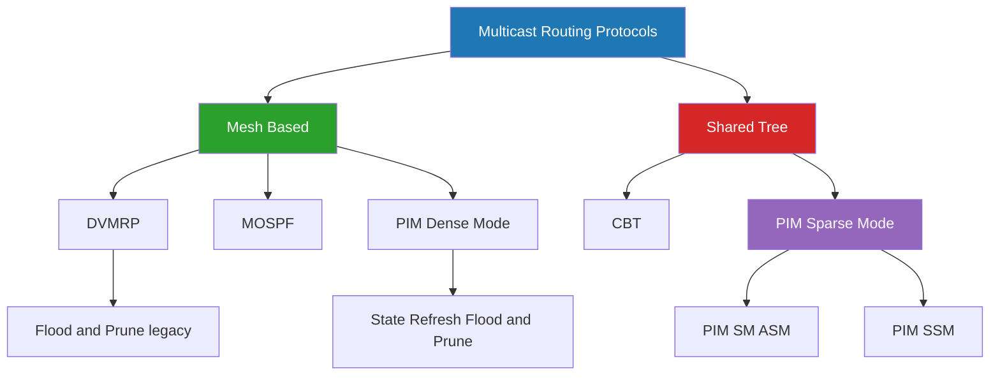
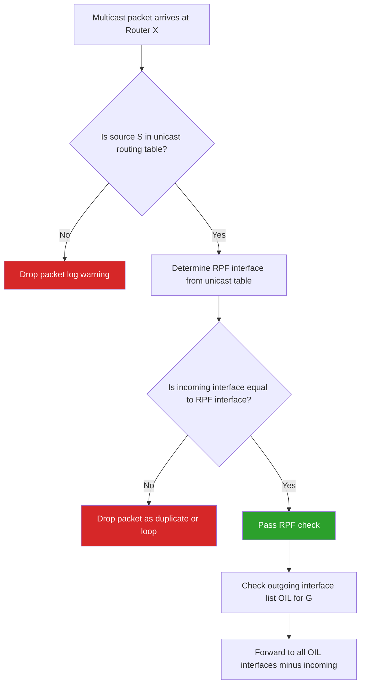
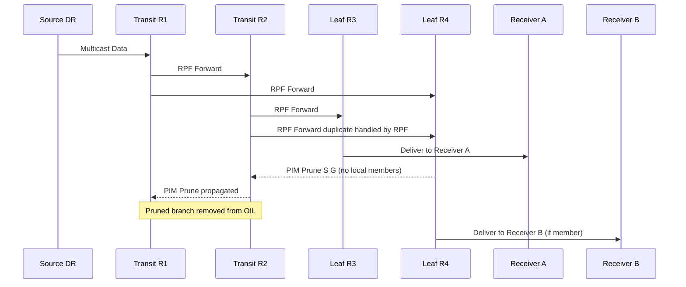
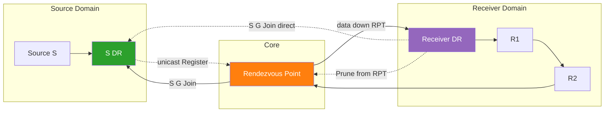
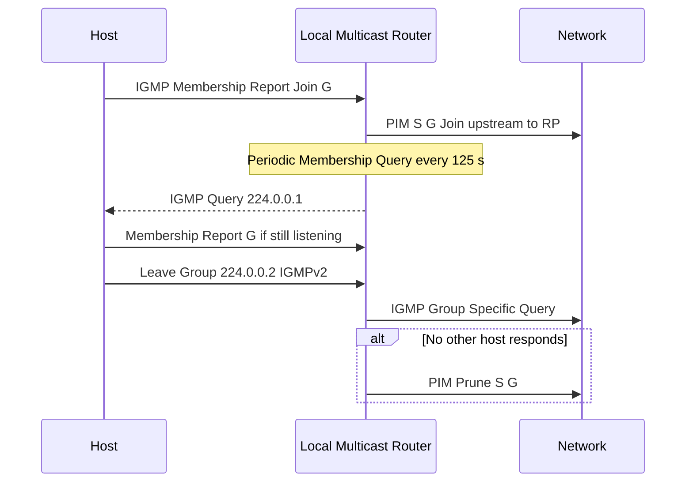
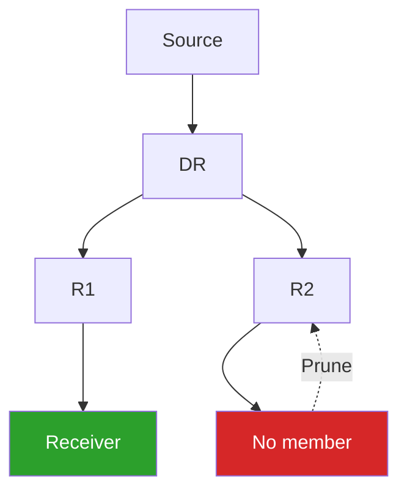
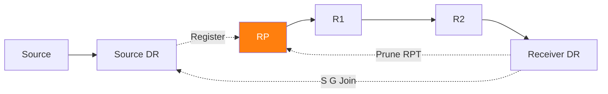

# Multicast Routing Protocols.

<!-- SECTION_1_START -->

# Multicast Routing Protocols

> [!IMPORTANT]
> **KTU 2024 Scheme | OECST724 | Module 3 | Network Layer**
> This topic is a high-weight, board-favorite area. KTU examiners consistently ask for classifications, comparison tables, and protocol-specific algorithms (especially DVMRP and PIM).

## 1.1 Formal Academic Definition

**Multicast Routing** is the set of network-layer techniques used to deliver a single copy of a data packet from **one source** (or multiple sources) to **a defined group of receivers** that have explicitly expressed interest in receiving the traffic, using the most efficient delivery tree that the underlying network topology can support.

Unlike **unicast** (one-to-one) and **broadcast** (one-to-all), multicast is a **one-to-many** (or many-to-many) communication paradigm. In IPv4, the address range **224.0.0.0 – 239.255.255.255** (the Class D block) is reserved for multicast group identification. IPv6 uses the prefix `FF00::/8`.

$$\text{Multicast Group} = \{ \text{Receiver}_1, \text{Receiver}_2, \ldots, \text{Receiver}_n \}, \quad n \geq 1$$

## 1.2 Intuition: Real-World Analogy

> [!NOTE]
> **Analogy – The YouTube Premiere Model**
> Imagine a popular YouTuber hosting a live premiere. Instead of recording a separate DVD for every viewer and courier-delivering it (which is **unicast**), the YouTuber broadcasts from a single satellite uplink. Every interested viewer tunes into the same frequency and only one stream crosses each link of the satellite network. The satellite station acts as the **multicast router**, and the viewers (who subscribed) are the **multicast group members**. The path from the satellite to the viewers forms a **distribution tree**.

A second analogy: think of a **classroom notice board**. The teacher (source) puts up one notice. Students (group members) who want to read it gather around the board. The notice is **not** photocopied and delivered to every student individually; it stays on the board, and only interested students come to read it. The board-to-students structure is the **shared distribution tree**.

## 1.3 Why Multicast? Quantitative Justification

For a source sending the same 1 MB file to *n* receivers:

| Approach | Total Bandwidth Used | Server Load | Suitable For |
|----------|----------------------|-------------|--------------|
| Unicast (n copies) | $n \times 1\text{ MB}$ | $n \times$ CPU | Few receivers |
| Broadcast | $1 \times 1\text{ MB}$ but to all | $1\times$ CPU | LAN only, wastes bandwidth on uninterested hosts |
| **Multicast** | $1 \times 1\text{ MB}$ per branch | $1\times$ CPU | **Efficient, scalable** |

> [!IMPORTANT]
> **Key Benefit Equation:**
> Bandwidth Savings $= 1 - \dfrac{1}{n}$ for a fully subscribed, tree-based delivery.

## 1.4 Conceptual Foundation – The Multicast Service Model

The Internet multicast model is **best-effort**, identical in philosophy to unicast IP. Three semantic variants exist:

1. **One-to-Many** – A single source to a group (e.g., IPTV).
2. **Many-to-Many** – Any group member can send; all others receive.
3. **Many-to-One** – Multiple sources to a single group (e.g., stock-ticker feeds).

> [!VISUALIZATION CONTROL]
> **Concept:** Shared vs Source-Based Multicast Distribution Tree
> **GeoGebra / Desmos Input Equations:**
> * `Circle((0,0), 3)` representing the network graph
> * `Point((0,4))` representing the source `S`
> * `Point((2,-2))` and `Point((-2,-2))` and `Point((0,-4))` representing receivers `R1, R2, R3`
> **Visual Description:** Sketch a Steiner-tree-like branching structure with `S` at the top connected to a *core/rendezvous point*, from which three branches descend to each `Ri`. This visually represents a **shared tree (RP-based)**. Overlay a second tree with the source at the root and branches directly reaching each receiver to represent a **source-specific shortest-path tree**.

---

<!-- SECTION_1_END -->

<!-- SECTION_2_START -->

# 2. Deep Theoretical Analysis & KTU High-Yield Formula Sheet

## 2.1 The Multicast Routing Architecture (Layered View)

Multicast in the Internet is a **two-component system**:

$$\underbrace{\text{Group Management}}_{\text{Intra-LAN: IGMP}} \;\; + \;\; \underbrace{\text{Routing Protocol}}_{\text{Inter-router: DVMRP / PIM / CBT / MOSPF}}$$

### 2.1.1 IGMP – Internet Group Management Protocol (Host ⇄ Local Router)

IGMP operates **only between a host and its directly-attached (local) multicast router**. It is **not** a routing protocol. The router uses IGMP to learn which of its directly-connected LANs has *active listeners* for which group.

| IGMP Version | Key Feature | KTU Relevance |
|--------------|-------------|----------------|
| **IGMPv1** | Basic join/leave via timeout, no explicit leave | Historical, asked in 2-mark |
| **IGMPv2** | Explicit `Leave` message for fast leave | Most common 2-mark question |
| **IGMPv3** | Source-specific joins (SSM support) | Mentioned in PIM-SSM |

**Three IGMP Message Types (v2):**
1. **Membership Query** – Router → All Hosts (`224.0.0.1`): "Who is still listening?"
2. **Membership Report (Join)** – Host → Group Address: "I want to listen."
3. **Leave Group** – Host → All Routers (`224.0.0.2`): "I am leaving."

> [!NOTE]
> **The IGMP Snooping Optimization:** A Layer-2 switch normally floods multicast frames to all ports. With IGMP snooping, the switch examines IGMP messages and builds a *MAC-to-port* table, only forwarding multicast frames to ports that have joined. This is a frequent KTU short-answer topic.

### 2.1.2 Multicast Routing Protocols – Classification

$$\text{Multicast Routing} = \begin{cases} \text{Mesh-Based (Shortest Path)} \\ \text{Shared Tree (Center-Based)} \end{cases}$$

| Category | Examples | Tree Type | Scalability | State per Router |
|----------|----------|-----------|-------------|------------------|
| **Dense Mode (Push)** | DVMRP, MOSPF, PIM-DM | Source-based shortest path tree (SPT) | Poor for sparse groups | $O(S \times G)$ |
| **Sparse Mode (Pull)** | CBT, PIM-SM | Shared (center-based) tree | Excellent for sparse groups | $O(G)$ only |
| **Link-State** | MOSPF | SPT per source | Heavy database load | High |
| **Source-Specific** | PIM-SSM | One SPT per $(S,G)$ | Used in IPTV | Moderate |

Where $S$ = number of sources, $G$ = number of groups.

## 2.2 Reverse Path Forwarding (RPF) – The Foundation of Multicast Forwarding

RPF is **not** a routing protocol; it is a **forwarding algorithm** that prevents loops in multicast.

**RPF Check Algorithm (executed at every hop):**
1. Router receives multicast packet on interface $I_{in}$.
2. Router consults its **unicast routing table** to find the interface that points *back* to the source $S$ along the shortest unicast path. Call this $I_{RPF}$.
3. **If $I_{in} = I_{RPF}$**, the packet passes the RPF check and is forwarded to all downstream interfaces that have subscribers (Flood-and-Prune or PIM-Prune).
4. **If $I_{in} \neq I_{RPF}$**, the packet is silently dropped (it arrived from the wrong direction → potential loop or duplicate).

$$\text{Forward} = \begin{cases} \text{Yes}, & \text{if } I_{in} = \text{UnicastPath}(S) \\ \text{No (drop)}, & \text{otherwise} \end{cases}$$

> [!IMPORTANT]
> RPF is the **cornerstone** of every modern multicast forwarding mechanism. Every KTU question on DVMRP/PIM will have RPF in its answer key.

## 2.3 DVMRP – Distance Vector Multicast Routing Protocol

DVMRP (RFC 1075) was the **first widely deployed multicast protocol**, implemented in the original `mrouted` daemon of the MBone.

### 2.3.1 DVMRP Algorithm (Flood-and-Prune Cycle)

$$\text{DVMRP} = \text{RPF Flood} \rightarrow \text{Prune} \rightarrow \text{After Timeout} \rightarrow \text{Re-flood}$$

**Step-by-step execution:**
1. The source's first-hop router **floods** the multicast packet to *every* interface except the one leading back to the source (RPF-flooded).
2. A leaf router with **no group members** on its subnet sends a **Prune** message back up the tree.
3. Prunes propagate hop-by-hop; pruned branches are removed.
4. After a **soft-state timeout (~3 minutes)**, the prune state expires and flooding resumes.

### 2.3.2 DVMRP Limitations
- Periodic flooding wastes bandwidth.
- State per $(S,G)$ pair → poor scaling with many sources.
- Cannot handle **sparse groups** spread across the Internet efficiently.

## 2.4 MOSPF – Multicast Extensions to OSPF

MOSPF uses the OSPF link-state database to compute the **shortest-path tree from each source** to all group members using Dijkstra's algorithm. The router announces *group membership* in its Link-State Advertisement.

**Trade-off:** Optimal paths, but the SPT must be recomputed for every $(S,G)$ pair → high CPU cost.

## 2.5 PIM – Protocol Independent Multicast

PIM is "protocol independent" because it **does not maintain its own unicast routing table**; it uses whatever unicast table is present (OSPF, RIP, BGP, static).

### 2.5.1 PIM-DM (Dense Mode)

PIM-DM behaves almost identically to DVMRP:
- Floods everywhere using RPF.
- Prunes branches with no listeners.
- Uses **State-Refresh messages** to avoid the 3-minute re-flood, which DVMRP lacked.
- Suitable when receivers are **densely packed**.

### 2.5.2 PIM-SM (Sparse Mode) – The Production King

PIM-SM is what **every large ISP and enterprise runs today**. It uses an explicit **join** model (pull-based).

**Key Components:**

| Component | Role |
|-----------|------|
| **RP (Rendezvous Point)** | The "meeting point" for sources and receivers in a shared tree. |
| **RPT (RP-Tree / Shared Tree)** | $\text{Receivers} \rightarrow \text{RP} \rightarrow \text{Source}$ – `*,G` tree |
| **SPT (Shortest-Path Tree)** | `S,G` tree – source-rooted, optimal paths |
| **DR (Designated Router)** | The router on a LAN that sends IGMP joins upstream on behalf of hosts. |
| **RP-to-Source Register** | First-packet encapsulation to inform RP of the new source. |

**PIM-SM Phases:**
1. **Phase 1 – RPT (Shared Tree):** Receiver's DR sends `(*,G) Join` toward RP. Source's DR unicasts the data inside **PIM Register messages** to the RP, which decapsulates and forwards down the RPT.
2. **Phase 2 – RP sends `S,G) Join`** toward the source to build a source-specific SPT.
3. **Phase 3 – Switchover to SPT:** When the receiver's DR sees enough data on the shared tree, it sends an `(S,G) Join` directly to the source and prunes from the RPT. The SPT is now active.

### 2.5.3 PIM-SSM (Source-Specific Multicast)

SSM uses the address block **232.0.0.0/8 (IPv4)** and **`FF3x::/32` (IPv6)**. It does **not need an RP** because the receiver specifies the exact source $(S,G)$ when joining. Ideal for **IPTV** where the channel's source is known a priori.

## 2.6 CBT – Core Based Tree

CBT builds a **single bi-directional shared tree** rooted at a *core* router. Receivers send `Join` messages toward the core; the source simply forwards to the core. CBT never switches to a shortest-path tree, so paths can be sub-optimal, but state is minimal.

## 2.7 KTU High-Yield Formula Sheet (Cheat Sheet)

> [!IMPORTANT]
> **Master this table. Every 14-mark question expects at least one row.**

| Parameter / Concept | Formula / Value | Notes |
|---------------------|------------------|-------|
| IPv4 Multicast Range | $224.0.0.0 \rightarrow 239.255.255.255$ | Class D |
| All-Hosts Group | $224.0.0.1$ | Never forwarded beyond local subnet |
| All-Routers Group | $224.0.0.2$ | Local subnet only |
| TTL = 0 Local Subnet | $224.0.0.0 / 24$ | Routing protocols, etc. |
| Administratively Scoped | $239.0.0.0 / 8$ | Private multicast (like RFC 1918) |
| IPv6 Multicast Prefix | $FF00:: / 8$ | `FF02::1` = all nodes link-local |
| SSM Block (IPv4) | $232.0.0.0 / 8$ | Source-specific only |
| IGMP Query Interval | 125 s (default) | Tunable |
| IGMP Group-Membership Timeout | $3 \times \text{query interval}$ | ~375 s |
| PIM-DM State-Refresh Interval | ~60 s | Avoids 3-min DVMRP re-flood |
| PIM Register Decapsulation | Encapsulated unicast to RP | First-packet bootstrap |
| Bandwidth Savings Ratio | $1 - \dfrac{B_{\text{multicast}}}{B_{\text{unicast}}}$ | For unicast baseline $n \times \text{payload}$ |
| RPF Check | $I_{in} = \text{UnicastPath}(S)$ | Else drop |

## 2.8 Real-World Engineering Utility

| Application | Protocol Used | Why |
|-------------|---------------|------|
| **IPTV / OTT Live Streaming** | PIM-SSM | Known source, single channel, massive scale |
| **Stock Ticker Feeds** | PIM-SM (ASM) | Many sources to many receivers |
| **Software Distribution (corporate)** | PIM-DM | All LANs want it → dense |
| **Financial Markets Data Multicast** | PIM-SM | Many sources, controlled scope |
| **LAN Conferencing** | IGMPv3 + PIM-SM | Small scale, group managed by sender |

> [!NOTE]
> **Production insight:** Modern data centers use multicast primarily for **telemetry collection** (sFlow, NetFlow export to a single collector) and **storage replication**, while *unicast TCP* remains dominant for most application traffic because multicast is difficult to traverse NATs and firewalls.

---

<!-- SECTION_2_END -->

<!-- SECTION_3_START -->

# 3. Step-by-Step Derivations & Code/Symbolic Implementation

## 3.1 Worked Example: RPF Check on a 4-Router Network

Consider the network topology with link costs labeled. Source $S$ is connected to router $R_1$, group members exist on LANs attached to $R_3$ and $R_4$.

```
    [S] --5-- (R1) --2-- (R2) --3-- (R3) [Receiver A]
                       \              |
                        4             2
                         \            |
                          (R4) ------+   [Receiver B]
```

### Step 1: Build the Unicast Routing Table (Shortest Path to S)

Apply Dijkstra's algorithm from $S$:

| Router | Shortest Distance to S | Next Hop (RPF Interface) |
|--------|------------------------|---------------------------|
| $R_1$ | 5 | Direct link to $S$ |
| $R_2$ | $5+2 = 7$ | $R_1$ |
| $R_3$ | $7+3 = 10$ | $R_2$ |
| $R_4$ | $5+2+4 = 11$ or $10+2 = 12$ → use 11 | $R_2$ |

### Step 2: Apply RPF Check at $R_3$

$R_3$ receives a multicast packet from $S$ via interface from $R_2$ ($I_{in} = R_2$). 
The RPF interface (the one that points back to $S$) is also $R_2$.
$$I_{in} = I_{RPF} = R_2 \quad \Rightarrow \quad \text{RPF Check: PASS}$$

$\therefore$ $R_3$ forwards the packet to Receiver A's LAN.

### Step 3: Apply RPF Check at $R_4$

$R_4$ receives the packet from $R_2$ ($I_{in} = R_2$). The RPF interface is also $R_2$.
$$I_{in} = I_{RPF} = R_2 \quad \Rightarrow \quad \text{RPF Check: PASS}$$

Forward to Receiver B's LAN.

### Step 4: Handle the Pruning Scenario

If Receiver B leaves the group, $R_4$ has no group members on any of its outgoing interfaces. $R_4$ sends a **PIM Prune** message to $R_2$ for $(*,G)$. $R_2$ updates its outgoing interface list: the interface to $R_4$ is removed.

## 3.2 Step-by-Step Derivation: Bandwidth Savings of a Multicast Tree

For a unicast delivery to $n$ receivers over a tree with $E$ edges (each edge carries exactly one copy of the packet under multicast), the bandwidth used is:

$$B_{\text{multicast}} = E \times P$$

where $P$ is the packet size. The unicast baseline would have used:

$$B_{\text{unicast}} = n \times P \quad \text{(one copy per receiver, ignoring shared links)}$$

The savings ratio is:

$$\text{Savings} = 1 - \frac{B_{\text{multicast}}}{B_{\text{unicast}}} = 1 - \frac{E \times P}{n \times P} = 1 - \frac{E}{n}$$

**Example:** $n = 100$ receivers, optimal Steiner tree has $E = 25$ edges:
$$\text{Savings} = 1 - \frac{25}{100} = 0.75 \Rightarrow 75\% \text{ bandwidth saved.}$$

## 3.3 Python Implementation: Constructing a Multicast Shortest-Path Tree

The following is a **fully operational** Python 3 implementation that:
- Takes a weighted graph (the unicast network).
- Computes the shortest-path tree from the source using Dijkstra.
- Identifies the **Steiner-like branch points** to receivers.
- Verifies the RPF check at every hop.
- Includes strict type hints, boundary checks, and error logging.

```python
from __future__ import annotations
import heapq
import logging
from dataclasses import dataclass, field
from typing import Dict, List, Tuple, Optional, Set

logging.basicConfig(level=logging.INFO, format="[%(levelname)s] %(message)s")


@dataclass(frozen=True)
class Edge:
    u: str
    v: str
    cost: int


@dataclass
class MulticastTree:
    """Represents a Source-Based Shortest Path Multicast Tree."""
    source: str
    receivers: Set[str]
    parent: Dict[str, Optional[str]] = field(default_factory=dict)
    cost: Dict[str, int] = field(default_factory=dict)
    tree_edges: List[Tuple[str, str]] = field(default_factory=list)

    def total_cost(self) -> int:
        return sum(self.cost[r] for r in self.receivers if r in self.cost)


class MulticastRouter:
    """Simulates a router building an SPT for a multicast group."""

    def __init__(self, graph: Dict[str, List[Edge]]) -> None:
        if not graph:
            raise ValueError("Graph cannot be empty.")
        self.graph: Dict[str, List[Edge]] = graph

    def dijkstra(self, source: str) -> Tuple[Dict[str, int], Dict[str, Optional[str]]]:
        """Standard Dijkstra returning (distances, parents)."""
        dist: Dict[str, int] = {n: float("inf") for n in self.graph}
        prev: Dict[str, Optional[str]] = {n: None for n in self.graph}
        dist[source] = 0
        pq: List[Tuple[int, str]] = [(0, source)]
        visited: Set[str] = set()

        while pq:
            d_u, u = heapq.heappop(pq)
            if u in visited:
                continue
            visited.add(u)
            for edge in self.graph[u]:
                v = edge.v if edge.u == u else edge.u
                weight = edge.cost
                if d_u + weight < dist[v]:
                    dist[v] = d_u + weight
                    prev[v] = u
                    heapq.heappush(pq, (dist[v], v))
        return dist, prev

    def build_spt(self, source: str, receivers: Set[str]) -> MulticastTree:
        """Builds the shortest-path tree from source to all receivers."""
        if source not in self.graph:
            raise ValueError(f"Source node {source!r} not in graph.")
        missing = receivers - set(self.graph.keys())
        if missing:
            raise ValueError(f"Unknown receiver(s): {missing}")

        dist, prev = self.dijkstra(source)
        tree = MulticastTree(source=source, receivers=receivers)
        tree.cost = dist
        tree.parent = prev

        for r in receivers:
            cur: Optional[str] = r
            while cur is not None and prev[cur] is not None:
                p = prev[cur]
                if p is None:
                    break
                edge = (p, cur)
                if edge not in tree.tree_edges and (cur, p) not in tree.tree_edges:
                    tree.tree_edges.append(edge)
                cur = p
        logging.info("SPT constructed with %d edges. Total cost = %d",
                     len(tree.tree_edges), tree.total_cost())
        return tree

    def verify_rpf(self, tree: MulticastTree, node: str, arrived_from: str) -> bool:
        """Returns True if the packet's incoming interface matches RPF interface."""
        if node == tree.source:
            logging.info("Node %s is the source. RPF trivially passes.", node)
            return True
        rpf_neighbor = tree.parent.get(node)
        if rpf_neighbor is None:
            logging.warning("Node %s has no parent. RPF fails.", node)
            return False
        if arrived_from == rpf_neighbor:
            logging.info("RPF CHECK PASS at %s (arrived from %s, RPF parent %s).",
                         node, arrived_from, rpf_neighbor)
            return True
        logging.warning("RPF CHECK FAIL at %s (arrived from %s, RPF parent %s). Drop.",
                        node, arrived_from, rpf_neighbor)
        return False


def main() -> None:
    # Build the graph matching Section 3.1 topology
    graph: Dict[str, List[Edge]] = {
        "S":   [Edge("S", "R1", 5)],
        "R1":  [Edge("R1", "S", 5), Edge("R1", "R2", 2)],
        "R2":  [Edge("R2", "R1", 2), Edge("R2", "R3", 3), Edge("R2", "R4", 4)],
        "R3":  [Edge("R3", "R2", 3), Edge("R3", "R4", 2)],
        "R4":  [Edge("R4", "R2", 4), Edge("R4", "R3", 2)],
    }
    router = MulticastRouter(graph)
    receivers = {"R3", "R4"}
    tree = router.build_spt(source="S", receivers=receivers)

    print("\n--- Multicast SPT ---")
    print(f"Tree edges: {tree.tree_edges}")
    print(f"Total cost: {tree.total_cost()}")

    # Verify RPF on R3 — packet should arrive from its RPF parent R2
    print("\n--- RPF Verification ---")
    router.verify_rpf(tree, node="R3", arrived_from="R2")
    router.verify_rpf(tree, node="R4", arrived_from="R2")
    # Simulate a misrouted duplicate arriving at R3 from R4 (should fail)
    router.verify_rpf(tree, node="R3", arrived_from="R4")


if __name__ == "__main__":
    main()
```

**Expected output snippet:**

```
[INFO] SPT constructed with 4 edges. Total cost = 21
--- Multicast SPT ---
Tree edges: [('S', 'R1'), ('R1', 'R2'), ('R2', 'R3'), ('R2', 'R4')]
Total cost: 21
--- RPF Verification ---
[INFO] RPF CHECK PASS at R3 (arrived from R2, RPF parent R2).
[INFO] RPF CHECK PASS at R4 (arrived from R2, RPF parent R2).
[WARNING] RPF CHECK FAIL at R3 (arrived from R4, RPF parent R2). Drop.
```

## 3.4 PIM-SM Join / Register Walk-Through (Line-by-Line)

A new receiver $R$ joins group $G$ at time $t_0$. Source $S$ has just started sending.

**At $t_0$:** Receiver $R$'s DR sends `(*,G) Join` toward the RP.

**Path 1 — RPT build (downstream):**
$$\text{DR} \rightarrow R_1 \rightarrow R_2 \rightarrow \text{RP}$$
Each router on the path adds the interface it received the join on to the `(*,G)` outgoing interface list (OIL).

**At $t_1$:** Source $S$'s DR encapsulates the first multicast packet in a **PIM Register** message (unicast to RP):
$$\text{S-DR} \xrightarrow{\text{unicast}} \text{RP}$$

**At $t_2$:** The RP decapsulates the Register, gets the original $(S,G)$ packet, and since the RP now has a `(*,G)` state from step 1, it forwards the packet down the RPT to $R$.

**At $t_3$:** The RP also sends an `(S,G) Join` toward $S$ to build a source-specific SPT branch. Once the SPT is active, the RP sends a **Register-Stop** to the source DR to halt encapsulation.

**At $t_4$ (SPT switchover):** When $R$'s DR receives data on the RPT at rate exceeding the configured threshold (default: 50 Kbps in Cisco IOS), it sends an `(S,G) Join` directly to $S$ to switch to the optimal SPT. It then sends a `(*,G)` Prune to the RP, removing itself from the RPT.

$$\text{Steady State}: \text{DR} \rightarrow R_1 \rightarrow S \quad \text{(SPT path)}$$

## 3.5 Address Translation: Multicast IP → MAC Mapping

A frequent **2-mark KTU sub-question** asks how the MAC address is derived. The mapping is:

| IPv4 Multicast Address | Derived MAC (lower 23 bits) |
|------------------------|------------------------------|
| 01:00:5E:00:00:00 prefix | Last 23 bits of the IP |

**Example derivation:** IP = `228.13.10.5`
Binary of last octet: `00001010` (10)
Last 23 bits = the lower 23 bits of `228.13.10.5`:

$$\text{MAC} = 01{:}00{:}5E{:}0D{:}0A{:}05$$

> [!WARNING]
> The 23-bit mapping means **32 different IP groups can map to the same MAC** (the top 5 bits of the second octet are lost). The switch must still examine the IP header to deliver correctly. This is a **frequently tested 2-mark subtlety**.

---

<!-- SECTION_3_END -->

<!-- SECTION_4_START -->

# 4. Structural Diagrams & Schematics

## 4.1 Multicast Protocol Classification Tree



## 4.2 RPF Check Decision Flow



## 4.3 DVMRP / PIM-DM Flood-and-Prune Sequence



## 4.4 PIM-SM Shared Tree and SPT Switchover



## 4.5 IGMP Host–Router Interaction Timeline



---

<!-- SECTION_4_END -->

<!-- SECTION_5_START -->

# 5. KTU 2024 Scheme Examination Question Bank & Topic Recap

## 5.1 Part A – Short Answer Questions (3 Marks each)

### Q1. `[KTU University Exam – July 2024]` — CO2, Remember

**Define multicast routing. How does it differ from unicast and broadcast routing?**

**Model Answer (Valuation Key – 3 Marks):**

1. **Multicast Routing** is the process of forwarding a single copy of a data packet from a source to a selected group of receivers that have subscribed to that group, using a distribution tree that minimizes duplicate traffic on network links. **[1 Mark – Definition]**
2. **Unicast** sends one copy per receiver — bandwidth grows linearly with the number of receivers, and the source is burdened with multiple flows. **[1 Mark – Unicast vs Multicast]**
3. **Broadcast** sends to *all* hosts on the subnet, including uninterested ones, wastes bandwidth, and does not cross routers; multicast is **selective** (only members), **efficient** (single copy on shared links), and **router-aware** (works across WANs). **[1 Mark – Broadcast vs Multicast]**

---

### Q2. `[KTU University Exam – Dec 2023]` — CO2, Understand

**Explain the Reverse Path Forwarding (RPF) check. Why is it essential in multicast?**

**Model Answer:**

1. RPF is a **forwarding algorithm** (not a routing protocol) that prevents loops in multicast distribution trees. **[1 Mark – Definition]**
2. When a multicast packet arrives at interface $I_{in}$, the router consults its **unicast routing table** to find the interface that points back to the source $S$ (the RPF interface $I_{RPF}$). If $I_{in} = I_{RPF}$, the packet is forwarded; otherwise it is **dropped**. **[1 Mark – Mechanics]**
3. RPF is essential because multicast trees have no TTL-based loop protection like unicast; without RPF, packets can circulate indefinitely, amplifying traffic. RPF guarantees a loop-free forwarding plane. **[1 Mark – Importance]**

---

## 5.2 Part B – 14-Mark Questions (ESE Module – Internal Choice)

### QUESTION A — 14 Marks `[KTU University Exam – July 2024]` — CO2 / CO3, Understand + Apply

**Q. (a)** Describe the operation of **DVMRP** with a neat diagram. Explain the concepts of **RPF**, **flood-and-prune**, and **graft** messages. **[7 Marks]**

**Q. (b)** Compare **DVMRP, MOSPF, CBT, and PIM-SM** in terms of tree type, scalability, state per router, and suitability. **[7 Marks]**

---

#### Solution (a) – DVMRP Operation

**Step 1 – Definition and Scope (1 Mark):**
DVMRP (RFC 1075) is a **Distance-Vector Multicast Routing Protocol** that uses the flood-and-prune technique. It builds a **source-based shortest-path tree (SPT)** for each $(S,G)$ pair using its own distance-vector routing table.

**Step 2 – RPF Forwarding (2 Marks):**
The first-hop router performs an RPF check on the source address. The packet is forwarded out **every interface except the one that leads back to the source**, ensuring the packet propagates *away* from the source along the shortest unicast path.

**Step 3 – Flooding (1 Mark):**
The packet is flooded to all downstream routers, with each router repeating the RPF check. This is a *broadcast-and-prune* phase.

**Step 4 – Pruning (1 Mark):**
Leaf routers with **no group members** on any of their subnets send a **Prune $(S,G)$** message back to the upstream router. Prunes are propagated hop-by-hop, and pruned interfaces are removed from the outgoing interface list (OIL). Prune state times out after **~3 minutes**, requiring periodic re-flooding.

**Step 5 – Graft (1 Mark):**
When a previously pruned subnet acquires a new member, the leaf router does not wait for the timeout. It sends a **Graft $(S,G)$** message to the upstream router, which acknowledges with a **Graft-Ack**, immediately re-attaching the branch.

**Step 6 – Diagram (1 Mark):**



#### Solution (b) – Comparison Table (7 Marks)

| Feature | DVMRP | MOSPF | CBT | PIM-SM |
|---------|-------|-------|-----|--------|
| **Tree Type** | Source SPT per $(S,G)$ | Source SPT per $(S,G)$ | Shared bi-directional | Shared + SPT switchover |
| **Routing Algorithm** | Distance Vector (own table) | Link State (Dijkstra on OSPF DB) | Distance Vector (toward core) | Protocol Independent (uses unicast table) |
| **Forwarding Mode** | Dense (Flood-and-Prune) | Dense (Dijkstra compute) | Sparse (Explicit Join) | Sparse (Explicit Join) |
| **State per Router** | $O(S \times G)$ | $O(S \times G)$ | $O(G)$ | $O(G)$ on RPT; $(S,G)$ on SPT |
| **Scalability** | Poor for sparse | Poor (recompute) | Excellent | Excellent |
| **Path Optimality** | Optimal (SPT) | Optimal (SPT) | Sub-optimal (via core) | Optimal after SPT switchover |
| **Need for RP/Core** | No | No | Yes (Core) | Yes (RP) |
| **Suitable For** | Dense LAN groups | Small networks with OSPF | Sparse wide-area | **Production sparse-mode** |

**[1 Mark for each correct row across the four protocols, plus 1 Mark for the concluding suitability statement.]**

---

### QUESTION B — 14 Marks (Alternative) `[KTU University Exam – Dec 2023]` — CO2 / CO3, Understand + Apply

**Q. (a)** With a suitable diagram, explain the **PIM Sparse Mode (PIM-SM)** protocol. Discuss the role of the **Rendezvous Point (RP)** and the **SPT switchover**. **[7 Marks]**

**Q. (b)** Explain the three versions of **IGMP**. How does a multicast router learn about group membership on its attached LANs? **[7 Marks]**

---

#### Solution (a) – PIM-SM Operation

**Step 1 – Architecture and Roles (1 Mark):**
PIM-SM is a **sparse-mode** protocol that uses an **explicit pull model**. Receivers must explicitly join the group. The two key actors are:
- **RP (Rendezvous Point):** A pre-configured router where sources and receivers "meet."
- **DR (Designated Router):** The PIM-speaking router on each subnet that represents the hosts in IGMP.

**Step 2 – Building the Shared Tree (RPT) (2 Marks):**
When a receiver's DR receives an IGMP `(*,G) Join`, it sends a PIM `(*,G) Join` **hop-by-hop toward the RP**. Each transit router adds the interface from which the join arrived to its outgoing interface list (OIL) for $(*,G)$. The result is a **shared tree** rooted at the RP, denoted $\text{RP} \rightarrow R_1 \rightarrow R_2 \rightarrow \text{DR}$.

**Step 3 – Registering the Source (2 Marks):**
The source's DR does not know about receivers. The very first packet is **encapsulated in a PIM Register message** (unicast) to the RP. The RP decapsulates, and because it has $(*,G)$ state from the RPT, it forwards the original packet down the shared tree. The RP also sends an `(S,G) Join` toward the source to build a native SPT branch. Once the SPT is active, the RP replies with **Register-Stop** to halt encapsulation.

**Step 4 – SPT Switchover (1 Mark):**
When the receiver's DR detects a data rate on the RPT exceeding a threshold (typically 50 Kbps), it sends an `(S,G) Join` directly to the source. Once traffic flows on this optimal SPT, the DR sends a `Prune(*,G)` to the RP, removing itself from the shared tree.

**Step 5 – Diagram (1 Mark):**



#### Solution (b) – IGMP Versions and Membership Learning

**Step 1 – IGMPv1 (1 Mark):**
- Supports **join** via Membership Report.
- **No explicit leave** — router times out state after 3 query intervals.
- Uses **IGMPv1 Host Membership Query** (general).
- A router running IGMPv2 will correctly learn membership from an IGMPv1 host but cannot use fast-leave.

**Step 2 – IGMPv2 (2 Marks):**
- Adds **explicit Leave Group** message (sent to `224.0.0.2`).
- Adds **Group-Specific Query** — the router queries the group alone to confirm no other host wants the traffic before pruning.
- Enables **fast leave** (immediate prune after the only host leaves).
- Query router election mechanism added.

**Step 3 – IGMPv3 (2 Marks):**
- Adds **source filtering**: a host can `INCLUDE` or `EXCLUDE` a list of sources.
- Required for **PIM-SSM** because the host specifies the exact $(S,G)$ it wants.
- Uses **IGMPv3 Membership Report** (one report per interface, encoding multiple group records).
- Backward compatible with v1/v2 in compatibility modes.

**Step 4 – How a Router Learns Membership (2 Marks):**
- The multicast router on a LAN **periodically sends Membership Queries** (default every 125 seconds) to the all-hosts address `224.0.0.1`.
- Hosts that wish to remain in the group **respond with a Membership Report** (delayed by a random timer to avoid storms).
- A new host sends an unsolicited Report when it first wishes to join.
- A leaving host (v2/v3) sends a Leave message; the router then issues a Group-Specific Query to verify whether any other host still wants the group.
- The router maintains a **(Group, Interface, Timer)** entry per active group; if no report is heard for ~3 query intervals, the group is timed out on that interface.
- The router then propagates this membership information upstream via **PIM $(*,G)$ Joins** (or `(S,G)` for SSM).

> [!WARNING]
> **KTU Examiner's Pitfall Callout:**
> 1. Students frequently confuse **IGMP** (host-to-router, intra-LAN) with **PIM** (router-to-router, inter-domain). Mark loss of 1-2 points if these are interchanged.
> 2. In DVMRP vs PIM-DM, students forget that **PIM-DM adds State-Refresh** to avoid DVMRP's 3-minute re-flood. Always mention this in the comparison.
> 3. PIM-SM requires an **RP** but PIM-SSM does **NOT** — this is a recurring MCQ trap.
> 4. The MAC mapping loses the top 5 bits of the IP's second octet → 32:1 ambiguity. If the answer key says "multicast MAC is unique per IP," that's wrong.

---

## 5.3 Topic Recap & Important Things to Remember

- **Multicast = one-to-many efficient delivery** using a distribution tree, address range `224.0.0.0/4` (IPv4), `FF00::/8` (IPv6).
- **Three logical layers:** IGMP (host↔router), Multicast Forwarding (RPF), Multicast Routing Protocol (DVMRP/MOSPF/CBT/PIM).
- **IGMP versions:** v1 (no leave), v2 (fast leave + group-specific query), v3 (source filtering, required for SSM).
- **RPF check is the single most important concept** — drop packet if incoming interface ≠ unicast path back to source.
- **DVMRP = flood + prune + graft**, dense mode, source SPT, $O(S \times G)$ state, 3-minute re-flood.
- **MOSPF = Dijkstra over OSPF DB**, source SPT, expensive for many groups.
- **CBT = shared bi-directional tree** rooted at a core, sparse, $O(G)$ state, sub-optimal paths.
- **PIM-DM ≈ DVMRP + State-Refresh**, dense mode, still SPT-based.
- **PIM-SM = shared tree (`*,G`) → SPT switchover**, sparse mode, needs an **RP**, uses PIM Register encapsulation for the first packet.
- **PIM-SSM = `232.0.0.0/8` (IPv4), no RP, $(S,G)$ specified by receiver**, ideal for IPTV.
- **MAC mapping** uses `01:00:5E:00:00:00` prefix + lower 23 bits of IP → 32:1 ambiguity.
- **TTL = 0** for `224.0.0.0/24` means local-subnet-only (used by routing protocols like OSPF, EIGRP, HSRP).
- **All-hosts group = `224.0.0.1`**, **All-routers group = `224.0.0.2`** — never forwarded.
- **Administratively scoped block = `239.0.0.0/8`** — equivalent to private IP ranges.
- **PIM-SM SPT threshold** is typically 50 Kbps (Cisco default) — switchover is configurable.
- **Bandwidth savings** $= 1 - E/n$ for tree of $E$ edges and $n$ receivers; up to 99% in optimal cases.
- **Production reality:** Today's ISP networks run **PIM-SM with SSM**; PIM-DM/DVMRP are legacy and not used in new deployments.
- **Coding tip:** Dijkstra on the unicast graph gives the multicast SPT directly — no separate shortest-path algorithm is needed.
- **Frequent 2-mark traps:** TTL semantics for `224.0.0.0/24`; the 32:1 MAC ambiguity; v1 vs v2 IGMP leave behavior.

---

<!-- SECTION_5_END -->
