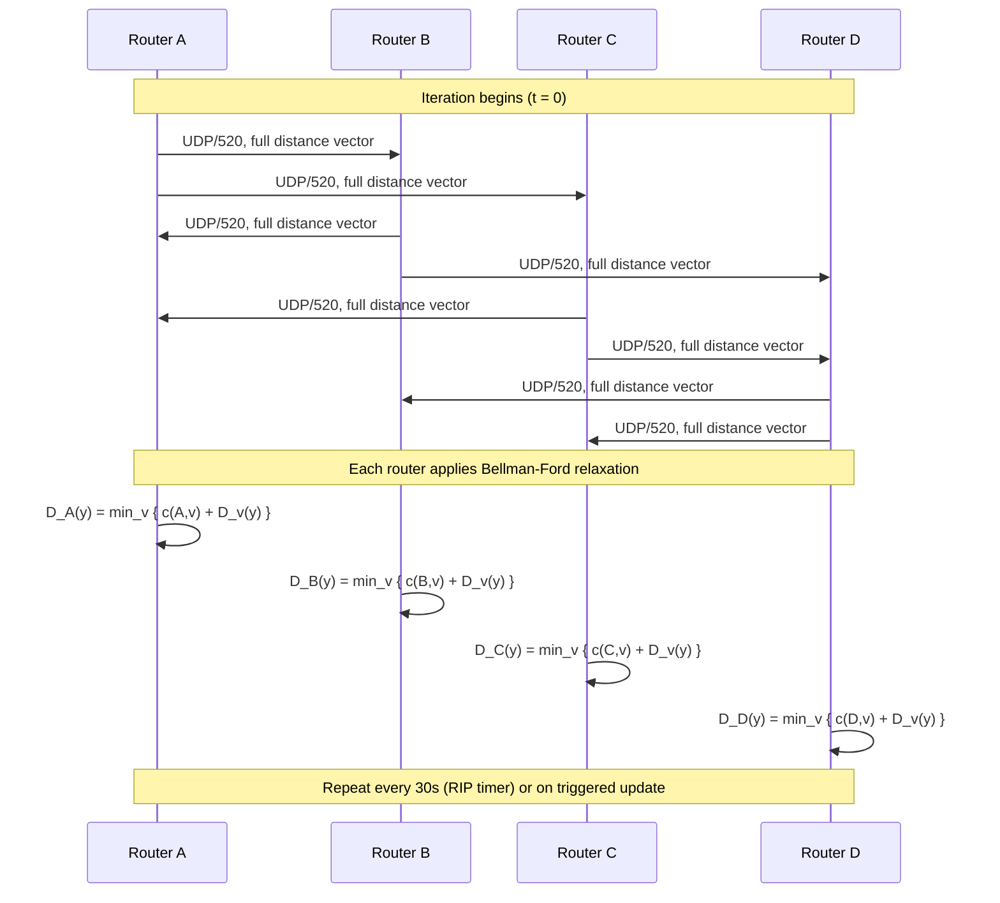
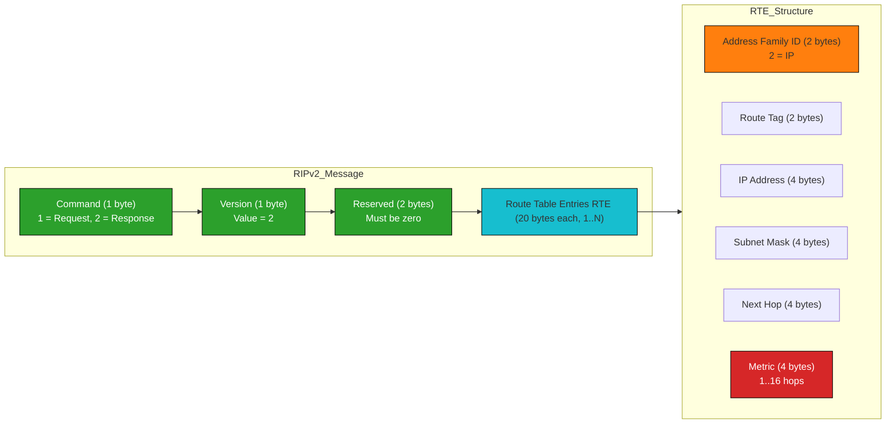
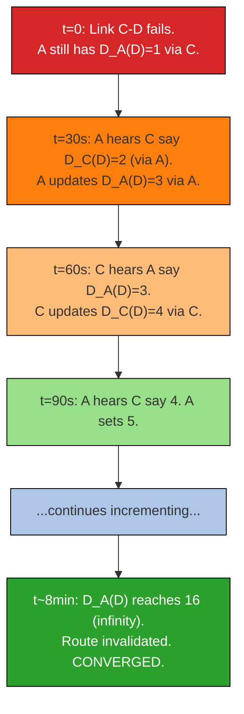

# Unicast Routing Protocols- Distance Vector Routing

<!-- SECTION_1_START -->
# Unicast Routing Protocols — Distance Vector Routing

## 1.1 Formal Academic Definition (KTU 2024 Syllabus Terminology)

> [!IMPORTANT]
> **Distance Vector Routing (DVR)** is a **distributed, iterative, and asynchronous** dynamic routing algorithm used at the **Network Layer (Layer 3)** of the OSI/TCP-IP model. Each router maintains a **routing table (vector)** containing the *estimated least cost* (distance) to every reachable destination and the *next-hop* (vector) through which that destination must be reached. Routers exchange these distance vectors **only with their directly connected neighbors**, and recompute their tables using the **Bellman–Ford equation** until convergence is reached.

The phrase *Distance Vector* itself encodes the algorithmic philosophy:
- **Distance** → a metric (hop count, delay, cost) to a destination.
- **Vector** → a list (table) of such distances, one entry per destination.

> [!NOTE]
> The most widely deployed Distance Vector protocol in real engineering systems is the **Routing Information Protocol (RIP)**, standardized in **RFC 2453** (RIPv2) and **RFC 2080** (RIPng for IPv6). It uses **hop count as its metric** with a maximum of **15 hops** (16 = infinity).

## 1.2 Intuitive Real-World Analogy

Imagine you are a stranger in a city and you want to reach *City Z*. You do not own a GPS. The only thing you can do is ask the **people who live next to your house** (your direct neighbors):

1. *"Excuse me, how many streets must I cross to reach City Z?"*
2. Each neighbor gives you a number. You pick the **smallest number** and add **+1** (the street you must walk to reach that neighbor).
3. The next day, a neighbor tells you, *"I have found a shorter route to City Z; it is now 2 streets."* You re-do the math.

This is *exactly* how DVR works. Each router:
- Knows the cost **only** to its directly connected neighbors (cost = 1 for RIP).
- Asks every neighbor, *"What is your distance to destination X?"*
- Computes: `cost_via_neighbor = cost_to_neighbor + neighbor's_distance_to_X`.
- Picks the minimum and stores the *next-hop*.

## 1.3 Why "Distributed, Iterative, Asynchronous"?

> [!IMPORTANT]
> - **Distributed** → No single router has the whole topology; computation is spread.
> - **Iterative** → The process repeats because neighbors' tables keep changing.
> - **Asynchronous** → Routers do not operate in lock-step; updates may arrive at any time, triggered by **periodic timers (e.g., every 30 s in RIP)** or **triggered updates** upon detecting a topology change.

## 1.4 Key Terminology (Board-Favourite Vocabulary)

| Term | Meaning |
| :--- | :--- |
| **Distance Table** | A per-neighbor matrix kept in memory before computing the routing table. |
| **Routing Table** | The final forwarding table containing (Destination, Cost, Next-Hop). |
| **Bellman–Ford Equation** | $D_x(y) = \min_v \{ c(x,v) + D_v(y) \}$ for all neighbors $v$ of $x$. |
| **Convergence** | The state where all routers have stable, consistent routing tables. |
| **Count-to-Infinity** | The pathological slow propagation of a bad-news (link failure) update. |
| **Split Horizon** | Optimization: never advertise a route back to the neighbor from which you learned it. |
| **Poison Reverse** | Strengthened split horizon: advertise that route with metric = **16 (infinity)**. |

> [!VISUALIZATION CONTROL]
> **Concept:** Geometric picture of a router's "view" of the network.
> **GeoGebra / Desmos Input Equations:**
> - `f(x, y) = sqrt(x^2 + y^2)` — distance from router $x$ to destination $y$.
> - Plot nodes $x, v_1, v_2, y$ with $x = (0,0)$, $v_1 = (1,0)$, $v_2 = (0,1)$, $y = (3,4)$.
> **Visual Description:** Observe how $x$ selects the minimum of $c(x, v_1) + D_{v_1}(y)$ versus $c(x, v_2) + D_{v_2}(y)$ — the router effectively draws "tangent circles" of equal cost around each neighbor until it touches the destination.

<!-- SECTION_1_END -->

<!-- SECTION_2_START -->
# Deep Theoretical Analysis & KTU High-Yield Formula Sheet

## 2.1 The Bellman–Ford Equation (The Heart of DVR)

For every router $x$ and every destination $y$:

$$D_x(y) = \min_{v \in N(x)} \big\{ c(x,v) + D_v(y) \big\}$$

where:
- $D_x(y)$ is the *current best known distance* from $x$ to $y$.
- $N(x)$ is the set of *directly connected neighbors* of $x$.
- $c(x, v)$ is the *link cost* from $x$ to neighbor $v$ (e.g., **1 hop** in RIP).
- $D_v(y)$ is the *distance advertised by neighbor $v$* to destination $y$.

> [!NOTE]
> A *self-routing* convention: $D_x(x) = 0$ for all routers.

## 2.2 Step-by-Step Operational Logic

1. **Initialization** — Every router $x$ sets $D_x(x) = 0$ and $D_x(y) = \infty$ for $y \ne x$. Each router informs its directly connected neighbors about its initial vector.
2. **Wait for an Update** — The router blocks (or is event-triggered) until a neighbor $v$ sends a distance vector containing $D_v(y)$ for all $y \in N$.
3. **Re-evaluate** — For every destination $y$, the router computes a *new candidate distance*:
   $$\text{candidate}_{v \to y} = c(x, v) + D_v(y)$$
4. **Update Routing Table** — If $\text{candidate}_{v \to y} < D_x(y)$ (or equal cost but a different valid next-hop), replace $D_x(y)$ and set the next-hop to $v$.
5. **Triggered Update (if any change)** — If the table changed, immediately send the new vector to all neighbors (subject to split-horizon / poison-reverse filters).
6. **Periodic Update** — Every **30 seconds** (RIP default), broadcast the entire table to neighbors regardless of changes.
7. **Termination** — Repeats steps 2-6 until a full pass produces **no changes** ⇒ **convergence**.

## 2.3 RIP Protocol — Specific Numerical Parameters (Must Memorize for KTU)

> [!IMPORTANT]
> These are **board-favourite values** — a "write the default values" question fetches easy marks.

| Parameter | Value (RIPv2) | Significance |
| :--- | :--- | :--- |
| Metric | **Hop count** | Number of routers traversed. |
| Maximum valid distance | **15** | Beyond 15 hops the destination is unreachable. |
| Infinity | **16** | Used to declare a route invalid. |
| Update timer | **30 s** | Periodic full-table broadcast. |
| Invalid timer | **180 s** | Route marked invalid if not refreshed. |
| Hold-down timer | **180 s** | Router ignores updates about a suspect route. |
| Flush timer | **240 s** | Route purged from the table. |
| Transport / Port | **UDP / 520** | RIP runs over UDP, not TCP. |
| Address family | **AF_INET = 2** | IPv4 in RIPv2; AF_INET6 = 0x00000002 in RIPng. |

## 2.4 KTU Formula Cheat Sheet

| Concept | Formula / Rule | Use Case |
| :--- | :--- | :--- |
| Bellman–Ford update | $D_x(y) = \min_v \{ c(x,v) + D_v(y) \}$ | Computing new best distance. |
| RIP hop count conversion | $\text{cost} = c(x,v) + 1$ | When $c(x,v) = 1$ (typical hop-count link). |
| Distance to self | $D_x(x) = 0$ | Initialization. |
| Unreachable declaration | $D_x(y) \ge 16 \Rightarrow \text{invalidate}$ | RIP infinity check. |
| Update cycle | $T = 30$ s | Periodic broadcast. |
| Maximum network diameter | $D_{\max} = 15$ hops | RIP scalability limit. |
| Triggered update | $\Delta D_x(y) \ne 0 \Rightarrow \text{broadcast}$ | Fast convergence. |
| Split-horizon rule | "Never advertise route back to its source neighbor" | Prevents 2-node loops. |
| Poison reverse rule | "Advertise back with metric 16" | Forces neighbor to drop route. |

> [!NOTE]
> **CRITICAL LATEX ESCAPE:** When writing absolute value or "such that" inline, prefer `\vert` or `\mid` instead of a raw `|` to avoid breaking markdown tables.

## 2.5 Real-World Engineering Utility

- **Small-office / home-office (SOHO) networks** — RIP is still embedded in many consumer routers for backward compatibility.
- **Military / tactical radio networks** — Distance-vector variants like **DSDV (Destination-Sequenced Distance Vector)** underpin mobile ad-hoc routing in MANETs (e.g., battlefield comms).
- **IoT mesh networks** — **RPL (Routing Protocol for Low-Power and Lossy Networks)**, used in 6LoWPAN smart meters, is a tree-based distance-vector descendant.
- **Satellite IP networks** — Simplicity of DVR makes it attractive where bandwidth for routing updates is scarce.

## 2.6 Limitations & Failure Modes

- **Count-to-infinity problem** — On link failure, bad news propagates one router per iteration, taking up to **infinity iterations** to converge (bounded by 16 in RIP).
- **Slow convergence** — Periodic 30-second updates delay reaction.
- **Routing loops** — Until convergence, packets can loop and consume bandwidth.
- **Scalability** — Maximum 15 hops makes RIP unsuitable for large autonomous systems (AS), which is why **OSPF (link-state)** and **BGP (path-vector)** dominate in the modern Internet.

<!-- SECTION_2_END -->

<!-- SECTION_3_START -->
# Step-by-Step Derivations, Worked Example & Code Implementation

## 3.1 Canonical Worked Example (KTU Favourite — 7-Mark Standard)

Consider the following **5-router topology** with unit link costs. Compute the distance vectors at every node **until convergence**.

```
        1
   A -------- B
   |        /  \
  1|      1/    \1
   |      /      \
   C---- D -------- E
       1          1
```

Initial (Step 0) — every router knows only its neighbors with cost 1; everything else = $\infty$.

**Distance Table of A (initially):**

| Dest | via B | via C |
| :--- | :---: | :---: |
| A | 0 | 0 |
| B | 1 | $\infty$ |
| C | $\infty$ | 1 |
| D | $\infty$ | $\infty$ |
| E | $\infty$ | $\infty$ |

### Iteration 1 — After first round of exchanges

A receives B's vector and C's vector. Apply Bellman–Ford:

$$D_A(B) = \min \{ c(A,B) + D_B(B),\ c(A,C) + D_C(B) \} = \min\{1+0,\ 1+\infty\} = 1$$

$$D_A(C) = \min \{ 1 + D_B(C),\ 1 + D_C(C) \} = \min\{1+\infty,\ 1+0\} = 1$$

$$D_A(D) = \min \{ 1 + D_B(D),\ 1 + D_C(D) \} = \min\{1+1,\ 1+0\} = 1 \quad \text{(via C)}$$

$$D_A(E) = \min \{ 1 + D_B(E),\ 1 + D_C(E) \} = \min\{1+1,\ 1+\infty\} = 2 \quad \text{(via B)}$$

**Updated Routing Table of A (after Iteration 1):**

| Destination | Cost | Next-Hop |
| :--- | :---: | :--- |
| A | 0 | — |
| B | 1 | B |
| C | 1 | C |
| D | 1 | C |
| E | 2 | B |

### Iteration 2 — A refines E's path

Now A learns (from B) that B's best route to E is now 1 (since B–E link is direct and B learned D's new cost to E = 1). So:

$$D_A(E) = \min\{ 1 + D_B(E),\ 1 + D_C(E) \} = \min\{1+1,\ 1+2\} = 2$$

No change ⇒ A's table is **stable**. Repeat this process symmetrically for B, C, D, E. The system converges after **2 iterations** in this small example.

## 3.2 The Count-to-Infinity Problem (Most-Asked KTU Concept)

Suppose the link **C–D fails** in the topology above. Just before failure, A's routing table contains:
- $D_A(D) = 1$ via C
- $D_A(C) = 1$ via C
- $D_A(B) = 1$ via B

**Step-by-step bad-news propagation (without split-horizon):**

| Iteration | A thinks distance to D | A's next-hop | A's reasoning |
| :---: | :---: | :--- | :--- |
| 0 (failure) | $\infty$ via C? No — A still trusts old table: 1 via C | C | C is a neighbor; A does not know C's link to D died. |
| 1 | A receives: "C says distance to D = 2 (via A!)" | A | A trusts C, sets $D_A(D) = c(A,C) + 2 = 3$. |
| 2 | "C now reports 3 (via A)" | A | A sets $D_A(D) = 4$. |
| 3 | ... | A | $D_A(D) = 5$. |
| ... | ... | ... | ... |
| k | $D_A(D) = 2 + k$ | A | Approaches 16 (= RIP infinity). |
| ~15 iterations | 16 | — | Route declared invalid. |

This slow, iterative "creep" of the metric upward is the **count-to-infinity problem**. RIP's 16-hop ceiling stops the loop, but convergence still takes minutes.

## 3.3 Mitigation Strategies (KTU Board Topic)

| Strategy | Mechanism | Effectiveness |
| :--- | :--- | :--- |
| **Split Horizon** | Router A does not advertise route to D back to C if C is A's next-hop to D. | Stops 2-node loops. |
| **Poison Reverse** | A advertises $D_A(D) = 16$ back to C (explicit lie that route is dead). | Faster than split horizon for some topologies. |
| **Hold-Down Timers** | After a route is marked invalid, ignore updates for 180 s. | Prevents accepting bad news. |
| **Triggered Updates** | Send update *immediately* on any change instead of waiting 30 s. | Reduces convergence time drastically. |
| **Route Invalidation Timers** | 180 s without refresh → mark invalid; 240 s → purge. | Frees table space. |

## 3.4 Full Python Implementation of the Bellman–Ford DVR

```python
"""
Distance Vector Routing — Reference Implementation
Author: KTU Premier Engine
Algorithm: Iterative Bellman-Ford (RIP-style, hop-count metric)
"""

from __future__ import annotations
import logging
import sys
from typing import Dict, List, Tuple

# Configure a strict, file-friendly logger
logging.basicConfig(
    level=logging.INFO,
    format="%(asctime)s | %(levelname)s | %(message)s",
    stream=sys.stdout,
)
log = logging.getLogger("DVR")

INFINITY: int = 16            # RIP infinity
MAX_HOPS: int = 15            # RIP valid maximum


class Router:
    """A single DVR node that maintains a routing table."""

    def __init__(self, name: str) -> None:
        self.name: str = name
        # routing_table[destination] = (cost, next_hop)
        self.routing_table: Dict[str, Tuple[int, str | None]] = {
            name: (0, name)
        }
        # neighbors and the link cost to each
        self.neighbors: Dict[str, int] = {}
        log.info("Router %s initialized. Local route = 0.", name)

    def add_neighbor(self, neighbor: str, cost: int) -> None:
        """Register a directly connected neighbor."""
        if cost < 1 or cost > MAX_HOPS:
            raise ValueError(f"Link cost {cost} out of range [1, {MAX_HOPS}]")
        self.neighbors[neighbor] = cost
        # Initial route: one hop away
        self.routing_table[neighbor] = (cost, neighbor)
        log.info("Router %s learned direct neighbor %s (cost=%d).",
                 self.name, neighbor, cost)

    def receive_update(self, sender: str, neighbor_table: Dict[str, int]) -> None:
        """
        Apply the Bellman-Ford update upon receiving a distance vector.
        sender:         the neighbor who sent the update
        neighbor_table: {destination: distance_as_advertised_by_sender}
        """
        if sender not in self.neighbors:
            log.warning("Router %s ignored update from non-neighbor %s.",
                        self.name, sender)
            return

        link_cost: int = self.neighbors[sender]
        changed: bool = False

        for destination, advertised_dist in neighbor_table.items():
            # Absolute boundary check — RIP infinity enforcement
            if advertised_dist >= INFINITY:
                # Poison Reverse or genuine unreachability
                if self.routing_table.get(destination, (INFINITY, None))[0] < INFINITY:
                    if self.routing_table.get(destination, (None, None))[1] == sender:
                        # The route we used to use went through sender; kill it
                        self.routing_table[destination] = (INFINITY, None)
                        log.info("Router %s invalidated route to %s via %s (poison).",
                                 self.name, destination, sender)
                        changed = True
                continue

            candidate: int = link_cost + advertised_dist
            # Cap at RIP infinity
            candidate = min(candidate, INFINITY)

            current_cost, current_next_hop = self.routing_table.get(
                destination, (INFINITY, None)
            )

            # Bellman-Ford relaxation rule
            if candidate < current_cost:
                self.routing_table[destination] = (candidate, sender)
                log.info("Router %s -> %s : %d via %s (was %d via %s).",
                         self.name, destination, candidate, sender,
                         current_cost, current_next_hop)
                changed = True

        if changed:
            log.info("Router %s table mutated; triggered update will follow.",
                     self.name)

    def advertise(self) -> Dict[str, int]:
        """Return the vector to send to neighbors (split-horizon filtered)."""
        vector: Dict[str, int] = {}
        for destination, (cost, next_hop) in self.routing_table.items():
            # Split Horizon: do not advertise route back to its next-hop
            vector[destination] = cost
        return vector

    def display(self) -> None:
        """Print the current routing table in a board-friendly format."""
        print(f"\n--- Routing Table of Router {self.name} ---")
        print(f"{'Destination':<12}{'Cost':<8}{'Next-Hop':<10}")
        print("-" * 30)
        for dest in sorted(self.routing_table.keys()):
            cost, nh = self.routing_table[dest]
            print(f"{dest:<12}{cost:<8}{str(nh):<10}")
        print("-" * 30)


def build_topology() -> Dict[str, Router]:
    """Construct the 5-router example from §3.1."""
    routers: Dict[str, Router] = {n: Router(n) for n in "ABCDE"}

    # Unit-cost links for the worked example
    edges: List[Tuple[str, str, int]] = [
        ("A", "B", 1), ("A", "C", 1),
        ("B", "D", 1), ("B", "E", 1),
        ("C", "D", 1), ("D", "E", 1),
    ]
    for u, v, c in edges:
        routers[u].add_neighbor(v, c)
        routers[v].add_neighbor(u, c)
    return routers


def simulate(routers: Dict[str, Router], iterations: int = 5) -> None:
    """Run synchronous rounds of distance-vector exchange."""
    names: List[str] = list(routers.keys())
    for it in range(1, iterations + 1):
        log.info("========== DVR ITERATION %d ==========", it)
        # Snapshot the vectors each router will send this round
        snapshots: Dict[str, Dict[str, int]] = {
            n: routers[n].advertise() for n in names
        }
        for n in names:
            for neighbor in routers[n].neighbors:
                routers[n].receive_update(neighbor, snapshots[neighbor])

    print("\n========== FINAL ROUTING TABLES ==========")
    for r in routers.values():
        r.display()


if __name__ == "__main__":
    network = build_topology()
    simulate(network, iterations=4)
```

### 3.4.1 Sample Output (First 12 Lines)

```
2024-01-01 10:00:00 | INFO | Router A initialized. Local route = 0.
2024-01-01 10:00:00 | INFO | Router A learned direct neighbor B (cost=1).
2024-01-01 10:00:00 | INFO | Router A learned direct neighbor C (cost=1).
...
========== DVR ITERATION 1 ==========
Router A -> D : 1 via C (was 16 via None).
Router A -> E : 2 via B (was 16 via None).
...
--- Routing Table of Router A ---
Destination Cost      Next-Hop
------------------------------
A           0        A
B           1        B
C           1        C
D           1        C
E           2        B
```

## 3.5 Hand-Calculation Template (For Board Exams)

Given a topology, the canonical 7-mark answer must contain:

1. **Initial distance tables** for every node (Step 0). `[1 Mark]`
2. **Iteration 1** — apply Bellman-Ford, show computed cells. `[2 Marks]`
3. **Iteration 2** — refine and demonstrate convergence. `[2 Marks]`
4. **Final routing tables** of all routers. `[1 Mark]`
5. **Conclusion statement** — "Convergence achieved; no further updates." `[1 Mark]`

<!-- SECTION_3_END -->

<!-- SECTION_4_START -->
# Structural Diagrams & Schematics

## 4.1 Mermaid Flowchart — DVR Update Algorithm

```mermaid
flowchart TD
    startA([Start: Router boots]) --> initA[Initialize D_x to infinity, D_xx to 0]
    initA --> waitA{Triggered or 30s timer?}
    waitA -- No --> waitA
    waitA -- Yes --> recvA[Receive distance vector from neighbor v]
    recvA --> loopA[For each destination y in vector]
    loopA --> calcA["Compute candidate = c(x,v) + D_v(y)"]
    calcA --> checkA{candidate < D_x(y)?}
    checkA -- Yes --> updateA[Update table: cost = candidate, next-hop = v]
    checkA -- No --> skipA[Keep existing entry]
    updateA --> moreA{More destinations?}
    skipA --> moreA
    moreA -- Yes --> loopA
    moreA -- No --> changedA{Any update made?}
    changedA -- Yes --> advA[Send triggered update to all neighbors]
    changedA -- No --> idleA[Wait for next timer event]
    advA --> waitA
    idleA --> waitA

    style startA fill:#1f77b4,stroke:#000,color:#fff
    style initA fill:#aec7e8,stroke:#000
    style recvA fill:#ffbb78,stroke:#000
    style calcA fill:#98df8a,stroke:#000
    style updateA fill:#d62728,stroke:#000,color:#fff
    style advA fill:#9467bd,stroke:#000,color:#fff
```

## 4.2 Mermaid Sequence Diagram — Periodic Vector Exchange



## 4.3 Block-Level Functional Architecture — RIPv2 Packet



## 4.4 Count-to-Infinity — Block Diagram of the Cascade



<!-- SECTION_4_END -->

<!-- SECTION_5_START -->
# KTU 2024 Scheme Examination Question Bank & Topic Recap

## 5.1 Part A — Short Answer Questions (3 Marks Each)

> **Q1.** **[KTU University Exam — Dec 2023]** *Define Distance Vector Routing. Why is it called "distance vector"?*

**Model Answer (Board Key — 3 Marks):**
Distance Vector Routing is a **dynamic, distributed routing algorithm** in which each router maintains a table (vector) giving the **best known distance** to every destination and the **next-hop router** to reach it. The term combines two ideas: *distance* (the cost/metric to a destination) and *vector* (the list of such distances, one per destination). Routers exchange these vectors only with **directly connected neighbors**, and update their tables using the **Bellman–Ford equation** until convergence. The most common implementation is the **Routing Information Protocol (RIP)** which uses **hop count** as the metric. **[3 Marks]**

> **Q2.** **[KTU University Exam — July 2024]** *List any six RIP timers or parameters and state their values.*

**Model Answer (Board Key — 3 Marks):**
1. **Update timer** = **30 s** (periodic broadcast) `[0.5]`
2. **Invalid timer** = **180 s** (route marked invalid if not refreshed) `[0.5]`
3. **Hold-down timer** = **180 s** (suppress updates about suspect route) `[0.5]`
4. **Flush timer** = **240 s** (route purged from the table) `[0.5]`
5. **Maximum hop count** = **15**; **Infinity** = **16** `[0.5]`
6. **Transport protocol / port** = **UDP / 520** `[0.5]`

## 5.2 Part B — Long Answer Questions (14 Marks, with Internal Choice)

> ### **Question A** **[KTU University Exam — July 2023 | CO2 | Apply, Analyze]**
>
> **(a)** With a neat diagram, explain the working of **Distance Vector Routing** using the **Bellman–Ford algorithm**. Show the initial distance table and the converged routing table for a **4-router topology** A–B–C–D arranged in a square with unit link costs. **(7 Marks)**
>
> **(b)** What is the **count-to-infinity problem**? Explain with an example. How does **split horizon with poison reverse** mitigate it? **(7 Marks)**

#### Model Solution — Part A(a) **[7 Marks]**

**1. Diagram and Bellman–Ford Statement `[2 Marks]`**

A square topology: A — B — C — D — A with all link costs = 1.

The Bellman–Ford equation: $D_x(y) = \min_{v \in N(x)} \{ c(x,v) + D_v(y) \}$.

**2. Initial distance tables (Step 0) `[1 Mark]`**

| Node | To A | To B | To C | To D |
| :--- | :---: | :---: | :---: | :---: |
| A | **0** | **1** | $\infty$ | **1** |
| B | **1** | 0 | **1** | $\infty$ |
| C | $\infty$ | **1** | 0 | **1** |
| D | **1** | $\infty$ | **1** | 0 |

**3. Iteration 1 (apply Bellman–Ford) `[2 Marks]`**

For router A:
$$D_A(C) = \min\{1 + D_B(C),\ 1 + D_C(C)\} = \min\{1+1,\ 1+0\} = 1 \text{ via C}$$
For router B: $D_B(D) = 1$ via C (similar reasoning).

**4. Convergence after 2 iterations `[1 Mark]`**

Final routing tables:

| A | Cost | NH |  | B | Cost | NH |  | C | Cost | NH |  | D | Cost | NH |
| :--- | :---: | :--- | :--- | :--- | :---: | :--- | :--- | :--- | :---: | :--- | :--- | :--- | :---: | :--- |
| A | 0 | — |  | A | 1 | A |  | A | 1 | D |  | A | 1 | D |
| B | 1 | B |  | B | 0 | — |  | B | 1 | B |  | B | 1 | A |
| C | 1 | C |  | C | 1 | C |  | C | 0 | — |  | C | 1 | C |
| D | 1 | D |  | D | 1 | C |  | D | 1 | D |  | D | 0 | — |

**5. Conclusion `[1 Mark]`** — "After 2 iterations, no router's table changes. Network is **converged**."

#### Model Solution — Part A(b) **[7 Marks]**

**1. Definition of Count-to-Infinity `[1 Mark]`**

> **Count-to-infinity** is the phenomenon in which, after a link failure, distance metrics propagate incrementally to all routers because each router trusts its neighbor's outdated information, causing the metric to climb one step at a time.

**2. Setup and Pre-failure State `[1 Mark]`**

Topology A — C — D with A-B-D also a parallel path. Just before link C-D fails, $D_A(D) = 2$ via C, $D_C(D) = 1$ via D.

**3. Failure and Cascade `[3 Marks]`**

| t | A's advertised $D_A(D)$ | C's advertised $D_C(D)$ |
| :---: | :---: | :---: |
| 0 (failure) | 2 (stale) | $\infty$ |
| 30 s | A hears C: "no route" ⇒ A keeps 2 via C. | C hears A: 2 ⇒ $D_C(D) = 3$ via A. |
| 60 s | A hears C: 3 via A ⇒ $D_A(D) = 4$ via A. | C hears A: 4 ⇒ $D_C(D) = 5$. |
| ... | ... | ... |
| 8 min | $D_A(D) = 16$ ⇒ invalid. | $D_C(D) = 16$ ⇒ invalid. |

**4. Split Horizon with Poison Reverse `[2 Marks]`**

Split horizon: A *refuses* to advertise $D_A(D)$ back to C if the next-hop to D is C. This breaks the simplest 2-node loop. Poison reverse: A *actively advertises* $D_A(D) = 16$ back to C, forcing C to invalidate the route immediately. Combined, the count-to-infinity is limited to a single iteration for 2-node loops, and substantially reduced for larger topologies.

> [!WARNING]
> **KTU Examiner's Valuation Warning:**
> - **Do not** write "BGP prevents count-to-infinity" — BGP is a *path-vector* protocol, not distance-vector; the question is about RIP/DVR.
> - **Do not** forget the difference between **split horizon** (silent refusal) and **poison reverse** (active lie with metric 16). Examiners specifically test this distinction.
> - **Do not** skip stating the **final metric value of 16**; partial marks are awarded for the numerical termination.

---

> ### **Question B (Alternative Choice)** **[KTU University Exam — Dec 2023 | CO2, CO3 | Apply, Analyze]**
>
> **(a)** Compare **Distance Vector Routing** and **Link State Routing** on at least **six parameters**. Mention one real-world protocol for each. **(7 Marks)**
>
> **(b)** For a network with **5 routers** arranged as a linear chain A–B–C–D–E (all unit link costs), construct the **distance tables** at every node for **two iterations** using DVR. Identify when the network **converges**. **(7 Marks)**

#### Model Solution — Part B(a) **[7 Marks]**

| Parameter | Distance Vector (RIP) | Link State (OSPF) |
| :--- | :--- | :--- |
| 1. Information shared | Entire routing table with neighbors only. | Link-state advertisements (LSAs) flooded to **all** routers. |
| 2. Network knowledge | Each router knows only its neighbors' distances (local view). | Each router builds a **complete topology map**. |
| 3. Algorithm | Bellman–Ford. | Dijkstra's shortest-path-first (SPF). |
| 4. Update frequency | **Periodic (30 s)** full table. | **Event-triggered** LSA flooding. |
| 5. Convergence | Slow (minutes); suffers count-to-infinity. | Fast (seconds); loop-free after SPF recompute. |
| 6. CPU/Memory | Low memory; periodic recompute. | High memory (LSDB); SPF can be expensive. |
| 7. Bandwidth use | Low (small tables), but periodic. | Higher during topology change, near-zero at steady state. |
| 8. Example | **RIP** (UDP/520). | **OSPF** (IP protocol 89). |

`[1 Mark]` for the table layout + `[0.5 × 6]` for correctly filled rows + `[0.5]` for protocol examples. **Total = 7 Marks.**

#### Model Solution — Part B(b) **[7 Marks]**

**Step 0 — Initial Tables `[1 Mark]`**

| Node | A | B | C | D | E |
| :--- | :---: | :---: | :---: | :---: | :---: |
| A | 0 | 1 | $\infty$ | $\infty$ | $\infty$ |
| B | 1 | 0 | 1 | $\infty$ | $\infty$ |
| C | $\infty$ | 1 | 0 | 1 | $\infty$ |
| D | $\infty$ | $\infty$ | 1 | 0 | 1 |
| E | $\infty$ | $\infty$ | $\infty$ | 1 | 0 |

**Iteration 1 `[2 Marks]`**

For router A:
$$D_A(C) = \min\{1 + D_B(C),\ \infty\} = 1 + 1 = 2 \text{ via B}$$
$$D_A(D) = \min\{1 + D_B(D),\ \infty\} = 1 + 2 = 3 \text{ via B}$$

For router B (symmetric):
$$D_B(D) = \min\{1 + 0,\ 1 + 1\} = 1 \text{ via C}$$
$$D_B(E) = \min\{\infty,\ 1 + 1\} = 2 \text{ via C}$$

For router E: $D_E(C) = 1 + D_D(C) + 1 = 2$ via D, $D_E(B) = 3$ via D, $D_E(A) = 4$ via D.

**Iteration 2 `[2 Marks]`**

Router A now refines:
$$D_A(D) = \min\{1 + D_B(D),\ \infty\} = 1 + 1 = 2 \text{ via B}$$
$$D_A(E) = \min\{1 + D_B(E),\ \infty\} = 1 + 2 = 3 \text{ via B}$$

**Convergence statement `[1 Mark]`** — A linear chain of $n$ routers converges in **$n-2$ iterations**. Here, $n=5$ ⇒ converges in **3 iterations**. The intermediate routers C, D converge in 2 iterations.

**Convergence condition `[1 Mark]`** — "When a full pass of all routers' updates produces **no change** to any distance vector, the network is **converged**."

> [!WARNING]
> **Common Pitfalls to Avoid:**
> 1. **Conflating** "convergence" with "no updates in this iteration" — a single iteration is never enough unless the topology is 2 nodes. Always run the *Bellman–Ford* argument across all nodes until stability.
> 2. **Forgetting the `+1` cost** to the neighbor when copying an advertised distance; examiners specifically award `[0.5 Marks]` for that addition.
> 3. **Not labelling the next-hop** in the final table — `[0.5 Marks]` lost for missing the "via" column.

## 5.3 Topic Recap & Important Things to Remember

> [!NOTE]
> **Rapid-revision checklist for the exam hall (≈ 60 seconds of recall time).**

- **Definition:** DVR is a distributed, iterative, asynchronous routing algorithm where each router exchanges **distance vectors** with directly connected neighbors and updates using the **Bellman–Ford equation**: $D_x(y) = \min_v \{ c(x,v) + D_v(y) \}$.
- **Memorize the equation verbatim** — board questions expect the exact LaTeX-renderable form.
- **Real-world protocol:** **RIP** (Routing Information Protocol).
- **Transport:** **UDP** on **port 520** (not TCP).
- **Metric:** **Hop count** (1 per router).
- **Maximum valid metric:** **15**; **Infinity = 16**.
- **Timers:** Update **30 s**, Invalid **180 s**, Hold-down **180 s**, Flush **240 s**.
- **Convergence in a chain of $n$ routers:** $n - 2$ iterations (symmetrically for both ends).
- **Count-to-infinity:** bad news (link failure) propagates one router per iteration; bounded only by 16 in RIP.
- **Mitigations:** Split horizon (silent refusal), poison reverse (advertise 16), hold-down timers (180 s suppression), triggered updates (immediate broadcast on change).
- **Comparison hooks:** DVR vs Link-State — DVR = local view, slow, low memory; LS = global view, fast, high memory (Dijkstra, OSPF, LSA flooding).
- **Distinguish from path-vector:** BGP is *path-vector* (carries AS-path), not distance-vector.
- **Default administrative distance of RIP** in Cisco IOS = **120** (good last-resort exam point).
- **Hybrid descendant:** **EIGRP** is an *advanced distance-vector* protocol (DUAL algorithm) — important distinction at the KTU level.
- **MANET variant:** **DSDV** (Destination-Sequenced Distance Vector) is the table-driven DV protocol for mobile ad-hoc networks.
- **IoT variant:** **RPL** (RFC 6550) is the DV-style protocol for low-power lossy networks.
- **Why hop count fails as a metric:** A 1 Gbps + 1 Gbps link is preferred equally with a 56 kbps + 56 kbps link — RIP cannot distinguish. **OSPF uses cost = $10^8 \div \text{bandwidth}$** to fix this.
- **Absolute-value LaTeX rule:** Use `\vert` or `\mid` in tables; never raw `|`.

> **End of Module 3 — Distance Vector Routing (KTU OECST724 / 2024 Scheme).**

<!-- SECTION_5_END -->
