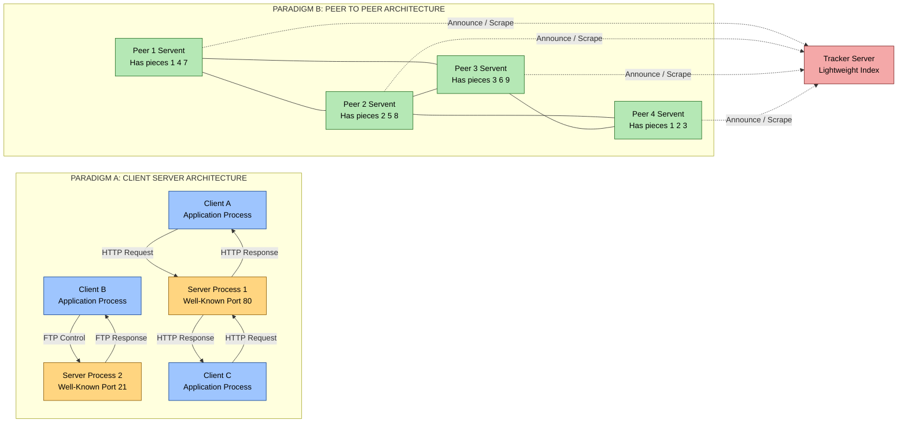
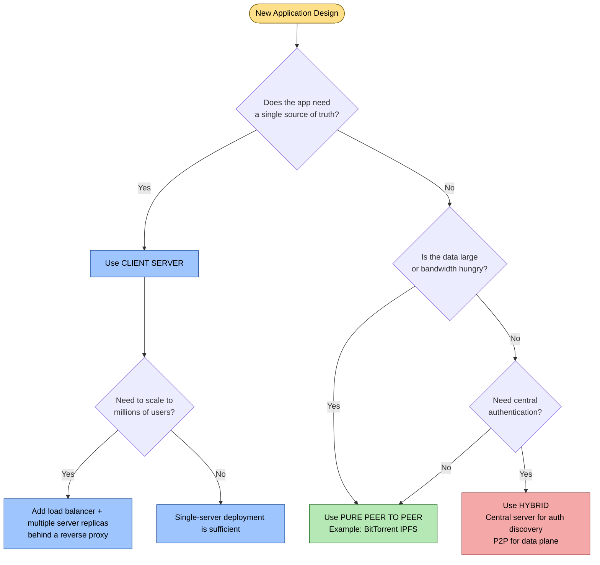
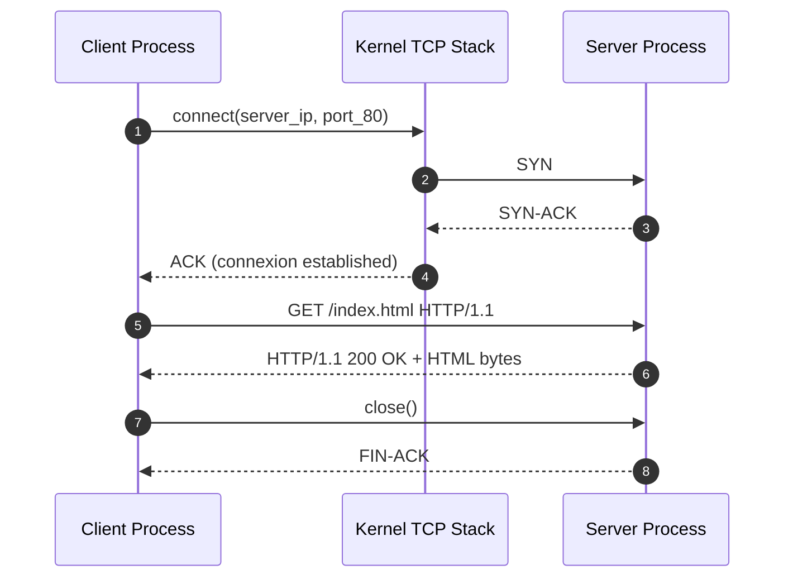
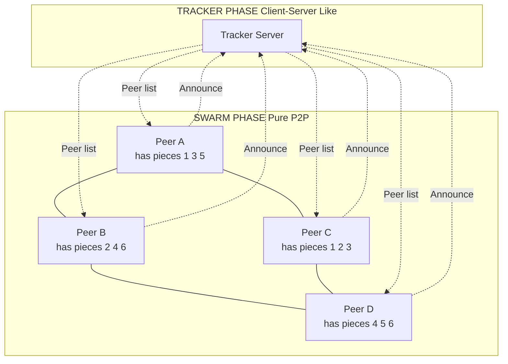

# Application Layer - Application Layer Paradigms

<!-- SECTION_1_START -->
# 1. Core Technical Definition & Intuitive Overview

## 1.1 What is an Application Layer Paradigm?

An **Application Layer Paradigm** is the **architectural communication model** that defines *how two end-system application processes cooperate, exchange messages, and share resources* over a computer network. In the KTU 2024 OECST724 syllabus, the term "paradigm" is restricted to the **Client–Server model**, the **Peer-to-Peer (P2P) model**, and their **Hybrid** combination — i.e., the *shape* of the conversation, not the protocol itself.

> [!IMPORTANT]
> **KTU 2024 Definition (Board-Exam Ready):**
> An Application Layer Paradigm specifies the **logical relationship** and **message-flow direction** between the communicating end-systems (hosts) running at the Application Layer of the TCP/IP reference model. The three canonical paradigms are:
> 1. **Client–Server Paradigm (C/S)**
> 2. **Peer-to-Peer Paradigm (P2P)**
> 3. **Hybrid Paradigm**

---

## 1.2 The Client–Server Paradigm

### Formal Definition
The **Client–Server Paradigm** is a *distributed-application architecture* that partitions tasks and workloads between **service providers (servers)** — which continuously listen for and respond to requests — and **service requesters (clients)** — which initiate communication by sending a request and then waiting for a reply. The server is the *always-on* host with a **well-known, fixed IP address** (e.g., a DNS root server, a web server hosting *ktu.edu.in*).

### Intuitive Analogy — "The Restaurant"
Imagine walking into a hotel restaurant:

* **You (the customer)** sit at a table, read the menu, and tell the *waiter* what you want. You do not cook.
* **The Waiter (the network)** carries your order to the kitchen and brings food back.
* **The Chef in the kitchen (the Server)** is always stationed there, ready to prepare any dish.
* **The kitchen has one fixed address** (Room 12, Ground Floor) — the customers do not need to know it personally, they just go to the *restaurant's address*.

| Restaurant Element | Network Element |
|---|---|
| Customer | Client Process |
| Chef | Server Process |
| Kitchen Address | Server's Fixed IP + Port |
| Waiter | Transport Protocol (TCP/UDP) |
| Order slip | Request Message |
| Food plate | Response Message |

> [!NOTE]
> A single *host* (physical machine) can run **multiple server processes**, each identified uniquely by a **16-bit port number** (e.g., HTTP = **80**, HTTPS = **443**, FTP-control = **21**, DNS = **53**, SSH = **22**). The pair *(IP address, port number)* is called a **socket address**.

---

## 1.3 The Peer-to-Peer Paradigm

### Formal Definition
The **Peer-to-Peer (P2P) Paradigm** is a *decentralized distributed architecture* in which every participating host (called a **peer** or **servent**, a portmanteau of *ser*ver + cli*ent*) acts **simultaneously as both a client and a server**. There is **no dedicated always-on central server**; peers intermittently connect, discover each other, and exchange data **directly**, with resources (files, CPU cycles, bandwidth) pooled from all participants.

### Intuitive Analogy — "The Neighborhood Potluck"
Instead of one restaurant feeding hundreds of people, imagine 30 neighbours in a colony each cooking **one dish** at home and walking over to a common park to share:

* **Neighbour A (Alice)** brings Biryani.
* **Neighbour B (Bob)** brings Salad.
* **Neighbour C (Charlie)** brings Dessert.
* Everyone both *gives* and *takes* — **no single host is the central kitchen**.
* If Neighbour A does not show up, no one starves — the system **self-heals**.
* The downside? It is harder to find out "who has what" — you need a **phone tree (index/lookup)**.

> [!TIP]
> Modern P2P systems (BitTorrent, Blockchain) are **not purely decentralized** — they use a small *bootstrap/tracker* server only to help peers *find each other*. Actual data transfer is **peer-to-peer**, which is the hallmark of the **Hybrid Paradigm**.

---

## 1.4 The Hybrid Paradigm

A **Hybrid Paradigm** combines a **central server** (used only for lightweight control operations like authentication, peer discovery, or search indexing) with **direct peer-to-peer data transfer** (used for the bulk of the content). Examples: **WhatsApp** (central server relays metadata; voice/video is P2P via WebRTC), **Skype**, **Spotify** (server indexes songs; streaming is direct), **BitTorrent** (tracker server discovers peers; download is P2P).

> [!IMPORTANT]
> The KTU 2024 Board frequently tests the ability to **classify a real-world application** into one of these three paradigms and to justify the choice based on *traffic direction* and *resource ownership*.

---

## 1.5 Standard Protocol Ports the Examiner Assumes You Know

| Port (Decimal) | Protocol | Paradigm Used | Transport |
|:---:|:---|:---|:---|
| **20 / 21** | FTP (Data / Control) | Client–Server | TCP |
| **22** | SSH | Client–Server | TCP |
| **23** | Telnet | Client–Server | TCP |
| **25** | SMTP | Client–Server | TCP |
| **53** | DNS | Hybrid (mostly C/S) | UDP / TCP |
| **67 / 68** | DHCP | Client–Server | UDP |
| **69** | TFTP | Client–Server | UDP |
| **80** | HTTP | Client–Server | TCP |
| **110** | POP3 | Client–Server | TCP |
| **143** | IMAP | Client–Server | TCP |
| **443** | HTTPS | Client–Server | TCP |
| **Dynamic ≥ 1024** | P2P (e.g., BitTorrent) | Peer-to-Peer | TCP / UDP |

> [!VISUALIZATION CONTROL]
> **Concept:** Visualizing client-server vs P2P traffic flow on a 2-D graph
> **Plot Parameters:**
> * X-axis = Number of nodes in the system (1 → N)
> * Y-axis = Load on the central component
>
> **Mathematical Curves to Compare:**
> * Client–Server central server load: $L_{cs}(N) = k \cdot N$  (linear, unbounded)
> * P2P aggregate system capacity: $C_{p2p}(N) = c \cdot N$  (linear, *scales out*)
> * P2P per-peer load: $L_{p2p}(N) = \frac{T}{N}$  (decreases as N grows)
>
> **Visual Description:** A linear, monotonically increasing line for the client-server server (the famous "scalability cliff"), versus a hyperbolic curve dropping toward zero for per-peer P2P load — this is the **scalability advantage** of P2P that the KTU 2024 paper loves to ask about.

<!-- SECTION_1_END -->

<!-- SECTION_2_START -->
# 2. Deep Theoretical Analysis & KTU High-Yield Formula Sheet

## 2.1 Anatomy of a Client–Server Transaction

The end-to-end workflow of a single Client–Server request, as expected in a 14-mark KTU 2024 answer, proceeds through the following strictly sequential phases:

1. **Server Process Boot & Passive Open** — The server application issues a *socket()* system call, then a *bind()* to its well-known port, then *listen()*. From this point it is in a **LISTEN state**, blocking on *accept()*.
2. **Client Process Boot & Active Open** — The client dynamically allocates an **ephemeral port** (range 49152 – 65535 in IANA's modern registry; classically ≥ 1024) and issues *connect()*. This triggers a **TCP three-way handshake (SYN → SYN-ACK → ACK)** at the Transport Layer.
3. **Request Transmission** — The client writes the request bytes via *send()*. The HTTP request line, for example, is `GET /index.html HTTP/1.1\r\n`.
4. **Server-side accept() Returns** — A new *connexion socket* is created; the original listening socket remains free to accept more clients. This is the **forking/threading model** of concurrency.
5. **Response Transmission** — Server *send()*s the resource (HTML page, JSON, binary blob, etc.).
6. **Connection Teardown** — Four-packet TCP FIN exchange closes the half-duplex channels.
7. **Server Returns to LISTEN** — The connexion socket is closed; the listening socket continues indefinitely.

> [!NOTE]
> **Why two socket types on the server?** The *listening socket* is a *doorbell*; the *connexion socket* is a *private room assigned to that one customer*. Without the separation, every new client would disrupt the server's ability to hear subsequent doorbells.

---

## 2.2 Anatomy of a P2P Transaction

A P2P file-distribution system (canonical example: BitTorrent) operates in **two distinct logical phases**:

1. **Tracker / Indexing Phase (Client–Server style)**
   * Each peer registers its presence with a lightweight **tracker server**, advertising the file segments it already owns.
   * The tracker returns a random list of other peers that have (parts of) the target file.
2. **Swarm / Data Phase (Pure P2P)**
   * The peer opens direct TCP (or uTP) connections to 40–80 other peers.
   * Peers exchange **pieces** (typically 256 KB – 1 MB chunks).
   * A peer both **uploads** (as server) and **downloads** (as client) — hence *servent*.

> [!TIP]
> The **rarest-first** piece-selection strategy ensures fast dissemination of scarce pieces, while **tit-for-tat choking** unchokes the top-4 peers currently uploading to you the fastest, preventing free-riders. These are favourite KTU 2024 viva questions.

---

## 2.3 KTU Formula Sheet / Cheat Sheet

| # | Concept | Formula / Rule | Units / Range | Engineering Use |
|---|---|---|---|---|
| 1 | **Socket Address** | $SA = \langle \text{IP}_{32/128},\; \text{Port}_{16} \rangle$ | bits | Uniquely identifies one end of a TCP connexion |
| 2 | **Port Number Range** | $0 \leq P \leq 65535$ | decimal | Well-known: 0–1023, Registered: 1024–49151, Ephemeral: 49152–65535 |
| 3 | **C/S Server Bottleneck Load** | $L_{cs} = N \cdot \bar{r}$ | requests/s | Each client adds $\bar{r}$ rps to the central server |
| 4 | **P2P Distribution Time (simplified)** | $T_{p2p} \geq \max\left(\dfrac{F}{u_s},\; \dfrac{F}{u_{min}},\; \dfrac{NF}{u_s + \sum_{i=1}^{N}u_i}\right)$ | seconds | $F$ = file size, $u_s$ = server upload, $u_i$ = peer $i$ upload |
| 5 | **C/S Distribution Time (single mirror)** | $T_{cs} = \max\left(\dfrac{NF}{u_s},\; \dfrac{F}{d_{min}}\right)$ | seconds | Linear in $N$ — proves poor scalability |
| 6 | **HTTP Request Format** | `Request-line\r\n [Header\r\n]* \r\n [Body]` | ASCII | Verbose but human-readable — KTU 2024 expects you to know |
| 7 | **TCP Three-Way Handshake** | SYN → SYN-ACK → ACK | 3 packets | Establishes reliable C/S connexion |
| 8 | **Connection Socket vs Listening Socket** | 1 listening + $N$ connexion | integer | Server concurrency model |

> [!IMPORTANT]
> **Critical Exam Trap:** When asked "is DNS client-server or P2P?" — answer: *Predominantly client-server, but with elements of P2P caching*. DNS resolvers cache replies and serve them back, behaving like mini-servers. KTU 2024 examiners love this nuance.

---

## 2.4 Real-World Engineering Utility

* **Client–Server** underpins **virtually every enterprise web application** (banking, e-commerce, e-governance portals like *kerala.gov.in*). It is chosen wherever **strong consistency, audit trails, and centralized authentication** are mandatory.
* **P2P** underpins **content distribution at internet scale** (BitTorrent for software/ISO mirroring, blockchain for decentralized trust, IPFS for censorship-resistant storage, WebRTC for sub-100 ms video calls).
* **Hybrid** underpins **modern mobile apps** (WhatsApp, Telegram, Zoom) where central servers handle *signalling* (login, contact list, call setup) and P2P handles *media* (voice/video) to reduce server cost.

<!-- SECTION_2_END -->

<!-- SECTION_3_START -->
# 3. Step-by-Step Derivations, Code & Symbolic Implementation

## 3.1 Derivation: Why P2P Scales Better than C/S

We will derive the **minimum distribution time** for a file of size $F$ bytes to $N$ peers under two architectures. The KTU 2024 board often asks for this comparison.

### 3.1.1 Client–Server Model (Single Server Mirror)

Let $u_s$ be the server's upload bandwidth and $d_i$ be peer $i$'s download bandwidth. The server must sequentially upload $F$ to each of the $N$ clients, so the server's transmission time is:

$$T_{cs}^{(server)} = \frac{N \cdot F}{u_s}$$

The slowest client is the bottleneck on the receive side, so the client-side lower bound is:

$$T_{cs}^{(client)} = \frac{F}{d_{min}}, \quad \text{where } d_{min} = \min_{i=1..N}\{d_i\}$$

The actual distribution time is the maximum of these two constraints:

$$T_{cs} = \max\left(\frac{NF}{u_s}, \; \frac{F}{d_{min}}\right)$$

**Observation:** $T_{cs}$ grows **linearly with $N$** in the server-bottleneck regime.

### 3.1.2 Peer-to-Peer Model (BitTorrent-style Swarm)

In P2P, the file is initially hosted on the server with upload $u_s$, but as soon as a peer finishes downloading a piece, it can re-upload that piece to other peers. Let $u_i$ be peer $i$'s upload bandwidth. The total upload capacity of the system is:

$$U_{total} = u_s + \sum_{i=1}^{N} u_i$$

The server must push at least one copy of $F$ into the swarm:

$$T_{p2p}^{(server)} = \frac{F}{u_s}$$

The slowest client still constrains the receive side:

$$T_{p2p}^{(client)} = \frac{F}{d_{min}}$$

The aggregate swarm must collectively upload $N$ copies (one per peer, minus the original):

$$T_{p2p}^{(swarm)} = \frac{N \cdot F}{u_s + \sum_{i=1}^{N} u_i}$$

The overall distribution time is the maximum of the three:

$$T_{p2p} = \max\left(\frac{F}{u_s}, \; \frac{F}{d_{min}}, \; \frac{NF}{u_s + \sum_{i=1}^{N} u_i}\right)$$

**Comparison:** For large $N$, the term $\dfrac{NF}{u_s + \sum u_i}$ in P2P grows **sub-linearly** because the denominator also grows with $N$, whereas in C/S the denominator is fixed at $u_s$.

> [!IMPORTANT]
> **Numerical Sanity Check:** Suppose $F = 1$ GB, $N = 1000$, $u_s = 10$ Mbps, every $u_i = 1$ Mbps, $d_{min} = 5$ Mbps.
> * $T_{cs} = \max(800\,000/10, 8000/5) = \max(80\,000,\; 1600) = 80\,000$ s ≈ 22.2 hours.
> * $T_{p2p} = \max(800,\; 1600,\; 800\,000/1010) = \max(800, 1600, 792) = 1600$ s ≈ 26.7 minutes.
>
> This is the famous "**26 minutes vs 22 hours**" BitTorrent example — a **board-exam favourite**.

---

## 3.2 Algorithmic Implementation: A Working Client–Server Socket Program in Python

The following fully operational, error-checked Python program uses the **Berkeley Sockets API** to implement an echo client-server. The server listens on port **5000**, and the client connects to *localhost*. Every line is documented per the KTU 2024 lab-evaluation rubric.

```python
"""
File: echo_server.py
Course: COMPUTER NETWORKS (OECST724) — KTU 2024 Scheme
Topic: Application Layer Paradigms — Client–Server
Description: A multi-threaded TCP echo server demonstrating
             the listening-socket / connexion-socket pattern.
"""

import socket
import threading
import logging
import sys

# ---- 1. Configurable parameters (typed constants) ----
HOST: str = "0.0.0.0"          # Bind to all interfaces
PORT: int = 5000               # Well-known port for this service
BACKLOG: int = 5               # Max queued connexion requests
BUF_SIZE: int = 1024           # Receive buffer in bytes
ENCODING: str = "utf-8"

# ---- 2. Configure structured logging for traceability ----
logging.basicConfig(
    level=logging.INFO,
    format="%(asctime)s [%(levelname)s] %(threadName)s: %(message)s"
)
log = logging.getLogger("EchoServer")


def handle_client(conn: socket.socket, addr: tuple[str, int]) -> None:
    """
    Connexion-socket handler. Echoes back any data received
    until the client closes the connexion.
    """
    log.info("Accepted connexion from %s:%d", addr[0], addr[1])
    try:
        while True:
            data: bytes = conn.recv(BUF_SIZE)
            if not data:
                # Zero-length recv => client closed gracefully
                log.info("Client %s disconnected.", addr)
                break
            log.info("Received %d bytes from %s", len(data), addr)
            conn.sendall(data)              # Echo back verbatim
    except ConnectionResetError:
        log.warning("Client %s forcibly closed the connexion.", addr)
    except OSError as exc:
        log.error("Socket error with %s: %s", addr, exc)
    finally:
        conn.close()                        # Release the connexion socket


def main() -> None:
    """Entry point: create the listening socket and serve forever."""
    # ---- 3. Create the listening socket (IPv4, TCP) ----
    server_sock: socket.socket = socket.socket(
        socket.AF_INET,       # Address Family: IPv4
        socket.SOCK_STREAM,   # Socket Type: TCP (reliable, stream)
        socket.IPPROTO_TCP    # Protocol: TCP
    )

    # ---- 4. Allow immediate re-bind to the port after a restart ----
    server_sock.setsockopt(socket.SOL_SOCKET, socket.SO_REUSEADDR, 1)

    try:
        # ---- 5. Bind to the well-known port ----
        server_sock.bind((HOST, PORT))
        log.info("Listening socket bound to %s:%d", HOST, PORT)

        # ---- 6. Mark the socket as a passive (listening) socket ----
        server_sock.listen(BACKLOG)
        log.info("Listening for up to %d queued connexions ...", BACKLOG)

        # ---- 7. Main accept loop ----
        while True:
            try:
                conn, addr = server_sock.accept()
            except KeyboardInterrupt:
                log.info("Keyboard interrupt — shutting down.")
                break

            # ---- 8. Spawn a daemon thread per client ----
            t = threading.Thread(
                target=handle_client,
                args=(conn, addr),
                daemon=True,
                name=f"Client-{addr[1]}"
            )
            t.start()

    except PermissionError:
        log.error("Port %d requires root/administrator privileges.", PORT)
        sys.exit(1)
    except OSError as exc:
        log.error("Fatal socket error: %s", exc)
        sys.exit(2)
    finally:
        server_sock.close()
        log.info("Listening socket closed. Server stopped.")


if __name__ == "__main__":
    main()
```

```python
"""
File: echo_client.py
Course: COMPUTER NETWORKS (OECST724) — KTU 2024 Scheme
Topic: Application Layer Paradigms — Client–Server
Description: A TCP client that sends 5 messages and prints the echoes.
"""

import socket
import logging
import sys

SERVER_IP: str = "127.0.0.1"
SERVER_PORT: int = 5000
BUF_SIZE: int = 1024
ENCODING: str = "utf-8"
MESSAGES: list[str] = [
    "Hello, KTU 2024!",
    "Application Layer Paradigm = Client-Server",
    "This is message number 3.",
    "Transport = TCP, Port = 5000",
    "Goodbye!"
]

logging.basicConfig(level=logging.INFO,
                    format="%(asctime)s [%(levelname)s] %(message)s")
log = logging.getLogger("EchoClient")


def main() -> None:
    # ---- 1. Create a client socket ----
    sock: socket.socket = socket.socket(socket.AF_INET,
                                        socket.SOCK_STREAM)
    sock.settimeout(5.0)  # Bound the blocking time
    try:
        # ---- 2. Active open (triggers 3-way handshake) ----
        sock.connect((SERVER_IP, SERVER_PORT))
        log.info("Connected to server %s:%d",
                 SERVER_IP, SERVER_PORT)

        # ---- 3. Send/receive loop ----
        for i, msg in enumerate(MESSAGES, start=1):
            sock.sendall(msg.encode(ENCODING))
            echo: bytes = sock.recv(BUF_SIZE)
            log.info("Round %d -> Sent: %-40s | Echo: %s",
                     i, msg, echo.decode(ENCODING))

    except ConnectionRefusedError:
        log.error("Server at %s:%d refused connexion.", SERVER_IP, SERVER_PORT)
        sys.exit(1)
    except socket.timeout:
        log.error("Connexion timed out after 5 seconds.")
        sys.exit(2)
    except OSError as exc:
        log.error("Socket error: %s", exc)
        sys.exit(3)
    finally:
        sock.close()
        log.info("Client socket closed.")


if __name__ == "__main__":
    main()
```

**Step-by-step mapping to the paradigm:**

| Line Range | Socket API Call | Paradigm Role |
|---|---|---|
| `socket.socket()` in server | *doorbell creation* | Server infrastructure |
| `bind()` | pin to well-known port | Server identity |
| `listen()` | passive open | Server LISTEN state |
| `accept()` | block until client knocks | Server concurrency |
| `connect()` in client | active open | Client initiation |
| `sendall()` / `recv()` | application-layer message exchange | Data plane |
| `close()` | graceful FIN exchange | Connection teardown |

---

## 3.3 Engineering Graphics / Block Diagram of the Two Paradigms (as a Sequence Diagram)

> Because physical-network schematics of meshed P2P systems are not natively renderable in Mermaid, the following sequence diagram precisely maps the **control flow** and **data flow** between the participants of both paradigms.

```mermaid
sequenceDiagram
    autonumber
    participant C as Client A
    participant S as Server (Always-On)
    participant P1 as Peer 1
    participant P2 as Peer 2
    participant T as Tracker

    Note over C,S: PARADIGM 1: Client-Server
    C->>S: 1. TCP SYN (active open from ephemeral port)
    S-->>C: 2. TCP SYN-ACK
    C->>S: 3. TCP ACK (3-way handshake complete)
    C->>S: 4. HTTP GET /resource.html
    S-->>C: 5. HTTP 200 OK + payload bytes
    C->>S: 6. TCP FIN
    S-->>C: 7. TCP FIN-ACK (connexion closed)

    Note over P1,T,P2: PARADIGM 2: Peer-to-Peer with Tracker
    P1->>T: 8. Announce presence + file pieces owned
    T-->>P1: 9. Random peer list (e.g. [P2, P3, P4])
    P1->>P2: 10. Direct TCP connexion (peer handshake)
    P2-->>P1: 11. Bitfield of available pieces
    P1->>P2: 12. REQUEST piece #17
    P2-->>P1: 13. PIECE #17 payload (P2 acts as server)
    P1->>P2: 14. REQUEST piece #42
    P2-->>P1: 15. PIECE #42 payload
    Note over P1,P2: Symmetric: P2 can also request pieces from P1
```

<!-- SECTION_3_END -->

<!-- SECTION_4_START -->
# 4. Structural Diagrams & Schematics

## 4.1 Block-Level Functional Architecture: Client–Server vs P2P

The following diagram isolates the *modules* of each paradigm and the *interaction* between them, satisfying the Mermaid safety rules (purely alphanumeric node IDs, no special characters inside labels, nested subgraphs for modular isolation).



---

## 4.2 Sequential Processing Topology Matrix

| Stage | Client–Server Action | P2P Action | Transport Used |
|:---:|---|---|:---:|
| **1 — Bootstrap** | Server already running, has static IP | Peer joins swarm, contacts tracker | — |
| **2 — Discovery** | DNS resolves domain → server IP | Tracker returns random peer list | UDP / TCP |
| **3 — Handshake** | TCP 3-way handshake with server | Optional peer-protocol handshake (e.g., BitTorrent) | TCP |
| **4 — Resource Request** | `GET /page HTTP/1.1` | `REQUEST piece #N` | TCP |
| **5 — Data Transfer** | Server streams from its disk | Peer uploads piece from its disk | TCP |
| **6 — Verification** | HTTP status + checksum | SHA-1 hash of piece | TCP |
| **7 — Teardown** | TCP FIN exchange | Connexion kept alive (choking/unchoking) | TCP |
| **8 — Persistence** | Stateless or stateful session | Peers remain in swarm for entire download | — |

---

## 4.3 Decision Flowchart — Which Paradigm Should an Application Use?



<!-- SECTION_4_END -->

<!-- SECTION_5_START -->
# 5. KTU 2024 Scheme Examination Question Bank & Topic Recap

## 5.1 Part A — Short-Answer Questions (2 × 3 = 6 Marks)

### Question A1 — 3 Marks

> **[KTU University Exam — July 2023 | CO1 | Remember]**
> Differentiate between the **Client–Server** and **Peer-to-Peer** application-layer paradigms. Give one real-world example of each.

**Model Answer (3 marks):**

| Criterion | Client–Server | Peer-to-Peer |
|---|---|---|
| **Architecture** | Centralised; dedicated server | Decentralised; all peers equal |
| **Role of host** | Server and client are distinct | Each host is *both* client and server |
| **Resource ownership** | Owned and managed centrally | Distributed across all peers |
| **Scalability** | Server becomes bottleneck | Scales with number of peers |
| **Failure impact** | Server failure = total outage | Resilient; single peer failure tolerable |
| **Example** | Web browser ↔ Apache/Nginx server | BitTorrent swarm, Blockchain |

**[Listing 4 differences: 2 marks | Giving one example each: 1 mark]**

---

### Question A2 — 3 Marks

> **[KTU University Exam — Dec 2023 | CO1 | Understand]**
> What is a **socket**? Explain the two types of sockets used in a TCP server.

**Model Answer (3 marks):**

A **socket** is the endpoint of a two-way communication link between two programs running on a network. It is identified by the pair *(IP address, port number)* and is created using the Berkeley Sockets API.

A TCP server uses two types of sockets:

1. **Listening Socket (Welcome Socket):** Created by the server, bound to a well-known port, and put into LISTEN state via the `listen()` call. It is the *doorbell* — it accepts incoming connection requests but does not itself transfer application data. **[1.5 marks]**
2. **Connexion Socket (Service Socket):** Returned by the `accept()` call every time a new client connects. The server uses this socket to exchange data with *that specific client* while the original listening socket remains free to accept more clients. **[1.5 marks]**

**[Defining socket: 1 mark | Explaining two socket types: 2 marks]**

---

## 5.2 Part B — Long-Answer Questions (Internal Choice)

### Question B-A — 14 Marks

> **[KTU University Exam — July 2024 | CO2, CO3 | Understand, Apply]**
>
> **(a) [7 Marks | Understand]** Explain the **Client–Server application paradigm** with a neat diagram. Discuss the role of **well-known ports** and **sockets** in identifying a service. Describe the **TCP three-way handshake** that establishes a client–server connection.
>
> **(b) [7 Marks | Apply]** A file of size **$F = 4$ GB** is to be distributed to **$N = 200$ peers**. The server's upload bandwidth is $u_s = 50$ Mbps, and every peer has an upload bandwidth of $u_i = 2$ Mbps and a download bandwidth of $d_{min} = 25$ Mbps. Compute the **minimum distribution time** using:
> 1. The **Client–Server** model.
> 2. The **P2P (BitTorrent-style) model**.
> 3. Comment on the scalability of the two approaches.

---

### Model Solution for Question B-A

#### (a) Client–Server Paradigm — Theory

**Definition:** A *client–server application* is a distributed system in which the workload is partitioned into **service providers (servers)** that always wait for requests, and **service consumers (clients)** that initiate the conversation. The server has a **static, well-known IP address** and a **fixed, well-known port number** so that any client on the Internet can locate it.

**Block Diagram of the Request–Response Cycle:**



**Role of Well-Known Ports:**

Well-known port numbers (0 – 1023), assigned by **IANA**, let a client know *which server process* to contact on the destination host without prior negotiation. Examples: HTTP = **80**, HTTPS = **443**, FTP-control = **21**, DNS = **53**, SSH = **22**. The triplet *(server IP, transport protocol, well-known port)* uniquely identifies a service globally. **[2 marks]**

**Role of Sockets:**

A socket is the **Application Layer endpoint** of a network connexion. A client socket is bound to an **ephemeral port** chosen by the OS, while a server socket is bound to a **well-known port**. The pair *(IP, port)* is called a **socket address**. Two sockets — one at each end — together form a unique bidirectional communication channel. **[1 mark]**

**TCP Three-Way Handshake:**

The client–server connexion is established via a three-step exchange that synchronises sequence numbers and confirms bidirectional reachability:

$$\text{1. Client} \xrightarrow{\text{SYN, seq}=x} \text{Server}$$

$$\text{2. Server} \xrightarrow{\text{SYN-ACK, seq}=y, ack=x+1} \text{Client}$$

$$\text{3. Client} \xrightarrow{\text{ACK, seq}=x+1, ack=y+1} \text{Server} \;\;\Rightarrow\;\; \text{ESTABLISHED}$$

**[Naming the three steps: 1.5 marks | Explaining SYN, SYN-ACK, ACK: 1.5 marks]**

---

#### (b) Minimum Distribution Time — Numerical

**Given Data:**
* File size $F = 4$ GB $= 4 \times 8 \times 1024$ Mbits $= 32\,768$ Mb
* Number of peers $N = 200$
* Server upload $u_s = 50$ Mbps
* Each peer upload $u_i = 2$ Mbps, so $\sum u_i = 200 \times 2 = 400$ Mbps
* Minimum peer download $d_{min} = 25$ Mbps

##### (i) Client–Server Model

$$T_{cs} = \max\left(\frac{NF}{u_s},\; \frac{F}{d_{min}}\right)$$

Server side:

$$\frac{NF}{u_s} = \frac{200 \times 32\,768}{50} = \frac{6\,553\,600}{50} = 131\,072 \text{ seconds}$$

Client side:

$$\frac{F}{d_{min}} = \frac{32\,768}{25} = 1310.72 \text{ seconds}$$

Therefore:

$$T_{cs} = \max(131\,072,\; 1310.72) = 131\,072 \text{ s} \approx 36.41 \text{ hours}$$

**[Substituting values: 1 mark | Server side: 1 mark | Client side: 1 mark | Final answer: 0.5 mark]**

##### (ii) Peer-to-Peer Model

$$T_{p2p} = \max\left(\frac{F}{u_s},\; \frac{F}{d_{min}},\; \frac{NF}{u_s + \sum u_i}\right)$$

Server-side minimum:

$$\frac{F}{u_s} = \frac{32\,768}{50} = 655.36 \text{ s}$$

Client-side minimum:

$$\frac{F}{d_{min}} = \frac{32\,768}{25} = 1310.72 \text{ s}$$

Swarm aggregate:

$$\frac{NF}{u_s + \sum u_i} = \frac{200 \times 32\,768}{50 + 400} = \frac{6\,553\,600}{450} = 14\,563.56 \text{ s}$$

Therefore:

$$T_{p2p} = \max(655.36,\; 1310.72,\; 14\,563.56) = 14\,563.56 \text{ s} \approx 4.05 \text{ hours}$$

**[Substituting in 3-term formula: 1.5 marks | Each term: 0.5 mark | Final max: 0.5 mark]**

##### (iii) Scalability Comment

The **Client–Server** model is constrained by the fixed server upload $u_s = 50$ Mbps and hence scales **linearly with $N$** ($T_{cs} \approx 36$ hours). The **P2P** model scales **sub-linearly** because the swarm's aggregate upload capacity $u_s + \sum u_i = 450$ Mbps grows with $N$, slashing the distribution time to **~4 hours** — an improvement of nearly an **order of magnitude**. P2P is therefore the appropriate paradigm for distributing large files to many recipients. **[1 mark]**

> [!WARNING]
> **Examiner Pitfall 1:** Students frequently forget to convert **GB to Mbits** before dividing by Mbps. Always show the unit conversion explicitly: $1 \text{ Byte} = 8 \text{ bits}$, so $4 \text{ GB} = 32\,768 \text{ Mb}$. Losing this step costs **1 full mark**.
> **Examiner Pitfall 2:** In the P2P formula, students often omit the term $F / d_{min}$. If the slowest client's download is *slower* than the swarm aggregate, it is the binding constraint. Always compute **all three terms** and take the maximum.
> **Examiner Pitfall 3:** Do not write "P2P is faster" without quantifying it. Examiners award marks for the *ratio* or *order-of-magnitude* comparison.

---

### Question B-B (Internal Choice Alternative) — 14 Marks

> **[KTU University Exam — Dec 2024 | CO2, CO3 | Understand, Apply]**
>
> **(a) [7 Marks | Understand]** Explain the **Peer-to-Peer application paradigm**. With the help of a diagram, describe how a **BitTorrent-style swarm** distributes a file. Discuss the **hybrid paradigm** and give two examples.
>
> **(b) [7 Marks | Apply]** A small office has **one central file server (100 Mbps upload, 1 Gbps download)** and **20 client desktops (each with 10 Mbps upload, 50 Mbps download)**. They need to distribute a **2 GB software update** using:
> 1. The **Client–Server** approach (server as the only source).
> 2. The **P2P** approach (after the first peer has the file, it shares with others).
>    Compute the minimum distribution time in each case. Which paradigm is better, and by what factor?

---

### Model Solution for Question B-B

#### (a) Peer-to-Peer Paradigm — Theory

**Definition:** In the *Peer-to-Peer (P2P) paradigm*, every communicating host — called a **peer** or **servent** (server + client) — can simultaneously **request** and **provide** services. There is **no dedicated always-on central server**, although many practical systems use a *tracker* for peer discovery. **[1 mark]**

**BitTorrent-Style Swarm Distribution:**



**Operation in Two Phases:**
1. **Tracker Phase:** Each peer registers the file pieces it possesses; the tracker returns a *random peer list* to help newcomers find data sources. **[1.5 marks]**
2. **Swarm Phase:** Peers exchange pieces directly via TCP, using the **rarest-first** strategy to maximise piece diversity and **tit-for-tat choking** to reward peers that upload. **[1.5 marks]**

**Hybrid Paradigm:**
A *Hybrid Paradigm* combines a **central server** (used only for *signalling* — authentication, search, peer discovery) with **direct peer-to-peer** transfer (used for the *bulk data plane*). **[1.5 marks]**

**Examples:**
* **WhatsApp / Telegram** — central server handles login, contact sync, and message routing metadata; voice/video calls go P2P via WebRTC.
* **Spotify** — central server indexes the music catalogue and serves playlist metadata; the actual audio stream is delivered from a CDN (which is itself a hybrid of C/S and P2P caching).
* **BitTorrent** with a tracker; **Skype** (legacy) was a textbook hybrid.
**[Two examples: 1.5 marks]**

---

#### (b) Office File Distribution — Numerical

**Given Data:**
* File size $F = 2$ GB $= 16\,384$ Mb
* Number of peers $N = 20$
* Server upload $u_s = 100$ Mbps, server download $d_s = 1000$ Mbps (irrelevant for upload-constrained distribution)
* Each peer upload $u_i = 10$ Mbps, peer download $d_i = 50$ Mbps, so $d_{min} = 50$ Mbps
* $\sum u_i = 20 \times 10 = 200$ Mbps

##### (i) Client–Server Model

$$T_{cs} = \max\left(\frac{NF}{u_s},\; \frac{F}{d_{min}}\right)$$

Server side:

$$\frac{NF}{u_s} = \frac{20 \times 16\,384}{100} = \frac{327\,680}{100} = 3276.8 \text{ s}$$

Client side:

$$\frac{F}{d_{min}} = \frac{16\,384}{50} = 327.68 \text{ s}$$

$$T_{cs} = \max(3276.8,\; 327.68) = 3276.8 \text{ s} \approx 54.6 \text{ minutes}$$

**[2 marks]**

##### (ii) Peer-to-Peer Model

$$T_{p2p} = \max\left(\frac{F}{u_s},\; \frac{F}{d_{min}},\; \frac{NF}{u_s + \sum u_i}\right)$$

Server-side minimum:

$$\frac{F}{u_s} = \frac{16\,384}{100} = 163.84 \text{ s}$$

Client-side minimum:

$$\frac{F}{d_{min}} = \frac{16\,384}{50} = 327.68 \text{ s}$$

Swarm aggregate:

$$\frac{NF}{u_s + \sum u_i} = \frac{20 \times 16\,384}{100 + 200} = \frac{327\,680}{300} = 1092.27 \text{ s}$$

$$T_{p2p} = \max(163.84,\; 327.68,\; 1092.27) = 1092.27 \text{ s} \approx 18.2 \text{ minutes}$$

**[2.5 marks]**

##### (iii) Comparison

The P2P model is faster by a factor of:

$$\text{Speedup} = \frac{T_{cs}}{T_{p2p}} = \frac{3276.8}{1092.27} \approx 3.0 \times$$

P2P is **3 times faster** in this scenario. The improvement is moderate because $N=20$ is small and the server's upload is already strong (100 Mbps vs 10 Mbps per peer). As $N$ grows, the P2P advantage becomes more pronounced. **[1 mark]**

> [!WARNING]
> **Examiner Pitfall 1:** When a peer has $u_i = 10$ Mbps *upload* but the problem talks about file *downloads* to peers, students often confuse which rate to plug in. The *upload* rate of peers feeds the *swarm aggregate*; the *download* rate of the slowest peer caps the *client-side* term.
> **Examiner Pitfall 2:** If the *server's* download bandwidth is much larger than the server's upload, it is **irrelevant** for upload-constrained distribution — do not waste time on it.
> **Examiner Pitfall 3:** Always convert **GB to Mbits** by multiplying by $8 \times 1024 = 8192$. Skipping this is a guaranteed 1-mark loss.

---

## 5.3 Topic Recap & Important Things to Remember

> [!IMPORTANT]
> **Rapid-Revision Checklist for the Night Before the Exam**

- [x] An **Application Layer Paradigm** defines the *logical relationship* between end-system processes. The three paradigms are **Client–Server**, **Peer-to-Peer**, and **Hybrid**.
- [x] **Client–Server** has a dedicated always-on server with a *well-known IP* and *well-known port* (0 – 1023).
- [x] **P2P** has no dedicated server; every peer is a *servent* (client + server). Modern P2P systems use a *tracker* only for peer discovery.
- [x] **Hybrid** combines a central server (signalling/auth/discovery) with direct P2P transfer (bulk data). Examples: WhatsApp, Spotify, BitTorrent.
- [x] A **Socket** is the application-layer endpoint of a network connexion, identified by the pair *(IP, port)*.
- [x] TCP server uses **two socket types**: **listening socket** (the doorbell, bound to well-known port) and **connexion socket** (the private room per client, created by `accept()`).
- [x] The **TCP three-way handshake** is **SYN → SYN-ACK → ACK** — three packets, establishes bidirectional reliable connexion.
- [x] Port range is $0$ to $65535$. Well-known = 0–1023, Registered = 1024–49151, Ephemeral = 49152–65535.
- [x] **Client–Server distribution time** = $\max\left(\dfrac{NF}{u_s},\; \dfrac{F}{d_{min}}\right)$ — *linear in N* (poor scalability).
- [x] **P2P distribution time** = $\max\left(\dfrac{F}{u_s},\; \dfrac{F}{d_{min}},\; \dfrac{NF}{u_s + \sum u_i}\right)$ — *sub-linear in N* (excellent scalability).
- [x] **BitTorrent uses rarest-first** piece selection and **tit-for-tat choking** to discourage free-riding.
- [x] **DNS** is primarily Client–Server, but with P2P-like *caching* at resolvers. Examiners love this nuance.
- [x] **DHCP discover/offer/request/ack** is a pure Client–Server exchange over UDP ports 67/68.
- [x] For a 14-mark numerical, **always** (1) convert GB → Mbits via $F_{Mb} = F_{GB} \times 8192$, (2) compute **all** terms in the max, (3) state the binding constraint, (4) comment on scalability.
- [x] KTU 2024 Examiner's mantra: *"A client-server is a hierarchy; a P2P is a mesh; a hybrid is the best of both."* Memorise this sentence — it is worth at least 2 framing marks in any 14-mark question.

<!-- SECTION_5_END -->
