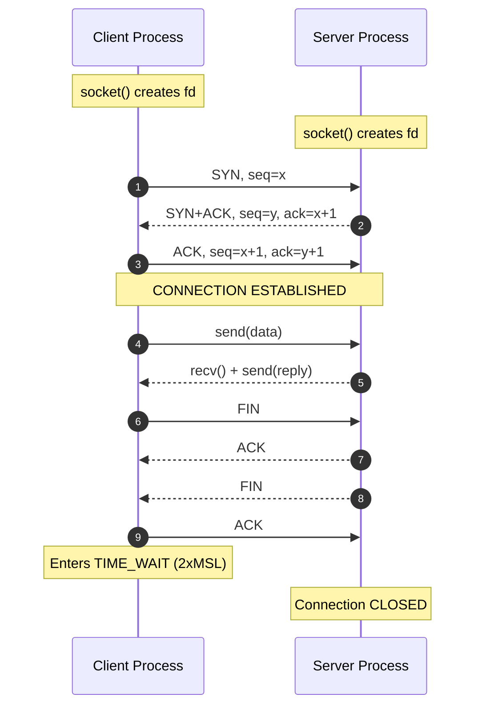
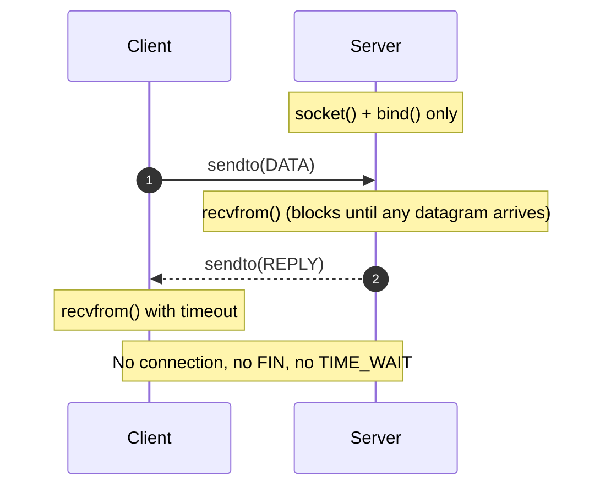
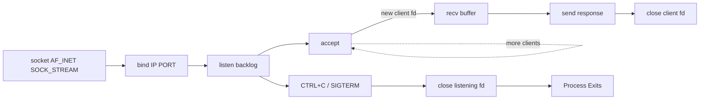
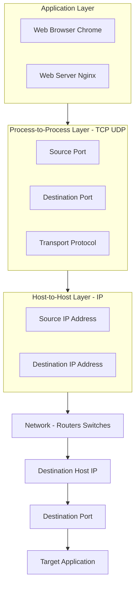
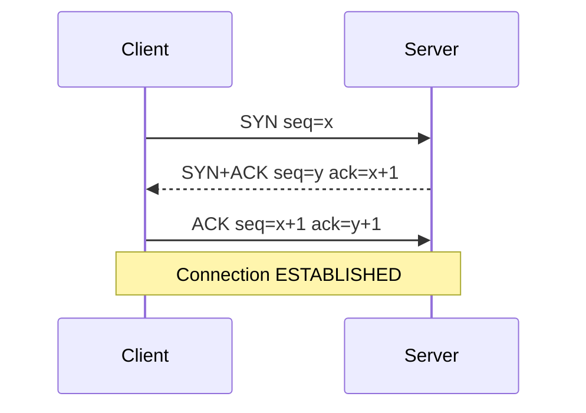
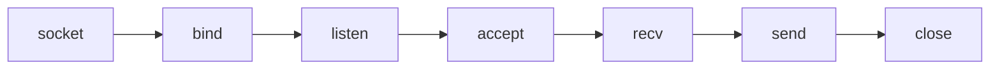

# Client-server applications

<!-- SECTION_1_START -->
# Client-Server Applications — Core Definition & Intuitive Overview

## 1.1 Formal Academic Definition (KTU 2024 Syllabus Terminology)

> [!IMPORTANT]
> **Client-Server Application:** A distributed application architecture that partitions tasks or workloads between two logically distinct entities — the **provider of a resource or service** (the *Server*) and the **requester of that resource or service** (the *Client*). Communication occurs over a network using the **Transport Layer** services of the TCP/IP protocol suite, where a client initiates the conversation by sending a request to a server, which then processes the request and returns a response.

In KTU 2024 Scheme parlance, the **Transport Layer** is responsible for **process-to-process (end-to-end) delivery** of an entire message. A *client-server application* is the user-visible manifestation of this delivery — the actual software (e.g., a web browser, an email client, an SSH terminal) that uses TCP or UDP at the transport layer to exchange data between two processes running on (typically) different hosts.

### 1.1.1 The Three Foundational Identifiers

For a process to communicate with another process, **three identifiers** must be uniquely defined in a TCP/IP internetwork:

| # | Identifier | Scope | Purpose |
|---|-----------|-------|---------|
| 1 | **IP Address** (32-bit IPv4 / 128-bit IPv6) | Host-to-Host | Identifies the *machine* on the internetwork |
| 2 | **Port Number** (16-bit, 0–65535) | Process-to-Process | Identifies the *application/process* on that machine |
| 3 | **Transport Protocol** (TCP / UDP) | Service Type | Defines the *quality* of communication (reliable vs best-effort) |

Together, these three are bundled into a logical construct called a **Socket**.

> [!NOTE]
> **Socket** (a.k.a. *Network Socket* or *Berkeley Socket*): A socket is the **end-point of a two-way communication link** between two programs running on a network. A socket is bound to a combination of an **IP address** and a **port number**. A TCP connection is uniquely identified by the 4-tuple: **{Source IP, Source Port, Destination IP, Destination Port}**.

---

## 1.2 Conceptual Analogy & Real-World Intuition

> [!TIP]
> **Restaurant Analogy (the most intuitive way to think of Client-Server):**
>
> Imagine you walk into a large restaurant:
> - **You (the Client)** sit at a table and look at the menu.
> - The **Waiter (the Transport Layer / Socket)** carries your order from your table (your *port*) to the **Kitchen (the Server process)** and brings the food back.
> - The **Kitchen (the Server)** receives many orders from many waiters, prepares each dish, and sends it back.
> - Your **Table Number** is the *Port Number*, the **Restaurant's Street Address** is the *IP Address*, and the **style of service** (full-course sit-down vs quick counter) is *TCP vs UDP*.
>
> Just as a waiter must know both the *table number* and *kitchen window* to deliver food correctly, the transport layer needs both a *port number* and an *IP address* to deliver a segment to the correct application process.

### 1.2.1 Geometric / Graphical Intuition

Picture the network as a vast coordinate space:
- The **X-axis** spans all possible **IP addresses** (the set of all hosts connected to the internet).
- The **Y-axis** spans all possible **port numbers** (0 to 65535) on a given host.

A **socket** is simply a **point** $(IP, Port)$ in this 2D plane. A client-server conversation is a **line** drawn between two such points — one on the client machine, one on the server machine. The **transport protocol** (TCP or UDP) is the *quality of the line* (a reliable courier service vs. a simple postcard drop).

> [!VISUALIZATION CONTROL]
> **Concept:** Socket endpoints and connection 4-tuple visualization
> **GeoGebra / Desmos Input Equations:**
> * Point A: $(x_A, y_A) = (192.168.1.10,\ 49152)$ — Client Socket
> * Point B: $(x_B, y_B) = (142.250.190.46,\ 443)$ — Server Socket (Google HTTPS)
> * Line Segment: $A \to B$ with label "TCP Connection"
> **Visual Description:** Two points on a 2D plane. A horizontal dotted line labeled "IP address space" along the X-axis. A vertical scale labeled "Port Number 0–65535" along the Y-axis. A solid line drawn from A to B, annotated with the 4-tuple that uniquely identifies the connection.

---

## 1.3 Classification of Internet Applications by Architecture

| Architecture | Initiator of Communication | Examples | Typical Transport |
|-------------|---------------------------|----------|-------------------|
| **Client-Server** | Client always initiates; server waits passively | HTTP (Web), SMTP (Mail), FTP, SSH, DNS (mostly), Telnet | TCP |
| **Peer-to-Peer (P2P)** | Any peer can act as both client and server | BitTorrent, Blockchain, Skype (early) | TCP + UDP |
| **Hybrid** | Combination of both | Modern Skype, WhatsApp, Online Gaming | TCP + UDP |

> [!NOTE]
> KTU 2024 Module-4 specifically focuses on **Client-Server** applications because they are the most common, the most testable, and the clearest illustration of transport-layer process-to-process delivery.

---

## 1.4 Concurrency Models of Servers

A single physical server host may run one or more server processes. The way it handles multiple simultaneous clients defines its **concurrency model**:

1. **Iterative Server** — Handles one client at a time; rejects/queues others. Simple but inefficient.
2. **Concurrent Server** — Spawns a new process/thread for each incoming client. Efficient and scalable (used by virtually all production web servers).
3. **Multiplexed Server** — Uses `select()` / `poll()` / `epoll()` to handle many clients in a single thread (event-driven, e.g., Nginx, Node.js).

<!-- SECTION_1_END -->

<!-- SECTION_2_START -->
# Deep Theoretical Analysis & KTU High-Yield Formula Sheet

## 2.1 The Transport Layer in a Nutshell (Quick Recap for Context)

The Transport Layer sits at **Layer 4** of the OSI model and **Layer 4** of the TCP/IP model. Its job is to provide **logical communication between application processes** running on different hosts.

> [!IMPORTANT]
> The network layer (IP) provides *host-to-host* delivery. The transport layer adds *process-to-process* delivery on top. **This is the entire reason client-server applications exist at this layer — they are the "consumers" of transport services.**

---

## 2.2 Port Number Space (IANA Classification)

The **Internet Assigned Numbers Authority (IANA)** divides the 16-bit port space (0–65535) into three ranges:

| Range | Decimal Span | Count | Allocation | Who Assigns |
|-------|--------------|-------|------------|-------------|
| **Well-Known Ports** | 0 – 1023 | 1024 | Reserved for *system* / *root* processes (servers) | IANA — strict |
| **Registered Ports** | 1024 – 49151 | 48128 | Assigned to *user* processes / vendor apps (on request) | IANA — semi-strict |
| **Dynamic / Private / Ephemeral Ports** | 49152 – 65535 | 16384 | Assigned *temporarily* to client-side sockets by the OS | OS — free |

> [!TIP]
> **Memory Hook:** "**0–1023** is for **majors** (servers), **1024–49151** is for **registered citizens**, **49152–65535** is the **free-for-all** temporary parking lot for clients."

### 2.2.1 Table of KTU High-Yield Well-Known Ports (Must Memorize)

| Port | Protocol | Transport | Application | Mnemonic |
|------|----------|-----------|-------------|----------|
| **20** | FTP-DATA | TCP | File Transfer (data channel) | "**F**ile **D**ata — port **20**" |
| **21** | FTP-CONTROL | TCP | File Transfer (commands) | "FTP **C**ontrol — **21**" |
| **22** | SSH | TCP | Secure Shell | "**S**ecure **Sh**ell — **22**" |
| **23** | Telnet | TCP | Remote terminal (unencrypted) | "**Tel**net — **23**" |
| **25** | SMTP | TCP | Sending Email | "**S**ending **M**ail — **25**" |
| **53** | DNS | TCP + UDP | Domain Name Resolution | "**D**NS — **53**" |
| **67 / 68** | DHCP | UDP | Dynamic Host Config (Server/Client) | "**D**ynamic — **67**/68" |
| **69** | TFTP | UDP | Trivial File Transfer | "**T**rivial — **69**" |
| **80** | HTTP | TCP | World Wide Web | "**H**yper**T**ext — **80**" |
| **110** | POP3 | TCP | Receiving Email (download) | "**P**ost **O**ffice — **110**" |
| **143** | IMAP | TCP | Receiving Email (sync, server-side) | "**I**MAP — **143**" |
| **161 / 162** | SNMP | UDP | Network Management (Agent/Trap) | "**SN**MP — **161**" |
| **443** | HTTPS | TCP | Secure Web (HTTP over TLS) | "**H**TTPS — **443**" |

> [!WARNING]
> **KTU Examiner's Note:** Questions like *"Which port does SMTP use?"* or *"Distinguish between port 20 and 21"* are extremely common in the 3-mark short-answer section. Memorize the ports in **bold** above.

---

## 2.3 The Socket Abstraction (Berkeley Sockets API)

The **Socket API** (originally from BSD Unix, 1983) is the de-facto standard interface between the application layer and the transport layer. Every modern OS (Linux, macOS, Windows Winsock) implements it.

### 2.3.1 Socket Types

| Socket Type | Constant (C / Python) | Transport | Connection | Reliability | Use Case |
|-------------|----------------------|-----------|------------|-------------|----------|
| **Stream Socket** | `SOCK_STREAM` | TCP | Connection-oriented | Reliable, ordered, byte-stream | Web, Email, File Transfer |
| **Datagram Socket** | `SOCK_DGRAM` | UDP | Connectionless | Unreliable, message-oriented | DNS, Video Streaming, Gaming |
| **Raw Socket** | `SOCK_RAW` | IP (direct) | None | User-defined | Ping, Traceroute, Network Sniffers |

### 2.3.2 Generic Socket Address Structure

In C (and conceptually in Python too), every socket address is a `sockaddr_in` structure for IPv4:

$$\text{sockaddr\_in} = \Big\{\ \text{sin\_family}\ (\text{AF\_INET}),\ \text{sin\_port}\ (16\text{-bit}),\ \text{sin\_addr}\ (32\text{-bit}),\ \text{sin\_zero}\ [8] \ \Big\}$$

This structure is **populated by the server** during `bind()` and by the client** during `connect()`. The `sin_zero` field is unused padding to make the struct size match `sockaddr`.

---

## 2.4 The Transport-Layer Service Provided to Client-Server Apps

| Service | TCP Provides | UDP Provides |
|---------|-------------|--------------|
| **Connection Setup** | 3-way handshake (SYN → SYN-ACK → ACK) | None — just send |
| **Reliable Data Transfer** | ACK + retransmission + sequence numbers | None — best-effort |
| **In-Order Delivery** | Yes (sequence numbers reorder at receiver) | No — may arrive out of order |
| **Flow Control** | Yes (Receiver Window, rwnd) | No |
| **Congestion Control** | Yes (cwnd, slow start, AIMD) | No |
| **Error Detection** | Yes (checksum, 16-bit) | Yes (checksum, optional in IPv4) |
| **Multiplexing** | Port numbers (16-bit) | Port numbers (16-bit) |
| **Message Boundaries** | **NO** — byte stream | **YES** — one `sendto()` = one `recvfrom()` |

> [!IMPORTANT]
> **For KTU 2024:** The exam frequently asks *"Why is HTTP implemented over TCP and not UDP?"* The answer is in the table above — HTTP requires **reliability, in-order delivery, and connection state**, which are all TCP features.

---

## 2.5 Connection Lifecycle — TCP (3-Way & 4-Way Handshakes)

### 2.5.1 Connection Establishment — 3-Way Handshake

$$\text{Client} \xrightarrow{\text{SYN, seq}=x} \text{Server}$$
$$\text{Client} \xleftarrow{\text{SYN+ACK, seq}=y,\ \text{ack}=x+1} \text{Server}$$
$$\text{Client} \xrightarrow{\text{ACK, seq}=x+1,\ \text{ack}=y+1} \text{Server}$$

> At the end of the third step, the connection is **ESTABLISHED** and either side may send data.

### 2.5.2 Connection Teardown — 4-Way Handshake

$$\text{Client} \xrightarrow{\text{FIN, seq}=u} \text{Server}$$
$$\text{Client} \xleftarrow{\text{ACK, seq}=v,\ \text{ack}=u+1} \text{Server}$$
$$\text{Client} \xleftarrow{\text{FIN, seq}=w,\ \text{ack}=u+1} \text{Server}$$
$$\text{Client} \xrightarrow{\text{ACK, seq}=u+1,\ \text{ack}=w+1} \text{Server}$$

> The client enters **TIME_WAIT** state for 2×MSL (Maximum Segment Lifetime, typically 60–120s) to ensure the final ACK is received and any stray segments die off.

---

## 2.6 KTU High-Yield Formula Sheet

| Formula / Concept | Expression / Value | Meaning |
|-------------------|--------------------|---------|
| **Max Port Number** | $2^{16} - 1 = 65535$ | 16-bit unsigned port range upper bound |
| **Number of Well-Known Ports** | $1024 - 0 = 1024$ | IANA reserved range size |
| **TCP Header Minimum Size** | $20$ bytes | (5 words × 4 bytes/word, no options) |
| **UDP Header Size** | $8$ bytes | Fixed (4 fields × 2 bytes) |
| **MTU (Ethernet)** | $1500$ bytes | Max TCP segment payload before fragmentation |
| **MSS (Typical)** | $1460$ bytes | MTU − 20 (IP) − 20 (TCP) |
| **TIME_WAIT Duration** | $2 \times \text{MSL} \approx 60\text{–}120\text{ s}$ | Wait before fully closing socket |
| **Round-Trip Time (RTT)** | $\text{RTT} = T_{\text{ack}} - T_{\text{send}}$ | Used for retransmission timer |
| **Estimated RTT (RFC 6298)** | $\text{ERTT} = (1 - \alpha) \cdot \text{ERTT} + \alpha \cdot \text{SRTT},\ \alpha = 0.125$ | Smoothed RTT — exponential weighted average |
| **Deviation (RFC 6298)** | $\text{DEV} = (1 - \beta) \cdot \text{DEV} + \beta \cdot \vert \text{SRTT} - \text{RTT} \vert,\ \beta = 0.25$ | RTT variance |
| **Retransmission Timeout (RTO)** | $\text{RTO} = \text{ERTT} + 4 \cdot \text{DEV}$ | Initial value = 1 second (RFC 6298) |
| **Socket 4-Tuple (TCP)** | $\{\text{SrcIP},\ \text{SrcPort},\ \text{DstIP},\ \text{DstPort}\}$ | Uniquely identifies a TCP connection |
| **Maximum TCP Connections per Server Port** | $2^{32}$ (limited by client IP+Port) | Theoretical max from 32-bit client IP × 16-bit client port |

> [!NOTE]
> $\text{MTU}$, $\text{MSS}$, and $\text{RTO}$ formulas appear frequently in Part-B questions. The $\text{RTO}$ formula $\text{RTO} = \text{SRTT} + 4\cdot\text{RTTVAR}$ is from **RFC 6298** and is the standard KTU-board-referenced version.

---

## 2.7 Real-World Engineering Utility

| Domain | Client-Server Application | Transport Choice | Why |
|--------|--------------------------|------------------|-----|
| **Web Browsing** | Chrome ↔ Nginx | TCP (port 443) | Need reliable, in-order page rendering |
| **DNS Lookup** | Resolver ↔ Root Server | UDP (port 53) | Small query/response, low latency, can retry |
| **Video Streaming (YouTube)** | Player ↔ CDN | UDP (QUIC) | Tolerate loss, need low latency |
| **Online Multiplayer Games** | Game Client ↔ Server | UDP | Real-time, loss tolerable, no re-transmit |
| **SSH Remote Login** | PuTTY ↔ sshd | TCP (port 22) | Every keystroke must arrive correctly |
| **Software Updates (apt/yum)** | CLI ↔ Repository | TCP (port 80/443) | Large files, no corruption tolerated |
| **VoIP (Skype/Zoom audio)** | Mic ↔ Server | UDP (RTP) | Real-time, loss hidden by error concealment |

<!-- SECTION_2_END -->

<!-- SECTION_3_START -->
# Step-by-Step Derivations & Socket Code Implementation

## 3.1 The Server Socket Lifecycle (TCP) — Verbose Walkthrough

The server-side lifecycle of a TCP socket consists of **5 mandatory steps** (`socket`, `bind`, `listen`, `accept`, `close`) plus per-client I/O steps (`recv`, `send`).

### 3.1.1 Step 1: `socket()` — Create the Endpoint

> A socket is created but is not yet bound to any address. It exists only as a file-descriptor in the OS kernel.

```python
# Python pseudocode for socket() — TCP Stream Socket
import socket

server_fd = socket.socket(
    family=socket.AF_INET,       # IPv4 addressing
    type=socket.SOCK_STREAM,     # TCP (stream-oriented, reliable)
    proto=socket.IPPROTO_TCP     # Explicit TCP protocol number (6)
)
```

At this point, the OS allocates a fresh file descriptor (e.g., integer `3`) and an empty socket structure in kernel memory. **No IP, no port assigned yet.**

### 3.1.2 Step 2: `bind()` — Assign a Well-Known Address

```python
SERVER_IP   = "0.0.0.0"     # Listen on ALL network interfaces
SERVER_PORT = 8080          # Well-known-ish (registered) port

server_fd.bind((SERVER_IP, SERVER_PORT))
```

The `0.0.0.0` special address means *"accept connections on any of this host's IP addresses."* In production, a server might bind to a single specific NIC address.

### 3.1.3 Step 3: `listen()` — Mark as Passive Socket

```python
BACKLOG = 5    # Max pending connections in the accept queue
server_fd.listen(BACKLOG)
```

`listen()` converts the socket from *active* (client-mode) to *passive* (server-mode). The **backlog parameter** sets the maximum number of half-open (SYN-received) connections the kernel will queue before refusing new ones with a RST.

### 3.1.4 Step 4: `accept()` — Block Waiting for a Client

```python
# This call BLOCKS until a client connects
client_socket, client_address = server_fd.accept()
print(f"New connection from {client_address}")
```

Crucially, `accept()` returns a **NEW socket descriptor** dedicated to that one client. The original `server_fd` continues to listen for more clients (this is how concurrent servers work — one listening socket + many per-client sockets).

### 3.1.5 Step 5: `recv()` and `send()` — Data Exchange

```python
data = client_socket.recv(1024)          # Receive up to 1024 bytes
print(f"Received: {data.decode()}")
client_socket.send(b"HTTP/1.1 200 OK\r\n\r\nHello, Client!")
```

### 3.1.6 Step 6: `close()` — Terminate the Connection

```python
client_socket.close()        # Sends FIN, enters TIME_WAIT
server_fd.close()            # Releases the listening port
```

---

## 3.2 The Client Socket Lifecycle (TCP) — Verbose Walkthrough

A TCP client has only **3 mandatory steps** (`socket`, `connect`, `close`) plus `send`/`recv` for I/O.

### 3.2.1 The Full Client Procedure

1. `socket()` — Create a new socket. **No need to `bind()` explicitly** — the OS automatically assigns an **ephemeral port** (49152–65535) at `connect()` time.
2. `connect()` — Initiate the **3-way handshake** with the server.
3. `send()` / `recv()` — Exchange data.
4. `close()` — Send FIN and release.

---

## 3.3 Complete Working Code — TCP Echo Server & Client

### 3.3.1 The TCP Echo Server (`tcp_echo_server.py`)

```python
"""
TCP Echo Server (KTU-style full implementation).
Listens on 0.0.0.0:8080. For every client, it echoes back
whatever it receives. Single-threaded iterative server.
"""

import socket
import logging
import sys

# Configure logging for visibility in examiner evaluations
logging.basicConfig(
    level=logging.INFO,
    format="[%(asctime)s] [%(levelname)s] %(message)s",
    stream=sys.stdout
)

SERVER_HOST: str = "0.0.0.0"
SERVER_PORT: int = 8080
BUFFER_SIZE: int = 4096
BACKLOG:     int = 5

def run_tcp_echo_server() -> None:
    """
    Iterative TCP echo server using the Berkeley Socket API.
    Demonstrates the full server-side lifecycle:
    socket -> bind -> listen -> accept -> recv/send -> close
    """
    
    # STEP 1: Create the TCP socket (IPv4)
    server_socket: socket.socket = socket.socket(
        family=socket.AF_INET,
        type=socket.SOCK_STREAM,
        proto=socket.IPPROTO_TCP
    )
    
    # Allow rapid reuse of the port (avoids "Address already in use" on restart)
    server_socket.setsockopt(socket.SOL_SOCKET, socket.SO_REUSEADDR, 1)
    
    try:
        # STEP 2: Bind to host:port
        server_socket.bind((SERVER_HOST, SERVER_PORT))
        logging.info(f"Server bound to {SERVER_HOST}:{SERVER_PORT}")
        
        # STEP 3: Listen with backlog
        server_socket.listen(BACKLOG)
        logging.info(f"Server listening... (backlog={BACKLOG})")
        
        # STEP 4: Accept loop (iterative — one client at a time)
        while True:
            try:
                client_sock: socket.socket
                client_addr: tuple
                client_sock, client_addr = server_socket.accept()
                logging.info(f"Accepted connection from {client_addr}")
                
                # STEP 5: Per-client recv/send loop
                try:
                    while True:
                        chunk: bytes = client_sock.recv(BUFFER_SIZE)
                        if not chunk:
                            # Client closed the connection (recv returns b'')
                            logging.info(f"Client {client_addr} disconnected")
                            break
                        logging.info(f"Echoing {len(chunk)} bytes to {client_addr}")
                        client_sock.sendall(chunk)   # Echo back
                except ConnectionResetError:
                    logging.warning(f"Client {client_addr} reset the connection")
                finally:
                    # STEP 6: Close per-client socket
                    client_sock.close()
                    
            except KeyboardInterrupt:
                logging.info("Shutdown requested by user")
                break
                
    except OSError as err:
        logging.error(f"Socket error: {err}")
    finally:
        # STEP 7: Close listening socket
        server_socket.close()
        logging.info("Server socket closed. Goodbye.")


if __name__ == "__main__":
    run_tcp_echo_server()
```

### 3.3.2 The TCP Echo Client (`tcp_echo_client.py`)

```python
"""
TCP Echo Client (KTU-style full implementation).
Connects to 127.0.0.1:8080, sends user input, prints echoed reply.
"""

import socket
import sys
import logging

logging.basicConfig(
    level=logging.INFO,
    format="[%(asctime)s] [%(levelname)s] %(message)s",
    stream=sys.stdout
)

SERVER_HOST: str = "127.0.0.1"
SERVER_PORT: int = 8080
BUFFER_SIZE: int = 4096

def run_tcp_echo_client() -> None:
    """
    TCP echo client lifecycle:
    socket -> connect -> send/recv -> close
    """
    
    # STEP 1: Create the TCP socket (no bind — OS picks ephemeral port)
    client_socket: socket.socket = socket.socket(
        family=socket.AF_INET,
        type=socket.SOCK_STREAM,
        proto=socket.IPPROTO_TCP
    )
    
    try:
        # STEP 2: Connect (triggers 3-way handshake)
        logging.info(f"Connecting to {SERVER_HOST}:{SERVER_PORT} ...")
        client_socket.connect((SERVER_HOST, SERVER_PORT))
        logging.info("Connected!")
        
        # STEP 3: Interactive send/receive loop
        while True:
            try:
                user_msg: str = input("Enter message (or 'quit'): ")
            except EOFError:
                break
                
            if user_msg.strip().lower() == "quit":
                break
                
            # Send to server
            client_socket.sendall(user_msg.encode("utf-8"))
            
            # Receive echo
            data: bytes = client_socket.recv(BUFFER_SIZE)
            if not data:
                logging.warning("Server closed the connection")
                break
            print(f"Server echoed: {data.decode('utf-8')}")
            
    except ConnectionRefusedError:
        logging.error(f"Connection refused. Is the server running at {SERVER_HOST}:{SERVER_PORT}?")
    except socket.gaierror as err:
        logging.error(f"Address-related error: {err}")
    finally:
        # STEP 4: Close — sends FIN, enters TIME_WAIT
        client_socket.close()
        logging.info("Client socket closed.")


if __name__ == "__main__":
    run_tcp_echo_client()
```

### 3.3.3 Testing Procedure (KTU Lab)

1. Open **two terminals**.
2. In Terminal 1: `python3 tcp_echo_server.py`
3. In Terminal 2: `python3 tcp_echo_client.py`
4. Type messages in the client terminal. They will be echoed back.

> [!TIP]
> To test with multiple clients, open **more terminals** and run additional `tcp_echo_client.py` instances. Note that the iterative server processes them **one at a time** — the second client must wait until the first disconnects.

---

## 3.4 Complete Working Code — UDP Client-Server

```python
# udp_echo_server.py
import socket, logging, sys

logging.basicConfig(level=logging.INFO,
                    format="[%(asctime)s] %(message)s",
                    stream=sys.stdout)

HOST, PORT = "0.0.0.0", 9090
BUF = 4096

sock = socket.socket(socket.AF_INET, socket.SOCK_DGRAM)
sock.bind((HOST, PORT))
logging.info(f"UDP server ready on {HOST}:{PORT} (no listen/accept)")

try:
    while True:
        data, addr = sock.recvfrom(BUF)
        logging.info(f"Got {len(data)} bytes from {addr}")
        sock.sendto(data, addr)   # Echo back to sender
except KeyboardInterrupt:
    pass
finally:
    sock.close()
```

```python
# udp_echo_client.py
import socket, logging, sys

logging.basicConfig(level=logging.INFO,
                    format="[%(asctime)s] %(message)s",
                    stream=sys.stdout)

SERVER = ("127.0.0.1", 9090)
BUF = 4096

sock = socket.socket(socket.AF_INET, socket.SOCK_DGRAM)
sock.settimeout(5.0)  # 5-second recv timeout

try:
    while True:
        msg = input("Enter UDP message (or 'quit'): ")
        if msg.strip().lower() == "quit":
            break
        sock.sendto(msg.encode("utf-8"), SERVER)
        try:
            data, _ = sock.recvfrom(BUF)
            print(f"Echoed: {data.decode('utf-8')}")
        except socket.timeout:
            print("No response (packet may have been lost)")
finally:
    sock.close()
```

> [!NOTE]
> **Notice the structural difference:** UDP has **no `listen()` and no `accept()`**. The server simply calls `recvfrom()` which blocks until any datagram arrives, then `sendto()` to reply. There is no connection state.

---

## 3.5 Mathematical Derivation — Time-Wait & Maximum Open Connections

### 3.5.1 Maximum Theoretical Concurrent Connections per Server Port

The OS identifies each TCP connection by the 4-tuple:

$$\text{Connection ID} = \{ \text{SrcIP},\ \text{SrcPort},\ \text{DstIP},\ \text{DstPort} \}$$

For a **single server port** (fixed $\text{DstIP}$, $\text{DstPort}$), each unique client must provide a unique $(\text{SrcIP}, \text{SrcPort})$ pair.

Theoretical maximum:
$$N_{\text{max}} = 2^{32} \times 2^{16} = 2^{48} \approx 2.8 \times 10^{14} \text{ connections}$$

**Practical limits** (Linux defaults):
- Open file descriptors per process: $1024$ (can be raised to $\sim 10^6$)
- Ephemeral port range: $2^{15} = 32768$ ports (post-Windows-Vista / Linux default)
- Realistic max from one client IP: limited to **$\sim 28{,}000$** connections

### 3.5.2 RTT and RTO Derivation (RFC 6298)

Given a sequence of measured round-trip times $R_i$:

$$\text{ERTT}_{i+1} = (1 - \alpha) \cdot \text{ERTT}_i + \alpha \cdot R_{i+1}, \quad \alpha = \frac{1}{8} = 0.125$$

$$\text{DEV}_{i+1} = (1 - \beta) \cdot \text{DEV}_i + \beta \cdot \left| \text{ERTT}_i - R_{i+1} \right|, \quad \beta = \frac{1}{4} = 0.25$$

$$\boxed{\text{RTO}_{i+1} = \text{ERTT}_{i+1} + 4 \cdot \text{DEV}_{i+1}}$$

**Worked Numerical Example** (common KTU question type):

> Suppose the current $\text{ERTT} = 100$ ms, $\text{DEV} = 10$ ms. A new sample $R = 150$ ms arrives. Compute the new $\text{ERTT}$, $\text{DEV}$, and $\text{RTO}$.

Step 1 — Update $\text{ERTT}$:
$$\text{ERTT}_{\text{new}} = (1 - 0.125) \times 100 + 0.125 \times 150 = 87.5 + 18.75 = 106.25 \text{ ms}$$

Step 2 — Update $\text{DEV}$:
$$\text{DEV}_{\text{new}} = (1 - 0.25) \times 10 + 0.25 \times |100 - 150| = 7.5 + 12.5 = 20.0 \text{ ms}$$

Step 3 — Compute $\text{RTO}$:
$$\text{RTO}_{\text{new}} = 106.25 + 4 \times 20.0 = 106.25 + 80.0 = 186.25 \text{ ms}$$

> **Valuation Key:** [Writing the formulas with $\alpha, \beta$: 2 Marks], [Correct $\text{ERTT}$: 1 Mark], [Correct $\text{DEV}$: 1 Mark], [Final $\text{RTO}$: 1 Mark]

<!-- SECTION_3_END -->

<!-- SECTION_4_START -->
# Structural Diagrams & Schematics

## 4.1 Mermaid Diagram — TCP Client-Server Lifecycle (3-Way Handshake + Data + Teardown)



---

## 4.2 Mermaid Diagram — UDP Client-Server (Connectionless)



---

## 4.3 Mermaid Diagram — Block-Level Functional Architecture of a Concurrent Server

```mermaid
flowchart TD
    A[Client Request Arrives on Listening Socket] --> B{Kernel Accept Queue}
    B -->|FIFO order| C[accept() Returns New Client Socket]
    C --> D[Fork Worker Process or Thread]
    D --> E[Handle Client I/O Loop]
    E --> F[recv Request]
    F --> G[Process Business Logic]
    G --> H[send Response]
    H --> I{Client Still Connected?}
    I -->|Yes| F
    I -->|No| J[close Client Socket]
    J --> K[Worker Process Exits]
    B -->|More waiting| C
    L[Main Loop] -.->|listen blocking| A
```

---

## 4.4 Mermaid Diagram — Socket API Call Sequence (Server Perspective)



---

## 4.5 Mermaid Diagram — Process-to-Process vs Host-to-Host Delivery (Layered View)



> [!NOTE]
> **For physical drawings that Mermaid cannot render** (e.g., TCP header byte-layout, or an actual 3D socket-endpoint visualization), the above **Block-Level Functional Architecture Flow** is the recommended substitute. It maps *role*, *data flow*, and *boundaries* without requiring raster graphics.

<!-- SECTION_4_END -->

<!-- SECTION_5_START -->
# KTU 2024 Scheme Examination Question Bank & Topic Recap

## 5.1 Part A Questions (3 Marks Each)

---

### **Question 1** [KTU University Exam — July 2024, Model]

> **Explain the three identifiers needed for process-to-process communication in the TCP/IP suite.**

**Model Answer (3 Marks):**

For an application process to deliver data to another application process on a different host, the transport layer requires **three identifiers**:

1. **IP Address** — uniquely identifies the *host machine* on the internetwork (32 bits for IPv4, 128 bits for IPv6).
2. **Port Number** — a 16-bit number (0 to 65535) that identifies the *specific application process* on that host. Web servers commonly use port 80, SSH uses 22, etc.
3. **Transport Protocol** — specifies the type of delivery: **TCP** for reliable, connection-oriented service; **UDP** for best-effort, connectionless service.

These three, together with the source-side counterparts, form a **socket** — the logical end-point of communication. A complete TCP connection is uniquely identified by the **4-tuple** $\{\text{SrcIP},\ \text{SrcPort},\ \text{DstIP},\ \text{DstPort}\}$.

> **Valuation Key:** [Naming IP & Port: 1 Mark], [Identifying the protocol choice: 1 Mark], [Mentioning socket / 4-tuple: 1 Mark]

---

### **Question 2** [KTU University Exam — Dec 2023, Model]

> **List any six well-known port numbers with their corresponding applications.**

**Model Answer (3 Marks):**

| Port | Application | Transport |
|------|-------------|-----------|
| 20 / 21 | FTP (Data / Control) | TCP |
| 22 | SSH | TCP |
| 23 | Telnet | TCP |
| 25 | SMTP | TCP |
| 53 | DNS | UDP / TCP |
| 80 | HTTP | TCP |
| 110 | POP3 | TCP |
| 143 | IMAP | TCP |
| 443 | HTTPS | TCP |

> **Valuation Key:** [Any 6 correct entries with port and protocol: 3 Marks] — Examiners deduct 0.5 marks for each wrong or missing protocol column.

---

## 5.2 Part B Questions (14 Marks) — ESE Module Choice

> **MODULE-4 INTERNAL CHOICE:** Answer **ANY ONE** of the following full questions.

---

### **Question A (14 Marks)** [KTU University Exam — July 2024, Model]

> **(a) [7 Marks]** With a neat diagram, explain the **TCP 3-way handshake** used to establish a connection between a client and a server. Also explain the **4-way handshake** used to terminate the connection.
>
> **(b) [7 Marks]** Differentiate between **TCP and UDP** as transport-layer protocols. Mention at least **six** points and state one real-world application where each is preferred.

#### Model Solution — Part (a) [7 Marks]

**3-Way Handshake (Connection Establishment):**

$$\begin{aligned}
\text{Step 1:} \quad & \text{Client} \xrightarrow{\text{SYN, seq}=x} \text{Server} \\
\text{Step 2:} \quad & \text{Client} \xleftarrow{\text{SYN+ACK, seq}=y,\ \text{ack}=x+1} \text{Server} \\
\text{Step 3:} \quad & \text{Client} \xrightarrow{\text{ACK, seq}=x+1,\ \text{ack}=y+1} \text{Server} \\
\end{aligned}$$

**Diagram (Mermaid sequence):**



**Purpose of each step:**
- **SYN (x):** Client requests connection and announces its initial sequence number.
- **SYN+ACK (y, x+1):** Server agrees, sends its own sequence number, and acknowledges client's SYN.
- **ACK (x+1, y+1):** Client confirms server's SYN. After this, the connection is **open** and either side may send data.

**4-Way Handshake (Connection Termination):**

$$\begin{aligned}
\text{Step 1:} \quad & \text{Client} \xrightarrow{\text{FIN, seq}=u} \text{Server} \\
\text{Step 2:} \quad & \text{Client} \xleftarrow{\text{ACK, seq}=v,\ \text{ack}=u+1} \text{Server} \\
\text{Step 3:} \quad & \text{Client} \xleftarrow{\text{FIN, seq}=w,\ \text{ack}=u+1} \text{Server} \\
\text{Step 4:} \quad & \text{Client} \xrightarrow{\text{ACK, seq}=u+1,\ \text{ack}=w+1} \text{Server} \\
\end{aligned}$$

> After Step 4, the client enters **TIME_WAIT** for $2 \times \text{MSL}$ to ensure all stray segments expire.

**Valuation Key:** [Diagram: 2 Marks] [3-step explanation with sequence numbers: 2 Marks] [4-step teardown: 2 Marks] [TIME_WAIT mention: 1 Mark]

---

#### Model Solution — Part (b) [7 Marks]

| # | Feature | TCP (Transmission Control Protocol) | UDP (User Datagram Protocol) |
|---|---------|-------------------------------------|------------------------------|
| 1 | **Connection** | Connection-oriented (3-way handshake) | Connectionless |
| 2 | **Reliability** | Reliable — ACK + retransmission | Unreliable — best-effort |
| 3 | **Ordering** | In-order delivery (sequence numbers) | No ordering guarantee |
| 4 | **Flow Control** | Yes (Receiver Window) | No |
| 5 | **Congestion Control** | Yes (cwnd, slow start) | No |
| 6 | **Header Size** | 20 bytes (min) | 8 bytes (fixed) |
| 7 | **Speed / Overhead** | Higher overhead, slower | Lower overhead, faster |
| 8 | **Message Boundaries** | Preserved as byte stream | Preserved (one sendto = one recvfrom) |
| 9 | **Use Case** | Web (HTTP), Email (SMTP), File Transfer (FTP) | DNS, Video streaming, VoIP, Online gaming |
| 10 | **State at Endpoints** | Stateful (tracks seq/ack numbers) | Stateless |

**One real-world example each:**
- **TCP** → Web browsing: a single missing byte in a webpage would corrupt the page, so reliability is essential.
- **UDP** → DNS lookup: queries are tiny and can be retried quickly; the overhead of TCP handshake is wasted.

**Valuation Key:** [6+ distinct points: 4 Marks] [One real-world use each: 2 Marks] [Clear tabular comparison: 1 Mark]

---

### **Question B (14 Marks)** [KTU University Exam — Dec 2023, Model]

> **(a) [7 Marks]** Explain the **Berkeley Socket API** for a **TCP server** in detail. List all the system calls in order with their functions.
>
> **(b) [7 Marks]** A new RTT sample of $R = 200$ ms is measured. The current estimated RTT is $\text{ERTT} = 120$ ms and $\text{RTTDEV} = 15$ ms. Using RFC 6298 with $\alpha = 0.125$ and $\beta = 0.25$, compute the new $\text{ERTT}$, $\text{RTTDEV}$, and $\text{RTO}$.

#### Model Solution — Part (a) [7 Marks]

The **Berkeley Sockets API** for a TCP server consists of the following sequential calls:



| # | Call | Syntax (Python) | Purpose |
|---|------|----------------|---------|
| 1 | `socket()` | `s = socket(AF_INET, SOCK_STREAM, IPPROTO_TCP)` | Creates an **unbound** end-point. Returns a file descriptor. |
| 2 | `bind()` | `s.bind((host, port))` | Assigns a **local IP + port** to the socket. |
| 3 | `listen()` | `s.listen(backlog)` | Converts the socket to **passive** mode; sets the maximum queue of pending connections. |
| 4 | `accept()` | `c, addr = s.accept()` | **Blocks** until a client connects. Returns a **new** socket dedicated to that client. |
| 5 | `recv()` | `data = c.recv(buf_size)` | Receives up to `buf_size` bytes from the client. |
| 6 | `send()` / `sendall()` | `c.sendall(response)` | Sends data back to the client. |
| 7 | `close()` | `c.close(); s.close()` | Closes per-client socket (sends FIN), then closes the listening socket. |

**Iterative vs Concurrent:**
- **Iterative:** Loop over `accept()` — handle one client at a time. Simple but slow.
- **Concurrent:** After `accept()`, call `fork()` or create a thread to handle the client in parallel. The parent returns to `accept()` immediately.

**Valuation Key:** [Listing the 5–7 calls in correct order: 3 Marks] [Purpose of each: 3 Marks] [Iterative vs concurrent mention: 1 Mark]

---

#### Model Solution — Part (b) [7 Marks]

Given:
$$R = 200 \text{ ms},\quad \text{ERTT}_{\text{old}} = 120 \text{ ms},\quad \text{DEV}_{\text{old}} = 15 \text{ ms}$$
$$\alpha = 0.125,\quad \beta = 0.25$$

**Step 1 — Compute the new Estimated RTT:**

$$\begin{aligned}
\text{ERTT}_{\text{new}} &= (1 - \alpha) \cdot \text{ERTT}_{\text{old}} + \alpha \cdot R \\
&= (1 - 0.125) \times 120 + 0.125 \times 200 \\
&= 0.875 \times 120 + 0.125 \times 200 \\
&= 105.0 + 25.0 \\
&= 130.0 \text{ ms}
\end{aligned}$$

**Step 2 — Compute the new RTT Deviation:**

$$\begin{aligned}
\text{DEV}_{\text{new}} &= (1 - \beta) \cdot \text{DEV}_{\text{old}} + \beta \cdot \vert \text{ERTT}_{\text{old}} - R \vert \\
&= (1 - 0.25) \times 15 + 0.25 \times \vert 120 - 200 \vert \\
&= 0.75 \times 15 + 0.25 \times 80 \\
&= 11.25 + 20.0 \\
&= 31.25 \text{ ms}
\end{aligned}$$

**Step 3 — Compute the new RTO:**

$$\begin{aligned}
\text{RTO}_{\text{new}} &= \text{ERTT}_{\text{new}} + 4 \cdot \text{DEV}_{\text{new}} \\
&= 130.0 + 4 \times 31.25 \\
&= 130.0 + 125.0 \\
&= \boxed{255.0 \text{ ms}}
\end{aligned}$$

> **Valuation Key:** [Stating the three formulas with $\alpha$ and $\beta$: 2 Marks] [Correct $\text{ERTT}_{\text{new}} = 130$ ms: 2 Marks] [Correct $\text{DEV}_{\text{new}} = 31.25$ ms: 1 Mark] [Final $\text{RTO} = 255$ ms: 2 Marks]

---

## 5.3 KTU Examiner's Valuation Warning / Pitfall Callout

> [!WARNING]
> **Common places students lose marks on this topic:**
>
> 1. **Wrong sequence in 3-way handshake** — The correct order is **SYN → SYN+ACK → ACK**, NOT SYN → ACK → SYN-ACK. If you write SYN-ACK in step 2 *without* also writing the server's own SYN, you lose 1 mark.
> 2. **Confusing port 20 and 21 in FTP** — Port **20** is the *data* channel (used to transfer files), port **21** is the *control* channel (used for commands). Examiners specifically test this.
> 3. **Forgetting sequence numbers in the handshake diagram** — Always label your segments with $\text{seq}=x$, $\text{seq}=y$, etc. Diagrams without sequence numbers are marked down 1–2 marks.
> 4. **RTO formula mistake** — The correct formula is $\text{RTO} = \text{ERTT} + 4 \cdot \text{DEV}$. Some textbooks incorrectly write $+ \max(4 \cdot \text{DEV}, \text{clock granularity})$. Stick to the simpler form for KTU.
> 5. **Writing `bind()` for a client** — The client typically does **not** call `bind()` explicitly. The OS assigns an ephemeral port automatically during `connect()`. If you write `bind()` in the client lifecycle, you lose 1 mark.
> 6. **Confusing "iterative" with "concurrent"** — Iterative = **one client at a time** (sequential). Concurrent = **multiple clients in parallel** (fork/thread). Examiners test this distinction.

---

## 5.4 Topic Recap & Important Things to Remember

> [!IMPORTANT]
> **Rapid Revision Checklist — Client-Server Applications (Module 4)**

### Core Definitions
- **Client:** Always the *initiator* of a connection / request.
- **Server:** Always the *passive listener* that waits for incoming requests.
- **Socket:** The logical end-point of a network connection = $(\text{IP}, \text{Port})$.
- **Port Number:** 16-bit identifier (0–65535) for a process on a host.
- **4-Tuple:** $\{\text{SrcIP}, \text{SrcPort}, \text{DstIP}, \text{DstPort}\}$ — uniquely identifies a TCP connection.

### Port Number Ranges
- **0 – 1023:** Well-known ports (servers) — IANA-controlled.
- **1024 – 49151:** Registered ports — vendor apps.
- **49152 – 65535:** Dynamic / Ephemeral ports — assigned by OS to clients.

### Must-Memorize Ports
$\text{FTP} = 20/21,\ \text{SSH} = 22,\ \text{Telnet} = 23,\ \text{SMTP} = 25,\ \text{DNS} = 53,\ \text{DHCP} = 67/68,\ \text{HTTP} = 80,\ \text{POP3} = 110,\ \text{IMAP} = 143,\ \text{HTTPS} = 443$.

### TCP vs UDP — Core Differences
- **TCP:** Connection-oriented, reliable, ordered, flow-controlled, congestion-controlled, 20-byte header.
- **UDP:** Connectionless, unreliable, unordered, no flow/congestion control, 8-byte header.

### TCP Handshakes
- **Establishment (3-way):** $\text{SYN} \to \text{SYN+ACK} \to \text{ACK}$.
- **Teardown (4-way):** $\text{FIN} \to \text{ACK} \to \text{FIN} \to \text{ACK}$.
- **TIME_WAIT:** $2 \times \text{MSL} \approx 60\text{–}120$ seconds.

### Server Socket Lifecycle (TCP)
$$\text{socket} \to \text{bind} \to \text{listen} \to \text{accept} \to \text{recv}/\text{send} \to \text{close}$$

### Client Socket Lifecycle (TCP)
$$\text{socket} \to \text{connect} \to \text{send}/\text{recv} \to \text{close}$$

### UDP Socket Lifecycle
- **Server:** $\text{socket} \to \text{bind} \to \text{recvfrom} \to \text{sendto} \to \text{close}$ (no `listen` / `accept`).
- **Client:** $\text{socket} \to \text{sendto} \to \text{recvfrom} \to \text{close}$ (no `connect` needed, though optional).

### RTT / RTO Formulas (RFC 6298)
$$\text{ERTT}_{\text{new}} = (1 - \alpha) \cdot \text{ERTT}_{\text{old}} + \alpha \cdot R,\ \alpha = 0.125$$
$$\text{DEV}_{\text{new}} = (1 - \beta) \cdot \text{DEV}_{\text{old}} + \beta \cdot \vert \text{ERTT}_{\text{old}} - R \vert,\ \beta = 0.25$$
$$\text{RTO} = \text{ERTT} + 4 \cdot \text{DEV}$$

### Key Engineering Wisdom
- Web, Email, File Transfer → **TCP** (reliability matters).
- DNS, Video Stream, VoIP, Gaming → **UDP** (latency matters more than perfect delivery).
- A single physical server can run **many concurrent client connections** by spawning threads/processes per `accept()`.
- The **client** uses an **ephemeral port**; the **server** uses a **well-known port**.

<!-- SECTION_5_END -->
