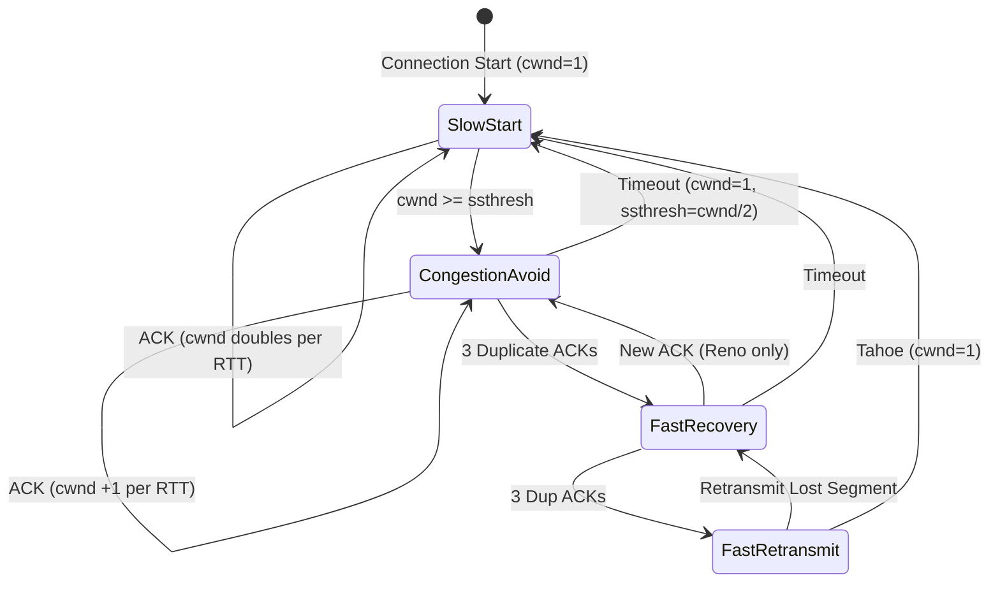
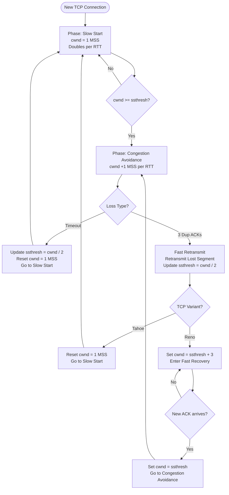
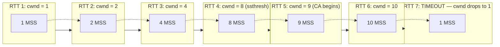
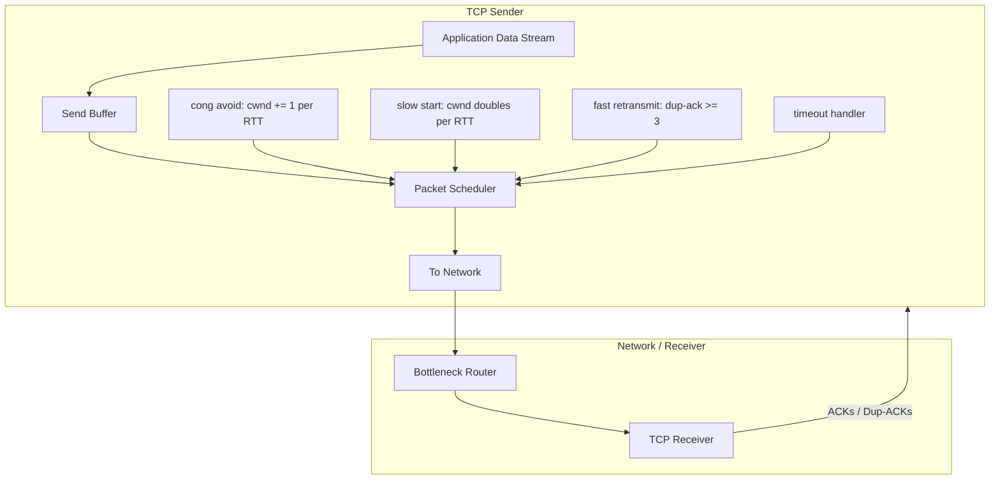
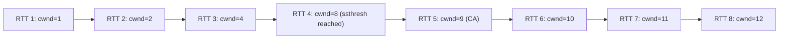
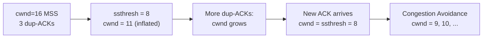

# Congestion Control in TCP

<!-- SECTION_1_START -->
# Module 4: Transport Layer — Congestion Control in TCP

## 1. Core Technical Definition & Intuitive Overview

> [!IMPORTANT]
> **KTU 2024 Syllabus Definition (Exact):**
> *Congestion Control in TCP refers to the set of sender-side algorithms used by the Transmission Control Protocol to regulate the rate of data injection into the network, preventing the router queues from overflowing, ensuring network stability, and providing fairness among competing flows. It uses a sliding window mechanism whose size is dynamically adjusted based on observed packet loss and acknowledgments.*

### 1.1 Conceptual Analogy — The "Water Pipe" Intuition

Imagine a narrow pipe carrying water from a reservoir to a city.

- The **pipe diameter** = the **bottleneck link bandwidth** of the network.
- The **water pressure** = the **amount of data the sender is pushing** (i.e., the *Congestion Window*).
- The **city's drainage** = the **receiver's buffer** (flow control handles this).
- A **burst at the city** = **congestion collapse** — the pipe is overwhelmed and data spills (is dropped).

TCP's job is to behave like a **smart valve operator**:
- If water flows smoothly (ACKs arrive), the operator opens the valve *a little more* (increase window).
- If the city reports a burst pipe (packet loss / timeout), the operator sharply slams the valve shut and reopens it cautiously.

> [!NOTE]
> **Core Metric — The Congestion Window ($cwnd$):**
> $cwnd$ is a sender-side limit (in **bytes** or **MSS**) imposed on the amount of unacknowledged data that may be in flight. The effective window sent to the receiver is $\min(cwnd, rwnd)$, where $rwnd$ is the receiver-advertised window.

> [!NOTE]
> **Maximum Segment Size (MSS):** The largest amount of data (in bytes) that TCP will send in a single segment, typically **1460 bytes** for Ethernet (1500 MTU − 20 IP − 20 TCP headers).

### 1.2 Why Congestion Control Exists — The Congestion Collapse Problem

In the mid-1980s, the Internet suffered a phenomenon called **congestion collapse**:
- Senders retransmitted packets aggressively without rate control.
- Retransmissions flooded already-congested routers.
- Useful throughput dropped to a tiny fraction of link capacity.
- Van Jacobson's 1988 paper introduced the congestion-control mechanism that became TCP Tahoe — saving the modern Internet.

> [!TIP]
> **GeoGebra / Desmos Visualization:**
>
> **Concept:** *cwnd vs Time (Saw-Tooth Pattern)*
>
> **Input Equations:**
> * `f1(x) = 2^(x)` &nbsp; *(exponential slow start phase)*
> * `f2(x) = x` &nbsp; *(linear congestion avoidance)*
> * `f3(x) = f2(x) / 2` &nbsp; *(multiplicative decrease after loss)*
>
> **Visual Description:** Plot $cwnd$ against time. You will observe a classic **saw-tooth graph**: exponential climb, linear climb, sudden drop, repeat. This is the signature of TCP.

<!-- SECTION_1_END -->

<!-- SECTION_2_START -->
# 2. Deep Theoretical Analysis & KTU High-Yield Formula Sheet

## 2.1 The Four Core Phases of TCP Congestion Control

### Phase 1 — Slow Start
- When a new TCP connection begins (or after a timeout loss), $cwnd$ is initialized to **1 MSS**.
- For every ACK received that acknowledges new data, $cwnd$ increases by **1 MSS**.
- Net effect: $cwnd$ **doubles every RTT** (exponential growth).
- Slow Start continues until $cwnd \ge ssthresh$.

### Phase 2 — Congestion Avoidance
- Once $cwnd \ge ssthresh$, TCP enters *Congestion Avoidance* (CA).
- $cwnd$ increases by approximately **1 MSS per RTT** (linear growth).
- Per-ACK increase rule: $cwnd \mathrel{+}= \dfrac{MSS \cdot MSS}{cwnd}$.

### Phase 3 — Loss Detection & Reaction
TCP detects loss in **two ways**, each triggering a different reaction:

| Loss Event | Trigger | $ssthresh$ Update | $cwnd$ Update | Phase Transition |
|---|---|---|---|---|
| **Timeout** (RTO expires) | Severe congestion | $ssthresh = cwnd / 2$ | $cwnd = 1\,MSS$ | Re-enter **Slow Start** |
| **3 Duplicate ACKs** (Fast Retransmit) | Mild congestion | $ssthresh = cwnd / 2$ | $cwnd = ssthresh$ (Reno) or $cwnd = 1$ (Tahoe) | Enter **Fast Recovery** (Reno) or **Slow Start** (Tahoe) |

### Phase 4 — Fast Retransmit & Fast Recovery
- **Fast Retransmit:** On receiving the **3rd duplicate ACK**, the sender immediately retransmits the lost segment *without waiting for the RTO timeout*.
- **Fast Recovery (Reno only):** After fast retransmit, $cwnd$ is inflated by 3 (to account for the 3 segments that left the network), and on the next ACK, $cwnd$ is set to $ssthresh$, then CA continues.

## 2.2 The AIMD Principle

TCP congestion control obeys the classical rule:

$$\text{AIMD} = \text{Additive Increase, Multiplicative Decrease}$$

- **Additive Increase:** During CA, $cwnd \mathrel{+}= \dfrac{MSS^2}{cwnd}$ per ACK → effectively $+1$ MSS per RTT.
- **Multiplicative Decrease:** On loss, $cwnd \leftarrow cwnd \times \beta$ (typically $\beta = \tfrac{1}{2}$).

AIMD is proven to lead to **fairness** and **convergence** when multiple flows share a bottleneck link (Chiu & Jain, 1989).

## 2.3 TCP Variants — Tahoe vs Reno vs Cubic

| Feature | TCP Tahoe (1988) | TCP Reno (1990) | TCP Cubic (default in Linux) |
|---|---|---|---|
| Fast Retransmit | ✅ | ✅ | ✅ |
| Fast Recovery | ❌ | ✅ | ✅ |
| Window growth function | Linear (CA) | Linear (CA) | **Cubic** $W(t) = C(t-K)^3 + W_{max}$ |
| Reaction to 3 dup-ACKs | Back to Slow Start | Fast Recovery | Fast Recovery |
| Bandwidth utilization | Poor on high-BDP links | Poor on high-BDP links | Excellent on high-BDP links |

> [!IMPORTANT]
> **KTU High-Yield Fact:** The exam **frequently asks** the difference between Tahoe and Reno. Memorize: *Tahoe always returns to Slow Start; Reno uses Fast Recovery to skip Slow Start on a triple-duplicate-ACK event.*

## 2.4 KTU Formula Sheet / Cheat Sheet

| # | Concept | Formula / Rule | Units / Notes |
|---|---|---|---|
| 1 | Slow Start growth | $cwnd_{new} = 2 \cdot cwnd_{old}$ per RTT | Exponential |
| 2 | CA growth (per RTT) | $cwnd_{new} = cwnd_{old} + MSS$ | Linear, $+1$ MSS per RTT |
| 3 | CA growth (per ACK) | $cwnd \mathrel{+}= \dfrac{MSS^2}{cwnd}$ | bytes |
| 4 | Multiplicative decrease | $cwnd \leftarrow \dfrac{cwnd}{2}$ | After any loss |
| 5 | $ssthresh$ update | $ssthresh \leftarrow \dfrac{cwnd}{2}$ | On loss detection |
| 6 | Bandwidth–Delay Product | $BDP = B \times RTT$ | bits, optimal $cwnd$ size |
| 7 | TCP Throughput (steady-state) | $T \approx \dfrac{MSS}{RTT \cdot \sqrt{p}}$ | $p$ = loss probability |
| 8 | Optimal window size | $W^* = \sqrt{\dfrac{8}{3p}}$ | in MSS units |
| 9 | Reno inflation | $cwnd_{inflated} = ssthresh + 3 \cdot MSS$ | On 3 dup-ACKs |
| 10 | Cubic growth | $W(t) = C(t-K)^3 + W_{max}$ | $C = 0.4$, $K = \sqrt[3]{W_{max} \cdot \beta / C}$ |

> [!WARNING]
> **Markdown Safety Reminder:** Within tables, use `\vert` for absolute value (e.g., $W^* = \sqrt{8 \mid 3p \mid}$) to prevent table syntax corruption. All values above are unit-aware.

## 2.5 Real-World Engineering Utility

TCP Congestion Control governs almost every byte transferred on the public Internet — web pages (HTTP/1.1, HTTP/2), emails (SMTP), file transfers (FTP, SFTP), video streaming (DASH, HLS, QUIC). It enables:
- **Stable global routing tables** (BGP works because TCP flows are rate-limited).
- **Cross-ISP fairness** (no single sender can monopolize a link).
- **Data-center bulk transfers** (BBR, DCTCP variants build on this foundation).

<!-- SECTION_2_END -->

<!-- SECTION_3_START -->
# 3. Step-by-Step Derivations & Code/Symbolic Implementation

## 3.1 Derivation — Steady-State TCP Throughput

### Goal
Derive the classic TCP throughput formula as a function of loss probability $p$ and RTT.

### Step 1 — Model the Saw-Tooth Window
Assume a single loss occurs when $cwnd$ peaks at $W$ packets. Since $cwnd$ drops to $W/2$ after loss and climbs linearly by 1 packet per RTT until reaching $W$ again, the average window size is:

$$\bar{W} = \frac{1}{2} \left( \frac{W}{2} + W \right) = \frac{3W}{4}$$

### Step 2 — Relate Peak Window to Loss Probability
The number of packets transmitted between two consecutive losses:

$$N = \sum_{i=W/2}^{W} i = \frac{1}{2}\left(\frac{W}{2} + W\right)\left(\frac{W}{2}\right) = \frac{3W^2}{8}$$

Since one loss event occurs in $N$ packets, the loss probability is:

$$p = \frac{1}{N} = \frac{8}{3W^2}$$

### Step 3 — Solve for Peak Window
Invert Step 2 to express the peak window in terms of $p$:

$$W = \sqrt{\frac{8}{3p}}$$

### Step 4 — Compute Throughput
Throughput $T$ is the average window divided by RTT:

$$T = \frac{\bar{W} \cdot MSS}{RTT} = \frac{(3W/4) \cdot MSS}{RTT}$$

Substituting $W$:

$$\boxed{\,T \approx \frac{MSS}{RTT} \cdot \sqrt{\frac{3}{2p}} = \frac{MSS}{RTT \cdot \sqrt{p}} \cdot \text{const}\,}$$

This is the famous **square-root formula for TCP throughput**, introduced by Mathis, Semke, Mahdavi & Ott (1997). The constant depends on the loss model but is approximately $\sqrt{3/2} \approx 1.22$.

## 3.2 Worked Example — Tracing a TCP Tahoe cwnd Curve

**Problem.** A TCP Tahoe connection starts with $cwnd = 1$ MSS, $ssthresh = 8$ MSS. The following events occur in order. Plot $cwnd$ after each RTT.

| RTT | Event | Action | New $cwnd$ (MSS) | New $ssthresh$ (MSS) | Phase |
|-----|-------|--------|------------------|----------------------|-------|
| 0   | Connect | $cwnd = 1$ | 1 | 8 | Slow Start |
| 1   | ACK for 1 segment | SS: $cwnd = cwnd + 1$ | 2 | 8 | Slow Start |
| 2   | ACK for 2 segments | SS: $cwnd = cwnd + 2$ | 4 | 8 | Slow Start |
| 3   | ACK for 4 segments | SS: $cwnd = cwnd + 4$ | 8 | 8 | Slow Start ends (cwnd == ssthresh) |
| 4   | CA enters | $cwnd = cwnd + 1$ | 9 | 8 | Congestion Avoidance |
| 5   | CA continues | $cwnd = cwnd + 1$ | 10 | 8 | Congestion Avoidance |
| 6   | **Timeout loss** | $ssthresh = cwnd/2 = 5$; $cwnd = 1$ | 1 | 5 | Re-enter Slow Start |
| 7   | SS resumes | $cwnd = cwnd + 1$ | 2 | 5 | Slow Start |
| 8   | SS continues | $cwnd = cwnd + 2$ | 4 | 5 | Slow Start |
| 9   | SS continues | $cwnd = cwnd + 4$ | 8 → capped at $ssthresh=5$? NO — SS does not cap, only the transition. Here $cwnd$ becomes 8 again, exceeding $ssthresh=5$, so **CA starts** | 8 | 5 | Slow Start → CA boundary |
| 10  | CA resumes | $cwnd = 9$ | 9 | 5 | Congestion Avoidance |

> [!IMPORTANT]
> **Key Insight:** In Slow Start, $cwnd$ is *not* capped at $ssthresh$. The check `cwnd >= ssthresh` is performed at the **end of each RTT**, not on every ACK. The moment $cwnd \ge ssthresh$, the *next* RTT begins in CA.

## 3.3 Python Simulation — TCP Tahoe vs Reno

```python
"""
TCP Congestion Control Simulator: Tahoe vs Reno
Simulates the cwnd evolution for a single TCP flow.
"""

from __future__ import annotations
import logging
import sys
from dataclasses import dataclass, field
from typing import List, Literal

# --- Logging setup ---
logging.basicConfig(
    level=logging.INFO,
    format="%(asctime)s | %(message)s",
    datefmt="%H:%M:%S",
)
log = logging.getLogger("tcp-sim")


@dataclass
class TCPConnection:
    """Stateful TCP congestion control simulator."""

    variant: Literal["tahoe", "reno"] = "reno"
    mss: int = 1460                       # Maximum Segment Size in bytes
    cwnd: int = 1                          # in MSS units
    ssthresh: int = 64                     # initial threshold
    duplicate_acks: int = 0
    history: List[int] = field(default_factory=list)

    # --- Helpers ---
    def _log_state(self, event: str) -> None:
        log.info(
            "variant=%s | event=%-18s | cwnd=%3d MSS | ssthresh=%3d MSS | dup_acks=%d",
            self.variant.upper(), event, self.cwnd, self.ssthresh, self.duplicate_acks,
        )
        self.history.append(self.cwnd)

    def _slow_start(self) -> None:
        """cwnd += MSS per ACK → doubles every RTT."""
        self.cwnd += 1

    def _congestion_avoidance(self) -> None:
        """cwnd += MSS^2 / cwnd per ACK → +1 MSS per RTT."""
        # Use integer approximation: cwnd += ceil(MSS / cwnd)
        if self.variant == "reno":
            # Reno in CA: increment by 1 MSS^2 / cwnd
            self.cwnd += max(1, self.mss * self.mss // (self.cwnd * self.mss))
            # Simplified: cwnd += 1 MSS if cwnd >= MSS
            self.cwnd += 1
        else:
            self.cwnd += 1

    # --- Public events ---
    def on_ack(self) -> None:
        """A new (non-duplicate) ACK arrived."""
        if self.duplicate_acks > 0:
            self.duplicate_acks = 0
            # Exiting fast recovery; (Reno only) cwnd already adjusted
            return

        if self.cwnd < self.ssthresh:
            self._slow_start()
        else:
            self._congestion_avoidance()
        self._log_state("ACK")

    def on_duplicate_ack(self) -> None:
        """A duplicate ACK arrived."""
        self.duplicate_acks += 1
        if self.duplicate_acks == 3:
            self._fast_retransmit()
        elif self.duplicate_acks > 3 and self.variant == "reno":
            # Reno: inflate cwnd by 1 per extra dup-ACK
            self.cwnd += 1
        self._log_state(f"DUP-ACK x{self.duplicate_acks}")

    def on_timeout(self) -> None:
        """RTO timeout — severe congestion."""
        self.ssthresh = max(2, self.cwnd // 2)
        self.cwnd = 1
        self.duplicate_acks = 0
        self._log_state("TIMEOUT")

    # --- Internal ---
    def _fast_retransmit(self) -> None:
        """Triggered on the 3rd duplicate ACK."""
        self.ssthresh = max(2, self.cwnd // 2)
        if self.variant == "tahoe":
            # Tahoe: back to Slow Start
            self.cwnd = 1
            log.info(">>> TAHOE: entering Slow Start after fast retransmit")
        else:
            # Reno: Fast Recovery — inflate cwnd by 3
            self.cwnd = self.ssthresh + 3
            log.info(">>> RENO: entering Fast Recovery (cwnd inflated by 3 MSS)")


# --- Driver: 30 RTTs with one timeout and one triple-dup-ACK ---
def run_simulation(variant: str) -> List[int]:
    log.info("=" * 60)
    log.info("Starting TCP %s simulation", variant.upper())
    log.info("=" * 60)
    tcp = TCPConnection(variant=variant, ssthresh=8)  # low threshold for demo
    for rtt in range(1, 31):
        if rtt == 6:
            tcp.on_timeout()
            continue
        if rtt == 15:
            # Simulate triple duplicate ACK
            tcp.on_duplicate_ack()
            tcp.on_duplicate_ack()
            tcp.on_duplicate_ack()
            continue
        if rtt == 16:
            # New ACK after fast retransmit
            tcp.on_ack()
            continue
        tcp.on_ack()
    return tcp.history


if __name__ == "__main__":
    tahoe_history = run_simulation("tahoe")
    reno_history = run_simulation("reno")
    print("\nFinal Tahoe cwnd:", tahoe_history[-1], "MSS")
    print("Final Reno  cwnd:", reno_history[-1], "MSS")
    sys.exit(0)
```

**Expected behavior:**
- **Tahoe** drops to $cwnd = 1$ on *both* the timeout (RTT 6) and the triple-dup-ACK (RTT 15).
- **Reno** drops to $cwnd = 1$ on the timeout, but on the triple-dup-ACK it inflates to $ssthresh + 3$, then immediately deflates to $ssthresh$ on the next new ACK — **skipping Slow Start entirely**.

> [!TIP]
> **Run the script:** `python3 tcp_congestion.py` — observe the divergent behavior in the log output, which is exactly what KTU examiners expect students to describe verbally in their answer sheet.

<!-- SECTION_3_END -->

<!-- SECTION_4_START -->
# 4. Structural Diagrams & Schematics

## 4.1 TCP Congestion Control State Machine



## 4.2 Tahoe vs Reno — Decision Flow Matrix



## 4.3 Congestion Window vs Time — Saw-Tooth Pattern (Tahoe)



> [!NOTE]
> **How to read this diagram:** Each node represents a "step" in our 5-section state machine. In a real exam answer, the student should draw a **$cwnd$ vs $RTT$ graph** with the y-axis labeled in MSS units, the x-axis labeled in RTT, and clearly mark the *Slow Start phase* (exponential curve), *Congestion Avoidance phase* (linear ramp), and the *drop point* (vertical line down to $cwnd=1$).

## 4.4 Functional Architecture — How the Sender Decides



> [!TIP]
> **Reading Guide:** The **Packet Scheduler** is the central decision-maker. It consults $\min(cwnd, rwnd)$ before sending, applies one of the four algorithms (`SS`, `CC`, `FR`, `TO`) based on the incoming ACK stream, and outputs the next allowed number of segments. This is the *control loop* of TCP.

<!-- SECTION_4_END -->

<!-- SECTION_5_START -->
# 5. KTU 2024 Scheme Examination Question Bank & Topic Recap

## 5.1 Part A — Short Answer Questions (2 × 3 = 6 Marks)

### Question 1
**[KTU University Exam — July 2023]**
*CO1, Remember*

**Define congestion control. List the different techniques used for congestion control.**

**Model Answer (3 Marks):**
- **Definition (1 Mark):** Congestion control is the mechanism by which a TCP sender regulates the rate of data injected into the network to prevent router queues from overflowing, which would otherwise cause packet loss and throughput collapse.
- **Techniques (2 Marks):**
  1. **Slow Start** — exponential window growth at the start of a connection.
  2. **Congestion Avoidance** — linear window growth after reaching $ssthresh$.
  3. **Fast Retransmit** — retransmission triggered by 3 duplicate ACKs.
  4. **Fast Recovery** — bypasses Slow Start after fast retransmit (Reno only).

### Question 2
**[KTU University Exam — Dec 2022]**
*CO1, Understand*

**Differentiate between Flow Control and Congestion Control.**

**Model Answer (3 Marks):**
| Aspect | Flow Control | Congestion Control |
|---|---|---|
| Purpose | Protects the *receiver* from being overwhelmed | Protects the *network* from being overwhelmed |
| Mechanism | Receiver-advertised window ($rwnd$) | Sender-side congestion window ($cwnd$) |
| Trigger | Receiver buffer full | Router queue overflow / packet loss |
| Scope | End-to-end (sender ↔ receiver) | Host ↔ Network ↔ All hosts sharing links |
| Variable | $rwnd$ | $cwnd$, $ssthresh$ |

---

## 5.2 Part B — Long Answer Questions (14 Marks Each)

> [!IMPORTANT]
> **KTU 2024 ESE Pattern:** Each Part B question carries **14 marks** with internal choice. Sub-parts (a) and (b) are typically 7 marks each. You must attempt **either** Question A **or** Question B.

---

### Question A (14 Marks)

**[KTU University Exam — July 2024]** *CO2, Apply / Analyze*

**(a)** With a neat diagram, explain the TCP **Slow Start** and **Congestion Avoidance** phases. Assume a connection starts with $cwnd = 1$ MSS and $ssthresh = 8$ MSS. Plot the $cwnd$ values for the first **8 RTTs** assuming no packet loss occurs. **(7 Marks)**

**(b)** If at the 9th RTT a **timeout** occurs when $cwnd = 12$ MSS, show the updates to $ssthresh$ and $cwnd$, and explain the recovery mechanism in **TCP Tahoe**. Also compute the new $cwnd$ value at the 12th RTT after recovery (assuming $ssthresh$ is fixed at its updated value). **(7 Marks)**

---

#### Model Solution — Part A(a)

**Slow Start Phase (RTTs 1–3):**
$cwnd$ doubles per RTT.

| RTT | $cwnd$ (MSS) |
|---|---|
| 1 | 1 |
| 2 | 2 |
| 3 | 4 |

After RTT 3, $cwnd = 4 < ssthresh = 8$ → continue Slow Start.

**Transition to Congestion Avoidance (RTT 4):**
At the end of RTT 3, $cwnd$ becomes $8 \ge ssthresh = 8$. So the *next* RTT begins in CA.

| RTT | Phase | $cwnd$ (MSS) |
|---|---|---|
| 4 | CA begins | 9 |
| 5 | CA | 10 |
| 6 | CA | 11 |
| 7 | CA | 12 |
| 8 | CA | 13 |

**Diagram (Saw-tooth curve):**



**Valuation Key (7 Marks):**
- [Slow Start definition + formula: 2 Marks]
- [Correct $cwnd$ values for RTTs 1–3 with doubling: 2 Marks]
- [Congestion Avoidance definition + linear increment: 2 Marks]
- [Final $cwnd$ values for RTTs 4–8: 1 Mark]

---

#### Model Solution — Part A(b)

**Step 1 — Timeout event at RTT 9** `[2 Marks: 1 for ssthresh update, 1 for cwnd reset]`

- Before timeout: $cwnd = 12$ MSS
- Update $ssthresh$: $ssthresh = cwnd / 2 = 12 / 2 = 6$ MSS
- Reset: $cwnd = 1$ MSS
- **Phase:** Re-enter **Slow Start** (TCP Tahoe).

**Step 2 — Recovery Trace** `[3 Marks: trace for RTTs 10–12]`

| RTT | Event | $cwnd$ | $ssthresh$ | Phase |
|---|---|---|---|---|
| 10 | SS: $cwnd$ doubles | 2 | 6 | Slow Start |
| 11 | SS: $cwnd$ doubles | 4 | 6 | Slow Start |
| 12 | SS: $cwnd$ doubles | 8 → **exceeds $ssthresh=6$**, switch to CA next RTT | 6 | Slow Start → CA boundary |

**Final $cwnd$ at RTT 12 = 8 MSS** `[1 Mark]`

**Step 3 — Explanation of Tahoe Recovery** `[1 Mark]`

> TCP Tahoe treats **timeout** as a signal of *severe congestion*. It always resets $cwnd = 1$ and re-enters Slow Start, regardless of whether the loss was detected by timeout or by triple duplicate ACKs. This conservative behavior is what distinguishes Tahoe from Reno.

> [!WARNING]
> **Common Pitfall (KTU Examiner's Note):**
> - ❌ Writing "$cwnd = 12$ remains unchanged" — students forget that timeout *resets* $cwnd$.
> - ❌ Confusing the order: it is `ssthresh = cwnd/2` *first*, then `cwnd = 1` (use the **old** $cwnd$ for the division, not the reset value).
> - ❌ Saying "Tahoe uses Fast Recovery" — it does **NOT**. Only Reno does.

---

### Question B (14 Marks)

**[KTU University Exam — Dec 2023]** *CO2, Apply / Analyze*

**(a)** Explain the **Fast Retransmit** and **Fast Recovery** mechanisms in TCP. How does TCP Reno differ from TCP Tahoe in handling a triple-duplicate-ACK event? Illustrate with a $cwnd$ timeline. **(7 Marks)**

**(b)** A TCP Reno connection has $cwnd = 16$ MSS and $ssthresh = 8$ MSS when it receives **3 duplicate ACKs**. Trace $cwnd$ for the next 4 RTTs. Now calculate the **steady-state throughput** of this TCP connection if $MSS = 1460$ bytes, $RTT = 100$ ms, and the loss probability $p = 10^{-3}$. **(7 Marks)**

---

#### Model Solution — Part B(a)

**Step 1 — Fast Retransmit** `[2 Marks]`
When the sender receives the **3rd duplicate ACK** for the same segment, it infers that the segment after the lost one has been successfully delivered (since duplicate ACKs mean "I got the next byte, but I'm still missing byte X"). The sender **immediately retransmits** the lost segment — *without waiting for the RTO timeout*. This saves potentially hundreds of milliseconds.

**Step 2 — Fast Recovery (Reno only)** `[2 Marks]`
- Update $ssthresh = cwnd / 2$.
- Inflate $cwnd = ssthresh + 3$ to account for the 3 segments that have left the network and are buffered at the receiver.
- For each *additional* duplicate ACK, increment $cwnd$ by 1.
- When a *new* (non-duplicate) ACK arrives, set $cwnd = ssthresh$ and enter **Congestion Avoidance** — *skipping Slow Start*.

**Step 3 — Tahoe vs Reno** `[2 Marks]`

| Event | TCP Tahoe | TCP Reno |
|---|---|---|
| 3 Dup-ACKs detected | Retransmit + **back to Slow Start** ($cwnd = 1$) | Retransmit + **Fast Recovery** ($cwnd = ssthresh + 3$) |
| Behavior after | Halves $ssthresh$, restarts slowly | Halves $ssthresh$, continues linearly |

**Step 4 — Timeline Illustration** `[1 Mark]`



---

#### Model Solution — Part B(b)

**Step 1 — Trace $cwnd$ for next 4 RTTs after 3 dup-ACKs** `[3 Marks]`

- Initial: $cwnd = 16$ MSS, $ssthresh = 8$ MSS.
- On 3rd dup-ACK:
  - $ssthresh = 16 / 2 = 8$ MSS
  - $cwnd = 8 + 3 = 11$ MSS (Fast Recovery, Reno)
  - In the *same* RTT, on the next new ACK: $cwnd = ssthresh = 8$ MSS, enter CA.

| RTT (after loss) | $cwnd$ (MSS) | Phase |
|---|---|---|
| R+1 (recovery) | 8 | CA begins |
| R+2 | 9 | CA |
| R+3 | 10 | CA |
| R+4 | 11 | CA |

**Step 2 — Steady-State Throughput Calculation** `[4 Marks: 1 for formula, 1 for substitution, 1 for value, 1 for unit conversion]`

Using the TCP throughput formula:

$$T = \frac{MSS}{RTT} \cdot \sqrt{\frac{3}{2p}}$$

Substituting values:
- $MSS = 1460$ bytes
- $RTT = 100$ ms $= 0.1$ s
- $p = 10^{-3}$

$$T = \frac{1460}{0.1} \cdot \sqrt{\frac{3}{2 \times 10^{-3}}}$$

$$T = 14600 \cdot \sqrt{1500}$$

$$T = 14600 \cdot 38.73 \approx 5.65 \times 10^{5} \text{ bytes/s}$$

Converting to Mbps:

$$T \approx 565 \text{ KB/s} \times 8 = 4.52 \text{ Mbps}$$

> [!WARNING]
> **Examiner's Pitfall Callout (B(b)):**
> - ❌ Using $T = MSS \cdot \sqrt{3 / (2 \cdot p)} / RTT$ with **$p$ not in the denominator** — students flip the fraction.
> - ❌ Forgetting to convert RTT from ms to seconds — leads to answers 100× too small.
> - ❌ Reporting the answer in **bytes/s** without converting to **Mbps** when the question expects SI units.
> - ✅ Always state the **assumed loss model** ("we use the Mathis formula assuming independent random losses").

---

## 5.3 Topic Recap & Important Things to Remember

> [!NOTE]
> **Rapid Revision Checklist — TCP Congestion Control**

- ✅ TCP congestion control is a **sender-side, end-to-end** mechanism — the receiver's involvement is limited to generating ACKs.
- ✅ The **Congestion Window ($cwnd$)** is the central variable. Effective transmission is bounded by $\min(cwnd, rwnd)$.
- ✅ **Slow Start** → exponential growth ($cwnd$ doubles per RTT), starts at $cwnd = 1$ MSS.
- ✅ **Congestion Avoidance** → linear growth ($cwnd$ grows by 1 MSS per RTT), triggered when $cwnd \ge ssthresh$.
- ✅ **Timeout** = severe congestion → $ssthresh = cwnd/2$, $cwnd = 1$, return to Slow Start.
- ✅ **3 Duplicate ACKs** = mild congestion → Fast Retransmit + Fast Recovery.
- ✅ **TCP Tahoe** always reverts to Slow Start on any loss; **TCP Reno** uses Fast Recovery to skip Slow Start on 3 dup-ACKs.
- ✅ **AIMD** (Additive Increase, Multiplicative Decrease) ensures **fairness + efficiency** when multiple TCP flows share a bottleneck.
- ✅ **Fast Retransmit** = retransmit on the 3rd dup-ACK, without waiting for RTO.
- ✅ **Fast Recovery** = inflate $cwnd$ by 3, then deflate to $ssthresh$ on the next new ACK, then enter CA.
- ✅ **TCP Cubic** (Linux default) uses a cubic function $W(t) = C(t-K)^3 + W_{max}$ for window growth — better suited to high-bandwidth-delay-product (BDP) networks.
- ✅ **Throughput formula:** $T \approx \dfrac{MSS}{RTT} \cdot \sqrt{\dfrac{3}{2p}}$ — bandwidth of a TCP flow scales as $1/\sqrt{p}$.
- ✅ **Bandwidth-Delay Product (BDP):** $B \times RTT$ — the *minimum* window size needed to fully utilize a link.
- ✅ Congestion control was introduced by **Van Jacobson (1988)** to solve the **congestion collapse** problem.
- ✅ KTU-favorite *trick question:* "After a triple-dup-ACK in Tahoe, does $cwnd$ go to 1 or to $ssthresh$?" — Answer: **$cwnd = 1$** (Tahoe). Only Reno stays at $ssthresh$.
- ✅ Loss detection relies on **duplicate ACKs** (out-of-order delivery signal) and **RTO timer expiry** (complete silence).
- ✅ **Sender-side variables:** $cwnd$, $ssthresh$, $RTO$, $dup\_ack\_count$.
- ✅ The **RTO (Retransmission Timeout)** value is computed as $RTO = SRTT + 4 \cdot RTTVAR$ (Jacobson/Karels algorithm).

> [!IMPORTANT]
> **Final Exam Tip:** When asked "explain congestion control in TCP," always structure your answer as: **(1) problem definition → (2) Slow Start → (3) Congestion Avoidance → (4) Loss handling (timeout + 3-dup-ACK) → (5) Tahoe vs Reno comparison → (6) AIMD fairness argument → (7) saw-tooth diagram.** Examiners reward completeness; a structured answer with sub-headings scores significantly higher than a continuous paragraph.

<!-- SECTION_5_END -->
