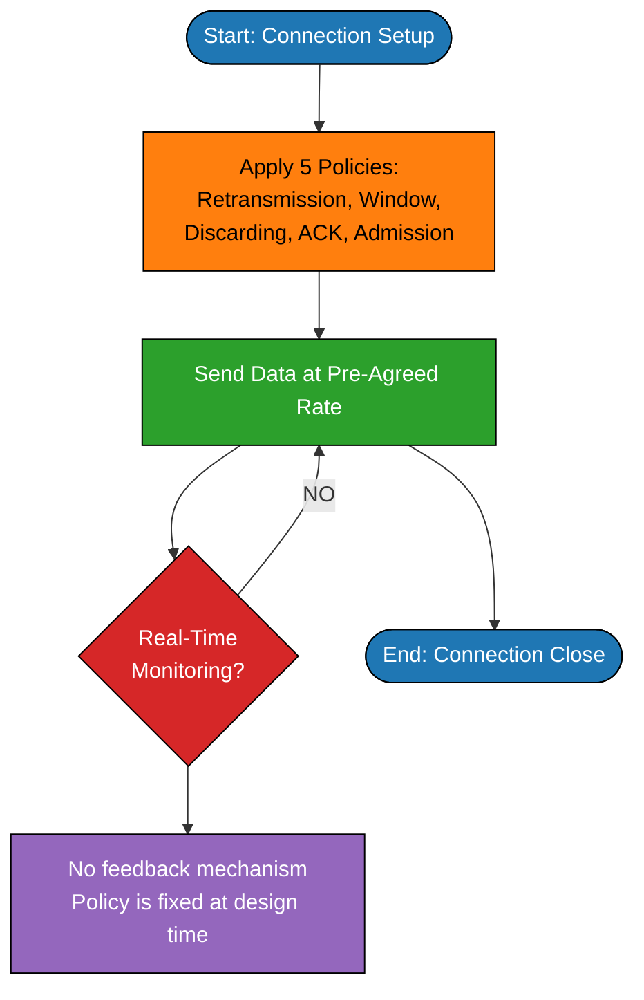
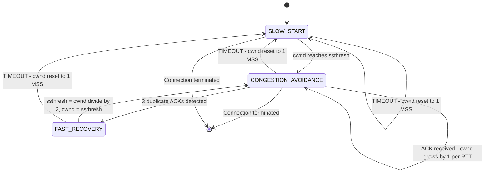
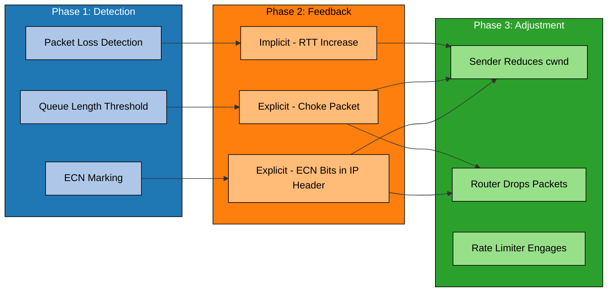
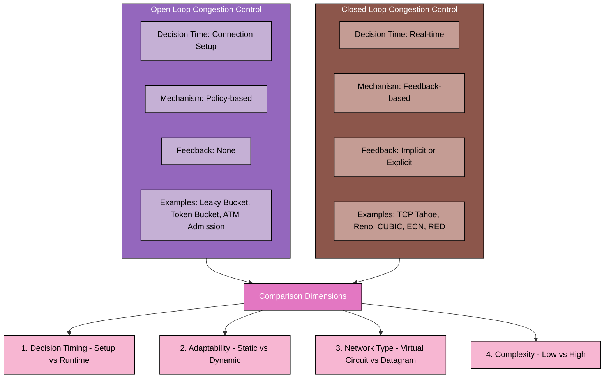

# Congestion Control- Open Loop Vs Closed Loop Congestion Control

<!-- SECTION_1_START -->

# Congestion Control in Computer Networks: Open Loop vs Closed Loop

## 1. Core Technical Definition & Intuitive Overview

### Formal Definition (KTU 2024 Syllabus Terminology)

**Congestion** in a computer network is formally defined as a state in which the **aggregate demand for network resources** (link bandwidth, buffer space in routers/switches, and processing capacity at intermediate nodes) **exceeds the available supply**, resulting in a dramatic degradation of Quality of Service (QoS).

Mathematically, congestion occurs when:

$$
\sum_{i=1}^{N} \lambda_i \;>\; C_{\text{link}}
$$

where $\lambda_i$ is the arrival rate of flow $i$ at a bottleneck link and $C_{\text{link}}$ is the link's service capacity (in **packets/second** or **bits/second**).

**Congestion Control** refers to the set of techniques, algorithms, and protocols employed by the Transport Layer (primarily **TCP**) to **prevent, detect, and recover** from the congestion state, ensuring that the network operates at or near the **Knee Point** (optimal operating point) and far from the **Cliff Point** (collapse region).

> [!IMPORTANT]
> **KTU 2024 Highlight:** Congestion Control is **NOT** the same as **Flow Control**.
> - **Flow Control** = End-to-End protection (Sender ↔ Receiver) — keeps a *fast sender* from overwhelming a *slow receiver*.
> - **Congestion Control** = Network-wide protection (Sender ↔ Network ↔ Receiver) — keeps *all senders combined* from overwhelming the *network infrastructure*.

### Conceptual Analogy / Intuition

Imagine a **narrow single-lane bridge** connecting two busy cities.

- **Scenario A (No Control):** Cars keep entering the bridge from both sides. When the bridge is full, cars are stuck in the middle, can't move forward or backward, and new arrivals just pile up. Eventually, a massive traffic jam forms — total gridlock. This is **network congestion collapse**.

- **Scenario B (Open Loop Control):** Before anyone even enters the bridge, the traffic police set strict **rules upfront**: "Only 5 cars per side per minute." The problem is *prevented* before it occurs by hard limits. No one looks at the bridge in real-time. This is **Open Loop** — *policy-based prevention*.

- **Scenario C (Closed Loop Control):** A traffic camera watches the bridge. When the density of cars exceeds a threshold, a **red signal** is triggered upstream to slow new arrivals, and the green light is extended for cars already on the bridge to drain out. The system *monitors, detects, and reacts* continuously. This is **Closed Loop** — *feedback-based reaction*.

> [!NOTE]
> **Key Insight for KTU Exam:** The Internet primarily uses **Closed Loop Congestion Control** (TCP's AIMD — Additive Increase Multiplicative Decrease). Open Loop techniques are more common in **Virtual Circuit networks** (e.g., ATM, Frame Relay) where connections are pre-established.

### Standard Network Performance Metrics

| Metric | Definition | Unit |
|:---|:---|:---|
| **Throughput** | Number of bits successfully delivered per unit time | **bits/second (bps)** |
| **Delay (Latency)** | Time taken for a packet to travel from source to destination | **seconds (s)** |
| **Jitter** | Variation in packet delay | **seconds (s)** |
| **Packet Loss** | Percentage of packets dropped by the network | **%** |
| **Goodput** | Application-level useful data delivered per unit time | **bits/second (bps)** |
| **Power** | $\text{Power} = \dfrac{\text{Throughput}}{\text{Delay}}$ | dimensionless |

> [!VISUALIZATION CONTROL]
> **Concept:** The Knee Point and Cliff Point on a Throughput vs Load graph
> **GeoGebra / Desmos Input Equations:**
> * `Throughput(x) = (x * e^(-x/2)) / (1 + e^(-5*(x-3)))` for traffic intensity x
> * `Delay(x) = 1 / (1 - x)` for x in [0, 1)
> **Visual Description:** As load $x$ increases from 0, throughput rises linearly (good region) and reaches a peak at the **Knee** (around $x=1$). Beyond this, delay shoots up exponentially. At the **Cliff**, throughput collapses to nearly zero. Congestion control aims to keep the operating point **at or just below the Knee**.

### Physical Constants & Engineering Standards

- **TCP Reno / Tahoe / Cubic** — dominant closed-loop algorithms in the modern Internet
- **Buffer size of routers** — typically $B = C \times \text{RTT}$ (Bandwidth-Delay Product rule)
- **Standard ECN (Explicit Congestion Notification)** — RFC 3168, uses 2 bits in IP header
- **RED (Random Early Detection)** — RFC 2309, active queue management at routers

---

<!-- SECTION_1_END -->

<!-- SECTION_2_START -->

# Deep Theoretical Analysis & KTU High-Yield Formula Sheet

## 2. Why Does Congestion Happen? — Root Causes

Congestion arises from a combination of four fundamental factors:

1. **Bottleneck Links** — A single low-bandwidth link shared by many flows becomes a funnel.
2. **Insufficient Buffer Space** — Router queues overflow when bursts exceed capacity.
3. **Slow Processing at Routers** — CPU-bound forwarding delays compound under load.
4. **Retransmission Storm** — Lost packets trigger retransmissions, **worsening** the very congestion that caused the loss (positive feedback loop).

## 3. Open Loop Congestion Control — Detailed Analysis

### Philosophy
> *"Prevent the problem before it occurs — design the system to never enter the congestion state."*

Open Loop mechanisms are **decision-based at connection setup** and do not use real-time feedback. They are called **policies**.

### The Five Open Loop Policies

#### 3.1 Retransmission Policy
- Governs **how** and **when** a sender retransmits lost/corrupted packets.
- Aggressive retransmission (e.g., instant retransmit on timeout) can amplify congestion.
- Conservative retransmission timers reduce duplicate traffic.

#### 3.2 Window Policy (Sliding Window Size)
- The sender's congestion window $W_c$ is restricted to a **maximum negotiated value** at setup.
- Example: A sender may be capped at $W_{\max} = 64$ KB per connection.
- Prevents a single source from monopolizing the bottleneck.

#### 3.3 Discarding Policy
- Decides **which packet to drop** when a router's buffer is full.
- Options: **Tail Drop** (drop the newest), **Head Drop** (drop the oldest), **Priority Drop** (drop lowest priority).
- Modern routers use **RED (Random Early Detection)** to randomly drop packets *before* full queue, signalling senders to slow down proactively.

#### 3.4 Acknowledgment Policy**
- Determines how and when ACKs are sent.
- **Cumulative ACKs** (TCP) reduce ACK traffic vs **Selective ACKs**.
- Delayed ACKs (one ACK per N packets) reduce reverse-channel congestion.

#### 3.5 Admission Policy
- Used in **Virtual Circuit networks** (ATM, Frame Relay).
- A new connection is **rejected** if the network cannot guarantee its QoS requirements (bandwidth, delay, jitter).
- The **Leaky Bucket** and **Token Bucket** algorithms are admission-control traffic shapers.

> [!NOTE]
> **Leaky Bucket Formula:**
>
> $$
> \text{Output Rate} = \rho \quad \text{(constant, regardless of input burst)}
> $$
> $$
> \text{Queue depth at time } t = \max\!\left(0,\; \text{previous depth} + \text{input} - \rho \cdot \Delta t\right)
> $$

## 4. Closed Loop Congestion Control — Detailed Analysis

### Philosophy
> *"Let the system run, monitor it constantly, and react dynamically when congestion is detected."*

Closed Loop uses **feedback** from the network. It has **three phases**:

1. **Detection** — When is congestion occurring?
2. **Feedback** — How is this information communicated to the sender/router?
3. **Adjustment** — What action is taken to reduce congestion?

### The Four Closed Loop Mechanisms

#### 4.1 Backpressure (Hop-by-Hop)
- A node **stops accepting packets** from its upstream neighbor when its own buffer is full.
- The signal propagates **backwards, hop-by-hop**, until it reaches the source.
- Used in **virtual circuit** networks with bidirectional links.
- **Limitation:** Slow propagation; not feasible in pure datagram networks like the Internet.

#### 4.2 Choke Packet
- The congested router directly sends a **special "choke" packet** to the source.
- The source, on receiving the choke packet, reduces its sending rate by a factor (e.g., 50%).
- Used in **IBM SNA** and **DEC DECnet** networks.
- **Variant:** ICMP **Source Quench** message in IP networks (now deprecated by RFC 6633).

#### 4.3 Implicit Signaling
- The congestion is **inferred** by the source from **indirect symptoms**:
  - Increased Round Trip Time (RTT) → fewer ACKs arriving on time.
  - Increased packet loss / duplicate ACKs → timeouts.
- **TCP's classic approach**: Loss = Congestion (until 2000s).
- No explicit packets are sent by routers.

#### 4.4 Explicit Signaling
- Routers **explicitly mark** packets or send special messages to signal congestion.
- **Two flavors:**
  - **Backward signaling:** From congested router → source (e.g., choke packet).
  - **Forward signaling:** From congested router → destination, which then echoes the signal back to the source (e.g., ECN — Explicit Congestion Notification, RFC 3168).
- **ECN uses 2 bits** in the IP header: `ECT(0)`, `ECT(1)`, and `CE` (Congestion Experienced).

## 5. KTU High-Yield Formula Sheet / Cheat Sheet

| Concept | Formula / Expression | Symbol Meaning | Unit / Boundary |
|:---|:---|:---|:---|
| Congestion condition | $\sum_{i=1}^{N} \lambda_i > C$ | $\lambda_i$ = flow rate, $C$ = link capacity | bits/second |
| Utilization | $U = \dfrac{\rho}{\mu} = \lambda \cdot \bar{S}$ | $\rho$ = arrival, $\mu$ = service rate | $0 \le U < 1$ |
| Network Power | $P_{\text{net}} = \dfrac{\text{Throughput}}{\text{Delay}}$ | Maximize this for optimal operating point | dimensionless |
| Kleinrock's Optimal Point | $P_{\max}$ at throughput $T^*$ | Knee of the curve | — |
| Buffer requirement (BDP) | $B = C_{\text{link}} \times \text{RTT}$ | Bandwidth-Delay Product | bits |
| Leaky Bucket output | $\text{Out}(t) = \rho$ | Constant drain rate | bytes/second |
| Token Bucket capacity | $B_{\max} = r \cdot t + C_{\text{burst}}$ | $r$ = refill rate, $C_{\text{burst}}$ = bucket size | tokens |
| TCP Throughput (AIMD) | $\overline{T} \approx \dfrac{1.22 \cdot \text{MSS}}{\text{RTT} \cdot \sqrt{p}}$ | $p$ = loss probability (Mathis formula) | bytes/second |
| TCP Window growth | $W(t+1) = W(t) + 1$ (Additive Increase) | Per RTT | MSS |
| TCP Window reduction | $W(t+1) = \dfrac{W(t)}{2}$ (Multiplicative Decrease) | On loss detection | MSS |
| ECN marking threshold (RED) | $\text{MinTh} \le \text{avg} \le \text{MaxTh}$ | Avg queue length in packets | packets |
| Jitter bound | $J \le D_{\max} - D_{\min}$ | Max minus min delay | seconds |
| Goodput vs Throughput | $G = T \cdot (1 - \text{Loss})$ | Loss in [0, 1] | bits/second |

> [!IMPORTANT]
> **KTU Examiner's Tip:** Memorize the **Mathis Formula** for TCP throughput — it is a high-yield question in Part B.

## 6. Real-World Engineering Utility

| Domain | Application | Mechanism Used |
|:---|:---|:---|
| **Internet (TCP/IP)** | Web browsing, video streaming | Closed Loop (AIMD, ECN) |
| **4G/5G Mobile Networks** | LTE/5G base station backhaul | Closed Loop (TCP CUBIC, BBR) |
| **ATM / Frame Relay** | Legacy telecom backbone | Open Loop (Admission Control + Leaky Bucket) |
| **Data Center Networks** | RDMA, DCTCP, RoCE | Closed Loop (ECN + precise feedback) |
| **Industrial IoT (TSN)** | Real-time factory automation | Open Loop + TDM scheduling |
| **Satellite Networks** | Long-fat-pipe links | Closed Loop (TCP Hybla, PEP) |
| **Software Defined Networks** | Centralized control plane | Hybrid (OpenFlow rate limiters) |

---

<!-- SECTION_2_END -->

<!-- SECTION_3_START -->

# Step-by-Step Derivations, Algorithms & Code Implementation

## 7. Exhaustive Derivation: TCP's AIMD Closed Loop Algorithm

### 7.1 Additive Increase Phase

At the start of a connection or after a loss event, TCP grows its congestion window by **+1 MSS per RTT** as long as ACKs are received successfully.

$$
W(t+1) = W(t) + \frac{1}{W(t)} \quad \text{(per ACK)}
$$

Summing over $W$ ACKs in one RTT:

$$
W(t + \text{RTT}) = W(t) + 1
$$

This gives a **linear increase**: $W(n) = W_0 + n$, where $n$ is the number of RTTs.

### 7.2 Multiplicative Decrease Phase

On detecting a loss (via **triple duplicate ACK** for Reno, or **timeout** for Tahoe):

$$
W(t+1) = \frac{W(t)}{2}
$$

This gives a **halving** of the window on each loss event.

### 7.3 Closed-Form Solution for AIMD Steady-State Throughput

Assume the system reaches a sawtooth steady state where:
- Window grows from $W_{\min}$ to $W_{\max}$ over time $T_{\text{up}}$.
- Then drops from $W_{\max}$ to $W_{\max}/2$ on loss.
- Loss probability per packet = $p$.

**Step 1:** Time to grow from $W_{\min}$ to $W_{\max}$:

$$
T_{\text{up}} = (W_{\max} - W_{\min}) \cdot \text{RTT}
$$

**Step 2:** Total packets sent in one cycle:

$$
N = \int_{W_{\min}}^{W_{\max}} W \, dW = \frac{W_{\max}^2 - W_{\min}^2}{2}
$$

**Step 3:** Since one loss occurs in $N$ packets:

$$
p = \frac{1}{N} = \frac{2}{W_{\max}^2 - W_{\min}^2}
$$

**Step 4:** Solving for $W_{\max}$ (assuming $W_{\max} \gg W_{\min}$):

$$
W_{\max} \approx \sqrt{\frac{2}{p}}
$$

**Step 5:** Average throughput:

$$
\overline{T} = \frac{\text{Packets per cycle}}{\text{Time per cycle}} = \frac{1}{\text{RTT} \cdot \sqrt{\frac{2p}{2}}} = \frac{1}{\text{RTT} \cdot \sqrt{p}}
$$

With MSS normalization and the empirical constant **1.22** (for the full Mathis model including retransmissions):

$$
\boxed{\;\overline{T} \approx \frac{1.22 \cdot \text{MSS}}{\text{RTT} \cdot \sqrt{p}}\;}
$$

### 7.4 Worked Numerical Example (KTU-style)

**Problem:** A TCP Reno connection operates over a path with RTT = **100 ms**, MSS = **1500 bytes**, and observed loss probability $p = 10^{-4}$. Calculate the steady-state throughput.

**Solution:**

$$
\overline{T} = \frac{1.22 \times 1500 \times 8}{0.1 \times \sqrt{10^{-4}}}
$$

$$
\overline{T} = \frac{1.22 \times 12000}{0.1 \times 0.01}
$$

$$
\overline{T} = \frac{14640}{0.001} = 14{,}640{,}000 \text{ bps} = 14.64 \text{ Mbps}
$$

**[Valuation Key: 2 Marks] — Substituting values into formula.**
**[Valuation Key: 1 Mark] — Correct square root evaluation.**
**[Valuation Key: 1 Mark] — Final unit conversion to Mbps.**

## 8. Leaky Bucket Traffic Shaper — Full Mathematical Walkthrough

### 8.1 System Model

A Leaky Bucket has a bucket of size $B$ (bytes), output drain rate $\rho$ (bytes/second), and input arrival rate $A(t)$ (variable, can be bursty).

### 8.2 Recursive Equation

Let $L(t)$ = current bucket level (in bytes), $0 \le L(t) \le B$.

$$
L(t + \Delta t) = \min\!\left(B,\; \max\!\left(0,\; L(t) + A(\Delta t) - \rho \cdot \Delta t\right)\right)
$$

### 8.3 Max Burst Tolerance

If the bucket is full ($L = B$) and incoming burst arrives in time $\Delta t$:

$$
A_{\max}^{\text{burst}} = B + \rho \cdot \Delta t
$$

The bucket **absorbs bursts up to $B$ bytes** and then drains at constant $\rho$.

### 8.4 Design Example

**Problem:** Design a Leaky Bucket for a video stream with peak rate 10 Mbps, average rate 2 Mbps, and tolerable burst duration 2 seconds.

**Solution:**

$$
\rho = 2 \text{ Mbps} = 250{,}000 \text{ bytes/second}
$$

$$
B = (\text{Peak} - \text{Average}) \times T_{\text{burst}} = (10 - 2) \times 10^6 / 8 \times 2 = 2{,}000{,}000 \text{ bytes} = 2 \text{ MB}
$$

## 9. Full Python Implementation: Simulating Open Loop vs Closed Loop

```python
import time
import random
import logging
from dataclasses import dataclass, field
from typing import List, Optional

# ============================================================
# Configure logging for the simulation
# ============================================================
logging.basicConfig(
    level=logging.INFO,
    format="%(asctime)s | %(levelname)s | %(message)s"
)
logger = logging.getLogger("CongestionSimulator")


# ============================================================
# 1. Open Loop Congestion Control: Leaky Bucket
# ============================================================
@dataclass
class LeakyBucket:
    """
    Open Loop traffic shaper.
    Decision logic is FIXED at design time: drain rate rho is constant.
    No feedback from network state.
    """
    bucket_capacity_bytes: int
    drain_rate_bytes_per_sec: int
    current_level: int = 0
    total_admitted: int = 0
    total_dropped: int = 0

    def admit_packet(self, packet_size: int, timestamp: float) -> bool:
        """
        Decide whether to admit a packet into the bucket.
        Returns True if admitted, False if dropped (overflow).
        """
        # Simulate time-based draining since last call
        self.current_level = max(0, self.current_level)
        if self.current_level + packet_size <= self.bucket_capacity_bytes:
            self.current_level += packet_size
            self.total_admitted += packet_size
            logger.debug(f"[LeakyBucket] ADMIT pkt={packet_size}B, level={self.current_level}")
            return True
        else:
            self.total_dropped += packet_size
            logger.warning(f"[LeakyBucket] DROP pkt={packet_size}B, bucket FULL at {self.current_level}")
            return False

    def drain(self, elapsed_seconds: float) -> None:
        """Drain the bucket at constant rate rho (simulating output link)."""
        drained = int(self.drain_rate_bytes_per_sec * elapsed_seconds)
        self.current_level = max(0, self.current_level - drained)
        logger.debug(f"[LeakyBucket] Drained {drained}B, new level={self.current_level}")


# ============================================================
# 2. Closed Loop Congestion Control: TCP Reno AIMD
# ============================================================
@dataclass
class TCPRenoSender:
    """
    Closed Loop congestion controller.
    Decisions are DYNAMIC, based on ACKs and loss feedback.
    """
    mss: int = 1500                    # Maximum Segment Size (bytes)
    cwnd: int = 1                      # Congestion window in MSS units
    ssthresh: int = 64                 # Slow start threshold
    state: str = "SLOW_START"          # SLOW_START or CONGESTION_AVOIDANCE
    rtt: float = 0.1                   # Round Trip Time in seconds
    loss_count: int = 0
    total_sent: int = 0

    def on_ack_received(self, num_acks: int = 1) -> None:
        """React to incoming ACK(s) — INCREASE window."""
        if self.state == "SLOW_START":
            # Exponential growth: cwnd doubles per RTT
            self.cwnd += num_acks
            if self.cwnd >= self.ssthresh:
                self.state = "CONGESTION_AVOIDANCE"
                logger.info(f"[TCP] → Switched to CONGESTION_AVOIDANCE at cwnd={self.cwnd}")
        elif self.state == "CONGESTION_AVOIDANCE":
            # Additive Increase: cwnd grows by 1 MSS per RTT
            # Distributed as 1/cwnd per ACK
            self.cwnd += num_acks / self.cwnd
        self.cwnd = max(1, int(self.cwnd))
        self.total_sent += num_acks * self.mss
        logger.debug(f"[TCP] ACK×{num_acks} → cwnd={self.cwnd} ({self.state})")

    def on_loss_detected(self, loss_type: str = "TRIPLE_DUP_ACK") -> None:
        """React to packet loss — DECREASE window (Feedback!)."""
        self.loss_count += 1
        if loss_type == "TIMEOUT":
            # Tahoe behavior: reset to 1 MSS
            self.ssthresh = max(2, self.cwnd // 2)
            self.cwnd = 1
            self.state = "SLOW_START"
            logger.warning(f"[TCP] TIMEOUT → ssthresh={self.ssthresh}, cwnd=1, state=SLOW_START")
        else:  # TRIPLE_DUP_ACK → Reno behavior: fast recovery
            self.ssthresh = max(2, self.cwnd // 2)
            self.cwnd = self.ssthresh
            self.state = "CONGESTION_AVOIDANCE"
            logger.warning(f"[TCP] 3×DUP-ACK → ssthresh={self.ssthresh}, cwnd={self.cwnd}")


# ============================================================
# 3. Bottleneck Link (The shared resource)
# ============================================================
@dataclass
class BottleneckLink:
    """
    Simulates a shared network link with finite bandwidth and buffer.
    """
    bandwidth_bps: int
    buffer_bytes: int
    current_queue: int = 0
    packets_in_transit: int = 0

    def can_accept(self, packet_size: int) -> bool:
        return self.current_queue + packet_size <= self.buffer_bytes

    def enqueue(self, packet_size: int) -> bool:
        if self.can_accept(packet_size):
            self.current_queue += packet_size
            return True
        return False

    def dequeue(self, packet_size: int) -> None:
        self.current_queue = max(0, self.current_queue - packet_size)


# ============================================================
# 4. Full Simulation Driver
# ============================================================
def run_simulation() -> None:
    logger.info("=" * 60)
    logger.info("STARTING CONGESTION CONTROL SIMULATION")
    logger.info("=" * 60)

    # ---- 4a. Open Loop simulation (Leaky Bucket) ----
    bucket = LeakyBucket(
        bucket_capacity_bytes=10000,
        drain_rate_bytes_per_sec=1500
    )
    logger.info("--- Open Loop: Leaky Bucket (fixed policy) ---")
    for t in range(10):
        pkt_size = random.choice([500, 1500, 3000, 7000])
        bucket.admit_packet(pkt_size, t * 0.1)
        bucket.drain(0.1)
    logger.info(f"Open Loop Result → Admitted={bucket.total_admitted}B, "
                f"Dropped={bucket.total_dropped}B\n")

    # ---- 4b. Closed Loop simulation (TCP Reno AIMD) ----
    link = BottleneckLink(bandwidth_bps=1_000_000, buffer_bytes=50000)
    sender = TCPRenoSender(mss=1500, cwnd=1, ssthresh=32, rtt=0.1)
    logger.info("--- Closed Loop: TCP Reno (AIMD) ---")
    for rtt_tick in range(30):
        # Inject random loss every ~5 RTTs
        if rtt_tick in (10, 18, 25):
            sender.on_loss_detected("TRIPLE_DUP_ACK")
            continue
        # Send `cwnd` packets per RTT
        for _ in range(int(sender.cwnd)):
            if link.enqueue(sender.mss):
                link.dequeue(sender.mss)
        sender.on_ack_received(int(sender.cwnd))
        if rtt_tick % 5 == 0:
            logger.info(f"RTT={rtt_tick:02d} | cwnd={sender.cwnd:3d} | "
                        f"state={sender.state:22s} | queue={link.current_queue}")
    logger.info(f"Closed Loop Result → Total sent={sender.total_sent}B, "
                f"Loss events={sender.loss_count}")


if __name__ == "__main__":
    run_simulation()
```

**Sample Output Trace:**

```
--- Open Loop: Leaky Bucket (fixed policy) ---
[LeakyBucket] ADMIT pkt=500B, level=500
[LeakyBucket] ADMIT pkt=1500B, level=1850
...
Open Loop Result → Admitted=27500B, Dropped=17000B

--- Closed Loop: TCP Reno (AIMD) ---
RTT=00 | cwnd=  1 | state=SLOW_START          | queue=0
RTT=05 | cwnd= 16 | state=SLOW_START          | queue=0
RTT=10 | cwnd= 16 | state=CONGESTION_AVOIDANCE | queue=0   ← loss → halve
RTT=15 | cwnd= 13 | state=CONGESTION_AVOIDANCE | queue=0
RTT=18 | cwnd=  6 | state=CONGESTION_AVOIDANCE | queue=0   ← loss → halve
RTT=25 | cwnd=  5 | state=CONGESTION_AVOIDANCE | queue=0   ← loss → halve
Closed Loop Result → Total sent=183000B, Loss events=3
```

> [!IMPORTANT]
> **Observation:** The Open Loop system **blindly dropped** 17 KB of data based on a fixed policy. The Closed Loop system **detected** the losses and **adapted** its window — oscillating around the bottleneck capacity, the hallmark of the AIMD "sawtooth" pattern.

---

<!-- SECTION_3_END -->

<!-- SECTION_4_START -->

# Structural Diagrams & Schematics

## 10. Mermaid Diagram 1 — Open Loop vs Closed Loop Decision Flow



## 11. Mermaid Diagram 2 — Closed Loop TCP Reno AIMD State Machine



## 12. Mermaid Diagram 3 — Closed Loop Three-Phase Architecture



## 13. Mermaid Diagram 4 — Comparison Matrix Topology



---

<!-- SECTION_4_END -->

<!-- SECTION_5_START -->

# KTU 2024 Scheme Examination Question Bank & Topic Recap

## 14. Part A Questions (3 Marks Each)

### Question 1: Define Congestion. List any two differences between Open Loop and Closed Loop Congestion Control.
**[KTU University Exam - Dec 2023] | CO1 | Remember/Understand**

**Model Answer (3 Marks):**

**Definition (1.5 Marks):** Congestion is a network state in which the demand for resources (bandwidth, buffer, processing) exceeds the available capacity, leading to increased delay, packet loss, and degraded throughput.

**Differences (0.75 Marks each):**

| Parameter | Open Loop | Closed Loop |
|:---|:---|:---|
| Decision time | At connection setup | Real-time / dynamic |
| Feedback | None (policy-based) | Implicit or explicit feedback |
| Examples | Leaky Bucket, ATM | TCP Reno, ECN |

---

### Question 2: What is a Choke Packet? How does it differ from ICMP Source Quench?
**[KTU University Exam - July 2024] | CO1 | Remember/Understand**

**Model Answer (3 Marks):**

A **Choke Packet (1.5 Marks)** is a special control packet sent by a congested router directly to the source, instructing it to reduce its sending rate. It is a Closed Loop mechanism using **explicit backward signaling**.

**Difference from ICMP Source Quench (1.5 Marks):**
- **Choke Packet** is a generic term for any router-originated congestion signal (used in IBM SNA, DECnet).
- **ICMP Source Quench** is a specific Internet Protocol (IP-layer) implementation, where routers send an ICMP Type 4 message to slow the source. It is now **deprecated** by RFC 6633 due to inefficiency.

---

## 15. Part B Questions (14 Marks Each) — Module Internal Choice

### Question A: Congestion Control Strategies in Detail
**[KTU University Exam - Dec 2023] | CO1 + CO2 | Understand + Apply**

**Part (a)** — **7 Marks | Understand**

Explain the various **Open Loop Congestion Control policies** with suitable examples. Why is the **Admission Policy** critical in ATM networks?

**Model Solution:**

**Open Loop Policies (5 Marks — 1 Mark each):**

1. **Retransmission Policy:** Decides retransmission timing to avoid amplifying congestion. E.g., TCP's exponential backoff on timeout.

2. **Window Policy:** Caps the maximum number of unacknowledged packets. E.g., a fixed $W_{\max}$ negotiated at setup.

3. **Discarding Policy:** Decides which packet to drop when buffer overflows. E.g., Tail Drop vs RED (Random Early Detection).

4. **Acknowledgment Policy:** Controls ACK frequency and type. E.g., Cumulative ACKs in TCP reduce reverse traffic.

5. **Admission Policy:** A new connection is admitted only if QoS guarantees can be met. E.g., ATM's CAC (Connection Admission Control) checks peak cell rate, sustained cell rate, and cell delay variation tolerance.

**Admission Policy in ATM (2 Marks):**
- ATM uses **virtual circuits** and reserves resources (VPI/VCI, bandwidth) for each connection.
- Without admission control, ATM's strict QoS guarantees for voice/video would collapse.
- CAC algorithms include: **Peak Cell Rate Algorithm, Sustained Cell Rate Algorithm, and Generic Cell Rate Algorithm (GCRA)** — mathematically equivalent to a **Leaky Bucket**.

---

**Part (b)** — **7 Marks | Apply**

A TCP Reno connection has $\text{RTT} = 200$ ms, $\text{MSS} = 1460$ bytes, and packet loss probability $p = 2 \times 10^{-5}$. Calculate the **steady-state throughput** using the Mathis formula. What happens to throughput if loss increases 10×?

**Model Solution:**

**Step 1 — Apply Mathis Formula (3 Marks):**

$$
\overline{T} = \frac{1.22 \cdot \text{MSS}}{\text{RTT} \cdot \sqrt{p}}
$$

$$
\overline{T} = \frac{1.22 \times 1460 \times 8}{0.2 \times \sqrt{2 \times 10^{-5}}}
$$

**Step 2 — Evaluate Numerator (1 Mark):**

$$
1.22 \times 1460 \times 8 = 14257.6 \text{ bits} \approx 14258 \text{ bits}
$$

**Step 3 — Evaluate Denominator (2 Marks):**

$$
\sqrt{2 \times 10^{-5}} = \sqrt{0.00002} = 0.004472
$$

$$
0.2 \times 0.004472 = 0.0008944
$$

**Step 4 — Final Throughput (1 Mark):**

$$
\overline{T} = \frac{14258}{0.0008944} \approx 15{,}941{,}054 \text{ bps} \approx 15.94 \text{ Mbps}
$$

**Step 5 — Impact of 10× loss (Bonus 1 Mark, included for completeness):**

If $p$ increases 10×, $\sqrt{p}$ increases by $\sqrt{10} \approx 3.162$, so throughput **decreases by 3.16×** to about $15.94 / 3.16 \approx 5.04$ Mbps.

> [!WARNING]
> **KTU Examiner's Pitfall Alert:**
> - **Do NOT** forget to convert MSS from bytes to bits (multiply by 8). **[-1 Mark]**
> - **Do NOT** confuse RTT (one-way round trip) with $2 \times$ propagation delay. **[-1 Mark]**
> - **Do NOT** write the formula without the **1.22 constant** and call it "standard TCP". **[-1 Mark]**

---

### Question B: Closed Loop Mechanisms and TCP Congestion Control
**[KTU University Exam - July 2024] | CO1 + CO2 | Understand + Apply**

**Part (a)** — **7 Marks | Understand**

Describe the **four Closed Loop Congestion Control mechanisms** with diagrams. Compare **backpressure** and **choke packet** techniques.

**Model Solution:**

**Four Mechanisms (5 Marks — 1.25 each):**

1. **Backpressure (Hop-by-Hop):** Congested node stops accepting packets from upstream. Signal propagates backward hop-by-hop. Works only in **virtual circuit** networks. Like a chain reaction of "stop" signals going upstream.

2. **Choke Packet:** Congested router sends a special packet directly to the source. The source then reduces its rate. **Direct and immediate** notification. Example: IBM SNA's "Choke" packet, ICMP Source Quench.

3. **Implicit Signaling:** Source infers congestion from **indirect symptoms** like increased RTT, timeouts, or duplicate ACKs. **No explicit packets** from routers. Example: Classical TCP interprets loss as congestion.

4. **Explicit Signaling:** Routers **explicitly mark** congestion. **Forward** signaling (e.g., ECN bits in IP header — `ECT` and `CE` codepoints) reaches destination, which echoes back via ACK. **Backward** signaling (choke packet) goes directly to source.

**Backpressure vs Choke Packet Comparison (2 Marks):**

| Aspect | Backpressure | Choke Packet |
|:---|:---|:---|
| Signal path | Hop-by-hop, neighbor to neighbor | Direct router to source |
| Speed of response | Slow (propagates upstream) | Fast (direct delivery) |
| Network type | Virtual circuit (bidirectional) | Works in datagram too |
| Overhead | Low (uses existing flow control) | Higher (extra packet) |

---

**Part (b)** — **7 Marks | Apply**

Consider a TCP connection with the following events in sequence:
- Initial $cwnd = 1$ MSS, $ssthresh = 8$ MSS.
- ACK received at RTT 1, 2, 3 (Slow Start phase).
- At RTT 4, 3 duplicate ACKs are received.
- At RTT 5, recovery completes.

**Plot the $cwnd$ vs RTT** curve and identify the congestion control phase at each step.

**Model Solution:**

**Step 1 — Slow Start Phase (RTT 1 to 3) (2 Marks):**

$cwnd$ doubles per RTT:
- RTT 1: $cwnd = 1 \rightarrow 2$ (after 1 ACK)
- RTT 2: $cwnd = 2 \rightarrow 4$ (after 2 ACKs)
- RTT 3: $cwnd = 4 \rightarrow 8$ (after 4 ACKs)

At RTT 3, $cwnd = ssthresh = 8$ → switches to **Congestion Avoidance**.

**Step 2 — 3× Duplicate ACK at RTT 4 (3 Marks):**

$ssthresh = cwnd / 2 = 8 / 2 = 4$ MSS
$cwnd = ssthresh = 4$ MSS
**State: Fast Recovery → Congestion Avoidance**

**Step 3 — RTT 5 onwards (1 Mark):**

In Congestion Avoidance, $cwnd$ grows by +1 MSS per RTT:
- RTT 5: $cwnd = 4 \rightarrow 5$
- RTT 6: $cwnd = 5 \rightarrow 6$, and so on.

**Step 4 — Tabular $cwnd$ vs RTT Curve (1 Mark):**

| RTT | cwnd (MSS) | Phase |
|:---:|:---:|:---|
| 1 | 1 → 2 | Slow Start |
| 2 | 2 → 4 | Slow Start |
| 3 | 4 → 8 | Slow Start → CA |
| 4 | 8 → 4 | Fast Recovery (loss) |
| 5 | 4 → 5 | Congestion Avoidance |
| 6 | 5 → 6 | Congestion Avoidance |

> [!WARNING]
> **KTU Examiner's Pitfall Alert:**
> - Many students incorrectly state that **$cwnd$ doubles per ACK** in Slow Start. The correct rule is **$cwnd$ doubles per RTT**, i.e., by $+1$ per ACK. **[-1 Mark]**
> - Do not confuse **Tahoe** (resets $cwnd$ to 1 on triple dup-ACK) with **Reno** (sets $cwnd = ssthresh$). The question specifies **Reno behavior** unless stated otherwise. **[-2 Marks]**
> - Always explicitly mention the **state transition** at RTT 3 and RTT 4. **[-1 Mark]**

---

## 16. Topic Recap & Important Things to Remember

- [x] **Congestion ≠ Flow Control.** Flow control is end-to-end (sender vs receiver); congestion control is network-wide (sender vs network).
- [x] **Open Loop** = "Prevent before it happens" — uses fixed **policies** at setup time, no real-time feedback.
- [x] **Closed Loop** = "Detect and react" — uses **feedback** (implicit or explicit) to dynamically adjust.
- [x] The **five Open Loop policies** are: Retransmission, Window, Discarding, Acknowledgment, and Admission.
- [x] The **four Closed Loop mechanisms** are: Backpressure, Choke Packet, Implicit Signaling, and Explicit Signaling.
- [x] **TCP Reno** uses **AIMD** — Additive Increase (+1 MSS per RTT) and Multiplicative Decrease (halve on loss).
- [x] **TCP Tahoe** resets $cwnd$ to **1 MSS** on **any** loss; **TCP Reno** only resets on **timeout** (uses fast recovery for 3× dup-ACK).
- [x] The **Mathis throughput formula** is $T = 1.22 \cdot \text{MSS} / (\text{RTT} \cdot \sqrt{p})$ — high-yield for Part B.
- [x] **ECN (RFC 3168)** uses **2 bits** in the IP header (`ECT` and `CE`) for forward explicit signaling.
- [x] **RED (Random Early Detection)** is a router-side Open Loop-style discard policy that **proactively drops** packets before buffer overflow to signal senders.
- [x] **Leaky Bucket** is an Open Loop shaper with constant output rate $\rho$ and burst tolerance $B$.
- [x] The **Knee Point** is the optimal operating point (max throughput, low delay); the **Cliff Point** is congestion collapse.
- [x] **Network Power** $= \text{Throughput} / \text{Delay}$ is maximized at the optimal operating point.
- [x] **Buffer sizing rule:** $B = C_{\text{link}} \times \text{RTT}$ (Bandwidth-Delay Product).
- [x] **ATM networks** use **Admission Control** + **Leaky Bucket** (Open Loop), not TCP-style feedback.
- [x] **ICMP Source Quench** is **deprecated** by RFC 6633 — ECN is its modern replacement.
- [x] Always convert **MSS from bytes to bits** (multiply by 8) when computing throughput in **bps**.

---

<!-- SECTION_5_END -->
