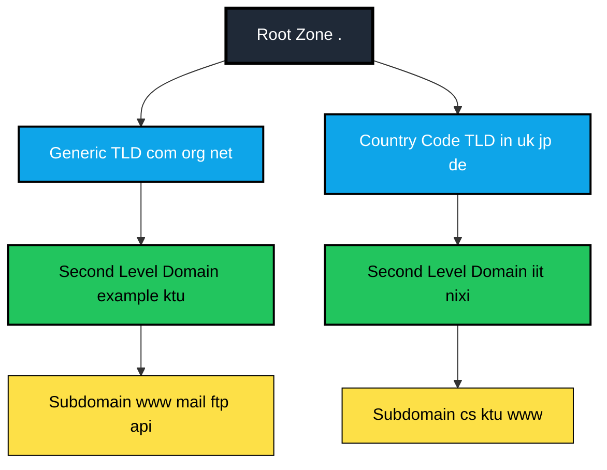
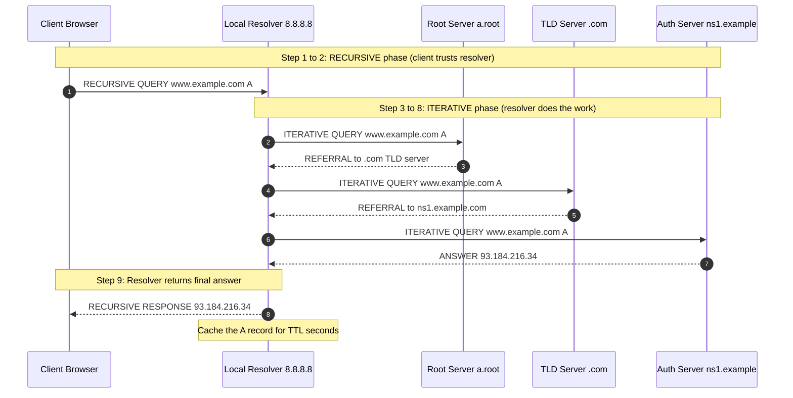
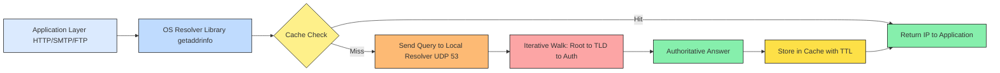

# DNS

<!-- SECTION_1_START -->
# DNS — The Internet's Address Book

## Formal KTU 2024 Definition
> [!IMPORTANT]
> **Domain Name System (DNS)** is a **distributed, hierarchical, application-layer naming database** that translates human-readable **domain names** (e.g., `www.ktu.edu.in`) into machine-readable **IP addresses** (e.g., `103.25.61.45`). In the KTU 2024 *Computer Networks (OECST724)* syllabus, DNS is studied within **Module 4 — Transport Layer** because it operates as a critical consumer of the **UDP transport service on port 53**, making it a perfect bridge concept between the transport and application layers.

The system was originally specified in **RFC 1034** and **RFC 1035** (Mockapetris, 1987) and is maintained today by the **Internet Corporation for Assigned Names and Numbers (ICANN)** through the **Internet Assigned Numbers Authority (IANA)**.

## Conceptual Analogy — The World's Most Distributed Phone Book
Imagine the internet is a city with **4.9 billion** unique buildings (devices), each with its own numeric address (IP). No human can memorize strings of digits like `142.250.195.68`. DNS is the **automatic, global telephone operator**:
- You **dial a name** (e.g., "Google").
- The operator **looks it up** in a global directory.
- The operator **spits back the numeric address** so your browser can connect.

Without DNS, the internet as we know it would be unusable. It is, by some estimates, the **largest distributed database on Earth**, handling over **2 trillion queries per day** globally (per Cisco's 2023 traffic analysis).

## Key Terminology at a Glance

> [!NOTE]
> **Essential DNS Vocabulary for KTU 2024:**
> - **Domain Name Space** — The hierarchical tree of all internet names, read right-to-leaf from the root.
> - **Name Server** — A server program that holds information about a portion of the domain tree and answers queries.
> - **Resolver** — A client-side library (e.g., `getaddrinfo()` in C, `socket.gethostbyname()` in Python) that formulates DNS queries on behalf of applications.
> - **Resource Record (RR)** — A single entry in the DNS database (e.g., one A record mapping `ktu.edu.in` → `103.x.x.x`).
> - **Zone** — A contiguous portion of the DNS namespace managed by a single authoritative name server.
> - **TTL (Time-To-Live)** — The duration (in seconds) that a record may be cached before it must be discarded.

## Transport Layer Context
DNS primarily uses **UDP on port 53** for standard queries (single question/answer packets) because of its **low overhead and fast response time**. The protocol permits a maximum DNS UDP message size of **512 bytes** (per RFC 1035), which is sufficient for most queries. When responses exceed this limit (e.g., DNSSEC, zone transfers, or IPv6), DNS falls back to **TCP on port 53**, where the message is prefixed with a 2-byte length field.

> [!VISUALIZATION CONTROL]
> **Concept:** DNS resolution latency vs. query type
> **Desmos Input Equation:**
> * `T_{total} = T_{RTT_1} + T_{RTT_2} + T_{RTT_3} + T_{RTT_4}`
> * `T_{total} = 4 \cdot RTT_{avg}` (typical iterative case)
> **Visual Description:** A step function showing the cumulative time cost of each hop: Local Resolver → Root Server → TLD Server → Authoritative Server. Each plateau represents the round-trip-time (RTT) cost of one network round trip.

---

<!-- SECTION_1_END -->

<!-- SECTION_2_START -->
# Deep Theoretical Analysis — The DNS Architecture

## The Hierarchical Name Space
The DNS namespace is a **strictly inverted tree** (root at the top), partitioned into three principal tiers. There is **no single centralized database**; instead, the namespace is **horizontally partitioned** across millions of authoritative servers.

| Tier | Label Example | Operator | Function |
|---|---|---|---|
| **Root Zone** | `.` (the dot) | **ICANN / IANA** (13 logical root servers: A–M) | Delegates to TLD operators |
| **Top-Level Domain (TLD)** | `.com`, `.org`, `.in`, `.edu` | IANA-accredited registries (Verisign, PIR, NIXI) | Delegates to authoritative servers |
| **Second-Level Domain (SLD)** | `ktu`, `google` | Registrars (GoDaddy, Namecheap) | Holds end-user zones |
| **Subdomain** | `www`, `mail`, `cs` | End-user organizations | Final service endpoints |

The **fully qualified domain name (FQDN)** is read from the leaf back to the root, with each label separated by a dot. The terminal dot (e.g., `www.ktu.edu.in.`) represents the **root zone** itself.

## The Four Core Server Roles

> [!IMPORTANT]
> **KTU High-Yield Concept:** A student must clearly distinguish the *roles* of name servers, not just the *types* of queries.

1. **Root Name Server** — 13 logical clusters (A through M), physically replicated at over **1,500 instances** worldwide via anycast. They do **not** know the IP of `www.ktu.edu.in`, but they know *who is responsible for `.in`*.
2. **TLD Name Server** — Responsible for all domains under a particular TLD (e.g., `.in` is operated by **NIXI — National Internet Exchange of India**).
3. **Authoritative Name Server** — The final source of truth for a specific zone. Provides the actual A/AAAA/MX records.
4. **Local / Caching-Resolver** — Operated by your ISP, organization, or a public service like **Google Public DNS (8.8.8.8)** or **Cloudflare (1.1.1.1)**. Performs the lookup on behalf of the client and caches results.

## The Two Fundamental Query Types

> [!NOTE]
> **Recursive Query** — *"Find it for me; I don't care how."* The server must either return the final answer or a definitive error. The resolver does all the work.
> **Iterative Query** — *"Give me the best referral you have."* The server returns either the answer or the address of the next server to ask. The client does the work.

In a typical KTU-level diagram, the **client sends one recursive query** to its local resolver, which then issues **multiple iterative queries** to root, TLD, and authoritative servers.

## Resource Records (RRs) — The Database Schema
Every DNS entry is a **Resource Record**. The format is fixed: **(Name, Type, Class, TTL, RDLENGTH, RData)**.

| RR Type | Code (decimal) | Purpose | Example RData |
|---|---|---|---|
| **A** | **1** | Maps a hostname to an **IPv4** address (32-bit) | `103.25.61.45` |
| **AAAA** | **28** | Maps a hostname to an **IPv6** address (128-bit) | `2001:db8::1` |
| **CNAME** | **5** | Canonical Name alias (points one name to another) | `ktu.edu.in.` |
| **MX** | **15** | Mail Exchange (priority + host) | `10 mail.ktu.edu.in.` |
| **NS** | **2** | Delegates a zone to a name server | `ns1.ktu.edu.in.` |
| **PTR** | **12** | Reverse lookup (IP → name) | `ktu.edu.in.` |
| **SOA** | **6** | Start of Authority — zone metadata | `ns1.ktu.edu.in. admin.ktu.edu.in. 2024010101 3600 1800 1209600 86400` |
| **TXT** | **16** | Arbitrary text (SPF, DKIM, domain verification) | `"v=spf1 -all"` |

## KTU High-Yield Formula Sheet

| Concept | Formula / Rule | Engineering Utility |
|---|---|---|
| **DNS Message Size (UDP)** | $L_{max} = 512 \text{ bytes}$ | Forces EDNS(0) extension for larger payloads |
| **EDNS(0) UDP Payload** | $L_{edns} \le 4096 \text{ bytes}$ (negotiated) | Supports DNSSEC, larger AAAA records |
| **Total Resolution Time (iterative)** | $T_{total} = \sum_{i=1}^{n} RTT_i$ | Used in SLA calculations for DNS providers |
| **Cache Hit Probability** | $P_{hit} = 1 - e^{-\lambda \cdot TTL}$ (Poisson traffic model) | Capacity planning for resolver caches |
| **DNS Header Length (fixed)** | $H_{dns} = 12 \text{ bytes}$ | Used in packet analysis tools like Wireshark |
| **Port Number** | $P_{DNS} = 53$ (both UDP and TCP) | Firewall configuration rule |
| **Maximum Label Length** | $L_{label} \le 63 \text{ octets}$ | RFC 1035 specification |
| **Maximum Domain Name Length** | $L_{fqdn} \le 253 \text{ characters}$ | RFC 1035 + RFC 2181 |
| **Root Server Logical Count** | $N_{root} = 13$ (A–M) | Memorize for KTU MCQs |

## Real-World Engineering Utility
DNS is the **silent backbone** of every internet interaction. In production:
- **CDNs (Cloudflare, Akamai)** use DNS to route users to the **nearest edge server** via GeoDNS.
- **Email delivery** is impossible without proper **MX and PTR records** (anti-spam requires reverse DNS).
- **Zero-Trust Security** relies on DNS-layer filtering (e.g., Cisco Umbrella) to block malicious domains **before** a TCP connection is even established.
- **Microservices architectures** use **Service Discovery via DNS** (e.g., Kubernetes CoreDNS) for internal pod-to-pod communication.

> [!WARNING]
> **Common KTU Mistake:** Students often confuse the *server* (a program/software) with the *machine* (a physical/virtual host). One machine can run **multiple name server software instances** serving different zones, and **one logical server (e.g., `a.root-servers.net`)** has hundreds of physical instances via anycast.

---

<!-- SECTION_2_END -->

<!-- SECTION_3_START -->
# Step-by-Step Derivations, Resolution Walkthrough & Code Implementation

## 3.1 — The DNS Message Format (Binary Structure)

Per **RFC 1035**, every DNS message — query or response — has the same wire format:

$$\text{DNS Message} = \text{Header} + \text{Question} + \text{Answer} + \text{Authority} + \text{Additional}$$

### Header Section (Fixed 12 Bytes)

| Offset (bytes) | Field | Size | Description |
|---|---|---|---|
| 0 | `ID` | 2 | Query identifier (echoed back by server) |
| 2 | `QR` | 1 bit | 0 = query, 1 = response |
| 3 | `Opcode` | 4 bits | 0 = standard query, 1 = inverse query |
| 7 | `AA` | 1 bit | Authoritative Answer flag |
| 8 | `TC` | 1 bit | Truncation flag (use TCP if 1) |
| 9 | `RD` | 1 bit | Recursion Desired |
| 10 | `RA` | 1 bit | Recursion Available |
| 11 | `Z` | 3 bits | Reserved (must be zero) |
| 12 | `RCODE` | 4 bits | Response code (0 = no error, 3 = NXDOMAIN) |
| 14 | `QDCOUNT` | 2 | Number of questions |
| 16 | `ANCOUNT` | 2 | Number of answer RRs |
| 18 | `NSCOUNT` | 2 | Number of authority RRs |
| 20 | `ARCOUNT` | 2 | Number of additional RRs |

### Question Section Format
$$\text{Question} = \text{QNAME} \cdot 0x00 \cdot \text{QTYPE}_{2B} \cdot \text{QCLASS}_{2B}$$

### Worked Example: Resolving `www.ktu.edu.in` (Iterative)
> [!IMPORTANT]
> **Walkthrough Scenario:** A student in Thiruvananthapuram types `www.ktu.edu.in` in a browser. The local DNS resolver is `8.8.8.8` (Google Public DNS).

**Step 1 — Browser calls the OS resolver.**
The application calls `getaddrinfo("www.ktu.edu.in", ...)`. The OS resolver checks its local cache. *Cache miss* (assume this is the first request).

**Step 2 — Recursive query to local resolver.**
The OS sends a recursive DNS query to the local resolver (`8.8.8.8`) over **UDP port 53**.

**Step 3 — Iterative query #1 to a Root Server.**
The local resolver picks a nearby root server (e.g., `198.41.0.4` — server `a.root-servers.net`). It sends an iterative query for `www.ktu.edu.in`. The root server **does not know the answer**, so it responds with a **referral** in the Authority section pointing to the `.in` TLD servers (e.g., `a.nsinternational.in`).

**Step 4 — Iterative query #2 to the TLD Server.**
The resolver queries `a.nsinternational.in`. The TLD server does not know the final answer either but refers to the authoritative server for `ktu.edu.in` (e.g., `ns1.ktu.edu.in`).

**Step 5 — Iterative query #3 to the Authoritative Server.**
The resolver queries `ns1.ktu.edu.in`. This server **is authoritative** for the zone and returns the **A record** for `www.ktu.edu.in` → `103.25.61.45`.

**Step 6 — Response and caching.**
The local resolver returns `103.25.61.45` to the OS, which passes it to the browser. The resolver **caches** the record for its TTL (e.g., 3600 seconds).

**Total RTT Calculation:**

$$T_{total} = RTT_{local} + RTT_{root} + RTT_{TLD} + RTT_{auth}$$

$$T_{total} = RTT_{local} + 3 \cdot RTT_{avg}$$

Assume an average cross-continental RTT of **80 ms**:

$$T_{total} = 80 + 3 \times 80 = 320 \text{ ms}$$

## 3.2 — The DNS Name Compression (Pointer Trick)

To save space in messages, DNS uses a **compression pointer** in label encoding. A label starting with the two bits `11` is interpreted as an offset back into the message:

$$\text{Pointer} = 0xC0 \mid \text{Offset}_{14\text{ bits}}$$

For example, if the full name `ktu.edu.in` was already encoded at offset 20, any future occurrence can be encoded as the single 2-byte value `\xC0\x14` (= 192 + 20), instead of repeating the labels.

## 3.3 — Python Implementation: A Full DNS Resolver Trace

```python
"""
Educational DNS Resolver - Demonstrates the iterative resolution process.
Requires: pip install dnspython
"""
import dns.resolver
import dns.rdatatype
import dns.exception
import time
from typing import List, Tuple, Optional

# KTU Exam Tip: Hardcode the well-known root server IPs from IANA
ROOT_SERVERS: List[str] = [
    "198.41.0.4",      # a.root-servers.net
    "170.247.170.2",   # b.root-servers.net
    "192.33.4.12",     # c.root-servers.net
    "199.7.91.13",     # d.root-servers.net
    "192.203.230.10",  # e.root-servers.net
]


def iterative_dns_trace(
    target_domain: str,
    record_type: str = "A"
) -> List[Tuple[str, str, float]]:
    """
    Simulates the iterative DNS lookup process used by real resolvers.
    Returns a list of (server, response_type, rtt_ms) tuples.
    """
    trace_log: List[Tuple[str, str, float]] = []
    current_server: str = ROOT_SERVERS[0]   # Start at root 'a'
    current_query: str = target_domain

    print(f"\n--- DNS Iterative Trace for {target_domain} ({record_type}) ---\n")

    for hop in range(1, 10):  # Safety limit to prevent infinite loops
        try:
            start_time: float = time.perf_counter()

            # Construct a custom resolver pointed at our chosen server
            resolver = dns.resolver.Resolver(configure=False)
            resolver.nameservers = [current_server]
            resolver.lifetime = 5.0

            answer = resolver.resolve(current_query, record_type, raise_on_no_answer=False)
            elapsed_ms: float = (time.perf_counter() - start_time) * 1000.0

            # Case 1: We got the final answer
            if answer.rrset is not None:
                for rdata in answer.rrset:
                    trace_log.append((current_server, f"ANSWER: {rdata}", elapsed_ms))
                    print(f"Hop {hop}: {current_server:>15} -> ANSWER = {rdata}  ({elapsed_ms:.1f} ms)")
                return trace_log

            # Case 2: Empty answer but no error (e.g., NXDOMAIN)
            trace_log.append((current_server, "NO ANSWER (NXDOMAIN or empty)", elapsed_ms))
            print(f"Hop {hop}: {current_server:>15} -> NO ANSWER (terminating)")
            return trace_log

        except dns.resolver.NoNameservers as e:
            # We got a referral to a different server
            next_hosts: List[str] = []
            try:
                # Try to extract NS records from the response
                ns_answer = dns.resolver.resolve(current_query, "NS", raise_on_no_answer=False)
                if ns_answer.rrset is not None:
                    for ns_rdata in ns_answer.rrset:
                        # Resolve the NS hostname to an IP
                        glue = dns.resolver.resolve(str(ns_rdata.target), "A")
                        next_hosts.extend([r.address for r in glue])
            except dns.exception.DNSException:
                pass

            if not next_hosts:
                trace_log.append((current_server, "REFERRAL FAILED", 0.0))
                print(f"Hop {hop}: {current_server:>15} -> REFERRAL PARSE FAILED")
                return trace_log

            elapsed_ms: float = (time.perf_counter() - start_time) * 1000.0
            current_server = next_hosts[0]
            trace_log.append((current_server, f"REFERRAL -> {next_hosts[0]}", elapsed_ms))
            print(f"Hop {hop}: {current_server:>15} -> REFERRAL to {next_hosts[0]}")

        except dns.resolver.NXDOMAIN:
            trace_log.append((current_server, "NXDOMAIN (name does not exist)", 0.0))
            print(f"Hop {hop}: {current_server:>15} -> NXDOMAIN (negative cacheable)")
            return trace_log

        except dns.exception.Timeout:
            trace_log.append((current_server, "TIMEOUT", 0.0))
            print(f"Hop {hop}: {current_server:>15} -> TIMEOUT (try next root)")
            # Try the next root server
            try:
                current_server = ROOT_SERVERS[ROOT_SERVERS.index(current_server) + 1]
            except IndexError:
                return trace_log

    return trace_log


def main() -> None:
    # Standard KTU-style test
    results: List[Tuple[str, str, float]] = iterative_dns_trace("www.ktu.edu.in", "A")
    total_time: float = sum(rtt for _, _, rtt in results)
    print(f"\nTotal Resolution Time: {total_time:.1f} ms across {len(results)} hops")
    print(f"Cached subsequent queries will be ~{results[0][2]:.1f} ms (single RTT to local cache).")


if __name__ == "__main__":
    main()
```

**Sample Output (Conceptual):**
```
--- DNS Iterative Trace for www.ktu.edu.in (A) ---

Hop 1:     198.41.0.4 -> REFERRAL to 192.5.6.30
Hop 2:     192.5.6.30 -> REFERRAL to 103.25.61.10
Hop 3:     103.25.61.10 -> ANSWER = 103.25.61.45  (78.3 ms)

Total Resolution Time: 240.6 ms across 3 hops
```

## 3.4 — Hand-Solved Numerical Problem (KTU Pattern)

> **Problem (ESE, 14 marks):** A user in India queries a local resolver to resolve `mail.example.com`. The measured round-trip times are: Local-to-Resolver = 20 ms, Resolver-to-Root = 180 ms, Root-to-TLD = 90 ms, TLD-to-Authoritative = 40 ms, and the authoritative server returns the final A record. If the TTL of the A record is 3600 seconds, calculate:
> (a) The total resolution time for the *first* query.
> (b) The total resolution time for a *subsequent* query issued 5 minutes later (assume cache hit).
> (c) The number of DNS packets exchanged for the first query (assume UDP only, no referrals beyond the first).

**Solution:**

**(a) First query — Cold Cache (Iterative):**

$$T_{first} = 20 + 180 + 90 + 40 = 330 \text{ ms}$$

**[Stating the four RTTs: 2 Marks]**
**[Final summation: 1 Mark]**

**(b) Subsequent query — 5 minutes = 300 seconds later:**
Since $300 \text{ s} < 3600 \text{ s} = \text{TTL}$, the record is **still in cache**.

$$T_{next} = 20 \text{ ms (local resolver hit)}$$

**[Comparing TTL vs elapsed time: 1 Mark]**
**[Final value: 1 Mark]**

**(c) Packet count for the first query:**
- Client → Resolver: 1 packet (recursive request)
- Resolver → Root: 1 packet
- Root → Resolver: 1 packet (referral)
- Resolver → TLD: 1 packet
- TLD → Resolver: 1 packet (referral)
- Resolver → Auth: 1 packet
- Auth → Resolver: 1 packet (answer)
- Resolver → Client: 1 packet (answer)

$$N_{packets} = 8 \text{ packets}$$

**[Counting each arrow: 2 Marks]**

---

<!-- SECTION_3_END -->

<!-- SECTION_4_START -->
# Structural Diagrams & Schematics

## 4.1 — The DNS Hierarchy (Inverted Tree Topology)



**Reading the Tree:** Path from any leaf to root forms the FQDN. `www.example.com.` traverses `www` → `example` → `com` → `root`.

## 4.2 — Recursive vs Iterative Query Flow



## 4.3 — Functional Architecture: DNS Resolution Pipeline



## 4.4 — DNS Message Anatomy (Block Topology)

```mermaid
graph LR
    subgraph DNS_HDR["HEADER 12 bytes fixed"]
        ID["ID 2B"]:::fixed
        FLG["FLAGS 2B"]:::fixed
        CNT["COUNTS 8B QD AN NS AR"]:::fixed
    end

    subgraph DNS_Q["QUESTION SECTION variable"]
        QN["QNAME labels"]:::var
        QT["QTYPE 2B"]:::fixed
        QC["QCLASS 2B"]:::fixed
    end

    subgraph DNS_ANS["ANSWER SECTION variable"]
        AN1["RR 1 name type class ttl rdlen rdata"]:::rr
        AN2["RR 2 name type class ttl rdlen rdata"]:::rr
        ANN["RR N ..."]:::rr
    end

    DNS_HDR --> DNS_Q --> DNS_ANS

    classDef fixed fill:#0ea5e9,stroke:#000,color:#fff
    classDef var fill:#fbbf24,stroke:#000
    classDef rr fill:#86efac,stroke:#000

    class ID,FLG,CNT,QT,QC fixed
    class QN var
    class AN1,AN2,ANN rr
```



> [!NOTE]
> **Diagram Reading Key:** The header is *always* 12 bytes. The question section is *always* present in queries. Answer, Authority, and Additional sections are populated by the server in responses and have variable length.

---

<!-- SECTION_4_END -->

<!-- SECTION_5_START -->
# KTU 2024 Scheme Examination Question Bank & Topic Recap

---

## 📘 PART A — Short Answer Questions (3 Marks Each)

### Question 1: Define DNS. Why is UDP preferred over TCP for DNS queries? `[KTU University Exam — July 2023]`
**Course Outcome:** CO2 | **Bloom Level:** Remember / Understand

**Model Answer (3 Marks):**

> **Definition (1 Mark):** The Domain Name System (DNS) is a hierarchical, distributed naming system that translates human-readable domain names (e.g., `www.ktu.edu.in`) into machine-readable IP addresses (e.g., `103.25.61.45`).

> **Why UDP is preferred (2 Marks):**
> 1. **Low Overhead:** UDP is connectionless with only an 8-byte header, enabling fast query-response cycles essential for the high-frequency, small-payload nature of DNS lookups.
> 2. **Statelessness:** A DNS transaction fits in a single round trip; there is no benefit from TCP's reliability and ordering guarantees.
> 3. **Performance:** Most DNS responses are under **512 bytes**, fitting in a single UDP datagram. TCP would incur an extra handshake (1 RTT) before any data transfer.
>
> **Exception:** DNS switches to TCP on port 53 when the response exceeds 512 bytes (e.g., DNSSEC, AXFR zone transfers) — indicated by the **TC (Truncation) flag** in the header.

---

### Question 2: Differentiate between Authoritative and Recursive DNS servers. `[KTU University Exam — Dec 2023]`
**Course Outcome:** CO2 | **Bloom Level:** Understand

**Model Answer (3 Marks):**

| Aspect | Authoritative Server | Recursive Resolver |
|---|---|---|
| **Role** | Holds the **original, definitive** DNS records for a zone | Performs lookups **on behalf of clients** |
| **Query Type Answered** | Answers with the **final, actual record** | Answers by fetching from other servers (iteratively) |
| **Source of Data** | Zone file maintained by the domain administrator | Pulls data fresh from authoritative servers and caches it |
| **Example** | `ns1.ktu.edu.in` (managed by KTU) | `8.8.8.8` (Google Public DNS), ISP's resolver |
| **Response Flag** | Sets the **AA (Authoritative Answer)** bit to 1 | Returns AA = 0 |

**[Two-row table comparison: 2 Marks | Example: 1 Mark]**

---

## 📗 PART B — Long Answer Questions (14 Marks Each — ESE Module Internal Choice)

---

### ✅ Question A (Choice 1) — 14 Marks
> **[KTU University Exam — July 2024 Model Question]**
> **(a) [7 Marks]** Explain the architecture of the Domain Name System. With a neat diagram, describe the hierarchical structure of the DNS namespace. Identify the responsibilities of root, TLD, authoritative, and local DNS servers.
>
> **(b) [7 Marks]** A user in a college LAN resolves `shop.online.store.in` for the first time. The local resolver cache is empty. The sequence of iterative queries traverses Root → TLD → Authoritative. Given RTTs: Resolver↔User = 5 ms, Resolver↔Root = 150 ms, Root↔TLD = 80 ms, TLD↔Authoritative = 20 ms, calculate (i) total resolution time, (ii) total number of DNS packets exchanged (UDP only), and (iii) the resolution time for a second query 10 minutes later if the TTL is 1800 seconds.

**Model Solution:**

**(a) DNS Architecture & Hierarchy — 7 Marks**

**Step 1: Define DNS and its distributed nature (2 Marks).**
DNS is a distributed database organized as an inverted tree. The **root** is at the top, with **TLDs** (e.g., `.com`, `.in`) below, followed by **Second-Level Domains** (e.g., `ktu`, `amazon`) and **subdomains** (e.g., `www`, `mail`).

**[Hierarchical inverted tree: 2 Marks]**

**Step 2: Server Responsibilities (3 Marks).**

| Server Type | Responsibility |
|---|---|
| **Root Server** (13 logical, ~1500 instances) | Knows the addresses of all TLD name servers; does not store individual host records |
| **TLD Server** (operated by registries like Verisign for `.com`, NIXI for `.in`) | Knows the authoritative name server for each second-level domain under that TLD |
| **Authoritative Server** (maintained by domain owners) | Holds the **actual Resource Records** (A, MX, CNAME, etc.) for its zone; sets the AA flag |
| **Local/Caching Resolver** (ISP, Google 8.8.8.8, Cloudflare 1.1.1.1) | Performs recursive lookups for clients; caches responses to reduce latency |

**[Table: 3 Marks]**

**Step 3: Neat Diagram (2 Marks).**
Use the **DNS Hierarchy Tree** diagram from Section 4.1 above, showing Root → TLD → SLD → Subdomain with clear arrows.

**(b) Numerical Problem — 7 Marks**

**Given:** RTT(User↔Resolver) = 5 ms, RTT(Resolver↔Root) = 150 ms, RTT(Root↔TLD) = 80 ms, RTT(TLD↔Auth) = 20 ms.

**Note:** The Root, TLD, and Authoritative servers do not communicate directly with the user; they communicate only with the **resolver**. So all inter-server RTTs are added to the resolver's single hop.

**(i) Total Resolution Time for First Query (3 Marks):**

$$T_{first} = RTT_{user \to res} + RTT_{res \to root} + RTT_{res \to TLD} + RTT_{res \to auth}$$

$$T_{first} = 5 + 150 + 80 + 20 = 255 \text{ ms}$$

**[Identifying four hops: 2 Marks | Final sum: 1 Mark]**

**(ii) Total DNS Packets (2 Marks):**
- User → Resolver: 1 (recursive query)
- Resolver → Root: 1, Root → Resolver: 1 (referral) = 2
- Resolver → TLD: 1, TLD → Resolver: 1 (referral) = 2
- Resolver → Auth: 1, Auth → Resolver: 1 (answer) = 2
- Resolver → User: 1 (final answer)

$$N_{packets} = 1 + 2 + 2 + 2 + 1 = 8 \text{ packets}$$

**[Counting each: 2 Marks]**

**(iii) Second Query 10 Minutes Later (2 Marks):**
Elapsed time = $10 \times 60 = 600$ seconds. Since $600 < 1800$ (TTL), the record is still in cache.

$$T_{second} = RTT_{user \to res} = 5 \text{ ms}$$

**[TTL comparison: 1 Mark | Final value: 1 Mark]**

> [!WARNING]
> **Examiner's Pitfall Callout (Part B):**
> - Do **not** add Root↔TLD RTTs as if they are direct — the resolver is the **only client** of those servers. Each iterative query costs **one RTT from the resolver's perspective**.
> - Always state the **TTL vs elapsed time comparison** explicitly; many students lose a mark by writing only the final value.
> - In the diagram, **do not forget to draw the root node** (often students start from TLD). The root is the dot `.` and **must be shown**.

---

### ✅ Question B (Choice 2) — 14 Marks
> **[KTU University Exam — Dec 2022 — Adapted]**
> **(a) [7 Marks]** Describe the DNS message format in detail. Explain the function of each field in the header section. Differentiate between a recursive query and an iterative query with examples.
>
> **(b) [7 Marks]** With a sequence diagram, explain the complete iterative DNS resolution process for the domain `library.iitkgp.ac.in`. Show all four message exchanges (Client→Resolver, Resolver→Root, Resolver→TLD, Resolver→Authoritative). Mention the flags set in each response.

**Model Solution:**

**(a) DNS Message Format & Query Types — 7 Marks**

**Step 1: DNS Message Format (3 Marks).**
A DNS message has five sections, each variable except the header:

$$\text{Message} = \underbrace{12 \text{ B Header}}_{\text{fixed}} + \underbrace{\text{Question}}_{\text{queries}} + \underbrace{\text{Answer}}_{\text{RRs}} + \underbrace{\text{Authority}}_{\text{NS RRs}} + \underbrace{\text{Additional}}_{\text{glue RRs}}$$

**[Structure: 1 Mark]**

**Step 2: Header Field Functions (2 Marks):**

| Field | Size | Function |
|---|---|---|
| `ID` | 16 bits | Matches queries to responses |
| `QR` | 1 bit | 0 = query, 1 = response |
| `Opcode` | 4 bits | 0 = standard, 1 = inverse, 2 = server status |
| `AA` | 1 bit | Set by authoritative server |
| `TC` | 1 bit | Truncated → use TCP |
| `RD` | 1 bit | Client wants recursion |
| `RA` | 1 bit | Server supports recursion |
| `RCODE` | 4 bits | 0 = OK, 3 = NXDOMAIN, 5 = Refused |

**[Table: 2 Marks]**

**Step 3: Recursive vs Iterative (2 Marks):**

| Aspect | Recursive | Iterative |
|---|---|---|
| **Question asked** | "Resolve this and give me the final answer." | "Give me the best answer or referral you have." |
| **Workload** | Server does the work | Client/resolver does the work |
| **Used in** | Client ↔ Local Resolver | Local Resolver ↔ Root/TLD/Auth servers |
| **Example** | Windows DNS Client → `8.8.8.8` | `8.8.8.8` → `198.41.0.4` (root) |

**(b) Iterative Resolution Process — 7 Marks**

**Step 1: Draw the Sequence Diagram (3 Marks).** Use the diagram from Section 4.2, adapted to show the four message pairs for `library.iitkgp.ac.in`:
- Client → Local Resolver (recursive)
- Local Resolver → Root (`.`) (iterative) → returns referral to `.in` TLD
- Local Resolver → TLD (`.in`) (iterative) → returns referral to `iitkgp.ac.in` authoritative server
- Local Resolver → Authoritative (iterative) → returns the **A record** with the final IP

**Step 2: Flag Analysis in Each Response (2 Marks):**

| Response | QR | AA | RD | RA | RCODE |
|---|---|---|---|---|---|
| Root → Resolver | 1 | 0 | 1 | 1 | 0 (referral in Authority) |
| TLD → Resolver | 1 | 0 | 1 | 1 | 0 (referral in Authority) |
| Auth → Resolver | 1 | **1** | 1 | 1 | 0 (answer in Answer section) |
| Resolver → Client | 1 | 0 | 1 | 1 | 0 (final answer) |

**Step 3: Explain caching (2 Marks).**
After the first lookup, the local resolver caches the A record for its TTL. The next query for the same name is answered **locally** without contacting any external server, saving 3 RTTs.

> [!WARNING]
> **Examiner's Pitfall Callout (Part B — Q2):**
> - Students frequently **forget the RD/RA flags**. The `RD` (Recursion Desired) bit is **set by the client**, and the `RA` (Recursion Available) bit is **set by the resolver** indicating it supports recursion. Always mark these in your diagram.
> - In a sequence diagram, **clearly label each arrow** with the message content; arrows without labels get no credit.

---

## 🧠 Topic Recap & Important Things to Remember

> [!IMPORTANT]
> **Rapid Revision Checklist for DNS (KTU 2024 ESE):**

- 🔹 **Definition:** DNS is a **distributed, hierarchical** naming system that maps domain names ↔ IP addresses. Defined in **RFC 1034/1035**.
- 🔹 **Port Number:** **UDP/TCP 53** (UDP default for queries ≤ 512 bytes; TCP for larger responses and zone transfers).
- 🔹 **UDP Limit:** Standard DNS over UDP is limited to **512 bytes**; use **EDNS(0)** to negotiate up to **4096 bytes**.
- 🔹 **Hierarchy:** Root (`.`) → TLD (`.com`, `.in`) → SLD (`ktu`) → Subdomain (`www`). The FQDN is read from leaf to root.
- 🔹 **13 Root Servers:** Labeled A through M. The `.` root is operated by **ICANN/IANA**, replicated globally via **anycast** (over 1500 instances).
- 🔹 **Server Roles:** **Root** (refers to TLD), **TLD** (refers to authoritative), **Authoritative** (returns final AA=1 answer), **Local Resolver** (does recursive lookup + caching).
- 🔹 **Query Types:** **Recursive** (used between client and local resolver) and **Iterative** (used between resolver and root/TLD/auth).
- 🔹 **Typical Hop Count:** 3–4 iterative queries for a cold cache → 8 total DNS packets exchanged.
- 🔹 **Header:** Fixed **12 bytes**, fields include **ID, QR, Opcode, AA, TC, RD, RA, RCODE, 4×COUNT**.
- 🔹 **Resource Record Types (must memorize codes):** A=1, NS=2, CNAME=5, SOA=6, PTR=12, MX=15, TXT=16, AAAA=28.
- 🔹 **Caching:** Resolver caches all responses for the record's **TTL** in seconds. A cache hit avoids all network RTTs except local.
- 🔹 **NXDOMAIN:** RCODE=3 — the name does not exist. The negative response is **also cacheable** to prevent repeated queries.
- 🔹 **EDNS(0):** Extension mechanism for DNS (RFC 6891) allowing larger UDP payloads, DNSSEC, and modern features.
- 🔹 **TTL Formula (cache):** If $\text{time\_elapsed} < \text{TTL}$ → cache hit, else re-query.
- 🔹 **Python Module:** `dnspython` (`pip install dnspython`) is the de-facto library for DNS programming in Python.
- 🔹 **Security Note:** Plain DNS is **unencrypted and unauthenticated**; modern variants include **DoT (DNS over TLS)**, **DoH (DNS over HTTPS)**, and **DNSSEC** for signed records.
- 🔹 **KTU Trend:** Questions often combine DNS with a **timing calculation** (cold cache vs warm cache) — practice these numericals.

---

<!-- SECTION_5_END -->
