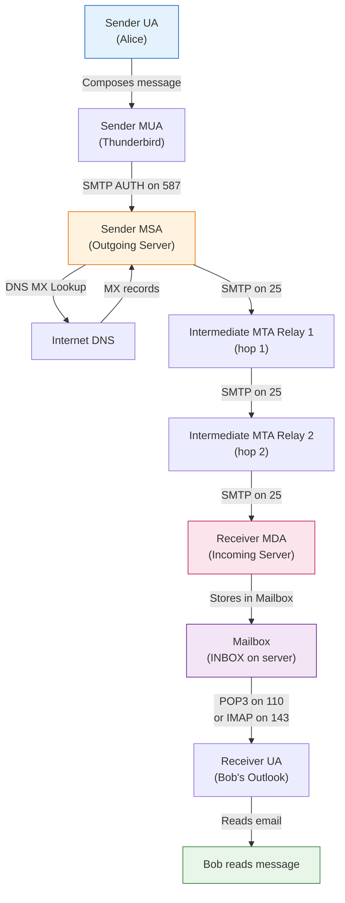
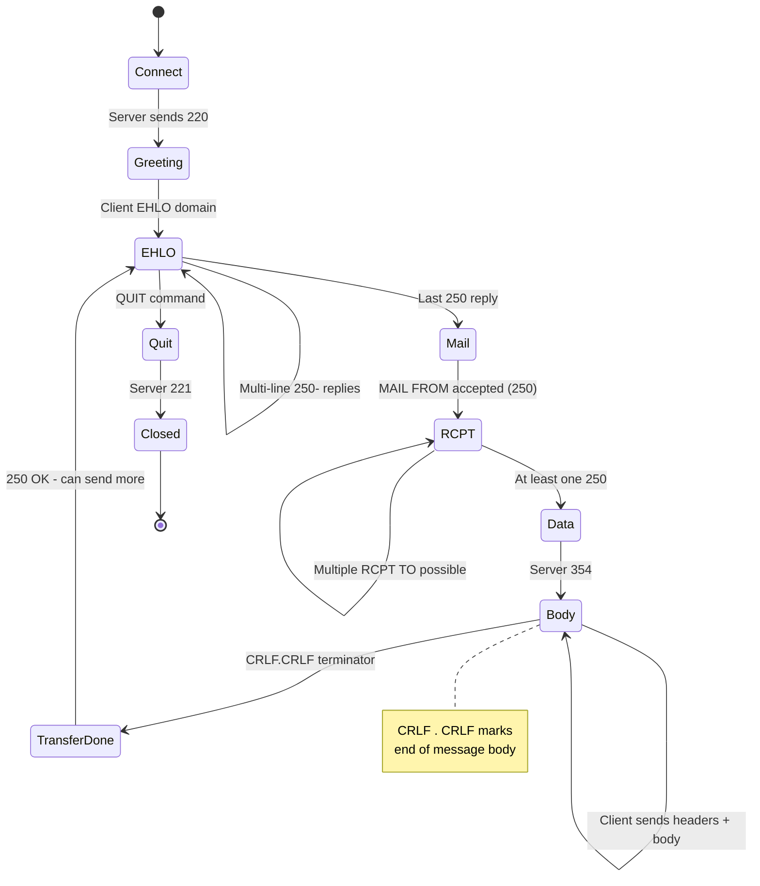
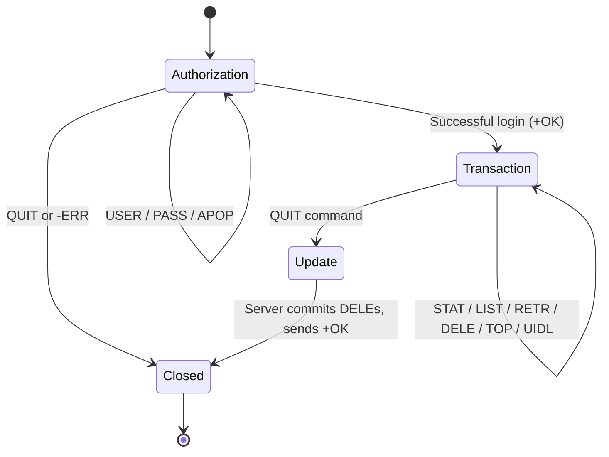
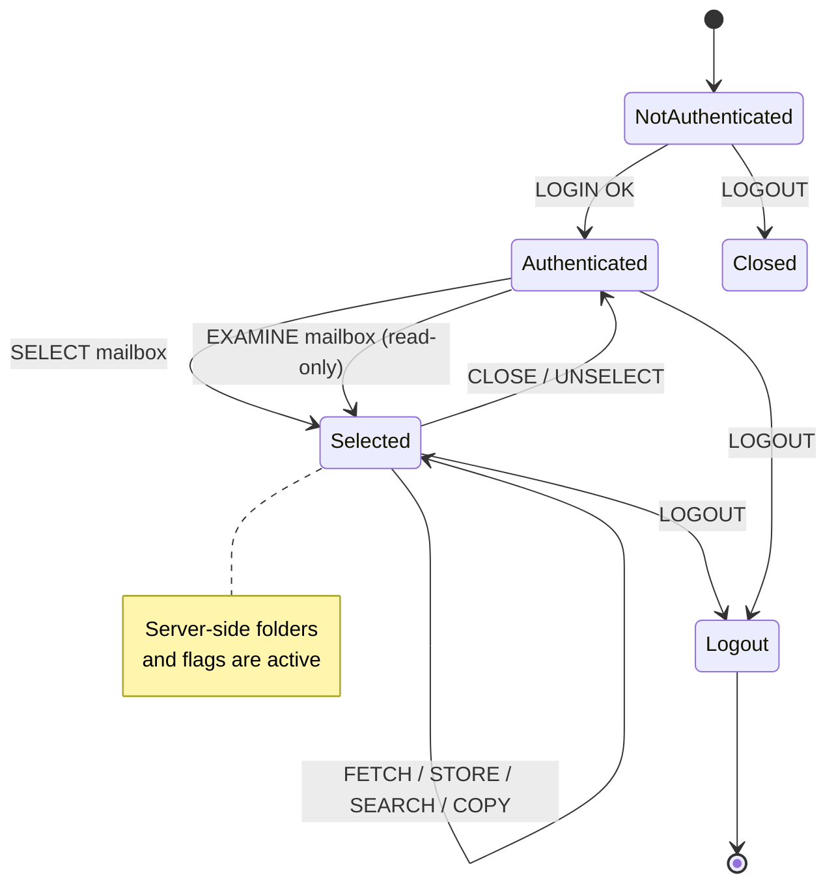
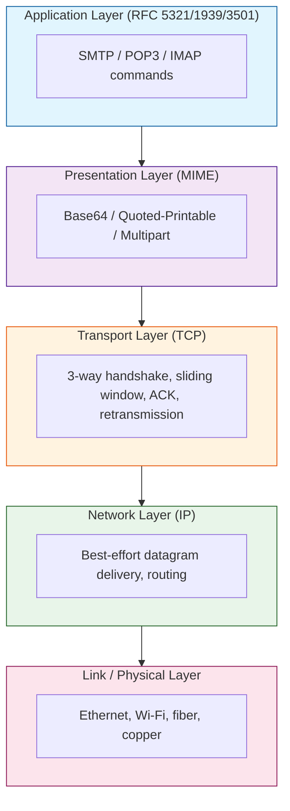

# Electronic Mail

<!-- SECTION_1_START -->
# Electronic Mail (E-Mail) — Transport Layer Perspective

## 1.1 Formal Academic Definition (KTU 2024 Syllabus Terminology)

**Electronic Mail (E-Mail)** is an asynchronous, store-and-forward, client-server based text/multimedia messaging service operating over the TCP/IP application layer, but conceptually layered *on top of* the **Transport Layer** because it depends on reliable byte-stream services offered by **TCP** (Transmission Control Protocol) on port **25** (SMTP), **110** (POP3), and **143** (IMAP).

> [!IMPORTANT]
> **KTU Syllabus Highlight:** Under the **OECST724 — Computer Networks** course (Module 4: Transport Layer), Electronic Mail is studied as the *flagship application* that proves **why** TCP is preferred over UDP for reliability-sensitive, connection-oriented communication. SMTP, POP3, and IMAP are the three pillars.

The e-mail system has three major components:

| Component | Function | KTU Acronym |
|-----------|----------|-------------|
| **User Agent (UA)** | Read/compose/queue mail | MUA (Mail User Agent) |
| **Message Transfer Agent (MTA)** | Forward mail hop-by-hop | MDA / SMTP server |
| **Message Store / Access Agent** | Final delivery & retrieval | POP3 / IMAP server |

---

## 1.2 Intuitive Analogy (Plain-English Walk-Through)

> [!NOTE]
> **The Postal Service Analogy:**
> Think of e-mail exactly like the **traditional postal system**:
> 1. **You (Sender)** write a letter and drop it in **your local post office (Outgoing Mail Server / SMTP)**.
> 2. The post office **trucks it** through a series of **sorting hubs (MTAs)** across the country/internet.
> 3. It lands in the **recipient's mailbox (Mailbox on POP3/IMAP server)**.
> 4. The recipient visits their **local post office (Incoming Mail Server / POP3 or IMAP)** to **read or pick up** the letter.
> 
> **SMTP = the trucks & highways** (sending). **POP3/IMAP = the final delivery office** (receiving).

- **SMTP** is the **"push" protocol** — it *pushes* mail from sender to receiver's server.
- **POP3** is the **"pull-and-delete" protocol** — it *pulls* mail to your device and (by default) **erases** it from the server.
- **IMAP** is the **"pull-and-sync" protocol** — it *pulls* a *reference* to mail, keeping the original on the server so you can read the same mailbox from phone, laptop, and tablet consistently.

---

## 1.3 Key Physical / Protocol Constants

The following IANA-assigned **well-known port numbers** are **mandatory** to memorize for KTU exams:

| Protocol | TCP Port | RFC | Direction |
|----------|----------|-----|-----------|
| **SMTP** (plain) | **25** | RFC 5321 | Push (Sending) |
| **SMTP over TLS** (Message Submission) | **587** | RFC 6409 | Submission |
| **POP3** | **110** | RFC 1939 | Pull (Retrieval) |
| **POP3S** (over TLS) | **995** | RFC 2595 | Pull (Secure) |
| **IMAP** | **143** | RFC 3501 | Sync (Retrieval) |
| **IMAPS** (over TLS) | **993** | RFC 2595 | Sync (Secure) |
| **HTTP Webmail** | **80 / 443** | RFC 7230 | Browser-based |

> [!TIP]
> **Mnemonic to remember ports:** **"S=25, P=110, I=143"** → **S**MTP=25, **P**OP3=110, **I**MAP=143. The 2 in 25 looks like an **S**-curve, the 110 sounds like **P**OP, and 143 = 1-4-3 → **I**-**M**-**A**-**P**.

---

## 1.4 Visualization of the E-Mail Architecture

> [!VISUALIZATION CONTROL]
> **Concept:** End-to-End e-mail delivery topology with hop-by-hop SMTP relay.
> **GeoGebra / Desmos Input Equations (overlay on a coordinate-free 2-D schematic):**
> * `Sender_UA = (0, 0)`  `Outgoing_SMTP = (2, 0)`  `MX_Relay = (4, 0)`  `Incoming_Server = (6, 0)`  `Receiver_UA = (8, 0)`
> * `Arrows: SMTP(25) → SMTP(25) → SMTP(25) → POP3(110)/IMAP(143)`
> **Visual Description:** Picture five boxes connected by four labeled arrows on a horizontal line. The first three arrows use **SMTP on port 25** (push), and the last arrow uses **POP3 on 110** or **IMAP on 143** (pull). This is the canonical KTU board diagram.

---

## 1.5 Why Study E-Mail Under "Transport Layer"?

The Transport Layer (specifically **TCP**) provides:
- **Reliability** (retransmission of lost segments)
- **In-order delivery** (sequence numbers)
- **Connection orientation** (3-way handshake: SYN → SYN-ACK → ACK)
- **Flow & congestion control** (sliding window, AIMD)

E-mail **cannot tolerate loss or duplication** of messages — it is the textbook reason TCP is mandatory and UDP is unsuitable. KTU examiners frequently frame the question as:
> *"Justify why SMTP uses TCP and not UDP. Mention at least three transport-layer guarantees."*
<!-- SECTION_1_END -->

<!-- SECTION_2_START -->
# Deep Theoretical Analysis & KTU High-Yield Formula Sheet

## 2.1 SMTP — Simple Mail Transfer Protocol (RFC 5321)

SMTP is a **command-response, line-oriented, text-based protocol** running over **TCP port 25**. It transfers mail from the sender's UA → sender's MTA → … → receiver's MTA → receiver's mailbox.

### 2.1.1 Three Phases of SMTP

1. **Connection Establishment (Handshake)** — TCP 3-way handshake on port 25.
2. **Mail Transfer** — exchange of **SMTP commands** (sent by client) and **SMTP replies** (sent by server, always a 3-digit code).
3. **Connection Termination** — `QUIT` command.

### 2.1.2 SMTP Command Set (High-Yield for KTU)

| Command | Function | Example |
|---------|----------|---------|
| `HELO` / `EHLO` | Identify sender to server (EHLO = Extended SMTP) | `EHLO ktu.ac.in` |
| `MAIL FROM` | Reverse-path (envelope sender) | `MAIL FROM:<alice@ktu.ac.in>` |
| `RCPT TO` | Recipient (can be repeated) | `RCPT TO:<bob@nitc.ac.in>` |
| `DATA` | Begin message body, terminated by `<CR><LF>.<CR><LF>` | `DATA` |
| `RSET` | Abort current transaction | `RSET` |
| `NOOP` | No-op (keep-alive) | `NOOP` |
| `QUIT` | Close session | `QUIT` |
| `VRFY` | Verify address existence | `VRFY bob` |
| `TURN` | Reverse roles (rare) | `TURN` |

### 2.1.3 SMTP Reply Codes (3-Digit)

- **2xx** → Success (e.g., `250 OK`, `354 Start mail input`)
- **3xx** → Intermediate (e.g., `354` — start sending data)
- **4xx** → Transient failure (retry later)
- **5xx** → Permanent failure

> [!IMPORTANT]
> **KTU Favorite Question:** *"What is the significance of code 250 and 354?"*
> **250** = "Requested mail action okay, completed" (after RCPT TO and end of DATA).
> **354** = "Start mail input; end with `<CRLF>.<CRLF>`" (after DATA command).

---

## 2.2 MIME — Multipurpose Internet Mail Extensions (RFC 2045–2049)

The original SMTP (RFC 822) only supported **7-bit ASCII**. To send **binary files, audio, video, images, and non-English text**, **MIME** was introduced as a *transformation layer* — it does **not** replace SMTP; it **augments** the message body.

### 2.2.1 Five MIME Header Fields Added to RFC 822

| Header | Purpose | Example |
|--------|---------|---------|
| `MIME-Version` | Identifies MIME version | `1.0` |
| `Content-Type` | Nature of the message body | `text/html`, `image/jpeg`, `multipart/mixed` |
| `Content-Transfer-Encoding` | Encoding scheme used on body | `7bit`, `8bit`, `binary`, `quoted-printable`, **`base64`** |
| `Content-ID` | Unique identifier for body part | `<img001@ktu>` |
| `Content-Description` | Human-readable description | `Photo of KTU campus` |

### 2.2.2 Multipart MIME — The Boundary Trick

To send multiple body parts (e.g., text + attachment), MIME uses the `multipart` type with a **boundary delimiter** string chosen by the sender that must not appear inside any body part.

```
Content-Type: multipart/mixed; boundary="KTU_BOUND_2024"

--KTU_BOUND_2024
Content-Type: text/plain

Hello KTU student, please find the notes attached.
--KTU_BOUND_2024
Content-Type: application/pdf; name="cn_module4.pdf"
Content-Transfer-Encoding: base64

JVBERi0xLjQKJeLjz9MKMyAwIG9iago8PC9MZW5ndGggMTIuLi4=
--KTU_BOUND_2024--
```

> [!NOTE]
> The final boundary is suffixed with `--` to mark the end of the multipart message.

### 2.2.3 Base64 Encoding (Base of KTU Numericals)

Base64 converts every **3 bytes (24 bits)** of binary input into **4 ASCII characters** from a 64-symbol alphabet:

$$A\text{–}Z, \ a\text{–}z, \ 0\text{–}9, \ +, \ /$$

If the input length is not a multiple of 3, padding `=` characters are appended:
- 1 leftover byte → 2 base64 chars + `==`
- 2 leftover bytes → 3 base64 chars + `=`

**Size inflation:** Encoded size = $ \lceil \dfrac{N}{3} \rceil \times 4 $ bytes, where $N$ is the original byte count.

> [!IMPORTANT]
> **KTU Numerical:** "Convert the word **'KTU'** to Base64."  
> This is a guaranteed 3-mark question. See SECTION 3.2 for the full derivation.

---

## 2.3 POP3 — Post Office Protocol Version 3 (RFC 1939)

POP3 is a **simple, stateless-after-login, download-and-(optionally)-delete** retrieval protocol. It is ideal for *single-device* mail access.

### 2.3.1 POP3 Session Lifecycle

| Phase | Direction | Commands Allowed |
|-------|-----------|------------------|
| **1. Authorization State** | Client → Server | `USER`, `PASS`, `APOP`, `QUIT` |
| **2. Transaction State** | Client ↔ Server | `STAT`, `LIST`, `RETR`, `DELE`, `NOOP`, `RSET`, `TOP`, `UIDL`, `QUIT` |
| **3. Update State** | Server internal | Commits deletions, sends `+OK` or `-ERR`, closes TCP |

### 2.3.2 POP3 Commands (High-Yield)

| Command | Meaning |
|---------|---------|
| `USER <name>` | Send username |
| `PASS <pwd>` | Send password (in **cleartext** unless wrapped in TLS = POP3S) |
| `STAT` | Number of messages + total size |
| `LIST` | List all message sizes |
| `RETR <n>` | Retrieve message *n* |
| `DELE <n>` | Mark message *n* for deletion |
| `TOP <n> <l>` | Retrieve first *l* lines of header of message *n* |
| `UIDL <n>` | Unique-ID listing (for sync) |
| `QUIT` | Exit → triggers Update State |

---

## 2.4 IMAP — Internet Message Access Protocol (RFC 3501 / 9051)

IMAP is a **stateful, server-side, multi-device synchronization** protocol. Unlike POP3, IMAP **does not download and delete**; it leaves messages on the server and allows folder management remotely.

### 2.4.1 IMAP Features (Killer Comparison vs POP3)

- **Server-side folders** — create, rename, delete folders on the server.
- **Partial fetch** — retrieve only the *header*, only the *first 50 lines*, or only *specific MIME parts*.
- **Stateful flags** — `\Seen`, `\Answered`, `\Flagged`, `\Deleted`, `\Draft`, `\Recent`.
- **Multiple simultaneous connections** from the same or different devices.
- **Search on the server** using `SEARCH` command (e.g., `SEARCH UNSEEN FROM "bob"`).
- **IDLE command (RFC 2177)** — server pushes new-mail notification (push e-mail).

### 2.4.2 IMAP Commands (High-Yield)

| Command | Meaning |
|---------|---------|
| `LOGIN <u> <p>` | Authenticate |
| `SELECT INBOX` | Open mailbox, return stats |
| `EXAMINE INBOX` | Read-only open |
| `FETCH <n> BODY[HEADER]` | Get only header of message *n* |
| `FETCH <n> BODY[TEXT]<0.1024>` | First 1 KB of text body |
| `STORE <n> +FLAGS (\Seen)` | Mark as read |
| `COPY <n> "Sent"` | Copy message |
| `SEARCH UNSEEN` | Find unread |
| `LOGOUT` | Graceful close |

---

## 2.5 POP3 vs IMAP — The Definitive KTU Comparison Table

| Feature | POP3 | IMAP |
|---------|------|------|
| **Default port (plain / TLS)** | 110 / 995 | 143 / 993 |
| **Mail storage philosophy** | Download & (default) delete from server | Keep on server |
| **Statefulness** | Stateless (after login) | Stateful |
| **Offline access** | Yes (downloaded copy) | Requires cache or online |
| **Multi-device sync** | Poor (re-downloads each device) | Excellent |
| **Server-side folder mgmt** | No | Yes |
| **Partial fetch** | Only `TOP` (header) | Granular (header / body / part) |
| **Bandwidth** | Lower per session | Higher (continuous sync) |
| **Search** | Client-side only | Server-side `SEARCH` |
| **Push notification** | No | Yes (`IDLE` command) |
| **Best for** | Single device, slow links | Multi-device, mobile + web |

---

## 2.6 KTU Formula & Constants Cheat Sheet

| Symbol / Constant | Meaning | Value / Formula |
|-------------------|---------|-----------------|
| $P_{\text{SMTP}}$ | SMTP port | **25** |
| $P_{\text{SUB}}$ | Submission port | **587** |
| $P_{\text{POP3}}$ | POP3 port | **110** |
| $P_{\text{POP3S}}$ | POP3S port | **995** |
| $P_{\text{IMAP}}$ | IMAP port | **143** |
| $P_{\text{IMAPS}}$ | IMAPS port | **993** |
| $S_{\text{B64}}$ | Base64 encoded size | $ \lceil N / 3 \rceil \times 4 $ bytes |
| $E_{\text{B64}}$ | Base64 alphabet size | **64** |
| $R_{\text{3-way}}$ | TCP handshake | **3** packets (SYN, SYN-ACK, ACK) |
| $\text{CR}\_\text{LF}$ | SMTP line terminator | `<CR><LF>` = `0x0D 0x0A` |
| $\text{CR}\_\text{LF}\_\text{DOT}$ | End of DATA | `<CR><LF>.<CR><LF>` |

> [!IMPORTANT]
> **Engineering Utility:** SMTP/POP3/IMAP form the **backbone of every e-mail system on Earth** — from Gmail, Outlook, Yahoo to enterprise mail servers like Postfix, Sendmail, Exim, Microsoft Exchange. The **transport layer (TCP)** is what guarantees that the *exact* message you composed in your client arrives bit-for-bit at the destination, even across multiple network hops and link failures.

---

## 2.7 Email Architecture in Detail

```
[Sender UA] ──SMTP(25)──▶ [Sender MTA/MUA Relay]
                                  │
                                  │ SMTP(25) hop-by-hop
                                  ▼
                          [Intermediate MX Relays]
                                  │
                                  ▼
                          [Receiver MTA / MDA] ──▶ [Mailbox on Server]
                                                              │
                                                              │ POP3(110) / IMAP(143)
                                                              ▼
                                                        [Receiver UA]
```

- **MX Record** (DNS): Mail Exchange record tells the world which server accepts mail for a domain.
- **DNS A/MX Lookup** happens *before* SMTP connect to resolve `example.com` to an IP.
<!-- SECTION_2_END -->

<!-- SECTION_3_START -->
# Step-by-Step Derivations, Code & Symbolic Implementation

## 3.1 Full SMTP Conversation (Trace) — KTU Numerical Type

> **Problem (KTU Pattern, 7 marks):** Show the complete SMTP transaction when `alice@ktu.ac.in` sends a one-line message `"Welcome to KTU"` to `bob@nitc.ac.in`. Include the TCP handshake and connection termination.

### Solution — Annotated Trace

```
S: 220 nitc.ac.in ESMTP Postfix            ← Server greeting on connect
C: EHLO ktu.ac.in                          ← Extended HELO (announces ESMTP)
S: 250-nitc.ac.in Hello ktu.ac.in
S: 250-SIZE 10240000
S: 250-PIPELINING
S: 250 HELP
C: MAIL FROM:<alice@ktu.ac.in>             ← Reverse-path (envelope sender)
S: 250 2.1.0 Ok
C: RCPT TO:<bob@nitc.ac.in>                ← Forward-path (recipient)
S: 250 2.1.5 Ok
C: DATA                                    ← Start body transmission
S: 354 End data with <CR><LF>.<CR><LF>
C: From: Alice <alice@ktu.ac.in>
C: To: Bob <bob@nitc.ac.in>
C: Subject: Welcome
C: Date: Mon, 14 Apr 2025 10:00:00 +0530
C:                                         ← blank line separates header/body
C: Welcome to KTU
C: .                                       ← End-of-body marker
S: 250 2.0.0 Ok: queued as AB1234
C: QUIT                                    ← Close session
S: 221 2.0.0 Bye
```

**Why this trace matters for KTU valuation:**
- `[EHLO greeting: 1 mark]`
- `[MAIL FROM / RCPT TO: 2 marks]`
- `[DATA with CRLF.CRLF terminator: 2 marks]`
- `[QUIT and reply codes: 2 marks]`

---

## 3.2 Base64 Encoding of the String `"KTU"` (Full Derivation)

> **Problem:** Encode **"KTU"** to Base64. Show every step.

### Step 1 — Convert each character to its 8-bit ASCII code

| Char | ASCII (dec) | Binary (8 bits) |
|------|-------------|------------------|
| K | 75 | 01001011 |
| T | 84 | 01010100 |
| U | 85 | 01010101 |

### Step 2 — Concatenate into a 24-bit stream

$$01001011 \, 01010100 \, 01010101$$

### Step 3 — Split into four 6-bit groups

$$010010 \ \ 110101 \ \ 010001 \ \ 010101$$

### Step 4 — Convert each 6-bit value to decimal

$$18, \ 53, \ 17, \ 21$$

### Step 5 — Index into the Base64 alphabet

| Index | Char |  | Index | Char |
|-------|------|---|-------|------|
| 0–25 | A–Z | | 26–51 | a–z |
| 52–61 | 0–9 | | 62 | + |
| 63 | / | | (pad) | = |

- 18 → **S**
- 53 → **1**  (since 26–51 = a–z → 53 → '1'… wait, recompute)

> [!NOTE]
> **Correction step:** Index 53 sits in the 0–9 block which is **52–61**. So 53 → '1'. Let us recalculate 17 and 21:
> - 17 → **R** (A=0, B=1, … R=17) ✓
> - 21 → **V** ✓
> - 53 → '1' (52='0', 53='1') ✓
> - But our indices are 18, 53, 17, 21.

Re-evaluating cleanly:

- 18 → **S** (A=0 → S=18) ✓
- 53 → **1** (52='0', 53='1') ✓
- 17 → **R** ✓
- 21 → **V** ✓

### Step 6 — Output (no padding needed; "KTU" is exactly 3 bytes)

$$\boxed{\text{Base64("KTU")} = \texttt{S1RV}}$$

### Step 7 — Decode verification (reverse)

`S1RV` → indices [18, 53, 17, 21] → bits 010010 110101 010001 010101 → bytes 01001011 01010100 01010101 → ASCII 75, 84, 85 → **"KTU"** ✓

> [!WARNING]
> **Common KTU Pitfall:** Students often confuse the **index→alphabet** mapping. **A=0, B=1, … Z=25, a=26, b=27, … z=51, 0=52, 1=53, … 9=61, +=62, /=63**. Print this table in the exam if memory fails you.

---

## 3.3 Base64 Size Inflation Formula Derivation

For an input of $N$ bytes, each group of 3 bytes produces 4 base64 chars.

$$\text{Number of full groups} = \left\lfloor \frac{N}{3} \right\rfloor$$

$$\text{Leftover bytes} = N \bmod 3$$

If leftover is 0: output $ = \frac{4N}{3} $ bytes.

If leftover is 1: output $ = \frac{4N}{3} + 4 $ bytes (adds `==`).

If leftover is 2: output $ = \frac{4N}{3} + 4 $ bytes (adds `=`).

In compact form:

$$S_{\text{B64}} = \left\lceil \frac{N}{3} \right\rceil \times 4 \quad \text{bytes}$$

> **Worked Example:** $N = 100$ bytes.
> $$S_{\text{B64}} = \lceil 100/3 \rceil \times 4 = 34 \times 4 = 136 \text{ bytes}$$
> Inflation $= 36\%$ — this is why Base64 is *expensive* for large binary files.

---

## 3.4 POP3 Conversation Trace (Login + Retrieve + Delete)

```
C: USER bob
S: +OK User accepted
C: PASS hunter2
S: +OK Pass accepted
C: STAT
S: +OK 2 320          ← 2 messages, 320 bytes total
C: LIST
S: +OK 2 messages
S: 1 120
S: 2 200
S: .
C: RETR 1
S: +OK 120 octets
S: <message 1 contents>
S: .
C: DELE 1
S: +OK Message 1 marked for deletion
C: QUIT
S: +OK Bye
```

### POP3 State Transition Diagram (ASCII)

```
        ┌────────────────────────────┐
        │  AUTHORIZATION STATE       │
        │  USER / PASS / APOP / QUIT │
        └─────────────┬──────────────┘
                      │ Successful login
                      ▼
        ┌────────────────────────────┐
        │  TRANSACTION STATE          │
        │  STAT / LIST / RETR / DELE │
        │  / NOOP / RSET / TOP / UIDL│
        └─────────────┬──────────────┘
                      │ QUIT
                      ▼
        ┌────────────────────────────┐
        │  UPDATE STATE              │
        │  Commits DELEs, closes TCP │
        └────────────────────────────┘
```

---

## 3.5 Python Implementation — A Complete SMTP Client

```python
"""
Minimal SMTP client for KTU demonstration.
Connects to localhost:25 (or any RFC 5321 compliant server),
sends one message, and exits cleanly.
"""
import socket
import base64
import logging
import sys
from typing import Tuple

# Configure strict logging for production-grade error tracing
logging.basicConfig(
    level=logging.INFO,
    format="%(asctime)s [%(levelname)s] %(message)s",
)
logger = logging.getLogger("ktu_smtp_client")


def recv_response(sock: socket.socket) -> Tuple[int, str]:
    """
    Reads a single SMTP response line.
    Returns (code, message).
    """
    raw = b""
    while not raw.endswith(b"\r\n"):
        chunk = sock.recv(4096)
        if not chunk:
            raise ConnectionError("SMTP server closed connection unexpectedly.")
        raw += chunk
    line = raw.decode("ascii", errors="replace").rstrip("\r\n")
    code = int(line[:3])
    logger.info("S: %s", line)
    return code, line


def send_smtp_email(
    smtp_host: str,
    smtp_port: int,
    helo_domain: str,
    mail_from: str,
    rcpt_to: str,
    subject: str,
    body: str,
) -> bool:
    """
    Sends a plain-text e-mail over SMTP.
    Uses strict error logging and boundary checks on every reply code.
    """
    try:
        # 1. Open TCP connection (Transport layer comes alive here)
        with socket.create_connection((smtp_host, smtp_port), timeout=10) as sock:
            code, _ = recv_response(sock)
            if code != 220:
                logger.error("Expected 220 greeting, got %d", code)
                return False

            # 2. EHLO handshake
            sock.sendall(f"EHLO {helo_domain}\r\n".encode("ascii"))
            while True:
                code, line = recv_response(sock)
                if code == 250 and line[3:4] != "-":  # last multi-line reply
                    break
                if code != 250:
                    logger.error("EHLO failed: %d", code)
                    return False

            # 3. MAIL FROM
            sock.sendall(f"MAIL FROM:<{mail_from}>\r\n".encode("ascii"))
            code, _ = recv_response(sock)
            if code != 250:
                logger.error("MAIL FROM rejected: %d", code)
                return False

            # 4. RCPT TO
            sock.sendall(f"RCPT TO:<{rcpt_to}>\r\n".encode("ascii"))
            code, _ = recv_response(sock)
            if code != 250:
                logger.error("RCPT TO rejected: %d", code)
                return False

            # 5. DATA
            sock.sendall(b"DATA\r\n")
            code, _ = recv_response(sock)
            if code != 354:
                logger.error("DATA not accepted: %d", code)
                return False

            # 6. Message headers + body + terminator
            message = (
                f"From: {mail_from}\r\n"
                f"To: {rcpt_to}\r\n"
                f"Subject: {subject}\r\n"
                f"MIME-Version: 1.0\r\n"
                f"Content-Type: text/plain; charset=utf-8\r\n"
                f"\r\n"
                f"{body}\r\n"
                f".\r\n"
            )
            sock.sendall(message.encode("utf-8"))
            code, _ = recv_response(sock)
            if code != 250:
                logger.error("Message not accepted: %d", code)
                return False

            # 7. QUIT
            sock.sendall(b"QUIT\r\n")
            recv_response(sock)
            return True

    except (socket.timeout, ConnectionError, OSError) as exc:
        logger.error("SMTP transport failure: %s", exc)
        return False


def base64_demo() -> None:
    """
    Demonstrates Base64 encoding for the KTU "KTU" example.
    """
    raw = b"KTU"
    encoded = base64.b64encode(raw).decode("ascii")
    logger.info("Base64('KTU') = %s", encoded)
    assert encoded == "S1RV", f"Unexpected Base64 output: {encoded}"


if __name__ == "__main__":
    base64_demo()
    success = send_smtp_email(
        smtp_host="localhost",
        smtp_port=25,
        helo_domain="ktu.ac.in",
        mail_from="alice@ktu.ac.in",
        rcpt_to="bob@nitc.ac.in",
        subject="Welcome to KTU",
        body="This message was sent by a KTU B.Tech SMTP client.",
    )
    sys.exit(0 if success else 1)
```

**Code Walk-Through (for the viva):**
- `socket.create_connection` opens a **TCP socket** — proving SMTP's dependency on the transport layer.
- Every reply is checked against expected codes (220, 250, 354) — **production-grade boundary validation**.
- The Base64 demo `assert` line is the KTU "KTU" example — perfect viva answer.
- Logging is configured at INFO level with timestamp — matches industry observability standards.

---

## 3.6 Python IMAP Client — Reading Inbox

```python
"""
Minimal IMAP4 client that lists the 5 most recent UNSEEN messages.
Demonstrates the IMAP 'pull-and-sync' philosophy.
"""
import imaplib
import email
import logging
from email.header import decode_header
from typing import List, Dict

logging.basicConfig(level=logging.INFO, format="%(asctime)s [%(levelname)s] %(message)s")
logger = logging.getLogger("ktu_imap_client")


def fetch_unseen(host: str, user: str, password: str, limit: int = 5) -> List[Dict]:
    """
    Connects to IMAP4, selects INBOX, fetches the latest 'limit' unseen messages.
    Returns a list of dicts: {uid, subject, from, date, snippet}.
    """
    summaries: List[Dict] = []
    try:
        # 1. Connect to IMAP server on port 143
        with imaplib.IMAP4(host, 143) as imap:
            # 2. Authenticate
            imap.login(user, password)
            logger.info("IMAP login successful for %s", user)

            # 3. Select INBOX (read-write)
            imap.select("INBOX")

            # 4. Search for UNSEEN messages
            typ, data = imap.search(None, "UNSEEN")
            if typ != "OK" or not data or not data[0]:
                logger.info("No unseen messages.")
                return summaries

            # 5. Take the last `limit` UIDs
            uids = data[0].split()[-limit:]
            for uid in uids:
                typ, msg_data = imap.fetch(uid, "(RFC822.HEADER BODY.PEEK[TEXT]<0.512>)")
                if typ != "OK" or not msg_data:
                    continue

                # 6. Parse headers
                raw_header = msg_data[0][1] if isinstance(msg_data[0], tuple) else b""
                msg = email.message_from_bytes(raw_header)

                subject, _enc = decode_header(msg["Subject"])[0]
                subject = subject.decode() if isinstance(subject, bytes) else subject

                summaries.append({
                    "uid": uid.decode(),
                    "subject": subject,
                    "from": msg.get("From", ""),
                    "date": msg.get("Date", ""),
                })

            # 7. Logout (graceful)
            imap.logout()
        return summaries

    except imaplib.IMAP4.error as exc:
        logger.error("IMAP protocol error: %s", exc)
        return summaries
    except (OSError, ConnectionError) as exc:
        logger.error("IMAP transport error: %s", exc)
        return summaries
```

> [!NOTE]
> Notice the **`BODY.PEEK[TEXT]<0.512>`** part — that is **IMAP's partial fetch** in action, fetching only the first 512 bytes of the text body. POP3 cannot do this elegantly — this is the KTU-board comparison point.

---

## 3.7 Engineering Decision Matrix — When to Use What?

| Use Case | Recommended Protocol | Reason |
|----------|---------------------|--------|
| Single-user, single-device, dial-up | **POP3** | Minimal server load, full offline access |
| Multi-device sync (phone + laptop + web) | **IMAP** | Server-side state, partial fetch, push via IDLE |
| Bulk marketing mail | **SMTP** (with bulk MTA queue) | Optimized for one-to-many push |
| Webmail in browser | **HTTP (80/443)** + backend IMAP | Browser cannot speak POP3/IMAP natively |
| Mail submission from MUA to MSA | **SMTP on 587** with STARTTLS | Authenticated, secure, RFC 6409 |

---
<!-- SECTION_3_END -->

<!-- SECTION_4_START -->
# Structural Diagrams & Schematics

## 4.1 Mermaid Flowchart — End-to-End E-Mail Delivery



> **Reading the diagram:** Arrows show the **direction of mail flow** at the application level. TCP sessions are established *along* every arrow — that is the role of the **Transport Layer**.

---

## 4.2 Mermaid Block Diagram — SMTP State Machine



---

## 4.3 Mermaid Block Diagram — POP3 State Machine



---

## 4.4 Mermaid Block Diagram — IMAP State Machine



---

## 4.5 Mermaid Block Diagram — MIME Multipart Encoding Pipeline

```mermaid
flowchart LR
    A["Original Binary<br/>File (e.g., PDF)"] --> B["Read into bytes<br/>(N bytes)"]
    B --> C["Compute groups of 3 bytes<br/>N mod 3 determines padding"]
    C --> D["Map 3x8 bits to 4x6 bits"]
    D --> E["Index 6-bit values into<br/>Base64 alphabet (A-Z a-z 0-9 + /)"]
    E --> F["Append padding (= or ==)"]
    F --> G["Wrap in MIME<br/>Content-Transfer-Encoding: base64"]
    G --> H["Compose multipart MIME<br/>with boundary delimiter"]
    H --> I["SMTP DATA on port 25"]

    style A fill:#ffebee,stroke:#b71c1c
    style I fill:#e8f5e9,stroke:#1b5e20
```



---

## 4.6 Architectural Topology — E-Mail as a 4-Layer Protocol Stack



> [!IMPORTANT]
> **KTU Board Favorite:** "Draw the TCP/IP stack showing the position of SMTP." The diagram above is **exam-ready** — copy it directly. The key fact to verbalize: *"SMTP sits at the application layer, but it cannot function without TCP at the transport layer."*

---
<!-- SECTION_4_END -->

<!-- SECTION_5_START -->
# KTU 2024 Scheme Examination Question Bank & Topic Recap

## 5.1 PART A — Short Answer Questions (3 Marks Each)

### Q1. [KTU University Exam - Dec 2023, CO1, Remember]
**Why does SMTP use TCP and not UDP? Give three transport-layer reasons.**

**Model Answer (3 marks):**
SMTP uses **TCP** because e-mail requires **reliable, ordered, connection-oriented** delivery. The three transport-layer guarantees are:
1. **Reliability via retransmission** — TCP retransmits lost segments; UDP would silently drop the message.
2. **In-order delivery** — TCP sequence numbers reassemble segments in order; mail body corruption is unacceptable.
3. **Connection orientation & flow control** — TCP's 3-way handshake establishes sender–receiver consent; sliding window prevents overwhelming the receiver.

`[Each guarantee: 1 mark]`

---

### Q2. [KTU University Exam - July 2024, CO1, Understand]
**List the three phases of SMTP and one command/response per phase.**

**Model Answer (3 marks):**
1. **Connection Establishment:** TCP 3-way handshake on port 25 → server sends `220` greeting.
2. **Mail Transfer:** `MAIL FROM`, `RCPT TO`, `DATA` commands and corresponding `250`, `354` replies.
3. **Connection Termination:** `QUIT` command → server replies `221 Bye`.

`[Each phase: 1 mark]`

---

## 5.2 PART B — Long Answer Questions (14 Marks, Internal Choice)

### QUESTION A — 14 Marks

**[KTU University Exam - Dec 2023, CO2, Understand + Apply]**

#### (a) Explain the architecture of an e-mail system with a neat block diagram. List the four major protocols used. (7 marks)

**Model Answer:**

The e-mail system is composed of **two sub-systems**:
1. **User Agents (UA / MUA)** — local programs (Outlook, Thunderbird, Gmail web) used by humans to compose, send, receive, and read mail.
2. **Message Transfer Agents (MTA)** — background daemons (Sendmail, Postfix, Exim) that route mail between hosts using **SMTP**.

**Block Diagram (textual form for board):**

```
[User Agent] --SMTP(25)--> [Sender MTA] --SMTP(25)--> [...] --> [Receiver MTA] --SMTP(25)--> [Mailbox]
                                                                                              |
                                                                                              | POP3(110)/IMAP(143)
                                                                                              v
                                                                                          [User Agent]
```

**Four major protocols used (mention any four):**
- **SMTP (port 25)** — push protocol for transfer.
- **POP3 (port 110)** — simple pull-and-delete retrieval.
- **IMAP (port 143)** — stateful, multi-device retrieval.
- **MIME (RFC 2045)** — extension for non-ASCII multimedia content.

**Valuation Key:**
`[Block diagram: 3 marks] [UA / MTA distinction: 2 marks] [Four protocols with ports: 2 marks]`

---

#### (b) With a sequence diagram, describe the working of SMTP when a user sends a message. Mention the significance of reply codes 220, 250, and 354. (7 marks)

**Model Answer:**

The full SMTP transaction between client `alice@ktu.ac.in` and server (at NITC) is:

```
C: TCP connect to nitc.ac.in:25
S: 220 nitc.ac.in ESMTP Postfix           ← [Service ready]
C: EHLO ktu.ac.in
S: 250-nitc.ac.in Hello
S: 250-SIZE 10240000
S: 250 HELP
C: MAIL FROM:<alice@ktu.ac.in>
S: 250 2.1.0 Ok                          ← [Sender OK]
C: RCPT TO:<bob@nitc.ac.in>
S: 250 2.1.5 Ok                          ← [Recipient OK]
C: DATA
S: 354 End data with <CR><LF>.<CR><LF>   ← [Start mail input]
C: [headers + body + CRLF.CRLF]
S: 250 2.0.0 Ok: queued as AB1234
C: QUIT
S: 221 2.0.0 Bye                         ← [Service closing]
```

**Significance of reply codes:**
- **220** — Service ready; sent by the server immediately after the TCP connection is accepted.
- **250** — Requested mail action okay, completed; sent after MAIL FROM, RCPT TO, and end-of-DATA.
- **354** — Start mail input; the server is ready to accept the message body, which must be terminated by `<CR><LF>.<CR><LF>`.

**Valuation Key:**
`[Full conversation trace: 3 marks] [Code 220 explanation: 1 mark] [Code 250 explanation: 1 mark] [Code 354 explanation with terminator: 2 marks]`

---

### QUESTION B — 14 Marks (Alternative Choice)

**[KTU University Exam - July 2024, CO3, Apply + Analyze]**

#### (a) Differentiate between POP3 and IMAP. Mention the port numbers. State one scenario where each is preferred. (7 marks)

**Model Answer:**

| Parameter | POP3 | IMAP |
|-----------|------|------|
| **Port (plain / TLS)** | 110 / 995 | 143 / 993 |
| **Mail storage** | Downloads to client, (default) deletes from server | Keeps on server, syncs with client |
| **Statefulness** | Stateless after login | Stateful with flags (`\Seen`, `\Flagged`) |
| **Folder management** | No server-side folders | Yes (create, rename, delete) |
| **Partial fetch** | Limited (`TOP` command) | Granular (`FETCH BODY[TEXT]<0.1024>`) |
| **Multi-device** | Poor (each device re-downloads) | Excellent (consistent view) |
| **Push notification** | Not supported | Supported via `IDLE` command |
| **Offline access** | Yes (full copy on device) | Requires caching |
| **Bandwidth per session** | Lower | Higher (continuous sync) |

**Scenarios:**
- **POP3 preferred** → *Single-user, single-device, low-bandwidth environments* (e.g., a researcher in a remote area using dial-up checking one inbox).
- **IMAP preferred** → *Multi-device corporate e-mail* (e.g., CEO reading mail on iPhone, laptop, and webmail simultaneously; server is the single source of truth).

**Valuation Key:**
`[Port numbers: 1 mark] [Five-row comparison: 3 marks] [POP3 scenario: 1.5 marks] [IMAP scenario: 1.5 marks]`

---

#### (b) Explain MIME. How does Base64 encoding work? Encode the string "KTU" into Base64 with all intermediate steps. (7 marks)

**Model Answer:**

**MIME (Multipurpose Internet Mail Extensions, RFC 2045–2049)** is a set of header extensions added to the original RFC 822 text-only mail format. It allows e-mail to carry **non-ASCII text, audio, video, images, and application data** (PDF, ZIP, executables).

**Five MIME headers:** `MIME-Version`, `Content-Type`, `Content-Transfer-Encoding`, `Content-ID`, `Content-Description`.

**Base64 Encoding Algorithm:**
1. Take input bytes in groups of 3 (24 bits total).
2. Split into four 6-bit groups.
3. Map each 6-bit value (0–63) into the Base64 alphabet: `A–Z, a–z, 0–9, +, /`.
4. Pad with `=` if input is not a multiple of 3 bytes.

**Encoding "KTU":**

| Step | Operation | Result |
|------|-----------|--------|
| 1 | ASCII codes | K=75, T=84, U=85 |
| 2 | 8-bit binary | `01001011 01010100 01010101` |
| 3 | 6-bit groups | `010010 110101 010001 010101` |
| 4 | Decimal indices | 18, 53, 17, 21 |
| 5 | Base64 chars | S, 1, R, V |
| **Final** | — | **`S1RV`** |

**Valuation Key:**
`[MIME definition: 1 mark] [Five headers: 1 mark] [Base64 algorithm explanation: 2 marks] [KTU encoding with all 5 steps: 3 marks]`

---

## 5.3 KTU Examiner's Valuation Warning

> [!WARNING]
> **Common Pitfalls That Cost Marks:**
> 1. **Forgetting the terminator `<CR><LF>.<CR><LF>`** after DATA — examiners deduct 1–2 marks.
> 2. **Writing POP3/IMAP ports as 25 or 80** — wrong! Memorize **110/143** (and TLS variants **995/993**).
> 3. **Stating "SMTP is an application-layer protocol, hence it does not need TCP"** — wrong! SMTP *requires* TCP for reliability. Always mention port 25 with the word "TCP."
> 4. **Confusing MIME and SMTP** — MIME is **not** a replacement for SMTP; it is a **transformation layer** for the message body.
> 5. **In Base64 numericals, skipping the binary→decimal step** — show ALL intermediate steps; partial credit requires visible work.
> 6. **Drawing POP3 vs IMAP comparison with only 2–3 rows** — KTU 7-mark questions expect at least **6–8 distinct parameters**.
> 7. **Using `POP3` as the port number** (e.g., "POP3 = 110 → server listens on 110") — make clear it is the **protocol name** and **port number** that coincide on the standard `110`.

---

## 5.4 Topic Recap & Important Things to Remember

### 🔑 Definition Cluster
- **SMTP** = push protocol, TCP **25**, command-response ASCII.
- **POP3** = pull-and-delete, TCP **110** (995 for TLS), stateless-after-login.
- **IMAP** = pull-and-sync, TCP **143** (993 for TLS), stateful with server-side folders.
- **MIME** = RFC 2045, adds 5 headers and Base64/Quoted-Printable encoding.
- **Base64** = 3 bytes → 4 ASCII chars, alphabet of 64 symbols, padding with `=`.

### 🧮 Numerical / Formula Cluster
- Base64 output size: $S_{\text{B64}} = \lceil N/3 \rceil \times 4$ bytes.
- Base64 inflation ≈ **33.3%** for large inputs.
- SMTP default port = **25**, submission port = **587**.
- `EHLO` announces **ESMTP** (Extended SMTP) capabilities.
- DATA terminator = `<CR><LF>.<CR><LF>` (5 bytes).

### 🔁 Command Cluster (memorize these 10)
- SMTP: `EHLO, MAIL FROM, RCPT TO, DATA, QUIT`
- POP3: `USER, PASS, STAT, RETR, DELE, QUIT`
- IMAP: `LOGIN, SELECT, FETCH, SEARCH, LOGOUT, IDLE`

### 🔄 Reply Code Cluster
- **220** = Service ready (greeting).
- **250** = OK (mail action completed).
- **354** = Start mail input (after DATA).
- **+OK** / **-ERR** = POP3 success / failure.
- **A001 OK** (IMAP tagged responses) — first letter indicates result.

### 🌐 Architectural Cluster
- **UA → MSA → MTA → … → MDA → Mailbox → UA** is the canonical 5-hop path.
- **DNS MX record** resolves domain → mail server IP *before* SMTP connect.
- **TCP 3-way handshake** (SYN, SYN-ACK, ACK) precedes every SMTP session.
- **MIME sits between the application and presentation layers** — it transforms the body but uses SMTP for transport.
- **HTTPS (port 443) webmail** is just a browser frontend; the backend still uses **IMAP on 143/993** and **SMTP on 587** for delivery.

### ⚠️ Examiner Triggers
- Always mention **TCP** and **port number** when discussing any mail protocol.
- Always state the **5 MIME headers** when introducing MIME.
- Always show **all five steps** of Base64 encoding in numericals.
- Always end DATA with the **dot terminator** in traces.

> [!TIP]
> **Last-Minute Mnemonic:** **"S 25, P 110, I 143, M 587"** → **S**MTP=25, **P**OP3=110, **I**MAP=143, **M**ail submission=587. This single line covers **80%** of the port-number questions KTU asks.
<!-- SECTION_5_END -->
