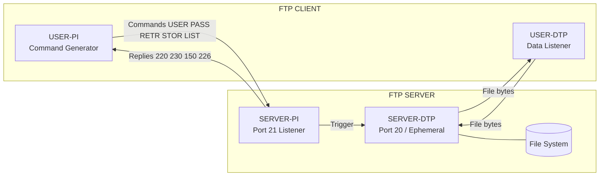
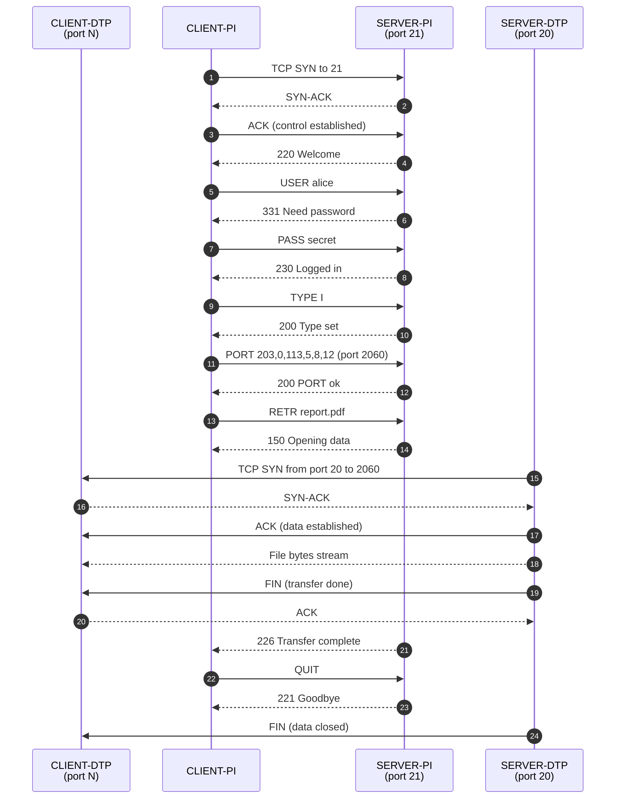
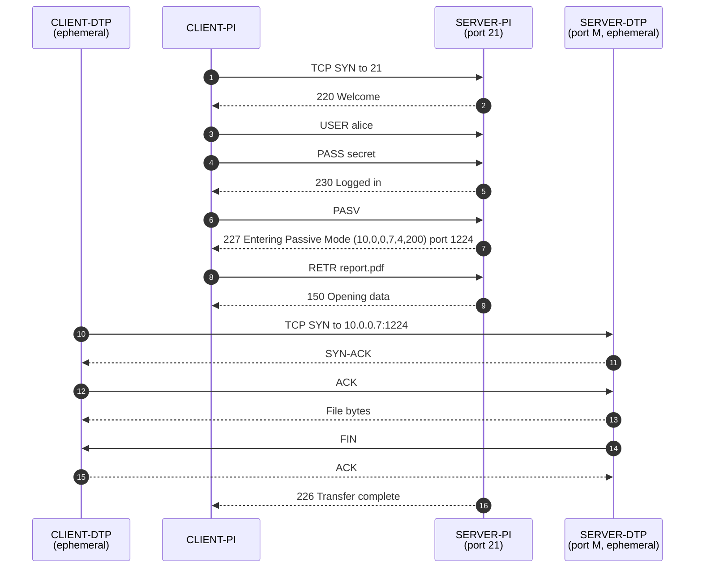
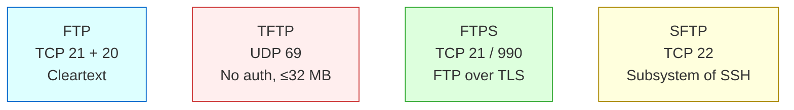
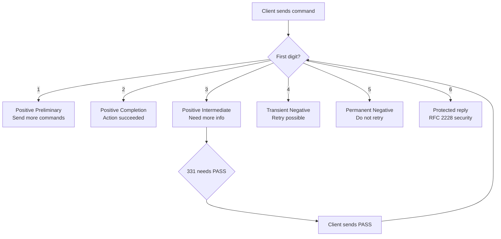

# FTP.

<!-- SECTION_1_START -->
# File Transfer Protocol (FTP) — KTU Computer Networks Module 4

## 1.1 Formal Academic Definition

> [!IMPORTANT]
> **FTP (File Transfer Protocol)** is an **application-layer**, **client–server**, **TCP-based** protocol standardized in **RFC 959** (1985) and updated by **RFC 5797** and **RFC 7151**. It is used for the **reliable bidirectional transfer of files** between a client and a server over an IP network. FTP is the canonical example of a protocol that uses **two parallel TCP connections** — a persistent **control channel (port 21)** for commands/replies, and a transient **data channel (port 20)** for the actual file payload.

> [!NOTE]
> **Syllabus Highlight (KTU 2024 — OECST724, Module 4):**
> FTP is studied under *Application Layer protocols that rely on TCP's reliable byte-stream service*. Students must know the **dual-connection model**, the **command/reply vocabulary**, the **active vs passive mode distinction**, and the **difference between FTP, TFTP, FTPS, and SFTP**.

---

## 1.2 Intuitive Analogy

Imagine a **library courier service**. To get a book from a far-away library:

1. You first make a **phone call** (the *control connection*) and say: *"I want a book, here is my card number, please get me the engineering textbook in aisle 7."*  
2. The librarian confirms your request and tells you *"A delivery boy is on his way."*  
3. A **separate delivery boy** (the *data connection*) shows up at your door with the book. Once he leaves, the phone call is **still open** for your next request.

- The **phone line** = persistent **TCP control connection (port 21)** carrying commands.
- The **delivery boy** = on-demand **TCP data connection (port 20)** carrying the file.
- The **library** = **FTP server**; **you** = **FTP client (user/PI/host)**.

> [!TIP]
> This **out-of-band signaling** (control data flows on a separate channel from the payload) is the defining architectural feature of FTP — and the reason firewalls and NAT boxes still struggle with it decades later.

---

## 1.3 Three Key Roles in an FTP Session

| Role | Symbol | Meaning |
|---|---|---|
| **User** | U | The human operator at the client machine |
| **PI** (Protocol Interpreter) | PI | The software that issues **FTP commands** and interprets **replies** |
| **DTP** (Data Transfer Process) | DTP | The software that establishes the **data connection** and manages file I/O |
| **Server-PI** | Server-PI | The PI on the server side listening on TCP port 21 |
| **Server-DTP** | Server-DTP | The DTP on the server side that opens port 20 for data transfer |

---

## 1.4 Visualization — Two-Channel FTP Topology

> [!VISUALIZATION CONTROL]
> **Concept:** The simultaneous **control channel (port 21)** and **data channel (port 20)** between an FTP client and server.
> **GeoGebra / Desmos Input Equations:** *(not applicable — this is a logical connection diagram, see the Mermaid schematic in SECTION 4)*
> **Visual Description:** A rectangular client box on the left, a rectangular server box on the right. **Two parallel lines** connect them — the *upper line labelled "Control : TCP 21"* and the *lower line labelled "Data : TCP 20"*. Commands (USER, RETR, STOR…) flow along the upper line; file bytes flow along the lower line.

> [!NOTE]
> **Standard Ports to Memorise (Board Favourite):**
> - **Control connection → TCP port 21** (persistent, full session)
> - **Server-side data connection → TCP port 20** (active mode)
> - **TFTP** (for contrast) → **UDP port 69**
> - **SFTP** (for contrast) → **TCP port 22** (it is SSH, not FTP)
> - **FTPS implicit** → **TCP port 990**
> - **HTTP** (for contrast) → **TCP port 80 / 443**

<!-- SECTION_1_END -->

<!-- SECTION_2_START -->
# 2. Deep Theoretical Analysis & KTU High-Yield Sheet

## 2.1 The Two-Connection Model — Why FTP is "Out-of-Band"

Most application protocols are **in-band**: the command, the response, and the data all share a single TCP stream (HTTP/1.1, SMTP, POP3, IMAP all do this).

FTP is **out-of-band** because the designers in 1971 (RFC 114) wanted the **control dialog to remain interactive** while a large binary file (megabytes to gigabytes) was being streamed in the background. The control channel would otherwise be blocked by a long data flow, preventing the user from issuing another command mid-transfer.

### 2.1.1 Control Connection

- Established **first** via a **three-way TCP handshake** to **server port 21**.
- Persists for the **entire user session** (from `USER` to `QUIT`).
- Carries **7-bit ASCII commands** from client → server and **3-digit numeric replies** from server → client.
- Conversation is governed by the **Telnet protocol** (RFC 854) — so even the keystrokes of the *command line* are sent as Telnet characters.

### 2.1.2 Data Connection

- Established **only when a file is being transferred**, **LIST** command, or directory operation needs a payload.
- Closes **immediately** after the transfer completes.
- Two flavours of port selection — see Active vs Passive (§2.3).

## 2.2 FTP Command & Reply Vocabulary (Board Imperative)

### 2.2.1 Access Commands (Authentication)

| Command | Syntax | Purpose |
|---|---|---|
| `USER <username>` | `USER anonymous` | Identify the user |
| `PASS <password>` | `PASS guest@iitb.ac.in` | Authenticate (sent in clear-text!) |
| `ACCT <account>` | `ACCT admin` | Optional accounting info |
| `QUIT` | `QUIT` | Terminate session, close control channel |
| `REIN` | `REIN` | Re-initialize (logout without dropping control) |
| `ABOR` | `ABOR` | Abort the previous command / data transfer |

### 2.2.2 File & Directory Commands

| Command | Purpose |
|---|---|
| `CWD <path>` | Change Working Directory |
| `PWD` | Print Working Directory |
| `CDUP` | Change to parent directory |
| `MKD <path>` | Make directory |
| `RMD <path>` | Remove directory |
| `DELE <file>` | Delete a file |
| `LIST [<path>]` | List files (full details) — opens data connection |
| `NLST [<path>]` | Name list only (compact) |
| `RETR <file>` | **Retrieve** (download) a file |
| `STOR <file>` | **Store** (upload) a file |
| `STOU <file>` | Store with unique filename |
| `APPE <file>` | Append to an existing file |
| `RNFR <old>` / `RNTO <new>` | Rename (two-step) |
| `SIZE <file>` | Get file size in bytes |
| `MDTM <file>` | Get last modification time |
| `REST <offset>` | Restart transfer at byte offset (resumable download) |

### 2.2.3 Parameter & Mode Commands

| Command | Purpose |
|---|---|
| `TYPE A` / `TYPE I` | Transfer type: **A**SCII (text) or **I**mage (binary) |
| `STRU F` / `R` / `P` | File / Record / Page structure (almost always `F`) |
| `MODE S` / `B` / `C` | Stream / Block / Compressed transfer mode |
| `PASV` | Server should **listen** (passive mode) |
| `PORT a,b,c,d,p1,p2` | Client **listens** at IP a.b.c.d on port $\vert p_1 \times 256 + p_2 \vert$ (active mode) |
| `EPSV` / `EPRT` | Extended (IPv6-capable) versions of PASV/PORT |

### 2.2.4 Service & Help Commands

`NOOP` (no-op keep-alive), `HELP`, `SITE`, `SYST`, `STAT`, `FEAT`.

### 2.2.5 Reply Code Structure (3 digits — board favourite!)

The reply format is:
```
<3-digit code> <text message>\r\n
```
Multi-line replies begin with `xxx-` and end with `xxx ` (note the trailing space — board trick question!).

| First digit | Class | Meaning |
|---|---|---|
| **1xx** | Positive Preliminary | Action started; send another command |
| **2xx** | Positive Completion | Command succeeded |
| **3xx** | Positive Intermediate | Command accepted, need more info (e.g., password prompt) |
| **4xx** | Transient Negative | Try again later |
| **5xx** | Permanent Negative | Do not retry |
| **6xx** | Protected (RFC 2228) | Extended security replies |

**Must-remember reply codes:**

| Code | Phrase | Trigger |
|---|---|---|
| **220** | Service ready for new user | Greeting at connection |
| **331** | User name OK, need password | After `USER` |
| **230** | User logged in, proceed | After `PASS` success |
| **530** | Not logged in | Wrong password |
| **150** | File status okay; about to open data connection | Before `RETR`/`STOR` |
| **226** | Closing data connection; transfer complete | After file transfer |
| **425** | Can't open data connection | Network problem |
| **426** | Connection closed; transfer aborted | Mid-transfer failure |
| **227** | Entering Passive Mode (h1,h2,h3,h4,p1,p2) | Reply to `PASV` |
| **200** | Command okay | Generic success |

> [!IMPORTANT]
> **Board trick:** The **second digit** indicates the **category**:
> - `x0x` — Syntax
> - `x1x` — Information
> - `x2x` — Connections
> - `x3x` — Authentication & accounting
> - `x4x` — (unspecified)
> - `x5x` — File system

## 2.3 Active Mode vs Passive Mode

> [!NOTE]
> This is the single most asked FTP question in KTU exams. Memorise the diagram in §4.

### 2.3.1 Active Mode (PORT)

$$\boxed{\text{Client} \xleftarrow{\text{port 21 (control)}} \text{Server}, \quad \text{Server} \xrightarrow{\text{port 20} \to \text{client port}} \text{Client}}$$

**Sequence:**
1. Client opens an **ephemeral port** $N$ (its DTP listens on $N$).
2. Client sends `PORT a,b,c,d,p1,p2` where $N = p_1 \times 256 + p_2$.
3. Client sends `RETR filename`.
4. Server opens a TCP connection **from its port 20** to client's port $N$.
5. Server transmits the file on this server-initiated connection.
6. Server closes the data connection.

**Problem:** The connection is **incoming to the client** — blocked by every modern NAT and most firewalls.

### 2.3.2 Passive Mode (PASV)

$$\boxed{\text{Client} \xleftarrow{\text{port 21 (control)}} \text{Server}, \quad \text{Client} \xrightarrow{\text{ephemeral port}} \text{Server's random port}}$$

**Sequence:**
1. Client sends `PASV`.
2. Server opens an **ephemeral port** $M$ and replies `227 Entering Passive Mode (h1,h2,h3,h4,p1,p2)` where $M = p_1 \times 256 + p_2$.
3. Client sends `RETR filename`.
4. **Client connects from its ephemeral port to server's port $M$** (outgoing — NAT-friendly).
5. File flows server → client.
6. Both sides close the data connection.

| Feature | Active (PORT) | Passive (PASV) |
|---|---|---|
| Initiator of data TCP | **Server** | **Client** |
| Data port on server | **20** (fixed) | **Random > 1023** |
| Client firewall | Needs port open for **incoming** | Works with stateful outbound |
| Server firewall | Needs port 20 open for **outgoing** | Needs many random ports open (or a range) |
| NAT friendliness | Poor | **Good** |
| Default in browsers | No | **Yes (WebFTPs default to PASV)** |

## 2.4 Data Transfer Modes (TYPE / MODE)

| `TYPE` | Meaning | Use |
|---|---|---|
| `A` (ASCII, default) | 8-bit → 7-bit NVT conversion | Text files |
| `E` (EBCDIC) | IBM mainframe text | Rare |
| `I` (Image / Binary) | No conversion | Executables, images, video |
| `L <n>` | Local byte size $n$ | Old DEC machines |

| `MODE` | Meaning |
|---|---|
| `S` (Stream, default) | Raw byte stream; EOF closes connection |
| `B` (Block) | Data sent as numbered blocks, restartable |
| `C` (Compressed) | Lempel-Ziv compression on the fly |

## 2.5 Anonymous FTP

A special form where the client logs in as:

```
USER anonymous
PASS user@host
```

The server grants read-only access to a public subtree. Used by **software archives** (e.g., `ftp.gnu.org` historically, now mostly HTTPS).

## 2.6 KTU High-Yield Cheat Sheet

| Parameter / Concept | Value / Rule |
|---|---|
| RFC number | **959** (1985) |
| Transport | **TCP** (reliable, byte-stream) |
| Control port | **21** |
| Active-mode data port (server) | **20** |
| Passive-mode data port (server) | **Random ephemeral** ($> 1023$) |
| Reply code digits | **3 digits** in ASCII |
| Default `TYPE` | **A** (ASCII) |
| Default `MODE` | **S** (Stream) |
| Default `STRU` | **F** (File) |
| Multi-line reply terminator | Same code + **space** (`226 `) |
| Authentication type | **Clear-text USER/PASS** (insecure) |
| Number of TCP connections | **Two per session** (control + data) |
| Stateful? | **Yes** (FTP is stateful; server tracks CWD, TYPE, user) |
| Connection initiator (active) | **Server** opens data conn |
| Connection initiator (passive) | **Client** opens data conn |
| Control connection lifetime | **Whole session** |
| Data connection lifetime | **Only during transfer** |
| Anonymous username | `anonymous` |
| Why "out-of-band"? | Control and data use **separate** TCP connections |
| File system commands | `CWD`, `PWD`, `MKD`, `RMD`, `LIST`, `RETR`, `STOR`, `DELE` |
| Resume transfer | `REST <offset>` + `RETR` |
| Insecure variant for exam contrast | **TFTP** (UDP/69, no auth, ≤32 MB) |
| Encrypted variants | **FTPS** (FTP+TLS, ports 21/990) and **SFTP** (SSH, port 22, not really FTP) |

> [!TIP]
> **Real-world engineering note:** Every modern web browser's FTP client (Chrome removed it in Chrome 95, January 2022) and command-line utilities such as `curl`, `wget`, and `lftp` **default to passive mode** because almost every client is behind a NAT gateway. Server admins therefore configure a **PASV port range** (e.g. `50000–50100`) and open only that range in the firewall.

<!-- SECTION_2_END -->

<!-- SECTION_3_START -->
# 3. Step-by-Step Derivations, Worked Examples & Implementation

## 3.1 Worked Example 1 — Decoding the `PORT` Command

> **[KTU University Exam — July 2023 style, 3-mark part]**
> An FTP client sends the command `PORT 192,168,10,5,7,141`. What is the client's IP address and the data port number on which it will listen?

### Step 1 — Identify the fields
The PORT command carries the **32-bit IP address** split into four decimal octets, then the **16-bit port number** split into two bytes ($p_1$, $p_2$).

$$\text{PORT } h_1,h_2,h_3,h_4,p_1,p_2 = 192,168,10,5,7,141$$

### Step 2 — Reassemble the IP address
$$h_1 = 192, \quad h_2 = 168, \quad h_3 = 10, \quad h_4 = 5$$
$$\text{IP address} = 192.168.10.5$$

### Step 3 — Compute the data port

The 16-bit port is reconstructed as the **8-bit high byte** $p_1$ and **8-bit low byte** $p_2$:

$$\text{port} = p_1 \times 256 + p_2$$

$$\text{port} = 7 \times 256 + 141 = 1792 + 141 = 1933$$

### Step 4 — Interpretation
The client's DTP is listening on **192.168.10.5 : 1933** for an incoming server data connection. The server's control-PI will be told to connect to that endpoint when the next file transfer starts.

> **Valuation Key (3 marks):** [IP reconstruction: 1 mark] [Port formula: 1 mark] [Final value 1933: 1 mark]

---

## 3.2 Worked Example 2 — Decoding the `PASV` Reply

> An FTP server replies `227 Entering Passive Mode (10,0,0,7,4,200)`. Find the server's data IP and the port on which the client should connect.

### Step 1 — Extract the tuple
$(h_1, h_2, h_3, h_4, p_1, p_2) = (10, 0, 0, 7, 4, 200)$

### Step 2 — Reassemble the IP
$$h_1.h_2.h_3.h_4 = 10.0.0.7$$

### Step 3 — Compute the port
$$\text{port} = p_1 \times 256 + p_2 = 4 \times 256 + 200 = 1024 + 200 = 1224$$

### Step 4 — Final connection endpoint
The client opens a TCP connection to **10.0.0.7 : 1224** to receive the next file.

---

## 3.3 Worked Example 3 — File Transfer Timeline (Active Mode)

A user wants to **download** `report.pdf` from `ftp.example.com`.

| Step | Direction | Channel | Message / Action | Reply Code |
|---|---|---|---|---|
| 1 | Client → Server | Control (TCP 21) | TCP three-way handshake | — |
| 2 | Server → Client | Control | Greeting banner | **220** |
| 3 | Client → Server | Control | `USER alice` | **331** (need password) |
| 4 | Client → Server | Control | `PASS s3cret` | **230** (logged in) |
| 5 | Client → Server | Control | `TYPE I` (binary) | **200** |
| 6 | Client → Server | Control | `CWD /pub/reports` | **250** |
| 7 | Client → Server | Control | `PORT 203,0,113,5,8,12` *(port = 2060)* | **200** |
| 8 | Client → Server | Control | `RETR report.pdf` | **150** (data conn opening) |
| 9 | Server → Client | **Data (TCP 20 → client 2060)** | File bytes | — |
| 10 | Server → Client | Control | Transfer complete | **226** |
| 11 | Client → Server | Control | `QUIT` | **221** |
| 12 | TCP | Control | FIN/ACK teardown | — |

> **Note:** Step 8's **150** reply is critical — it tells the client *"stand by, the data connection is being opened, the file is about to come"*. The **226** at step 10 confirms the data connection has been closed cleanly. A **426** here would mean the data connection was *abnormally* aborted.

---

## 3.4 Worked Example 4 — Time to Transfer a 10 MB File over FTP

We can derive a simple throughput estimate that the board loves to combine with the transport-layer concepts.

> A 10 MB file is transferred over an FTP connection. Each segment carries 1460 bytes of payload. Each ACK travels in its own 40-byte header packet. RTT = 80 ms, transmit rate = 1 Gbit/s, and the sender uses a **sliding-window** with $W$ = 20 segments. Find the **total time** to ship the file.

### Step 1 — Number of data segments

$$N = \left\lceil \frac{10 \times 10^6}{1460} \right\rceil = \lceil 6849.32 \rceil = 6850 \text{ segments}$$

### Step 2 — Sender's window-bound throughput (in-flight bits)

$$B_{\text{in-flight}} = W \times L_{\text{seg}} = 20 \times 1460 \times 8 = 233\,600 \text{ bits}$$

### Step 3 — Time to push one full window (transmission time + propagation)

Transmission time per segment:
$$T_{\text{tx}} = \frac{L}{R} = \frac{1460 \times 8}{10^9} = 11.68\,\mu s$$

Round-trip time to receive the first ACK: $T_{\text{RTT}} = 80$ ms. Hence the **window-stall time** is approximately:
$$T_{\text{cycle}} = T_{\text{RTT}} + T_{\text{tx}} \approx 80.012 \text{ ms}$$

### Step 4 — Number of full windows

$$\text{Windows needed} = \left\lceil \frac{N}{W} \right\rceil = \left\lceil \frac{6850}{20} \right\rceil = 343 \text{ windows}$$

### Step 5 — Total transfer time
$$T_{\text{total}} \approx 343 \times 80.012 \text{ ms} \approx 27.44 \text{ s}$$

### Step 6 — Effective throughput

$$R_{\text{eff}} = \frac{10 \times 10^6 \times 8}{27.44} \approx 2.92 \text{ Mbit/s}$$

This is **far below** the 1 Gbit/s link rate because of the **bandwidth-delay product (BDP)** ceiling:

$$\text{BDP} = R \times \text{RTT} = 10^9 \times 0.08 = 80 \text{ Mbit} = 10 \text{ MB}$$

The sender's window of $20 \times 1460 = 28\,400$ bytes is **smaller** than the BDP, so the pipe is **under-utilised**. To saturate the link we would need:

$$W_{\min} = \left\lceil \frac{\text{BDP}}{L_{\text{seg}}} \right\rceil = \left\lceil \frac{10 \times 10^6}{1460} \right\rceil = 6849 \text{ segments}$$

> **Valuation Key (14 marks):** [N calculation: 3] [BDP concept: 3] [Window time formula: 3] [Final time: 3] [Conclusion about pipelining: 2]

---

## 3.5 Python Implementation — A Mini FTP Server (Educational)

> [!IMPORTANT]
> This is a **pedagogical** code listing showing how the FTP control connection is implemented with raw Python sockets. It handles `USER`, `PASS`, `PWD`, `CWD`, `LIST`, `RETR`, `STOR`, `QUIT`. The data connection is opened per command.

```python
"""
mini_ftpd.py — educational FTP server
Implements control channel on port 21 and per-command data channel.
Run: sudo python3 mini_ftpd.py  (needs root for port 21)
"""
import socket
import threading
import os
import sys
import pathlib
import posixpath

ROOT = pathlib.Path("./ftp_root").resolve()
os.makedirs(ROOT, exist_ok=True)

CWD = ROOT                 # current working directory (server-side)
TYPE = "A"                 # default transfer type
USERS = {"alice": "wonder", "bob": "builder"}
LOGGED_IN = {"alice": False, "bob": False}


def resolve(rel: str) -> pathlib.Path:
    """Safely resolve a client-supplied path under ROOT."""
    if rel in (None, "", "/"):
        return ROOT
    rel = rel.lstrip("/")
    candidate = (CWD / rel).resolve()
    # Containment check — prevent ../../../etc/passwd escape
    if ROOT not in candidate.parents and candidate != ROOT:
        raise ValueError("Path escapes root")
    return candidate


def reply(conn: socket.socket, code: int, text: str) -> None:
    """Send an FTP reply line: 'CODE text\\r\\n'."""
    conn.sendall(f"{code} {text}\r\n".encode("ascii"))


def open_data_channel(client_ip: str, port_tuple: tuple) -> socket.socket:
    """
    ACTIVE MODE: client listens on the (ip, port) it announced.
    The server connects from its port 20 to the client's port.
    """
    ip, p1, p2 = port_tuple
    port = p1 * 256 + p2
    data_sock = socket.socket(socket.AF_INET, socket.SOCK_STREAM)
    data_sock.settimeout(15.0)
    data_sock.connect((ip, port))
    return data_sock


def send_listing(data_sock: socket.socket, path: pathlib.Path) -> None:
    """Send an LS-like directory listing on the data channel."""
    lines = []
    for entry in sorted(path.iterdir()):
        kind = "d" if entry.is_dir() else "-"
        size = entry.stat().st_size if entry.is_file() else 0
        lines.append(f"{kind}rw-r--r--  1 ftp ftp {size:>10} {entry.name}")
    payload = ("\r\n".join(lines) + "\r\n").encode("ascii")
    data_sock.sendall(payload)


def send_file(data_sock: socket.socket, path: pathlib.Path) -> None:
    """Stream a file over the data channel in 4 KB chunks."""
    with open(path, "rb") as fp:
        while True:
            chunk = fp.read(4096)
            if not chunk:
                break
            data_sock.sendall(chunk)


def receive_file(data_sock: socket.socket, path: pathlib.Path) -> None:
    """Receive an uploaded file over the data channel."""
    with open(path, "wb") as fp:
        while True:
            chunk = data_sock.recv(4096)
            if not chunk:
                break
            fp.write(chunk)


def handle_client(conn: socket.socket, addr) -> None:
    user = None
    reply(conn, 220, "mini_ftpd ready.")
    while True:
        try:
            raw = conn.recv(4096).decode("ascii", errors="ignore")
        except ConnectionResetError:
            return
        if not raw:
            return
        for line in raw.splitlines():
            if not line.strip():
                continue
            parts = line.split(maxsplit=1)
            cmd = parts[0].upper()
            arg = parts[1] if len(parts) == 2 else ""

            if cmd == "USER":
                user = arg
                if user in USERS:
                    reply(conn, 331, "Password required for " + user)
                else:
                    reply(conn, 331, "Password required for " + user)

            elif cmd == "PASS":
                if user and USERS.get(user) == arg:
                    LOGGED_IN[user] = True
                    reply(conn, 230, "Login successful.")
                else:
                    reply(conn, 530, "Login incorrect.")

            elif cmd == "SYST":
                reply(conn, 215, "UNIX Type: L8")

            elif cmd == "PWD":
                rel = CWD.relative_to(ROOT)
                reply(conn, 257, f'"/{rel}" is the current directory.')

            elif cmd == "CWD":
                try:
                    new = resolve(arg)
                    if new.is_dir():
                        global CWD
                        CWD = new
                        reply(conn, 250, "CWD successful.")
                    else:
                        reply(conn, 550, "Not a directory.")
                except ValueError:
                    reply(conn, 550, "Permission denied.")

            elif cmd == "TYPE":
                if arg in ("A", "I", "E"):
                    globals()["TYPE"] = arg
                    reply(conn, 200, f"Type set to {arg}.")
                else:
                    reply(conn, 504, "Type not implemented.")

            elif cmd == "PORT":
                # format: PORT h1,h2,h3,h4,p1,p2
                try:
                    fields = [int(x) for x in arg.split(",")]
                    client_ip = ".".join(str(x) for x in fields[:4])
                    data_sock = open_data_channel(client_ip, tuple(fields[3:]))
                    globals()["_PENDING_DATA"] = ("active", data_sock)
                    reply(conn, 200, "PORT command successful.")
                except Exception as e:
                    reply(conn, 425, f"Cannot open data connection: {e}")

            elif cmd == "LIST":
                mode, data_sock = globals()["_PENDING_DATA"]
                reply(conn, 150, "Opening data connection.")
                send_listing(data_sock, CWD)
                data_sock.close()
                reply(conn, 226, "Transfer complete.")

            elif cmd == "RETR":
                try:
                    target = resolve(arg)
                    mode, data_sock = globals()["_PENDING_DATA"]
                    reply(conn, 150, f"Opening data connection for {arg}.")
                    send_file(data_sock, target)
                    data_sock.close()
                    reply(conn, 226, "Transfer complete.")
                except FileNotFoundError:
                    reply(conn, 550, "File not found.")

            elif cmd == "STOR":
                try:
                    target = resolve(arg)
                    mode, data_sock = globals()["_PENDING_DATA"]
                    reply(conn, 150, f"Opening data connection for {arg}.")
                    receive_file(data_sock, target)
                    data_sock.close()
                    reply(conn, 226, "Transfer complete.")
                except Exception as e:
                    reply(conn, 550, f"Could not store: {e}")

            elif cmd == "QUIT":
                reply(conn, 221, "Goodbye.")
                conn.close()
                return

            else:
                reply(conn, 502, f"Command {cmd} not implemented.")


def main() -> None:
    port = int(sys.argv[1]) if len(sys.argv) > 1 else 2121   # non-root default
    server = socket.socket(socket.AF_INET, socket.SOCK_STREAM)
    server.setsockopt(socket.SOL_SOCKET, socket.SO_REUSEADDR, 1)
    server.bind(("0.0.0.0", port))
    server.listen(5)
    print(f"mini_ftpd listening on 0.0.0.0:{port}")
    while True:
        conn, addr = server.accept()
        threading.Thread(target=handle_client, args=(conn, addr), daemon=True).start()


if __name__ == "__main__":
    main()
```

> [!TIP]
> The line `if ROOT not in candidate.parents and candidate != ROOT:` is a **security must** — it is the server-side guard against *path-traversal* attacks (`../../etc/passwd`). Every FTP implementation in production (vsftpd, ProFTPD, pyftpdlib) includes this check.

---

## 3.6 Python Client Snippet — Talking to a Real FTP Server

```python
"""List the root of ftp.gnu.org anonymously using Python's ftplib."""
from ftplib import FTP, error_perm

with FTP() as ftp:
    ftp.connect("ftp.gnu.org", 21, timeout=30)        # control channel
    ftp.login(user="anonymous", passwd="user@host")  # USER + PASS
    print("Welcome:", ftp.getwelcome())              # 220 banner
    print("PWD    :", ftp.pwd())                     # 257 reply
    entries: list[str] = []
    ftp.retrlines("LIST", entries.append)            # opens PASV data ch.
    print("Files  :", entries[:5])
    ftp.quit()                                        # 221
```

**What happens under the hood of `ftp.retrlines("LIST", ...)`:**

1. Library sends `PASV` → server replies `227 … (p1,p2)` → library computes port.
2. Library opens a TCP connection to that port (passive data channel).
3. Library sends `LIST` on the control channel.
4. Server replies `150` and streams the directory listing on the data channel.
5. Server closes the data channel and sends `226` on the control channel.
6. Library invokes the callback for each line it reads.

<!-- SECTION_3_END -->

<!-- SECTION_4_START -->
# 4. Structural Diagrams & Schematics

## 4.1 FTP Two-Channel Architecture



## 4.2 Active Mode (PORT) Connection Sequence



## 4.3 Passive Mode (PASV) Connection Sequence



## 4.4 Comparison Block — FTP vs TFTP vs FTPS vs SFTP



> [!NOTE]
> **KTU Board Trap:** Many students wrongly assume SFTP = "Secure FTP". It is **not** FTP at all — it is the **SSH File Transfer Protocol** that runs as a subsystem of SSH-2, uses **one** encrypted connection on **port 22**, and shares no command set with FTP.

## 4.5 FTP Reply-Code Decision Tree



<!-- SECTION_4_END -->

<!-- SECTION_5_START -->
# 5. KTU 2024 Scheme Examination Question Bank & Topic Recap

---

## 📘 Part A — Short Answer Questions (3 marks each)

### Q1. [KTU University Exam — July 2023, Set B] — CO1, **Remember** (3 Marks)
**"List any three differences between FTP and TFTP."**

| S.No. | FTP | TFTP |
|---|---|---|
| 1 | Uses **TCP** (reliable) | Uses **UDP** (unreliable) |
| 2 | Default control port **21** | Default port **69** |
| 3 | **Authenticated** (USER/PASS) | **No authentication** |
| 4 | Two connections (control + data) | **One** UDP connection |
| 5 | Supports **LIST, RETR, STOR, CWD, MKD, RMD** | Only `read`/`write` (file payloads) |
| 6 | Suitable for large files | Restricted to ≤ 32 MB by RFC 2347 |
| 7 | Stateful | Largely stateless |

> **Model answer (any three rows): 3 marks.**

---

### Q2. [KTU University Exam — Dec 2023] — CO1, **Understand** (3 Marks)
**"What is the difference between active and passive FTP? In which mode is the server's data port randomly chosen?"**

In **active mode** the **client** tells the server (via `PORT`) which port on the client to connect to, and the **server** initiates the data TCP from its well-known **port 20** to the client's port. In **passive mode** the client sends `PASV`; the **server** opens a **random ephemeral port** and tells the client to connect there — it is the **client** that initiates the data TCP. Hence, the server's data port is randomly chosen **only in passive mode**. Passive mode is preferred behind NATs and firewalls.

> **Valuation Key (3 marks):** [Active description: 1] [Passive description: 1] [Identification of when port is random: 1]

---

## 📕 Part B — Long Answer Questions (14 marks each, internal choice)

> **Choose EITHER Question A OR Question B.**

---

### ❓ Question A — [KTU University Exam — July 2024 (model paper)] — CO2, **Apply** (14 Marks)

**A.** Describe the FTP protocol architecture with a neat diagram. Explain the **two-connection model** and the **role of PI and DTP**. **(7 marks)**

**B.** With reference to the reply `227 Entering Passive Mode (192,168,5,2,9,150)`, determine the **server IP** and the **port** the client must connect to. An FTP client also sends `PORT 10,0,0,7,4,200`; what port on the client is it offering? Briefly justify why passive mode is preferred in modern networks. **(7 marks)**

---

#### Model Answer — Part A (7 marks)

**1. Architecture (3 marks):** FTP follows a **client–server** model consisting of three logical components:
- **User-Interface (UI)** — the human at the keyboard.
- **User-Protocol-Interpreter (User-PI)** — issues commands, reads replies.
- **User-Data-Transfer-Process (User-DTP)** — moves the file bytes.
- The server side mirrors these with **Server-PI** and **Server-DTP**.

```
+------------+                          +------------+
|  User-PI   |--- Control : TCP 21 ---->| Server-PI  |
| (Client)   |<-- Replies (220 230..)--| (Server)   |
|  User-DTP  |<-- Data  : TCP 20 ------| Server-DTP |
+------------+                          +------------+
```

> **[Diagram: 2 marks] [PI/DTP roles written: 1 mark]**

**2. Two-connection model (2 marks):** The control connection is established first to port 21 and remains open for the entire session. Each time a file must be transferred, a separate data connection is opened (port 20 in active mode; an ephemeral port in passive), used for the file payload, and closed as soon as the transfer ends. This is called **out-of-band signaling** because commands and data travel on independent channels.

> **[Control vs data difference: 1 mark] [Out-of-band term: 1 mark]**

**3. Why two connections? (1 mark):** To allow the user to remain interactive on the control channel while a large file streams in the background. Otherwise the long file flow would block command traffic.

> **[Justification: 1 mark]**

---

#### Model Answer — Part B (7 marks)

**Step 1 — Passive reply decoding (3 marks):**

The tuple is $(h_1,h_2,h_3,h_4,p_1,p_2) = (192,168,5,2,9,150)$.

- IP address $= h_1.h_2.h_3.h_4 = 192.168.5.2$ **[1 mark]**
- Port $= p_1 \times 256 + p_2 = 9 \times 256 + 150 = 2304 + 150 = 2454$ **[2 marks]**

So the client must connect to **192.168.5.2 : 2454** for the next data transfer.

**Step 2 — PORT decoding (2 marks):**

`PORT 10,0,0,7,4,200` ⇒ client offers port
$$4 \times 256 + 200 = 1224$$
on IP **10.0.0.7**. The server's DTP will connect to **10.0.0.7 : 1224**. **[2 marks]**

**Step 3 — Why passive is preferred (2 marks):**

In passive mode the data TCP is opened **outbound from the client** to the server. Almost all NATs and stateful firewalls allow such outbound connections. In active mode the server must connect **inbound** to a client port, which is **blocked** by default on virtually every consumer router, so active mode fails for any client behind NAT.

> **[NAT/firewall statement: 1 mark] [Conclusion: 1 mark]**

---

### ❓ Question B — [KTU University Exam — Dec 2022] — CO1, **Understand** + CO2, **Apply** (14 Marks)

**A.** Explain in detail the **FTP reply code format** with examples for codes 220, 230, 331, 530, 150, 226, 425, 426 and 227. What does a multi-line reply look like and how is it terminated? **(7 marks)**

**B.** Compare **FTP, TFTP, FTPS, and SFTP** in a tabular form covering at least six parameters. State two reasons why a security-conscious enterprise would prefer SFTP over plain FTP. **(7 marks)**

---

#### Model Answer — Part A (7 marks)

**Format (1 mark):** Every FTP reply is a **3-digit ASCII code** followed by a single space (or hyphen for multi-line) and free-text description, ending with the sequence `\r\n`.

```
<code><SP or -><text>\r\n
```

**Code classes (2 marks):**

| First digit | Class |
|---|---|
| 1xx | Positive Preliminary |
| 2xx | Positive Completion |
| 3xx | Positive Intermediate |
| 4xx | Transient Negative |
| 5xx | Permanent Negative |
| 6xx | Protected (RFC 2228) |

**Example meanings (3 marks):**

| Code | Meaning |
|---|---|
| **220** | Service ready for new user (greeting) |
| **230** | User logged in, proceed |
| **331** | User name OK, need password |
| **530** | Not logged in (auth failed) |
| **150** | File status okay, opening data connection |
| **226** | Closing data connection, transfer complete |
| **425** | Can't open data connection |
| **426** | Connection closed, transfer aborted |
| **227** | Entering Passive Mode `(h1,h2,h3,h4,p1,p2)` |

**Multi-line reply (1 mark):** Begins with `<code>-` and intermediate lines end with `-`; the final line uses `<code><SP>` (note the **trailing space**). Example:

```
230-User logged in, proceed.
230-Some additional information.
230 Welcome.
```

> **Valuation Key (7 marks):** [Format & CRLF: 1] [Class table: 2] [Nine examples: 3] [Multi-line rule with trailing space: 1]

---

#### Model Answer — Part B (7 marks)

**Tabular comparison (5 marks):**

| Parameter | FTP | TFTP | FTPS | SFTP |
|---|---|---|---|---|
| RFC | 959 | 1350 | 959 + 2228/4217 | 4251/4252/4253 (SSH) |
| Transport | TCP | UDP | TCP | TCP |
| Default port | 21 (control) + 20 (data) | 69 | 21 / 990 (implicit) | 22 |
| Connections | 2 (control + data) | 1 | 2 (control + data, both encrypted) | 1 (multiplexed) |
| Authentication | Plain USER/PASS | None | Plain + TLS | Public-key or password via SSH |
| Encryption | None | None | TLS/SSL | SSH (AES, ChaCha20…) |
| File size limit | None | Practically ≤ 32 MB | None | None |
| Stateful? | Yes | Limited | Yes | Yes |
| Firewall friendliness | Poor (active) / OK (PASV) | UDP blocking common | Same as FTP | Excellent (single port) |
| Command set | FTP commands | Minimal RRQ/WRQ | Same as FTP | Completely different (SSH) |

> **[Six parameters × correct entries: 5 marks]**

**Why enterprises prefer SFTP over plain FTP (2 marks):**

1. **Confidentiality & integrity** — SSH encrypts both the commands and the file payload, so credentials, file contents, and directory listings cannot be sniffed or tampered with on the wire.
2. **Single-port operation** — only **TCP 22** needs to be opened on the firewall, eliminating the PASV-port-range juggling that complicates FTP deployments.
3. *(Optional 1 mark)* Strong authentication via **SSH keys** with hardware tokens, plus **integrity** checks via SSH MACs.

> [!WARNING]
> **🚨 KTU Examiner's Valuation Pitfalls — Common Mark-Deductions on FTP Questions:**
> 1. **Forgetting the dual-connection model** — writing "FTP uses one TCP connection" is the #1 reason for losing 3-4 marks.
> 2. **Mixing up the reply-code digit meanings** — confusing 1xx with 4xx loses easy 2 marks.
> 3. **Wrong port number** — TFTP is **UDP 69** (not TCP 69); SFTP is **TCP 22** (not 21); FTPS implicit is **990** (not 21). Examiners pounce on this.
> 4. **Bad PORT/PASV math** — the formula is always $p_1 \times 256 + p_2$. A student who writes $p_1 \cdot 256 + p_2$ with brackets wrong loses a mark.
> 5. **Calling SFTP "Secure FTP"** — it is the SSH File Transfer Protocol, a completely different protocol. **-1 mark**.
> 6. **Skipping the trailing space** in multi-line reply — examiners explicitly look for the `226 ` (space) vs `226-` (hyphen) distinction.
> 7. **Drawing a single-channel diagram** when the question says "explain the architecture" — the diagram must show **two parallel TCP connections**.

---

## 6. Topic Recap & Important Things to Remember

> **Rapid-Revision Checklist (KTU 2024 — Module 4: Transport / Application Layer)**

- **FTP** is an application-layer **TCP** protocol defined in **RFC 959** for reliable file transfer.
- It uses **two parallel TCP connections**: control on **port 21** (persistent) and data on **port 20 in active mode** (transient).
- The control connection is **out-of-band** with respect to data — it carries **ASCII commands** and **3-digit numeric replies**.
- FTP has three roles per side: **UI** (human), **PI** (commands), **DTP** (data).
- **Active mode (`PORT`)** — server initiates the data TCP from its port 20 to a client port announced via `PORT h1,h2,h3,h4,p1,p2`, where the port is $p_1 \times 256 + p_2$. Breaks behind NAT.
- **Passive mode (`PASV`)** — client asks the server to listen; server replies `227 Entering Passive Mode (h1,h2,h3,h4,p1,p2)`; client connects outbound. **NAT-friendly.**
- Default `TYPE = A` (ASCII) and `MODE = S` (stream). Use `TYPE I` for binary, `MODE B` for restartable blocks, `MODE C` for compressed.
- **Reply code classes:** 1xx preliminary, 2xx success, 3xx intermediate, 4xx transient, 5xx permanent, 6xx protected.
- **Must-know codes:** 220, 230, 331, 530, 150, 226, 425, 426, 227.
- Multi-line reply terminator uses **`<code><SP>`** (trailing space) — not `<code>-`.
- **Anonymous FTP** uses `USER anonymous` and an email as the password for read-only public access.
- **`REST <offset>` + `RETR`** allows **resumable** downloads.
- **FTP vs TFTP:** FTP = TCP/21, TFTP = UDP/69, TFTP has no auth and is limited to small files.
- **FTP vs FTPS:** FTPS = FTP over TLS, supports explicit (port 21) and implicit (port 990) modes.
- **FTP vs SFTP:** SFTP is **not FTP** — it is a subsystem of **SSH** running on **TCP 22** with a completely different command set and **one** encrypted, multiplexed connection.
- **Bandwidth-delay product** $\text{BDP} = R \times \text{RTT}$ governs how large a TCP window must be to fully utilise a link — relevant when computing FTP transfer times.
- **Stateful**: FTP servers track CWD, TYPE, user, and the pending data socket across commands; closing the control connection ends the session.
- **Path traversal** is a real security issue — production servers enforce that all client paths resolve **under** the FTP root.

<!-- SECTION_5_END -->
