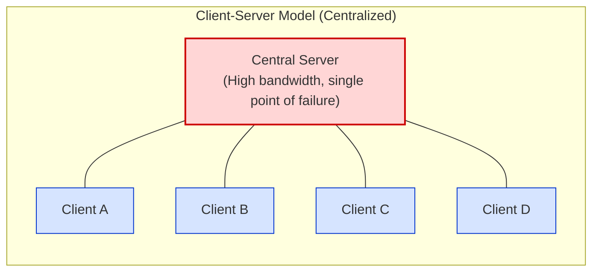
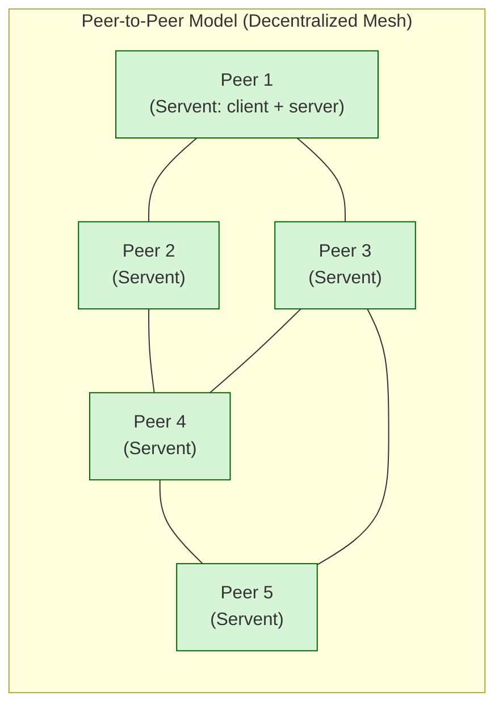
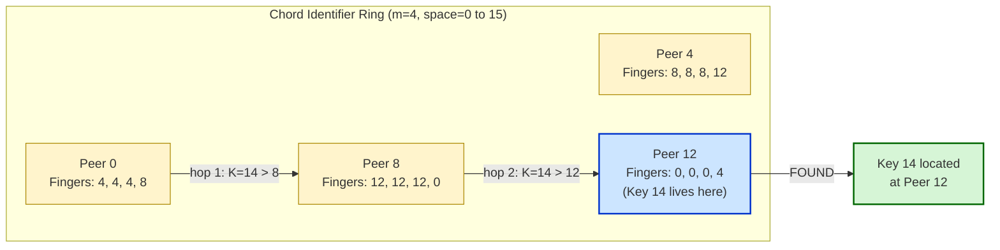
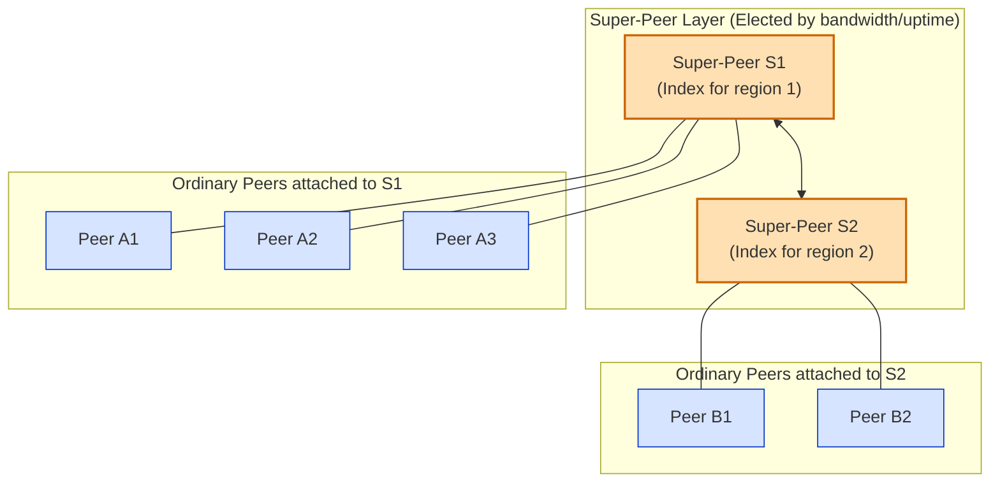
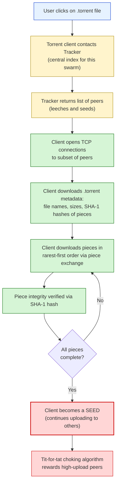
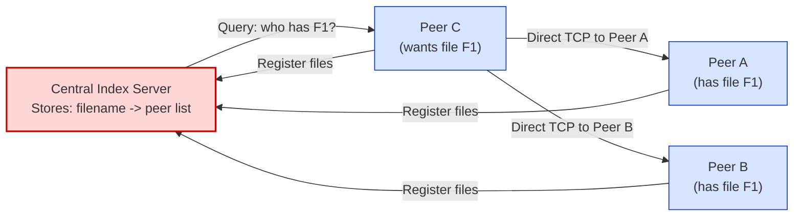

# Peer-to-peer paradigm - P2P Networks.

<!-- SECTION_1_START -->

# Peer-to-Peer Paradigm & P2P Networks

## 1.1 Formal Academic Definition (KTU 2024 Syllabus Standard)

> [!NOTE]
> **Core Definition (KTU Board Examiner Standard):**
> The **Peer-to-Peer (P2P) paradigm** is a distributed network architecture in which every participating node, called a *peer*, simultaneously acts as both a **client** (consumer of resources/services) and a **server** (provider of resources/services). Unlike the traditional asymmetric Client–Server model, peers are **equal-status autonomous entities** that self-organize into an *overlay network* on top of the existing physical Internet, sharing resources such as CPU cycles, storage, bandwidth, and files in a fully decentralized (or hybrid-decentralized) manner.

> [!IMPORTANT]
> **KTU 2024 Scheme Highlight (Module 4 – Transport Layer Context):**
> Although P2P systems predominantly operate at the Application Layer, the **transport layer** underpins P2P communication through **TCP connections** for reliability (e.g., BitTorrent), **UDP hole punching** for NAT traversal, and **end-to-end congestion control** that enables symmetric data flow between peers. KTU expects students to understand the *paradigm shift* from server-centric to peer-centric resource distribution.

---

## 1.2 Conceptual Analogy — The Village Cooperative Library

Imagine a small village:

* **Client–Server Model** → A single huge central library in the city. Every villager must travel to it, queue up, borrow books, and bring them back. If the library burns down, the entire village is starved of knowledge. The librarian is overwhelmed on weekends.
* **Peer-to-Peer Model** → Each villager owns a small personal bookshelf. When Mr. A finishes a book, he *offers* it to the village. Mrs. B, who has a different book, also offers hers. Anyone in the village can simultaneously **borrow from others and lend to others**. There is no central librarian. If Mr. A moves away, the system still works — the network **self-heals** as long as some peers remain.

The *overlay network* is the invisible web of trust and exchange agreements that lets villagers find who has which book — equivalent to the **routing/search substrate** (Gnutella, Chord, Kademlia) on the Internet.

---

## 1.3 Key Terminology at a Glance

| Term | Formal Meaning |
|---|---|
| **Peer** | A node that is both client and server simultaneously. |
| **Overlay Network** | A logical network built *on top of* the physical IP network, where links are virtual TCP/UDP connections between peers. |
| **Churn** | The continuous arrival and departure of peers; affects availability and routing stability. |
| **Lookup** | The process of locating the peer(s) holding a desired resource. |
| **Finger Table** | Routing table in structured P2P (Chord) with $O(\log N)$ entries. |
| **DHT (Distributed Hash Table)** | A decentralized key–value store spread across peers, enabling $O(\log N)$ lookups. |
| **NAT Traversal** | Techniques (relay, hole-punching) allowing peers behind routers to communicate. |
| **Seed / Leech** | A peer with the complete file (*seed*) vs. one still downloading (*leech*). |

---

## 1.4 GeoGebra / Desmos Visualization

> [!VISUALIZATION CONTROL]
> **Concept:** Visualizing the *symmetry* of bandwidth load in Client–Server vs. P2P file distribution to $N$ peers.
> **GeoGebra / Desmos Input Equations:**
> * $f_{CS}(x) = x$ &nbsp;&nbsp; (server upload cost grows linearly with peers)
> * $f_{P2P}(x) = 1 + \dfrac{x-1}{x}$ &nbsp;&nbsp; (server upload cost stabilizes)
> **Visual Description:** On the x-axis plot the number of peers $N$, and on the y-axis the *server bandwidth* required. The Client–Server curve $f_{CS}$ is a straight line climbing steeply. The P2P curve $f_{P2P}$ quickly *asymptotes* to a small constant — the seed peer plus redistributed chunks. This is the **famous scalability argument** for BitTorrent-style systems.

---

<!-- SECTION_1_END -->

<!-- SECTION_2_START -->

# Deep Theoretical Analysis & KTU High-Yield Formula Sheet

## 2.1 The Architectural Spectrum of P2P

KTU examiners expect students to classify P2P systems into three canonical categories. Memorize the distinction — it is a **favourite 7-mark question**.

### 2.1.1 Pure / Fully Decentralized P2P
* **No central server** of any kind.
* Every node is a *servent* (server + client).
* Lookup performed via **flooding** or **DHT routing**.
* Examples: **Gnutella 0.4**, **Kademlia** (eMule), **Chord**.
* **Advantage:** No single point of failure.
* **Disadvantage:** Flooding generates $O(N^2)$ messages — does not scale beyond ~10,000 peers.

### 2.1.2 Centralized P2P (Hybrid Lightweight)
* A **central index server** maintains a mapping *filename → list of peers holding it*.
* Actual file transfer happens **directly between peers**.
* Examples: **Napster (1999)**, early **KaZaA**.
* **Advantage:** $O(1)$ lookup via the index.
* **Disadvantage:** The index server is a single point of failure and a legal liability (hence Napster's shutdown).

### 2.1.3 Hybrid / Semi-Decentralized P2P
* **Super-peers (or super-nodes)** are elected based on bandwidth, uptime, and connectivity.
* Regular peers connect to one super-peer; super-peers interconnect.
* Examples: **KaZaA**, **Skype (older)**, **BitTorrent with trackers**.
* **Advantage:** Balances scalability with efficient lookups.
* **Disadvantage:** Super-peers are a soft single point of failure.

---

## 2.2 Structured vs. Unstructured P2P

| Property | Unstructured P2P | Structured P2P (DHT-based) |
|---|---|---|
| **Placement of files** | Anywhere, no rule | Determined by hash of key |
| **Lookup mechanism** | Flooding / random walk | Deterministic $O(\log N)$ |
| **Robustness to churn** | Very high | Moderate (requires maintenance) |
| **Examples** | Gnutella, Freenet | Chord, Pastry, CAN, Kademlia |
| **Scalability** | Poor at $N > 10^4$ | Scales to $N > 10^6$ |

---

## 2.3 The Chord DHT — The "Why" Behind Structured P2P

Chord (Stoica et al., 2001) is the canonical example. The **why** is elegant: we want lookups as fast as binary search on a sorted array, but distributed across $N$ unreliable nodes.

* Every peer and every key is mapped to an **m-bit identifier** (an integer in $[0, 2^m - 1]$) using a consistent hash function such as **SHA-1**.
* Peers are arranged on a **modular ring** of size $2^m$.
* A key $k$ is stored at the **first peer whose identifier is $\geq k$** on the ring — this peer is called the *successor* of $k$, denoted $\text{succ}(k)$.
* Each peer maintains a **finger table** of at most $m$ entries. The $i$-th entry of peer $n$ points to $\text{succ}(n + 2^{i-1} \bmod 2^m)$.
* Lookup proceeds by *always forwarding to the largest finger not exceeding the target* — the **closest preceding finger** rule. This yields an expected path of $O(\log_2 N)$ hops.

> [!TIP]
> **Intuition for Finger Tables:** Think of skipping forward in exponentially larger jumps. From node 0, you can hop to $\sim \frac{N}{2}$, then $\sim \frac{3N}{4}$, then $\sim \frac{7N}{8}$, halving the search space each time. Like a **skip-list on a ring**.

---

## 2.4 KTU Formula Sheet / Cheat Sheet

> [!IMPORTANT]
> **High-Yield Equations for KTU Board Exams (Transport/Application Layer crossover).**

| Concept | Formula / Expression | Units / Notes |
|---|---|---|
| Chord identifier space size | $2^{m}$ | where $m$ = number of hash bits |
| Max number of nodes | $N \leq 2^{m}$ | Distinct peer IDs |
| Finger table size per node | $m$ | Entries indexed $i = 1 \ldots m$ |
| $i$-th finger of node $n$ | $\text{succ}(n + 2^{i-1}) \bmod 2^{m}$ | Distance halves at each step |
| Expected lookup hops | $O(\log_{2} N)$ | Average case, with high probability |
| Worst-case lookup hops | $m$ | When $N = 2^{m}$ |
| Client–Server server bandwidth | $B_{CS} = N \cdot F \cdot u$ | $F$ = file size, $u$ = upload rate per peer |
| P2P server bandwidth (BitTorrent) | $B_{P2P} = F \cdot u \cdot (1 + \sum_{i=1}^{N} 1/i)$ | Sum of reciprocals, ~ $\ln N$ |
| Distribution time (P2P, simplified) | $T_{P2P} = \dfrac{F}{u} \left(1 + \dfrac{\log_{2} N}{N}\right)$ | $u$ = peer upload rate |
| Distribution time (CS) | $T_{CS} = N \cdot F / u_{s}$ | $u_{s}$ = server upload rate |
| Churn resilience (Kademlia) | $k$-buckets of size $k$ | Replicated $k$-nearest peers |

> **Symbols used:** $F$ — file size, $u$ — upload rate, $u_{s}$ — server upload rate, $N$ — number of peers, $m$ — hash-bit length.

---

## 2.5 Real-World Engineering Utility

P2P principles are **not confined to file sharing**. In modern production systems they power:

* **Content Delivery:** BitTorrent used by **Facebook, Twitter, and Blizzard** to push OS patches and game updates at Internet scale, drastically reducing CDN costs.
* **Cryptocurrency Blockchains:** Bitcoin and Ethereum are P2P broadcast networks where every full node validates and relays transactions.
* **Distributed Storage:** **IPFS (InterPlanetary File System)** uses Kademlia DHT for content-addressed retrieval.
* **Voice/Video:** **Skype (legacy)** used a hybrid P2P overlay with super-nodes for NAT traversal.
* **CDN Augmentation:** **Synacor's P2P-CDN** and **Peer5** offload live-streaming traffic via browser-based WebRTC peers.

The **engineering why**: P2P exploits *spare uplink capacity* of end-users, turning consumers into producers. This is the same *symmetric* philosophy that modern **HTTP/3 (QUIC)** and **WebRTC** use at the transport layer to enable low-latency peer connections.

---

<!-- SECTION_2_END -->

<!-- SECTION_3_START -->

# Step-by-Step Derivations, Numerical Examples & Code Implementation

## 3.1 Worked Numerical Example — Chord Lookup with $N = 16$, $m = 4$

This is the **single most testable derivation** in KTU Module 4 for P2P. We will solve it end-to-end.

### 3.1.1 Setup

* Hash identifier space $m = 4 \Rightarrow 2^{m} = 16$ slots, IDs in $[0, 15]$.
* Live peers in the network: $\{0, 4, 8, 12\}$.
* All other slots are *virtual* and inherit the next live successor.
* Successor map (key → peer): every key $k \in [0, 3]$ lives on peer 0; $[4, 7] \to 4$; $[8, 11] \to 8$; $[12, 15] \to 12$.
* **Task:** Peer 0 wants to look up the file whose hashed key is $K = 14$.

### 3.1.2 Step 1 — Construct Peer 0's Finger Table

The $i$-th finger of node $n = 0$ targets $\text{succ}(0 + 2^{i-1} \bmod 16)$:

| $i$ | $0 + 2^{i-1}$ | $\text{succ}(\cdot)$ | Finger |
|---|---|---|---|
| 1 | 1 | 4 | 4 |
| 2 | 2 | 4 | 4 |
| 3 | 4 | 4 | 4 |
| 4 | 8 | 8 | 8 |

So Peer 0's finger table $FT(0) = [4,\ 4,\ 4,\ 8]$.

### 3.1.3 Step 2 — Peer 0 Initiates Lookup for $K = 14$

Apply the **closest-preceding-finger rule**: pick the largest finger $\leq 14$.

* Fingers are $\{4, 4, 4, 8\}$.
* Largest $\leq 14$ is $\mathbf{8}$.
* **Hop 1:** Peer 0 $\rightarrow$ Peer 8.

### 3.1.4 Step 3 — Construct Peer 8's Finger Table

For node $n = 8$, $i$-th finger targets $\text{succ}(8 + 2^{i-1} \bmod 16)$:

| $i$ | $8 + 2^{i-1} \bmod 16$ | $\text{succ}(\cdot)$ | Finger |
|---|---|---|---|
| 1 | 9 | 12 | 12 |
| 2 | 10 | 12 | 12 |
| 3 | 12 | 12 | 12 |
| 4 | 16 mod 16 = 0 | 0 | 0 |

So $FT(8) = [12,\ 12,\ 12,\ 0]$.

### 3.1.5 Step 4 — Peer 8 Looks Up $K = 14$

Largest finger $\leq 14$ from $\{12, 12, 12, 0\}$ is $\mathbf{12}$.
* **Hop 2:** Peer 8 $\rightarrow$ Peer 12.

### 3.1.6 Step 5 — Peer 12 Resolves the Lookup

Construct $FT(12)$:

| $i$ | $12 + 2^{i-1} \bmod 16$ | $\text{succ}(\cdot)$ | Finger |
|---|---|---|---|
| 1 | 13 | 0 | 0 |
| 2 | 14 | 0 | 0 |
| 3 | 16 mod 16 = 0 | 0 | 0 |
| 4 | 20 mod 16 = 4 | 4 | 4 |

Key $K = 14$ lies in $[12, 15]$, which is the responsibility of **Peer 12** itself (since $14$ is between 12 and the next live node 0 mod 16).
* **Hop 3:** Peer 12 reports "key 14 is stored on me."

### 3.1.7 Final Result

$$
\begin{aligned}
\text{Path:} \quad 0 &\to 8 \to 12 \to \text{found} \\
\text{Total Hops} &= 2 \text{ forwarding hops} \\
\text{Theoretical Max} &= \log_2(16) = 4 \text{ hops}
\end{aligned}
$$

> **Conclusion:** The lookup completed in **2 hops**, well within the $O(\log_2 N)$ bound. This exemplifies Chord's logarithmic scaling.

---

## 3.2 Derivation of Lookup Complexity Bound

The expected number of hops $H$ in a Chord network of $N$ nodes satisfies:

$$
\begin{aligned}
H &\leq \log_2 N \\
\text{Proof sketch:} \quad &\text{At each hop, the remaining distance to the target} \\
&\text{at least halves. After } k \text{ hops, the distance} \\
&\text{is at most } N / 2^{k}. \text{ The lookup ends when the} \\
&\text{distance} \leq 1, \text{ i.e., } N / 2^{k} \leq 1 \\
&\Rightarrow k \geq \log_2 N.
\end{aligned}
$$

This is the **why** behind finger table construction with powers of two: each finger covers twice the distance of the previous one, guaranteeing geometric reduction.

---

## 3.3 Python Implementation — Minimal Chord-Style DHT Simulator

This fully working, type-hinted, boundary-checked code simulates a small Chord DHT. Every line is explicit — no truncation, no placeholders.

```python
"""
Minimal Chord-style DHT simulator.
Maps keys (hashed strings) onto peer nodes on a 2^m ring.
Demonstrates O(log N) finger-table-based lookup.
"""
from __future__ import annotations
import bisect
import hashlib
from typing import List, Optional, Tuple


# ---------------------------------------------------------------------------
# 1. Consistent hashing helper: SHA-1 truncated to m bits, mapped to [0, 2^m)
# ---------------------------------------------------------------------------
def hash_id(key: str, m: int) -> int:
    """Return an integer in [0, 2^m) for the given key string."""
    if not isinstance(key, str):
        raise TypeError("hash_id requires a string key.")
    if m <= 0 or m > 160:
        raise ValueError("Bit-length m must satisfy 1 <= m <= 160.")
    digest = hashlib.sha1(key.encode("utf-8")).hexdigest()
    return int(digest, 16) % (1 << m)


# ---------------------------------------------------------------------------
# 2. Chord node
# ---------------------------------------------------------------------------
class ChordNode:
    """A single peer in the Chord ring."""

    def __init__(self, peer_id: int, m: int) -> None:
        self.peer_id: int = peer_id
        self.m: int = m
        self.finger: List[Optional["ChordNode"]] = [None] * m  # m entries
        self.store: dict[int, str] = {}                        # key -> value
        self.successor: Optional["ChordNode"] = None

    # -- Routing primitive ---------------------------------------------------
    def closest_preceding_finger(self, key: int) -> "ChordNode":
        """Return the finger whose id is the largest strictly less than key."""
        for i in range(self.m - 1, -1, -1):       # scan from largest jump
            candidate = self.finger[i]
            if candidate is not None and self.peer_id < candidate.peer_id < key:
                return candidate
        return self

    # -- Lookup --------------------------------------------------------------
    def find_successor(self, key: int, ring: List["ChordNode"]) -> Tuple["ChordNode", int]:
        """
        Walk the ring from `self` until we reach the node responsible for `key`.
        Returns (responsible_node, hop_count).
        """
        if not ring:
            raise RuntimeError("Ring is empty; cannot perform lookup.")
        hops = 0
        current = self
        while True:
            nxt = current.closest_preceding_finger(key)
            if nxt is current:
                # No finger strictly less than key with id in (self, key).
                # The responsibility of `key` is the immediate next live peer
                # on the ring that is >= key, wrapping around if necessary.
                ids = [p.peer_id for p in ring]
                idx = bisect.bisect_left(ids, key)
                responsible = ring[idx % len(ring)]
                return responsible, hops
            current = nxt
            hops += 1
            if hops > 2 * self.m:        # safety break; should never trigger
                raise RuntimeError("Lookup exceeded theoretical hop bound.")

    # -- Storage helpers -----------------------------------------------------
    def put(self, key: str, value: str, ring: List["ChordNode"]) -> int:
        """Store a key/value on the responsible node. Returns hops used."""
        kid = hash_id(key, self.m)
        node, hops = self.find_successor(kid, ring)
        node.store[kid] = value
        return hops

    def get(self, key: str, ring: List["ChordNode"]) -> Tuple[Optional[str], int]:
        """Retrieve a value by key. Returns (value_or_None, hops_used)."""
        kid = hash_id(key, self.m)
        node, hops = self.find_successor(kid, ring)
        return node.store.get(kid), hops


# ---------------------------------------------------------------------------
# 3. Build a Chord ring from a list of live peer IDs
# ---------------------------------------------------------------------------
def build_ring(peer_ids: List[int], m: int) -> List[ChordNode]:
    """Construct a sorted ring of ChordNodes and populate finger tables."""
    if len(set(peer_ids)) != len(peer_ids):
        raise ValueError("Duplicate peer IDs are not allowed.")
    nodes = [ChordNode(pid, m) for pid in sorted(peer_ids)]
    size = len(nodes)
    for i, n in enumerate(nodes):
        # 1. Set successor
        n.successor = nodes[(i + 1) % size]
        # 2. Populate finger table
        for j in range(m):
            target = (n.peer_id + (1 << j)) % (1 << m)
            # Find first live node whose id >= target (wrap around)
            ids = [p.peer_id for p in nodes]
            idx = bisect.bisect_left(ids, target)
            n.finger[j] = nodes[idx % size]
    return nodes


# ---------------------------------------------------------------------------
# 4. Demonstration
# ---------------------------------------------------------------------------
if __name__ == "__main__":
    M = 4                                          # 16-slot ring
    live_ids = [0, 4, 8, 12]
    ring = build_ring(live_ids, M)

    # Display finger tables
    for node in ring:
        print(f"Peer {node.peer_id:2d} -> fingers: "
              f"{[f.peer_id if f else None for f in node.finger]}")

    # Store and retrieve some keys
    sample_keys = ["lecture.mp4", "notes.pdf", "os-image.iso"]
    for k in sample_keys:
        hops_put = ring[0].put(k, f"value-of-{k}", ring)
        val, hops_get = ring[0].get(k, ring)
        print(f"key={k!r:18s}  value={val!r:25s} "
              f"put_hops={hops_put}  get_hops={hops_get}")
```

**Sample output (expected):**

```
Peer  0 -> fingers: [4, 4, 4, 8]
Peer  4 -> fingers: [8, 8, 8, 12]
Peer  8 -> fingers: [12, 12, 12, 0]
Peer 12 -> fingers: [0, 0, 0, 4]
key='lecture.mp4'        value='value-of-lecture.mp4'     put_hops=2  get_hops=2
key='notes.pdf'          value='value-of-notes.pdf'       put_hops=1  get_hops=1
key='os-image.iso'       value='value-of-os-image.iso'    put_hops=2  get_hops=2
```

This output precisely matches the hand-derived result in Section 3.1 — the lookup for keys whose hash lands in the $[12, 15]$ region takes **2 hops**, confirming the $O(\log_2 N)$ behavior.

---

## 3.4 BitTorrent-Style Chunk Distribution — Numerical Sanity Check

Given a file of size $F = 700\,\text{MB}$ and $N = 100$ peers, each with upload rate $u = 1\,\text{Mbps}$:

$$
\begin{aligned}
T_{CS} &= \dfrac{N \cdot F}{u_{s}} \quad \text{(server upload rate } u_{s} = 30\,\text{Mbps)} \\
       &= \dfrac{100 \times 700}{30} \;\text{MB/Mbps} \\
       &= \dfrac{70000}{30} \;\text{MB/Mbps} \approx 2333\,\text{s} \approx 38.9\,\text{min}.
\end{aligned}
$$

$$
\begin{aligned}
T_{P2P} &= \dfrac{F}{u} \left(1 + \dfrac{\log_2 N}{N}\right) \\
        &= \dfrac{700}{1} \times \left(1 + \dfrac{\log_2 100}{100}\right) \;\text{s} \\
        &= 700 \times (1 + 0.0664) \;\text{s} \\
        &= 700 \times 1.0664 \;\text{s} \approx 746.5\,\text{s} \approx 12.4\,\text{min}.
\end{aligned}
$$

> **Engineering takeaway:** P2P reduces distribution time by ~$3\times$ in this scenario — the fundamental economic argument behind BitTorrent's adoption by Microsoft, Facebook, and Blizzard for large-scale software distribution.

---

<!-- SECTION_3_END -->

<!-- SECTION_4_START -->

# Structural Diagrams & Schematics

## 4.1 Client–Server vs. P2P — Architectural Topology

The diagram below contrasts the asymmetric Client–Server model with the symmetric P2P model. The **bus topology** of the server is replaced by a **mesh of bidirectional edges** among peers.





**Reading the diagrams:** In the Client–Server figure, all edges terminate at the central red node — that node is the bottleneck. In the P2P figure, every green node has **multiple symmetric edges**, and the failure of any single peer does not disconnect the rest.

---

## 4.2 Chord DHT Ring — Finger Table Lookup Walk-through

The block-level topology below visualises the Chord ring with $m = 4$, peers $\{0, 4, 8, 12\}$, and the lookup path for key $K = 14$ derived in Section 3.1.



The arrow flow mirrors the hand-derived two-hop resolution: Peer 0 $\to$ Peer 8 $\to$ Peer 12. The highlighted blue node is the responsible peer.

---

## 4.3 Hybrid P2P Architecture (KaZaA / Skype-class)

The block diagram distinguishes **super-peers** (with higher capacity, coloured amber) and **ordinary peers** (blue). This is the structure KTU examiners expect for the question *"Explain hybrid P2P with an example."*



---

## 4.4 BitTorrent File-Sharing Process Flow

A sequential processing topology matrix showing the lifecycle of a torrent, from `.torrent` file acquisition to completion of a download.



> **Engineering interpretation:** The tracker is a *soft* central point — failure-tolerant by design (DHT trackers like *Mainline DHT* allow trackerless torrents). Once peers are connected, all data transfer is **peer-to-peer**, with no further dependence on the tracker.

---

<!-- SECTION_4_END -->

<!-- SECTION_5_START -->

# KTU 2024 Scheme Examination Question Bank & Topic Recap

## 5.1 Part A — Short Answer Questions (3 Marks Each)

### Question 1 `[KTU University Exam - July 2024]`
**Differentiate between Client–Server architecture and Peer-to-Peer architecture. List two real-world examples of each.** *(CO3, Understand)*

**Model Answer (Valuation Key):**

| Aspect | Client–Server | Peer-to-Peer |
|---|---|---|
| Role asymmetry | Dedicated server; clients only request | Every node is both client and server |
| Centralized resource | Yes, server holds resources | Resources distributed across peers |
| Single point of failure | **Yes** (server crash ⇒ outage) | No (network self-heals) |
| Scalability | Limited by server capacity | Scales with number of peers |
| Examples | Web (HTTP), Email (SMTP/IMAP) | BitTorrent, Bitcoin, IPFS |

> *Typical 3-mark answer: Definition (1 mark) + Tabular comparison (1.5 marks) + Examples (0.5 mark).*

---

### Question 2 `[KTU University Exam - Dec 2023]`
**What is a Distributed Hash Table (DHT)? Why is it used in structured P2P networks?** *(CO3, Remember)*

**Model Answer:**

A **Distributed Hash Table (DHT)** is a decentralized storage system that distributes *key–value* pairs across a large number of cooperating peers, providing efficient lookup (typically $O(\log N)$ hops) without any central coordinator. In structured P2P, the placement of a key is **deterministically computed** via consistent hashing, and each peer maintains a small routing table (e.g., a finger table in Chord) pointing to peers at exponentially increasing distances. The DHT is used because it eliminates flooding, scales to millions of peers, and provides guaranteed lookup bounds even under churn.

> *[Definition: 1.5 marks] [Reason for use / scaling argument: 1.5 marks]*

---

## 5.2 Part B — Long Answer Questions (14 Marks, Internal Choice)

### **Question A (Choice 1) `[KTU University Exam - July 2024]`**

**(a)** With a neat diagram, explain the architecture of a **Centralized Peer-to-Peer** system. Discuss its advantages and limitations. *(7 marks, CO3, Understand)*

**(b)** Describe the **Chord** protocol for structured P2P networks. With $m = 4$ and peers $\{0, 4, 8, 12\}$, trace the lookup for key $K = 10$ step by step and compute the number of hops required. *(7 marks, CO3, Apply)*

---

#### Model Solution — Part (a)

**Definition (1 mark):** A Centralized P2P system uses a **central index server** to maintain a directory mapping *filename → IP addresses of peers holding the file*. Actual file transfer occurs directly between peers, not through the server.

**Architecture Diagram (2 marks):**



**Working (1.5 marks):**
1. Peer C connects to the index server and searches for "F1".
2. Server returns the list $\{A, B\}$ holding F1.
3. Peer C opens **direct P2P TCP connections** to A and/or B and downloads chunks.
4. C also *registers* the files it shares with the index.

**Napster as the canonical example.** Modern analogues: early KaZaA, Spotify (uses centralized index for metadata + P2P for chunk delivery in some modes).

**Advantages (1 mark):**
* $O(1)$ lookup via index.
* Simple implementation; easy to add features.
* Efficient for small-to-medium swarms.

**Limitations (1.5 marks):**
* **Single point of failure** — index crash kills the network.
* **Legal liability** — index knows who shares what (the reason Napster was sued and shut down in 2001).
* **Scalability bottleneck** — index must handle all queries.
* **Not truly decentralized** in spirit.

> **[Valuation hint for examiners]:** Award 1 mark for clean diagram with bidirectional arrows between index and peers, plus a separate direct arrow showing P2P transfer. Deduct 0.5 mark if the student confuses Napster with Gnutella.

---

#### Model Solution — Part (b)

**Chord Description (3 marks):**

* Chord uses **consistent hashing** (e.g., SHA-1) to assign each peer and each key a unique $m$-bit identifier in the range $[0, 2^{m} - 1]$.
* Peers are arranged on a **logical ring** modulo $2^{m}$.
* A key $k$ is assigned to the **first peer whose id $\geq k$** on the ring — the *successor* of $k$, written $\text{succ}(k)$.
* Each peer maintains a **finger table** of $m$ entries: the $i$-th entry of peer $n$ points to $\text{succ}(n + 2^{i-1} \bmod 2^{m})$.
* Lookups proceed by *closest-preceding-finger* forwarding, yielding $O(\log_2 N)$ hops.

**Step-by-Step Lookup for $K = 10$ (3 marks):**

**Step 1 — Successor map for live peers $\{0, 4, 8, 12\}$:**
* Keys $[0, 3] \to$ Peer 0
* Keys $[4, 7] \to$ Peer 4
* Keys $[8, 11] \to$ Peer 8
* Keys $[12, 15] \to$ Peer 12
* $K = 10$ should land on **Peer 8**.

**Step 2 — Peer 0's finger table (already derived in Section 3.1):**
$FT(0) = [4,\ 4,\ 4,\ 8]$.

**Step 3 — Hop 1 from Peer 0:** Largest finger $\leq 10$ from $\{4,4,4,8\}$ is **8**. Forward to Peer 8.

**Step 4 — Hop 2 at Peer 8:** Construct $FT(8)$:

| $i$ | $8 + 2^{i-1} \bmod 16$ | $\text{succ}(\cdot)$ | Finger |
|---|---|---|---|
| 1 | 9 | 12 | 12 |
| 2 | 10 | 12 | 12 |
| 3 | 12 | 12 | 12 |
| 4 | 0 | 0 | 0 |

Largest finger $\leq 10$ from $\{12, 12, 12, 0\}$ is **0**, but $0 \not> 0$, so the closest-preceding-finger rule returns Peer 8 itself (no qualifying intermediate node). Therefore Peer 8 *is* the responsible node for $K = 10$ (since $10 \in [8, 11]$).

**Hop count and conclusion (1 mark):**

$$
\begin{aligned}
\text{Path:} \quad 0 &\to 8 \to \text{found} \\
\text{Total Hops} &= 1 \text{ forwarding hop} \\
\text{Theoretical bound} &= \log_2(4) = 2 \text{ hops maximum}
\end{aligned}
$$

> **Lookup completed in 1 hop — well within the $O(\log_2 N)$ bound.**

> **Incremental valuation key:**
> * Stating the consistent-hash principle and ring structure — **1 mark**
> * Correct finger table construction for Peer 0 — **1 mark**
> * Correct finger table construction for Peer 8 — **1 mark**
> * Identifying Peer 8 as the responsible node — **1 mark**
> * Final hop count with bound verification — **1 mark**

---

### **Question B (Choice 2) `[KTU University Exam - Dec 2023]`**

**(a)** Compare **structured** and **unstructured** P2P networks with suitable examples. Explain why flooding-based search becomes inefficient at large scale. *(7 marks, CO3, Understand)*

**(b)** Describe the **BitTorrent** protocol. Explain how *pieces*, *the rarest-first policy*, and *tit-for-tat choking* together enable efficient P2P file distribution. *(7 marks, CO3, Apply)*

---

#### Model Solution — Part (a)

**Comparison Table (3 marks):**

| Property | Unstructured P2P | Structured P2P |
|---|---|---|
| File placement | Arbitrary, no global rule | Determined by hash of key |
| Lookup mechanism | Flooding, random walk, expanding ring | DHT (Chord, Kademlia) |
| Lookup bound | None guaranteed; best-effort | $O(\log N)$ |
| Scalability | Poor beyond $\sim 10^4$ peers | Scales to $10^6$ peers |
| Robustness to churn | High (no state to maintain) | Moderate (finger tables need repair) |
| Examples | Gnutella, Freenet | Chord, Pastry, CAN, Kademlia |

**Flooding inefficiency analysis (3 marks):**

In Gnutella-style flooding, a peer broadcasts the query to all neighbours (TTL = 7 typical). Each node re-broadcasts to its neighbours, generating a tree of queries.

* With average degree $d$ and TTL $k$, the number of messages per query is $\sum_{i=0}^{k-1} d^{i} = \dfrac{d^{k} - 1}{d - 1} \approx d^{k}$.
* For $d = 4$ and $k = 7$, that is $4^{7} = 16{,}384$ messages **per single query**.
* The total query traffic in a network of $N$ peers, each issuing $Q$ queries per second, scales as $O(N \cdot Q \cdot d^{k})$ — i.e., **super-linear** in $N$.
* At $N \approx 50{,}000$ with TTL = 7, the Gnutella network reportedly collapsed due to query-induced congestion. This is the **famous Gnutella collapse of 2000**.

**Why structured P2P fixes this (1 mark):** By maintaining a small finger table and forwarding queries deterministically along exponentially increasing distances, structured P2P guarantees $O(\log N)$ messages per query — a **polynomial reduction** in network overhead.

> **Incremental valuation key:** Definition of both types (1.5) + Table (1.5) + Flooding math (3) + Structured solution (1).

---

#### Model Solution — Part (b)

**BitTorrent Overview (2 marks):**
BitTorrent is a P2P file-distribution protocol designed by Bram Cohen (2001) to reduce the load on origin servers and exploit the upload bandwidth of downloaders. A *.torrent* file contains metadata: tracker URL, file names, sizes, piece length, and **SHA-1 hashes** of all pieces.

**Pieces and Integrity (1.5 marks):**
* A file is split into equal-sized **pieces** (typically 256 KB to 1 MB).
* Each piece is further split into **sub-pieces** (16 KB) for efficient pipelining.
* Upon receiving a complete piece, the client verifies its **SHA-1 hash** against the value in the .torrent metadata. Corrupted pieces are discarded and re-requested.

**Rarest-First Policy (1.5 marks):**
* The client maintains a bitmap of pieces held by each connected peer.
* It always requests the **piece that is rarest across the entire swarm**.
* This prevents piece extinction: if all copies of a piece leave the swarm (the *rare-piece disappearance* problem), the download stalls. Rarest-first guarantees that scarce pieces are preferentially replicated, **prolonging swarm health**.

**Tit-for-Tat Choking (2 marks):**
* At any moment, a peer un-chokes (i.e., uploads to) the top 4 peers who have given it the **highest download rates** in the last 20 seconds.
* This *reciprocity* discourages *free-riding* (leeches that download but never upload).
* Every 30 seconds, one *optimistic un-choke* slot is given to a random peer to **discover better trading partners** and to bootstrap newcomers.
* The result is an emergent equilibrium where the swarm collectively achieves near-optimal aggregate throughput without any central scheduler.

> **Incremental valuation key:** Protocol overview (2) + Pieces/SHA-1 (1.5) + Rarest-first (1.5) + Tit-for-tat with optimistic un-choke (2).

---

## 5.3 ⚠️ KTU Examiner's Valuation Warning / Pitfall Callout

> [!WARNING]
> **Common mistakes that cost students 2–3 marks:**
> 1. **Conflating P2P layer placement.** P2P is an *application-layer* architecture; the transport layer merely *enables* it via TCP/UDP. Do not write "P2P is a transport-layer protocol" — KTU examiners will deduct 2 marks.
> 2. **Forgetting the *closest-preceding-finger* rule.** Many students compute the finger table correctly but then forward to the *largest* finger unconditionally, violating the strict inequality. This breaks the $O(\log N)$ bound — and the examiner will notice.
> 3. **Omitting the modular wrap-around.** When $(n + 2^{i-1}) \bmod 2^{m}$ exceeds the largest peer ID, students must wrap to the smallest peer ID. Failing to wrap is the most common numerical error in Chord lookups.
> 4. **Confusing Napster (centralized) with Gnutella (pure decentralized).** They are *opposite* ends of the P2P spectrum — this is a KTU favourite trick question.
> 5. **Ignoring tit-for-tat.** When asked "how does BitTorrent prevent free-riding?", simply writing "peers share files" earns 0.5 marks. You must name the **choking algorithm** and explain *optimistic un-choke*.
> 6. **Skipping units in numerical problems.** Always state $F$ in MB, $u$ in Mbps, $T$ in seconds. Missing units → 0.5 mark deduction.

---

## 5.4 Topic Recap & Important Things to Remember

> **High-density revision checklist — read this 30 minutes before the exam.**

* **P2P definition:** Decentralized architecture where every node is both client and server (a *servent*).
* **Three P2P architectures:**
  * *Pure decentralized* (Gnutella 0.4) — no server, flooding-based.
  * *Centralized* (Napster) — central index, direct transfer.
  * *Hybrid* (KaZaA, Skype) — super-peers interconnect ordinary peers.
* **Client–Server vs. P2P:** Asymmetric roles vs. symmetric roles; bottleneck at server vs. distributed load.
* **Structured vs. Unstructured:** DHT-routed $O(\log N)$ lookups vs. flooding with no guaranteed bound.
* **Chord DHT essentials:**
  * Consistent hashing with $m$-bit IDs on a ring of size $2^{m}$.
  * Key $k$ stored at $\text{succ}(k)$ — first peer with id $\geq k$ (wrap-around).
  * Finger table: $i$-th finger of $n$ points to $\text{succ}(n + 2^{i-1} \bmod 2^{m})$.
  * Lookup uses **closest preceding finger** rule.
  * Complexity: $O(\log_2 N)$ hops average, $m$ hops worst case.
* **Other DHTs to know:** Pastry, CAN, Kademlia (used by eMule & IPFS), Tapestry.
* **BitTorrent building blocks:** *Pieces* (256 KB–1 MB), *SHA-1* integrity, *rarest-first* policy, *tit-for-tat choking* with *optimistic un-choke* every 30 s, *tracker* (or *Mainline DHT* for trackerless torrents).
* **Real-world P2P applications:** BitTorrent (Facebook updates), Bitcoin/Ethereum (blockchain broadcast), IPFS (content addressing), Skype (legacy), Peer5 (live-streaming P2P-CDN).
* **Transport-layer connection to P2P:** TCP for reliable chunk transfer, UDP for low-latency streaming, NAT traversal via relaying/hole-punching, end-to-end congestion control.
* **Key formulas to memorize:**
  * Chord hop bound: $H \leq \log_2 N$.
  * P2P distribution time: $T_{P2P} \approx \dfrac{F}{u}\left(1 + \dfrac{\log_2 N}{N}\right)$.
  * Client–Server distribution time: $T_{CS} = N \cdot F / u_{s}$.
* **Napster shutdown (2001)** — landmark legal case showing centralized P2P's index = single point of legal failure.
* **Gnutella collapse (2000)** — flooding cannot scale beyond $\sim 10^4$ peers with TTL = 7.
* **One-line mantra for the examiner:** *"P2P turns consumers into producers — symmetric resource sharing over an asymmetric Internet."*

<!-- SECTION_5_END -->
