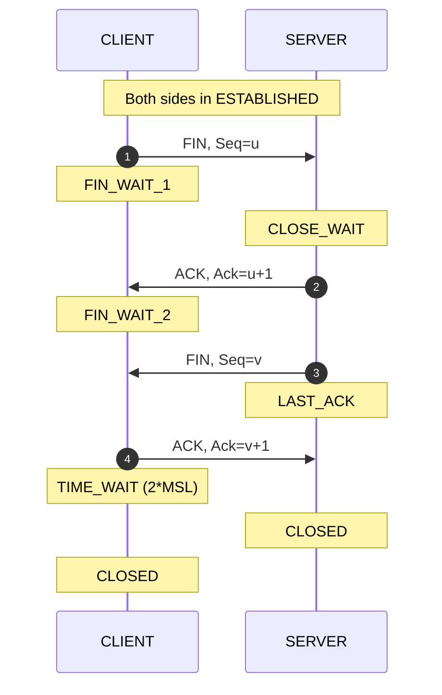
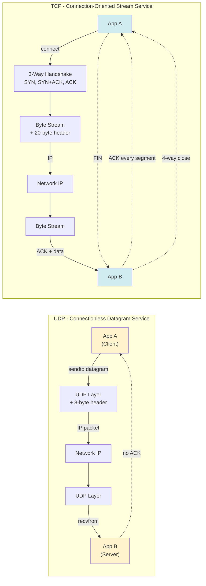
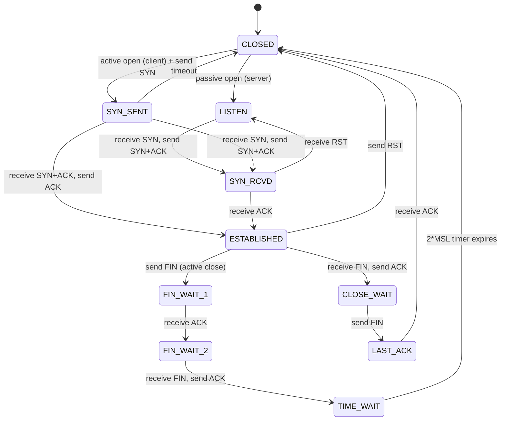
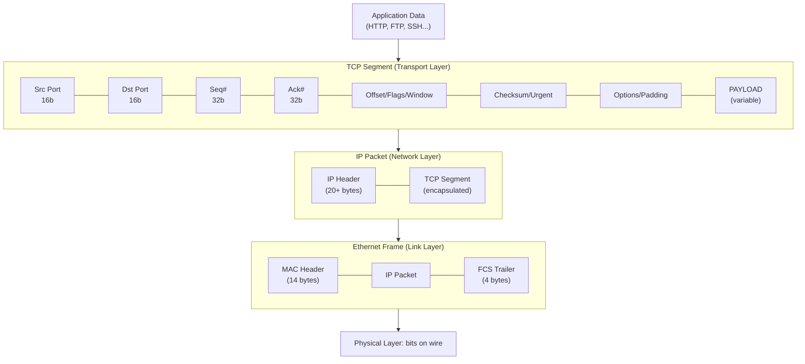
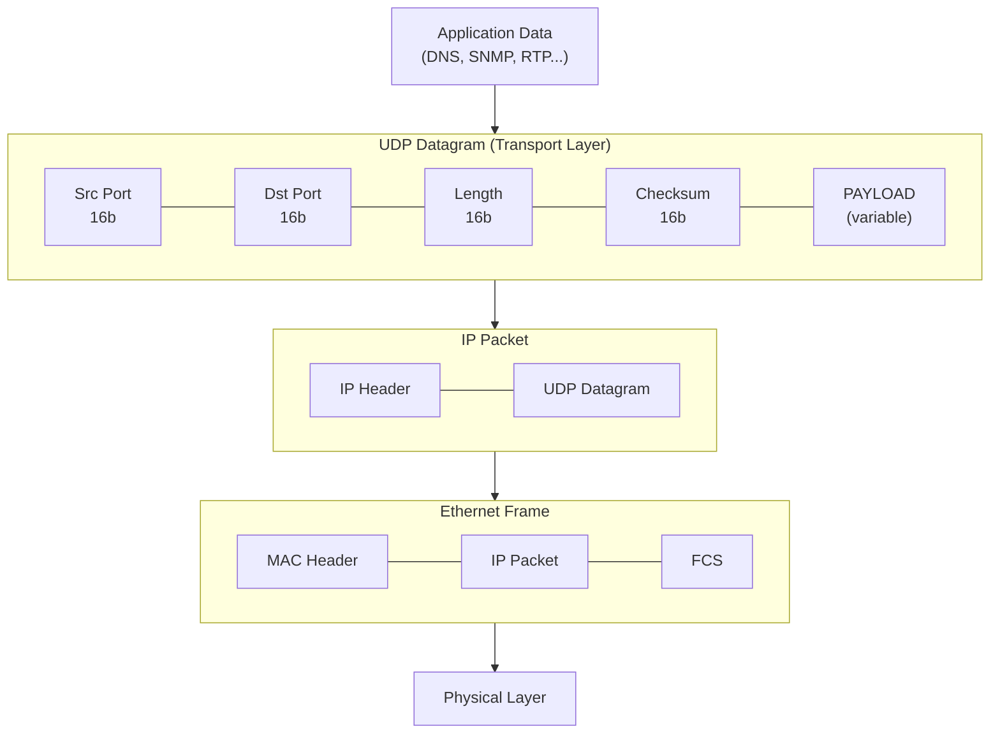
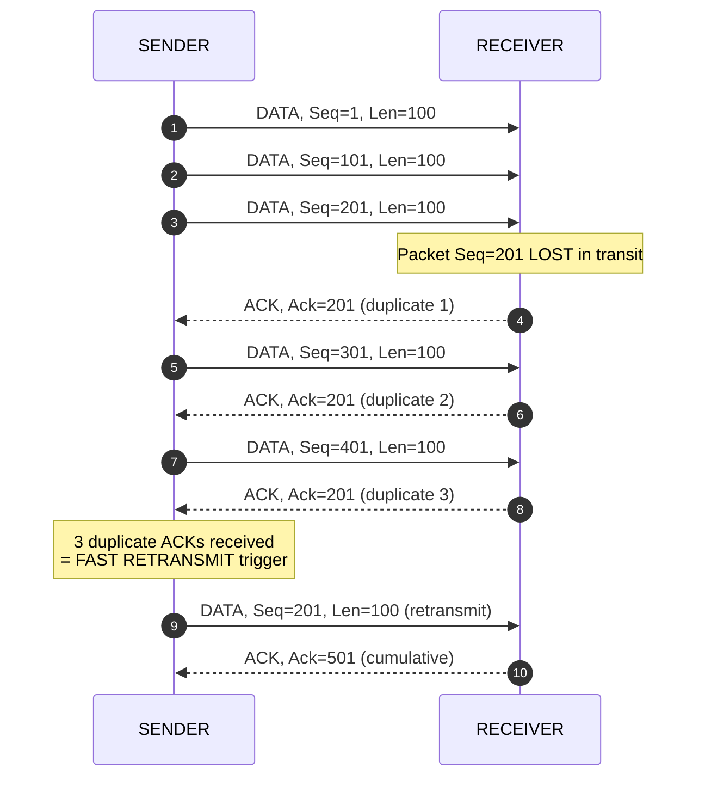

# Transport Layer Protocols- UDP, TCP

<!-- SECTION_1_START -->

# Transport Layer Protocols: UDP & TCP — Core Foundations

## 1.1 The Transport Layer: Position in the TCP/IP Stack

The **Transport Layer** (Layer 4 of the OSI model) sits between the Application Layer and the Network Layer. It is the **end-to-end logical communication layer** — while the Network Layer (IP) delivers packets *host-to-host*, the Transport Layer delivers data *process-to-process* (i.e., between specific applications running on those hosts).

> [!IMPORTANT]
> **KTU 2024 Syllabus Highlight (OECST724 – Module 4):** Students must master the *services*, *header formats*, *connection management*, and *reliability mechanisms* of both **UDP (User Datagram Protocol — RFC 768)** and **TCP (Transmission Control Protocol — RFC 793, updated by RFC 9293)**.

The two flagship protocols of this layer are:

| Protocol | Type | Reliability | Connection | Speed | Header Size |
|----------|------|-------------|------------|-------|-------------|
| **UDP** | Datagram | Unreliable (best-effort) | Connectionless | Fast | **8 bytes** (fixed) |
| **TCP** | Byte-stream | Reliable (ACK + retransmit) | Connection-oriented | Slower | **20–60 bytes** |

---

## 1.2 Formal Definition: User Datagram Protocol (UDP)

**UDP (User Datagram Protocol)** is a *connectionless*, *unreliable*, *message-oriented* transport layer protocol defined in **RFC 768 (1980)**. It provides a thin wrapper around the IP layer, adding only **port-based multiplexing**, an optional **checksum** for integrity, and **length** information — nothing more.

> [!NOTE]
> **Key Property — "Best-Effort Delivery":** UDP makes **no guarantees** of delivery, ordering, duplication protection, or congestion avoidance. The word *User* in the name reflects the fact that reliability, if required, must be added by the user (application) layer.

### 1.2.1 Intuitive Analogy: UDP = Postal "Snail Mail" Without Tracking

Imagine you write a postcard, drop it in a mailbox, and walk away. The post office (IP layer) may or may not deliver it. If it rains, the card is destroyed — no replacement is sent. UDP behaves **exactly** like this:
- You **send** the datagram and forget about it.
- No acknowledgment is expected.
- No retransmission happens if it's lost.
- It's **fire-and-forget**.

This is ideal for applications where **latency matters more than reliability** — e.g., live video streaming, VoIP, online gaming, DNS queries.

---

## 1.3 Formal Definition: Transmission Control Protocol (TCP)

**TCP (Transmission Control Protocol)** is a *connection-oriented*, *reliable*, *byte-stream-oriented* transport layer protocol defined in **RFC 793 (1981)** and modernized by **RFC 9293 (2022)**. It guarantees that a byte stream sent from one process is delivered **in order, without errors, without duplication, and exactly once** to the receiving process.

> [!IMPORTANT]
> **Reliability is built atop an unreliable network (IP)** through a combination of:
> 1. **Sequence numbers** (ordering & loss detection)
> 2. **Acknowledgements (ACKs)** (delivery confirmation)
> 3. **Retransmission timers** (loss recovery)
> 4. **Flow control** (sender–receiver speed matching)
> 5. **Congestion control** (network-wide traffic shaping)

### 1.3.1 Intuitive Analogy: TCP = Registered Post with Signature Confirmation

Compare TCP to a registered courier service:
- Before sending, you **establish a contract** with the receiver (3-way handshake).
- Each parcel is **numbered** and the receiver **signs for every item**.
- If a parcel is lost, the courier **resends it automatically**.
- Parcels are **reassembled in exact order** at the destination.
- The courier monitors whether the receiver's warehouse is **full** (flow control) and whether roads are **jammed** (congestion control).

---

## 1.4 Port Numbers: The Process-Addressing Mechanism

Both UDP and TCP use **16-bit port numbers** (range **0–65535**) to identify the *application process* on a host.

| Port Range | Type | Examples |
|------------|------|----------|
| **0 – 1023** | Well-known (privileged) ports | HTTP=80, HTTPS=443, FTP=21, SSH=22, DNS=53, SMTP=25 |
| **1024 – 49151** | Registered ports | Assigned by IANA to applications |
| **49152 – 65535** | Dynamic/Private (Ephemeral) ports | Assigned by OS to client processes |

> [!NOTE]
> A **socket** is formally defined as the 4-tuple: $\{IP_{src}, Port_{src}, IP_{dst}, Port_{dst}\}$. This 4-tuple uniquely identifies a connection on the entire Internet.

---

## 1.5 UDP Header Format (8 bytes — fixed)

The UDP datagram consists of an **8-byte header** followed by the payload (data):

$$
\begin{aligned}
\text{UDP Header} &= \underbrace{16\,b}_{\text{Source Port}} \;\;+\;\; \underbrace{16\,b}_{\text{Dest Port}} \;\;+\;\; \underbrace{16\,b}_{\text{Length}} \;\;+\;\; \underbrace{16\,b}_{\text{Checksum}} \\[4pt]
\text{Total} &= 8 \text{ bytes (header)} + \text{payload (variable)}
\end{aligned}
$$

| Field | Size (bits) | Description |
|-------|-------------|-------------|
| Source Port | **16** | Sender's port; optional in some replies |
| Destination Port | **16** | Receiver's port |
| Length | **16** | Total length of UDP datagram (header + data) in bytes (min = 8) |
| Checksum | **16** | One's-complement checksum over pseudo-header + UDP data (optional in IPv4, mandatory in IPv6) |

---

## 1.6 TCP Header Format (20–60 bytes)

The TCP **segment** has a minimum 20-byte header (with options up to 60 bytes):

| Field | Bits | Description |
|-------|------|-------------|
| Source Port | 16 | Sender's port |
| Destination Port | 16 | Receiver's port |
| Sequence Number | **32** | Byte-offset of first byte in this segment |
| Acknowledgement Number | **32** | Next expected byte (cumulative ACK) |
| Data Offset (Header Length) | 4 | TCP header length in 4-byte words (5–15 → 20–60 bytes) |
| Reserved | 3 | Must be zero |
| Flags (Control Bits) | 9 | URG, ACK, PSH, RST, SYN, FIN, plus NS, CWR, ECE |
| Window Size | **16** | Receiver's advertised receive window (in bytes) — for flow control |
| Checksum | 16 | Mandatory integrity check |
| Urgent Pointer | 16 | Offset of urgent data (if URG=1) |
| Options | 0–320 | MSS, Window Scaling, Timestamps, SACK |
| Padding | Variable | To make header a multiple of 32 bits |

> [!VISUALIZATION CONTROL]
> **Concept:** Visualizing the 6 standard TCP control flags as a horizontal bit-field
> **Bit Position (left → right):** CWR | ECE | URG | ACK | PSH | RST | SYN | FIN
> **Visual Description:** Imagine a row of 8 colored traffic lights. SYN=green (start), FIN=red (end), ACK=yellow (constant on after handshake), RST=blue (abort), PSH=orange (push data to app), URG=purple (urgent). The first 3 (CWR, ECE) are ECN-related and rarely toggled.
> **GeoGebra / Desmos Input:** A 1×8 grid `rectangles with labels` to simulate the flag bits.

<!-- SECTION_1_END -->

<!-- SECTION_2_START -->

# Deep Theoretical Analysis & KTU High-Yield Formula Sheet

## 2.1 UDP — Operational Theory

### 2.1.1 UDP Services (and Non-Services)

UDP provides **only four minimal services**:

1. **Process-to-process delivery** via port numbers.
2. **Optional (mandatory in IPv6) integrity check** via checksum.
3. **Minimal error detection** — corrupt datagrams are silently **discarded** (no retransmission).
4. **Connectionless service** — no setup, no teardown.

UDP does **NOT** provide:
- ❌ Flow control
- ❌ Congestion control
- ❌ Retransmission of lost packets
- ❌ Reordering
- ❌ Duplicate suppression

### 2.1.2 The UDP Checksum Computation

The UDP checksum is the **16-bit one's complement of the one's complement sum** of all 16-bit words in a constructed block that includes a **pseudo-header**, the **UDP header**, and the **UDP data**, padded with a zero byte if the data length is odd.

> [!NOTE]
> The **pseudo-header** is *not* transmitted but is included in the checksum calculation to catch misrouted datagrams. It contains: Source IP (32 b), Destination IP (32 b), Zero (8 b), Protocol = 17 (8 b), UDP Length (16 b).

**Step-by-step (at the sender):**
1. Append a **pseudo-header** in front of the UDP datagram.
2. Pad the result with a **zero byte** if the length is odd.
3. Segment the result into 16-bit words.
4. Add all 16-bit words using **one's complement addition** (wrap-around carry is added back).
5. Take the **one's complement** of the final sum → this is the checksum.
6. The receiver repeats the same calculation; if result is not all 1s, an error occurred.

---

## 2.2 TCP — Operational Theory

### 2.2.1 The Three Core Features of TCP

1. **Connection-oriented**: A logical connection (virtual circuit) is established via a **3-way handshake (SYN, SYN-ACK, ACK)** before any data flows.
2. **Byte-stream oriented**: TCP treats data as a continuous stream of bytes, not discrete messages. Each byte has a unique **32-bit sequence number**.
3. **Full-duplex**: Data flows in **both directions simultaneously** over the same connection; each side has its own sequence number space.

### 2.2.2 Connection Establishment — The 3-Way Handshake

$$
\begin{aligned}
\text{Step 1: } & \text{Client} \xrightarrow{\;\;\;SYN, Seq=x\;\;\;} \text{Server} \\
\text{Step 2: } & \text{Server} \xrightarrow{\;SYN+ACK, Seq=y, Ack=x+1\;} \text{Client} \\
\text{Step 3: } & \text{Client} \xrightarrow{\;\;ACK, Seq=x+1, Ack=y+1\;\;} \text{Server}
\end{aligned}
$$

After Step 3, the connection is in **ESTABLISHED** state. Initial sequence numbers (ISNs) are chosen randomly to prevent **sequence prediction attacks**.

### 2.2.3 Connection Termination — The 4-Way Handshake (Graceful Close)

$$
\begin{aligned}
\text{Step 1: } & \text{Closer} \xrightarrow{\;\;\;FIN, Seq=u\;\;\;} \text{Peer} \\
\text{Step 2: } & \text{Peer} \xrightarrow{\;\;ACK, Ack=u+1\;\;} \text{Closer} \quad (\text{Closer: } FIN\_WAIT\_2; \text{Peer: } CLOSE\_WAIT) \\
\text{Step 3: } & \text{Peer} \xrightarrow{\;\;\;FIN, Seq=v\;\;\;} \text{Closer} \\
\text{Step 4: } & \text{Closer} \xrightarrow{\;\;ACK, Ack=v+1\;\;} \text{Peer} \quad (\text{Closer: } TIME\_WAIT)
\end{aligned}
$$

> [!IMPORTANT]
> After sending the final ACK, the closer enters **TIME_WAIT** state for **2 × MSL** (Maximum Segment Lifetime, typically 60 s – 240 s) to absorb any stray duplicate segments.

### 2.2.4 Flow Control — Sliding Window Protocol

TCP uses a **credit-based sliding window** for flow control. The receiver advertises a window (in the TCP header's Window Size field) telling the sender how many bytes it can accept.

$$
\text{Max Bytes Sender Can Send} = \min(\text{cwnd},\; \text{rwnd})
$$

where:
- $\text{cwnd}$ = **Congestion Window** (controlled by sender based on network feedback)
- $\text{rwnd}$ = **Receiver Window** (advertised by receiver)

### 2.2.5 Congestion Control — The Four TCP Algorithms

Modern TCP (Tahoe/Reno/Vegas/Cubic) uses these phases:

| Phase | Behavior | cwnd change |
|-------|----------|-------------|
| **Slow Start** | cwnd grows **exponentially** (doubles each RTT) | $cwnd = cwnd \times 2$ per ACK |
| **Congestion Avoidance** | cwnd grows **linearly** | $cwnd = cwnd + \frac{MSS^2}{cwnd}$ per ACK |
| **Fast Retransmit** | On 3 duplicate ACKs → retransmit immediately (no timeout wait) | — |
| **Fast Recovery** | cwnd = cwnd/2 (TCP Reno); Tahoe resets to 1 MSS | $cwnd = ssthresh + 3 \times MSS$ |

The threshold between Slow Start and Congestion Avoidance is **ssthresh**.

### 2.2.6 Round-Trip Time (RTT) Estimation — Jacobson's Algorithm

TCP continuously estimates RTT to set retransmission timeouts:

$$
\begin{aligned}
\text{SRTT}_{new} &= (1 - \alpha) \cdot \text{SRTT}_{old} + \alpha \cdot \text{RTT}_S \\
\text{RTTVAR}_{new} &= (1 - \beta) \cdot \text{RTTVAR}_{old} + \beta \cdot \mid \text{RTT}_S - \text{SRTT}_{old} \mid \\
\text{RTO} &= \text{SRTT} + 4 \cdot \text{RTTVAR}
\end{aligned}
$$

Standard RFC 6298 values: $\alpha = \frac{1}{8}$, $\beta = \frac{1}{4}$. **RTO** is the **Retransmission Timeout**.

---

## 2.3 KTU Formula Sheet / Cheat Sheet

| # | Concept | Formula / Rule | Units / Notes |
|---|---------|----------------|---------------|
| 1 | **UDP minimum header** | $8$ bytes | Fixed |
| 2 | **TCP minimum header** | $5 \times 4 = 20$ bytes | Up to 60 bytes with options |
| 3 | **TCP max header** | $15 \times 4 = 60$ bytes | Data Offset field = 15 |
| 4 | **Total UDP length field** | $8 + \text{Data}$ (min = 8) | Bytes |
| 5 | **TCP RTT estimator (SRTT)** | $SRTT = (1-\alpha) SRTT + \alpha RTT_S$ | $\alpha = 1/8$ |
| 6 | **TCP RTT variance (RTTVAR)** | $RTTVAR = (1-\beta) RTTVAR + \beta \cdot \vert RTT_S - SRTT \vert$ | $\beta = 1/4$ |
| 7 | **TCP Retransmission Timeout (RTO)** | $RTO = SRTT + 4 \cdot RTTVAR$ | Seconds |
| 8 | **Bandwidth-Delay Product (BDP)** | $BDP = \text{Bandwidth} \times \text{RTT}$ | Bits (capacity of pipe) |
| 9 | **Max throughput (stop-and-wait)** | $T_{max} = \dfrac{W}{1+2a}$ where $a = \frac{T_p}{T_f}$ | $W$=window, $T_p$=prop, $T_f$=frame |
| 10 | **Slow-Start cwnd after n RTTs** | $cwnd = 2^n \cdot MSS$ | Exponential growth |
| 11 | **Congestion-Avoidance cwnd per RTT** | $cwnd \mathrel{+}= MSS$ | Linear, +1 MSS per RTT |
| 12 | **TCP Reno ssthresh on loss** | $ssthresh = \dfrac{cwnd_{old}}{2}$ | After 3 dup-ACKs |
| 13 | **Effective send window** | $W_{eff} = \min(\text{cwnd}, \text{rwnd})$ | Sender can transmit this many bytes |
| 14 | **TCP MSS typical value** | $1460$ bytes | For Ethernet MTU 1500 |
| 15 | **TIME_WAIT duration** | $2 \times \text{MSL}$ | MSL $\approx$ 60 s (Linux) |
| 16 | **Port number range** | $0$ to $2^{16}-1 = 65535$ | 16-bit unsigned |
| 17 | **Socket 4-tuple** | $\{IP_s, P_s, IP_d, P_d\}$ | Uniquely identifies connection |

---

## 2.4 Real-World Engineering Utility

| Application Domain | Protocol Used | Why |
|--------------------|---------------|-----|
| **DNS lookups** | UDP (port 53) | Tiny request/response, latency critical |
| **Video streaming (YouTube Live)** | UDP via RTP/RTSP | Loss tolerable, latency intolerant |
| **VoIP (WhatsApp, Skype)** | UDP/SRTP | Retransmission would cause audio glitches |
| **Online gaming** | UDP | Game state updates must be real-time |
| **Web (HTTP/1.1, HTTP/2, HTTP/3)** | TCP (HTTP/3 uses QUIC over UDP) | File integrity mandatory |
| **Email (SMTP, IMAP, POP3)** | TCP (port 25, 143, 110) | Every byte must arrive correctly |
| **File transfer (FTP, SFTP)** | TCP (port 21, 22) | Zero loss mandatory |
| **SSH** | TCP (port 22) | Encrypted reliability required |
| **QUIC (HTTP/3)** | UDP + reliability layer | Combines TCP reliability with UDP's low overhead |

<!-- SECTION_2_END -->

<!-- SECTION_3_START -->

# Step-by-Step Derivations & Code/Symbolic Implementation

## 3.1 Worked Example: UDP Checksum Calculation

**Problem:** Compute the UDP checksum for the following data:

- Source IP: `192.168.1.1`  → hex `C0 A8 01 01`
- Destination IP: `192.168.1.2` → hex `C0 A8 01 02`
- UDP Source Port: `0x1F90` (8080)
- UDP Dest Port: `0x0035` (53 — DNS)
- UDP Length: `0x001B` (27 bytes = 8 header + 19 data)
- Data bytes (hex): `12 34 00 1E 00 01 00 00 00 00 00 00 03 77 77 77 06 67 6F 6F 67 6C 65 03 63 6F 6D 00 00 01 00 01` (DNS query)

> *For brevity in this worked example, we use a smaller data block. The method is identical.*

### Solution Steps (Exhaustive):

**Step 1:** Construct the pseudo-header (12 bytes = 6 words):

$$
\begin{aligned}
\text{Pseudo Word 1} &: 0xC0A8 \\
\text{Pseudo Word 2} &: 0x0101 \\
\text{Pseudo Word 3} &: 0xC0A8 \\
\text{Pseudo Word 4} &: 0x0102 \\
\text{Pseudo Word 5} &: 0x0011 \quad (\text{Protocol = 17 = UDP}) \\
\text{Pseudo Word 6} &: 0x001B \quad (\text{UDP Length})
\end{aligned}
$$

**Step 2:** Append the UDP header and data as 16-bit words. For our example (data = `0x1234, 0x0000, 0x0001`):

$$
\begin{aligned}
\text{Header Word 1} &: 0x1F90 \quad (\text{Source Port}) \\
\text{Header Word 2} &: 0x0035 \quad (\text{Destination Port}) \\
\text{Header Word 3} &: 0x001B \quad (\text{Length}) \\
\text{Header Word 4} &: 0x0000 \quad (\text{Checksum set to zero for computation}) \\
\text{Data Word 1} &: 0x1234 \\
\text{Data Word 2} &: 0x0000 \\
\text{Data Word 3} &: 0x0001
\end{aligned}
$$

**Step 3:** Sum all 16-bit words using one's-complement addition:

$$
\begin{aligned}
W_1 &= 0xC0A8 \\
W_2 &= 0x0101 \\
W_3 &= 0xC0A8 \\
W_4 &= 0x0102 \\
W_5 &= 0x0011 \\
W_6 &= 0x001B \\
W_7 &= 0x1F90 \\
W_8 &= 0x0035 \\
W_9 &= 0x001B \\
W_{10} &= 0x0000 \\
W_{11} &= 0x1234 \\
W_{12} &= 0x0000 \\
W_{13} &= 0x0001
\end{aligned}
$$

Sum in hexadecimal (column-wise):

$$
\begin{aligned}
\text{Row 1 sum} &: 0xC0A8 + 0x0101 + 0xC0A8 + 0x0102 = 0x182B3 \\
\text{Add carry back} &: 0x82B3 + 0x0001 = 0x82B4 \\
\text{Row 2 sum} &: 0x0011 + 0x001B + 0x1F90 + 0x0035 = 0x19EF \\
\text{Row 2 + previous} &: 0x82B4 + 0x19EF = 0x9CA3 \quad (\text{no carry-out}) \\
\text{Row 3 sum} &: 0x001B + 0x0000 + 0x1234 + 0x0000 + 0x0001 = 0x124F \\
\text{Grand total} &: 0x9CA3 + 0x124F = 0xAEF2 \quad (\text{no carry-out})
\end{aligned}
$$

**Step 4:** Take the one's complement:

$$
\text{Checksum} = \overline{0xAEF2} = 0xFFFF - 0xAEF2 + 1 = 0x510D
$$

> [!NOTE]
> The receiver performs the same sum but with the checksum field included. If the final sum is **0xFFFF** (i.e., all ones), the datagram is accepted; otherwise it is dropped.

---

## 3.2 Worked Example: TCP RTT and RTO Calculation

**Given measurements:**

| Sample ($i$) | Measured RTT $R_i$ |
|-------------|-------------------|
| 1 | 250 ms |
| 2 | 280 ms |
| 3 | 230 ms |
| 4 | 300 ms |

**Step 1:** Initialize. $SRTT_0 = R_1 = 250$ ms, $RTTVAR_0 = R_1 / 2 = 125$ ms, $\alpha = 0.125$, $\beta = 0.25$.

**Sample 2: $R = 280$ ms**

$$
\begin{aligned}
SRTT_2 &= (1 - 0.125) \times 250 + 0.125 \times 280 \\
       &= 0.875 \times 250 + 0.125 \times 280 \\
       &= 218.75 + 35.00 = 253.75 \text{ ms} \\[4pt]
RTTVAR_2 &= (1 - 0.25) \times 125 + 0.25 \times \vert 280 - 250 \vert \\
         &= 0.75 \times 125 + 0.25 \times 30 \\
         &= 93.75 + 7.5 = 101.25 \text{ ms} \\[4pt]
RTO_2 &= 253.75 + 4 \times 101.25 = 253.75 + 405.0 = 658.75 \text{ ms}
\end{aligned}
$$

**Sample 3: $R = 230$ ms**

$$
\begin{aligned}
SRTT_3 &= 0.875 \times 253.75 + 0.125 \times 230 \\
       &= 222.03 + 28.75 = 250.78 \text{ ms} \\[4pt]
RTTVAR_3 &= 0.75 \times 101.25 + 0.25 \times \vert 230 - 253.75 \vert \\
         &= 75.94 + 5.94 = 81.88 \text{ ms} \\[4pt]
RTO_3 &= 250.78 + 4 \times 81.88 = 250.78 + 327.50 = 578.28 \text{ ms}
\end{aligned}
$$

**Sample 4: $R = 300$ ms**

$$
\begin{aligned}
SRTT_4 &= 0.875 \times 250.78 + 0.125 \times 300 \\
       &= 219.43 + 37.50 = 256.93 \text{ ms} \\[4pt]
RTTVAR_4 &= 0.75 \times 81.88 + 0.25 \times \vert 300 - 250.78 \vert \\
         &= 61.41 + 12.31 = 73.72 \text{ ms} \\[4pt]
RTO_4 &= 256.93 + 4 \times 73.72 = 256.93 + 294.88 = 551.81 \text{ ms}
\end{aligned}
$$

> [!NOTE]
> **Final RTO (after 4 samples): 551.81 ms.** The RTO adapts to the variance of the network. In Linux, the RTO is bounded by $\text{RTO}_{min} = 200\,\text{ms}$ and $\text{RTO}_{max} = 120\,\text{s}$.

---

## 3.3 Worked Example: TCP Slow Start & Congestion Avoidance

**Given:** Initial $\text{cwnd} = 1\,\text{MSS}$, $\text{ssthresh} = 8\,\text{MSS}$, each MSS = 1024 bytes. No segment loss occurs in the first 6 RTTs.

| RTT | Phase | cwnd (MSS) | Calculation | Bytes in transit |
|-----|-------|------------|-------------|------------------|
| 1 | Slow Start | **2** | $1 \times 2 = 2$ | 2048 |
| 2 | Slow Start | **4** | $2 \times 2 = 4$ | 4096 |
| 3 | Slow Start | **8** | $4 \times 2 = 8$ (=ssthresh) | 8192 |
| 4 | Cong. Avoid. | **9** | $8 + 1 = 9$ | 9216 |
| 5 | Cong. Avoid. | **10** | $9 + 1 = 10$ | 10240 |
| 6 | Cong. Avoid. | **11** | $10 + 1 = 11$ | 11264 |

**Inference:** At RTT 3, cwnd reaches ssthresh → switch from exponential (×2) to linear (+1 MSS per RTT).

> [!IMPORTANT]
> **At RTT 4 the transition from Slow Start to Congestion Avoidance occurs.** cwnd values are *cumulative*; the linear "+1 MSS per RTT" is the increment, not the final value.

---

## 3.4 Python Implementation: UDP Client-Server

```python
# ------------------------------------------------------------
# UDP Echo Server  (run this first)
# ------------------------------------------------------------
import socket
import logging
import sys

logging.basicConfig(
    level=logging.INFO,
    format="[%(asctime)s] %(levelname)s - %(message)s"
)

HOST = "127.0.0.1"
PORT = 12000

def run_udp_server() -> None:
    """UDP echo server with explicit boundary checks."""
    try:
        # SOCK_DGRAM => UDP socket
        with socket.socket(socket.AF_INET, socket.SOCK_DGRAM) as srv:
            srv.bind((HOST, PORT))
            logging.info(f"UDP Echo server listening on {HOST}:{PORT}")

            while True:
                # recvfrom returns (data_bytes, client_address)
                data, client_addr = srv.recvfrom(4096)
                if not data:
                    logging.warning("Received empty datagram; ignoring.")
                    continue
                logging.info(
                    f"Received {len(data)} bytes from {client_addr}: "
                    f"{data!r}"
                )
                # Echo back
                srv.sendto(data, client_addr)

    except OSError as e:
        logging.error(f"Socket error: {e}", exc_info=True)
        sys.exit(1)
    except KeyboardInterrupt:
        logging.info("Server shutting down gracefully.")

if __name__ == "__main__":
    run_udp_server()
```

```python
# ------------------------------------------------------------
# UDP Echo Client
# ------------------------------------------------------------
import socket
import logging

logging.basicConfig(
    level=logging.INFO,
    format="[%(asctime)s] %(levelname)s - %(message)s"
)

SERVER_HOST = "127.0.0.1"
SERVER_PORT = 12000
MESSAGE = b"Hello, UDP Server! (Connectionless)"

def run_udp_client() -> None:
    """UDP client - no connection is established."""
    try:
        with socket.socket(socket.AF_INET, socket.SOCK_DGRAM) as cli:
            logging.info(f"Sending datagram to {SERVER_HOST}:{SERVER_PORT}")
            cli.sendto(MESSAGE, (SERVER_HOST, SERVER_PORT))

            # Wait up to 5 seconds for a response
            cli.settimeout(5.0)
            try:
                data, addr = cli.recvfrom(4096)
                logging.info(f"Echoed back from {addr}: {data!r}")
            except socket.timeout:
                logging.error("Server did not respond within 5s (UDP is unreliable!).")

    except OSError as e:
        logging.error(f"Socket error: {e}", exc_info=True)

if __name__ == "__main__":
    run_udp_client()
```

---

## 3.5 Python Implementation: TCP Client-Server

```python
# ------------------------------------------------------------
# TCP Echo Server  (run this first)
# ------------------------------------------------------------
import socket
import logging
import sys

logging.basicConfig(
    level=logging.INFO,
    format="[%(asctime)s] %(levelname)s - %(message)s"
)

HOST = "0.0.0.0"
PORT = 13000
BACKLOG = 5
BUFFER_SIZE = 4096

def run_tcp_server() -> None:
    """Connection-oriented TCP echo server."""
    try:
        with socket.socket(socket.AF_INET, socket.SOCK_STREAM) as srv:
            srv.setsockopt(socket.SOL_SOCKET, socket.SO_REUSEADDR, 1)
            srv.bind((HOST, PORT))
            srv.listen(BACKLOG)
            logging.info(f"TCP Echo server listening on {HOST}:{PORT}")

            while True:
                # accept() blocks until a client connects
                conn, client_addr = srv.accept()
                with conn:
                    logging.info(f"Connected by {client_addr}")
                    while True:
                        data = conn.recv(BUFFER_SIZE)
                        if not data:
                            logging.info(
                                f"Client {client_addr} closed the connection."
                            )
                            break
                        logging.info(
                            f"Received {len(data)} bytes from {client_addr}"
                        )
                        conn.sendall(data)  # Echo

    except OSError as e:
        logging.error(f"Socket error: {e}", exc_info=True)
        sys.exit(1)
    except KeyboardInterrupt:
        logging.info("TCP Server shutting down gracefully.")

if __name__ == "__main__":
    run_tcp_server()
```

```python
# ------------------------------------------------------------
# TCP Echo Client
# ------------------------------------------------------------
import socket
import logging

logging.basicConfig(
    level=logging.INFO,
    format="[%(asctime)s] %(levelname)s - %(message)s"
)

SERVER_HOST = "127.0.0.1"
SERVER_PORT = 13000
MESSAGE = b"Hello, TCP Server! (Connection-oriented)"

def run_tcp_client() -> None:
    """TCP client - performs an explicit 3-way handshake."""
    try:
        with socket.socket(socket.AF_INET, socket.SOCK_STREAM) as cli:
            logging.info(f"Initiating 3-way handshake with {SERVER_HOST}:{SERVER_PORT}")
            cli.connect((SERVER_HOST, SERVER_PORT))   # SYN -> SYN+ACK -> ACK
            logging.info("Connection ESTABLISHED")

            cli.sendall(MESSAGE)
            data = cli.recv(4096)
            logging.info(f"Echoed back: {data!r}")

            # 4-way handshake occurs when 'with' block exits (FIN/ACK exchange)
            logging.info("Closing connection (4-way handshake begins)")

    except OSError as e:
        logging.error(f"Socket error: {e}", exc_info=True)

if __name__ == "__main__":
    run_tcp_client()
```

---

## 3.6 Python: Simulating a Simple Sliding-Window Sender

```python
"""
Simplified simulation of TCP sliding window flow control.
Illustrates how the sender stops when 'in_flight' reaches rwnd.
"""
from typing import List

def simulate_sliding_window(
    total_bytes: int,
    mss: int,
    rwnd_bytes: int,
    loss_event: bool = False
) -> List[int]:
    """
    Parameters
    ----------
    total_bytes  : total data to send
    mss          : Maximum Segment Size
    rwnd_bytes   : receiver-advertised window
    loss_event   : whether to simulate a 3-duplicate-ACK event

    Returns
    -------
    List of cwnd values after each RTT (for plotting)
    """
    cwnd = mss             # Start at 1 MSS
    ssthresh = 64 * mss
    in_flight = 0
    acked = 0
    history: List[int] = []
    rtt_no = 0

    while acked < total_bytes:
        rtt_no += 1
        # Effective window = min(cwnd, rwnd)
        eff = min(cwnd, rwnd_bytes)

        # Transmit
        in_flight = min(eff, total_bytes - acked)

        if loss_event and rtt_no == 5:
            # Simulate triple-duplicate ACK
            ssthresh = cwnd // 2
            cwnd = ssthresh + 3 * mss   # Fast Recovery (Reno)
            loss_event = False
            history.append(cwnd)
            continue

        # All in-flight segments ACKed
        acked += in_flight
        in_flight = 0

        # Adjust cwnd
        if cwnd < ssthresh:
            cwnd = min(cwnd * 2, ssthresh)        # Slow Start
        else:
            cwnd = cwnd + (mss * mss) // cwnd     # Congestion Avoidance

        history.append(cwnd)
        if rtt_no > 30:                            # safety break
            break

    return history

if __name__ == "__main__":
    cw_history = simulate_sliding_window(
        total_bytes=200_000, mss=1460, rwnd_bytes=64_000, loss_event=True
    )
    print("cwnd per RTT (MSS units):", cw_history)
```

---

## 3.7 Mathematical Derivation: Bandwidth-Delay Product

The amount of data that can be "in flight" in a network at any moment is limited by the **bandwidth-delay product**:

$$
\begin{aligned}
\text{BDP} &= \text{Bandwidth} \times \text{RTT} \\
\text{Throughput}_{max} &= \frac{W \times \text{PacketSize}}{\text{RTT} + \text{Transmission Time}}
\end{aligned}
$$

**Worked Example:** A link has bandwidth = 100 Mbps, RTT = 50 ms. Find (a) the BDP, (b) the minimum receiver window required to fully utilize the link.

$$
\begin{aligned}
\text{BDP} &= 100 \times 10^6 \; \text{bits/s} \times 50 \times 10^{-3} \; \text{s} \\
         &= 5 \times 10^6 \; \text{bits} = 625{,}000 \;\text{bytes} \approx 0.625 \text{ MB} \\[6pt]
\text{Min rwnd} &= \text{BDP} = 625{,}000 \text{ bytes}
\end{aligned}
$$

> [!NOTE]
> The default TCP receive window is 65,535 bytes (16 bits), which is **far less** than 625 KB. Hence, **TCP window scaling** (RFC 7323) is essential on high-bandwidth, high-delay paths — it expands the window field from 16 to up to 30 bits via a scaling factor.

---

## 3.8 Derivation: Stop-and-Wait Protocol Efficiency

For a stop-and-wait protocol, the utilization is:

$$
U = \frac{T_f}{T_f + 2 T_p} = \frac{1}{1 + 2a}, \quad a = \frac{T_p}{T_f}
$$

where $T_f$ = frame transmission time, $T_p$ = propagation delay.

**Derivation:**

$$
\begin{aligned}
T_f &= \frac{L}{B} \quad (\text{length} / \text{bandwidth}) \\
T_p &= \frac{d}{s} \quad (\text{distance} / \text{propagation speed}) \\
U &= \frac{T_f}{T_f + 2T_p} \quad \text{(time transmitting / total cycle)} \\
  &= \frac{1}{1 + 2 \cdot \frac{T_p}{T_f}} = \frac{1}{1+2a}
\end{aligned}
$$

> [!NOTE]
> For a sliding window of size $W$, the efficiency is $U = \min\!\left(1, \frac{W}{1+2a}\right)$. The minimum $W$ needed for full utilization: $W \geq 1 + 2a$ (approx. $W \geq 2a+1$).

---

## 3.9 Comparison Matrix: UDP vs TCP

| Feature | UDP | TCP |
|---------|-----|-----|
| **Connection** | Connectionless | Connection-oriented (3-way HS) |
| **Reliability** | None (best-effort) | Guaranteed (ACK + retransmit) |
| **Ordering** | Not preserved | Preserved (sequence numbers) |
| **Flow control** | ❌ No | ✅ Sliding window (rwnd) |
| **Congestion control** | ❌ No | ✅ cwnd + ssthresh |
| **Header size** | **8 bytes** | **20–60 bytes** |
| **Data boundary** | Preserved (message-oriented) | Not preserved (byte stream) |
| **Speed / overhead** | Low | Higher (state, timers, buffers) |
| **Multiplexing** | Ports | Ports |
| **Checksum** | Optional (IPv4) / Mandatory (IPv6) | Mandatory |
| **Use cases** | DNS, VoIP, video, gaming | HTTP, FTP, SSH, email |
| **Suitable for** | Real-time, loss-tolerant apps | Loss-intolerant, ordered apps |

<!-- SECTION_3_END -->

<!-- SECTION_4_START -->

# Structural Diagrams & Schematics

## 4.1 Mermaid: TCP 3-Way Handshake — Sequence Flow

```mermaid
sequenceDiagram
    autonumber
    participant C as CLIENT
    participant S as SERVER

    Note over C,S: Initial: CLOSED
    C->>S: SYN, Seq=x
    Note over C: SYN_SENT
    Note over S: LISTEN -> SYN_RCVD
    S->>C: SYN+ACK, Seq=y, Ack=x+1
    Note over C: SYN_SENT -> ESTABLISHED
    C->>S: ACK, Seq=x+1, Ack=y+1
    Note over S: SYN_RCVD -> ESTABLISHED

    Note over C,S: Connection open; data may flow in BOTH directions

    C->>S: DATA, Seq=x+1, Ack=y+1
    S-->>C: ACK, Seq=y+1, Ack=x+1+LEN
    S->>C: DATA, Seq=y+1, Ack=x+1+LEN
    C-->>S: ACK, Seq=x+1+LEN, Ack=y+1+LEN
```

---

## 4.2 Mermaid: TCP 4-Way Termination



---

## 4.3 Mermaid: UDP vs TCP Communication Pattern



---

## 4.4 Mermaid: TCP State Machine (Simplified, RFC 9293)



---

## 4.5 Mermaid: TCP Congestion Control Phases (cwnd over time)

```mermaid
flowchart TD
    Start([cwnd = 1 MSS<br/>ssthresh = 8 MSS]) --> SS

    SS["PHASE 1: SLOW START<br/>cwnd doubles per RTT<br/>(cwnd += MSS per ACK)"]
    SS -->|cwnd >= ssthresh| CA

    CA["PHASE 2: CONGESTION AVOIDANCE<br/>cwnd += MSS^2 / cwnd per ACK<br/>(linear, +1 MSS per RTT)"]
    CA -->|3 dup-ACKs<br/>Fast Retransmit| FR

    FR["PHASE 3: FAST RETRANSMIT + RECOVERY<br/>ssthresh = cwnd/2<br/>cwnd = ssthresh + 3*MSS"]
    FR -->|ACK of lost segment| CA
    FR -->|timeout| SS

    CA -->|Timeout<br/>(no ACK received)| SS2["Reset:<br/>ssthresh = cwnd/2<br/>cwnd = 1 MSS"]
    SS2 --> SS

    style SS fill:#FFE5B4
    style CA fill:#C6EFCE
    style FR fill:#FFC7CE
    style SS2 fill:#FFC7CE
```

---

## 4.6 Block Architecture: TCP Segment Encapsulation Stack



---

## 4.7 Block Architecture: UDP Datagram Encapsulation Stack



---

## 4.8 Mermaid: TCP Reliability Mechanism (Loss Recovery)



<!-- SECTION_4_END -->

<!-- SECTION_5_START -->

# KTU 2024 Scheme Examination Question Bank & Topic Recap

---

## PART A — 3-Mark Questions (Short Answer)

### **Question 1. `[KTU University Exam – Dec 2023]`** (CO1, Remember)

> **Explain the key differences between TCP and UDP. Mention at least 4 differences.**

**Model Answer (Board-expected 3-mark response):**

1. **Connection Type:** TCP is **connection-oriented** (uses a 3-way handshake) whereas UDP is **connectionless** (no setup needed).
2. **Reliability:** TCP provides **reliable, in-order delivery** with acknowledgements and retransmissions. UDP provides **unreliable, best-effort** delivery — no ACKs, no retransmission.
3. **Header Size:** TCP header is **20–60 bytes**; UDP header is a fixed **8 bytes**, making UDP's overhead lower.
4. **Flow & Congestion Control:** TCP implements **sliding-window flow control** and **congestion control** (cwnd, ssthresh). UDP implements **neither**.
5. **Use Cases:** TCP is used for **web, email, file transfer**; UDP is used for **DNS, VoIP, live video streaming**.

> **Valuation key:** Stating any 4 distinct differences = 3 marks.

---

### **Question 2. `[KTU University Exam – July 2024]`** (CO1, Understand)

> **List and briefly explain the fields of the UDP header.**

**Model Answer:**

The UDP header has **4 fields**, each 16 bits wide, totaling 8 bytes:

1. **Source Port (16 b):** Identifies the sending process; optional in some datagrams.
2. **Destination Port (16 b):** Identifies the receiving process; used for demultiplexing.
3. **Length (16 b):** Total length of the entire UDP datagram (header + data) in bytes; minimum = 8.
4. **Checksum (16 b):** One's-complement checksum over a pseudo-header, the UDP header, and the data; used to detect bit errors.

> **Valuation key:** Naming all 4 fields with size = 2 marks; explanation = 1 mark.

---

## PART B — 14-Mark Questions (Module Internal Choice)

---

### **Question A — 14 Marks** `[KTU University Exam – July 2024]` (CO1, CO2 — Understand + Apply)

#### (a) Describe the TCP three-way handshake and four-way termination process with the help of neat diagrams. Explain the various states involved. **[7 Marks]**

**Model Solution:**

**Three-Way Handshake (Connection Establishment):**

$$
\begin{aligned}
\text{Step 1:} \;\; & \text{Client} \;\longrightarrow\; \text{Server :} \; \text{SYN, Seq} = x \\
\text{Step 2:} \;\; & \text{Server} \;\longrightarrow\; \text{Client :} \; \text{SYN+ACK, Seq} = y, \; \text{Ack} = x+1 \\
\text{Step 3:} \;\; & \text{Client} \;\longrightarrow\; \text{Server :} \; \text{ACK, Seq} = x+1, \; \text{Ack} = y+1
\end{aligned}
$$

**State transitions:**
- Client: `CLOSED` → `SYN_SENT` → `ESTABLISHED`
- Server: `LISTEN` → `SYN_RCVD` → `ESTABLISHED`

**[State diagram and clear explanation: 3 Marks]**
**[Sequence diagram with flag values: 2 Marks]**
**[ISN rationale — chosen randomly to defeat sequence prediction: 1 Mark]**
**[Why 3 steps? — synchronizes Seq# in both directions: 1 Mark]**

**Four-Way Termination (Connection Teardown):**

$$
\begin{aligned}
\text{Step 1:} & \text{Closer} \;\longrightarrow\; \text{Peer :} \; \text{FIN, Seq} = u \\
\text{Step 2:} & \text{Peer} \;\longrightarrow\; \text{Closer :} \; \text{ACK, Ack} = u+1 \\
\text{Step 3:} & \text{Peer} \;\longrightarrow\; \text{Closer :} \; \text{FIN, Seq} = v \\
\text{Step 4:} & \text{Closer} \;\longrightarrow\; \text{Peer :} \; \text{ACK, Ack} = v+1
\end{aligned}
$$

After Step 4, the closer enters **TIME_WAIT** for **2 × MSL** to absorb stray duplicate segments.

**[FIN/ACK exchange sequence: 2 Marks]**
**[TIME_WAIT rationale — prevents old duplicate segments from corrupting a new connection: 1 Mark]**

---

#### (b) Explain the TCP sliding window protocol for flow control. A TCP connection has a receiver window of 5000 bytes, a congestion window of 4000 bytes, and MSS of 1000 bytes. Determine: (i) the effective sender window, (ii) the number of full segments that can be sent before an ACK, and (iii) what happens if the receiver advertises rwnd = 0? **[7 Marks]**

**Model Solution:**

**Theory — Sliding Window Protocol (4 Marks):**

TCP uses a **credit-based sliding window** for end-to-end flow control.
- The **receiver** advertises its available buffer size (`rwnd`) in every ACK via the 16-bit Window Size field.
- The **sender** ensures that the number of unacknowledged bytes in flight never exceeds `rwnd`.
- The window "slides" forward as ACKs arrive, freeing space for new segments.
- This decouples sender's rate from receiver's processing speed, preventing receiver-buffer overflow.

**Numerical Problem (3 Marks):**

**Given:** `rwnd = 5000` bytes, `cwnd = 4000` bytes, `MSS = 1000` bytes.

**(i) Effective sender window** (2 marks):

$$
W_{eff} = \min(\text{cwnd},\;\text{rwnd}) = \min(4000,\; 5000) = \mathbf{4000 \text{ bytes}}
$$

**(ii) Number of full segments before an ACK** (1 mark):

$$
N = \frac{W_{eff}}{MSS} = \frac{4000}{1000} = \mathbf{4 \text{ full segments}}
$$

**(iii) If `rwnd = 0`** — the receiver's buffer is full. The sender must **stop transmitting** data. It can still send:
- **Zero-window probes** — small 1-byte segments at exponentially increasing intervals (Persist Timer) — to detect when the receiver's buffer has freed up and a non-zero rwnd is advertised again.

> **Valuation key:** Stating `W_eff = min(cwnd, rwnd)` formula: 1 mark; correct value 4000: 1 mark; correct N=4: 1 mark; rwnd=0 explanation with zero-window probe: 1 mark.

---

### **Question B — 14 Marks** `[KTU University Exam – Dec 2023]` (CO2, CO3 — Apply + Analyze)

#### (a) Compute the UDP checksum for a user datagram with the following data: source IP = 153.18.8.105, destination IP = 171.2.14.10, source port = 23, destination port = 35, length = 136 bytes, and the 16-bit data = 10011001 00011011 (binary). Show all steps. **[7 Marks]**

**Model Solution:**

**Step 1 — Construct the pseudo-header (4 × 16 = 64 bits) and the UDP header (4 × 16 = 64 bits):** (1 mark)

| Component | Word 1 | Word 2 |
|-----------|--------|--------|
| Source IP (153.18.8.105) | 0x9912 | 0x0869 |
| Dest IP (171.2.14.10) | 0xAB02 | 0x0E0A |
| Zero + Protocol (17) | 0x0011 | — |
| UDP Length = 136 | — | 0x0088 |
| Source Port = 23 | 0x0017 | — |
| Dest Port = 35 | — | 0x0023 |
| Length = 136 | 0x0088 | — |
| Checksum (set 0) | — | 0x0000 |
| Data | 0x991B | — |

**Step 2 — Sum all 16-bit words using one's-complement addition:** (3 marks)

$$
\begin{aligned}
S_1 &= 0x9912 + 0x0869 + 0xAB02 + 0x0E0A = 0x16683 \\
   &\rightarrow \text{wrap carry: } 0x6683 + 0x0001 = 0x6684 \\[4pt]
S_2 &= 0x0011 + 0x0088 + 0x0017 + 0x0023 = 0x00D3 \\[4pt]
S_3 &= 0x0088 + 0x0000 + 0x991B = 0x99A3 \\[4pt]
\text{Total} &= 0x6684 + 0x00D3 + 0x99A3 \\
            &= 0x6684 + 0x00D3 = 0x6757 \\
            &= 0x6757 + 0x99A3 = 0x100FA \\
            &\rightarrow \text{wrap carry: } 0x00FA + 0x0001 = 0x00FB
\end{aligned}
$$

**Step 3 — Take the one's complement of the final sum:** (1 mark)

$$
\text{Checksum} = \overline{0x00FB} = \text{0xFF04}
$$

**Step 4 — Verification note:** (1 mark)
The receiver repeats the calculation **with this checksum included** in the sum. If the final sum is `0xFFFF` (all 1s), the datagram is accepted; otherwise it is silently dropped.

> **Valuation key:** Pseudo-header construction: 1 mark; one's-complement addition with carry wrap-around: 3 marks; final sum: 1 mark; one's-complement → checksum: 1 mark; verification note: 1 mark.

---

#### (b) Explain TCP congestion control using the Slow Start and Congestion Avoidance algorithms. A new TCP connection starts with cwnd = 1 MSS. Suppose the first 5 RTTs are loss-free, ssthresh = 16 MSS. After the 5th RTT, 3 duplicate ACKs are received. Compute the cwnd and ssthresh at the end of the 6th RTT. **[7 Marks]**

**Model Solution:**

**Theory (4 Marks):**

- **Slow Start:** cwnd grows **exponentially** — `cwnd = 2 × cwnd` per RTT, i.e., `cwnd += MSS` per ACK. Active while `cwnd < ssthresh`.
- **Congestion Avoidance:** cwnd grows **linearly** — `cwnd += 1 MSS` per RTT, i.e., `cwnd += MSS²/cwnd` per ACK. Active when `cwnd ≥ ssthresh`.
- **On 3 duplicate ACKs (Fast Retransmit + Fast Recovery, TCP Reno):**
  - `ssthresh = cwnd / 2`
  - `cwnd = ssthresh + 3 × MSS` (deflation by 1 MSS on receiving the recovery ACK)

**Numerical Computation (3 Marks):**

| RTT | Phase | cwnd (MSS) | Calculation |
|-----|-------|------------|-------------|
| 1 | Slow Start | 1 | Initial value |
| 2 | Slow Start | 2 | $1 \times 2$ |
| 3 | Slow Start | 4 | $2 \times 2$ |
| 4 | Slow Start | 8 | $4 \times 2$ |
| 5 | Slow Start | **16** | $8 \times 2$ (cwnd reaches ssthresh) |
| 6 (after 3 dup-ACKs) | Fast Recovery | **11** | $ssthresh = 16/2 = 8$; $cwnd = 8 + 3 \times 1 = 11$ |

**Final values at end of 6th RTT:** $\text{ssthresh} = 8 \,\text{MSS}$, $\text{cwnd} = 11 \,\text{MSS}$.

> **Valuation key:** Slow-start doubling: 1 mark; linear CA: 1 mark; Fast Recovery formulas: 1 mark; cwnd table: 1 mark; ssthresh = 8: 1 mark; final cwnd = 11: 1 mark.

---

## ⚠️ KTU Examiner's Valuation Warning / Pitfall Callout

> [!WARNING]
> **Common mark-losing mistakes in Transport-Layer questions:**
>
> 1. **Forgetting the pseudo-header in UDP checksum** — Examiners *always* award 1 mark for stating the pseudo-header. Don't skip it!
> 2. **Wrong carry handling in one's-complement addition** — If the sum of 16-bit words exceeds `0xFFFF`, you must **add the carry-back**. Many students forget this step and lose 1–2 marks.
> 3. **Confusing FIN_WAIT_1 and FIN_WAIT_2** — FIN_WAIT_1 is *before* receiving ACK-of-FIN; FIN_WAIT_2 is *after* receiving ACK-of-FIN.
> 4. **Writing `cwnd` and `rwnd` interchangeably** — `cwnd` is the **congestion** window (sender's view of the network); `rwnd` is the **receiver** window (advertised by receiver). The effective limit is `min(cwnd, rwnd)`.
> 5. **Skipping the diagram** — A 14-mark question on TCP handshake or sliding window **always** requires a state diagram or sequence diagram. A 2-mark deduction is typical for missing visuals.
> 6. **Forgetting to pad odd-length data with a zero byte** in UDP checksum — this leads to wrong results.
> 7. **Writing `cwnd = 1` instead of `cwnd = 1 MSS`** — Always state units.

---

## Topic Recap & Important Things to Remember

- **UDP = User Datagram Protocol (RFC 768)** — connectionless, unreliable, 8-byte fixed header, optional checksum (mandatory in IPv6), suitable for DNS/VoIP/streaming/gaming.
- **TCP = Transmission Control Protocol (RFC 793, RFC 9293)** — connection-oriented, reliable, byte-stream, full-duplex; header 20–60 bytes.
- **Port numbers** uniquely identify processes — 16-bit range `0–65535`; well-known ports `0–1023`.
- **Socket = `{SrcIP, SrcPort, DstIP, DstPort}`** — the unique connection identifier.
- **3-Way Handshake**: `SYN → SYN+ACK → ACK`; ends in `ESTABLISHED`. ISNs are chosen **randomly**.
- **4-Way Handshake**: `FIN → ACK → FIN → ACK`; closer enters `TIME_WAIT` for `2 × MSL` to absorb duplicates.
- **TCP Flags**: `URG, ACK, PSH, RST, SYN, FIN` (+ `ECE, CWR, NS` for ECN).
- **Sliding Window (Flow Control)** uses `rwnd` (advertised by receiver).
- **Effective window = `min(cwnd, rwnd)`** — this is the true transmission limit.
- **Slow Start**: `cwnd` doubles per RTT (exponential); active when `cwnd < ssthresh`.
- **Congestion Avoidance**: `cwnd += 1 MSS` per RTT (linear); active when `cwnd ≥ ssthresh`.
- **Fast Retransmit**: triggered by **3 duplicate ACKs**.
- **Fast Recovery (Reno)**: `ssthresh = cwnd/2`; `cwnd = ssthresh + 3×MSS`.
- **RTT Estimation (RFC 6298)**: $\alpha = 1/8$, $\beta = 1/4$, $RTO = SRTT + 4 \times RTTVAR$.
- **UDP Checksum** = one's complement of one's-complement sum of pseudo-header + UDP header + data (with zero padding for odd length).
- **BDP = Bandwidth × RTT** — determines minimum window size; motivates **TCP window scaling** (RFC 7323).
- **MSS** typically = 1460 bytes (Ethernet MTU 1500 − 20 IP − 20 TCP).
- **TIME_WAIT = 2 × MSL ≈ 60 s** (Linux) — prevents old segments from corrupting new connections.
- **QUIC / HTTP/3** runs on UDP but adds TCP-like reliability with lower latency (no head-of-line blocking).
- **QUICK COMPARISON MEMORY HOOK**: "**UDP = U Don't Pay** (no overhead) ; **TCP = Takes Care Properly** (reliable)".

<!-- SECTION_5_END -->
