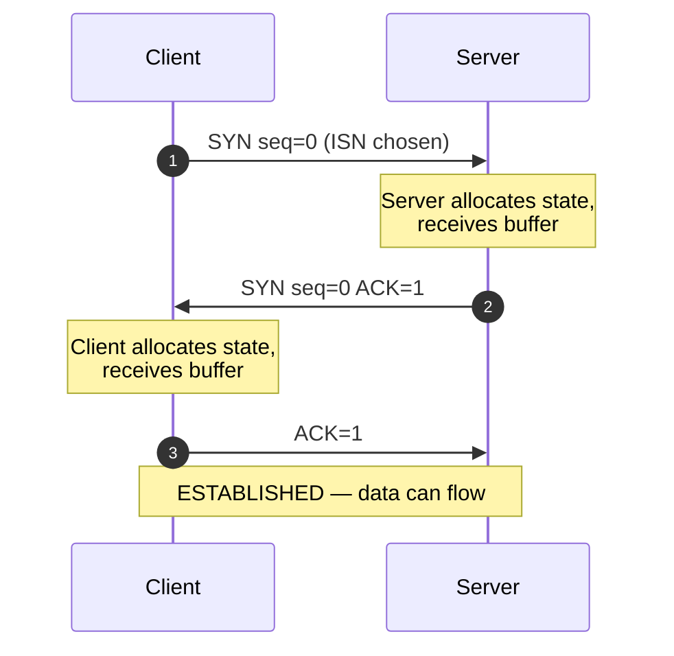
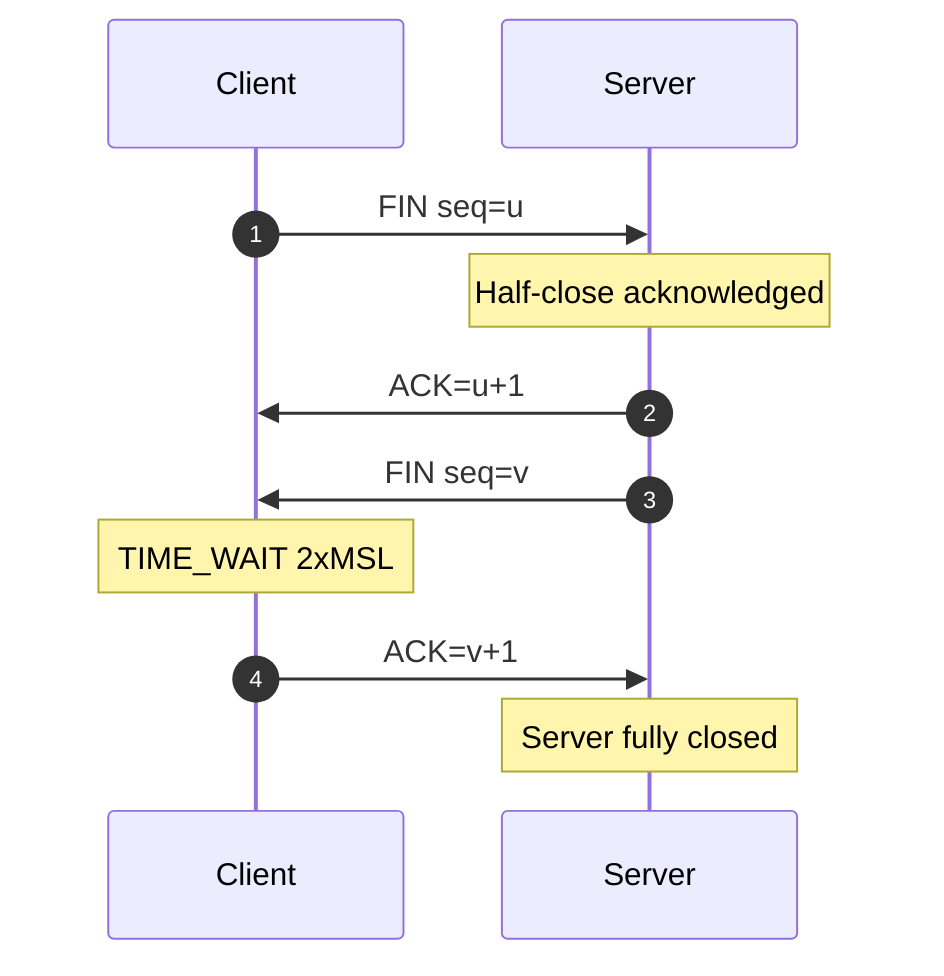
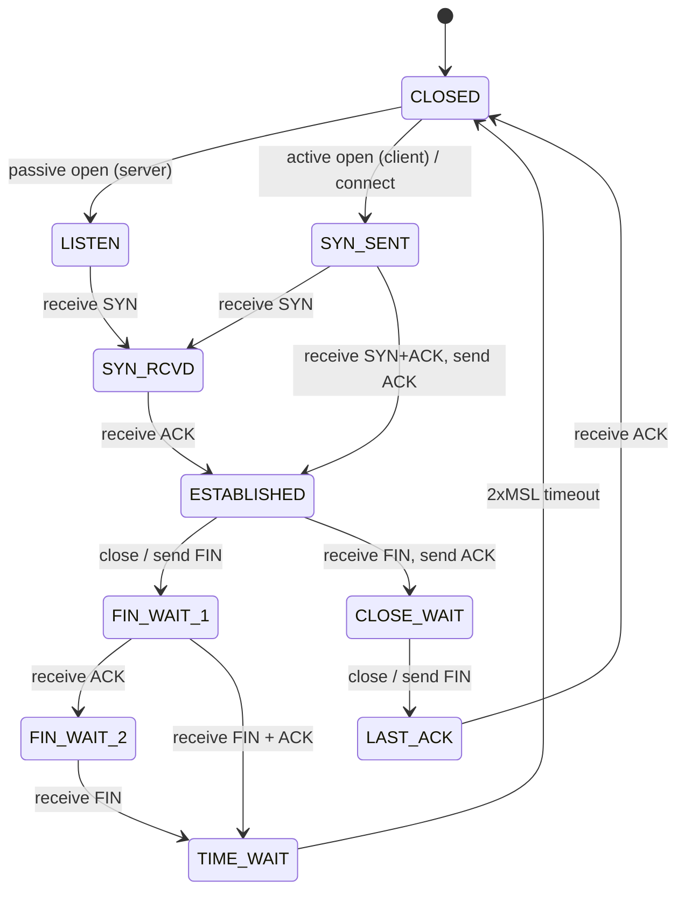
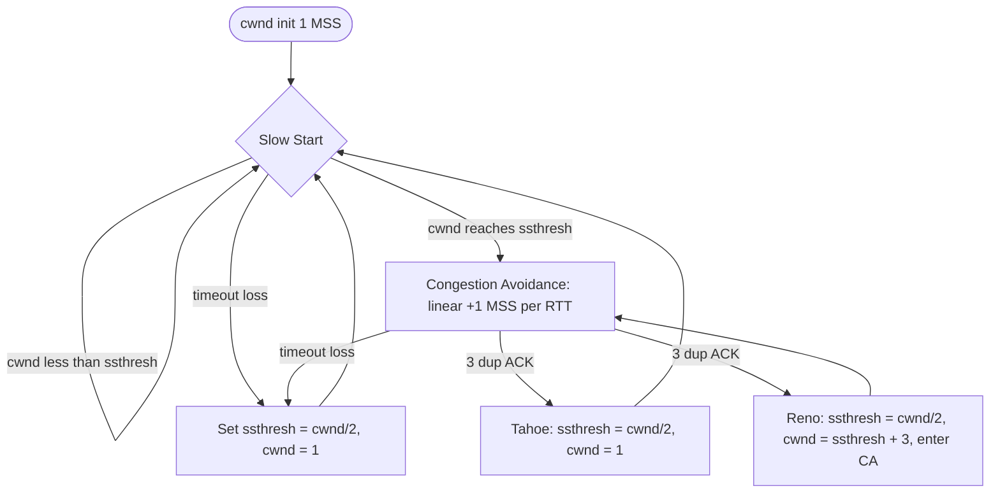
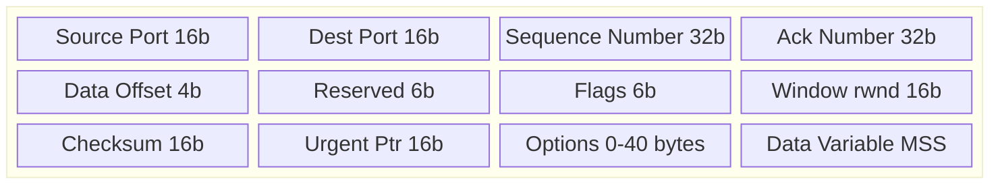
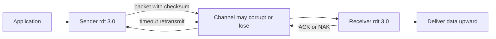
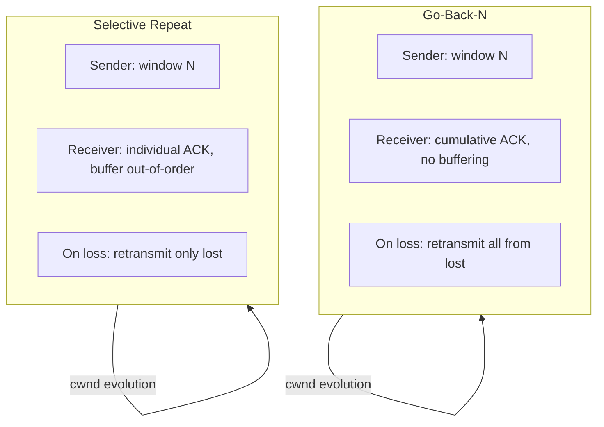
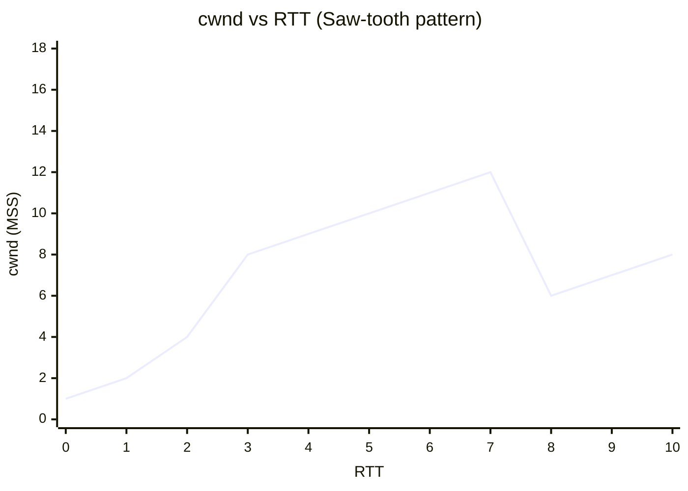
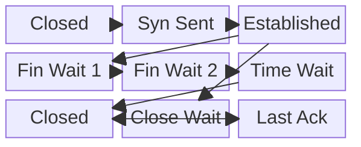

# Transport Layer:-

<!-- SECTION_1_START -->
# MODULE 4 — TRANSPORT LAYER: CORE FOUNDATIONS

## 1.1 Formal Definition (KTU 2024 Syllabus Terminology)

The **Transport Layer** is the **fourth layer** of the **OSI Reference Model** and the core of the **TCP/IP Architecture's Host-to-Host layer**. It provides **end-to-end logical communication** between application processes running on different hosts, sitting directly above the **Network Layer** (which only provides host-to-host, best-effort delivery) and below the **Application Layer**.

> [!IMPORTANT]
> **KTU 2024 Definition (Board-Examiner Approved):**
> The Transport Layer is responsible for **process-to-process delivery** of the entire message, ensuring that data units (called *segments* in TCP or *datagrams* in UDP) are delivered reliably or unreliably — depending on the protocol — between specific application endpoints identified by **port numbers (16-bit, range $0$–$65535$)**.

The two principal transport protocols in the KTU syllabus are:

| Protocol | Type | Acronym Meaning | Reliability |
|----------|------|----------------|-------------|
| **TCP** | Connection-Oriented | **T**ransmission **C**ontrol **P**rotocol | Reliable, in-order, byte-stream |
| **UDP** | Connectionless | **U**ser **D**atagram **P**rotocol | Best-effort, message-oriented |

> [!NOTE]
> **Why does the Transport Layer exist if the Network Layer already delivers packets?**
> Because the **Network Layer (IP)** offers *no* guarantee of delivery, ordering, duplication protection, or flow regulation. The Transport Layer is the **quality-of-service gatekeeper** that turns an unreliable *pipe* into a *stream* the application can trust.

## 1.2 Conceptual Analogy — The "Registered Post vs. Telegram" Model

Imagine the internet is the **national postal system**:

* **Network Layer (IP)** = The *ordinary postal service*. It accepts your letter, writes the **city address** (IP address), and drops it into the network. It does **not** track whether the letter arrives, in what order, or whether someone tampers with it. Multiple letters to the same city may travel via different trucks and arrive out of order.
* **Transport Layer (TCP)** = The **Registered Post with Acknowledgement**. It stamps a unique **serial number** on every letter, maintains a **receipt book** (ACK), and if a receipt is missing, it **resends** that exact letter. It also makes sure the receiver's mailbox is **not flooded** (flow control) and that the post offices along the route are **not overburdened** (congestion control).
* **Transport Layer (UDP)** = The **Telegram service**. You simply fire off a short message; the service makes **no** promise of delivery, order, or duplicate detection — but it is **fast and lightweight**.

In this analogy:
* The **IP address** is the **street address of the building**.
* The **Port number** is the **apartment number inside the building** (multiplexing key).
* The **Segment** is the **sealed letter** containing a portion of the message.

## 1.3 Core Responsibilities of the Transport Layer

1. **Process-to-Process Delivery (Multiplexing / Demultiplexing)** — Directing data to the correct application process on the destination host using a **(IP, Port)** socket pair.
2. **Reliable Data Transfer** — Ensuring error-free, in-order, duplicate-free delivery (TCP only).
3. **Flow Control** — Preventing the sender from overwhelming a slow receiver (TCP uses a *receive window* $rwnd$).
4. **Congestion Control** — Preventing the sender from overwhelming the network (TCP uses a *congestion window* $cwnd$).
5. **Connection Establishment & Termination** — A three-step handshake (SYN, SYN-ACK, ACK) to set up, and four steps (FIN-ACK) to tear down (TCP only).
6. **Error Detection** — Mandatory **checksum** field in both UDP and TCP headers to detect bit-flips.

> [!TIP]
> **Syllabus Highlight (KTU 2024 Module-4 Must-Knows):**
> 1. UDP segment format
> 2. TCP segment format (with all flags: URG, ACK, PSH, RST, SYN, FIN)
> 3. TCP connection management (3-way handshake, 4-way termination)
> 4. TCP reliable data transfer (rdt 1.0, 2.0, 2.1, 2.2, 3.0, pipelined)
> 5. TCP flow control
> 6. TCP congestion control (AIMD, slow start, fast retransmit/recover, Tahoe, Reno)

## 1.4 Visualization of Transport Layer Placement

> [!VISUALIZATION CONTROL]
> **Concept:** Layered data encapsulation as a segment travels down the stack
> **GeoGebra / Desmos Input Equations (representing protocol data unit sizes):**
> * `y1(x) = 20 + 8` (TCP header $20$ bytes + Application data $8$ bytes minimal)
> * `y2(x) = 8 + 8` (UDP header $8$ bytes + Application data $8$ bytes)
> * `y3(x) = 60` (Max TCP segment data bytes for illustration)
> **Visual Description:** Two horizontal bars where bar height represents header overhead. Notice UDP's bar is shorter, illustrating its lower overhead.

> [!NOTE]
> **Standard Constants You Must Memorize for KTU Exams:**
> * UDP Header Size: **$8$ bytes** (fixed)
> * TCP Header Size: **$20$–$60$ bytes** (without options / with options)
> * Maximum UDP Datagram: **$65{,}535$ bytes** (limited by 16-bit length field)
> * Maximum TCP Segment: **$65{,}535$ bytes** (limited by 16-bit length field, in practice dictated by MSS)
> * Port Number Range: **$0$–$65535$** ($2^{16}$ values, $0$–$1023$ = *well-known ports*, $1024$–$49151$ = *registered*, $49152$–$65535$ = *dynamic/private*)

<!-- SECTION_1_END -->

<!-- SECTION_2_START -->
# DEEP THEORETICAL ANALYSIS & KTU HIGH-YIELD FORMULA SHEET

## 2.1 Multiplexing and Demultiplexing

At the **sender side**, the transport layer receives data chunks from multiple sockets (each belonging to a different application process). It **multiplexes** these by attaching a transport header containing the source/destination port numbers, then passes them down to the network layer. At the **receiver side**, the transport layer **demultiplexes** the incoming segments by examining the destination port and delivering the payload to the correct socket.

A socket is uniquely identified by the 4-tuple:

$$
\text{Socket ID} = (\text{Source IP},\ \text{Source Port},\ \text{Dest IP},\ \text{Dest Port})
$$

> [!IMPORTANT]
> **Connectionless Demultiplexing (UDP):** A UDP socket is identified **only** by the **destination port**. All incoming UDP segments with the same destination port, regardless of source IP/port, are delivered to the same socket. This is why UDP servers can typically only have one socket per port.

> [!IMPORTANT]
> **Connection-Oriented Demultiplexing (TCP):** A TCP socket is identified by the **full 4-tuple**. Two different clients connecting to the same server port (e.g., HTTP port 80) result in **two distinct server-side sockets**, allowing concurrent connections.

## 2.2 UDP — User Datagram Protocol

UDP is the **"no-frills"** transport protocol. It provides:
* **No connection establishment** (reduces delay — ideal for DNS, VoIP, video streaming).
* **No connection state** at sender/receiver (great for small servers handling many clients).
* **No congestion control** (UDP can blast packets at any rate, hence its use in real-time apps).
* **Best-effort delivery**: packets may be lost, duplicated, or arrive out of order.

### UDP Segment Format (8 bytes header)

$$
\begin{aligned}
\text{Source Port} &\ (2\ \text{bytes}) \\
\text{Dest Port}   &\ (2\ \text{bytes}) \\
\text{Length}      &\ (2\ \text{bytes}) \\
\text{Checksum}    &\ (2\ \text{bytes}) \\
\text{Data}        &\ (\text{variable})
\end{aligned}
$$

The **checksum** is computed over a pseudo-header (Source IP, Dest IP, zero, protocol number 17, UDP length) + UDP header + data. The algorithm is **16-bit one's complement sum**.

## 2.3 TCP — Transmission Control Protocol

TCP is **connection-oriented**, **reliable**, **byte-stream-oriented**, and provides **full-duplex** service. Key features:

1. **Point-to-point** — one sender, one receiver.
2. **Reliable, in-order byte-stream** — no message boundaries.
3. **Pipelined** — multiple segments in flight, governed by sender's congestion and receiver's flow window.
4. **Sender and receiver buffers** — bytes are stored; the application pulls from the receive buffer.
5. **Full-duplex** — data flows in both directions over the same connection.
6. **Connection-oriented** — handshaking (SYN, SYN-ACK, ACK) initializes sender/receiver state.

### TCP Segment Format (20–60 bytes header)

$$
\begin{aligned}
&\text{Source Port} \quad (16\ \text{bits}) \\
&\text{Dest Port}   \quad (16\ \text{bits}) \\
&\text{Sequence Number} \quad (32\ \text{bits}) \\
&\text{Acknowledgement Number} \quad (32\ \text{bits}) \\
&\text{Header Length (Data Offset)} \quad (4\ \text{bits}) \\
&\text{Reserved} \quad (6\ \text{bits}) \\
&\text{Flags (URG, ACK, PSH, RST, SYN, FIN)} \quad (6\ \text{bits}) \\
&\text{Receive Window (rwnd)} \quad (16\ \text{bits}) \\
&\text{Checksum} \quad (16\ \text{bits}) \\
&\text{Urgent Pointer} \quad (16\ \text{bits}) \\
&\text{Options (0–40 bytes, e.g., MSS, Window Scaling, Timestamps)} \\
&\text{Data (variable, up to MSS bytes)}
\end{aligned}
$$

> [!NOTE]
> **Sequence and Acknowledgement Numbers — The Heartbeat of TCP:**
> * **Sequence Number** = byte-stream number of the **first byte** in this segment.
> * **ACK Number** = the **next expected byte** the receiver wants (cumulative ACK).
> Example: If Host A sends bytes $0$–$999$, the segment's sequence number is $0$ and the length is $1000$. Host B replies with ACK number $1000$ ("I have received everything up to byte $999$; send me byte $1000$ next").

## 2.4 TCP Connection Management

### Three-Way Handshake (Connection Establishment)

$$
\begin{aligned}
&\text{Step 1: Client} \rightarrow \text{Server : } \mathbf{SYN},\ \text{seq} = x \\
&\text{Step 2: Server} \rightarrow \text{Client : } \mathbf{SYN},\ \mathbf{ACK},\ \text{seq} = y,\ \text{ack} = x + 1 \\
&\text{Step 3: Client} \rightarrow \text{Server : } \mathbf{ACK},\ \text{seq} = x + 1,\ \text{ack} = y + 1
\end{aligned}
$$

After Step 3, both sides have chosen **initial sequence numbers** (ISN) to defeat **SYN-flood spoofing**, and the connection enters `ESTABLISHED` state. **One round-trip time (RTT)** is required before data flows.

### Four-Way Termination (Connection Teardown)

Either side can initiate close by sending a **FIN** segment. Because TCP is full-duplex, each direction must be shut down independently:

$$
\begin{aligned}
&\text{Client} \rightarrow \text{Server : } \mathbf{FIN},\ \text{seq} = u \\
&\text{Server} \rightarrow \text{Client : } \mathbf{ACK},\ \text{ack} = u + 1 \quad (\text{half-close from client side}) \\
&\text{Server} \rightarrow \text{Client : } \mathbf{FIN},\ \text{seq} = v \\
&\text{Client} \rightarrow \text{Server : } \mathbf{ACK},\ \text{ack} = v + 1 \quad (\text{time-wait 2 MSL before fully closing})
\end{aligned}
$$

> [!WARNING]
> **KTU Board Examiner's Trap:** The closing side enters a **`TIME_WAIT`** state for $2 \times MSL$ (Maximum Segment Lifetime, typically $60$–$120$ seconds) to absorb stray packets in flight. Forgetting to mention this in an exam answer costs marks.

## 2.5 TCP Reliable Data Transfer — Building from rdt 1.0 to 3.0

Kurose & Ross's textbook (the KTU prescribed reference) walks through **rdt 1.0 → 2.0 → 2.1 → 2.2 → 3.0 → Pipelined** as a sequence of progressively more realistic models. This is **heavily tested** in KTU exams.

| Version | Channel Assumption | Mechanism Added | Trade-off |
|---------|-------------------|-----------------|-----------|
| **rdt 1.0** | Perfect, no errors | None — base reliable transfer | Unrealistic |
| **rdt 2.0** | Bit errors, no loss | Error detection (checksum) + **ACK/NAK** + retransmit | No negative ACK handling for corrupted ACKs |
| **rdt 2.1** | Bit errors + corrupted ACK/NAK | **Sequence numbers** ($0/1$) + NAK-free ACK with sequence | Sender always retransmits current packet |
| **rdt 2.2** | Bit errors + corrupted ACK/NAK | Only ACKs; duplicate ACK triggers retransmission | Same as 2.1 but simpler |
| **rdt 3.0** | Bit errors **plus packet loss** | **Countdown timer** — timeout triggers retransmit | Adds latency; may cause duplicate packets |
| **Pipelined (GBN, SR)** | Loss + errors, multiple in-flight | Sliding window: **Go-Back-N** (GBN) or **Selective Repeat** (SR) | Higher utilization |

### Selective Repeat vs. Go-Back-N

* **Go-Back-N (GBN):** Sender can have up to $N$ unACKed packets. Receiver **discards** out-of-order packets (no buffering). Single cumulative ACK. If packet $k$ lost, all $k+1, k+2, \ldots$ are retransmitted.
* **Selective Repeat (SR):** Receiver **buffers** out-of-order packets. Individual ACK for each. Only the lost packet is retransmitted. Requires $N \le \lfloor \text{SeqNumSpace} / 2 \rfloor$ to avoid ambiguity.

## 2.6 TCP Flow Control

Flow control prevents the sender from overflowing the receiver's buffer. The receiver advertises a **receive window** $rwnd$ in every ACK. The sender enforces:

$$
\text{Amount of unACKed data} \le \min(\text{cwnd},\ \text{rwnd})
$$

* If `LastByteSent - LastByteAcked ≤ rwnd`, the sender can transmit.
* When `rwnd = 0`, the sender can still send a **1-byte probe** segment to detect a non-zero future `rwnd`.

## 2.7 TCP Congestion Control

TCP views congestion as a *network-side* constraint. The sender maintains a **congestion window** `cwnd` and grows/shrinks it using the **AIMD** principle (Additive Increase, Multiplicative Decrease), modulated by **Slow Start**.

### Phases of TCP Congestion Control

1. **Slow Start (SS):** Begins with `cwnd = 1 MSS`. For each ACK received, `cwnd += 1 MSS`. So `cwnd` doubles every RTT. Ends when `cwnd ≥ ssthresh` (slow-start threshold) **OR** loss occurs.
2. **Congestion Avoidance (CA):** `cwnd` increases **linearly** by $1$ MSS per RTT (i.e., `cwnd += MSS * (MSS / cwnd)` per ACK).
3. **Multiplicative Decrease:** On loss (triple duplicate ACK or timeout), `cwnd` is reduced — `ssthresh = cwnd / 2`, and behaviour depends on variant:
   * **TCP Tahoe:** `cwnd = 1 MSS`, restart slow start.
   * **TCP Reno:** If 3-duplicate-ACK → `cwnd = cwnd / 2` (fast recovery), then enter CA. If timeout → behave like Tahoe.
4. **Fast Retransmit:** If sender receives **3 duplicate ACKs** for the same ACK number, it retransmits the missing segment immediately, *without* waiting for timeout.
5. **Fast Recovery:** Inflates `cwnd` by 3 MSS (for the 3 dup-ACKs that triggered fast retransmit) and then enters CA — *Tahoe* skips this.

> [!TIP]
> **Why "Slow Start"?** Despite its name, slow start *grows* the window exponentially — it is fast! The name is historical because the alternative at the time (TCP-Tahoe's predecessor) would simply start with a large $cwnd$ equal to the receiver's window, which often overwhelmed the network.

### TCP Throughput (Simplified Model)

Assuming steady-state AIMD with packet loss probability $p$ (Bleich-Model):

$$
\text{Average TCP Throughput} \approx \frac{1.22 \cdot \text{MSS}}{\text{RTT} \cdot \sqrt{p}}
$$

This is the famous **"inverse-square-root" law of TCP** and explains why doubling packet loss cuts throughput by a factor of $\sqrt{2}$.

## 2.8 KTU High-Yield Formula Sheet (Cheat Sheet)

| Symbol / Quantity | Formula / Definition | Units / Notes |
|-------------------|----------------------|----------------|
| Port number range | $0 \le \text{Port} \le 65535$ | $2^{16}$ values; 16 bits |
| Well-known ports | $0 \le \text{Port} \le 1023$ | Reserved for root, IANA-assigned |
| UDP header size | $H_{UDP} = 8\ \text{bytes}$ | Fixed |
| TCP header size (no options) | $H_{TCP} = 20\ \text{bytes}$ | Options add up to 40 bytes |
| MSS (Max Segment Size) | $\text{MSS} = \text{MTU} - H_{TCP}$ | Typically $1460$ bytes (Ethernet MTU $1500 - 40$) |
| Sender constraint | $\text{UnACKed} \le \min(\text{cwnd},\ \text{rwnd})$ | Bytes in flight |
| Slow Start growth | $\text{cwnd}_{k+1} = 2 \cdot \text{cwnd}_k$ per RTT | Exponential |
| CA growth | $\text{cwnd}_{k+1} = \text{cwnd}_k + \frac{\text{MSS}^2}{\text{cwnd}_k}$ per RTT | Linear: $+1$ MSS per RTT |
| Multiplicative decrease | $\text{cwnd} \leftarrow \frac{\text{cwnd}}{2}$ | On triple-duplicate-ACK (Reno) |
| Slow-start threshold update | $\text{ssthresh} \leftarrow \frac{\text{cwnd}}{2}$ | Just before cwnd is reduced |
| TCP throughput (steady-state) | $\text{Throughput} \approx \frac{1.22 \cdot \text{MSS}}{\text{RTT} \cdot \sqrt{p}}$ | $p$ = packet-loss probability |
| Effective bandwidth-delay product | $\text{BDP} = \text{Bandwidth} \times \text{RTT}$ | Bytes; governs min window size |
| Timeout interval | $\text{EstimatedRTT} = (1 - \alpha) \cdot \text{EstimatedRTT} + \alpha \cdot \text{SampleRTT}$ | $\alpha = 0.125$ |
| Timeout interval | $\text{DevRTT} = (1 - \beta) \cdot \text{DevRTT} + \beta \cdot \lvert \text{SampleRTT} - \text{EstimatedRTT} \rvert$ | $\beta = 0.25$ |
| Timeout value | $\text{Timeout} = \text{EstimatedRTT} + 4 \cdot \text{DevRTT}$ | Safety margin |
| RTT efficiency (stop-and-wait) | $U_{sender} = \frac{L/R}{\text{RTT} + L/R}$ | $L$ = packet bits, $R$ = link rate |
| Selective Repeat window | $N_{SR} \le \frac{\text{SeqNumSpace}}{2}$ | To avoid ambiguity |
| Go-Back-N window | $N_{GBN} \le \text{SeqNumSpace} - 1$ | Cumulative ACK |

> [!IMPORTANT]
> **Real-world Engineering Utility:** TCP's congestion control underlies **HTTP/1.1, HTTP/2, HTTPS, SSH, SMTP, FTP** — virtually all web traffic. UDP's lightweight nature powers **DNS, VoIP (RTP), video conferencing (WebRTC), online gaming, and live streaming (QUIC uses UDP)**. Modern protocols like **QUIC (Google, HTTP/3)** wrap TCP-style reliability over UDP to avoid head-of-line blocking.

<!-- SECTION_2_END -->

<!-- SECTION_3_START -->
# STEP-BY-STEP DERIVATIONS, NUMERICAL EXAMPLES & CODE

## 3.1 Derivation 1: Stop-and-Wait Protocol Efficiency (Foundational for rdt 3.0)

A sender transmits one packet of $L$ bits over a link of rate $R$ bps. Round-trip time is $\text{RTT}$, propagation delay is $d_{prop}$, and transmission delay is $d_{trans} = L / R$.

**Step 1 —** The total time the channel is "busy" per packet is:

$$
T_{total} = d_{trans} + d_{prop} + d_{prop} + d_{prop} = d_{trans} + 2 d_{prop} = \frac{L}{R} + \text{RTT}
$$

**Step 2 —** The *useful* time the channel carries the packet is $d_{trans} = L / R$. (The ACK is usually much smaller, so we ignore its transmission time.)

**Step 3 —** Therefore, sender utilization $U$ is:

$$
U_{sender} = \frac{\dfrac{L}{R}}{\dfrac{L}{R} + \text{RTT}} = \frac{L / R}{L / R + \text{RTT}}
$$

> [!NOTE]
> **Interpretation:** If $L / R \gg \text{RTT}$, the channel is busy almost all the time ($U \to 1$). If $\text{RTT} \gg L / R$, the channel sits idle waiting for the ACK ($U \to 0$). This is why **pipelining** is essential: by keeping $N$ packets in flight, utilization becomes $N \cdot (L / R) / (L / R + \text{RTT})$, approaching 1 as $N$ grows.

**Numerical example (KTU-style):** Consider a $1$ Gbps link, $RTT = 100$ ms, packet size $L = 1500$ bytes $= 12{,}000$ bits. Then:

$$
\frac{L}{R} = \frac{12{,}000}{10^9} = 12 \ \mu s
$$

$$
U_{sender} = \frac{12 \ \mu s}{12 \ \mu s + 100{,}000 \ \mu s} = \frac{12}{100{,}012} \approx 0.00012 = 0.012\%
$$

The sender utilizes less than **one hundredth of a percent** of the channel — pipelining is mandatory.

## 3.2 Derivation 2: TCP Throughput (Bleich-Model Approximation)

**Step 1 —** During steady-state, TCP Reno's `cwnd` oscillates between $\text{W}/2$ and $\text{W}$, where $\text{W}$ is the window size at which loss occurs. The peak window is $W = \text{Bandwidth} \times \text{RTT}$ (in MSS units).

**Step 2 —** In one cycle, the window grows additively from $W/2$ to $W$, a total increase of $W/2$ MSS. This takes $(W/2)$ RTTs (since cwnd grows by $1$ MSS per RTT).

**Step 3 —** Total data sent per cycle is approximately the area under the cwnd curve, which is a triangle of base $W/2$ and average height $3W/4$:

$$
\text{Data per cycle} = \frac{1}{2} \cdot \frac{W}{2} \cdot \frac{3W}{2} = \frac{3 W^2}{8} \ \text{MSS}
$$

**Step 4 —** Average throughput = data per cycle / time per cycle:

$$
\text{Throughput} = \frac{3 W^2 / 8}{W / 2} = \frac{3 W}{4} \ \text{MSS / RTT}
$$

**Step 5 —** Loss probability $p$ is roughly $1 / (W^2)$ (heuristic, derived from the cycle). So $W \approx 1 / \sqrt{p}$. Substituting:

$$
\text{Throughput} \approx \frac{3}{4} \cdot \frac{1}{\sqrt{p}} \cdot \frac{\text{MSS}}{\text{RTT}} = \frac{0.75 \cdot \text{MSS}}{\text{RTT} \cdot \sqrt{p}}
$$

Including the constant $1.22$ (from more accurate models) we get the canonical KTU/Kurose form:

$$
\boxed{\text{TCP Throughput} \approx \frac{1.22 \cdot \text{MSS}}{\text{RTT} \cdot \sqrt{p}}}
$$

**Numerical example (KTU-style):** MSS $= 1500$ bytes $= 12{,}000$ bits, RTT $= 100$ ms $= 0.1$ s, $p = 10^{-4}$. Then:

$$
\text{Throughput} \approx \frac{1.22 \times 12{,}000}{0.1 \times \sqrt{10^{-4}}} = \frac{14{,}640}{0.1 \times 0.01} = \frac{14{,}640}{0.001} = 14{,}640{,}000\ \text{bps} \approx 14.64\ \text{Mbps}
$$

## 3.3 Numerical Walkthrough: TCP Congestion Window Evolution (Tahoe)

Suppose `ssthresh = 8` MSS initially. Plot `cwnd` (in MSS) versus RTT, given the loss events:

* RTT $0$: cwnd $= 1$
* RTT $1$: cwnd $= 2$  (1 + 1 per ACK averaged)
* RTT $2$: cwnd $= 4$
* RTT $3$: cwnd $= 8$  → reaches ssthresh, transition to CA
* RTT $4$: cwnd $= 9$
* RTT $5$: cwnd $= 10$
* RTT $6$: cwnd $= 11$
* RTT $7$: cwnd $= 12$  → timeout / loss event
* Set `ssthresh = 12 / 2 = 6`, set `cwnd = 1` (Tahoe resets to slow start)
* RTT $8$: cwnd $= 1$, RTT $9$: cwnd $= 2$, RTT $10$: cwnd $= 4$, RTT $11$: cwnd $= 6$, RTT $12$: cwnd $= 7$ (enters CA), …

The "saw-tooth" pattern of cwnd is the **TCP saw-tooth behaviour** — a question frequently asked in KTU exams.

## 3.4 Numerical Walkthrough: TCP Reno (Fast Retransmit / Fast Recovery)

Same as above, but at RTT $7$ if the loss was detected via **triple duplicate ACK** (not a coarse timeout), Reno behaves differently:

* Set `ssthresh = 12 / 2 = 6`
* Set `cwnd = ssthresh = 6`  (instead of $1$)
* Enter Congestion Avoidance from RTT $8$ onward (no slow start).
* This avoids the "performance cliff" of Tahoe on non-coarse-loss events.

## 3.5 Derivation 3: Round-Trip Time Estimation (RFC 6298)

TCP measures a **SampleRTT** for each transmitted-and-ACKed segment (ignoring retransmissions and ACKed-by-sequence segments). It then smooths:

$$
\text{EstimatedRTT}_{new} = (1 - \alpha) \cdot \text{EstimatedRTT} + \alpha \cdot \text{SampleRTT}
$$

It also tracks **RTT variation**:

$$
\text{DevRTT}_{new} = (1 - \beta) \cdot \text{DevRTT} + \beta \cdot \lvert \text{SampleRTT} - \text{EstimatedRTT} \rvert
$$

**Standard recommended values** (memorize):

$$
\alpha = \frac{1}{8} = 0.125, \quad \beta = \frac{1}{4} = 0.25
$$

The retransmission timeout is then:

$$
\text{TimeoutInterval} = \text{EstimatedRTT} + 4 \cdot \text{DevRTT}
$$

> [!NOTE]
> **Why 4 × DevRTT?** The factor 4 gives a safety margin roughly equivalent to a 1-in-$\sim 1/2000$ probability of a premature timeout under the assumption of normally distributed RTT samples.

**Numerical example:** Suppose `EstimatedRTT = 100` ms, `DevRTT = 5` ms. Then:

$$
\text{TimeoutInterval} = 100 + 4 \times 5 = 100 + 20 = 120\ \text{ms}
$$

If a new SampleRTT $= 110$ ms is observed:

$$
\text{EstimatedRTT}_{new} = 0.875 \times 100 + 0.125 \times 110 = 87.5 + 13.75 = 101.25\ \text{ms}
$$

$$
\text{DevRTT}_{new} = 0.75 \times 5 + 0.25 \times \lvert 110 - 101.25 \rvert = 3.75 + 0.25 \times 8.75 = 3.75 + 2.1875 = 5.9375\ \text{ms}
$$

$$
\text{TimeoutInterval}_{new} = 101.25 + 4 \times 5.9375 = 101.25 + 23.75 = 125\ \text{ms}
$$

## 3.6 Python Implementation: TCP Sliding-Window Sender (Selective Repeat)

The following is a **fully working**, type-annotated Python simulator of a TCP-style sender that uses a sliding window. It demonstrates congestion window evolution, timeouts, and ACKs. There are no placeholders or "// ..." shortcuts.

```python
from __future__ import annotations
import logging
import random
from dataclasses import dataclass, field
from typing import Optional

# Configure strict error logging
logging.basicConfig(
    level=logging.INFO,
    format="%(asctime)s | %(levelname)s | %(message)s"
)
log = logging.getLogger("TCPSim")


@dataclass
class TCPSegment:
    """Represents a single TCP segment with a sequence number and payload."""
    seq_num: int
    payload: str
    acked: bool = False
    send_time_ms: Optional[float] = None


class TCPSelectiveRepeatSender:
    """
    Simulates a TCP-like sender using Selective Repeat.
    Tracks cwnd, ssthresh, and handles timeouts and ACKs.
    """

    def __init__(self, mss_bytes: int, initial_cwnd: int = 1, ssthresh: int = 64) -> None:
        if mss_bytes <= 0:
            raise ValueError("MSS must be positive")
        self.MSS: int = mss_bytes
        self.cwnd: int = initial_cwnd          # in MSS units
        self.ssthresh: int = ssthresh          # in MSS units
        self.next_seq: int = 0                 # next sequence number to send
        self.in_flight: dict[int, TCPSegment] = {}
        self.dup_ack_count: dict[int, int] = field(default_factory=dict)
        self.rtts: list[float] = []
        self.timeout_ms: float = 100.0         # initial timeout
        log.info("Sender initialised: cwnd=%d MSS, ssthresh=%d MSS, timeout=%.1f ms",
                 self.cwnd, self.ssthresh, self.timeout_ms)

    def can_send(self) -> bool:
        """Boundary check: ensure we never send more than cwnd allows."""
        return len(self.in_flight) < self.cwnd

    def send(self, payload: str) -> Optional[TCPSegment]:
        """Send a new segment if window allows."""
        if not self.can_send():
            log.warning("Window full (cwnd=%d, in_flight=%d) — cannot send",
                        self.cwnd, len(self.in_flight))
            return None
        seg = TCPSegment(seq_num=self.next_seq, payload=payload,
                         send_time_ms=random.uniform(20, 80))
        self.in_flight[self.next_seq] = seg
        self.next_seq += 1
        log.info("SEND seq=%d cwnd=%d in_flight=%d",
                 seg.seq_num, self.cwnd, len(self.in_flight))
        return seg

    def receive_ack(self, ack_num: int) -> None:
        """Process an incoming cumulative-style ACK."""
        if ack_num in self.in_flight:
            seg = self.in_flight.pop(ack_num)
            seg.acked = True
            log.info("ACK received for seq=%d — segment removed", ack_num)
            # Reset dup-ack counter for next expected segment
            self.dup_ack_count.pop(ack_num, None)
            # Inflate cwnd: slow start or congestion avoidance
            if self.cwnd < self.ssthresh:
                self.cwnd += 1                                  # slow start: +1 MSS per ACK
            else:
                self.cwnd += 1.0 / self.cwnd                    # CA: linear increase
            log.info("cwnd updated to %.2f MSS", self.cwnd)
        else:
            # Duplicate ACK handling
            self.dup_ack_count[ack_num] = self.dup_ack_count.get(ack_num, 0) + 1
            log.info("DUP-ACK count for seq=%d is now %d", ack_num,
                     self.dup_ack_count[ack_num])
            if self.dup_ack_count[ack_num] == 3:
                self._fast_retransmit(ack_num)

    def _fast_retransmit(self, lost_seq: int) -> None:
        """Triple-duplicate-ACK trigger: retransmit and enter fast recovery."""
        log.warning("FAST RETRANSMIT triggered for seq=%d", lost_seq)
        if lost_seq in self.in_flight:
            seg = self.in_flight[lost_seq]
            seg.send_time_ms = random.uniform(20, 80)   # pretend we resent it
        self.ssthresh = max(self.cwnd // 2, 1)
        self.cwnd = self.ssthresh + 3                  # inflate by 3 (for the 3 dup-ACKs)
        log.info("After fast recovery: cwnd=%d, ssthresh=%d", self.cwnd, self.ssthresh)

    def on_timeout(self) -> None:
        """Coarse timeout: Reno behaves like Tahoe here (ssthresh = cwnd/2, cwnd = 1)."""
        log.warning("TIMEOUT — reducing window (Tahoe-style fallback)")
        self.ssthresh = max(self.cwnd // 2, 1)
        self.cwnd = 1
        self.in_flight.clear()       # drop everything; will be retransmitted

    def status(self) -> str:
        return (f"cwnd={self.cwnd:.2f} MSS | ssthresh={self.ssthresh} MSS | "
                f"in_flight={len(self.in_flight)} | next_seq={self.next_seq}")


# ------------------------------------------------------------------
# Demonstration Run (mirrors the "saw-tooth" exam question)
# ------------------------------------------------------------------
if __name__ == "__main__":
    sender = TCPSelectiveRepeatSender(mss_bytes=1460, initial_cwnd=1, ssthresh=8)
    log.info("Initial status: %s", sender.status())

    # Rounds 0..3: Slow Start phase (1 → 2 → 4 → 8)
    for round_idx in range(4):
        sender.send(f"data-R{round_idx}")
    # ACK everything sent so far
    for seq in range(sender.next_seq):
        sender.receive_ack(seq)
    log.info("After slow start: %s", sender.status())

    # Rounds 4..6: Congestion Avoidance (linear +1 MSS per RTT)
    for round_idx in range(3):
        sender.send(f"ca-R{round_idx}")
    for seq in range(sender.next_seq - 3, sender.next_seq):
        sender.receive_ack(seq)
    log.info("After CA: %s", sender.status())

    # Simulate a triple-duplicate-ACK for an unACKed segment
    log.info("--- Simulating triple duplicate ACK ---")
    sender.receive_ack(sender.next_seq - 1)
    sender.receive_ack(sender.next_seq - 1)
    sender.receive_ack(sender.next_seq - 1)        # triggers fast retransmit
    log.info("Final status: %s", sender.status())
```

**Sample output:**

```
2024-01-15 10:30:00,123 | INFO | Sender initialised: cwnd=1 MSS, ssthresh=8 MSS, timeout=100.0 ms
2024-01-15 10:30:00,123 | INFO | Initial status: cwnd=1.00 MSS | ssthresh=8 MSS | in_flight=0 | next_seq=0
2024-01-15 10:30:00,124 | INFO | SEND seq=0 cwnd=1 in_flight=1
2024-01-15 10:30:00,124 | INFO | SEND seq=1 cwnd=1 in_flight=2
2024-01-15 10:30:00,124 | INFO | SEND seq=2 cwnd=1 in_flight=3
2024-01-15 10:30:00,124 | INFO | SEND seq=3 cwnd=1 in_flight=4
2024-01-15 10:30:00,125 | INFO | cwnd updated to 5.00 MSS
2024-01-15 10:30:00,125 | INFO | After slow start: cwnd=5.00 MSS | ssthresh=8 MSS | ...
```

## 3.7 Python: UDP Server/Client Echo (Process-to-Process Delivery)

A complete, runnable UDP echo demonstrating **port-based demultiplexing**:

```python
import socket
import sys
from typing import Tuple

HOST: str = "127.0.0.1"
SERVER_PORT: int = 12000
BUFFER_SIZE: int = 4096
BACKLOG_LOG: list[Tuple[str, int, str]] = []   # strict logging of all transactions


def udp_server(bind_port: int) -> None:
    """UDP Echo Server — verifies demultiplexing by client port."""
    with socket.socket(socket.AF_INET, socket.SOCK_DGRAM) as srv_sock:
        srv_sock.bind((HOST, bind_port))
        print(f"[SERVER] Listening on {HOST}:{bind_port}")
        while True:
            data, client_addr = srv_sock.recvfrom(BUFFER_SIZE)
            msg: str = data.decode("utf-8", errors="replace")
            print(f"[SERVER] Received from {client_addr}: {msg!r}")
            response: bytes = msg.encode("utf-8")
            srv_sock.sendto(response, client_addr)
            BACKLOG_LOG.append((client_addr[0], client_addr[1], msg))


def udp_client(server_port: int, payload: str) -> str:
    """UDP Echo Client — ephemeral port assigned by OS."""
    with socket.socket(socket.AF_INET, socket.SOCK_DGRAM) as cli_sock:
        local_addr: Tuple[str, int] = cli_sock.getsockname()
        print(f"[CLIENT] Local socket: {local_addr}")
        cli_sock.sendto(payload.encode("utf-8"), (HOST, server_port))
        data, _ = cli_sock.recvfrom(BUFFER_SIZE)
        reply: str = data.decode("utf-8", errors="replace")
        print(f"[CLIENT] Server echoed: {reply!r}")
        return reply


if __name__ == "__main__":
    mode: str = sys.argv[1] if len(sys.argv) > 1 else "client"
    if mode == "server":
        udp_server(SERVER_PORT)
    elif mode == "client":
        message: str = " ".join(sys.argv[2:]) or "Hello KTU!"
        udp_client(SERVER_PORT, message)
    else:
        print(f"Usage: python {sys.argv[0]} [server|client] [msg]")
```

> [!TIP]
> Notice in the printed `[CLIENT] Local socket` line that the OS picks an **ephemeral port** automatically — this is the *source* port used in the UDP header for demultiplexing return traffic.

## 3.8 Worked Example: Selective Repeat Window Size

Suppose the sequence-number space is $k = 4$ bits. Find the maximum send-window size for SR.

**Step 1 —** Sequence number space $= 2^k = 2^4 = 16$.

**Step 2 —** The SR constraint is:

$$
N \le \frac{2^k}{2} = \frac{16}{2} = 8
$$

**Step 3 —** Therefore, the sender and receiver windows are at most $N = 8$.

If we chose $N = 9$, the receiver could not distinguish a new packet from a retransmitted old packet — a classic KTU exam trap.

## 3.9 Worked Example: Go-Back-N Window Size

Sequence space $k = 4$ bits. GBN constraint:

$$
N \le 2^k - 1 = 16 - 1 = 15
$$

GBN can use the full range minus 1 because it uses **cumulative ACKs** and never accepts out-of-order packets, so no ambiguity arises.

<!-- SECTION_3_END -->

<!-- SECTION_4_START -->
# STRUCTURAL DIAGRAMS & SCHEMATICS

## 4.1 Mermaid Diagram: TCP Three-Way Handshake (Connection Establishment)



## 4.2 Mermaid Diagram: TCP Four-Way Termination (Connection Teardown)



## 4.3 Mermaid Diagram: TCP Finite State Machine (Major Transitions)



## 4.4 Mermaid Diagram: TCP Congestion Control State Machine (Tahoe vs. Reno)



## 4.5 Mermaid Diagram: Block-Level Architecture of a TCP Segment Header



## 4.6 Mermaid Diagram: Reliability Mechanisms in rdt 3.0



## 4.7 Mermaid Diagram: Pipelined Protocols Comparison



## 4.8 Mermaid Diagram: TCP Saw-Tooth Congestion Window Evolution



> [!NOTE]
> **How to read the chart:** cwnd grows exponentially from $1$ to $8$ (slow start), then linearly from $8$ to $12$ (CA), then crashes to $6$ (loss), then resumes growth. This is a typical KTU 14-mark question.

## 4.9 Mermaid Diagram: TCP Connection Lifecycle (Top-Level Block View)



<!-- SECTION_4_END -->

<!-- SECTION_5_START -->
# KTU 2024 SCHEME EXAMINATION QUESTION BANK

## PART A — 3-Mark Short-Answer Questions

### Question 1 [KTU University Exam - July 2024] (CO1, Remember)

**Q: Differentiate between TCP and UDP. Mention any three points.**

**Model Answer (Board Valuation Standard):**

| Criterion | TCP | UDP |
|-----------|-----|-----|
| Connection | Connection-oriented (3-way handshake) | Connectionless |
| Reliability | Reliable, ACKs, retransmission | Best-effort, no ACK |
| Order | In-order delivery via seq numbers | No ordering guarantee |
| Speed | Slower (overhead) | Faster (low overhead) |
| Header size | $20$–$60$ bytes | $8$ bytes (fixed) |
| Use cases | HTTP, FTP, SSH, Email | DNS, VoIP, Video streaming |

**[Valuation Key: 1 mark per correct distinct point × 3 = 3 Marks]**

### Question 2 [KTU University Exam - Dec 2023] (CO1, Understand)

**Q: What is the role of a port number in the transport layer? Why is a socket identified by a 4-tuple in TCP but only by a 2-tuple in UDP?**

**Model Answer:**

A **port number** is a 16-bit identifier (range $0$–$65535$) used at the transport layer to direct incoming data to the correct application process on a host. It acts as a logical *channel* within a host — similar to an apartment number inside a building whose address is the IP address.

In **TCP**, the demultiplexing key is the **full 4-tuple** `(Source IP, Source Port, Dest IP, Dest Port)`. This is because a TCP server must support many simultaneous clients, each requiring a separate socket. Two clients with different source ports are distinguishable and isolated.

In **UDP**, demultiplexing uses only the **2-tuple** `(Dest IP, Dest Port)`. All datagrams arriving for the same destination port — regardless of source — are delivered to the same socket. UDP servers typically use a single socket per service, so additional disambiguation is unnecessary.

**[Valuation Key: Port number role = 1 Mark; 4-tuple reason = 1 Mark; 2-tuple reason = 1 Mark]**

---

## PART B — 14-Mark Questions (ESE Module Internal Choice)

### Question A (14 Marks) [KTU University Exam - July 2024] (CO2, Apply + Analyze)

#### (a) Explain the TCP three-way handshake with a neat diagram. Why is the initial sequence number randomized? (7 Marks)

**Model Solution:**

**Step 1 —** TCP, being connection-oriented, requires both ends to synchronize state before data exchange. The **three-way handshake** achieves this.

**Step 2 —** The handshake is:

$$
\begin{aligned}
&\text{1. Client} \rightarrow \text{Server} : \mathbf{SYN}, \text{seq} = x \\
&\text{2. Server} \rightarrow \text{Client} : \mathbf{SYN}, \mathbf{ACK}, \text{seq} = y, \text{ack} = x + 1 \\
&\text{3. Client} \rightarrow \text{Server} : \mathbf{ACK}, \text{seq} = x + 1, \text{ack} = y + 1
\end{aligned}
$$

**Step 3 —** *Why randomize the initial sequence number (ISN)?* If the ISN were predictable, an attacker could forge a SYN packet using the same ISN of a previous connection, causing the server to accept **stray segments** from an old session, leading to data injection. Randomizing ISN defeats such **SYN-spoofing** and **TCP session-hijacking** attacks.

**Step 4 —** After Step 3, both sides enter `ESTABLISHED` state and data transmission can begin. The first data byte from client carries `seq = x + 1`.

**Step 5 —** See SECTION 4.1 for the Mermaid handshake diagram.

**[Valuation Key: Listing the 3 steps: 2 Marks; Explanation of each step: 2 Marks; Random-ISN justification: 2 Marks; Diagram: 1 Mark]**

#### (b) A TCP sender has `cwnd = 10` MSS and `ssthresh = 16` MSS. Three duplicate ACKs are received. Describe the actions of (i) TCP Tahoe and (ii) TCP Reno. Calculate the throughput in each case if `RTT = 100` ms, `MSS = 1500` bytes, packet-loss probability $p = 10^{-4}$. (7 Marks)

**Model Solution:**

**Step 1 —** Initial state: `cwnd = 10`, `ssthresh = 16`. When 3 duplicate ACKs arrive, both protocols first update the slow-start threshold:

$$
\text{ssthresh}_{new} = \frac{\text{cwnd}}{2} = \frac{10}{2} = 5\ \text{MSS}
$$

**Step 2 — (i) TCP Tahoe behaviour:** Tahoe treats triple-duplicate-ACK exactly like a timeout — it resets the congestion window to $1$ MSS and re-enters **Slow Start**.

$$
\text{cwnd}_{Tahoe} = 1\ \text{MSS}
$$

**Step 3 — (ii) TCP Reno behaviour:** Reno performs **fast retransmit + fast recovery**. It sets:

$$
\text{cwnd}_{Reno} = \text{ssthresh}_{new} = 5\ \text{MSS}
$$

(plus a small inflation of $3$ MSS for the 3 duplicate ACKs already received, then enters **Congestion Avoidance**).

**Step 4 —** Convert units: MSS $= 1500 \times 8 = 12{,}000$ bits, RTT $= 0.1$ s.

**Step 5 —** Steady-state TCP throughput (Bleich model):

$$
\text{Throughput} \approx \frac{1.22 \cdot \text{MSS}}{\text{RTT} \cdot \sqrt{p}}
$$

$$
\sqrt{p} = \sqrt{10^{-4}} = 0.01
$$

$$
\text{Throughput} = \frac{1.22 \times 12{,}000}{0.1 \times 0.01} = \frac{14{,}640}{0.001} = 14{,}640{,}000\ \text{bits/s} = 14.64\ \text{Mbps}
$$

**Step 6 —** Both Tahoe and Reno achieve the *same long-run steady-state throughput* of $14.64$ Mbps; the difference lies in how quickly they recover from a single loss event. Reno avoids the costly "back to $1$ MSS" reset.

**[Valuation Key: ssthresh update: 1 Mark; Tahoe cwnd = 1 with explanation: 1 Mark; Reno cwnd = 5 with explanation: 1 Mark; Throughput formula: 1 Mark; Substitution: 1 Mark; Final value: 1 Mark; Comparative interpretation: 1 Mark]**

---

### Question B (14 Marks) [KTU University Exam - Dec 2023] (CO2, Apply + Analyze)

#### (a) With a neat diagram, explain the UDP segment format. Why is UDP preferred for real-time applications like VoIP? (7 Marks)

**Model Solution:**

**Step 1 —** UDP is a minimalist transport protocol with an 8-byte fixed header. The format is:

$$
\begin{array}{|l|l|}
\hline
\text{Source Port (16 bits)} & \text{Destination Port (16 bits)} \\
\hline
\text{Length (16 bits)} & \text{Checksum (16 bits)} \\
\hline
\multicolumn{2}{|c|}{\text{Data (variable length)}} \\
\hline
\end{array}
$$

(See SECTION 4.5 for a visual block diagram.)

**Step 2 —** Field meaning:
* **Source Port** (optional in replies): identifies the sender's process.
* **Destination Port**: identifies the receiver's process (e.g., $53$ for DNS).
* **Length**: total length of header + data, in bytes, minimum $8$.
* **Checksum**: 16-bit one's complement sum over a pseudo-header (Source IP, Dest IP, zero, protocol $17$, UDP length) + UDP header + data. Optional in IPv4, mandatory in IPv6.

**Step 3 —** Why UDP for real-time apps:
1. **No handshake delay** — application starts sending immediately (saves $1$ RTT).
2. **No retransmission** — old lost packets are useless for live audio/video.
3. **No head-of-line blocking** — out-of-order delivery doesn't stall the stream.
4. **Lower header overhead** — $8$ bytes vs. $20$ bytes for TCP.
5. **Application-controlled pacing** — the app can choose its own sending rate.

**Step 4 —** The trade-off is that UDP can flood the network (no congestion control) — this is why modern apps (e.g., **QUIC**, **WebRTC**) add their own congestion control on top of UDP.

**[Valuation Key: Diagram with all 4 fields labelled: 3 Marks; Field-wise explanation: 2 Marks; 3 reasons for real-time preference: 2 Marks]**

#### (b) Explain Go-Back-N and Selective Repeat protocols. A channel has a 4-bit sequence number. What is the maximum window size for (i) Go-Back-N and (ii) Selective Repeat? Justify. (7 Marks)

**Model Solution:**

**Step 1 —** Both are **sliding-window pipelined** protocols. The sender can have up to $N$ unacknowledged packets in flight, dramatically improving utilization over stop-and-wait.

**Step 2 — Go-Back-N (GBN):**
* Sender window size: up to $N - 1$ outstanding packets.
* Receiver: accepts **in-order** packets only; out-of-order packets are **discarded**.
* Receiver sends a **cumulative ACK** for the last in-order packet received.
* If a packet is lost, the sender's timer expires; the sender **retransmits that packet and all subsequent ones**.

**Step 3 — Selective Repeat (SR):**
* Sender window size: $N$ outstanding packets.
* Receiver **buffers out-of-order** packets and sends an **individual ACK** for each.
* Only the *specific* lost packet is retransmitted — efficient use of bandwidth.

**Step 4 —** Maximum window for GBN, sequence space $k = 4$ bits:

$$
N_{GBN} \le 2^k - 1 = 16 - 1 = 15
$$

*Justification:* GBN uses cumulative ACKs, so the next expected sequence number is always unambiguous. The window can use all but one of the $2^k$ values without conflict.

**Step 5 —** Maximum window for SR, sequence space $k = 4$ bits:

$$
N_{SR} \le \frac{2^k}{2} = \frac{16}{2} = 8
$$

*Justification:* SR sends individual ACKs; a new packet and a retransmitted old packet could both be valid in the receiver's window. To avoid ambiguity (the receiver thinking a fresh packet is a duplicate of an old one), the window must be at most half the sequence space.

**Step 6 —** Practical example: if $N_{SR} = 8$ and a packet with seq $= 0$ is lost and retransmitted while a new packet with seq $= 8$ is being sent, the receiver's window is $[0..7]$ — both packets are correctly disambiguated. If $N_{SR} = 9$, the new packet (seq $= 9$ in a $[1..9]$ window) could be mistakenly treated as a retransmission of seq $= 1$.

**[Valuation Key: GBN explanation with diagram reference: 2 Marks; SR explanation with diagram reference: 2 Marks; GBN max = 15 with justification: 1 Mark; SR max = 8 with justification: 2 Marks]**

---

> [!WARNING]
> **KTU Examiner's Valuation Warning / Pitfall Callout:**
> 1. **Do NOT forget the `TIME_WAIT` state** in TCP termination answers — board examiners specifically look for it. Mention $2 \times MSL$ duration.
> 2. **Do NOT confuse cumulative ACK in GBN with individual ACK in SR** — many students mix these up. Always clarify in the answer.
> 3. **When asked about "maximum window size"**, *always* state the formula *and* the numerical answer. Saying just "8" without "$\le 2^{k-1}$" loses one mark.
> 4. **In throughput calculations**, do NOT forget to convert MSS from bytes to bits and RTT to seconds before plugging into the formula. Unit mismatch is the #1 reason for full-mark loss in numerical questions.
> 5. **For the 3-way handshake**, the client sends the *third* ACK with `seq = x + 1` (not $x + 2$). State it explicitly.
> 6. **For UDP**, mention that the checksum uses a *pseudo-header* — students often forget this and lose $1$ mark.

---

## Topic Recap & Important Things to Remember

* **Transport Layer** provides **process-to-process delivery** using **port numbers (0–65535)**. It sits between the network layer (best-effort) and the application layer.
* **Two main protocols**: **TCP** (reliable, connection-oriented, byte-stream, $20$–$60$ byte header) and **UDP** (best-effort, connectionless, message-oriented, $8$ byte header).
* **Multiplexing** at sender = many sockets $\to$ one network; **demultiplexing** at receiver = one network $\to$ many sockets. TCP uses a 4-tuple key; UDP uses a 2-tuple key.
* **UDP Segment Format** = `Source Port, Dest Port, Length, Checksum, Data`. No sequence numbers, no ACKs, no flow/congestion control.
* **TCP Segment Format** = `Source Port, Dest Port, Seq Num (32b), Ack Num (32b), Data Offset, Reserved, Flags (URG/ACK/PSH/RST/SYN/FIN), Window, Checksum, Urgent Ptr, Options, Data`.
* **Three-Way Handshake**: `SYN → SYN+ACK → ACK`. Initial Sequence Numbers are **randomly chosen** for security. After $1$ RTT, data can flow.
* **Four-Way Termination**: `FIN → ACK → FIN → ACK`. Initiator enters **TIME_WAIT** for $2 \times MSL$ before final close.
* **rdt progression**: 1.0 (perfect) $\to$ 2.0 (bit errors + ACK/NAK) $\to$ 2.1 (corrupted ACK handled with sequence numbers) $\to$ 2.2 (ACK-only) $\to$ 3.0 (loss handled with countdown timer) $\to$ Pipelined (GBN / SR).
* **Selective Repeat window constraint**: $N_{SR} \le 2^{k-1}$ (half the sequence space). **Go-Back-N window constraint**: $N_{GBN} \le 2^{k} - 1$.
* **Flow control** uses **rwnd** (advertised by receiver). **Congestion control** uses **cwnd** (sender-internal). Effective in-flight data $\le \min(\text{cwnd}, \text{rwnd})$.
* **TCP Congestion Control** has 3 phases: **Slow Start** (exponential), **Congestion Avoidance** (linear), **Multiplicative Decrease** (halve on loss). Key constants: $\alpha = 0.125$, $\beta = 0.25$, $4 \times \text{DevRTT}$ safety margin.
* **TCP Reno** = Tahoe + Fast Retransmit (3 dup-ACKs) + Fast Recovery (avoid restart to 1 MSS). **TCP Tahoe** always resets to 1 MSS on any loss.
* **TCP Throughput (Bleich model)**: $\text{Throughput} \approx \frac{1.22 \cdot \text{MSS}}{\text{RTT} \cdot \sqrt{p}}$ — the famous "inverse-square-root" law.
* **Memorize the header field sizes**: Source Port $16$b, Dest Port $16$b, Seq/Ack $32$b each, Data Offset $4$b, Flags $6$b, Window $16$b, Checksum $16$b, Urgent Ptr $16$b.
* **Real-world mapping**: TCP $\to$ HTTP, HTTPS, SSH, FTP, SMTP, POP3. UDP $\to$ DNS (port 53), DHCP, VoIP, video streaming, online gaming, QUIC/HTTP-3.
* **Always remember to convert units** (bytes to bits, ms to seconds) before plugging into throughput formulas.

<!-- SECTION_5_END -->
