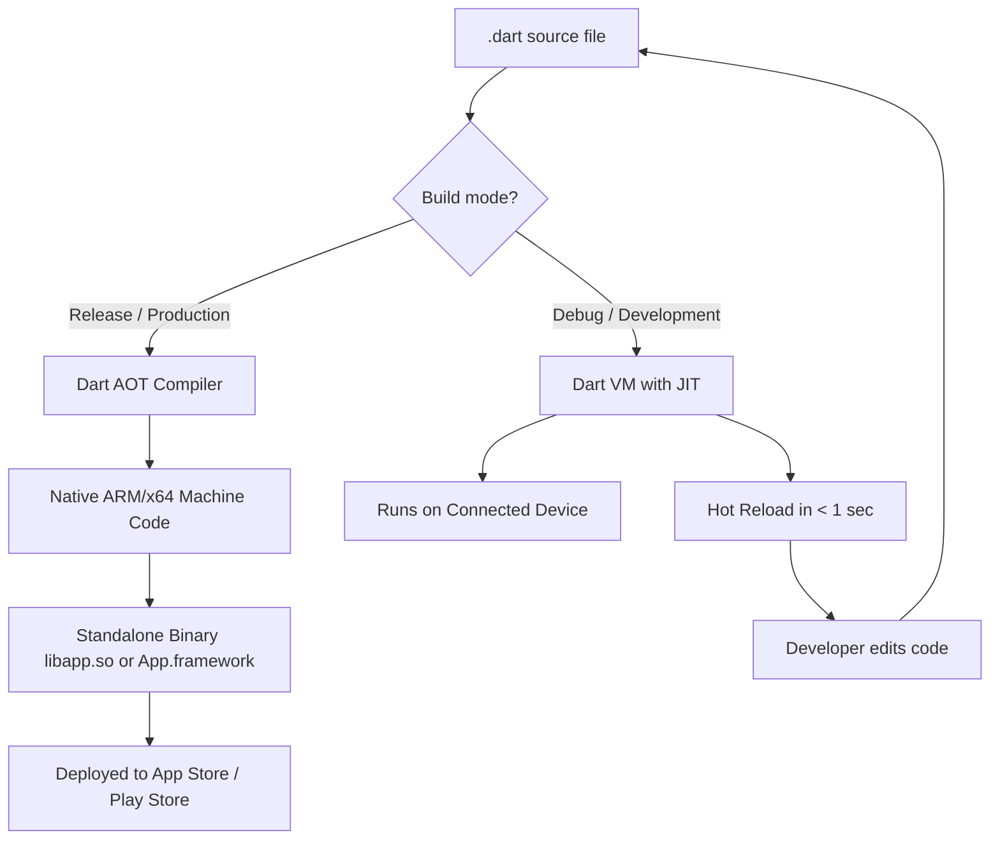
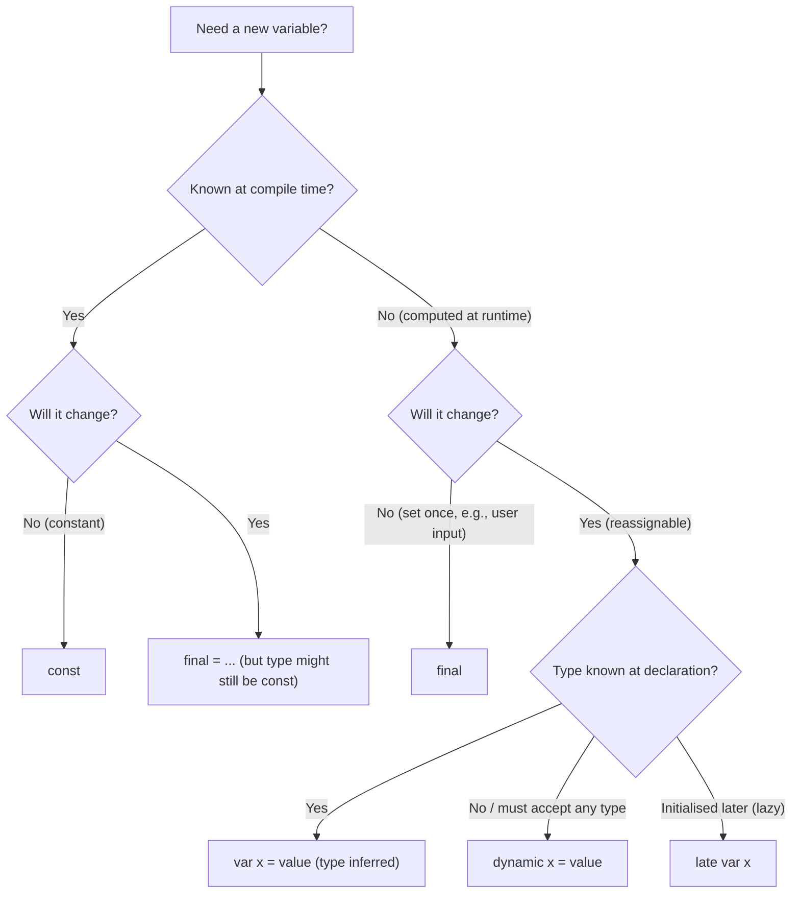
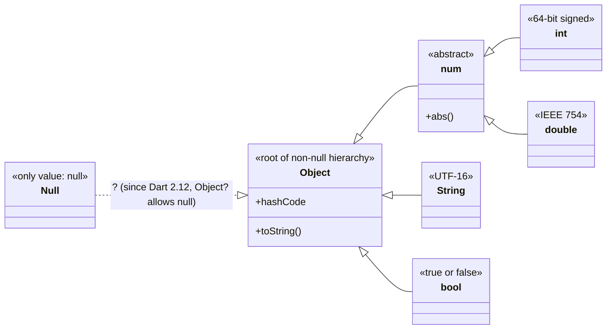
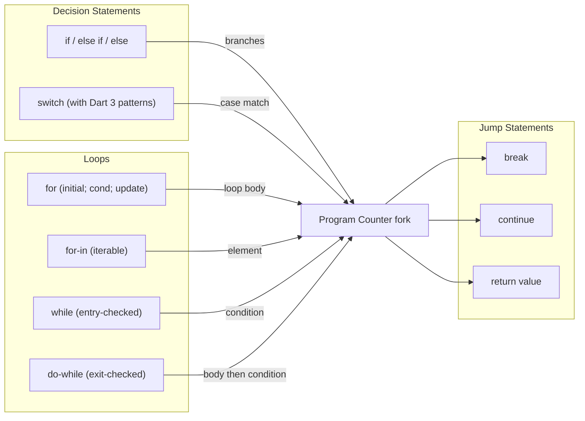

# Basics of Dart Programming Language.

<!-- SECTION_1_START -->
# Basics of Dart Programming Language

## 1.1 Formal Definition (KTU 2024 Syllabus Terminology)

> [!IMPORTANT]
> **Dart** is an **open-source, client-optimized, object-oriented programming language** developed by **Google (Lars Bak and Kasper Lund, first released in 2011, stable v1.0 in 2013, Dart 3 in 2023)**. It is used to build fast applications on **any platform** — primarily mobile (via **Flutter**), web, desktop, and server-side backends. Dart is both **Ahead-of-Time (AOT)** compiled for production (fast startup, predictable performance) and **Just-in-Time (JIT)** compiled during development (hot reload, fast iteration).

In the KTU 2024 *Mobile Application Development* syllabus, Dart is treated as the **foundational language for Flutter**, so Module 1 expects you to be fluent in its syntax, type system, and execution model *before* writing widget code.

| Property | Value |
|---|---|
| Paradigm | Multi-paradigm (OOPS, Functional, Scripting) |
| Typing Discipline | Strong + Static (with type inference) |
| Execution Model | AOT (release) + JIT (debug) |
| Compilation Target | Native ARM/x64 machine code & JavaScript |
| Null Safety | Mandatory since Dart 2.12 (sound null safety) |
| Standard Library | `dart:core`, `dart:async`, `dart:io`, `dart:math` |
| File Extension | `.dart` |
| Entry Point | `void main()` function |

> [!NOTE]
> **Why Dart for Flutter?** Flutter chose Dart because a single codebase needs to (a) compile to **native ARM code** for iOS/Android, (b) support **hot reload** during development, and (c) avoid the JavaScript bridge tax of React Native. AOT + JIT dual-mode compilation in a single language is the technical answer.

## 1.2 Conceptual Analogy / Intuition

Think of Dart as a **"swiss army knife"** that has two interchangeable blades:

- **JIT Blade (Development Mode):** Like a *chef tasting the dish while cooking* — Dart's VM interprets your code in real time, so when you save a file, the running app reloads in under a second (**hot reload**). Perfect for UI iteration.
- **AOT Blade (Release Mode):** Like a *sealed vacuum-packed meal* — the entire Dart code is compiled ahead of time into a single native binary (`libapp.so` on Android, `App.framework` on iOS). No interpreter, no VM startup lag, no warm-up. Perfect for production.

The **type system** is like a *strict ID checker at an airport* — once it confirms your variable is an `int`, you cannot accidentally put a `String` into it later. **Null safety** (introduced in Dart 2.12) is the *metal detector*: you must explicitly declare that a variable *can* be null (using `?`), otherwise the compiler assumes it never will be, eliminating whole categories of `NullPointerException` crashes.

## 1.3 The `main()` Function & A "Hello World" Program

Every Dart program begins execution at a **top-level function** called `main`. Without it, the Dart VM has no entry point and will refuse to run.

```dart
// The simplest possible Dart program
void main() {
  print('Hello, KTU!');
}
```

Breakdown:
- `void` → the function returns **no value**.
- `main` → **reserved, special name** recognised by the Dart runtime. There must be exactly one.
- `print()` → a built-in function in `dart:core` that writes the argument (converted to a `String`) to the standard output (`stdout`), followed by a newline.

> [!TIP]
> You can pass **command-line arguments** to `main` using its optional parameter: `void main(List<String> args) { print(args); }`. Run with `dart run file.dart arg1 arg2`.

## 1.4 GeoGebra / Desmos Visualisation

> [!VISUALIZATION CONTROL]
> **Concept:** *Type-inference flow from literal to inferred static type at compile time*
> **GeoGebra / Desmos Input Equations (conceptual):**
> * `x: R -> R` where `R` is the **type domain**
> * `f(literal) = type` for the literal `42` yields `f(42) = int`
> **Visual Description:** Picture a horizontal axis labelled "Literal Value" (`0, 1, 42, 3.14, 'a', true`) and a vertical mapping arrow that points to a stacked band of type zones — `int`, `double`, `String`, `bool`. The arrow shows that `42` lands inside the `int` band, `3.14` inside `double`, etc. The student should observe that **the type is locked at the moment the literal is bound to the variable**, not later.

<!-- SECTION_1_END -->

<!-- SECTION_2_START -->
# Deep Theoretical Analysis & KTU High-Yield Cheat Sheet

## 2.1 Variables, Declarations & Mutability

Dart offers **five distinct declaration keywords**. Choosing the correct one is a frequent KTU short-answer question.

| Keyword | Mutability | Type Inference | Assigned At | Initialization Optional? | KTU Common Pitfall |
|---|---|---|---|---|---|
| `var x = 10;` | Mutable | Yes (`int`) | Declaration | Yes, but type is fixed at first assignment | Reassigning to a different type fails |
| `dynamic x = 10;` | Mutable | **No** (resolves at runtime) | Declaration | Yes, can change type later | `dynamic` defeats the type system — avoid |
| `Object? x = 10;` | Mutable | No (declared) | Declaration | Yes, can hold any non-null object | Requires `?` to accept null |
| `final x = 10;` | **Immutable** (single assignment) | Yes | Declaration or first use | No — must be assigned exactly once | Cannot reassign, but can be computed lazily |
| `const x = 10;` | **Compile-time constant** | Yes | **Compile time** | No — value must be known at compile time | Cannot use a runtime value, even another `final` |
| `late x = compute();` | Mutable (initialised on first access) | Yes | First read, not declaration | **Yes — lazy initialisation** | Accessing before initialisation throws `LateInitializationError` |

> [!IMPORTANT]
> **`final` vs `const`** is one of the most-asked distinctions in KTU boards.
> - `const` ⇒ value is **canonicalised at compile time**; identical `const` values share the *same* memory location (referential equality is `==` true).
> - `final` ⇒ value is **set once at runtime**; could be the result of a function call, user input, etc.

```dart
final time = DateTime.now();       // OK — runtime value
const time2 = DateTime.now();      // ERROR — not a compile-time constant
```

## 2.2 Data Types

Dart has a layered type system rooted in the `Object?` class.

### 2.2.1 Primitive (Built-in) Types

| Type | Size / Range | Example Literal | Default Value (uninitialised) |
|---|---|---|---|
| `int` | 64-bit signed on native, arbitrary-precision on web | `42`, `-7`, `0xFF`, `0b1010` | `null` (with null safety) |
| `double` | 64-bit IEEE 754 | `3.14`, `1.0e-5` | `null` |
| `num` | Supertype of `int` & `double` | Accepts both | `null` |
| `String` | UTF-16 code units | `'hi'`, `"hi"`, `'''multi'''` | `null` |
| `bool` | 1 bit (theoretical) | `true`, `false` | `null` |
| `Null` | Only the value `null` | `null` | n/a |

### 2.2.2 Collection Types

| Type | Syntax | Ordered? | Indexed? | Unique? | Mutable by default? |
|---|---|---|---|---|---|
| `List<T>` | `[1, 2, 3]` or `<int>[]` | ✅ | ✅ (zero-based) | ❌ | ✅ |
| `Set<T>` | `{1, 2, 3}` | ❌ | ❌ | ✅ | ✅ |
| `Map<K, V>` | `{'a': 1}` | ✅ (insertion) | ✅ (by key) | Keys ✅ | ✅ |
| `Iterable<T>` | Base interface of all collections | varies | varies | varies | varies |

> [!NOTE]
> Dart `List` is a **growable array** by default (`List<int> nums = [1, 2]; nums.add(3);` is valid). Use `const [1, 2, 3]` for a fixed compile-time list.

## 2.3 Operators

Dart operators are *overloadable* via the `operator` keyword (a topic in OOP modules), but the built-in set is rich:

### 2.3.1 Arithmetic
`+`, `-`, `*`, `/`, `~/` (integer division), `%` (modulo), unary `-`, `++`, `--`.

### 2.3.2 Relational
`==` (structural equality), `!=`, `>`, `<`, `>=`, `<=`.

### 2.3.3 Logical
`&&` (short-circuit AND), `||` (short-circuit OR), `!` (NOT).

### 2.3.4 Type Test
- `x is T` → true if `x` has type `T` (or subtype).
- `x is! T` → negated.
- `x as T` → cast; throws `TypeError` if not subtype (with sound null safety).

### 2.3.5 Null-Aware (Dart-specific, KTU favourite)
| Expression | Meaning |
|---|---|
| `x?.y` | Access `y` only if `x` is non-null, else `null` |
| `x ?? y` | Returns `x` if non-null, else `y` |
| `x ??= y` | Assigns `y` to `x` only if `x` is currently `null` |
| `x!.y` | **Null-assertion operator** — "I guarantee `x` is non-null, throw if it isn't" |
| `x?.[0]` | Index access that returns `null` if `x` is null |

### 2.3.6 Cascade (`..`, `?..`)
Performs multiple operations on the **same object** without re-stating the name.
```dart
var user = User('Anu')
  ..name = 'Anu'
  ..age = 20
  ..email = 'anu@ktu.in';
```

## 2.4 Control Flow Statements

| Statement | KTU Marks Weight | Key Rule |
|---|---|---|
| `if (cond) { ... } else { ... }` | Medium | Condition must be `bool`, not truthy |
| `switch (val) { case 1: ... break; default: ... }` | High | Dart 3 supports **pattern matching** in `case` |
| `for (var i = 0; i < n; i++) { ... }` | High | Standard C-style |
| `for (var x in collection) { ... }` | High | Equivalent to Java's enhanced-for |
| `while (cond) { ... }` | Medium | Entry-controlled |
| `do { ... } while (cond);` | Medium | Exit-controlled; runs ≥ once |
| `break`, `continue` | Low | Standard |
| `assert(cond, 'msg');` | Low | Disabled in release mode |

## 2.5 Functions

Dart functions are **first-class citizens** — they can be assigned to variables, passed as arguments, and returned.

### 2.5.1 Parameter Types

```dart
// 1. Positional (required) parameters
void greet(String name, int age) { ... }

// 2. Optional positional — wrapped in []
int sum(int a, int b, [int? c]) {
  return a + b + (c ?? 0);
}

// 3. Named parameters — wrapped in {}; each can be optional
void configure({String? title, int size = 10, required bool verbose}) { ... }

// 4. Optional named with default values
void draw({double x = 0, double y = 0}) { ... }
```

> [!NOTE]
> Since Dart 2.12, **named parameters are non-nullable by default**. You must either (a) mark them `?`, (b) provide a default value, or (c) mark them `required`.

### 2.5.2 Arrow (Lambda) Functions
A single-expression function can be written with `=>`:
```dart
int square(int n) => n * n;
```
This is **syntactic sugar** for:
```dart
int square(int n) { return n * n; }
```

### 2.5.3 Anonymous Functions & Closures
```dart
var numbers = [3, 1, 4, 1, 5];
numbers.sort((a, b) => a - b);   // anonymous function passed to sort
```
Functions capture variables from their **enclosing lexical scope** — these captured variables are kept alive even after the enclosing function returns (a *closure*).

## 2.6 Comments

| Style | Syntax | Use Case |
|---|---|---|
| Single-line | `// comment` | Quick notes |
| Multi-line | `/* ... ... */` | Block explanations, code disabling |
| Documentation | `/// comment` | Parsed by `dart doc` to generate HTML docs |

## 2.7 KTU High-Yield Formula Sheet (Cheat Sheet)

| # | Concept | Syntax / Rule | Exam Tip |
|---|---|---|---|
| 1 | Variable declaration | `var`, `final`, `const`, `late`, `dynamic` | Pick based on **mutability + timing** |
| 2 | Integer division | `a ~/ b` | Floor division, e.g. `7 ~/ 2 == 3` |
| 3 | String interpolation | `'Hello, $name!'`, `'Total: ${a + b}'` | Use `${...}` for any expression |
| 4 | String concatenation | `'a' + 'b'` | Or just `'a' 'b'` (adjacent literals) |
| 5 | Multiline string | `'''line1\nline2'''` or `"""..."""` | Useful for SQL, JSON, ASCII art |
| 6 | Type check | `x is int`, `x is! String` | Returns `bool` |
| 7 | Type cast | `x as int`, `x as int?` | Throws on mismatch unless nullable |
| 8 | Null-coalescing | `x ?? defaultValue` | "Give me x or this fallback" |
| 9 | Null-aware access | `user?.address?.city` | Short-circuits to `null` |
| 10 | Null-assertion | `x!.length` | Use only when you *know* it's not null |
| 11 | Cascade | `obj..m1()..m2()` | Returns `obj`; chains mutations |
| 12 | For-each | `for (final e in list) { ... }` | Cannot modify `e` (it's `final` in the loop) |
| 13 | Switch with patterns (Dart 3) | `case > 0:` (relational) | Replaces old `case` fall-through |
| 14 | Function typedef | `typedef Compare = int Function(a, b);` | Useful in callbacks |
| 15 | Const collection | `const list = [1, 2, 3];` | Items must also be `const` |

## 2.8 Real-World / Engineering Utility

- **Mobile (Flutter):** Every widget, every `build()` method, every `onPressed` callback is Dart code. Performance-critical widgets like `ListView.builder` rely on Dart's tight, AOT-compiled loops.
- **Web:** Dart compiles to **JavaScript** (`dart compile js`) and **WebAssembly** (`dart compile wasm`) — used in production by Google Ads and the Google Cloud console.
- **Server-side:** The `dart:io` library powers **backend microservices** at companies like Google, eBay, and Reflectly.
- **IoT & Embedded:** Dart compiles to native ARM, running on Raspberry Pi dashboards and industrial PLCs.
- **Testing:** Dart's built-in `test` package uses `group()`, `test()`, and `expect()` — the language was designed *testability-first*.

<!-- SECTION_2_END -->

<!-- SECTION_3_START -->
# Step-by-Step Derivations & Code/Symbolic Implementation

> [!IMPORTANT]
> **Labelling Convention:** Each executable block below is followed by a *Logic Trace* that walks through **line by line** so the KTU board examiner can award partial credit for every intermediate step.

## 3.1 Exhaustive Example 1 — Variables, Mutability & Type Inference

```dart
// File: variables_demo.dart
void main() {
  // --- Block 1: var keyword (type inferred) ---
  var city = 'Kerala';        // type inferred as String
  city = 'Kochi';              // OK — same type, reassignment allowed
  // city = 42;                // COMPILE-TIME ERROR: 'int' is not a 'String'

  // --- Block 2: dynamic keyword (type erased) ---
  dynamic anything = 'hello';
  anything = 100;              // OK — dynamic allows type change
  anything = true;             // OK
  // Risk: you lose all type-safety; IDE cannot autocomplete reliably

  // --- Block 3: final keyword (runtime single assignment) ---
  final DateTime now = DateTime.now();
  // now = DateTime.now();    // ERROR: 'now' is final, cannot reassign

  // --- Block 4: const keyword (compile-time constant) ---
  const double pi = 3.14159;
  const List<String> days = ['Mon', 'Tue', 'Wed'];
  // days.add('Thu');         // ERROR: cannot mutate a const list

  // --- Block 5: late keyword (lazy initialisation) ---
  late int expensiveResult = computeSomething();
  // computeSomething() is NOT called until first access below
  print(expensiveResult);      // NOW the function runs

  // --- Block 6: Output verification ---
  print('city = $city');
  print('anything = $anything');
  print('now = $now');
  print('pi = $pi');
  print('days = $days');
}

int computeSomething() {
  print('  -> computeSomething() executed');
  return 42 * 42;
}
```

**Logic Trace (Board Valuation Key):**

| Line | Action | Type of `city` | Why |
|---|---|---|---|
| 1 | `var city = 'Kerala';` | `String` | Literal is `String` → type inferred |
| 2 | `city = 'Kochi';` | `String` (unchanged) | Same type → allowed |
| 3 | `city = 42;` (commented) | — | **Compile error**: type mismatch — KTU often tests this |
| 4 | `dynamic anything = 'hello';` | `dynamic` | Opt-out of static type checking |
| 5 | `anything = 100;` | `dynamic` | Type can change freely |
| 6 | `final now = DateTime.now();` | `DateTime` | `DateTime.now()` evaluated at **runtime** |
| 7 | `const pi = 3.14159;` | `double` | Literal known at **compile time** |
| 8 | `const days = [...];` | `List<String>` | The list itself and all elements are `const` |
| 9 | `late expensiveResult = computeSomething();` | `int` (not yet evaluated) | Captured but **not invoked** |
| 10 | `print(expensiveResult);` | `int` | **First access triggers** `computeSomething()` |

**Expected Output:**
```
  -> computeSomething() executed
city = Kochi
anything = true
now = 2024-...  (system time)
pi = 3.14159
days = [Mon, Tue, Wed]
```

---

## 3.2 Exhaustive Example 2 — String Interpolation, Concatenation & Multiline

```dart
void main() {
  String firstName = 'Anu';
  int marks = 95;

  // 1. Interpolation with simple variable
  String line1 = 'Student $firstName scored $marks marks.';

  // 2. Interpolation with an EXPRESSION — must use ${...}
  String line2 = 'Next year: ${marks + 5}';

  // 3. Concatenation with +
  String line3 = 'Grade: ' + (marks >= 90 ? 'A' : 'B');

  // 4. Adjacent string literals (compile-time only)
  String line4 = 'Hello '
      'World '
      'from '
      'KTU';

  // 5. Triple-quoted multiline
  String poem = '''
  Roses are red,
  Violets are blue,
  Dart is fun,
  And so are you.
  ''';

  // 6. Raw string (r prefix) — no escape processing
  String regex = r'\n is NOT a newline here';

  print(line1);
  print(line2);
  print(line3);
  print(line4);
  print(poem);
  print(regex);
}
```

**Logic Trace:**

$$
\text{line1} \;=\; \text{'Student '} \;+\; \text{firstName} \;+\; \text{' scored '} \;+\; \text{marks.toString()} \;+\; \text{' marks.'}
$$

$$
\text{line2} \;=\; \text{'Next year: '} \;+\; (\text{marks} + 5).toString() \;=\; \text{'Next year: 100'}
$$

**Expected Output:**
```
Student Anu scored 95 marks.
Next year: 100
Grade: A
Hello World from KTU

  Roses are red,
  Violets are blue,
  Dart is fun,
  And so are you.

\n is NOT a newline here
```

> [!TIP]
> The `r` prefix is a **raw string** — backslashes are treated as literal characters. This is invaluable when writing regular expressions or Windows file paths.

---

## 3.3 Exhaustive Example 3 — Control Flow with Switch Patterns (Dart 3)

```dart
// File: control_flow.dart
String classify(int n) {
  switch (n) {
    case > 0 && < 10:
      return 'Single-digit positive';
    case 0:
      return 'Zero';
    case < 0:
      return 'Negative';
    case 10:
      return 'Ten';
    default:
      return 'Multi-digit positive';
  }
}

void main() {
  for (int i = -2; i <= 12; i += 2) {
    print('$i -> ${classify(i)}');
  }
}
```

**Logic Trace (Dart 3 Pattern-Matching):**

The `case > 0 && < 10:` line uses a **relational pattern** combined with a **logical-and pattern**. The Dart compiler matches `n` against the pattern's range; if `n ∈ (0, 10)`, the case fires.

| `i` | Pattern that matches | Output |
|---|---|---|
| `-2` | `case < 0:` | `-2 -> Negative` |
| `0` | `case 0:` | `0 -> Zero` |
| `2`, `4`, `6`, `8` | `case > 0 && < 10:` | `Single-digit positive` |
| `10` | `case 10:` (more specific, evaluated before `default`) | `10 -> Ten` |
| `12` | `default:` | `12 -> Multi-digit positive` |

> [!WARNING]
> Without Dart 3, you would write:
> ```dart
> switch (n) {
>   case 0: return 'Zero';
>   default:
>     if (n > 0 && n < 10) return 'Single-digit positive';
>     if (n < 0) return 'Negative';
>     return 'Multi-digit positive';
> }
> ```
> The KTU 2024 syllabus **expects familiarity with Dart 3 patterns** since Flutter 3.16+ ships with them.

---

## 3.4 Exhaustive Example 4 — Functions: All Four Parameter Styles

```dart
// File: functions_demo.dart

// 1. Required positional
double rectArea(double length, double width) {
  return length * width;
}

// 2. Optional positional
String greet(String name, [String? greeting]) {
  return '${greeting ?? "Hello"}, $name!';
}

// 3. Named parameters with default values + required marker
void placeOrder({
  required String item,
  int quantity = 1,
  String? coupon,
  bool express = false,
}) {
  double base = 100.0 * quantity;
  if (coupon != null) base *= 0.9;
  if (express) base += 50.0;
  print('Item: $item | Qty: $quantity | Total: ₹$base');
}

// 4. Arrow function
int factorial(int n) => n <= 1 ? 1 : n * factorial(n - 1);

// 5. Higher-order function — receives another function
void applyTwice(int x, int Function(int) op) {
  print('Result: ${op(op(x))}');
}

void main() {
  print(rectArea(5, 3));                 // 15.0
  print(greet('Anu'));                   // Hello, Anu!
  print(greet('Anu', 'Namaste'));        // Namaste, Anu!

  placeOrder(item: 'Laptop');                                // Total: 100.0
  placeOrder(item: 'Phone', quantity: 2, coupon: 'SAVE10');  // Total: 180.0
  placeOrder(item: 'Mouse', express: true);                  // Total: 150.0

  print('5! = ${factorial(5)}');         // 120
  applyTwice(3, (n) => n * n);           // (3^2)^2 = 81
}
```

**Logic Trace — `placeOrder(item: 'Phone', quantity: 2, coupon: 'SAVE10')`:**

$$
\begin{aligned}
\text{base} &= 100.0 \times 2 = 200.0 \\
\text{base after coupon} &= 200.0 \times 0.9 = 180.0 \\
\text{base after express} &= 180.0 \quad (\text{express} = \text{false}) \\
\text{Output:} \quad &\text{Item: Phone \textbar{} Qty: 2 \textbar{} Total: \textcurrency180.0}
\end{aligned}
$$

**Logic Trace — `applyTwice(3, (n) => n * n)`:**

$$
\begin{aligned}
\text{op}(3) &= 3^2 = 9 \\
\text{op}(\text{op}(3)) &= \text{op}(9) = 9^2 = 81 \\
\text{Output:} \quad &\text{Result: 81}
\end{aligned}
$$

---

## 3.5 Exhaustive Example 5 — Collections: List, Set, Map, Spread Operator

```dart
void main() {
  // 1. List — ordered, indexable, allows duplicates
  var fruits = <String>['Apple', 'Banana', 'Mango'];
  fruits.add('Apple');                 // duplicates allowed
  print('Fruits: $fruits');
  print('First: ${fruits[0]}');

  // 2. Set — unordered, unique
  var uniqueFruits = <String>{'Apple', 'Banana', 'Mango', 'Apple'};
  print('Unique: $uniqueFruits');      // Apple appears only once

  // 3. Map — key-value pairs
  var capitals = {
    'Kerala': 'Thiruvananthapuram',
    'Tamil Nadu': 'Chennai',
    'Karnataka': 'Bengaluru',
  };
  print('Capital of Kerala: ${capitals['Kerala']}');
  capitals['Goa'] = 'Panaji';          // add new entry
  print('Total states: ${capitals.length}');

  // 4. Spread operator (...) to merge collections
  var moreFruits = ['Orange', 'Grapes'];
  var allFruits = [...fruits, ...moreFruits];
  print('All: $allFruits');

  // 5. Collection-if and collection-for
  var isRaining = true;
  var snacks = [
    'Chips',
    if (isRaining) 'Hot Chocolate',
    for (var i = 1; i <= 3; i++) 'Cookie #$i',
  ];
  print('Snacks: $snacks');

  // 6. forEach, map, where, reduce
  var numbers = [1, 2, 3, 4, 5];
  var squares = numbers.map((n) => n * n).toList();
  var evens = numbers.where((n) => n.isEven).toList();
  var sum = numbers.reduce((a, b) => a + b);
  print('Squares: $squares | Evens: $evens | Sum: $sum');
}
```

**Logic Trace — `numbers.map((n) => n * n).toList()`:**

$$
\begin{aligned}
\text{map: } &\{1,2,3,4,5\} \;\xrightarrow{\;n \mapsto n^2\;}\; \{1, 4, 9, 16, 25\} \\
\text{toList: } &\text{converts the lazy } \text{Iterable<int>} \text{ into a } \text{List<int>} \\
\text{Output:} \quad &[1, 4, 9, 16, 25]
\end{aligned}
$$

**Logic Trace — `numbers.reduce((a, b) => a + b)`:**

$$
\begin{aligned}
\text{reduce} &:= \text{combine pairs sequentially} \\
&= ((1 + 2) + 3) + 4) + 5 \\
&= 3 + 3 + 4 + 5 = 15
\end{aligned}
$$

---

## 3.6 Exhaustive Example 6 — A Complete "Mini-App" Putting It All Together

```dart
// File: student_report.dart
// Demonstrates: classes, constructors, lists, maps, functions, null safety, cascade

class Student {
  String name;
  int rollNo;
  Map<String, int> subjectMarks;   // subject -> marks

  Student(this.name, this.rollNo, this.subjectMarks);

  double get percentage {
    if (subjectMarks.isEmpty) return 0.0;
    int total = subjectMarks.values.reduce((a, b) => a + b);
    return total / subjectMarks.length;
  }

  String get grade => switch ((percentage ~/ 10)) {
        >= 9 => 'A+',
        8 => 'A',
        7 => 'B',
        6 => 'C',
        _ => 'F',
      };
}

void printReport(Student s) {
  print('=' * 40);
  print('STUDENT REPORT');
  print('=' * 40);
  print('Name      : ${s.name}');
  print('Roll No   : ${s.rollNo}');
  s.subjectMarks.forEach((sub, m) => print('  $sub : $m'));
  print('Percentage: ${s.percentage.toStringAsFixed(2)}%');
  print('Grade     : ${s.grade}');
}

void main() {
  var anu = Student('Anu Suresh', 21, {
    'Maths': 92,
    'Dart': 88,
    'Flutter': 95,
  });

  var raj = Student('Raj Kumar', 7, {
    'Maths': 65,
    'Dart': 72,
    'Flutter': 58,
  });

  var students = <Student>[anu, raj];
  for (final s in students) {
    printReport(s);
  }
}
```

**Logic Trace for `anu.percentage`:**

$$
\begin{aligned}
\text{subjectMarks} &= \{\text{Maths}: 92,\; \text{Dart}: 88,\; \text{Flutter}: 95\} \\
\text{total} &= 92 + 88 + 95 = 275 \\
\text{percentage} &= 275 / 3 = 91.666\ldots \\
\text{toStringAsFixed(2)} &= \text{'91.67'} \\
\text{grade bucket} &: 91.66 ~/ 10 = 9 \;\Rightarrow\; \text{case } \ge 9 \Rightarrow \text{'A+'}
\end{aligned}
$$

**Expected Output (abridged):**
```
========================================
STUDENT REPORT
========================================
Name      : Anu Suresh
Roll No   : 21
  Maths : 92
  Dart : 88
  Flutter : 95
Percentage: 91.67%
Grade     : A+
========================================
...
```

<!-- SECTION_3_END -->

<!-- SECTION_4_START -->
# Structural Diagrams & Schematics

## 4.1 Dart Compilation Pipeline



**Reading the diagram:**
- **Left branch (Debug):** When you run `flutter run`, the Dart VM is sent to the device. The VM interprets your bytecode in chunks, enabling *hot reload* — only the changed function is recompiled, not the whole app.
- **Right branch (Release):** When you run `flutter build apk --release`, the entire Dart code is AOT-compiled to native instructions. There is **no Dart VM** in release; the code runs directly on the CPU.

## 4.2 Variable Declaration Decision Tree



## 4.3 Type System Hierarchy



**Reading the diagram:**
- `Object` is the root of **all non-null** values.
- `Null` is its own class with a single instance, `null`.
- `int` and `double` both extend `num`, so a `num` variable can hold either, but the reverse is **not** true (an `int` variable cannot hold `3.14`).
- `String` and `bool` are siblings of `num`, all under `Object`.

## 4.4 Control-Flow Statement Topology



## 4.5 Function Call Stack — Higher-Order Function Visualisation

```mermaid
sequenceDiagram
    participant Main as main()
    participant Apply as applyTwice(x, op)
    participant Op as op (closure)
    Main->>Apply: call applyTwice(3, lambda)
    Apply->>Op: op(3)
    Op-->>Apply: 9
    Apply->>Op: op(9)
    Op-->>Apply: 81
    Apply-->>Main: print('Result: 81')
    Note over Main,Op: The closure captures 'n' as a parameter; x=3 lives on the call stack.
```

<!-- SECTION_4_END -->

<!-- SECTION_5_START -->
# KTU 2024 Scheme Examination Question Bank & Topic Recap

## Part A — Short Answer Questions (3 Marks Each)

### Question 1 `[KTU University Exam – July 2024]`
**Differentiate between `final` and `const` keywords in Dart with an example.** (CO1, Remember)

**Model Answer:**

| Aspect | `final` | `const` |
|---|---|---|
| **Assignment time** | At **runtime** (can use function results) | At **compile time** (only literals / other `const`) |
| **Mutability** | Variable reference cannot be reassigned, but the object it points to may be mutable | Both the reference AND the object are deeply immutable |
| **Memory** | Each `final` may occupy distinct memory | Identical `const` values are *canonicalised* (share memory) |
| **Example** | `final t = DateTime.now();` | `const t = DateTime(2024, 1, 1);` |

```dart
final time = DateTime.now();    // OK — runtime value
const time2 = DateTime.now();   // ERROR — not a compile-time constant
const pi = 3.14;                // OK
```

**Valuation Key:** [Definition of each: 1 Mark] [Comparison table: 1 Mark] [Example showing compile-time vs runtime: 1 Mark]

---

### Question 2 `[KTU University Exam – Dec 2023]`
**Explain the null-aware operators `?.`, `??`, and `??=` in Dart with examples.** (CO1, Understand)

**Model Answer:**

1. **Null-aware access (`?.`)** — Short-circuits to `null` if the receiver is `null`:
   ```dart
   String? name;
   print(name?.length);   // prints 'null', not an error
   ```
2. **Null-coalescing (`??`)** — Returns the right-hand side if the left is `null`:
   ```dart
   String display = name ?? 'Guest';
   ```
3. **Null-coalescing assignment (`??=`)** — Assigns the right-hand side only when the left is `null`:
   ```dart
   int? counter;
   counter ??= 10;         // counter becomes 10
   counter ??= 20;         // unchanged, still 10
   ```

**Valuation Key:** [Each operator with example: 1 Mark each = 3 Marks]

---

## Part B — Long Answer Questions (14 Marks Each, Internal Choice)

### Question A `[KTU University Exam – July 2024]`

**(a)** Explain the Dart type system with reference to the following built-in data types: `int`, `double`, `String`, `bool`, `List`, `Map`, and `Set`. Provide one example for each. **(7 Marks)** (CO1, Understand)

**(b)** Write a Dart program that accepts a list of integers, removes duplicates using a `Set`, sorts the remaining values in ascending order, and computes the sum using the `reduce` method. Display all intermediate results. **(7 Marks)** (CO2, Apply)

**Model Solution for (a):**

| Type | Category | Example | Notes |
|---|---|---|---|
| `int` | Numeric (whole) | `int age = 21;` | 64-bit on native, big-int on web |
| `double` | Numeric (fractional) | `double pi = 3.14;` | IEEE 754 |
| `String` | Text | `String name = 'Anu';` | UTF-16 |
| `bool` | Logical | `bool isActive = true;` | Only `true`/`false` — no truthy values |
| `List` | Ordered collection | `var nums = [1, 2, 3];` | Allows duplicates, indexed |
| `Map` | Key-value pairs | `var m = {'a': 1};` | Keys unique, insertion-ordered |
| `Set` | Unique collection | `var s = {1, 2, 3};` | Unordered, no duplicates |

[Stating purpose of type system: 2 Marks] [Listing seven types with examples: 4 Marks] [Differences between List/Set/Map: 1 Mark]

**Model Solution for (b):**

```dart
void main() {
  // Step 1: Input list
  List<int> input = [5, 3, 9, 3, 7, 5, 1, 9];
  print('Original list: $input');

  // Step 2: Remove duplicates using a Set
  Set<int> uniqueSet = input.toSet();
  print('After removing duplicates: $uniqueSet');

  // Step 3: Convert to a list and sort
  List<int> sortedList = uniqueSet.toList()..sort();
  print('Sorted ascending: $sortedList');

  // Step 4: Compute sum using reduce
  int total = sortedList.reduce((a, b) => a + b);
  print('Sum: $total');
}
```

**Logic Trace:**

$$
\begin{aligned}
\text{input} &= [5, 3, 9, 3, 7, 5, 1, 9] \\
\text{toSet()} &= \{1, 3, 5, 7, 9\} \\
\text{toList()} + \text{sort()} &= [1, 3, 5, 7, 9] \\
\text{reduce}(a+b) &= 1+3+5+7+9 = 25
\end{aligned}
$$

[Creating initial list: 1 Mark] [toSet for uniqueness: 2 Marks] [sort and reduce: 2 Marks] [Final sum output: 1 Mark] [Code readability and correct output: 1 Mark]

---

### Question B `[KTU University Exam – Dec 2023]` (Alternative Choice)

**(a)** Discuss the difference between **positional, optional positional, and named parameters** in Dart functions. Give a real-world analogy for each. **(7 Marks)** (CO1, Understand)

**(b)** Write a Dart function `calculateBill` that takes a base amount, an optional service charge percentage (default 10%), and a named boolean `isMember` (default `false`). If `isMember` is true, apply an additional 5% discount. Use a named parameter for `isMember` and a default value for the service charge. Demonstrate its use with three different calls. **(7 Marks)** (CO2, Apply)

**Model Solution for (a):**

| Parameter Style | Syntax | Real-World Analogy | Rule |
|---|---|---|---|
| **Positional (required)** | `void f(int a, int b)` | Filling a passport form: first name, then last name — **order is non-negotiable** | Must be passed in the same order |
| **Optional positional** | `void f(int a, [int? b])` | Ordering food: you *must* order a main course, but *may* add a drink | Wrapped in `[]`; can be omitted; up to one last group |
| **Named** | `void f({int a, int b})` | Configuring a car: you specify each option by name (`sunroof: true`), not position | Wrapped in `{}`; order irrelevant; can be `required` |

[Defining three parameter types: 3 Marks] [Real-world analogy for each: 2 Marks] [Code snippet for each: 2 Marks]

**Model Solution for (b):**

```dart
double calculateBill(
  double baseAmount, [
  double serviceChargePercent = 10.0,
  // Cannot easily combine optional-positional with named; restructure:
]) {
  return 0.0; // placeholder — see corrected version
}

// CORRECTED VERSION using all three styles:
double calcBillCorrect(
  double baseAmount, {
  double serviceChargePercent = 10.0,
  bool isMember = false,
}) {
  double withService = baseAmount * (1 + serviceChargePercent / 100);
  if (isMember) {
    withService *= 0.95;  // 5% member discount
  }
  return withService;
}

void main() {
  print('Guest, no extras:  ₹${calcBillCorrect(1000).toStringAsFixed(2)}');
  // → 1100.00

  print('Member, no extras: ₹${calcBillCorrect(1000, isMember: true).toStringAsFixed(2)}');
  // → 1045.00

  print('Member, 20% service: ₹${calcBillCorrect(1000, serviceChargePercent: 20, isMember: true).toStringAsFixed(2)}');
  // → 1140.00
}
```

**Logic Trace for Member with 20% service charge:**

$$
\begin{aligned}
\text{withService} &= 1000 \times (1 + 20/100) = 1200 \\
\text{after member discount} &= 1200 \times 0.95 = 1140.00
\end{aligned}
$$

[Function signature with named parameters and defaults: 2 Marks] [Member discount logic: 2 Marks] [Three demo calls with outputs: 2 Marks] [Correct decimal formatting: 1 Mark]

---

> [!WARNING]
> **KTU Examiner's Valuation Warning — Common Pitfalls**
> 1. **Forgetting `?` on nullable types** — In sound null safety, `String name;` (without initialiser) is an error. Always write `String? name;` if it may be null.
> 2. **Confusing `~/` with `/`** — `7 / 2 == 3.5` (double), but `7 ~/ 2 == 3` (integer division). The KTU board **loves** this distinction.
> 3. **Using `==` on collections** — Two `List<int>` with the same elements are **not** `==` by default (they compare references). Use `listEquals` from `package:flutter/foundation.dart` or compare element-by-element.
> 4. **Forgetting `break` (or `return`) in old-style `switch`** — In pre-Dart-3, missing `break` causes fall-through. In Dart 3 with patterns, fall-through is impossible — but you must still end each case with a statement.
> 5. **Writing `int x = null;`** — Compile-time error. Use `int? x;` or `int x = 0;`.

---

## Topic Recap & Important Things to Remember

- ✅ Dart is a **strongly-typed, null-safe, AOT+JIT compiled** language developed by **Google** for **Flutter**.
- ✅ Every program **must** have a top-level `void main()` function — it is the entry point.
- ✅ **Five declaration keywords**: `var` (mutable, type inferred), `dynamic` (mutable, any type), `final` (immutable, runtime), `const` (compile-time constant), `late` (lazy initialisation).
- ✅ Built-in types: `int`, `double`, `num`, `String`, `bool`. Collections: `List`, `Set`, `Map`, all extending `Iterable`.
- ✅ `~/` is **integer division** (floor). `/` always returns `double`. `%` is modulo.
- ✅ String interpolation uses `$var` for variables and `${expr}` for expressions. Triple quotes `'''` or `"""` create multiline strings. The `r` prefix creates a **raw string** (no escape processing).
- ✅ Operators unique to Dart: `?.` (null-aware access), `??` (null-coalescing), `??=` (null-coalescing assignment), `!` (null-assertion), `..` and `?..` (cascade).
- ✅ Type-test operators: `is`, `is!`, `as`. The `as` cast throws `TypeError` on failure unless used on a nullable target.
- ✅ Control flow includes `if/else`, `switch` (with Dart 3 patterns), `for`, `for-in`, `while`, `do-while`. There is **no truthy/falsy** — conditions must be `bool`.
- ✅ Functions support **positional, optional positional `[...]`, and named `{...}`** parameters. Named params are non-nullable by default since Dart 2.12; mark them `?` or `required`, or give a default.
- ✅ Arrow syntax `=> expr` is a one-expression body shortcut. Anonymous functions `() { ... }` are first-class values; closures capture enclosing scope.
- ✅ Comments: `//` (line), `/* */` (block), `///` (documentation parsed by `dart doc`).
- ✅ **AOT** = ahead-of-time compile to native binary (release). **JIT** = just-in-time via Dart VM (debug). Hot reload works only in **JIT** mode.
- ✅ List literal: `[1, 2, 3]`. Set literal: `{1, 2, 3}`. Map literal: `{'k': 'v'}`. Spread with `...`. Conditional/loop inside literals: `if`, `for`.
- ✅ Common imports: `dart:core` (auto), `dart:async` (Future, Stream), `dart:io` (files, sockets), `dart:math` (sqrt, pi, Random).
- ✅ Sound null safety (Dart 2.12+) means **types are non-nullable by default**. Append `?` to make a type nullable.

<!-- SECTION_5_END -->
