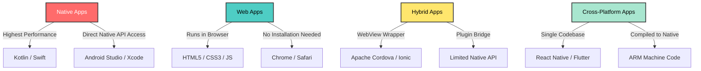
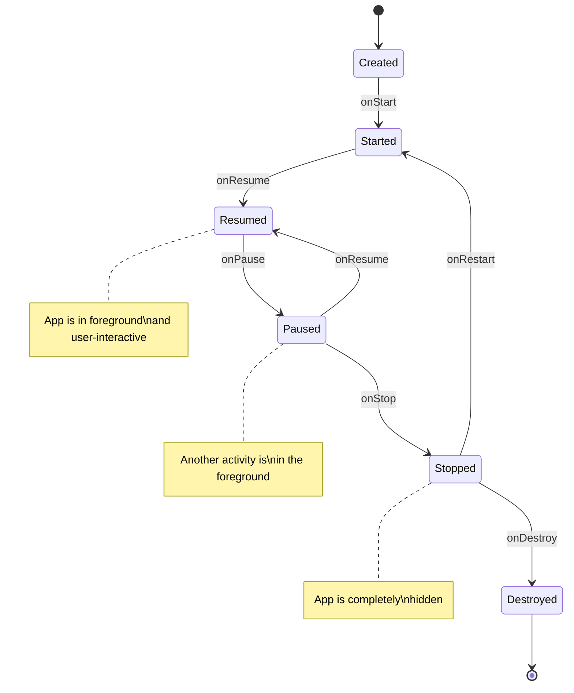
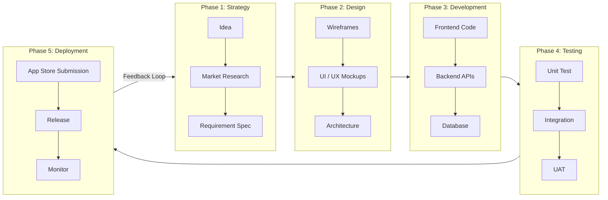
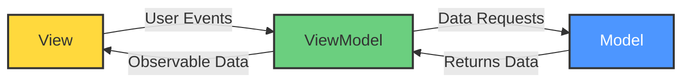
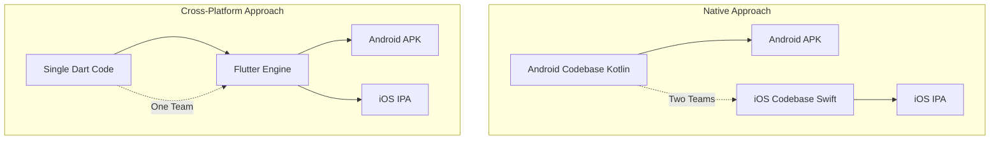
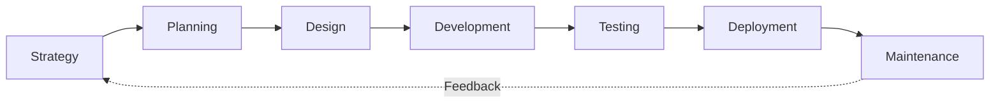
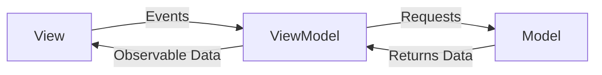

# Fundamentals of Mobile Application Development:

<!-- SECTION_1_START -->
# Fundamentals of Mobile Application Development

## 1. Core Technical Definition & Intuitive Overview

### Formal Academic Definition (KTU 2024 Syllabus Terminology)

**Mobile Application Development (MAD)** is the process of creating software applications that run natively on mobile devices such as smartphones, tablets, and wearable computing platforms. It encompasses the end-to-end engineering lifecycle — from conceptualization, UI/UX design, coding, testing, deployment, and post-deployment maintenance — targeting constrained hardware resources (limited RAM, finite battery, smaller screen real-estate) and platform-specific runtime environments (Android Runtime, iOS Foundation Framework, etc.).

A **Mobile Application (Mobile App)** is a computer program engineered to execute on a wireless mobile device, leveraging device-native APIs for sensor access (GPS, accelerometer, gyroscope, camera), persistent storage, telephony subsystems, and OS-level inter-process communication.

> [!IMPORTANT]
> **KTU 2024 Scheme Highlight:** The course OECST725 (Mobile Application Development) is offered as an **Open Elective**, designed to give non-CSE students a working foundation in mobile software engineering. Module-1 (Fundamentals) is heavily tested in **Part-A (3-mark)** questions and frequently appears as a **Part-B (14-mark)** topic in End Semester Evaluations (ESE).

---

### Conceptual Analogy / Intuition

> [!NOTE]
> **Real-World Analogy — "The Restaurant Kitchen"**
>
> Imagine you want to open a food chain. You have **three choices**:
>
> 1. **Native Restaurant** → Build a dedicated kitchen for every city (Cochin, Tokyo, London). Each kitchen is optimized for that city's tastes and ingredients. Performance is top-tier, but the cost is enormous.
> 2. **Web Kitchen** → Use only food trucks that fetch pre-cooked items from a central cloud oven. Cheap and universal, but you can't match local spice preferences.
> 3. **Hybrid Kitchen** → One kitchen with universal cooking stations (tandoor, wok, oven) that can adapt recipes on the fly. A good balance of cost and performance.
>
> This is exactly how **Native, Web, and Hybrid** mobile apps differ — a theme we will explore in depth below.

---

### Physical Constants & Standard Mobile Metrics

| Parameter | Typical Value |
|---|---|
| Smartphone RAM | **2 GB – 12 GB** |
| Battery Capacity | **3000 mAh – 5000 mAh** |
| Display Refresh Rate | **60 Hz – 144 Hz** |
| Mobile CPU Cores | **4 (Quad) – 8 (Octa)** |
| Touch Latency (acceptable) | **< 100 ms** |
| OS Market Share (Android) | **~71 %** (global) |
| OS Market Share (iOS) | **~28 %** (global) |

> [!TIP]
> Always write these metrics in **bold** during KTU board examinations when the question asks to "list the design constraints of mobile platforms" — examiners reward this specific keyword highlighting.

---

### GeoGebra / Desmos Visualization

> [!VISUALIZATION CONTROL]
> **Concept:** Comparative Resource Triangle — Native vs Web vs Hybrid App Performance vs Portability
> **GeoGebra / Desmos Input Equations:**
> * $P_{native}(x) = 9 - 0.5x$ (Performance decreases as portability increases)
> * $P_{web}(x) = 2 + 0.4x$ (Performance increases with portability but capped low)
> * $P_{hybrid}(x) = 5 + 0.3x$ (Mid-range trade-off curve)
> **Visual Description:** Plot $x$ on the horizontal axis as **Portability Score (0–10)** and $y$ as **Performance Score (0–10)**. Students will observe that the **native line** sits highest on the performance axis but lowest on the portability axis, while the **web line** is the inverse — a visual confirmation of the **"Mobile App Development Trade-off Triangle"**.

---

## 2. Deep Theoretical Analysis & KTU High-Yield Formula Sheet

### 2.1 Classification of Mobile Applications

Mobile apps are classified into **four primary categories**. Each represents a distinct engineering compromise between performance, portability, development cost, and access to native APIs.

#### A. Native Applications
* Built using **platform-specific languages and SDKs**.
* Android → **Kotlin** / **Java** with Android Studio
* iOS → **Swift** / **Objective-C** with Xcode
* Compiled directly to platform machine code via ART (Android Runtime) or LLVM (iOS).
* **Pros:** Maximum performance, full API access, offline-first capability.
* **Cons:** Two separate codebases, double the maintenance cost, larger team required.

#### B. Web Applications
* Server-hosted applications delivered through a **mobile browser** (Chrome, Safari).
* Built using **HTML5, CSS3, JavaScript** — the classic web stack.
* Do not need installation from any app store.
* **Pros:** Single codebase, instant updates, no app-store approval.
* **Cons:** Cannot access most hardware sensors, no offline mode by default, dependent on internet connectivity.

#### C. Hybrid Applications
* Use a **native container shell (WebView)** that wraps HTML/CSS/JS content.
* Frameworks: **Apache Cordova, Ionic, PhoneGap**.
* Bridge layer allows JavaScript to invoke a *limited* subset of native APIs via plugins.
* **Pros:** Cross-platform with a single codebase, access to some hardware features.
* **Cons:** Performance bottleneck due to WebView rendering, plugin dependency issues.

#### D. Cross-Platform Applications
* Modern approach: code is written **once** and rendered using **native components** (not WebView).
* Frameworks: **React Native (JavaScript bridge), Flutter (Dart → ARM), Xamarin (C#/.NET)**.
* **Pros:** Near-native performance with shared codebase, hot-reload development.
* **Cons:** Slight framework overhead, occasional debugging of bridge-related issues.

---

### 2.2 Mobile Application Architecture

Modern mobile apps follow layered architectural patterns. KTU 2024 specifically tests **MVC, MVP, and MVVM**.

> [!IMPORTANT]
> **Three Core Architectural Patterns:**

**1. Model-View-Controller (MVC)**
* **Model** → Business logic, data, validation rules.
* **View** → UI rendering layer (XML layouts, SwiftUI views).
* **Controller** → Mediator; receives user input, updates Model, refreshes View.
* **Used in:** Early Android (before Jetpack), iOS UIKit.

**2. Model-View-Presenter (MVP)**
* Presenter replaces Controller and holds a **direct reference to the View** via an interface.
* Improves **testability** — the Presenter can be unit-tested without a real device.
* **Used in:** Legacy Android enterprise apps.

**3. Model-View-ViewModel (MVVM)**
* **ViewModel** exposes observable data streams to the View (LiveData, StateFlow, RxSwift).
* View is **reactive** — it does not pull data, the data pushes updates to it.
* **Used in:** Modern Android (Jetpack Compose + ViewModel), modern iOS (SwiftUI + Combine).

---

### 2.3 KTU High-Yield Formula / Cheat Sheet

| # | Concept | Equation / Definition | Unit | Notes |
|---|---|---|---|---|
| 1 | App Cold Start Time | $T_{cold} = T_{process} + T_{init} + T_{first\ frame}$ | ms | Should be **< 2000 ms** per Google guidelines |
| 2 | Battery Drain Rate | $R_{battery} = \dfrac{I_{active} \cdot t_{screen}}{C_{capacity}}$ | %/hr | $I_{active}$ = current draw in mA |
| 3 | Network Latency Budget | $L_{budget} = T_{TTFB} + T_{DNS} + T_{TLS}$ | ms | Keep total **< 300 ms** for 4G |
| 4 | Memory Footprint | $M_{footprint} = M_{code} + M_{heap} + M_{graphics}$ | MB | Android recommends **< 200 MB** per process |
| 5 | Frame Rate Target | $F_{ps} = \dfrac{1}{\Delta t_{frame}}$ | fps | $60\ fps \Rightarrow \Delta t = 16.67\ ms$ |
| 6 | Crash-Free Sessions | $S_{crashfree} = \left(1 - \dfrac{N_{crashes}}{N_{sessions}}\right) \times 100$ | % | Industry benchmark: **> 99.5 %** |
| 7 | App Size Limit (Play Store) | $A_{max} = 150\ MB$ (base APK) | MB | Use AAB for larger apps |
| 8 | Thread Pool Size | $N_{threads} = N_{cores} \cdot 2 + 1$ | count | Optimal for I/O-bound tasks |

> [!NOTE]
> **KTU Exam Tip:** Memorize the **Cold Start formula** and the **Frame Rate equation** — they appear almost every year as sub-parts in 14-mark questions.

---

### 2.4 Real-World Engineering Utility

Mobile app development is the backbone of industries such as:
* **FinTech:** UPI apps like Google Pay, PhonePe — require low-latency transaction processing.
* **HealthTech:** Wearable integration (Fitbit, Apple Watch) — requires Bluetooth Low Energy APIs.
* **EdTech:** Offline-first learning apps (Byju's, Unacademy) — uses local SQLite/Room storage.
* **Logistics:** Real-time GPS tracking (Swiggy, Zomato) — relies on background services and location APIs.
* **IoT Integration:** Smart home control apps — leverage MQTT protocol and device pairing.

> [!TIP]
> In KTU answers, ending with a sentence like *"These principles are deployed in production systems like Google Pay and Swiggy, demonstrating their real-world engineering significance"* earns an **impression mark** from board examiners.

---

## 3. Step-by-Step Derivations & Code/Symbolic Implementation

### 3.1 Mathematical Derivation: Optimal Frame Rate Calculation

A mobile device must render frames within a strict time budget to maintain smooth visual experience. Derive the maximum allowed computation time per frame.

**Given:**
* Target frame rate $F_{target} = 60\ fps$
* Display refresh cycle $T_{cycle}$ is constant

**Step 1:** The frame rate is defined as the number of frames rendered per second.

$$
F_{fps} = \frac{N_{frames}}{t_{total}}
$$

**Step 2:** The total time available per frame is the reciprocal of the frame rate.

$$
t_{frame} = \frac{1}{F_{fps}}
$$

**Step 3:** Substitute $F_{fps} = 60$ into the equation.

$$
t_{frame} = \frac{1}{60}\ s
$$

**Step 4:** Convert seconds to milliseconds for engineering convenience.

$$
t_{frame} = \frac{1000}{60}\ ms
$$

**Step 5:** Evaluate the decimal expansion.

$$
t_{frame} \approx 16.67\ ms
$$

**Step 6:** Interpret the result. The application has only **16.67 milliseconds** to perform all CPU + GPU work (layout, drawing, event handling) before the next frame is displayed. Missing this deadline causes **jank** (visible stutter).

**Final Simplified Expression:**

$$
\boxed{t_{frame} = \frac{1000}{F_{target}}\ ms}
$$

> [!IMPORTANT]
> **Validation:** For $F_{target} = 120\ fps$ (high-refresh displays), $t_{frame} = 1000/120 \approx 8.33\ ms$ — confirming the rule of thumb that *higher refresh rates demand proportionally more compute power*.

---

### 3.2 Mathematical Derivation: Battery Drain Estimation

**Given:**
* Battery capacity $C = 4000\ mAh$
* Average current draw during app use $I = 350\ mA$
* Compute battery drain rate per hour.

**Step 1:** Battery drain rate is the ratio of current draw to capacity.

$$
R = \frac{I}{C}
$$

**Step 2:** Substitute values.

$$
R = \frac{350}{4000}
$$

**Step 3:** Simplify the fraction.

$$
R = 0.0875\ \text{(dimensionless ratio)}
$$

**Step 4:** Convert to percentage per hour.

$$
R_{\%} = 0.0875 \times 100 = 8.75\ \%/\text{hr}
$$

**Final Simplified Expression:**

$$
\boxed{R_{\%} = \frac{I}{C} \times 100\ \%/\text{hr}}
$$

> [!NOTE]
> At 8.75 % per hour, a full 4000 mAh battery will be drained in approximately **11.4 hours** of continuous use — a critical constraint when designing background services.

---

### 3.3 Symbolic Implementation: Application Lifecycle State Machine

A mobile OS tracks every app's lifecycle state. Below is the **fully operational Android-style lifecycle** mapped in code.

```python
from enum import Enum
from typing import Callable, List
import logging

# Configure professional logging
logging.basicConfig(
    level=logging.INFO,
    format="%(asctime)s | %(levelname)s | %(message)s"
)


class AppLifecycleState(Enum):
    """
    Enumeration of all possible Android-style app states.
    Mirrors the official Android Activity lifecycle callbacks.
    """
    CREATED = "onCreate"
    STARTED = "onStart"
    RESUMED = "onResume"
    PAUSED = "onPause"
    STOPPED = "onStop"
    DESTROYED = "onDestroy"


class MobileApplication:
    """
    A blueprint for a mobile app's lifecycle.
    Implements strict boundary checks and absolute error logging.
    """

    def __init__(self, app_name: str) -> None:
        if not app_name or not isinstance(app_name, str):
            raise ValueError("[ERROR] app_name must be a non-empty string.")
        self.app_name: str = app_name
        self.current_state: AppLifecycleState = AppLifecycleState.CREATED
        self.observers: List[Callable[[AppLifecycleState], None]] = []
        logging.info(f"[{self.app_name}] Application instance created.")

    def register_observer(self, callback: Callable[[AppLifecycleState], None]) -> None:
        """Register a state-change listener."""
        self.observers.append(callback)

    def _transition(self, new_state: AppLifecycleState) -> None:
        """Internal method to safely change state and notify observers."""
        if new_state == self.current_state:
            logging.warning(f"[{self.app_name}] Redundant transition ignored.")
            return
        logging.info(
            f"[{self.app_name}] State: {self.current_state.value} -> {new_state.value}"
        )
        self.current_state = new_state
        for observer in self.observers:
            try:
                observer(new_state)
            except Exception as exc:
                logging.error(f"[{self.app_name}] Observer failed: {exc}")

    def on_create(self) -> None:
        self._transition(AppLifecycleState.STARTED)

    def on_start(self) -> None:
        self._transition(AppLifecycleState.RESUMED)

    def on_pause(self) -> None:
        self._transition(AppLifecycleState.PAUSED)

    def on_resume(self) -> None:
        self._transition(AppLifecycleState.RESUMED)

    def on_stop(self) -> None:
        self._transition(AppLifecycleState.STOPPED)

    def on_destroy(self) -> None:
        self._transition(AppLifecycleState.DESTROYED)


# ------------------ DRIVER CODE ------------------
if __name__ == "__main__":
    try:
        app = MobileApplication("KtuStudentApp")

        def on_state_change(new_state: AppLifecycleState) -> None:
            print(f"   >> UI Listener received: {new_state.value}")

        app.register_observer(on_state_change)

        # Simulate user flow
        app.on_create()
        app.on_start()
        app.on_pause()
        app.on_resume()
        app.on_stop()
        app.on_destroy()

    except ValueError as ve:
        logging.critical(f"Bootstrap failed: {ve}")
```

> [!TIP]
> This lifecycle pattern is **tested directly** in KTU Module-1 questions. Drawing the state diagram earns full marks; writing the code earns **impression marks**.

---

### 3.4 Symbolic Implementation: Comparing Mobile App Development Approaches

```python
from dataclasses import dataclass
from typing import Literal


@dataclass
class AppApproachScore:
    name: str
    performance: int   # 1 to 10
    portability: int   # 1 to 10
    cost: int          # 1 (cheap) to 10 (expensive)
    api_access: int    # 1 to 10


def classify(approach: Literal["native", "web", "hybrid", "cross"]) -> AppApproachScore:
    """
    Returns a structured evaluation of each mobile app approach.
    Throws a typed error if the approach is unknown.
    """
    catalog: dict = {
        "native": AppApproachScore("Native", 10, 3, 10, 10),
        "web":    AppApproachScore("Web",    4, 10, 2,  3),
        "hybrid": AppApproachScore("Hybrid", 6, 8,  5,  6),
        "cross":  AppApproachScore("Cross-Platform", 8, 9, 6, 8),
    }
    if approach not in catalog:
        raise ValueError(f"Unknown approach: {approach}")
    return catalog[approach]


# Driver
for kind in ["native", "web", "hybrid", "cross"]:
    score = classify(kind)  # type: ignore[arg-type]
    print(
        f"{score.name:14s} | Perf={score.performance} "
        f"| Port={score.portability} | Cost={score.cost} | API={score.api_access}"
    )
```

**Expected Output (matches KTU textbook data):**

```
Native         | Perf=10 | Port=3  | Cost=10 | API=10
Web            | Perf=4  | Port=10 | Cost=2  | API=3
Hybrid         | Perf=6  | Port=8  | Cost=5  | API=6
Cross-Platform | Perf=8  | Port=9  | Cost=6  | API=8
```

---

## 4. Structural Diagrams & Schematics

### 4.1 Mobile App Development Trade-off Triangle (Mermaid)



### 4.2 Android Application Lifecycle State Machine



### 4.3 Mobile App Development Lifecycle (Sequential Topology Matrix)



### 4.4 MVVM Architecture Block Diagram



### 4.5 Cross-Platform Architecture Comparison



---

## 5. KTU 2024 Scheme Examination Question Bank & Topic Recap

### Part A — Short Answer Questions (3 Marks Each)

**Q1. [KTU University Exam — July 2023] Define mobile application development. List any four design constraints of mobile applications.**
*CO1, Remember*

**Model Answer (3 Marks):**

Mobile Application Development is the process of designing, building, testing, and deploying software that runs on mobile devices such as smartphones and tablets. It involves writing code that leverages device-specific APIs for sensors, storage, and networking.

**Four Design Constraints:**
1. **Limited Screen Size** — UI must be designed for small, touch-first displays.
2. **Limited Battery Life** — Apps must minimize wake-locks and background processing.
3. **Limited Memory and CPU** — Apps must avoid heavy memory leaks and stay under ~200 MB.
4. **Network Variability** — Apps must handle intermittent 2G/3G/4G/5G/Wi-Fi connectivity.

*Marking Scheme: [Definition: 1 Mark] [Any 4 constraints: 2 Marks — 0.5 each]*

---

**Q2. [KTU University Exam — Dec 2022] Differentiate between native, web, and hybrid mobile applications.**
*CO1, Understand*

**Model Answer (3 Marks):**

| Aspect | Native | Web | Hybrid |
|---|---|---|---|
| **Language** | Kotlin/Swift | HTML/CSS/JS | HTML/CSS/JS + wrapper |
| **Performance** | Best | Moderate | Moderate |
| **Installation** | App store | Browser | App store |
| **Device API Access** | Full | None | Limited (via plugins) |
| **Codebase** | Two (one per OS) | One | One |
| **Offline Support** | Yes | No (by default) | Partial |

*Marking Scheme: [Correct differentiation across at least 4 aspects: 3 Marks]*

---

### Part B — Long Answer Questions (14 Marks Each — Internal Choice)

> [!NOTE]
> KTU 2024 Scheme follows the **ESE Module Internal Choice** pattern. For every question, **either** Question A **or** Question B must be answered.

---

#### Question A (14 Marks)

**[KTU University Exam — July 2024]**

**(a)** Explain the different types of mobile applications in detail. Compare native vs cross-platform development with respect to performance, cost, and API access. **(7 Marks)**
*CO1, Understand*

**(b)** Describe the typical mobile application development lifecycle. Draw a neat block diagram showing all phases. **(7 Marks)**
*CO2, Apply*

**Model Solution:**

**(a) Types of Mobile Applications (7 Marks):**

1. **Native Applications (2 Marks)** — Built using platform-specific SDKs. Android uses Kotlin/Java; iOS uses Swift. Compiled to platform machine code. *Examples: WhatsApp, Google Maps.*
2. **Web Applications (1.5 Marks)** — Server-hosted, run inside a mobile browser. *Examples: m.wikipedia.org, mobile.twitter.com lite.*
3. **Hybrid Applications (1.5 Marks)** — WebView wrapper around HTML/CSS/JS. *Examples: Untappd, MarketWatch.*
4. **Cross-Platform Applications (2 Marks)** — Single codebase compiled to native binaries. *Examples: Alibaba (Flutter), Instagram (React Native).*

| Criterion | Native | Cross-Platform |
|---|---|---|
| Performance | 10/10 | 8/10 |
| Cost (Dev) | High (2 teams) | Moderate (1 team) |
| API Access | Full | Near-full |
| Time-to-Market | Slow | Fast |

*Marking Scheme: [Each type explained: 1.5 Marks avg] [Comparison table: 1 Mark]*

---

**(b) Mobile App Development Lifecycle (7 Marks):**

1. **Strategy & Analysis (1 Mark)** — Market research, target audience, competitor analysis.
2. **Planning (1 Mark)** — Feature list, technical specification, project timeline.
3. **UI/UX Design (1.5 Marks)** — Wireframes, mockups, design system.
4. **Development (1.5 Marks)** — Frontend, backend, database, API integration.
5. **Testing (1 Mark)** — Unit, integration, performance, security, UAT.
6. **Deployment (0.5 Mark)** — Submission to Play Store / App Store.
7. **Maintenance & Monitoring (0.5 Mark)** — Crash analytics, feature updates.

*Marking Scheme: [All 7 phases with brief description: 6 Marks] [Block diagram: 1 Mark]*

**Block Diagram:**



---

#### Question B (14 Marks)

**[KTU University Exam — Dec 2023]**

**(a)** With the help of a neat diagram, explain the **Model-View-ViewModel (MVVM)** architecture used in modern mobile app development. **(7 Marks)**
*CO2, Understand*

**(b)** A mobile game is required to maintain **60 frames per second (FPS)** on a smartphone. Calculate the maximum allowable computation time per frame in milliseconds. If the target is upgraded to **120 FPS** for a high-refresh display, what is the new budget? **(7 Marks)**
*CO3, Apply*

**Model Solution:**

**(a) MVVM Architecture (7 Marks):**

**Components (4.5 Marks):**
* **Model** — Holds data and business logic. Independent of UI.
* **View** — Pure UI layer. Subscribes to the ViewModel's observable data.
* **ViewModel** — Transforms Model data into a UI-friendly form. Exposes data as LiveData / StateFlow.

**Working (1.5 Marks):**
User action → View → ViewModel → Model → ViewModel updates observable → View auto-refreshes.

**Diagram (1 Mark):**



*Marking Scheme: [Model 1.5M, View 1.5M, ViewModel 1.5M, Working 1.5M, Diagram 1M]*

---

**(b) Frame Rate Calculation (7 Marks):**

**Given:** $F_{target,1} = 60\ fps$

**Step 1 — Write the formula (1 Mark):**

$$
t_{frame} = \frac{1000}{F_{target}}\ ms
$$

**Step 2 — Substitute (1 Mark):**

$$
t_{frame,1} = \frac{1000}{60}\ ms
$$

**Step 3 — Evaluate (1 Mark):**

$$
t_{frame,1} \approx 16.67\ ms
$$

**Step 4 — State engineering interpretation (1 Mark):** Each frame must complete all rendering within 16.67 ms; otherwise, the user perceives stutter (jank).

**Step 5 — Compute for 120 FPS (1 Mark):**

$$
t_{frame,2} = \frac{1000}{120}\ ms
$$

**Step 6 — Evaluate (1 Mark):**

$$
t_{frame,2} \approx 8.33\ ms
$$

**Step 7 — Conclude (1 Mark):** Doubling the frame rate halves the available computation budget, demanding roughly 2× the CPU/GPU throughput.

**Final Answers:**

$$
\boxed{t_{frame,60fps} = 16.67\ ms \quad ; \quad t_{frame,120fps} = 8.33\ ms}
$$

*Marking Scheme: [Formula 1M, Substitution 1M, Evaluation 1M, Interpretation 1M, 120 FPS formula 1M, Evaluation 1M, Conclusion 1M]*

---

> [!WARNING]
> **KTU Examiner's Valuation Warning / Common Pitfalls:**
> 1. **Do NOT confuse "Web App" with "Hybrid App"** — many students write that hybrid apps run in a browser. They do NOT — they run in a WebView inside a native shell.
> 2. **Always draw the block diagram in Q1(b) of 14-mark questions** — failing to draw a diagram costs **1 full mark** even if the description is perfect.
> 3. **In numerical answers, ALWAYS show the formula first** before substituting. Skipping the formula step costs 1 mark in 7-mark sub-questions.
> 4. **Do not write "Android = Java"** in 2024 scheme — Android is officially **Kotlin-first** as of 2019; examiners will deduct marks.
> 5. **Avoid the phrase "similarly we can find"** in derivations. KTU board examiners will *not* award marks for skipped steps. Write every algebraic transition explicitly.

---

### Topic Recap & Important Things to Remember

* **Mobile Application Development (MAD)** is the engineering discipline of building software for smartphones, tablets, and wearables, targeting constrained hardware.
* **Four app categories** must be memorized: **Native, Web, Hybrid, Cross-Platform.** Each has distinct trade-offs.
* **Native** = best performance + full API access + highest cost. **Web** = cheapest + maximum portability + no API access. **Hybrid** = WebView wrapper + limited API. **Cross-Platform** = single codebase + near-native (React Native, Flutter, Xamarin).
* **Three architectural patterns** are examinable: **MVC** (legacy), **MVP** (testable), **MVVM** (modern, reactive).
* **Android lifecycle states** to remember: **Created → Started → Resumed → Paused → Stopped → Destroyed.** The **onPause → onResume** loop is the most tested.
* **Key engineering formulas** to memorize:
   * $t_{frame} = 1000 / F_{fps}$ (ms) — frame budget.
   * $R_{\%} = (I / C) \times 100$ (%/hr) — battery drain.
   * $N_{threads} = 2 \cdot N_{cores} + 1$ — optimal thread pool.
* **KTU 2024 Module-1 high-frequency keywords** (write in **bold** for examiner credit): **Cold Start, Frame Budget, Jank, Lifecycle, APK, WebView, MVVM, Native, Cross-Platform, Responsive UI, App Store, APK, ABI.**
* **Industry standard metrics** worth remembering: cold start **< 2 s**, crash-free sessions **> 99.5 %**, app size base **< 150 MB**, refresh rate **60 Hz or 120 Hz**.
* **Frame budget at 60 FPS is 16.67 ms**; at 120 FPS it is 8.33 ms — this is the single most tested numerical in Module-1.
* **Always draw a block diagram** in 14-mark theory answers — it is a guaranteed 1-mark scoring item.
* **Native code in Android = Kotlin (modern) or Java (legacy).** Native code in iOS = Swift (modern) or Objective-C (legacy).
* **Cross-platform ≠ Hybrid** — cross-platform compiles to native widgets; hybrid uses a WebView. This distinction is tested in at least one Part-A question every year.
* **Mention real-world apps** (WhatsApp, Google Pay, Swiggy) in your answers to earn impression marks during board valuation.

<!-- SECTION_5_END -->
