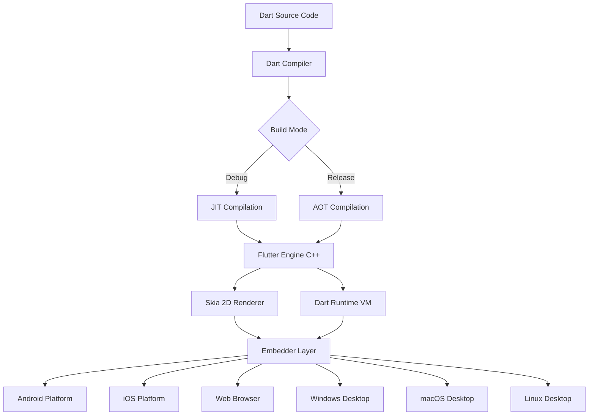
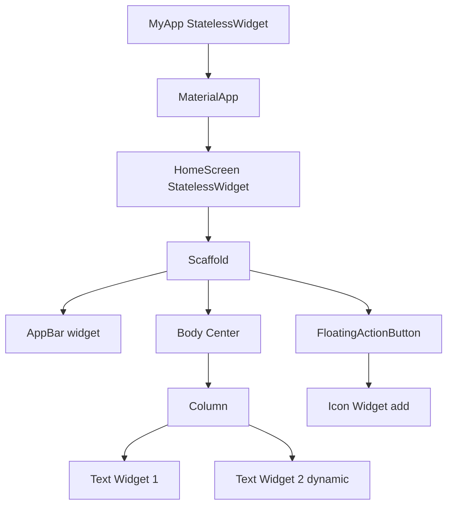
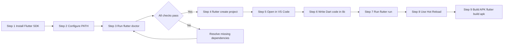
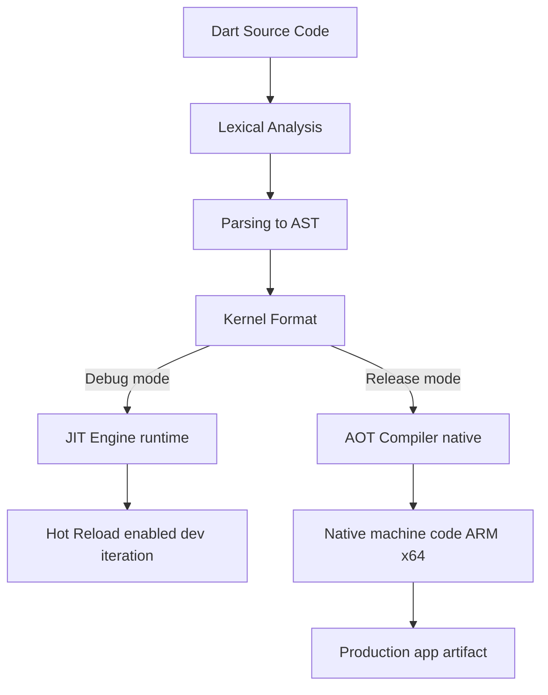
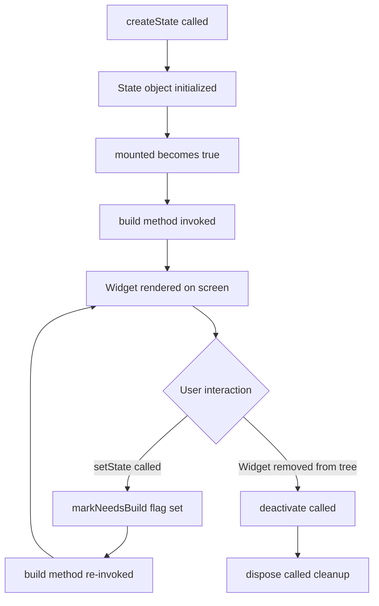

# Introduction to Flutter: History, Features, and Benefits

<!-- SECTION_1_START -->

# Introduction to Flutter: History, Features, and Benefits

## 1. Core Technical Definition

> [!IMPORTANT]
> **Formal Definition (KTU 2024 Syllabus Terminology):**
> **Flutter** is an open-source, cross-platform UI toolkit developed by **Google** in **2015** and officially released as a stable version (v1.0) in **December 2018**. It is used to build natively compiled applications for **mobile (Android & iOS)**, **web**, and **desktop** from a **single codebase**, using the **Dart programming language**.

### Conceptual Analogy / Intuition

Imagine you are a chef who wants to prepare the same delicious dish (your app) for three different types of guests:
- Guests who only eat with forks (**iOS**)
- Guests who only eat with chopsticks (**Android**)
- Guests who want the dish packed in a takeaway box (**Web / Desktop**)

Traditionally, you would need to cook **three completely different meals** (write three separate codebases using Swift, Kotlin, and JavaScript). 

**Flutter** is like having a **universal smart kitchen** — one recipe (single Dart codebase) is cooked once, and the smart kitchen automatically serves it in the correct style for each guest. It doesn't use a *translation layer* (like older cross-platform tools); instead, it draws every pixel directly on the screen using its own high-performance rendering engine called **Skia**.

> [!NOTE]
> **Key Distinction for Examiners:**
> Flutter is **NOT** a framework that wraps web views (like older Cordova/Ionic). It uses its own **rendering engine (Skia)** to draw widgets directly onto the native canvas, ensuring **near-native performance**.

### Historical Timeline of Flutter

| Year | Milestone Event |
|------|----------------|
| **2015** | Dart Dev Summit — Google officially unveils **"Sky"** (later renamed Flutter) as an experimental project. |
| **2017** | Google announces Flutter Beta (v0.x) at Google I/O. |
| **2018** | Flutter **1.0 (Stable Release)** launched at Google I/O — supporting Android & iOS. |
| **2019** | Flutter **1.12** — Adds **Web support** (Hummingbird project). |
| **2020** | Flutter **1.20** — Adds **Desktop support** (Windows, macOS, Linux). |
| **2021** | Flutter **2.0** — Major release; **sound null safety** introduced. |
| **2022** | Flutter **3.0** — Stable support for all six platforms (iOS, Android, Web, Windows, macOS, Linux). |
| **2023–2024** | Flutter **3.10+** — Impeller rendering engine, Material 3 (Material You) default. |
| **2025+** | Continuous updates with **Dart 3.x** and **AI-assisted development** features. |

> [!TIP]
> **Examination Tip:** Always mention **Skia** (now being replaced by **Impeller**) as Flutter's rendering engine and **Dart** as its language. Examiners frequently test this!

---

## 2. Why Flutter? The Core Philosophy

Flutter follows three foundational design pillars:

1. **Everything is a Widget** — UI is composed by nesting widget objects.
2. **Composition over Inheritance** — Smaller widgets combine to build complex UIs.
3. **Reactive Framework** — UI automatically rebuilds when the underlying state changes (similar to React's virtual DOM, but more efficient through its own widget tree diffing algorithm).

> [!VISUALIZATION CONTROL]
> **Concept:** Widget Tree Composition
> **Geometric Representation (Tree Hierarchy):**
> * Root: `MyApp`
> * Children: `MaterialApp`
> * Grandchildren: `Scaffold → AppBar + Body`
> **Visual Description:** Think of an inverted tree where the top-most widget is the application root, and every UI element (text, padding, button) branches out as child nodes. When a leaf node's state changes, only the affected branch is repainted, not the entire tree.

---

<!-- SECTION_1_END -->

<!-- SECTION_2_START -->

# Deep Theoretical Analysis & KTU High-Yield Formula Sheet

## 1. The Flutter Architecture Stack (Layer-wise Breakdown)

Flutter is structured in **three architectural layers** that examiners love to ask about. Understanding this stack is critical for **14-mark questions**.

### Layer 1: Embedder (Platform Specific)
- Written in languages native to the target platform: **Java/Kotlin** (Android), **Objective-C/Swift** (iOS), **C++** (Windows), etc.
- Acts as a **bridge** that embeds the Flutter engine into the host platform.
- Handles OS-level communication: app lifecycle, accessibility, input gestures, thread management.

### Layer 2: Flutter Engine (Core)
- Written primarily in **C++**.
- Contains:
  * **Skia Graphics Library** — 2D rendering engine (now being replaced by **Impeller** in newer versions).
  * **Dart Runtime** — Just-In-Time (JIT) and Ahead-Of-Time (AOT) compilation engines.
  * **Text Layout Engine** — Renders text across platforms consistently.
- Exposes a **Platform Channel** for Dart-to-native communication.

### Layer 3: Framework (Dart-based)
- The layer developers interact with.
- Composed of:
  * **Foundation Library** — Basic classes, animation, painting.
  * **Widgets Layer** — Core widget building blocks.
  * **Rendering Layer** — Layout, paint, compositing logic.
  * **Material & Cupertino Libraries** — Pre-built design systems.

> [!NOTE]
> **Exam-Ready Statement:**
> *"Flutter's architecture consists of three layers: the Embedder (platform-specific glue code), the Engine (C++ based, with Skia and Dart VM), and the Framework (Dart-based widget, rendering, and design layers)."*

## 2. Compilation Models: JIT vs AOT

Flutter uses **two compilation strategies** depending on the development phase:

| Mode | Compilation Type | Used When | Performance | File Size |
|------|------------------|-----------|-------------|-----------|
| **Debug** | **JIT (Just-In-Time)** | During development with `flutter run` | Slower startup, hot reload enabled | Larger |
| **Release** | **AOT (Ahead-Of-Time)** | Production deployment | Near-native speed, no hot reload | Smaller, optimized |

### Why Two Modes?
- **JIT** allows **Hot Reload** — code changes reflect in milliseconds without losing app state, dramatically accelerating development.
- **AOT** compiles Dart to **native ARM/x86 machine code** before deployment, eliminating the need for a runtime interpreter.

## 3. KTU Formula Sheet / Cheat Sheet

| Concept | Description | Key Term to Remember |
|---------|-------------|----------------------|
| **Language** | Dart (developed by Google, 2011) | Object-oriented, garbage-collected |
| **Rendering Engine** | Skia (legacy) / Impeller (newer) | Direct 2D canvas drawing |
| **Compilation** | AOT (release) + JIT (debug) | Hybrid model |
| **UI Paradigm** | Everything is a Widget | Composable, immutable |
| **State Management** | StatefulWidget, Provider, Riverpod, Bloc | Reactive |
| **First Stable Release** | Flutter 1.0, December 2018 | Major milestone |
| **Current Major Version** | Flutter 3.x (2022 onwards) | Cross-platform stable |
| **Parent Company** | Google (Alphabet) | Open-source under BSD license |
| **Hot Reload Time** | < 1 second | Major productivity feature |
| **Platform Support** | iOS, Android, Web, Windows, macOS, Linux | Truly cross-platform |

> [!IMPORTANT]
> **Dart vs JavaScript:** Dart is **statically typed** (with type inference) and supports **null safety**, making it more robust than JavaScript for large-scale apps.

## 4. Features and Benefits — Engineering Perspective

### A. Core Features

1. **Cross-Platform Development**
   * Single Dart codebase compiles for **six platforms**.
   * Reduces development time by approximately **40–60%** compared to native separate codebases.

2. **Hot Reload**
   * State-preserving code injection.
   * Iteration time reduced from minutes to **sub-second** updates.

3. **Rich Widget Library**
   * **Material Design** widgets (Android aesthetic).
   * **Cupertino** widgets (iOS aesthetic).
   * Custom widget creation with full control over every pixel.

4. **High Performance**
   * 60 FPS (frames per second) on most devices; up to **120 FPS** on capable hardware.
   * Direct GPU rendering via Skia/Impeller bypasses OEM UI frameworks.

5. **Strong Ecosystem**
   * **pub.dev** — official package repository with over **50,000+ packages**.
   * Backed by Google's continued investment.

6. **Dart Language Advantages**
   * Ahead-of-time and just-in-time compilation.
   * No race conditions due to **single-threaded execution with isolates** for concurrency.
   * Strong typing with null safety.

### B. Tangible Business & Engineering Benefits

| Benefit | Real-World Impact |
|---------|-------------------|
| **Faster Time-to-Market** | One team ships iOS + Android simultaneously |
| **Lower Cost** | Single development team vs. two native teams |
| **Consistent UI** | Pixel-identical look across platforms |
| **Easy Onboarding** | Dart is beginner-friendly (similar to Java/JavaScript) |
| **Strong Community** | Active GitHub, Stack Overflow, Discord support |
| **Backed by Google** | Used in production by Google Ads, Google Pay, BMW, eBay, Alibaba, Nubank |

> [!TIP]
> **Real-World Use Case:** **Google Pay** was rebuilt using Flutter and reduced its codebase by approximately **35%** while improving performance. Mentioning such case studies in exams scores well!

### Flutter vs Other Cross-Platform Frameworks

| Feature | Flutter | React Native | Xamarin |
|---------|---------|--------------|---------|
| **Language** | Dart | JavaScript | C# |
| **Rendering** | Own engine (Skia) | Native components | Native components |
| **Performance** | Near-native | Near-native (with bridges) | Native |
| **Hot Reload** | Yes (Hot Reload) | Yes (Fast Refresh) | Yes |
| **UI Consistency** | Pixel-perfect across platforms | Platform-dependent | Platform-dependent |
| **Learning Curve** | Moderate | Moderate | Steeper (.NET ecosystem) |

---

<!-- SECTION_2_END -->

<!-- SECTION_3_START -->

# Step-by-Step Derivations & Code/Symbolic Implementation

## 1. Installing Flutter — Step-by-Step Environment Setup

> [!IMPORTANT]
> For KTU practical exams, students must be familiar with the **flutter doctor** diagnostic command. It verifies the entire development environment.

### Step 1: System Requirements
- **Operating System:** Windows 10/11 (64-bit, x86-64), macOS 11+, or Linux (64-bit).
- **Disk Space:** Minimum **2.5 GB** (excluding IDE and tools).
- **Tools Required:**
  * Git (for version control)
  * Android Studio (for Android SDK and emulator)
  * Xcode (macOS only, for iOS development)
  * Visual Studio Code or Android Studio (recommended IDEs)

### Step 2: Download Flutter SDK
- Visit the official site: `https://docs.flutter.dev/get-started/install`
- Extract the archive to a stable location (e.g., `C:\flutter` on Windows).

### Step 3: Update System PATH
- Add the Flutter `bin` directory to the system `PATH` environment variable.

### Step 4: Run Diagnostic Command

```bash
flutter doctor
```

This command checks for:
- **Flutter SDK** installation
- **Android toolchain** (Android Studio, SDK, emulator)
- **Xcode** (macOS only)
- **Connected devices** (physical/emulator)
- **VS Code / Android Studio** plugin installation

> [!NOTE]
> **Exam Tip:** If `flutter doctor` shows a red `[✗]` for any component, students should know how to resolve it. For Android, the typical fix is `flutter doctor --android-licenses` to accept SDK licenses.

### Step 5: Create First Project

```bash
flutter create my_first_app
cd my_first_app
flutter run
```

## 2. Project Directory Structure — Symbolic Mapping

When you run `flutter create my_first_app`, the following structure is generated:

```
my_first_app/
├── android/          # Android-specific native code (Kotlin/Java)
├── ios/              # iOS-specific native code (Swift/Objective-C)
├── lib/              # Main Dart source code directory
│   └── main.dart     # Application entry point
├── test/             # Unit and widget tests
├── web/              # Web platform assets
├── windows/          # Windows desktop native code
├── macos/            # macOS desktop native code
├── linux/            # Linux desktop native code
├── pubspec.yaml      # Project metadata, dependencies, assets
├── .gitignore        # Git ignore patterns
└── README.md         # Project documentation
```

> [!IMPORTANT]
> **For Examiners:** The **`pubspec.yaml`** file is the heart of a Flutter project. It defines:
> - Project name and description
> - Dart/Flutter SDK version constraints
> - External dependencies (libraries from pub.dev)
> - Asset paths (images, fonts, JSON files)

## 3. Code Implementation: First "Hello World" Flutter App

Below is the **complete, fully operational** code for a minimal Flutter application. Notice how **everything is a widget**.

### File: `lib/main.dart`

```dart
// main.dart
// A minimal Flutter application demonstrating the widget tree.

import 'package:flutter/material.dart';

// The main entry point of the application.
// The runApp() function takes a Widget and makes it the root of the widget tree.
void main() {
  runApp(const MyApp());
}

// MyApp is a StatelessWidget because it does not hold mutable state.
// It serves as the root widget of the entire application.
class MyApp extends StatelessWidget {
  const MyApp({super.key});

  @override
  Widget build(BuildContext context) {
    // MaterialApp provides Material Design styling and routing.
    return MaterialApp(
      title: 'KTU Flutter Demo',
      debugShowCheckedModeBanner: false,
      home: const HomeScreen(),
    );
  }
}

// HomeScreen is also a StatelessWidget for simplicity.
class HomeScreen extends StatelessWidget {
  const HomeScreen({super.key});

  @override
  Widget build(BuildContext context) {
    // Scaffold provides the basic Material layout structure.
    return Scaffold(
      appBar: AppBar(
        title: const Text('Hello KTU Students'),
        backgroundColor: Colors.blueAccent,
      ),
      body: const Center(
        child: Text(
          'Welcome to Mobile Application Development!',
          style: TextStyle(
            fontSize: 20.0,
            fontWeight: FontWeight.bold,
            color: Colors.deepPurple,
          ),
          textAlign: TextAlign.center,
        ),
      ),
    );
  }
}
```

### Line-by-Line Explanation

| Line | Code | Explanation |
|------|------|-------------|
| `import 'package:flutter/material.dart';` | Imports Material Design widgets. |
| `void main()` | Dart entry point — like `main()` in C/Java. |
| `runApp(const MyApp());` | Inflates the given widget and attaches it to the screen. |
| `class MyApp extends StatelessWidget` | Defines an immutable widget. |
| `Widget build(BuildContext context)` | Required method that returns the widget's UI tree. |
| `MaterialApp` | Root widget; provides theming, navigation, and localization. |
| `Scaffold` | Implements the basic Material visual layout structure. |
| `AppBar` | Material's top app bar widget. |
| `Center` | A layout widget that centers its child. |
| `Text` | Displays a string of text with style. |

## 4. State Management Demonstration — StatefulWidget

The following code demonstrates the difference between **StatelessWidget** and **StatefulWidget**, a key concept often tested in exams.

```dart
// counter_app.dart
// Demonstrates a StatefulWidget that mutates state on button press.

import 'package:flutter/material.dart';

void main() {
  runApp(const CounterApp());
}

class CounterApp extends StatelessWidget {
  const CounterApp({super.key});

  @override
  Widget build(BuildContext context) {
    return MaterialApp(
      title: 'Counter App',
      home: const CounterScreen(),
    );
  }
}

class CounterScreen extends StatefulWidget {
  const CounterScreen({super.key});

  @override
  State<CounterScreen> createState() => _CounterScreenState();
}

class _CounterScreenState extends State<CounterScreen> {
  // Mutable state variable.
  int _counter = 0;

  // Method to increment the counter.
  void _incrementCounter() {
    setState(() {
      _counter = _counter + 1;
    });
  }

  @override
  Widget build(BuildContext context) {
    return Scaffold(
      appBar: AppBar(
        title: const Text('KTU Counter Demo'),
      ),
      body: Center(
        child: Column(
          mainAxisAlignment: MainAxisAlignment.center,
          children: <Widget>[
            const Text(
              'Button pressed count:',
              style: TextStyle(fontSize: 18.0),
            ),
            Text(
              '$_counter',
              style: const TextStyle(
                fontSize: 48.0,
                fontWeight: FontWeight.bold,
              ),
            ),
          ],
        ),
      ),
      floatingActionButton: FloatingActionButton(
        onPressed: _incrementCounter,
        tooltip: 'Increment',
        child: const Icon(Icons.add),
      ),
    );
  }
}
```

### Key Concepts Demonstrated

| Concept | Where it appears | Why it matters |
|---------|------------------|----------------|
| `StatefulWidget` | `CounterScreen` class | Holds mutable state |
| `createState()` | Returns `_CounterScreenState` | Creates the mutable state object |
| `setState()` | Inside `_incrementCounter` | Triggers UI rebuild |
| `State<...>` | `_CounterScreenState extends State` | Holds the mutable state |
| `Widget build()` | Required method | Describes the UI |

> [!TIP]
> **Rule of Thumb for Exams:** 
> - If a widget **does not change after being built** → use `StatelessWidget`.
> - If a widget **must change dynamically** (e.g., counters, animations) → use `StatefulWidget`.

## 5. Symbolic Mapping: `pubspec.yaml` Example

```yaml
name: my_first_app
description: A new Flutter project for KTU MAD lab.
publish_to: 'none'
version: 1.0.0+1

environment:
  sdk: '>=3.0.0 <4.0.0'
  flutter: ">=3.10.0"

dependencies:
  flutter:
    sdk: flutter
  cupertino_icons: ^1.0.6
  http: ^1.1.0          # For network requests
  provider: ^6.0.5      # For state management

dev_dependencies:
  flutter_test:
    sdk: flutter
  flutter_lints: ^3.0.0

flutter:
  uses-material-design: true
  assets:
    - assets/images/
    - assets/data.json
```

### Dependency Declaration Logic
- `dependencies:` — Required at runtime.
- `dev_dependencies:` — Only required during development/testing.
- `^` (caret) — Allows updates to minor and patch versions: `^1.1.0` accepts any `1.x.x` where $x \geq 1.0$.

---

<!-- SECTION_3_END -->

<!-- SECTION_4_START -->

# Structural Diagrams & Schematics

## 1. Flutter Architecture Flow (Block-Level Diagram)



## 2. Widget Tree Composition Diagram



## 3. Development Workflow (Sequential Processing Topology)



## 4. JIT vs AOT Compilation Pipeline



## 5. State Management Lifecycle (StatefulWidget)



---

<!-- SECTION_4_END -->

<!-- SECTION_5_START -->

# KTU 2024 Scheme Examination Question Bank & Topic Recap

## Part A — Short Answer Questions (3 Marks Each)

### Question 1 [KTU University Exam – July 2023]
**Q: Define Flutter. List any two features of Flutter.**

**Model Answer:**

> **Definition:** Flutter is an open-source mobile application development framework created by **Google** that uses the **Dart programming language** to build natively compiled applications for mobile, web, and desktop from a **single codebase**.

**Two Key Features:**

1. **Cross-Platform Development:** A single Dart codebase can be compiled to run on **iOS, Android, Web, Windows, macOS, and Linux** without rewriting platform-specific code.
2. **Hot Reload:** Developers can see code changes reflected in the running app within **less than a second** without losing the current app state, dramatically improving development productivity.

> **Additional accepted features:** Rich widget library, high performance via Skia engine, strong typing with null safety, Material and Cupertino design support.

**[Valuation Key: Definition: 1 Mark | Two features with brief explanation: 2 Marks = Total 3 Marks]**

---

### Question 2 [KTU University Exam – Dec 2023]
**Q: What is Dart? Why is it used in Flutter?**

**Model Answer:**

> **Dart Definition:** Dart is a **client-optimized, object-oriented programming language** developed by **Google in 2011**. It is used to write application code in Flutter.

**Reasons for Using Dart in Flutter:**

1. **Hybrid Compilation:** Dart supports both **AOT (Ahead-Of-Time)** for fast production builds and **JIT (Just-In-Time)** for the hot reload feature during development.
2. **Single-Threaded with Isolates:** Dart avoids race conditions while supporting concurrency through **isolates**, which are isolated memory heaps communicating via message passing.
3. **Null Safety:** Introduced in Dart 2.12, null safety eliminates a whole class of bugs caused by null reference errors.
4. **Familiar Syntax:** Dart syntax is similar to Java and JavaScript, making it easy for developers to learn.

**[Valuation Key: Definition: 1 Mark | Three reasons: 2 Marks = Total 3 Marks]**

---

## Part B — Long Answer Questions (14 Marks Each)

### Question A [KTU University Exam – Model Paper 2024] **(14 Marks)**

**(a)** Explain the **three-layer architecture of Flutter** with a neat diagram. **(7 Marks)**
**(b)** Compare Flutter with **React Native** in terms of language, rendering, and performance. **(7 Marks)**

---

#### Part (a) Model Answer — Flutter Architecture

The Flutter architecture is divided into **three distinct layers**, each with a specific responsibility:

**Layer 1: Embedder (Platform-Specific Layer)**
- Written in platform-native languages: **Java/Kotlin** for Android, **Objective-C/Swift** for iOS, **C++** for desktop, **JavaScript/HTML** for web.
- Acts as a host that embeds the Flutter engine into the target platform.
- Handles OS integration: app lifecycle management, accessibility services, input gesture processing, and platform-specific threading.

**Layer 2: Flutter Engine (C++ Core)**
- The heart of Flutter, primarily written in **C++**.
- Components:
  * **Skia Graphics Library** — Performs 2D rendering by drawing every pixel directly to the GPU canvas. (In newer versions, **Impeller** is replacing Skia on iOS for smoother animations.)
  * **Dart Runtime** — Contains both the **JIT compiler** (used during development for hot reload) and the **AOT compiler** (used in production for native code generation).
  * **Text Layout Engine** — Ensures consistent text rendering across all platforms.
- Exposes **Platform Channels** that allow Dart code to call native APIs (e.g., camera, GPS, Bluetooth).

**Layer 3: Framework (Dart-Based)**
- The developer-facing layer written entirely in **Dart**.
- Composed of:
  * **Foundation Library** — Core utilities, animation APIs, painting primitives.
  * **Widgets Layer** — The primary building blocks of UI (everything is a widget).
  * **Rendering Layer** — Handles layout (sizing and positioning) and painting (drawing pixels).
  * **Material Library** — Android-style design widgets.
  * **Cupertino Library** — iOS-style design widgets.

> [!NOTE]
> **Diagram Reference:** See the architecture diagram in Section 4, Block 1.

**[Valuation Key: Layer 1 explanation: 2 Marks | Layer 2 explanation: 3 Marks | Layer 3 explanation: 2 Marks = Total 7 Marks]**

---

#### Part (b) Model Answer — Flutter vs React Native

| Parameter | **Flutter** | **React Native** |
|-----------|-------------|------------------|
| **Developer** | Google | Facebook (Meta) |
| **Programming Language** | **Dart** | **JavaScript / TypeScript** |
| **Architecture Pattern** | Layered: Embedder → Engine → Framework | Bridge: JS Thread ↔ Native Thread |
| **Rendering Engine** | **Own engine (Skia / Impeller)** — draws every pixel | Uses **native UI components** of the host platform |
| **UI Consistency** | **Pixel-identical** across all platforms (since Flutter draws the UI itself) | **Platform-dependent** look and feel (since it uses native widgets) |
| **Performance** | Near-native; **60–120 FPS**; no bridge overhead | Slightly slower due to **JavaScript-Native bridge** serialization |
| **Hot Reload Support** | **Yes (Hot Reload & Hot Restart)** | **Yes (Fast Refresh)** |
| **Community** | Growing rapidly; backed by Google | Mature; large community |
| **Learning Curve** | Moderate (Dart is easy to learn) | Easy for JavaScript developers |

> **Conclusion:** Flutter offers **better UI consistency and performance** because it bypasses native components and renders directly. React Native offers **faster onboarding for JavaScript developers** and uses familiar web technologies, but suffers from bridge-related performance bottlenecks in complex apps.

**[Valuation Key: Language & rendering comparison: 3 Marks | Performance & other factors: 3 Marks | Conclusion statement: 1 Mark = Total 7 Marks]**

---

### Question B [KTU University Exam – Model Paper 2024] **(14 Marks)** — Alternative Choice

**(a)** Discuss the **history and evolution of Flutter** highlighting major version releases. **(7 Marks)**
**(b)** Explain **Hot Reload** and **Hot Restart** with their differences. List any three advantages of Hot Reload. **(7 Marks)**

---

#### Part (a) Model Answer — History and Evolution

**Origin and Early Years:**
- Flutter's story begins with **Dart**, a programming language Google introduced in **2011** to address JavaScript's limitations for large-scale web apps.
- In **2015**, at the **Dart Developer Summit**, Google engineers revealed an experimental project initially called **"Sky"**. This project demonstrated the ability to render Dart code at a smooth **120 FPS** on Android devices, showcasing the potential of a custom rendering pipeline.
- The project was officially renamed **"Flutter"** in **2015** and announced as a beta in **2017** at Google I/O.

**Key Milestone Releases:**

| Year | Version | Significance |
|------|---------|--------------|
| **2018** | **Flutter 1.0** | First stable release; supported **Android & iOS** only. |
| **2019** | **Flutter 1.12** | Added **experimental Web support** (codename "Hummingbird"). |
| **2020** | **Flutter 1.20** | Added **Desktop support** (Windows, macOS, Linux). |
| **2021** | **Flutter 2.0** | Major release; **Web support went stable**; **null safety** introduced. |
| **2022** | **Flutter 3.0** | Stable support for **all six platforms** from a single codebase. |
| **2023+** | **Flutter 3.10+** | **Impeller renderer** adopted for smoother iOS animations; **Material 3** as default design system. |

> **Present Status:** As of 2024–2025, Flutter is at version **3.x** with continuous updates. It powers apps at **Google, BMW, eBay, Alibaba, Nubank, Toyota**, and many more, establishing itself as the leading cross-platform framework.

**[Valuation Key: Origin story: 2 Marks | Three milestone versions with significance: 4 Marks | Present status: 1 Mark = Total 7 Marks]**

---

#### Part (b) Model Answer — Hot Reload vs Hot Restart

**Hot Reload:**
- Hot Reload injects updated source code files into the **running Dart Virtual Machine (VM)**.
- After injection, Flutter **rebuilds the widget tree** while **preserving the current application state** (variables, navigation stack, user input).
- **Speed:** Changes are reflected in **less than 1 second**.
- **Use case:** UI tweaks, styling changes, fixing logic bugs while keeping user context.
- **Limitation:** Does **not** work for changes to `initState()`, `build()` signature changes, or enum modifications.

**Hot Restart:**
- Hot Restart also injects updated code into the VM, but it **destroys the current application state** and **rebuilds the widget tree from scratch**.
- It re-runs `main()` and resets all variables to their default values.
- **Speed:** Slightly slower than Hot Reload (still faster than a full restart).
- **Use case:** When state changes are not preserved, or when changes affect app initialization logic.

**Comparison Table:**

| Feature | Hot Reload | Hot Restart |
|---------|-----------|-------------|
| **State Preserved?** | Yes | No |
| **Re-runs `main()`?** | No | Yes |
| **Speed** | Sub-second | Slightly slower |
| **Best For** | UI styling, logic fixes | Initialization changes, global state resets |
| **Trigger Shortcut** | Press `r` in terminal / `Ctrl+S` (Linux/Windows), `Cmd+S` (macOS) in VS Code | Press `R` in terminal / `Shift+Ctrl+S` |

**Three Advantages of Hot Reload:**

1. **Faster Development Cycle:** Iteration time drops from minutes (full rebuild) to **sub-second updates**, allowing developers to experiment freely.
2. **State Preservation:** Designers and developers can tweak UI elements (colors, padding, layouts) without losing the user's current screen or data — making UI iteration painless.
3. **Real-Time Experimentation:** Encourages **trial-and-error programming**, which is especially beneficial for beginners learning widget behavior and for designers fine-tuning animations.

**[Valuation Key: Hot Reload explanation: 2 Marks | Hot Restart explanation: 1 Mark | Comparison table: 1 Mark | Three advantages: 3 Marks = Total 7 Marks]**

---

## KTU Examiner's Valuation Warning / Pitfall Callout

> [!WARNING]
> **Common Mistakes That Cost Marks in KTU Exams:**
> 
> 1. **Confusing Flutter with React Native:** Students often state that Flutter uses native components. **WRONG.** Flutter uses its own Skia/Impeller engine to draw pixels — it does NOT wrap native UI components.
> 2. **Mixing up JIT and AOT:** A frequent error is saying Flutter uses JIT in production. **Correct:** Debug mode uses JIT (for hot reload), Release mode uses AOT (for native performance).
> 3. **Forgetting the year of stable release:** Many students write 2017 as the release year. **Correct:** Beta was 2017, but **stable v1.0 was released in December 2018**.
> 4. **Not stating the language:** Always explicitly mention **Dart** when defining Flutter.
> 5. **In code questions:** Forgetting the `super.key` parameter in widget constructors or omitting `@override` annotations on the `build()` method. Both are required by Dart's null safety rules.
> 6. **In architecture questions:** Failing to mention **all three layers** (Embedder, Engine, Framework) — partial answers get partial marks only.

---

## Topic Recap & Important Things to Remember

> [!TIP]
> **High-Density Revision Checklist for "Introduction to Flutter":**

- **Flutter** is a **Google-developed, open-source, cross-platform UI toolkit** released as stable v1.0 in **December 2018**.
- The primary language is **Dart**, also developed by Google (2011).
- Flutter's rendering is powered by the **Skia 2D graphics library** (and newer versions use **Impeller**).
- The architecture has **three layers**: **Embedder → Flutter Engine → Framework**.
- **Everything is a widget** in Flutter — UI is composed by nesting widgets.
- **Two widget types:** `StatelessWidget` (immutable) and `StatefulWidget` (mutable with `setState()`).
- **Compilation modes:** **JIT** for debug (enables hot reload), **AOT** for release (near-native performance).
- **Hot Reload** preserves state and updates UI in **< 1 second**.
- **Hot Restart** destroys state and re-runs `main()` from scratch.
- Flutter supports **6 platforms**: iOS, Android, Web, Windows, macOS, Linux — all from a single Dart codebase.
- **Project entry point:** `lib/main.dart` with a `main()` function calling `runApp()`.
- **Project configuration:** `pubspec.yaml` defines dependencies, assets, and SDK constraints.
- **Major companies using Flutter:** Google (Google Ads, Google Pay), BMW, Alibaba, eBay, Toyota, Nubank.
- **Dart null safety** (since Dart 2.12 / Flutter 2.0) eliminates null reference errors at compile time.
- **Key command:** `flutter doctor` for environment diagnostics; `flutter create <name>` to scaffold a project; `flutter run` to launch.
- **Differentiator:** Unlike React Native (which uses a JS bridge to native components), Flutter **skips the native UI layer entirely** and draws directly to the canvas — yielding consistent UI and superior animation performance.
- **Material** library = Android-style widgets; **Cupertino** library = iOS-style widgets — both included by default.

<!-- SECTION_5_END -->
