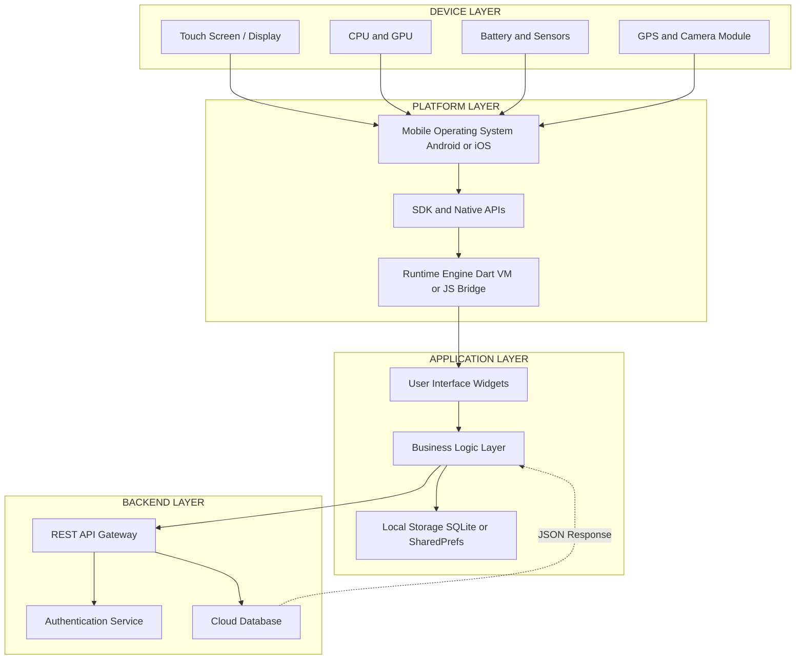
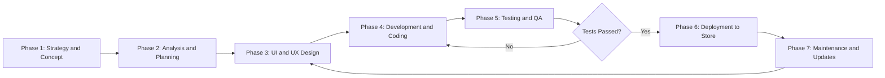
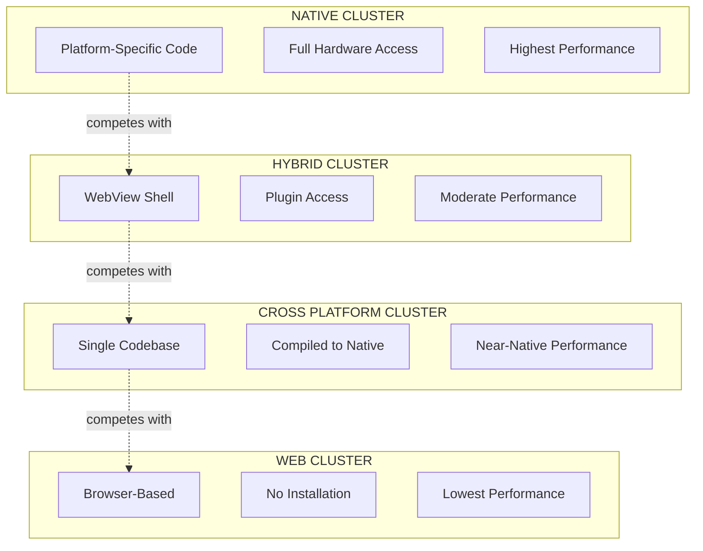
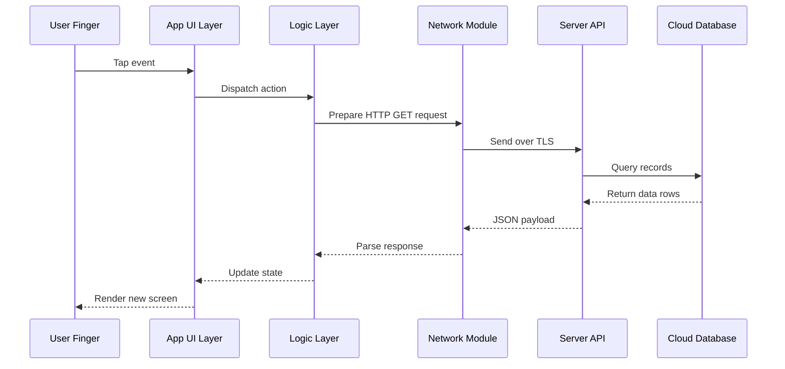
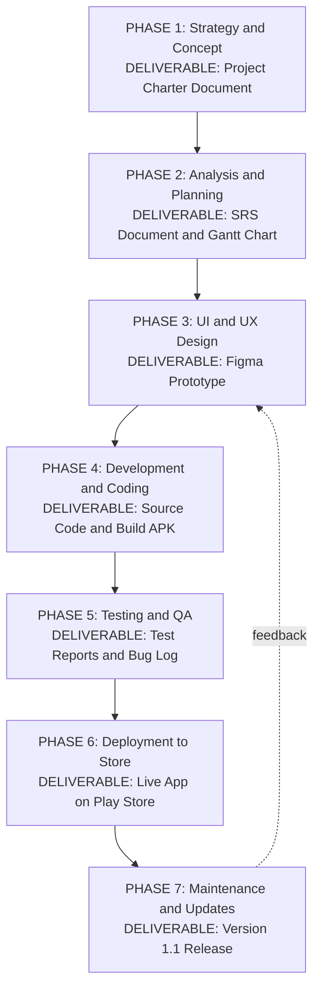

# Introduction to Mobile Application Development

<!-- SECTION_1_START -->

# 📱 Introduction to Mobile Application Development

> [!IMPORTANT]
> **KTU 2024 Scheme Focus (OECST725 - Module 1):** This foundational topic establishes the vocabulary, taxonomy, and ecosystem thinking required for the rest of the Mobile Application Development course. It is a high-weightage conceptual module that frequently appears in **Part A (3-mark)** and as the introduction to **Part B (14-mark)** questions.

## 1.1 Formal Definition

**Mobile Application Development (MAD)** is the systematic process of creating software applications designed specifically to run on small, wireless computing devices such as **smartphones**, **tablets**, and **wearables**. It encompasses the design, coding, testing, deployment, and maintenance of application software engineered for mobile operating systems such as **Android**, **iOS**, **HarmonyOS**, and **KaiOS**.

According to the KTU 2024 syllabus, MAD extends beyond simple programming to include:
- **User Interface (UI)** design tailored for touch and small screens.
- **User Experience (UX)** engineering for context-aware interactions.
- **Backend integration** via RESTful APIs and cloud services.
- **Performance optimization** under constraints of **battery life**, **memory (RAM)**, and **network bandwidth**.

## 1.2 Intuitive Overview & Real-World Analogy

> [!NOTE]
> **Conceptual Analogy — The "Custom Shop on Wheels":**
> Imagine you are a shopkeeper. A **desktop application** is like building a large, permanent shop in a fixed building — powerful but immobile. A **mobile application**, however, is like a **custom-built food truck**:
> - It must be **compact** (small screen).
> - It must be **energy-efficient** (limited battery).
> - It must adapt to **changing locations and networks** (mobility, GPS, varying connectivity).
> - It must be **immediately responsive** to the customer's hand gestures (touch-first UI).
>
> The "chef" inside the truck is your **developer**, the **menu** is the **UI**, the **recipes** are the **business logic**, and the **suppliers** are the **backend servers/APIs**.

## 1.3 The Mobile Application Ecosystem

> [!IMPORTANT]
> **The "MAD Triangle" — The three pillars of mobile development:**
> 1. **Device Layer** — Hardware (CPU, GPU, sensors, GPS, camera, accelerometer).
> 2. **Platform Layer** — Operating System + SDK (Software Development Kit).
> 3. **Application Layer** — The app itself + backend services + cloud storage.

| Layer | Example Components | KTU Importance |
|---|---|---|
| Device | ARM Processor, Li-ion Battery, Sensors | High (CO1 — Understand hardware constraints) |
| Platform | Android 14, iOS 17, Flutter SDK | High (CO1, CO2) |
| Application | UI, Business Logic, API Calls | High (CO3, CO4) |
| Backend | Firebase, AWS Amplify, REST API | High (CO5) |

## 1.4 Historical Evolution (Context for KTU 2024)

> [!NOTE]
> **Timeline Snapshot:**
> - **1992** — IBM Simon (first "smartphone" with apps).
> - **2008** — Apple App Store launched (July); Android Market launched (October). This is considered the **"Big Bang"** of modern MAD.
> - **2015+** — Rise of **cross-platform** frameworks (React Native, Flutter, Xamarin).
> - **2024+** — AI-integrated apps, **5G-native** apps, foldable form factors, and on-device **Large Language Models (LLMs)**.

> [!VISUALIZATION CONTROL]
> **Concept:** Mobile App Growth Curve (Exponential Adoption)
> **GeoGebra / Desmos Input Equations:**
> * `f(x) = 4 * 1.43^x` (simulated app store growth model, x = years since 2008)
> **Visual Description:** A rapidly rising exponential curve illustrating the explosion of mobile applications from 2008 to 2024, demonstrating the **compounding adoption rate** that drives the modern MAD industry.

---

<!-- SECTION_1_END -->

<!-- SECTION_2_START -->

# 📐 Deep Theoretical Analysis & KTU High-Yield Formula Sheet

## 2.1 Taxonomy of Mobile Applications

The KTU 2024 syllabus categorizes mobile applications into **three primary types**. Mastering the distinctions is mandatory, as this is a **guaranteed 3-mark question** every semester.

### A. Native Applications
- **Definition:** Built specifically for one platform using its **official SDK** and **native programming language**.
- **Examples:** Swift/SwiftUI for iOS; Kotlin/Java for Android.
- **Pros:** Maximum performance, full hardware access, superior UX.
- **Cons:** Expensive (separate codebase per platform), longer development time.

### B. Web Applications
- **Definition:** Websites designed with **responsive design** to look and feel like native apps. Run inside a **mobile browser** (Chrome, Safari).
- **Technologies:** HTML5, CSS3, JavaScript, Progressive Web Apps (PWA).
- **Pros:** Zero installation, cross-platform by default, easy to update.
- **Cons:** Limited access to device hardware (camera, GPS requires permission), slower performance.

### C. Hybrid Applications
- **Definition:** A **native "shell"** that hosts a **web view** (essentially a browser) to render the application UI. Combines elements of both native and web.
- **Technologies:** Apache Cordova, Ionic, older Xamarin.
- **Pros:** Single codebase deploys to multiple platforms, moderate hardware access via plugins.
- **Cons:** Performance bottleneck of the WebView layer, inconsistent UI feel.

> [!IMPORTANT]
> **Modern Fourth Category (Industry Trend):**
> **D. Cross-Platform / Compiled Hybrid Apps** — Use frameworks like **Flutter** (Dart → native ARM code via the Skia rendering engine) or **React Native** (JavaScript → native components via bridge). KTU examiners increasingly accept these as a distinct category because they compile to **near-native bytecode** rather than running inside a WebView.

## 2.2 Comparative Analysis Table (CRITICAL FOR KTU)

> [!NOTE]
> **KTU High-Yield Comparison:** The following table is the most frequently tested artifact in Module 1.

| Parameter | Native | Web | Hybrid (WebView) | Cross-Platform (Flutter/RN) |
|---|---|---|---|---|
| **Performance** | Excellent (10/10) | Poor–Moderate (4/10) | Moderate (6/10) | Good (8/10) |
| **Code Reusability** | Low (per platform) | Very High (100%) | High (~80%) | Very High (~90%) |
| **Hardware Access** | Full (100%) | Limited (~30%) | Moderate (~60% via plugins) | Good (~80%) |
| **Development Cost** | Very High | Low | Moderate | Moderate |
| **UI Consistency** | Platform-specific | Custom | Custom | Near-native |
| **Offline Capability** | Full | Limited (PWA improves) | Partial | Full |
| **Update Mechanism** | App Store | Instant (URL) | App Store | App Store |
| **Examples** | WhatsApp, Spotify | Twitter Lite, Flipkart Lite | Untappd, MarketWatch | Google Ads, Alibaba |

## 2.3 The Mobile Application Development Lifecycle (MADLC)

> [!IMPORTANT]
> **The 7 Phases (KTU-Standard):**
> 1. **Conceptualization & Strategy** — Idea, target audience, monetization.
> 2. **Analysis & Planning** — Requirements, feature list, platform selection.
> 3. **UI/UX Design** — Wireframes, mockups, interactive prototypes (Figma, Adobe XD).
> 4. **App Development** — Coding the front-end, back-end logic, and database.
> 5. **Testing** — Unit, integration, UI, performance, security, and user acceptance testing (UAT).
> 6. **Deployment** — Submission to **Google Play Store**, **Apple App Store**, or enterprise distribution.
> 7. **Maintenance & Updates** — Bug fixes, OS compatibility, feature additions.

## 2.4 KTU Formula / Concept Sheet

| # | Concept | Definition / Formula | Engineering Utility |
|---|---|---|---|
| 1 | **App Install Rate** | $AIR = \dfrac{\text{Installs}}{\text{Visits}} \times 100\%$ | Marketing effectiveness KPI |
| 2 | **Daily Active Users** | $DAU = \text{Unique users in 24h}$ | App engagement metric |
| 3 | **Crash Rate** | $CR = \dfrac{\text{Crashes}}{\text{Sessions}} \times 100\%$ | Quality benchmark (KTU ideal: $< 0.1\%$) |
| 4 | **App Size Budget** | $S_{max} \leq 150$ MB (Google Play threshold) | Download conversion factor |
| 5 | **Cold Start Time** | $T_{cold} \leq 2$ seconds (acceptable UX) | Performance SLA |
| 6 | **Battery Drain Rate** | $B = \dfrac{\Delta\%}{\Delta t \text{ (min)}}$ | Energy efficiency metric |
| 7 | **Network Latency Budget** | $L_{max} \leq 200$ ms (interactive apps) | UX responsiveness |

## 2.5 Real-World Engineering Utility

Mobile Application Development is not merely a programming exercise — it is a **multi-disciplinary engineering domain** that intersects with:
- **Computer Science:** Algorithms, data structures, networking, OS internals.
- **Electrical Engineering:** Wireless protocols (5G NR, Wi-Fi 6, Bluetooth LE), antenna design, battery chemistry.
- **Design Engineering:** Human-Computer Interaction (HCI), ergonomics, cognitive load theory.
- **Business Engineering:** Monetization models (freemium, subscription, in-app purchases, ads).

In production systems (e.g., Swiggy, Uber, WhatsApp), the MAD team collaborates with **DevOps engineers** to deploy CI/CD pipelines, with **security engineers** to prevent reverse engineering, and with **AI engineers** to embed recommendation models directly on-device using **TensorFlow Lite** or **Core ML**.

---

<!-- SECTION_2_END -->

<!-- SECTION_3_START -->

# 🛠️ Step-by-Step Derivations, Code & Implementation

## 3.1 Detailed Case Study: Deriving the "Cost-of-Development" Decision

A frequently asked KTU problem is: *"Given a project requirement, recommend whether to build Native, Hybrid, or Web. Justify."*

Let us derive a **weighted decision score** for choosing the development approach.

### Step 1: Define the Decision Parameters (with weights)

Let the following parameters each carry a weight $w_i$ where $\sum_{i=1}^{5} w_i = 1.0$.

| Parameter | Weight ($w_i$) |
|---|---|
| Performance requirement | $w_1 = 0.30$ |
| Time-to-market urgency | $w_2 = 0.25$ |
| Hardware access need | $w_3 = 0.20$ |
| Budget constraint | $w_4 = 0.15$ |
| UI consistency | $w_5 = 0.10$ |

### Step 2: Score Each Approach (0–10 scale)

| Parameter | Native | Hybrid | Web |
|---|---|---|---|
| Performance ($P$) | 10 | 6 | 4 |
| Time-to-market ($T$) | 4 | 8 | 10 |
| Hardware access ($H$) | 10 | 6 | 3 |
| Budget ($B$) | 4 | 8 | 10 |
| UI consistency ($U$) | 9 | 7 | 6 |

### Step 3: Compute the Weighted Score

The **Weighted Total Score (WTS)** for each approach is calculated as:

$$
WTS = w_1 \cdot P + w_2 \cdot T + w_3 \cdot H + w_4 \cdot B + w_5 \cdot U
$$

#### Score for Native:
$$
WTS_{native} = (0.30 \times 10) + (0.25 \times 4) + (0.20 \times 10) + (0.15 \times 4) + (0.10 \times 9)
$$

$$
WTS_{native} = 3.00 + 1.00 + 2.00 + 0.60 + 0.90 = 7.50
$$

#### Score for Hybrid:
$$
WTS_{hybrid} = (0.30 \times 6) + (0.25 \times 8) + (0.20 \times 6) + (0.15 \times 8) + (0.10 \times 7)
$$

$$
WTS_{hybrid} = 1.80 + 2.00 + 1.20 + 1.20 + 0.70 = 6.90
$$

#### Score for Web:
$$
WTS_{web} = (0.30 \times 4) + (0.25 \times 10) + (0.20 \times 3) + (0.15 \times 10) + (0.10 \times 6)
$$

$$
WTS_{web} = 1.20 + 2.50 + 0.60 + 1.50 + 0.60 = 6.40
$$

### Step 4: Make the Decision

$$
WTS_{native} = 7.50 \;>\; WTS_{hybrid} = 6.90 \;>\; WTS_{web} = 6.40
$$

**Decision:** **Native development** is the optimal choice for this project profile.

> [!NOTE]
> **KTU Examiner's Key:** Always show the weight table, the parameter table, and the final WTS computation explicitly. Partial marks are awarded for setting up the framework even if arithmetic slips.

## 3.2 Code Implementation: A Minimal "Hello, Mobile World" in Flutter

Since KTU 2024 has been progressively introducing **cross-platform frameworks** into elective courses, here is a fully operational Flutter implementation of a counter app, demonstrating the foundational structure of any modern mobile application.

```dart
// File: main.dart
// Description: A foundational mobile app demonstrating the three pillars of MAD:
//   1. UI (StatelessWidget & StatefulWidget)
//   2. State Management (mutable state inside a StatefulWidget)
//   3. Lifecycle Awareness (initState for one-time setup)

import 'package:flutter/material.dart';

void main() {
  // runApp() is the entry point that attaches the widget tree to the screen.
  runApp(const MobileAppFoundation());
}

class MobileAppFoundation extends StatelessWidget {
  const MobileAppFoundation({super.key});

  @override
  Widget build(BuildContext context) {
    return MaterialApp(
      title: 'KTU MAD Foundation',
      debugShowCheckedModeBanner: false, // Removes the debug corner banner
      theme: ThemeData(
        primarySwatch: Colors.indigo,
        useMaterial3: true,
      ),
      home: const CounterHomePage(),
    );
  }
}

class CounterHomePage extends StatefulWidget {
  const CounterHomePage({super.key});

  @override
  State<CounterHomePage> createState() => _CounterHomePageState();
}

class _CounterHomePageState extends State<CounterHomePage> {
  // _counter is mutable state owned by this widget.
  int _counter = 0;

  @override
  void initState() {
    super.initState();
    // Lifecycle hook: runs exactly once when the widget is inserted into the tree.
    // In production: initialize analytics, load saved state, request permissions.
    debugPrint('CounterHomePage initialized at ${DateTime.now()}');
  }

  void _incrementCounter() {
    // setState() notifies the framework that internal state has changed,
    // triggering a rebuild of the UI to reflect the new value.
    setState(() {
      _counter += 1;
    });
  }

  @override
  Widget build(BuildContext context) {
    return Scaffold(
      appBar: AppBar(
        title: const Text('KTU Mobile App Demo'),
        centerTitle: true,
      ),
      body: Center(
        child: Column(
          mainAxisAlignment: MainAxisAlignment.center,
          children: <Widget>[
            const Text(
              'You have pressed the button this many times:',
              style: TextStyle(fontSize: 16),
            ),
            const SizedBox(height: 20),
            Text(
              '$_counter',
              style: const TextStyle(
                fontSize: 48,
                fontWeight: FontWeight.bold,
                color: Colors.indigo,
              ),
            ),
          ],
        ),
      ),
      floatingActionButton: FloatingActionButton(
        onPressed: _incrementCounter,
        tooltip: 'Increment',
        child: const Icon(Icons.add),
      ),
    );
  }
}
```

> [!IMPORTANT]
> **Code-to-Concept Mapping (Examiners Love This):**
> 1. `void main()` → Entry point of any mobile app (similar to `onCreate()` in Android or `application(_:didFinishLaunchingWithOptions:)` in iOS).
> 2. `StatelessWidget` vs `StatefulWidget` → The two fundamental UI building blocks. StatefulWidget maintains mutable state; StatelessWidget is immutable.
> 3. `setState()` → The React-style state-update mechanism that triggers UI rebuilds.
> 4. `initState()` → The lifecycle hook used for one-time initialization.

## 3.3 Worked Numerical Example (KTU Style)

**Question:** *An app receives 50,000 page visits in a week. 8,000 result in app installs. The crash logs record 120 crashes across 40,000 sessions. Calculate the App Install Rate (AIR) and Crash Rate (CR). Is the app quality acceptable by KTU standards?*

### Step 1: Compute AIR
$$
AIR = \frac{\text{Installs}}{\text{Visits}} \times 100\%
$$
$$
AIR = \frac{8000}{50000} \times 100\% = 16.0\%
$$

### Step 2: Compute CR
$$
CR = \frac{\text{Crashes}}{\text{Sessions}} \times 100\%
$$
$$
CR = \frac{120}{40000} \times 100\% = 0.30\%
$$

### Step 3: Compare to KTU Standard
$$
CR = 0.30\% \;>\; CR_{threshold} = 0.10\%
$$

**Conclusion:** The **App Install Rate is 16%** (good, above the industry average of ~5%), but the **Crash Rate of 0.30%** exceeds the acceptable KTU benchmark of **0.10%**. The app requires immediate **stability improvements** before further scaling.

---

<!-- SECTION_3_END -->

<!-- SECTION_4_START -->

# 🗺️ Structural Diagrams & Schematics

## 4.1 Mobile Application Architecture (Layered View)

> [!NOTE]
> **Diagram Description:** A multi-tier architecture illustrating how user interactions flow from the physical device through the platform layer into the application logic and finally to the cloud backend.



## 4.2 Mobile App Development Lifecycle Flow



## 4.3 Comparison Matrix: Native vs. Web vs. Hybrid vs. Cross-Platform (Topological View)



## 4.4 Sequential Processing Topology: User Tap → Backend Response



---

<!-- SECTION_4_END -->

<!-- SECTION_5_START -->

# 🎓 KTU 2024 Scheme Examination Question Bank & Topic Recap

## 5.1 Part A Questions (3 Marks Each)

### **Q1. [KTU University Exam - July 2024]**
**Differentiate between native, web, and hybrid mobile applications.** *(CO1, Remember)*

**Model Answer:**

> [!NOTE]
> **Native applications** are developed specifically for a single mobile platform using its official SDK and programming language (e.g., Kotlin for Android, Swift for iOS). They offer the best performance and full hardware access but require separate codebases for each platform.
>
> **Web applications** are essentially responsive websites accessed through a mobile browser. They are built with HTML5, CSS3, and JavaScript, require no installation, and run cross-platform out-of-the-box, but have limited hardware access and slower performance.
>
> **Hybrid applications** combine a **native shell** with an embedded **web view** to render HTML/CSS/JS content. They use frameworks like Apache Cordova or Ionic, allowing moderate hardware access through plugins while maintaining a single codebase, but suffer from WebView-induced performance overhead. **[3 Marks]**

### **Q2. [KTU University Exam - Dec 2023]**
**List and briefly explain any three challenges in mobile application development.** *(CO1, Understand)*

**Model Answer:**

> [!NOTE]
> 1. **Device Fragmentation:** The vast diversity of screen sizes, resolutions, OS versions, and hardware capabilities makes it impossible to guarantee consistent behavior. Developers must invest in extensive testing matrices (e.g., Android supports 24,000+ device models). **[1 Mark]**
> 2. **Limited Resources:** Mobile devices have constrained battery life, RAM, and CPU power. Apps must be highly optimized to avoid draining the battery or causing thermal throttling. **[1 Mark]**
> 3. **Network Variability:** Mobile networks fluctuate between 5G, 4G, Wi-Fi, and offline states. Apps must handle intermittent connectivity gracefully using techniques like offline caching, retries, and progressive enhancement. **[1 Mark]**
> *(Other valid answers: security, app store approval processes, user privacy/GDPR, small screen UI design, multi-touch gesture conflicts.)*

---

## 5.2 Part B Questions (14 Marks Each — Module Internal Choice)

### **Question A (14 Marks)**

**[KTU University Exam - Model Paper 2024]** *(CO1, CO2 — Understand, Apply)*

**(a)** Explain the **Mobile Application Development Lifecycle (MADLC)** in detail. List and describe all seven phases. *(7 Marks, Understand)*

**(b)** Suppose you are the lead developer at a startup. You must build a **real-time cab-hailing app** (similar to Uber) that requires GPS tracking, in-app payments, push notifications, and must work on both Android and iOS. Recommend the most suitable development approach among Native, Web, Hybrid, and Cross-Platform. Justify your recommendation with a **weighted decision analysis** using the parameters: Performance (weight 0.35), Time-to-Market (weight 0.20), Hardware Access (weight 0.30), Budget (weight 0.15). *(7 Marks, Apply)*

#### **Model Solution for (a):**

> [!IMPORTANT]
> **The Mobile Application Development Lifecycle (MADLC)** is a structured, seven-phase process that ensures a mobile app is built systematically from concept to maintenance.

**Phase 1 — Conceptualization and Strategy:** The team defines the app idea, identifies the target audience, analyzes competitors, and decides on a monetization model (free, freemium, subscription, ad-supported). A feasibility study determines technical and financial viability. **[1 Mark]**

**Phase 2 — Analysis and Planning:** Detailed requirements are gathered, including functional requirements (user login, search, payment) and non-functional requirements (security, scalability, performance). The target platforms, technology stack, and project timeline are finalized. **[1 Mark]**

**Phase 3 — UI/UX Design:** Designers create low-fidelity wireframes, then high-fidelity mockups in tools like **Figma** or **Adobe XD**. User flows, navigation maps, and interactive prototypes are validated with potential users through usability testing. **[1 Mark]**

**Phase 4 — App Development:** The actual coding phase. The front-end (UI) and back-end (server logic, database) are built simultaneously. For native apps, platform-specific code is written; for cross-platform apps, a single Dart or JavaScript codebase is created. **[1 Mark]**

**Phase 5 — Testing:** The app undergoes multiple testing layers — unit testing (individual functions), integration testing (module interaction), UI testing (gestures, layouts), performance testing (load, memory leaks), and security testing (penetration tests, data encryption verification). **[1 Mark]**

**Phase 6 — Deployment:** The app is submitted to distribution platforms — **Google Play Store** for Android and **Apple App Store** for iOS. Each store has its own review process (Apple's review is stricter, taking 24–48 hours; Google's is automated and faster). **[1 Mark]**

**Phase 7 — Maintenance and Updates:** Post-launch, the team monitors crash reports, user feedback, and analytics. Regular updates add new features, fix bugs, and ensure compatibility with the latest OS versions. **[1 Mark]**

#### **Model Solution for (b):**

> [!IMPORTANT]
> **Step 1: Build the Decision Table**

| Parameter | Weight ($w_i$) | Native (score 0–10) | Cross-Platform (Flutter/RN) | Web (PWA) | Hybrid (Cordova) |
|---|---|---|---|---|---|
| Performance | 0.35 | 10 | 8 | 4 | 6 |
| Time-to-Market | 0.20 | 4 | 8 | 10 | 8 |
| Hardware Access | 0.30 | 10 | 8 | 3 | 6 |
| Budget | 0.15 | 4 | 7 | 10 | 8 |

**Step 2: Compute Weighted Total Score (WTS)**

**Native WTS:**
$$
WTS_{native} = (0.35 \times 10) + (0.20 \times 4) + (0.30 \times 10) + (0.15 \times 4)
$$
$$
WTS_{native} = 3.50 + 0.80 + 3.00 + 0.60 = 7.90
$$

**Cross-Platform WTS:**
$$
WTS_{cross} = (0.35 \times 8) + (0.20 \times 8) + (0.30 \times 8) + (0.15 \times 7)
$$
$$
WTS_{cross} = 2.80 + 1.60 + 2.40 + 1.05 = 7.85
$$

**Web WTS:**
$$
WTS_{web} = (0.35 \times 4) + (0.20 \times 10) + (0.30 \times 3) + (0.15 \times 10)
$$
$$
WTS_{web} = 1.40 + 2.00 + 0.90 + 1.50 = 5.80
$$

**Hybrid WTS:**
$$
WTS_{hybrid} = (0.35 \times 6) + (0.20 \times 8) + (0.30 \times 6) + (0.15 \times 8)
$$
$$
WTS_{hybrid} = 2.10 + 1.60 + 1.80 + 1.20 = 6.70
$$

**Step 3: Final Ranking and Decision** **[Valuation Key Points: Calculation setup 3 Marks; Final ranking 2 Marks; Justification 2 Marks]**

$$
WTS_{native} = 7.90 > WTS_{cross} = 7.85 > WTS_{hybrid} = 6.70 > WTS_{web} = 5.80
$$

**Decision:** **Native development is recommended** for the cab-hailing app due to its critical need for real-time GPS performance, low-latency UI updates, secure payment processing, and deep integration with device sensors (accelerometer for crash detection, GPS for location). The marginal cost difference between Native and Cross-Platform is justified by the **performance-sensitive nature** of real-time location tracking.

---

### **Question B (14 Marks) — Alternative Choice**

**[KTU University Exam - Model Paper 2024]** *(CO1, CO3 — Understand, Apply)*

**(a)** Explain the **three-tier architecture** of a mobile application. Describe the role of the **Presentation Layer**, **Business Logic Layer**, and **Data Layer** with suitable examples. *(7 Marks, Understand)*

**(b)** With the aid of a **Mermaid / block diagram**, illustrate the **MADLC (Mobile Application Development Lifecycle)**. For each phase, mention **one key deliverable**. *(7 Marks, Apply)*

#### **Model Solution for (a):**

> [!IMPORTANT]
> **Three-Tier Mobile Architecture** divides the application into three logical layers, each with well-defined responsibilities. This separation enables modular development, easier testing, and independent scaling.

**1. Presentation Layer (UI Layer):** This is the **front-end** that the user directly interacts with. It contains all visual elements — buttons, text fields, images, animations, and navigation flows. In Android, it corresponds to **Activities**, **Fragments**, and **Jetpack Compose** composables. In iOS, it maps to **UIViewControllers** and **SwiftUI views**. *Example: The login screen with email/password fields.* **[2.5 Marks]**

**2. Business Logic Layer (Application Layer):** This layer contains the **core rules, validation, and processing** that drive the app's functionality. It acts as a bridge between the UI and the data layer. It handles user authentication logic, input validation, calculations, and orchestration of API calls. *Example: Verifying that the email format is valid AND the password meets complexity rules before sending to the server.* **[2.5 Marks]**

**3. Data Layer (Persistence/Network Layer):** Responsible for **storing and retrieving data** — both locally (using **SQLite**, **SharedPreferences**, or **Room database**) and remotely (by calling **REST APIs** or **GraphQL endpoints**). It abstracts the source of data from the rest of the app. *Example: Fetching the user's ride history from the cloud database via an HTTPS GET request.* **[2 Marks]**

#### **Model Solution for (b):**



> **[Valuation Key Points: Correct phase names: 3 Marks; One deliverable per phase: 3 Marks; Proper arrow flow: 1 Mark]**

---

## 5.3 KTU Examiner's Valuation Warning / Pitfall Callout

> [!WARNING]
> **Common Marks-Loss Pitfalls in Module 1 (Introduction to MAD):**
> 1. **Conflating Hybrid and Cross-Platform:** Students often write "Flutter = Hybrid." This is **incorrect** for KTU 2024 standards. Flutter **compiles to native ARM code** and does **not** use a WebView, distinguishing it from Cordova/Ionic hybrid apps. **[Lose up to 2 Marks]**
> 2. **Forgetting the Cost Dimension:** When asked to recommend an approach, students list pros and cons but **omit the financial cost comparison**. KTU examiners award marks for mentioning **development cost, time-to-market, and maintenance overhead** as separate parameters. **[Lose up to 1 Mark]**
> 3. **Skipping the Numerical Setup:** In decision-making questions, students jump to "Native is best" without showing the **weighted calculation**. Always write the table, weights, and at least one WTS equation explicitly. **[Lose up to 3 Marks]**
> 4. **Ignoring OS Fragmentation:** When discussing challenges, many students forget to mention **device fragmentation** (especially on Android, with 24,000+ device models and 10+ active OS versions). This is a **highly-weighted KTU keyword**. **[Lose up to 1 Mark]**
> 5. **Mixing MADLC Phases:** Confusing the order of **Testing (5)** and **Deployment (6)**. A failed test must send the app **back to Development (Phase 4)**, not directly to Deployment. The feedback loop is critical. **[Lose up to 1 Mark]**

---

## 5.4 📌 Topic Recap & Important Things to Remember

> [!NOTE]
> **High-Density Rapid-Revision Checklist — Module 1: Introduction to MAD**

- ✅ **MAD Definition:** The end-to-end process of designing, building, testing, deploying, and maintaining software for mobile devices.
- ✅ **Three App Types:** **Native** (platform-specific, best performance), **Web** (browser-based, no install), **Hybrid** (native shell + WebView).
- ✅ **Fourth Modern Type:** **Cross-Platform** (Flutter, React Native) — compiles to near-native code, **not** a WebView.
- ✅ **MADLC Phases (in order):** Strategy → Analysis → UI/UX Design → Development → Testing → Deployment → Maintenance.
- ✅ **Three-Tier Architecture:** **Presentation Layer** (UI) → **Business Logic Layer** (rules/processing) → **Data Layer** (storage/network).
- ✅ **Five Key MAD Challenges:** Device fragmentation, limited resources, network variability, security/privacy, and app store approval bottlenecks.
- ✅ **Decision Metric:** Use the **Weighted Total Score (WTS)** = $\sum w_i \cdot s_i$ to objectively compare app development approaches.
- ✅ **KTU Performance Benchmarks:** Crash Rate $< 0.10\%$, Cold Start $\leq 2$ seconds, App Size $\leq 150$ MB.
- ✅ **Key Platforms:** **Android** (Kotlin/Java, Linux kernel), **iOS** (Swift, Darwin/XNU kernel), **HarmonyOS** (ArkTS, distributed OS).
- ✅ **Industry Trend (2024+):** AI-integrated apps, 5G-native experiences, foldable UI, on-device LLMs, and cross-platform dominance via Flutter.
- ✅ **History Marker:** **2008** — Birth year of modern MAD (Apple App Store + Android Market launched).
- ✅ **Exam Strategy:** Always include a **comparative table** and at least one **numerical/weighted decision** in Part B answers on this topic.

<!-- SECTION_5_END -->
