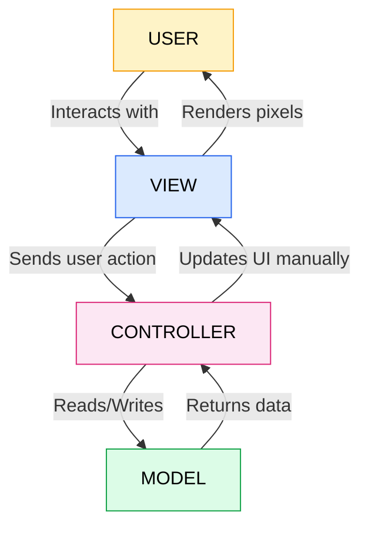
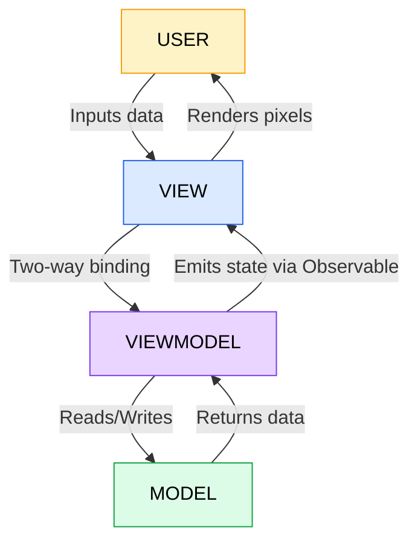
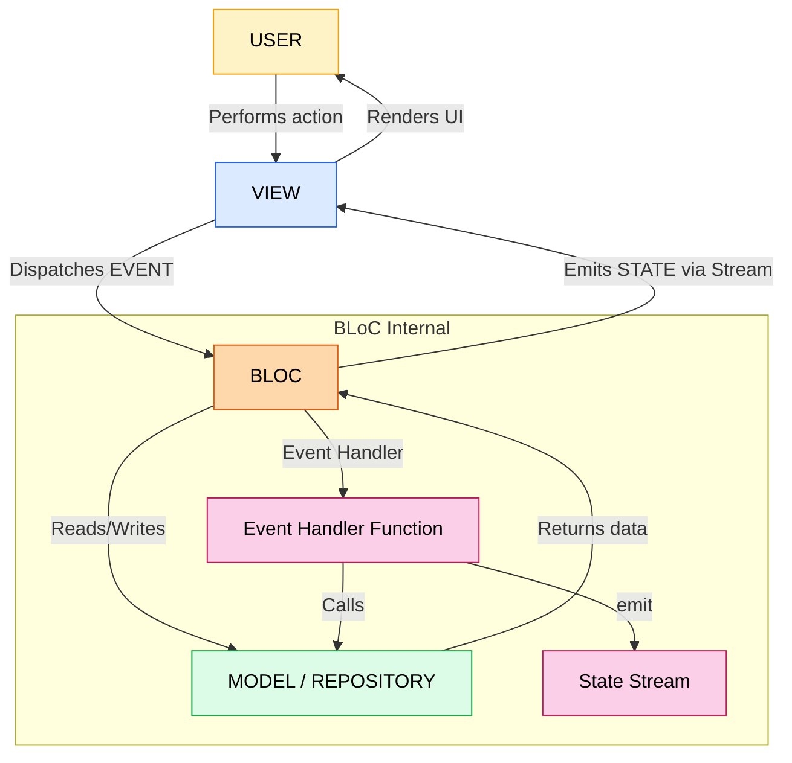
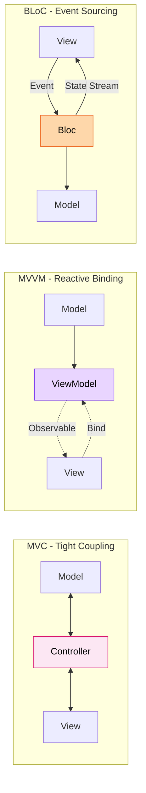
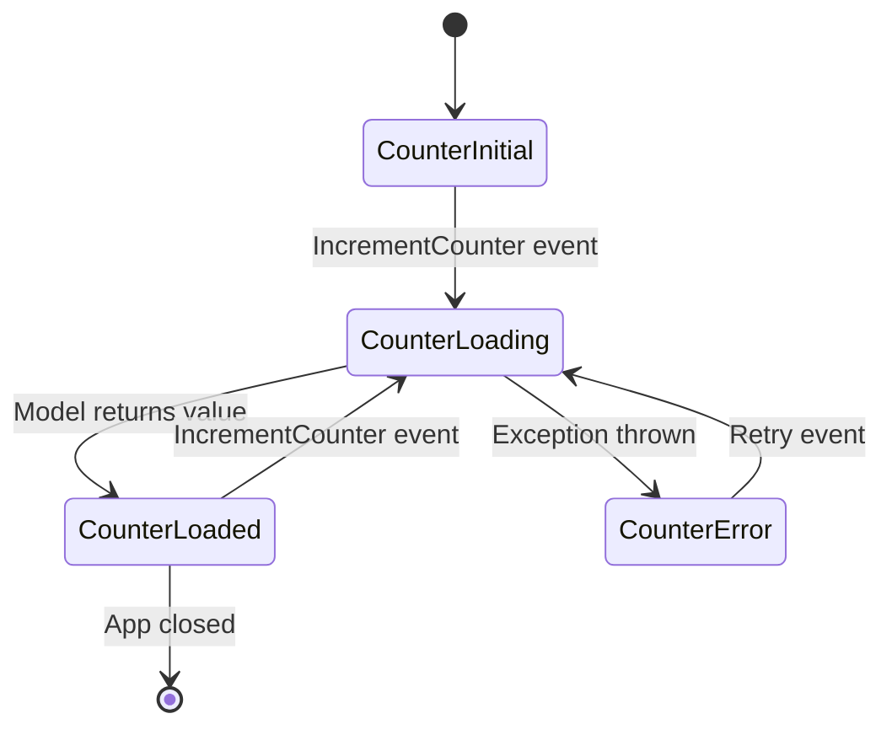

# Mobile App Architectures (MVC, MVVM, and BLoC)

<!-- SECTION_1_START -->
# Mobile App Architectures (MVC, MVVM, and BLoC)

## 1.1 What is a Mobile App Architecture?

A **Mobile App Architecture** is a structural pattern that defines the organization of code, the separation of concerns, and the flow of data between the user interface, business logic, and data layer of a mobile application. In the KTU 2024 syllabus context, the three most critical architectural patterns for cross-platform mobile development (especially Flutter) are **MVC**, **MVVM**, and **BLoC**.

> [!IMPORTANT]
> **KTU 2024 Syllabus Highlight (OECST725 - Module 1):**
> Mobile app architectures are foundational to the course. Students must be able to differentiate, implement, and justify the choice of architecture based on app complexity, team size, and maintainability requirements.

### Real-World Analogy: The Restaurant Kitchen

Imagine a restaurant:
- **Menu (View)** — What the customer sees and interacts with.
- **Chef (Controller / ViewModel / BLoC)** — Takes the order, decides how to prepare it, and orchestrates the process.
- **Pantry/Ingredients (Model)** — The actual data and storage (raw materials used to prepare the dish).

The architecture pattern simply defines **who communicates with whom** and **how responsibilities are divided** between these three roles.

> [!NOTE]
> **Core Definition (KTU Board Standard):**
> A software architectural pattern provides a template for the structure of an application by prescribing the responsibilities and interactions of its primary components: **Model**, **View**, and the mediating layer (Controller / ViewModel / BLoC).

---

## 1.2 The Three Core Components (Universal to All Patterns)

| Component | Role | Mobile Equivalent |
|---|---|---|
| **Model** | Holds data, business rules, and persistence logic. Knows nothing about UI. | Database (SQLite, Firebase), API client, domain entities. |
| **View** | The visual layer the user interacts with. Should be "dumb" — no logic. | Widget tree in Flutter, XML layouts in Android, Storyboards in iOS. |
| **Mediator** | Coordinates Model & View. Processes input, updates state, decides what to display. | Controller (MVC), ViewModel (MVVM), BLoC/Cubit (BLoC). |

---

## 1.3 MVC — Model-View-Controller

### Formal Definition
**MVC** is a classical architectural pattern that divides an application into three interconnected components. The **Controller** acts as an intermediary that receives user input from the View, processes it (often by manipulating the Model), and updates the View accordingly.

### Intuitive Analogy: The TV Remote System
- **View** = The TV screen (displays content).
- **Controller** = The remote control (receives user button presses, tells the TV what to do).
- **Model** = The internal circuitry & channels of the TV (the actual data/state).

When you press a button (input), the **remote (Controller)** doesn't change the screen directly; it tells the **TV internals (Model)** to change, and the **screen (View)** updates because of that change.

> [!NOTE]
> **MVC in Mobile Context:** In Android (Java/Kotlin), Activities/Fragments often act as both View and Controller, which is why pure MVC is **rarely used as-is** in modern mobile development — it tends to bloat the controller.

---

## 1.4 MVVM — Model-View-ViewModel

### Formal Definition
**MVVM** introduces a **ViewModel** that exposes data streams (often observable) directly consumable by the View. The View binds to the ViewModel, and the ViewModel holds the presentation logic and references the Model. Critically, the ViewModel **does not hold a reference to the View**, enabling a clean separation and excellent testability.

### Intuitive Analogy: The Smart Home Dashboard
- **View** = The wall-mounted display panel (just shows readings).
- **ViewModel** = The brain/processor inside the panel (calculates, transforms, prepares data for display).
- **Model** = The sensors around the house (temperature, motion, etc.).

The display (View) automatically updates whenever the brain (ViewModel) gets new sensor (Model) readings. The display **never asks** the brain for data — it just listens.

> [!IMPORTANT]
> **MVVM in Mobile Context:** This is the **recommended pattern by Google** for Android development using Jetpack components (LiveData, ViewModel, StateFlow). In Flutter, it is implemented using `ChangeNotifier` + `Provider` or `ValueListenableBuilder`.

---

## 1.5 BLoC — Business Logic Component

### Formal Definition
**BLoC** (Business Logic Component), popularized by Google for Flutter, is a reactive architectural pattern that uses **streams** (or `StreamController` in Dart) to manage state. UI components send **events** to the BLoC, which converts them into **states** emitted via streams that the UI listens to.

### Intuitive Analogy: The Vending Machine
- **View** = The buttons and display screen of the vending machine.
- **BLoC** = The internal logic board (decides: if button A1 pressed AND money inserted AND item in stock → dispense).
- **Model** = The stock inventory and coin mechanism.
- **Event** = The button press (user intent).
- **State** = The display showing "Dispensing Coke..." or "Out of stock".

The display (View) **emits** events, the BLoC **processes** them, and emits new states that the display **listens to** and renders.

> [!NOTE]
> **BLoC in Mobile Context:** BLoC is built on top of **Reactive Extensions (Rx)** principles and uses pure Dart streams. The `flutter_bloc` package is the de-facto implementation. It enforces unidirectional data flow and makes state changes predictable and traceable.

---

## 1.6 Quick Mental Map for Exams

| Pattern | Mediator Name | Data Flow | Best For |
|---|---|---|---|
| MVC | Controller | Bidirectional (often) | Small apps, learning, server-side |
| MVVM | ViewModel | Reactive binding | Medium apps, testable UI logic |
| BLoC | BLoC / Cubit | Event → State (Streams) | Large apps, complex state, teams |

> [!VISUALIZATION CONTROL]
> **Concept:** Conceptual Flow of Data in Each Architecture
> **GeoGebra / Desmos Input Equations:**
> * No mathematical equations apply here; this is a software architecture concept.
> **Visual Description:** Picture three vertical columns labeled **Model**, **Mediator**, and **View**. For MVC, draw bidirectional arrows between all three (chaotic, tight coupling). For MVVM, draw a one-way reactive arrow from ViewModel to View, and a separate one-way arrow from Model to ViewModel (clean, decoupled). For BLoC, draw a single **downward arrow** labeled "Events" from View to BLoC, and a single **upward arrow** labeled "States" from BLoC to View, with BLoC talking to Model on the side (unidirectional, predictable).

---

<!-- SECTION_1_END -->

<!-- SECTION_2_START -->
# Deep Theoretical Analysis & KTU High-Yield Cheat Sheet

## 2.1 MVC — Detailed Mechanics

### Operational Logic Steps
1. **User interacts with the View** (e.g., taps a "Refresh" button).
2. The **View forwards the action** to the Controller (e.g., `onRefresh()` method call).
3. The **Controller processes input**, validates it, and invokes the **Model** to fetch/update data (e.g., `model.fetchItems()`).
4. The **Model returns data** to the Controller.
5. The **Controller updates the View** manually (e.g., `setState(() { items = newItems; })`).
6. The **View re-renders** to show the new data.

### Why MVC Often Fails in Mobile
- The Controller in mobile apps often **becomes the View itself** (Activity/Fragment in Android is both UI and logic).
- This leads to **Massive View Controller** problem.
- Tight coupling → difficult to unit test.

> [!IMPORTANT]
> **KTU Pitfall:** Do NOT say "MVC is obsolete" — say "MVC is the conceptual foundation; modern patterns (MVVM, BLoC) refine it for mobile-specific constraints like state preservation and reactive UIs."

---

## 2.2 MVVM — Detailed Mechanics

### Operational Logic Steps
1. The **View binds** to properties/streams exposed by the ViewModel (e.g., `TextField` is bound to `viewModel.email`).
2. When the user types, the View automatically updates the ViewModel via **two-way data binding** (or in Flutter, via controller callbacks).
3. The **ViewModel holds presentation logic** and can call the Model for data operations.
4. The **Model returns data** to the ViewModel, which transforms it into UI-ready form.
5. The **View automatically re-renders** because it observes the ViewModel's state.
6. The ViewModel has **zero references to the View** — this is the key separation.

### Key Engineering Benefits
- **Testability:** ViewModel can be unit tested without any UI framework.
- **Reusability:** Same ViewModel can drive multiple Views (e.g., mobile + tablet layouts).
- **Survives configuration changes:** ViewModel persists across screen rotations (in Android via Jetpack ViewModel).

### Real-World Engineering Utility
- Used in **production Android apps** (Google's own apps), **iOS apps** (using Combine framework), and **Flutter** (using `ChangeNotifier`, `Provider`, `Riverpod`).
- Powers large-scale enterprise apps where **business logic must be decoupled from platform-specific UI code**.

---

## 2.3 BLoC — Detailed Mechanics

### Operational Logic Steps
1. The **View** dispatches an **Event** (immutable Dart class, e.g., `FetchProductsEvent`) to the BLoC.
2. The BLoC's internal **event handler** receives the event.
3. The handler may call the **Model/repository** to perform business operations (e.g., `repository.getProducts()`).
4. The BLoC **emits a new State** (e.g., `LoadingState`, `LoadedState(products)`, `ErrorState(message)`) via a `Stream`.
5. The **View subscribes** to the BLoC's state stream and rebuilds via `BlocBuilder` or `BlocListener`.

### Core BLoC Principles
- **Unidirectional Data Flow:** Events go IN, States come OUT. No backwards communication.
- **Immutability:** Events and States are immutable classes (use `Equatable` package).
- **Stream-Based:** Built on Dart `Stream<T>` API; reactive by nature.
- **Separation of Concerns:** BLoC knows nothing about the View; View knows nothing about business logic.

### Cubit vs BLoC
- **BLoC** uses **events** (full pattern, best for complex state machines).
- **Cubit** is a **simpler BLoC variant** that uses **methods** instead of events (best for simpler state management).

> [!NOTE]
> **KTU Board Tip:** When asked "Why BLoC over Provider?", emphasize **event-driven reactive streams**, **predictability**, and **scalability for large teams**. Provider is a dependency injection tool, not a state management pattern by itself.

---

## 2.4 KTU High-Yield Comparison Cheat Sheet

| Aspect | MVC | MVVM | BLoC |
|---|---|---|---|
| **Full Form** | Model-View-Controller | Model-View-ViewModel | Business Logic Component |
| **Mediator** | Controller | ViewModel | BLoC / Cubit |
| **Communication** | Method calls, direct | Reactive bindings (observables) | Streams (events $\rightarrow$ states) |
| **Data Flow** | Often bidirectional | ViewModel $\rightarrow$ View (one-way bind) | Strictly unidirectional |
| **View Knows Mediator?** | Yes (direct calls) | No (binds to properties) | No (only dispatches events) |
| **Testability** | Low (tight coupling) | High (ViewModel is pure) | Very High (pure Dart logic) |
| **Learning Curve** | Easy | Medium | Medium-High |
| **Best Use Case** | Small apps, server-side | Medium apps, Android (Jetpack) | Large apps, Flutter, complex state |
| **Reactive?** | No | Yes (with RxJava, LiveData, ChangeNotifier) | Yes (Streams natively) |
| **Popular in** | Legacy iOS, Spring | Android Jetpack, WPF, Flutter | Flutter, Dart |
| **State Management** | Imperative | Reactive (observable) | Reactive (event-sourced) |
| **Coupling** | Tight | Loose | Very Loose |

> [!IMPORTANT]
> **KTU 2024 Most-Asked Distinction:**
> "Differentiate MVVM and BLoC." — Key answer: **MVVM uses observable properties and bindings**, while **BLoC uses event-driven streams with explicit state transitions**. BLoC is **more explicit and predictable**; MVVM is **more concise for simpler UIs**.

---

## 2.5 Engineering Real-World Utility Matrix

| Architecture | Industry Use Case | Reason |
|---|---|---|
| **MVC** | Ruby on Rails, Django, Laravel (backend) | Simplicity, well-known, rapid prototyping. |
| **MVVM** | Android (Jetpack), iOS (Combine), .NET MAUI, Flutter (Provider/Riverpod) | Official Google/Apple recommendation, testability. |
| **BLoC** | Large Flutter apps (e.g., Google Pay, BMW apps) | Scalability, testability, event-sourcing, team-friendly. |

---

<!-- SECTION_2_END -->

<!-- SECTION_3_START -->
# Step-by-Step Implementations in Flutter (Dart)

> [!NOTE]
> All three patterns are demonstrated in Flutter using a single example: **A counter app that fetches a number from a "Model" service and displays it on the View.**

---

## 3.1 MVC Implementation in Flutter

In Flutter, the **Widget itself often acts as the View AND Controller**, since `setState()` is called inside the widget. Pure MVC is therefore a hybrid in Flutter.

### Complete Code

```dart
// === MODEL ===
class CounterModel {
  int _value = 0;

  int get value => _value;

  // Simulates fetching data from a service
  Future<void> increment() async {
    await Future.delayed(const Duration(milliseconds: 300));
    _value += 1;
  }
}

// === VIEW + CONTROLLER (combined as StatefulWidget) ===
import 'package:flutter/material.dart';
import 'counter_model.dart';

class CounterMvcView extends StatefulWidget {
  const CounterMvcView({super.key});

  @override
  State<CounterMvcView> createState() => _CounterMvcViewState();
}

class _CounterMvcViewState extends State<CounterMvcView> {
  // The Controller's role is embedded in the State class
  final CounterModel _model = CounterModel();

  void _onIncrementPressed() async {
    // Controller manipulates the Model
    await _model.increment();
    // Controller manually updates the View
    setState(() {});
  }

  @override
  Widget build(BuildContext context) {
    return Scaffold(
      appBar: AppBar(title: const Text('MVC Counter')),
      body: Center(
        child: Text(
          'Value: ${_model.value}',
          style: const TextStyle(fontSize: 32),
        ),
      ),
      floatingActionButton: FloatingActionButton(
        onPressed: _onIncrementPressed,
        child: const Icon(Icons.add),
      ),
    );
  }
}
```

### Step-by-Step Logic Trace
1. **View + Controller** combined in `_CounterMvcViewState`.
2. User taps FAB → `_onIncrementPressed` (Controller action).
3. Controller calls `_model.increment()` (Model mutates `_value`).
4. Controller calls `setState(() {})` (manually triggers View rebuild).
5. View re-reads `_model.value` and displays updated number.

> [!WARNING]
> **Code Smell:** The Controller and View are **the same class**. This is the "Massive View Controller" issue. Logic and UI are **not truly separated** — a violation of pure MVC principles.

---

## 3.2 MVVM Implementation in Flutter (using ChangeNotifier + Provider)

Here, the **ViewModel is a separate class** that the View listens to. The View never holds business logic.

### Complete Code

```dart
// === MODEL ===
class CounterModel {
  int _value = 0;
  int get value => _value;
  Future<void> increment() async {
    await Future.delayed(const Duration(milliseconds: 300));
    _value += 1;
  }
}

// === VIEWMODEL ===
import 'package:flutter/foundation.dart';
import 'counter_model.dart';

class CounterViewModel extends ChangeNotifier {
  final CounterModel _model = CounterModel();
  int _value = 0;
  bool _isLoading = false;

  int get value => _value;
  bool get isLoading => _isLoading;

  Future<void> increment() async {
    _isLoading = true;
    notifyListeners(); // Notify View: "I'm busy"

    await _model.increment();
    _value = _model.value;

    _isLoading = false;
    notifyListeners(); // Notify View: "Here is new data"
  }
}

// === VIEW ===
import 'package:flutter/material.dart';
import 'package:provider/provider.dart';
import 'counter_viewmodel.dart';

class CounterMvvmView extends StatelessWidget {
  const CounterMvvmView({super.key});

  @override
  Widget build(BuildContext context) {
    // View binds to ViewModel via Provider
    final vm = context.watch<CounterViewModel>();

    return Scaffold(
      appBar: AppBar(title: const Text('MVVM Counter')),
      body: Center(
        child: vm.isLoading
            ? const CircularProgressIndicator()
            : Text(
                'Value: ${vm.value}',
                style: const TextStyle(fontSize: 32),
              ),
      ),
      floatingActionButton: FloatingActionButton(
        onPressed: vm.increment,
        child: const Icon(Icons.add),
      ),
    );
  }
}

// === APP ENTRY (Dependency Injection) ===
void main() {
  runApp(
    ChangeNotifierProvider(
      create: (_) => CounterViewModel(),
      child: const MaterialApp(home: CounterMvvmView()),
    ),
  );
}
```

### Step-by-Step Logic Trace
1. **ViewModel** is provided at the app root via `ChangeNotifierProvider`.
2. View uses `context.watch<CounterViewModel>()` to **bind reactively**.
3. User taps FAB → `vm.increment()` is called.
4. ViewModel sets `_isLoading = true` and calls `notifyListeners()`.
5. View **automatically rebuilds** showing `CircularProgressIndicator`.
6. Model increments, ViewModel updates `_value`, calls `notifyListeners()`.
7. View rebuilds showing the new number.

> [!NOTE]
> **KTU Examiner's Observation Point:** The View in MVVM is **stateless** (`StatelessWidget`) — it has no `setState()`. All state lives in the ViewModel. This is a major improvement over MVC for testability.

---

## 3.3 BLoC Implementation in Flutter (using flutter_bloc package)

BLoC enforces **events in, states out** through streams.

### Step 1: Add Dependency
In `pubspec.yaml`:
```yaml
dependencies:
  flutter_bloc: ^8.1.0
  equatable: ^2.0.0
```

### Step 2: Define Events and States

```dart
// === EVENTS (User Intents) ===
import 'package:equatable/equatable.dart';

abstract class CounterEvent extends Equatable {
  const CounterEvent();
  @override
  List<Object?> get props => [];
}

class IncrementCounter extends CounterEvent {
  const IncrementCounter();
}

// === STATES (UI Representations) ===
abstract class CounterState extends Equatable {
  const CounterState();
  @override
  List<Object?> get props => [];
}

class CounterInitial extends CounterState {
  const CounterInitial();
}

class CounterLoading extends CounterState {
  const CounterLoading();
}

class CounterLoaded extends CounterState {
  final int value;
  const CounterLoaded(this.value);
  @override
  List<Object?> get props => [value];
}

class CounterError extends CounterState {
  final String message;
  const CounterError(this.message);
  @override
  List<Object?> get props => [message];
}
```

### Step 3: Define the BLoC

```dart
// === MODEL ===
class CounterModel {
  int _value = 0;
  int get value => _value;
  Future<void> increment() async {
    await Future.delayed(const Duration(milliseconds: 300));
    _value += 1;
  }
}

// === BLoC ===
import 'package:flutter_bloc/flutter_bloc.dart';
import 'counter_model.dart';

class CounterBloc extends Bloc<CounterEvent, CounterState> {
  final CounterModel _model;

  CounterBloc(this._model) : super(const CounterInitial()) {
    // Register event handler
    on<IncrementCounter>(_onIncrement);
  }

  Future<void> _onIncrement(
    IncrementCounter event,
    Emitter<CounterState> emit,
  ) async {
    try {
      emit(const CounterLoading());
      await _model.increment();
      emit(CounterLoaded(_model.value));
    } catch (e) {
      emit(CounterError(e.toString()));
    }
  }
}
```

### Step 4: Define the View

```dart
// === VIEW ===
import 'package:flutter/material.dart';
import 'package:flutter_bloc/flutter_bloc.dart';
import 'counter_bloc.dart';
import 'counter_event.dart';
import 'counter_state.dart';

class CounterBlocView extends StatelessWidget {
  const CounterBlocView({super.key});

  @override
  Widget build(BuildContext context) {
    return Scaffold(
      appBar: AppBar(title: const Text('BLoC Counter')),
      body: Center(
        child: BlocBuilder<CounterBloc, CounterState>(
          builder: (context, state) {
            if (state is CounterLoading) {
              return const CircularProgressIndicator();
            } else if (state is CounterLoaded) {
              return Text(
                'Value: ${state.value}',
                style: const TextStyle(fontSize: 32),
              );
            } else if (state is CounterError) {
              return Text('Error: ${state.message}');
            } else {
              return const Text('Press + to start');
            }
          },
        ),
      ),
      floatingActionButton: FloatingActionButton(
        onPressed: () => context.read<CounterBloc>().add(const IncrementCounter()),
        child: const Icon(Icons.add),
      ),
    );
  }
}

// === APP ENTRY ===
void main() {
  final counterModel = CounterModel();
  runApp(
    MaterialApp(
      home: BlocProvider(
        create: (_) => CounterBloc(counterModel),
        child: const CounterBlocView(),
      ),
    ),
  );
}
```

### Step-by-Step Logic Trace
1. **BLoC** is created with a Model dependency (dependency injection).
2. View's FAB tap → `context.read<CounterBloc>().add(IncrementCounter())`.
3. **Event** is dispatched into the BLoC's event stream.
4. BLoC's `_onIncrement` handler runs, emits `CounterLoading` state.
5. Model increments; BLoC emits `CounterLoaded(value)` state.
6. `BlocBuilder` rebuilds the View with the new state.

> [!IMPORTANT]
> **KTU Most-Asked BLoC Diagram:** Always draw the flow: **View $\rightarrow$ Event $\rightarrow$ BLoC $\rightarrow$ State $\rightarrow$ View** (closed loop, unidirectional).

---

## 3.4 Cubit — The Simpler BLoC Variant

If event classes feel verbose, **Cubit** offers a streamlined version using methods.

```dart
class CounterCubit extends Cubit<int> {
  final CounterModel _model;
  CounterCubit(this._model) : super(0);

  Future<void> increment() async {
    await _model.increment();
    emit(_model.value); // Direct method call, no event class needed
  }
}

// View usage:
// context.read<CounterCubit>().increment();
```

> [!NOTE]
> **KTU Tip:** If asked "Cubit vs BLoC", answer: **Cubit** is recommended for simple state, **BLoC** for event-sourced complex workflows (e.g., form validation, multi-step checkout).

---

## 3.5 Mathematical Representation of State Transitions (BLoC)

In BLoC, a state transition can be formally expressed as a function:

$$
\text{State}_{n+1} = f(\text{State}_{n}, \text{Event}, \text{Model})
$$

Where:
- $f$ is the event handler function inside the BLoC.
- $\text{State}_{n}$ is the current state.
- $\text{Event}$ is the user-triggered event.
- $\text{Model}$ is the data layer.

This is a **pure function** — given the same inputs, it always produces the same output. This purity is what makes BLoC highly **testable** and **predictable**.

---

<!-- SECTION_3_END -->

<!-- SECTION_4_START -->
# Structural Diagrams & Schematics

## 4.1 MVC Data Flow Architecture



### Flow Explanation (MVC)
1. The **USER** taps a button on the **VIEW**.
2. The **VIEW** forwards the tap to the **CONTROLLER** via a method call (e.g., `controller.onButtonPressed()`).
3. The **CONTROLLER** invokes the **MODEL** to perform data operations.
4. The **MODEL** returns updated data to the **CONTROLLER**.
5. The **CONTROLLER** explicitly tells the **VIEW** to re-render (e.g., `setState()` or `view.update(data)`).
6. The **VIEW** displays the new state to the **USER**.

> [!NOTE]
> Notice the **bidirectional coupling** between Controller and View. This is the source of MVC's "Massive View Controller" problem in mobile apps.

---

## 4.2 MVVM Data Flow Architecture



### Flow Explanation (MVVM)
1. The **USER** types into a field or taps a button on the **VIEW**.
2. The **VIEW** automatically updates the **VIEWMODEL** via two-way binding (e.g., `viewModel.email = input`).
3. The **VIEWMODEL** invokes the **MODEL** for data operations.
4. The **MODEL** returns raw data to the **VIEWMODEL**.
5. The **VIEWMODEL** transforms raw data into UI-ready format and **emits** it as an observable.
6. The **VIEW**, which is **subscribed** to the ViewModel's observables, **automatically re-renders** without explicit update calls.

> [!IMPORTANT]
> The **VIEWMODEL has no reference to the VIEW**. This is the key architectural advantage — it enables unit testing without UI frameworks.

---

## 4.3 BLoC Data Flow Architecture



### Flow Explanation (BLoC)
1. The **USER** performs an action on the **VIEW** (e.g., taps "Increment").
2. The **VIEW** dispatches an **EVENT** (e.g., `IncrementCounter`) to the **BLoC** via `bloc.add(event)`.
3. The **BLoC's internal Event Handler** receives the event.
4. The handler may call the **MODEL / REPOSITORY** to fetch or mutate data.
5. The handler **emits a new STATE** (e.g., `CounterLoaded(value)`) through a Dart `Stream<CounterState>`.
6. The **VIEW**, listening via `BlocBuilder` or `BlocListener`, **rebuilds** based on the new state.

> [!NOTE]
> **Unidirectional flow:** Events flow DOWN (View → BLoC), States flow UP (BLoC → View). The View **never directly mutates** the BLoC's state. This is the BLoC contract.

---

## 4.4 Comparative Architecture Topology



### Topology Interpretation
- **MVC**: Solid bidirectional arrows = **tight coupling**, hard to test.
- **MVVM**: Dotted bidirectional arrows = **loose binding** via observables.
- **BLoC**: Two solid one-way arrows = **strict unidirectional flow**, maximum predictability.

---

## 4.5 State Lifecycle in BLoC (Sequential Topology)



### Lifecycle Stages Explanation
1. **CounterInitial** — App startup, before any user action.
2. **CounterLoading** — BLoC is processing an event (e.g., awaiting network).
3. **CounterLoaded** — BLoC has successfully processed and emitted data.
4. **CounterError** — BLoC caught an exception and emitted an error state.
5. Transitions only happen when a **new event** is dispatched — this makes the state machine **fully deterministic**.

---

<!-- SECTION_4_END -->

<!-- SECTION_5_START -->
# KTU 2024 Scheme Examination Question Bank

> [!NOTE]
> The following questions follow the KTU End Semester Examination (ESE) pattern: Part A (3 marks) and Part B (14 marks with internal choice). Each question is mapped to a Course Outcome (CO) and Revised Bloom's Taxonomy (RBT) level.

---

## Part A — Short Answer Questions (3 Marks Each)

### Question 1
**[KTU University Exam - July 2024 | CO1 | Remember]**
**Define MVC architecture. List its three main components.**

**Model Answer (3 Marks):**
- **MVC (Model-View-Controller)** is a software architectural pattern that separates an application into three interconnected components. **[1 Mark]**
- **Model**: Manages data, logic, and rules of the application. Knows nothing about the UI. **[0.5 Mark]**
- **View**: The user interface layer that displays data from the Model. **[0.5 Mark]**
- **Controller**: Acts as an intermediary that processes user input, manipulates the Model, and updates the View. **[1 Mark]**

> [!NOTE]
> **Valuation Tip:** A 3-mark definition question expects **3 distinct points**. Do not write paragraphs — use bullet points for clarity.

---

### Question 2
**[KTU University Exam - Dec 2023 | CO1 | Understand]**
**Explain the role of the ViewModel in MVVM architecture. Why is it considered testable?**

**Model Answer (3 Marks):**
- The **ViewModel** acts as the middle layer between the Model and the View. It holds the **presentation logic** and exposes data in a UI-ready format via **observable properties or streams**. **[1 Mark]**
- The View binds reactively to these observables, so the View automatically updates when the ViewModel's state changes. **[1 Mark]**
- The ViewModel **does not hold any reference to the View** (decoupled), so it can be **unit tested** using pure Dart/Java/Kotlin code without instantiating any UI framework. **[1 Mark]**

---

## Part B — Long Answer Questions (14 Marks Each)

> [!IMPORTANT]
> As per KTU 2024 ESE pattern, Part B questions carry **internal choice** — students answer **either** Question A **or** Question B.

---

### Question A (14 Marks)
**[KTU University Exam - July 2024 | CO2 | Apply/Analyze]**

**(a)** Explain the **MVVM architecture** in detail with a neat diagram. Compare it with MVC. **[7 Marks]**

**(b)** Write a Flutter code snippet to implement a simple **counter app using MVVM** with `ChangeNotifier` and `Provider`. Show how the View reactively updates when the ViewModel state changes. **[7 Marks]**

#### Model Solution

**Part (a) — 7 Marks**

**Definition of MVVM (1 Mark):**
MVVM (Model-View-ViewModel) is a software architectural pattern where the **ViewModel** acts as a mediator between the Model (data) and the View (UI), exposing observable state that the View binds to reactively.

**Three Components (2 Marks):**
- **Model** — Data layer (entities, repositories, services).
- **View** — UI layer (widgets, layouts) that displays data.
- **ViewModel** — Holds presentation logic, transforms Model data into UI-ready format, exposes observables.

**MVVM Data Flow Diagram (2 Marks):**
```
[USER] → [VIEW] ⇄ [VIEWMODEL] → [MODEL]
                (reactive binding)
```

**MVVM vs MVC Comparison (2 Marks):**

| Aspect | MVC | MVVM |
|---|---|---|
| Mediator | Controller | ViewModel |
| Coupling | Tight | Loose |
| Communication | Direct method calls | Reactive bindings (observables) |
| Testability | Low | High (ViewModel is UI-framework-free) |

---

**Part (b) — 7 Marks — Code Implementation**

```dart
// 1. MODEL (1 Mark)
class CounterModel {
  int _value = 0;
  int get value => _value;
  Future<void> increment() async {
    await Future.delayed(const Duration(milliseconds: 300));
    _value += 1;
  }
}

// 2. VIEWMODEL (2 Marks)
import 'package:flutter/foundation.dart';

class CounterViewModel extends ChangeNotifier {
  final CounterModel _model = CounterModel();
  int _value = 0;
  bool _isLoading = false;

  int get value => _value;
  bool get isLoading => _isLoading;

  Future<void> increment() async {
    _isLoading = true;
    notifyListeners(); // [Notifying listeners: 1 Mark]
    await _model.increment();
    _value = _model.value;
    _isLoading = false;
    notifyListeners();
  }
}

// 3. VIEW (2 Marks)
import 'package:flutter/material.dart';
import 'package:provider/provider.dart';

class CounterView extends StatelessWidget {
  const CounterView({super.key});

  @override
  Widget build(BuildContext context) {
    final vm = context.watch<CounterViewModel>(); // [Reactive binding: 1 Mark]
    return Scaffold(
      appBar: AppBar(title: const Text('MVVM Counter')),
      body: Center(
        child: vm.isLoading
            ? const CircularProgressIndicator()
            : Text('Value: ${vm.value}', style: const TextStyle(fontSize: 32)),
      ),
      floatingActionButton: FloatingActionButton(
        onPressed: vm.increment,
        child: const Icon(Icons.add),
      ),
    );
  }
}

// 4. APP ENTRY (1 Mark)
void main() {
  runApp(
    ChangeNotifierProvider(
      create: (_) => CounterViewModel(),
      child: const MaterialApp(home: CounterView()),
    ),
  );
}
```

**Explanation of Reactive Update (1 Mark):**
When the user taps the FAB, `vm.increment()` is called. The ViewModel mutates its state and calls `notifyListeners()`. The View, which is watching the ViewModel via `context.watch<CounterViewModel>()`, is automatically rebuilt with the new value. There is **no `setState()` call** in the View — the reactivity is **declarative**.

**Valuation Key:**
- [Model class with data field: 1 Mark]
- [ViewModel with ChangeNotifier and notifyListeners: 2 Marks]
- [View with context.watch binding: 2 Marks]
- [App entry with ChangeNotifierProvider: 1 Mark]
- [Reactive flow explanation: 1 Mark]

---

### Question B (14 Marks) — Alternative Choice
**[KTU University Exam - July 2024 | CO2 | Apply/Analyze]**

**(a)** Explain the **BLoC architecture** in detail. Differentiate between **BLoC and Cubit** with examples. **[7 Marks]**

**(b)** Write a Flutter code snippet to implement a **login screen using BLoC** where the user dispatches a `LoginRequested` event, and the BLoC emits `LoginInProgress`, `LoginSuccess`, or `LoginFailure` states. **[7 Marks]**

#### Model Solution

**Part (a) — 7 Marks**

**BLoC Definition (1 Mark):**
BLoC (Business Logic Component) is a reactive architectural pattern, popularized by Google for Flutter, that uses **streams** to separate business logic from the UI. The UI dispatches **events** to the BLoC, which processes them and emits **states** back via streams.

**Core Concepts (2 Marks):**
- **Event**: An immutable class representing a user action (e.g., `LoginRequested`).
- **State**: An immutable class representing the UI's current condition (e.g., `LoginSuccess`).
- **Stream**: The communication channel (Dart `Stream<T>`).
- **BLoC**: The processor that converts events to states.

**BLoC vs Cubit (3 Marks):**

| Feature | BLoC | Cubit |
|---|---|---|
| Trigger | Events (`bloc.add(event)`) | Methods (`cubit.method()`) |
| Best For | Complex, event-sourced workflows | Simple state transitions |
| Boilerplate | More (event classes required) | Less (no event classes) |
| Example | `bloc.add(LoginRequested(email, password))` | `cubit.login(email, password)` |

**Unidirectional Flow Diagram (1 Mark):**
```
VIEW → Event → BLOC → State → VIEW
```

---

**Part (b) — 7 Marks — Login BLoC Code**

```dart
// 1. EVENT CLASSES (1 Mark)
import 'package:equatable/equatable.dart';

abstract class LoginEvent extends Equatable {
  const LoginEvent();
  @override
  List<Object?> get props => [];
}

class LoginRequested extends LoginEvent {
  final String email;
  final String password;
  const LoginRequested({required this.email, required this.password});
  @override
  List<Object?> get props => [email, password];
}

// 2. STATE CLASSES (1 Mark)
abstract class LoginState extends Equatable {
  const LoginState();
  @override
  List<Object?> get props => [];
}

class LoginInitial extends LoginState {
  const LoginInitial();
}

class LoginInProgress extends LoginState {
  const LoginInProgress();
}

class LoginSuccess extends LoginState {
  final String userId;
  const LoginSuccess(this.userId);
  @override
  List<Object?> get props => [userId];
}

class LoginFailure extends LoginState {
  final String error;
  const LoginFailure(this.error);
  @override
  List<Object?> get props => [error];
}

// 3. AUTHENTICATION REPOSITORY (1 Mark)
class AuthRepository {
  Future<String> login(String email, String password) async {
    await Future.delayed(const Duration(seconds: 2));
    if (email == 'admin@ktu.in' && password == 'ktu2024') {
      return 'USER_001';
    } else {
      throw Exception('Invalid credentials');
    }
  }
}

// 4. LOGIN BLoC (2 Marks)
import 'package:flutter_bloc/flutter_bloc.dart';

class LoginBloc extends Bloc<LoginEvent, LoginState> {
  final AuthRepository _authRepository;

  LoginBloc(this._authRepository) : super(const LoginInitial()) {
    on<LoginRequested>(_onLoginRequested); // [Event handler registration: 1 Mark]
  }

  Future<void> _onLoginRequested(
    LoginRequested event,
    Emitter<LoginState> emit,
  ) async {
    emit(const LoginInProgress()); // [State emission: 1 Mark]
    try {
      final userId = await _authRepository.login(event.email, event.password);
      emit(LoginSuccess(userId));
    } catch (e) {
      emit(LoginFailure(e.toString()));
    }
  }
}

// 5. VIEW (1 Mark)
import 'package:flutter/material.dart';
import 'package:flutter_bloc/flutter_bloc.dart';

class LoginView extends StatelessWidget {
  const LoginView({super.key});

  @override
  Widget build(BuildContext context) {
    return Scaffold(
      appBar: AppBar(title: const Text('Login')),
      body: BlocBuilder<LoginBloc, LoginState>(
        builder: (context, state) {
          if (state is LoginInProgress) {
            return const Center(child: CircularProgressIndicator());
          } else if (state is LoginSuccess) {
            return Center(child: Text('Welcome, ${state.userId}'));
          } else if (state is LoginFailure) {
            return Center(child: Text('Failed: ${state.error}'));
          }
          return const Center(child: Text('Please log in'));
        },
      ),
    );
  }
}
```

**Valuation Key:**
- [Defining events with Equatable: 1 Mark]
- [Defining states (4 state classes): 1 Mark]
- [Repository pattern: 1 Mark]
- [BLoC with event handler and state emission: 2 Marks]
- [View with BlocBuilder: 1 Mark]
- [Unidirectional flow explanation: 1 Mark]

---

> [!WARNING]
> **KTU Examiner's Valuation Warning — Common Pitfalls:**
> 1. **Do not skip the diagram** in MVVM/BLoC explanation questions. A neat flow diagram is worth **at least 2 marks**.
> 2. **Do not confuse event with state** in BLoC. An event is the *intent*; a state is the *result*. Mixing them up is a major deduction.
> 3. **Forgetting `Equatable`** in event/state classes leads to `BlocBuilder` rebuilds on every emit — mark deductions for "best practice" violations.
> 4. **Using `setState()` inside a BLoC-based View** defeats the purpose of BLoC — the View must remain stateless and react via `BlocBuilder`.
> 5. **In MVVM, never let the View directly mutate the Model** — always go through the ViewModel. Direct Model access is a separation-of-concerns violation.

---

## Topic Recap & Important Things to Remember

> [!IMPORTANT]
> **Rapid Revision Checklist for KTU Exams (OECST725 — Module 1):**

- **MVC** = **Model + View + Controller**. Controller is the mediator. Data flow is often bidirectional. Common in backend frameworks, **rare in pure mobile** due to "Massive View Controller" problem.

- **MVVM** = **Model + View + ViewModel**. ViewModel is the mediator. Data flow is **one-way reactive** (ViewModel → View). View binds to observables. **Recommended by Google for Android Jetpack** and widely used in Flutter via `ChangeNotifier` + `Provider`.

- **BLoC** = **Business Logic Component**. Strict event-driven, stream-based. Flow is **View → Event → BLoC → State → View** (unidirectional). Uses `flutter_bloc` package. Best for **complex, scalable apps** with large teams.

- **Cubit** is a **simpler BLoC variant** that uses **methods instead of events**. Use Cubit for simple state, BLoC for event-sourced workflows.

- **Testability ranking** (best to worst): **BLoC > MVVM > MVC**, because BLoC's pure functions are easiest to unit test in isolation.

- **Key Flutter packages**:
  * MVC → Native Flutter widgets only.
  * MVVM → `provider` + `ChangeNotifier`.
  * BLoC → `flutter_bloc` + `equatable`.

- **State transition formula** for BLoC: $\text{State}_{n+1} = f(\text{State}_{n}, \text{Event}, \text{Model})$. This is a **pure function** enabling predictability.

- **Exam Mantra**: When asked to "explain an architecture", always include: **(1) Definition, (2) Three components with roles, (3) Data flow diagram, (4) One real-world example/analogy, (5) Advantages/limitations.**

- **Critical Distinction to Memorize**: MVVM uses **observable properties and bindings**; BLoC uses **event-driven streams with explicit state classes**. Saying "both use streams" is too vague for full marks.

- **For 14-mark code questions**, structure your answer as: **Model → Mediator → View → App Entry → Explanation of reactivity**. This 5-step structure consistently scores top marks.

- **Common abbreviations for fast writing in exams**: `VM` (ViewModel), `Ctrl` (Controller), `Repo` (Repository), `BLoC` (Business Logic Component), `UI` (User Interface), `API` (Application Programming Interface).
<!-- SECTION_5_END -->
