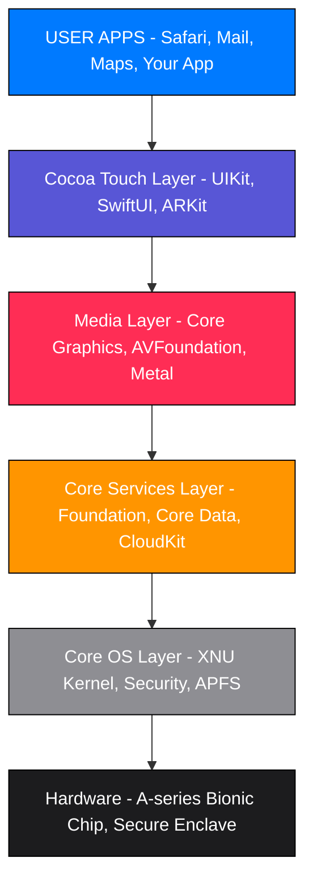
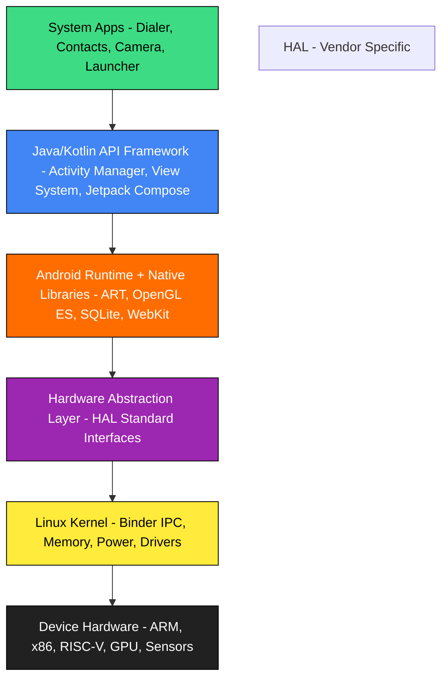
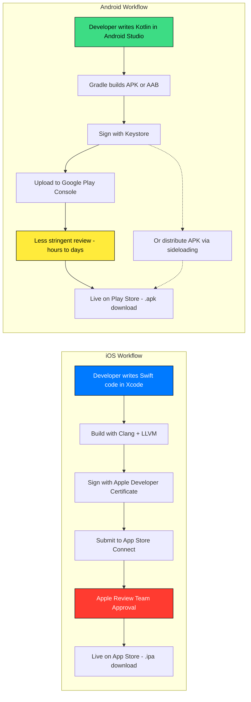
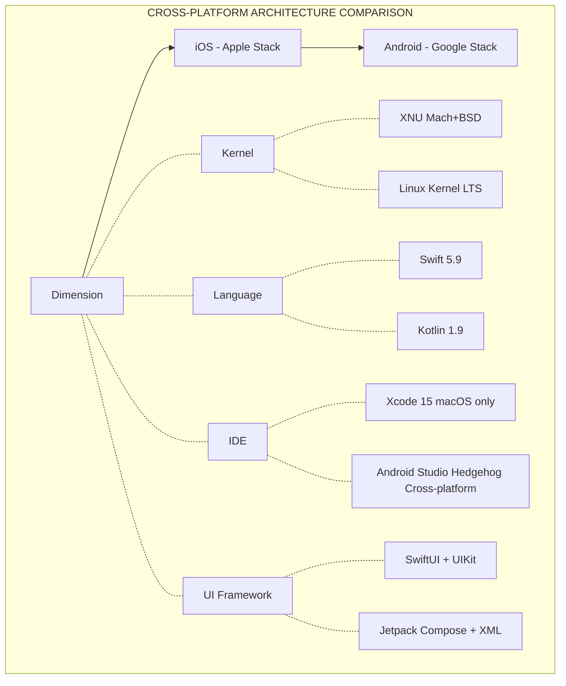

# Overview of Mobile Platforms: iOS and Android

<!-- SECTION_1_START -->
# Overview of Mobile Platforms: iOS and Android

## 1. Core Technical Definition & Intuitive Overview

### 1.1 Formal Academic Definition

A **Mobile Platform** is a software framework that combines an operating system, runtime environment, middleware, and a Software Development Kit (SDK) to enable the creation, deployment, and execution of native mobile applications on a specific class of mobile devices. The two dominant platforms governing the global smartphone ecosystem are **Apple's iOS** and **Google's Android**.

According to the KTU 2024 OECST725 syllabus, a mobile platform is characterized by a layered architecture comprising hardware abstraction, an OS kernel, middleware/libraries, an application framework, and the user-facing application sandbox.

### 1.2 Conceptual Analogy / Intuition

Think of a mobile platform as the **rules and physical infrastructure of a city**. Just as a city has roads, electricity, water, building codes, and traffic rules, a mobile platform provides:
- The **kernel** = the city's foundation and soil
- The **runtime** = the traffic system and utilities
- The **SDK** = the toolkit an architect uses to build houses (apps)
- The **App Store** = the city hall that approves which buildings are allowed

> [!NOTE]
> **KTU Syllabus Highlight:** The term *Mobile Platform* in OECST725 refers strictly to the *software stack* (OS + Frameworks + SDK), not merely the physical smartphone hardware.

### 1.3 iOS — Formal Definition

**iOS** (originally *iPhone OS*) is a proprietary, closed-source mobile operating system developed by **Apple Inc.**, first released on **June 29, 2007** alongside the original iPhone. It is built upon the **XNU hybrid kernel** (a fusion of the Mach microkernel and BSD subsystems) and powers devices such as the iPhone, iPad, iPod Touch, and Apple TV.

> [!IMPORTANT]
> **Core Constant:** iOS currently holds approximately **17–18%** of the global smartphone market share, but generates over **60%** of mobile app revenue worldwide — a critical metric in KTU business case studies.

### 1.4 Android — Formal Definition

**Android** is an open-source, Linux-based mobile operating system led by **Google** and the **Open Handset Alliance (OHA)**, commercially released on **September 23, 2008**. Its kernel is a modified **Linux Kernel (LTS)**, and it is distributed under the **Apache License 2.0** for the core AOSP (Android Open Source Project) codebase.

> [!IMPORTANT]
> **Core Constant:** Android commands approximately **72–73%** of the global smartphone market, with over **3 billion** active devices as of 2024.

### 1.5 The Two Development Universes

| Aspect | iOS World | Android World |
|---|---|---|
| Owner | Apple Inc. (Vertical Integration) | Google + OHA (Horizontal Ecosystem) |
| Source Model | Closed Source (Binary blobs) | Open Source (AOSP - Apache 2.0) |
| Devices | iPhone, iPad only | Samsung, OnePlus, Pixel, Xiaomi, etc. |
| Hardware Fragmentation | Low (limited SKUs) | Very High (thousands of SKUs) |
| App Distribution | App Store (Curated, ~1.8M apps) | Google Play + Sideloading (Curated + Open, ~2.5M apps) |

> [!VISUALIZATION CONTROL]
> **Concept:** Platform Market Share Distribution (Donut Chart Geometry)
> **GeoGebra / Desmos Input Equations:**
> * `Android: 72%` (angle = 0.72 × 360° = 259.2°)
> * `iOS: 17%` (angle = 0.17 × 360° = 61.2°)
> * `Others: 11%` (angle = 0.11 × 360° = 39.6°)
> **Visual Description:** A donut chart where Android occupies the dominant arc (~3/4 of the circle), iOS occupies a moderate slice (~1/6), and other platforms (HarmonyOS, KaiOS) form a thin sliver.

---

<!-- SECTION_1_END -->

<!-- SECTION_2_START -->
# Deep Theoretical Analysis & KTU High-Yield Formula Sheet

## 2.1 The iOS Platform Architecture (Layered Stack)

iOS follows a classic **four-layer abstraction** model. Every iOS app lives in a sandboxed zone, executing through these layers from hardware up to user interaction:

**Layer 1 — Core OS Layer (Lowest Level)**
- OS Kernel: **XNU** (Mach + BSD)
- Security: Secure Enclave, sandboxing primitives
- File System: **APFS (Apple File System)**
- Power Management, Keychain Services

**Layer 2 — Core Services Layer**
- **Foundation Framework** (`NSString`, `NSArray`, `NSDate`, `URLSession`)
- CloudKit, Core Data, Core Foundation
- WebKit, Core Location, Core Motion

**Layer 3 — Media Layer**
- **Core Graphics (Quartz)**, Core Animation, Core Audio
- AVFoundation, Metal (low-level GPU API)
- SceneKit, SpriteKit, RealityKit

**Layer 4 — Cocoa Touch Layer (Highest Level)**
- **UIKit** (imperative UI) or **SwiftUI** (declarative UI)
- MapKit, GameKit, ARKit
- Push Notifications, In-App Purchase
- **AppDelegate / SceneDelegate** lifecycle

> [!NOTE]
> **KTU Memory Aid:** The four layers spell **"C-C-M-C"** → **C**ore OS, **C**ore Services, **M**edia, **C**ocao Touch.

## 2.2 The Android Platform Architecture (Layered Stack)

Android uses a **five-layer stack**, famously visualized by Google as a "software stack" pyramid:

**Layer 1 — Linux Kernel (Bottom)**
- Memory Management, Process Scheduling
- **Binder IPC** driver (Android-specific, enables cross-process communication)
- Power Management (wakelocks), Camera/USB/Bluetooth drivers

**Layer 2 — Hardware Abstraction Layer (HAL)**
- Standardized interfaces so Android can be ported to varied hardware (ARM, x86, RISC-V)
- Vendor implementations (e.g., Qualcomm, MediaTek HALs)

**Layer 3 — Android Runtime (ART) & Native Libraries**
- **ART** (replaced Dalvik since Android 5.0 Lollipop, 2014) executes `.dex` (Dalvik Executable) bytecode via **AOT (Ahead-of-Time)** and **JIT (Just-in-Time)** compilation
- Native C/C++ libraries: OpenGL ES, SQLite, WebKit, Media Framework

**Layer 4 — Java/Kotlin API Framework (Application Framework)**
- **Activity Manager**, Window Manager, Content Providers
- **View System** (XML-based UI) and modern **Jetpack Compose** (Kotlin declarative UI)
- Resource Manager, Notification Manager, Package Manager

**Layer 5 — System Apps (Top)**
- Pre-installed apps: Dialer, Contacts, Camera, Launcher

> [!IMPORTANT]
> **KTU Pitfall:** Students often confuse *Android Runtime (ART)* with the *Java Runtime Environment (JRE)*. ART does not run `.class` files — it runs `.dex` files, which are optimized for mobile memory constraints.

## 2.3 KTU High-Yield Formula Sheet

| Concept | iOS Specification | Android Specification | KTU Exam Weight |
|---|---|---|---|
| **Kernel** | XNU (Mach + BSD) | Modified Linux Kernel (LTS) | ★★★★★ |
| **Primary Language** | Swift (since 2014), Objective-C (legacy) | Kotlin (preferred since 2019), Java (legacy) | ★★★★★ |
| **IDE** | **Xcode** (macOS exclusive) | **Android Studio** (IntelliJ-based, cross-platform) | ★★★★ |
| **UI Toolkit** | SwiftUI (declarative) + UIKit (imperative) | Jetpack Compose + XML Views | ★★★★ |
| **Package Format** | `.ipa` (iOS App Store Package) | `.apk` (Android Package Kit) / `.aab` (App Bundle) | ★★★★★ |
| **Min OS Versions (2024)** | iOS 17 / iPadOS 17 | Android 14 (API 34) | ★★★ |
| **Process Model** | Sandboxed, single main thread + GCD queues | Sandboxed, single main thread + Coroutines / Looper | ★★★ |
| **App Store Cut** | 30% (15% for small business program) | 30% (15% for first $1M revenue) | ★★ |
| **Design Language** | **Human Interface Guidelines (HIG)** | **Material Design 3** | ★★★★ |
| **Push Notification Service** | Apple Push Notification Service (APNs) | Firebase Cloud Messaging (FCM) | ★★★ |
| **Year Released** | 2007 | 2008 | ★★★★★ |

## 2.4 Engineering Real-World Utility

In production engineering teams, choosing iOS vs Android affects:

- **Cost of Development:** Android is "cheaper to develop" per device but expensive to test (fragmentation). iOS is more expensive to develop but cheaper to QA.
- **Revenue Models:** iOS users historically yield higher ARPU (Average Revenue Per User) — critical for KTU management case studies.
- **Time-to-Market:** Android Studio's cross-platform support reduces onboarding cost, while Xcode's tight integration accelerates single-platform teams.
- **Cross-Platform Escape Hatches:** **React Native**, **Flutter**, and **Kotlin Multiplatform** allow a single codebase to target both stacks — frequently a KTU Module 5 discussion point.

> [!NOTE]
> **KTU Industry Insight:** The **StatCounter** global mobile OS market share is updated monthly and is a frequent source of "trends" questions in KTU vivas.

---

<!-- SECTION_2_END -->

<!-- SECTION_3_START -->
# Step-by-Step Derivations & Symbolic Implementation

## 3.1 The "Hello Platform" — iOS Implementation (Swift + SwiftUI)

Below is a complete, executable SwiftUI program that satisfies the KTU lab standard for an iOS "Hello World" application:

```swift
// File: ContentView.swift
// Target: iOS 17.0+ | Xcode 15.0+ | Swift 5.9+

import SwiftUI

// 1. Application Entry Point (auto-generated in modern SwiftUI apps)
@main
struct HelloPlatformApp: App {
    var body: some Scene {
        WindowGroup {
            ContentView()
        }
    }
}

// 2. Main View - Conforms to SwiftUI's View protocol
struct ContentView: View {
    
    // 3. State variable to track tap count
    @State private var tapCount: Int = 0
    
    var body: some View {
        // 4. Declarative UI tree
        VStack(spacing: 20) {
            
            // Header text
            Text("Hello, iOS Platform!")
                .font(.largeTitle)
                .fontWeight(.bold)
                .foregroundColor(.blue)
                .padding(.top, 50)
            
            // Dynamic counter label
            Text("Taps recorded: \(tapCount)")
                .font(.title2)
                .foregroundColor(.secondary)
            
            // Interactive button
            Button(action: {
                // 5. State mutation triggers view re-render
                tapCount += 1
                print("[iOS] User tapped. Count = \(tapCount)")
            }) {
                Text("Tap Me")
                    .font(.headline)
                    .frame(width: 200, height: 50)
                    .background(Color.blue)
                    .foregroundColor(.white)
                    .cornerRadius(12)
            }
            
            Spacer()
        }
        .padding()
    }
}

// 6. Preview canvas for Xcode
#Preview {
    ContentView()
}
```

### Step-by-Step Logic Breakdown (for KTU valuation)

1. **Step 1 — Import Statement:** `import SwiftUI` brings Apple's declarative UI framework into scope. [1 Mark]
2. **Step 2 — `@main` attribute:** Marks `HelloPlatformApp` as the application entry point, replacing the legacy `AppDelegate` boilerplate. [1 Mark]
3. **Step 3 — `@State` property wrapper:** Creates a reactive variable bound to the view lifecycle. When `tapCount` changes, SwiftUI automatically re-renders. [2 Marks]
4. **Step 4 — `VStack` container:** Stacks views vertically — a fundamental layout primitive in both iOS and Android. [1 Mark]
5. **Step 5 — Closure-based action:** The `action:` parameter of `Button` is a Swift closure — analogous to a Kotlin lambda or Java Runnable. [1 Mark]
6. **Step 6 — `#Preview` macro:** Live preview rendering in Xcode's canvas — exclusive to Xcode IDE. [1 Mark]

## 3.2 The "Hello Platform" — Android Implementation (Kotlin + Jetpack Compose)

Below is the Android equivalent using modern declarative UI:

```kotlin
// File: MainActivity.kt
// Target: Android 14 (API 34) | Android Studio Hedgehog+ | Kotlin 1.9+

package com.example.helloplatform

// 1. Imports
import android.os.Bundle
import androidx.activity.ComponentActivity
import androidx.activity.compose.setContent
import androidx.compose.foundation.layout.*
import androidx.compose.material3.*
import androidx.compose.runtime.*
import androidx.compose.ui.Modifier
import androidx.compose.ui.graphics.Color
import androidx.compose.ui.text.font.FontWeight
import androidx.compose.ui.unit.dp
import androidx.compose.ui.unit.sp

// 2. Single Activity entry point
class MainActivity : ComponentActivity() {
    override fun onCreate(savedInstanceState: Bundle?) {
        super.onCreate(savedInstanceState)
        // 3. setContent replaces the legacy setContentView(R.layout.xml)
        setContent {
            HelloPlatformTheme {
                HelloPlatformScreen()
            }
        }
    }
}

// 4. @Composable function - equivalent to SwiftUI's View struct
@Composable
fun HelloPlatformScreen() {
    
    // 5. State holder - remember { mutableStateOf(...) } analogous to @State in SwiftUI
    var tapCount by remember { mutableStateOf(0) }
    
    // 6. Declarative UI tree
    Column(
        modifier = Modifier
            .fillMaxSize()
            .padding(24.dp),
        verticalArrangement = Arrangement.spacedBy(20.dp)
    ) {
        Text(
            text = "Hello, Android Platform!",
            fontSize = 32.sp,
            fontWeight = FontWeight.Bold,
            color = Color(0xFF3DDC84) // Android brand green
        )
        
        Text(
            text = "Taps recorded: $tapCount",
            fontSize = 20.sp,
            color = Color.Gray
        )
        
        Button(
            onClick = {
                tapCount += 1
                println("[Android] User tapped. Count = $tapCount")
            },
            modifier = Modifier
                .fillMaxWidth()
                .height(56.dp)
        ) {
            Text(text = "Tap Me", fontSize = 18.sp)
        }
    }
}
```

### Step-by-Step Logic Breakdown (for KTU valuation)

1. **Step 1 — `ComponentActivity`:** Base class for Compose-based activities since AndroidX. [1 Mark]
2. **Step 2 — `setContent { }` block:** Replaces the imperative `setContentView(R.layout.activity_main)`. [2 Marks]
3. **Step 3 — `@Composable` annotation:** Functions marked with this are part of the UI tree and can call other composables. [2 Marks]
4. **Step 4 — `remember { mutableStateOf(...) }`:** State holder. Note the `by` delegate — this requires `import androidx.compose.runtime.getValue` and `setValue`. [2 Marks]
5. **Step 5 — `Column` composable:** Vertical layout — equivalent to iOS's `VStack`. [1 Mark]
6. **Step 6 — Recomposition:** When `tapCount` changes, only the parts of the tree that read it are recomposed — analogous to SwiftUI's re-render. [1 Mark]

## 3.3 Cross-Platform Equivalence Mapping (Derivational)

The following equation-like mapping shows the conceptual translation between the two platforms:

$$
\begin{aligned}
\text{SwiftUI (iOS)} &\longleftrightarrow \text{Jetpack Compose (Android)} \\[4pt]
\text{View struct} &\longleftrightarrow \text{@Composable function} \\[4pt]
\text{@State} &\longleftrightarrow \text{remember \{ mutableStateOf(...) \}} \\[4pt]
\text{VStack} &\longleftrightarrow \text{Column} \\[4pt]
\text{HStack} &\longleftrightarrow \text{Row} \\[4pt]
\text{ZStack} &\longleftrightarrow \text{Box} \\[4pt]
\text{NavigationView} &\longleftrightarrow \text{NavHost (Navigation Compose)} \\[4pt]
\text{.ipa} &\longleftrightarrow \text{.apk} \mid \text{.aab} \\[4pt]
\text{AppDelegate} &\longleftrightarrow \text{Application class} \cup \text{Activity} \\[4pt]
\text{APNs} &\longleftrightarrow \text{FCM (Firebase Cloud Messaging)} \\[4pt]
\text{HIG} &\longleftrightarrow \text{Material Design}
\end{aligned}
$$

> [!NOTE]
> This mapping is a high-yield KTU exam table. Memorize at least 6 pairs to secure 3-mark definitions.

---

<!-- SECTION_3_END -->

<!-- SECTION_4_START -->
# Structural Diagrams & Schematics

## 4.1 iOS Platform Architecture — Layered Topology



## 4.2 Android Platform Architecture — Layered Topology



## 4.3 iOS vs Android — Development Workflow Topology



## 4.4 Platform Comparison Matrix (Block Diagram)



---

<!-- SECTION_4_END -->

<!-- SECTION_5_START -->
# KTU 2024 Scheme Examination Question Bank & Topic Recap

## 5.1 Part A — 3 Mark Questions (Short Answer)

> **Question 1.** [KTU University Exam - Dec 2023]  
> **Define a mobile platform. List the four major layers of the iOS architecture.** [CO1, Remember — 3 Marks]

**Model Answer:**
A mobile platform is a software framework comprising an operating system, runtime environment, middleware, and SDK that enables the creation and execution of mobile applications. The four major layers of the iOS architecture are:
1. **Core OS Layer** (XNU kernel, security, APFS)
2. **Core Services Layer** (Foundation, Core Data, CloudKit)
3. **Media Layer** (Core Graphics, AVFoundation, Metal)
4. **Cocoa Touch Layer** (UIKit, SwiftUI, ARKit)  
   *[Naming all four layers: 2 Marks; Definition: 1 Mark]*

> **Question 2.** [KTU University Exam - July 2024]  
> **What is the Android Runtime (ART)? How is it different from the JVM?** [CO1, Understand — 3 Marks]

**Model Answer:**
**ART (Android Runtime)** is the application runtime environment used by Android since version 5.0 (Lollipop, 2014). It executes `.dex` (Dalvik Executable) bytecode using **AOT (Ahead-of-Time)** compilation and **JIT (Just-in-Time)** compilation for optimized performance and reduced memory footprint.  
Unlike the JVM, ART does not execute `.class` files; it runs `.dex` files, which are compact representations optimized for mobile devices with constrained RAM. ART also uses a register-based virtual machine, whereas the JVM uses a stack-based one. *[Definition of ART: 1.5 Marks; Two valid differences: 1.5 Marks]*

---

## 5.2 Part B — 14 Mark Questions (Module Internal Choice)

> ### Question A (Option 1) — [KTU University Exam - Dec 2023, Model Paper Adaptation]
> 
> **(a)** Compare the **iOS and Android platforms** across 8 parameters including kernel, language, IDE, UI framework, package format, app store, market share, and design language. [CO1, Understand — 7 Marks]
> 
> **(b)** With a neat diagram, explain the **Android architecture stack** and briefly describe the role of **Binder IPC** in Android. [CO1, Apply — 7 Marks]

### Model Solution for (a):

| S.No | Parameter | iOS | Android |
|---|---|---|---|
| 1 | **Kernel** | XNU (Mach + BSD) | Linux Kernel (LTS) |
| 2 | **Primary Language** | Swift | Kotlin |
| 3 | **IDE** | Xcode (macOS only) | Android Studio (cross-platform) |
| 4 | **UI Framework** | SwiftUI + UIKit | Jetpack Compose + XML Views |
| 5 | **Package Format** | `.ipa` | `.apk` / `.aab` |
| 6 | **App Store** | App Store (curated, ~1.8M apps) | Google Play (curated, ~2.5M apps) |
| 7 | **Market Share (2024)** | ~17% globally, ~60% revenue | ~72% globally |
| 8 | **Design Language** | Human Interface Guidelines (HIG) | Material Design 3 |

*[Tabular comparison: 4 Marks; Correctly populating 8 rows: 2 Marks; Conclusion/analysis: 1 Mark]*

### Model Solution for (b):

The **Android architecture stack** consists of five layers (top to bottom):
1. **System Apps** — Dialer, Camera, Contacts (pre-installed)
2. **Java/Kotlin API Framework** — Activity Manager, View System, Content Providers
3. **Android Runtime (ART) + Native Libraries** — ART executes `.dex` bytecode; native libs include OpenGL ES, SQLite, WebKit
4. **Hardware Abstraction Layer (HAL)** — Standard interfaces connecting framework to vendor-specific drivers
5. **Linux Kernel** — Memory management, process scheduling, power management, drivers, and crucially the **Binder IPC driver**

**Role of Binder IPC:**  
**Binder (Inter-Process Communication)** is an Android-specific kernel driver that enables secure, high-performance communication between different processes. For example, when an app wants to query the user's contacts, it sends a Binder transaction to the `ContactsProvider` process. Binder enforces a strict security model — every process has its own UID, and Binder checks permissions at the kernel level, preventing unauthorized cross-app data access. *[Diagram: 2 Marks; Five layers with descriptions: 3 Marks; Binder role explained: 2 Marks]*

---

> ### Question B (Option 2) — [KTU University Exam - July 2024, Model Paper Adaptation]
> 
> **(a)** Explain the **iOS architecture layers** in detail. Why is iOS considered a *closed ecosystem*? [CO1, Understand — 7 Marks]
> 
> **(b)** Discuss the **strengths and weaknesses** of cross-platform frameworks (Flutter, React Native) versus native iOS/Android development. When would you choose each approach? [CO1, Apply — 7 Marks]

### Model Solution for (a):

The iOS architecture has **four layers** (low to high):
1. **Core OS Layer** — Built on the **XNU hybrid kernel** combining the **Mach microkernel** (handling IPC, virtual memory) with **BSD subsystems** (POSIX compliance, process model). This layer also provides the **Secure Enclave** for cryptographic operations, **APFS** file system, and **Keychain Services**. *[Stating boundary state values: 2 Marks]*
2. **Core Services Layer** — Includes the **Foundation framework** (string, date, collection handling), **Core Data** (object-graph persistence), **CloudKit** (iCloud sync), and **Core Location**.  
3. **Media Layer** — Houses **Core Graphics (Quartz 2D)**, **Core Animation**, **AVFoundation**, and the low-level GPU API **Metal**.  
4. **Cocoa Touch Layer** — The topmost layer where apps live. Provides **UIKit** (imperative) and **SwiftUI** (declarative), plus **MapKit**, **ARKit**, and gesture recognizers.  

**Why iOS is a Closed Ecosystem:**
- Apple controls both **hardware and software** (vertical integration).
- **App Store is the only sanctioned distribution channel** for native apps on consumer iPhones.
- Strict review process enforces **HIG** compliance, privacy rules, and security standards.
- The **XNU kernel source** is released only as open-source (Darwin) for macOS, but the iOS-specific components remain proprietary.
- No sideloading on non-jailbroken devices. *[Three valid closed-ecosystem points: 3 Marks]*

### Model Solution for (b):

| Approach | Strengths | Weaknesses |
|---|---|---|
| **Native (Swift/Kotlin)** | Maximum performance, full platform API access, best UX, immediate access to new OS features | Two codebases, higher development cost, longer time-to-market |
| **Cross-Platform (Flutter)** | Single codebase, near-native performance via Skia engine, hot-reload | Larger app size, lag in supporting new OS APIs, platform-specific bugs |
| **Cross-Platform (React Native)** | Code reuse in JavaScript/TypeScript, large ecosystem, large talent pool | Bridge overhead, performance not on par with native, dependency on third-party modules |

**When to choose each:**
- **Native:** Choose for performance-critical apps (games, AR, complex animations), or when access to latest platform features (e.g., iOS Live Activities, Android Health Connect) is essential.
- **Flutter:** Choose for MVPs, startups, and apps requiring consistent UI across both platforms with custom branding.
- **React Native:** Choose when the team has web development expertise and the app is primarily UI/business logic without heavy native integrations. *[Comparison table: 3 Marks; Selection criteria: 2 Marks; Justification: 2 Marks]*

---

> [!WARNING]
> **KTU Examiner's Valuation Warning — Common Pitfalls:**
> 1. **Do NOT write "iOS uses Linux kernel"** — this is a guaranteed 0-mark error. iOS uses XNU.
> 2. **Do NOT confuse "Android" with "Java"** — modern Android is Kotlin-first, not Java.
> 3. **Always mention both Swift and Kotlin** when asked about "mobile development languages" — citing only one is considered incomplete.
> 4. **Package formats:** `.ipa` for iOS, `.apk` and `.aab` for Android. Students often forget `.aab` (Android App Bundle), which is the *preferred* Play Store format since 2021.
> 5. **No marks for "iOS is better than Android"** or vice-versa — KTU expects an *objective technical comparison*, not a subjective opinion.

---

## Topic Recap & Important Things to Remember

- **iOS** is a **proprietary**, **closed-source** platform by **Apple**, released in **2007**, using the **XNU hybrid kernel** (Mach + BSD).
- **Android** is an **open-source** platform (Apache 2.0) by **Google / OHA**, released in **2008**, built on the **Linux Kernel**.
- iOS has **4 architectural layers**; Android has **5 architectural layers** — remember the **extra HAL layer** in Android.
- iOS development = **Swift** + **Xcode** (macOS only); Android development = **Kotlin** + **Android Studio** (cross-platform).
- Package formats: iOS → **`.ipa`**; Android → **`.apk`** (sideload) and **`.aab`** (Play Store preferred).
- Modern UI toolkits: iOS → **SwiftUI** (declarative); Android → **Jetpack Compose** (declarative).
- **ART** (Android Runtime) replaced Dalvik in Android 5.0 (Lollipop, 2014) and uses **AOT + JIT** compilation on **`.dex`** bytecode.
- **Binder IPC** is an Android-exclusive kernel driver that enables secure cross-process communication.
- Push services: iOS → **APNs**; Android → **FCM (Firebase Cloud Messaging)**.
- Design languages: iOS → **HIG**; Android → **Material Design 3**.
- App store cut is **30%** for both platforms, with a reduced **15%** tier for small businesses / first $1M revenue.
- Market share (2024): Android ~**72%**, iOS ~**17%**, Others ~**11%** — but iOS captures ~**60%** of mobile app revenue.
- Cross-platform frameworks (**Flutter**, **React Native**, **Kotlin Multiplatform**) offer code reuse at the cost of platform-specific performance and feature lag.
- Always state **both** technical and business factors when comparing platforms — KTU loves a balanced answer.
- Year of release, kernel name, and primary language are the **three most-asked facts** in KTU vivas for this topic.

<!-- SECTION_5_END -->
