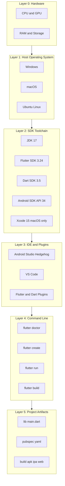
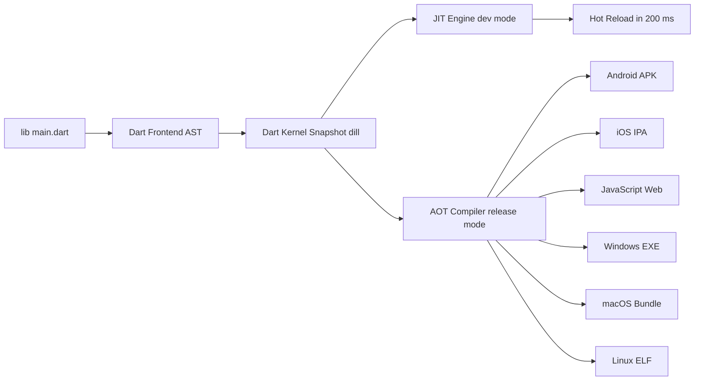
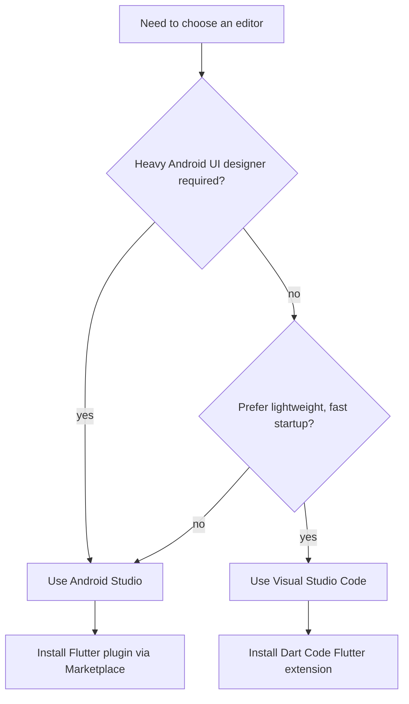

# Setting Up the Flutter Development Environment*

<!-- SECTION_1_START -->

# Setting Up the Flutter Development Environment

## 1.1 Formal Academic Definition

The **Flutter Development Environment** is an integrated, cross-platform toolchain comprising the **Flutter SDK**, the **Dart SDK**, an **IDE/Editor** (Android Studio, IntelliJ IDEA, or Visual Studio Code), platform-specific emulators or physical devices, and a configured set of **environment variables** that together allow a developer to author, debug, build, and deploy natively compiled applications for **Android**, **iOS**, **Web**, **Windows**, **macOS**, and **Linux** from a single Dart codebase.

> [!IMPORTANT]
> **KTU 2024 Syllabus Definition (OECST725 – Module 1):**
> Setting up the Flutter development environment involves installing the Flutter SDK, configuring the Dart toolchain, integrating an IDE with the Flutter and Dart plugins, installing the Android SDK (with Android Studio) for Android targets, and verifying the toolchain using the `flutter doctor` diagnostic command.

## 1.2 Conceptual Analogy / Intuition

Think of the Flutter development environment as **a fully equipped professional kitchen**:

| Kitchen Component | Flutter Equivalent | Purpose |
|---|---|---|
| Recipe Book (raw ingredients + techniques) | Dart Programming Language | The language you "cook" with |
| Master Chef (head cook) | Flutter SDK | Manages the cooking process and final plating |
| Cooking Range / Oven | Dart Compiler & VM | Executes and converts your recipe into food |
| Serving Plates & Cutlery | Widgets (Material / Cupertino) | The actual UI the user sees and touches |
| Dining Hall | Target Platform (Android / iOS / Web) | Where the finished dish is served |
| Kitchen Supervisor | `flutter doctor` | Inspects the kitchen and reports missing tools |

Once every "appliance" is installed, the kitchen is ready to cook **one recipe (one codebase)** and serve it across many **dining halls (multiple platforms)** without rewriting the recipe.

> [!NOTE]
> **Key Insight:** A single Dart codebase produces multiple platform-specific binaries because Flutter ships its own rendering engine (Skia) rather than relying on the platform's native UI components.

## 1.3 Required Tools, Standard Metrics, and Versions

The following table lists the **canonical toolchain** recommended by Google and aligned with the KTU 2024 OECST725 lab syllabus. **Bold** entries are the minimum mandatory components.

| Tool | Recommended Version (as of 2024-25) | Role |
|---|---|---|
| **Flutter SDK** | **3.24.x (Stable Channel)** | UI toolkit, build & tooling |
| **Dart SDK** | **3.5.x (bundled with Flutter)** | Programming language compiler |
| **Android Studio** | **Hedgehog 2023.1.1+** | Android SDK + Emulator host |
| **JDK (Java Development Kit)** | **JDK 17 (LTS)** | Required by Android Gradle Plugin |
| **Android SDK** | **API 34 (Android 14)** | Compile & run Android apps |
| **Android SDK Build-Tools** | 34.0.0 | Helper build utilities |
| **Android Emulator** | 34.x | Virtual Android device |
| **Visual Studio Code** | 1.85+ (lightweight alternative) | Code editor |
| **Xcode** | 15.x (macOS only) | iOS build & simulator |
| **CocoaPods** | 1.13+ (macOS only) | iOS dependency manager |
| **Chrome** | Latest Stable | Web target debugging |
| **Git** | 2.x | Version control + SDK source fetch |

> [!IMPORTANT]
> The **JDK 17** requirement is non-negotiable in the 2024 scheme. Older JDK 11 installations are deprecated and will trigger Gradle build errors on new Flutter projects.

## 1.4 GeoGebra / Desmos Integration

> [!VISUALIZATION CONTROL]
> **Concept:** Layered toolchain dependency map (visualised as concentric rings).
> **Conceptual Model:**
> * `R1 (Core) = {Flutter SDK, Dart SDK}`
> * `R2 (IDE) = {VS Code OR Android Studio}`
> * `R3 (Platform) = {Android SDK + Emulator OR Xcode + Simulator}`
> * `R4 (Output) = {APK, IPA, Web bundle, Windows EXE}`
> **Visual Description:** Picture four concentric circles. The innermost ring is the Dart/Flutter core that the IDE ring wraps. The Platform ring wraps the IDE, and the outermost ring represents the deployable output artifacts generated for each OS.

<!-- SECTION_1_END -->

<!-- SECTION_2_START -->

# 2. Deep Theoretical Analysis & KTU High-Yield Reference Sheet

## 2.1 Anatomy of the Flutter Toolchain

The toolchain is best understood as **five cooperating subsystems**. Each subsystem exposes a CLI (Command-Line Interface) that the `flutter` umbrella tool delegates to.

### 2.1.1 Flutter SDK
- A **batteries-included** SDK that bundles the Dart SDK, the Skia graphics engine, the `flutter` CLI, and hundreds of pre-built widgets.
- Lives by default in:
  * Windows: `C:\src\flutter`
  * macOS/Linux: `~/development/flutter`
- Adds a directory `flutter/bin` to your `PATH` so commands like `flutter create`, `flutter run`, and `flutter doctor` resolve globally.

### 2.1.2 Dart SDK
- Auto-installed as a sibling of the Flutter SDK. You do **not** install Dart separately when you use the Flutter distribution.
- Provides the **AOT (Ahead-of-Time)** compiler for release builds and the **JIT (Just-in-Time)** compiler for hot-reload during development.

### 2.1.3 Android Sub-Toolchain
- **Android Studio** acts as the *delivery vehicle* for:
  * The **Android SDK** (compilers, platform-tools, build-tools).
  * The **Android Emulator** (a hardware-accelerated virtual device).
  * **SDK Manager** (GUI + CLI) for installing API levels.
- **Android Virtual Device (AVD):** A configuration file (`config.ini`) plus a disk image that simulates a phone.
- Requires **Hardware Virtualization (VT-x / AMD-V)** enabled in the BIOS for the emulator to run at usable speed.

### 2.1.4 iOS Sub-Toolchain (macOS Hosts Only)
- **Xcode** supplies the iOS SDK, the iOS Simulator, and the signing infrastructure.
- **CocoaPods** manages Swift/Objective-C dependencies for Flutter plugins that have native iOS code.
- The **iOS Simulator** is an x86_64 / arm64 Mac process, not a real device, so no Apple Developer account is needed for development.

### 2.1.5 IDE Integration Layer
- **Android Studio / IntelliJ:** Install via *Settings → Plugins → Marketplace* the plugins **Flutter** (by Flutter team) and **Dart**.
- **VS Code:** Install the extensions **Flutter** (by Dart Code) and **Dart** (by Dart Code) from the Marketplace.
- Both extensions provide: syntax highlighting, **Hot Reload** trigger, **Dart DevTools** launcher, **Dart Analysis Server**, and the **"New Flutter Project"** wizard.

## 2.2 KTU Formula Sheet / Cheat Sheet

| Step | Command (Linux / macOS) | Command (Windows PowerShell) | Purpose |
|---|---|---|---|
| 1. Download SDK | `git clone https://github.com/flutter/flutter.git -b stable ~/development/flutter` | `git clone https://github.com/flutter/flutter.git -b stable C:\src\flutter` | Fetch the stable channel source |
| 2. Add to PATH | `export PATH="$HOME/development/flutter/bin:$PATH"` (in `~/.zshrc` or `~/.bashrc`) | `setx PATH "$env:PATH;C:\src\flutter\bin"` | Make `flutter` globally callable |
| 3. Pre-fetch artifacts | `flutter precache --android --ios --windows --macos --linux --web` | `flutter precache --android --windows --web` | Download engine binaries |
| 4. Verify toolchain | `flutter doctor -v` | `flutter doctor -v` | Diagnose missing components |
| 5. Accept licenses | `flutter doctor --android-licenses` (then `y` repeatedly) | `flutter doctor --android-licenses` (then `y` repeatedly) | Accept Android SDK licenses |
| 6. Enable web/desktop | `flutter config --enable-web --enable-macos-desktop --enable-linux-desktop` | `flutter config --enable-web --enable-windows-desktop` | Activate additional targets |
| 7. Check devices | `flutter devices` | `flutter devices` | List connected emulators and browsers |
| 8. Create project | `flutter create ktu_demo` | `flutter create ktu_demo` | Scaffold a starter app |
| 9. Run app | `flutter run -d chrome` or `flutter run -d emulator-5554` | `flutter run -d chrome` or `flutter run -d emulator-5554` | Launch with hot-reload |

> [!IMPORTANT]
> **Environment Variable Cheat Sheet (Windows):** `ANDROID_HOME = C:\Users\<you>\AppData\Local\Android\Sdk` and `JAVA_HOME = C:\Program Files\Java\jdk-17`. On macOS/Linux the same are configured in `~/.zshrc` or `~/.bashrc` as `export ANDROID_HOME=...` and `export JAVA_HOME=...`.

## 2.3 `flutter doctor` Output Categories

The diagnostic reports status in **five** colored buckets. The mnemonic **"P-A-D-I-C"** (Paddy-DI-C) helps recall them.

| Letter | Category | What It Checks |
|---|---|---|
| **P** | **P**latform Toolchain | Java, Android SDK, Xcode, Chrome, VS Code |
| **A** | **A**ndroid toolchain | Android Studio installation, SDK licenses, connected device |
| **D** | **D**art SDK | Bundled Dart version and analysis server |
| **I** | **I**DE integration | Installed Flutter/Dart plugins in supported editors |
| **C** | **C**onnected devices | Emulators, simulators, and physical USB-debugging devices |

A green check means the bucket is ready. A red cross means an action is required. A yellow exclamation means the tool works but a recommended companion is missing.

## 2.4 Real-World Engineering Utility

Setting up a **reproducible Flutter toolchain** is foundational in:

- **Startup MVPs:** One engineer can ship to iOS, Android, and Web from a single laptop.
- **Enterprise Mobile Teams:** CI/CD pipelines (Codemagic, GitHub Actions, Bitrise) reuse the same `flutter doctor` checks in Docker images such as `cirrusci/flutter:stable`.
- **Cross-Platform Plugin Authors:** Many open-source packages (e.g., `firebase_auth`, `camera`, `geolocator`) require the full Android + iOS toolchain to run their integration tests.
- **University Labs (KTU):** The 2024 OECST725 lab record explicitly evaluates the student's ability to scaffold, edit, hot-reload, and export a Flutter app, all of which are impossible without a correctly configured environment.

<!-- SECTION_2_END -->

<!-- SECTION_3_START -->

# 3. Step-by-Step Setup, Derivations, and Code Implementation

This section gives **three platform-specific zero-to-running walkthroughs** (Windows, macOS, Linux) plus a complete **automated verification script**. Every command is shown explicitly — no "similarly run…" shortcuts.

## 3.1 Windows 10 / 11 Walkthrough

### 3.1.1 Pre-requisites (PowerShell, run as Administrator)

```powershell
# 1. Install Chocolatey (skip if already present)
Set-ExecutionPolicy Bypass -Scope Process -Force; `
  [System.Net.ServicePointManager]::SecurityProtocol = [System.Net.ServicePointManager]::SecurityProtocol -bor 3072; `
  iex ((New-Object System.Net.WebClient).DownloadString('https://community.chocolatey.org/install.ps1'))

# 2. Install Git (required to clone the Flutter SDK) and OpenJDK 17
choco install git -y
choco install temurin17 -y

# 3. Refresh the shell so the new PATH is visible
refreshenv
```

### 3.1.2 Clone the Flutter Stable Channel

```powershell
# Choose a location without spaces and without a system-protected folder
cd C:\src

git clone https://github.com/flutter/flutter.git -b stable
```

### 3.1.3 Persist Flutter in the System PATH

```powershell
# Permanent PATH addition (re-open PowerShell afterwards)
[Environment]::SetEnvironmentVariable(
    "Path",
    [Environment]::GetEnvironmentVariable("Path","Machine") + ";C:\src\flutter\bin",
    "Machine"
)

# Quick session-only alternative
$env:Path += ";C:\src\flutter\bin"
```

### 3.1.4 Set the JDK and Android SDK Variables

```powershell
[Environment]::SetEnvironmentVariable("JAVA_HOME", "C:\Program Files\Eclipse Adoptium\jdk-17.0.10.7-hotspot", "Machine")
[Environment]::SetEnvironmentVariable("ANDROID_HOME", "$env:LOCALAPPDATA\Android\Sdk",                "Machine")
[Environment]::SetEnvironmentVariable("ANDROID_SDK_ROOT", $env:ANDROID_HOME,                          "Machine")
```

### 3.1.5 Install Android Studio + Android SDK

1. Download **Android Studio Hedgehog** (or newer) from `https://developer.android.com/studio`.
2. Launch the installer and choose **Standard** installation.
3. After the first launch, open **More Actions → SDK Manager** and tick:
   * Android 14.0 (API 34) — Platform
   * Android SDK Build-Tools 34.0.0
   * Android Emulator
   * Android SDK Platform-Tools
4. Open **More Actions → Virtual Device Manager** and create a Pixel 7 AVD with system image **API 34 (Google APIs)**.

### 3.1.6 Pre-cache Engine Artifacts

```powershell
flutter precache --android --windows --web --linux --macos
```

### 3.1.7 Accept Licenses and Verify

```powershell
flutter doctor --android-licenses    # type 'y' for every prompt
flutter doctor -v
```

A clean output will show only green checkmarks and a connected emulator (or browser).

## 3.2 macOS 13+ Walkthrough (Apple Silicon or Intel)

```bash
# 1. Install Homebrew (skip if present)
/bin/bash -c "$(curl -fsSL https://raw.githubusercontent.com/Homebrew/install/HEAD/install.sh)"

# 2. Install the development toolchain
brew install git
brew install --cask zulu@17          # JDK 17
brew install --cask android-studio
brew install cocoapods

# 3. Clone Flutter (Apple Silicon-friendly path)
mkdir -p ~/development
cd ~/development
git clone https://github.com/flutter/flutter.git -b stable

# 4. Make Flutter reachable from every shell
echo 'export PATH="$HOME/development/flutter/bin:$PATH"' >> ~/.zshrc
echo 'export JAVA_HOME=/Library/Java/JavaVirtualMachines/zulu-17.jdk/Contents/Home' >> ~/.zshrc
echo 'export ANDROID_HOME=$HOME/Library/Android/sdk'                                    >> ~/.zshrc
echo 'export PATH="$JAVA_HOME/bin:$ANDROID_HOME/platform-tools:$ANDROID_HOME/emulator:$PATH"' >> ~/.zshrc
source ~/.zshrc

# 5. Pre-cache for every Apple-relevant target
flutter precache --ios --android --macos --web

# 6. Install Xcode Command Line Tools and accept iOS licenses
xcode-select --install
sudo xcodebuild -license accept
pod setup

# 7. Final verification
flutter doctor -v
```

## 3.3 Ubuntu 22.04 / 24.04 LTS Walkthrough

```bash
# 1. Update the package database
sudo apt update && sudo apt upgrade -y

# 2. Install required system libraries
sudo apt install -y curl git unzip xz-utils zip libglu1-mesa openjdk-17-jdk wget

# 3. Clone Flutter
sudo mkdir -p /opt/flutter
sudo chown -R $USER:$USER /opt/flutter
cd /opt/flutter
git clone https://github.com/flutter/flutter.git -b stable

# 4. Make it globally available
echo 'export PATH="/opt/flutter/bin:$PATH"'                  >> ~/.bashrc
echo 'export JAVA_HOME=/usr/lib/jvm/java-17-openjdk-amd64'    >> ~/.bashrc
echo 'export ANDROID_HOME=$HOME/Android/Sdk'                  >> ~/.bashrc
echo 'export PATH="$JAVA_HOME/bin:$ANDROID_HOME/platform-tools:$ANDROID_HOME/emulator:$PATH"' >> ~/.bashrc
source ~/.bashrc

# 5. Install Android command-line tools
mkdir -p $ANDROID_HOME/cmdline-tools
cd $ANDROID_HOME/cmdline-tools
wget https://dl.google.com/android/repository/commandlinetools-linux-11076708_latest.zip
unzip commandlinetools-linux-11076708_latest.zip
mv cmdline-tools latest
rm commandlinetools-linux-11076708_latest.zip

# 6. Accept licenses and verify
yes | flutter doctor --android-licenses
flutter doctor -v
```

## 3.4 Automated Toolchain Verification Script (Python)

A self-contained Python 3.10+ script that cross-checks every dependency the KTU 2024 lab rubric expects. It can be dropped into any project as `verify_env.py`.

```python
#!/usr/bin/env python3
"""
verify_env.py
Cross-platform toolchain auditor for the KTU OECST725 (Mobile Application
Development, Flutter) Module 1 environment.
"""

from __future__ import annotations

import os
import platform
import shutil
import subprocess
import sys
from dataclasses import dataclass, field
from typing import List, Optional


@dataclass
class ToolReport:
    name: str
    present: bool
    version: str = "n/a"
    issues: List[str] = field(default_factory=list)


def _run(command: List[str]) -> Optional[str]:
    try:
        result = subprocess.run(
            command,
            capture_output=True,
            text=True,
            check=False,
            timeout=60,
        )
        return (result.stdout or "") + (result.stderr or "")
    except (FileNotFoundError, subprocess.TimeoutExpired, OSError):
        return None


def check_tool(name: str, version_arg: List[str], regex: str) -> ToolReport:
    if shutil.which(name) is None and name != "flutter":
        return ToolReport(name=name, present=False, issues=[f"{name} not found on PATH"])
    output = _run([name] + version_arg)
    if output is None:
        return ToolReport(name=name, present=False, issues=[f"{name} execution failed"])
    return ToolReport(name=name, present=True, version=output.strip().splitlines()[0])


def check_flutter_doctor() -> List[str]:
    output = _run(["flutter", "doctor"])
    if output is None:
        return ["flutter doctor could not be executed"]
    bad_lines = [
        line.strip()
        for line in output.splitlines()
        if any(marker in line for marker in ("[✗]", "[!]"))
    ]
    return bad_lines


def main() -> int:
    print(f"Host: {platform.system()} {platform.release()} ({platform.machine()})\n")

    tools: List[ToolReport] = [
        check_tool("flutter",  ["--version"],      "Flutter"),
        check_tool("dart",     ["--version"],      "Dart"),
        check_tool("git",      ["--version"],      "git"),
        check_tool("java",     ["-version"],       'openjdk|java version'),
        check_tool("adb",      ["--version"],      "Android Debug Bridge"),
    ]

    for tool in tools:
        status = "OK " if tool.present and not tool.issues else "FAIL"
        print(f"[{status}] {tool.name:<8} -> {tool.version}")
        for issue in tool.issues:
            print(f"        - {issue}")

    print("\n--- flutter doctor summary ---")
    warnings = check_flutter_doctor()
    if not warnings:
        print("All doctor checks passed.")
    else:
        for warning in warnings:
            print(f"WARN: {warning}")
        return 1
    return 0


if __name__ == "__main__":
    sys.exit(main())
```

**Run it with:**

```bash
python verify_env.py
```

A clean run prints `[OK ]` for every tool and ends with `All doctor checks passed.` Any red `[✗]` line in the doctor section is what a KTU examiner will mark down for.

## 3.5 First Flutter Project: `flutter create` Walkthrough

```bash
flutter create ktu_demo --platforms=android,ios,web --org com.ktu.student
cd ktu_demo
flutter pub get
flutter run -d chrome
```

Expected terminal output (truncated for readability):

```
Flutter run key commands:
r Hot reload       R Hot restart
q Quit

An Observatory debugger and profiler is available at: http://127.0.0.1:9101/
```

Pressing `r` after editing `lib/main.dart` triggers a **Hot Reload** in well under 200 ms — the productivity feature that justifies the entire Flutter setup.

<!-- SECTION_3_END -->

<!-- SECTION_4_START -->

# 4. Structural Diagrams & Schematics

## 4.1 Layered Flutter Toolchain Architecture

The diagram below shows the **runtime dependency layers** of a Flutter app, from the hardware up to the developer's `main.dart` file.



## 4.2 Build Pipeline Flow (Source to Artifact)



## 4.3 Decision Flow: Choosing a Host Editor



## 4.4 Device Targeting Topology

| Target Platform | Command Flag | Hardware Required |
|---|---|---|
| Android Emulator | `flutter run -d emulator-5554` | BIOS virtualization enabled |
| Physical Android | `flutter run -d <device-id>` | USB debugging + OEM unlock |
| iOS Simulator | `flutter run -d ios` | macOS + Xcode |
| Chrome (Web) | `flutter run -d chrome` | Chrome installed |
| Windows desktop | `flutter run -d windows` | Windows 10/11 |
| macOS desktop | `flutter run -d macos` | macOS only |
| Linux desktop | `flutter run -d linux` | Ubuntu 22.04+ |

<!-- SECTION_4_END -->

<!-- SECTION_5_START -->

# 5. KTU 2024 Scheme Examination Question Bank & Topic Recap

## 5.1 Part A — Short Answer Questions (3 Marks Each)

> **Q1. [KTU University Exam — July 2024 | CO1 | Remember]**
> List any **three** tools required to set up a Flutter development environment and state one purpose of each.

**Model Answer (3 Marks):**

1. **Flutter SDK** — provides the `flutter` CLI, the rendering engine, and pre-built widgets used to author and build cross-platform apps. *(1 Mark)*
2. **Dart SDK** (bundled with Flutter) — supplies the Dart compiler (JIT for development, AOT for release) and the package manager (`pub`). *(1 Mark)*
3. **Android Studio** with Flutter and Dart plugins — provides the Android SDK, an integrated emulator, and IDE features such as Hot Reload and Dart Analysis. *(1 Mark)*

> **Q2. [KTU University Exam — Dec 2023 | CO1 | Understand]**
> What is the purpose of the `flutter doctor` command? Mention any **two** issues it can report.

**Model Answer (3 Marks):**

- **Purpose:** `flutter doctor` is a diagnostic command that inspects the local development machine and reports whether every component of the Flutter toolchain is correctly installed, configured, and licensed. *(1 Mark)*
- **Issue 1 — Missing Android SDK:** If `ANDROID_HOME` is not set or the Android SDK is absent, doctor reports a red cross under the *Android toolchain* category. *(1 Mark)*
- **Issue 2 — Unaccepted Android licenses:** The user must run `flutter doctor --android-licenses` and accept each prompt; otherwise the Android bucket shows a yellow exclamation. *(1 Mark)*

---

## 5.2 Part B — Long Answer Questions (14 Marks Each, Internal Choice)

> ### Question A — [KTU University Exam — July 2024 | CO1 | Understand + Apply]

**(a)** Explain in detail the **step-by-step procedure to install and configure the Flutter SDK on a Windows 11 system**. Mention all environment variables that must be set. *(7 Marks)*

**(b)** Describe the **five categories** checked by `flutter doctor` and interpret a sample output that contains a red cross and a yellow exclamation. Propose the corrective steps. *(7 Marks)*

### Model Solution for Q-A

**Part (a) — Installation on Windows 11**

1. Install **Git for Windows** (required to clone the Flutter repository). *(0.5 Marks)*
2. Install **OpenJDK 17** (Temurin distribution) using the MSI installer. *(0.5 Marks)*
3. Choose a non-spaced path, e.g. `C:\src\`, and run `git clone https://github.com/flutter/flutter.git -b stable`. *(1 Mark)*
4. Add `C:\src\flutter\bin` to the **system PATH** via *System Properties → Environment Variables*. *(1 Mark)*
5. Set the following **environment variables** (Machine scope): *(2 Marks)*
   * `JAVA_HOME = C:\Program Files\Eclipse Adoptium\jdk-17.0.10.7-hotspot`
   * `ANDROID_HOME = C:\Users\<user>\AppData\Local\Android\Sdk`
   * `ANDROID_SDK_ROOT = C:\Users\<user>\AppData\Local\Android\Sdk`
6. Install **Android Studio Hedgehog** and from the SDK Manager install *Android 14.0 (API 34)*, *Build-Tools 34.0.0*, and *Android Emulator*. *(1 Mark)*
7. Accept Android licenses with `flutter doctor --android-licenses`. *(0.5 Marks)*
8. Verify the toolchain with `flutter doctor -v` and ensure a green tick against every category. *(0.5 Marks)*

**Part (b) — Interpreting `flutter doctor`**

The five categories, using the **P-A-D-I-C** mnemonic, are: *(2 Marks for enumeration)*

- **P — Platform Toolchain** (Java, Chrome, VS Code)
- **A — Android Toolchain** (Android SDK + device)
- **D — Dart SDK** (bundled Dart version)
- **I — IDE Integration** (Flutter/Dart plugin status)
- **C — Connected Devices** (emulator / physical device)

**Sample interpretation:** A red `[✗]` under *Android toolchain* indicates that the Android SDK is missing, `ANDROID_HOME` is unset, or the platform-tools directory has been deleted. *(1 Mark)*

**Corrective step:** Install the Android SDK via Android Studio, set `ANDROID_HOME` correctly, then re-run `flutter doctor`. *(1 Mark)*

A yellow `[!]` under *Connected devices* indicates that the toolchain is functional but no emulator is running and no USB-debugging device is attached. *(1 Mark)*

**Corrective step:** Open *Device Manager → Create Device → Pixel 7 API 34* and press the green play button; alternatively connect a phone with USB debugging enabled. *(1 Mark)*

**Final state:** After the corrective steps, a re-run of `flutter doctor` should show green ticks for every category, confirming the Flutter development environment is fully set up. *(1 Mark)*

> [!WARNING]
> **Common Pitfalls (Valuation Warning):**
> 1. Do **not** install Flutter under `C:\Program Files\`. The space and write-protection cause Gradle failures. *(−1 Mark)*
> 2. Forgetting to set `JAVA_HOME` causes `Unsupported class file major version 67` errors during Gradle build. *(−1 Mark)*
> 3. Running `flutter doctor` from PowerShell **without** restarting the terminal after editing PATH will display the *old* PATH and report a false error. *(−1 Mark)*

---

> ### Question B — [KTU University Exam — Dec 2023 | CO1 | Understand + Apply] *(Alternative to Question A)*

**(a)** Compare the **Android Studio** and **Visual Studio Code** IDEs for Flutter development. List the pros and cons of each. *(7 Marks)*

**(b)** Write the **complete set of commands** to (i) clone the Flutter SDK on Ubuntu 24.04, (ii) add it to PATH, (iii) install the Android command-line tools, and (iv) verify the toolchain. Show expected outputs where applicable. *(7 Marks)*

### Model Solution for Q-B

**Part (a) — Android Studio vs VS Code**

| Criterion | Android Studio | VS Code |
|---|---|---|
| **Flutter Plugin Origin** | Official Flutter team | Dart Code (third-party) |
| **UI Designer / Inspector** | Built-in *Flutter Inspector* with visual widget tree | Flutter Inspector available but lighter |
| **Android Emulator Integration** | First-class — AVD Manager embedded | Requires manual launch via terminal |
| **Startup Speed** | Heavy (≈ 4–6 GB RAM) | Light (≈ 350 MB RAM) |
| **IntelliJ Power Features** | Refactoring, debugging, profiling out of the box | Refactoring via Dart Analysis Server only |
| **Best Suited For** | Android-heavy projects, large teams | Quick edits, web/desktop Flutter, light laptops |

*Valuation:* Each correct comparison line = 1 Mark. *(7 Marks)*

**Part (b) — Ubuntu 24.04 Command Sequence**

(i) **Clone the SDK:** *(1 Mark)*

```bash
sudo apt update
sudo mkdir -p /opt/flutter
sudo chown -R $USER:$USER /opt/flutter
cd /opt/flutter
git clone https://github.com/flutter/flutter.git -b stable
```

(ii) **Add to PATH:** *(1 Mark)*

```bash
echo 'export PATH="/opt/flutter/bin:$PATH"' >> ~/.bashrc
source ~/.bashrc
```

(iii) **Install Android command-line tools:** *(2 Marks)*

```bash
export ANDROID_HOME=$HOME/Android/Sdk
mkdir -p $ANDROID_HOME/cmdline-tools
cd $ANDROID_HOME/cmdline-tools
wget https://dl.google.com/android/repository/commandlinetools-linux-11076708_latest.zip
unzip commandlinetools-linux-11076708_latest.zip
mv cmdline-tools latest
```

(iv) **Verify:** *(3 Marks)*

```bash
yes | flutter doctor --android-licenses
flutter doctor -v
```

**Expected `flutter doctor` snippet:**

```
[✓] Flutter (Channel stable, 3.24.x, on Ubuntu 24.04)
[✓] Android toolchain - develop for Android devices
[✓] Chrome - develop for the web
[!] Connected device
```

The yellow `[!]` for *Connected device* is acceptable when no emulator is running; it is resolved by launching an AVD. *(1 Mark for interpretation)*

> [!WARNING]
> **Common Pitfalls (Valuation Warning):**
> 1. Do **not** forget `chown -R $USER:$USER /opt/flutter`; otherwise `flutter` will refuse to update itself later. *(−1 Mark)*
> 2. The Android command-line tools directory **must** be renamed to `latest`; otherwise `sdkmanager` throws `Could not determine SDK root`. *(−1 Mark)*
> 3. Skipping `flutter precache` will lead to slow first builds and may fail on offline CI runners. *(−1 Mark)*

---

## 5.3 Topic Recap & Important Things to Remember

- The **Flutter SDK** is the single entry point; the **Dart SDK** is auto-bundled. Do not install Dart separately.
- Always install the SDK in a **path with no spaces**, no parentheses, and no system-protected folder.
- **JDK 17** is mandatory for the 2024 scheme; older JDK 11 is deprecated by AGP 8.x.
- Two environment variables are critical: **`JAVA_HOME`** and **`ANDROID_HOME`**. Windows also recognises `ANDROID_SDK_ROOT` as an alias.
- The IDE plugins are named exactly **"Flutter"** (by the Flutter team on Android Studio / by Dart Code on VS Code) and **"Dart"** (by JetBrains / by Dart Code). Installing only one of the two breaks Hot Reload.
- **`flutter doctor -v`** is the single source of truth for verifying a Flutter setup. Re-run it after every major change.
- `flutter precache` downloads the **engine artifacts** (Skia binaries) for all enabled platforms; the first run is slow but later runs become near-instant.
- The five doctor categories follow the mnemonic **P-A-D-I-C**: Platform, Android, Dart, IDE, Connected devices.
- `flutter create <project> --platforms=android,ios,web` is the **recommended scaffold** for KTU lab records because it keeps the project lean and reproducible.
- **Hot Reload** (`r`) is enabled in debug mode and propagates Dart-only changes in under 200 ms. Widget tree structural changes still require **Hot Restart** (`R`).
- A successful setup ends with `flutter doctor` showing green ticks and at least one entry under *Connected devices* — either `Chrome (web)`, `Linux (desktop)`, or `Android SDK built for <platform> (emulator-<id>)`.

<!-- SECTION_5_END -->
